# SciPubCrawl — Literature Mining Pipeline

  

Search → Scrape → Convert → Extract

SciPubCrawl is a script-first pipeline to search literature, download full texts, convert PDFs to Markdown, and extract structured data with an LLM-backed schema.

• Primary path: 🔎 Search → ⬇️ Scrape → 📝 Convert (Marker) → 🧠 Extract (LLM)


## Pipeline at a glance

```mermaid
%%{init: { 'theme': 'neutral', 'themeVariables': { 'primaryColor': '#1e293b', 'primaryBorderColor':'#334155', 'primaryTextColor':'#f1f5f9', 'fontFamily': 'Inter, system-ui, sans-serif' } } }%%
flowchart LR
  A[🔎 Search] --> B[⬇️ Scrape]

  %% Split artifacts produced by scraping
  B -->|PDF| P[📄 PDF]
  B -->|XML| X[🧩 XML]

  %% Only PDF goes to Convert
  P --> C[📝 Convert]
  C -->|Markdown| M[🧾 Markdown]

  %% Both XML and PDF feed into Extract (Markdown from Convert; PDFs can be used directly when suitable)
  M --> D[🧠 Extract]
  X --> D
  P --> D

  %% Final destination
  D --> DB[(🗄️ Database)]

  %% Info side node
  B -. unavailable .-> B2[(not_api_available.jsonl)]

  classDef node fill:#0f172a,stroke:#334155,color:#f1f5f9;
  class A,B,P,X,C,M,D,DB,B2 node;
```



## Table of contents

- Quickstart
- Search
- Scrape
- Convert (Marker)
- Extract (LLM-driven)
- Configuration files (examples)
- Requirements
- API keys and politeness
- Testing
- Troubleshooting

<details>
<summary><strong>Repository layout (click to expand)</strong></summary>

- `src/`
  - `search_crossref.py`, `search_europe_pmc.py`, `search_chemrxiv.py`: search utilities and regex filtering helpers
  - `scrape.py`: PDF/XML downloaders (Wiley/Elsevier/Unpaywall; Europe PMC full-text XML)
  - `convert_to_md.py`: Marker-based PDF → Markdown conversion
  - `extract_marker.py`: Config-driven LLM extraction with schema validation and prompt config
  - (internal test helper) `extract_markers.py`: heuristic extractor retained solely for test coverage
- `scripts/` (thin CLIs over the above modules)
  - `search_crossref.py`, `search_europe_pmc.py`, `search_chemrxiv.py`
  - `scrape.py`, `convert_to_md.py`, `extract_marker.py`
- `examples/lithium_metal_anode/`
  - `search/`: example params and search outputs
  - `scrape/`: downloaded files (PDF/XML)
  - `convert/`: Marker Markdown outputs
  - `extract/`: extraction configs and outputs

</details>


## Requirements
- Core: see `requirements.txt` (requests, bs4, lxml, pandas, numpy, click, crossrefapi, pytest)
- Optional by stage:
  - Convert: `marker-pdf` (Marker) if using the Python API; you may also use the Marker CLI
  - Extract (LLM): `pydantic>=2`, `litellm`, `instructor`, plus your model provider key (e.g., `OPENAI_API_KEY`)
  - Schema viz (optional): `erdantic`, `graphviz`
  - ChemRxiv scraping/query: `paperscraper`

## API keys and politeness
- Set via environment variables or a simple KEY=VALUE file and pass with `--api-keys`:
  - `WILEY_TDM_API_TOKEN`, `ELSEVIER_TDM_API_KEY`, `UNPAYWALL_EMAIL` (scraping)
  - `OPENAI_API_KEY` (LLM extraction via litellm)
- Crossref requests include a polite User-Agent (Etiquette). Provide `--mailto` and app info where relevant.

## Quickstart (full pipeline with examples)
1) Search (Crossref, yearly dump → filter)
<details><summary>Commands</summary>

```bash
python scripts/search_crossref.py cursor-yearly \
  --out-dir examples/lithium_metal_anode/search/crossref_dumps \
  --query "Lithium metal battery" --start-year 2018 --end-year 2019

python scripts/search_crossref.py filter \
  --params-file examples/lithium_metal_anode/search/crossref_params.json \
  --in-dir examples/lithium_metal_anode/search/crossref_dumps \
  --out-dir examples/lithium_metal_anode/search/crossref_results
```

</details>

2) ⬇️ Scrape PDFs (Crossref)
<details><summary>Commands</summary>

```bash
python scripts/scrape.py crossref \
  --dump examples/lithium_metal_anode/search/crossref_results \
  --out examples/lithium_metal_anode/scrape/crossref_pdf \
  --publishers wiley elsevier \
  --api-keys examples/lithium_metal_anode/scrape/api_keys.txt
```

</details>

3) 📝 Convert PDFs → Markdown (Marker)
<details><summary>Commands</summary>

```bash
python scripts/convert_to_md.py \
  --pdf-dir examples/lithium_metal_anode/scrape/crossref_pdf \
  --out examples/lithium_metal_anode/convert/crossref_md
```

</details>

4) 🧠 Extract (LLM) / visualize schema
<details><summary>Commands</summary>

```bash
python scripts/extract_marker.py \
  --params-file examples/lithium_metal_anode/extract/extract_params.json \
  --visualize-schema examples/lithium_metal_anode/extract/diagram.svg \
  --visualize-only

python scripts/extract_marker.py \
  --params-file examples/lithium_metal_anode/extract/extract_params.json
```

</details>

5) (Optional) Testing-only heuristic check
<details><summary>Command</summary>

```bash
python scripts/extract_markers.py \
  --md-root examples/lithium_metal_anode/convert/crossref_md \
  --out examples/lithium_metal_anode/extract/crossref_md_output
```

</details>


## 🔎 Search

Crossref
<details><summary>Commands</summary>

```bash
python scripts/search_crossref.py keywords \
  --params-file examples/lithium_metal_anode/search/crossref_params.json \
  --out examples/lithium_metal_anode/search/crossref_dumps/keywords.jsonl

python scripts/search_crossref.py cursor-yearly \
  --out-dir examples/lithium_metal_anode/search/crossref_dumps

python scripts/search_crossref.py filter \
  --params-file examples/lithium_metal_anode/search/crossref_params.json \
  --in-dir examples/lithium_metal_anode/search/crossref_dumps \
  --out-dir examples/lithium_metal_anode/search/crossref_results

python scripts/search_crossref.py filter \
  --params-file examples/lithium_metal_anode/search/crossref_params.json \
  --in examples/lithium_metal_anode/search/crossref_dumps/dumps_2019.jsonl \
  --out examples/lithium_metal_anode/search/crossref_results/filtered_2019.jsonl
```

</details>

### Europe PMC
<details><summary>Commands</summary>

```bash
python scripts/search_europe_pmc.py keywords \
  --params-file examples/lithium_metal_anode/search/europmc_params.json \
  --out examples/lithium_metal_anode/search/europmc_dumps/keywords.jsonl

python scripts/search_europe_pmc.py cursor-yearly \
  --out-dir examples/lithium_metal_anode/search/europmc_dumps

python scripts/search_europe_pmc.py filter \
  --params-file examples/lithium_metal_anode/search/europmc_params.json \
  --in-dir examples/lithium_metal_anode/search/europmc_dumps \
  --out-dir examples/lithium_metal_anode/search/europmc_results \
  --require-full-text
```

</details>

### ChemRxiv
<details><summary>Commands</summary>

```bash
python scripts/search_chemrxiv.py run \
  --params-file examples/lithium_metal_anode/search/chemrxiv_params.json

python scripts/search_chemrxiv.py scrape-monthly \
  --start-date 2018-01-01 \
  --dump-dir examples/lithium_metal_anode/search/chemrxiv_dumps

python scripts/search_chemrxiv.py query \
  --dump-dir examples/lithium_metal_anode/search/chemrxiv_dumps \
  --result-dir examples/lithium_metal_anode/search/chemrxiv_results \
  --params-file examples/lithium_metal_anode/search/chemrxiv_params.json
```

</details>


## ⬇️ Scrape

<details><summary>ChemRxiv PDFs (via paperscraper)</summary>

```bash
python scripts/scrape.py chemrxiv \
  --dump examples/lithium_metal_anode/search/chemrxiv_results \
  --out examples/lithium_metal_anode/scrape/chemrxiv_pdf \
  --key doi \
  --api-keys examples/lithium_metal_anode/scrape/api_keys.txt \
  --per-file-subdirs
```

</details>

<details><summary>Crossref PDFs (Wiley/Elsevier; others via Unpaywall)</summary>

```bash
python scripts/scrape.py crossref \
  --dump examples/lithium_metal_anode/search/crossref_results \
  --out examples/lithium_metal_anode/scrape/crossref_pdf \
  --publishers wiley elsevier \
  --api-keys examples/lithium_metal_anode/scrape/api_keys.txt
```

</details>

<details><summary>Europe PMC full-text XML by PMCID</summary>

```bash
python scripts/scrape.py europmc \
  --dump examples/lithium_metal_anode/search/europmc_results \
  --xml-out examples/lithium_metal_anode/scrape/europmc_xml
```

</details>

Notes
- Saved files are named by sanitized DOI/PMCID. A `not_api_available.jsonl` file is written if API-based PDFs can’t be retrieved; you may fetch those manually.
- Use `--sleep` to be polite for large batches.


## 📝 Convert (Marker)
<details><summary>Install & convert</summary>

```bash
python scripts/convert_to_md.py \
  --pdf-dir examples/lithium_metal_anode/scrape/crossref_pdf \
  --out examples/lithium_metal_anode/convert/crossref_md \
  --overwrite
```

</details>

Behavior
- Each `<name>.pdf` becomes `out/<name>/...` (Markdown + assets). Existing non-empty outputs are skipped unless `--overwrite`.
- You can reuse prior extractions via `--existing-outputs <folder1> <folder2>`.


## 🧠 Extract (LLM-driven)
Config file: `examples/lithium_metal_anode/extract/extract_params.json` controls schema, prompts, provider/model, and run settings.

<details><summary>Basic extract</summary>

```bash
python scripts/extract_marker.py --params-file examples/lithium_metal_anode/extract/extract_params.json
```

</details>

Key config fields
- `schema` (type=python): `module_path`, `root_model`, optional `root_container` (e.g., "List")
- `llm`: `provider`, `model`, `temperature`, `max_retries`, `timeout_s` (provided via `litellm`)
- `prompt`: `file` (YAML/JSON), `mode` (fewshot|oneshot|simpleprompt), `system_key`, `user_key`
- `run`: `glob`, `max_files`, `sleep_s`, `on_parse_error` (save_raw|skip|retry), `output_format` (txt|json)

Overrides
- CLI flags can override `markdown_dir`, `results_dir`, `provider`, `model`, `prompt-mode`, and `api-keys-file`.
<details><summary>Schema visualization</summary>

```bash
python scripts/extract_marker.py \
  --params-file examples/lithium_metal_anode/extract/extract_params.json \
  --visualize-schema examples/lithium_metal_anode/extract/diagram.svg
```

</details>

Outputs
- Saved under `results_dir/instruct_<mode>_<provider>_<model>/` as `.txt` (default) or `.json`.
- On errors with `on_parse_error=save_raw`, a `.error.txt` is written with details.


<!-- Heuristic extractor section intentionally removed; kept only for internal tests. -->


## Configuration files (examples)

Crossref params (`examples/lithium_metal_anode/search/crossref_params.json`)
- Keys: `query` (str|list), `filters` (object) or `filter` (string), `start_year`, `end_year`, `rows`, `select`, `mailto`, app info, `base_url`, and `regex` block.
- Regex semantics: AND across groups, OR within each group. `scope`: `field` (default; title or abstract individually), `combined` (title+abstract concatenated), `title`, `abstract`.

Europe PMC params (`examples/lithium_metal_anode/search/europmc_params.json`)
- Keys: `query` (str|list), `page_size`, `result_type` (core|lite), `sleep`, `timeout`, optional `extra_and`, `start_year`, `end_year`, `require_full_text`, and `regex`.

ChemRxiv params (`examples/lithium_metal_anode/search/chemrxiv_params.json`)
- Keys: `start_date`, `end_date`, `dump_dir`, `result_dir`, `sleep_seconds`, `query` as grouped keywords (OR within group, AND across groups).

LLM extract params (`examples/lithium_metal_anode/extract/extract_params.json`)
- Pydantic schema module path and root model, prompt file+mode, provider/model, and run controls.

Precedence
- CLI flags > params file > built-in defaults.


## Testing
- Run unit tests:
  pytest -q
- Current tests cover ChemRxiv params loading and a minimal heuristic extraction pathway (via `extract_markers.py`, which is not part of standard usage).


## Troubleshooting
- HTTP 429 / rate limiting: the tools back off and retry. Increase `--sleep` for large jobs.
- Empty results: verify `query` and `regex` group logic; try `scope=combined` for cross-field matches.
- Missing PDFs: check `not_api_available.jsonl` and consider manual retrieval.
- Marker failures: rerun with `--overwrite`; some PDFs have complex layouts.
- LLM extraction errors: set `on_parse_error=save_raw` (default) to capture failures; check your provider API key and model availability.


---

> Note
> This repository’s CLIs assume the `scripts/` shims are in sync with `src/`. If your local clone still has older import paths in scripts, either update those paths or invoke the `src/*` functions from a small one-off Python snippet.
