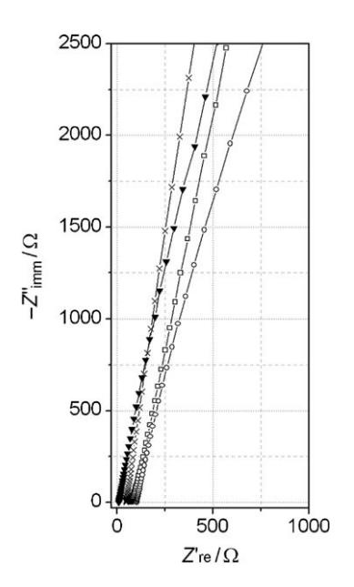
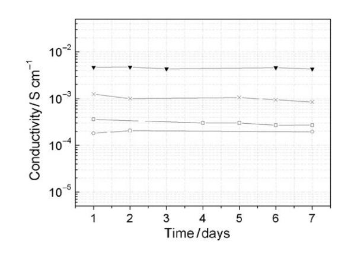
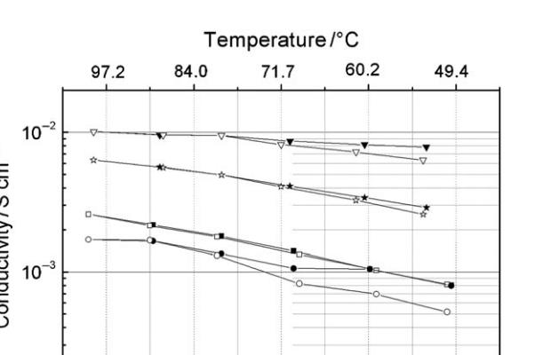
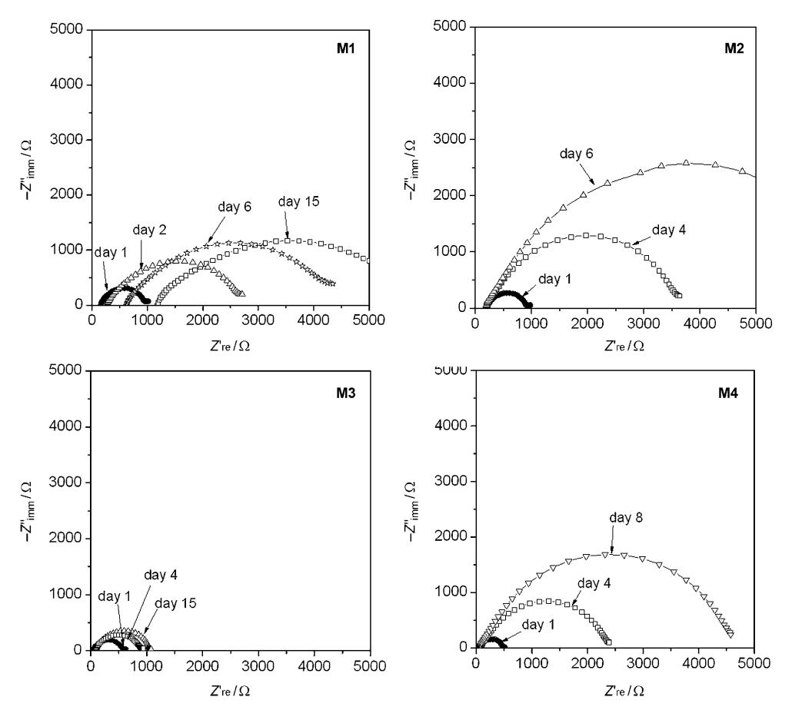
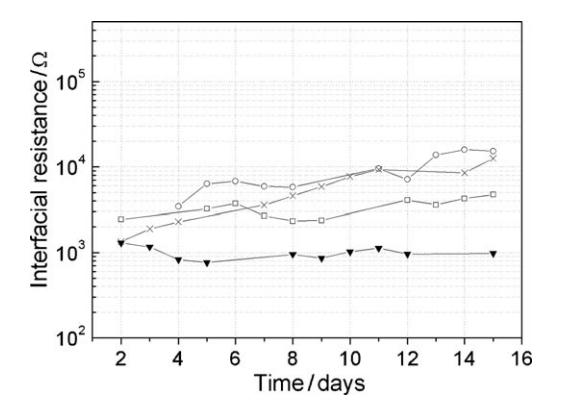
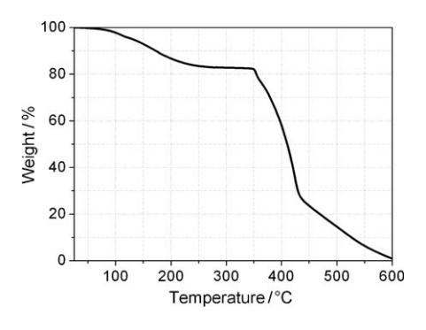
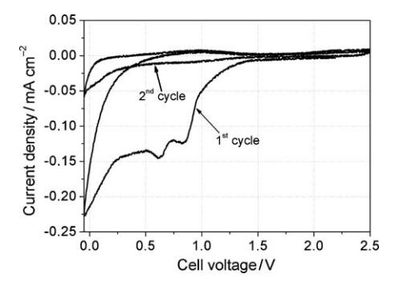
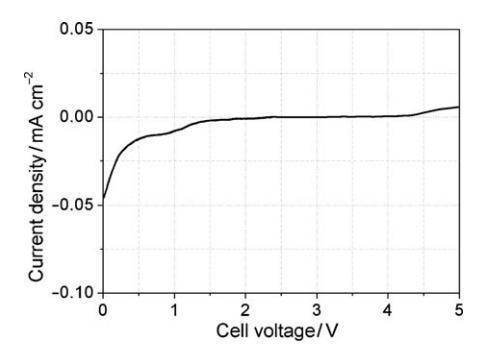
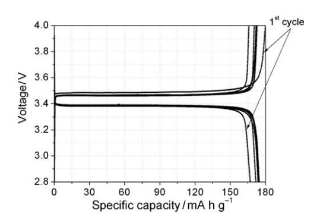

DOI: 10.1002/cssc.201000254

# Ionic Liquid-Based Membranes as Electrolytes for Advanced Lithium Polymer Batteries

M. A. Navarra, J. Manzi, L. Lombardo, S. Panero, and Bruno Scrosati\*[a]

Gel-type polymer electrolytes are formed by immobilizing a solution of lithium N,N-bis(trifluoromethanesulfonyl)imide (LiTFSI) in N-n-butyl-N-ethylpyrrolidinium N,N-bis(trifluoromethanesulfonyl)imide (Py24TFSI) ionic liquid (IL) with added mixtures of organic solvents, such as ethylene, propylene and dimethyl carbonates (EC, PC, and DMC, respectively), into a poly(vinylidenefluoride-co-hexafluoropropylene) (PVdF-HFP) matrix, and their properties investigated. The addition of the organic sol-

Introduction

Safety is one of the major issues preventing the widespread commercialization of lithium ion batteries as storage systems for renewable energy plants (REPs) as well as power sources for low-emission hybrid electric vehicles (HEVs) or even for emissions-free fully electric vehicles (EVs).[1]

Recently, research aimed at reducing the safety hazard in lithium batteries has successfully considered the replacement of the conventional, volatile and flammable organic alkyl carbonate electrolytes with highly stable ionic liquid (IL)-based solutions.[2–7] It is also well known that further improvements, in terms of safety and reliability, can be achieved by moving from liquid solutions to polymer electrolytes (PEs).[8–12] Despite many favorable properties related to the nature of PEs, including negligible electrolyte leakage, practical PE-based Li-batteries based are confined to a small number of niche applications. Problems delaying their development include the low conductivity of most solid PEs at ambient temperature and reactivity with the lithium metal electrode in solvent plasticized polymer systems. In this regard, polymer electrolytes, resulting from a polymer matrix together with an ionic liquid solution, represent an attractive strategy since they combine the mechanical and chemical stability of the polymer component with the intrinsic good conductivity, nonflammable nature, and high thermal stability of the ionic liquid component. Few examples of this class of materials for application in lithium batteries have been reported. Shin et al. reported on a lithium-metal battery formed by a LiFePO4 cathode and a polymer electrolyte consisting of poly(ethylene oxide), lithium N,N-bis(trifluoromethanesulfonyl)imide (LiTFSI), and a room-temperature ionic liquid, with a high and stable performance at 408C.[13] Improved cycling performances were reported by Chew et al. by replacing conventional liquid electrolytes with an ionic liquid polymer composite in a lithium-metal cell using a polypyrrole-coated lithium vanadium oxide cathode at room temperature.[14] J.-K. Kim et al. developed two PVdF-based polymer membranes vent mixtures results in an improvement of the ionic conductivity and in the stabilization of the interface with the lithium electrode. Conductivity values in the range of 10-3 –10-2 S cm-1 are obtained in a wide temperature range. These unique properties allow the effective use of these membranes as electrolytes for the development of advanced polymer batteries based on a lithium metal anode and an olivine-type lithium iron phosphate cathode.

based on room temperature ionic liquid and organic carbonate electrolytes and successfully tested them in a lithium-battery with a carbon coated LiMn0.4Fe0.6PO4 cathode.[15]

Herein we present a new class of IL-containing polymer membranes prepared by immobilizing a solution of LiTFSI in N-n-butyl-N-ethylpyrrolidinium N,N-bis(trifluoromethanesulfonyl)imide (Py24TFSI) ionic liquid with added mixtures of organic solvents, such as ethylene, propylene and dimethyl carbonates (EC, PC, and DMC), into a poly(vinylidenefluoride-co-hexafluoropropylene) (PVdF-HFP) matrix. These membranes have been characterized in terms of ionic conductivity, stability of interface with the lithium metal electrode, and application in lithium battery prototypes.

## Results and Discussion

We previously reported the potential of Py24TFSI–LiTFSI solution as an electrolyte component for lithium batteries.[16] In investigations into suitable ionic liquids with extended stability at low potentials, Py24TFSI–LiTFSI was found to be a suitable choice since it offers a good compatibility with the lithium metal electrode, while maintaining high thermal stability and acceptable conductivity.[16] Very promising performances were also shown in terms of interface stability, cycle life, and rate capability when combining the Py24TFSI–LiTFSI solution with lithium-ion battery electrodes.[17, 18]

To further suppress possible dendrite growth at the anode side and to meet the requirements of all-solid-state cells, the use of mechanically and electrochemically stable polymer membranes, such as those formed by PVdF-HFP, which are ca-

[a] Dr. M. A. Navarra, J. Manzi, L. Lombardo, Prof. S. Panero, Prof. B. Scrosati Department of Chemistry, University of Rome "La Sapienza" P .le Aldo Moro 5, 00185 Rome (Italy) Fax: (+39) 06-491769 E-mail: bruno.scrosati@uniroma1.it

pable of trapping a large amount of ionic liquid-based electrolytes, is highly desirable. Recently, we showed that the presence of a discrete amount of EC–PC mixture in IL-based polymer membranes enhances the conductivity and highly stabilizes the interface with a lithium metal electrode by forming a strong, protective solid electrolyte interface (SEI) film. Indeed, the good thermal, electrochemical, and interfacial properties of this type of hybrid membranes have been demonstrated in our laboratory[19] and in other laboratories.[20, 21]

Therefore, it appeared to us of interest to extend the study by considering a new organic solvent mixture (EC–PC–DMC) and evaluating its effect on the performances of PVdF-HFP membranes containing LiTFSI–Py24TFSI electrolyte solutions. We expected that the use of the ternary organic solvent mixture would lead to important advances in terms of: a) enhancement of ion dissociation owing to the high dielectric constants of both EC and PC; b) optimization of interfacial behavior owing to the passivating film-forming ability of EC;[22] c) improvement of fast ion transport owing to the low viscosity of DMC and d) widening of the temperature range of high ionic conductivity owing to the synergic effect of the three solvents with the thermally stable ionic liquid component.

To explore the validity of this prediction, we prepared and tested four types of membranes by varying the reciprocal composition of the PVdF-HFP, LiTFSI–Py24TFSI, and EC–PC–DMC components. Table 1 lists the four prepared samples, denoted as M1, M2, M3, and M4.

| Table 1. Compositions and acronyms of the ionic-liquid membranes in vestigated in this work.                                                                                                                                                                                                          |                                        |                                     |                                |
|----------------------------------------------------------------------------------------------------------------------------------------------------------------------------------------------------------------------------------------------------------------------------------------------------------|----------------------------------------|-------------------------------------|--------------------------------|
|                                                                                                                                                                                                                                                                                                          | Membrane PVdF-HFP[a] con tent [wt%] | LiTFSI–Py24TFSI[b] content [wt%] | EC–PC–DMC[c] con tent [wt%] |
| M1                                                                                                                                                                                                                                                                                                       | 30                                     | 70                                  | –                              |
| M2                                                                                                                                                                                                                                                                                                       | 30                                     | 56                                  | 14                             |
| M3                                                                                                                                                                                                                                                                                                       | 22                                     | 50                                  | 28                             |
| M4                                                                                                                                                                                                                                                                                                       | 22                                     | 60                                  | 18                             |
| [a] poly(vinylidenefluoride-co-hexafluoropropylene) matrix; [b] 0.2 mol kg 1 of lithium N,N-bis(trifluoromethanesulfonyl)imide in N-n-butyl-N-ethylpyrrolidinium N,N-bis(trifluoromethanesulfonyl)imide; [c] ethylene carbonate–propylene carbonate–dimethyl carbonate. |                                        |                                     |                                |

In view of their application in lithium batteries, we first screened the samples by determining their ionic conductivity. Figure 1 shows the impedance response of four independent cells formed by sandwiching the given membrane sample between two blocking stainless-steel electrodes. The measurements were carried out at various subsequent days of storage at room temperature. The Figure shows the impedance spectra, in the form of Nyquist plots, recorded at the 7th day; the intercepts with the real axis allow calculation of the conductivity values of the membranes. Notably, in the whole investigated frequency range, no signs of charge transfer or passivating layer formation are detectable. A linear response, as typically expected for blocking electrodes, indicates that our membranes do not undergo unexpected collateral reactions or un-

Figure 1. Typical impedance response of the four membranes developed in this study. Stainless-steel blocking electrodes. Frequency=50 Hz–150 kHz. M1 &; M2 \*; M3 !; M4 (see Table 1 for membrane compositions).

desired phenomena when placed in contact with the stainless steel electrodes.

Figure 2 shows the trend of the room-temperature conductivity values after one week of storage. Clearly, all the membranes have very stable conductivity, indicating that they keep

Figure 2. Time dependence of the ionic conductivity of the four membranes. Data obtained from impedance spectroscopy at room temperature. M1 &; M2 \*; M3 !; M4 .

their integrity with no liquid losses. However, of all the mebranes, that denoted M3 (PVdF-HFP/LiTFSI–Py24TFSI/EC–PC– DMC composition=22:50:28) has the highest conductivity (of the order of 5 10-3 S cm-1 ) at room temperature. Notably, the ionic conductivity of membrane M2, which contains a small amount of alkyl carbonates, is a little lower than that of the organic-solvent-free M1 membrane. This can be explained by assuming effects induced by dilution. Indeed, M1 and M2 have the same polymer content (Table 1) but the IL solution in M2, which is directly responsible for ion conduction, has been reduced by about 20 wt% with respect to M1. Thus, even though the presence of alkyl carbonates is expected to give beneficial effects in terms of ion-dissociation and reduced viscosity, the concentration of ionic species in M2 is not enough to guarantee the same level of conductivity as in M1.

Figure 3 shows the temperature dependence of the ionic conductivity of the membranes in the form of Arrhenius plots. The M3 sample displays the highest conductivity in the whole range of temperatures investigated in this study, attaining values in the order of 10-2 S cm-1 at 100 8C. The regular increase in conductivity upon heating for all the membranes confirms that neither physical transitions nor segregation phenomena occurred in the course of the test. Small hystereses were detected at low temperatures, possibly indicating a thermal memory effect of the polymer matrix.

Figure 4 compares the impedance response of independent cells formed by sandwiching each of the four membrane samples between two lithium metal electrodes. The impedance measurements were taken at subsequent times of storage. For an easier comparison, we decided to report only few typical spectra with impedance values lower than 5 000 W in the first two weeks of storage. The response of all four cells evolved with the expected semicircle signature, whereby the low-frequency intercept with the real axis gave the value of the Li/

membrane interfacial resistance, which includes the resistance of the passivating film on the Li electrode surface and the charge-transfer resistance.[23]

Whereas the bulk resistance (Rb), given by the high frequency intercept with the real axis, remained stable for the three samples with added EC–PC–DMC (M2, M3, and M4), that related to the organic solvent-free sample M1 greatly increased over time. The increase of Rb in M1 may be associated with detrimental changes in the concentration of active species responsible for ion conduction occurring when a protective filmforming additive, such as that induced by the organic solution, is absent. Therefore, we may conclude that the addition of the carbonate mixture has a beneficial effect on the stabilization of the lithium metal/membrane interfacial properties.

However, the extent of this effect strongly depends on the composition of the membrane, since the comparative results (Figure 4) clearly show that the

Figure 3. Conductivity Arrhenius plots of the four membranes developed in this work. Data obtained from impedance spectroscopy with heating and cooling scans. M1: heating &, cooling &; M2: heating \*, cooling \*; M3: heating !, cooling !; M4: heating N, cooling I.

width of the impedance semicircle remains stable only in the case of membrane M3, whereas those associated with M1, M2, and M4 membranes greatly increase with time of contact with the lithium metal electrodes.

Figure 4. Impedance response of cells formed by contacting the four M membranes developed in this work with lithium metal electrodes. Data obtained from impedance spectroscopy. Frequency range=1 Hz–100 kHz.

This difference in interfacial resistance among the four membranes is also evident from comparison of the evolution, at prolonged storage times, of the interfacial resistance of the four samples (Figure 5). The resistance of the Li/M3 interface

Figure 5. Time evolution of the Li/M interface resistance for the four M membranes developed in this work. Data obtained from impedance spectroscopy. M1 &; M2 \*; M3 !; M4 .

remains stable at around 1 000 W, whereas those of the Li/M1, Li/M2, and Li/M4 interfaces continuously grow to reach values one order of magnitude higher. Since there are no reasons to suppose that the charge-transfer resistance may be significantly influenced by minor differences in sample composition, it is reasonable to conclude that these differences instead affect the properties of the interface on lithium electrode in terms of differences in thickness and growth rate of the SEI film. Accordingly, we may speculate that the superior transport and interfacial behavior of membrane M3 over the other three samples (compare Figure 3 and Figure 5) can be explained by assuming that M3 has the best composition balance among its components, resulting from the relatively high portion of organic carbonates combined with the IL solution in the polymer matrix. Certainly, for a clear understanding of the phenomena occurring at the interface between membrane and electrode, a deeper investigation is needed. To this purpose, Raman and IR spectroscopic studies and in situ XRD experiments aimed at revealing the composition and the evolution of the SEI layer are currently underwent in our laboratory.

High ionic conductivity and interface stability are highly welcomed properties in battery applications; hence, we selected M3 as the most promising membrane and concentrated our attention on this membrane for further characterization. Figure 6 shows the thermogravimetric analysis (TGA) trace of membrane M3. A weight loss, due to partial removal of the alkyl carbonate solution, starts approaching 1008C. No other effects are noticed up to about 3508C, at which temperature a large loss, due firstly to IL-solution decomposition and then to polymer decomposition, is detected. This result is important in that it demonstrates the high thermal stability of the membrane that is expected to be reflected in safe operation when used as the electrolyte in a lithium battery. This expectation was qualitatively evaluated by performing standard self-extin-

Figure 6. Thermogravimetric analysis of the M3 membrane.

guishing time (SET) test, consisting of igniting a pre-weighed electrolyte sample followed by recording the time needed for the extinguishing of the flame. On applying a flame to our M3 membrane sample, no distinguishable ignition took place and, after tens of seconds, only the melting of the polymer under the flame heat was detected. Thus, the polymer electrolyte proposed herein can be defined as nonflammable. We explain this positive result by assuming that, even though volatile organic components are present, their partial vapor pressure is strongly reduced when dispersed in the matrices thanks to interactions with the polymer and, especially, IL components, thus avoiding undesired ignition under sudden thermal runaways.

The electrochemical stability of the M3 membrane was evaluated by running a sweep voltammetry of a cell using a Super P carbon working electrode and a lithium metal counter electrode. The resulting current–voltage traces (Figure 7) show

Figure 7. Electrochemical stability window of the M3 membrane in the cathodic voltage range. Super P working electrode. Room temperature.

in the first sweeping cycle a large current flow starting at around 1.0 V, associated with a multistep decomposition process, very likely due to the reduction of the carbonate solution component, with the consequent formation of a passivating film on the testing electrode. This interpretation is supported by a series of findings, such as : a) the irreversibility of the peaks in the 1.0–0.5 V region and b) the trend of the second sweep cycle where no trace of events down to approximately 0.25 V is detected. The current flow in the 0.25 V voltage range occurring in both first and second sweep cycles, can be ascribed to lithium deposition at the working Super P carbon electrode. The low peak current in the following oxidation scan is accounted for by considering the poor reversibility of the lithium deposit-stripping process on a Super P carbon electrode.[18] In general, we may state that the results reported in Figure 7 confirm that the passivating film, once formed on the electrode surface, is stable with no further growth, in accordance with the conclusions drawn from the impedance studies (Figure 5).

Figure 8 shows the steady current-voltage response of the Super P carbon electrode extended over the entire anodic and cathodic range (0–5 V). Even though weak current drifts occur

Figure 8. Electrochemical stability window of the M3 membrane in the overall voltage range. Super P working electrode. Room temperature.

at around 1.0 V and above 4.5 V, their low current values allow us to assume that the M3 membrane is electrochemically stable in the examined voltage range; hence, this membrane is expected to be efficiently used as safe electrolyte separator in lithium batteries operating in the range 3.0–4.0 V. Accordingly, we assembled and tested a battery using a lithium metal anode and an iron phosphate cathode, separated by a M3 membrane electrolyte. Considering the electrode used, the battery was expected to operate at around 3.5 V,[24] well within the stability domain of the M3 electrolyte.

Figure 9 illustrates typical charge (lithium removal from LiFePO4 to form FePO4) and discharge (lithium acceptance by FePO4 to reconvert into LiFePO4) cycles run at room temperature and at a C 10 rate (1 C current=0.217 A cm-2 g-1 with re-

Figure 9. Typical charge-discharge cycle of the Li/M3/LiFePO4 polymer battery. Room temperature. C/10 rate (1C current being 0.217 A cm-2 g-1 ).

spect to the LiFePO4 active mass). Reproducible voltage profiles with a delivered specific capacity approaching the theoretical value of 170 mA h g-1[24] were obtained. This result confirms the feasibility of the M3 membrane as a new electrolyte for advanced lithium polymer batteries.

### Conclusions

The results reported herein show that membranes formed by combining an ionic liquid solution with a polymer matrix and with the appropriate addition of a carbonate solution have a series of favorable properties, including: a) High lithium ion conductivity; b) wide electrochemical stability; c) high thermal stability, and d) nonflammability, that make them suitable for application in advanced lithium polymer batteries expected to benefit from a high safety level. We demonstrated this concept by successfully testing a polymer battery prototype based on a lithium metal anode and a lithium iron phosphate cathode. To our knowledge, very few studies to dates have demonstrated the feasibility of IL-based membranes as advanced lithium battery electrolytes. Due to the abundance of the elements forming the electrode materials and the polymeric nature of the electrolyte, the battery proposed herein is expected to be of low cost and easy to manufacture. In addition, by virtue of its composition, which combines a chemically stable cathode material with a nonflammable polymer electrolyte, this battery is expected to offer highly safe operation.

We are aware that the use of a lithium metal anode may induce operational problems in terms of uneven deposition upon charge that in turn may jeopardize the intrinsic safe characteristics of the IL membrane-lithium phosphate cathode combination. Therefore, our next step in the investigation of these polymer batteries will be addressed to studying the compatibility of IL-based membranes with alternative anode materials, such as graphite or metal–carbon composites (e.g. Sn, Si), to forego potentially risky lithium metal batteries in favor of a more reliable, lithium-ion configuration.

#### Experimental Section

Py24TFSI was prepared according to a procedure described in detail in a previous work.[16] The water content of the ionic liquid was revealed to be less than 20 ppm according to a standard Karl Fischer titration method (Metrohm KF 831 Coulometer). Lithium conduction was achieved by the addition of LiTFSI to the ionic liquid to a concentration of 0.2 mol kg-1 .

The polymer gel electrolyte membranes were prepared by a solution casting procedure. First, PVdF-HFP (Kynar Flex 2801) was dissolved in acetonitrile. Thereafter, LiTFSI–Py24TFSI, or, alternative, the mixture between the IL-salt solution and the alkyl carbonates, was added to the PVdF-HFP acetonitrile solution. The EC/PC/DMC weight ratio was selected as 1:1:2. The resulting solution was vigorously stirred overnight at room temperature and then cast in a Petri dish by heating at 70 \*C and rapidly cooling to room temperature. The heating–quenching process was repeated until freestanding membranes were obtained; the membranes were finally dried under reduced pressure at 60 \*C. All the procedures and material handlings were carried out in an argon-filled dry box.

2011 Wiley-VCH Verlag GmbH & Co. KGaA, Weinheim <www.chemsuschem.org> 129

Various membrane samples were prepared by varying the relative amount of polymer, IL-salt solution and alkyl carbonates. Table 1 summarizes the compositions of all the membranes studied in this work.

The thermal properties of the membranes were determined by running thermogravimetric analysis (TGA; SDTA 851 Mettler-Toledo) in air atmosphere at a scanning rate of 5 Cmin-1 .

The ionic conductivity was measured by electrochemical impedance spectroscopy (EIS), using a frequency response analyzer (Solartron 1260), applying a 10 mV amplitude signal in the frequency range 150 kHz–50 Hz. Cells formed by sandwiching the given membrane sample between two stainless steel electrodes housed in Teflon containers were used for the test.

The properties of the membrane/lithium metal electrode interface were evaluated by impedance spectroscopy analyses carried out by applying a 5 mV amplitude signal in the 100 kHz–1 Hz frequency range on symmetrical lithium cells using a multichannel potentiostat/galvanostat/impedance analyzer [VersaSTAT MC, Princeton Applied Research (PAR)]. The resulting impedance spectra were fitted according to equivalent circuit elements by using a ZSimp-Win 3.21 program.

The electrochemical stability window of the membranes was determined by linear sweep voltammetry and by cyclic voltammetry (VersaSTAT MC, PAR), performed at a scan rate of 0.2 mV sec-1 , using two-electrode cells with a Super P carbon-coated Al or Cu plate as the working electrode and lithium foil as the counter electrode.

Lithium-ion prototype cells were formed by coupling a lithium metal anode and an olivine-type LiFePO4 cathode with a selected IL-based, polymer electrolyte membrane. The cell was cycled galvanostatically at C 10 rate, using a Maccor Series 4000 battery test system as the driving and controlling instrument.

### Acknowledgements

This work has been carried out in the framework of SIID Project "REALIST" (Rechargeable, advanced, nano structured lithium batteries with high energy storage) sponsored by Italian Institute of Technology.

Keywords: lithium batteries · ionic liquids · polymer membranes

- [1] B. Scrosati, J. Garche, [J. Power Sources](http://dx.doi.org/10.1016/j.jpowsour.2009.11.048) 2010, 195, 2419.
- [2] M. Armand, F. Endres, D. F. MacFarlane, H. Ohno, B. Scrosati, [Nat. Mater.](http://dx.doi.org/10.1038/nmat2448) [2009](http://dx.doi.org/10.1038/nmat2448), 8, 621.
- [3] H. Matsumoto, H. Sakaebe, K. Tatsumi, [J. Power Sources](http://dx.doi.org/10.1016/j.jpowsour.2006.02.018) 2006, 160, 1308.
- [4] S. Seki, Y. Kobayashi, H. Miyashiro, Y. Ohno, A. Usami, Y. Mita, N. Kihira, M. Watanabe, N. Terada, [J. Phys. Chem. B](http://dx.doi.org/10.1021/jp0620872) 2006, 110, 10228.
- [5] B. Garcia, S. Lavalle, G. Perron, C. Michot, M. Armand, [Electrochim. Acta](http://dx.doi.org/10.1016/j.electacta.2004.04.041) 2004, 49[, 4583.](http://dx.doi.org/10.1016/j.electacta.2004.04.041)
- [6] P. C. Howlett, D. R. MacFarlane, A. F. Hollenkamp, [Electrochem. Solid-](http://dx.doi.org/10.1149/1.1664051)[State Lett.](http://dx.doi.org/10.1149/1.1664051) 2004, 7, A97.
- [7] A. Fernicola, B. Scrosati, H. Ohno, [Ionics](http://dx.doi.org/10.1007/s11581-006-0023-5) 2006, 12, 95.
- [8] J. Fuller, A. C. Breda, R. T. Carlin, [J. Electrochem. Soc.](http://dx.doi.org/10.1149/1.1837555) 1997, 144, L67.
- [9] S. Megahed, B. Scrosati, Interface 1995, 24, 34.
- [10] T. E. Sutto, [J. Electrochem. Soc.](http://dx.doi.org/10.1149/1.2767414) 2007, 154, P101.
- [11] A. Fernicola, F. C. Weise, S. G. Greenbaum, J. Kagimoto, B. Scrosati, A. Soleto, [J. Electrochem. Soc.](http://dx.doi.org/10.1149/1.3122885) 2009, 156, A514.
- [12] C. Zhu, H. Cheng, Y. Yang, [J. Electrochem. Soc.](http://dx.doi.org/10.1149/1.2931523) 2008, 155, A569.
- [13] J. H. Shin, W. A. Henderson, S. Passerini, [J. Electrochem. Soc.](http://dx.doi.org/10.1149/1.1890701) 2005, 152, [A978](http://dx.doi.org/10.1149/1.1890701).
- [14] S. Y. Chew, J. Sun, J. Wang, H. Liu, M. Forsyth, D. R. MacFarlane, [Electro](http://dx.doi.org/10.1016/j.electacta.2008.04.034)[chim. Acta](http://dx.doi.org/10.1016/j.electacta.2008.04.034) 2008, 53, 6460.
- [15] J.-K. Kim, J. Manuel, G. S. Chauhan, J.-H. Ahn, H.-S. Ryu, [Electrochim. Acta](http://dx.doi.org/10.1016/j.electacta.2009.05.043) 2010, 55[, 1366.](http://dx.doi.org/10.1016/j.electacta.2009.05.043)
- [16] A. Fernicola, F. Croce, B. Scrosati, T. Watanabe, H. Ohno, [J. Power Sources](http://dx.doi.org/10.1016/j.jpowsour.2007.09.013) [2007](http://dx.doi.org/10.1016/j.jpowsour.2007.09.013), 174, 342.
- [17] J. Hassoun, A. Fernicola, M. A. Navarra, S. Panero, B. Scrosati, [J. Power](http://dx.doi.org/10.1016/j.jpowsour.2009.07.046) [Sources](http://dx.doi.org/10.1016/j.jpowsour.2009.07.046) 2010, 195, 574.
- [18] P. Reale, A. Fernicola, B. Scrosati, [J. Power Sources](http://dx.doi.org/10.1016/j.jpowsour.2009.05.016) 2009, 194, 182.
- [19] C. Sirisopanaporn, A. Fernicola, B. Scrosati, [J. Power Sources](http://dx.doi.org/10.1016/j.jpowsour.2008.10.036) 2009, 186, [490.](http://dx.doi.org/10.1016/j.jpowsour.2008.10.036)
- [20] H. Ye, J. Huang, J. J. Xu, A. Khalfan, S. G. Greenbaum, [J. Electrochem. Soc.](http://dx.doi.org/10.1149/1.2779962) 2007, 154[, A1048.](http://dx.doi.org/10.1149/1.2779962)
- [21] B. Singh, M. S. Hundal, G.-G. Park, J.-S. Park, W.-Y. Lee, C.-S. Kim, K. Yamada, S. S. Sekhon, [Sol. State Ionics](http://dx.doi.org/10.1016/j.ssi.2007.08.001) 2007, 178, 1404.
- [22] J.-M. Tarascon, M. Armand, [Nature](http://dx.doi.org/10.1038/35104644) 2001, 414, 359.
- [23] D. Aurbach, [J. Power Sources](http://dx.doi.org/10.1016/S0378-7753(00)00431-6) 2000, 89, 206.
- [24] A. K. Padhi, K. S. Nanjundaswamy, J. B. Goodenough, [J. Electrochem. Soc.](http://dx.doi.org/10.1149/1.1837571) 1997, 144[, 1188.](http://dx.doi.org/10.1149/1.1837571)

Received: August 10, 2010 Revised: September 24, 2010 Published online on January 3, 2011