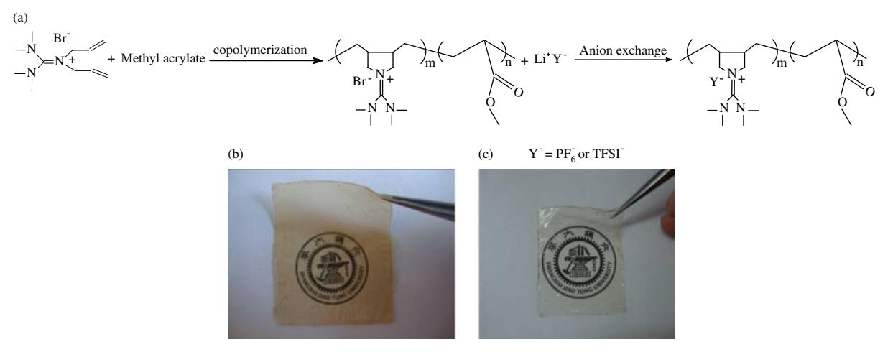
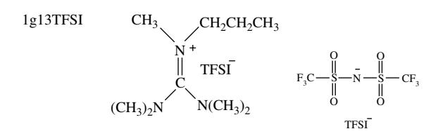
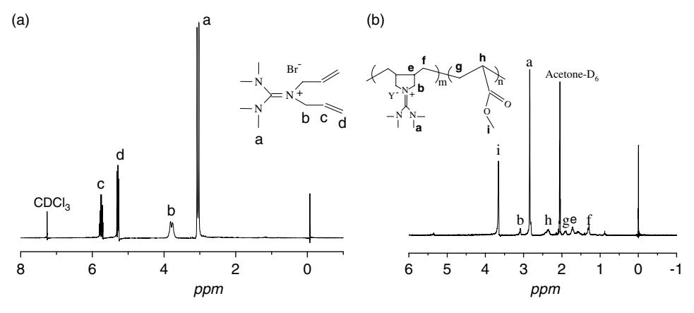
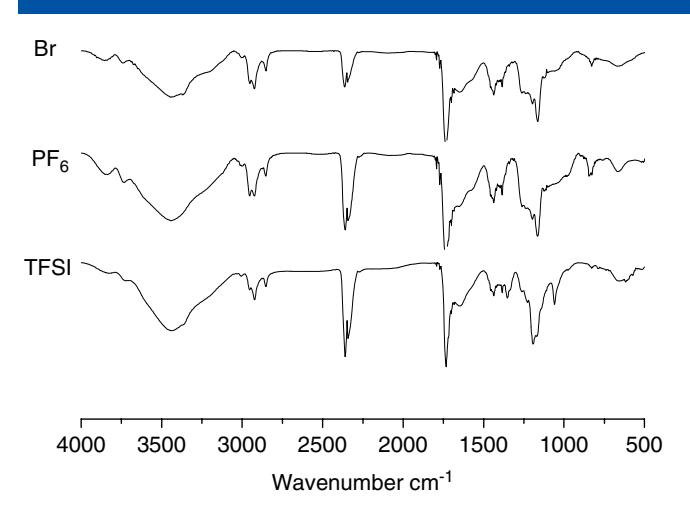
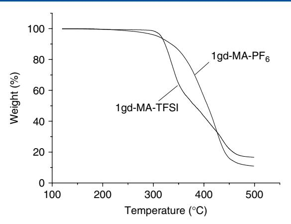
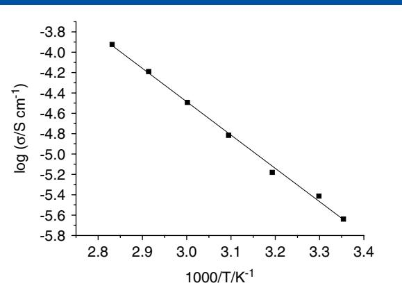
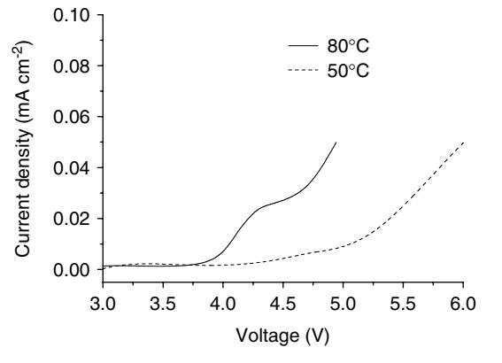
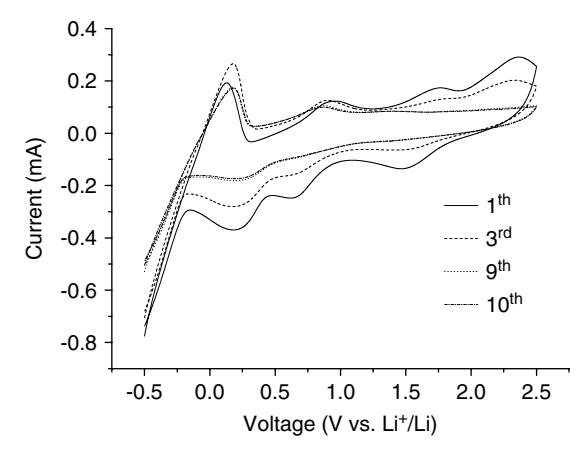
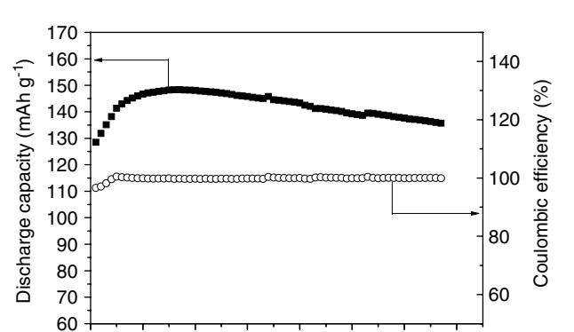
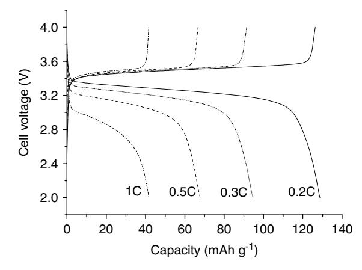

(wileyonlinelibrary.com) DOI 10.1002/pi.3181

# **Polymerized ionic liquids with guanidinium cations as host for gel polymer electrolytes in lithium metal batteries**

**Mingtao Li,a Li Yang,a,b∗Shaohua Fang,a,b Siming Dong,a Shin-ichi Hiranob and Kazuhiro Tachibanac**

## **Abstract**

**Polymerized ionic liquids (PILs) having guanidinium cations with different counter-anions, such as PF6 − and N(CF3SO2)2 − (TFSI−), were synthesized by copolymerization of a guanidinium ionic liquid monomer with methyl acrylate followed by an anion exchange reaction. Furthermore, incorporating a guanidinium ionic liquid, LiTFSI salt and nano-size SiO2, a quaternary gel polymer electrolyte based on one of the PILs as the polymer host was prepared. The quaternary gel polymer electrolyte was chemically stable even at a higher temperature of 80 ◦ C in contact with the lithium anode. In particular, the electrolyte exhibited high lithium ion conductivity, wide electrochemical stability window and good lithium stripping/plating performance. Li/LiFePO4 batteries with the quaternary gel polymer electrolyte at 80 ◦ C had capacities of 140 and 130 mA h g−1 respectively at 0.1 and 0.2 C current rates.**

**c 2011 Society of Chemical Industry**

**Keywords:** polymerized ionic liquids; ionic conductivity; lithium polymer batteries; guanidinium-based ionic liquids

## **INTRODUCTION**

Rechargeable lithium metal polymer batteries are considered to be one of the most probable next generation of power sources for portable electronic devices and electric vehicles because of their high energy density and flexible characteristics.1,2 A great number of solid/gel polymer electrolytes have been studied over the last few decades, generally based on poly(ethylene oxide) (PEO) and its derivatives,3–7 poly(methyl methacrylate),8,9 homopolymers and copolymers of poly(vinylidenefluoride) (PVdF)10 – 12 and polyacrylonitrile.13 But these polymer electrolytes still suffer from various defects such as low ionic conductivity and poormechanical and interfacial properties.

Recently there has been growing interest in polymerized ionic liquids(PILs) due to their comparatively high ionic conductivity and good mechanical strength.14 – 16 Ohno *et al*. earlier reported many different types of PILs including polycation-type PILs, polyaniontype PILs, polymer complex and polymer brushes, and their ion transport properties were evaluated.16 – 22 Ionic liquids (ILs) have many unique properties such as non-volatility, non-flammability, high electrochemical stability(4.5–5 V) and high ionic conductivity (0.1–20 mS cm−1).23,24 Two main strategies have been pursued so far in an attempt to translate the benefits of ILs to polymer electrolytes. The first involves the design of polymer electrolytes composed of ionic liquids and conventional polymermatrices such as PEO and poly[(vinylidene fluoride)-*co*-(hexafluoropropylene)] (PVdF-HFP).25 – 28 The second involves polymerization of ionic liquid monomers and using the PILs as host for polymer electrolytes. The PILs have main advantages of tunable solubility, enhanced ionic conductivity and chemical compatibility towards ionic liquids. Due to their favorable properties, large quantities of PILs based on different types of cations have been developed and their properties have been characterized.14 So far the PILs studied are mainly based on imidazolium, tetraalkylammonium, pyridinium and pyrrolidinium cations. Although the physical and chemical properties of the PILs were determined, very few applications of the PILs as electrolyte host in lithium batteries have been reported.20,29

Our laboratory has recently synthesized a series of ILs based on guanidinium cations with TFSI− anion, which showed high ionic conductivity, electrochemical stability and good performances in lithium batteries.30,31 In this work, guanidinium-based PIL films combining different counter-anions such as PF6 − and TFSI− were synthesized by copolymerizing guanidinium monomers with methyl acrylate, followed by an ion exchange reaction, as seen in Scheme 1. Additionally, a quaternary gel polymer electrolyte incorporating the guanidinium-based PIL (host), a guanidiniumbased ionic liquid, LiTFSI salt and nano-size SiO2 was prepared. The performance of Li/LiFePO4 batteries with the quaternary polymer gel electrolyte was measured at a higher temperature, namely 80 ◦ C.

- b *Hirano Institute for Materials Innovation, Shanghai Jiaotong University, Shanghai 200240, China*
- c *Department of Chemistry and Chemical Engineering, Faculty of Engineering, Yamagata University, Yamagata 992-8510, Japan*

∗ *Correspondence to: Li Yang, School of Chemistry and Chemical Technology, Shanghai Jiaotong University, Shanghai 200240, China. E-mail: liyang@sjtu.edu.cn*

a *School of Chemistry and Chemical Technology, Shanghai Jiaotong University, Shanghai 200240, China*

**Scheme 1.** (a) Synthetic routes to the PILs. (b) Image of a 1gd-MA-PF6 sample. (c) Image of a 1gd-MA-TFSI sample..

Scheme 2. The chemical structure of ionic liquid, 1g13TFSI.

## **EXPERIMENTAL**

**Reagents and materials** 

Tetramethylurea, 1,3-dimethyl-2-imidazolidinone, oxalyl chloride, ethylamine (water solution, 70%), 2,2'-azobisisobutyronitrile (AIBN) methyl acrylate and allyl bromide (98%) were purchased Alfa Aesar Chemical Co., Tianjing (China). Lithium hexafluorophosphate (LiPF6) and lithium bis(trifluoromethylsulfonyl)imide (LiTFSI) were kindly provided by Morita Chemical Industries Co. Ltd Osaka (Japan) and dried under vacuum for 24 h at 120  $^{\circ}$ C. All the other chemicals used in this work were of AR grade.

## Synthesis of the guanidinium IL monomer and 1g13TFSI

The IL of 1g13TFSI (see Scheme 2) was synthesized by our reported methods.30 Guanidinium bromides were prepared according to the reference methods.32–35 First, 0.1 mol (15.5 g) of the allyl guanidine and 0.13 mol (15.7 g) allyl bromide were added to 20 mL of acetonitrile and heated for 24 h at 70  $^{\circ}$ C. Allyl guanidinium IL was acquired after washing with ether and drying in vacuum at room temperature for 1 day. The structure of synthesized guanidinium IL monomer denoted as 1qd (see Scheme 1) was confirmed by 1H NMR and 13C NMR. 1H NMR (400 MHz, CDCl3),  $\delta$  [tetramethylsilane (TMS), ppm]: 5.95–5.85 (m, 2H), 5.43–5.29 (m, 4H), 4.05–3.83 (m, 4H), 3.09 (s, 12H). 13C NMR (400 MHz, CDCl3),  $\delta$  (TMS, ppm): 163.52, 132.59, 120.18, 52.46, 39.58.

## **Polymerization of the IL monomers**

The PILs were synthesized by a radical polymerization method. The 1gd, methyl acrylate, acetonitrile and AIBN, at a ratio of 1.0 mol% to the amount of methacrylic groups present in the solution, were mixed until they became homogeneous. The mixture was degassed in vacuum at 50 $^{\circ}$ C, and was kept standing at 70 $^{\circ}$ C for 40 h. After polymerization, the polymers obtained were dried at 80  $^{\circ}$ C for 6 h, then immersed in deionized water at 40  $^{\circ}$ C for 2 h, and then rinsed with large amounts of deionized water. The procedure of immersion and rinse was repeated twice in order to remove the guanidinium monomers completely. Consequently, the pure PILs denoted as 1gd-MA-Br were dried in vacuum at 80 $^{\circ}$ C for 12 h. The structure of 1qd-MA-Br was confirmed by 1H NMR and Fourier transform infrared spectroscopy (FTIR). Gel permeation chromatography (GPC) gave the number-average molecular weight of 1gd-MA-Br as  $M_n = 24400 \text{ g mol}^{-1}$  and the polydispersity index  $M_w/M_n = 2.76$  (low polydispersity polystyrenes used for calibration).

## **Preparation of the solid and quaternary polymer electrolyte**

1gd-MA-Br and LiTFSI or LiPF6 salt were each dissolved in acetone and then mixed at 40 $^{\circ}$ C for 4h in different proportions. The concentration of the salt in the electrolytes was given by the weight percentage of salts in the polymer for binary mixtures. After the ion exchange reaction finished, the solution was poured into Teflon® dishes and air-dried at 80 $^{\circ}$ C for 8 h. Then the PILs obtained were immersed in deionized water at 40  $^{\circ}$ C for 1 h, and rinsed with large amounts of deionized water. The process of immersion and rinse was repeated twice so as to remove the superfluous lithium salts. In order to find out if LiBr as a side product has been removed and the anion exchange reaction was quantitative, a simple precipitation test of  $AgNO3$  was carried out. The titration test consisted of the addition of AgNO3 to a solution of the new polymer in acetone. The test confirmed that no bromine anions remained in the PILs and the anion exchange reaction was quantitative because no precipitation of AgBr occurred.

Free-standing transparent polymer membranes were prepared by casting the solution of the pure PIL in acetone onto poly(tetrafluoroethylene) (PTFE) slides, and the films were subsequently dried at 80 $^{\circ}$ C under vacuum for 16 h before each conductivity measurement. All the procedures were carried out in a humidity controlled dry-room.

The quaternary polymer electrolytes were prepared by separately dissolving the 1gd-MA-TFSI (host), 1g13TFSI, LiTFSI and nano-size SiO2 in the weight ratio 10:5:3.5:2 in acetone at 40  $^{\circ}$ C for 5 h. The solution was cast onto PTFE slides to prepare the electrolyte films. All the procedures were carried out in an argon-filled Unilab glove box ( $O_2$  < 1 ppm). The film was then dried in air at room temperature for 12 h and subsequently dried at 80  $^{\circ}$ C under vacuum for another 12 h.

#### **Preparation of batteries**

Lithium foil (battery grade) was used as a negative electrode. The positive electrode was fabricated by spreading a mixture of LiFePO4, acetylene black and PVdF (initially dissolved in Nmethyl-2-pyrrolidone) with a weight ratio of 8:1:1 onto an Al current collector (battery use). Loading of active material was about 2.5 mg cm-2 corresponding to 0.4 mA h cm-2 and this thinner electrode was directly used without pressing. Li/LiFePO4 polymer batteries were fabricated (in an argon-filled glove box) by laminating the lithium foil, a PIL-LiTFSI-1g13TFSI-SiO2 ternary polymer electrolyte membrane and a LiFePO4 cathode tape.

#### **Characterization methods**

Structures of the synthesized IL monomer and the PILs were confirmed by 1H NMR and 13C NMR spectroscopy (Avance III 400); TMS was used as the internal reference for the analysis. The FTIR spectroscopic measurements were performed on a Bruker IFS-28 FT-IR spectrometer. Thermal analyses of the polymers were performed on a Perkin-Elmer thermogravimetric analyzer from room temperature to 500 $^{\circ}$ C under nitrogen at a heating rate of 20  $^{\circ}$ C min-1. Molecular weights of the polymers were determined on a Waters 717 Plus autosampler gel permeation chromatography apparatus equipped with Waters RH columns and a Dawn Eos (Wyatt Technology) multi-angle laser light scattering detector using 12 low polydispersity polystyrenes (molecular weight range  $10^2$  –  $10^7$  g mol-1) as calibration standards. The sample solutions were prepared in N,N-dimethylformamide (*ca* 2 mg mL $-1$ ) and filtered through 0.45-µm poly(tetrafluoroethylene) syringe-type filters before being injected into the GPC system.

The ionic conductivity of the PILs was measured by the complex impedance method using a CHI660D Electrochemical Workstation. The electrolytes were placed between a pair of blocking electrodes. The data were collected over the frequency range  $0.1-10^5$  Hz with an amplitude of 5 mV for an open circuit potential. The ionic conductivity ( $\sigma$ ) was calculated from the bulk electrolyte resistance value  $(R)$  found in the complex impedance diagram according to the equation

$$\sigma = L/RS$$

where  $L$  is the thickness and  $S$  the area of the polymer electrolyte film.

The electrochemical stability of the PIL electrolytes was determined on the CHI660D Electrochemical Workstation by linear sweep voltammetry using the cell Li/PIL electrolyte/SS, in which SS (stainless steel) was used as the working electrode and the lithium as the reference and the counter electrodes. The scanning rate was 1 mV s $-1$ .

The lithium ion transference number,  $T_{Li+}$ , was evaluated using the method originally proposed by Bruce and Vincent.36,37 The PIL film was sandwiched between two lithium-unblocking electrodes to form a symmetrical Li/PIL electrolyte/Li cell. The coin cell (CR2016) was assembled and sealed in an argon-filled glove box. Measurements were performed using a CHI660D Electrochemical Workstation. The method consists of initial measurement of the lithium interfacial resistance  $(R_0)$  by impedance spectroscopy in the 0.1 Hz to 1 MHz frequency range, application of a small voltage (10 mV) until a steady current was obtained ( $I_{ss}$ ) and final measurement of the interfacial resistance ( $R_f$ ) by impedance spectroscopy in the 0.1 Hz to 1 MHz frequency range.  $T_{Li+}$  was calculated using the equation

$$T_{\rm Li^{+}} = \frac{I_{\rm ss}}{I_0} \left( \frac{\Delta V - I_0 R_0}{\Delta V - I_{\rm ss} R_{\rm f}} \right)$$

where  $\Delta V$  is the applied polarization voltage and  $I_0$  is the initial current which was calculated from the voltage and the overall cell resistance by

$$I_0 = \frac{\Delta V}{R_{\rm b} + R_0}$$

where  $R_b$  is the bulk resistance of the PIL.

Preliminary cycling tests on Li/LiFePO4 polymer batteries were performed at 80 °C using a CT2001A cell test instrument (LAND Electronic Co. Ltd). The discharge current rates ranged from C/10  $(0.04 \text{ mA cm}^{-2})$  to 1 C  $(0.4 \text{ mA cm}^{-2})$  while the charge rate was fixed to C/10. The voltage cut-offs were fixed at 4.0 (charge step) and 2.0 V (discharge step), respectively.

## **RESULTS AND DISCUSSION**

#### **Characterization of the guanidinium monomer and the PILs**

Figure 1 shows the 1H NMR spectra of the monomer 1gd and the PIL 1gd-MA-Br. For 1gd, the assignments of the corresponding protons are shown in Fig. 1(a). It can be seen that the characteristic proton absorptions in the double bonds located at  $\delta$  5.87  $(CH_2CHCH_2)$  and 5.33 ppm  $(CH_2CHCH_2)$  in the guanidinium monomer completely disappear after polymerization, as shown in Fig. 1(b), which indicates that the reaction went to completion and the polymer obtained is pure. The proton absorptions of  $\delta$ 

**Figure 1.** 1H NMR of (a) 1gd, (b) 1gd-MA-Br.

**Figure 2.** IR spectra of 1gd-MA-Br, 1gd-MA-PF6 and 1gd-MA-TFSI.

3.93 (NCH2CHCH2) and 3.09 ppm [CN(CH3)2]2 in Fig. 1(a) resulting from the characteristic absorptions of quanidinium molecules still exist in the spectra of 1gd-MA-Br after the polymerization. Additionally, in Fig. 1(b) the peak at 3.67 ppm ( $COOCH_3$ ) results from methacrylate. The other assignments of protons are also marked in the figure. Combining all the results of the 1H NMR spectra, it is confirmed that 1qd-MA-Br has the expected chemical structure and furthermore that the purity of obtained polymer could meet the requirements.

Figure 2 presents the FTIR spectra of the obtained polymers having  $PF_6^-$  and TFSI $-$  counter-anions, and the initial polymer with Br $-$  anion. In Fig. 2, the strong absorptions at 2320 cm $-1$  are from carbon dioxide in the air. All the polymers show characteristic bands at 1730 and 1164  $\text{cm}^{-1}$  for the C=O and C–O stretching vibration from the ester group, respectively. The neighboring bands centered near 1606  $\text{cm}^{-1}$  and 1507  $\text{cm}^{-1}$ most likely arise from the  $C=N$  and  $C-N$  stretching from the guanidinium cations.32,34 According to the above assignments, it is confirmed that the structure of the polymer backbone is maintained after the anion exchange reaction. At the same time, new bands appear attributed to the new different anions such as  $PF_6^-$  (838 cm-1) and TFSI- (1349, 1192, 1134, 1061 and  $659 \text{ cm}^{-1}$ ).38–40 In addition, broad peaks near 3500 cm-1 in the FTIR spectra are from water. We have repeated several FTIR tests, but the peaks still exist. Although the PIL samples are dried well before tests, they absorb humidity when exposed in air. Some measures have been taken to avoid the samples absorbing water in further tests. It is therefore concluded that the FTIR spectra constitute an indication of the anion exchange.

## **Thermal stability of the PILs**

It is well known that the nature of anions influences the final properties of ILs such as viscosity, solubility, thermal stability etc.41 Furthermore, it has been demonstrated that the properties of PILs also depend on the nature of the counter-anions. For example, Mecerreyes *et al.*38 reported that pyrrolidinium PILs containing different anions present different thermal behaviors proving that thermal stability strongly depends on the anions. The thermal stability of the PILs was evaluated by TGA. The results are shown in Fig. 3, which demonstrates that two PILs containing different anions present different thermal behaviors,

Figure 3. TGA thermograms of 1gd-MA-PF6 and 1gd-MA-TFSI at a ramp rate of 10  $\degree$ C min-1 in a nitrogen flow.

proving that thermal stability strongly depends on the anions. Specifically, 1gd-MA-TFSI decomposes in two steps but 1gd-MA- $PF_6$  presents only one step. Their decomposition temperatures are 300 $^{\circ}$ C and 260 $^{\circ}$ C, respectively. This result agrees with the reports by Ohno18 and Mecerreyes38 that their PILs with TFSI anion possess a better thermal stability, but was different from the report by Rajendran *et al.*39 who found that BF4 anion gave a better thermal stability to their PILs systems. Selection of a suitable anion is therefore important for the thermal stability of PILs.

#### Lithium ionic conductivity of gel polymer electrolytes based on 1gd-MA-TFSI

For example, a quaternary gel polymer electrolyte based on 1gd-MA-TFSI as the polymer host and incorporating 1g13TFSI ionic liquid, LiTFSI salt and nano-size SiO2 was prepared. The addition of ILs into the polymer electrolyte can improve the interfacial properties toward the electrode material and increase the lithium ionic conductivity.29,42 1g13TFSI is used here because of its good electrochemical properties and exceptional battery performance as electrolyte. Nano-size  $SiO2$  is also added in this gel polymer electrolyte because it can enhance the mechanical strength and lithium ion transference number.26

Figure 4 shows the temperature dependence of the ionic conductivity for the quaternary gel polymer electrolyte. As observed in this figure, the sample shows an increase in conductivity with temperature, which characterizes the ionic conductivity mechanism as an Arrhenius one, i.e. the hopping of conducting species, probably lithium ions.43 The value of the ionic conductivity reaches  $1.17 \times 10^{-4}$  and  $1.58 \times 10^{-5}$  S cm-1 at 80 and 50  $^{\circ}$ C, respectively.

### **Oxidation stability of the quaternary gel polymer electrolyte**

Oxidation stability of the quaternary gel polymer electrolyte was characterized by linear sweep voltammetry on Li/polymer electrolyte/SS cells. From Fig. 5, we can observe that the value of the onset voltage is associated with the anodic decomposition voltage. The gel polymer electrolyte decomposes at about 4.0 and 4.6 V *versus*  $Li/Li^+$  (corresponding to a current density of 5  $\mu$ A cm-2) at 80 and 50 °C, respectively. The results demonstrate that the electrolytes have good electrochemical stability, thus confirming their feasibility for application in lithium ion batteries at high temperature.

Figure 4. The temperature dependence of the ionic conductivity for the quaternary gel polymer electrolyte.

Figure 5. Oxidation stability by linear sweep voltammetry of the quaternary gel polymer electrolyte at 80 and 50  $^{\circ}$ C (Li/polymer electrolyte/SS cell,  $10 \text{ mV s}^{-1}$ ).

Figure 6. Cyclic voltammograms for the quaternary gel polymer electrolyte at 80 °C. Working electrode, Ni; counter electrode and reference electrode, lithium; scan rate 10 mV s $-1$ 

## Lithium redox in the quaternary gel polymer electrolyte

Lithium redox in the quaternary gel polymer electrolyte was determined by cyclic voltammograms, as seen in Fig. 6. The plating of lithium on the nickel electrode can be observed in 1g13TFSI IL electrolyte. In the first cycle for the gel polymer electrolyte, the plating of lithium is about  $-0.16$  V versus Li/Li+, and the anodic peak at about 0.14 V in the returning scan corresponds

www.soci.org

Cycle number Figure 7. Discharge capacity and coulombic efficiency as functions of cycle number for Li/(PIL-1g13TFSI-LiTFSI-SiO2)/LiFePO4 cells at 80 °C.

40

50

60

 $\overline{70}$ 

to the stripping of lithium. The lithium redox in the gel polymer electrolyte might be caused by the generation of a certain surface film (Solid Electrolyte Interface, SEI) on the Ni electrode. The peak currents of the lithium redox decrease gradually with cycle number, and this suggests that the SEI film turns thicker so that the lithium redox is restricted markedly. The broad cathodic peak ranging from 0.98 to  $-0.12 \text{ V}$  versus Li/Li+ is assigned to the electrochemical reduction of the electrolyte, and at the same time it could be presumed that this reduction might generate the SEI film on the Ni electrode. Moreover, the peak current significantly decreases in the following scans, so it could mean that the SEI film also restrains the reduction of the electrolyte. In addition, a cathodic peak at  $1.48 \text{ V}$  is observed in the first cycle, which might be caused by the reactions of the trace water or oxygen in the gel polymer electrolyte on the Ni electrode,44 and this peak disappeared in the third cycle due to formation of the SEI film.

#### **Performance of the batteries**

 $\theta$ 

10

Charge-discharge current rate is 0.1 C.

 $20$ 

30

The quaternary polymer electrolyte based on 1gd-MA-TFSI as the polymer host and incorporating 1g13TFSI (IL), LiTFSI salt and nano-size  $SiO_2$  was prepared and the performance of Li/LiFePO4 batteries with this polymer electrolyte was tested at high temperature. Figure 7 shows the performance of the batteries with the quaternary polymer electrolyte at 80 °C. After an initial increase that may be a result of the generation of improved penetration and contact of the IL component from the electrolyte into the electrode material, the cell delivered a maximum capacity of about 158 mA h  $q^{-1}$  (corresponding to 93%) of theoretical capacity) at 0.1 C. In addition, the cell was cycled for 70 cycles with a capacity fading of approximately 0.27 mA h  $q^{-1}$ per cycle. After 70 cycles, the delivered capacity of the battery was still 135 mA h  $q^{-1}$ . During the overall cycling test, the coulombic efficiency, determined by the ratio between the discharge and charge capacity, is very close to 100%. In particular, the average efficiency value is over 99%, which indicates that the cell has good cycling reversibility.

The performance of the Li/PIL-1g13TFSI-LiTFSI-SiO2/LiFePO4 cell at different current C rates was also determined. In Fig. 8, one can see that the discharge capacity of the cell is relatively low at high current C rates. The discharge capacities were 130, 96 and 70 mA h  $q^{-1}$  at 0.2, 0.3 and 0.5 C, respectively. The discharge capacity of cells at high current rates is associated with the lithium ion transference

**Figure 8.** Voltage *versus* capacity profile of Li/(PIL-1g13TFSI-LiTFSI-SiO2)/LiFePO4 cells at 80 ◦ C. Charge current rate is fixed at 0.1 C and discharge current rate is indicated in the figure.

number, *T*Li+, of the polymer electrolyte. A relatively high *T*Li+ could eliminate the concentration gradients within the battery and could ensure the battery working at high current density.2 Here the *T*Li+ value in the quaternary polymer gel electrolyte is 0.07, which is relatively low. Some measures will be taken to improve the discharge capacity of cells at high current density in following work. For example, the amounts of ionic liquid groups in polymer chains are increased by self-polymerization, which is favorable for dissociating lithium salts. As a result, a higher lithium ion transference number and batter ionic conductivity should be obtained.

## **CONCLUSIONS**

PILs having a guanidinium cation with different counter-anions such as PF6 − and N(CF3SO2)2 − (TFSI−) were synthesized by copolymerization ofa guanidiniummonomerwithmethylacrylate, followed by an ion exchange reaction. The thermal stability of the PILs strongly depends on the anions they contain. The PILs have good thermal stability and they do not decompose until 250 ◦ C. A quaternary polymer gel electrolyte based on one of the PILs as host and incorporating a guanidinium ionic liquid, LiTFSI salt and nano-size SiO2 was prepared. The electrolytes are chemically stable even at the high temperature of 80 ◦ C in contact with a lithium anode. Li/LiFePO4 batteries with the quaternary polymer electrolyte at 80 ◦ C have capacities of 140 and 130 mA h g−1 at 0.1 and 0.2 C current rates, respectively.

## **ACKNOWLEDGEMENTS**

The authors thank the Research Center of Analysis and Measurement of Shanghai JiaoTong University for the help in NMR characterization. This work was financially supports by the National Natural Science Foundation of China (Grants No. 21103108 and 21173148).

## **REFERENCES**

- 1 Armand M and Tarascon JM, *Nature* **451**:652–657 (2008).
- 2 Tarascon JM and Armand M, *Nature* **414**:359–367 (2001).

- 3 Bishop C and Teeters D, *Electrochim Acta* **54**:4084–4088 (2009).
- 4 Gadjourova Z, Andreev YG, Tunstall DP and Bruce PG, *Nature*
- **412**:520–523 (2001). 5 Henderson WA and Passerini S, *Electrochem Commun* **5**:575–578 (2003).
- 6 Wang XL, Fan LZ, Mei A, Ma FY, Lin YH and Nan CW, *Electrochim Acta* **53**:2448–2452 (2008).
- 7 Zhan BZ, White MA, Fancy P, Kennedy CA and Lumsden M, *Macromolecules* **37**:2748–2753 (2004).
- 8 Choi NS and Park JK, *Electrochim Acta* **46**:1453–1459 (2001).
- 9 Kim HS, Shin JH, Moon SI and Kim SP, *Electrochim Acta* **48**:1573–1578 (2003).
- 10 Cao JH, Zhu BK and Xu YY, *J Membrane Sci* **281**:446–453 (2006).
- 11 Huang H and Wunder SL, *J Power Sources* **97–98**:649–653 (2001).
- 12 Saikia D and Kumar A, *Electrochim Acta* **49**:2581–2589 (2004).
- 13 Huang B, Wang Z, Li G, Huang H, Xue R, Chen L, *et al*, *Solid State Ionics* **85**:79–84 (1996).
- 14 Green O, Grubjesic S, Lee S and Firestone MA, *Polymer Reviews* **49**:339–360 (2009).
- 15 Lu JM, Yan F and Texter J, *Prog Polym Sci* **34**:431–448 (2009).
- 16 Ohno H, *Macromol Symp* **249**:551–556 (2007).
- 17 Handy ST and Okello M, *J Org Chem* **70**:1915–1918 (2005).
- 18 Ogihara W, Washiro S, Nakajima H and Ohno H, *Electrochim Acta* **51**:2614–2619 (2006).
- 19 Ohno H, Yoshizawa M and Ogihara W, *Electrochim Acta* **50**:255–261 (2004).
- 20 Sato T, Marukane S, Narutomi T and Akao T, *J Power Sources* **164**:390–396 (2007).
- 21 Yoshizawa M, Ogihara W and Ohno H, *Polym Advan Technol* **13**:589–594 (2002).
- 22 Yoshizawa M and Ohno H, *Electrochim Acta* **46**:1723–1728 (2001).
- 23 Galinski M, Lewandowski A and Stepniak I, *Electrochim Acta* **51**:5567–5580 (2006).
- 24 Hapiot P and Lagrost C, *Chem Rev* **108**:2238–2264 (2008).
- 25 Damen L, Hassoun J, Mastragostino M and Scrosati B, *J Power Sources* **195**:6902–6904 (2010).
- 26 Ferrari S, Quartarone E, Mustarelli P, Magistris A, Fagnoni M, Protti S, *et al*, *J Power Sources* **195**:559–566 (2010).
- 27 Shin J-H, Henderson WA, Scaccia S, Prosini PP and Passerini S, *J Power Sources* **156**:560–566 (2006).
- 28 Shin JH, Henderson WA and Passerini S, *J Electrochem Soc* **152**:A978–A983 (2005).
- 29 Appetecchi GB, Kim GT, Montanino M, Carewska M, Marcilla R, Mecerreyes D, *et al*, *J Power Sources* **195**:3668–3675 (2010).
- 30 Fang SH, Yang L, Wang JX, Zhang HQ, Tachibana K and Kamijima K, *J Power Sources* **191**:619–622 (2009).
- 31 Fang SH, Yang L, Wei C, Jiang C, Tachibana K and Kamijima K, *Electrochim Acta* **54**:1752–1756 (2009).
- 32 Gao Y, ArrittSW,Twamley B andShreeve JM, *InorgChem***44**:1704–1712 (2005).
- 33 Li MT, Yang L, Fang SH and Dong SM, *J Membrane Sci* **366**:245–250 (2011).
- 34 Wang P, Zakeeruddin SM, Gratzel M, Kantlehner W, Mezger J, Stoyanov EV, *et al*, *Appl Phys a–Mater* **79**:73–77 (2004).
- 35 Xie HB, Zhang SB and Duan HF, *Tetrahedron Lett* **45**:2013–2015 (2004).
- 36 Bruce PG and Vincent CA, *J Electroanal Chem* **225**:1–17 (1987).
- 37 Riley M, Fedkiw PS and Khan SA, *J Electrochem Soc* **149**:(2002).
- 38 Pont AL, Marcilla R, De Meatza I, Grande H and Mecerreyes D, *J Power Sources* **188**:558–563 (2009).
- 39 Rajendran S, Prabhu MR and Rani MU, *J Power Sources* **180**:880–883 (2008).
- 40 Umebayashi Y, Mitsugi T, Fukuda S, Fujimori T, Fujii K, Kanzaki R, *et al*, *J Phys Chem B* **111**:13028–13032 (2007).
- 41 Narita A, Shibayama W, Matsumi N and Ohno H, *Polym Bull* **57**:109–114 (2006).
- 42 Sirisopanaporn C, Fernicola A and Scrosati B, *J Power Sources* **186**:490–495 (2009).
- 43 Pawlicka A, Danczuk M, Wieczorek W and Zygadło-Monikowska E, *J Phys Chem A* **112**:8888–8895 (2008).
- 44 Fang S, Zhang Z, Jin Y, Yang L, Hirano S-i, Tachibana K, *et al*, *J Power Sources* **196**:5637–5644 (2011).