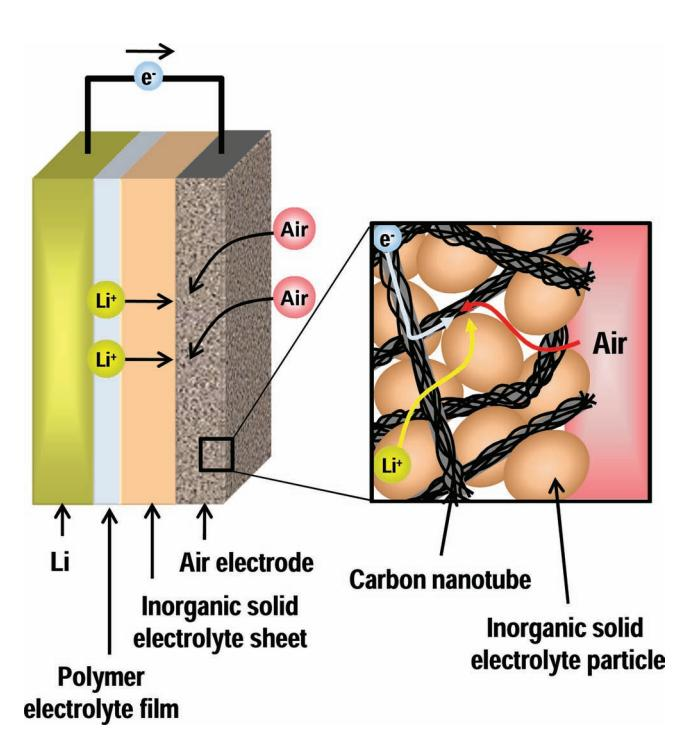
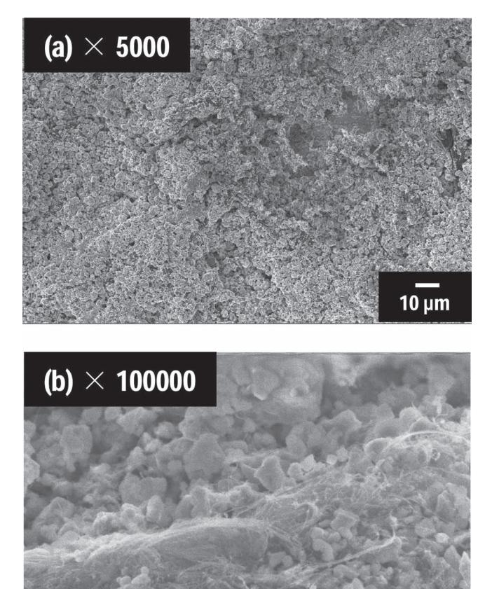
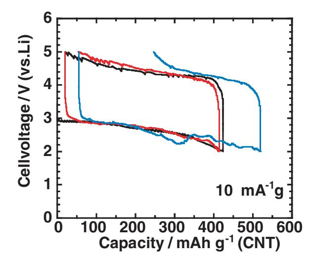
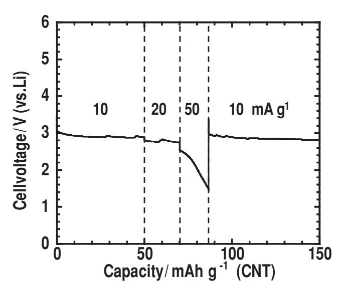
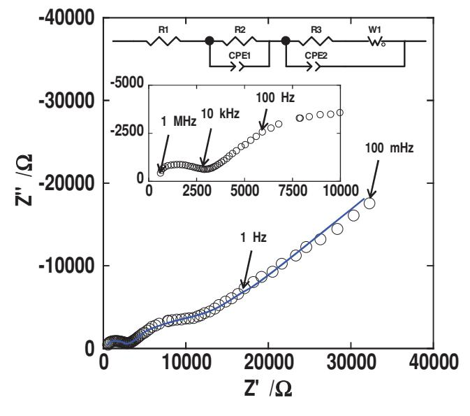
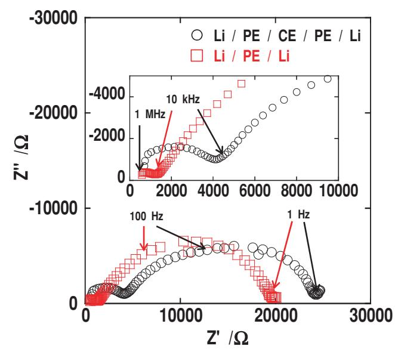

**www.MaterialsViews.com**

# **Electrochemical Performance of Solid-State Lithium–Air Batteries Using Carbon Nanotube Catalyst in the Air Electrode**

 *Hirokazu Kitaura and Haoshen Zhou \** 

 **Solid-state lithium–air cells using lithium anode, a polymer electrolyte, Li 1** +*x*+*y* **Al** *x* **(Ti, Ge) 2**−*x* **Si** *y* **P 3**−*y* **O 12 inorganic solid electrolyte, and an air electrode composed of carbon nanotubes and an inorganic solid electrolyte are constructed and their electrochemical properties investigated. The cells show a reversible capacity of about 400 mA h g** − **1 during the fi rst few cycles. The rate performance and impedance measurements are also examined. The large cell resistance, which mainly comes from the interfacial resistance between Li and the polymer electrolyte, limits the rate performance. The results indicate that such all-solid-state lithium–air batteries without polymer electrolytes have good potential for development.** 

## **1. Introduction**

 The lithium-ion battery, which has the highest energy density of all other battery types, has been widely used commercially as a power source in the mobile electronics industry. Now, larger lithium-ion batteries are being used for application in electric vehicles. However, such industrial applications are still limited by safety problems and low energy density. For improving the energy density, the lithium–air (lithium–oxygen) battery has attracted much attention because of its high theoretical energy density, which is about 3500 to 5200 W h kg −1 . [1–7] However, there are still many problems associated with lithium–air batteries. Among these, some intrinsic problems are caused by the use of organic liquid electrolytes. Organic liquid electrolytes decompose during discharging and the oxidation of the decomposition products during charging results in large polarization. [8,9] Moreover, the use of fl ammable organic materials is intrinsically dangerous. The application of nonfl ammable inorganic solid electrolytes has been examined by researchers in efforts to improve safety. All-solid-state lithium batteries using inorganic solid electrolytes have been studied as the safest and the most reliable concept, and various solid electrolytes have been reported. [10–17] Thus, a strategy to increase the safety of lithium–air batteries is to replace the organic liquid electro-

 Dr. H. Kitaura , Prof. H. Zhou Energy Technology Research Institute National Institute of Advanced Industrial Science and Technology Umezono, 1-1-1, Tsukuba, 305-8568, Japan E-mail: hs.zhou@aist.go.jp

lytes with fl ame-resistant electrolytes such as polymer electrolytes or inorganic solid electrolytes—to develop solid-state lithium–air batteries.

**www.advenergymat.de**

 Recently, a solid-state lithium–air cell, in which polymer–ceramic composite electrolytes were used to reduce the cell impedance and couple the air electrode to the ceramic electrolyte, has been reported. [18] Our previous work demonstrated that a graphene–graphite composite fi lm, which can be easily fabricated by drawing a pencil on a ceramic electrolyte sheet, worked as a solid-state air electrode for semi-solidstate lithium–air cells. [19] Now we design a

solid-state lithium–air battery, with both high capacity and good safety, based on nonfl ammable solid electrolytes. The volume of the air electrode should be large because the capacity of such batteries depends on the quantity of the discharge products stored within the air electrode. In such air electrodes, highly lithium-ion and electron conductive paths in contact with the electrochemical active sites are required. However, this is quite different to the case of traditional lithium–air batteries using organic liquid electrolytes, in which the organic liquid electrolytes can access the catalyst on the electronic conductive materials through the nanopores to form a lithium-ion conduction path. However, for the solid-state lithium–air battery, a special air electrode with both lithium-ion and electron paths – which should be formed from solid electrolytes, electronic conductive materials and nanosized catalysts – has to be fabricated. Thus we decided to use a powdery composite electrode composed of a solid electrolyte, an electronic conductive material, and a nanosized catalyst.

 There are some qualifi cations that need to be met in order to apply solid electrolytes to such lithium–air batteries. A solid electrolyte with a high lithium-ion conductivity is required and it should be atmospherical stable. Li–Al–Ti–PO 4 (LATP) solid electrolytes not only have one of the highest conductivities of solid electrolytes but also have atmospherical stability. [17,20] Although the stability of LATP against lithium metal is poor, the direct contact of lithium metal with LATP solid electrolytes can be avoided by using a protection layer, such as polyethylene oxide polymer electrolytes. Therefore, LATP solid electrolytes are suited to assess the possibility of the solid-state lithium–air batteries.

 With respect to the electronic conductive materials and catalysts, carbon materials appear promising because of their

 **DOI: 10.1002/aenm.201100789** 

combination of good electronic conductivity and catalytic activity. [21,22] In a composite electrode, the electronic conductive materials have to form a continuous path from the current collector to the electrochemical active sites. In addition, the catalysts should have a high outer surface area not including the surface areas of pores, because solid electrolytes cannot penetrate into fi ne pores and only have contact with the outer surface. Carbon nanotubes (CNTs) have relatively high surface areas and also a high aspect ratio, which is favorable to the formation of the continuous path. The catalytic activity of CNTs in traditional lithium–air batteries has been reported. [23,24]

 In this study, we present the fabrication of solid-state lithium–air cells using an air electrode with an inorganic solid electrolyte and a CNT catalyst, and prove that solid-state lithium– air cells, using an air electrode without any liquid electrolytes or polymer materials, can work in the discharge–charge process. Then the infl uences of the composition of the solid electrolyte and CNT in the air electrode on the electrochemical performance of the solid-state cells are investigated. Furthermore, several electrochemical performance characteristics, such as rate performance and cell impedance, are investigated to understand the performance of these solid-state lithium–air cells.

#### **2. Results and Discussion**

**Figure 1** is a schematic diagram of a solid-state lithium–air cell. The cell is composed of a lithium negative electrode, a solid polymer electrolyte, an inorganic solid electrolyte sheet, and an air electrode. In this study, Li 1 +*x*+*y* Al *x* (Ti,Ge) 2−*x* Si *y* P 3−*y* O 12

 **Figure 1 .** Schematic diagram of a solid-state lithium–air battery using lithium anode, a polymer electrolyte fi lm, an inorganic solid electrolyte sheet, and an air electrode composed of carbon nanotubes and solid electrolyte particles.

**www.MaterialsViews.com**

 **Figure 2 .** FE-SEM images of the air electrode ( *x* = 5) deposited on the CE sheet.

ceramic electrolyte (CE), which is an LATP inorganic solid electrolyte analog, was used. The polymer electrolyte (PE), which was polyethylene oxide with LiTFSA, was introduced to avoid the direct contact of lithium metal with the CE sheet. The components of the air electrode were CE and CNT particles for the lithium-ion and electron conduction paths to the reactive site in the air electrode, respectively. The CNT particles also take a role as catalyst for the reduction reaction in the air electrode. Furthermore, the air electrode should be porous for the air diffusion path to the reactive site. **Figure 2** shows FE-SEM images of the air electrode when the weight ratio ( *x* ), which represents the ratio of 100 CE to *x* CNT, in the air electrode is 5 ( *x* = 5). A rough and porous surface was observed. The particle size of CE was less than 1 μ m and large CNT bundles connected with CE particles were observed.

**Figure 3** depicts charge–discharge curves of the solid-state Li/PE/CE/CNT cell with a weight ratio *x* = 5. The cell was charged and discharged between 2.0 and 5.0 V (vs. Li) at a current density of 10 mA g − 1 . The 1 st , 2 nd and 3 rd charge–discharge curves are described by the black, red, and blue lines, respectively. The cell was successful in discharging and charging. An initial discharge capacity of about 420 mA h g − 1 was obtained and the cell showed a reversible capacity of about 400 mA h g − 1 . The cell showed a voltage of about 2.9 V at the beginning of

www.MaterialsViews.com

Figure 3. Charge-discharge curves of the solid-state Li/PE/CE/CNT cell with a weight ratio  $x$  of 5. Black, red, and blue lines represent the 1st, 2nd, and  $3rd$  cycles, respectively.

the discharge process and the cell voltage gradually decreased to 2.0 V. The initial discharge voltage of 2.9 V is close to the potential of the oxygen reduction reaction with lithium, around 3.0 V.[3] In the charging process, the charge voltage was obviously higher than the discharge voltage. The charge voltage was about  $3.8-4.2$  V at the beginning of the charging process and gradually increased to 5.0 V. It can be presumed that the large difference between discharging potential and charging potential is caused by other gasses in the air, such as H2O and  $CO2$ . Theoretically, the electrochemical reaction during the discharge process in the lithium-air batteries gives the discharge products of lithium oxides  $(Li_2O$  or  $Li_2O_2)$ .[3,5] It is considered that the theoretical reaction primarily occurs in the solid-state lithium-air cells, whose initial discharge voltage is close to the theoretical potential of the oxygen reduction reaction with lithium. However, the lithium oxides are unstable in the air atmosphere and would react chemically with  $H_2O$  and  $CO_2$  as soon as they are produced. Therefore, some compounds other than lithium oxides, such as LiOH and  $Li_2CO_3$ , also exist at the end of the discharge process; these will then be decomposed in the charge process. These compounds' decompositions will result in a high over-potential.[25] The actual electrochemical reaction will be investigated to improve the energetic efficiency. Then, the polarization will be decreased by selecting more active catalysts, such as N-doped carbon materials.[23,26]

The cell showed a capacity of more than 300 mA h  $g^{-1}$  in subsequent discharge-charge cycles. However, the coulombic efficiency was low in the third cycle and the reversible capacity decreased. We suggest some reasons for the poor cycling ability. The first is due to the oxidation of CNT during cycling. Ishihara et al. suggested that the carbon materials in the air electrode of the lithium-air cells using organic electrolytes are electrochemically oxidized in the oxygen atmosphere during the discharge process.[25] Similarly, carbon materials in the solid-state cells are potentially oxidized during the discharge process. The consumption of CNTs by oxidation causes the rupture of the electronic conduction path and a decrease of the catalytic activity of the air electrode. The second reason is due to the larger discharge capacity in the third cycle than those capacities in the previous cycles. The large discharge capacity may result in the coarsening of the discharge products. It is conjectured that discharge products with large size have low activity and cannot be completely decomposed in the following charging. The third possibility is the deterioration of the air electrode caused by the deposition of the large amount of discharge products. It is well known that a large volumetric change of the active materials breaks the electrode architecture.[27] Thus, the exfoliation of the air electrode from the CE sheet and rupture of the electrochemical paths are concerns. However, we did not observe, by XRD and SEM measurements, the discharge products or significant structural and morphological changes in the air electrode before and after discharging (see the Supporting Information) owing to the complex reaction process and the too-small amount of the discharge products. Further refined analyses are needed to identify the cause of the poor cycling ability.

Figure 4 shows the first charge-discharge curves of solidstate Li/PE/CE/CNT cells with different CNT content in the air electrode. The weight ratio  $(x)$ , which represents the ratio of 100 CE to  $x$  CNT in the air electrode, was increased from 5 to 50. The discharge capacity increased with increasing  $x$ in the range 5 to 10 and then decreased as  $x$  increased in the range 10 to 50. On the other hand, the charge capacity of the cells decreased with increasing  $x$  over the whole range 5 to 50. The discharge voltage also decreased with increasing  $x$  over the whole range. The solid-state lithium–air cell with  $x = 5$  showed the best electrochemical performance.

Mizuno et al. demonstrated that the addition of a small amount of carbon materials, especially fibrous carbons such as VGCF, gives high electronic conductivities to the composite electrodes.[28] Therefore, sufficiently high electronic conductivities in all the air electrodes are expected. Actually, even the solid-state cell with  $x$  of 5, which had the smallest amount of CNT in the four cells, could be discharged and charged. On the

 $\mathbf{6}$ Cellvoltage/V (vs.Li)  $\mathbf{5}$  $\mathbf{4}$  $\overline{3}$  $\overline{2}$  $(a)$  $(d)$ (c)  $(b)$ 1 10  $mA^{-1}q$  $\mathbf{0}$  $200$ 300 400  $$ 600  $\Omega$ 100 Capacity/mAh  $g^{-1}$  (CNT)

Figure 4. First charge–discharge curves of the solid-state Li/PE/CE/CNT cells. The weight ratio  $(x)$ , which represents the ratio of 100 CE to x CNT in the air electrode, was a)  $x = 5$ , b)  $x = 10$ , c)  $x = 20$ , and, d)  $x = 50$ .

other hand, it has been shown that the weight ratio of active materials over solid-state electrolyte in the electrode materials is one of the most important factors for the electrochemical performance of all-solid-state lithium-ion batteries.[29] It was found that the composition of the air electrode materials significantly affected the electrochemical performance of solidstate lithium-air cells. As shown in Figure 1, continuous paths to electrochemical reactive sites for electrons, lithium ions, and air are necessary to operate the cells as solid-state lithium-air batteries. The increase in the amount of CNT may break the continuous paths for the lithium ions by fragmenting the connection of each CE particle. Moreover, from the SEM results in Figure 2, it was found that bundles of CNT were formed in the deposited air electrode. It was reported that the formation of bundles of electrode materials decreased the capacity in all-solid-state cells using needle-like iron oxide particles.[30] The sites around the center of the CNT bundles would be inactive because it is difficult for the lithium ions to migrate from the CE particles connected with the outside of the CNT bundles to the center of the CNT bundles. Additionally, aggregates among the CNT bundles, caused by the increase in the weight ratio of CNTs, increase the number of inactive sites. These results indicate the need to decrease the weight ratio of the CNT further and increase the dispersibility of the CNT particles, in order to improve the electrochemical performance of the cells.

Figure 5 shows the rate performance of the solid-state Li/ PE/CE/CNT cell with the weight ratio  $x = 5$ . The discharge current density was changed from 10 to 50 mA  $g^{-1}$  and, after discharging at 50 mA g-1, the current density returned to 10 mA  $g^{-1}$ . The discharge voltage slightly dropped when the current density was increased from 10 to 20 mA g-1 or from 20 to 50 mA  $g^{-1}$ . However, the voltage rapidly dropped from 2.5 to 1.5 V during discharge at a current density of 50 mA  $g^{-1}$ . After discharging at 50 mA  $g^{-1}$ , the cell can be still discharged at 10 mA  $g^{-1}$  with a potential of 2.8 V, which is the same as

**Figure 5.** Discharge curve of the solid-state Li/PE/CE/CNT cells  $(x = 5)$ at various current densities.

www.MaterialsViews.com

**Figure 6.** Impedance spectrum of the solid-state Li/PE/CE/CNT cell ( $x =$ 5) after discharging to 200 mA h  $g^{-1}$ .

the initial discharge potential with the same current 10 mA  $g^{-1}$ . This indicates that the air electrode was not broken by the high current density; however, a current density of 50 mA  $g^{-1}$  implies kinetic limitation of this air electrode.

The cell resistance was calculated from the voltage drop between each current density and the resistance was about 18 000  $\Omega$ . To analyse the cell resistance, ac impedance measurements were conducted. Figure 6 shows the impedance spectrum of the solid-state Li/PE/CE/CNT cell with weight ratio  $x =$ 5 after discharging to 200 mA h  $g^{-1}$ . Two semicircles in the high frequency region and middle frequency region were observed. The impedance spectrum was fitted by an equivalent circuit model, which is shown in Figure 6; the result of the fitting is depicted by the blue line. The equivalent circuit model was constructed by assuming a series of one total external resistance (R1), two parallel circuits consisting of a resistance (R2, R3), and a constant phase element (CPE), and Warburg impedance. The sum of the resistance in the cell estimated from the fitting by the equivalent circuit was about 13 000  $\Omega$ . The difference between the resistances estimated from the voltage change and impedance measurements is attributed to the individual specificity of the solid-state cells. The resistance R1 corresponds to the resistance from 0 to the onset of the semicircle in the high frequency region. The resistances R2 and R3 are comparable to the resistances of the semicircles in the high and middle frequency regions, respectively. The resistances R1 and R2 were derived from the resistances of the electronic conduction in the cell including the measuring device and lithium-ion conduction in the electrolytes including PE and CE, respectively. The capacitance parallel to the resistance R2 was estimated to  $10^{-8}$  F. The value gives close agreement with the capacitance derived from the grain boundary.

The distorted semicircle in the low frequency region includes a number of resistive components derived from the charge transfer resistance of the electrochemical reactions and

**www.advenergymat.de**

**www.MaterialsViews.com**

 **Figure 7 .** Impedance spectra of the symmetric cells, Li/PE/CE/PE/Li and Li/PE/Li.

the interfacial resistances between Li and PE, and, PE and CE sheets. The capacitance parallel to the resistance R3 was estimated to 10 − 6 F. The value is empirically consistent with the capacitance derived from the charge transfer. **Figure 7** shows the impedance spectra of the symmetric cells, Li/PE/CE/PE/ Li and Li/PE/Li. The Li/PE/CE/PE/Li cell showed a resistance of 24 000 Ω , which is almost twice the resistance of the solid-state Li/PE/CE/CNT cell. The resistance of the Li/PE/ Li cell was 20 000 Ω . It can be considered that the interfacial resistance between Li and PE is about the half that of the Li/ PE/Li symmetric cell. So, it seems that the interfacial resistance between Li and PE accounts almost entirely for the resistance of the solid-state cell. The interfacial resistance can be decreased by constructing an all-solid-state lithium–air battery only using inorganic solid electrolytes without polymer electrolytes, in which the inorganic solid electrolyte should be stable for lithium metal.

#### **3. Conclusion**

 This study has demonstrated that air electrodes using inorganic solid electrolytes and carbon materials for solid-state lithium– air batteries show good potential for development. Although the carbon nanotubes used as catalyst and as conductive additive aggregated, a cell capacity of about 400 mA h g − 1 was obtained. The weight ratio of the carbon nanotube to Li 1 +*x*+ y Al *x* (Ti,Ge) 2 *x* Si *y* P 3−*y* O 12 ceramic electrolyte in the air electrode infl uenced the cell performance; it was found that designing the construction of the air electrode is an important key for improving the cell performance. Also the results indicate that the development of all-solid-state lithium–air batteries without polymer electrolyte, which shows large resistance at the interface with lithium anode, is needed to improve the rate performance in these cells.

# **4. Experimental Section**

 Carbon nanotube (CNT, Mircrophase Co. Ltd.) was used as both a catalyst and a conductive additive of air electrodes. Li 1 +*x*+*y* Al *x* (Ti,Ge) 2−*x* Si *y* P 3−*y* O 12 ceramic electrolyte (CE) sheet and powder was obtained from OHARA Inc. The thickness and the area of CE sheet were 600 μ m and 2.5 × 2.5 cm 2 . The air electrodes were fabricated by following procedure: CNT and CE powders were mixed and dispersed into ethanol solution. The ratio of CE to CNT was 100 to *x* ( *x* = 5, 10, 20, 50). The solution was dropped onto 1 cm 2 of CE sheet and dried at room temperature. The CE sheet with the air electrode was heated at 700 ° C for 10 min in an Ar atmosphere. The thickness of the air electrode was about 50 μ m. The mass of the air electrode was about 3 mg cm − 2 .

 Polyethylene oxide with Li(CF 3 SO 2 ) 2 N (LiTFSA) polymer electrolyte (PE) was prepared by a casting technique and used as a buffer layer to avoid the reaction between lithium and CE. [31] PEO (Ardrich, average molecular weight 600 000, 0.767 g, 1 mmol) and LiTFSA (Kishida Chemical Co., Ltd., 0.287 g, 1 mmol) powders were dissolved in anhydrous acetonitrile (20 mL). The solution was stirred for 24 h and poured into a Tefl on dish. Then PEO-LiTFSA fi lm was obtained by drying the solution at 40 ° C for 24 h in an Ar-fi lled glove box and at 100 ° C for 12 h in a vacuum oven. The thickness of the fi lm was about 50 μ m.

 Solid-state Li/PE/CE/CNT cells were assembled as follows. PEO-LiTFSA electrolyte fi lm, lithium anode, and Cu current collector were stacked on the reverse side of CE sheet with the air electrode and sealed by a plastic fi lm. The Al mesh was used as a current collector for the air electrode. The laminate-type cell was sandwiched by two plastic plates and held by a screw clamp. Symmetric cells, Li/PE/CE/PE/Li and Li/PE/ Li, were assembled by a similar procedure to that above. All processes were performed in an Ar-fi lled glove box.

 The morphology of the air electrode deposited on the CE sheet was confi rmed by using FE-SEM (Gemini Supra; Carl Zeiss). Electrochemical tests were conducted at room temperature using charge–discharge measuring devices (HJ1001SD8; Hokuto Denko Co.). The discharge and charge currents were set at the current density from 10 to 50 mA g −1 . The current density and cell capacity were normalized by the weight of CNT in the air electrode. Electrochemical impedance measurements were performed for the electrochemical cell after discharging to 200 mA h g −1 . An impedance analyzer (Solartron 1287 coupled with Solartron 1260) was used and a small perturbation voltage of 10 mV in the frequency range 1 MHz to 100 mHz was applied for the measurements. Impedance spectra were fi tted by means of modeling equivalent circuits. All electrochemical tests were conducted under an atmosphere of laboratory air.

## **Supporting information**

 Supporting Information is available from the Wiley Online Library or from the author.

## **Acknowledgements**

 We are thankful to the Ohara Inc. for providing the Li 1 +*x*+*y* Al *x* (Ti,Ge) 2−*x* Si *y* P 3− *y* O 12 solid electrolyte materials.

> Received: December 28, 2011 Revised: February 10, 2012 Published online: May 21, 2012

- [ 1 ] A. Armand , J.-M. Tarascon , *Nature* **2008** , *451* , 652 .
- [ 2 ] G. Girishkumar , B. McCloskey , A. C. Luntz , S. Swanson , W. Wilcke , *J. Phys. Chem. Lett.* **2010** , *1* , 2193 .
- [ 3 ] K. M. Abraham , Z. Jiang , *J. Electrochem. Soc.* **1996** , *143* , 1 .
- [ 4 ] T. Kuboki , T. Okuyama , T. Ohsaki , N. Takami , *J. Power Sources* **2002** , *146* , 766 .

#### **www.MaterialsViews.com**

- [ 6 ] A. Débart , A. J. Paterson , J. L. Bao , P. G. Bruce , *Angew. Chem., Int. Ed.* **2008** , *47* , 4521 .
- [ 7 ] Y. G. Wang , H. S. Zhou , *J. Power Sources* **2010** , *195* , 358 .
- [ 8 ] F. Mizuno , S. Nakanishi , Y. Kotani , S. Yokoishi , H. Iba , *Electrochemistry (Tokyo, Jpn.)* **2010** , *78* , 403 .
- [ 9 ] S. A. Freunberger , Y. Chen , Z. Peng , J. M. Griffi n , L. J. Hardwick , F. Bardé , P. Novák , P. G. Bruce , *J. Am. Chem. Soc.* **2011** , *133* , 8040 .
- [ 10 ] A. A. Schneider , K. O. Fester , T. Kuder , *Power Sources* **1975** , *5* , 651 .
- [ 11 ] C. C. Liang , *J. Electrochem. Soc.* **1973** , *120* , 1289 .

**www.advenergymat.de**

- [ 12 ] J. B. Bates , N. J. Dudney , B. J. Neudecker , A. Ueda , C. D. Evans , *Solid State Ionics* **2000** , *135* , 33 .
- [ 13 ] C. Julien , S. Saikh , M. Balkanski , *Mater. Sci. Eng.* **1992** , *B14* , 121 .
- [ 14 ] M. Kotobuki , Y. Suzuki , K. Kanamura , Y. Sato , K. Yamamoto , T. Yoshida , *J. Power Sources* **2011** , *196* , 9815 .
- [ 15 ] M. Tatsumisago , A. Hayashi , *J. Non-Cryst. Solids* **2008** , *354* , 1411 .
- [ 16 ] P. Knauth , *Solid State Ionics* **2009** , *180* , 911 .
- [ 17 ] N. Kamaya , K. Homma , Y. Yamakawa , M. Hirayama , R. Kanno , M. Yonemura , T. Kamiyama , Y. Kato , S. Hama , K. Kawamoto , A. Mitsui , *Nat. Mater.* **2011** , *10* , 682 .
- [ 18 ] B. Kumar , J. Kumar , R. Leese , J. P. Fellner , S. J. Rodrigues , K. M. Abraham , *J. Electrochem. Soc.* **2010** , *157* , A50 .

- [ 19 ] Y. Wang , H. Zhou , *Energy Environ. Sci.* **2011** , *4* , 1704 .
- [ 20 ] H. Aono , E. Sugimoto , *J. Electrochem. Soc.* **1990** , *137* , 1023 .
- [ 21 ] M. Hayashi , H. Minowa , M. Takahashi , T. Shodai , *Electrochemistry (Tokyo, Jpn.)* **2010** , *78* , 325 .
- [ 22 ] J. Xiao , D. Wang , W. Xu , D. Wang , R. E. Willford , J. Liu , J.-G. Zhang , *J. Electrochem. Soc.* **2010** , *157* , A487 .
- [ 23 ] Y. Li , J. Wang , X. Li , J. Liu , D. Geng , J. Yang , R. Li , X. Sun , *Electrochem. Commun.* **2011** , *13* , 668 .
- [ 24 ] J. Li , N. Wang , Y. Zhao , Y. Ding , L. Guan , *Electrochem. Commun.* **2011** , *13* , 698 .
- [ 25 ] A. K. Thapa , K. Saimen , T. Ishihara , *Electrochem. Solid-State Lett.* **2010** , *13* , A165 .
- [ 26 ] L. Zhao , Y.-S. Hu , H. Li , Z. Wang , L. Chen , *Adv. Mater.* **2011** , *23* , 1385 .
- [ 27 ] J. O. Besenhard , J. Yang . M. Winter , *J. Power Sources.* **1997** , *68* , 87 .
- [ 28 ] F. Mizuno , A. Hayashi , K. Tadanaga , M. Tatsumisago , *J. Electrochem. Soc.* **2005** , *152* , A1499 .
- [ 29 ] F. Mizuno , A. Hayashi , K. Tadanaga , M. Tatsumisago , *J. Power Sources* **2005** , *146* , 711 .
- [ 30 ] H. Kitaura , K. Takahashi , A. Hayashi , K. Tadanaga , M. Tatsumisago , *J. Ceram. Soc. Jpn.* **2010** , *118* , 326 .
- [ 31 ] T. Zhang , N. Imanishi , S. Hasegawa , A. Hirano , J. Xie , Y. Takeda , O. Yamamoto , N. Sammes , *J. Electrochem. Soc.* **2008** , *155* , A965 .