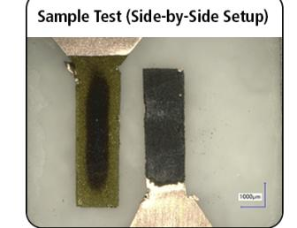
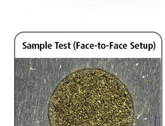
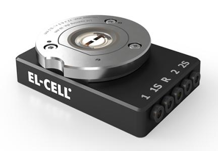

### **ERS** The Electrochemical Society

## You may also like

First Principles Modeling of the Interface Between a Solid State Lithium Thiophosphate Electrolyte and a Lithium Metal Anode

To cite this article: Natalie A. W. Holzwarth and Nicholas D. Lepley 2013 Meet. Abstr. MA2013-02 563

View the article online for updates and enhancements.

- *(Invited)* Thiophosphate Based Solid **Electrolytes and Cathodes Interfaces** Jagjit Nanda, Ethan Craig Self and Frank M Delnick
- Phosphosulfide semiconductors for optoelectronics and solar energy conversion Lena A Mittmann and Andrea Crovetto
- A review of the structural diversity of  $[P.S.]n$  motifs and their potential application prospects in metal thiophosphates
- Ya Yang, Miao Song, Xiaowen Wu et al.

# **ECC-Opto-10 Optical Battery Test Cell: Visualize the Processes Inside Your Battery!**

- ✓ Battery Test Cell for Optical Characterization Designed for light microscopy, Raman spectroscopy and XRD.
- ✓ Optimized, Low Profile Cell Design (Device Height 21.5 mm) Low cell height for high compatibility, fits on standard samples stages.
- ✓ High Cycling Stability and Easy Handling Dedicated sample holders for different electrode arrangements included!
- **Cell Lids with Different Openings and Window Materials Available**

Contact us:

- +49 40 79012-734 ٢.
- sales@el-cell.com  $\checkmark$
- www.el-cell.com  $\bigoplus$

This content was downloaded from IP address 131.227.156.3 on 21/10/2025 at 10:32

#### **First principles modeling of the interface between a solid state lithium thiophosphate electrolyte and a lithium metal anode**

N. A. W. Holzwarth and N. D. Lepley Department of Physics, Wake Forest University Winston-Salem, NC 27109, USA

 Recently, there has been progress in improving the conductivity and stability of solid electrolytes such as Li3PS4.[1] We report the results of first principles computer modeling studies of ideal Li3PS4 electrolyte interfaces with metallic Li anodes.

 For a variety of interface configurations, computer modeling studies show that Li3PS4 surfaces are structurally and chemically altered by the presence of Li metal. On the other hand, experiments have shown [1] that an electrochemical cell of Li/Li3PS4 /Li can be cycled many times. One possible explanation of the apparent stability of the Li3PS4 electrolyte/Li metal interface, is that a stable thin buffer layer is formed during the first few cycles. In order to computationally explore this possibility, we modeled a "thin film" buffer layer of Li2S on the surface of the electrolyte. Using first principles techniques described in previous work,[2] stable electrolyte-buffer layer configurations were found. Results for the idealized configurations indicate that a thin film of Li2S can provide a protective buffer layer to stabilize the interface between the Li3PS4 electrolytes and Li metal anodes.

#### **Acknowledgments**

This work was supported by NSF Grant DMR-1105485. Computations were performed on the Wake Forest University DEAC cluster, a centrally managed resource with support provided in part by the University. Helpful discussions with Chengdu Liang and Nancy Dudney of Oak Ridge National Laboratory are gratefully acknowledged.

#### **References**

[1] Z. Liu, W. Fu, E. A. Payzant, X. Yu, Z. Wu. N. J. Dudney, J. Kiggans, K. Hong, A. J. Rondinone, and C. Liang, *J. Am. Chem. Soc.* **135,** 975-978 (2013). [2] N. A. W. Holzwarth, N. D. Lepley, and Y. A. Du, *J. Power Sources* **196**, 6870-6876 (2011).