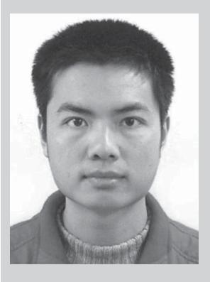
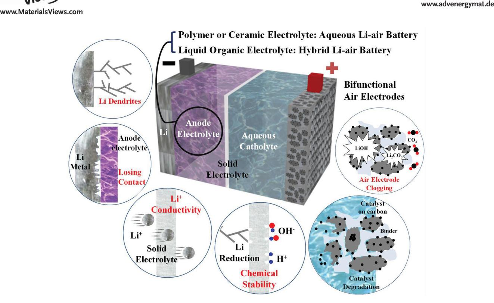
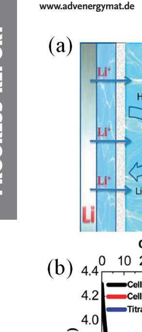
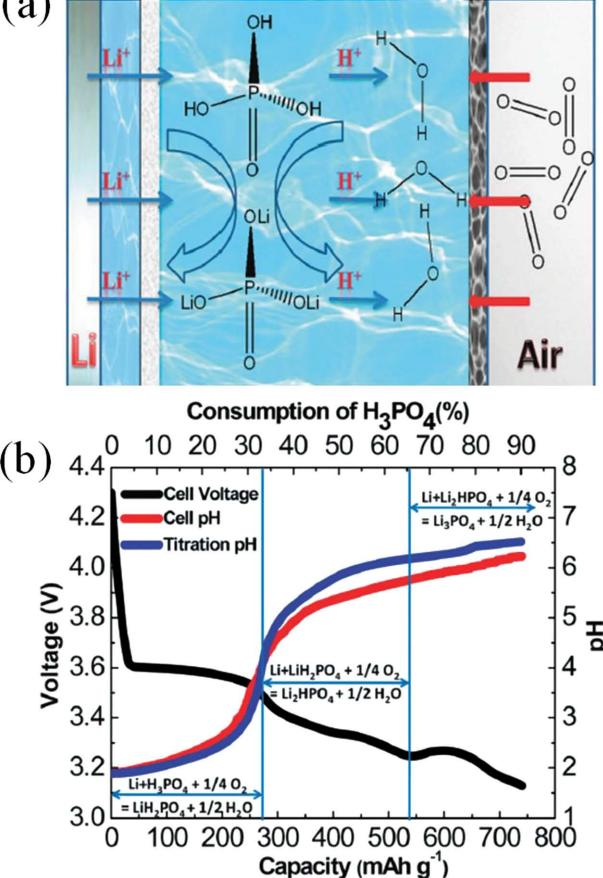
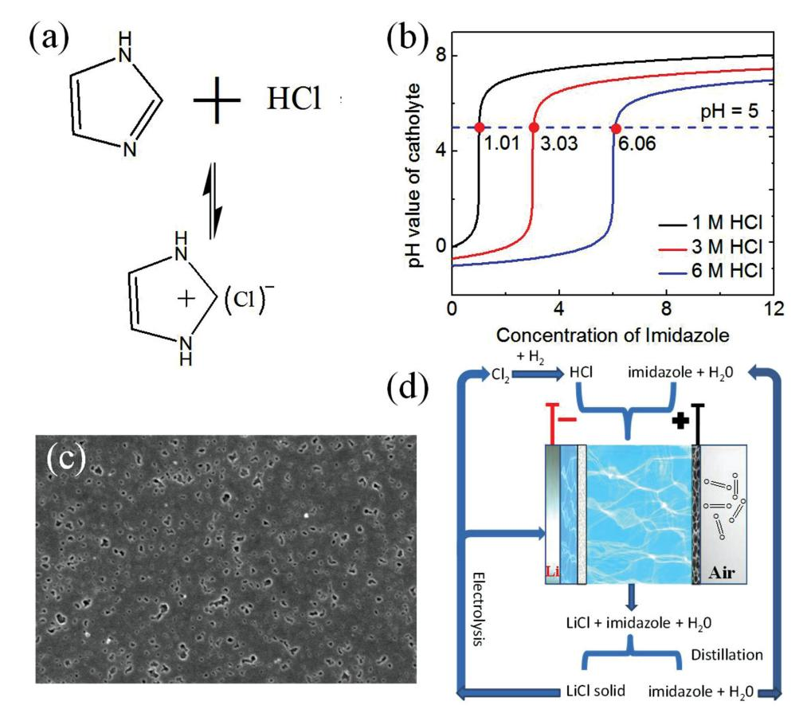
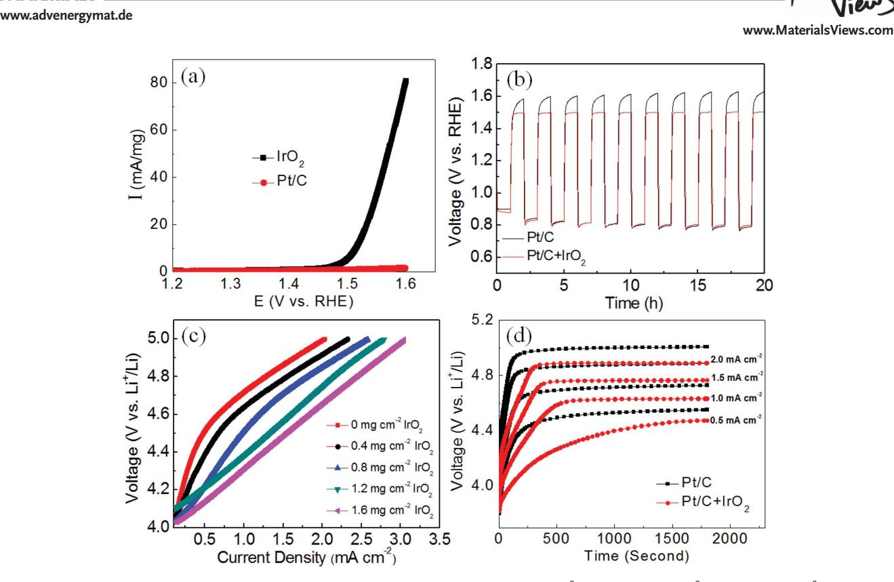
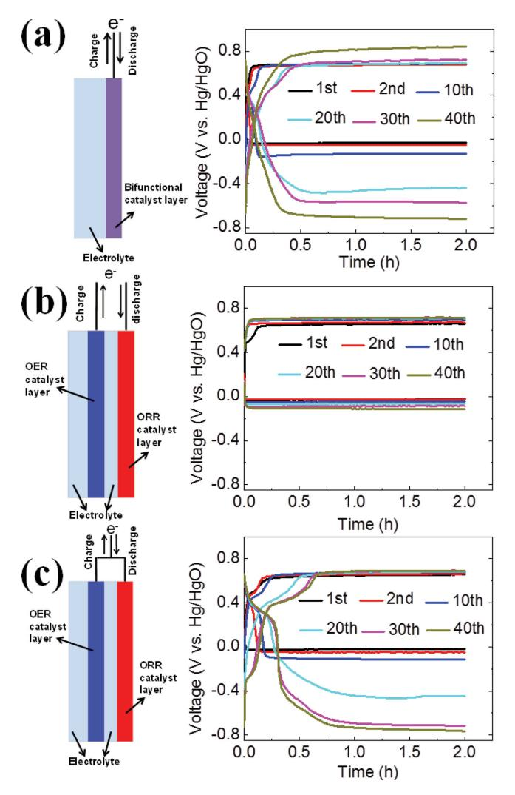
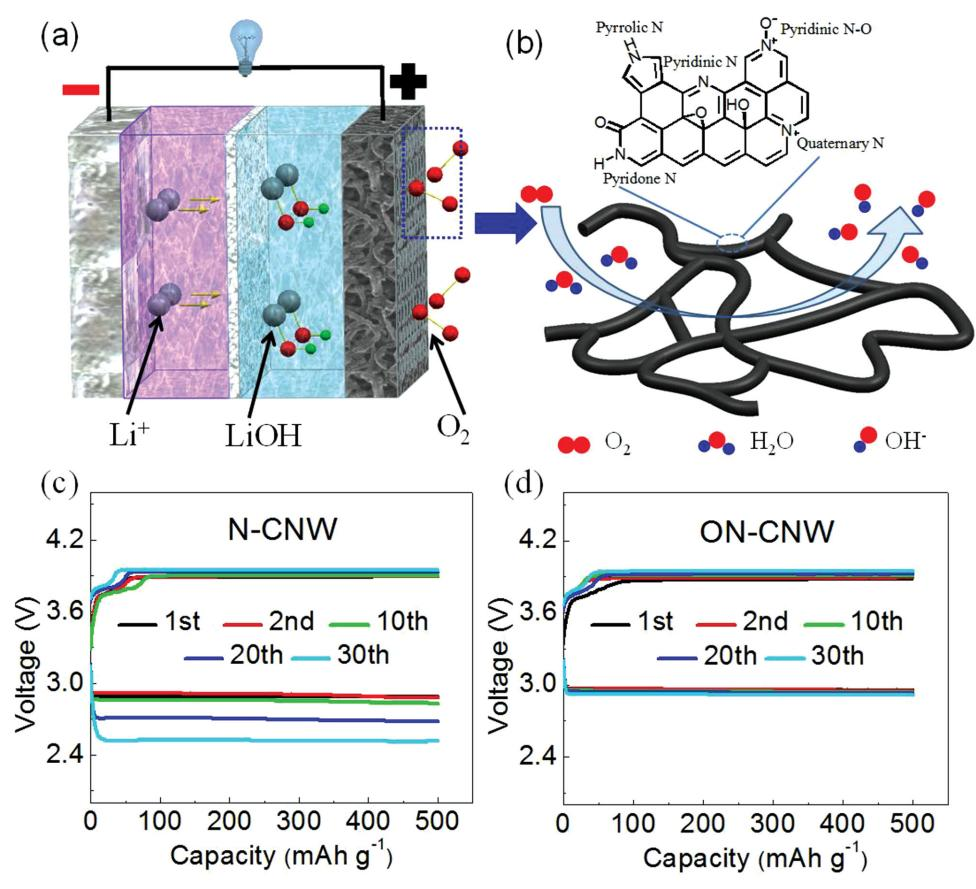
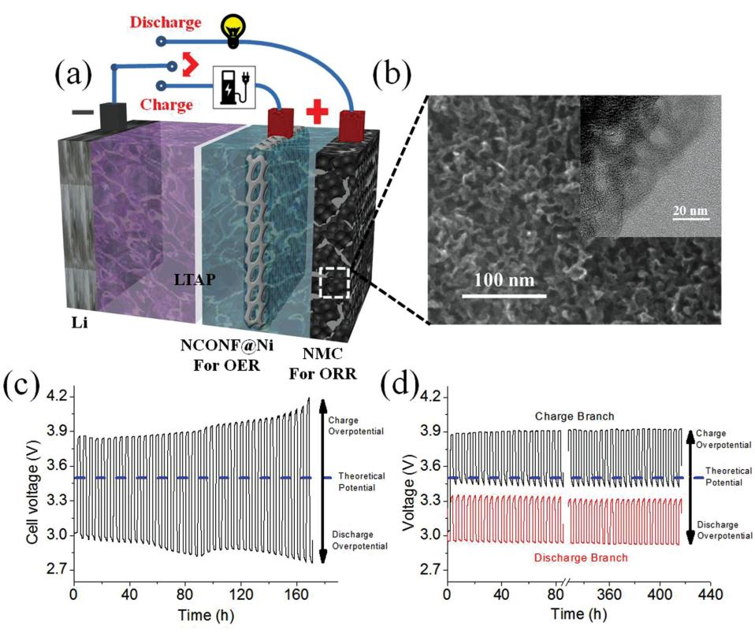

**www.MaterialsViews.com**

# **Hybrid and Aqueous Lithium-Air Batteries**

 *Arumugam Manthiram \* and Longjun Li* 

 **Lithium-air (Li-air) batteries have become attractive because of their extremely high theoretical energy density. However, conventional Li-air cells operating with non-aqueous electrolytes suffer from poor cycle life and low practical energy density due to the clogging of the porous air cathode by insoluble discharge products, contamination of the organic electrolyte and lithium metal anode by moist air, and decomposition of the electrolyte during cycling. These diffi culties may be overcome by adopting a cell confi guration that consists of a lithium-metal anode protected from air by a Li + -ion solid electrolyte and an air electrode in an aqueous catholyte. In this type of confi guration, a Li + -ion conducting "buffer" layer between the lithium-metal anode and the solid electrolyte is often necessary due to the instability of many solid electrolytes in contact with lithium metal. Based on the type of buffer layer, two different battery confi gurations are possible: "hybrid" Li-air batteries and "aqueous" Li-air batteries. The hybrid and aqueous Li-air batteries utilize the same battery chemistry and face similar challenges that limit the cell performance. Here, an overview of recent developments in hybrid and aqueous Li-air batteries is provided and the factors that infl uence their performance and impede their practical applications, followed by future directions are discussed.** 

# **1. Introduction**

 Li-ion batteries have enjoyed great success in the fi eld of portable electronics due to their higher energy densities as compared with other rechargeable battery systems such as nickel-cadmium or lead-acid. [ 1 ] They are currently being intensively pursued for electric vehicles and storage of electricity produced from renewable sources such as solar and wind energies. However, the adoption of Li-ion batteries for these latter applications is limited by the energy, power, cycle life, cost, and safety concerns. For example, currently available liquid electrolytes tend to decompose beyond ≈4.3 V and the capacity of insertion-oxide cathodes reach a limit of ≈250 mA h g −1 . Therefore, new battery chemistries beyond Li-ion technology are needed to develop the next generation of electrochemical energy storage systems.

 Lithium metal is the most promising anode material for high energy density batteries because it possesses a high specifi c

 Prof. A. Manthiram, L. Li Electrochemical Energy Laboratory Materials Science and Engineering Program The University of Texas at Austin Austin , TX 78712 , USA E-mail: manth@austin.utexas.edu

capacity (3860 mA h g −1 ) and the lowest reduction potential (–3.04 V vs NHE). **Table 1** lists the cell voltage, theoretical capacity, and energy density of a few representative battery systems based on the total mass of the anode and cathode. Since aqueous Li-air batteries have the same battery chemistry as hybrid Li-air batteries, they are not listed in the table. The only difference between hybrid and aqueous Li-air batteries is the different anode electrolyte used between the solid electrolyte and lithium metal anode, as shown in **Figure 1** . In the "hybrid" Li-air battery, the anode electrolyte is a polymeric separator soaked with a liquid organic electrolyte, while in the "aqueous" Li-air battery, the anode electrolyte is a Li + -ion conducting polymer or ceramic.

 As can be seen in Table 1 , Li-S (Li 2 S as the discharge product) and aprotic Li-O 2 (Li 2 O 2 as the discharge product) batteries possess comparable capacities due to the similar molecular weights of S and O 2 and a two electron redox reaction in both the systems. However, the voltage of

the Li-O 2 couple (3.0 V) is higher than that of the Li-S couple (2.2 V), which results in a higher energy density. For the hybrid Li-O 2 -H 2 O couple, although water is introduced during the reduction of O 2 , the theoretical specifi c capacity (1119 mA h g −1 ) is not signifi cantly lower than that of the aprotic Li-air battery. This occurs because in the Li-O 2 -H 2 O couple, four electrons are transferred per oxygen molecule. In addition, the cell voltage of the hybrid Li-O 2 -H 2 O cell is even higher (3.4 V), leading to a higher energy density of 3804 Wh kg −1 . In several publications, the calculated energy density of the Li-O 2 -H 2 O cell is lower because LiOH·H 2 O is taken as the discharge product. [ 2 ]

**Table 1.** Theoretical data for several battery systems based on their battery chemistry.

| Battery chemistry                                       | Voltage [V] | Capacity [mAh g −1 ] | Energy density [Wh kg −1 ] |
|---------------------------------------------------------|----------------|----------------------------|----------------------------------|
| Li-ion 3C + LiCoO 2 ↔ 0.5C 6 Li + Li 0.5 CoO 2          | 3.8            | 100                        | 380                              |
| Li-S 2Li + S ↔ Li 2 S                                   | 2.2            | 1167                       | 2566                             |
| Aprotic Li-O 2 2Li + O 2 ↔ Li 2 O 2                     | 3.0            | 1168                       | 3504                             |
| Hybrid Li-O 2 -H 2 O 4Li + O 2 + 2H 2 O ↔ 4LiOH      | 3.4            | 1119                       | 3804                             |
| Hybrid Li-O 2 -HCl 4Li + O 2 + 4HCl ↔ 4LiCl + 2H 2 O | 4.3            | 521.4                      | 2242                             |

**www.advenergymat.de**

**DOI: 10.1002/aenm.201401302**

 For a hybrid Li-O 2 -HCl cell with the acidic catholyte (HCl), the theoretical energy density is reduced to 2241 Wh kg −1 due to the heavier molecular weight of HCl as compared to H 2 O. Overall, as seen in Table 1 , the theoretical energy density of hybrid Li-air batteries is on the same order of magnitude as aprotic Li-air batteries. However, a higher system-level energy density is anticipated with hybrid Li-air batteries because the hybrid Li-air batteries can be operated in an ambient environment, eliminating excess battery components needed to keep the batteries operating in a pure oxygen environment. [ 3 ] In addition to the high specifi c weight energy density, the specifi c area capacity of hybrid Li-air batteries (>100 mAh cm −2 ) is also much higher than that of aprotic lithium-air batteries (0.1–1 mAh cm −2 ). [ 4 ] The battery chemistry of hybrid Li-air batteries also enables the development of a fl ow-through mode for the catholyte, which further increases the practical energy density and power of hybrid Li-air batteries. [ 5 ]

 Since the pioneering work of Visco et al., [ 6 ] tremendous efforts have been made on solving the persistent problems associated with hybrid and aqueous Li-air batteries. The challenges facing the rechargeable hybrid and aqueous Li-air batteries are summarized in Figure 1 . The lithium-metal anode has been a persistent problem for rechargeable batteries for 40 years. For hybrid Li-air batteries with a liquid organic electrolyte on the anode side, lithium dendrites will easily develop upon cycling. Although there will not be an internal short-circuit problem since the solid electrolyte can block the dendrites, the solid electrolyte can be reduced and damaged by contacting lithium metal due to the facile reduction of ions like Ti 4+ or Ge 4+ in the solid electrolyte. [ 7 ] For aqueous Li-air batteries with a Li + -ion conducting polymer buffer layer at the anode side, dendrites can easily form without proper additives in the polymer electrolyte. [ 8 ] For aqueous Li-air batteries with a Li + -ion conducting ceramic buffer layer, dendrite growth has not been reported as the ceramic materials with a modulus >6 GPa reduce dendrite growth. [ 9 ] However, the interfacial contact area is prone to decrease due to the repeating inhomogeneous delithiation and lithiation of the lithium metal surface. [ 10 ] Furthermore, in both hybrid and aqueous Li-air systems, the cycling effi ciency of the lithium-metal anode is affected by the formation of a solid-electrolyte interphase (SEI) layer on the lithium-metal surface. [ 11 ]

 The solid electrolyte is the key component that enables hybrid and aqueous Li-air batteries. Several types of possible solid electrolytes are summarized in this progress report including their crystalline states, compositions, Li + -ion conductivity, and stability in contact with lithium metal and aqueous catholytes. Currently, the most successful solid electrolyte in Li-air battery research is the commercial NASICON-type glass-ceramics Li 1+ *x* + *y* Al x Ti 2- *x* Si y P 3- *y* O 12 (or LTAP, Ohara Inc., Japan). The popularity of the LTAP solid electrolyte is due to its high Li + -ion conductivity and mechanical strength, as well as its chemical stability in water, mild acids, and mild bases. Here, we will see that the glass-ceramic LTAP is not the ultimate solid electrolyte possessing the highest Li + -ion conductivity and chemical stability of all usable solid electrolytes. The instability of LTAP in contact with lithium metal necessitates the addition of a buffer layer between the lithium metal and the solid electrolyte. This buffer layer causes many technical issues that affect the performance and stability of hybrid and aqueous Li-air batteries.

**www.MaterialsViews.com**

**Arumugam Manthiram** is a Professor and holder of the Cockrell Family Regents Chair in Engineering in the Materials Science and Engineering Program and Department of Mechanical Engineering at the University of Texas at Austin. He is also the Director of the Texas Materials Institute and the Materials Science and Engineering Program. His research interests are in the area of rechargeable batteries, fuel

cells, and solar cells, including novel synthesis approaches for nanomaterials and nanocomposites.

**Longjun Li** received his B. Eng. degree from the Department of Materials Science and Engineering at Huazhong University of Science and Technology in 2010. He obtained his Ph.D. degree in Materials Science and Engineering from the University of Texas at Austin (UT Austin) in 2014 under the supervision of Prof. Arumugam Manthiram. He is now a postdoctoral fellow at UT Austin.

His research focuses on hybrid Li-air batteries and related materials.

 A shared problem of all metal-air batteries lies in the effi ciency and stability of the bifunctional air cathode. The air cathode utilizes air as the active material. The reversibility of hybrid and aqueous Li-air batteries requires high activity and durability of the bifunctional air electrode for both the oxygen reduction reaction (ORR) during discharge and the oxygen evolution reaction (OER) during charge. There are several reviews summarizing the status of bifunctional ORR/OER catalysts for regenerative fuel cells and traditional metal-air batteries. [ 12 ] This report will only cover the bifunctional air-electrode research for hybrid and aqueous Li-air batteries.

# **2. Battery Chemistry**

#### **2.1. Traditional Opinions**

 It is generally understood that the battery chemistry of the hybrid and aqueous Li-air batteries consists of the reversible four-electron reduction/evolution of oxygen at the cathode and the Li/Li + redox couple at the anode. Depending on the pH of the aqueous electrolyte, the overall cell reactions are as follows:

**Figure 1.** Challenges facing the hybrid and aqueous Li-air batteries. The anode electrolyte can be a conventional polymeric separator soaked with an organic electrolyte or a polymer or ceramic Li + -ion solid electrolyte, as indicated.

$$4\text{Li} + \text{O}_2 + 4\text{H}^+ \leftrightarrow 4\text{Li}^+ + 2\text{H}_2\text{O} \quad \text{E}^\circ = 4.27 \text{ V} \tag{1}$$

$$4\text{Li} + \text{O}_2 + 2\text{H}_2\text{O} \leftrightarrow 4\text{LiOH } \text{E}^\circ = 3.44 \text{ V}$$
 (2)

 There are very few reports studying the discharge/charge mechanisms of hybrid and aqueous Li-air batteries. This is probably due to the fact that the ORR and OER in aqueous solutions have been well studied. In addition, the discharge products of hybrid and aqueous Li-air batteries are mostly soluble in the catholyte mixed with the supporting salt, making them diffi cult to collect and analyze. In some cases, only visual examination was utilized to determine that discharge products deposited on the LTAP membrane or the air electrode. [ 10 ]

 We developed an in situ pH measurement method to study the discharge mechanism of hybrid Li-air batteries with acidic catholyte, since the discharge process is related to the consumption of protons in the catholyte. [ 13 ] The schematic diagram of the operating principle of a hybrid Li-air battery with a phosphoric acid catholyte is shown in **Figure 2** a. Upon discharge, the three protons in the phosphoric acid are consumed one by one, accompanied by an increase in the pH value of the catholyte. While the cell was discharged, a micro pH meter was inserted into the catholyte. As can be observed from the red curve in Figure 2 b, there is a sharp increase in the pH value upon the consumption of the fi rst proton in the phosphoric acid, associated with the large difference between the dissociation constants of the fi rst and secondprotons in H 3 PO 4 . Then, the pH curve increases slowly and there was no sharp increase in the pH value upon consumption of the second and third protons because the hydrolysis of Li 2 HPO 4 and Li 3 PO 4 is suppressed by the high concentration of Li + ions in the catholyte. Recently, the in situ pH measurement has been applied in a hybrid Li-air battery with malonic acid catholyte. [ 14 ]

### **2.2. Side Reactions**

 For hybrid Li-air batteries with an alkaline catholyte, Li 2 CO 3 is inevitably formed in the air electrodes due to CO 2 ingression. [ 15 ] The catalyst species and surface functional groups infl uence the distribution of deposited Li 2 CO 3 , affecting the full-cell performance.

 A recent study reported that Li 2 O 2 may also be produced during the discharge process in hybrid Li-air batteries. [ 16 ] The authors utilized a Li + -ion saturated solution as the catholyte and Ketjen black as the catalyst. After a long-term discharge in a pure oxygen atmosphere, the air electrode was subjected to ex situ X-ray diffraction (XRD) analysis. They found that the main reaction product of the discharge process was Li 2 O 2 . This might have been due to the low catalytic activity of the Ketjen black catalyst, which could lead to a two-electron ORR process that produced Li 2 O 2 . In addition, the high concentration of Li + ions in the electrolyte could have suppressed the hydrolysis of Li 2 O 2 , and a high content of PTFE in the air electrode could have created a water-insuffi cient environment in the air electrode.

 Another side reaction that may dominate the discharge and charge voltage profi les is the supercapacitor or pseudocapacitor effect, especially when small current densities and short operation time are applied. For example, a typical MnO 2 cathode provides a capacity of ≈30 mAh g −1 coming from the

**Figure 2.** a) Schematic diagram of the operating principle of a hybrid Li-air battery with a phosphoric acid catholyte. b) In situ pH measurement during cell discharge compared with the ex situ titration curve. Reproduced with permission. [ 13 ] Copyright 2012, Royal Society of Chemistry.

pseudocapacitor effect. [ 17 ] With a loading of ≈10 mg cm −2 , a discharge/charge current of 0.1 mA cm −2 for 0.5 h covers only 1/6 of the total capacitance. Thus, the discharge/charge voltage profi les represent a hybrid electrochemical capacitor instead of a hybrid Li-air battery. No catalytic information can be drawn based on such discharge/charge voltage profi les.

 Carbon oxidation may compete with OER during the charge process of hybrid Li-air batteries. With a theoretical voltage of 0.207 V vs RHE, which is much lower than the theoretical OER potential (1.23 V vs RHE), the carbon oxidation is inevitable during the charge process in a conventional bifunctional air electrode with carbon support. [ 18 ] Carbon oxidation will infl uence the voltage profi les as well as the stability of hybrid Li-air batteries upon cycling, especially when the carbon possesses large amount of functional groups on the surface. Thus, it is diffi cult to judge the catalytic activity of carbon–based catalysts in hybrid Li-air batteries solely based on the discharge/charge voltage profi les. For example, less-stable carbon has lower charge voltage due to a large portion of the charge current from carbon oxidation. But it does not mean less stable carbon has better catalytic activity for OER.

 Another side reaction competing with OER is Cl 2 evolution, especially when catholytes contain a high concentration

**www.MaterialsViews.com**

of Cl − ions. [ 19 ] Although the standard electrode potential of the chlorine evolution reaction (CER) is higher than that of the OER reaction, the overpotential for CER is usually lower than OER. CER makes the cell reaction of hybrid Li-air batteries irreversible. The salts in the catholyte will be consumed gradually.

 There are also two side reactions that may compete with ORR during the discharge of hybrid Li-air batteries. The fi rst one is hydrogen peroxide formation. [ 19 ] This two-electron ORR process is mainly due to less active catalysts used, such as undoped carbon. The HO 2 − radicals are corrosive and tend to destroy the catalytic active sites of the catalysts. The second one is hydrogen evolution. This reaction happens when the catalysts are corroded and lose the ORR activity or the air electrode is clogged by discharge products or side-reaction products and O 2 cannot reach the catalyst. [ 20 ] This side reaction consumes water in the catholyte, making the battery reaction irreversible.

# **3. Lithium Anode**

 In order to utilize the ultra-high theoretical capacity of the lithium-metal anode in hybrid and aqueous Li-air batteries, several technical issues need to be addressed. First, during the charge of Li-air batteries, the electrodeposited Li tends to develop a dendritic morphology. The lithium dendrites grow from the lithium metal and approach the solid electrolyte. Once these dendrites make contact, the solid electrolyte (which contains Ti 4+ or Ge 4+ ) will get reduced and its conductivity will drastically drop. Secondly, the lithium-metal anode suffers from a low-cycling effi ciency. During charge and discharge, lithium deposition and dissolution occur, respectively, through the SEI, which is a product of the reaction of lithium-metal surface with the electrolyte. As the lithium anode changes shape and volume during cycling, the SEI breaks down and a new SEI forms on any freshly exposed lithium surface. By this process, both the lithium metal and the electrolyte are consumed, requiring excess lithium and electrolyte in the battery. Thirdly, in aqueous Li-air batteries, which use a solid ceramic buffer layer between the lithium-metal anode and the solid electrolyte, the loss of contact between the lithium metal and ceramic buffer layer deactivates parts of the cell. Since the solid electrolyte completely blocks the Li metal from the ORR/OER reactions at the cathode side, except for Li + -ion exchange, the investigation of lithium-metal anode in hybrid Li-air batteries can benefi t from the knowledge of traditional lithium-ion batteries.

# **3.1. Dendrite Growth**

 Dendrite growth can cause many problems in hybrid and aqueous Li-air batteries because the most widely used solid electrolyte LTAP is unstable in direct contact with lithium metal. Although a buffer layer (e.g., a liquid organic electrolyte soaked in a polymeric separator or a polymer) can be placed between the lithium-metal anode and the solid electrolyte, dendrites will grow and penetrate this buffer layer, especially after many cycles. Studies have shown that the dendrites could be effectively suppressed by additives in the polymer electrolyte. Imanishi et al. [ 8 ] studied the electrical conductivity and Li + -

ion transport properties of polyethylene oxide (PEO) (with the lithium salt Li(CF 3 SO 2 ) 2 N,LiTFSI) as a function of the amount of N-methyl-N-propylpiperidinium-bis(fl uorosulfonyl)imide (PP13FSI), an ionic liquid addictive. They found that the conductivity of PEO 18 LiTFSI- *x* PP13FSI increased with *x* and the lowest interface resistance was achieved with 1.2 ≤ *x* ≤ 1.44. The lithium dendrite growth was suppressed by the addition of PP13FSI into PEO 18 LiTFSI as confi rmed by an in situ optical visualization cell.

 The addition of SiO 2 nanoparticles as a buffer layer fi ller in the PEO 18 LiTFSI-PP13FSI polymer electrolyte has been shown to further suppress Li dendrite formation. [ 21 ] Furthermore, the ionic conductivity increased and the interfacial resistance decreased as a result of the incorporation of SiO 2 nanoparticles. The nanoparticle fi llers improve interfacial compatibility due to 1) a reduced reactivity of lithium-metal with the electrolyte, 2) increased stiffness and compressibility which inhibit dendrite growth, and 3) even current distribution upon charge and discharge. [ 11b ] Later, poly(ethylene glycol) dimethyl ether (PEGDME) was also reported as an effective additive to the PEO 18 LiTFSI polymer electrolyte to increase its Li + -ion conductivity and suppress dendrite formation by the same research group. [ 22 ]

 In hybrid Li-air batteries, dendrite formation occurs in the liquid carbonate electrolyte (e.g. *,* 1 M LiPF 6 in ethylene carbonate (EC)/diethylcarbonate (DEC) (1:1 v/v)). [ 23 ] Although layers of separator can be placed between the lithium-metal anode and the solid electrolyte to block the dendrites, after continuous cycling, dendrites will fi nally penetrate the separators and touch the solid electrolyte. Dendrite formation can be greatly suppressed by choosing appropriate solvents, supporting salts, and electrolyte additives. Liquid carbonate electrolytes have been successfully utilized in commercial Li-ion batteries due to their compatibility with Li-intercalation oxide cathodes and graphitic carbon anode. However, they are not useful for suppressing dendritic Li growth on the lithium-metal anode. [ 24 ] Ether solvents, such as tetrahydrofuran (THF), 2-methyltertrahydrofuran (2-Me-THF), and diethyl ether (DEE), have been reported to have fewer dendrite formation problems. [ 25 ] However, in these cases, prolonged cycling still led to dendritic Li deposition. [ 26 ] Other possible solvents include a series of fl uorinated esters, boric acid esters of glycol (BEG), and tetramethylene sulfone, all of which were reported to improve the performance of lithium-metal anode. [ 27 ] Li salts are not as diverse as the solvents. Among the major salts used for lithium batteries, LiClO 4 , LiOSO 2 CF 3 , and LiTFSI do not suppress the formation of Li dendrites. [ 24,28 ] LiPF 6 has been shown to promote interfacial stability of the Li-metal anode possibly through HF, which is produced by the reaction between PF 6 − and trace amounts of water in the electrolyte. [ 29 ] Other possible candidates are lithium bis(perfl uoroethylsulfonylimide) (LiN(C 2 F 5 SO 2 ) 2 , LiBETI) and ionic liquids. [ 28,30 ]

 Adding a small amount of additives into the electrolyte is another effective way to control the Li-metal surface through the following four mechanisms: 1) reaction with the Li surface to produce stable SEI layers, 2) controlling the current distribution or reducing Li reactivity with the electrolyte, 3) forming Li alloys that affect the electrodeposited Li morphology, and 4) an electrostatic shielding mechanism by introducing Cs +

or Rb + cations. [ 11b ] Kanamura et al. [ 29b ] added a small amount of HF to various nonaqueous electrolytes. Lithium dendrites formed in all of the electrolytes without the HF additive. On the other hand, the electrodeposited lithium in all of the electrolytes containing HF was dendrite-free. The authors concluded that HF will react with the native Li surface layers, producing a very thin fi lm of a LiF-Li 2 O bilayer, which promotes smooth lithium deposition. Naoi et al. [ 31 ] tried to stabilize the lithium surface by adding two kinds of monotonic polyether-type surfactants: polyethyleneglycol dimethyl ether and a copolymer of dimethylsilicone and propylene oxide. They found that the lithium surface fi lms were very stable and localized deposition was suppressed in the presence of these surfactants. Other similar surfactants are compounds of decalin and benzene. [ 32 ]

 A different approach is to introduce a small amount of metal ions (e.g., Na, Mg, Al, and Sn) into the lithium electrolyte. [ 33 ] This results in a co-deposition of the additive ions and lithium ions, which suppresses the dendrite growth. It was suggested that the Li surface becomes more regular as a result of a thin layer of a Li-alloy.

 An electrostatic shielding mechanism was proposed by Zhang et al. [ 34 ] A small amount of Cs + or Rb + cations was added to the electrolyte. During lithium electrodeposition, these cations form a positively charged electrostatic shield around any growth tip of the protuberances, forcing further deposition of lithium to nearby regions and thus eliminating dendrite formation.

### **3.2. Lithium Anode/Buffer Layer Interface**

 In aqueous Li-air batteries, the lithium-metal anode is separated from the solid electrolyte by another Li + -ion conducting solid (e.g., polymer, ceramic, etc.), which acts as a buffer layer. The interfacial resistance between the polymer buffer layer and lithium-metal anode is large at room temperature, leading to huge overall cell resistance. [ 35 ] However, the interfacial resistance could be greatly reduced by increasing the operating temperature to 60 °C. [ 36 ] Thus, the aqueous Li-air batteries with a polymer-anode electrolyte are usually operated at elevated temperatures to decrease the cell resistance and make the cell operational. The interface between the lithium metal and the buffer layer may be degraded upon repeated cycling. Philipe et al. [ 10 ] utilized lithium phosphorous nitride (LiPON) with a thickness of 0.5–2 µm as the buffer layer, which was deposited by radio frequency cathodic pulverization. Up to 40 cycles were obtained with cells cycled at a current density of 2 mAh cm −2 . The main reason for cell degradation was identifi ed as the loss of contact between the lithium metal and the LiPON buffer layer. Although a dense layer of lithium was formed during the initial charge, the dense layer became more porous and columnar upon Li dissolution and deposition. This volume change produced mechanical constraints on the lithium layer and led to the loss of contact between lithium and the ceramic. In addition, the possibility of solid-electrolyte degradation via lithium crossing through the thin layer of LiPON remained if the surface of the solid electrolyte was not suffi ciently clean or dust-free.

 Imanishi et al. [ 37 ] applied PEO 18 LiTFSI -1.44PP13TFSI as the buffer layer in aqueous Li-air batteries. Although the interfacial

| Name       | Type           | Typical composition                   | Ionic conductivity (S cm −1 , RT) | Stability with Li metal | Chemical stability                     | Ref.    |
|------------|----------------|---------------------------------------|--------------------------------------|-------------------------|----------------------------------------|---------|
| NASICON    | glass ceramics | Li 2 O-Al 2 O 3 -TiO 2 -P 2 O 5       | 1.3 × 10 −3                          | no                      | stable in air, mild acids and bases | [43,57] |
| NASICON    | crystalline    | Li 1.3 Al 0.3 Ti 1.7 (PO 4 ) 3        | bulk 3 × 10 −3                       | no                      | stable in air                          | [42]    |
| NASICON    | crystalline    | Li 1.15 Y 0.15 Zr 1.85 (PO 4 ) 3      | bulk 1.4 × 10 −4                     | yes                     | stable in air                          | [45b]   |
| Garnet     | crystalline    | Li 7- x La 3 Zr 2- x Ta x O 12        | 1 × 10 −3                            | yes                     | stable in air, LiCl satured water   | [51,61] |
| Perovskite | crystalline    | Li 3 x La (2/3)− x (1/3)−2 x TiO 3 | bulk 1.5 × 10 −3                     | no                      | stable in air, water                   | [52,58] |
| LISICON    | crystalline    | Li 14 ZnGe 4 O 16                     | 1 × 10 −6                            | no                      | not stable in air                      | [39,54] |
| Si wafer   | single crystal | Si                                    | 6 × 10 −7                            | no                      | stable in air, acids                   | [55,64] |

**Table 2.** Summary of possible solid electrolytes for hybrid and aqueous Li-air batteries.

resistance was greatly reduced by a doping of the ionic liquid in the polymer electrolyte, the cell performance was signifi cantly affected by SEI formation, leading to increased electrode resistance within the initial 25 cycles. A similar anode confi guration was also applied in a hybrid electrochemical capacitor developed by the same group. [ 38 ] About 27% of the capacity was lost after 2000 cycles due to the degradation of the multi-layered Li negative electrode.

# **4. Solid Electrolyte**

 The solid electrolyte is the key component that enables the concept of hybrid and aqueous Li-air batteries. The foremost requirement for the solid electrolyte is a thin and mechanically robust membrane with a high Li + -ion conductivity at the operating temperature. Furthermore, they should be chemically stable in contact with aqueous electrolytes of various pH values, organic electrolytes, and lithium metal. Finally, as in all industrial developments, solid-state Li + -ion conductors must be environmentally benign, non-toxic, and low-cost materials and easy to fabricate. [ 39 ] **Table 2** summarizes the possible solid electrolytes for hybrid and aqueous Li-air batteries. We mainly discuss fi ve types of solid Li + -ion conductors here due to their possible stability in water: perovskite-type, NASICON-type, LISICON-type, and garnet-type Li + -ion conducting oxides, and single-crystal silicon wafers.

# **4.1. Fast Li + -Ion Conduction**

 Currently the most successful solid electrolyte in hybrid and aqueous Li-air batteries is the NASICON-type glass-ceramics (Li 1+ *x* + *y* Al x Ti 2- *x* Si y P 3- *y* O 12 or LTAP) produced by Ohara Inc., Japan. The specialty of this solid electrolyte lies in its high Li + -ion conductivity, good mechanical strength, and very good chemical and thermal stabilities. [ 40 ] Two kinds of solid electrolytes are commercially available: Li 2 O-Al 2 O 3 -SiO 2 -P 2 O 5 -TiO 2 -GeO 2 with a conductivity of 1 × 10 −4 S cm −1 and Li 2 O-Al 2 O 3 -SiO 2 -P 2 O 5 -TiO 2 with a higher conductivity of 2.5 to 4 × 10 −4 S cm −1 at 25 °C. The former has better mechanical strength than the latter. The NASICON NaA IV2 (PO 4 ) 3 (A IV = Ge, Ti and Zr) crystal structure was identifi ed in 1968. [ 41 ] The NASICON A x B 2 (PO 4 ) 3 has a framework structure built of corner-sharing PO 4 tetrahedra and BO 6 octahedra, providing a relatively open, three-dimensional network of sites and conduction pathways for various A cations. The Li + -ion conductivity could be greatly enhanced by substituting trivalent cations (Al, Cr, Ga, Fe, Sc, In, Lu, Y, or La) in the octahedral sites. For example, Aono et al. [ 42 ] reported that the conductivity of Li 1+ *xM* x Ti 2- *x* (PO 4 ) 3 ( *M* = Al, Sc, Y, and La) increased with increasing content of the M 3+ , and the maximum conductivity was obtained at *x* = 0.3 for all the systems. Some of the main reasons for the improvements were thought to be the increase in the concentration of Li + and the density of the pellet. The highest conductivity was obtained with the nominal composition Li 1.3 Al 0.3 Ti 1.7 (PO 4 ) 3 (bulk conductivity = 3 × 10 −3 S cm −1 at 298 K).

 Compared with sintered materials, glass-ceramics are advantageous due to the ease of manufacturing and dense microstructure. [ 43 ] Heat-treatment of glasses with the formula Li 2 O- *M*2 O 3 -TiO 2 -P 2 O 5 ( *M* = Al and Ga) results in fast Li + -ion conduction in the glass-ceramics. The glass-ceramics contain a main crystalline phase of LiTi 2 (PO 4 ) 3 with Ti 4+ partially replaced by Al 3+ or Ga 3+ . The maximum conductivity obtained was 1.3 × 10 −3 S cm −1 and 9 × 10 −4 S cm −1 , respectively, for Al 3+ or Ga 3+ doping at room temperature. [ 43 ] Another system of the NASICON family is LiZr 2 (PO 4 ) 3 , which should be electrochemically stable in contact with lithium metal. The NASICON LiZr 2 (PO 4 ) 3 prepared at 1473 K exhibits a fi rst order transition from the triclinic *C*1 to the rhombohedral *R c* 3 form at about 310 K, and the rhombohedral phase *R c* 3 with high Li + -ion conductivity can be stable only above 50 ºC. [ 44 ] The substitution of Ca 2+ or Y 3+ for Zr 4+ in LiZr 2 (PO 4 ) 3 can transform the structure to rhombohedral NASICON at room temperature and increase the bulk Li + -ion conductivity above 1 × 10 −4 S cm −1 . [ 45 ]

 Other promising Li + -ion solid electrolytes with high Li + -ion conductivity are the Li-rich garnet-type metal oxides. Weppener's group [ 46 ] reported facile Li + -ion conduction in Li 5 La 3*M*2 O 12 ( *M* = Nb, Ta), which led to world-wide interest in garnet-type Li + -ion conductors. Li 7 La 3 Zr 2 O 12 was reported to exhibit a high Li + -ion conductivity of > 10 −4 S cm −1 at 25 ºC and stability in contact with lithium metal. [ 47 ] The bulk and grain boundary resistances are on the same order of magnitude, which is benefi cial for ceramic solid electrolytes with a polycrystalline structure. [ 48 ] Adding Al 2 O 3 has been found to help with the sintering of Li 7 La 3 Zr 2 O 12 without blockage of the Li + -ion framework. [ 49 ]

ENERGY **1ATERIALS** www.advenergymat.de

#### www.MaterialsViews.com

A high Li+-ion conductivity of  $8 \times 10^{-4}$  S cm-1 was obtained by Shingo Ohta et al.[50] with the formula of  $\text{Li}_{6.75}\text{La}_{3}\text{Zr}_{1.75}\text{Nb}_{0}$ 25O12. Recently, an even higher Li+-ion conductivity of ≈1 × 10-3 S cm-1 has been obtained with  $\text{Li}_{7-x}\text{La}_3\text{Zr}_{2-x}\text{Ta}_x\text{O}_{12}$  ( $x = 0.6$ , activation energy  $E_a = 0.35$  eV) by Goodenough's group.[51]

The perovskite-type  $(ABO3)$  lithium lanthanum titanate (LLTO) is also an excellent Li+-ion conductor, with the formula of Li3xLa(2/3)-x(1/3)-2xTiO3 (0 < 0.16). A high bulk conductivity of  $1 \times 10^{-3}$  S cm-1 ( $E_a = 0.4$  eV) at 27 °C, which was comparable to that of a polymer or liquid electrolyte, was obtained when  $x \approx 0.1$ .[52] The high Li+-ion conductivity of LLTO is related to the large concentration of  $A$  site vacancies, which allow for the movement of  $Li^+$  ions between the A sites. By substituting La with 5 mol% Sr, a slightly higher bulk conductivity of  $1.5 \times 10^{-3}$  S cm-1 was achieved. Despite the high bulk ionic conductivity, the problem of the LLTO solid electrolyte lies in its high grain-boundary resistance, which hinders its application as a polycrystalline solid-electrolyte membrane.[53]

LISICON stands for Lithium Super Ionic Conductor, a name that was first given to  $\text{Li}_{14}\text{ZnGe}_4\text{O}_{16}$ .  $\text{Li}_{14}\text{ZnGe}_4\text{O}_{16}$  belongs to the solid solution  $Li_{2+2x}Zn_{1-x}GeO_4$ , which contains interstitial Li+ ions with the range of  $-0.36 \le x \le +0.87$ . Although  $\text{Li}_{14}\text{ZnGe}_{4}\text{O}_{16}$  has a very high Li+-ion conductivity of 0.125 S cm-1 at 300 °C, the conductivity at room temperature is fairly low (1 × 10-6 S cm-1).[54]

The single-crystal Si wafer solid electrolyte was first utilized in an aprotic Li-air battery to prevent  $O_2$  from diffusing into the lithium anode.[55] The Li+-ion conductivity of Si wafers with different thicknesses was tested in a specially designed set-up. It was found that the wafers possess a maximum Li+-ion conductivity of  $6 \times 10^{-7}$  S cm-1 when the thickness is approximately 5  $\mu$ m. The diffusion coefficient of O2 in silicon is 34 orders of magnitude smaller than that of lithium. In this way, the lithium-metal anode was protected from the gradual corrosion by  $O_2$ , improving the cycle life in the long term.

#### 4.2. Chemical Stability

The stability of the solid electrolyte has a profound influence on the overall cell performance. Most studies on solid electrolytes focus on the high Li+-ion conductivity, but chemical stability in the battery environment is of equal importance to ensure a long lifetime of the battery. The hybrid and aqueous Li-air batteries possess stricter requirements on the solid electrolyte than other types of lithium batteries. Ideally, the solid electrolyte should be stable in aqueous solutions of various pH values. This is difficult because most oxides tend to dissolve in strongly acidic or alkaline solutions. In addition, the solid electrolyte should ideally be stable in contact with lithium metal to reduce internal resistance and eliminate the cost and safety issues coming from the buffer layer between the lithium metal and solid electrolyte.

NASICON-type LTAP materials are unstable with Li metal due to the facile reduction of Ti4+. In one particular case, the reaction between lithium metal and LTAP was observed. which led to the development of cracks in the solid electrolyte.[10] Crack formation on the solid electrolyte was enhanced when pressure was applied on the cell to keep a tight contact between the cell components. Dendrites are formed in both

organic liquid electrolyte and polymer electrolyte.[5a,8] In our experiments, we occasionally observed a change in the color of LTAP when lithium dendrites touched the solid electrolyte after long-term cycling, similar to the reduction of Ti4+ observed in  $\text{Li}_{0.33}\text{La}_{0.57}\text{TiO}_3$ .[56] The LTAP is not stable in strong acids or bases,[57] necessitating the use of a catholyte with a mild pH value as discussed in the catholyte section later.

The perovskite (ABO3)-type lithium lanthanum titanate (LLTO) is unstable with Li metal due to the facile reduction of Ti4+. Wolfenstine et al.[58] studied the stability of LTAP and LLTO in aqueous solutions and found that both electrolytes were relatively stable in a water environment (pH  $\approx$  7) and not stable at low and high pH values. The LISICON-type Li14ZnGe4O16 is highly reactive with lithium metal.[39] In addition, it is not stable with atmospheric CO2 and its conductivity decreases with time. Gopalakrishnan et al.[59] studied the  $Li^+/H^+$  exchange in LISICON-type  $\text{Li}_2\text{ZnGeO}_4$  and  $\text{Li}_{2+2x}\text{Zn}_{1-x}\text{GeO}_4$  ( $x = 0.50$ and  $x = 0.75$ ). They found that the parent material Li2ZnGeO4 does not exhibit a ready Li+/H+ exchange because all of the Li ions form part of the tetrahedral framework structure. However, when the Li+ ions are in both the framework (tetrahedral) and nonframework sites, LISICONs undergo a facile Li+/H+ exchange in a weak acetic acid solution. This facile exchange behavior indicates that this kind of solid electrolyte is not suitable for hybrid and aqueous Li-air batteries due to the replacement of  $Li^+$  ions in the solid electrolyte by  $H^+$  from the aqueous electrolyte. Regardless of the pH value, protons are always present in aqueous solutions.

Garnet-type Li+-ion conductors are stable in contact with lithium metal, eliminating the need for a buffer layer between lithium metal and solid electrolyte which is beneficial for reducing the overall internal resistance of Li-air batteries.[46] Unfortunately, Li-rich garnet oxides are unstable in water and Li+-ions in garnet are exchanged by protons from water quickly. The extent of Li+/H+ exchange depends on the population of Li in octahedral interstitial sites of the garnet framework  $B_3C_2O_{12}$ . A  $Li_xB_3C_2O_{12}$  garnet with  $x \le 3$ contains Li only in the tetrahedral sites  $24d$  and is stable in water.[60] Takeda et al.[61] studied the stability of garnet-type  $\text{Li}_6\text{La}_3\text{Zr}_2\text{O}_{11.5}$  in deionized water and a series of aqueous solutions: saturated LiCl, deionized water, 0.1 M HCl, and 1 M LiOH. They concluded that  $Li_6La_3Zr_2O_{11.5}$  was stable in saturated LiCl with respect to the structure and electrical conductivity, but unstable in water and acidic and alkaline solutions. Yamamoto et al.[62] synthesized  $\text{Li}_{7-x}\text{La}_3\text{Zr}_{2-x}\text{Ta}_x\text{O}_{12}$  ( $x = 0-0.7$ ) with various Ta contents and found  $\text{Li}_{6.75}\text{La}_3\text{Zr}_{1.75}\text{Ta}_{0.25}\text{O}_{12}$ (LLZ-0.25Ta) exhibited the highest relative density of 96.7% and resistance to water permeation. The LLZ-0.25Ta was also tested to be stable in contact with lithium metal and in a LiOHsaturated LiCl solution. However, short-term polarization test indicated lithium dendrites did grow through the grain boundaries and voids in LLZ-0.25Ta, leading to a short circuit of a symmetric cell made by Li/ LLZ-0.25Ta/Li. Similar short-circuit problems can be found in another publication with LLZ solid electrolyte doped with 0.5 wt%  $Al_2O_3$ .[63]

The single-crystal silicon wafer was reported to be stable in many electrolytes, including neutral and acidic aqueous electrolytes.[64] However, the wafer is not stable in contact with lithium metal due to severe electrochemical reactions. In addition, the

silicon lattice will expand and induce a possible failure of the crystalline structure when too much lithium is accumulated in the lattice. [ 55 ] Finally, a highly resistive SEI layer was found on the side of the silicon wafer facing the air electrode due to the decomposition of the aprotic electrolyte. Much work is still needed to improve the Li + -ion conductivity and electrochemical stability of the Si wafer in order for it to be competitive with the LTAP membrane, although the current cost of the Si wafer is ten times lower than that of LTAP.

# **5. Acidic Catholyte**

 Acidic catholytes provide higher voltages than alkaline catholytes. Moreover, there is no need to worry about CO 2 ingression unlike with alkaline catholytes. However, there are several challenges associated with acidic catholytes. First, non-noblemetal catalysts suffer from instability and low activity in an acidic environment so it is hard to avoid the use of noble-metal catalysts. Secondly, the concentration of the acid needs to be increased to increase the overall energy density of the catholyte; otherwise, water will decrease the overall energy density. Thirdly, cell components (e.g. *,* solid electrolyte and current collector) need to be stable in the acidic environment, which is a challenge for many oxides and metals.

# **5.1. Catholyte Selection**

 Acidic catholytes are composed of three parts: water, acid, and supporting salts. Currently, strong acids are not good options for hybrid Li-air batteries because the most widely used solid electrolyte LTAP corrodes easily in strong acids. For example, Imanishi et al. [ 65 ] immersed LTAP in 0.1 M HCl for 3 weeks. Although no apparent impurity peaks could be found by XRD, the resistance of LTAP increased signifi cantly after immersion. The SEM images further indicated the presence of LTAP surface corrosion.

 Weaker acids, e.g. *,* acetic acid (CH 3 COOH or HOAc) or phosphoric acid (H 3 PO 4 ), have been used in hybrid and aqueous Li-air batteries. [ 66 ] Acetic acid possesses a theoretical capacity of 447 mAh g −1 and a dissociation constant (pKa) of 4.7. The dissociation constant is an important index for indicating the suitability of the acid for application in hybrid and aqueous Li-air batteries. The higher the dissociation constant, the higher the pH value of the catholyte for a certain concentration. However, the pH value of HOAc is still too low for the solid electrolyte. Thus, a conjugate base, lithium acetate (LiOAc), was added to suppress the dissociation of HOAc and increase the pH value of the overall solution. The problem with acetic acid is its severe volatility, requiring storage in a closed environment. Even in a pressurized environment, the utilization rate was low. [ 36 ] The cell achieved a practical capacity of 250 mAh g −1 for 15 cycles, which was much lower than the theoretical capacity of 447 mAh g −1 . The limited practical capacity was due to the low utilization rate of acetic acid. [ 67 ]

 Phosphoric acid possesses a theoretical capacity of 273 mA h g −1 (considering only one proton) and a dissociation constant of 2.16, which is much higher than that of strong acids such as HCl (–9.3) and H 2 SO 4 (–6.6). However, when used alone, phosphoric acid corrodes the solid electrolyte and an increase in the bulk and grain boundary resistance of the LTAP were observed. [ 13 ] The addition of a conjugate base LiH 2 PO 4 to the catholyte led to the formation of a phosphate buffer, which showed good compatibility with hybrid Li-air batteries without any observable increase in the bulk or grain boundary resistance of LTAP. [ 66b ] This could be attributed to the suppression of the dissociation of H 3 PO 4 by LiH 2 PO 4 , increasing the pH value of the catholyte. The theoretical capacity of phosphoric acid can be tripled (819 mA h g −1 ) if all three protons are utilized. This value is even higher than that for HCl (734 mA h g −1 ). The problem with utilizing all three protons of phosphoric acid is that Li 2 HPO 4 and Li 3 PO 4 have very low solubility in water. Thus, they will deposit and clog the air electrode upon discharge. As a result, the polarization of the air electrode will increase, leading to a gradual loss of the battery effi ciency.

 Another promising strategy for utilizing strong acids in hybrid or aqueous Li-air batteries is to add imidazole to the catholyte. [ 68 ] Imidazole has a fairly high dissociation constant of 7.0, [ 69 ] enabling the use of many strong acids as catholytes. As can be seen in **Figure 3** a, imidazole is a small molecule with a strong ability to absorb the protons in water: it acts as a proton reservoir. In the initial state of the battery, most protons in the catholyte are trapped in the imidazole-proton composite, keeping the pH value close to neutral. Upon discharge, as protons are consumed, the imidazole-acid composite will gradually release protons. The pH values of imidazole-buffered HCl solutions were calculated and are presented in Figure 3 b. In order to obtain a pH value of 5, the concentration of imidazole should be slightly higher than that of the acid (0.01%). The SEM image in Figure 3 c shows the morphology of the LTAP membrane after immersion in 6 M HCl + 6.06 M imidazole for 2.5 months, which does not show any apparent difference with the pristine LTAP before immersion, indicating the stability of the LTAP membrane in the 6 M HCl + 6.06 M imidazole buffer solution. Despite these advantages, the problem with the imidazole buffered catholyte is that the imidazole is not stable at high voltages, which means that imidazole will be oxidized during the charge process prior to water splitting. A mechanically rechargeable catholyte is possible by replacing the catholyte. The discharged catholyte could be easily distilled to obtain LiCl solid and imidazole + H 2 O liquid as shown in Figure 3 d. The electrolysis of LiCl solid will produce lithium metal and Cl 2 gas, which can be easily converted to HCl gas by reacting with H 2 . HCl gas can be bubbled into the recycled imidazole + H 2 O solution to act as the fresh catholyte. However, in order to make the cell electrochemically rechargeable, a more stable base molecule with a stability window beyond that of water is needed.

# **5.2. Catalyst Selection**

 The catalysts for the acid catholyte should fulfi ll two requirements. The fi rst is that they should be stable in the acidic environment. The second is that they should show adequate catalytic activity for ORR/OER in the acidic environment. Due to the instability of non-noble metal catalysts in acidic electrolytes, the most widely used catalyst in hybrid and aqueous Li-air batteries with acidic catholyte is Pt/C, not only as the ORR

**www.MaterialsViews.com**

**Figure 3.** a) Illustration of the composite formed between imidazole and hydrochloric acid. b) Calculation of the pH value of hydrochloric acid solution with various amounts of imidazole additive. c) SEM image of LTAP after immersion in 6 M HCl + 6.06 M imidazole for 2.5 months. d) The schematic representation of recycled imidazole buffer catholyte for hybrid Li-air batteries. Reproduced with permission. [ 68 ] Copyright 2014, Elsevier.

catalyst but also as the OER catalyst. We utilized a commercial Pt/C catalyst in hybrid Li-air batteries with a phosphate buffer catholyte. [ 66b ] Although Pt/C is very active as an ORR catalyst in acidic electrolytes, it suffers from several problems (e.g., corrosion of the carbon support, dissolution and migration of Pt, and agglomeration of nanoparticles), which are even worse at high charging voltages. [ 70 ]

 In an effort to protect the carbon support and Pt, IrO 2 was added as the OER catalyst, which led to a considerable improvement in the catalyst cycling performance. [ 71 ] **Figure 4** a demonstrates that IrO 2 has a much lower onset potential than Pt/C, around 1.5 V vs RHE, which is followed by a rapid increase in the OER current, indicating IrO 2 has a much better catalytic activity than Pt/C for OER. From Figure 4 b, we can see that the charging plateau of Pt/C + IrO 2 air electrodes is almost 0.1 V lower than that of the Pt/C-only electrode. While the charging plateau of Pt/C keeps increasing due to the degradation problems, the charging plateau of the Pt/C + IrO 2 air electrode is very steady throughout ten cycles. The polarization curves with different IrO 2 loadings are shown in Figure 4 c. An abrupt increase in the current densities is observed above 4.6 V vs Li/ Li + when the IrO 2 loading is less than 1.2 mg cm −2 . This is due to the corrosion of carbon above 1.6 V vs NHE, as verifi ed by CO 2 mass spectrum. [ 72 ] The carbon corrosion was suppressed when the IrO 2 loading was 1.2 mg cm −2 , as indicated by the linear relationship between the cell voltage and current density. The suppression of carbon corrosion was due to two reasons. On the one hand, the charging potential is lowered by the addition of IrO 2 nanopowder with a high OER activity, as seen in Figure 4 d. On the other hand, the oxygen bulbs formed by IrO 2 in the catalyst layer eliminate water around the carbon support, without which carbon corrosion is avoided.

 Xing et al. [ 73 ] tested a hybrid Li-air battery that utilized H 2 SO 4 as the catholyte and 5 wt.% Pt/C as the catalyst. With only 10 cycles presented, the apparent overpotential increases for both discharge and charge after cycling. In a different approach, IrO 2 and Pt were both deposited onto carbon nanotubes (CNT) to form a bifunctional catalyst, which improved the cell performance by achieving a capacity of 300 mAh g −1 for 20 cycles. [ 74 ] The round-trip overpotential increased from 72 to 81% at the 10 th cycle. TEM images of the synthesized IrO 2 /CNT and Pt/ IrO 2 / CNT are shown in **Figure 5** a,b. The cycling performance of cells with Pt/CNT and Pt/IrO 2 /CNT is shown in Figure 5 c and d, respectively. The Pt/IrO 2 / CNT cells showed higher round trip effi ciency and better cycling stability than that with Pt/CNT.

 Other than Pt/C, TiN and nitrogen-doped graphene have also been reported as an ORR catalyst in hybrid Li-air batteries with acetic acid catholyte. [ 66c , 75 ] However, they all possess inferior catalytic activity than Pt/C. In addition, a less expensive

**Figure 4.** a) Linear sweep voltammetry of Pt/C and IrO 2 , b) cycling performance of 1.2 mg cm −2 Pt/C or 1.2 mg cm −2 Pt/C +1.2 mg cm −2 IrO 2 air electrodes at 1 mA cm −2 in a half cell, c) polarizations curves of Pt/C + IrO 2 air electrodes with different IrO 2 mass loading in hybrid Li-air cells, and d) charge voltage profi les of Pt/C and Pt/C + IrO 2 air electrodes in hybrid Li-air cells. Reproduced with permission. [ 71 ] Copyright 2013, Royal Society of Chemistry.

replacement for IrO 2 as the OER catalysts is still needed. From the discussion above, we can see that the limited selection and high costs of catalysts are the apparent shortcomings with acidic catholytes.

solid electrolyte or fl ooding the air electrode, which has relatively weak mechanical strength.

### **5.3. Cell Confi guration**

 For hybrid Li-air batteries with an acidic electrolyte, there is no CO 2 ingression problem and so there is no need to utilize any accessories to fi lter out CO 2 gas. However, since the solid electrolyte may be susceptible to strong acids, a Li + -ion conducting polymer may be deposited on the solid electrolyte to avoid direct contact of the solid electrolyte with the acidic catholyte. Since the discharge products may deposit on the air electrode and block the incoming air, a proton-conducting polymer can be coated onto the air electrode to let the discharge products deposit in the catholyte chamber. [ 10 ] A fl ow-through mode of the catholyte is possible with the acidic catholyte. Zheng et al. [ 5b ] built a hybrid Li-air fl ow cell with a catholyte containing 0.85 M HOAc + LiOAc and a carbon nanofoam current collector. The catholyte was circulated at a speed of 250 mL min −1 and air was supplied by a gas bubbler to dissolve oxygen into the catholyte. Since the fl owing catholyte enhanced mass transport in the catholyte, the cell showed good rate capability and power density. The cell performance could be further improved by using a more active catalyst and gas diffusion layer to enhance oxygen transport. The pressure in the catholyte chamber needs to be carefully controlled to prevent the electrolyte from breaking the

# **6. Alkaline Catholyte**

# **6.1. Catholyte Selection**

 For the alkaline catholyte, the most utilized supporting salt is LiOH, which not only provides an alkaline environment to boost the ORR reaction on non-noble metal catalysts, but also provides Li + ions to improve the conductivity of the catholyte. [ 76 ] However, LiOH by itself is not a good choice as the supporting salt for hybrid and aqueous Li-air batteries because a high concentration of Li + ions is needed to increase the conductivity of the catholyte, but high concentrations of LiOH will introduce high alkalinity to the catholyte. In addition, since LiOH will be consumed during long-term charging of hybrid Li-air batteries, there will be a sharp increase in the internal resistance and a rise in charging voltage upon complete charging. [ 76 ] Therefore, additional supporting salt is needed to provide both high ionic conductivity and lower pH at the initial state of the battery.

 The discharge voltage of hybrid Li-air batteries is infl uenced by the concentration of LiOH and supporting salts in the catholyte. Kim et al. [ 72 ] found that the discharge voltage of hybrid Li-air batteries increases when the concentration of LiOH is decreased. Thus, a high voltage effi ciency of 84% was obtained by utilizing a catholyte containing a low concentration of LiOH (≤0.05 M LiOH). In addition, it was shown that LiClO 4

**www.MaterialsViews.com**

**Figure 5.** TEM images of a) IrO 2 /CNT and b) Pt/IrO 2 /CNT. Charge–discharge performance of the hybrid Li-air cells at 0.2 mA cm −2 in 1.0 M H 2 SO 4 with c) Pt/CNTs, and d) Pt/ IrO 2 /CNTs. Reproduced with permission. [ 74 ] Copyright 2013, Elsevier.

supporting salt in the catholyte could reduce the internal resistance of the cell, improve the voltage effi ciency, and suppress the fast pH increase of the catholyte during discharge. [ 72 ] Hybrid Li-air cells with varying amounts of LiOH in the catholyte have also been studied by Zhou et al. [ 77 ] They found that the cell voltage and the internal resistance decrease with an increasing concentration of LiOH. The cell voltage is related to the ratio of OH − /O 2 , obeying the Nernst equation. The effect on internal resistance is due to the ionic conductivity of the electrolyte.

 Other than LiClO 4 , salts such as LiNO 3 and LiCl are also widely used in hybrid and aqeuous Li-air batteries with an alkaline catholyte. The lithium-supporting salt will also suppress the dissolution of LiOH, helping to decrease the pH value of the catholyte upon discharge and keep the solid electrolyte stable. For example, Imanishi et al. [ 78 ] studied the LiCl-LiOH-H 2 O catholyte with saturated LiCl in aqueous Li-air batteries. The pH value of the catholyte was within a range of 7–9 due to the high concentration of Li + in the solution suppressing the dissolution of LiOH, which is quite favorable for the LTAP membrane. However, the use of a high concentration of LiCl in the catholyte may suffer from several drawbacks: fi rst, Cl 2 may evolve during the high voltage charge process, which has been discussed in the battery chemistry Section 2. Secondly, the molarity of the saturated LiCl aqueous solution is more than 11 M. This large portion of inactive supporting salt inevitably decreases the practical energy density based on the whole catholyte. Thirdly, high concentration of Li + ions from LiCl inevitably decreases the solubility of the discharge product LiOH in the catholyte, leading to more serious clogging of the air electrode.

### **6.2. Catalyst Selection**

 A variety of non-noble catalysts can be used in hybrid Li-air batteries with an alkaline catholyte, including carbon materials, transition-metal oxides, perovskite oxides, etc. An oxygenrich carbon material composed of graphene oxide and carbon nanotubes was utilized as the catalyst for hybrid Li-air batteries. [ 79 ] Short-term discharge and charge of the battery was realized. Based on density functional theory (DFT) computational studies, the authors proposed that oxygen functional groups promote the absorption of O 2 on the graphene oxide (GO) sheets and that in such a case, the four-electron pathway becomes favorable. However, oxygen functional groups promote the decomposition of carbon materials at high voltages during the charging process. Zhou et al. [ 80 ] utilized metalfree graphene nanosheets as the bifunctional catalyst inside hybrid Li-air batteries. They found that a high-temperature treated graphene had better stability upon cycling. Graphene is carbon-based, which makes it very easily oxidized during

the high-voltage charge process. With many oxygen-containing functional groups, carbon can oxidize even more easily. After a high-temperature treatment, most oxygen functional groups were removed, which made graphene more stable at high voltages. Xing et al. [ 81 ] developed a nitrogen-doped carbon nanotube array on carbon fi ber paper as a metal-free catalyst in hybrid Li-air batteries. The nitrogen-doped carbon nanotube arrays demonstrated considerable catalytic activity toward ORR, which is due to the nitrogen functional groups on the carbon nanotubes.

 Copper was fi rst utilized in the Li-air fuel cell by Zhou et al. [ 82 ] to catalyze the ORR by the copper-corrosion mechanism. The catalytic process begins with copper corrosion:

$$2Cu + \frac{1}{2}O_2 \rightarrow Cu_2O$$
 (3)

 Afterwards, Cu 2 O will be reduced by the electrons fl owing through the external circuit:

$$Cu2O + H2O + 2e- \rightarrow 2Cu + 2OH-$$
 (4)

 The overall reaction of Equations ( 3) and ( 4) is a typical O 2 electrochemical reduction on copper

$$\frac{1}{2}O_2 + H_2O + 2e^- = 2OH^-$$
 (5)

 However, copper does not have any OER activity: only the socalled "lithium-air fuel cell" was demonstrated.

 To make a bifunctional catalyst, a composite catalyst containing perovskite Sr 0.95 Ce 0.05 CoO 3- δ loaded with copper nanoparticles (SCCO-Cu) was developed by Kim et al. [ 83 ] A surface Co 4+ /Co 3+ couple is known to be a good OER catalyst. The ORR performance of the SCCO-based catalyst is better than that of the carbon black Vulcan XC-72 at high current densities (>0.1 mA cm −2 ) and even close to that of the 50% Pt/carbonblack catalyst. The improved performance of the SCCO-Cu was due to the synergetic effect of SCCO and copper.

 Since hybrid Li-air batteries require both ORR in discharge and OER in charge, most ORR catalysts and carbon supports are not stable during the high-voltage charge process. For example, the stability of various pure carbon electrodes was studied in aqueous Li-air batteries. [ 84 ] Apparent CO evolution could be detected due to carbon oxidation in the charge process. All the carbon could only survive the charge process for a few hours. After adding more active and stable perovskite-oxides into the catalyst layer, carbon oxidation was found to be suppressed. [ 84 ] However, the degradation still occurs, especially for extended cycles. To overcome the catalyst degradation during the high-voltage charge process, the concept of decoupling the ORR and OER electrodes was fi rst demonstrated with metal hydride-air batteries in 1995 and applied recently to hybrid Li-air batteries. [ 10,85 ] However, the cycling life of hybrid Li-air batteries was still limited due to the low activity and poor stability of the ORR/OER catalysts utilized.

 Our group did the fi rst systematic study of how the air electrode confi gurations affect the cell performance with the same catalysts applied in hybrid Li-air batteries. [ 18b ] The OER performance of tranditional NiCo 2 O 4 nanofl ake powder was compared with that of NiCo 2 O 4 nanofl akes grown on a nickel

**www.MaterialsViews.com**

**Figure 6.** Cycling performances of the various confi gurations of bifunctional air electrodes at 2.0 mA cm −2 : a) single, b) decoupled, and c) combined bifunctional air electrodes. Reproduced with permission. [ 18b ] Copyright 2014, Elsevier.

foam with three different confi gurations of air electrodes. In each confi guration, NiCo 2 O 4 nanofl akes (NCONF) acted as the OER catalyst and the commercial Pt/C acted as the ORR catalyst. The schematic representation of the three air-electrode confi gurations and corresponding cycling performances are shown in **Figure 6** . The decoupled bifunctional air electrodes exhibited the best cycling performance. This is because the decoupled design fulfi lled the different requirements for ORR and OER. For example, the ORR requires a three-phase boundary between the catalyst, air, and catholyte, thus a hydrophobic gas diffusion layer was used to backup the Pt/C catalyst. The OER requires only a two-phase contact between the catalyst and catholyte, thus the hydrophilic NCONF@ Ni was totally immersed in the aqeous catholyte. Due to the carbon- and binder-free nature of the NCONF@Ni electrode, it was very stable during the high-voltage charge process. Actually, NiCo 2 O 4 is a well-known catalyst for OER in basic electrolyte. [ 86 ] The catalytic effi ciency of NiCo 2 O 4 was further

**www.MaterialsViews.com**

**Figure 7.** a) Schematic illustration of the hybrid Li-air battery with metal-free ON-CNW as the ORR catalyst and b) ORR on the surface of ON-CNW. Cycling performance of hybrid Li-air cells with c) N-CNW or d) ON-CNW as the ORR catalyst and NiCo 2 O 4 nanofl akes grown on a nickel foam as the decoupled OER electrode. Reproduced. [ 87 ] Copyright 2014, Wiley.

enhanced by its nanofl ake morphology and the 3D conductive nickel foam substrate.

 Pt/C is currently the most effi cient ORR catalyst for hybrid Li-air batteries. However, Pt/C is not a sustainable catalyst due to the high cost and scarcity of Pt. More abundant and less expensive catalysts are needed to lower the cost of the hybrid Li-air cells. In this regard, our group has developed a facile method to synthesize an oxygen- and nitrogen-doped carbon nanoweb (ON-CNW) to replace the expensive Pt/C catalyst. [ 87 ] The cell structure and the catalytic mechanism are shown in **Figure 7** a,b. The nanoweb structure acts as an excellent carbon support as its three-dimensional web structure assists the mass transport of reactants to the catalytically active sites. The co-doping of oxygen and nitrogen leads to the formation of highly active pyridone species, which act as the active sites for ORR. The oxygen-doping was realized by a KOH activation method. During the KOH activation process, the contents of pyridinic and quaternary nitrogen decrease and more active pyridine nitrogen is formed. The cycling performances of hybrid Li-air batteries with ON-CNW and nitrogen-doped carbon nanoweb (N-CNW) as the ORR catalysts are shown in Figure 7 c,d. All the cycling tests were carried out in an ambient environment at a current density of 0.5 mA cm −2 . In both cases, NCONF@Ni acted as the decoupled OER electrode. As seen, ON-CNW offers a higher discharge voltage and much better voltage retention upon cycling, revealing the better activity and stability of ON-CNW in a hybrid Li-air cell.

 Recently, our group demonstrated an advanced hybrid Li-air cell with mesoporous nanocatalysts, which enabled the operation of hybrid Li-air cells over 100 cycles with only 0.08 V increase in round-trip overpotential. [ 88 ] The cell confi guration along with the SEM and TEM images of the nitrogendoped mesoporous carbon (N-MC) are shown in **Figure 8** a,b. The advantage of N-MC lies in the large N-doped surface area contributed by the mesopores. The OER electrode was NCONF@Ni as mentioned above. As a benchmark, the cycling performance of the conventional Pt/C + IrO 2 bifunctional air electrode is shown in Figure 8 c. Both the discharge and charge overpotentials of the Pt/C + IrO 2 bifunctional air electrode increased apparently after 40 cycles, revealing the shortcoming of the traditional catalysts in hybrid Li-air batteries. It is believed that the degradation is mainly caused by the oxidizing charge process. The initial charge end voltage (CEV) of Pt/C + IrO 2 was 3.86 V vs Li + /Li (i.e. *,* 0.82 V vs NHE or 1.59 vs RHE, pH = 13), which was substantially higher than the theoretical oxidation voltage of carbon (0.207 V vs RHE). [ 72 ]

**Figure 8.** a) Schematic representation of the hybrid Li-air cell with mesoporous nanocatalysts. b) SEM and TEM images showing the N-doped mesoporous carbon as the ORR catalyst. Cycling performances (0.5 mA cm −2 ) of hybrid Li-air batteries with c) a conventional Pt/C + IrO 2 air electrode and d) decoupled N-MC + NCONF@Ni air electrodes. Reproduced with permission. [ 88 ] Copyright 2014, Royal Society of Chemistry.

 The cycling performance of the decoupled air electrodes with NCONF@Ni + N-MC is shown in Figure 8 d. The discharge and charge overpotential stayed almost constant during 100 cycles, revealing the high stability of both NCONF@Ni and N-MC in the hybrid Li-air cell. The caculated effi ciency decrease per cycle was as low as 0.017%, showing the promising application of mesoporous catalysts in hybrid Li-air cells.

# **6.3. Cell Confi guration**

 In hybrid Li-air batteries with alkaline catholyte, the discharge product LiOH has a low solubility in water, which means that the insulating LiOH could deposit on the air electrode. One way to solve this problem is to develop a fl ow-through operating mode. [ 23a ] As the discharge process progresses, the concentration of LiOH in the catholyte chamber will increase; with a fl ow-through mode, the discharged catholyte with high LiOH concentration will fl ow out of the catholyte chamber before reaching the solubility limit of LiOH and the LiOH can be extracted from the catholyte. The fresh catholyte with low LiOH concentration can then fl ow back into the catholyte chamber for discharging again. This process could be carried out in a continuous fl ow-through mode. The pH of the catholyte should be monitored to prevent solid LiOH from precipitating in the catholyte chamber.

 CO 2 from air tends to react with the alkaline catholyte touching the catalyst layer, producing insoluble Li 2 CO 3 on the catalyst layer in the process. Since common catalysts have relatively low surface areas (typically <100 m 2 g −1 ), the active surface area can be easily blocked by deposited Li 2 CO 3 .One simple way to solve this problems is to install a device, such as soda lime, to fi lter the air to eliminate CO 2 . Another way to solve this problem is to have a layer of an anion-conducting polymer on the air-electrode surface. [ 10 ] This polymer layer helps not only to block CO 2 in the air from coming into the catholyte, but also to conduct OH − ions formed during the ORR process. The anion-conducting polymer also helps to eliminate the deposited LiOH on the air-electrode surface. LiOH will be stored in the catholyte compartment instead of on the surface of the catalyst layer. Much longer discharge performance was achieved by utilizing this method with an air electrode in an alkaline electrolyte. [ 10 ] The use of high surface area carbon can also alleviate the Li 2 CO 3 deposition to some extent. The surface functional groups on the carbon surface infl uence the distribution of Li 2 CO 3 solid, affecting the durability of carbon catalysts. [ 15 ] But this is only a temporary solution since Li 2 CO 3 will eventually block all the carbon surface. The ultimate solution for CO 2 ingression is to prevent Li 2 CO 3 formation in the air electrode.

 For the solid electrolyte, the discharge process accompanies the accumulation of LiOH in the catholyte, which will eventually deposit on the solid electrolyte and block Li + -ion transport. One way to solve this problem is to deposit a layer of Li + -ion conducting polymer on the solid electrolyte to conduct Li + ions as well as to eliminate the deposition of LiOH on the surface of the solid electrolyte. [ 10 ]

**www.MaterialsViews.com**

# **7. Conclusions and Future Directions**

 Hybrid and aqueous Li-air batteries are promising candidates for electric vehicles and storage of electricity produced from renewable sources due to their large cell capacities, high cell voltages, and robust cell confi gurations in ambient atmospheres. The factors infl uencing the effi ciency and stability of hybrid and aqueous Li-air batteries have been identifi ed in this progress report. At the anode side, lithium dendrite growth and poor interfacial morphology are the main problems. Accumulated dendrites will reduce and damage the solid electrolyte. The poor interfacial morphology will affect the cycling effi ciency of the lithium-metal anode and even deactivate part of the cell by the loss of interfacial contact. Methods to solve these problems include adjusting the electrolyte solvent (or polymer) and salts, introducing additives, and applying pressure on the whole cell to keep a tight contact of all the cell components.

 For the solid electrolyte, low Li + -ion conductivity and chemical stability are currently the bottlenecks for hybrid and aqueous Li-air batteries. Current hybrid and aqueous Li-air batteries are usually operated at a low current density of <1 mA cm −2 and a limited power density of <50 mW cm −2 due to the high resistance associated with the solid electrolyte. [ 71 ] Highly conductive and thinner solid electrolytes are required to reduce the internal resistance and improve the power performance. Several possible solid electrolytes have been briefl y reviewed in this report. Although some of them can reach a high Li + -ion conductivity of 1 × 10 −3 S cm −1 at room temperature, none of them show suffi cient chemical stability in the complex chemical environment of hybrid and aqueous Li-air batteries. So far, the NASICON-type glass-ceramic LTAP still prevails in terms of the chemical stability and conductivity. Garnets are very competitive alternatives due to their higher conductivities and stability with lithium metal, but their stability in acids or bases needs to be explored and improved.

 At the cathode side, the catalytic activity and durability of the bifunctional air electrode affects the effi ciency and cycle life of the battery system. The instability issue comes from several problems within the cathode. First, the pH of the catholyte will change a lot with the discharge/charge of the cell, which requires a catalyst with stability and activity over a wide pH range. Secondly, the concentration of the discharge/charge products in the catholyte changes signifi cantly with deep discharge/charge of the cell, resulting in solid insulating reaction products on the solid electrolyte or air electrode. Thirdly, the charge process is highly oxidizing and corrosive, which damages the catalyst layer. Finally, CO 2 ingression from the air results in deactivation of the air electrode by Li 2 CO 3 precipitates with alkaline catholytes. The ways to solve these problems include selecting compatible catholyte/catalyst combinations, modifi cations of the cell components to endure the deposition of reaction products, decoupling ORR/OER electrodes during charge, and fi ltering the incoming air to eliminate CO 2 .

 Considering all these developments and challenges of hybrid and aqueous Li-air batteries, an ideal hybrid Li-air battery with both high practical energy density and long-term stability of the cell is proposed here. In such an ideal cell, the catholyte undergoes a transition from pH > 5 in the initial state with a highconcentration of strong acids (e.g., HCl, HNO 3 ) to pH < 10 in the discharged state when most of the LiOH solid is deposited in the catholyte chamber. The initial state of pH > 5 can be enabled by an imidazole-like base molecule as a proton reservoir, but the base molecule should have an oxidation potential higher than that of H 2 O to realize electrochemical recharge. During discharge, the acid will be consumed gradually **,** producing a high-concentration of supporting salts in the catholyte (e.g., LiCl, LiNO 3 ). After all the acid becomes consumed, H 2 O will participate in the ORR process to produce LiOH. The highconcentration of supporting salts in the catholyte will suppress the dissociation of LiOH and keep the pH value of the catholyte < 10 upon deposition of solid LiOH. In this way, all the components in the catholyte can be fully utilized to achieve high practical energy density and high stability of the solid electrolyte. Together with the innovations on the air cathode, lithium-metal anode, and solid electrolyte mentioned above, as well as a fl owthrough mode of the catholyte, the ideal hybrid and aqueous Li-air batteries could realize the ultra-high energy density of the Li-O 2 couple for electric vehicles and grid energy storage of electricity produced from solar or wind.

# **Acknowledgements**

 This work was supported by the U.S. Department of Energy, Offi ce of Basic Energy Sciences, Division of Materials Sciences and Engineering under award number DE-SC0005397. The authors thank Dr. Veronica Augustyn for her valuable discussions.

> Received: July 30, 2014 Revised: September 11, 2014 Published online: October 20, 2014

- [1] a) A. Manthiram , *J. Phys. Chem. Lett.* **2011** , *2* , 176 ; b) J. Goodenough , *J. Solid State Electrochem.* **2012** , *16* , 2019 .
- [2] a) P. Andrei , J. P. Zheng , M. Hendrickson , E. J. Plichta , *J. Electrochem. Soc.* **2012** , *159* , A770 ; b) N. Imanishi , O. Yamamoto , *Mater. Today* **2014** , *17* , 24 .
- [3] K. G. Gallagher , S. Goebel , T. Greszler , M. Mathias , W. Oelerich , D. Eroglu , V. Srinivasan , *Energy Environ. Sci.* **2014** , *7* , 1555 .
- [4] P. Stevens , G. Toussaint , L. Puech , P. Vinatier , *ECS Trans.* **2013** , *50* , 1 .
- [5] a) P. He , Y. Wang , H. Zhou , *Electrochem. Commun.* **2010** , *12* , 1686 ; b) X. J. Chen , A. Shellikeri , Q. Wu , J. P. Zheng , M. Hendrickson , E. J. Plichta , *J. Electrochem. Soc.* **2013** , *160* , A1619 .
- [6] S. J. Visco , Y. S. Nimon , B. D. Katz , *(Polyplus) US 7* **2007** , 282, 296 B2.
- [7] P. Hartmann , T. Leichtweiss , M. R. Busche , M. Schneider , M. Reich , J. Sann , P. Adelhelm , J. Janek , *J. Phys. Chem. C* **2013** , *117* , 21064 .
- [8] H. Wang , N. Imanishi , A. Hirano , Y. Takeda , O. Yamamoto , *J. Power Sources* **2012** , *219* , 22 .
- [9] C. Monroe , J. Newman , *J. Electrochem. Soc.* **2005** , *152* , A396 .
- [10] P. Stevens , G. Toussaint , G. Caillon , P. Viaud , P. Vinatier , C. Cantau , O. Fichet , C. Sarrazin , M. Mallouki , *ECS Trans.* **2010** , *28* , 1 .
- [11] a) M. Ishikawa , Y. Takaki , M. Morita , Y. Matsuda , *J. Electrochem. Soc.* **1997** , *144* , L90 ; b) H. Kim , G. Jeong , Y.-U. Kim , J.-H. Kim , C.-M. Park , H.-J. Sohn , *Chem. Soc. Rev.* **2013** , *42* , 9011 .
- [12] a) L. Jörissen , *J. Power Sources* **2006** , *155* , 23 ; b) J. Lee , B. Jeong , J. D. Ocon , *Curr. Appl. Phys.* **2013** , *13* , 309 ; c) G. Chen , D. A. Delafuente , S. Sarangapani , T. E. Mallouk , *Catal. Today* **2001** , *67* , 341 ; d) J. Pettersson , B. Ramsey , D. Harrison , *J. Power Sources*  **2006** , *157* , 28 .

#### **www.MaterialsViews.com**

- [13] L. Li , X. Zhao , Y. Fu , A. Manthiram , *Phys. Chem. Chem. Phys.* **2012** , *14* , 12737 .
- [14] S. Visco , V. Nimon , A. Petrov , K. Pridatko , N. Goncharenko , E. Nimon , L. De Jonghe , Y. Volfkovich , D. Bograchev , *J. Solid State Electrochem.* **2014** , *18* , 1443 .
- [15] E. Yoo , H. Zhou , *RSC Advances* **2014** , *4* , 11798 .
- [16] M. Matsui , A. Wada , Y. Maeda , H. Ohkuma , O. Yamamoto , N. Imanishi , *presented at the 224th ECS Meeting* , San Francisco, CA , October **2013** .
- [17] S. Makino , Y. Shinohara , T. Ban , W. Shimizu , K. Takahashi , N. Imanishi , W. Sugimoto , *RSC Advances* **2012** , *2* , 12144 .
- [18] a) J. Ludwig , *J. Power Sources* **2006** , *155* , 23 ; b) L. Li , A. Manthiram , *Nano Energy* **2014** , *9* , 94 .
- [19] H. Ohkuma , I. Uechi , N. Imanishi , A. Hirano , Y. Takeda , O. Yamamoto , *J. Power Sources* **2013** , *223* , 319 .
- [20] S. Sunahiro , M. Matsui , Y. Takeda , O. Yamamoto , N. Imanishi , *J. Power Sources* **2014** , *262* , 338 .
- [21] S. Liu , H. Wang , N. Imanishi , T. Zhang , A. Hirano , Y. Takeda , O. Yamamoto , J. Yang , *J. Power Sources* **2011** , *196* , 7681 .
- [22] H. Wang , D. Im , D. J. Lee , M. Matsui , Y. Takeda , O. Yamamoto , N. Imanishi , *J. Electrochem. Soc.* **2013** , *160* , A728 .
- [23] a) Y. Wang , H. Zhou , *J. Power Sources* **2010** , *195* , 358 ; b) H. Li , Y. Wang , H. Na , H. Liu , H. Zhou , *J. Am. Chem. Soc.* **2009** , *131* , 15098 .
- [24] D. Aurbach , A. Zaban , A. Schechter , Y. Ein-Eli , E. Zinigrad , B. Markovsky , *J. Electrochem. Soc.* **1995** , *142* , 2873 .
- [25] V. R. Koch , J. H. Young , *J. Electrochem. Soc.* **1978** , *125* , 1371 .
- [26] a) I. Yoshimatsu , T. Hirai , J. i. Yamaki , *J. Electrochem. Soc.* **1988** , *135* , 2422 ; b) K. M. Abraham , J. S. Foos , J. L. Goldman , *J. Electrochem. Soc.* **1984** , *131* , 2197 .
- [27] a) J.-I. Yamaki , I. Yamazaki , M. Egashira , S. Okada , *J. Power Sources*  **2001** , *102* , 288 ; b) S. S. Zhang , C. A. Angell , *J. Electrochem. Soc.*  **1996** , *143* , 4047 ; c) Y. Matsuda , M. Morita , K. Yamada , K. Hirai , *J. Electrochem. Soc.* **1985** , *132* , 2538 .
- [28] K. Naoi , M. Mori , Y. Naruoka , W. M. Lamanna , R. Atanasoski , *J. Electrochem. Soc.* **1999** , *146* , 462 .
- [29] a) Z.-i. Takehara , *J. Power Sources* **1997** , *68* , 82 ; b) S. Shiraishi , K. Kanamura , Z.-i. Takehara , *Langmuir* **1997** , *13* , 3542 .
- [30] P. C. Howlett , D. R. MacFarlane , A. F. Hollenkamp , *Electrochem. Solid-State Lett.* **2004** , *7* , A97 .
- [31] M. Mori , Y. Naruoka , K. Naoi , D. Fauteux , *J. Electrochem. Soc.* **1998** , *145* , 2340 .
- [32] a) J. O. Besenhard , J. Gürtler , P. Komenda , A. Paxinos , *J. Power Sources* **1987** , *20* , 253 ; b) M. Morita , S. Aoki , Y. Matsuda , *Electrochim. Acta* **1992** , *37* , 119 .
- [33] a) J. K. Stark , Y. Ding , P. A. Kohl , *J. Electrochem. Soc.* **2011** , *158* , A1100 ; b) S. Yoon , J. Lee , S.-O. Kim , H.-J. Sohn , *Electrochim. Acta*  **2008** , *53* , 2501 ; c) M. Ishikawa , M. Morita , Y. Matsuda , *J. Power Sources* **1997** , *68* , 501 .
- [34] F. Ding , W. Xu , G. L. Graff , J. Zhang , M. L. Sushko , X. Chen , Y. Shao , M. H. Engelhard , Z. Nie , J. Xiao , X. Liu , P. V. Sushko , J. Liu , J.-G. Zhang , *J. Am. Chem. Soc.* **2013** , *135* , 4450 .
- [35] N. Imanishi , S. Hasegawa , T. Zhang , A. Hirano , Y. Takeda , O. Yamamoto , *J. Power Sources* **2008** , *185* , 1392 .
- [36] T. Zhang , N. Imanishi , Y. Shimonishi , A. Hirano , Y. Takeda , O. Yamamoto , N. Sammes , *Chem. Commun.* **2010** , *46* , 1661 .
- [37] T. Zhang , N. Imanishi , A. Hirano , Y. Takeda , O. Yamamoto , *Electrochem. Solid-State Lett.* **2011** , *14* , A45 .
- [38] R. Bashyam , P. Zelenay , *Nature* **2006** , *443* , 63 .
- [39] P. Knauth , *Solid State Ionics* **2009** , *180* , 911 .
- [40] K. Nakajima , T. Katoh , Y. Inda , B. Hoffman , presented at Symposium on Energy Storage Beyond Lithium Ion: Materials Perspectives , Oak Ridge, TN , October **2010** .
- [41] L. O. Hagman , P. Kicrkegaard , *Acta Chem. Scand.* **1968** , *22* , 10 .
- [42] H. Aono , E. Sugimoto , Y. Sadaoka , N. Imanaka , G. y. Adachi , *J. Electrochem. Soc.* **1989** , *136* , 590 .

- [43] J. Fu , *J. Mater. Sci.* **1998** , *33* , 1549 .
- [44] K. Arbi , M. Ayadi-Trabelsi , J. Sanz , *J. Mater. Chem.* **2002** , *12* , 2985 .
- [45] a) H. Xie , Y. Li , J. B. Goodenough , *RSC Advances* **2011** , *1* , 1728 ; b) Y. Li , M. Liu , K. Liu , C.-A. Wang , *J. Power Sources* **2013** , *240* , 50 .
- [46] V. Thangadurai , H. Kaack , W. J. F. Weppner , *J. Am. Ceram. Soc.*  **2003** , *86* , 437 .
- [47] R. Murugan , V. Thangadurai , W. Weppner , *Angew. Chem. Int. Ed.*  **2007** , *46* , 7778 .
- [48] E. J. Cussen , *J. Mater. Chem.* **2010** , *20* , 5167 .
- [49] V. Thangadurai , W. Weppner , *Adv. Funct. Mater.* **2005** , *15* , 107 .
- [50] S. Ohta , T. Kobayashi , T. Asaoka , *J. Power Sources* **2011** , *196* , 3342 .
- [51] Y. Li , J.-T. Han , C.-A. Wang , H. Xie , J. B. Goodenough , *J. Mater. Chem.* **2012** , *22* , 15357 .
- [52] S. Stramare , V. Thangadurai , W. Weppner , *Chem. Mater.* **2003** , *15* , 3974 .
- [53] H. Geng , J. Lan , A. Mei , Y. Lin , C. W. Nan , *Electrochim. Acta* **2011** , *56* , 3406 .
- [54] a) P. G. Bruce , *J. Solid State Chem.* **1982** , *44* , 354 ; b) P. G. Bruce , A. R. West , *J. Electrochem. Soc.* **1983** , *130* , 662 ; c) A. D. Robertson , A. R. West , A. G. Ritchie , *Solid State Ionics* **1997** , *104* , 1 .
- [55] T. T. Truong , Y. Qin , Y. Ren , Z. Chen , M. K. Chan , J. P. Greeley , K. Amine , Y. Sun , *Adv. Mater.* **2011** , *23* , 4947 .
- [56] J. Wolfenstine , J. L. Allen , *J. Mater. Sci.* **2008** , *43* , 7247 .
- [57] T. Zhang , N. Imanishi , Y. Takeda , O. Yamamoto , *Chem. Lett.* **2011** , *40* , 668 .
- [58] J. Wolfenstine , *J. Mater. Sci.* **2010** , *45* , 3954 .
- [59] L. Sebastian , R. S. Jayashree , J. Gopalakrishnan , *J. Mater. Chem.*  **2003** , *13* , 1400 .
- [60] C. Galven , J. Dittmer , E. Suard , F. Le Berre , M.-P. Crosnier-Lopez , *Chem. Mater.* **2012** , *24* , 3335 .
- [61] Y. Shimonishi , A. Toda , T. Zhang , A. Hirano , N. Imanishi , O. Yamamoto , Y. Takeda , *Solid State Ionics* **2011** , *183* , 48 .
- [62] K. Ishiguro , H. Nemori , S. Sunahiro , Y. Nakata , R. Sudo , M. Matsui , Y. Takeda , O. Yamamoto , N. Imanishi , *J. Electrochem. Soc.* **2014** , *161* , A668 .
- [63] R. Sudo , Y. Nakata , K. Ishiguro , M. Matsui , A. Hirano , Y. Takeda , O. Yamamoto , N. Imanishi , *Solid State Ionics* **2014** , *262* , 151 .
- [64] Y. Sun , *Nano Energy* **2013** , *2* , 801 .
- [65] S. Hasegawa , N. Imanishi , T. Zhang , J. Xie , A. Hirano , Y. Takeda , O. Yamamoto , *J. Power Sources* **2009** , *189* , 371 .
- [66] a) Y. Shimonishi , T. Zhang , P. Johnson , N. Imanishi , A. Hirano , Y. Takeda , O. Yamamoto , N. Sammes , *J. Power Sources* **2010** , *195* , 6187 ; b) L. Li , X. Zhao , A. Manthiram , *Electrochem. Commun.* **2012** , *14* , 78 ; c) P. He , Y. Wang , H. Zhou , *Chem. Commun.* **2011** , *47* , 10701 .
- [67] T. Zhang , N. Imanishi , Y. Shimonishi , A. Hirano , J. Xie , Y. Takeda , O. Yamamoto , N. Sammes , *J. Electrochem. Soc.* **2010** , *157* , A214 .
- [68] L. Li , Y. Fu , A. Manthiram , *Electrochem. Commun.* **2014** , *47* , 67 .
- [69] D. R. Lide , *CRC Handbook of Chemistry and Physics* , 82nd ed. , CRC Press/Taylor & Francis , Florida, USA **2001** .
- [70] a) P. J. Ferreira , G. J. la O' , Y. Shao-Horn , D. Morgan , R. Makharia , S. Kocha , H. A. Gasteiger , *J. Electrochem. Soc.* **2005** , *152* , A 2256 ; b) A. V. Virkar , Y. Zhou , *J. Electrochem. Soc.* **2007** , *154* , B540 ; c) Z. Luo , D. Li , H. Tang , M. Pan , R. Ruan , *Int. J. Hydrogen Energy*  **2006** , *31* , 1831 ; d) S. Mitsushima , S. Kawahara , K.-i. Ota , N. Kamiya , *J. Electrochem. Soc.* **2007** , *154* , B153 ; e) T. Akita , A. Taniguchi , J. Maekawa , Z. Siroma , K. Tanaka , M. Kohyama , K. Yasuda , *J. Power Sources* **2006** , *159* , 461 ; f) K. H. Kangasniemi , D. A. Condit , T. D. Jarvi , *J. Electrochem. Soc.* **2004** , *151* , E125 ; g) L. M. Roen , C. H. Paik , T. D. Jarvi , *Electrochem. Solid-State Lett.* **2004** , *7* , A19 .
- [71] L. Li , A. Manthiram , *J. Mater. Chem. A* **2013** , *1* , 5121 .
- [72] S.-E. Jang , H. Kim , *J. Am. Chem. Soc.* **2010** , *132* , 14700 . [73] Y. Li , K. Huang , Y. Xing , *Electrochim. Acta* **2012** , *81* , 20 .
- [74] K. Huang , Y. Li , Y. Xing , *Electrochim. Acta* **2013** , *103* , 44 .

**www.MaterialsViews.com**

- [75] E. Yoo , J. Nakamura , H. S. Zhou , *Energy Environ. Sci.* **2012** , *5* , 6928 .
- [76] H. He , W. Niu , N. M. Asl , J. Salim , R. Chen , Y. Kim , *Electrochim. Acta* **2012** , *67* , 87 .
- [77] P. He , Y. Wang , H. Zhou , *J. Power Sources* **2011** , *196* , 5611 .
- [78] Y. Shimonishi , T. Zhang , N. Imanishi , D. Im , D. J. Lee , A. Hirano , Y. Takeda , O. Yamamoto , N. Sammes , *J. Power Sources* **2011** , *196* , 5128 .
- [79] S. Wang , S. Dong , J. Wang , L. Zhang , P. Han , C. Zhang , X. Wang , K. Zhang , Z. Lan , G. Cui , *J. Mater. Chem.* **2012** , *22* , 21051 .
- [80] E. Yoo , H. Zhou , *ACS Nano* **2011** , *5* , 3020 .
- [81] Y. Li , Z. Huang , K. Huang , D. Carnahan , Y. Xing , *Energy Environ. Sci.*  **2013** .
- [82] Y. Wang , H. Zhou , *Chem. Commun.* **2010** , *46* , 6305 .

- [83] W. Yang , J. Salim , S. Li , C. Sun , L. Chen , J. B. Goodenough , Y. Kim , *J. Mater. Chem.* **2012** , *22* , 18902 .
- [84] H. Ohkuma , I. Uechi , M. Matsui , Y. Takeda , O. Yamamoto , N. Imanishi , *J. Power Sources* **2014** , *245* , 947 .
- [85] a) T. Sakai , T. Iwaki , Z. Ye , D. Noreus , *J. Electrochem. Soc.* **1995** , *142* , 4040 ; b) H. Zhou , Y. Wang , H. Li , P. He , *ChemSusChem* **2010** , *3* , 1009 .
- [86] P. Rasiyah , A. C. C. Tseung , D. B. Hibbert , *J. Electrochem. Soc.* **1982** , *129* , 1724 .
- [87] L. Li , A. Manthiram , *Adv. Energy Mater.* DOI: 10.1002/ aenm.201301795 .
- [88] L. Li , S.-H. Chai , S. Dai , A. Manthiram , *Energy Environ. Sci.* **2014** , *7* , 2630 .