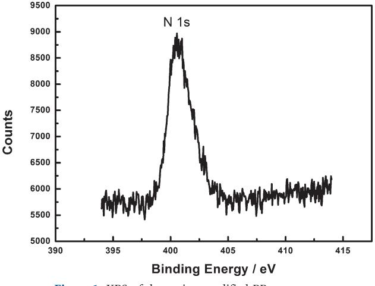
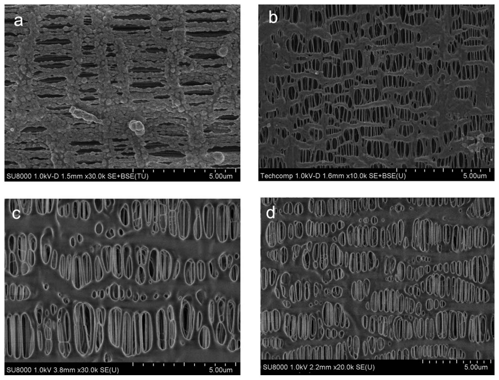
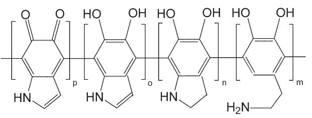
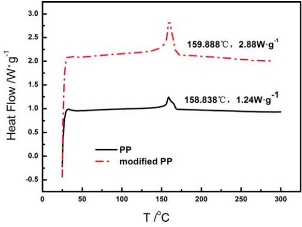
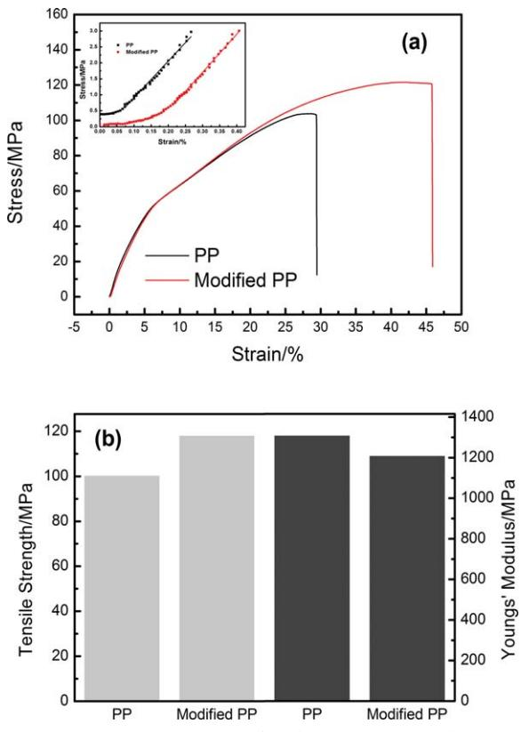
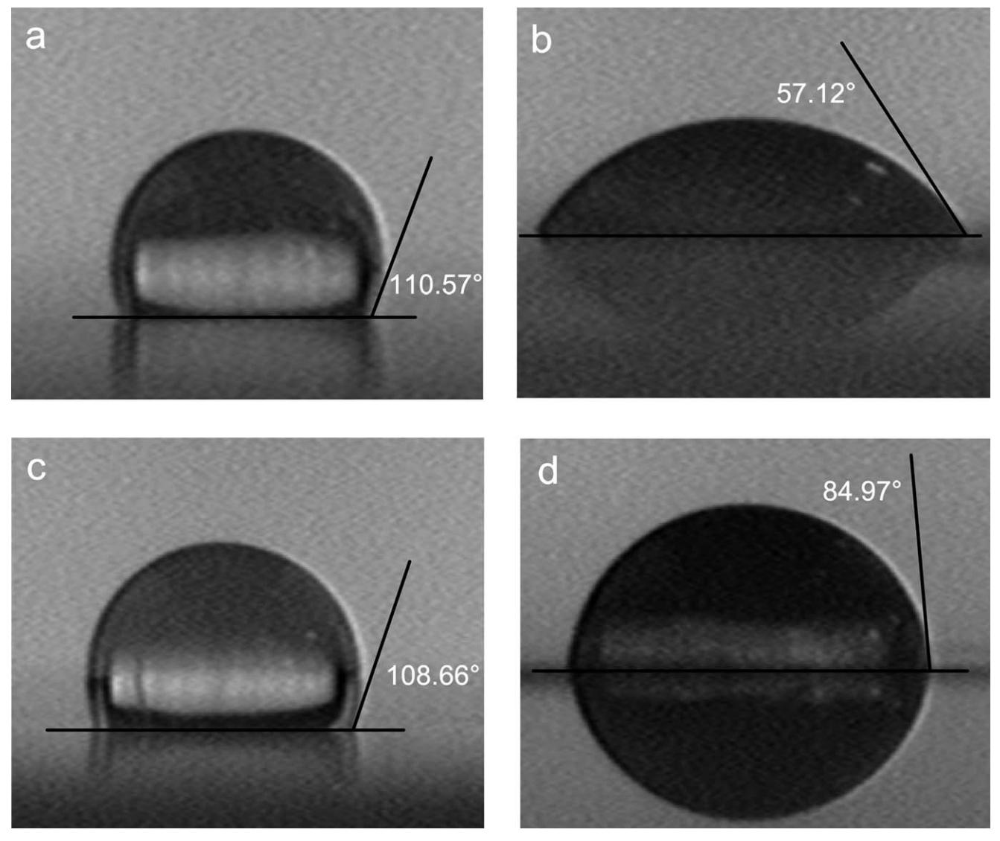
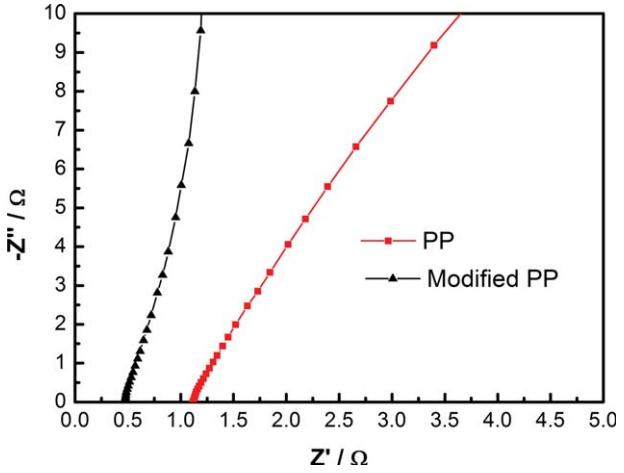
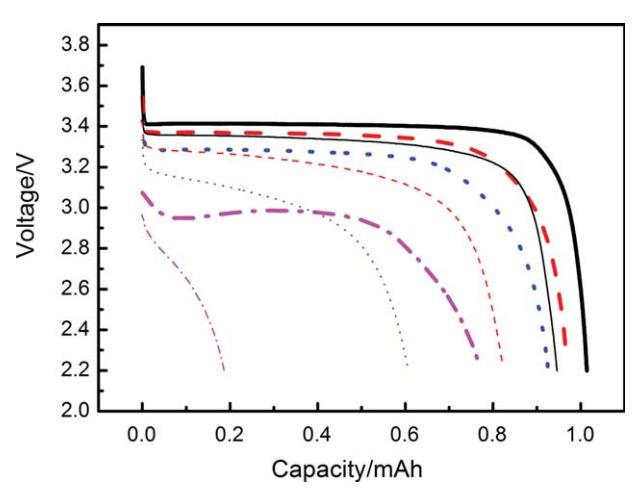
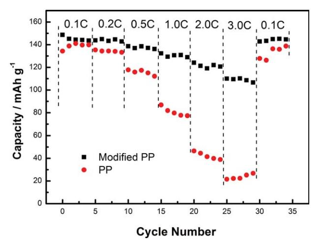

# Polydopamine Hydrophilic Modification of Polypropylene Separator for Lithium Ion Battery

Dan Wang,1,2 Zhongling Zhao,2 Lina Yu,2 Kejin Zhang,2 Hui Na,3 Shanqiang Ying,2 Dechao Xu,2 Guo Zhang1

1College of Material, Science and Engineering, Jilin University, Changchun 130022, China 2R&D Center of China FAW Corporation Limited, Changchun 130011, China 3College of Chemistry, Jilin University, Changchun 130012, China Correspondence to: G. Zhang (E -mail: g.zhangjlu@gmail.com)

ABSTRACT: The modified polypropylene (PP) separators with self-polymerization of dopamine on the surfaces are prepared by a simple solution-immersion method to improve the interfacial hydrophilic and discharge performance. The contact angle test and the liquid electrolyte uptake capacity test results show that the wettability and the electrolyte-retention ability of polydopamine-modified separator are improved significantly. The robust and thin polydopamine layer on the surface also enhances thermal performance and tensile strength of the modified PP separator certified by DSC and tensile strength tests. The ionic conductivity of the modified PP separator is up to 3.08 mScm21 , 2.5 times of the bare separator. Good discharge capacity retention and C-rate discharge performance are demonstrated by a 2025 coin half-cell with the liquid electrolyte-soaked polydopamine modified PP separator sandwiched between lithium metal anode and LiFePO4 cathode. VC 2014 Wiley Periodicals, Inc. J. Appl. Polym. Sci. 2014, 131, 40543.

KEYWORDS: batteries and fuel cells; coatings; hydrophilic polymers; nanostructured polymers; porous materials

Received 19 November 2013; accepted 29 January 2014 DOI: 10.1002/app.40543

#### INTRODUCTION

Lithium ion battery (LIB) with higher energy and power density is indispensable for many applications, such as cardiac pacemakers, wireless communication equipments, and electric vehicles. Separator, as a key component of the battery, is of considerable interest from the ability to transport ionic charge carriers between electrodes and to prevent the electron transporting through.1 Recently, many efforts have been made to fabricate polyethylene (PE) or polypropylene (PP) with high chemical and electrochemical stability and enough mechanical strength to sustain the battery-assembly processes.2,3 Nowadays, the commercial separators widely used are almost based on polyolefin, such as PE, PP or PP/PE/PP.

However, the major drawbacks of polyolefin-based separators, which are from polyolefin inherent hydrophobic properties,4 are poor wetting and electrolyte retention against electrolyte solutions containing polar solvents. In order to overcome the drawbacks, many methods were proposed to modify the surface properties of this kind of separators.

The simple O2 or Ar plasma treated method has been developed to modify the surfaces of separators to increase the surface energy without sacrificing their appearances.5,6 Another valid method, which makes the separator more hydrophilic, is to graft polar monomer or polymer on the surface by solutionimmersion, where the surfaces were physically treated at the first step by plasma, electron beam or UV irradiation techniques to create polymeric radicals as the graft polymerizationinitiating sites.7–9 For example, K. Gao prepared a PE-g-MMA separator by electron beam radiation-induced graft technique to increase uptake capacity and retention ability of liquid electrolyte.10 Plasma-modified membrane method is also used to treat the surfaces of separators to graft glycidyl methacrylate, polyacrylonitrile, and polyacylic acid to enhance the adhesion of electrolyte.11–14 Recently, biomaterial-based facial modification approach is used to coat dopamine on the surfaces of inorganic/organic materials to increase the hydrophilic properties,15–18 which is convenient to implement and free from expensive apparatus compared with other methods. To the best of our knowledge, few work is focused on the dopamine modification of PE separator of lithium ion battery,19,20 and the dopamine modification work about PP separator is even less.

In this article, we fabricate the dopamine-modified PP separators by using solution-immersion method and experimentally investigate the physical and electrochemical properties. Experimental results show that the wettability, retention ability,

VC 2014 Wiley Periodicals, Inc.

thermal stability, and mechanical performance of the modified PP separators are improved compared with the bare separator. Discharge capacity retention and C-rate discharge performance are also demonstrated by using the separators in 2025 coin halfcell. We also found that in the specific electrolyte (1 M LiPF6 in EC/DMC), the wettability and the electrochemical performance of the modified PP separator can be further improved.

## EXPERIMENTAL

#### Surface Coating Preparation

Dopamine solution (10 mmol-L21 ) was obtained by dissolving dopamine hydrochloride (Aladdin) in methanol and buffer cosolvents (CH3OH:buffer 5 1 : 1 by vol.), where the buffer cosolvents (pH 8.5) was prepared with Tris (Aladdin) and HCl. PP separator (Celgard 2500) was immersed into the dopamine solution for 24 h at room temperature, and then the separator was taken out, washed with deionized water for 2 h, dried at 50C in vacuum oven for 8 h.

## Liquid Electrolyte Uptake and Contact Angle Test

Liquid electrolyte uptakes were measured by soaking the weighed separators in a commercial electrolyte for 1 h, where the electrolyte with LiPF6 is from Novolyte Corp. In order to

Figure 1. XPS of dopamine-modified PP separator.

test consistency, the separators were taken out of the liquid electrolyte by nipper for 30 s at room temperature in an argonfilled glove box. The electrolyte uptake (EU) was calculated by equation:

Figure 2. SEM images of PP separator with/without polydopamine coating. (a) modified surface, (b) PP surface, (c) modified PP cross section, (d) PP cross section.

Figure 3. General structural proposal for polydopamine.

$$EU (%)=(W_1-W_0)/W_0 \times 100$$
 (1)

where  $W_1$  and  $W_0$  are the weights of the electrolyte-soaked separator and the dry separator, respectively. The surface hydrophilic properties of the separators were measured by JC2000D contact angle test apparatus.

#### **Thermal and Mechanical Properties**

DSC was carried out on DSC200F3 Netzsch (Germany) apparatus at the heating rate of 20°C min-1 from room temperature to 300°C. The mechanical properties were evaluated by AG-I Universal Materials Testing Machine at the strain rate of 2  $\text{mm}\cdot\text{min}^{-1}$ .

## **Electrochemical Performance**

A total of 2025 coin cells with electrolyte-soaked separators sandwiched between two electrodes were used to measure the electrochemical performances. Ionic conductivity was obtained by scanning the A.C. impedance with two symmetrical stainless steel (SS) plates as the electrodes by Chenhua CHI760D electrochemical workstation at room temperature, where the frequency range used was  $10-10^6$  Hz with AC amplitude of 5 mV. The liquid electrolyte is the same as used in the electrolyte uptake test. In order to determine the electrochemical oxidation limits of the electrolyte-soaked separator, linear sweep voltammetry was scanned at the rate of 1 mV·s $-1$  and the potential ranged from 3.0 V to 4.5 V, where working electrode and counter electrode were stainless steel plate and lithium plate, respectively.

Charge and discharge behaviors of the half cells with  $LiFePO4$ (Aleees) cathode and lithium anode were performed at the charge rate of 0.1°C (0.186 mA·cm-2) in the potential window of 2.2–3.8 V (CC-CV), where the electrolyte is 1 M  $\text{LiPF}_6$  dissolved in 1:1(by vol.) ethylene carbonate (EC)/dimethyl carbonate (DMC) made by Guotai Huarong Corp. and the cathode is prepared by mixing active material LiFePO4 (90%, Aleees), Super-P and KS-6 (6%, Timcal), PVDF (4%, Akama).

## **RESULTS AND DISCUSSION**

## **Analysis of Surface Morphology**

Figure 1 shows the XPS (PHI-5600) pattern of modified PP separator. The binding energy peak of  $-NH_2$  is located between 399 and 401  $eV$ ,15,19 which indicates that dopamine has been adhered to PP separator. Figure 2 shows SEM (Hitachi, SU8020) images of the modified PP separator and the bare separator. Compared Figure  $2(a)$  with Figure  $2(b)$ , the modified PP separator surfaces are uniformly covered by compact dopamine particles with average diameter of 0.2  $\mu$ m. These tiny particles increase the specific surface area, which is benefit for the wettability. From Figure  $2(c,d)$ , we also found that there is no parti-

Figure 4. DSC analysis for PP separators with and without polydopamine modification. [Color figure can be viewed in the online issue, which is available at wileyonlinelibrary.com.]

cle clogged into the pores of the modified separators, which means that the solution-immersion method can maintain the porosity of PP separator.19,20

Figure 5. (a) Stress-strain curves for the measured tensile stress and Young's modulus of PP separators with and without polydopamine modification. The inset is the same plot as in (a) except that the strain range is now restricted to [0, 0.4%]. (b) The average tensile strength and Youngs' modulus of PP separators with and without polydopamine modification. [Color figure can be viewed in the online issue, which is available at wileyonlinelibrary.com.]

Figure 6. Water contact angle of PP and PE separators with/without dopamine modification. (a) PP (110.57 6 3.74), (b) modified PP (57.12 6 4.27), (c) PE (108.66 6 6.63), (d) modified PE (84.97 6 2.79).

#### Dopamine Polymerization Mechanism

The color of the separator changes from white to grey after 24 h immersion, because the dopamine was self-polymerized into polydopamine in buffered aqueous solution at pH 8.5 due to pH-induced oxidation.21–28 In order to verify the polymerization of the dopamine on the separator surface, we put the modified separator in the liquid electrolyte for 48 h and found that the grey color unchanged. UV-Vis test of the immersed liquid electrolyte, which is used to ensure the existence of polydopamine or not, does not show the absorption peak in the 250 nm-300 nm region, where the dopamine peak located. It indicates that dopamine has polymerized to polydopamine which is stable in the liquid electrolyte for long time.

The molecular mechanism and structure of polydopamine has not been fully understood yet. However, it was suggested that polydopamine is formed through covalent bond forming oxidative polymerization as shown in Figure 3.29 Polydopamine, as the oxidation of dopamine, is composed of dihydroxyindole, indoledione, and dopamine units. Here, dihydroxyindole and indoledione with different degrees of (un)saturation are covalently linked by CAC bonds between their benzene rings, and dopamine as monomer units in polydopamine is proved to be open-chain. The modification process provides hydrophilic and polar groups, such as AOH, ANH2, which increases the separator-electrolyte interface wettability.

#### Thermal Stability and Mechanical Performance

The melting point of separator is determined by DSC and is also used to evaluate the shut-down characteristics of separator pore. Examining Figure 4, the heat-adsorption peaks around 160C indicate the shut-down temperature of the separator pores. Compared with the PP separator, the shut-down temperature of modified PP increased by 1C. Figure 5(a) shows stress-strain curves for the measured tensile stress and Young's modulus of PP separators with and without polydopamine

Table I. The Electrolyte Uptake Capacities of Separators Before and After Modification

| Samples     | Uptake capacity (%) |  |
|-------------|---------------------|--|
| <b>PP</b>   | 115                 |  |
| Modified PP | 230                 |  |
| PF          | 78                  |  |
| Modified PE | 120                 |  |

modification. The tensile strength and Youngs' modulus of the PP separators are shown in Figure  $5(b)$ , which is the average result of four samples. Although the polydopamine coating decreases the elasticity of the PP separator slightly, the tensile improves  $\sim$ 20% compared with the bare one. Since the polydopamine coating has strong intermolecular interactions such as hydrogen-bonding,  $\pi-\pi$  interactions on the surface of PP,23,25,30,31 the shut-down temperature and mechanical performance are increased.

## **Water Contact Angle**

In order to investigate the wettability of the polydopamine coating, contact angle measurement is conducted by water droplet. As a comparison, we also study the contact angle of the polydopamine modified PE separator. For PP and PE separators, the polydopamine-modified process decreases the contact angles from  $110.57^{\circ} \pm 3.74^{\circ}$  [Figure 6(a)] to  $57.12^{\circ} \pm 4.27^{\circ}$  [Figure 6(b)] and from 108.66°  $\pm$  6.63° [Figure 6(c)] to 84.97°  $\pm$  2.79° [Figure  $6(d)$ ], respectively. Thus the polydopamine surface modification improves the hydrophilicity of PP and PE separators. The experimental results also show that the wettability of the polydopamine-treated PP separator is superior to the modified PE separator due to the government of chemical properties such as composition of materials, not to morphological factors. $15,20$ 

## Liquid Electrolyte Uptake Capacity and Ionic Conductivity

Since liquid electrolyte absorbed by the separator is the only media to transport lithium ion, the liquid electrolyte uptake capacities of the modified and unmodified PP and PE separators are measured to evaluate the electrolyte retention, as shown in Table I. The polydopamine-modified processes of PP and PE separator increase the uptake capacity from 115 to 230% and from 78 to 120%, respectively. The improvement of uptake capacity comes from the increased wettability because the improvement of the hydrophilicity makes the electrolyte easily disperse on the modified separators surface, spread out onto the surface of separator and extend into the pore pathway.33,34

Ionic conductivity is measured with an electrolyte-soaked separator between two SS electrodes by AC impedance, as shown in

Figure 7. A.C. Impedance spectra for a symmetrical SS/separator/SS cell. [Color figure can be viewed in the online issue, which is available at wileyonlinelibrary.com.]

Figure 8. The discharging curves for cells using PP as separator with (thick lines) and without (thin lines) the polydopamine modification at different discharge rates: 0.2°C (solid line), 0.5°C (dash line), 1.0°C (dot line), 3.0°C (dash dot line). The current density is 0.1°C (0.186 mA·cm-2) during charging. [Color figure can be viewed in the online issue, which is available at wileyonlinelibrary.com.]

Figure 7 and the related parameters are listed in Table II. The ionic conductivity of polydopamine-modified PP separator is up to 3.08 mS·cm $-1$ , much better than the modified PE separator  $(0.41 \text{ mS}\cdot\text{cm}^{-1})$ .19 The decrease of Ohm resistance and the increase of ionic conductivity of the modified PP separator are due to the improvement of electrolyte uptake capacity, which improves the ion volume density, that is, the ionic flux in the

## **Table II.** Separators Parameters

|                 | Thickness ( $\mu$ m) | Resistance $(\Omega)$ | Contact area (cm 2 ) | lonic conductivity (mS $\cdot$ cm -1 ) |
|-----------------|----------------------|-----------------------|---------------------------------|---------------------------------------------------|
| $\mathsf{PP}$   | 25                   | 112                   | 1.77                            | 1.26                                              |
| Modified PP. | 25                   | 0.46                  | 177                             | 3.08                                              |

Figure 9. The comparison of discharging capacities of cells between separators with or without dopamine modification. [Color figure can be viewed in the online issue, which is available at wileyonlinelibrary.com.]

separator. The results of ionic conductivity shown in Figure 7 and Table II are in good agreement with the electrolyte uptake capacity listed in Table I.

## **Battery Performance**

Battery performance is demonstrated by assembling liquid electrolyte-soaked separator between lithium metal anode and LiFePO4 cathode in 2025 coin cells. The performance of LIBs was characterized by measuring the discharging capacities at the current densities of 0.2, 0.5, 1.0, and 3.0°C. Figure 8 shows the discharge voltage platform of the cell with different discharging rates. We found that the cells have better performance for small discharging rate, and the battery with modified PP separator has the larger discharge platform voltage, higher discharge capacity, and the bigger columbic efficiency of the cells (the bare PP: 92.72%, the modified PP: 95.93%) at the charging rate of  $0.1^{\circ}$ C (0.186 mA·cm-2). The cycle performance of two cells with the bare and modified separators is almost the same at the discharging rate of 0.1°C, however, the discharging capacities of the bare PP separator cell dropped drastically with the increase of discharge rate, while the discharging capacities of the modified one decreased slightly, as shown in Figure 9. The cell with polydopamine-modified PP separator has a better discharge Crate capability because of the improvement of the electrolyte uptake capacity and ion conductivity. In particular, at the discharging rate of 3.0°C, for PP separator the battery discharge capacity improves 370% by the modification process, while for PE, the capacity just improves  $120\%$ .18

#### **CONCLUSION**

The modified polypropylene (PP) separators with polydopamine on the surfaces are successfully prepared and characterized. Experiment results show that the wettability and the electrolyteretention ability are increased significantly due to a robust, relative heat-resistant, and thin polydopamine layer. The electrochemical performance of the 2025 coin half-cell certified that the batteries using the modified PP as separators provide a higher discharge capacity and better discharge C-rate capability

and cyclability because of the hydrophilic polydopamine. Our present work demonstrates that the method of polydopamine modification is promising to modify commercialized polypropylene separator for lithium ion batteries.

## **REFERENCES**

- 1. Besenhard, J. Handbook of Battery Materials, Wiley-VCH: Weinheim, 1999.
- 2. Arora, P.; Zhang, Z. Chem. Rev. 2004, 104, 4419.
- 3. Zhang, S. J. Power Sources 2007, 164, 351.
- 4. Kim, J.; Lim, D. Energies, 2010, 3, 866.
- 5. Švorčík, V.; Kolářová, K.; Slepička, P.; Macková, A.; Novotná, M. Polym. Degrad. Stab. 2006, 91, 1219.
- 6. Sanchis, M. R.; Blanes, V.; Blanes, M.; Garcia, D.; Balart, R. Eur. Polym. J. 2006, 42, 1558.
- 7. Lee, J.; Lee, Y.; Bhattacharya, B.; Nho, Y.; Park, J. Electro*chim. Acta* **2009**, *54*, 4312.
- 8. Lee, J.; Lee, Y.; Bhattacharya, B.; Nho, Y.; Park, J. Phys. Procedia 2012, 25, 227.
- 9. Senyarich, S.; Viaud, P. U.S. Patent 6,042,970, 2000.
- 10. Gao, K.; Hu, X.; Yi, T.; Dai, C. Electrochim. Acta 2006, 52, 443.
- 11. Ko, J.; Min, B.; Kim, D.; Ryu, K.; Kim, K.; Lee, Y.; Chang, S. Electrochim. Acta 2004, 50, 367.
- 12. Kim, J.; Lee, Y.; Lim, D. Electrochim. Acta 2009, 54, 3714.
- 13. Ciszewski, A.; Kunicki, J.; Gancarz, I. *Electrochim. Acta* **2007**, 52, 5207.
- 14. Ciszewski, A.; Gancarz, I.; Kunickl, J.; Bryjak, M. Surf. Coat. Technol. 2006, 201, 3676.
- 15. Lee, H.; Dellatore, S.; Miller, W.; Messersmith, P. Science 2007, 308, 426.
- 16. Zhu, L.; Jiang, J.; Zhu, B.; Xu, Y. Colloids Surf. B: Biointer. 2011, 86, 111.
- 17. Xi, Z.; Xu, Y.; Zhu, L.; Wang, Y.; Zhu, B. J. Membr. Sci. 2009, 327, 244.
- 18. Jiang, J.; Zhu, L.; Zhu, L. Langmuir 2011, 27, 14180.
- 19. Ryou, M.; Lee, Y.; Park, J. J. Choi, Adv. Mater. 2011, 23, 3066.
- 20. Lee, Y.; Ryou, M.; Seo, M.; Choi, J.; Lee, Y. Electrochim. Acta 2013, 113, 433.
- 21. Wei, Q.; Zhang, F.; Li, J.; Li, B.; Zhao, C. Polym. Chem. 2010, 1, 1430.
- 22. Kang, S.; You, I.; Cho, W.; Shon, H.; Lee, T.; Choi, I.; Karp, J.; Lee, H. Angew. Chem. 2010, 49, 9401.
- 23. Shin, Y.; Lee, Y.; Shin, H. Colloids Surf. B: Biointer. 2011, 87, 79.
- 24. Lee, H.; Scherer, N.; Messersmith, P. Proc. Natl. Acad. Sci. U.S.A. 2006, 103, 12999.
- 25. Ryou, M.; Lee, D.; Lee, J.; Lee, Y.; Park, J.; Choi, J. Adv. *Energy Mater.* **2012**, *2*, 645.
- 26. Kang, S.; Ryou, M.; Choi, J.; Lee, H. Chem. Mater. 2012, 24, 3481.

- 27. Shi, J.; Fang, L.; Li, H.; Zhang, H.; Zhu, B.; Zhu, L. J. Membr. Sci. 2013, 437, 160.
- 28. Cao, C.; Tan, L.; Liu, W.; Ma, J.; Li, L. J. Power Sources 2014, 248, 224.
- 29. Liebscher, J.; Mrowczynski, R.; Scheidt, H.; Filip, C.; Hadade, N.; Turcu, R.; Bende, A.; Beck, S. Langmuir 2013, 29, 10539.
- 30. Sureshkumar, M.; Lee, P.; Lee, C. RSC Adv. 2012, 2, 5127.
- 31. Yang, C.; Wang, Y.; Wan, C. J. Power Sources 1998, 72, 66.
- 32. Yang, F.; Zhao, B. Open Surf. Sci. J. 2011, 3, 115.
- 33. Xia, F.; Jiang, L. Adv. Mater. 2008, 20, 2842.
- 34. Jeong, H.; Choi, E.; Kim, J.; Lee, S. Electrochim. Acta 2011, 56, 5201.

