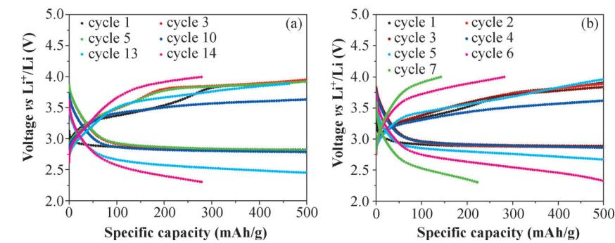
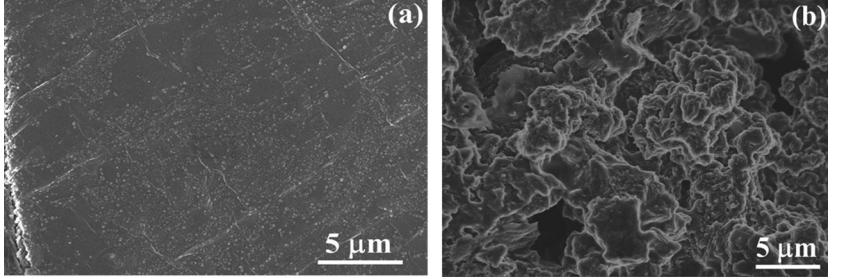
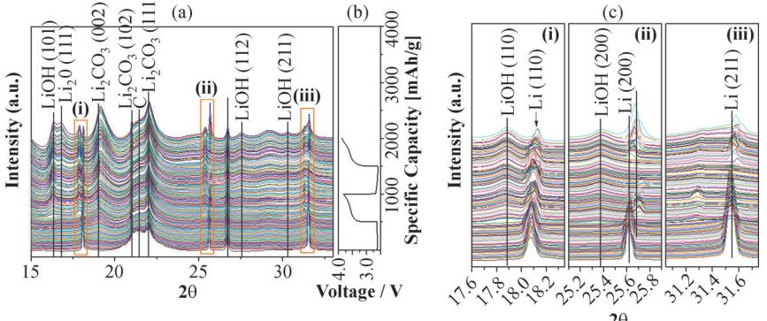
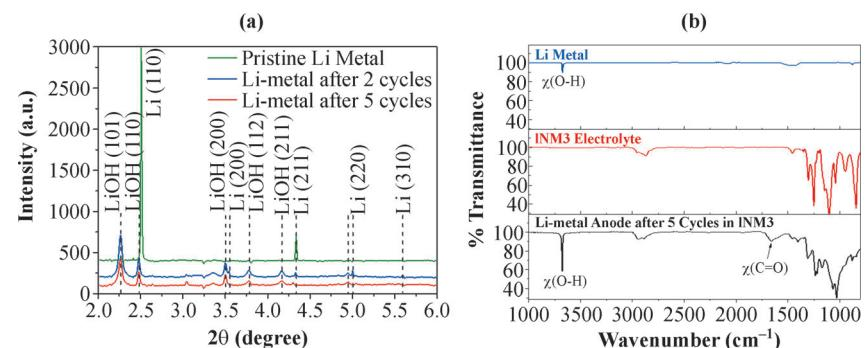
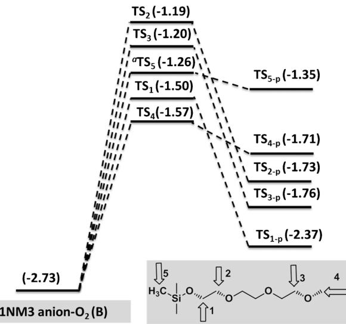
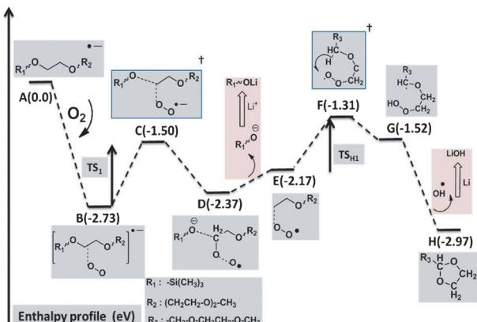

DOI: 10.1002/cphc.201402130

# Molecular-Level Insights into the Reactivity of Siloxane-Based Electrolytes at a Lithium-Metal Anode

Rajeev S. Assary,[a] Jun Lu,[b] Xiangyi Luo,[b, c] Xiaoyi Zhang,[d] Yang Ren,[d] Huiming Wu,[b] Hassan M. Albishri,[e] D. Abd El-Hady,[e] A. S. Al-Bogami,[e] Larry A. Curtiss,\*[a, f] and Khalil Amine\*[b, e]

A molecular-level understanding of the reactions that occur at the lithium-metal anode/electrolyte interphase is essential to improve the performance of Li–O2 batteries. Experimental and computational techniques are applied to explore the reactivity of tri(ethylene glycol)-substituted trimethylsilane (1NM3), a siloxane-based ether electrolyte, at the lithium-metal anode. In situ/ex situ X-ray diffraction and Fourier-transform infrared spectroscopy studies provide evidence of the formation of lithium hydroxide and lithium carbonates at the anode upon gradual degradation of the metallic lithium anode and the solvent molecules in the presence of oxygen. Density functional calculations performed to obtain a mechanistic understanding of the reductive decomposition of 1NM3 indicate that the decomposition does not require any apparent barrier to produce lithium hydroxide and lithium carbonates when the reduced 1NM3 solvent molecules interact with the oxygen crossing over from the cathode. This study indicates that degradation may be more significant in the case of the 1NM3 solvent, compared to linear ethers such as tetraglyme or dioxalone, because of its relatively high electron affinity. Also, both protection of the lithium metal and prevention of oxygen crossover to the anode are essential for minimizing electrolyte and anode decomposition.

### 1. Introduction

Li-O2 batteries have the potential to offer sufficient energy density for transportation needs; however, currently the fundamental principles and chemistry behind the batteries are still under intense investigation.[1–13] Several parameters, such as the stability of electrolytes, lower charge overpotentials, improved capacity, electrode stability, and so on, need significant improvement to commercialize the Li-O2 battery technology. In non-aqueous Li–O2 batteries, ether-based solvents have re-

|   | [a] Dr. R. S. Assary,+ Dr. L. A. Curtiss                                     |
|---|------------------------------------------------------------------------------|
|   | Materials Science Division, Argonne National Laboratory                      |
|   | Argonne, IL, 60439 (USA)                                                     |
|   | E-mail: curtiss@anl.gov                                                      |
|   | [b] Dr. J. Lu,+ X. Luo,+ Dr. H. Wu, Dr. K. Amine                             |
|   | Chemical Sciences and Engineering Division                                   |
|   | Argonne National Laboratory, Argonne, IL, 60439 (USA)                        |
|   | E-mail: amine@anl.gov                                                        |
|   | [c] X. Luo+                                                                  |
|   | Metallurgical Engineering, Department                                        |
|   | The University of Utah, Salt Lake City, UT 84112 (USA)                       |
|   | [d] Dr. X. Zhang, Dr. Y. Ren                                                 |
|   | X-ray Science Division, Argonne National Laboratory                          |
|   | Argonne, IL, 60439 (USA)                                                     |
|   | [e] Dr. H. M. Albishri, Dr. D. A. El-Hady, Dr. A. S. Al-Bogami, Dr. K. Amine |
|   | King Abdulaziz University, Faculty of Science                                |
|   | Chemistry Department, 80203 Jeddah (Saudi Arabia)                            |
|   | [f] Dr. L. A. Curtiss                                                        |
|   | Center for Nanoscale Materials                                               |
|   | Argonne National Laboratory, Argonne, IL, 60439 (USA)                        |
| [ | +] These authors contributed equally to the work.                            |
|   | Supporting Information for this article is available on the WWW under        |
|   | http://dx.doi.org/10.1002/cphc.201402130                                     |
|   |                                                                              |

cently been considered due to the decomposition of conventional carbonate-based electrolytes (ethylene carbonate, propylene carbonate, etc.) in the presence of reduced oxygen discharge products.[7, 14–19]

Recently, major research efforts have been dedicated to the molecular-level understanding and characterization of potential discharge products (Li2O2, LiOH, Li2CO3 etc.) for ether-based electrolytes.[4, 15, 17–25] Even though the charge and discharge cycles are sustained for 10 s of cycles in Li-O2 batteries using ether electrolytes, there is evidence that electrolyte decomposition occurs due to chemical or electrochemical reaction at the electrolyte-cathode interface and electrolyte–Li2O2 interface and results in eventual failure of the cells.[16, 18, 20]

One of the possible sources of electrolyte decomposition is the reactions occurring at the lithium-metal anode. There have been many studies of lithium anode reactions for Li-ion batteries;[26–32] however, there have been few for Li–O2 batteries.[33–37] The Li-ion studies indicate that there are various potential sources of electrolyte decomposition at the anode, such as reductive decomposition and chemical decomposition via reaction at the lithium surfaces. Zhuang et al.[38] showed that simple ethers, such as dimethoxy ethane (DME), react with metallic lithium to form CH3Li, CH3OLi, and polymers. For Li-ion batteries, Aurbach et al.[39–40] showed that the failure mechanism of lithium-metal anodes occurs when electrolytes such as ethylene carbonate (EC) and 1,3-dioxolane (DOL) are reduced and decomposed to form surface layers of ROCO2Li, ROLi, HCOOLi, Li2CO3, and polymers. In a recent combined experimental/modeling study,[37] we reported on an oxygen-crossover effect that results in the decomposition of tetraethylene glycol dimethyl ether (TEGDME) in a Li–O2 cell at the lithium anode.

Recent studies using a siloxane-based electrolyte, tri(ethylene glycol)-substituted trimethylsilane (1m3), have shown that low polarization can be obtained.[18, 41] However, the cyclability (about ten cycles) of the Li-O2 cell is very poor, which indicates possible decomposition of the electrolyte. Previous experimental and theoretical studies[18, 42]suggest that 1NM3 has an oxidative stability of 4.2 V similar to that of tetraglyme or other ether molecules, while the reductive stability of 1NM3 and its chemistry at the anode remains unknown. In this Communication, we report on results of an investigation focused on the reactivity of 1NM3 with the lithium anode using a combined experimental and theoretical approach. We have analyzed the decomposition products of the 1NM3-based electrolyte collected upon the reaction with a lithium-metal anode based on in situ/ex situ X-ray diffraction (XRD) and Fourier-transform infrared (FTIR) measurements as well as density functional studies. Additionally, similarities of the anodic decomposition of the 1NM3-based electrolyte with the TEGDME-based electrolyte are discussed.

## Experimental and Theoretical Methods

#### Experimental Methods

Electrochemical Testing: Electrochemical characterizations were carried out in Swagelok-type cells composed of a lithium-metal anode, an electrolyte consisting of 1m LiCF3SO3 in 1NM3 impregnated into a glass-fiber separator, and a porous cathode (11 mm in diameter). The cathode was prepared by casting a mixture of Super P Li carbon with MnO2 nanorods and Kynar 2801 binder in a weight ratio of 50:50 on an aluminum grid. The detailed fabrication of the cathode laminate is described elsewhere.[43] The cells were sealed except for the Al grid window that exposed the porous cathode to 1 bar O2 pressure to avoid any negative effects of humidity and CO2. The electrochemical measurements were conducted with a MACCOR cycler in the voltage range of 2.2–4.0 V at a constant current of 100 mA g-1 . The cell discharge and charge was carried out in a time-controlled mode that gives equal charge and discharge capacities. The results reported here are for 5 h of discharge and charge each with capacities of 500 mAh g-1 . We normalized the observed capacity by the weight of carbon and catalyst for capacity comparison in this study.

High-Energy X-ray Diffraction: The Li–air cell was characterized by synchrotron XRD, which was carried out at the 11-ID-D (for in situ measurements) and 11-ID-C (for ex situ measurements) beamlines of the Advanced Photon Source (APS), Argonne National Laboratory. The X-ray wavelength was 0.774901 for 11-ID-D beamline and 0.10798 for 11-ID-C, respectively. The XRD patterns were collected in the transmission mode using either Piratus 2m or a PerkinElmer large-area detector. The collected 2D patterns were then integrated into a conventional 1D pattern (intensity vs. 2q) for final data analysis using the Fit2d software.

FTIR Measurements: FTIR spectra were collected on a Nicolet iS5 spectrometer (Thermo Scientific) on a diamond attenuated total reflection (ATR) unit; all the measurements were performed in an Arfilled glove box (O2<1 ppm, H2O<1 ppm) to avoid any negative effect from CO2 and H2O. All the spectra were obtained at a resolution of 4 cm-1 and within the range of 4000 to 550 cm-1 . The lithium anodes that were cycled in oxygen cells were dissembled in the glove box directly without any further treatments prior to the FTIR measurements.

Scanning Electron Microscopy: Electron microscopy measurements were carried out in the electron microscopy center (EMC) at Argonne National Laboratory. Field-emission scanning electron microscopy (SEM, Hitachi S-4700) coupled with energy dispersive spectrometry (EDS) was employed to observe the morphology change of the Li anode before and after the cycle test in Li-O2 cells.

#### Theoretical Methods

We employed the B3LYP level of theory to investigate the structure and energetics of the system. The 6-31+G(d) basis set was used to obtain transition-state structures for breaking C-O bonds. This basis set was also used to determine vibrational energies and solvation energies for calculating the corresponding reaction-barrier enthalpies. This level of theory was assessed against high-level G4MP2[44] theory and was found to be in excellent agreement with high-level theory in predicting reaction energetics, structures, and reaction barriers for similar reactions.[18, 42, 45] The SMD[46] solvation model was used to compute the solvation free energies at the B3LYP/6-31+G(d) level of theory. A dielectric constant of 20 (acetone solvent) was used to compute the solvation free energies. All calculations were performed with the Gaussian 09[47] software.

# 2. Results and Discussion

#### 2.1. Experimental Observation

Figure 1 a shows the initial voltage–capacity profiles for a cell using a 1NM3-LiCF3SO3 electrolyte, indicating that the cell can last about 13 cycles with relatively low charge overpotentials, and then start to fade. SEM studies were performed to observe the morphology change of the Li anode before and after the initial cycle test, as shown in Figure 2. The SEM images clearly

Figure 1. Voltage–capacity profiles: a) initial cycle performance and b) after changing the Li-metal anode from the initial cycling shown in (a).

# CHEMPHYSCHEM ARTICLES <www.chemphyschem.org>

Figure 2. SEM images of: a) pristine Li metal and b) Li metal in a Li–O2 cell after five discharge–charge cycles in 1NM3-LiCF3SO3 electrolyte.

The ex situ XRD data of the lithium anode in Figure 4 further confirms the formation of LiOH on the surface of the lithium anode. Comparison of the ex situ XRD data on the first and fifth cycles also indicates severe consumption of the lithium metal, which is consistent with the in situ XRD results shown in Figure 3. The FTIR spectra shown in Figure 4 b are indicative of the

reveal that the fairly smooth surface of the pristine Li metal (Figure 2 a) was dramatically destroyed after several cycles. A thick and fluffy deposited layer is seen on the cycled Li metal (Figure 2 b). Clearly, the Li-ion transport will be severely limited if the compounds deposited on the Li metal are not Li+ -cation-conductive, which would likely cause the capacity fading of the cell, at least partially. To confirm the contribution of the Li anode to the cell fading, the Li metal from the cell after initial failure is replaced by fresh Li metal. This newly assembled cell was tested under the same conditions, and the discharge–charge profiles are shown in Figure 1 b. The results

presence of -OH groups, which further supports the formation of LiOH. Note that a small peak at 3655 cm-1 is also observed for the pristine Li metal, which may come from the reaction between Li and H2O either from the residual moisture left on the Li metal or during the storage in the glovebox. It should be pointed out that the formation of crystalline Li2CO3 is evident from the in situ XRD (Figure 3), while it is not observed in ex situ XRD (Figure 4 a), probably because of small amounts present. The signature C=O bond peaks in the FTIR spectra confirms the presence of carbonyl groups in the form of aldehydes or carbonates, indicating the electrolyte decomposition. The formation of LiOH and Li2CO3

demonstrate that the cell is able to perform another five cycles at a similar discharge and charge potential before failing, suggesting that in this case, the Li anode indeed is responsible for the capacity fading of the cell.

To investigate potential products that are formed at the anode in a Li–O2 battery using the 1NM3-LiCF3SO3 electrolyte, we carried out a detailed characterization study of the anode in a lithium–air cell during various stages of discharge and charge. Figure 3 shows the in situ XRD data of the cell during the battery operating conditions. The diffraction peaks in regions (i), (ii), and (iii) are further expanded to provide a clearer pattern of the phase transformation during the reactions (Figure 3 c). These peaks clearly indicate the formation of LiOH and Li2CO3, as well as a decrease of the Li-metal peaks (110, 200) on cycling. This evidence suggests that the electrolyte is clearly decomposing due to reactions occurring during charging, most likely at the electrolyte/anode surface.

Figure 3. a) In situ XRD patterns of the Li anode and LiOH formation in the Li–O2 cell during the first two discharge/charge cycles, and b) corresponding voltage versus time profile. c) Expanded in situ XRD patterns in regions (i), (ii), and (iii) shown in (a). All the intensities shown in the figure are normalized.

Figure 4. a) Ex situ HE-XRD patterns of the Li anode after two and five cycles and b) FTIR spectra of the Li anode after five cycles. For the FTIR spectra, we have included the standard Li metal and 1NM3 electrolyte for comparison.

-

in the in situ XRD were also observed for TEGDME, in our recent publication.[37] Reductive decomposition of the ether in the presence of the dioxygen, crossing over from the cathode, was found to be reason for the solvent decomposition.

#### 2.2. Theoretical Studies

We performed detailed density functional studies to understand the decomposition mechanism of the 1NM3 solvent at the lithium anode and compare it to other solvents. Density functional calculations (B3LYP/6-31+G(d)) were performed to assess the electron affinities of 1NM3, propylene carbonate (PC), dioxolane (DOL), and TEGDME. The computed gas-phase electron affinities are presented in Table 1. All molecules have

| Table 1. Gas-phase energetics for the electron affinities of several sol vents computed at the B3LYP level of theory (298 K). |         |  |  |  |  |  |  |
|----------------------------------------------------------------------------------------------------------------------------------|---------|--|--|--|--|--|--|
| Molecule                                                                                                                         | DH [eV] |  |  |  |  |  |  |
| 1NM3                                                                                                                             | 0.64    |  |  |  |  |  |  |
| PC                                                                                                                               | 0.75    |  |  |  |  |  |  |
| dioxolane                                                                                                                        | 1.36    |  |  |  |  |  |  |
| TEGDME                                                                                                                           | 1.10    |  |  |  |  |  |  |

a positive electron affinity so that the electron is not bound in the gas phase, but 1NM3 has the smallest positive value. Experimental studies have shown that the DOL, PC, and TEGDME are likely to get reduced at the lithium surfaces. Due to the smaller positive electron affinity of 1NM3 compared to other solvent molecules, reduction of 1NM3 is also likely at the lithium surfaces.

Upon attachment of an electron, the 1NM3 anion radical may fragment to alkoxy anions and alkyl radicals. Five such pathways are likely for 1NM3. The computed energetics including the reaction barriers, in the gas phase and solution, are shown in Table 2. The fragmentation to form the products (shown in the second column of Table 2), is found to be thermodynamically uphill in the gas phase, while downhill in the solution. This suggests the likely fragmentation of reduced 1NM3 at the electrolyte/anode interface, since the reaction barriers (DH† ) are small (~0.3 to 0.7 eV). In the gas phase, computed reaction barriers are significant (>0.8 eV).

In the event of oxygen crossover from the cathode, it is likely that the 1NM3 anion radical (A) will bind with the dioxygen to form a stable anion radical complex (B, Figure S1 in the Supporting Information, SI), as indicated by the exothermic reaction (1) in Table 3. Likely initiation reactions of various decomposition pathways of 1NM3 are schematically shown sin Figure 5. Four C-O bond cleavages (1NM3 has four C-O bonds, TS1 to TS4), and one C-H bond cleavage (Si-CH2-H bond, TS5) were investigated (transition-state structures are shown in Figure S2 of the SI). Since complexation of the 1NM3 anion radical with O2 is highly exothermic (formation of B), the apparent barriers of all transition states are negative. The reaction pathways initiated via TS4, TS2, and TS3 are similar to that of the reductive decomposition of TEGDME due to the similarity in the C-O bond cleavage in the CH2-CH2-O- group of 1NM3.[37] These pathways result in the formation of LiOH and lithium carbonates or lithium alkyl carbonates.[37] In parallel to the LiOH formation from the ethoxy group, 1NM3 has other fragmentation possibilities, initiated by the 'SiO-CH2' bond cleavage (TS1) and 'Si-CH2-H' bond cleavage (TS5). Both these pathways are unique to 1NM3 compared to other linear ethers such as glymes; therefore, they are investigated in detail here.

Table 3. Computed binding energies of oxygen with the 1NM3 radical anion and the superoxide radical anion with the 1NM3 neutral molecule at the B3LYP level of theory. The values in parenthesis include solvation contributions determined using the SMD solvation model with acetone as a solvent medium.

| Reaction                                                                               | DH [eV]                                 | DG [eV]                                 |
|----------------------------------------------------------------------------------------|-----------------------------------------|-----------------------------------------|
| (1) 1NM3 anion+O2![1NM3-O2] anion radical (2) 1NM3+O2 anion![1NM3-O2] anion radical | 1.95 ( 2.73)   0.69 (+0.21) | 1.56 ( 2.30)   0.24 (+0.65) |

Table 2. Energetics of the fragmentation reactions of the 1NM3 anion radical computed at the B3LYP/6-31+G(d) level of theory. The values in parenthesis are the corresponding values in solution, which include solvation contributions from the acetone dielectric medium. DHrxn=H(products)-H(1NM3 anion radical), DH†=H(transition state)-H(1NM3 anion radical).

| Rxn | Products | Energetics [eV] DHrxn | DGrxn               | DH†         | DG†         |
|-----|----------|--------------------------|---------------------|-------------|-------------|
| I   |          | 0.78 ( 0.26)          | 0.25 ( 0.78)     | 1.02 (0.26) | 0.95 (0.18) |
| II  |          | 0.94 ( 0.36)          | 0.21 ( 1.08)     | 1.06 (0.74) | 1.01 (0.68) |
| III |          | 0.59 ( 0.39)          | 0.06 ( 0.92)     | 0.86 (0.37) | 0.73 (0.24) |
| IV  |          | 0.19 (0.19)              |  0.40 ( 1.41) | 0.88 (0.58) | 0.77 (0.48) |
| V   |          | 0.06 ( 0.63)       | 0.57 ( 0.57)  | 0.82 (0.56) | 0.75 (0.48) |

-

Figure 5. Computed enthalpy profile (eV) in the solution dielectric for the likely initiation reaction of a 1NM3 anion–O2 complex leading to the decomposition of the solvent at the B3LYP/6-31+G(d) level of theory. TS1, TS2, TS3, and TS4 are C-O bond breaking reactions of 1NM3 through nucleophillic attack by oxygen, as shown schematically. TS5 is initiated by the hydrogen-abstraction reaction from the Si-CH3 group by the oxygen. The optimized geometries of transition states and products are shown in Figure SC2 of the SI.

A detailed enthalpy profile in solution describing the reductive decomposition of 1NM3 via TS1 is shown in Figure 6. The reaction profile is initiated by the exothermic addition of dioxygen with the 1NM3 anion radical (A, 0.0 eV) to form the 1NM3 anion–O2 complex (B, -2.73 eV). The cleavage of the SiO-CH2 bond from complex B occurs via a transition state C (-1.50 eV). Upon cleaving the C-O bond, formation of complex D (-2.37 eV) is exothermic from the transition state (C). The complex D is an adduct of trimethyl siloxy anion and an alkoxy alkyl peroxide radical (E). The trimethyl siloxy anion is a good leaving group, which will bind to a Li+ cation near the electrolyte/anode interface or in solution. A small downward shift in the SiO-CH2 vibrational frequency is noticed in the IR

Figure 6. Computed enthalpy profile (eV) for the decomposition of the 1NM3 anion–O2 complex (B) via TS1 (in solution dielectric) at the B3LYP/6- 31+G(d) level of theory.

spectrum (Figure 2 c). Computed IR spectra (Figure S3 in the SI) of the 1NM3 peak at 1129 cm-1 corresponding to the SiO-CH2 bond and trimethyl siloxylithium peak at 1085 cm-1 corresponding to a SiO-Li bond suggest a decrease of ~50 cm-1 upon the conversion of SiO-CH2 to a SiO-Li bond, which can explain the experimental observation. Upon the detachment of the siloxy group (D!E), the resulting alkyl peroxide (E, -2.17 eV), undergoes hydrogen abstraction from the CH2 group. The hydrogen abstraction by the peroxogroup (TSH1) from the gamma-position is the energetically most feasible compared to the beta or alpha position in the ring due to the strain in the transition state. The hydrogen abstraction occur via transition state F (-1.31 eV), which results in the formation of a hydroperoxide, G (-1.52 eV). Removal of hydroxyl radicals from G results in the formation of akoxy substituted dioxolane, H (-2.97 eV), which may further undergoes reductive decomposition. The removal of hydroxyl radical from G (G!H) is significantly exothermic (-1.37 eV), and the hydroxyl radical forms either LiOH or water. The proposed pathway presents theoretical justification for the formation of siloxy lithium compounds and LiOH. Due to the high reactivity of OH radicals in the non-aqueous medium, the formation of water by abstracting hydrogen from 1NM3 molecule is highly possible.

Additionally, the hydrogen abstraction via TS5 (Figure 5) from CH3 groups of 1NM3 by oxygen also requires no apparent barrier. A detailed enthalpy profile for this pathway is presented in Figure S4 of the SI. Importantly, the reaction pathway initiated via TS5 results in the formation of hydroxyl anions and hydroperoxides, which undergoes further decomposition to aldehydes and subsequently to carbonates.[15, 48–49]

### 3. Conclusions

Based on this experimental and theoretical investigation, following conclusions can be drawn:

- 1. Degradation of the lithium metallic anode is very similar when using a siloxane-based ether electrolyte (such as 1NM3) or tetraglyme. The siloxane-based electrolyte used here undergoes a relatively easier reductive decomposition compared to tetraglyme, as suggested by computational studies.
- 2. Degradation of the 1NM3 solvent is evidenced by LiOH on the anode measured by in situ and ex situ XRD techniques. The partially depleted lithium anode can be replaced by a new anode and the cell continues for more cycles, suggesting that anode decomposition is one of the key reasons for cell failure under the battery conditions employed in our investigation.
- 3. Density functional calculations were performed to elaborate on possible decomposition mechanisms of 1NM3 by reductive decomposition and reaction of reduced 1NM3 with oxygen crossing over from the cathode. The calculations indicate that 1NM3 has a higher electron affinity and is, therefore, prone to rapid reduction and significant amount of LiOH formation via reductive decomposition in the presence of oxygen. This reaction may also be promoted by the

-

greater number of hydrogen atoms on 1NM3 compared to TEGDME.

This study further highlights the need for a suitable membrane to control the lithium anode/electrolyte reactivity to achieve increased cyclability in Li–air batteries.

### Acknowledgements

This work was supported by the U.S. Department of Energy under Contract DE-AC0206CH11357 with the support provided by the Vehicle Technologies Office, Department of Energy (DOE) Office of Energy Efficiency and Renewable Energy (EERE). J. Lu was supported by the Department of Energy (DOE) Office of Energy Efficiency and Renewable Energy (EERE) Postdoctoral Research Award under the EERE Vehicles Technology Program administered by the Oak Ridge Institute for Science and Education (ORISE) for the DOE under DOE contract number DE-AC05-06OR23100. This work was also funded by the Deanship of Scientific research (DSR), King Abdulaziz University, Jeddah under the HiCi Project (grant No: 11-130-1434HiCi). The authors (HMA, DAE, ASA and KA) thank the DSR for their technical and financial support. Use of the Advanced Photon Source (APS) and Electron Microscope Center (EMC) at Argonne National Laboratory was supported by the U.S. Department of Energy Office of Science under Contract No. DE-AC02-06CH11357. Use of the Center for Nanoscale Materials was supported by the U. S. Department of Energy, Office of Science, Office of Basic Energy Sciences, under Contract No. DE-AC02-06CH11357. Also, we acknowledge grants of computer time from EMSL, a national scientific user facility located at the Pacific Northwest National Laboratory

Keywords: anodes · batteries · electrolytes · molecular-level studies · siloxane

- [1] K. M. Abraham, Z. Jiang, [J. Electrochem. Soc.](http://dx.doi.org/10.1149/1.1836378) 1996, 143, 1 5.
- [2] P. G. Bruce, S. A. Freunberger, L. J. Hardwick, J.-M. Tarascon, [Nat. Mater.](http://dx.doi.org/10.1038/nmat3191) [2011](http://dx.doi.org/10.1038/nmat3191), 11[, 19 – 29](http://dx.doi.org/10.1038/nmat3191).
- [3] G. Girishkumar, B. McCloskey, A. C. Luntz, S. Swanson, W. Wilcke, [J. Phys.](http://dx.doi.org/10.1021/jz1005384) [Chem. Lett.](http://dx.doi.org/10.1021/jz1005384) 2010, 1[, 2193 – 2203](http://dx.doi.org/10.1021/jz1005384).
- [4] R. Black, S. H. Oh, J.-H. Lee, T. Yim, B. Adams, L. F. Nazar, [J. Am. Chem.](http://dx.doi.org/10.1021/ja2111543) Soc. 2012, 134[, 2902 – 2905.](http://dx.doi.org/10.1021/ja2111543)
- [5] J. Christensen, P. Albertus, R. S. Sanchez-Carrera, T. Lohmann, B. Kozinsky, R. Liedtke, J. Ahmed, A. Kojic, J. Electrochem. Soc. 2011, 159, R1 – R30.
- [6] Y. Shao, S. Park, J. Xiao, J.-G. Zhang, Y. Wang, J. Liu, [ACS Catal.](http://dx.doi.org/10.1021/cs300036v) 2012, 2, [844 – 857.](http://dx.doi.org/10.1021/cs300036v)
- [7] C. O. Laoire, S. Mukerjee, E. J. Plichta, M. A. Hendrickson, K. M. Abraham, [J. Electrochem. Soc.](http://dx.doi.org/10.1149/1.3531981) 2011, 158, A302 – A308.
- [8] J. Lu, Y. Lei, K. C. Lau, X. Luo, P. Du, J. Wen, R. S. Assary, U. Das, D. J. Miller, J. W. Elam, H. M. Albishri, D. A. El-Hady, Y.-K. Sun, L. A. Curtiss, K. Amine, Nat. Commun. 2013, 4, 2383.
- [9] J. Lu, L. Li, J.-B. Park, Y.-K. Sun, F. Wu, K. Amine, [Chem. Rev.](http://dx.doi.org/10.1021/cr400573b) 2014, 114, [5611 – 5640.](http://dx.doi.org/10.1021/cr400573b)
- [10] J. Lu, K. Amine, [Energies](http://dx.doi.org/10.3390/en6116016) 2013, 6[, 6016 6044](http://dx.doi.org/10.3390/en6116016).
- [11] Y. Lei, J. Lu, X. Luo, T. Wu, P. Du, X. Zhang, Y. Ren, J. T. Miller, Y.-K. Sun, J. W. Elam, [Nano Lett.](http://dx.doi.org/10.1021/nl401833p) 2013, 13[, 4182 – 4189.](http://dx.doi.org/10.1021/nl401833p)
- [12] P. Du, J. Lu, K. C. Lau, X. Luo, J. Bareno, X. Zhang, Y. Ren, Z. Zhang, L. A. Curtiss, Y.-K. Sun, K. Amine, [Phys. Chem. Chem. Phys.](http://dx.doi.org/10.1039/c3cp50500f) 2013, 15, 5572 – [5581.](http://dx.doi.org/10.1039/c3cp50500f)
- [13] J. Lu, Y. Qin, P. Du, X. Luo, T. Wu, Y. Ren, J. Wen, D. J. Miller, J. T. Miller, K. Amine, [RSC Adv.](http://dx.doi.org/10.1039/c3ra40451j) 2013, 3[, 8276 – 8285.](http://dx.doi.org/10.1039/c3ra40451j)
- [14] B. D. McCloskey, R. Scheffler, A. Speidel, D. S. Bethune, R. M. Shelby, A. C. Luntz, [J. Am. Chem. Soc.](http://dx.doi.org/10.1021/ja207229n) 2011, 133, 18038 – 18041.
- [15] S. A. Freunberger, Y. Chen, Z. Peng, J. M. Griffin, L. J. Hardwick, F. Barde, P. Novak, P. G. Bruce, [J. Am. Chem. Soc.](http://dx.doi.org/10.1021/ja2021747) 2011, 133, 8040 – 8047.
- [16] S. A. Freunberger, Y. Chen, N. E. Drewett, L. J. Hardwick, F. Bard, P. G. Bruce, [Angew. Chem. Int. Ed.](http://dx.doi.org/10.1002/anie.201102357) 2011, 50, 8609 – 8613, Angew. Chem. 2011, 123, 8768 – 8772.
- [17] B. D. McCloskey, A. Speidel, R. Scheffler, D. C. Miller, V. Viswanathan, J. S. Hummelshoj, J. K. Norskov, A. C. Luntz, J. Phys. Chem. Lett. 2012, 997 – 1001.
- [18] Z. Zhang, J. Lu, R. S. Assary, P. Du, H.-H. Wang, Y.-K. Sun, Y. Qin, K. C. Lau, J. Greeley, P. C. Redfern, H. Iddir, L. A. Curtiss, K. Amine, [J. Phys. Chem. C](http://dx.doi.org/10.1021/jp2087412) 2011, 115[, 25535 – 25542.](http://dx.doi.org/10.1021/jp2087412)
- [19] R. R. Mitchell, B. M. Gallant, C. V. Thompson, Y. Shao-Horn, [Energy Envi](http://dx.doi.org/10.1039/c1ee01496j)[ron. Sci.](http://dx.doi.org/10.1039/c1ee01496j) 2011, 4[, 2952 – 2958.](http://dx.doi.org/10.1039/c1ee01496j)
- [20] B. D. McCloskey, D. S. Bethune, R. M. Shelby, G. Girishkumar, A. C. Luntz, [J. Phys. Chem. Lett.](http://dx.doi.org/10.1021/jz200352v) 2011, 2, 1161 – 1166.
- [21] C. O. Laoire, S. Mukerjee, K. M. Abraham, E. J. Plichta, M. A. Hendrickson, [J. Phys. Chem. C](http://dx.doi.org/10.1021/jp102019y) 2010, 114, 9178 – 9186.
- [22] Y. Chen, S. A. Freunberger, Z. Peng, F. Bardffi-, P. G. Bruce, [J. Am. Chem.](http://dx.doi.org/10.1021/ja302178w) Soc. 2012, 134[, 7952 – 7957.](http://dx.doi.org/10.1021/ja302178w)
- [23] T. Ogasawara, A. Debart, M. Holzapfel, P. Novak, P. G. Bruce, [J. Am.](http://dx.doi.org/10.1021/ja056811q) [Chem. Soc.](http://dx.doi.org/10.1021/ja056811q) 2006, 128[, 1390 – 1393.](http://dx.doi.org/10.1021/ja056811q)
- [24] F. Mizuno, S. Nakanishi, Y. Kotani, S. Yokoishi, H. Iba, [Electrochemistry](http://dx.doi.org/10.5796/electrochemistry.78.403) 2010, 78[, 403 – 405.](http://dx.doi.org/10.5796/electrochemistry.78.403)
- [25] H. Wang, K. Xie, [Electrochim. Acta](http://dx.doi.org/10.1016/j.electacta.2011.12.080) 2012, 64, 29 34.
- [26] K. Brandt, [Solid State Ionics](http://dx.doi.org/10.1016/0167-2738(94)90408-1) 1994, 69, 173 183.
- [27] X. Li, P. Meduri, X. Chen, W. Qi, M. H. Engelhard, W. Xu, F. Ding, J. Xiao, W. Wang, C. Wang, J.-G. Zhang, J. Liu, [J. Mater. Chem.](http://dx.doi.org/10.1039/c2jm31286g) 2012, 22, 11014 – [11017.](http://dx.doi.org/10.1039/c2jm31286g)
- [28] D. Choi, D. Wang, V. V. Viswanathan, I.-T. Bae, W. Wang, Z. Nie, J.-G. Zhang, G. L. Graff, J. Liu, Z. Yang, T. Duong, Electrochem.y Comm. 2009, 12, 378 – 381.
- [29] C. K. Chan, H. Peng, G. Liu, K. McIlwrath, X. F. Zhang, R. A. Huggins, Y. Cui, [Nat. Nano](http://dx.doi.org/10.1038/nnano.2007.411) 2008, 3, 31 – 35.
- [30] W.-J. Zhang, J. Power Sources 2010, 196, 13 24.
- [31] A. N. Dey, [Thin Solid Films](http://dx.doi.org/10.1016/0040-6090(77)90383-2) 1977, 43, 131 171.
- [32] A. S. Arico, P. Bruce, B. Scrosati, J.-M. Tarascon, W. van Schalkwijk, Nat. Mater. 2005, 4, 366 – 377.
- [33] A. Kraytsberg, Y. Ein-Eli, [J. Power Sources](http://dx.doi.org/10.1016/j.jpowsour.2010.09.031) 2011, 196, 886 893.
- [34] B. Kumar, J. Kumar, R. Leese, J. P. Fellner, S. J. Rodrigues, K. M. Abraham, [J. Electrochem. Soc.](http://dx.doi.org/10.1149/1.3256129) 2010, 157, A50 – A54.
- [35] M. Armand, J. M. Tarascon, [Nature](http://dx.doi.org/10.1038/451652a) 2008, 451[, 652 657](http://dx.doi.org/10.1038/451652a).
- [36] T. Zhang, N. Imanishi, S. Hasegawa, A. Hirano, J. Xie, Y. Takeda, O. Yamamoto, N. Sammes, [J. Electrochem. Soc.](http://dx.doi.org/10.1149/1.2990717) 2008, 155, A965 – A969.
- [37] R. S. Assary, J. Lu, P. Du, X. Luo , X. Zhang, Y. Ren, L. A. Curtiss, K. Amine, [ChemSusChem](http://dx.doi.org/10.1002/cssc.201200810) 2013, 6, 51 – 55.
- [38] G. V. Zhuang, H. Yang, B. Blizanac, J. Philip N. Ross, [Electrochem. Solid-](http://dx.doi.org/10.1149/1.1979327)State Lett. 2005, 8[, A441A445.](http://dx.doi.org/10.1149/1.1979327)
- [39] D. Aurbach, E. Zinigrad, Y. Cohen, H. Teller, [Solid State Ionics](http://dx.doi.org/10.1016/S0167-2738(02)00080-2) 2002, 148, [405 – 416.](http://dx.doi.org/10.1016/S0167-2738(02)00080-2)
- [40] D. Aurbach, E. Pollak, R. Elazari, G. Salitra, C. S. Kelley, J. Affinito, [J. Elec](http://dx.doi.org/10.1149/1.3148721)[trochem. Soc.](http://dx.doi.org/10.1149/1.3148721) 2009, 156, A694A702.
- [41] J. Lu, H.-J. Jung, K. C. Lau, Z. Zhang, J. A. Schlueter, P. Du, R. S. Assary, J. Greeley, G. A. Ferguson, H.-H. Wang, J. Hassoun, H. Iddir, J. Zhou, L. Zuin, Y. Hu, Y.-K. Sun, B. Scrosati, L. A. Curtiss, K. Amine, [ChemSusChem](http://dx.doi.org/10.1002/cssc.201300223) 2013, 6[, 1196 – 1202](http://dx.doi.org/10.1002/cssc.201300223).
- [42] R. S. Assary, L. A. Curtiss, P. C. Redfern, Z. Zhang, K. Amine, [J. Phys.](http://dx.doi.org/10.1021/jp2019796) [Chem. C](http://dx.doi.org/10.1021/jp2019796) 2011, 115[, 12216 – 12223.](http://dx.doi.org/10.1021/jp2019796)
- [43] Y. Qin, J. Lu, P. Du, Z. Chen, Y. Ren, T. Wu, J. T. Miller, J. Wen, D. J. Miller, Z. Zhang, K. Amine, [Energy Environ. Sci.](http://dx.doi.org/10.1039/c2ee23621d) 2013, 6, 519 – 531.
- [44] L. A. Curtiss, P. C. Redfern, K. Raghavachari, [J. Chem. Phys.](http://dx.doi.org/10.1063/1.2770701) 2007, 127, [124105](http://dx.doi.org/10.1063/1.2770701).
- [45] R. S. Assary, K. C. Lau, K. Amine, Y.-K. Sun, L. A. Curtiss, [J. Phys. Chem. C](http://dx.doi.org/10.1021/jp400229n) 2013, 117[, 8041 – 8049.](http://dx.doi.org/10.1021/jp400229n)
- [46] A. V. Marenich, C. J. Cramer, D. G. Truhlar, [J. Phys. Chem. B](http://dx.doi.org/10.1021/jp810292n) 2009, 113, [6378 – 6396](http://dx.doi.org/10.1021/jp810292n).
- [47] Gaussian 09, M. J. Frisch, G. W. Trucks, H. B. Schlegel, G. E. Scuseria, M. A. Robb, J. R. Cheeseman, G. Scalmani, V. Barone, B. Mennucci, G. A. Pe-
- -

# CHEMPHYSCHEM ARTICLES <www.chemphyschem.org>

tersson, H. Nakatsuji, M. Caricato, X. Li, H. P. Hratchian, A. F. Izmaylov, J. Bloino, G. Zheng, J. L. Sonnenberg, M. Hada, M. Ehara, K. Toyota, R. Fukuda, J. Hasegawa, M. Ishida, T. Nakajima, Y. Honda, O. Kitao, H. Nakai, T. Vreven, J. A. Montgomery, Jr., J. E. Peralta, F. Ogliaro, M. Bearpark, J. J. Heyd, E. Brothers, K. N. Kudin, V. N. Staroverov, R. Kobayashi, J. Normand, K. Raghavachari, A. Rendell, J. C. Burant, S. S. Iyengar, J. Tomasi, M. Cossi, N. Rega, J. M. Millam, M. Klene, J. E. Knox, J. B. Cross, V. Bakken, C. Adamo, J. Jaramillo, R. Gomperts, R. E. Stratmann, O. Yazyev, A. J. Austin, R. Cammi, C. Pomelli, J. W. Ochterski, R. L. Martin, K. Morokuma, V. G. Zakrzewski, G. A. Voth, P. Salvador, J. J. Dannenberg, S. Dapprich, A. D. Daniels, . Farkas, J. B. Foresman, J. V. Ortiz, J. Cioslowski, and D. J. Fox, Gaussian, Inc., Wallingford CT, 2009.

- [48] V. S. Bryantsev, F. Faglioni, [J. Phys. Chem. A](http://dx.doi.org/10.1021/jp301537w) 2012, 116, 7128 7138.
- [49] V. S. Bryantsev, J. Uddin, V. Giordani, W. Walker, D. Addison, G. V. Chase, J. Electrochem. Soc. 2013, 160, A160 – A171.

Received: March 13, 2014 Published online on July 1, 2014