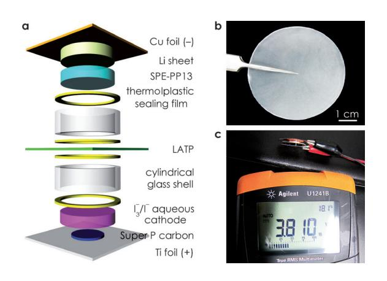
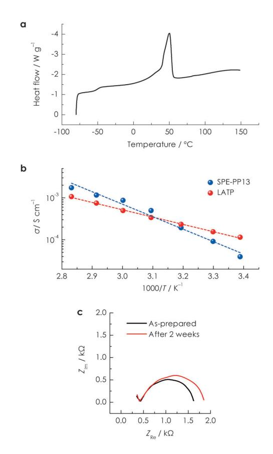
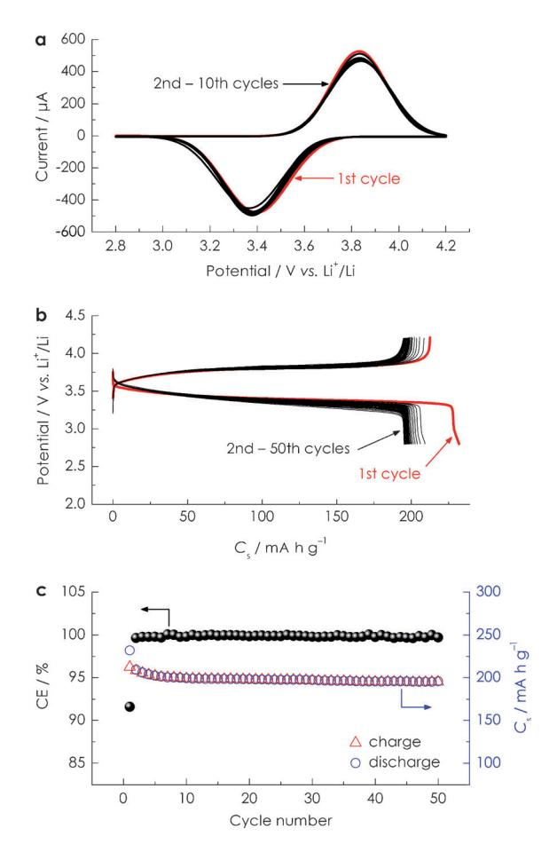

## An Aqueous Lithium–Iodine Battery with Solid Polymer Electrolyte-Coated Metallic Lithium Anode

Yu Zhao, Nadge Bonnet Mercier, and Hye Ryung Byon\*[a]

An aqueous lithium–iodine (Li–I2) cell with solid polymer electrolyte (SPE)-passivated metallic Li is demonstrated. The metallic Li anode is isolated from the aqueous I3 -/I cathode by the SPE and a Li-ion-conductive solid electrolyte layer. The proposed aqueous Li–I2 cells exhibit a discharge potential of approximately 3.4 V versus Li+/Li, stable capacity retention for 50 cycles, and adequate rate capability.

Advanced batteries that overcome current batteries' performance have been explored extensively for application in green vehicles and stationary storage.[1, 2] The main target for the development of innovative batteries is to provide an improved energy density, such as around 40 kW h, to accomplish a 500 km driving range of battery-powered vehicles.[3] To achieve such a high energy density, many efforts have aimed at increasing cathode capacity, which resulted in the appearance of various concepts of prototype batteries, such as lithium– oxygen (Li–O2),[2] lithium–sulfur (Li–S),[2] and aqueous cathode cells[4, 5] in conjunction with flow-through mode.[6] These cells have demonstrated a greater capacity than that of the current Li-ion batteries, although further endeavors are acutely required to enhance cycling stability and mitigate parasitic reactions.[2] According to increasing cathode capacity, the use of metallic Li with an excellent capacity (a theoretical specific capacity of 3861 mA h g-1 ) has also resurfaced. Metallic Li has been used restrictively because of the safety issue of explosion triggered by electrical shorts and explosive gases.[7] Therefore, to employ metallic Li for high-energy-density batteries, one must prevent Li dendrite formation and protect the Li from the gas and flammable electrolyte. The Li-ion conductive oxide solid electrolytes, such as NaSICON-type Li1+x+3zAlx- (Ti,Ge)2xSi3zP3zO12 (LATP) and the perovskite structure of (La,- Li)TiO3 (LLTO), can be employed as separator to isolate the metallic Li, through which only the Li+ ion can commute.[8] However, their lack of compatibility in the presence of Li and low mechanical strength are a bottleneck to direct deposition on the Li. For example, we demonstrated hybrid lithium– iodine (Li–I2) cells composed of metallic Li/liquid-type organic electrolyte/LATP/I3 -/Iaqueous cathode prepared from I2 in

[a] Dr. Y. Zhao, N. B. Mercier, Dr. H. R. Byon Byon Initiative Research Unit (IRU), RIKEN Hirosawa 2-1, Wako Saitama 351-0198 (Japan) E-mail: hrbyon@riken.jp Supporting information for this article is available on the WWW under http://dx.doi.org/10.1002/cplu.201402038..

Part of a Special Issue on "Metal–Air and Redox Flow Batteries". To view the complete issue, visit:<http://dx.doi.org/10.1002/cplu.v80.2>

aqueous KI,[5a,b, 6b] in which a solid buffer layer in between metallic Li and LATP, instead of the liquid-type organic electrolyte, was required to suppress the growth of Li dendrite and its absence led to difficulty of cell handling owing to the thin and fragile LATP, which was not applicable to practical batteries.

Herein, we introduce a solid polymer electrolyte (SPE) buffer layer to passivate the metallic Li in the aqueous Li–I2 cell. The SPE serves as 1) the protective layer of the metallic Li along with the outer separator layer of LATP and 2) the flexible buffer layer to inhibit direct contact of Li with the LATP as well as alleviate the mechanical fragility of LATP. The use of poly( ethylene oxide) (PEO), one of the most common polymers for the SPE, provides high stability in the presence of Li, which results in the suppression of Li dendrite formation.[9] The ionic conductivity of the SPE can be improved by the addition of room-temperature ionic liquid (RTIL) and nanosized ceramic filler, which restrains the dendrite formation further.[9d, 10] We combine the PEO-based metallic Li with an I3 -/I aqueous cathode and demonstrate the resultant high performance of the aqueous Li–I2 cell.

Figure 1 a depicts the configuration of the aqueous Li–I2 cell. The I3 -/Iaqueous cathode in the Li–I2 cell was prepared from

Figure 1. Aqueous Li–I2 cell. a) Schematic illustration of the cell. b) Optical image of PEO-based SPE. c) Open-circuit potential of the as-prepared cell at room temperature.

I2/KI in aqueous medium. Super P carbon/binder coating a Ti foil was used for the cathode-side current collector (bottom part in Figure 1 a). The anode consisted of metallic Li pressed on Cu foil and PEO-based SPE covering the entire area of Li (top part in Figure 1 a). The SPE was homogeneous, flexible, and semitransparent, as shown in Figure 1 b, and its average

thickness was (25050) mm. The anode and cathode parts were connected by LATP having a thickness of (15020) mm. The Li/SPE/LATP contact was enhanced after heating at 808C.

The SPE was prepared from PEO (molecular weight 6 105 ), lithium bis(trifluoromethanesulfonyl)imide (LiTFSI), and RTIL, namely N-methyl-N-propylpiperidinium bis(trifluoromethanesulfonyl)imide (PP13TFSI), with molar ratios of EO/Li=20 and PP13+/Li+ =1, in addition to 10 wt% nanosized SiO2 ceramic filler in the total mass.[9b, 10] The seamless, freestanding, and solvent-free PEO-based SPE, that is, PEO20LiTFSI+ PP13TFSI/SiO2, was formed after homogeneous mixing of all materials by ball milling followed by hot pressing (see the Experimental Section). The PP13TFSI and SiO2 filler were added to improve the ionic conductivity (s).[9d, 10] It is well known that the Li+ ion complexed to a PEO matrix can diffuse by segmental motion of the PEO.[11] Accordingly, the Li+-ion diffusion can be improved markedly with increasing temperature, in particular at around the melting temperature of the SPE to provide molten PEO matrix. The differential scanning calorimetry (DSC) profile revealed phase transition of SPE with respect to increasing temperature. Figure 2 a shows the DSC heating trace of PEO-based SPE in a temperature range from -80 to 150 8C. The glass transition occurred around -558C (Tg) and the melt-

Figure 2. Characterization of the PEO-based SPE. a) DSC heating trace in a temperature range from -80 to 1508C. b) Arrhenius plots of the ionic conductivity of PEO-based SPE (blue) and LATP (red). c) EIS data of PEO-based SPE as-prepared (black) and after 2 weeks (red) stored in an Ar atmosphere. ZRe and ZIm are the real and imaginary components of impedance, respectively.

ing peak appeared at 508C. The amorphous phase of the PEO matrix at the melting temperature promotes Li+-ion diffusion, which raises the ionic conductivity. Temperature-dependent electrochemical impedance spectroscopy (EIS) and Arrhenius plots demonstrated improved SPE ionic conductivity with increasing temperature. The EIS measured using a stainless steel (SS) symmetric cell (SS/SPE/SS) in Figure S1 (see the Supporting Information) and the corresponding temperature-correlated conductivity plot in Figure 2 b exhibit logarithmically increasing SPE conductivity at a temperature range of 20–85 8C. The ionic conductivity was estimated to be 6.8 10-4 S cm-1 at 55 8C, which was comparable to that of the LATP separator providing 4.2 10-4 S cm-1 measured with a gold symmetric cell (Au/ LATP/Au, Arrhenius plot in Figure 2 b). Consequently, a temperature of 558C is suitable to enhance the ionic conductivity of both the PEO-based SPE and LATP, which can act as the Li+ -ion transport channel. The SPE containing the PP13TFSI also had good stability with the metallic Li. Figure 2 c displays the EIS results of the Li symmetric cell (Li/SPE/Li) for 14 days at room temperature. The interfacial resistances are 1.63 and 1.85 kW for the SPE as-prepared and after 14 days, respectively. This result corroborates that the SPE can serve as a stable protective layer to the metallic Li.

Along with the fabrication of the anode side, the aqueous cathode was prepared by using 0.2m I2 and 1m KI in aqueous medium. It has been known that an I2 bead is not well dissolved in aqueous medium, whereas the addition of excess iodide ion (I-) markedly increases the I2 solubility and produces predominant triiodide (I3 -) ion [Eq. (1)]:[5, 12]

$$
I_2(s) + I^- \to I_3^- \tag{1}
$$

The I3 and I-, formed after the redox reaction, have appreciable solubility, reaching over 8 mol L-1 in aqueous KI.[13] This high solubility allowed the I2-saturated aqueous cathode to demonstrate an energy density of approximately 330 W h kg-1 . [5] Moreover, the employment of an aqueous cathode reservoir coupled with a cathode flow-through mode could improve the energy density in proportion to the quantity of aqueous cathode.[6] In addition, the aqueous cathode maintained a pH of 6–7, which did not significantly damage the LATP separator and carbon current collectors for cycling. During the cell operation, the I3 in the as-prepared aqueous cathode is reduced to I with two electrons transferred. The reduction potential is approximately 0.52 V versus the standard hydrogen electrode (SHE) estimated by the Nernst equation with 0.2m I2 at 558C. In conjunction with a metallic Li anode providing the total cell reaction in Equation (2):

$$
I_3^- + 2Li \leftrightarrow 3I^- + 2Li^+ \tag{2}
$$

the reduction potential is expected to be approximately 3.56 V versus Li+/Li at 558C, which is suitable to avoid unintended reactions such as aqueous electrolysis Ti(IV) reduction of the LATP separator.

The open-circuit potential of the as-assembled aqueous Li–I2 cell, that is, the combination of aqueous I3 -/I cathode and SPE-coated Li, was 3.81 V versus Li+/Li at room temperature (Figure 1 c) and 3.83 V versus Li+/Li at 558C, which was stabilized to 3.79 V after 2 days (Figure S2). The total resistance of a freshly prepared aqueous Li–I2 cell was approximately 1 kWcm-2 at 558C, which was attributed predominantly to the interfacial resistances at Li/SPE/LATP and hydrophobic Super P carbon with the poly(vinylidene fluoride) binder/aqueous cathode (Figure S3). Figure 3 a shows the cyclic voltammetry (CV)

Figure 3. Electrochemical performance of aqueous Li–I2 cells at 558C. a) Ten cycles of CV at a sweeping rate of 0.2 mV s-1 . b) Charge/discharge profiles over 50 cycles at a current rate of 1 mA cm-2 . c) Corresponding Coulombic efficiency (CE) and specific capacity (Cs).

curves of the aqueous Li–I2 cell cycled ten times at 55 8C and a sweeping rate of 0.2 mV s-1 . The profiles exhibit stable reduction and oxidation peaks at potentials of approximately 3.40 and 3.83 V versus Li+/Li, respectively. The higher charge potential arises from the high internal resistance of the solid-state anode, that is, the SPE and LATP layers. There was no additional peak in the potential range of 2.8–4.2 V versus Li+/Li, which implied negligible aqueous electrolysis. Notably, the thermodynamically stable aqueous potential at neutral pH is calculated to be 2.3–4.3 V versus Li+/Li with reference to the Pourbaix diagram and also considering the H2/O2 evolution enthalpy modulated by input electricity.

The aqueous Li–I2 cells exhibited reliable and stable cell performance in a galvanostatic method at 558C. Figure 3 b displays charge/discharge profiles over 50 cycles at a current rate of 1 mA cm-2 . The charge and discharge plateaus were maintained stably at approximately 3.8 and 3.4 V versus Li+/Li, respectively, for 50 cycles. The first discharge capacity approached 225 mA h g-1 whereas the following cycles had approximately 200 mA h g-1 . This capacity difference for the initial first and second cycles is the result of the stranded Li+ ion in the aqueous cathode, which is required to offer proper ionic conductivity. The remaining Li+ ions in the cathode are accompanied by the idle counterions I3 -/I-, which are not involved in the active redox reaction, for charge balance. Accordingly, this phenomenon results in the first charge capacity, which is lower than the first discharge capacity, providing a Coulombic efficiency of approximately 91% and comparable to the second discharge capacity. Notably, the Coulombic efficiency can simply increase to nearly 100% upon the first cycle by either addition of Li salt or increasing the active material (I2) concentration.[5] Figure 3 c summarizes the charge/discharge capacity and Coulombic efficiency for 50 cycles. The capacity gradually decreased for the initial five cycles, probably because of a poor Li/SPE interface inducing structural and electrical modulation,[7] whereas the following 45 cycles maintained almost constant capacity. As a result, the capacity retention for the 5–50th cycles was 97% with a capacity retained at approximately 190 mA h g-1 , estimated to be nearly 90% of the theoretical capacity (211 mA h g-1 , estimated from active material I2). The Coulombic efficiency reached (1000.3)% after the second cycle, which was comparable to that of Li-ion batteries[14] and superior to as-demonstrated batteries using aqueous media (or aqueous cathode),[4] other Li–I2 cells based on solid electrodes,[15] and Li–S/Li–O2 cells.[2]

The aqueous Li–I2 cell also has adequate rate capability. Figure 4 a shows representative discharge profiles at current rates of 0.5, 1, 2, and 5 mA cm-2 after approaching the stable state at 558C. The average discharge potentials were approximately 3.4 V versus Li+/Li at discharge current rates of 0.5–1 mA cm-2 and were still held stably over 3 V at 5 mA cm-2 , which was higher than for a primary Li–I2 battery[16] and an all-solid-state Li–I2 battery.[15b] Figure 4 b reveals stable discharge capacities for five cycles at each discharge current rate, such as approximately 205 mA h g-1 at a current rate of 0.5 mA cm-2 and 150 mA h g-1 at 5 mA cm-2 . The polarization curve in Figure 4 c exhibits linearly increasing power density up to 5 mA cm-2 , at which the specific power density reached approximately 436 W kg-1 . The aqueous Li–I2 cell could deliver a maximum power density approaching 520 W kg-1 at approximately 2.8 V versus Li+/Li.

The SPE-based Li-anode battery, which has no nonaqueous liquid, avoids leakage and volatility of hazardous organic solvent. In addition, the solid-state anode with aqueous cathode cell can eliminate the thermal runaway route. The aqueous media with high specific heat capacity and thermal conductivity can dissipate the heat, which offers an automatic cool-down system in the case of temperature increase.[17] However, the limited ionic conductivity of the SPE and LATP, which is two

Figure 4. Rate capability and power density of aqueous Li–I2 cells at 55 8C. a) Discharge profiles at discharge current rates of 0.5 (black), 1 (red), 2 (blue), and 5 mA cm-2 (green). The charge current rate is 1 mA cm-2 for all curves owing to consideration of the low ionic conductivity of the SPE and LATP. The as-prepared cell was cycled ten times at 1 mA cm-2 before the measurement. b) Specific capacity (Cs) and Coulombic efficiency (CE) for five cycles at each current rate. c) Polarization curve (black) and corresponding specific power density (Ps, blue).

orders of magnitude lower than that of liquid-type electrolytes with organic media (10-2 S cm-1 ) [18] and aqueous medium (10-2 S cm-1 ),[13] hindered the total cell performance (see Figure S4). The growth of Li dendrite was suppressed greatly by using the SPE, but not completely curbed during long-term cycling. The slowly grown Li dendrite eventually touched the LATP and resulted in moderate degradation of LATP by TiIV reduction. This result suggests that employment of a Li-stable solid electrolyte, such as the garnet-like structure of Li7La3Zr2O12 (LLZ), is more promising to conduct highly rechargeable metallic Li-based batteries.[19] Therefore, further development is needed to achieve highly conductive, stable, scalable, and economical Li-ion-conductive organic and inorganic protective layers. For the I3 -/I aqueous cathode, the rate constant of electron transfer is estimated to be approximately 7.5 10-2 cm s-1 at room temperature by using a rotating-disk electrode system and the Levich equation (see Figure S5). This rate constant is notably high compared to those from redox species, such as VO2 +/VO2+, Fe3+/Fe2+, Ce4+/Ce3+, Cr3+/Cr2+, and Br2/Br-, applied in typical redox-flow batteries.[20] The successful aqueous Li–I2 cells can deliver a practical energy density of approximately 170 W h kg-1 by using an I2-saturated cathode, demonstrated in previous reports,[5a,b] and a further increase in the energy density value by the addition of the flowthrough mode and fuel tank for the aqueous cathode.[6]

In summary, we have demonstrated aqueous Li–I2 cells with SPE-passivated metallic Li. The SPE layer and LATP separator protected the metallic Li, which resulted in a discharge potential of 3.4 V, specific capacity of 190 mA h g-1 , and ideal Coulombic efficiency for the aqueous Li–I2 cells at a current rate of 1 mA cm-2 . The improved ionic conductivity of the protective anodic layers can enhance the total cell performance further, which might be applied to other high-energy-density batteries, not only for aqueous batteries but also for Li–O2 and Li–S batteries.

## Acknowledgements

This study was financially supported by RIKEN.

Keywords: batteries · cathodes · iodine · lithium · solid polymer electrolytes

- [1] B. Dunn, H. Kamath, J.-M. Tarascon, [Science](http://dx.doi.org/10.1126/science.1212741) 2011, 334[, 928 935.](http://dx.doi.org/10.1126/science.1212741)
- [2] P. G. Bruce, S. A. Freunberger, L. J. Hardwick, J.-M. Tarascon, Nat. Mater. 2012, 11, 19 – 29.
- [3] http://www.nedo.go.jp/library/battery\_rm.html (accessed: March 2014).
- [4] a) G. Wang, L. Fu, N. Zhao, L. Yang, Y. Wu, H. Wu, [Angew. Chem.](http://dx.doi.org/10.1002/ange.200603699) 2007, 119[, 299 – 301](http://dx.doi.org/10.1002/ange.200603699); [Angew. Chem. Int. Ed.](http://dx.doi.org/10.1002/anie.200603699) 2007, 46, 295 – 297; b) J.-Y. Luo, W.- J. Cui, P. He, Y.-Y. Xia, [Nat. Chem.](http://dx.doi.org/10.1038/nchem.763) 2010, 2, 760 – 765; c) P. He, Y. Wang, H. Zhou, [Electrochem. Commun.](http://dx.doi.org/10.1016/j.elecom.2010.09.025) 2010, 12, 1686 – 1689; d) Y. Lu, J. B. Goodenough, Y. Kim, [J. Am. Chem. Soc.](http://dx.doi.org/10.1021/ja201118f) 2011, 133, 5756 – 5759; e) L. Chen, Z. Guo, Y. Xia, Y. Wang, [Chem. Commun.](http://dx.doi.org/10.1039/c3cc00064h) 2013, 49, 2204 – 2206.
- [5] a) Y. Zhao, L. Wang, H. R. Byon, [Nat. Commun.](http://dx.doi.org/10.1038/ncomms2907) 2013, 4, 1896; b) Y. Zhao, M, Hong, N. B. Mercier, G. Yu, H. C. Choi, H. R. Byon, [Nano Lett.](http://dx.doi.org/10.1021/nl404784d) 2014, 14[, 1085 – 1092](http://dx.doi.org/10.1021/nl404784d); c) Y. Zhao, Y. Ding, J. Song, L. Peng, J. B. Goodenough, G. Yu, Energy Environ. Sci. 2014, DOI: 10.1039/C4EE00407H.
- [6] a) Y. Lu, J. B. Goodenough, [J. Mater. Chem.](http://dx.doi.org/10.1039/c0jm04222f) 2011, 21, 10113 10117; b) Y. Zhao, H. R. Byon, [Adv. Energy Mater.](http://dx.doi.org/10.1002/aenm.201300627) 2013, 3, 1630 – 1635.
- [7] J. M. Tarascon, M. Armand, [Nature](http://dx.doi.org/10.1038/35104644) 2001, 414[, 359 367](http://dx.doi.org/10.1038/35104644).
- [8] a) N. Imanishi, S. Hasegawa, T. Zhang, A. Hirano, Y. Takeda, O. Yamamoto, [J. Power Sources](http://dx.doi.org/10.1016/j.jpowsour.2008.07.080) 2008, 185, 1392 – 1397; b) S. Hasegawa, N. Imanishi, T. Zhang, J. Xie, A. Hirano, Y. Takeda, O. Yamamoto, [J. Power Sources](http://dx.doi.org/10.1016/j.jpowsour.2008.08.009) [2009](http://dx.doi.org/10.1016/j.jpowsour.2008.08.009), 189[, 371 – 377.](http://dx.doi.org/10.1016/j.jpowsour.2008.08.009)
- [9] a) F. Croce, G. B. Appetecchi, L. Persi, B. Scrosati, Nature 1998, 394, 456 458; b) G. B. Appetecchi, F. Croce, J. Hassoun, B. Scrosati, M. Salomon, F. Cassel, [J. Power Sources](http://dx.doi.org/10.1016/S0378-7753(02)00543-8) 2003, 114, 105 – 112; c) T. Zhang, N. Imanishi, S. Hasegawa, A. Hirano, J. Xie, Y. Takeda, O. Yamamoto, N. Sammes, [J. Elec](http://dx.doi.org/10.1149/1.2990717)[trochem. Soc.](http://dx.doi.org/10.1149/1.2990717) 2008, 155, A965 – A969; d) T. Zhang, N. Imanishi, Y. Takeda, O. Yamamoto, [Chem. Lett.](http://dx.doi.org/10.1246/cl.2011.668) 2011, 40, 668 – 674.
- [10] a) J.-H. Shin, W. A. Henderson, S. Passerini, [Electrochem. Commun.](http://dx.doi.org/10.1016/j.elecom.2003.09.017) 2003, 5[, 1016 – 1020](http://dx.doi.org/10.1016/j.elecom.2003.09.017); b) J.-H. Shin, W. A. Henderson, S. Passerini, [J. Electrochem.](http://dx.doi.org/10.1149/1.1890701) Soc. 2005, 152[, A978 – 983](http://dx.doi.org/10.1149/1.1890701); c) S. Liu, N. Imanishi, T. Zhang, A. Hirano, Y. Takeda, O. Yamamoto, J. Yang, [J. Electrochem. Soc.](http://dx.doi.org/10.1149/1.3473790) 2010, 157, A1092 – [A1098](http://dx.doi.org/10.1149/1.3473790); d) C. Zhu, H. Cheng, Y. Yang, [J. Electrochem. Soc.](http://dx.doi.org/10.1149/1.2931523) 2008, 155, [A569 – A575.](http://dx.doi.org/10.1149/1.2931523)
- [11] W. H. Meyer, [Adv. Mater.](http://dx.doi.org/10.1002/(SICI)1521-4095(199804)10:6%3C439::AID-ADMA439%3E3.0.CO;2-I) 1998, 10, 439 448.
- [12] P. H. Svensson, L. Kloo, [Chem. Rev.](http://dx.doi.org/10.1021/cr0204101) 2003, 103[, 1649 1648.](http://dx.doi.org/10.1021/cr0204101)
- [13] J. A. Dean, Lange's Chemistry Handbook, 14th ed., McGraw-Hill, New York, 1992.
- [14] M. S. Whittingham, [Chem. Rev.](http://dx.doi.org/10.1021/cr020731c) 2004, 104[, 4271 4301](http://dx.doi.org/10.1021/cr020731c).
- [15] a) Y. L. Wang, Q. L. Sun, Q. Q. Zhao, J. S. Cao, S. H. Ye, [Energy Environ. Sci.](http://dx.doi.org/10.1039/c1ee01875b) 2011, 4[, 3947 – 3950](http://dx.doi.org/10.1039/c1ee01875b); b) F.-C. Liu, W.-M. Liu, M.-H. Zhan, Z.-W. Fu, H. Li, [Energy Environ. Sci.](http://dx.doi.org/10.1039/c0ee00528b) 2011, 4, 1261 – 1264.

- [16] B. B. Owens, Batteries for Implantable Biomedical Devices, Plenum, New York, 1986.
- [17] X. Wang, Y. Hou, Y. Zhu, Y. Wu, R. Holze, Sci. Rep. 2013, 3, 1401.
- [18] K. Xu, [Chem. Rev.](http://dx.doi.org/10.1021/cr030203g) 2004, 104[, 4303 4418.](http://dx.doi.org/10.1021/cr030203g)
- [19] M. Kotobuki, H. Munakata, K. Kanamura, Y. Sato, T. Yoshida, [J. Electro](http://dx.doi.org/10.1149/1.3474232)[chem. Soc.](http://dx.doi.org/10.1149/1.3474232) 2010, 157[, A1076 – A1079](http://dx.doi.org/10.1149/1.3474232).

[20] A. Z. Weber, M. M. Mench, J. P. Meyers, P. N. Ross, J. T. Gostick, Q. Liu, [J.](http://dx.doi.org/10.1007/s10800-011-0348-2) [Appl. Electrochem.](http://dx.doi.org/10.1007/s10800-011-0348-2) 2011, 41, 1137 – 1164.

Received: February 27, 2014 Published online on April 15, 2014