# **A Review of Solid Electrolyte Interphases on Lithium Metal Anode**

 *Xin-Bing Cheng , Rui Zhang , Chen-Zi Zhao , Fei Wei , Ji-Guang Zhang , and Qiang Zhang \** 

 **Lithium metal batteries (LMBs) are among the most promising candidates of high-energy-density devices for advanced energy storage. However, the growth of dendrites greatly hinders the practical applications of LMBs in portable electronics and electric vehicles. Constructing stable and effi cient solid electrolyte interphase (SEI) is among the most effective strategies to inhibit the dendrite growth and thus to achieve a superior cycling performance. In this review, the mechanisms of SEI formation and models of SEI structure are briefl y summarized. The analysis methods to probe the surface chemistry, surface morphology, electrochemical property, dynamic characteristics of SEI layer are emphasized. The critical factors affecting the SEI formation, such as electrolyte component, temperature, current density, are comprehensively debated. The effi cient methods to modify SEI layer with the introduction of new electrolyte system and additives, ex-situ-formed protective layer, as well as electrode design, are summarized. Although these works afford new insights into SEI research, robust and precise routes for SEI modifi cation with well-designed structure, as well as understanding of the connection between structure and electrochemical performance, is still inadequate. A multidisciplinary approach is highly required to enable the formation of robust SEI for highly effi cient energy storage systems.** 

# **1. Introduction**

 Rechargeable lithium (Li)-based batteries have been worldwidely investigated as the light-weight and high-energy-density energy storage devices. [ 1,2 ] The earliest commercial products of rechargeable Li batteries appeared in the 1970s, employing Li metal as the anode. [ 3,4 ] However, metallic Li electrodes were quickly discarded due to the Li dendrite growth during electrodeposition. Li dendrites can short-circuit the cell causing a

X. B. Cheng, R. Zhang, C. Z. Zhao, Dr. F. Wei, Dr. Q. Zhang Beijing Key Laboratory of Green Chemical Reaction Engineering and Technology Department of Chemical Engineering Tsinghua University Beijing 100084 , P. R. China E-mail: zhang-qiang@mails.tsinghua.edu.cn Dr. J.-G. Zhang Joint Center for Energy Storage Research Energy and Environment Directorate Pacifi c Northwest National Laboratory Richland , WA 99354 , USA

This is an open access article under the terms of the Creative Commons Attribution License, which permits use, distribution and reproduction in any medium, provided the original work is properly cited.

# **DOI: 10.1002/advs.201500213**

safety risk. In the 1990s, Li-ion batteries (LIBs) were introduced by Sony Corporation to address the dendrite issues by hosting Li in a graphitic material. Li ion insertion strategies led to the tremendous success of LIBs in consumer portable electronics. [ 5 ] It should be noted that the enhanced battery safety of LiBs is at a signifi cant cost of energy density, because the specifi c capacity of Li metal (3860 mA h g −1 ) is ten times larger than that of graphite (370 mA h g −1 ). Though LIBs are now gradually approaching their theoretical limit, they still cannot meet the booming requirements for personal electronics and electric vehicles. With the development of advanced electrolytes, separators, and other battery components, Li-metal-based rechargeable batteries have been strongly considered in recent years. [ 6–8 ]

 The safe use of Li metal as an anode is still a great challenge, as the dendritic and mossy metal deposits are very easily

obtained on the working Li metal anode. Li dendrites induce a low Coulombic effi ciency and severe safety risk, hindering the practical demonstration of Li metal batteries (LMBs) with very high energy density. The dendrite nucleation and growth are closely related to the surface layer between the electrolyte and anode. The surface component and structure of the layer play an extremely important effect on the morphology of Li deposits and decide the cycling performance of LMBs. [ 7,9–14 ]

 As Li metal can react with most organic solvents, a surface fi lm is formed during the initial charging/discharging processes. In 1979, Peled fi rstly realized the electrically insulating and ionically conductive interface and named it as the solid electrolyte interphase (SEI). [ 15 ] The SEI layer is with a thickness of ≈20 nm and includes various organic and inorganic components. On one hand, the formation of the SEI intrinsically consumes the anode and electrolyte, leading to a low effi ciency. On the other hand, the SEI effectively prevents the further physical contact between Li and the solvent, therefore making Li dynamically stable in certain organic solvents. Beyond that, the SEI can adjust the distribution of Li ions from the bulk electrolyte to the anode [ 15 ] ( **Figure 1** ): (1) the solvated Li ion sheds its solvent molecules and thus has the access to the internal Schottky vacancy of the SEI; (2) the Li ion continuously migrates through the bulk of the SEI by relaying itself in Schottky vacancies; (3) fi nally, it reaches the anode surface and accepts an electron from the current collector, then is deposited as Li metal. The

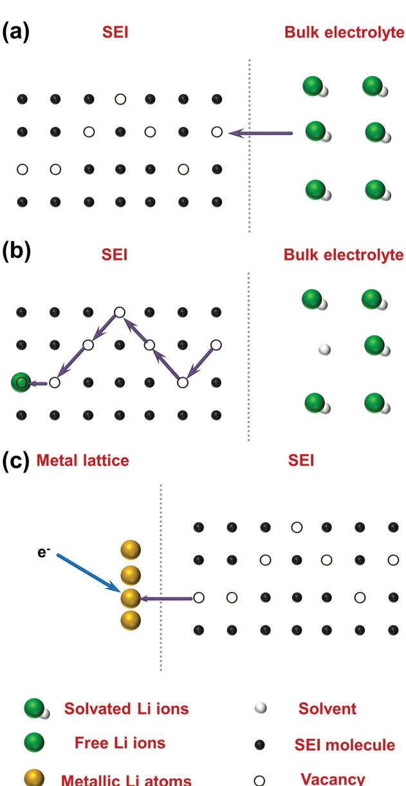

**Figure 1.** A schematic description of Li-ion diffusion from the bulk electrolyte to the anode. [ 15 ] a) The solvated Li ion sheds its solvent molecules and thus has the access to the internal Schottky vacancy of the SEI. b) The Li ion continuously migrates through the bulk of the SEI by relaying itself in Schottky vacancies. c) The free Li ion reaches the anode surface and accepts an electron from the current collector, then deposits as Li metal.

even deposition of Li ions leads to dendrite-free morphology of LMBs with high effi ciency.

 The SEI fi lm is widely observed in LIBs. In routine LIBs, robust SEI layers can be formed when graphite, silicon and other oxides are employed as the anode. Since the SEI on the graphite anode can be extremely stable during several thousands of cycles in the carbonate electrolyte, the as-obtained LIBs with the graphite anode have been successfully commercialized. However, the SEI layer of Li metal is usually unstable and is not yet well understood. Compared with volume changes of ≈10 and 400% for graphite and silicon anodes, respectively,

**www.MaterialsViews.com**

the relative volumetric change of Li metal anode is virtually infi nite, because Li metal is 'hostless'. The huge volume change requires the SEI layer with high elastic modulus. Dendrite growth is widely observed in LMBs, which is a fundamental challenge in LMB researche but has been detected less in current commercial LIBs. Consequently, the issue is much tougher for the SEI layer of Li metal in LMBs than that of LIBs. The fundamental exploration of SEIs on LMB is the fi rst step to understand the complex but important issue of Li metal anode.

 For an ideal SEI, it should have several features, such as high Li ionic conductivity, proper thickness with compact structure, and high elastic strength to mechanically suppress the breakthrough by Li dendrites, which is an important part to inhibit the dendrite growth on Li metal anode. However, the SEI layer of LMBs is unstable in some extreme operation conditions, such as extreme high/low temperature and high cycling rates. The formed SEI either grows much thicker or becomes non-protective, which induces rapid performance degradation. Consequently, many strategies have been proposed to construct a stable SEI, such as the electrolyte additives, electrode design, charging models, etc.

 In this contribution, the recent advances in fundamental science of the SEI formation on the Li metal anode are reviewed. Firstly, the formation mechanisms of SEI and models of SEI structure on Li metal anode are briefl y summarized. The recent progress in the characterization of the components, structure, and electrochemical property of SEI layer are fully investigated. The principles of SEI formation under different operation parameters and SEI modifi cation for robust use in a working cell are summarized. Finally, recent developments and new directions in research on SEIs of Li metal anode are also involved.

# **2. Mechanism of SEI Formation**

 The present electrolyte systems in LMBs mostly contain solvents and Li salts. [ 16–18 ] The common solvents are esters (e.g. ethylene carbonate (EC), propylene carbonate (PC), dimethyl carbonate (DMC), ethylmethyl carbonate (EMC)), ethers (e.g. 1,2-dimethoxyethane (DME), tetraethylene glycol dimethyl ether (TEGDME), 1,3-dioxolane (DOL), tetrahydrofuran (THF)), and sulfones (dimethylsulfoxide and trimethylene sulfi te). The Li salts include lithium bis(trifl uoromethanesulfonyl)imide (LiTFSI), lithium bis(fl uorosulfonyl)imide (LiFSI), lithium hexafl uorophosphate (LiPF 6 ), lithium perchlorate (LiClO 4 ), and so on.

 The reduction potential of organic solvent is below 1.0 V (vs. Li + /Li). Therefore, when bare Li is exposed to solution and a current applied, immediate reactions between Li and electrolyte species are carried out in a time constant of milliseconds or less. [ 19 ] The insoluble products of the parasitic reactions between Li ions, anions, and solvents depositing on the metallic anode surface are regarded as the SEI.

 Though there are considerable controversies concerning the mechanism of SEI formation, several mechanisms are proposed and highlighted herein to explain SEI formation on the Li metal anode ( **Figure 2** ): [ 15,18,20,21 ] (1) The Peled model (Figure 2 a). [ 15,22 ] This is the primary mechanism to describe the SEI fi lm established via a surface reaction. The surface reaction is stepwise and preferential reduction of certain electrolyte components.

**www.MaterialsViews.com**

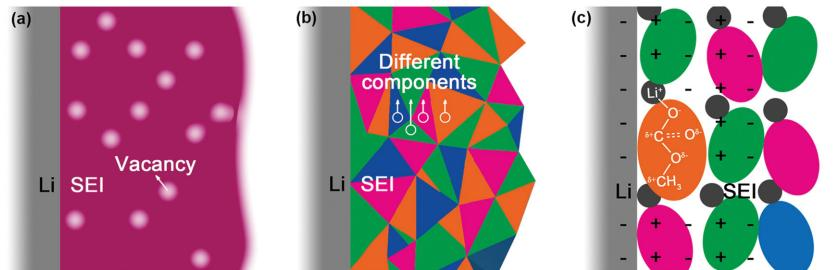

**Figure 2.** Schemes of these mechanisms for SEI formation. a) The Peled's model. Reproduced with permission. [ 15 ] Copyright 1979, Electrochemical Society. b) Mosaic model. Reproduced with permission. [ 20 ] Copyright 1997, Electrochemical Society. c) Coulombic interaction mechanism. Reproduced with permission. [ 21 ] Copyright 1999, Electrochemical Society.

The formed layer is with integral structure except for several Schottky defects for Li ions migration. (2) The mosaic model (Figure 2 b). [ 23,24 ] Relative to the preceding model, several reductive decompositions are proceeding on the negatively charged anode surface simultaneously and a mixture of insoluble multiphase products deposits on the anode. The formed SEI has a mosaic morphology, allowing the Li ions to migrate through the boundary of multiphase products. (3) The Coulombic interaction mechanism (Figure 2 c). [ 21,25 ] After the surface reaction, the decomposition products are lined up with positively charged Li ion as a "head" and the partially positively charged carbons as a "foot". The unique double electric layer allows the products to attach themselves to the existing fi lm. Compared to the aforementioned two models, the SEI layer constructed by Coulombic interaction mechanism can have superior stability due to the stronger adhesion induced by the ion pairs.

 To describe the morphology and structure of the magic layer, other structural models of SEI layers are proposed, such as (1) solid electrolyte interphase model, [ 15,26,27 ] (2) polymer electrolyte interphase (PEI) model, [ 27,28 ] (3) solid polymer layer (SPL) model, [ 29 ] (4) compact stratifi ed layer (CSL) model. [ 29 ]

 Though an impeccable model to present the real behavior of the layer between the electrolyte and anode is still lacking, the above-mentioned models provide insightful viewpoints to understand the electrochemistry of the SEI.

# **3. SEI Characterization**

#### **3.1. Surface Chemistry**

 Both Fourier transform infrared spectroscopy (FTIR) and X-ray photoelectron spectroscopy (XPS) are the most widely accepted technologies to probe the Li surface chemistry. Infrared spectra are collected by recording the changes in the transmitted intensity across a probed sample as a function of the wavenumber and infrared radiation can be partially absorbed at specifi c frequencies corresponding to their vibrational resonances. This allows for identifying functional groups by the vibrational signature of their chemical bonds. [ 30–35 ] XPS employs X-rays of high energy (≈1200–1500 eV) to expose the sample, which allows analysis of all elements (except H and He). The elements can be accurately detected when presented in concentrations of >0.1 atomic percentage and in the outermost 10 nm of the surface. [ 36–40 ] The FTIR and XPS techniques both can provide facile identifi cation of the functional groups of organic components and types of bonds on the Li surfaces from the locations and strengths of the peaks in FTIR and XPS spectra. However, the FTIR technique is non-destructive, while XPS may be destructive to the Li surface. [ 7,16,41 ]

 There are signifi cant research results that have been conducted by employing FTIR and XPS spectra. [ 7,16–18 ] The major inorganic species on Li surfaces include Li 2 O, [ 23 ] Li 2 S/ Li 2 S 2 , [ 42,43 ] LiOH, LiF, [ 44–47 ] LiI, [ 45 ] Li 3 N, [ 42 ] Li 2 CO 3 . [ 48 ] The major organic species on Li surfaces contain ROLi, RCOOLi, ROCOLi,

RCOO 2 Li, and ROCO 2 Li (R = alkyl groups). It has been reported that while organic components of the SEI are more electrochemically stable than the inorganic phases, they also signifi cantly decrease Li transport. [ 49 ] This in turn increases site-specifi c Li deposition and induces the enhanced Li dendrite nucleation and growth as well as low effi ciency. Beyond FITR and XPS, other technologies, such as Raman spectroscopy, [ 50–52 ] Auger electron spectroscopy (AES) [ 53–56 ] and nuclear magnetic resonance (NMR), [ 57,58 ] are also important techniques to obtain the Li surface chemistry.

 The surface chemistry of SEI layer is clearly detected by means of FTIR, XPS, Raman spectroscopy, AES, NMR etc. However, each characterization only provides limited SEI information based on its own principles. For instance, only the infrared-active species are recorded by FTIR and the bonding with Raman scattering are collected by Raman spectroscopy, while a comprehensive analysis of all surface components can't be realized by facile FTIR/Raman spectroscopy analysis. When XPS and AES are employed for SEI characterization, the Li metal must be exposed to ultra-high vacuum environment, which is quite different from the working Li metal anode in a battery. There are usually some overlap peaks or low signal-tonoise ratio in FTIR, XPS, AES, or NMR analysis. Consequently, it is a quite challenge to carry out quantitative analysis of SEI component with high precision.

 However, the results collected by each characterization technique are complementary to each other. A full and real description of the SEI can be obtained by rational combination of these techniques. **Table 1** lists the SEI components of Li metal anode reported in publications. The possible reactions during SEI formation are summarized in **Figure 3** . [ 16,41,59–61 ]

 As the SEI components strongly depend on the electrode material, electrolyte salts, solvents, as well as the working state of cell, no identical SEI layer can be found in two different situations. Consequently, the actual surface chemistry of SEI layer in a given system should be obtained by in situ or even in operando characterization methods with above-mentioned technologies rather than just referring to reported publications.

#### **3.2. Surface Morphology**

 To directly reveal the morphology of SEI in high-resolution, the scanning electron microscope (SEM) is the most convenient

**www.MaterialsViews.com**

**Table 1.** Typical contents of the SEI forming on the Li metal anode as reported in the literature.

| Number | Electrolyte                                                                      | Component                                                                    | Reference |
|--------|----------------------------------------------------------------------------------|------------------------------------------------------------------------------|-----------|
| 1–1    | Fresh Li plate                                                                   | Outer surface: LiOH or Li 2 CO 3 , hydrocarbon, carbonate                    | [23]      |
|        |                                                                                  | Inner part: Li 2 O, carbide                                                  |           |
| 1–2    | LiBF 4 (1.0 M ) in PC for 3 days                                                 | LiF, LiOH or Li 2 CO 3 , hydrocarbon, carbonate                              | [23]      |
| 1–3    | LiBF 4 (1.0 M ) in r-BL for 3 days                                               | LiF, LiOH or Li 2 CO 3 , hydrocarbon                                         | [23]      |
| 1–4    | LiBF 4 (1.0 M ) in THF for 3 days                                                | LiF, hydrocarbon                                                             | [23]      |
| 2      | LiC1O 4 (1.0 M ) and HF (5.0 M ) in PC                                           | Outer part: LiF, LiOH (Li 2 CO 3 or LiOCO 2 R) Inner part: Li 2 O            | [24]      |
| 3      | LiAsF 6 in DMC, EC-DMC (1:1), and EC-DEC (1:1)                                   | ROCO 2 Li, ROLi, and Li 2 CO 3                                               | [41]      |
| 4      | LiPF 6 (1 M ), vinylene carbonate (2 vol%), LiNO 3 (0.1 M ), EC/DMC (1:1 Vol) | ROCO 2 Li, (-CH 2 CH 2 O-) n , Li 2 CO 3 , Li 3 N, LiNO 2 , LiF, C-F         | [192]     |
| 5–1    | LiNO 3 in DOL/DME                                                                | LiN x O y                                                                    | [43]      |
| 5–2    | Li 2 S 6 in DOL/DME                                                              | Li 2 S, Li 2 S 2                                                             | [43]      |
| 5–3    | LiNO 3 and Li 2 S 6 in DOL/DME                                                   | Li 2 S 2 O 3 , Li 2 SO 4 , LiN x O y , Li 2 S, Li 2 S 2                      | [43]      |
| 6      | LiTFSI (0.8 M ), Li 2 S 6 (0.2 M ) in DIOX/DME (1:1, v/v)                        | Top layer: Li 2 S 2 O 3 , Li 3 N, –NSO 2 CF 3 Bottom layer: Li 2 S, Li 2 S 2 | [42]      |
| 7      | LiTFSI (0.5 M ), LiFSI (0.5 M ) in DOL/DME (2:1, v/v)                            | Li 2 NSO 2 CF 3 , Li y C 2 F x , LiF, Li 2 S 2 O 4 , Li 2 S, etc.            | [47,97]   |

and useful choice. The cross-sections of the individual particles in the Li metal reveals the presence of SEI layer. [ 62 ] However, it is diffi cult to directly observe the SEI, since the SEI always compactly coats on the surface of anode. The structure of Li metal and SEI layer may be damaged by a high electron dose during SEM observation. Therefore, a mild SEM operation parameter with a very low electron dose and an ultra-low accelerating voltage is recommended to investigate the SEI layer. Osmium tetroxide (OsO 4 ) staining was proposed by Scheiba et al. to increase material contrast of the SEI morphology, but keep the layer untouched. [ 63 ] After reacting with OsO 4 , SEI can be clearly

distinguished from the very prominent intact Li dendrites that

have readily reacted with OsO 4 ( **Figure 4** –1). Kramer employed in situ high resolution optical microscopy to provide information on the growth and electro-dissolution of single Li fi laments. [ 64 ] In the case of the dissolution of a Li fi lament, the SEI was left behind only connected to the substrate by a thin wire-like structure (Figure 4 –2), consisting of metal oxides and Li salt, e.g. LiF, or other impurities that are benefi cial for Li insertion. Limited by the resolution of optical microscopy, the hyperfi ne structure of SEI layer cannot be obtained. To further understand the SEI morphology and investigate the layer in nanometer scale, transmission electron microscopy (TEM) experiments are employed. [ 65,66 ] Tu and co-workers [ 67 ] employed

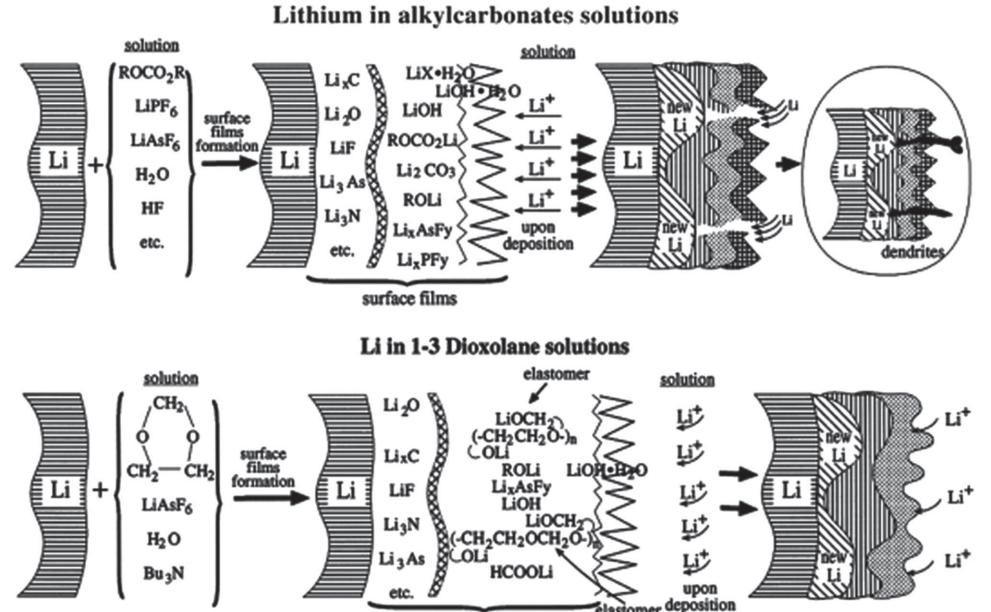

**Figure 3.** A schematic illustration of surface chemistry of SEI layer on Li electrodes in alkyl carbonates and in 1,3-dioxolane solutions. Reproduced with permission. [ 16 ] Copyright 2000, Elsevier.

**www.MaterialsViews.com**

**www.advancedscience.com**

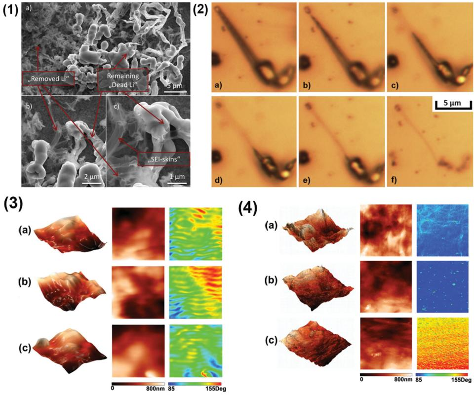

**Figure 4.** The SEI morphology on Li metal anode. 1) The appearance of Li dendrites and SEI layer on a Cu electrode after OsO 4 exposure in constant current mode. Reproduced with permission. [ 63 ] Copyright 2014, Elsevier. 2) In situ light microscopy of the electrodeposition of a Li needle and SEI layer after Li dissolution. Image (a) shows the initial needle and images (b–f) its dissolution. Images taken after b) 240 s, c) 285 s, d) afer 360 s, e) 390 s, and f) 585 s. Reproduced with permission. [ 64 ] Copyright 2014, Elsevier. 3) SPM 10 × 10 µm images of Li metal immersed in a) 1.0 M LiTFSI/ DME, b) 1.0 M LiTFSI/DG and c) 1.0 M LiTFSI/TEGDME for 1.0 h. From left to right column: 3D height images, 2D height images, and phase images. Reproduced with permission. [ 73 ] Copyright 2014, Elsevier. 4) SPM 10 × 10 µm images of Li electrode cycling in a) 1.0 M LiTFSI/DME, b) 1.0 M LiTFSI/DG and c) 1.0 M LiTFSI/TEGDME for 20 cycles. From left to right column: 3D height images, 2D height images, and phase images. Reproduced with permission. [ 73 ] Copyright 2014, Elsevier.

TEM to investigate the ex situ Li 3 N fi lm on Li metal. The interplanar crystal spacing of (001) was measured to be 3.87 Å by detection ofl attice fringes in the TEM pattern.

 To investigate the structure, thickness, and mechanical property of SEI, atomic force microscope (AFM) has been employed as a powerful tool in Li-ion battery. [ 68–71 ] Due to the difference in mechanical properties, the tip of the AFM can differentiate between the SEI layer and Li metal (or other substrates) and determine the thickness and modulus of SEI layer. Xu and coworkers [ 72 ] used in situ AFM techniques in combination with ex situ XPS to explore interfaces and obtained a comprehensive exploration into the real-time formation of this elusive SEI fi lm due to electrolyte decomposition. AFM characterization provides the feasibility to observe the SEI layer in the atmospheric environment. However, the imaging range is narrow and the resolution of AFM image is lower compared with images collected by SEM.

 In order to directly identify the thickness of the SEI layer, Yushin and co-workers employed secondary ion mass spectrometry, XPS, and a dual-beam focused ion beam/SEM to characterize the thickness. [ 62 ] The identifi cation of an image contrasted reversal that originates from solid Li being less dense than the surrounding liquid electrolyte and electrode surface allowed SEI to be identifi ed from Li-containing compounds. Xie and co-workers [ 73 ] employed a scanning probe microscopy (SPM) system to collect height and phase image of the SEI fi lm to understand the topography and species distribution of the SEI on Li electrode (Figure 4 –3,4). The height image shows that the SEI fi lms on the Li electrodes immersed in ether-based electrolytes had considerably smooth surface with several raised stages. In contrast, the phase image of the SEI fi lms had some particular features that exhibit a meshwork feature. This regular pattern was attributed to the decomposition of solvents on Li electrodes. However, the height image revealed that the SEI fi lms on Li electrodes became rough after 20 cycles. This suggested that the decomposition reaction was more active during cycling than in the immersion of Li electrodes in electrolytes before cycling.

 The microscopy characterization provides direct image evidences of SEI morphology and fi ne structure, which is important to infer the related physics and chemistry of SEI layers. However, the Li metal sample with SEI layer should be carefully pretreated to remove the electrolyte and other contamination from Li exposure to air and moisture. The image contrast under electron microscopy may also depend on the charged states and history of sample handling and transfer. Therefore,

the explanation on the image should be very careful. The in situ and in operando technology under microscopy introduces the feasibility to understand the working Li metal, which is expected to be powerful to understand the dynamic behavior of the SEI on Li metal anode.

### **3.3. Electrochemical Properties**

 The electrochemical related test is always a non-destructive, convenient and powerful technique for testing and diagnosing SEI. For instance, frequency-domain electrochemical impedance spectroscopy (EIS) provides a facile technique to determine the complex impedance in all components of a cell (electrode, electrolyte, and their interfaces) and the semicircle in the low frequency are always be applied to represent the Li ion transfer resistance through SEI. [ 73–79 ] Thus, EIS affords a universal opportunity to distinguish the impedance from different processes occurring simultaneously at the electrode surface. The relationship of the resistance and cell working temperature were touched upon by Archer and co-workers. [ 45 ] Both the interfacial and bulk (related to the lower intercept of the spectra) impedances rapidly decreased with the rise of temperature. A comparative investigation of electrolyte additives through EIS analysis on symmetric cells was carried out by Dahn and co-workers. [ 80 ] Almost all reported additives increased the negative electrode impedance and decreased the positive electrode impedance.

 There are always EIS experiments in SEI-related publications, which have become a routine and easy characterization method. For example, the ionic conductance of SEI layer can be obtained by the EIS experiments. [ 81 ] However, the most troublesome step of EIS experiments is the interpretation of the original spectroscopy, because few models can clearly describe and obtain a theoretical fi tting between the calculated and experimental impedances. Mostly, the interpretation of EIS is empirical. The measured spectra must be converted into electrochemical signals by fi tting them to the model with professional software. Typically, the models are classifi ed as: (i) structural ones, which link measured EIS data with kinetic parameters, concentrations and diffusion coeffi cients of the process, and (ii) formal ones, which describe the experimental impedances to obtain a good fi tting between the calculated and experimental impedances, but without clear physico-chemical signifi cance. Thus, EIS data analysis using basic fi tting model becomes the toughest step of EIS characterization, which limits the wide and quantitative applications in SEI property and related battery research.

# **3.4. Dynamic Characteristics**

 As the SEI is continuously renewed in dynamics, it is critically important to characterize the layer in a working cell. Recent advances in micro-fabricated electrochemical cells employing in situ and in operando technologies have opened new pathways to investigate electrochemical dynamics and to perform quantitative electrochemical measurements. [ 82–86 ] These results provide comprehensive information about the morphology,

**www.MaterialsViews.com**

structure, thickness, and mechanical property revolution of SEI layer of Li metal anode in the charging/discharging processes. [ 63,64,72 ] Bieker and co-workers [ 87 ] conducted in situ electrochemical investigations of SEI and dendrite growth on the Li metal anode. Yang and co-workers [ 33 ] explored in situ micro-FTIR spectroscopy to investigate the SEI layer between Li metal and Li/PEO 20 –LiN(CF 3 SO 2 ) 2 polymer electrolytes. The reduction reactions of oxygen and water as well as the formation of underpotential deposition Li was indicated by the cyclic voltammetric (CV) results. During the CV test, infrared spectral changes were observed and a direct correlation between the CV peaks and the magnitude of the infrared peaks can be clearly obtained. Sacci and co-workers [ 49 ] used in situ electrochemical scanning transmission electron microscopy (ec-S/TEM) to perform controlled electrochemical potential sweep measurements while simultaneously imaging site-specifi c structures resulting from electrochemical reactions. The SEI is approximately twice as dense as the electrolyte that determined from imaging and electron scattering theory ( **Figure 5** ).

 However, it should be noted that in situ and in operando technologies are always conducted in a vacuum environment with solid/ionic liquid electrolyte rather than the organic electrolyte. Most cells are always working with organic electrolyte. Consequently, when we refer the conclusion to the actual liquid system, the accuracy of the as-obtained result may be decreased. Advanced operando characterization of the Li metal in LMBs should be further explored to collect more reliable and dynamics information of the SEI on the working Li metal anode.

#### **3.5. Atomic Understanding by Theoretical Calculation**

 Numerous explorations have been carried out to investigate the SEI layer during the past four decades. However, it is diffi cult to identify and obtain the microscopic origins of working cells by experiments only, since the facility to directly observe the transient processes of the SEI formation on Li metal is too complicated. In contrast, it is very fortunate to fi nd some theoretical studies that already afford the important insights into the SEI revolution of a working cell. [ 88–93 ]

 Using density functional theory (DFT), Qi and co-workers [ 94 ] probed into the SEI with Li 2 CO 3 . Below the voltage range of SEI formation, the dominant diffusion carrier in Li 2 CO 3 was excess interstitial Li + , which diffused via knock-off mechanism to maintain higher O-coordination, rather than direct-hopping through empty spaces in the Li 2 CO 3 lattice. Nagaoka and coworkers [ 95 ] adopted the atomistic reaction simulations with the hybrid Monte Carlo/molecular dynamics reaction method to investigate the SEI stability. The results demonstrated that the SEI fi lm formed in EC electrolyte was dense, so as to protect the electrolyte from the further reactions. In contrast, the PC-based SEI fi lm was sparser and thus cannot effectively protect the electrolyte from reductive decomposition. Consequently, we can conclude that the small structural difference of electrolyte molecules at the microscopic level can strongly infl uence the SEI fi lm formation ( **Figure 6** ). Zhang and co-workers [ 96 ] introduced a molecular dynamic method to explore the electrolyte and discovered that high-rate Li plating/stripping was achieved with increased Li + concentration. Quantum chemistry studies with

**www.MaterialsViews.com**

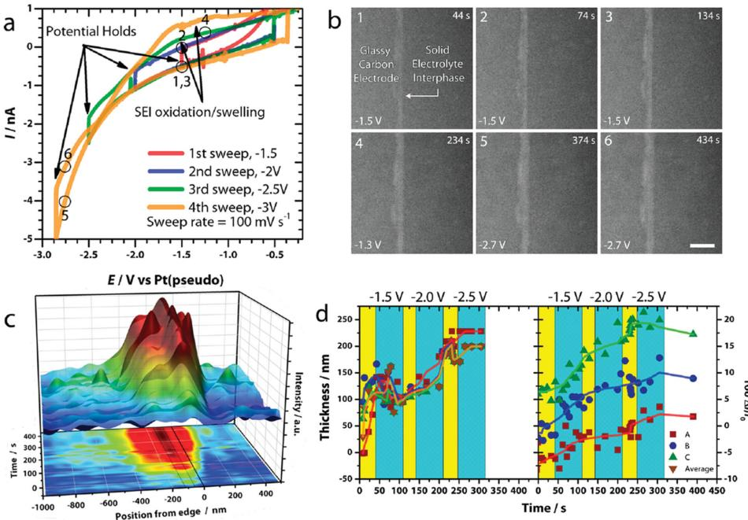

**Figure 5.** In situ ec-S/TEM characterization of SEI. [ 49 ] a) Sweep-hold voltammograms of glassy carbon in 1.2 M LiPF 6 in EC/DEC electrolyte. b) A family of STEM images exhibiting SEI evolution during the sweep-hold experiment. The correlated Points 1–6 are described in the profi le exhibited in (a). Scale bar in (b) is 1 µm. c,d) The relationship between the SEI thickness/relative image intensity and time. The colored regions in c&d relate to potential sweeps (yellow) and potential holds (cyan). Reproduced with permission. [ 49 ] Copyright 2015, American Chemical Society.

G09 Gaussian package using G4MP2 theory and the DFT functional in conjunction with the solvation model using full solute density were adopted by Yushin and co-workers [ 46 ] to reveal a feasible mechanism of SEI formation. During electrolyte reduction in the LiFSI based electrolytes, the FSI(-F) anion radicals were generated and initiated the coating formation. Such a reduction additionally renders the formation of SEI layer with LiF.

 Though the theoretical calculation provides much atomic understanding of SEI layer, the calculation is mostly based on the ideal environment with large quantities of hypotheses, which is with a broad gap from the working condition of SEI layer on Li metal. Consequently, much more optimized methods should be developed to simulate the working SEI layer.

 A family of analytical techniques affords detailed information on the components, morphologies, structure of the SEI layer on Li metal anode. However, none of them is capable to obtain a comprehensive understanding of the Li surface yet. FTIR, XPS, Raman spectroscopy, AES, NMR can provide the surface components of SEI layer. SEM and other high resolution micro scopy can be applied to reveal the high resolution morphology of SEI. AFM is a powerful tool to investigate the structure, thickness, and mechanical property of SEI. EIS is a powerful and widely accepted technique to analyze the resistance of SEI layer in a working cell. In situ and in operando technologies are also critical to investigate morphology, structure, and electrochemical dynamics revolution of SEI layer. The theoretical chemistry is benefi cial to understand the SEI at molecular scale. A rational combination of these characterization techniques is strongly considered to afford insightful understanding of the complex composition and morphology evolution of the SEI layer. More in situ and in operando methods are highly required for the dynamic characterization of SEI layer on Li metal. Since liquid electrolyte is the actual working condition of most cells, the in operando methods are expected to provide much more reliable information when they are conducted under the working conditions of batteries with organic electrolyte rather than in a vacuum environment or solid/ionic liquid electrolyte.

# **4. SEI Regulation**

# **4.1. Factors Infl uencing SEI Formation**

### *4.1.1. Electrolyte Component*

 The components of SEI are always contributed from the reduction and decomposition of the electrolyte. Therefore, various electrolytes induce totally different SEI layers. Among the Li salts in Li batteries, [ 97 ] LiClO 4 is with strong oxidizability for Li metal that renders low safety, while LiAsF 6 is highly toxic and LiPF 6 exhibits poor thermostability with a few decompositions at 60–80 °C. When LiPF 6 was employed as the Li salt, LiF would take a great proportion in the components of SEI (Equations ( 1) and ( 2) ). [ 98,99 ] As the inorganic LiX is thermodynamically stable, the induced-SEI can be protected during the cycling.

$$
LiPF_6 (solv) + H_2O (l) \rightarrow LiF (s) + 2HF (solv) + POF_3 (g)
$$
 (1)

$$
LiPF_6 \text{ (solv)} \to LiF \text{ (s)} + PF_5 \text{ (s)}
$$
 (2)

 The solvents in the electrolyte must have characteristics of high conductivity, low viscosity, high fl ash point, and high

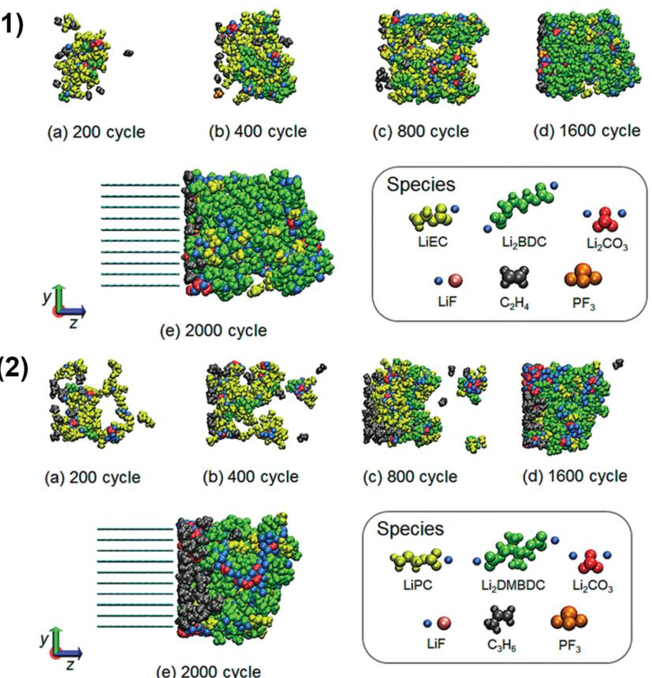

**Figure 6.** SEI layer formation illustration for different electrolyte systems. [ 95 ] 1) EC-based electrolyte and 2) PC-based electrolyte: Typical snapshots of the aggregation state changes of reaction products (both bulk EC and PC not shown) in the a) 200 th cycle, b) 400 th cycle,

c) 800 th cycle, d) 1600 th cycle, and e) 2000 th cycle. Reproduced with permission. [ 95 ] Copyright

stability. A simple, single kind of solvent cannot satisfy those demands. As a result, the solvents are always a mixture of several chemicals, such as EC and EMC, DOL and DME, etc. When EC is used as the solvent alone, the component of SEI is mostly (CH 2 OCOOLi) 2 ; while when DEC/DMC is introduced, the components of SEI are mostly C 2 H 5 COOLi and Li 2 CO 3 . [ 48 ] The uniformity of the SEI can be exceedingly enhanced by adding EC/PC to the DOL electrolytes, thus obtaining the homogeneous Li depositing and stripping. [ 100 ]

#### *4.1.2. Temperature*

2014, American Chemical Society.

 The SEI composition highly depended on the operation temperature. Ishiikawa and co-workers [ 101 ] investigated the role of temperature on SEI layer and revealed that SEI layer formed at –20 °C had compact and stable morphology and low impedance, leading to the best cycling performance. This is due to the dissolution of SEI and insertion of solvents at high temperature, and consequently poor stability of SEI. Such phenomenon was consistent with the results reported on graphite anodes. [ 102 ] With the deepening of the research, opposite opinions were still held. The SEI layer can reform at high temperature and

**www.MaterialsViews.com**

the dissolution and re-depositing lead to a more compact and stable structure. [ 98 ] Therefore, the present commercial Li-ion cells are all pre-treated at 30–60 °C to form the stable SEI before being released to markets. Yushin and co-workers also found that high temperature was benefi cial for the high-energy-density lithium–sulfur (Li–S) batteries. [ 103 ] SEM/ energy dispersive spectroscopy (EDS) investigations indicated that higher temperatures can trigger a thicker SEI on the Li anode surface to prevent polysulfi de diffusion and their irreversible reduction into Li 2 S. Meanwhile, high temperature increased the inorganic components in the SEI, thus rendering a superior cycling performance with stable SEI, dendrite-free morphology, and high effi ciency.

#### *4.1.3. Current Density*

 During the charging process, the formation of SEI competes with Li deposition onto the current collector. The surface electrochemical reactions require additional electrons. Therefore, both the SEI morphology and structure depends on the current density. Dolle and co-workers [ 104 ] discovered the different steps in the passivating layer formation at a small current density with the apparition of Li 2 CO 3 from the beginning and the appearance of ROCO 2 Li at the end of discharge. However, the SEI layer is only composed of Li 2 CO 3 at a high current density. Kanamura and co-workers revealed the critical role of the current density in propylene carbonate

electrolyte containing LiClO 4 and HF on SEI formation. [ 24 ] In the Li 1s spectra, the surface of Li anode is constituted of a layer with Li 2 O (inner part) and LiF (outer part) at a current of 0.2 or 2.0 mA cm −2 . The surface fi lm formed on Li deposits consisted of an upper layer involving LiOH, Li 2 CO 3 , or LiOCO 2 R and a thick inner Li 2 O layer (more than 20 nm) when the current reached 10.0 mA cm −2 . These results corresponding to the Li1s XPS spectrum, indicated that the SEI fi lms of Li deposited at 0.2 and 2.0 mA cm −2 mainly consisted of LiF and the SEI fi lm of Li deposited at 10.0 mA cm −2 consisted of Li 2 O.

 Beyond the above-mentioned factors (e.g. types of electrolyte including additive, temperature, and current density), other factors infl uencing the electrolyte, temperature, and current play a critical role on the SEI forming. When sulfur cathode is considered, there are many polysulfi de intermediates in the electrolyte, [ 105–108 ] which defi nitely infl uence SEI layer. The structure of Li metal anode can also induce different SEI layers. On one hand, the distribution of current density and the specifi c current value on each anode particles depended on the Li metal shape and size. [ 105,109 ] On the other hand, the SEI forming on Li metal anode with various shapes and sizes were with different mechanical modulus. [ 7 ] This is an important factor to inhibit Li dendrite growth and improve the Coulombic effi ciency. Both the

cell assembling and working pressure also affect the compactness of SEI. [ 110 ] As a cell is a microreactor with simultaneous chemical and electrochemical reactions, consequently, the SEI layer is strongly coupled with many detailed factors. More comprehensive study of the SEI system is urgently required.

#### **4.2. SEI Modifi cation**

#### *4.2.1. Electrolyte Component*

 The cathodic and decomposing products of organic electrolyte form the dominant components of SEI. Therefore, the modulation of electrolyte is the most effi cient method to stabilize SEI. As bis(fl uorosulfonyl)imide (FSI − ) anion can form a robust SEI protecting layer to prevent the liquid electrolyte from further reaction with Li metal anode, it exhibits promise as commercial electrolytes with relatively low viscosity and high chemical stability for Li-based electric storage devices. [ 111 ] What's more, the FSI − anion can substitute the notorious TFSI − to inhibit electrolytic corrosion on an Al current collector. [ 112–114 ] Consequently, LiFSI salt dissolved in DOL/DME solvents was employed as the Li salt of electrolyte in Li metal cells that have a stable SEI and dendrite-free morphology. [ 46,96,115 ] The synergistic effect of LiFSI and DOL renders the thin and robust SEI with the homogeneous inorganic SEI inner-layer and an elastic organic outer-layer (e.g. poly-DOL oligomers, CH 3 CH 2 OCH 2 OLi, HCO 2 Li, *etc* . [ 116 ] ( **Figure 7** ). [ 47 ] The initial Columbic effi ciency is 91.6% in LiFSI-based electrolyte due to the SEI formation. The Columbic effi ciency becomes stable (approximating 99%) after several cycling tests, which is signifi cantly higher than that in LiTFSI-based single salt and other routine electrolyte systems. Recently, Chen and co-workers [ 117 ] proposed the use of bis(trifl uoromethanesulfonyl)-imide/TEGDME electrolyte with LiTFSI/lithium difl uoro(oxalate)borate (LiODFB) (6:4) binary lithium salts for Li–S cells. Attributed to the SEI-forming ability

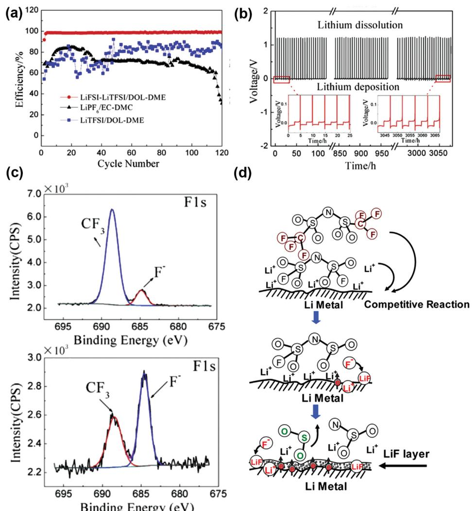

**Figure 7.** Dual-salt electrolyte for SEI modifi cation. [ 47 ] a) Coulombic effi ciency for different electrolyte systems. b) Galvanostatic voltage-time curves of LiFSI-LiTFSI/DOL-DME electrolyte. c) XPS spectra of the F1s regions of Li surface respectively in LiFSI-LiTFSI/DOL-DME electrolyte (lower) and LiTFSI/DOL-DME electrolyte (upper). d) Scheme of competitive reactions of FSI anion with Li metal at the interfaces. Reproduced with permission. [ 47 ] Copyright 2014, Elsevier.

of LiODFB, the Li anode was protected from suffering lithium dendrites in a working cell.

 In the respect of solvent, a new class of 'solvent-in-salt' electrolyte has bright prospects. [ 118,119 ] In the unique electrolyte system with ultrahigh salt concentration and high Li-ion transference number, salt holds a dominant position in the Li-ion transport system rather than the conventional solvent. On one hand, the ultrahigh salt concentration leads to the rapid formation of a compact SEI layer to protect the anode. On the other hand, the ultrahigh salt concentration decreases the solvated Li + concentration, and thus increased Li + concentration renders high-rate Li plating/stripping. [ 96 ] A stable Coulombic effi ciency of 98.4% during 1000 cycles can be achieved in this electrolyte system at a high rate of 4.0 mA cm −2 . Even at an extremely high rate of 10.0 mA cm −2 , a Coulombic effi ciency of 97% was stably maintained for 500 cycles ( **Figure 8** a,b). The superior highrate performance demonstrates the very stable SEI layer. Such magic 'solvent-in-salt' electrolyte had a high Li-ion transference number of 0.73. Thus, the cycling safety performance of nextgeneration high-energy rechargeable Li batteries is remarkably enhanced via an effective suppression of Li dendrites and shape changes in the Li metal anode. When used in a highenergy-density Li–S battery, the advantage of this electrolyte is further demonstrated. The 'polysulfi de shuttle phenomenon', one of the most challenging technological hurdles of Li-S batteries, is effectively overcome by inhibiting lithium polysulfi de dissolution. Consequently, a superior long-cycling-stability with a Coulombic effi ciency nearing 100% is achieved. (Figure 8 c,d)

#### *4.2.2. Additives*

 Electrolyte additives with higher reduction voltages than solvents and salts have a positive effect on forming a stable SEI to reinforce the interfaces on the Li metal. [ 120,121 ] Archer and co-workers employed halogenated salt blends to enhance the SEI stability and even after hundreds of charge/discharge cycles (thousands of operating hours), no signs of deposition instabilities can be observed. The EIS analysis indicated that the diffusion resistance of the Li ions through the SEI was decreased much by the halogenated salt additive. [ 44,45 ] The halogenated salt additives in the electrolyte render the SEI layer on the electrode with fl uorine-rich products (most likely LiF), LiOH and Li 2 CO 3 driven by the in situ reactions between electrolyte and Li metal anode ( **Figure 9** ). The SEI fi lm with organic/inorganic components generates a critical effect in shedding the solvent molecules and can act as a "catalyst" to decrease the activation energy of the Li ions crossing the SEI layer and depositing on the anode. [ 47,64,111 ] HF is also an important additive to produce LiF to protect the Li metal anode. [ 24 ] PC electrolyte with 10 × 10 −3 mol L −1 HF has almost the same structure as that deposited from the PC electrolyte with 5 × 10 −3 mol L −1

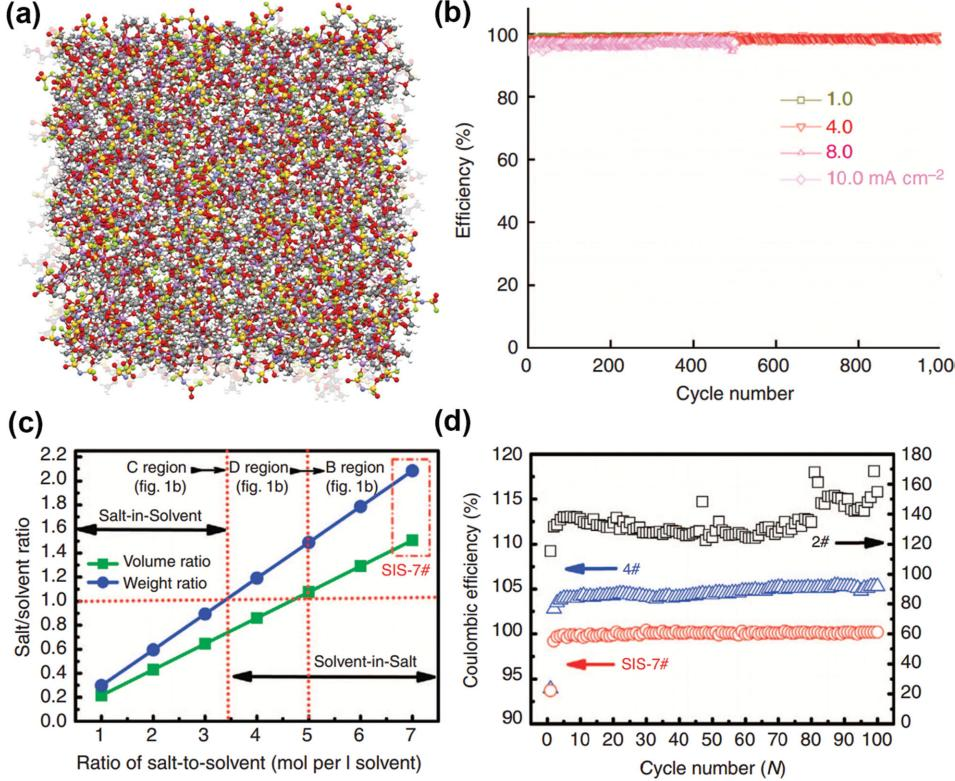

**Figure 8.** The solvent-in-salt electrolytes. a) Snapshots of the MD simulation boxes of 4.0 M LiFSI-DME electrolyte. Colors for different elements: purple– Li, blue–N, red–O, green–F, and yellow–S. The uncoordinated solvent molecules (DME) are in light grey. b) Coulombic effi ciency of Li deposition/ striping in 4.0 M LiFSI-DME. Reproduced with permission. [ 96 ] Copyright 2015, Nature Publishing Group. c) Volume and weight ratio of salt-to-solvent with different ratios of LiTFSI to DOL:DME (volume 1:1). d) Coulombic effi ciency of Li-S cells at 0.2 C (2#: 2 mol per l solvent; 4#: 4 mol per l solvent; and SIS-7#: 7 mol l per solvent). Reproduced with permission. [ 118 ] Copyright 2013, Nature Publishing Group.

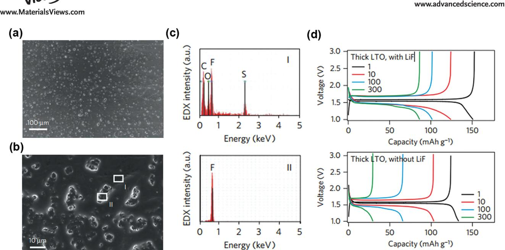

**Figure 9.** The LiF clusters on Li foil by SEM and EDS. [ 190 ] a,b) SEM images of salt clusters on Li foils. c) EDS spectrum of region I and II exhibiting that LiF forms clusters on Li metal because of its insolubility in PC. d) The voltage vs. time profi les of thick LTO electrode with LiF and without LiF. Reproduced with permission. [ 190 ] Copyright 2014, Nature Publishing Group.

HF and consists of both an outer LiF layer and an inner Li 2 O layer with the thickness of less than 10 nm. Manthiram and co-workers [ 122 ] employed fl uorinated ether electrolyte to inhibit the shuttle of polysulfi des and stabilize the interfaces on the Limetal anode without any cathode confi nements or additives in a Li–S cell. The SEI layer had a composition of LiF and sulfate/ sulfi te/sulfi de on Li metal anode, suppressing parasitic reactions between Li metal and electrolyte.

 Generally, there is trace moisture in the electrolyte because of the strong water absorption of Li salts. The residual water, CO 2 , and other gases/particles presenting in non-aqueous electrolytes has been widely regarded as a detrimental factor for Li batteries. This issue is a great problem for practical Li–air cells and these compounds even corrode the Li metal during long cycling tests. [ 123 ] However, Osaka and co-workers [ 124 ] reported that the long-cycle-life of Li anode was twice as long and its charge transfer resistance in propylene carbonate electrolyte with saturated CO 2 was smaller than that in the same electrolyte without CO 2 . Even with 3000 ppm H 2 O concentration in propylene carbonate electrolyte, cycle life was enhanced by CO 2 . However, such enhancement of Li cyclability with CO 2 was effective with Ni and Ti substrates but no apparent enhancement with Cu and Ag substrates because of the catalytic reduction of CO 2 on Cu and Ag. [ 125 ] When the trace H 2 O (35 ppm) is accompanied by CO 2 , performance drastically improves and Coulombic effi ciency reaches a maximum of 88.9%. [ 126 ] This is attributed from the fact that trace H 2 O is found to affect the compounds of SEI on the lithium surface and produces an Li 2 CO 3 and LiF layer on the upper part of the SEI. Very recently, Zhang and co-workers [ 127 ] found that a controlled trace-amount of H 2 O (25–50 ppm) can be an effective electrolyte additive for achieving dendrite-free Li metal deposition in LiPF 6 -based electrolytes and avoiding detrimental effects. The trace amount of HF derived from the decomposition reaction of LiPF 6 with H 2 O is electrochemically reduced during the initial Li deposition to get a uniform and dense LiF-rich SEI. This LiF-rich SEI fi lm induces a uniform electric fi eld on the substrate thereby enabling uniform and dendrite-free Li deposition. CO 2 and SO 2 are also employed as an additive for Li electrode to increase the Li cycling effi ciency. [ 128,129 ] The Li 2 CO 3 and Li 2 SO 3 passivation fi lms are generated from the reaction among CO 2 , SO 2 , and Li metal, respectively. However, the toxic property of SO 2 limits its broad applications in practical batteries. Since the benefi cial effect of H 2 O, CO 2 , and SO 2 on the robust use of Li metal was always in a very narrow concentration window, the amount of these additives should be very carefully controlled, although trace H 2 O has been widely detected in most electrolytes. The inhibition of these gas from air should be strongly considered by ration selection of permselective separator and robust electrolyte [ 123 ] for future Li–air batteries.

 Patented by Mikhaylik and co-workers, [ 130 ] LiNO 3 is an important additive in the electrolyte of Li–S batteries. There is much recent progress with LiNO 3 as electrolyte additive, utilizing LiNO 3 in the SEI formation to protect the Li metal anode. A surface fi lm including both inorganic species (such as LiN x O y ) and organic species (such as ROLi and ROCO 2 Li) can be constructed by the strong oxidation of LiNO 3 . [ 59 ] Based on the LiNO 3 electrolyte, polysulfi de additives may also lead to the stable SEI layer in ether electrolyte ( **Figure 10** ). [ 43,131 ] Beyond LiNO 3 , other additives also exhibited superior results in improving the SEI stability and cycling performance. Due to the increased ion mobility and ionic conductivity, electrolytes with toluene additive have higher redox currents. [ 132 ] Wang and co-workers [ 133 ] fi rstly reported BTFE with LiNO 3 to form signifi cantly enhanced SEI fi lm, which is a great step to obtain stable and non-fl ammable electrolyte for LMBs. Hollenkamp and co-workers discussed the effect of LiNO 3 additive and pyrrolidinium ionic liquid on the SEI in Li-S cells and verifi ed

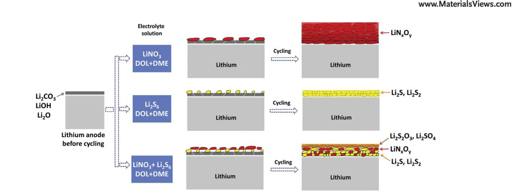

**Figure 10.** Scheme of the SEI fi lm behavior on Li metal anode cycling in different electrolytes. Reproduced with permission. [ 43 ] Copyright 2014, Elsevier.

the participation of C 4 mpyr-TFSI on the SEI formation on the anode. [ 134 ]

### *4.2.3. 'Artifi cial' SEI Structure*

 The reactions among Li metal, organic solvents, Li salts, and electrolyte additives render the in situ formed SEI to protect the metallic Li anode. Another effi cient approach of SEI formation is to treat the Li metal with chosen chemicals prior to its use in a cell. Thus Li electrode is covered with an ex situ formed protective layer (or 'artifi cial' SEI layer). Cui and co-workers innovatively created an artifi cial SEI with a monolayer of nanostructured and interconnected amorphous hollow carbon nanospheres to protect the Li metal anode ( **Figure 11** ). [ 66 ] The artifi cial SEI was with a conductivity of ≈7.5 S m −1 , effectively inhibiting the electron delivery through SEI. Large pores cannot be found on the artifi cial SEI, avoiding electrolyte leakage into the Li surface. [ 135 ] When Li deposits on the surface of current collector, the hollow carbon nanosphere fi lm is elevated, thus guaranteeing high lithiation capacity. In a Li | Cu demonstration, a high Coulombic effi ciency of ≈99.5% is obtained at 0.25 mA cm −2 after 150 cycles. Similar to the amorphous hollow carbon nanospheres, other amorphous carbon coatings can also lead to a superior cycling stability and high Coulombic effi ciency. [ 136 ] The virtue of the artifi cial interfacial protection can also be provided by graphene and hexagonal boron nitride hybrid, [ 71 ] Li 3 N/PEDOT-co-PEG protecting layer, [ 67,137,138 ] composite protective fi lm, [ 139 ] ceramic coating fi lm, [ 140,141 ] LISICON layer [ 142 ] ( **Figure 12** ).

**Figure 11.** Dendrite-free Li metal anode with hollow carbon nanospheres coating. [ 66 ] a) Fabrication of Cu electrode with carbon nanospheres. b,c) SEM images of the carbon-coated polystyrene nanoparticle array. d) Photo of the as-fabricated fl exible hollow carbon fi lm after removal of the template. e) Cross-sectional SEM and f) TEM image of the carbon nanospheres, with wall thickness of ≈20 nm. g) SEM image of the carbon nanospheres peeled off the Cu substrate. The red dashed line is the trace of the curvature of bending. Reproduced with permission. [ 66 ] Copyright 2014, Nature Publishing Group.

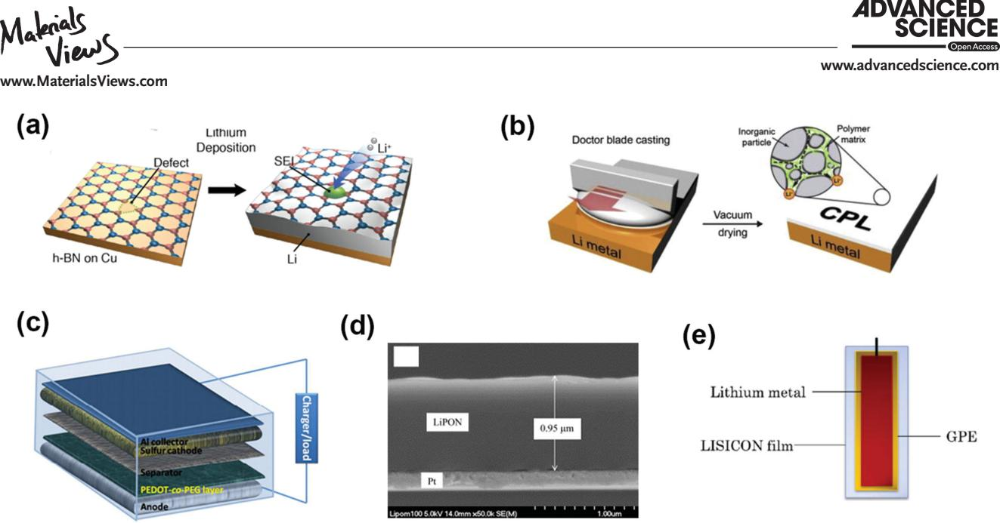

**Figure 12.** Ex-situ-formed protective SEI layers for Li metal anodes. a) Hexagonal boron nitride. Reproduced with permission. [ 71 ] Copyright 2014, American Chemical Society b) Composite protective layer. Reproduced with permission. [ 139 ] Copyright 2015, Elsevier. c) PEDOT-co-PEG coating layer Reproduced with permission. [ 138 ] Copyright 2014, Royal Society of Chemistry. d) LiPON thin fi lm. Reproduced with permission. [ 140 ] Copyright 2004, Elsevier. e) LISICON fi lm. Reproduced with permission. [ 142 ] Copyright 2013, Nature Publishing Group.

 It is acknowledged that when the shear modulus of the electrolyte is about twice that of the Li anode (≈10 9 Pa), the dendrite suppression can be effectively achieved. [ 7 ] Therefore, solid electrolytes with robust mechanical modulus are regarded as a multifunctional component of cell, which can not only act as the electrolyte, but also as the protective 'artifi cial' SEI

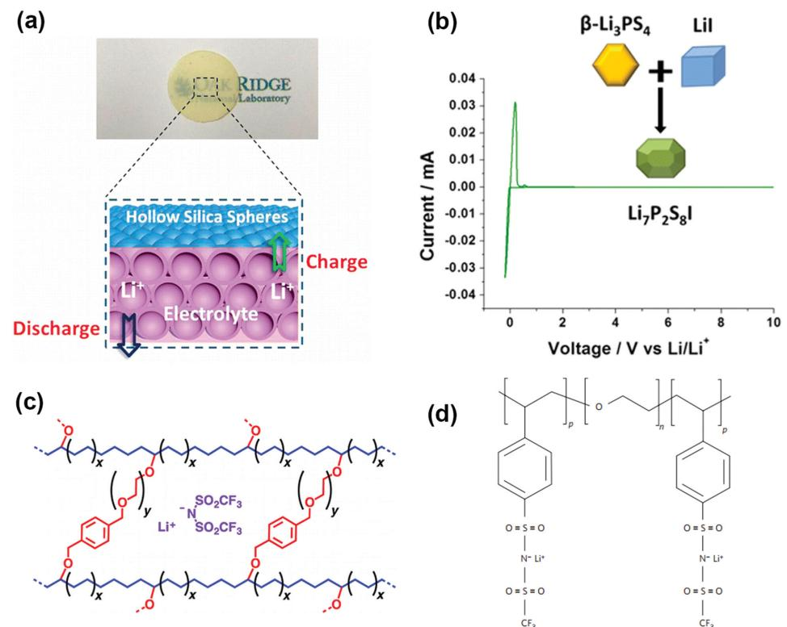

**Figure 13.** Solid electrolyte to protect the Li metal anode. a) Solid-like electrolyte with nanoconfi ning liquids into the hollow structures. Reproduced with permission. [ 154 ] Copyright 2015, Americal Chemical Society. b) Iodide-based Li 7 P 2 S 8 I superionic conductor. Reproduced with permission. [ 155 ] Copyright 2015, American Chemical Society. c) Cross-linked polyethylene/poly(ethylene oxide) electrolyte. Reproduced with permission. [ 157 ] Copyright 2014, American Chemical Society. d) Single-ion BAB triblock copolymer. Reproduced with permission. [ 159 ] Copyright 2013, Nature Publishing Group.

**www.MaterialsViews.com**

layer to inhibit the dendrite growth. Though 'artifi cial' SEI layers have many advantages, the low ionic conductivity hinders their practical demonstration. Large quantities of systems are currently investigated as battery electrolytes, such as crystalline materials (oxide perovskite, La 0.5 Li 0.5 TiO 3 [ 143 ] and thio-LISICON, Li 3.25 Ge 0.25 P 0.75 S 4 [ 144 ] , glass ceramics (Li 7 P 3 S 11[ 145,146 ] , glassy materials (Li 2 S-SiS 2 -Li 3 PO 4 [ 147,148 ] , polymer electrolytes [ 149–151 ] and other materials. [ 152,153 ] Dai and co-workers [ 154 ] proposed a class of novel solid electrolytes with liquid-like room-temperature ionic conductivities (>1.0 mS cm −1 ) synthesized by taking advantage of the unique nanoarchitectures of hollow silica spheres to confi ne liquid electrolytes in hollow space to afford high conductivities (2.5 mS cm −1 ). Liang and co-workers synthesized a Li 7 P 2 S 8 I phase from Li 3 PS 4 and LiI, which exhibited the characteristics of a solid solution with electrochemical stability up to 10 V vs. Li/Li + and rapid ion conduction. [ 155 ] The unique intrinsic physical property of the solid electrolyte allows low-temperature densifi cation and enhanced process-ability, which is vital to developing industrial-scale solid electrolyte separators, as well as practical LMBs (e.g. Li–S batteries [ 156 ] ). Recently, Archer's group has reported a family of pioneer

research results on the solid electrolyte to improve its ionic conductivity, such as cross-linked polyethylene/poly(ethylene oxide) electrolytes, [ 157 ] lithiated polymer electrolyte membrane, [ 2 ] nanoporous polymer/ceramic composite electrolytes [ 158 ] etc., leading to increased lifetime and safety for LMBs. Single-ion polymer [ 159 ] and solid electrolyte [ 160 ] are also useful strategies to improve ionic conductivity ( **Figure 13** ). Besides the very low ionic conductivity, partial delamination of Li foils and the polymer/solid electrolyte layers is also responsible for capacity fade and failure. [ 161 ] Experiments conducted by imaging the batteries using synchrotron hard X-ray microtomography revealed that the void volume between the foil and electrolyte layer obtained after 40 to 90 cycles is comparable to volume change in the battery during one cycle ( **Figure 14** ).

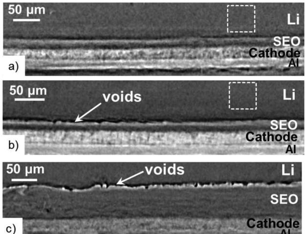

**Figure 14.** X-ray microtomography slices exhibiting the cross-section of Li metal polymer batteries at room temperature: [ 161 ] a) uncycled battery annealed at 90 °C; b) battery A and c) battery B after cycling. Reproduced with permission. [ 161 ] Copyright 2015, Electrochemical Society. **Figure 15.** Scheme of Li deposition via the SHES mechanism. Repro-

#### *4.2.4. Other Novel Methods*

*Electrolyte Modifi cation* : As the SEI is a transition layer of electrolyte and anode, any variations in electrolyte and anode will defi nitely exert an infl uence on the composites and structure of SEI. The SEI can be easily modulated to facilitate the superior cycling performance if effectively modifying the electrolyte and anode structure. Zhang and co-workers [ 162 ] discovered a self-healing electrostatic shield mechanism by employing the Cs + additives with proper concentration in the organic electrolyte. A positively charged electrostatic shield can be formed around the initial tip of the protuberances to force further deposition of Li to adjacent regions of the anode, thus eliminating the anisotropic dendrite formation and growth. A high Coulombic effi ciency (99.86%) is associated with Li|Li 4 Ti 5 O 12 cell, which contains excess amount of Li metal anode ( **Figure 15** ). The vertically grown, self-aligned, and highly compacted Li nanorods can be observed by modifying the concentration of Cs + additives. [ 163 ] Na + also holds a similar role to Cs + ions. [ 164 ] Sodium acts to block the accelerated growth and resulting in a dimpled and dendrite-free morphology because sodium plays a crucial role in suppressing tip-based dendrite growth. By employing the pulse charging strategy, Hoffmann and co-workers demonstrated that relative to direct current charging, pulse charging can signifi cantly reduce the average dendrite length by ≈70%. [ 165,166 ] The Monte Carlo simulations dealing explicitly with Li ion diffusion, electromigration in timedependent electric fi elds were able to evidence this conclusion.

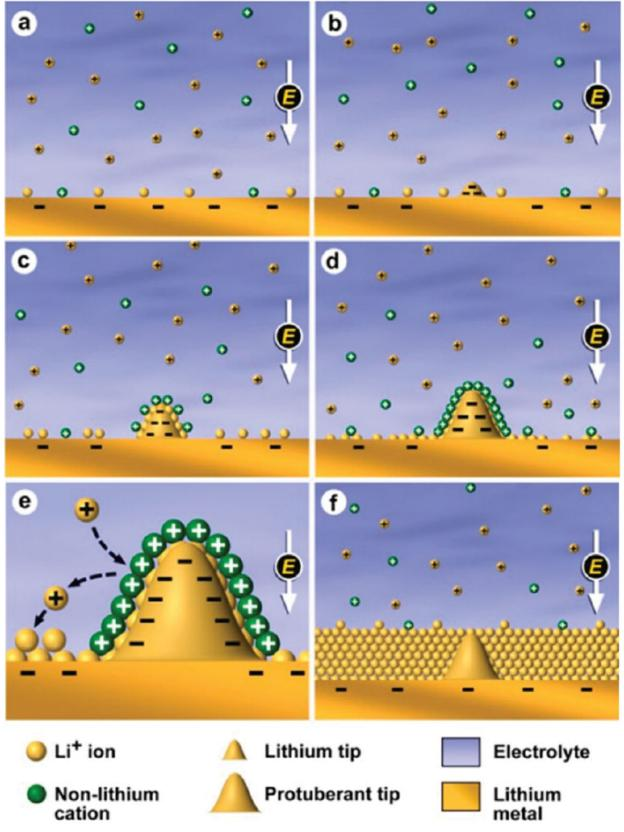

duced with permission. [ 162 ] Copyright 2013, American Chemical Society.

*Electrode Design* : Li foil is often used as anode material in primary and secondary Limetal batteries. However, the SEI forming on the Li foil is locally different in composition and morphology during cycling (corresponding to Li plating/strapping). The current density distribution is inhomogeneous because of the locally different structure of Li foil, and, in turn, the Li plating process is nonuniform and induces a needle-like deposition, thus leading to a low effi ciency and safety risks. Some creative ideas on anode structures (e.g. Li microsphere anodes, [ 167 ] coated Li microsphere electrodes, [ 109 ] mechanical surface modifi ed Li foil, [ 168 ] graphite and Li foil hybrid anodes, [ 169 ] Li 7 B 6 /Li framework, [ 170 ] spatially heterogeneous carbon-fi ber papers as current collector, [ 4 ] defect-induced plating of Li metal within porous graphene networks, [ 171 ] and multi-layered graphene (MLG) coating with Cs + additive in the electrolyte [ 172 ] have been proposed and verifi ed to retard the growth of Li dendrites.

 Zhang and co-workers [ 173 ] proposed a unique nanostructured anode with Li metal distributed in fi brous Li 7 B 6 matrix ( **Figure 16** –1) as a promising anode to prevent the dendrite growth. The nanostructured anode is with a large specifi c area, thus rendering a low current density on the Li metal anode. The dendrite growth is effectively inhibited via decreasing the growth velocity of Li deposits and then limiting the fi nal size of deposited Li on the nanostructured matrix, thus leading to the dendritefree morphology at macroscale. [ 11,174 ] The concentration gradient of Li ions near the anode surface are sharply reduced, because the 3D Li 7 B 6 fi brous structure provides quantities of free space to accommodate electrolyte. [ 175 ] To improve the Coulombic effi ciency of Li depositing/dissolution, a dual-phase Li metal anode containing polysulfi de-induced SEI and nanostructured graphene framework (Figure 16 –2) was investigated for Li–S batteries. [ 176 ] In a routine confi guration of Li metal anode without gra-

phene framework, Li dendrites easily grew on routine twodimensional (2D) substrates (such as Cu foil). As the root of dendrites can receive the electron easily and then dissolve earlier, Li dendrites easily fractured and were detached from the substrate to form dead Li, leading to the low Coulombic effi ciency. If there is a pre-existing conductive framework such as self-supported graphene foam, the deposited Li will be well accommodated. Free-standing graphene foam provides several promising features as underneath layer for Li anode, including (1) relative larger surface area than 2D substrates to lower the real specifi c surface current density and the possibility of dendrite growth, (2) interconnected framework to support and

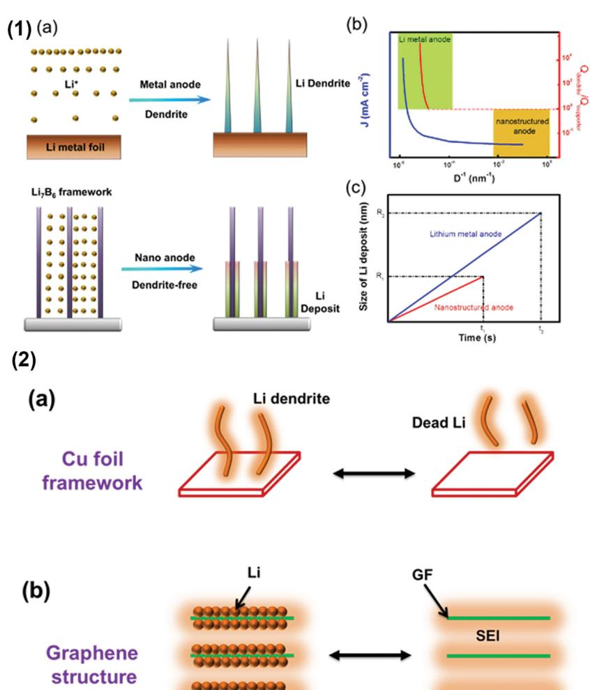

**Figure 16.** Electrode design to stabilize the Li metal anode. (1) Li depositing on the Li 7 B 6 framework. [ 173 ] a) Scheme of dendrite growth on the Li plate (top) and Li deposits on nanostructured anode with Li metal confi ned in fi brous Li 7 B 6 matrix (bottom). b) The relationship of the current density ( *J* )/relative electric fi eld strength ( *Q*dendrite / *Q*supporter ) vs. matrix size. c) The dependence of the Li deposit size on the nanostructured and plate Li anode and deposit duration; R 1 , R 2 , t 1 , t 2 were the max size of Li dendrites and the cut-off time of dendrite-Li on the nanostructured and plate Li metal anode, respectively (t 1< t 2 , R 1 < R 2 ). Reproduced with permission. [ 173 ] (2) Scheme of Li metal anode with different structures during Li deposition and dissolution. [ 176 ] a) Without graphene framework, Li dendrites appear during Li depositing, therefore leading to much dead Li during Li dissolution. b) The SCG-structured anode depicts a stable and uniform Li deposition and dissolution with high effi ciency and low resistance. Reproduced with permission. [ 176 ] Copyright 2015, American Chemical Society.

recycle dead Li, and (3) good fl exibility to sustain the volume fl uctuation during repeated incorporation/extraction of Li. The synergy between the LiNO 3 and polysulfi des provides the feasibility to the formation of robust SEI in an ether-based electrolyte. [ 176,177 ] The effi cient in situ formed SEI-coated graphene structure allows stable Li metal anode with the cycling Coulombic effi ciency of ≈97% with high safety and effi ciency performance, which is with a low resistance of 19.65 Ω (29.10 Ω for Cu foil based Li metal anode) and high ion conductivity of 5.42 × 10 −2 mS cm −1 (2.33 × 10 −2 mS cm −1 for Cu foil based Li metal anode). These results indicated that interfacial engineering of nanostructured electrode were a promising strategy

**www.MaterialsViews.com**

to handle the intrinsic problems of Li metal anodes, thus shed a new light toward LMBs, such as Li–S and Li–O 2 batteries with high energy density.

 The above-mentioned strategies provide new insights into constructing a stable and effi cient SEI to inhibit Li dendrite growth and thus to obtain a superior cycling performance of LMBs. The practical application of Li metal anode can be realized via two ways of protecting shield: (1) the nanoscale electrode that can self-reduce the size of Li deposits to inhibit the dendrite growth, thus reinforcing the security assurance of Li metal anode; (2) a stable SEI layer that can be obtained after pre-treating the anode in a certain electrolyte for several cycles, to protect the Li deposits from the reactions with electrolyte, therefore signifi cantly enhancing the effi ciency of Li metal anode. The synergistic effect of nanoscale electrode and stable SEI layer provides a feasible route to the commercial application of Li metal-based batteries. However, many tiny factors, such as the assembly condition, shelving time before testing, large dead volume etc., would act signifi cantly on the cycling performance of a coin cell.

 Therefore, the rational experimental design is critically essential. To decrease the infl uence of cell confi guration, pouch cells are

an important choice with the large increase of active materials. Pouch cells are also the most approaching commercial products, thus will be the most effective demonstration to realize the proof-of-concept of LMBs with dendrite-free characteristics.

# **5. Proof-of-Concept of LMBs**

 Due to safety concerns, there are not many commercial demonstrations of LMBs in portable electronics and electric vehicles, however, the huge potential of LMBs in energy storage systems motivated researchers to explore the "Holy Grail" in the lab and satisfy the demands of battery machine. Taking vehicle applications as an example, a non-aqueous battery pack that weighs 300 kg or less will drive the vehicle if the battery can be with 140 kWh and a specifi c energy density of 500 Wh kg −k . [ 1,178 ] The 500 km range will effectively handle the "range anxiety" issue triggered by the short driving-range. With the theoretical-energy-density of 3458 Wh kg −1 for Li metal anode, an actual-energy-density of 500 Wh kg −1 for a cell is promising to be realized when Li metal anode couples with the new-type Li-ion cathode (e.g. sulfur or oxygen cathode).

 There are already several exciting LMB punch cell results with the optimization of the SEI layer of Li anode and the corresponding cathode and separator. [ 179–189 ] It is critically important to note that these results are mostly achieved on the coin cells, which may be improved in a pouch cell because the ratio of active materials in a coin cell is much lower than that in a pouch cell.

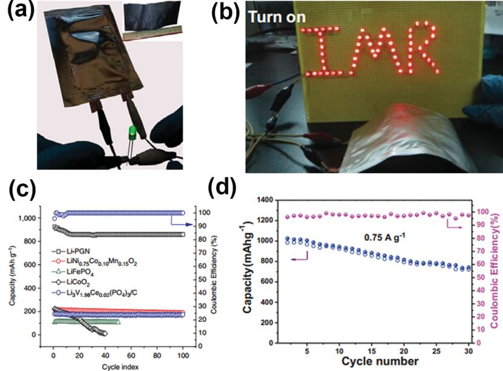

**Figure 17.** Proof-of-concept LMBs based on pouch cells. a) The pouch cell with full-cell confi guration of PGN anode and Li-PGN cathode that powering an LED device (≈20 mA h). Reproduced with permission. [ 171 ] Copright 2014, Nature Publishing Group. b) A photo of a red LED 'IMR' logo lighted by a bent Li–S cell. Reproduced with permission. [ 191 ] c) Discharge capacity and Coulombic effi ciency vs. cycle index of Li/PGN cathodes at a current of 1.0 C (0.30 A g −1 ). Reproduced with permission. [ 171 ] Copright 2014, Nature Publishing Group. d) The cycling of the cell at the bent state. Reproduced with permission. [ 191 ]

 To further boost the actual cell-energy-density of LMBs, pouch cells are constructed to improve the ratio of the active materials in the cell recently ( **Figure 17** ). For a Li-ion cell, Li metal anode affords the possibility to improve the energy density further because the cell-energy-density based on the intercalation anode is approaching its theoretical maximum. For the Li–S and Li–O 2 batteries, the issue of the Li metal anode is more urgent because Li metal anodes not only provide high energy density, but also bring many troubles on the cycling performance. More and more investigations indicate that the bottleneck of LMBs lies in Li metal anode and especially the SEI layer on the anode which determines the cycling life and effi ciency. A stable and effi cient SEI is the basic requirement to realize broad commercial applications of LMBs.

# **6. Summary and Perspectives**

 Li metal is an ideal anode for rechargeable Li-based batteries, such as Li–air, Li–S, and new types of LIBs. The formation of a stable SEI is very important to achieve high cycling effi ciency and long cycling life of LMB. An ideal SEI with intrinsic minimum electrical conductivity and maximum Li + conductivity should be fl exible and elastic to accommodate active material breathing and non-uniform electrochemical behavior. Remarkable progress has been achieved on the SEI components, morphology, and formation mechanism in the organic electrolyte. Effective strategies to stabilize the SEI structure through electrolyte component modulation, 'artifi cial' SEI on

**REVIEW**

Li metal, nanostructured Li-metal-based anode, as well as solid

electrolyte have been proposed and verifi ed recently. However, the fundamental understanding on the SEI structure, formation, property, and regulation are still inadequate. The insights on the following aspects of SEI on Li metal should be strongly considered: (1) The exact role of the SEI. Little knowledge has been gained about the role of the SEI components on the cycling performance, because the function of SEI components has not clearly been analyzed in most published literature. (2) The accurate process of Li-ion crossing in the SEI. It is generally accepted that Li ions sheds its solvent molecules and then crosses the SEI layer before arrival at the surface of Li metal. However, such a process has not been dynamically observed and the rate is still unknown. More-smartly-designed in operando techniques should be developed to track the process in a working cell. (3) Controllable modifi cation of the SEI. Many effective strategies have been proposed to modify the SEI structure. However, the modifying process is still out of control in a bulk cell because the thickness, density, ion conductivity etc. cannot yet be rationally designed.

 A robust SEI layer is critical to protect the anode in a rechargeable battery for practical applications. More scientifi c explorations on the fundamental understanding and SEI layer building require collaborative works from physics, chemistry, materials, nanotechnology, as well as engineering communities. Through further investigation of the science and engineering of SEI on Li metal, the use of Li metal as a superior anode in a rechargeable cell is quite promising. The ultra-stable and very robust SEI will enable broad applications of rechargeable Li metal in advanced Li–S batteries, Li–O 2 batteries, and other advanced Li batteries.

# **Acknowledgements**

 This work was supported by the Natural Scientifi c Foundation of China (21422604 and 21561130151), National Basic Research Program of China (2011CB932602 and 2015CB932500), and Tsinghua University Initiative Scientifi c Research Program (2014z22076).

Received: June 18, 2015

Revised: August 3, 2015

Published online: November 17, 2015

- [1] L. Grande , E. Paillard , J. Hassoun , J.-B. Park , Y.-J. Lee , Y.-K. Sun , S. Passerini , B. Scrosati , *Adv. Mater.* **2015** , *27* , 784 .
- [2] Y. Lu , M. Tikekar , R. Mohanty , K. Hendrickson , L. Ma , L. A. Archer , *Adv. Energy Mater.* **2015** , *5* , 1402073 .
- [3] J. S. Dunning , W. H. Tiedemann , L. Hsueh , D. N. Bennion , *J. Electrochem. Soc.* **1971** , *118* , 1886 .
- [4] X. Ji , D.-Y. Liu , D. G. Prendiville , Y. Zhang , X. Liu , G. D. Stucky , *Nano Today* **2012** , *7* , 10 .
- [5] A. S. Arico , P. Bruce , B. Scrosati , J.-M. Tarascon , W. van Schalkwijk , *Nat. Mater.* **2005** , *4* , 366 .
- [6] R. Cao , W. Xu , D. Lv , J. Xiao , J.-G. Zhang , *Adv. Energy Mater.*  **2015** , *5* , 1402273 .
- [7] W. Xu , J. Wang , F. Ding , X. Chen , E. Nasybulin , Y. Zhang , J.-G. Zhang , *Energy Environ. Sci.* **2014** , *7* , 513 .
- [8] Q. Chen , K. Geng , K. Sieradzki , *J. Electrochem. Soc.* **2015** , *162* , A2004 .
- [9] V. Fleury , J. N. Chazalviel , M. Rosso , B. Sapoval , *J. Electroanal. Chem. Interfac.* **1990** , *290* , 249 .
- [10] J. N. Chazalviel , *Phys. Rev. A* **1990** , *42* , 7355 .
- [11] C. Brissot , M. Rosso , J. N. Chazalviel , P. Baudry , S. Lascaud , *Electrochim. Acta* **1998** , *43* , 1569 .
- [12] M. Rosso , T. Gobron , C. Brissot , J. N. Chazalviel , S. Lascaud , *J. Power Sources* **2001** , *97–98* , 804 .
- [13] X.-B. Cheng , Q. Zhang , *J. Mater. Chem. A* **2015** , *3* , 7207 .
- [14] N. Togasaki , T. Momma , T. Osaka , *J. Power Sources* **2015** , *294* , 588 .
- [15] E. Peled , *J. Electrochem. Soc.* **1979** , *126* , 2047 .
- [16] D. Aurbach , *J. Power Sources* **2000** , *89* , 206 .
- [17] K. Xu , *Chem. Rev.* **2014** , *114* , 11503 .
- [18] K. Xu , *Chem. Rev.* **2004** , *104* , 4303 .
- [19] M. Odziemkowski , D. E. Irish , *J. Electrochem. Soc.* **1992** , *139* , 3063 .
- [20] E. Peled , D. Golodnitsky , G. Ardel , *J. Electrochem. Soc.* **1997** , *144* , L208 .
- [21] Y. Ein-Eli , *Electrochem. Solid-State Lett.* **1999** , *2* , 212 .
- [22] E. Peled , H. Straze , *J. Electrochem. Soc.* **1977** , *124* , 1030 .
- [23] K. Kanamura , H. Tamura , S. Shiraishi , Z. i. Takehara , *J. Electrochem. Soc.* **1995** , *142* , 340 .
- [24] K. Kanamura , S. Shiraishi , Z. i. Takehara , *J. Electrochem. Soc.* **1996** , *143* , 2187 .
- [25] Y. Ein-Eli , S. F. McDevitt , R. Laura , *J. Electrochem. Soc.* **1998** , *145* , L1 .
- [26] E. Peled , A. Lombardi , C. R. Schlaikjer , *J. Electrochem. Soc.* **1983** , *130* , 1365 .
- [27] M. Garreau , *J. Power Sources* **1987** , *20* , 9 .
- [28] J. Thevenin , *J. Power Sources* **1985** , *14* , 45 .
- [29] J. G. Thevenin , R. H. Muller , *J. Electrochem. Soc.* **1987** , *134* , 273 .
- [30] J.-T. Li , S.-R. Chen , F.-S. Ke , G.-Z. Wei , L. Huang , S.-G. Sun , *J. Electroanal. Chem.* **2010** , *649* , 171 .
- [31] J. Li , J. Fang , H. Su , S. Sun , *Prog. Chem.* **2011** , *23* , 349 .
- [32] H. J. Santner , C. Korepp , M. Winter , J. O. Besenhard , K. C. Moller , *Anal. Bioanal. Chem.* **2004** , *379* , 266 .
- [33] H. Cheng , C. B. Zhu , M. Lu , Y. Yang , *J. Power Sources* **2007** , *174* , 1027 .
- [34] O. Chusid , Y. Gofer , D. Aurbach , M. Watanabe , T. Momma , T. Osaka , *J. Power Sources* **2001** , *97–8* , 632 .
- [35] H. Yang , X.-D. Shen , *J. Power Sources* **2007** , *167* , 515 .
- [36] S. Leroy , H. Martinez , R. Dedryvere , D. Lemordant , D. Gonbeau , *Appl. Surf. Sci.* **2007** , *253* , 4895 .
- [37] V. Eshkenazi , E. Peled , L. Burstein , D. Golodnitsky , *Solid State Ionics* **2004** , *170* , 83 .
- [38] S. Leroy , F. Blanchard , R. Dedryvere , H. Martinez , B. Carre , D. Lemordant , D. Gonbeau , *Surf. Interface. Anal.* **2005** , *37* , 773 .
- [39] K. C. Hogstrom , S. Malmgren , M. Hahlin , M. Gorgoi , L. Nyholm , H. Rensmo , K. Edstrom , *Electrochim. Acta* **2014** , *138* , 430 .
- [40] L. Seon-Hong , J. Ie-Su , J. Kim , *Surf. Interface. Anal.* **2014** , *46* , 570 .
- [41] A. Schechter , D. Aurbach , H. Cohen , *Langmuir* **1999** , *15* , 3334 .
- [42] S. Xiong , K. Xie , Y. Diao , X. Hong , *J. Power Sources* **2013** , *236* , 181 .
- [43] S. Xiong , K. Xie , Y. Diao , X. Hong , *J. Power Sources* **2014** , *246* , 840 .
- [44] Y. Lu , Z. Tu , J. Shu , L. A. Archer , *J. Power Sources* **2015** , *279* , 413 .
- [45] Y. Lu , Z. Tu , L. A. Archer , *Nat. Mater.* **2014** , *13* , 961 .
- [46] H. Kim , F. Wu , J. T. Lee , N. Nitta , H.-T. Lin , M. Oschatz , W. I. Cho , S. Kaskel , O. Borodin , G. Yushin , *Adv. Energy Mater.*  **2015** , *5* , 1401792 .
- [47] R. Miao , J. Yang , X. Feng , H. Jia , J. Wang , Y. Nuli , *J. Power Sources*  **2014** , *271* , 291 .
- [48] C. R. Yang , Y. Y. Wang , C. C. Wan , *J. Power Sources* **1998** , *72* , 66 .
- [49] R. L. Sacci , J. M. Black , N. Balke , N. J. Dudney , K. L. More , R. R. Unocic , *Nano Lett.* **2015** , *15* , 2011 .
- [50] F. Kong , R. Kostecki , G. Nadeau , X. Song , K. Zaghib , K. Kinoshita , F. McLarnon , *J. Power Sources* **2001** , *97–98* , 58 .
- [51] P. Novák , F. Joho , R. Imhof , J.-C. Panitz , O. Haas , *J. Power Sources*  **1999** , *81–82* , 212 .

- **www.MaterialsViews.com**
- [52] P. Novák , F. Joho , M. Lanz , B. Rykart , J.-C. Panitz , D. Alliata , R. Kötz , O. Haas , *J. Power Sources* **2001** , *97–98* , 39 .
- [53] K.-i. Morigaki , A. Ohta , *J. Power Sources* **1998** , *76* , 159 .
- [54] D. Aurbach , A. Zaban , Y. Gofer , Y. E. Ely , I. Weissman , O. Chusid , O. Abramson , *J. Power Sources* **1995** , *54* , 76 .
- [55] H. Ota , X. Wang , E. Yasukawa *J. Electrochem. Soc.* **2004** , *151* , A427 .
- [56] D. Aurbach , M. Daroux , G. McDougall , E. B. Yeager , *J. Electroanal. Chem.* **1993** , *358* , 63 .
- [57] R. Bhattacharyya , B. Key , H. Chen , A. S. Best , A. F. Hollenkamp , C. P. Grey , *Nat. Mater.* **2010** , *9* , 504 .
- [58] S. Chandrashekar , N. M. Trease , H. J. Chang , L.-S. Du , C. P. Grey , A. Jerschow , *Nat. Mater.* **2012** , *11* , 311 .
- [59] D. Aurbach , E. Pollak , R. Elazari , G. Salitra , C. S. Kelley , J. Affi nito , *J. Electrochem. Soc.* **2009** , *156* , A694 .
- [60] Y. Diao , K. Xie , S. Xiong , X. Hong , *J. Electrochem. Soc.* **2012** , *159* , A1816 .
- [61] D. Aurbach , E. Zinigrad , Y. Cohen , H. Teller , *Solid State Ionics* **2002** , *148* , 405 .
- [62] J. T. Lee , N. Nitta , J. Benson , A. Magasinski , T. F. Fuller , G. Yushin , *Carbon* **2013** , *52* , 388 .
- [63] M. Zier , F. Scheiba , S. Oswald , J. Thomas , D. Goers , T. Scherer , M. Klose , H. Ehrenberg , J. Eckert , *J. Power Sources* **2014** , *266* , 198 .
- [64] J. Steiger , D. Kramer , R. Mönig , *J. Power Sources* **2014** , *261* , 112 .
- [65] B. Xiang , L. Wang , G. Liu , A. M. Minor , *J. Electrochem. Soc.* **2013** , *160* , A415 .
- [66] G. Zheng , S. W. Lee , Z. Liang , H.-W. Lee , K. Yan , H. Yao , H. Wang , W. Li , S. Chu , Y. Cui , *Nat. Nanotechnol.* **2014** , *9* , 618 .
- [67] Y. J. Zhang , W. Wang , H. Tang , W. Q. Bai , X. Ge , X. L. Wang , C. D. Gu , J. P. Tu , *J. Power Sources* **2015** , *277* , 304 .
- [68] H. Karen Akemi , N. Keiko , S. Tomohiro , Y. Shoji , M. Shoichiro , *J. Power Sources* **1997** , *69* , 97 .
- [69] D. Alliata , R. Kötz , P. Novák , H. Siegenthaler , *Electrochem. Commun.*  **2000** , *2* , 436 .
- [70] Z. Ogumi , S. K. Jeong , *Electrochemistry* **2003** , *71* , 1011 .
- [71] J. Zhang , X. Yang , R. Wang , W. Dong , W. Lu , X. Wu , X. Wang , H. Li , L. Chen , *J. Phys. Chem. C* **2014** , *118* , 20756 .
- [72] A. v. Cresce , S. M. Russell , D. R. Baker , K. J. Gaskell , K. Xu , *Nano Lett.* **2014** , *14* , 1405 .
- [73] S. Xiong , Y. Diao , X. Hong , Y. Chen , K. Xie , *J. Electroanal. Chem.*  **2014** , *719* , 122 .
- [74] C.-F. Chen , P. P. Mukherjee , *Phys. Chem. Chem. Phys.* **2015** , *17* , 9812 .
- [75] E. Radvanyi , K. Van Havenbergh , W. Porcher , S. Jouanneau , J.-S. Bridel , S. Put , S. Franger , *Electrochim. Acta* **2014** , *137* , 751 .
- [76] P. Lu , C. Li , E. W. Schneider , S. J. Harris , *J. Phys. Chem. C* **2014** , *118* , 896 .
- [77] Y. C. Chang , H. J. Sohn , *J. Electrochem. Soc.* **2000** , *147* , 50 .
- [78] H. Schranzhofer , J. Bugajski , H. J. Santner , C. Korepp , K. C. Möller , J. O. Besenhard , M. Winter , W. Sitte , *J. Power Sources* **2006** , *153* , 391 .
- [79] A. S. Bandarenka , *Analyst.* **2013** , *138* , 5540 .
- [80] R. Petibon , N. N. Sinha , J. C. Burns , C. P. Aiken , H. Ye , C. M. VanElzen , G. Jain , S. Trussler , J. R. Dahn , *J. Power Sources* **2014** , *251* , 187 .
- [81] B. Wang , X. L. Wu , C. Y. Shu , Y. G. Guo , C. R. Wang , *J. Mater. Chem.* **2010** , *20* , 10661 .
- [82] E. R. White , S. B. Singer , V. Augustyn , W. A. Hubbard , M. Mecklenburg , B. Dunn , B. C. Regan , *ACS Nano* **2012** , *6* , 6308 .
- [83] M. J. Williamson , R. M. Tromp , P. M. Vereecken , R. Hull , F. M. Ross , *Nat. Mater.* **2003** , *2* , 532 .
- [84] M. Gu , L. R. Parent , B. L. Mehdi , R. R. Unocic , M. T. McDowell , R. L. Sacci , W. Xu , J. G. Connell , P. Xu , P. Abellan , X. Chen , Y. Zhang , D. E. Perea , J. E. Evans , L. J. Lauhon , J.-G. Zhang , J. Liu , N. D. Browning , Y. Cui , I. Arslan , C.-M. Wang , *Nano Lett.* **2013** , *13* , 6106 .
- [85] M. E. Holtz , Y. Yu , D. Gunceler , J. Gao , R. Sundararaman , K. A. Schwarz , T. A. Arias , H. D. Abruña , D. A. Muller , *Nano Lett.*  **2014** , *14* , 1453 .
- [86] R. L. Sacci , N. J. Dudney , K. L. More , L. R. Parent , I. Arslan , N. D. Browning , R. R. Unocic , *Chem. Commun.* **2014** , *50* , 2104 .
- [87] G. Bieker , M. Winter , P. Bieker , *Phys. Chem. Chem. Phys.* **2015** , *17* , 8670 .
- [88] Y. X. Wang , S. Nakamura , M. Ue , P. B. Balbuena , *J. Am. Chem. Soc.*  **2001** , *123* , 11708 .
- [89] Y. X. Wang , S. Nakamura , K. Tasaki , P. B. Balbuena , *J. Am. Chem. Soc.* **2002** , *124* , 4408 .
- [90] Y. X. Wang , P. B. Balbuena , *J. Phys. Chem. B* **2002** , *106* , 4486 .
- [91] J. M. Vollmer , L. A. Curtiss , D. R. Vissers , K. Amine , *J. Electrochem. Soc.* **2004** , *151* , A178 .
- [92] S.-P. Kim , A. C. T. van Duin , V. B. Shenoy , *J. Power Sources* **2011** , *196* , 8590 .
- [93] M. T. Ong , O. Verners , E. W. Draeger , A. C. T. van Duin , V. Lordi , J. E. Pask , *J. Phys. Chem. B* **2015** , *119* , 1535 .
- [94] S. Shi , P. Lu , Z. Liu , Y. Qi , L. G. Hector Jr. , H. Li , S. J. Harris , *J. Am. Chem. Soc.* **2012** , *134* , 15476 .
- [95] N. Takenaka , Y. Suzuki , H. Sakai , M. Nagaoka , *J. Phys. Chem. C*  **2014** , *118* , 10874 .
- [96] J. Qian , W. A. Henderson , W. Xu , P. Bhattacharya , M. Engelhard , O. Borodin , J.-G. Zhang , *Nat. Commun.* **2015** , *6* , 6362 .
- [97] D. Aurbach , I. Weissman , A. Zaban , O. Chusid , *Electrochim. Acta*  **1994** , *39* , 51 .
- [98] A. M. Andersson , K. Edström , *J. Electrochem. Soc.* **2001** , *148* , A1100 .
- [99] K. Edström , A. M. Andersson , A. Bishop , L. Fransson , J. Lindgren , A. Hussénius , *J. Power Sources* **2001** , *97–98* , 87 .
- [100] Y. Gofer , M. Ben-Zion , D. Aurbach , *J. Power Sources* **1992** , *39* , 163 .
- [101] M. Ishikawa , Y. Tasaka , N. Yoshimoto , M. Morita , *J. Power Sources*  **2001** , *97–98* , 262 .
- [102] A. M. Andersson , K. Edström , N. Rao , Å. Wendsjö , *J. Power Sources*  **1999** , *81–82* , 286 .
- [103] H. Kim , J. T. Lee , G. Yushin , *J. Power Sources* **2013** , *226* , 256 .
- [104] M. Dollé , S. Grugeon , B. Beaudoin , L. Dupont , J. M. Tarascon , *J. Power Sources* **2001** , *97–98* , 104 .
- [105] X. B. Cheng , J. Q. Huang , H. J. Peng , J. Q. Nie , X. Y. Liu , Q. Zhang , F. Wei , *J. Power Sources* **2014** , *253* , 263 .
- [106] Q. Zhang , X. B. Cheng , J. Q. Huang , H. J. Peng , F. Wei , *New Carbon Mater.* **2014** , *29* , 241 .
- [107] L. Zhu , W. C. Zhu , X. B. Cheng , J. Q. Huang , H. J. Peng , S. H. Yang , Q. Zhang , *Carbon* **2014** , *75* , 161 .
- [108] H. J. Peng , J. Y. Liang , L. Zhu , J. Q. Huang , X. B. Cheng , X. F. Guo , W. P. Ding , W. C. Zhu , Q. Zhang , *ACS Nano* **2014** , *8* , 11280 .
- [109] J. Heine , S. Krüger , C. Hartnig , U. Wietelmann , M. Winter , P. Bieker , *Adv. Energy Mater.* **2014** , *4* , 1300815 .
- [110] L. Gireaud , S. Grugeon , S. Laruelle , B. Yrieix , J. M. Tarascon , *Electrochem. Commun.* **2006** , *8* , 1639 .
- [111] I. A. Shkrob , T. W. Marin , Y. Zhu , D. P. Abraham , *J. Phys. Chem. C*  **2014** , *118* , 19661 .
- [112] H.-B. Han , S.-S. Zhou , D.-J. Zhang , S.-W. Feng , L.-F. Li , K. Liu , W.-F. Feng , J. Nie , H. Li , X.-J. Huang , M. Armand , Z.-B. Zhou , *J. Power Sources* **2011** , *196* , 3623 .
- [113] E. Krämer , T. Schedlbauer , B. Hoffmann , L. Terborg , S. Nowak , H. J. Gores , S. Passerini , M. Winter , *J. Electrochem. Soc.* **2013** , *160* , A356 .
- [114] E. Cho , J. Mun , O. B. Chae , O. M. Kwon , H.-T. Kim , J. H. Ryu , Y. G. Kim , S. M. Oh , *Electrochem. Commun.* **2012** , *22* , 1 .
- [115] J. J. Hu , G. K. Long , S. Liu , G. R. Li , X. P. Gao , *Chem. Commun.*  **2014** , *50* , 14647 .
- [116] D. Aurbach , E. Zinigrad , H. Teller , Y. Cohen , G. Salitra , H. Yamin , P. Dan , E. Elster , *J. Electrochem. Soc.* **2002** , *149* , A1267 .
- [117] F. Wu , Q. Zhu , R. Chen , N. Chen , Y. Chen , Y. Ye , J. Qian , L. Li , *J. Power Sources* **2015** , *296* , 10 .

- [118] L. Suo , Y.-S. Hu , H. Li , M. Armand , L. Chen , *Nat. Commun.* **2013** , *4* , 1481 .
- [119] Y. Yamada , K. Furukawa , K. Sodeyama , K. Kikuchi , M. Yaegashi , Y. Tateyama , A. Yamada , *J. Am. Chem. Soc.* **2014** , *136* , 5039 .
- [120] J. Heine , P. Hilbig , X. Qi , P. Niehoff , M. Winter , P. Bieker , *J. Electrochem. Soc.* **2015** , *162* , A1094 .
- [121] J. Guo , Z. Y. Wen , M. F. Wu , J. Jin , Y. Liu , *Electrochem. Commun.*  **2015** , *51* , 59 .
- [122] C. Zu , N. Azimi , Z. Zhang , A. Manthiram , *J. Mater. Chem. A* **2015** , *3* , 14864 .
- [123] M. Balaish , A. Kraytsberg , Y. Ein-Eli , *Phys. Chem. Chem. Phys.* **2014** , *16* , 2801 .
- [124] T. Osaka , T. Momma , T. Tajima , Y. Matsumoto , *J. Electrochem. Soc.*  **1995** , *142* , 1057 .
- [125] T. Osaka , T. Momma , Y. Matsumoto , Y. Uchida , *J. Power Sources*  **1997** , *68* , 497 .
- [126] N. Togasaki , T. Momma , T. Osaka , *J. Power Sources* **2014** , *261* , 23 .
- [127] J. Qian , W. Xu , P. Bhattacharya , M. Engelhard , W. A. Henderson , Y. Zhang , J.-G. Zhang , *Nano Energy* **2015** , *15* , 135 .
- [128] D. Aurbach , Y. Gofer , M. Ben-Zion , P. Aped , *J. Electroanal. Chem.*  **1992** , *339* , 451 .
- [129] J. N. Butler , D. R. Cogley , J. C. Synnott , *J. Phys. Chem.* **1969** , *73* , 4026 .
- [130] Y. V. Mikhaylik , Y. Mikhaylik , Yuriy (Sion Power Corp), *US patent no. US2006208701-A1* , **2006** .
- [131] S. S. Zhang , *J. Electrochem. Soc.* **2012** , *159* , A920 .
- [132] J.-W. Choi , G. Cheruvally , D.-S. Kim , J.-H. Ahn , K.-W. Kim , H.-J. Ahn , *J. Power Sources* **2008** , *183* , 441 .
- [133] M. L. Gordin , F. Dai , S. R. Chen , T. Xu , J. X. Song , D. H. Tang , N. Azimi , Z. C. Zhang , D. H. Wang , *ACS Appl. Mater. Interfaces*  **2014** , *6* , 8006 .
- [134] M. Barghamadi , A. S. Best , A. I. Bhatt , A. F. Hollenkamp , P. J. Mahon , M. Musameh , T. Rüther , *J. Power Sources* **2015** , *295* , 212 .
- [135] Z. Li , L. Yuan , Z. Yi , Y. Sun , Y. Liu , Y. Jiang , Y. Shen , Y. Xin, Z. Zhang , Y. Huang , *Adv. Energy Mater.* **2014** , *4* , 1301473 .
- [136] Y. J. Zhang , X. Y. Liu , W. Q. Bai , H. Tang , S. J. Shi , X. L. Wang , C. D. Gu , J. P. Tu , *J. Power Sources* **2014** , *266* , 43 .
- [137] G. Ma , Z. Wen , M. Wu , C. Shen , Q. Wang , J. Jin , X. Wu , *Chem. Commun.* **2014** , *50* , 14209 .
- [138] G. Ma , Z. Wen , Q. Wang , C. Shen , J. Jin , X. Wu , *J. Mater. Chem. A* **2014** , *2* , 19355 .
- [139] H. Lee , D. J. Lee , Y.-J. Kim , J.-K. Park , H.-T. Kim , *J. Power Sources*  **2015** , *284* , 103 .
- [140] K.-i. Chung , W.-S. Kim , Y.-K. Choi , *J. Electroanal. Chem.* **2004** , *566* , 263 .
- [141] G. A. Umeda , E. Menke , M. Richard , K. L. Stamm , F. Wudl , B. Dunn , *J. Mater. Chem.* **2011** , *21* , 1593 .
- [142] X. J. Wang , Y. Y. Hou , Y. S. Zhu , Y. P. Wu , R. Holze , *Sci. Rep.* **2013** , *3* , 1401 .
- [143] Y. Inaguma , C. Liquan , M. Itoh , T. Nakamura , T. Uchida , H. Ikuta , M. Wakihara , *Solid State Commun.* **1993** , *86* , 689 .
- [144] R. Kanno , M. Maruyama , *J. Electrochem. Soc.* **2001** , *148* , A742 .
- [145] F. Mizuno , A. Hayashi , K. Tadanaga , M. Tatsumisago , *Adv. Mater.*  **2005** , *17* , 918 .
- [146] A. Hayashi , K. Minami , F. Mizuno , M. Tatsumisago , *J. Mater. Sci.*  **2008** , *43* , 1885 .
- [147] S. Kondo , K. Takada , Y. Yamamura , *Solid State Ionics* **1992** , *53* , 1183 .
- [148] K. Takada , N. Aotani , S. Kondo , *J. Power Sources* **1993** , *43* , 135 .
- [149] L. Edman , A. Ferry , M. M. Doeff , *J. Mater. Res.* **2000** , *15* , 1950 .
- [150] F. Croce , G. B. Appetecchi , L. Persi , B. Scrosati , *Nature* **1998** , *394* , 456 .
- [151] I. Gurevitch , R. Buonsanti , A. A. Teran , B. Gludovatz , R. O. Ritchie , J. Cabana , N. P. Balsara , *J. Electrochem. Soc.* **2013** , *160* , A1611 .

[152] M. Buonaiuto , S. Neuhold , D. J. Schroeder , C. M. Lopez , J. T. Vaughey , *ChemPlusChem* **2015** , *80* , 363 .

- [153] I. C. Jang , S. Ida , T. Ishihara , *J. Electrochem. Soc.* **2014** , *161* , A821 .
- [154] J. Zhang , Y. Bai , X.-G. Sun , Y. Li , B. Guo , J. Chen , G. M. Veith , D. K. Hensley , M. P. Paranthaman , J. B. Goodenough , S. Dai , *Nano Lett.* **2015** , 15 .
- [155] E. Rangasamy , Z. Liu , M. Gobet , K. Pilar , G. Sahu , W. Zhou , H. Wu , S. Greenbaum , C. Liang , *J. Am. Chem. Soc.* **2015** , *137* , 1384 .
- [156] Z. Lin , C. D. Liang , *J. Mater. Chem. A* **2015** , *3* , 936 .
- [157] R. Khurana , J. L. Schaefer , L. A. Archer , G. W. Coates , *J. Am. Chem. Soc.* **2014** , *136* , 7395 .
- [158] Z. Tu , Y. Lu , L. Archer , *Small* **2015** , *11* , 2631 .
- [159] R. Bouchet , S. Maria , R. Meziane , A. Aboulaich , L. Lienafa , J.-P. Bonnet , T. N. T. Phan , D. Bertin , D. Gigmes , D. Devaux , R. Denoyel , M. Armand , *Nat. Mater.* **2013** , *12* , 452 .
- [160] N. Kamaya , K. Homma , Y. Yamakawa , M. Hirayama , R. Kanno , M. Yonemura , T. Kamiyama , Y. Kato , S. Hama , K. Kawamoto , A. Mitsui , *Nat. Mater.* **2011** , *10* , 682 .
- [161] D. Devaux , K. J. Harry , D. Y. Parkinson , R. Yuan , D. T. Hallinan , A. A. MacDowell , N. P. Balsara , *J. Electrochem. Soc.* **2015** , *162* , A1301 .
- [162] F. Ding , W. Xu , G. L. Graff , J. Zhang , M. L. Sushko , X. Chen , Y. Shao , M. H. Engelhard , Z. Nie , J. Xiao , X. Liu , P. V. Sushko , J. Liu , J.-G. Zhang , *J. Amer. Chem. Soc.* **2013** , *135* , 4450 .
- [163] Y. Zhang , J. Qian , W. Xu , S. M. Russell , X. Chen , E. Nasybulin , P. Bhattacharya , M. H. Engelhard , D. Mei , R. Cao , F. Ding , A. V. Cresce , K. Xu , J.-G. Zhang , *Nano Lett.* **2014** , *14* , 6889 .
- [164] J. K. Stark , Y. Ding , P. A. Kohl , *J. Electrochem. Soc.* **2013** , *160* , D337 .
- [165] A. Aryanfar , D. Brooks , B. V. Merinov , W. A. Goddard , III , A. J. Colussi , M. R. Hoffmann , *J. Phys. Chem. Lett.* **2014** , *5* , 1721 .
- [166] M. Z. Mayers , J. W. Kaminski , T. F. Miller III , *J. Phys. Chem. C* **2012** , *116* , 26214 .
- [167] J. S. Kim , W. Y. Yoon , *Electrochim. Acta* **2004** , *50* , 531 .
- [168] M.-H. Ryou , Y. M. Lee , Y. Lee , M. Winter , P. Bieker , *Adv. Funct. Mater.* **2014** , 834 .
- [169] C. Huang , J. Xiao , Y. Shao , J. Zheng , W. D. Bennett , D. Lu , L. V. Saraf , M. Engelhard , L. Ji , J. Zhang , X. Li , G. L. Graff , J. Liu , *Nat. Commun.* **2014** , *5* , 3015 .
- [170] X. Zhang , W. Wang , A. Wang , Y. Huang , K. Yuan , Z. Yu , J. Qiu , Y. Yang , *J. Mater. Chem. A* **2014** , *2* , 11660 .
- [171] R. Mukherjee , A. V. Thomas , D. Datta , E. Singh , J. Li , O. Eksik , V. B. Shenoy , N. Koratkar , *Nat. Commun.* **2014** , *5* , 3710 .
- [172] J.-S. Kim , D. W. Kim , H. T. Jung , J. W. Choi , *Chem. Mater.* **2015** , *27* , 2780 .
- [173] X. B. Cheng , H. J. Peng , J. Q. Huang , F. Wei , Q. Zhang , *Small*  **2014** , *10* , 4257 .
- [174] C. Brissot , M. Rosso , J. N. Chazalviel , S. Lascaud , *J. Electrochem. Soc.* **1999** , *146* , 4393 .
- [175] S. Chabi , C. Peng , D. Hu , Y. Zhu , *Adv. Mater.* **2014** , *26* , 2440 .
- [176] X. B. Cheng , H. J. Peng , J. Q. Huang , R. Zhang , C. Z. Zhao , Q. Zhang , *ACS Nano* **2015** , *9* , 6373 .
- [177] W. Y. Li , H. B. Yao , K. Yan , G. Y. Zheng , Z. Liang , Y. M. Chiang , Y. Cui , *Nat. Commun.* **2015** , *6* , 7436 .
- [178] G. Girishkumar , B. McCloskey , A. C. Luntz , S. Swanson , W. Wilcke , *J. Phys. Chem. Lett.* **2010** , *1* , 2193 .
- [179] X. Dong , Y. Xu , S. Yan , S. Mao , L. Xiong , X. Sun , *J. Mater. Chem. A* **2015** , *3* , 670 .
- [180] X. Yu , Y. Lyu , L. Gu , H. Wu , S.-M. Bak , Y. Zhou , K. Amine , S. N. Ehrlich , H. Li , K.-W. Nam , X.-Q. Yang , *Adv. Energy Mater.*  **2014** , *4* , 1300950 .
- [181] J. Ma , Y.-N. Zhou , Y. Gao , X. Yu , Q. Kong , L. Gu , Z. Wang , X.-Q. Yang , L. Chen , *Chem. Mater.* **2014** , *26* , 3256 .

#### **www.MaterialsViews.com**

- [182] X. B. Cheng , H. J. Peng , J. Q. Huang , L. Zhu , S. H. Yang , Y. Liu , H. W. Zhang , W. C. Zhu , F. Wei , Q. Zhang , *J. Power Sources* **2014** , *261* , 264 .
- [183] J.-W. Park , K. Ueno , N. Tachikawa , K. Dokko , M. Watanabe , *J. Phys. Chem. C* **2013** , *117* , 20531 .
- [184] L. Wang , X. He , J. Li , M. Chen , J. Gao , C. Jiang , *Electrochim. Acta*  **2012** , *72* , 114 .
- [185] M. Hagen , S. Dörfl er , P. Fanz , T. Berger , R. Speck , J. Tübke , H. Althues , M. J. Hoffmann , C. Scherr , S. Kaskel , *J. Power Sources*  **2013** , *224* , 260 .
- [186] T. N. L. Doan , D. Gosselink , T. K. A. Hoang , P. Chen , *Phys. Chem. Chem. Phys.* **2014** , *16* , 13843 .
- [187] J.-H. Lee , R. Black , G. Popov , E. Pomerantseva , F. Nan , G. A. Botton , L. F. Nazar , *Energy Environ. Sci.* **2012** , *5* , 9558 .
- [188] Y.-C. Lu , D. G. Kwabi , K. P. C. Yao , J. R. Harding , J. Zhou , L. Zuin , Y. Shao-Horn , *Energy Environ. Sci.* **2011** , *4* , 2999 .
- [189] R. R. Mitchell , B. M. Gallant , C. V. Thompson , Y. Shao-Horn , *Energy Environ. Sci.* **2011** , *4* , 2952 .
- [190] Y. Lu , Z. Tu , L. A. Archer , *Nat. Mater.* **2014** , *13* , 961 .
- [191] G. Zhou , L. Li , D.-W. Wang , X. Y. Shan , S. Pei , F. Li , H.-M. Cheng , *Adv. Mater.* **2015** , *27* , 641 .
- [192] J. Guo , Z. Wen , M. Wu , J. Jin , Y. Liu , *Electrochem. Commun.* **2015** , *51* , 59 .