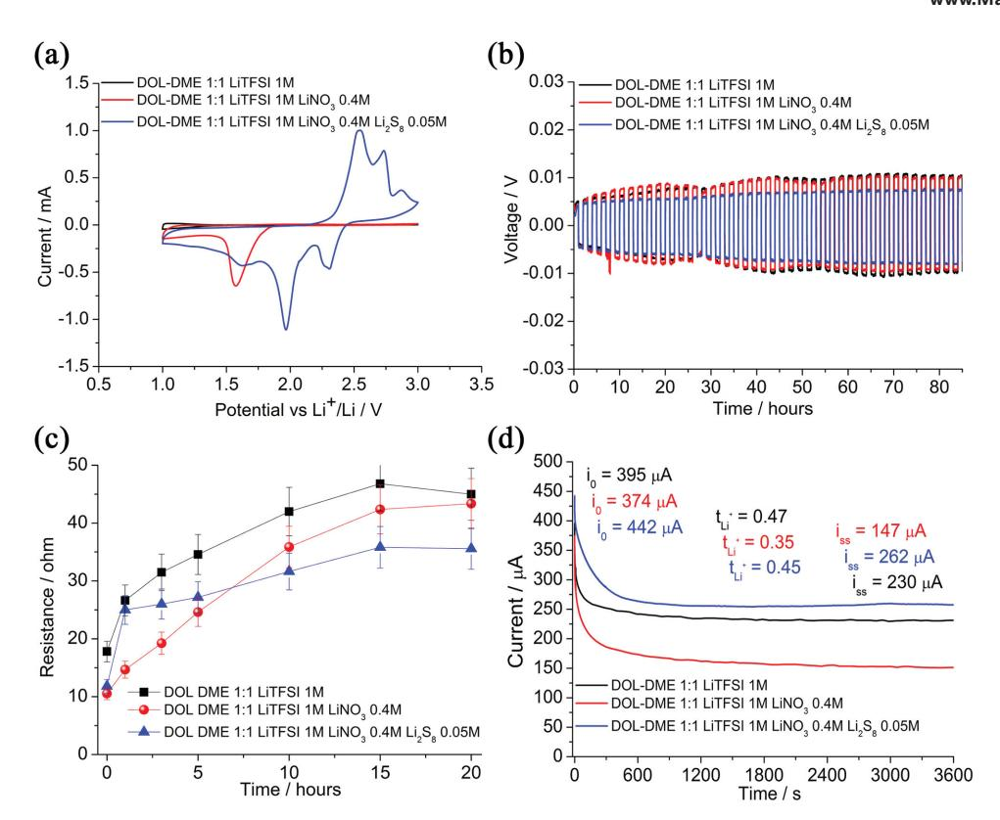
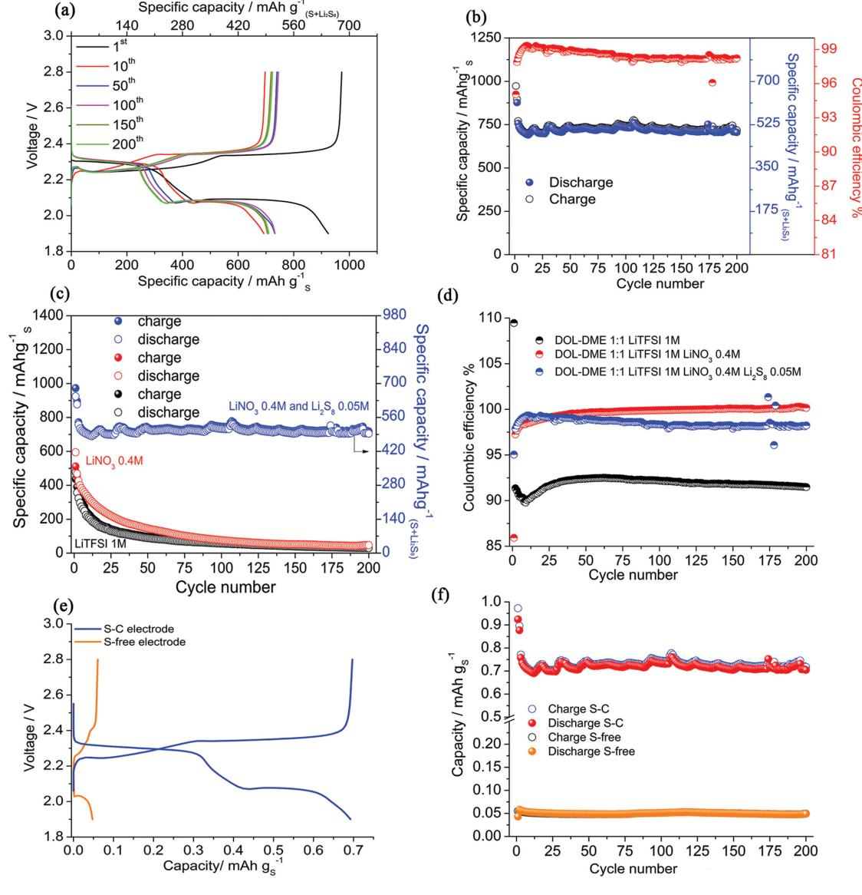
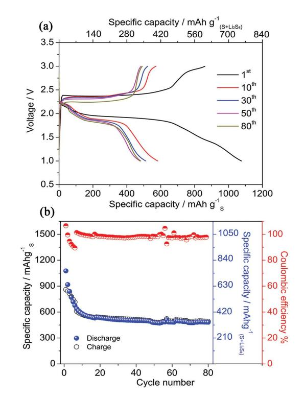

**www.advenergymat.de**

 **An Advanced Lithium-Ion Sulfur Battery for High Energy Storage** 

 *Marco Agostini , Bruno Scrosati , \* and Jusef Hassoun \** 

 **A lithium-ion battery is reported using a sulfur–carbon composite cathode, a graphite anode, and a dimethoxyethane-dioxolane-lithium bis- (trifl uoromethanesulfonyl)imide (DOL-DME-LiTFSI) electrolyte advantageously added by lithium nitrate (LiNO 3 ) and a selected polysulfi de (Li 2 S 8 ). The suppressed sulfur dissolution, due to the Li 2 S 8 buffer action, as well as reduced shuttle reactions by the fi lm-forming properties of the LiNO 3 positively affect the lithium-ion cell behavior in terms of delivered capacity, coulombic effi ciency, and cycle life. The lithium–sulfur cell shows a stable capacity of 750 mAh g −1 for over 200 cycles with an enhanced cycling effi ciency. Furthermore, the full lithium-ion sulfur battery using a graphitebased anode shows a working voltage of about 2 V and delivers a stable capacity of 500 mAh g −1 . The full cell has enhanced safety content, due to the replacement of the lithium metal anode by suitable intercalation electrode, and shows a theoretical energy density as high as 1000 Wh kg −1 at high current rate of 1 C. The remarkable safety level, low materials cost, and high practical energy density, expected to exceed 300 Wh kg −1 , suggest the battery reported is a suitable energy storage system for future applications.** 

### **1. Introduction**

 Recently, increasing consumption of fossil fuels, atmosphere pollution and consequent climate changes focused renewed attention on renewable energy production systems. Indeed, the discontinuity of these systems and, more recently, the emerging market of the electric vehicles triggered the development of advanced energy storage systems. In this respect, lithium batteries (LIBs) appeared the most promising among the various candidates due to their high theoretical energy and long calendar life. [ 1 ] However, the severe targets of the electric vehicle market, as well as the need for decreasing cost of side storage in renewable energy plants, so far required new systems characterized by higher energy density and lower economic impact. Lithium–sulfur battery has high theoretical energy density, i.e., of about 2600 Wh kg −1 , and, contemporary, very low cost and

 Dr. M. Agostini, Dr. J. Hassoun Department of Chemistry University of Rome Sapienza 00185 Rome , Italy E-mail: jusef.hassoun@uniroma1.it Prof. B. Scrosati Istituto Italiano di Tecnologia 16163 Genova , Italy E-mail: bruno.scrosati@gmail.com

earth abundance of the cathode material, hence it is considered the most promising system to meet the emerging market requirements. [ 2–7 ] However, the use of sulfur in lithium batteries is still hindered by several issues, preventing a practical application, such as the insulator nature of the cathode, the volume changes during operation and the high solubility of reaction intermediates (e.g., polysulfi des) in conventional organic solvents. [ 8 ] Lithium sulfur electrochemical process is a multistep reaction involving the initial formation of the highly soluble Li 2 S 8 and fi nal precipitation of Li 2 S, with an overall capacity of 1675 mAh g −1 vs. sulfur mass. [ 9 ] The dissolved polysulfi de may migrate through the electrolyte from the sulfur cathode to the lithium metal anode, thus leading to a shuttle reaction, an increasing polarization, and a fi nal capacity fading. [ 10,11 ] Several researches, involving both the electrodes and the electrolyte, have been

devoted to the lithium–sulfur battery in order to mitigate the shuttle reaction and the cathode dissolution. Cathode optimization, mainly focused on sulfur impregnation in modifi ed carbons or functionalized graphene, has been reported as effi cient strategy to enhance the electronic conductivity and the cycling stability. [ 12–15 ] Ether-based electrolytes, such as tetraethylene glycol dimethyl ether (TEGDME) [ 8,10,16 ] and 1,3 dioxolane (DOL) dimethoxyethane (DME), have been selected as suitable media in alternative to conventional carbonate solutions. [ 17–19 ] Recent studies demonstrated the positive effect of electrolyte-additives, such as LiNO 3 , in inhibiting the polysulfi de shuttle reaction, due to the formation of a stable layer at the lithium anode surface, thus leading to a remarkable enhancement of the lithium– sulfur cell performance. [ 18–21 ] Further studies evidenced that the dissolution of a selected polysulfi de, of various nature and concentration, into the electrolyte may effi ciently stabilize the sulfur cathode by mass and electrochemical buffer effect. [ 22–25 ] A relevant issue affecting the lithium sulfur cell in its conventional confi guration is represented by the use of a lithium metal anode that is characterized by safety issues, associated to possible dendrite formation, short circuit, and cell thermal runway. Previous papers demonstrated the possible replacement of lithium metal by Li-alloying materials in an effi cient lithium-ion sulfur cell confi guration. [ 3,16,26–28 ] In this work we report a metal-free, full lithium-ion sulfur battery using graphite-based, intercalation anode, and sulfur–carbon cathode, benefi tting by the contemporary positive effect of two additives, i.e., Li 2 S 8 and LiNO 3

**DOI: 10.1002/aenm.201500481**

**www.MaterialsViews.com**

**Figure 1.** Electrochemical characterization of the DOL-DME (1:1, v/v), 1 M LiTFSI (black), 0.4 M LiNO 3 -added (red), and 0.4 M LiNO 3 –0.05 M Li 2 S 8 added (blue) electrolytes. a) Cyclic voltammetry performed using a scan rate of 0.1 mV s −1 versus Li + /Li; b) lithium deposition–stripping overvoltage in lithium symmetrical cell using a current of 0.1 mA cm −2 ; c) time evolution of the lithium symmetrical cell resistance; and d) current–time evolution of the lithium symmetric cells following a DC polarization of 10 mV and, in inset, corresponding *t* + number calculated. Room temperature (25 °C).

dissolved in a DOL-DME solvent. The cell operates at about 2 V and delivers a capacity as high as 500 mAh g −1 vs. sulfur cathode mass with extended stability, limited polarization, and high charge–discharge effi ciency, i.e., a relevant performance suitable for the development of a safe, high energy storage system.

## **2. Results and Discussion**

**Figure 1** reports the comparison of the electrochemical characteristics of the bare DOL-DME-LiTFSI electrolyte, and the solutions added by LiNO 3 and by Li 2 S 8 in terms of cyclic voltammetry in lithium cells using Super P carbon working electrode (a), lithium stripping–deposition polarization in symmetric Li/ Li cells (b), stability against lithium metal (c), and Li-transference number (d). The cyclic voltammetry performed using the pristine solution (Figure 1 a, black line) shows a fl at profi le and absence of relevant peaks. The presence of LiNO 3 within the solutions (Figure 1 a, red and blue lines) reveals a reduction peak at around 1.5 V, associated to the irreversible reaction of the LiNO 3 . [ 29 ] The reversible electrochemical reduction of the polysulfi de appears for the fi nal solution, added by both LiNO 3 and Li 2 S 8 (Figure 1 a, blue line), at around 2.4 and 2.0 V versus Li + /Li in discharge, while the following oxidation occurs above 2.6 V in charge. [ 10 ] The Li-stripping-deposition tests reported in Figure 1 b evidence a polarization limited to few mV and a stable trend for several cycles, thus suggesting the compatibility of the lithium with the selected electrolytes. The suitability of the electrolytes in lithium cell is further confi rmed by Figure 1 c, reporting the time evolution of the interphase resistance. The fi gure reveals a slight resistance growth during the initial 10 h of test, associated to the solid electrolyte interphase (SEI) fi lm formation upon chemical reaction of lithium with the electrolyte, and a following stabilization due to the consolidation of the SEI. [ 10,24 ] The same fi gure evidences that the solution added by LiNO 3 and Li 2 S 8 , selected as the preferred electrolyte media for sulfur cell application, is characterized by the lowest cell resistance, due to the benefi cial effect of the two additives. The lithium transference number ( *t*Li+ ) of the electrolytes has been calculated according to the Bruce–Vincent equation. [ 30 ] Figure 1 d reports the comparison of the current–time curves of the symmetrical lithium cell assembled using the three electrolytes and polarized at 10 mV (the corresponding impedance responses used for *t*Li+ determination are reported in the Supporting Information, Figure S1). The *t*Li+ , calculated to be of 0.47 for the pristine electrolyte in agreement with literature data, [ 31 ] decreases to 0.35 by addition of LiNO 3 salt due to the increased ionic force of the solution, and rises back up to 0.45 by Li 2 S 8 addition due to its possible contribution to the lithium ion mobility, thus suggesting that LiNO 3 and Li 2 S 8 fi nally affect the lithium transference number.

 The sulfur–carbon electrode employed in this work, i.e., a sulfur-mesophase carbon micro beads (S-MCMB) composite, has micrometric morphology and S-loading of about 50%, **www.MaterialsViews.com**

**Figure 2.** a) Voltage profi les and b) cycling behavior (with corresponding coulombic effi ciency reported by red circles in right side) of a Li/ DOL-DME (1:1, v/v), 1 M LiTFSI, 0.4 M LiNO 3 , 0.05 M Li 2 S 8 /S–C cell. Comparison of the c) cycling behavior and d) coulombic effi ciency of the Li/S–C cells using the three electrolytes: bare DOL DME 1:1 LiTFSI 1 M, 0.4 M LiNO 3 -added, and 0.4 M LiNO 3 –0.05 M Li 2 S 8 -added electrolyte; specifi c capacity versus total sulfur amount on the right axis. e) Cycling behavior and f) corresponding voltage profi le of a lithium cell using a sulfur-free carbon electrode (MCMB, Super P, and PVdF 6020 in the 8:1:1 weight ratio) in comparison to a cell using the S–C electrode. Voltage range 1.9–2.8V, current of 1.675 A g −1 (corresponding to 1 C of sulfur electrode). Room temperature (25 °C).

evidenced by scanning electron microscopy (SEM) and thermogravimetric analysis (TGA) reported in the Supporting Information, Figure S2a,b, respectively. [ 32 ] This electrode confi guration, characterized by remarkable solubility during operation in lithium cell using bare electrolytes, shows signifi cant improvements, both in terms of cycling stability and coulombic effi ciency, in lithium cell using polysulfi de-added electrolytes. [ 24 ] **Figure 2** a,b reports the Li/S cell performances in terms of voltage profi le and cycling behavior using the electrolyte added by both LiNO 3 and Li 2 S 8 . The cell, cycled using a current as high as 1.675 A g −1 (1 C), shows a capacity of 900 mAh g −1 and an effi ciency of 95% in the 1st cycle. During the following cycles, the capacity decreases to a value of about 750 mAh g −1 stable for over 200 cycles, with an average working voltage of 2.2 V and an effi ciency approaching 99% (Figure 2 a,b). The lithium cell using the bare electrolyte shows remarkable capacity fading due to dissolution of the sulfur electrode (Figure 2 c) and a low coulombic effi ciency (Figure 2 d) due to the shuttle reaction of the dissolved cathode. The effi ciency rises by LiNO 3 addition, due to the formation of a favorable SEI fi lm, however the cell appears still affected by capacity fading. Furthermore, the contemporary effect of the two additives, i.e., LiNO 3 and Li 2 S 8 , well stabilizes the cell capacity and enhances the coulombic effi ciency to value close to 100%. Indeed, the specifi c capacity delivered by the

**www.advenergymat.de**

**Figure 3.** a) Voltage profi le of the 1st and 2nd cycles of the Li/ DOL-DME (1:1, v/v), 1 M LiTFSI, 0.4 M LiNO 3 , 0.05 M Li 2 S 8 /graphite lithium-cell cycled using a current of 200 mA g −1 within voltage ranging from 0.01 to 2.0 V voltage range and, in inset, impedance Nyquist plot of the cell at the pristine state. b) Nyquist plots of the cell upon the fi rst discharge (empty black circles) and the following charge (plain blue circles) and, in inset, evolution of the cell resistance during cycling. c) Voltage profi les and d) cycling behavior (with corresponding coulombic effi ciency reported by red circles in right side) of the cell upon prolonged cycling. Room temperature (25 °C).

Li/S cell using the modifi ed electrolyte is about 750 mAh g −1 as referred to the sulfur mass in the electrode that is reduced to 525 mAh g −1 considering the overall S mass, including dissolved polysulfi de (right-side Y axis). In this work, the Li–S cell capacity has been referred to the sulfur mass in the cathode neglecting the direct participation of Li 2 S 8 dissolved within the electrolyte to the electrochemical process. Indeed, this process has been directly investigated by the cycling test employing a sulfur-free carbon electrode, i.e., formed by MCMB, and Li 2 S 8 -added electrolyte. The response of this cell in terms of voltage profi le (Figure 2 e) and cycling behavior (Figure 2 f), in comparison to the corresponding test in lithium cell using the sulfur carbon electrode, demonstrates a minor contribution of the polysulfi de to the overall Li/S cell capacity, i.e., of about 7%. Indeed, within our cell confi guration, the limited amount of dissolved Li 2 S 8 mainly acts as mass buffer leading to cycling stabilization, while LiNO 3 salt increases the cell effi ciency.

 A graphite-based anode has been characterized in lithium cell using the DOL DME 1:1 LiTFSI 1 M, LiNO 3 0.4 M, Li 2 S 8 0.05 M electrolyte solution in order to verify its suitability for application in full, lithium-ion sulfur cell. Prior to test, the graphite electrode has been fully prelithiated by direct contacting with a lithium foil wet by LP30 electrolyte, as reported in previous paper. [ 27 ] The interphase of the lithiated graphite electrode has been studied in lithium cell by using electrochemical impedance spectroscopy (EIS). **Figure 3** a reports the voltage profi le of the 1st and 2nd cycles of the Li/ DOL-DME (1:1, v/v), 1 M LiTFSI, 0.4 M LiNO 3 , 0.05 M Li 2 S 8 / graphite cell studied using a current of 200 mA g −1 within voltage ranging from 0.01 to 2.0 V. The fi gure evidences a delivered capacity of about 100 mAh g −1 during the fi rst discharge, increasing to about 310 mAh g −1 during the following charge. This trend is due to the activation process (see the Experimental Section) that leads to a partial lithium insertion into the electrode structure, reduction of the pristine cell working voltage as well as to the formation of a stable SEI fi lm thus avoiding further reaction of the electrode with the electrolyte components, e.g., Li 2 S 8 and LiNO 3 . Hence, the formation of a passivation layer kinetically protects the graphite electrode surface. Indeed, the inset of Figure 3 a, reporting the impedance Nyquist plot of the cell at the pristine state, demonstrates a low cell resistance, i.e., limited to about 45 Ω. Furthermore, the Nyquist plots of the cell upon the fi rst discharge (empty black circles) and the following charge (plain blue circles) reported in Figure 3 b and the evolution of the cell resistance during cycling (reported in inset) further confi rm the stability of the SEI fi lm formed by prelithiation of graphite electrode prior to cycle. The slight changes observed in Figure 3 b may be most likely attributed to minor changes in SEI fi lm composition by cycling in DOL-DME-LiTFSI-LiNO 3 -Li 2 S 8

**www.advenergymat.de**

electrolyte. Figure 3 c, reporting the voltage profi les of the lithiated graphite electrode, reveals an average working voltage of about 0.2 V versus Li + /Li, while the cycling behavior of Figure 3 d evidences a decay during the initial ten cycles, followed by a stabilization of the capacity at about 240 mAh g −1 , i.e., about 65% of the expected theoretical value (370 mAh g −1 ). The capacity decay, and the low initial cell effi ciency, during the initial cycles may be attributed to possible slight SEI fi lm modifi cation and structural organization of the electrode surface in presence of the additional salts, i.e., LiNO 3 and Li 2 S 8 , required for an optimal operation of the sulfur cathode side. [ 10,24,27,29 ] However, the stable trend of the cycling test during the following cycles is considered convincing proof, suggesting the suitability of the lithiated-graphite electrode in full Li-ion sulfur cell confi guration.

**Figure 4** reports the electrochemical response of the Li-ion sulfur cell formed by coupling the sulfur–carbon cathode, the prelithiated graphite anode and the selected electrolyte solution, i.e., added by LiNO 3 and Li 2 S 8 , using a current–rate as high as of 1675 mA g −1 (corresponding to 1 C). During the fi rst cycle, the discharge of about 1000 mAh g −1 is not completely reversed upon the following charge process, due to the above observed initial irreversible trend of the graphite electrode, thus leading to a coulombic effi ciency higher than 100% (i.e., calculated as percentage of the discharge capacity in respect to charge capacity). Furthermore, the cell shows capacity decay during the fi rst ten cycles, as most likely ascribed to the anode stabilization already observed in the cycling test reported in Figure 3 . During the following cycles a stable capacity of about 500 mAh g −1 (in respect to S in the cathode), a working voltage of about 2 V, a high coulombic effi ciency, and a limited polarization are shown. The steady state voltage profi le of Figure 4 a refl ects the reversible electrochemical reaction of sulfur with lithiated graphite

#### S8 16LiC 8Li S 16C + =+ 62 6

This notable performance suggests a stable energy density, theoretically of about 1000 Wh kg −1 referred to the sulfur loaded in the cathode that is a value much higher than that offered by the commercial Li-ion battery. [ 1 ] The cell has additional bonus: the extremely reduced cost of the component materials, i.e., sulfur and graphite, and the high safety content.

# **3. Conclusions**

 The lithium-ion sulfur cell here reported shows enhanced performances due to the benefi cial addition of LiNO 3 and Li 2 S 8 to the DOL-DME-LiTFSI solution used as the electrolyte media. The two additives properly suppress the polysulfi de shuttle reaction and buffer the sulfur cathode dissolution within the electrolyte, thus leading to optimized electrochemical process. Furthermore, the replacement of the lithium metal by a carbon anode based on intercalation process well increases the cell safety. The excellent performances of the full cell, in terms of delivered capacity, current rate, energy density, and cycling life, confi rm the suitability of the system here proposed for high energy applications.

**Figure 4.** a) Voltage profi le at the 1st, 10th, 30th, 50th, 80th cycle and b) cycling behavior (with corresponding coulombic effi ciency reported by red circles in right side) of the LiC 6 / DOL-DME (1:1, v/v), 1 M LiTFSI, 0.4 M LiNO 3 , 0.05 M Li 2 S 8 /S–C lithium-ion sulfur cell performed at a current of 1.675 A g −1 (1 C) within 1.0–3.0 V voltage range. Room temperature (25 °C).

## **4. Experimental Section**

*Electrodes Preparation* : The cathode material was prepared by melting sulfur (Aldrich 99.9%) at 135 °C and then mixing it with MCMB (mesophase carbon micro beads, Osaka gas) with a 1:1 weight ratio using a procedure reported in a previous paper. [ 32 ] Following, the mixture was refi ned for 2 h by using the high energy mechanical milling (HEMM). The sulfur–carbon electrode morphology was investigated by scanning electron microscopy using a Phenom-FEI instrument. The S–C thin fi lm electrode was prepared by mixing the active material powder with Super P carbon (conducting agent, Timcal) and polyvinylidene fl uoride (PVdF 6020, binder, Solvay) in a weight ratio of 8:1:1 using *N* -methyl pirrolidone (NMP). The resulting slurry was then cast on an Al foil of approximately 40 µm thickness to achieve a sulfur loading of about 1.3 mg cm −2 . The electrodes were dried at 50 °C under vacuum to remove residual solvent, prior to be used in lithium cells. The anode was prepared by mixing MCMB powder with Super P carbon (conducting agent, Timcal) and PVdF (6020, binder, Solvay) in the weight ratio of 8:1:1 and dissolving the mixture in NMP (Aldrich). The resulting slurry was plated on a Cu foil, with a fi nal graphite loading of 5 mg cm −2 . The electrodes were dried at 100 °C under vacuum, prior to be used in lithium cells.

*Electrolytes Preparation* : The bare, additive-free electrolyte was prepared in argon-fi lled glove box by dissolving 1 mol of LiTFSI (Aldrich) in 1 L of DME (Dimethoxyethane, Aldrich)/DOL (Dioxolane, Aldrich) with a 1:1 volume ratio. A second test-solution was prepared by adding to 1 L of the bare solution 0.4 mol of LiNO 3 . The fi nal, polysulfi decontaining electrolyte was prepared by following two steps: (i) mixing lithium metal and elemental sulfur in a molar ratio of 2:8 in DME/DOL solution to reach a Li 2 S 8 concentration of 0.05 mol L −1 , and heating at

80 °C for 12 h, until a red-color solution is obtained, (ii) dissolving 1 mol of LiTFSI and 0.4 mol of LiNO 3 to 1 L of DME-DOL-Li 2 S 8 solution above described to reach the following electrolyte confi guration: 1 M LiTFSI,

0.4 M LiNO 3 , 0.05 M Li 2 S 8 in DME/DOL (1:1 = v/v).

*Electrochemical Measurements* : The lithium–electrolyte interphase resistance was determined using a lithium–lithium symmetric 2032 coin type cell by electrochemical impedance spectroscopy applying a 10 mV AC amplitude signal within 500 kHz–10 mHz frequency range. The determination of lithium transference numbers were obtained by using the Bruce–Vincent [ 30 ] method that combines AC and DC polarization to a Li/Li symmetrical cell using the selected electrolyte. The formula used for the lithium transference number determination was *t*Li+ = *I*ss (Δ*V* −*R*0*I*0 )/ *I*0 (Δ*V* −*R*ss*I*ss ), where *I*0 is the initial current, *I*ss the steady state current, Δ*V* the applied voltage, and *R*0 and *R*ss are resistances before and after dc polarization, respectively. The applied DC signal was of 10 mV while the EIS was performed before and after polarization within 500 kHz–10 mHz frequency range, using 10 mV amplitude AC pulses. The cyclic voltammetry (CV) tests were performed using a three electrode polypropylene T-cell, with lithium foil as reference and counter electrode and carbon Super P (Super P, PVdF 6020 8:2 on Al foil) as working electrode. The CV tests were run with a scan rate of 0.1 mV s −1 , within 1–3 V voltage range. The resistance of the fi lms formed by the electrolytes was evaluated by using EIS technique on a Li/ DOL-DME (1:1, v/v), 1 M LiTFSI, 0.4 M LiNO 3 , 0.05 M Li 2 S 8 /Li cell. The measurement was performed within a 500 kHz–10 mHz frequency range, by applying a 10 mV amplitude AC pulse from pristine condition and upon 20 h of aging after cell assembling. The interphase resistance value was evaluated by nonlinear least squares (NLLS) fi t of the highfrequency semicircles related to the fi lm formation process. All the above tests were performed using VMP3 Biologic instrument. The galvanostatic tests were carried out in a 2032 coin-type cell by using a Maccor Series 4000 Battery Test System (Maccor, Inc.). Electrochemical charge–discharge study in lithium cell was performed within 1.9–2.8 V at a current of 1.675 A g −1 (1 C) for the S–C electrode and within 0.01–2.0 V at a current of 200 mA g −1 for the graphite electrode. The lithium ion full cell was assembled by coupling the S–C cathode and the graphite anode. Prior to the cell testing, the graphite anode was prelithiated by contacting with a lithium foil wet by ethylene carbonate:dimethyl carbonate (EC:DMC 1:1, v:v), LiPF 6 (1 M), and following rinsing by dimethyl carbonate (DMC, Aldrich, 99%) as reported in previous paper. [ 27 ] The graphite/lithium interphase was investigated by coupling EIS and galvanostatic cycling (GC) techniques. The EIS was performed in 500 kHz–10 mHz frequency range, using 10 mV amplitude AC pulses, in the pristine state of the cell and after discharge and charge process, from 1st to 5th cycles. Before the test in lithium cell the graphite electrode was pretreated by Li-metal as above reported. GC was performed in lithium cell within 0.01 and 2.0 V at a current of 200 mA g −1 . The full cell was balanced by selecting 1:4 cathode to anode mass ratio. The lithium ion cell was cycled at 1 C current rate (1.675 A g −1 ), referring to the sulfur–cathode active mass, within 1–3V voltage range. The cell capacity was referred both to sulfur active mass (about 1 mg) and to the overall sulfur mass (S weight in the cathode and in the electrolyte). An Advantec glass fi ber was used as separator and soaked by 40 µL of the selected electrolyte solution, with a Li 2 S 8 content of about 0.5 mg (corresponding to 0.45 mg of sulfur, see results and discussion of Figure 2 for clarifi cation).

## **Supporting Information**

 Supporting Information is available from the Wiley Online Library or from the author.

**www.MaterialsViews.com**

Received: March 9, 2015 Revised: May 20, 2015 Published online: June 22, 2015

- [1] J.-M. Tarascon , M. Armand , *Nature* **2001** , *414* , 359 .
- [2] E. Peled , A. Gorenshtein , M. L. Sega , Y. Sternberg , *J. Power Sources*  **1989** , *26* , 269 .
- [3] J. Hassoun , B. Scrosati , *Angew. Chem. Int. Ed.* **2010** , *49* , 2371 .
- [4] L. F. Nazar , M. Cuisinier , Q. Pang , *MRS Bull.* **2014** , *39* , 436 .
- [5] R. D. Rauh , K. M. Abraham , G. F. Pearson , J. K. Surprenant , S. B. Brummer , *J. Electrochem. Soc.* **1979** , *126* , 523 .
- [6] N. Jayaprakash , J. Shen , S.-S. Moganty , A. Corona , L.-A. Archer , *Angew. Chem. Int. Ed.* **2011** , *50* , 5904 .
- [7] D. Bresser , S. Passerini , B. Scrosati , *Chem. Commun.* **2013** , *49* , 10545 .
- [8] J. Hassoun , M. Agostini , A. Latini , S. Panero , Y.-K. Sun , B. Scrosati , *J. Electrochem. Soc.* **2012** , *159* , A1 .
- [9] S.-H. Chung , A. Manthiram , *J. Power Sources* **2013** , *107* , 569 .
- [10] M. Agostini , D.-J. Lee , B. Scrosati , Y.-K. Sun , J. Hassoun , *J. Power Sources* **2014** , *265* , 14 .
- [11] Y.-V. Mikhaylik , J. R. Akridge , *J. Electrochem. Soc.* **2004** , *151* , A1969 .
- [12] X. L. Ji , K. T. Lee , L. F. Nazar , *Nat. Mater.* **2009** , *8* , 500 .
- [13] J.-H. Kim , D.-J. Lee , H.-G. Jung , Y.-K. Sun , J. Hassoun , B. Scrosati , *Adv. Funct. Mater.* **2013** , *23* , 1076 .
- [14] G. He , X. Ji , L. Nazar , *Energy Environ. Sci.* **2011** , *4* , 2878 .
- [15] H. Wang , Y. Yang , Y. Liang , J. T. Robinson , Y. Li , A. Jackson , Y. Cui , *Nano Lett.* **2011** , *11* , 2644 .
- [16] M. Agostini , J. Hassoun , J. Liu , M. Jeong , H. Nara , T. Momma , T. Osaka , Y.-K. Sun , B. Scrosati , *ACS Appl. Mater. Interfaces* **2014** , *6* , 10924 .
- [17] Y. Mikhaylik , I. Kovalev , R. Schock , K. Kumaresan , J. Xu , J. Affi nito , *ECS Trans.* **2010** , *25* , 23 .
- [18] S. Xiong , K. Xie , Y. Diao , X. Hong , *Electrochim. Acta* **2012** , *83* , 78 .
- [19] S.-S. Zhang , *J. Power Sources* **2013** , *231* , 153 .
- [20] D. Aurbach , E. Pollak , R. Elazari , G. Salitra , C. S. Kelley , J. Affi nito , *J. Electrochem. Soc.* **2009** , *156* , A694 .
- [21] C. Barchasz , J. C. Leprêtre , F. Alloin , S. Patoux , *J. Power Sources*  **2012** , *199* , 322 .
- [22] R. Demir-Cakan , M. Morcrette , A. Gangulibabu , R. Gueguen , R. Dedryvere , J.-M. Tarascon , *Energy Environ. Sci.* **2013** , *6* , 176 .
- [23] S.-S. Zhang , J. A. Read , *J. Power Sources* **2012** , *200* , 77 .
- [24] D.-J. Lee , M. Agostini , J.-W. Park , Y.-K. Sun , J. Hassoun , B. Scrosati , *ChemSusChem* **2013** , *6* , 2245 .
- [25] S. Chen , F. Dai , M. L. Gordin , D. Wang , *RSC Adv.* **2013** , *3* , 3540 .
- [26] M. Agostini , J. Hassoun , *Sci. Rep.* **2015** , *5* , 7591 .
- [27] J. Hassoun , J.-H. Kim , D.-J. Lee , H.-G. Jung , S.-M. Lee , Y.-K. Sun , B. Scrosati , *J. Power Sources* **2012** , *202* , 308 .
- [28] Y. Yang , M. T. McDowell , A. Jackson , J. J. Cha , S. S. Hong , Y. Cui , *Nano Lett.* **2010** , *10* , 1486 .
- [29] D. Aurbach , *J. Power Sources* **2000** , *89* , 206 .
- [30] P. Bruce , G. Evans , C. A. Vincent , *Solid State Ion.* **1988** , *28* , 918 .
- [31] L. Suo , Y. S. Hu , H. Li , M. Armand , L. Chen , *Nat. Commun.* **2013** , *4* , 1481 .
- [32] M. Agostini , Y. Ahiara , T. Yamada , B. Scrosati , J. Hassoun , *Solid State Ion.* **2013** , *244* , 48 .