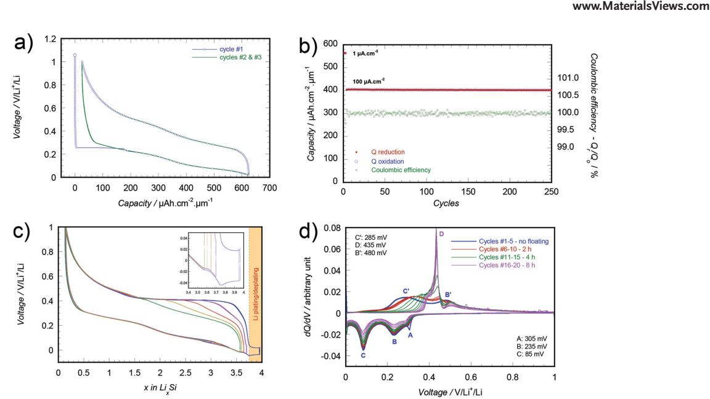
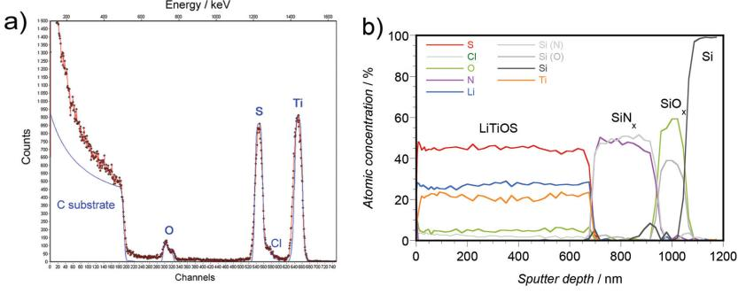
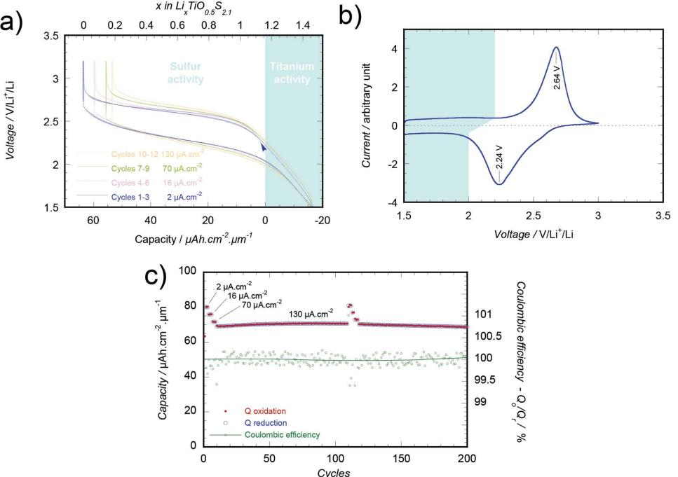
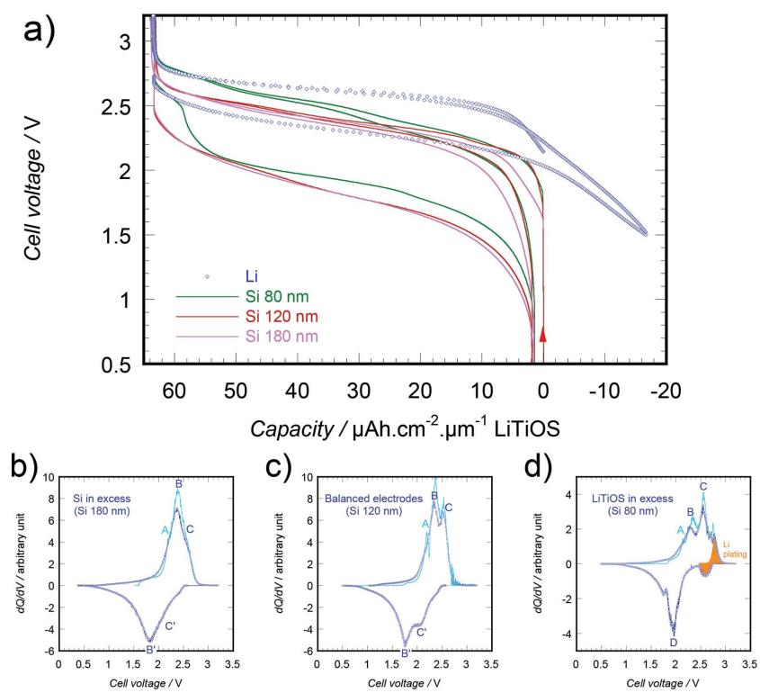
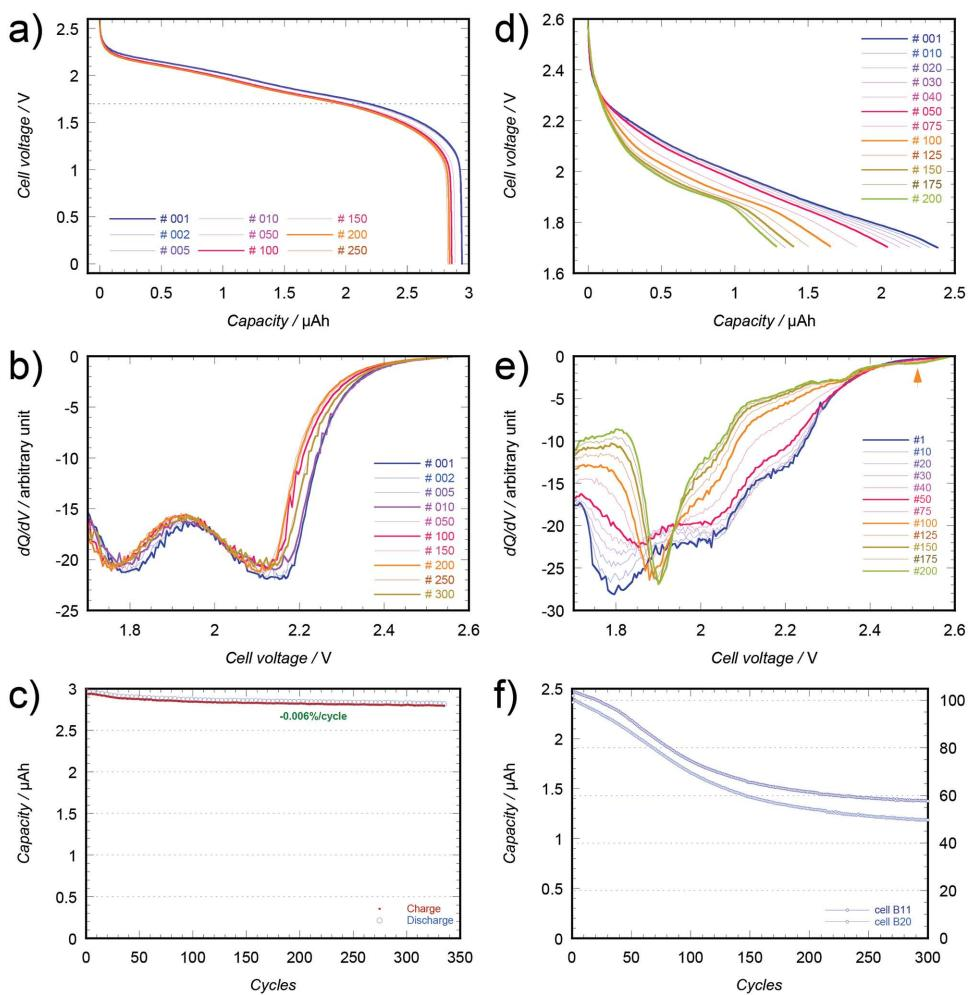
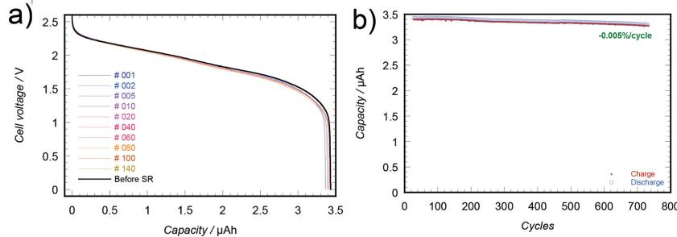
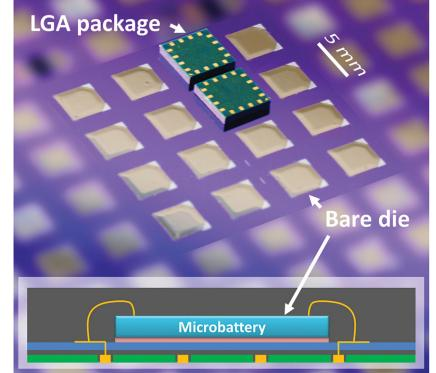

# **All-Solid-State Lithium-Ion Microbatteries Using Silicon Nanofi lm Anodes: High Performance and Memory Effect**

 *Frédéric Le Cras , \* Brigitte Pecquenard , \* Vincent Dubois , Viet-Phong Phan , and Delphine Guy-Bouyssou* 

 **All-solid-state thin fi lm lithium batteries are promising devices to power the next generations of autonomous microsystems. Nevertheless, some industrial constraints such as the resistance to refl ow soldering (260 °C) and to short-circuiting necessitate the replacement of the lithium anode. In this study, a 2 V lithium-ion system based on amorphous silicon nanofi lm anodes (50–200 nm thick), a LiPON electrolyte, and a new lithiated titanium oxysulfi de cathode Li 1.2 TiO 0.5 S 2.1 is prepared by sputtering. The determination of the electrochemical behavior of each active material and of whole systems with different confi gurations allows the highlighting of the particular behavior of the Li** *x* **Si electrode and the understanding of its consequences on the performance of Li-ion cells. Lithium-ion microbatteries processed with industrial tools and embedded in microelectronic packages exhibit particularly high cycle life (−0.006% cycle −1 ), ultrafast charge (80% capacity in 1 min), and tolerate both short-circuiting and refl ow soldering. Moreover, the perfect stability of the system allows the assignment of some modifi cations of the voltage curve and a slow and reversible capacity fade occurring in specifi c conditions, to the formation of Li 15 Si 4 and to the expression of a "memory effect." These new fi ndings will help to optimize the design of future Li-ion systems using nanosized silicon anodes.** 

# **1. Introduction**

 The signifi cant growth of both the number and the kinds of portable electronic systems, generally battery-powered, has triggered the race for the development of high-performance microprocessors and systems-on-a-chip (SoCs) using low power

 Dr. F. Le Cras Université Grenoble Alpes CEA LETI, Minatec Campus Grenoble 38054 , France E-mail: frederic.lecras@cea.fr Prof. B. Pecquenard, Dr. V. Dubois, Dr. V.-P. Phan CNRS, Université de Bordeaux ICMCB, UPR 9048 Pessac 33608 , France E-mail: brigitte.pecquenard@icmcb.cnrs.fr Dr. V. Dubois, Dr. V.-P. Phan, Dr. D. Guy-Bouyssou ST Microelectronics Tours 37071 , France

consumption integrated circuits. As a consequence, the energy supply of such optimized components can also be ensured today by miniaturized power sources such as microbatteries (whose capacities range from 1 to 100 µAh). All-solid-state lithium microbatteries have the advantage of being manufactured by vacuum deposition processes, also widely used in the microelectronics industry, [ 1,2 ] and not to contain a liquid electrolyte, this being benefi cial to safety. The association of microelectronic components and microbatteries will possibly give birth to new products within three main domains—back-up power "UPS (Uninterruptible power Supply)-like" for dynamic random access memory (DRAM) or real-time clocks (RTC), embedded energy and autonomous devices. Nevertheless, these new applications require that the microbattery has suffi cient thermal stability to tolerate the refl ow soldering to attach the component to a circuit board. When using lead-free solders, i.e., Sn Ag Cu eutectics, the microbattery must sustain temperatures

higher than 230 °C. [ 3 ] Lithium microbatteries are not tolerant to such high temperatures as they contain a lithium metal anode that melts at 181 °C. Thus, two possible solutions exist: (i) the use of a "lithium-free" confi guration in which all the lithium is initially contained in the discharged cathode, [ 4 ] the fi rst charge leading to the plating of metallic lithium on the negative current collector and (ii) the use of a real lithium-ion cell, with a negative electrode material able to reversibly react with lithium at low voltage, and melting at a temperature higher than 260 °C. In both cases, the microbattery is theoretically tolerant to short-circuiting which is also a great advantage for manufacture and use.

 As for "lithium-free" stacks, it was clearly evidenced that the electroplating of lithium at the surface of the bare current collector (negative electrode) is generally not uniform and depends on the current density applied during the charge. [ 5 ] Indeed, low current densities lead to a limited amount of nucleation sites for metallic lithium, hence favoring the growth of large packs of lithium, and fi nally leading to mechanical damage in the cell and a fast capacity fade. [ 4,6 ]

 Only a few complete all-solid-state lithium-ion thin fi lm cells were reported in the literature. Negative electrode materials

#### **DOI: 10.1002/aenm.201501061**

**Figure 1.** Electrochemical features of Si(100 nm)/LiPON/Li microbatteries: a) Voltage curves for the three fi rst discharge/charge cycles at constant current (53 µA cm −2 , 0.02–1 V/Li + /Li), b) evolution of the capacity and the coulombic effi ciency (1–100 µA cm −2 , 0.05–1 V/Li + /Li), c) infl uence of the low cut-off voltage on the shape of the voltage curve (formation of Li 15 Si 4 , 10 µA cm −2 ), and d) evolution of the derivative capacity ∂*Q* /∂*V* for increasing fl oating durations at 0 V/Li + /Li applied at the end of galvanostatic cycles (10 µA cm −2 ), showing the progressive increase of the amount of Li 15 Si 4 revealed by peak D.

associated with LiCoO 2 and LiPON were SiSn 0.87 O 1.20 N 1.72 "LiSiTON", [ 7 ] tin nitride, [ 8,9 ] and tin oxide, [ 10 ] which all lead to an important capacity loss (30%–50%) during the fi rst cycle. Indeed, these materials react with lithium in two main steps involving: (i) a conversion reaction *x* Li + + *x* e − + MX → M + Li *x* X (M: metal, X: N, P, O, S, Se, F) and (ii) an electrochemical alloying reaction *y* Li + + *y* e − + M + Li *x* X → Li *y* M + Li *x* X. The reversibility of the fi rst reaction step inside a given voltage window greatly depends on the thickness (or the particle size) of the electrode material, and the nature of X and M. [ 11 ]

 Other systems such as V 2 O 5 /LiPON/LiMn 2 O 4 , [ 12,13 ] and Al/ LiPON/Li *x* Co *y* Mn 3 O 8 , [ 14 ] were not able to provide a stabilized capacity.

 In this paper, we report for the fi rst time on the manufacture and the characterization of all-solid-state lithium-ion cells containing a lithiated titanium oxysulfi de positive electrode and based on a thin fi lm silicon negative electrode. Indeed, in order to avoid lithium being trapped during the fi rst cycle as Li 2 O or Li 3 N in the negative electrode, pure elements forming alloys with lithium are preferred candidates. Among them, most were ruled out here for different reasons: (i) Ga, In, Sn, and Pb due to their low melting point, (ii) Cd, Hg, and Tl due to their toxicity, (iii) Pt, Pd, and Au due to their cost, (iv) alkaline earth metals due to their reactivity, and fi nally (v) Sb and Bi due to a too high delithiation voltage. Finally, among the remaining candidates (Al, Si, Zn, Ge, and Ag), silicon has already proved to be a high-performance electrode in all-solidstate Li/LiPON/Si thin fi lm cells despite the huge volume variations of the Li *x* Si material occurring during the charge/discharge cycles. [ 15 ] At room temperature, the maximum amount of lithium that can be inserted by electrochemical alloying corresponds to the formation of the Li 15 Si 4 compound, [ 16 ]

and leads to the high theoretical volumetric capacity of 835 µAh cm −2 µm −1 .

 To be compatible with the low voltage supply required for low-consumption microsystems, a titanium oxysulfi de (TiOS) thin fi lm positive electrode was envisaged to obtain an expected operating voltage comprised between 1.5 and 2 V. The TiOS amorphous material is able to deliver a high volumetric capacity (90–100 µAh cm −2 µm −1 ) compared to LiCoO 2 (64 µAh cm −2 µm −1 ) and does not require an additional annealing step. [ 1,17 ] In this work, a new lithiated TiOS positive electrode was synthesized by sputtering of an LiTiS 2 target and was then associated with the silicon negative electrode to form an Li-ion cell.

## **2. Results and Discussion**

#### **2.1. Nanosized Silicon Thin Film Electrodes in All-Solid-State Lithium Batteries**

 Silicon thin fi lm electrodes prepared by radio-frequency sputtering with no intentional heating of the substrate are amorphous and quite dense. The fi lm thickness of 100 nm was chosen to obtain a surface capacity in the range 60–80 µAh cm −2 , close to the surface capacity for 1 µm thick positive electrodes (LiCoO 2 , LiMn 2 O 4 , TiOS, etc.). In addition, this thickness is advantageously smaller than the critical size (150 nm) above which the fracture of silicon is likely to occur during lithiation/ delithiation cycles. [ 18 ] The electrochemical behavior of silicon thin fi lms was studied in all-solid-state Si/LiPON/Li "half-cells." As shown in **Figure 1** a, the fi rst reduction starts with a small irreversible reaction at ≈0.3 V/Li + /Li which involves only 2% of the total capacity. This latter is specifi c to all-solid-state cells and

#### **www.MaterialsViews.com**

is very likely related to the reduction of SiO *x* N *y* species formed at the electrode–electrolyte interface during the deposition of LiPON on the top of the silicon electrode. Then, the reduction proceeds in two main steps centered at 0.23 and 0.08 V/Li + /Li, each one involving approximately half of the total capacity. It has to be noticed that this last step, close to 0 V/Li + /Li, is often not completed nor even initiated during the operation of most conventional cells using (nano)silicon electrodes and liquid electrolyte cells, [ 19 ] due to a too signifi cant polarization (ohmic drop, sum of concentration and activation overpotentials). Consequently, a prolonged operation of Li x Si electrodes in the Lirich region was rarely achieved in the literature.

 As for our all-solid-state thin fi lm batteries, the theoretical volumetric capacity of 834 µAh cm −2 µm −1 was never reached in normal cycling conditions using constant currents. The fl atness of the voltage curve shape at low potential makes the actual discharge capacity very sensitive to the discharge cut-off voltage and to the reduction overpotential. Then, the practical capacity when using a lower cut-off voltage ranging from 0.02 to 0.05 V/Li + /Li and a current density ranging from 1 to 100 µA cm −2 , varies between 400 and 600 µAh cm −2 µm −1 .

 The subsequent oxidation allows removing 98% of the lithium from the Li *x* Si electrode during two main steps located at ≈0.28 and 0.48 V/Li + /Li. The voltage hysteresis between reduction and oxidation is about 200–230 mV and is quite constant over all the composition range. This electrochemical behavior is consistent with the presence of only amorphous or short-range ordered Li *x* Si compounds. Subsequently, the cycle life of the Li/LiPON/Si all-solid-state cells is almost perfect as the capacity loss is only −0.003% cycle −1 ( Figure 1 b), despite the large volume changes of the Li *x* Si electrode.

 As fi rst shown by Obrovac and Christensen, [ 16 ] the lithiation of the silicon electrode at room temperature can be completed up to the Li 15 Si 4 composition, inducing the crystallization of the corresponding material. In their liquid electrolyte cells, the tiny reduction step triggering the formation of Li 15 Si 4 was found to occur at 50 mV/Li + /Li, while the main electrochemical feature of the formation of this crystallized end member is the modifi cation of the shape of the voltage curve during the subsequent oxidation, with the presence of a marked plateau at around 0.44 V/Li + /Li. In all-solid-state thin fi lm batteries, the formation of this compound was not so easy. As shown in Figure 1 c, the voltage at which the fi nal reduction step occurs in our solid electrolyte cells is located below 0 V/Li + /Li (−15 to −45 mV), even when using a very low current density, due to the sum of reaction overpotentials on both electrodes (two-electrode cell). This fi nal step involves only 5% of the total lithium content (from Li ≈3.6 Si to Li 3.75 Si), but has a large infl uence on the shape of the voltage curve during the subsequent oxidation. Besides, it demonstrates that the formation of crystallized Li 15 Si 4 from amorphous Li *x* Si is not a congruent process. [ 20 ] During galvanostatic cycling, the only means to get a complete lithiation of the silicon electrode was either to carry on with the reduction until metallic lithium starts to plate on the Li x Si electrode (Figure 1 c), or to add a fl oating period at the end of the discharge. Considering the latter point, as shown on the derivative curve ( Figure 1 d), more than 2 h of fl oating at 0 V/Li + /Li are necessary to initiate the formation of some crystalline Li 15 Si 4 phase in the Li *x* Si thin fi lm. Nevertheless, whatever the cycling conditions, once the formation of some Li 15 Si 4 has occurred at the end of a given discharge, its formation seems easier and amplifi ed during the subsequent ones. This behavior is clearly highlighted by a continuous increase of the intensity of peak D at 0.44 V/Li + /Li, when a 4 h fl oating is applied. These observations are consistent with the in situ X-ray diffraction study achieved on silicon nanowires by Misra et al., [ 21 ] that also evidenced a kinetic limitation of the formation of Li 15 Si 4 and a more widespread crystallization after a second cycle. This suggests that a progressive modifi cation of the (micro)structure of the silicon thin fi lm occurs after each full lithiation/full delithiation cycle, making the formation of Li 15 Si 4 easier. The formation of a mesoporous silicon network, once the electrode is delithiated, [ 22 ] is probably at the origin of the enhancement of the Li 15 Si 4 formation kinetics, as it could progressively lead to an optimized arrangement of silicon atoms that minimizes Si diffusion path lengths throughout the fi lm during the subsequent alloying reaction.

 In addition to the features of the Si thin fi lm electrochemical behavior detailed above, another particular evolution of the voltage curve leading to a reversible capacity fade ("memory effect") was highlighted in a previous study, for thin fi lms cycled in liquid electrolyte in specifi c conditions. [ 23 ] As a reminder, it was evidenced that a prolonged cycling in the Li-rich region (i.e., below 0.44 V/Li + /Li) induces a progressive increase of deinsertion voltage above this cut-off limit, hence a capacity loss in the part of the voltage curve lying below this value. Subsequently, the full capacity and the initial shape of the voltage curve can be recovered after a full delithiation that reveals the presence of a new electrochemical step at 0.51 V/Li + /Li (i.e., distinct from the lithium deinsertion step from Li 15 Si 4 ) (see Figure S1, Supporting Information).

 To summarize, to ensure a perfectly stable electrochemical behavior of amorphous silicon thin fi lm electrodes, it is mandatory to avoid the formation of the Li 15 Si 4 compound or the possible ordering of Li-rich alloys; this can be achieved by maintaining the lower cut-off voltage above 0.05 V/Li + /Li and regularly carrying out a full delithiation.

#### **2.2. Lithiated Titanium Oxysulfi de Thin Film Electrodes**

 As for TiOS thin fi lms, LiTiOS electrodes deposited with no intentional heating of the substrate are amorphous. The structure of the fi lm is dense, with a density close to 2.7 g cm −3 (crystalline LiTiS 2 : 3 g cm −3 ) and a very smooth surface. Combined chemical analyses by Rutherford backscattering (RBS) ( **Figure 2** a), inductively coupled plasma optical emission spectrometer (ICP-OES), and electron probe microanalysis (EPMA) lead to the following composition Li 1.2 TiO 0.5 S 2.1 , and confi rm the incorporation of a small amount of oxygen into the fi lm. Auger depth-profi le analyses ( Figure 2 b) demonstrate the chemical homogeneity of the fi lm across the whole thickness. Additional XPS analyses clearly show that the oxygen incorporation in the fi lm induced a full reoxidation of titanium into Ti 4+ and, contrary to TiOS, did not lead to the formation of S 2 2− species. [ 24,25 ] All these elements are consistent with a positive electrode material formula Li Ti O S 1.2 IV 0.5 2.1 II .

 A full electrochemical delithiation of Li 1.2 TiO 0.5 S 2.1 electrode corresponding to a capacity of 64 µAh cm −2 µm −1 was achieved in all-solid-state half-cells ( **Figure 3** a); as Ti 4+ cannot be involved

**Figure 2.** Elemental analyses of lithiated titanium oxysulfi de thin fi lms obtained by sputtering of an LiTiS 2 target: a) RBS spectrum of a 100 nm thick fi lm and b) Auger electron spectroscopy depth-profi ling analysis of a thin fi lm deposited on a passivated silicon wafer. Note that chlorine traces were initially present in the TiS 2 precursor, probably produced by sulfi dation of TiCl 4 .

in this oxidation process, it means that the sulfi de species are actually oxidized during charge up to 2.9 V/Li + /Li, forming S 2 2− disulfi de anions. The subsequent lithiation and delithiation curves, showing no capacity loss, demonstrate the perfect reversibility of the electrochemical processes. Actually, when cycled in the 3.2–1.5 V voltage window versus a lithium anode, extra lithium can be inserted in the Li 1.2 TiO 0.5 S 2.1 material below ≈2 V/Li + /Li. Below this limit, titanium is partly reduced. The successive reductions of disulfi de species, then of Ti 4+ at lower potential, were also observed during the lithiation of the nonlithiated starting material TiO 0.6 S 2.3 . [ 25 ] Then, the formation of a mixed valence compound having a higher electronic conductivity is probably the reason for the far lower voltage hysteresis observed between the charge and the discharge in the region of

#### **www.MaterialsViews.com**

Ti activity (Δ*E* = 100 mV) than in the region of S activity (Δ*E* = 300 mV). Finally, slow sweep voltammetry experiments ( Figure 3 b) highlight the presence of a single broad step, both for the reduction and the oxidation of sulfur, centered, respectively, around 2.24 and 2.64 V/Li + /Li.

 As shown in Figure 3 c, the increase of the current density from 2 to 130 µA cm −2 (i.e., *C* -rates from *C* /50 to 2 *C* ) induces only a slight capacity decrease, mainly due to an increase of the polarization near the end of charge. Besides, the capacity retention is found to be excellent during extended cycling with a capacity fading lower than −0.01% cycle −1 and a mean coulombic effi ciency close to 100%. Finally, Li 1.2 TiO 0.5 S 2.1 is confi rmed

as a new interesting lithiated positive material for moderate-tolow voltage thin fi lm lithium and lithium-ion microbatteries. Moreover, as its synthesis does not require any thermal treatment, it is well-adapted to thermally sensitive substrates such as fl exible polymers foils.

### **2.3. Si/LiPON/Li 1.2 TiO 0.5 S 2.1 Lithium-Ion Microbatteries**

#### *2.3.1. Infl uence of the Capacity Balancing between Positive and Negative Electrodes*

 All-solid-state LiTiOS/LiPON/Si lithium-ion cells were manufactured on three silicon wafers using for each a different

**Figure 3.** Electrochemical features of Li 1.2 TiO 0.5 S 2.1 (1070 nm)/LiPON/Li microbatteries: a) Voltage curves measured at various constant current densities, b) voltammogram (sweep rate 5 µV s −1 ), and c) evolution of the capacity as a function of the current density (1.5–3.2 V/Li + /Li) and cycle life at 130 µA cm −2 ( *C* /1.5 rate).

**Figure 4.** FIB/SEM cross section of a thin fi lm encapsulated lithium-ion microbattery comprising the Li 1.2 TiO 0.5 S 2.1 /LiPON/Si active layers and titanium current collectors.

capacity balancing between the positive and the negative electrodes, in order to evaluate its infl uence on the voltage curve of the Li-ion cell and the irreversible capacity. This was achieved by using different thicknesses for the silicon electrode (80, 120, and 180 nm), while keeping the thickness of the positive electrode nearly constant around 1.1 µm. The surface capacity available for the positive is then close to 70 µAh cm −2 , and the one of the silicon negative electrode is equal to, respectively, 50, 70, and 110 µAh cm −2 . A scanning electron microscopy (SEM)/FIB

cross-section view of a complete stack is provided in **Figure 4** . As common features for the three types of cells, the expected capacity from the positive electrode is obtained during the fi rst charge on reaching 2.9 V and a similar irreversible capacity (2 µAh cm −2 ) is observed at the end of the fi rst discharge ( **Figure 5** a). The latter is very close to the one measured for Li/LiPON/Si half-cells and is undoubtedly related to irreversible processes occurring at the LiPON/Si interface where "SiO x N y " species are formed during the realization of the microbattery.

 As the design of such all-solid-state thin fi lm Li-ion batteries does not allow the use of a reference electrode, the most convenient way to follow the course of Li insertion in (and extraction from) electrodes is provided by the voltage derivative of the capacity (∂*Q* /∂*V* ) calculated from the galvanostatic experiments. As the insertion/deinsertion of lithium in the lithiated titanium oxysulfi de generates a single broad peak (Figure 3 b), the different marked steps on ∂*Q* /∂*V* plots for Li-ion cells ( Figure 5 b–d) result from the electrochemical reactions occurring at the Li *x* Si negative electrode. When a 180 nm thick Si fi lm is used as negative electrode, only slightly more than half of the Si capacity is used, hence it is expected that only the fi rst insertion step in Si (peak B on Figure 1 d) and a small part of the second one (peak C) are involved during the operation. The presence of a main peak with a shoulder at higher potential on the ∂*Q* /∂*V*

both during the charge and the discharge of the Li-ion cell. Finally, when the capacity of the positive electrode exceeds the one of the silicon electrode (80 nm thick), the extra peak that comes out at higher potential (≈2.8 V) at the end of charge and its counterpart at the beginning of the discharge are both a clear evidence of lithium plating/deplating on the negative electrode at high state-of-charge ( Figure 5 d). Similar to Li/LiPON/Si cells (Figure 2 c,d), lithium plating on the Li *x* Si thin fi lm is found to be concomitant with the formation of the crystallized Li 15 Si 4 compound. In these Si defi cient lithium-ion cells, the latter is

plot ( Figure 5 b) is then fully consistent. When using a cell with a 120 nm thick silicon electrode, hence balanced electrode capacities ("balanced cell"), the two main Li insertion/ deinsertion steps (peaks B/B′ and C/C′) now appear clearly on the ∂*Q* /∂*V* plot ( Figure 5 c)

**www.advenergymat.de**

revealed by a marked modifi cation of the derivative plot during the discharge and the appearance of an intense peak located at ≈1.95 V (peak D), which corresponds to the delithiation of Li 15 Si 4 that actually occurs at 0.44 V/Li + /Li. In addition, a small irreversible step is systematically observed at 2.16 V for all cells at the beginning of the fi rst charge (peak A); it corresponds to

**Figure 5.** a) Voltage curves of the fi rst 1.5 cycle of lithium-ion cells based on different Si/LiTiOS ratios. The voltage curve of an Li/LiTiOS cell is given for comparison. The positive electrode thickness is kept constant to 1.1 µm. Voltage derivative of the capacity ∂*Q* /∂*V* obtained for a negative electrode having, respectively, b) a higher capacity (Si 180 nm), c) the same capacity (Si 120 nm), and d) a lower capacity (Si 80 nm) than the positive electrode. The fi rst charge appears in light blue.

**www.MaterialsViews.com**

the "depassivation" reaction observed at 0.3 V/Li + /Li during the fi rst reduction of the silicon electrode (peak A on Figure 1 a).

 Finally, the electrochemical response of the three different full LiTiOS/LiPON/Si Li-ion cells is in perfect accordance with the expected behavior deduced from the virtual assembly of Si and LiTiOS half-cells characterized previously. A preliminary assessment of the cycle life of the three confi gurations of Li-ion microbatteries was carried out. The best stability of the capacity during prolonged cycling at ≈2 *C* rate (130 µAh cm −2 ) was obtained with the balanced assembly (Si 120 nm) and the worst with the assembly using the thinner silicon electrode (Si 80 nm) that leads to lithium plating (see Figure S2, Supporting Information). More than 1200 cycles were achieved with LiTiOS/LiPON/(Si 120 nm) cells, leading to a mean capacity fading of about −0.015% cycle −1 .

 The critical difference between a virtual assembly of half-cells and the fi nal lithium-ion assembly is the presence of a metallic lithium electrode. Indeed, as the capacity of the lithium electrode is always several times higher than the capacity of the working electrode (Si or LiTiOS), the lithium contained in the negative electrode is able to compensate continuously for a loss of lithium previously located in the working electrode. Moreover, lithium can also act as a getter and consequently can prevent water or oxygen from corroding the other constituents of the microbattery, especially the working electrode. As a consequence, the capacity of the thin fi lm Li-ion cells and its stability (vs cycles, vs time) are far more sensitive to small amounts of water or oxygen reaching the active part of the cell than that of lithium metal cells. As an example, the permeation through the packaging of 0.04 µg H 2 O can lead directly to 1% capacity loss in these 25 mm 2 cells, by oxidation (delithiation) of the Li *x* Si negative electrode. At this stage, it cannot be excluded that the quality of the encapsulation layers surrounding the active part of these lab-scale lithium-ion microbatteries is a main factor governing their cycle life and their calendar life.

## *2.3.2. Electrochemical Behavior of Balanced Lithium-Ion Microbatteries Produced and Packaged Using Industrial Equipment*

 A new series of LiTiOS/LiPON/Si lithium-ion microbatteries having a smaller footprint (8.7 mm 2 active area) was produced

**Figure 6.** Electrochemical behavior of 8.7 mm 2 Li-ion microbatteries embedded in LGA packages. a,d) Discharge curves, b,e) voltage derivative of the capacity ∂*Q* /∂*V* , and c,f) capacity retention of cells discharged at constant current, respectively, to 0 and 1.7 V, before the thermal treatment at 260 °C (solder-refl ow).

**Figure 7.** a) Evolution of the capacity of a microbattery during three successive sequences with a low cut-off voltage of either 1.7 or 0 V, b) ∂Q/∂V derivative curves for the fi rst discharge to 0 V and the subsequent ones, following 300 cycles in the 1.7–2.6 V, b) evolution of the coulombic effi ciency of the same microbattery, and d) capacity retention of two cells cycled continuously either in the 0–2.6 or the 1.7–2.6 range.

on 8 in. diameter silicon wafers. These microbatteries were processed in industrial facilities as conventional electronic components and were encapsulated in land grid array (LGA) packages (5 × 5 mm 2 ) in order to check the performance of the energy storage component in more realistic conditions. LGA packages, which are widely used in the microelectronics industry, are manufactured by injection molding of a blend of epoxy resin (10%) and fused silica as a fi ller (90%) around the electronic component, completed by a curing step (typically 175 °C during 6 h) to achieve the cross-linking of the resin. As a consequence, the mold compound is fully dried and acts as an additional barrier to moisture.

 The electrochemical behavior of these packaged microbatteries (65 nm thick silicon electrodes and balanced confi guration) was studied prior to and after three heat treatments reproducing the thermal profi le of a lead-free solder refl ow. The specifi c cycling conditions applied at room temperature were: (i) charge at constant voltage (2.6 V) until the current decreases to 100 nA and (ii) discharge at constant current (5 µA, i.e., 60 µA cm −2 ) with two different values of cut-off voltage, 0 V to assess the tolerance to short-circuiting or 1.7 V for a normal operation.

*Short-Circuit Tolerance Tests* : Lithium-ion cells cycled between 2.6 and 0 V, prior to the solder-refl ow treatment, exhibit a voltage profi le ( **Figure 6** a) similar to the one obtained with the previous series of balanced cells. In particular, the shape of the derivative curve ( Figure 6 b), highlighting the two main lithium deinsertion steps from silicon and the absence of lithium deplating, is fully consistent with the operation of a balanced cell ( Figure 5 c). As for the evolution during prolonged cycling, the voltage profi le appears very stable during the 350 cycles and an excellent capacity retention is obtained with a capacity fade not exceeding −0.006% cycle −1 (Figure 6 c). These results allow us to conclude that: (i) the industrial processing of microbatteries after their deposition on silicon wafers did not damage the cells, (ii) embedding the cells in an LGA package enhanced their cycle/calendar life, and (iii) there is no detrimental effect of discharging the cell to 0 V. The latter point is actually one of the main specifi c requirements from OEM (Original Equipment Manufacturer) end users, with the compatibility with the solder-refl ow process.

*Memory Effect in Lithium-Ion Cells* : Afterward, other fresh microbatteries were cycled with the same procedure, except that the cycles were performed between 1.7 and 2.6 V. During the charge at constant voltage (Figure S3, Supporting Information), 70% and 80% of the capacity were delivered, respectively, in 30 s and 1 min. This ultrafast charging performance is even better than the one measured for the lithiation of silicon thin fi lm electrodes (70 nm thick) in liquid electrolyte half-cells. [ 26 ] But surprisingly, a slow but marked modifi cation of the voltage curve ( Figure 6 d) and its derivative ( Figure 6 e) was then observed during prolonged cycling in these conditions, accompanied by a signifi cant decrease of the delivered capacity ( Figure 6 f). After 200 cycles, the derivative curve of the discharge exhibits a sharp peak at ≈1.9 V and a tiny step at 2.5 V (see also Figure S4, Supporting Information). The clear similarity with the behavior of an Si-defi cient cell ( Figure 5 d) highlights the presence of a growing amount of Li 15 Si 4 and plated lithium on the negative electrode at the end of each charge. Then, when resuming cycles with discharges down to 0 V, after 300 cycles carried out in the previous conditions, it was very astonishing to observe that the cell actually behaved perfectly. Indeed, a full and stable capacity ( **Figure 7** a), as well as the conventional shape of the derivative curve ( Figure 7 b) were observed, respectively, from the fi rst and the second discharge to 0 V.

 The derivative curve of the fi rst full discharge ( Figure 7 b) and the evolution of the coulombic effi ciency ( Figure 7 c) actually give the key to understanding the progressive capacity loss that occurred when cycling in the 1.7–2.6 V window and the progressive emergence of the Li 15 Si 4 phase. Indeed, the fi rst full discharge at 0 V shows that the lithium "lost" during the previous 300 cycles can actually be deinserted from the negative electrode during a new important electrochemical step (peak E) located at 1.6 V (i.e., just below the previous cut-off voltage). The position of this peak relative to the posi-

tion of the C′, D, and B′ peaks corresponding to identifi ed delithiation steps in the silicon electrode (see Li/LiPON/Si cell in Figure 1 d) allows the estimation of its position around 0.55 V/Li + /Li. Besides, the evolution of the coulombic effi ciency showed that, during each cycle carried out in the 1.7–2.6 window, the amount of lithium inserted in the silicon electrode was higher than the amount of lithium extracted during the following discharge of the cell. It means that lithium progressively accumulated in the negative electrode due to a modifi cation of the voltage curve of the Li *x* Si electrode. Such a phenomenon has already been reported and described for silicon thin fi lm electrodes charged/discharged in liquid electrolyte cells in given voltage windows. [ 24 ] It was called "memory effect" due to its similarity to the capacity decay observed when nickel–cadmium cells are not fully discharged. In silicon electrodes, this so-called memory effect develops slowly when a high lithium content is maintained in the Li *x* Si electrode, and is erased each time a delithiation of the silicon electrode is performed above 0.6 V/Li + /Li. In the present case, it means that these balanced Si/LiPON/LiTiOS cells should be discharged below 1.45 V to overcome this effect or to recover their initial behavior.

 As for the Li 15 Si 4 phase and metallic lithium formed at the end of the charge, they are probably located at Si electrode– electrolyte interface due to lithium diffusion limitations when the high lithium fl ow is generated at the beginning of the charge at constant voltage. Although absent during the fi rst cycles performed in the 1.7–2.6 V window, lithium plating and the formation of Li 15 Si 4 is certainly progressively favored as the lithium content remaining in the whole silicon electrode progressively increases due to the memory effect. Once a stationary behavior was reached in the 1.7–2.6 V window (i.e., after ≈300 cycles), the capacity fade stabilizes at a value (−0.2 nAh cycle −1 or −0.006% cycle −1 ) close to the one measured for cells tested in the 0–2.6 V window (−0.17 nAh cycle −1 ), indicating that the formation of Li 15 Si 4 or the plating of small amounts of metallic lithium on the negative electrode have no marked detrimental effects on the cycle life of the microbattery ( Figure 7 d).

*Solder-Refl ow Tolerance* : A similar electrochemical study was carried out on Si/LiPON/LiTiOS cells after three successive thermal treatments at 260 °C (solder-refl ow). The capacity, the cycle life, the voltage profi le of the lithium cells ( **Figure 8** a,b), and the emergence of the memory effect remained fi nally unchanged after this operation (Figure S5, Supporting Information).

**www.MaterialsViews.com**

**Figure 8.** a) Discharge curves and b) capacity retention in the 0–2.6 V voltage window of a microbattery that underwent three successive thermal treatments (solder-refl ow).

## **3. Conclusion**

 For the fi rst time, all-solid-state Li-ion thin fi lm batteries manufactured at the industrial scale have given the unique opportunity to characterize the performance and the behavior of nanometer-sized (50–200 nm thick) silicon thin fi lm electrodes in real Li-ion cells and during extended periods of time. The perfect stability (−0.006% cycle −1 ) and reproducibility of Si/ LiPON/LiTiOS cells allowed the highlighting or the confi rmation of the occurrence of specifi c phenomena developing slowly in the silicon electrode and their consequences on the behavior of silicon-based lithium-ion cells. A reversible capacity fade reported as memory effect was found likely to appear, depending on the electrode capacity balancing and the operating voltage window. This will have to be taken into account in particular for designing future high-energy density lithium-ion cells based on nanosized silicon negative electrodes.

 Finally, silicon nano-fi lm anodes allowed the achievement of ultrafast charging, short-circuit, and solder-refl ow tolerant allsolid-state lithium-ion batteries, therefore adapted for various microelectronic applications.

## **4. Experimental Section**

*Manufacture of All-Solid-State Thin Film Batteries* : Microbatteries were manufactured using sputtering and evaporation deposition of thin fi lms

**Figure 9.** Photograph showing thin fi lm encapsulated lithium-ion microbatteries (bare dies) deposited on an 8 in. diameter silicon wafer and the same embedded in a 5 × 5 mm 2 LGA package at the end of the manufacturing process; sketch of a bonded microbattery embedded in an LGA package.

**Table 1.** Summary of deposition conditions for the different thin fi lms.

| Material       | Thickness [µm] | Film manufacturing process                            |
|----------------|-------------------|-------------------------------------------------------|
| Silicon wafer  | 500               | NA                                                    |
| Barrier layers | 0.240             | Thermal oxidation, low-pressure CVD                   |
| W              | 0.250             | Sputtering W target                                   |
|                |                   | DC mode: P = 2.8 W cm −2 , P tot = 0.9 Pa, Ar 100% |
|                |                   | Deposition rate = 25 nm min −1                        |
| Li x TiO y S z | ≈1                | Sputtering LiTiS 2 target                             |
|                |                   | RF mode: P = 1.27 W cm −2 , Ptot = 0.5 Pa, Ar 100% |
|                |                   | Deposition rate = 8 nm min −1                         |
| LiPON          | 1.400             | Sputtering Li 3 PO 4 target                           |
|                |                   | RF mode: P = 2 W cm −2 , P tot = 2 Pa, N 2 100%    |
|                |                   | Deposition rate = 5 nm min −1                         |
| Si             | 0.080–0.160       | Sputtering Si target                                  |
|                |                   | DC mode: P = 0.34 W cm −2 , Ptot = 0.5 Pa, Ar 100% |
|                |                   | Deposition rate = 13 nm min −1                        |
| Li             | ≈3                | Thermal evaporation                                   |
|                |                   | Deposition rate = 60 nm min −1                        |
| Ti             | 0.250             | Sputtering Ti target                                  |
|                |                   | DC mode: P = 2.5 W cm −2 , Ptot = 0.5 Pa, Ar 100%  |

on a 4 in. silicon wafer substrate covered by barrier layers. Cells having various electrode areas equal to, respectively, 8.7, 18.7, 25, or 96 mm 2 were prepared by patterning each fi lm level either by photolithography or shadow masking. The encapsulation was achieved by polymer/metal thin fi lms multilayers, and then reinforced by a glass cap for cycling during long periods of time. A complete integration in 5 × 5 mm 2 LGA packages was achieved for a specifi c series of 8.7 mm 2 Li-ion cells produced with industrial tools on 8 in. silicon wafers ( **Figure 9** ).

 Three types of battery stacks were used for this study: half-cells associating either an Li x TiO y S z or a silicon working electrode with a lithium metal counter electrode, and fi nally Li x TiO y S z and Si in an Li-ion assembly. Thin fi lms were successively deposited in the following order: a metal current collector, the positive electrode, an LiPON vitreous electrolyte, the negative electrode, then possibly a second metal current collector.

 The fi rst series of microbatteries were manufactured in a labscale deposition tool (Plassys) directly connected to a glove box. The LiTiS 2 sputtering target (2 in. diameter) was prepared from a crystallized LiTiS 2 powder, obtained by chemical lithiation of TiS 2 (Aldrich) with *n-* butyl lithium in excess (1.6 M in hexane, Aldrich) as reported elsewhere, [ 27 ] and then cold pressed at 60 MPa. The sputtering target for the preparation of the electrolyte was obtained by cold pressing and sintering of pure Li 3 PO 4 powder (Aldrich). Its ionic conductivity, 2 × 10 −6 S cm −1 at 20 °C, was measured by impedance spectroscopy analysis. Finally, the silicon target (99.999%) was directly purchased from Neyco. The substrate was water-cooled during all the deposition process. The deposition parameters of each active layer are summarized in **Table 1** .

 Then, this process was fi nally up-scaled for the deposition of 8.7 mm 2 microbatteries on 8 in. silicon wafers, in an industrial deposition tool using 12 in. targets (Endura cluster, Applied Materials).

*Characterization of Thin Films* : The composition of LiTiOS thin fi lms was determined from RBS measurements (CENBG, Gradignan), EPMA, and ICP analyses. Electron microprobe analysis (Cameca SX100) and RBS were used to determine Ti, O, and S contents. RBS experiments were performed at a backscattering angle of 150° using an incident beam of 4 He + ions with energy of 2 MeV. For that purpose, sample thin fi lms with a thickness of 100 nm were deposited onto polished glassy carbon substrates. Spectra were then processed using the SIMNRA software. [ 28 ] Finally, the Li content was measured by using an ICP-OES (Varian 720ES) and the 460.289 nm Li wavelength emission line. Sample solutions were prepared by dissolving LiTiOS thin fi lms deposited on a glass substrate in 10 mL of diluted HCl.

 The homogeneity of the LiTiOS fi lm composition was checked by Auger spectroscopy depth profi ling (VG MICROLAB 310F apparatus). Thin fi lm thickness was measured with a Dektak 6M profi lometer.

 Microbattery cross sections were visualized using a high-resolution fi eld effect scanning electron microscope (FE-SEM) coupled with a precise focused ion beam (FIB) (FEI Nova 600 NanoLab).

*Electrochemical Measurements* : Electrochemical measurements were carried out at 25 °C, using a VMP3 galvanostat potentiostat (Bio-Logic).

*Solder-Refl ow Thermal Treatments* : Three successive thermal treatments, each reproducing a standardized temperature profi le for lead-free refl ow soldering, [ 29 ] were performed in industrial facilities with microbatteries (8.7 mm 2 ) embedded in an LGA package. The maximum temperature of 260 °C was maintained each time for about 30 s.

## **Supporting Information**

 Supporting Information is available from the Wiley Online Library or from the author.

## **Acknowledgements**

 This work was partly supported by the Agence Nationale de la Recherche during the project Mat&Pro EFiMi. Nicolas Dunoyer, Jean-Marc Boissel (CEA), and Laurent Figuière (ST Microelectronics) are acknowledged for the manufacture of microbatteries in the Endura cluster. The authors are also grateful to S. Sorieul from AIFIRA plateform (CENBG-CNRS/IN 2 P 3 -Bordeaux University) for her help in acquiring RBS spectra and M. Lahaye for Auger Electron Spectroscopy depth profi ling.

> Received: May 29, 2015 Revised: June 18, 2015 Published online: July 14, 2015

- [1] B. Fleutot , B. Pecquenard , F. Le Cras , B. Delis , H. Martinez , L. Dupont , D. Guy-Bouyssou , *J. Power Sources* **2011** , *196* , 10289 .
- [2] T. Jimbo , P. Kim , K. Suu , *Energy Proc.* **2012** , *14* , 1574 .
- [3] B. Salam , C. Virseda , H. Da , N. N. Ekere , R. Durairaj , *Soldering Surf. Mount Technol.* **2004** , *16* , 27 .
- [4] B. J. Neudecker , N. J. Dudney , J. B. Bates , *J. Electrochem. Soc.* **2000** , *147* , 517 .
- [5] F. Sagane , K. Ikeda , K. Okita , H. Sano , H. Sakaebe , Y. Iriyama , *J. Power Sources* **2013** , *233* , 34 .
- [6] F. Sagane , R. Shimokawa , H. Sano , H. Sakaebe , Y. Iriyama , *J. Power Sources* **2013** , *225* , 245 .
- [7] B. J. Neudecker , R. A. Zuhr , J. B. Bates , *J. Power Sources* **1999** , *81* , 27 .
- [8] J. B. Bates , N. J. Dudney , B. Neudecker , A. Ueda , C. D. Evans , *Solid State Ionics* **2000** , *135* , 33 .
- [9] D. Li , Z. Ma , J. Xu , Y. Li , K. Xie , *Mater. Lett.* **2014** , *134* , 237 .
- [10] J. Lin , C. Liu , Q. Liu , H. Guo , *Appl. Mech. Mater.* **2014** , *496* , 38 .
- [11] J. Cabana , L. Monconduit , D. Larcher , M. R. Palacín , *Adv. Mater.*  **2010** , *22* , E170 .
- [12] M. Baba , N. Kumagai , N. Fujita , K. Ohta , K. Nishidate , S. Komaba , H. Groult , D. Devilliers , B. Kaplan , *J. Power Sources* **2001** , *97* , 798 .
- [13] R. J. Zhu , Y. Ren , L. Q. Geng , T. Chen , L. X. Li , C. R. Yuan , *Mod. Phys. Lett. B* **2013** , *27* , 1350156 .

**www.MaterialsViews.com**

- [14] J. Schwenzel , V. Thangadurai , W. Weppner , *J. Power Sources* **2006** , *154* , 232 .
- [15] V. P. Phan , B. Pecquenard , F. Le Cras , *Adv. Funct. Mater.* **2012** , *22* , 2580 .
- [16] M. N. Obrovac , L. Christensen , *Electrochem. Solid-State Lett.* **2004** , *7* , A93 .
- [17] H. Y. Park , S. C. Nam , Y. C. Lim , K. G. Choi , K. C. Lee , G. B. Park , J. B. Kim , H. P. Kim , S. B. Cho , *Electrochim. Acta* **2007** , *52* , 2062 .
- [18] a) J. Li , A. K. Dozier , Y. Li , F. Yang , Y. T. Cheng , *J. Electrochem. Soc.*  **2011** , *158* , A689 ; b) X. H. Liu , L. Zhong , S. Huang , S. X. Mao , T. Zhu , J. Y. Huang , *ACS Nano* **2012** , *6* , 1522 .
- [19] a) J. K. Yoo , J. Kim , Y. S. Jung , K. Kang , *Adv. Mater.* **2012** , *24* , 5452 ; b) J. Ji , H. Ji , L. L. Zhang , X. Zhao , X. Bai , X. Fan , F. Zhang , R. S. Ruoff , *Adv. Mater.* **2013** , *25* , 4673 ; c) X. Huang , J. Yang , S. Mao , J. Chang , P. B. Hallac , C. R. Fell , B. Metz , J. Jiang , P. T. Hurley , J. Chen , *Adv. Mater.* **2014** , *26* , 4326 .
- [20] M. Gu , Z. Wang , J. G. Connel , D. E. Perea , L. J. Lauhon , F. Gao , C. Wang , *ACS Nano* **2013** , *7* , 6303 .
- [21] S. Misra , N. Liu , J. Nelson , S. S. Hong , Y. Cui , M. F. Toney , *ACS Nano* **2012** , *6* , 5465 .
- [22] X. H. Liu , S. Huang , S. T. Picraux , J. Li , T. Zhu , J. Y. Huang , *Nano Lett.* **2011** , *11* , 3997 .
- [23] M. Ulldemolins , F. Le Cras , B. Pecquenard , *Electrochem. Commun.*  **2013** , *27* , 22 .
- [24] V. Dubois , H. Martinez , A. Durand , B. Pecquenard , F. Le Cras , D. Guy-Bouyssou , ( unpublished. ).
- [25] M. H. Lindic , B. Pecquenard , P. Vinatier , A. Levasseur , H. Martinez , D. Gonbeau , P. E. Petit , G. Ouvrard , *J. Electrochem. Soc.* **2005** , *152* , A141 .
- [26] J. Li , N. J. Dudney , X. Xiao , Y. T. Cheng , C. Liang , M. W. Verbrugge , *Adv. Energy Mater.* **2015** , *5* , 1401627 .
- [27] M. B. Dines , *Mater. Res. Bull.* **1975** , *10* , 287 .
- [28] M. Mayer , *SIMNRA User's Guide, Technical Report IPP 9/113* , Max Planck Institut für Plasmaphysik , Garching, Germany **1997** .
- [29] Joint ICP/JEDEC standard J-STD-020D.1, Moisture/refl ow sensitivity classifi cation for nonhermetic solid .