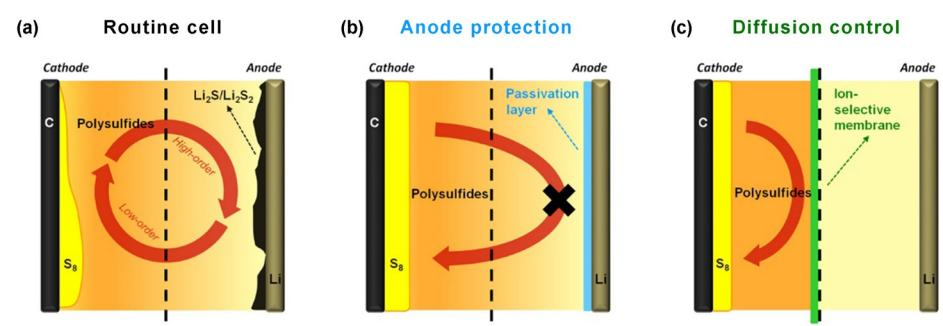
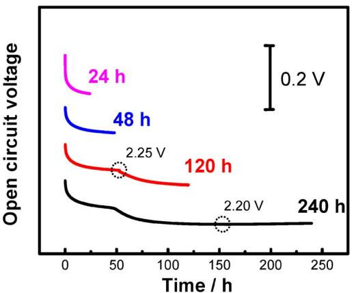
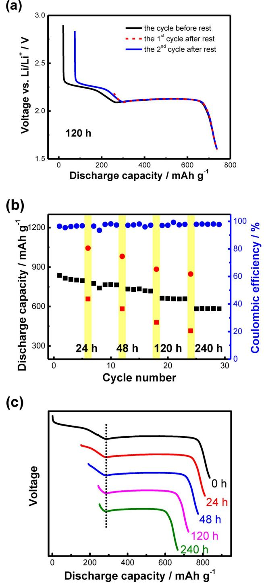
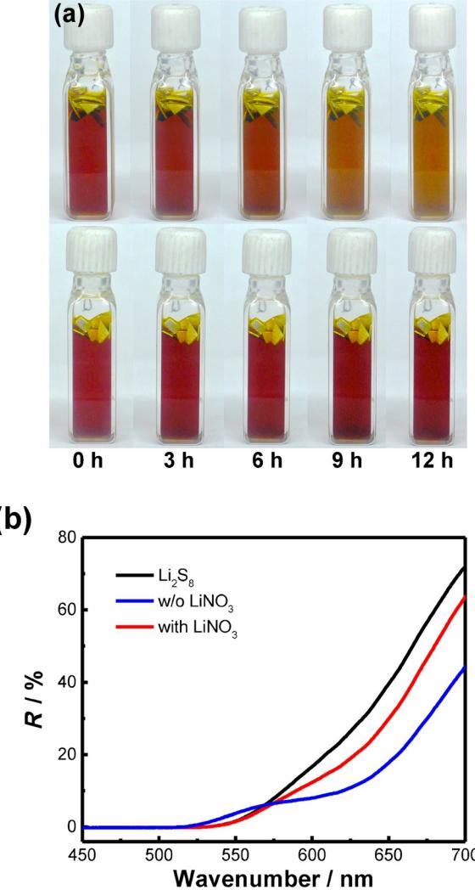
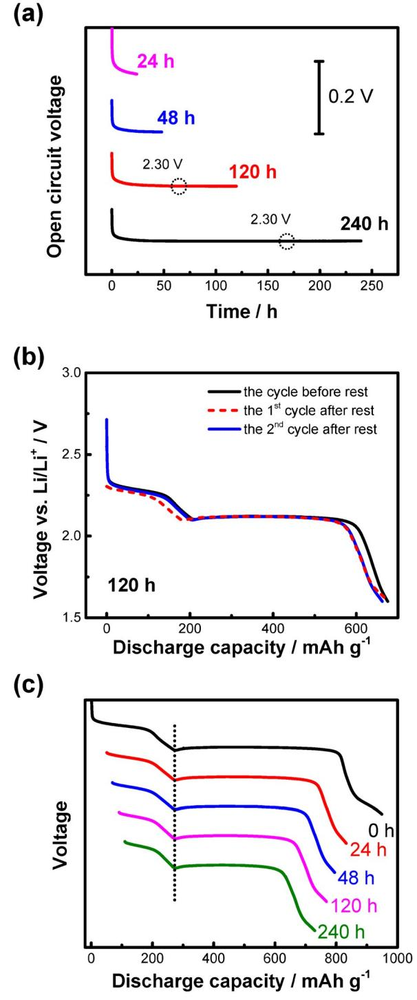
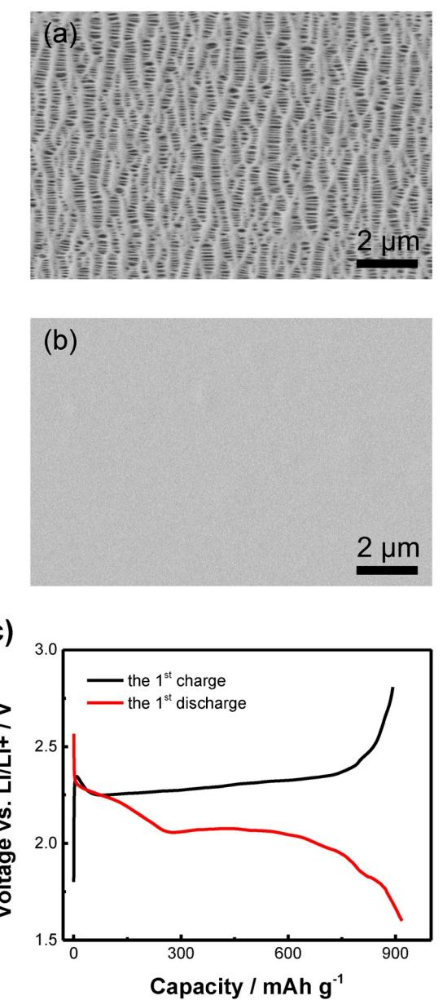
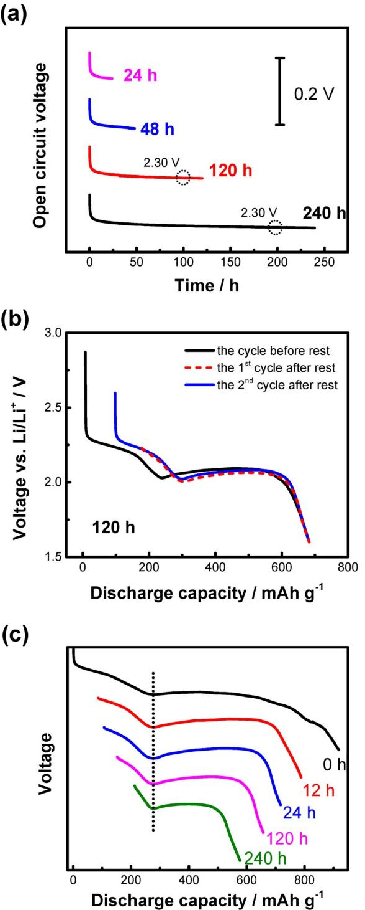
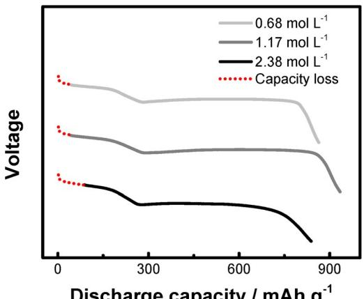
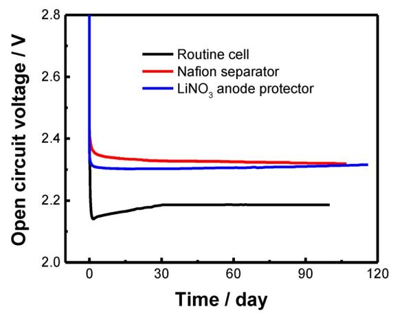

# Towards Stable Lithium–Sulfur Batteries with a Low Self-Discharge Rate: Ion Diffusion Modulation and Anode Protection

Wen-Tao Xu, Hong-Jie Peng, Jia-Qi Huang,\* Chen-Zi Zhao, Xin-Bing Cheng, and Qiang Zhang\*[a]

The self-discharge of a lithium–sulfur cell decreases the shelflife of the battery and is one of the bottlenecks that hinders its practical applications. New insights into both the internal chemical reactions in a lithium–sulfur system and effective routes to retard self-discharge for highly stable batteries are crucial for the design of lithium–sulfur cells. Herein, a lithium– sulfur cell with a carbon nanotube/sulfur cathode and lithiummetal anode in lithium bis(trifluoromethanesulfonyl)imide/1,3 dioxolane/dimethyl ether electrolyte was selected as the model system to investigate the self-discharge behavior. Both lithium anode passivation and polysulfide anion diffusion suppression strategies are applied to reduce self-discharge of the lithium–sulfur cell. When the lithium-metal anode is protected by a high density passivation layer induced by LiNO3 , a very low shuttle constant of 0.017 h ¢1 is achieved. The diffusion of the polysulfides is retarded by an ion-selective separator, and the shuttle constants decreased. The cell with LiNO3 additive maintained a discharge capacity of 97% (961 mAhg ¢1 ) of the initial capacity after 120 days at open circuit, which was around three times higher than the routine cell (32% of initial capacity, corresponding to 320 mAhg ¢1 ). It is expected that lithium–sulfur batteries with ultralow self-discharge rates may be fabricated through a combination of anode passivation and polysulfide shuttle control, as well as optimization of the lithium–sulfur cell configuration.

## Introduction

High-energy-density batteries are of increasing demand to meet the requirements in highly developed applications, such as electric vehicles and personal electronics. The lithium–sulfur battery is considered to be one of the most promising candidates[1–3] because of its high theoretical specific energy density of 2600 Whkg¢1 , high specific capacity as a cathode material, and the low cost of elemental sulfur and its nontoxicity. However, several challenges, including unsatisfying practical capacity, poor cycling life span, low efficiency, and severe self-discharge, remain before the broad application of lithium–sulfur batteries is possible. These problems are closely related to the unique chemistry and transport behavior of soluble high-order polysulfides generated during the electrochemical process.

To date, most research on lithium–sulfur batteries has focused on improving the capacity and efficiency of the batteries, such as trapping sulfur into porous carbon frameworks[3,4]

| [a] W.-T. Xu, H.-J. Peng, Prof. Dr. J.-Q. Huang, C.-Z. Zhao, X.-B. Cheng,                                          |
|--------------------------------------------------------------------------------------------------------------------|
| Prof. Dr. Q. Zhang                                                                                                 |
| Beijing Key Laboratory of Green Chemical Reaction                                                                  |
| Engineering and Technology, Department of Chemical                                                                 |
| Engineering & Department of Chemistry, Tsinghua University                                                         |
| Beijing 100084 (P.R. China)                                                                                        |
| E-mail: jqhuang@tsinghua.edu.cn                                                                                    |
| zhang-qiang@mails.tsinghua.edu.cn                                                                                  |
| Supporting Information for this article is available on the WWW under http://dx.doi.org/10.1002/cssc.201500428. |
|                                                                                                                    |
| This publication is part of a Special Issue on the "Future Energy" confer                                          |

ence in Sydney, Australia. To view the complete issue, visit: <http://onlinelibrary.wiley.com/doi/10.1002/cssc.v8.17/issuetoc>. or a conductive polymer structure,[5, 6] the use of ionic selective or sulfur-recyclable membranes,[7,8] and modifying the composition of the electrolyte.[9–12] Great achievements have been made to obtain a practical cathode with an areal sulfur loading of more than 4.0 mg cm¢2 with high sulfur utilization and extraordinary stability.[13] Some prototypes of lithium–sulfur batteries have also been reported towards practical applications.[1, 6,14] However, except for on-service performance, capacity retention in the static state is another crucial aspect for the practical applications of secondary batteries. As a practical rechargeable battery, the lithium–sulfur cells would not always be in the working state because fully charged batteries would often be shelved for delivery or service. Therefore, the internal chemical redox reaction in a lithium–sulfur cell, which reduces the remaining capacity without any power output to the external circuit, needs to be considered. This phenomenon, generally defined as self-discharge, decreases the shelf-life of lithium– sulfur cells and induces an initial loss of charge capacity. It is expected that understanding the internal chemical reactions in a lithium–sulfur cell and exploring an effective route to retard self-discharge will lead to highly stable batteries.

The self-discharge behavior depends on the battery chemistry, electrode composition, current collector, electrolyte formulation, and storage temperature.[6, 10–12,15–17] In a lithium–sulfur cell, both corrosion of the current collector by an electrolyte and shuttling of intermediate polysulfides contribute to selfdischarge. Mikhaylik and Akridge proposed a mathematic model to correlate self-discharge to polysulfide shuttle phe-

nomena and defined the self-discharge constant ks . [18] Replacing routine current collectors, such as aluminum foil or stainless steel, with more electrochemically resistive materials is one explored route. When stainless steel was employed as the current collector, the open-circuit voltage dropped from 2.5 to 2.2 V and the discharge capacity decreased to 72% of the original capacity after 30 days of storage.[16] Chung and Manthiram found that the sulfur–nickel

Scheme 1. Schematic illustration of a) self-discharge in routine lithium–sulfur cells induced by an internal redox cycle, along with inhibition of self-discharge by b) anode protection from attack by polysulfides, and c) diffusion control of polysulfides through an ion-selective membrane.

foam cathodes reduced self-discharge and retained 85% of the original capacities after a two-month waiting period. [19] On the other hand, efforts were also devoted to determine how the electrolytes of lithium–sulfur cell impact the self-discharge behavior. When tetraethylene glycol dimethyl ether was applied as the electrolyte, the self-discharge rate of a lithium–sulfur cell with an aluminum current collector reported by Ahn and co-workers was 34% during the initial 80 days, but only 36% after 360 days of storage.[17] A modified electrolyte containing LiNO3 offered a low self-discharge rate of 3.1% for a sulfur/ polypyrrole cathode.[20] Recently, Wang and co-workers[10] reported a series of fluorinated ether electrolytes to address the self-discharge issue. For example, 1,1,2,2-tetrafluoroethyl-2,2,3,3-tetrafluoropropyl ether was incorporated into a routine 1,3-dioxolane (DOL) electrolyte system to efficiently suppress the deleterious shuttling effect and effectively eliminate the self-discharge of the lithium–sulfur battery. [11,12] Another cosolvent of bis(2,2,2-trifluoroethyl) ether combined with LiNO3 additive could decrease self-discharge at an elevated temperature of 45 8C.[10] However, a general concept to eliminate self-discharge in lithium–sulfur systems has rarely been proposed, especially for a detailed understanding of the self-discharge process with emerging cathode and anode materials for novel lithium–sulfur cell configurations.

For a lithium–sulfur cell with liquid electrolyte, the dissolution of polysulfides is thermodynamically inevitable during charge/discharge. Thus, in essence, self-discharge in lithium– sulfur batteries can be ascribed not only to the corrosion of current collectors and decomposition of electrolytes, as in typical lithium-ion batteries, but also to the transport of soluble polysulfide intermediates through porous separators and its irreversible reaction with lithium anode. Due to the solubility, mobility, and high reactivity of polysulfides, the shuttle of polysulfides and their irreversible reaction with the anode might be the dominate factor in a lithium–sulfur cell.

Herein, we investigated the self-discharge behavior of a carbon nanotube (CNT)-based lithium–sulfur cell. The suppression of self-discharge was explored through two routes: 1) anode protection from attack by polysulfides, and 2) diffusion control of mobile polysulfides (Scheme 1). LiNO3 was employed to passivate the surface of the lithium-metal anode and to prevent the direct exposure of fresh lithium to polysulfides, whereas the Nafion-coated separator was chosen as a cationselective membrane to suppress the diffusion of polysulfide anions to the anodic chamber. The self-discharge constant was lowered by nearly four times compared with that of normal cells; this was attributed to higher resistance for diffusion and the parasitic reaction of polysulfides.

Full Papers

### Results

#### Self-discharge behavior of routine lithium–sulfur batteries

A lithium–sulfur cell with CNT/sulfur cathode and lithium-metal anode was selected as a model system to investigate the typical self-discharge behavior of a lithium–sulfur cell. A routine mixed solvent electrolyte of DOL and dimethyl ether (DME; v/v=1:1) containing 1.0 mol L ¢1 lithium bis(trifluoromethanesulfonyl)imide (LiTFSI) was employed. The reason why we selected CNT/S cathode arose from the feasibility of the largescale production of CNTs, and the high sulfur utilization performance of CNT scaffolds in lithium–sulfur cells.[21]

To probe the self-discharge behavior, a lithium–sulfur coin cell with a sulfur loading of 0.43 mg and a high amount of electrolyte (20 mL) was employed. These were not the best cell parameters for a high-energy-density lithium–sulfur cell. The commonly understood "shuttle" of polysulfides was deliberately intensified herein to investigate the self-discharge behavior. The model system was chosen to clearly reveal the self-discharge behavior in a distinguishable scan. The lithium–sulfur coin cell was charged to its full state (galvanostatic charge to 2.8 V) and rested for 24–240 h before discharge. A voltage window of 1.6–2.8 V was applied. Five cycles were carried out before the collection of self-discharge profiles at different rest durations to imitate conditions of working cells. After charging to 2.8 V after 5 cycles, the open-circuit voltage was monitored during resting (Figure 1). The voltage monotonously decreased with prolonged rest time before 50 h. Within 48 h of rest, the open-circuit voltage dropped to 2.25 V, which corresponded to the voltage of electrochemical conversion of solid S8 into liquid Li2S8 . When the rest time was 120 h, the initial loss within 50 h was very similar to the profile collected with a rest time of 48 h. However, a rapid voltage loss from 2.25 to 2.20 V could be observed within 50–70 h. After 70 h, the open-circuit

Figure 1. In situ monitoring of the open-circuit voltage during open circuits of 24, 48, 120, and 240 h to describe the self-discharge behavior of routine lithium–sulfur cells with LiTFSI–DOL/DME electrolyte.

voltage became very stable at 2.20 V. Such a long rest time open-circuit voltage profile illustrated a plateau–slope–plateau evolution that was similar to the routine discharge curve of a lithium–sulfur cell at constant current density. [21] The first plateau of Li2S8 conversion from S8 ended during the first 50 h of the self-discharge process. However, the slope of Li2S8 to Li2S4 was only partially lost and the second voltage plateau of the steady open-circuit voltage (2.20 V) did not directly correspond to the second plateau of Li2S4 to Li2S/Li2S2 in a routine discharge curve (2.15 V). Moreover, there was a small rise of 5 mV. These differences in plateau voltage indicated an internally balanced self-discharge stage of the cell.

Galvanostatic discharge was conducted at a current density of 0.2 C after the rest period. For instance, the red dashed line in Figure 2 a shows galvanostatic discharge after 120 h at rest. The discharge curves before the rest period (black line) and the second discharge curve after resting (blue line) are also listed in Figure 2 a and indicate redox behavior. The second plateau of Li2S4 conversion into Li2S1/2 at 2.10 V was the main contribution to the discharge capacity after self-discharge; a tiny slope from 2.18 to 2.10 V was also detected. The slope that mainly contributed to the partial conversion of Li2S8 into Li2S4 occupied 4% of the capacity after 120 h of rest. In contrast, the blue line in Figure 2 a for the 2nd discharge curve after the rest period clearly showed both the first complete plateau of S8 conversion into Li2S8 at 2.30 V and the slope of Li2S8 conversion into Li2S4 from 2.30 to 2.10 V. The slope and second plateau of the red and blue lines in Figure 2 a almost overlapped, whereas the discharge profile before rest (black line) exhibited a longer second plateau. This indicated an irreversible discharge capacity loss of about 20 mAhg ¢1 during the 120 h rest period. The capacity contributed to by the conversion of S8 into Li2S8 and Li2S8 into Li2S4 can be almost recovered; however, the loss of the second plateau was significant. Such phenomena were also observed for cells with 24, 48, and 240 h rest periods (Figure S1 a–c in the Supporting Information). The discharge profiles of the lithium–sulfur cells started at the midpoint or end of the first plateau after 24 or 48 h at open circuit, which fitted well with the open-circuit voltage

Figure 2. Self-discharge behavior of routine lithium–sulfur cells with LiTFSI– DOL/DME electrolyte. a) The galvanostatic discharge curves of the cycle before self-discharge, and the 1st and 2nd cycles after 120 h of self-discharge. b) Cycling performance with intermittent open circuit. c) Galvanostatic discharge profiles of cycles after different open-circuit durations.

profiles shown in Figure 1. For 240 h of self-discharge, the starting point was close to that obtained for the results at 120 h, which reflected an almost-stable state of the cell. Because the related onset point is at the midpoint of the slope, the self-discharged products were expected to be a mixture of

Li2S4 and Li2S5 . It can be observed that the blue line is shorter than the black line, although they have similar shape (Figure S1 c in the Supporting Information). The difference between the two lines reflected irreversible capacity loss during the rest period, which was severer than the irreversible capacity loss between normal cycles. Owing to the low sulfur loading and large amount of electrolyte, active sulfur cathode may dissolve into the electrolyte and diffuse into the dead space of a coin cell. This process was closely correlated to the diffusion duration of soluble sulfur compounds. Therefore, larger capacity loss was observed after 120 h of rest than that during routine discharge processes. The decay of the discharge capacity was induced by both the irreversible deposition of sulfur-containing compounds and the decomposition of electrolyte during cycling.[10] When the cell was under open-circuit conditions, a large capacity decay was detected (Figure 2 b), which was contributed to from both routine decay and decay at the static state induced by self-discharge. To quantitatively describe the contribution of decay induced by self-discharge, the self-discharge ratio was defined herein as the ratio of capacity loss and the discharge capacity of the next cycle. The ratios were 17.3, 23.6, 33.1, and 36.8% when the open-circuit intervals were 24, 48, 120, and 240 h, respectively; these values corresponded to coulombic efficiencies of 80.5, 74.6, 65.2, and 61.8%.

Figure 2 c described the discharge profiles after different open-circuit durations. The discharge profiles can be divided into two parts by the lowest point of the slope section, which corresponds to a transition from liquid-to-liquid (Li2S8 to Li2S4 ) to liquid-to-solid conversion (Li2S4 to Li2S/Li2S2 ). The ratio of the second (Qlow) and first parts (Qhigh) was calculated to be 1.9 for the discharge curve with no rest period (0 h). The ratios of Qlow and Qhigh were 3.9, 5.1, 10.2, and 10.4 for the cycles after rest periods of 24, 48, 120, and 240 h, respectively. The increasing ratio reflected the significant capacity loss during the first part (first plateau and slope), that is, the conversion from solid S8 to high-order polysulfides (Li2Sx ; x=4–8). The loss of the second plateau was mainly ascribed to irreversible decay during cycling. In contrast, the charge profiles shown in Figure S1d in the Supporting Information exhibited similar trends, but with different decay capacities.

As indicated above, self-discharge in routine lithium–sulfur systems mainly arose from the loss of high-order polysulfides. Tremendous efforts have proved that the dominant route of polysulfide loss during electrochemical charge/discharge was the spontaneous reaction between lithium metal and polysulfides. Analogous to the on-service loss mechanism of polysulfides, dissolved polysulfides tend to react with unprotected lithium metal and be continuously consumed in the static state, which results in severe self-discharge. This undesirable process involved two individual steps: the first step involved polysulfides generated at the cathode side that diffused through the porous separator, as driven by the concentration gradient, whereas the second step was the spontaneous reaction of polysulfides with the lithium anode. Therefore, self-discharge induced by polysulfide loss from the reaction with lithium can be inhibited by 1) protecting the lithium anode from direct side reactions with polysulfides, and 2) blocking the diffusion of polysulfides to the anode side. A robust passivation layer[22] and high-density ion-selective membrane to block the anions [7, 23,24] were thereby proposed for diffusion control and anode protection, respectively.

#### Low self-discharge rate through anode protection

LiNO3 was commonly applied as an electrolyte additive to protect the anode and improve the efficiency of lithium–sulfur batteries during discharge/charge; [22] this was also expected to be efficient at preventing self-discharge by blocking the reaction pathway between the lithium anode and high-order polysulfides. To prove this concept, lithium-metal foils were added to electrolyte with 0.0125 mol L ¢1 Li2S8 (0.1 mol L ¢1 sulfur) and 0.2 mol L ¢1 LiNO3 to demonstrate the concept of anode protection. In comparison, lithium-metal foils were added to Li2S8 electrolyte at the same concentration, but without LiNO3 additive, to simulate the self-discharge phenomenon in a routine lithium–sulfur cell. As shown in Figure 3 a, the metallic luster of the metal foil faded rapidly after being added to both electrolytes, which indicated the formation of the solid–electrolyte interphase (SEI) on the surface of the metal. There was no clear change of color in the electrolyte with LiNO3 additive within 12 h, whereas the electrolyte without LiNO3 changed from red–brown to yellow–brown in 12 h (Figure 3 a). UV/Vis spectroscopic analysis was used to probe the evolution of two electrolytes with the introduction of fresh lithium foil after different intervals (Figure 3 b). The initial change in shape and loss of absorbance were related to the formation of the SEI, which accounted for the loss of a tiny amount of polysulfides. More importantly, the shift of the wavelength to a smaller wavenumber depended on the nominal compositions of various polysulfides (Figure S2 in the Supporting Information). There were few changes to the wavelength for LiNO3 -containing electrolytes, which indicated that Li2S8 was the main stoichiometric composition of the polysulfides. For the LiNO3 -free electrolytes, a nominal mixture of Li2S4 and Li2S5 was obtained after 12 h of soaking. The above spectroscopic results further confirmed that the self-discharge in lithium–sulfur systems corresponded to the diffusion of polysulfides and their reaction with lithium metal.

The open-circuit voltage of a lithium–sulfur cell with LiNO3– LiTFSI–DOL/DME electrolyte was recorded in situ (Figure 4 a). The open-circuit voltage profiles of the cell dropped quickly in the initial 1 min and then stabilized at 2.30 V. Even with a prolonged rest period, the voltage was still 2.30 V, which was much higher than that for the cell without LiNO3 (Figure 1). The drop in voltage can be observed on the galvanostatic discharge profile as the lack of the initial part (about 25 mAhg ¢1 ) of the first plateau (Figure 4 b). However, there was almost no loss of overall discharge capacity after the open-circuit state, and the coulombic efficiency was almost 100%. Such phenomena were also observed with self-discharge times of 24, 48, and 240 h (Figure S3 a–c in the Supporting Information). The capacity loss at the beginning of the first plateau was induced by the chemical reaction between solid S8 and residual polysulfides in solution that could not be electrochemically fully

Figure 3. Lithium-metal anode protection through the addition of LiNO3 additive. a) Photographs of Li2S8 electrolyte without (above) and with (below) LiNO3 additive during 12 h of reaction with lithium foil. b) The corresponding UV/Vis spectra of the electrolytes after 12 h of reaction.

charged back to S8 . The reason for this was ascribed to the poor stability of Li2S8 in DME-based electrolyte, as discussed previously. [25] However, this capacity loss can be completely compensated for by the additional capacity of the "tail" after the second plateau and slope. Because the lithium anode was fully protected by the stable SEI decomposed from the LiNO3 containing electrolyte,[22] polysulfides in the electrolyte could not be further reduced to low-order polysulfides by reacting with metallic lithium. Thus, these polysulfides remaining in the electrolyte can only be electrochemically reduced at the surface of the cathode to relieve external current. Consequently, when the lithium anode was passivated, the internal chemical redox reaction was retarded, which was favorable for negligible self-discharge and reduced capacity loss. The results in Figure 4 c describe the discharge curve of the first and self-discharge cycles. The ratios of Qlow/Qhigh were 2.48, 2.51, 2.67, and 2.74 when the open-circuit intervals were 24, 48, 120, and 240 h, respectively. The minor increase in the Qlow/Qhigh ratios Full Papers

Figure 4. Self-discharge behavior of lithium–sulfur cells with LiNO3 -containing electrolyte. a) The open-circuit voltage after different self-discharge times. b) Galvanostatic discharge curves of the cycle before the rest period, and discharge curves for the 1st and 2nd cycles after 120 h of self-discharge. c) Galvanostatic discharge profiles of cycles after different open-circuit times.

indicated that the reaction between sulfur and remaining loworder polysulfides was tiny compared with that of routine cells (Figure 2 c). There were almost no changes to the shape of the charge profiles with different open-circuit periods (Figure S3d in the Supporting Information).

#### Low self-discharge rate through ion diffusion control

In addition to the strategy of directly preventing reactions between high-order polysulfides and the lithium anode by forming an interfacial passivation layer on the anodes, suppressing the diffusion of polysulfide anions to the anode side was expected to be another promising route to reduce self-discharge. In a working lithium–sulfur cell, the routine shuttle of polysulfides is highly dependent on not only the "sulfiphilic" affinity and porous structures of the cathode,[26] but also on the ion channels in the porous separators.[9,27] To prevent the diffusion of polysulfide anions and provide high coulombic efficiency, a cation-selective Nafion membrane with SO3 ¢ groups coating the channels was employed. [7] As compared in Figure 5 a and

Figure 5. Lithium–sulfur cells with Nafion separators. SEM images of a) a routine separator and b) a Nafion separator. c) Galvanostatic charge and discharge curves of the first cycle.

b, a uniform and dense Nafion layer is coated onto the top surface of the porous Celgard 2400 separator to form an ion-selective membrane. With the cation-permselective properties of the Nafion coating layer, the diffusion of polysulfide anions across the membrane is blocked. The coulombic efficiency became almost 100% with reversible charge/discharge as conventional sulfur redox (Figure 5 c), which was much higher than that of routine cells with low coulombic efficiencies of about 90%.

We also monitored the open-circuit voltage of a lithium– sulfur cell with a Nafion separator. The voltage was well maintained at 2.30 V when the self-discharge time was more than 1 h (Figure 6 a). No slope or second plateau was observed, which indicated that the starting point of the discharge profile was maintained on the first voltage plateau. Compared with the cell with an anode passivated by LiNO3 , the capacity loss of the initial stage of the first voltage plateau was severer (Figure 6 b). With the Nafion separator suppressing diffusion, polysulfides were constrained on the cathode side and such a large quantity of polysulfides with higher local concentration would chemically consume more solid S8 than that in the case of the LiNO3 -passivated anode (Scheme 1). Solid S8 chemically reacted with soluble polysulfide carriers turned out to be electrochemically "reactivated" in subsequent cycles, as indicated by the increased capacity (Figure S4 in the Supporting Information). "Dissolved" S8 is not electrochemically reduced immediately, as in the case of LiNO3 -modified electrolyte, which mainly related to slow kinetics being restrained by the high-viscosity electrolyte in the cathodic chamber, which accumulated a high concentration of polysulfides and induced high polarization. However, there was still much less capacity loss than that in routine cells, as indicated by the discharge profile starting at the midpoint of the first plateau after 120 h of self-discharge. Even after 240 h of self-discharge, the curve still started at the first plateau (Figure S5 in the Supporting Information), which was consistent with the open-circuit voltage profiles shown in Figure 6 a. The discharge curve after self-discharge (red dashed line in Figure 6 b) was a bit lower (about 15 mV) than that in the next cycle. Such phenomena were also observed in other cycles (Figure S5 a–c in the Supporting Information), which indicated strong polarization after self-discharge.

Additional polarization disappeared after subsequent cycles, which was in good accordance with the increase in capacity. As discussed above, this phenomenon was ascribed to polysulfides that accumulated around the ion channels during the long resting time, and gradually reduced on the surface of the cathode in subsequent cycles. The coulombic efficiency increased clearly after the introduction of Nafion membrane. The ratios of Qlow and Qhigh were 2.30, 2.67, 2.57, 3.02, and 4.53 for the first cycle and cycles after self-discharge times of 24, 48, 120, and 240 h, respectively (Figure 6 c). These ratios were much lower than the ratios of the routine cell (3.9, 5.1, 10.2, and 10.4 for self-discharge cycles) because of the very low selfdischarge capacity and preservation of the discharge capacity at the first voltage plateau. Meanwhile, such ratios, although higher than the value obtained for anode protection, could be recovered to lower values in subsequent cycles. The results in-

tors. a) The open-circuit voltage after different self-discharge times. b) Galvanostatic discharge curves of the cycle before self-discharge and those for the 1st and 2nd cycles after 120 h of self-discharge. c) Galvanostatic discharge profiles of the cycles after different open-circuit times.

dicated that Nafion separators (representing ion-selective membrane strategy) were effective in suppressing cross-membrane diffusion of polysulfide and in reducing the self-discharge phenomenon in lithium–sulfur cells.

### Discussion

To provide a quantitative understanding of self-discharge, the shuttle constant, ks , proposed by Mikhaylik and Akridge was calculated based on the dependence of the remaining capacity of the high plateau with open-circuit time by Equation (1):[18]

$$
d(\ln Q_{\text{high}})/dt_s = -k_s \tag{1}
$$

in which ks is the shuttle constant, Qhigh is the remaining capacity of the high plateau, and ts is the time at open circuit. Preventing self-discharge mainly lay on suppression of the polysulfide shuttle at the static state. The amount of polysulfides shuttling between the cathode and anode highly depends on the ratio of electrolyte to sulfur. The ratio was defined as the total sulfur concentration in the electrolyte added to a coin cell. As shown in Figure 7, ratios of discharge capacity loss of

Figure 7. Self-discharge behavior of lithium–sulfur cells with different sulfur/ electrolyte ratios.

18.1, 18.9, and 32.9% were obtained for routine lithium–sulfur cells with a sulfur concentration of 0.68, 1.17, and 2.38 mol L ¢1 , respectively, all of which underwent 2 h of rest. Therefore, the shuttle constants based on Mikhaylik and Akridge's self-discharge method were calculated to be 0.114, 0.122, and 0.218 h ¢1 for cells with different total sulfur concentrations of 0.68, 1.17, and 2.38 mol L ¢1 (Table 1). This result was consistent with previous work proposed by Mikhaylik and Akridge.[18] With the addition of electrolyte to a cell that corresponds to a low sulfur concentration, residual polysulfides become less. Figure 6. Self-discharge behavior of lithium–sulfur cells with Nafion separa-

| Table 1. The shuttle constant, ks , derived from the self-discharge profile. |                           |                                                    |                |  |
|---------------------------------------------------------------------------------|---------------------------|----------------------------------------------------|----------------|--|
| Total sulfur concentration [mol L ¢1 ]                                 | [h¢1 ks normal cell | ] calculated by self-discharge Nafion separator | LiNO3          |  |
| 0.68 1.17                                                                    | 0.114 0.122            | 0.040 0.039                                     | 0.017 0.013 |  |
| 2.38                                                                            | 0.218                     | 0.047                                              | 0.012          |  |

Multielectron chemistry renders the lithium–sulfur system with a very high theoretical energy density; however, many intermediates (e.g., polysulfides of Li2S8 , Li2S6 , and Li2S4 ) are produced in a cell during cycling. The shuttle effect is attributed to the diffusion and reaction of polysulfides: high-order polysulfides diffuse through the separator, react with the lithium anode to form low-order polysulfides, shuttle back to the cathode side, and are then electrochemically reoxidized into highorder polysulfides. [18,27,28] The shuttle cycle is preferred at a low charge current. Even when the voltage reached 2.8 V during charging, polysulfides remained in the electrolyte due to the poor stability of Li2S8 . [25] The residual low-order polysulfides can be chemically oxidized by S8 as cathode materials. Therefore, part of solid S8 was "dissolved" to form Li2S8 . The degradation of Li2S8 relies on its concentration gradient in the electrolyte. Some Li2S8 diffuses into the anode side to react with lithium metal and form low-order polysulfides. If this path was not blocked, then low-order polysulfides would continue to diffuse back to the cathode side and form more polysulfides. On the other hand, the amount of polysulfides increased exponentially with the reduction of S8. This process is self-accelerated, even with a limited amount of remaining polysulfides. The overall effect is that solid S8 on the cathode side is carried to and precipitated on the surface of the anode with the assistance of polysulfide "carriers" through an internal redox cycle of high-/ low-order polysulfides. Therefore, the available capacity is lost as the active mass is lost; this is referred to as self-discharge. When S8 is eventually exhausted, self-discharge is terminated as all sulfur is converted into 1) low-order polysulfides, such as Li2S5 remaining in the electrolyte, the discharge profile of which starts at the midpoint of the slope; and 2) solid precipitate, such as Li2S/Li2S2 on the surface of the anode, which is electrochemically inactive. This induced a rapid capacity loss at the initial stage with a high self-discharge rate, followed by a slow capacity loss with a very low self-discharge rate in routine lithium–sulfur cells, which is consistent with other reports.[17]

In sharp contrast to routine cells, very low shuttle constants of 0.017, 0.013, and 0.012 h ¢1 were obtained when LiNO3 electrolyte additive was introduced into a lithium–sulfur cell. The formidable decrease in the shuttle constant upon adopting LiNO3 additives validated the significance of anode protection because it was the most direct way to block access of polysulfides to highly reactive lithium. For diffusion control by employing Nafion separators, the shuttle constant calculated by the self-discharge data was 0.040, 0.039, and 0.047 h ¢1 for lithium–sulfur cells with a total sulfur concentration of 0.68, 1.17, and 2.38 mol L ¢1 , respectively.Asimple comparison to anode protection by LiNO3 plausibly indicated that anode protection seemed to be superior to diffusion control. However, with the dynamic change and renovation of SEI films composed of decomposed LiNO3 , LiNO3 suffered from continuous consumption and eventual exhaustion, especially when a high sulfur loading was applied for practical applications. Therefore, a chemically stable ion-selective membrane might be more reliable for long-term duration. The long cycle stability of cells with a Nafion separator was superior to that of routine cells and a low decay rate of 0.08% per cycle was achieved.[7] The problem with the Nafion separator appeared to be high polarization induced by accumulated polysulfides at the electrolyte/ separator interface and additional resistance of lithium ions. Thus, the effectiveness of diffusion control might be hindered by the limitation of the tests because the capacity loss was not recovered in the cycle after self-discharge, but following several cycles (Figure S4 in the Supporting Information).

Figure 8 shows the open-circuit voltage profile of cells during a 120 day rest period. The routine cell lost capacity of

Figure 8. Voltage profiles of lithium–sulfur cells during open circuit for 120 days.

the first plateau quickly in the initial two days and was stable in a fully self-discharged state. In comparison, cells with LiNO3 additive and Nafion membrane maintained their open-circuit voltages of 2.3 V during the 120 days at open circuit. The cell with LiNO3 additive still maintained a discharge capacity of 97% (961 mAhg ¢1 ) of the initial capacity after 120 days at open circuit. This value is around three times higher than that of the routine cell (32% initial capacity, corresponding to 320 mAhg ¢1 ). Future progress on suppressing self-discharge might be realized based on the following concepts: 1) more robust and protective SEI films on the lithium anode constructed from novel electrolyte additives beyond nitrites[10,12] or direct coating of artificial resistive layers; [10,12, 29] 2) separators with ion selectivity, but with a higher permeability of lithium ions[24] to lower the polarization and kinetic limitations; [24] and 3) a wise combination of anode protection and polysulfide shuttle controls, as well as optimization of the lithium–sulfur cell configuration.[7,8,23,24,30]

### Conclusions

A lithium–sulfur cell with a CNT/sulfur cathode and lithiummetal anode in LiTFSI–DOL/DME electrolyte was selected as the model system to demonstrate self-discharge behavior. The open-circuit voltage of a routine lithium–sulfur cell presented a plateau–slope–plateau structure similar to the routine galvanostatic discharge curve of a lithium–sulfur cell. The ratios of

discharge capacity loss were 17.3, 23.6, 33.1, and 36.8% when the open-circuit intervals were 24, 48, 120, and 240 h, respectively. The self-discharge process corresponded to the spontaneous reaction between the sulfur cathode and lithium anode within a cell at open circuit. With an increase in sulfur/electrolyte ratio from 0.68 to 1.17 and 2.38 mol L ¢1 , the shuttle constants increased from 0.114 to 0.122 and 0.218 h ¢1 . Diffusion of the polysulfides was retarded by an ion-selective separator, and the shuttle constants decreased from 0.040, 0.039, to 0.047 h ¢1 . When the lithium-metal anode was protected by a high-density passivation layer, the internal chemical reactions in a cell were expected to be reduced and very low shuttle constants of 0.017, 0.013, and 0.012 h ¢1 were obtained when the sulfur/electrolyte ratios were 0.68, 1.17, and 2.38 mol L ¢1 , respectively. After 120 days at open circuit, the cell with LiNO3 additive maintained 97% of the initial discharge capacity of 961 mAhg ¢1 and cell voltages of 2.25 and 2.14 V for the first and second plateaus, respectively. This work shed light on understanding the self-discharge mechanism. It is anticipated that with the rational design and careful combination of anode protection and polysulfide shuttle control strategies, as well as optimization of the lithium–sulfur cell configuration, lithium– sulfur cells with ultralow self-discharge rates may be realized.

### Experimental Section

#### Preparation of electrolytes and Nafion membrane

LiNO3 electrolyte was prepared by adding 0.2 mol L ¢1 anhydrous lithium nitrate to a mixture of DOL and DME (v/v=1:1) containing 1.0 mol L ¢1 LiTFSI. Polysulfide electrolytes were prepared by stoichiometrically adding sulfur and lithium sulfide in a blank electrolyte of 1.0 mol L ¢1 LiTFSI dissolved in DOL/DME (v/v=1:1) to form Li2S4–Li2S8 electrolyte. The molar concentration of sulfur was fixed at 0.1 mol L ¢1 in each polysulfide electrolyte. The Nafion membranes were prepared by blade coating Nafion solution (30 mL; 5% w/w, purchased from Alfa Aesar) on Celgard 2400 membrane disks with a diameter of 16.0 mm and then dried in air for 12.0 h.

#### Electrochemical measurements

CNT/S composite with a sulfur content of 70 wt% was prepared by a conventional melting–diffusion strategy and mixed with poly(vinylidene fluoride) (PVDF) binder in N-methylpyrrolidone in a mass ratio of CNT/S–PVDF=90:10 to form the cathode slurry after magnetic stirring for 12.0 h. The slurry was blade coated onto an aluminum current collector with an areal sulfur loading of 0.8– 3.2 mgcm¢2 and dried at 608C for 6.0 h. Then the foil was punched into disks. A standard 2025-type cell was assembled with a CNT/S cathode, lithium foil as the anode, electrolyte (20.0 mL), and a separator. The assembling process was conducted in an argon-filled glove box with water and an oxygen content below 1.0 ppm. The coin cells were tested at 25 8C in galvanostatic mode with a current density of 0.2 C and a voltage range of 1.6–2.8 V by using a Neware multichannel battery cycler. An open circuit was introduced at the end of every five cycles. Open-circuit times of 24, 48, 120, and 240 h were chosen as the cycle number increased.

#### UV/Vis spectroscopic analysis of polysulfide electrolytes

Polysulfide electrolytes containing Li2S4–Li2S8 were sealed in a quartz cuvette in an argon-filled glove box to obtain standard UV/Vis spectra of polysulfides. Lithium-metal foil was cut into pieces and sealed in two quartz cuvettes with LiNO3 and normal electrolytes, both contained 0.0125 mol L ¢1 Li2S8 (0.1 mol L ¢1 sulfur). The UV/vis spectra of each sample was recorded every hour to track the self-discharge process.

### Acknowledgements

This work was supported by the Natural Scientific Foundation of China (21306103 and 21422604) and Tsinghua University Initiative Scientific Research Program (20141081231 and 2014z22076).

Keywords: carbon · electrochemistry · lithium · nanotubes · sulfur

- [1] a) A. Manthiram, S.-H. Chung, C. Zu, [Adv. Mater.](http://dx.doi.org/10.1002/adma.201405115) 2015, 27, 1980; b) Z. Li, Y. Huang, L. Yuan, Z. Hao, Y. Huang, [Carbon](http://dx.doi.org/10.1016/j.carbon.2015.03.008) 2015, 92, 41; c) Z. Lin, C. D. Liang, J. [Mater. Chem.](http://dx.doi.org/10.1039/C4TA04727C) A 2015, 3, 936.
- [2] a) L. Chen, L. L. Shaw, J. Power [Sources](http://dx.doi.org/10.1016/j.jpowsour.2014.05.111) 2014, 267, 770; b) S. S. Zhang, [J.](http://dx.doi.org/10.1016/j.jpowsour.2012.12.102) [Power Sources](http://dx.doi.org/10.1016/j.jpowsour.2012.12.102) 2013, 231, 153; c) G. Y. Xu, B. Ding, J. Pan, P. Nie, L. F. Shen, X. G. Zhang, J. [Mater. Chem.](http://dx.doi.org/10.1039/C4TA02097A) A 2014, 2, 12662.
- [3] D. W. Wang, Q. C. Zeng, G. M. Zhou, L. C. Yin, F. Li, H. M. Cheng, I. R. Gentle, G. Q. M. Lu, J. [Mater. Chem.](http://dx.doi.org/10.1039/c3ta11045a) A 2013, 1, 9382.
- [4] a) J. L. Wang, L. C. Yin, H. Jia, H. T. Yu, Y. S. He, J. Yang, C. W. Monroe, [ChemSusChem](http://dx.doi.org/10.1002/cssc.201300742) 2014, 7, 563; b) J. W. Kim, J. D. Ocon, D. W. Park, J. Lee, [ChemSusChem](http://dx.doi.org/10.1002/cssc.201300782) 2014, 7, 1265; c) H. J. Peng, J. Q. Huang, M. Q. Zhao, Q. Zhang, X. B. Cheng, X. Y. Liu, W. Z. Qian, F. Wei, [Adv. Funct.](http://dx.doi.org/10.1002/adfm.201303296) Mater. 2014, 24[, 2772](http://dx.doi.org/10.1002/adfm.201303296); d) J. X. Song, T. Xu, M. L. Gordin, P. Y. Zhu, D. P. Lv, Y. B. Jiang, Y. S. Chen, Y. H. Duan, D. H. Wang, Adv. Funct. Mater. 2014, 24[, 1243](http://dx.doi.org/10.1002/adfm.201302631); e) M.-Q. Zhao, M. Sedran, Z. Ling, M. R. Lukatskaya, O. Mashtalir, M. Ghidiu, B. Dyatkin, D. J. Tallman, T. Djenizian, M. W. Barsoum, Y. Gogotsi, [Angew. Chem.](http://dx.doi.org/10.1002/anie.201500110) Int. Ed. 2015, 54, 4810; [Angew. Chem.](http://dx.doi.org/10.1002/ange.201500110) 2015, 127, 4892; f) Q. Li, Z. A. Zhang, Z. P. Guo, Y. Q. Lai, K. Zhang, J. Li, [Carbon](http://dx.doi.org/10.1016/j.carbon.2014.05.047) 2014, 78, [1](http://dx.doi.org/10.1016/j.carbon.2014.05.047);g) L. H. Yu, N. Brun, K. Sakaushi, J. Eckert, M. M. Titirici, [Carbon](http://dx.doi.org/10.1016/j.carbon.2013.05.001) 2013, 61[, 245.](http://dx.doi.org/10.1016/j.carbon.2013.05.001)
- [5] a) F. Wu, J. Z. Chen, L. Li, T. Zhao, Z. Liu, R. J. Chen, [ChemSusChem](http://dx.doi.org/10.1002/cssc.201300260) 2013, 6[, 1438](http://dx.doi.org/10.1002/cssc.201300260); b) J. L. Wang, Y. S. He, J. Yang, [Adv. Mater.](http://dx.doi.org/10.1002/adma.201402569) 2015, 27, 569.
- [6] L. Wang, X. M. He, J. J. Li, J. Gao, M. Fang, G. Y. Tian, J. L. Wang, S. S. Fan, J. Power [Sources](http://dx.doi.org/10.1016/j.jpowsour.2013.02.008) 2013, 239, 623.
- [7] J. Q. Huang, Q. Zhang, H. J. Peng, X. Y. Liu, W. Z. Qian, F. Wei, [Energy En](http://dx.doi.org/10.1039/C3EE42223B)[viron. Sci.](http://dx.doi.org/10.1039/C3EE42223B) 2014, 7, 347.
- [8] a) S. H. Chung, A. Manthiram, Adv. Funct. Mater. 2014, 24[, 5299](http://dx.doi.org/10.1002/adfm.201400845); b) H. Yao, K. Yan, W. Li, G. Zheng, D. Kong, Z. W. Seh, V. K. Narasimhan, Z. Liang, Y. Cui, Energy [Environ.](http://dx.doi.org/10.1039/C4EE01377H) Sci. 2014, 7, 3381.
- [9] L. M. Suo, Y. S. Hu, H. Li, M. Armand, L. Q. Chen, Nat. [Commun.](http://dx.doi.org/10.1038/ncomms2513) 2013, 4, [1481.](http://dx.doi.org/10.1038/ncomms2513)
- [10] M. L. Gordin, F. Dai, S. R. Chen, T. Xu, J. X. Song, D. H. Tang, N. Azimi, Z. C. Zhang, D. H. Wang, ACS Appl. [Mater. Interfaces](http://dx.doi.org/10.1021/am501665s) 2014, 6, 8006.
- [11] N. Azimi, W. Weng, C. Takoudis, Z. C. Zhang, [Electrochem.](http://dx.doi.org/10.1016/j.elecom.2013.10.020) Commun. [2013](http://dx.doi.org/10.1016/j.elecom.2013.10.020), 37, 96.
- [12] N. Azimi, Z. Xue, N. D. Rago, C. Takoudis, M. L. Gordin, J. X. Song, D. H. Wang, Z. C. Zhang, J. Electrochem. Soc. 2015, 162, A64.
- [13] a) G. Zhou, L. Li, C. Ma, S. Wang, Y. Shi, N. Koratkar, W. Ren, F. Li, H.-M. Cheng, Nano [Energy](http://dx.doi.org/10.1016/j.nanoen.2014.11.025) 2015, 11, 356; b) Z. Yuan, H. J. Peng, J. Q. Huang, X. Y. Liu, D. W. Wang, X. B. Cheng, Q. Zhang, [Adv. Funct.](http://dx.doi.org/10.1002/adfm.201401501) Mater. 2014, 24, [6105](http://dx.doi.org/10.1002/adfm.201401501); c) J. Song, M. L. Gordin, T. Xu, S. Chen, Z. Yu, H. Sohn, J. Lu, Y. Ren, Y. Duan, D. Wang, [Angew. Chem.](http://dx.doi.org/10.1002/anie.201411109) Int. Ed. 2015, 54, 4325; [Angew.](http://dx.doi.org/10.1002/ange.201411109) Chem. 2015, 127[, 4399](http://dx.doi.org/10.1002/ange.201411109); d) P. Strubel, S. Thieme, T. Biemelt, A. Helmer, M. Oschatz, J. Bruckner, H. Althues, S. Kaskel, [Adv. Funct.](http://dx.doi.org/10.1002/adfm.201402768) Mater. 2015, 25, [287;](http://dx.doi.org/10.1002/adfm.201402768) e) D. Lv, J. Zheng, Q. Li, X. Xie, S. Ferrara, Z. Nie, L. B. Mehdi, N. D. Browning, J.-G. Zhang, G. L. Graff, J. Liu, J. Xiao, Adv. Energy Mater. 2015, 5, DOI: [10.1002/aenm.201402290](http://dx.doi.org/10.1002/aenm.201402290); f) L. X. Miao, W. K. Wang, K. G. Yuan, Y. S. Yang, A. B. Wang, Chem. [Commun.](http://dx.doi.org/10.1039/C4CC03410D) 2014, 50, 13231.

- [14] a) G. M. Zhou, L. Li, D. W. Wang, X. Y. Shan, S. F. Pei, F. Li, H. M. Cheng, [Adv. Mater.](http://dx.doi.org/10.1002/adma.201404210) 2015, 27, 641; b) G. M. Zhou, S. F. Pei, L. Li, D. W. Wang, S. G. Wang, K. Huang, L. C. Yin, F. Li, H. M. Cheng, Adv. [Mater.](http://dx.doi.org/10.1002/adma.201302877) 2014, 26, 625.
- [15] C. J. Hart, M. Cuisinier, X. Liang, D. Kundu, A. Garsuch, L. F. Nazar, [Chem.](http://dx.doi.org/10.1039/C4CC08980D) [Commun.](http://dx.doi.org/10.1039/C4CC08980D) 2015, 51, 2308.
- [16] H. S. Ryu, H. J. Ahn, K. W. Kim, J. H. Ahn, J. Y. Lee, E. J. Cairns, J. [Power](http://dx.doi.org/10.1016/j.jpowsour.2004.08.039) [Sources](http://dx.doi.org/10.1016/j.jpowsour.2004.08.039) 2005, 140, 365.
- [17] H. S. Ryu, H. J. Ahn, K. W. Kim, J. H. Ahn, K. K. Cho, T. H. Nam, [Electro](http://dx.doi.org/10.1016/j.electacta.2006.01.086)chim. Acta 2006, 52[, 1563](http://dx.doi.org/10.1016/j.electacta.2006.01.086).
- [18] Y. V. Mikhaylik, J. R. Akridge, J. [Electrochem.](http://dx.doi.org/10.1149/1.1806394) Soc. 2004, 151, A1969.
- [19] S. H. Chung, A. Manthiram, [Electrochim. Acta](http://dx.doi.org/10.1016/j.electacta.2013.06.034) 2013, 107, 569.
- [20] M. Kazazi, M. R. Vaezi, A. Kazemzadeh, Ionics 2014, 20[, 1291](http://dx.doi.org/10.1007/s11581-014-1095-2).
- [21] X. B. Cheng, J. Q. Huang, Q. Zhang, H. J. Peng, M. Q. Zhao, F. Wei, [Nano](http://dx.doi.org/10.1016/j.nanoen.2013.12.013) [Energy](http://dx.doi.org/10.1016/j.nanoen.2013.12.013) 2014, 4, 65.
- [22] D. Aurbach, E. Pollak, R. Elazari, G. Salitra, C. S. Kelley, J. Affinito, J. [Elec](http://dx.doi.org/10.1149/1.3148721)[trochem.](http://dx.doi.org/10.1149/1.3148721) Soc. 2009, 156, A694.
- [23] I. Bauer, S. Thieme, J. Bruckner, H. Althues, S. Kaskel, J. Power [Sources](http://dx.doi.org/10.1016/j.jpowsour.2013.11.090) [2014](http://dx.doi.org/10.1016/j.jpowsour.2013.11.090), 251, 417.
- [24] J.-Q. Huang, T.-Z. Zhuang, Q. Zhang, H.-J. Peng, C.-M. Chen, F. Wei, [ACS](http://dx.doi.org/10.1021/nn507178a) Nano 2015, 9[, 3002.](http://dx.doi.org/10.1021/nn507178a)
- [25] J.-J. Chen, R.-M. Yuan, J.-M. Feng, Q. Zhang, J.-X. Huang, G. Fu, M.-S. Zheng, B. Ren, Q.-F. Dong, Chem. [Mater.](http://dx.doi.org/10.1021/cm5044667) 2015, 27, 2048.
- [26] a) S. J. Oh, J. K. Lee, W. Y. Yoon, [ChemSusChem](http://dx.doi.org/10.1002/cssc.201402318) 2014, 7, 2562; b) J. Song, M. J. Choo, H. Noh, J. K. Park, H. T. Kim, [ChemSusChem](http://dx.doi.org/10.1002/cssc.201402789) 2014, 7, 3341; c) H.-J. Peng, T.-Z. Hou, Q. Zhang, J.-Q. Huang, X.-B. Cheng, M.-Q. Guo, Z. Yuan, L.-Y. He, F. Wei, Adv. Mater. Interfaces 2014, 1, 1400227; d) G. Zhou, Y. Zhao, A. Manthiram, Adv. Energy Mater. 2015, 5, 1402263; e) C. Tang, Q. Zhang, M. Q. Zhao, J. Q. Huang, X. B. Cheng, G. L. Tian, H. J. Peng, F. Wei, [Adv. Mater.](http://dx.doi.org/10.1002/adma.201401243) 2014, 26, 6100.
- [27] X. B. Cheng, J. Q. Huang, H. J. Peng, J. Q. Nie, X. Y. Liu, Q. Zhang, F. Wei, J. [Power Sources](http://dx.doi.org/10.1016/j.jpowsour.2013.12.031) 2014, 253, 263.
- [28] a) Y. Diao, K. Xie, S. Z. Xiong, X. B. Hong, J. [Power Sources](http://dx.doi.org/10.1016/j.jpowsour.2013.01.132) 2013, 235, [181;](http://dx.doi.org/10.1016/j.jpowsour.2013.01.132) b) A. F. Hofmann, D. N. Fronczek, W. G. Bessler, J. [Power Sources](http://dx.doi.org/10.1016/j.jpowsour.2014.02.082) [2014](http://dx.doi.org/10.1016/j.jpowsour.2014.02.082), 259, 300.
- [29] G. Ma, Z. Wen, M. Wu, C. Shen, Q. Wang, J. Jin, X. Wu, Chem. [Commun.](http://dx.doi.org/10.1039/C4CC05535G) 2014, 50[, 14209.](http://dx.doi.org/10.1039/C4CC05535G)
- [30] a) S. H. Chung, A. Manthiram, [ChemSusChem](http://dx.doi.org/10.1002/cssc.201301287) 2014, 7, 1655; b) H. Wei, J. Ma, B. A. Li, Y. X. Zuo, D. G. Xia, ACS Appl. [Mater. Interfaces](http://dx.doi.org/10.1021/am505807k) 2014, 6, [20276](http://dx.doi.org/10.1021/am505807k).

Received: March 26, 2015 Published online on June 16, 2015