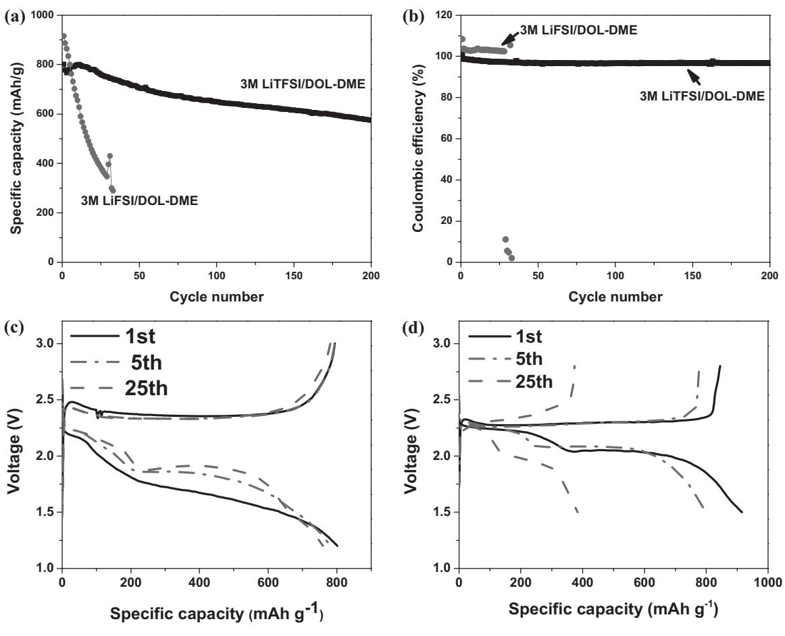
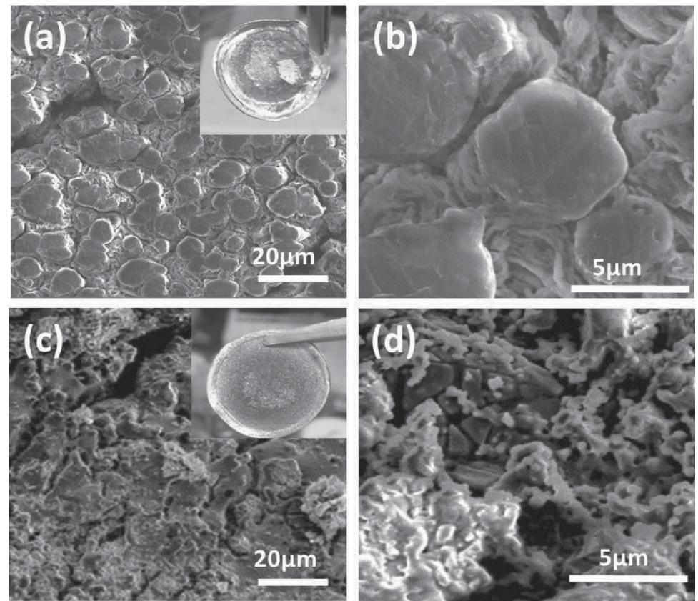
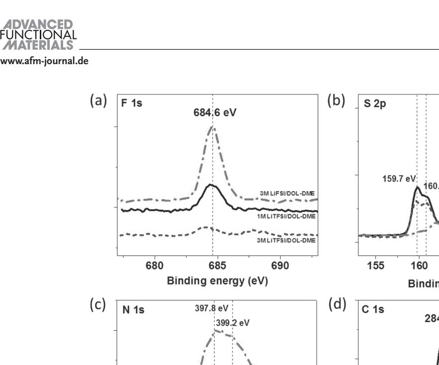
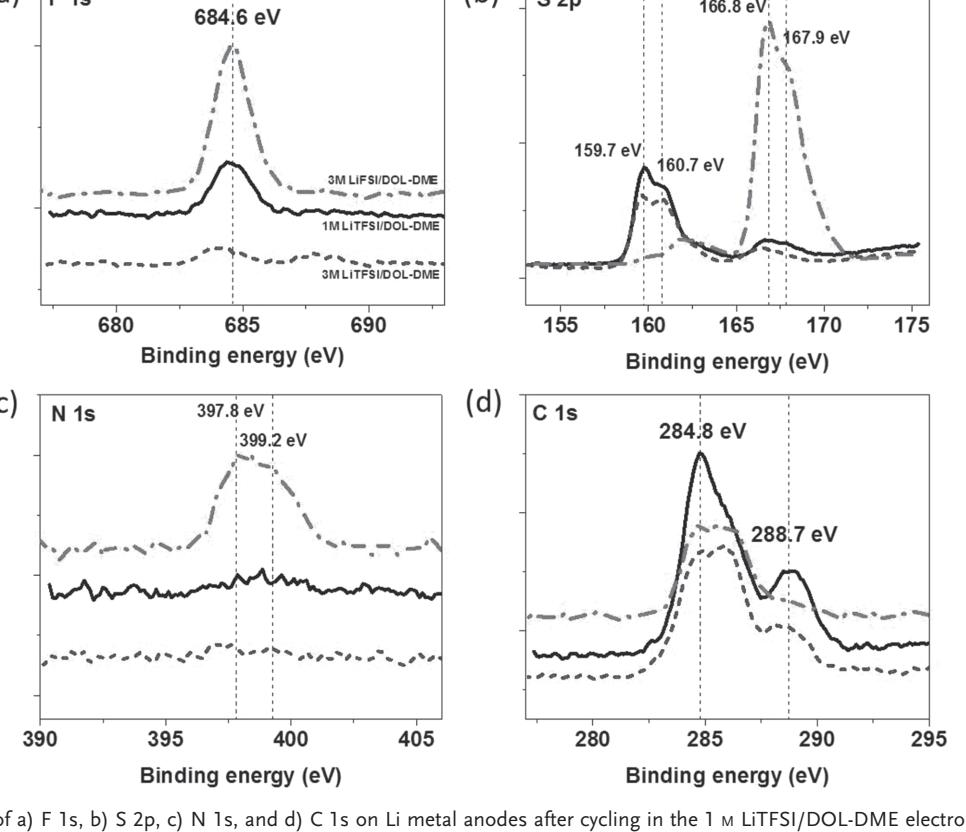
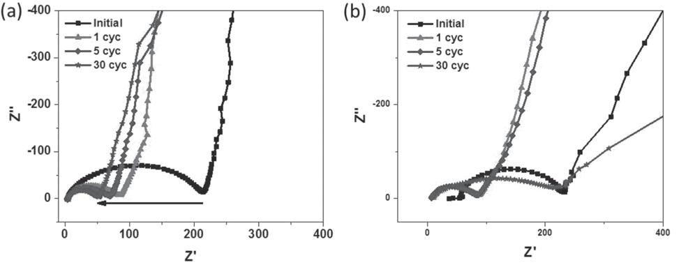
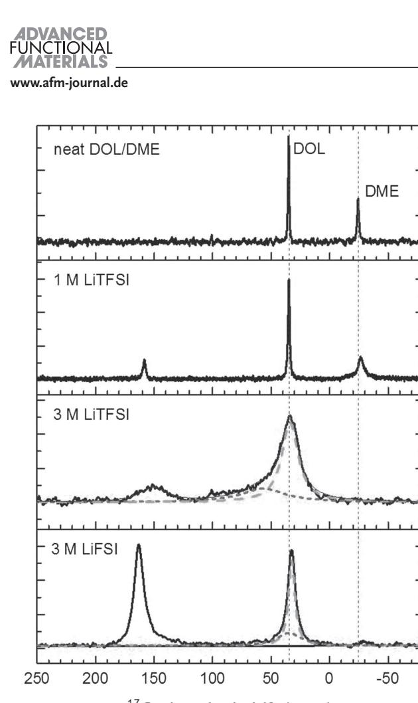

# **Effect of the Anion Activity on the Stability of Li Metal Anodes in Lithium-Sulfur Batteries**

 *Ruiguo Cao , Junzheng Chen , Kee Sung Han , Wu Xu , Donghai Mei , Priyanka Bhattacharya , Mark H. Engelhard , Karl T. Mueller , Jun Liu , and Ji-Guang Zhang \** 

 **With the signifi cant progress made in the development of cathodes in lithium-sulfur (Li-S) batteries, the stability of Li metal anodes becomes a more urgent challenge in these batteries. Here the systematic investigation of the stability of the anode/electrolyte interface in Li-S batteries with concentrated electrolytes containing various lithium salts is reported. It is found that Li-S batteries using LiTFSI-based electrolytes are more stable than those using LiFSI-based electrolytes. The decreased stability is because the N–S bond in the FSI − anion is fairly weak and the scission of this bond leads to the formation of lithium sulfate (LiSO x ) in the presence of polysulfi de species. In contrast, in the LiTFSI-based electrolyte, the lithium metal anode tends to react with polysulfi de to form lithium sulfi de (LiS x ), which is more reversible than LiSO x formed in the LiFSI-based electrolyte. This fundamental difference in the bond strength of the salt anions in the presence of polysulfi de species leads to a large difference in the stability of the anode-electrolyte interface and performance of the Li-S batteries with electrolytes composed of these salts. Therefore, anion selection is one of the key parameters in the search for new electrolytes for stable operation of Li-S batteries.** 

## **1. Introduction**

**www.MaterialsViews.com**

 Lithium-sulfur (Li-S) battery is very promising candidate for the next generation of electric energy storage systems. [ 1 ] The sulfur cathode and Li metal anode have a theoretical capacity

 Dr. R. Cao, Dr. J. Chen, Dr. W. Xu, Dr. P. Bhattacharya, Dr. J. Liu, Dr. J.-G. Zhang Energy and Environment Directorate Pacifi c Northwest National Laboratory Richland , WA 99354 , USA E-mail: jiguang.zhang@pnnl.gov Dr. K. S. Han, Dr. M. H. Engelhard Environmental and Molecular Sciences Laboratory Pacifi c Northwest National Laboratory Richland , WA 99354 , USA Dr. D. Mei, Dr. K. T. Mueller Physical and Computational Sciences Directorate Pacifi c Northwest National Laboratory Richland , WA 99354 , USA Dr. K. T. Mueller Department of Chemistry Pennsylvania State University

of 1672 mAh g −1 and of 3860 mAh g −1 , which lead to very high theoretical specifi c energy (2550 Wh kg −1 ) and energy density (2862 Wh L −1 ) for Li-S batteries. However, the stable operation of the sulfur electrode, which signifi cantly differs from the intercalation mechanism in the traditional cathodes used in Li-ion batteries, still faces a series of barriers, including dissolution of long chain polysulfi des (Li 2 S *m* , *m* = 4–8), low utilization of sulfur, large volume expansion, and low Coulombic effi ciency (CE). [ 2 ] Moreover, in the so-called shuttle mechanism, lithium polysulfi des formed during discharge and charge processes will migrate from the cathode to the anode side to react with the metallic Li, leading to serious self-discharge, poor CE, and limited cycle life for Li-S batteries. [ 3 ] To address these critical issues, a variety of strategies have been developed to accommodate sulfur species, [ 4 ] mitigate the dissolution of polysulfi des, [ 5,6 ] and block the

shuttle effect. [ 7,8 ] With the signifi cant progress made in the development of composite sulfur cathode materials in Li-S batteries, [ 9 ] the stability of a Li metal anode in Li-S batteries has become one of the more urgent challenges in order to reach the desired long-term stability of Li-S batteries. [ 10 ]

 A Li metal anode is the preferred anode in Li-S batteries not only because of its ultrahigh specifi c capacity, but also due to its low electrochemical potential (−3.040 V vs standard hydrogen electrode) as well as its light weight (molecular weight 6.94 g mol −1 , density 0.534 g cm −3 ) compared to other metals. [ 11 ] However, the use of Li metal as an anode in nonaqueous electrolyte batteries is challenging because Li often forms dendritic and mossy Li metal deposits during repeated charge/discharge cycles, leading to low CE and a short cycle life, as well as safety concerns. In Li-S batteries, a passivation layer is readily formed on the metallic Li anode surface due to the presence of polysulfi des and electrolyte additives. This layer will lead to increased cell resistance and failure of the Li-S battery. [ 10 ]

 Various strategies have been developed to minimize the corrosion of Li anodes and to reduce their increase in impedance under operating conditions, including the use of electrolyte additives, [ 12 ] co-solvent, [ 13 ] polymer electrolytes, [ 14 ] and interlayers. [ 8 ] Recently, concentrated electrolytes were demonstrated

# **DOI: 10.1002/adfm.201505074** University Park, PA 16802 , USA

**www.MaterialsViews.com**

to offer lower solubility of polysulfi des and could lead to longer cycling stability in Li-S batteries. [ 5 ] It was reported that a new class of "solvent-in-salt" electrolytes, namely lithium bis(trifl uoromethanesulfonyl)imide [(LiN(SO 2 CF 3 ) 2 or LiTFSI] in 1,3-dioxalane (DOL) and 1,2-dimethoxyethane (DME), with high salt concentrations (up to 7 M ) could enable stable cycling and high CE for Li-S batteries. The high salt concentration electrolytes could minimize the side reactions between the Li metal and the polysulfi de species, effectively reduce the corrosion to the Li anode, and suppress Li dendrite formation. Recently, a concentrated electrolyte of 5 M lithium bis(fl uorosulfonyl)imide [(LiN(SO 2 F) 2 or LiFSI] was also reported to form protective layers on both cathode and anode sides in Li-S batteries. [ 15 ] In addition, the anions of lithium salts have been found to play very important roles in forming the solid electrolyte interphase layer and, to some extent, in governing the electrochemical performance. [ 16 ]

 We report here on the anode/electrolyte interface stability and the degradation mechanism of Li metal anodes in Li-S batteries, especially with concentrated electrolytes. Concentrated electrolytes tend to reduce the solubility of lithium polysulfi des due to the lack of available solvent molecules to partially solvate the Li + cations. The effect of coordinated anions on the solubility of lithium polysulfi des is analyzed in these studies with NMR spectroscopy and density functional theory (DFT) calculations.

#### **2. Results and Discussions**

**Figure 1** shows the electrochemical performance of the Li-S cells with various concentrated electrolytes, 3 M LiTFSI and 3 M LiFSI in DOL-DME (1:1 by volume) mixtures. The Li-S cell containing the 3 M LiTFSI electrolyte delivered relatively stable cycling with good capacity retention (71.9%) after 200 cycles, while the Li-S cell with the 3 M LiFSI electrolyte exhibited fast capacity decay and lasted only 33 cycles (Figure 1 a). The CE of the cell with 3 M LiTFSI electrolyte was initially 101% and then slowly decreased to 96.6% after 200 cycles (Figure 1 b). Interestingly, the CE for the cell with 3 M LiFSI electrolyte was slightly higher than that with 3 M LiTFSI electrolyte, which indicates that some side reactions may happen on the anode side between metallic Li and electrolyte during the discharge process and form degradation products that could not be reversibly oxidized back in the following charge process. Figure 1 c,d shows the discharge–charge profi les for the cells with various concentrated

**Figure 1.** a) Cycling stability and b) Coulombic effi ciency of the Li-S batteries with various concentrated electrolytes, 3 M LiTFSI and 3 M LiFSI in DOL-DME ( 1:1 by volume), respectively. Voltage-capacity profi les (solid, 1st cycle; dash-dot, 5th cycle; dash, 25th cycle) for c) 3 M LiTFSI and d) 3 M LiFSI electrolytes.

**www.afm-journal.de**

**www.MaterialsViews.com**

electrolytes using 3 M LiTFSI and 3 M LiFSI salts, respectively. It is observed that the cell with the 3 M LiTFSI electrolyte showed higher capacity retention as well as higher polarization when compared with the cell containing the 3 M LiFSI electrolyte. The higher polarization shown in the voltage profi les of Li-S cell using 3 M LiTFSI electrolyte comparing with those using 3 M LiFSI electrolyte should be attributed to the higher viscosity and lower conductivity of the 3 M LiTFSI electrolyte (Table S1 in the Supporting Information). For comparison, the electrolyte with a more typical concentration used in Li-S batteries (1 M LiTFSI in DOL-DME with 0.2 M LiNO 3 ) was also tested and the electrochemical performance results are shown in Figure S1 in the Supporting Information. It was observed that the cell with the dilute electrolyte demonstrated a typical electrochemical performance similar to the results reported in the literatures. The cell with this regular concentration of electrolyte showed a faster capacity decay and lower CE than that with concentrated (3 M LiTFSI) electrolyte.

 The Li metal anodes after cycling were characterized by scanning electron microscopy (SEM) and X-ray photoemission spectroscopy (XPS). **Figure 2** a,b shows the SEM images of Li metal anodes after cycling in 3 M LiTFSI-DME/DOL after 200 cycles. As a comparison, Figure 2 c,d shows the SEM images of Li metal anodes after cycling in 3 M LiFSI-DME/DOL after only 35 cycles. Li metal anodes cycled in 3 M LiTFSI/DOL-DME showed a much smoother surface and less cracks compared with those cycled in 3 M LiFSI/DOL-DME. The thickness of the porous passivation layer built up on a Li metal anode cycled in 3 M

LiFSI/DOL-DME electrolyte was approximately 60 µm after 35 cycles (Figure S2b in the Supporting Information). This thickness is comparable to those of passivation layers built up in 3 M LiTFSI/DOL-DME electrolyte after 200 cycles. This observation is a clear indication that Li metal anodes degrade much faster in the electrolyte containing LiFSI salt. As a comparison, the pristine and cycled Li metal anodes in conventional electrolytes were also investigated. Figure S2c and Figure S3 in the Supporting Information show the cross-section and surface morphology, respectively, for a Li metal anode cycled in the conventional electrolyte of 1 M LiTFSI in DOL-DME with 0.2 M LiNO 3 . Comparing Figure 2 a,b and Figure S3a,b in the Supporting Information, the Li metal anode cycled in the 1 M LiTFSI electrolyte is more loose and porous than those cycled in the concentrated electrolyte. This is consistent with the previous report that the Li-S cells using high concentration electrolyte exhibit better cyclability when compared to those using low concentrations of electrolyte. [ 9 ]

 The chemical compositions of the surface passivation layers formed on the Li metal anodes in the concentrated electrolytes studied here were analyzed by XPS. **Figure 3** shows the narrow scan (i.e., high resolution) spectra of F 1s, S 2p, N 1s, and C 1s of cycled Li metal anodes in the two 3 M concentrated electrolytes based on LiFSI and LiTFSI. As a comparison, the metallic Li anode from the conventional 1 M LiTFSI electrolyte was also characterized under the same conditions.

 Figure 3 a shows the F 1s spectra of the cycled Li metal anodes. The main peak appearing at 684.6 eV is associated

**Figure 2.** SEM images of Li metal anodes after cycled in a,b) 3 M LiTFSI-DME/DOL after 200 cycles. c,d) 3 M LiFSI-DME/DOL after 35 cycles.

**www.MaterialsViews.com**

**Figure 3.** XPS scans of a) F 1s, b) S 2p, c) N 1s, and d) C 1s on Li metal anodes after cycling in the 1 M LiTFSI/DOL-DME electrolyte (solid curves), the 3 M LiTFSI/DOL-DME electrolyte (dash curves), and the 3 M LiFSI/DOL-DME electrolyte (dash-dot lines).

with LiF. The intensity of the LiF peak in the XPS spectra of the Li metal anode cycled in 3 M LiFSI electrolyte is higher than that from the anode cycled in 3 M LiTFSI electrolyte, indicating a higher content of LiF on the surface of the Li metal anode formed in the 3 M LiFSI electrolyte. This suggests that the F species in the FSI − anions are less stable (i.e., more easily removed under these conditions) than those in the TFSI − anions. The most striking difference between the XPS spectra of the Li anodes cycled in the 3 M LiTFSI electrolyte and 3 M LiFSI electrolyte is observed in their S 2p spectra as shown in Figure 2 b. The fi gure shows that the Li anodes cycled in the 3 M LiTFSI and 1 M LiTFSI electrolytes exhibit strong peaks at 159.7 and 160.7 eV that can be attributed to polysulfi de Li 2 S x (binding energy ≈160 ± 1 eV) but only very weak peaks at 166.8 and 167.9 eV that are associated with lithium sulfate LiSO x (binding energy ≈167 ± 1 eV). Therefore the sulfur-related product generated on the surface of the cycled Li metal anode in LiTFSIbased electrolyte is related to polysulfi de formation, which is reversible in Li-S batteries. In contrast, the sulfur-related products generated on the surface of the Li metal anode in the 3 M LiFSI electrolyte exhibit only a very weak polysulfi de (Li 2 S x ) peak (binding energy ≈160 ± 1 eV) but much stronger peaks associated with formation of lithium sulfate (LiSO x ) (binding energy ≈167 ± 1 eV), which is not reversible in Li-S batteries. [ 17 ] This result can be used to explain the electrochemical data shown in Figure 1 . In a Li-S battery using an electrolyte with LiTFSI salt, the dominant discharge products are lithium sulfi des (Li 2 S x ) whose formation is highly reversible. Therefore, the cell exhibits a good cyclability as shown in the black line in Figure 1 a and also in Figure 1 c. However, in a Li-S battery using an electrolyte with LiFSI salt, more reaction products formed on the surface of Li metal anode are lithium sulfate (LiSO x ) whose formation is not reversible. In this case, the cell exhibits a poor cyclability as shown in the red line in Figure 1 a and also in Figure 1 d. Because part of the reaction products (LiSO x ) formed during the discharge process cannot be decomposed during the charging process, the charge capacity of a Li-S battery is less than the discharge capacity when LiFSI salt is used in the electrolyte. This behavior will lead to a CE of slightly larger than 100% as shown in the red line of Figure 1 b. Generation of more irreversible products (LiSO x ) in LiFSI-based electrolyte also leads to thicker passivation layers as shown in Figure S2b in the Supporting Information. Figure 3 c shows the N 1s spectra of the cycled Li metal anodes. The intensity of the main peak in the XPS spectra of the Li metal anode cycled in 3 M LiFSI electrolyte is much higher than those cycled in 3 M LiTFSI electrolyte. The results from Figure 3 a,c indicate that F and N are much less stable in the FSI − anion than in TFSI − anion under the conditions utilized here. As for the C 1s spectra (Figure 3 d), the Li anode cycled in 3 M LiTFSI electrolyte shows a broad peak at 288.7 eV, which can be attributed to the C O bond in Li 2 CO 3 or lithium alkyl carbonate that are from the decomposition of the DOL-DME solvent mixture. No other signifi cant difference was observed in the binding energy range of 283–287 eV in the C 1s spectra for the Li metal anodes cycled in different electrolytes. In general, the XPS spectrum

**www.MaterialsViews.com**

obtained for the Li metal anode cycled in 1 M LiTFSI electrolyte is similar to that obtained for the Li metal anode cycled in 3 M LiTFSI electrolyte, although the latter exhibits a weaker F 1s peak at 684.6 eV indicating less LiF formed on the surface of the Li anode cycled in the 3 M LiTFSI electrolyte. [ 18 ]

 To gain a more in-depth understanding of the degradation mechanism of the Li anode in different electrolytes, DFT calculations were conducted to determine and compare the bond strength in the two anions (TFSI − and FSI − ). The optimized structures for the two anions are shown in the Figure S4 and Figure S5 in the Supporting Information. Tables S2 and S3 in the Supporting Information summarize the bond strength of TFSI − and FSI − , respectively. For the TFSI − anion, the C S bond has the lowest bond strength (306.6 kJ mol −1 ), indicating that it could be broken fi rst and lead to the formation of the CF 3 fragments. The next weakest bond in TFSI − is the C F bond in the CF 3 group (320.2 kJ mol −1 ), which suggests that the C F bond could be broken to form F. The N S bond in the TFSIanion shows a bond strength of 581.0 kJ mol −1 . In contrast, the N S bond in the FSI − anion is the weakest bond in the anion structure (192.7 kJ mol −1 ), indicating that the anion could decompose to form the fragments of F SO 2 N and SO 2 F. The next weakest bond in the FSI − anion is the F S bond with a calculated strength of 465 kJ mol −1 . Breaking of the F S bond in the fragment of SO 2 -F will form SO 2 and F. In other words, the lower bond strengths of N S and F S in the FSI − anion favor the formation of sulfate SO 2 and F. In contrast, it is much more diffi cult to form SO 2 when the TFSI − anion is present in the electrolyte. These calculation results are consistent with the XPS results shown in Figure 2 where the presence of FSI − anion leads to the formation of more lithium sulfate (LiSO x ) as compared to the formation of LiS x when TFSI − anion is present in the electrolyte.

 Electrochemical impedance analyses were conducted on the Li-S cells with different electrolytes. As shown in **Figure 4** , the impedance of the cell with the 3 M LiTFSI electrolyte greatly decreased with an increasing number of charge/discharge cycles (Figure 4 a). In contrast, cycling the cell with the 3 M LiFSI electrolyte led to a decrease in impedance in the fi rst fi ve cycles, and then a continuous signifi cant increase until the cell failed to function at the 35th cycle. The increased impedance in the cell with 3 M LiFSI electrolyte is consistent with the results shown in Figure 2 b and Figure 3 that revealed the rapid growth **www.afm-journal.de**

of a passivation layer composed of insulating lithium sulfate (LiSOx).

 As a comparison, lithium cycling effi ciency was measured in a Li|Cu cell using the concentrated electrolyte saturated with polysulfi des (introduced in the form of Li 2 S 8 ). Figure S6 in the Supporting Information shows that the cell using 3 M LiTFSI/DOL-DME electrolyte exhibits a stable CE while the cell with the 3 M LiFSI/DOL-DME electrolyte exhibits a very large fl uctuation in CE that indicates an unstable anode/electrolyte interface. We also found that the solubility of polysulfi de in the 3 M LiFSI electrolyte is lower than in the 3 M LiTFSI electrolyte (Figure S7 in Supporting Information), suggesting that LiFSI may precipitate during battery operation when the amount of Li 2 S 8 increases above a certain critical level. This phenomenon may also contribute to the low CE of Li-S batteries with the 3 M LiFSI electrolyte.

 In an effort to understand the observed behaviors in Li-S batteries using different electrolytes, the solution structure of the LiTFSI/DOL-DME electrolyte and LiFSI/DOL-DME electrolyte have been investigated by 17 O NMR and diffusion analysis as shown in **Figure 5** and Figure S8 of Supporting Information, respectively. As a baseline, the solution structure of the neat DOL/DME solvent was also investigated. The 17 O NMR spectrum obtained from the neat DOL/DME solvent shows two peaks centered at around 35 and −24 ppm, which arise from the oxygen atoms within DOL and on DME, respectively. In the 1 M LiTFSI/DOL-DME electrolyte, the DOL 17 O peak remained nearly at the same position compared to those from the neat DOL/DME, while the DME 17 O peak shifted to upfi eld, which is caused by the Li + cation interaction with the oxygen atoms on DME molecules. This observation strongly suggests Li + -solvation is taking place primarily through DME molecules.

 In the 3 M LiTFSI/DOL-DME electrolyte, the DME 17 O peak shifts downfi eld (to approximately 57 ppm) as a result of the formation of aggregates composed of Li + -DME-anion species. [ 19 ] It was observed that the 17 O peak intensity of TFSI − anion is smaller, which is only ≈15% of the total relative to the total number of oxygen atoms estimated from the 3 M LiTFSI concentration. The increased broadening of the 17 O resonance from TFSI − anion indicates slower TFSI − anion mobility in the aggregates. On the other hand, NMR spectra of 3 M LiFSI-DOL/DME reveal about 10% of DME molecules resonating at around −30 ppm and relatively higher 17 O peak intensity from

**Figure 4.** Electrochemical impedance evolution of Li-S cells with concentrated electrolytes: a) 3 M LiTFSI/DOL-DME, b) 3 M LiFSI/DOL-DME.

**Figure 5.** 17 O NMR spectra for the neat DOL/DME (1:1 vol.), 1 and 3 M LiTFSI and 3 M LiFSI dissolved in DOL/DME (1:1 vol.) mixed solvent.

FSI − anions due to the fast motion of the FSI − anion, which suggests a much lower degree of aggregate formation. Compared to the resonances observed from the 3 M LiTFSI-DOL/ DME electrolyte, the 17 O resonance from FSI − anions has less broadening and indicates the faster FSI − anion mobility in the aggregates.

 The differences in the formation of aggregates between the TFSI − and FSI − anions and the preferential Li + -solvation by DME molecules in these electrolytes can be further confi rmed by NMR diffusion measurements as shown in Figure S8 in the Supporting Information. In the neat DOL/DME solvent, the diffusion coeffi cient of DOL ( *D*DOL ) is about the same as those of DME ( *D*DME ). The addition of Li salts to the neat solvent leads to a larger decrease in the diffusion coeffi cient of DME compared to those of DOL. These results are consistent with preferential Li + -solvation by DME molecules. In the 3 M LiTFSI-DME/ DOL electrolyte, these different degrees of aggregation do not have signifi cant effect on the diffusion of TFSI − anions, which exhibit similar diffusion coeffi cients to those of Li + and DME ( *D*Li ≈ *D*TFSI ≈ *D*DME ). However, the diffusion coeffi cient of the FSI − anion in 3 M LiFSI-DME/DOL is clearly larger than those of Li and DME ( *D*FSI > *D*DME ≥ *D*Li ) as shown in Figure S8 in the Supporting Information. The fast motion of FSI − anion is consistent with the lower polarization noted in the Li-S cell using 3 M LiFSI-DOL/DME electrolyte (Figure 1 d). However, the larger erate the capacity fade of Li-S batteries as shown in Figure 1 .

#### **3. Conclusions**

 The stability of anode/electrolyte interfaces in Li-S batteries with various concentrated electrolytes, 3 M LiTFSI in DOL-DME and 3 M LiFSI in DOL-DME, has been investigated and compared with the results found when using a lower concentration electrolyte (1 M LiTFSI in DOL-DME). Concentrated electrolytes lead to much lower polysulfi de solubility compared with low concentration electrolytes. Li-S batteries using a LiTFSI-based concentrated electrolyte could deliver more stable cycling than those using a LiFSI-based electrolyte. Such behavior would be consistent with the determination that the N S bond in the FSI − anion is the weakest bond and which, if broken, could lead to the formation of lithium sulfate (LiSO x ) in the presence of polysulfi de species. The continuous decomposition of the FSI − anions will lead to fast growth of passivation layers dominated by insulating lithium sulfate. In contrast, the C S bond in the TFSI − anion is the weakest bond, but it is much stronger than the N S bond in the FSI − anion. A broken C S bond in the TFSI − anion can in principle lead to the formation of lithium sulfi de (LiS x ) in the presence of polysulfi de species. We have also found that the diffusion coeffi cient of FSI − anions in 3 M LiFSI-DME/DOL is clearly larger than values measured for Li ( *D*FSI > *D*Li ), but TFSI − anions in 3 M LiTFSI-DME/DOL exhibit similar diffusion coeffi cients to those of Li + ( *D*TFSI ≈*D*Li ). The higher diffusion coeffi cient of FSI − anions, corresponding to a weaker coordination by other solvent molecules, may accelerate their decomposition on the surfaces of Li metal anodes. The fundamental differences in the bond strengths within the FSI − anions and the TFSI − anions in the presence of polysulfi de species lead to a large difference in the stability of anode-electrolyte interfaces and performance of the Li-S batteries. Therefore, both anion selection and their concentration need to be considered in the search for new electrolytes for further development of Li-S batteries.

#### **4. Experimental Section**

*Materials* : LiTFSI, DOL, and DME (all in battery-grade purity) were ordered from BASF Battery Materials and used as received. LiFSI was obtained from Nippon Shokubai and used as received. Sulfur powder (purity ≥99.5%), N-methyl-2-pyrrolidone (NMP), and lithium nitrate (LiNO 3 ) were acquired from Sigma-Aldrich. Multi-walled carbon nanotubes (MWCNTs, 10–20 nm in diameter) were purchased from Cheap Tubes Inc. High-purity Li chips with dimensions of 15.6 mm diameter and 0.45 mm thickness were obtained from MTI Corporation.

*Preparation of Sulfur Cathode* : The sulfur/MWCNT composite was fi rst prepared by a melt-diffusion approach. Sulfur powder and MWCNTs in a weight ratio of 4:1 were mixed in a mortar by hand, and then the mixture was transferred to a Tefl on-lined stainless steel autoclave and heat treated at 155 °C in a furnace for 24 h to improve the sulfur distribution inside the MWCNTs matrix, resulting in S80/MWCNTs20 composite. The sulfur cathode was prepared by coating the NMP slurry of S80/MWCNTs20 composite, conductive carbon, PVDF binder

**www.MaterialsViews.com**

with a weight ratio of 8:1:1 onto an aluminum foil. After the NMP was evaporated inside a fume hood, the sulfur cathode was punched into discs (Φ9/16 in. or 1.43 cm), further dried in a vacuum oven, and then transferred in an argon-fi lled glovebox (MBraun) with moisture less than 0.1 ppm and oxygen level below 1 ppm for cell assembly. The sulfur mass loading of the electrode was about 1 mg cm −2 .

*Preparation of Electrolytes* : The electrolytes were prepared by dissolving the desired amount of lithium salt into the solvent mixture in volumetric fl asks in the argon-fi lled glovebox. For example, the 3 M LiTFSI/DOL-DME electrolyte was prepared by dissolving 0.015 mol of LiTFSI in an appropriate amount of DOL-DME (1:1 by volume) mixture to fi ll a 5 mL volumetric fl ask.

*Electrochemical Measurements* : The electrochemical properties of various electrolytes were evaluated in 2032-type coin cells (MTI Corporation). Li-S coin cells were assembled inside the MBraun glovebox with the above sulfur cathode disc, Celgard 3501 separator (a polypropylene microporous membrane with hydrophilic coatings), Li chip, and selected electrolyte of 60 µL. Then the cells were cycled on a Lanhe battery testing system (Wuhan Land Electronics Co., Ltd.) by using galvanostatic charge–discharge tests at 0.2 C rate where 1 C corresponded to a current density of 1.0 mA cm −2 . The electrochemical impedance spectrum of the coin cells was measured on the combination of a Solartron 1287 electrochemical workstation and Solartron 1255B frequency response analyzer controlled by Zplot software with a 10 mV perturbation in the frequency range of 10 6 to 10 −1 Hz.

*Characterizations* : The electrodes were harvested from the cycled Li-S coin cells and carefully washed with DME solvent. After drying under vacuum, the electrodes were sealed in an argon-fi lled container and transferred for postanalyses. SEM images were collected on an FEI Quanta FESEM at an accelerating voltage of 5 kV. XPS measurements were performed on a Physical Electronics Quantera Scanning X-ray Microprobe using a focused monochromatic Al Kα X-ray (1486.7 eV) source for excitation and a spherical section analyzer.

*17 O NMR Measurements and Diffusion Measurements* : All NMR experiments were performed with a 600 MHz NMR spectrometer (Agilent, USA) equipped with a 5 mm liquid NMR probe (Doty Scientifi c, USA), which has the maximum gradient strength of ≈31 T m −1 . The 17 O NMR spectra for these electrolytes were obtained from Fourier transformed free induction decays after a single pulse excitation at Larmor frequencies of 81.4 MHz at ambient temperature (≈25 °C). The 17 O chemical shift for distilled water (H 2 O) was used as an external reference (i.e., 0 ppm). Diffusion coeffi cient of Li + cation, anion, and solvent molecules (DOL and DME) were measured by using 7 Li, 19 F, and 1 H pulsed fi eld gradient NMR at Larmor frequencies of 233.2, 564.3, and 599.82 MHz, respectively, in the temperature range of 0–50 °C. The echo heights, S( *g* ), obtained as a function of gradient strength ( *g* ) using bipolar gradients with convection compensate gradients (Dbppste\_cc in VNMRJ 3.2) were fi tted with the Stejskal–Tanner equation, S( *g* ) = S(0) *exp* [- *D* ( γ*g*δ*)*2 (Δ- δ /3)]. In this equation, S( *g* ) and S(0) are the echo height with the gradient strength of *g* and 0, respectively; *D* is the diffusion coeffi cient; and γ is the gyromagnetic ratio for the observed nuclei ( 7 Li, 19 F, or 1 H). The strength ( *g* ) and duration ( δ ) of gradient pulse and the distance between the two gradients (Δ) were properly chosen for a suffi cient decay of the echo height based upon the nuclei observed and diffusion coeffi cient.

*Computational Calculations* : DFT calculations were performed using the generalized gradient approximation as implemented in the Gaussian 09 suite of programs. [ 20 ] The B3LYP functional combined with the 6–311++G(d,p) basis set was used in geometry optimization calculations. [ 21 ] Vibrational frequencies were computed for yielding zero-point energy and thermal corrections. Gibbs free energies were calculated at 298.15 K.

#### **Supporting Information**

 Supporting Information is available from the Wiley Online Library or from the author.

## **Acknowledgements**

 This work was supported by the Joint Center for Energy Storage Research (JCESR), an Energy Innovation Hub funded by the U.S. Department of Energy, Offi ce of Science, Basic Energy Sciences. The microscopic images and spectroscopic measurements were conducted in the William R. Wiley Environmental Molecular Sciences Laboratory––a national scientifi c user facility sponsored by the DOE's Offi ce of Biological and Environmental Research and located at Pacifi c Northwest National Laboratory (PNNL).

> Received: November 25, 2015 Revised: February 9, 2016 Published online: March 29, 2016

- [1] a) Y.-X. Yin , S. Xin , Y.-G. Guo , L.-J. Wan , *Angew. Chem. Int. Ed.* **2013** , *52* , 13186 ; b) N.-S. Choi , Z. Chen , S. A. Freunberger , X. Ji , Y.-K. Sun , K. Amine , G. Yushin , L. F. Nazar , J. Cho , P. G. Bruce , *Angew. Chem. Int. Ed.* **2012** , *51* , 9994 ; c) A. Manthiram , Y. Fu , S. H. Chung , C. Zu , Y. S. Su , *Chem. Rev.* **2014** , *114* , 11751 .
- [2] Y. Yang , G. Zheng , Y. Cui , *Chem. Soc. Rev.* **2013** , *42* , 3018 .
- [3] R. Xu , J. Lu , K. Amine , *Adv. Energy Mater.* **2015** , *5* , 1500408 .
- [4] a) X. Ji , K. T. Lee , L. F. Nazar , *Nat. Mater.* **2009** , *8* , 500 ; b) L. Ji , M. Rao , H. Zheng , L. Zhang , Y. Li , W. Duan , J. Guo , E. J. Cairns , Y. Zhang , *J. Am. Chem. Soc.* **2011** , *133* , 18522 ; c) J. Chen , D. Wu , E. Walter , M. Engelhard , P. Bhattacharya , H. Pan , Y. Shao , F. Gao , J. Xiao , J. Liu , *Nano Energy* **2015** , *13* , 267 .
- [5] L. Suo , Y.-S. Hu , H. Li , M. Armand , L. Chen , *Nat. Commun.* **2013** , *4* , 1481 .
- [6] M. Cuisinier , P. E. Cabelguen , B. D. Adams , A. Garsuch , M. Balasubramanian , L. F. Nazar , *Energy Environ. Sci.* **2014** , *7* , 2697 .
- [7] a) S. H. Chung , A. Manthiram , *Adv. Funct. Mater.* **2014** , *24* , 5299 ; b) S.-H. Chung , A. Manthiram , *Adv. Mater.* **2014** , *26* , 1360 .
- [8] Y.-S. Su , A. Manthiram , *Nat. Commun.* **2012** , *3* , 1166 .
- [9] a) M. A. Pope , I. A. Aksay , *Adv. Energy Mater.* **2015** , *5* , 1500124 ; b) Y. Son , J.-S. Lee , Y. Son , J.-H. Jang , J. Cho , *Adv. Energy Mater.*  **2015** , *5* , 10.1002/aenm.201500110 .
- [10] R. Cao , W. Xu , D. Lv , J. Xiao , J.-G. Zhang , *Adv. Energy Mater.* **2015** , *5* .
- [11] H. Kim , G. Jeong , Y.-U. Kim , J.-H. Kim , C.-M. Park , H.-J. Sohn , *Chem. Soc. Rev.* **2013** , *42* , 9011 .
- [12] S. Zhang , K. Ueno , K. Dokko , M. Watanabe , *Adv. Energy Mater.*  **2015** , *5* .
- [13] M. Gordin , F. Dai , S. Chen , T. Xu , J. Song , D. Tang , N. Azimi , Z. Zhang , D. Wang , *ACS Appl. Mater. Interfaces* **2014** , *6* , 8006 .
- [14] J. Hassoun , B. Scrosati , *Angew. Chem. Int. Ed.* **2010** , *49* , 2371 .
- [15] H. Kim , F. Wu , J. T. Lee , N. Nitta , H.-T. Lin , M. Oschatz , W. I. Cho , S. Kaskel , O. Borodin , G. Yushin , *Adv. Energy Mater.* **2014** , 1401792 .
- [16] a) J. Hu , G. Long , S. Liu , G. Li , X. Gao , *Chem. Commun.* **2014** , *50* , 14647 ; b) E. Markevich , G. Salitra , A. Rosenman , Y. Talyosef , F. Chesneau , D. Aurbach , *J. Mater. Chem. A* **2015** , *3* , 19873 ; c) J.-W. Park , K. Ueno , N. Tachikawa , K. Dokko , M. Watanabe , *J. Phys. Chem. C* **2013** , *117* , 20531 .
- [17] Z. Wang , Y. Dong , H. Li , Z. Zhao , H. Bin Wu , C. Hao , S. Liu , J. Qiu , X. W. Lou , *Nat. Commun.* **2014** , *5* , 5002 .
- [18] J. Qian , W. A. Henderson , W. Xu , P. Bhattacharya , M. Engelhard , O. Borodin , J.-G. Zhang , *Nat. Commun.* **2015** , *6* , 6362 .
- [19] D. M. Seo , O. Borodin , S.-D. Han , P. D. Boyle , W. A. Henderson , *J. Electrochem. Soc.* **2012** , *159* , A1489 .
- [20] M. J. Frisch , G. W. Trucks , H. B. Schlegel , G. E. Scuseria , M. A. Robb , J. R. Cheeseman , G. Scalmani , V. Barone , B. Mennucci , G. A. Petersson , H. Nakatsuji , M. Caricato , X. Li , H. P. Hratchian , A. F. Izmaylov , J. Bloino , G. Zheng , J. L. Sonnenberg , M. Hada ,

| M. Ehara , K. Toyota , R. Fukuda , J. Hasegawa , M. Ishida ,               |
|----------------------------------------------------------------------------|
| T. Nakajima , Y. Honda , O. Kitao , H. Nakai , T. Vreven ,                 |
| J. A. Montgomery Jr. , J. E. Peralta , F. Ogliaro , M. J. Bearpark ,       |
| J. Heyd , E. N. Brothers , K. N. Kudin , V. N. Staroverov , R. Kobayashi , |
| J. Normand , K. Raghavachari , A. P. Rendell , J. C. Burant ,              |
| S. S. Iyengar , J. Tomasi , M. Cossi , N. Rega , N. J. Millam , M. Klene , |
| J. E. Knox , J. B. Cross , V. Bakken , C. Adamo , J. Jaramillo ,           |

- R. Gomperts , R. E. Stratmann , O. Yazyev , A. J. Austin , R. Cammi , C. Pomelli , J. W. Ochterski , R. L. Martin , K. Morokuma , V. G. Zakrzewski , G. A. Voth , P. Salvador , J. J. Dannenberg , S. Dapprich , A. D. Daniels , Ö. Farkas , J. B. Foresman , J. V. Ortiz , J. Cioslowski , D. J. Fox , Gaussian, Inc. , Wallingford, CT, USA **2009** .
- [21] a) S. F. Boys , F. Bernardi , *Mol. Phys.* **1970** , *19* , 553 ; b) C. Lee , W. Yang , R. G. Parr , *Phys. Rev. B* **1988** , *37* , 785 .