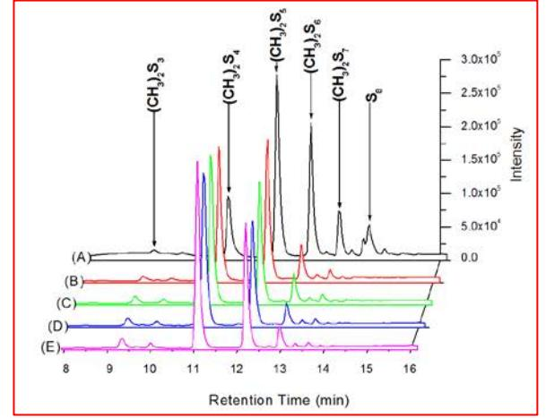
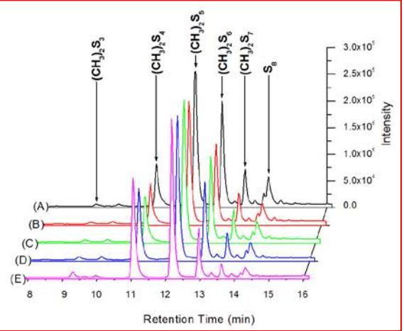
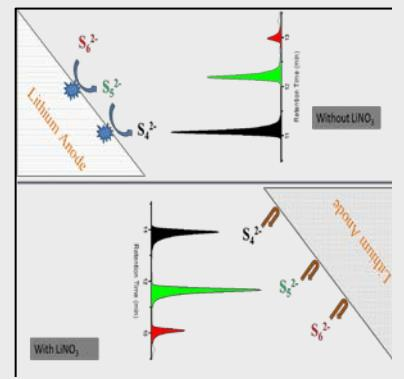

**BNL-113426-2017-JA**

# **Reaction between Lithium Anode and Polysulfide Ions in a Lithium-Sulfur Battery**

**Dong Zheng, Xiao-Qing Yang, and Deyang Qu**

*Submitted to CHEMSUSCHEM*

September 2016

**Chemistry Department**

**Brookhaven National Laboratory**

**U.S. Department of Energy USDOE Office of Science (SC), Basic Energy Sciences (BES) (SC-22)**

Notice: This manuscript has been authored by employees of Brookhaven Science Associates, LLC under Contract No. DE- SC0012704 with the U.S. Department of Energy. The publisher by accepting the manuscript for publication acknowledges that the United States Government retains a non-exclusive, paid-up, irrevocable, world-wide license to publish or reproduce the published form of this manuscript, or allow others to do so, for United States Government purposes.

### **DISCLAIMER**

This report was prepared as an account of work sponsored by an agency of the United States Government. Neither the United States Government nor any agency thereof, nor any of their employees, nor any of their contractors, subcontractors, or their employees, makes any warranty, express or implied, or assumes any legal liability or responsibility for the accuracy, completeness, or any third party's use or the results of such use of any information, apparatus, product, or process disclosed, or represents that its use would not infringe privately owned rights. Reference herein to any specific commercial product, process, or service by trade name, trademark, manufacturer, or otherwise, does not necessarily constitute or imply its endorsement, recommendation, or favoring by the United States Government or any agency thereof or its contractors or subcontractors. The views and opinions of authors expressed herein do not necessarily state or reflect those of the United States Government or any agency thereof*.* 

# **Reaction between Lithium Anode and Polysulfide Ions in a Lithium-Sulphur Battery**

Dong Zheng, [a] Xiao-Qing Yang, [b], and Deyang Qu\* [a]

**Abstract:** The reaction between polysulfides and a lithium anode in a Li-S battery was examined by HPLC method. The results demonstrated that the polysulfide species with six sulfur atoms or more were reactive with lithium metal. Although the reaction can be greatly inhibited by the addition of LiNO3 in the electrolyte, LiNO3 cannot form a stable protection layer on Li anode to prevent the reaction during storage.

It's well known that polysulfide species (Li2Sn, n≥2) are the important products in a Li-S battery during charge and discharge. The polysulfide species (with n≥3) can be dissolved in organic electrolytes, especially in the ether-based electrolytes.1-3 The soluble polysulfide species play important roles in the redox reaction of sulfur.2 However, the migration of the soluble polysulfide species to the Li anode and subsequent reactions have been the major problem of Li-S batteries. Consequently, the reaction (1) was thought to be responsible for the high selfdischarge, low columbic efficiency and poor cycleability for a Li-S battery.2,3

To alleviate the problems associated with the dissolution of polysulfide ions, efforts were made to restrain the soluble polysulfide ions within the porous electrode matrix.4-8 For example, the cathode with sulphur localized in carbon nanotubes demonstrated good cycle life.5 Additives which can form a stable solid electrolyte interface (SEI) layer were also explored to prevent the reaction between dissolved polysulfide ions with Li anode.9-13 Among those additives LiNO3 was found to greatly improve the charge and discharge efficiency (columbic efficiency) for a rechargeable Li-S battery. It is debatable whether LiNO3 can sustain protecting Li anode during a length storage since large amount (e.g. 0.1 M) of LiNO3 was needed. Thus a direct chemical analysis is not only complementary but also necessary to demonstrate that indeed the LiNO3 additive can supress reaction 1.

$$
S_n^{2} + 2Li \longrightarrow S_{(n-1)}^{2} + Li_2S \tag{1}
$$

The dissolved polysulfide ions couldn't be quantitatively or qualitatively analysed until recently when a high performance liquid chromatography (HPLC) – mass spectroscopy (MS) method was successfully introduced into the analysis of polysulfide and elemental sulphur in electrolytes of Li-S batteries16-19. As shown in reaction 2, the polysulfide anions were first derivatized, and the derivatized mixtures were separated by a HPLC, the sulphur chain length of the derivatized polysulfide species was determined by the mass/charge ratio with a MS. Correspondingly, the distribution of different polysulfide species in the electrolyte could be qualitatively obtained through the chromatographic result of the derivatized species.

$$
S_n^2 + 2CF_3SO_3CH_3 \longrightarrow (CH_3)_2S_n + 2CF_3SO_3 \qquad (2)
$$

The inhibition effect of a LiNO3 additive in the electrolyte of Li-S battery was studied directly and unambiguously in this report. To our knowledge this is the first direct analytical work to investigate the LiNO3 additive in the electrolyte in a Li-S cell.

The polysulfide distribution in this polysulfide mixture was determined by the HPLC after derivatization with methyl triflate. The chromatogram of the original polysulfide mixture was shown in Figure 1 line (A). Clearly the concentration of the methylated polysulfide ions and elemental sulfur, which is proportional to the intensities chromatographic peaks, decreased in the following order: (CH3)2S5>(CH3)2S6>(CH3)2S4>(CH3)2S7>elemental sulfur>(CH3)2S3. The assignment of each methylated polysulfide species and elemental sulfur were determined by massspectroscopy as described in reference 18. Correspondingly, the distribution of all polysulfide anions (S3 2-, S4 2-, S5 2-, S6 2-, and S7 2- ) in the original polysulfide mixture was determined.

**Figure 1.** Chromatograms of derivatized polysulfide mixtures: original polysulfide mixture (A), polysulfide mixture with Li metal for 1hour (B), polysulfide mixture with Li metal for 4hours (C), polysulfide mixture with Li metal for 24hours (D), polysulfide mixture with Li metal for 96hours (E).

A lithium metal disk (about 30mg, 1cm diameter) was then added into the 1.5ml polysulfide mixture solution. The polysulfide solution was measured after being in contact with Li disk for 1 hour, 4 hours, 24 hours and 96 hours along with the original stock solution, the results are summarized in Figure 1 (B) to (E), respectively. By comparing Fig. 1(B) with Fig. 1(A), the distribution of the polysulfide anions substantially changed after being in contact with Li metal, it became evident that polysulfide anions in electrolyte react with lithium metal as expected. 1-3,9-15 The dramatically decreased peak intensities for (CH3)2S6 and (CH3)2S7 indicated the consumption of S6 2-, and S7 2- in the

[a] Department of Mechanical Engineering, College of Engineering and Applied Science, University of Wisconsin Milwaukee, Milwaukee, WI 53211, USA E-mail:qud@uwm.edu

[b] Chemistry Department, Brookhaven National Laboratory, Upton, NY 11973, USA

mixture by lithium metal. The chromatograms for shorter contact times were summarized in Fig. S-1 in the supplementary information.

Moreover, from Fig. 1 it can also be found that the Sn 2- species with n≥6 are more reactive (or less stable) to lithium metal than that of the Sn 2- species with n≤5. As the polysulfide mixture was contacted with lithium metal for 1 hour, the peak intensities of (CH3)2S6 and (CH3)2S7 decrease greatly in Fig. 1(B) compared to the corresponding peak intensities in Fig. 1(A), while the peak intensity of (CH3)2S5 just slightly decreases and the peak intensity of (CH3)2S4 greatly increases in Fig. 1(B) compared to the corresponding peak intensities in Fig. 1(A). The unexpected increase of the intensity of (CH3)2S4 in Fig. 1(B) to Fig. 1(E) clearly indicates that the S4 2- species is stable against lithium metal. A similar observation has been reported by Mikhaylik and Akridge, in which the rapid capacity fade at 2.2 to 2.3 V for Li-S battery was attributed to the higher reactivity of longer polysulfide species and the low capacity fade at 2.0 to 2.1 V for Li-S battery was attributed to the higher stability of shorter polysulfide species against lithium metal.15

Interestingly, the peak intensity for (CH3)2S3 in all chromatograms of Fig. 1 is pretty low, it may indicate that the solubility of S3 2- in ether-based electrolyte probably is lower than the polysulfide species with a longer S chain.

In order to investigate the influence of LiNO3 additive on stabilizing the Li metal in polysulfide electrolyte, LiNO3 powder was dissolved in the stock polysulfide solution and the concentration of LiNO3 in the polysulfide solution was about 0.1M. After adding LiNO3 for two days, the polysulfide mixture with LiNO3 was derivatized and analyzed by HPLC to examine the chemical stability of polysulfide anion with LiNO3. Fig. 2(A) shows the chromatogram of the polysulfide distribution after mixing with for two days. By comparing the chromatogram in Fig. 1(A) (without LiNO3) with the chromatogram in Fig. 2(A), there is no noticeable change in polysulfide distribution between the polysulfide mixture with LiNO3 and without LiNO3 which indicated the chemical compatibility of polysulfide and LiNO3 additive.

A similar Li metal disk was added into the polysulfide mixture with the LiNO3 additive. The polysulfide solution was analyzed in the interval of storage in contact with Li metal as that without LiNO3 additive. The chromatographic results are summarized in Fig. 2(B) to Fig. 2(E). There is little changes in the polysulfide distribution in contact with Li metal over four hours with the existence of LiNO3. Obviously, the reaction between Li metal and polysulfide species was inhibited. The observation was consistent with that the LiNO3 in mixture can form a SEI layer on the Li metal surface, which prevented the reaction between Li and polysulfide anions.10,13 Unfortunately, the SEI layer formed on the Li surface with LiNO3 is not stable enough to totally inhibit the reaction with polysulfide ions. Evidentially, after being in contact with Li for 24 hours, the distribution of polysulfide starts to change. As shown in figure 2(D), a slight increase of peak intensity for (CH3)2S4 can be observed. After being in contact for 96 hours (figure 2E), momentous changes of the polysulfide distribution can be seen with the increase of peak intensity for (CH3)2S4 and the decrease of the(CH3)2S6 and (CH3)2S7 peak intensities. It is worth pointing out that interaction between Li and polysulfide ions with the existence of LiNO3 was trivial in comparison to those without LiNO3.

**Figure 2.** Chromatograms of derivatized polysulfide mixtures: original polysulfide and LiNO3 mixture (A), polysulfide and LiNO3 mixture with Li metal for 1hour (B), polysulfide and LiNO3 mixture with Li metal for 4hours (C), polysulfide and LiNO3 mixture with Li metal for 24hours (D), polysulfide and LiNO3 mixture with Li metal for 96hours (E).

To investigate the matter further, a Li disk was first put into the electrolyte (0.1M LiTFS/DME) with 0.1 M LiNO3 but without polysulfide. After being in contact for two days, the Li metal disk was transferred into a polysulfide mixture without LiNO3. Apparently, the reaction between the Li and the polysulfide ions was slowed down initially as shown in figure S-2 in supplementary materials, but a noticeable change of the polysulfide distribution can be observed after only one hour and the change accelerated after that. The observation of the instability of the SEI layer and irreversible consumption of LiNO3 during the storage of Li-S cell was consistent with other publications10,13. That is the reason high concentration of LiNO3 e.g. 0.1 M was used in Li-S studies. Evidentially, LiNO3 of high concentration can provide long protection for a Li anode, if the concentration of the polysulfide ion remains low.

It's also worth pointing out that the LiNO3 additive can prevent the reaction between the dissolved elemental sulfur and Li as well. In Figure 1, the chromatographic peak of S disappeared after being in contact with the lithium metal for just one hour, while in figure 2 the chromatographic peak of S was still noticeable after being in contact with the Li metal for 96 hours.

Besides forming a SEI layer on the Li anode, it should be noted that the nitrate anion (NO3 - ) was reported to catalyze the conversion of polysulfide to elemental sulfur during the recharge of a Li-S cell.22

In conclusion, through the direct analytical evidence, one can conclude that both dissolved S and polysulfide ions can chemically react with Li metal in a Li-S cell during storage. LiNO3 additive can form a SEI layer on the Li electrode to prevent such reaction. However, the SEI layer was not stable enough for long term storage and needed to be maintained with the continuous consumption of LiNO3. Longer chain polysulfide ions (Sn 2- with n≥6) were more reactive with Li than those with shorter chain (Sn 2- with n≤5).

#### **Experimental Section**

Sulfur, Li metal, lithium sulfide (99.98%), lithium nitrate (99.99%, anhydrous), HPLC grade methanol, HPLC grade water, methyl triflate (from Sigma Aldrich), and dimethoxyethane (DME), lithium trifluoromethanesulfonate (LiTFS) (battery grade from FERRO) were purchased and used without further treatment. A polysulfide mixture was made by mixing 0.066 g Li2S with 0.046 g elemental sulfur in 90 mL 0.1M lithium trifluoromethanesulfonate/ dimethoxyethane (LiTFS/DME) electrolyte for two days, and used as stock solution after.20 Then the polysulfide mixture with 0.1M LiNO3 was made by dissolving 0.276 g LiNO3 in 40 mL above stock solution for two days. The lithium disks (1cm diameter and about 30 mg for each lithium disk) were added into the polysulfide mixtures (1.5 mL for each mixture) with and without LiNO3. After specific reaction time, the polysulfide mixtures were derivatized by the following procedure: 450 uL DME with 0.22 mmol methyl triflate (25 uL) was added into 1.5mL HPLC vial and vortexed for 1 minute, 150uL of electrolyte out of the Li-S cell under operation was then added into the DME solution with methyl triflate, and immediately the HPLC vial with the mixture was capped by an air-tight cap and vortexed for 5 minutes. The derivatized polysulfide samples in the air-tight HPLC vials were taken out of the glove-box for HPLC analysis. All of the above preparations were under Ar-filled glove-box, the oxygen and moisture levels in the glovebox are less than 0.1ppm.

A Shimadzu LC-20AD quaternary pump with a Shimadzu SIL-20A autosampler was used to deliver a methanol/water mobile phase through an Agilent Zobrax C18 column (from Agilent, C18, 4.6\*50mm, 5um) at a flow rate of 0.70mL/min. The injection volume was 10uL. A binary gradient of mobile phases were used to elute the injected sample out with the following condition: at 0 min 25% methanol (75% water); at 10 min 100% methanol; at 25 min 100% methanol; at 26 min 25% methanol. All flow from the HPLC was introduced into the Shimadzu SPD-M20A detector, full wavelength range from 190nm to 800nm was recorded by Shimadzu LabSolutions Lite software, and the chromatograms discussed in this work were replotted from data at 230nm.

#### **Acknowledgements**

The authors from UWM and BNL are indebted to the Assistant Secretary for Energy Efficiency and Renewable Energy, Office of Vehicle Technologies, under the program of Vehicle Technology Program, under Contract Number DE-SC0012704.

**Keywords:** Solid Electrolyte Interface • Lithium-sulfur battery • Additive • HPLC

- [1] X. Ji, L. Nazar, *J. Mater. Chem,* **2010**, *20*, 9821-9826.
- [2] S.S. Zhang, *J. Power Sources,* **2013**, *231*, 153-162.
- [3] D. Bresser, S. Passerini, B. Scrosati, *Chem. Comm.,* **2013**, *49*, 10545- 10562.
- [4] X. Ji, K.T. Lee, L. Nazar, *Nat. Mater.*, **2009**, *8*, 500-506.
- [5] G.Y. Zhang, Q.F. Zhang, J.J. Cha, Y. Yang, W.Y. Li, Z.W. She, Y. Cui, *Nano Lett.,* **2011***, 11,* 4462-4467.
- [6] G.Y. Zhang, Y. Yang, J.J. Cha, S.S. Hong, Y. Cui, *Nano Lett.,* **2013***, 13,*  1265-1270.
- [7] R.J. Chen, T. Zhao, J. Lu, F. Wu, L. Li, J.Z. Chen, G.Q. Tan, Y.S. Ye, K. Amine, *Nano Lett.,* **2013***, 13,* 4642-4649.
- [8] J.M. Zheng, J. Tian, D.X. Wu, M. Gu, W. Xu, C.M. Wang, F. Gao, M.H. Engelhard, J.G. Zhang, J. Liu, J. Xiao, *Nano Lett.,* **2014***, 14,* 2345-2352.
- [9] S.S. Zhang, J.A. Read, *J. Power Sources,* **2012**, *200*, 77-82.
- [10] S.S. Zhang, *Electrochim. Acta,* **2012**, *70*, 344-348.
- [11] W. Weng, V.G. Pol, K. Amine, *Adv. Mater.,* **2013**, *25*, 1608-1615.
- [12] Y.V. Mikhaylik, *U.S. Patent,* **2012**, No. 7,553,590.
- [13] D. Aurbach, E. Pollak, R. Elazari, G. Salitra, C.S. Kelley, J. Affinito, *J. Electrochem. Soc,* **2009**, *156*, A694-A702.
- [14] Moy, D.; Manivannan, A.; Narayanan, S.R. Direct Measurement of Polysulfide Shuttle Current: a Window into Understanding the Performance of Lithium-Sulfur Cells. *J. Electrochem. Soc,* **2015**, *162*, A1-A7.
- [15] Y.V. Mikhaylik, J.R. Akridge, *J. Electrochem. Soc,* **2004**, *151*, A1969- A1976.
- [16] D. Zheng, D.Y. Qu, X.-Q. Yang, X.Q. Yu, H.S. Lee, D.Y. Qu, *Adv. Energy Mater.*, **2015**, *DOI:19.1002/aenm.201401888*.
- [17] D. Zheng, X.R Zhang, C. Li, M.E. McKinnon, R.G. Sadok, D.Y. Qu, X.Q. Yu, H.S. Lee, X.-Q. Yang, D.Y. Qu, *J. Electrochem. Soc.,* **2015***, 162*, A203-A206.
- [18] D. Zheng, X.R. Zhang, J.K. Wang, D.Y. Qu, X.-Q. Yang, D.Y. Qu, *J. Power Sources*, **2016**, *301*, 312-316.
- [19] C. Barchasz, F. Molton, C. Duboc, J.-C. Lepretre, S. Patoux, F. Alloin, *Ana. Chem.*, **2012**, *84*, 3973-3980.
- [20] R.D. Rauh, F.S. Shuker, J.M. Marston, S.B. Brummer, *J. Inorg. Nucl. Chem.*, **1977**, *39*, 1761-1766.
- [21] S.S. Zhang, *J. Power Sources,* **2016**, 322, 99.

### **Entry for the Table of Contents**

# COMMUNICATION

The reaction between polysulfides and a lithium anode in a Li -S battery was examined by HPLC method. The results demonstrated that the polysulfide species with six sulfur atoms or more were reasonably reactive with lithium metal and the reaction can be greatly inhibited by the addition of LiNO 3 in the electrolyte.

*Dong Zheng, [a] Xiao -Qing Yang, [b], and Deyang Qu \* [a]*

*Page No. 1 – Page No. 3*

**Protection of Lithium from Reacting with Polysulfide Ions in a Lithium - Sulphur Battery**