**Organic Electrolytes**

# **Structure–Property Relationships of Organic Electrolytes and Their Effects on Li/S Battery Performance**

*Mohammad Rejaul Kaiser, Shulei Chou, Hua-Kun Liu, Shi-Xue Dou, Chunsheng Wang, and Jiazhao Wang\**

**Electrolytes, which are a key component in electrochemical devices, transport ions between the sulfur/carbon composite cathode and the lithium anode in lithium–sulfur batteries (LSBs). The performance of a LSB mostly depends on the electrolyte due to the dissolution of polysulfides into the electrolyte, along with the formation of a solid–electrolyte interphase. The selection of the electrolyte and its functionality during charging and discharging is intricate and involves multiple reactions and processes. The selection of the proper electrolyte, including solvents and salts, for LSBs strongly depends on its physical and chemical properties, which is heavily controlled by its molecular structure. In this review, the fundamental properties of organic electrolytes for LSBs are presented, and an attempt is made to determine the relationship between the molecular structure and the properties of common organic electrolytes, along with their effects on the LSB performance.**

#### **1. Introduction**

With the emergence of new portable electronic devices and of hybrid and electric vehicles in our daily lives, the demand for high-energy batteries has increased rapidly. Moreover, storing renewable energy (e.g., solar, wind, wave, etc.) when it is abundant and available also requires high-energy batteries. Conventional Li-ion batteries using a lithium metal oxide cathode and graphite anode, which were introduced by Sony in 1991, feature a theoretical specific energy of 400 Wh kg−1 . [1] In practice, only half of the theoretical specific energy has been achieved to date, which is unable to meet the current requirements for electric vehicles and hybrid electric vehicles.[2,3] Moreover, metal oxide batteries contain heavy transition metals, which not only reduce

Dr. M. R. Kaiser, Dr. S. L. Chou, Prof. H. K. Liu, Prof. S. X. Dou, Prof. J. Z. Wang Institute for Superconducting and Electronic Materials University of Wollongong Wollongong, NSW 2522, Australia E-mail: jiazhao@uow.edu.au Prof. C. Wang Department of Chemical and Biomolecular Engineering University of Maryland College Park, MD 20742, USA

The ORCID identification number(s) for the author(s) of this article can be found under https://doi.org/10.1002/adma.201700449.

#### **DOI: 10.1002/adma.201700449**

the specific capacity but also increase the overall cost of the battery due to the scarcity of heavy transition metals in the earth's crust. To solve this problem, researchers have focused on different cathode materials with high theoretical capacity, such as sulfur. Although studies on the Li/S system have been ongoing for the last thirty years, the system has yet to be commercialized due to many unsettled issues. The most well-known problems of the Li/S system are its short cycle life, low coulombic efficiency, poor safety, and a high self-discharge rate, which are related to the dissolution of longer chain polysulfides in organic electrolytes.[4] On the other hand, the dissolution of longer chain polysulfides is equally important for the performance of the Li/S system to overcome the challenges of low ionic and electronic conductivity

of sulfur and lithium sulfide, specifically in order to achieve a higher discharge voltage.[5] This appears to be a Goldilocks problem, where the dissolution of longer chain polysulfides has both positive and negative effects. Numerous research studies have been conducted on the cathode, anode, and electrolyte to minimize the challenges, and significant advances have been achieved. There are some excellent reviews on Li/S batteries, specifically on cathodes, which cover the current ongoing research and understanding of the Li/S system.[6–9] These papers have meticulously reviewed the correlation between the electrode morphology and the cycling performance, along with the effects of different conducting additives, binders, and interlayers. Very few papers available from open sources have focused on the effects of different electrolytic components (e.g., solvents, salts, additives, etc.) on the cycling performance of the Li/S system, except for these three review papers,[4,5,10] which are solely focused on the effects of different electrolytes on the cycling performance of Li/S batteries. No review papers were found that comprehensively discuss the structure–property relationships of the electrolytic components (solvents, salts, and additives) that dictate the cycling performance of any electrochemical system. This has motivated us to write this mini review, which explains how the molecular structures of solvents and salts affect the electrochemical performance of the cells containing them. This mini review also focuses on the common physicochemical properties that should be considered during the selection of electrolytes and the relationship between the molecular structure and the respective physicochemical properties.

#### **2. Principles and Background of the Lithium/ Sulfur Battery System**

A battery is an electrochemical device that can store electrical energy through chemical means and can deliver the electrical energy through chemical reaction when needed. In lithium– sulfur batteries (LSBs), electrical energy can be stored in the sulfur electrode through a chemical reaction between lithium and sulfur. Like all other rechargeable batteries, LSBs also consist of an anode, a cathode, and electrolyte. **Figure 1** describes the components and the operating principle of LSBs.

After fabrication, the Li–S cell is in a charged state and will discharge when connected with a load. During discharging, oxidation occurs at the anode surface where lithium metal atoms form lithium ions (Li+) by losing one electron each. The electrons then pass through the load and reach the cathode, where sulfur is reduced by accepting electrons and lithium ions to form lithium sulfide. During charging, however, the opposite phenomena occur, i.e., the oxidation of sulfur and the reduction of lithium.

Even though the overall reaction is shown as a single step, in reality, the reaction has multiple steps. The theoretical capacity of a Li–S full cell is 1166 mAh g−1 , which is equal to 1166 Ah kg−1 . The average discharge voltage plateau (since the discharge shows multiple plateaus) is 2.2 V, and hence, the gravimetric energy density of a Li–S cell is = 2.2 × 1166 ≈ 2600 Wh kg−1 . The average volumetric energy density of a Li–S full cell is 2200 Wh L−1 . As mentioned earlier, the reduction of sulfur has multiple steps, which include both single-phase and two-phase reduction. The details of the reduction products, steps, and mechanism are stated below and are shown in **Figure 2**.

Step 1: A solid–liquid two-phase reaction where S8 is reduced to Li2S8. The reduction product, which is Li2S8, is highly soluble in liquid organic electrolyte due to its high polarity. This liquid solution acts as a catholyte for further reduction.

Step 2: A liquid–liquid single-phase reduction where dissolved Li2S8 is reduced to Li2S6 and Li2S4.

Step 3: A liquid–solid two-phase reaction where the dissolved

Li2S6 and Li2S4 polysulfides are further reduced to insoluble Li2S2. Step 4: A solid–solid single-phase reaction where insoluble

Li2S2 is reduced to Li2S.

There is huge controversy about the reaction mechanism and steps of the Li–S system. Few in situ characterizations have been done; however, it was found that the formation of Li2S6 along with Li2S8 occurs during the formation of the first plateau. Moreover, the individual steps do not produce any one specific product, but instead produce multiple reduction products.[11] Researchers are still struggling to find concrete proof of the reduction mechanism. Very recently, Wild et al.[9] wrote a critical review of the reduction mechanism and attempted to model the polysulfides. Their model output the reduction products and the corresponding voltages, which are shown in **Table 1**. [9]

#### **3. Key Challenges for the Lithium/Sulfur System and Possible Solutions**

Elemental sulfur has been used as a cathode since 1962 when Herbet and Ulam fabricated a sulfur-based electric dry cell.[12]

**Mohammad Rejaul Kaiser** is a doctoral student at the Institute for Superconducting and Electronic Materials (ISEM) at the University of Wollongong under Prof. Jiazhao Wang. He was also a visiting Ph.D. student at the University of Maryland, USA, in Prof. Chunsheng Wang's group from November 2015 to September

2016. His research focuses on rechargeable Li/S batteries. He holds an M.Sc. in Materials Engineering from the International Islamic University, Malaysia, where he was employed as a research assistant for one year and studied polymer biocomposites. He was employed as an Assistant Engineer in AKSPL, Bangladesh, after completing his B.Sc. in Materials Engineering from BUET, Bangladesh.

**Shi-Xue Dou** is a distinguished Professor at the University of Wollongong. He received his Ph.D. in chemistry in 1984 at Dalhousie University, Canada, and his D.Sc. at the University of New South Wales in 1998. He has supervised 81 PhD students and more than 60 postdoctoral and visiting fellows, who are widely spread over five contintents.

Professor at the Institute for Superconducting and Electronic Materials (ISEM), University of Wollongong (UOW), Australia. She obtained her Ph.D. from the University of Wollongong in 2003. Her research focuses on the design, synthesis, and characterization of new mate-

**Jiazhao Wang** is a

rials for energy applications, including lithium-ion batteries, lithium–sulfur batteries, lithium–air batteries, and sodium batteries.

Over the following forty years, sulfur batteries did not gain much attention and were only used as primary batteries due to their intricate chemistry.[13,14] With the advancement of technology and organic chemistry, however, interest in the Li–S system was revived, which attracted a number of researchers in the early 2000s. Although the Li/S system is a hot topic in current research and numerous researchers all over the world are

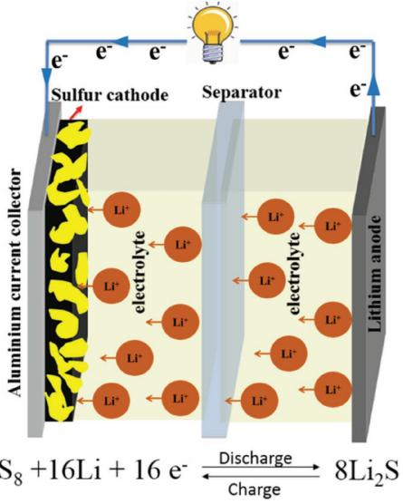

**Figure 1.** Schematic diagram of a lithium–sulfur (LiS) cell showing its components and the chemical reaction.

working on it, researchers have yet to solve all the challenges in order to commercialize the system. There are three main challenges that need to be solved for the commercialization of LSBs.

The first challenge is the insulating nature of sulfur. Sulfur is not electrically conductive at all and shows an electrical conductivity of 5 × 10−30 S cm−1 , [15–21] which leads to poor active material accessibility and low utilization of sulfur in the electrode. The second challenge is the reduction product of sulfur. When sulfur is fully reduced (during discharging), lithium sulfide (Li2S) is formed, which is not only electrically insulating but also ionically insulating.[22–25] Moreover, when sulfur is reduced to Li2S, it is deposited on the surface of the cathode, and once a thin Li2S layer completely covers the whole electrode, further lithiation is largely impeded, causing the voltage to decrease rapidly. Thus, the complete conversion of sulfur to Li2S rarely

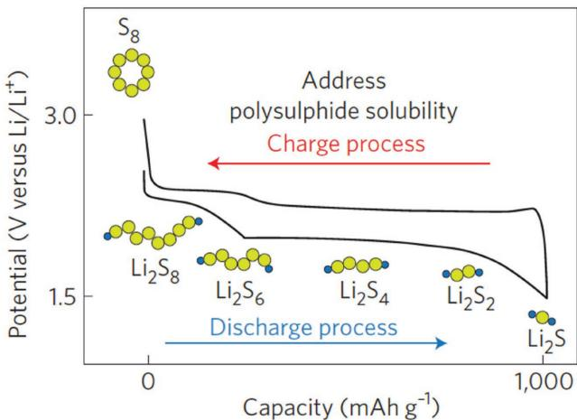

**Figure 2.** The charge–discharge curve shows the oxidation and reduction of sulfur. Reproduced with permission.[1] Copyright 2012, Nature Publishing Group.

occurs, and in every case, the discharge capacity is less than 80% of the theoretical capacity.[9] Third, and the most fatal challenge by far, polysulfide can dissolve into the electrolyte. Polysulfide anions, which are readily formed as reaction intermediates, are highly soluble in organic electrolyte solvent,[24] where they then create a concentration gradient in the electrolyte and move to the anode surface through diffusion. These soluble species are then reduced to Li2S, which is insoluble in the electrolyte; thus, Li2S is precipitated out of the electrolyte and forms a passivation layer at the lithium anode surface, which causes the loss of active material and increases the impedance of the Li–S cell. Furthermore, the polysulfide dissolution and precipitation process alters the morphology of the cathode in each cycle, such that it does not return to its initial morphological structure, leading to ≈80% volume expansion from S to Li2S, which induces strain inside the electrode and results in low active material utilization and poor cycle life.[26–29] Polysulfide dissolution is also responsible for the well-known "shuttle" phenomenon, where long-chain polysulfides diffuse to the surface of the lithium anode due to the concentration gradient and are reduced to short-chain polysulfides, which also creates a concentration gradient on the anode side. The shortchain polysulfides can then move back to the cathode where they are oxidized to long-chain polysulfides, again creating a concentration gradient. This parasitic process occurs continuously and creates an internal "shuttle" phenomenon.[30–46] The general mechanism of the shuttle phenomenon involving organic electrolyte is shown in **Figure 3**, which is redrawn from the concept that Akridge et al. proposed.[47]

To be precise, this shuttle phenomenon, along with its parasitic reactions, causes the following problems: (1) the consumption or loss of active material, (2) the corrosion of the Li metal anode, and (3) the polarization of the Li anode when insoluble Li2S and Li2S2 are formed and deposited on the Li surface. In other words, this shuttle phenomenon leads to low active material utilization, low coulombic efficiency, and short cycle life for the Li–S system.[48,49]

The first challenge in overcoming the insulating nature of sulfur in the Li/S system can be mitigated by the addition of conductive carbons, which have very high electronic and ionic conductivity, along with high voltage stability, low density, and chemical inertness.[37] Moreover, different chemical and mechanical processes for the fabrication of sulfur/carbon composites and innovative electrode design help increase the active material accessibility and utilization.[50,51] The second and third challenges are, however, closely related to the electrolyte, because the initial discharge products (longer chain polysulfides) are soluble in most organic electrolytes, which leads to Li2S deposition and the shuttle phenomenon. The selection of a suitable electrolyte (both solvents and salts) can abate the challenges and advance the commercialization of the Li/S system.[52–54]

#### **4. Fundamentals of Liquid Organic Electrolyte for the Li/S System**

The electrolyte is one of the most important components in an electrochemical device, along with the anode and cathode. The

**Table 1.** Reactions and their corresponding voltages during charging and discharging of an LSB.[9]

| Step | Corresponding reaction       | Voltage   |
|------|------------------------------|-----------|
| 1    | S8 + 2Li+ + 2e− ↔ Li2S8      | >2.3 V    |
|      | 3Li2S8 + 2Li+ + 2e− ↔ 4Li2S6 |           |
| 2    | 2Li2S6 + 2Li+ + 2e− ↔ 3Li2S4 | 2.3–2.1 V |
| 3    | Li2S4 + 2Li+ + 2e− ↔ 2Li2S2  | 1.9–2.1 V |
|      | Li2S4 + 6Li+ + 6e− ↔ 4Li2S   |           |
| 4    | Li2S2 + 2Li+ + 2e− ↔ 2Li2S   | <1.9 V    |

More simply, the first two steps, which involve the reduction of S8 to S8 2−, S6 2−, and S4 2−, resemble the first plateau of the discharge curve, while the last two steps, where S4 2− is reduced to S2 2− and S2−, form the second plateau of the discharge curve, which is shown in Figure 2.

main task of the electrolyte is to transfer ions between the two electrodes. However, the emergence of the Li-ion system and more advanced systems beyond Li, which can provide high energy and high power, have changed this view of the functionality of the electrolyte. The electrolyte can not only transport ions but can also help form a solid electrolyte interphase (SEI) on the electrode surface, which will prevent reactions between the electrolyte and the electrodes. Organic liquid electrolytes mainly consist of two or three substances, namely, the solvent and the salt, although in some cases, additives are also included. For the Li/S system, the theoretical voltage window between sulfur and lithium is less than 3 V (vs. Li/Li+), which facilitates the use of several organic solvents as the electrolyte in the Li/S system. Various forms of polysulfides (e.g., short chain, long chain, radicals) have been found to form during charging and discharging, which react with almost all the organic solvents that fit into that electrochemical window.[10] This reactivity of polysulfides, sulfides, and sulfur radicals limits the selection of organic solvents for the Li/S system to an extremely narrow range. Before we discuss the structure–property relationships of organic electrolytes, it is important to mention the fundamental properties of electrolytes, specifically the solvents and salts.

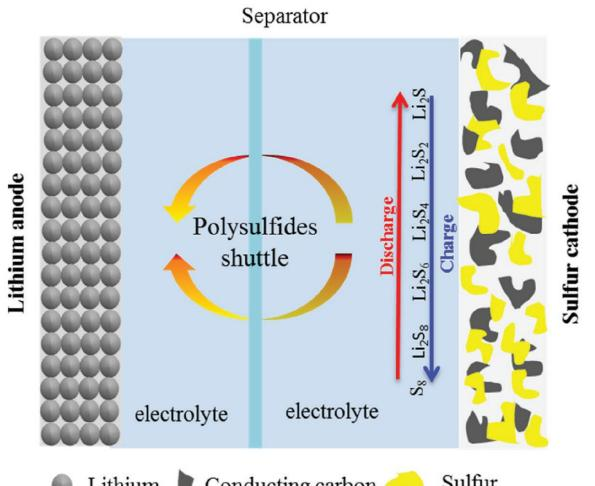

**Figure 3.** Schematic diagram of the shuttle phenomenon of polysulfides in Li/S batteries during charging and discharging.

#### **4.1. Properties of Solvents**

All protic solvents release hydrogen gas at 2.2 V, which makes them unsuitable as electrolyte solvents for the Li/S system. In addition to the large electrochemical voltage window, liquid organic solvents should meet a number of criteria to be effective electrolyte solvents, notably, high ionic conductivity, low electrical conductivity, high transference number, high and low temperature stability, high dielectric permittivity, low viscosity, inertness to all other cell components (e.g., the separator, electrode, spacer, etc.), low flammability, low toxicity, and finally, low cost.[55] It is difficult to find a unary solvent that possesses all these properties; however, a number of binary and ternary solvents exhibit the aforementioned properties.

Organic carbonates and esters, which meet almost all the criteria, are widely used in Li-ion batteries. Mixtures of cyclic (ethylene carbonate (EC) and propylene carbonate) and linear carbonates (dimethyl carbonate and diethyl carbonate (DEC)), which have high and low viscosity, respectively, feature the optimum properties of an effective electrolyte solvent and have been used in Li-ion batteries for two decades. It was expected that these electrolytes could also be used in the Li/S system. However, the polysulfide intermediates in the multiple reduction steps irreversibly react with carbonates and esters to form a sulfide carbonate complex, which makes these electrolytes unsuitable for the Li/S system. **Figure 4** shows the reaction mechanism proposed by Gao et al.[56]

Figure 4 shows that nucleophilic polysulfides attack the single-bonded carbon atoms attached to the oxygen atoms of the linear DEC and cyclic EC) molecules, which are partially positive and act as electrophiles due to electron attraction by the highly electronegative oxygen atoms. The central carbon atom, which is double bonded to an oxygen atom, is stabilized, however, by its resonance structure and shows steric hindrance, and thus it is unable to react with polysulfide nucleophiles. A similar mechanism can also be found for ester-based electrolytes. Moreover, ester-based electrolytes show very low dielectric permittivity and dipole moments, making them unsuitable to dissolve salts, and hence, reduce their ionic conductivity.[57]

Ethers, which are unsuitable electrolyte solvents for Li-ion batteries due to their instability above 4 V, have been considered as potential electrolytes for the Li/S system. Most ethers are stable in liquid form over a wide range of temperatures and have low viscosity, resulting in high ionic conductivity.[58] Most importantly, ethers do not react with polysulfides or sulfur radicals during charging and discharging processes, which makes them suitable electrolytes for the Li/S system.[56] The physical and chemical properties of common ether solvents are listed in **Table 2**. [55]

Table 2 shows that almost all ether-based electrolytes (both linear and cyclic) exhibit similar physicochemical properties, although cyclic ethers have been shown to have better cycling performance than linear ethers.[58] Importantly, cyclic ethers have higher viscosity than linear ethers, which impedes the movement of ions and results in low ionic conductivity. Thus, a mixture of linear and cyclic ethers is generally used as the electrolyte in Li/S systems. Among the linear ethers, dimethoxyethane (DME) is chosen due to its high dielectric permittivity, which helps dissolve a large amount of Li-based salts for

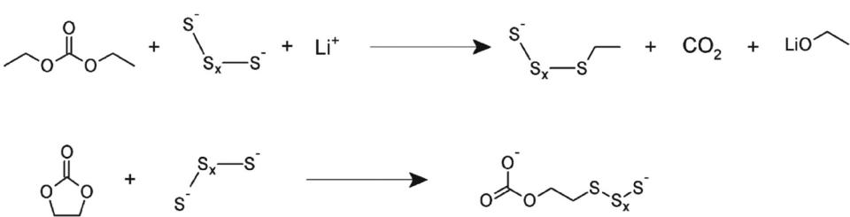

**Figure 4.** Proposed reaction mechanism of polysulfides in carbonate electrolyte. Reproduced with permission.[53] Copyright 2011, American Chemical Society.

better ionic movement. Among the cyclic ethers, tetrahydrofuran (THF) and DOL show higher dielectric permittivity. DOL is selected, however, due to its low dipole moment, which is ≈1.25 D compared to 1.7 D for THF. The dipole moment of a molecule strongly depends on the atoms and their arrangement in the molecule. Even though DOL contains two oxygen atoms, which are highly electronegative, its dipole moment is lower than that of THF, which has only one oxygen atom. **Figure 5**a shows the molecular structures and atomic arrangements of THF and DOL. The overall dipole moment of a molecule is approximately the vector sum of the bond dipole moments. In DOL, the two opposite bond dipole moments mitigate each other, and the resultant dipole moment is lower than that of THF. Because nucleophilic polysulfides have a higher tendency to react with molecules with higher dipole moments, THF is avoided as the solvent.

In addition to ethers, linear and cyclic glymes are also used as solvents in Li/S systems, and among them, tetraethylene glycol dimethyl ether (tetraglyme or TEGDME) and polyethylene glycol dimethyl ether (PEGDME) are notable.[59,60] All glymes have a very wide temperature stability (−27 to 275 °C) and high dielectric permittivity (≈6.7). Nevertheless, their viscosity is eight to ten times higher than that of both linear and cyclic ethers, which reduces their ion transfer mobility. Moreover, viscous electrolytes have very low wettability and show very high impedance, which makes them unsuitable for Li/S systems.[60]

As stated earlier and supported by the physicochemical properties observations, a single solvent cannot fulfill all the fundamental requirements for a suitable electrolyte. Moreover, in Li/S systems, the electrolytes should have additional properties, such as polysulfide solubility, resistance to reactions with

|  | Table 2. Physicochemical properties of ether-based solvents for Li/S batteries. |  |  |  |  |
|--|---------------------------------------------------------------------------------|--|--|--|--|
|--|---------------------------------------------------------------------------------|--|--|--|--|

| Solvent                      | Molecular formula | Melting temperature [°C] | Boiling temperature [°C] | Viscosity at 25 °C | Dielectric permittivity |
|------------------------------|-------------------|-----------------------------|-----------------------------|--------------------|-------------------------|
| Dimethoxy methane (DMM)      |                   | −105                        | 41                          | 0.33               | 2.7                     |
| Diethoxy ethane (DEE)        |                   | −74                         | 121                         | –                  | –                       |
| Dimethoxy ethane (DME)       |                   | −58                         | 84                          | 0.46               | 7.2                     |
| Tetrahydrofuran (THF)        |                   | −109                        | 66                          | 0.46               | 7.2                     |
| 1,3-Dioxolane (DOL)          |                   | −95                         | 78                          | 0.59               | 7.1                     |
| 2-Methyl-tetrahydrofuran     |                   | −137                        | 80                          | 0.47               | 6.2                     |
| 2-Methyl-1,3-dioxolane (DOL) |                   | –                           | –                           | 0.54               | 4.39                    |
| 4-Methyl-1,3-dioxolane (DOL) |                   | −125                        | 85                          | 0.60               | 6.8                     |

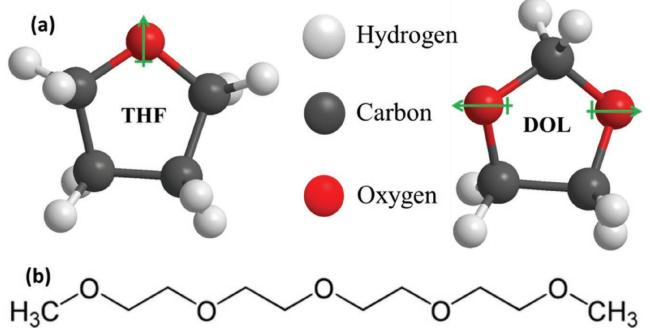

**Figure 5.** a) Directions of the dipole moments in THF and DOL and b) the molecular structure of TEGDME.

nucleophilic polysulfides, etc.[10] A number of binary and ternary solvent mixtures containing combinations of different unary solvents have been used in the Li/S system. Only a few of them, however, could meet the property requirements, which are shown in **Table 3**. Among binary mixtures, TEGDME/DOL and DME/DOL have been studied extensively.[61–67] Both TEGDME/ DOL and DME/DOL were found to show very high discharge capacity. Though TEGDME/DOL has high viscosity and low ionic conductivity compared to DME/DOL, it has a synergistic effect on the ionic conductivity and polysulfide solubility. Henderson[64] showed that in the presence of the additional oxygen atoms in TEGDME (Figure 5b), Li+ ions are solvated due to the attraction of the electronegative oxygen atoms. They also studied different ratios of TEGDME to DOL and found that the best performance was obtained with a ratio of 30:70, at which the sulfur utilization and ionic conductivity were maximized.

DME/DOL binary solvent may be the most popular and beststudied solvent for the Li/S system due to its attractive properties. Both DOL and DME have very high dielectric permittivity, low viscosity, high temperature stability, and low molecular weight and are able to form a stable SEI on the Li metal surface. Because of these attractive properties, the binary solvent of DOL and DME has very high ionic conductivity, low viscosity, and high polysulfide solubility,[63] which makes it one of the best potential electrolyte solvents. In addition to binary solvents, ternary solvents have also been considered. Peled et al.[14] studied a THF/DOL/toluene mixture, although its low ionic conductivity and dielectric permittivity limit its potential usage.

Gao et al.[56] evaluated the cycling performance of a sulfur– carbon composite with different electrolyte solvents. **Figure 6** shows that carbonate-based electrolytes exhibit no capacity after the first discharge cycle due to the irreversible reaction between the carbonates and polysulfides, which is triggered when the nucleophilic polysulfides attack the partially polarized

**Table 3.** Properties of common binary and ternary solvents for Li/S battery electrolytes.

| Solvent mixture | Ratio   | Viscosity [cP] | Ionic conductivity at 25 °C [mS cm−1 ] | Refs. |
|-----------------|---------|----------------|----------------------------------------------|-------|
| TEGDME/DOL      | 33:67   | 1.9            | 8.5                                          | [66]  |
| DME/DOL         | 50:50   | 0.5            | 10.5                                         | [67]  |
| THF/DOL/toluene | 10:30:6 | –              | 3.5                                          | [14]  |

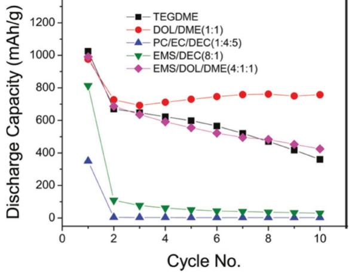

**Figure 6.** Effects of different solvents on the cycling performance of Li/S batteries. Reproduced with permission.[56] Copyright 2011, American Chemical Society.

and higher-dipole-moment carbonate-based solvents. In contrast, ether-based solvents show high initial capacity along with high capacity retention. Among the ether-based solvents, DOL/ DME (1:1) shows a very high discharge capacity along with the highest capacity retention. The better physicochemical properties of DOL/DME (1:1), such as higher ionic conductivity, lower viscosity, and higher dielectric permittivity, which depend on the molecular structure of DOL and DME, afford a higher discharge capacity. Moreover, the chemical inertness of DOL and DME toward the polysulfides and sulfur radicals that evolve during charging and discharging also play a pivotal role in achieving a higher discharge capacity and better capacity retention.

Mikhaylik et al.[68] studied the utilization of sulfur in etherbased electrolytes for Li/S batteries. They specifically focused on DOL, DME, and an equimolar mixture of DOL and DME. They found that the solvents DOL and DME, which have low viscosity, provide a balance among active material utilization (sulfur), rate capability, and high temperature stability over a wide operating range. DOL, which has a lower dipole moment due to the presence of two oxygen atoms with opposite dipole moment directions, has lower polysulfide solubility and slower kinetics than DME, but generates a more stable SEI on the anode (lithium) surface, which reduces the shuttle problem and affords high capacity retention (**Figure 7**). On the other hand, DME, which is a linear molecule with a higher dipole moment than DOL, shows higher reactivity toward lithium but exhibits higher polysulfide solubility and faster kinetics, which improve the cathode operation,[68] and thus DME-based batteries feature high initial capacity but lower capacity retention. Figure 7 also shows that the mixture of these two electrolyte solvents (1:1 by volume) exhibits a synergistic effect related to the discharge capacity and cycle life.

In addition to the general properties of ideal electrolytes, such as viscosity, ionic conductivity, thermal stability, dielectric permittivity, and donor number, DOL and DME-based electrolyte possesses another significant property, which is the formation and stabilization of S3 \*− radicals.[69,70] Other electrolytic solvents such as THF, which has a similar donor number and dielectric permittivity to DME, does not exhibit the stabilization of S3 \*− radicals.

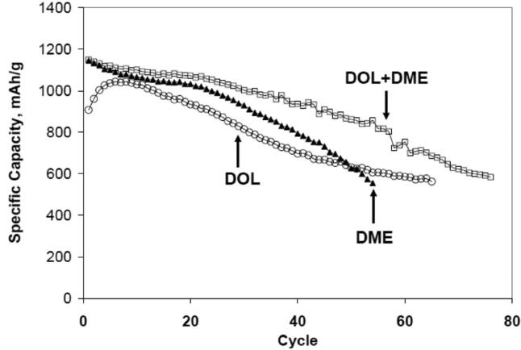

**Figure 7.** Cycling performance of DOL and DME-based electrolyte. Reproduced with permission.[65] Copyright 2010, Electrochemical Society.

It was hypothesized that the higher number of oxygen atoms in the molecular structure of DOL/DME can trigger the formation of stable S3 \*− radicals.[70,71] It has been found, based on extensive observations, that the S3 \*− radical helps to increase the active material utilization in the Li–S battery by completing the reduction and oxidation of sulfur and lithium sulfide (Li2S), respectively.[72] Therefore, the DOL and DME-based electrolyte shows higher electrochemical performance.

An important observation was reported by Barchasz et al.[58] They investigated the first discharge capacity with respect to the number of oxygen atoms present in the molecular structure of the solvent and found a linear relationship, where a greater number of oxygen atoms in the solvent increase the initial capacity. As seen in **Figure 8**, polyethylene glycol dimethox-

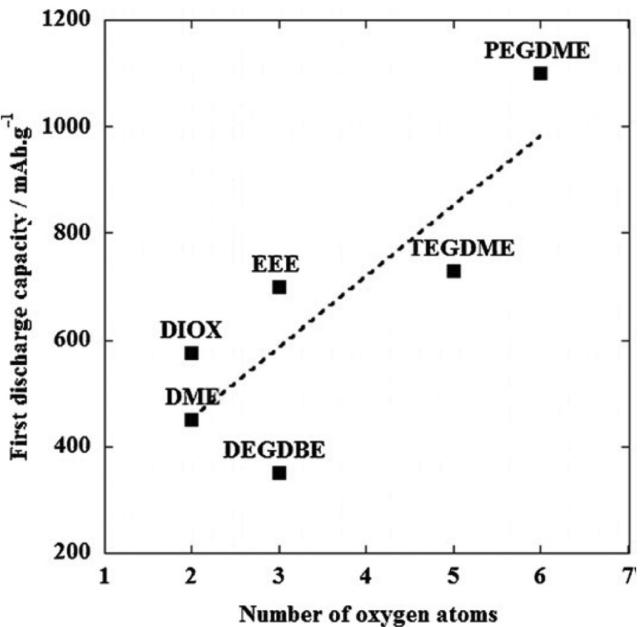

**Figure 8.** First discharge capacity versus the number of oxygen atoms in the different electrolyte solvents. Reproduced with permission.[55] Copyright 2013, Elsevier.

yethane (PEGDME) shows the highest initial discharge capacity compared to other ethers that contain fewer oxygen atoms. The primary reason behind this finding is the sixfold coordination of lithium ions and the higher solvation capability of longer chain glymes. The secondary reason behind this finding is the greater solubility of shorter chain polysulfide in longer chain glymes, which reduces the passivation of the cathode surface and hence increases the active material utilization.[58] Even so, these longer chain glymes fail to exhibit high discharge capacity due to their higher viscosity. On the other hand, DOL (DIOX in Figure 8) shows a similar discharge capacity to TEGDME, even though DOL contains only two oxygen atoms. The mechanism behind this is still not fully understood, although it has been proposed that the cyclic molecular structure has a different dipole moment orientation than linear ethers and thus solvates lithium differently.[58]

#### **4.2. Salts for the Li/S System**

Like solvents, salts should also possess certain properties to be ideal solutes for the solvents and to be a component of a suitable electrolyte. The general requirements of a salt that can be used as an electrolyte solute are as follows:

(1) The salt should have higher solubility in aprotic solvent, which means that the lattice energy of the salt should be low, so that without forming a hydrogen bond, the Li+ ion can be dissociated from its counter anion. Moreover, after the formation of Li+, the anion should have a very high mobility in that solvent.[55]

(2) The anion should have very high stability and be inert to the solvent. This phenomenon is related to the lattice energy and solubility. Stable anions can form crystals with very low lattice energy and can dissociate very easily. In aprotic solvent, the dissociation of salts occurs by the attraction of lone pair electrons in the solvent to Li+. In other words, dissociation occurs through a Lewis acid–base interaction between the solvent and the salt.[73] Thus, conventional simple salts cannot be used due to their very high lattice energy, which cannot be overcome by the weak Lewis acid–base interaction.

(3) The salt, specifically the anions, should exhibit an optimum donor number (ability to donate electrons). Because higher donor number anions are strong Lewis bases and have a tendency to donate electrons, the stability of the anion is reduced. Moreover, higher donor number anions have a significant effect toward reducing the solubility of polysulfides. In contrast, lower donor number anions may act as Lewis acids, which will react with nucleophilic polysulfides.

(4) Finally, both the anion and the cation should be inert towards other parts of the battery, specifically the separator, current collectors, and shells.

**Table 4** summarizes the molecular structures and physicochemical properties of conventional lithium salts commonly used in Li/S batteries. As mentioned earlier, carbonate-based electrolytes react with polysulfides and are not suitable for Li/S systems, which makes LiPF6, LiBF4, and LiAsF6 incompatible.[75] These three salts generally show better physicochemical properties in carbonate-based solvents, although LiPF6 will induce the polymerization of DOL, greatly decreasing the

**Table 4.** Molecular structure, ionic conductivity, and donor number of common Li-salt anions. Molecular structures reproduced with permission.[57] Copyright 2015, Royal Society of Chemistry (RSC).

| Li-salt anion | Molecular structure | Solvent (1:1) with 1 m Li salt | Ionic conductivity at 25 °C [mS cm−1 ] | Donor numbera) |
|---------------|---------------------|--------------------------------|----------------------------------------------|----------------|
| − PF6      |                     | EC–DMC                         | 10.8                                         | 2.5            |
| − ClO4     |                     | EC–DMC                         | 10.1                                         | 8.4            |
|               |                     | DOL–DME                        | 7                                            |                |
|               |                     | DOL–TEGDME                     | 5                                            |                |
| TFSI−         |                     | EC–DMC                         | 9                                            | 5.4            |
|               |                     | DOL–DME DOL–TEGDME          | 11 7                                      |                |
| − BF4      |                     | EC–DMC                         | 4.9                                          | 6              |
| − AsF6     |                     | EC–DMC                         | 11.1                                         | 2.5            |
| BETI−         |                     | DOL–DME                        | 11.1                                         | –              |

a)The donor number of different anions, measured using tetrabutylammonium (TBA+) as the counter cation.[74]

ionic conductivity of the electrolyte, which makes it inappropriate for the Li/S system. LiClO4, however, is compatible with both carbonate- and ether-based solvents and shows very low ionic conductivity in ether-based electrolyte compared to that in carbonate-based electrolyte. Moreover, chlorate anions (ClO4 −) are very strong oxidants (due to the high oxidation number of chlorine) and react vigorously with ethers at high temperature and high current.[55] The two remaining salts, lithium bis(trifluoromethylsulfonyl)imide (LiTFSI) and lithium bis(pentafluoroethanesulfonyl)imide (LiBETI), are considered to be suitable in ether solvents due to their high ionic conductivity. LiTFSI, however, features a lower viscosity, well-defined temperature stability, optimum donor number, and low cost, which makes it a better option than LiBETI as a Li/S battery salt in ether-based solvents.

LiTFSI, which features a low melting point (234 °C) and very high conductivity (11 mS cm−1 ) in DOL–DME solution, has a resonance stabilized anion (TFSI−). Due to the resonance stabilization, TFSI− anions act as very poor Lewis bases, leading to lower lattice energy and higher ionic conductivity. Thus, LiTFSI can dissociate even in solvents with very low dielectric coefficients.[76,77]

**Figure 9** shows the five different stable resonance structures of the TFSI anion, where the negative ions (delocalized electron clouds) continuously shift between the nitrogen and the four oxygen atoms. This resonance stabilization is also triggered by two strongly electron-withdrawing triflic (CF3) groups. Hence, the bond between Li+ and TFSI− is very labile and dissociates with very little energy.[78] Thus, the LiTFSI salt is highly soluble in both protic and aprotic solvents. In protic solutions (e.g., water), LiTFSI can have a solubility as high as 21 mol kg−1 (molal), and in aprotic solutions (DOL–DME), 7 m (molar) has been reported so far.[79,80] The low lattice energy and dissociation energy of LiTFSI creates a new electrolyte

**Figure 9.** Resonance structure of the TFSI anion. Reproduced with permission.[51] Copyright 2004, American Chemical Society.

system, commonly known as concentrated electrolyte or "salt in solvent" electrolyte.

It is important to mention here that the solubility of polysulfides sharply drops with decreasing polysulfide chain length. This has been elaborately described by Pan et al.[81,82] in their Li–S redox flow battery system. They also found that L2S4 polysulfide shows less than 0.1 m solubility in DOL/DME solution, whereas THF and other solvents (e.g., dimethyl sulfo-oxide) show higher solubility. From the above information, it seems that the DOL/DME solvent is not suitable for Li/S battery electrolyte. However, they further observed that, with the addition of stable anion, the solubility of L2S4 polysulfide in DOL/DME electrolyte increased drastically. A small amount of LiTFSI salt can increases Li2S4 and Li2S2 polysulfide significantly.

It can be inferred from the properties of the solvents and salts that a binary mixture of DOL and DME along with the organometallic salt LiTFSI should exhibit better electrolytic properties in Li/S systems. For further confirmation, it is necessary to employ the electrolyte in an electrochemical cell and evaluate its performance. Kim et al.[83] recently compared the effects of different salts in DOL–DME solvent on the cycling performance of Li/S batteries, and the results are shown in **Figure 10**. As expected, LiTFSI shows the best cycling performance, specifically the best initial discharge capacity and capacity retention compared to the other salts, due to its high ionic conductivity in DOL–DME solvent and its highest donor number. These two properties are determined by the anionic stability of the salt and the compatibility between the salts and solvents. In both cases, LiTFSI shows promising features due to the five different resonance structures of TFSI. LiBETI, which also possesses a stable anion, shows promising capacity but is impaired by its high viscosity and cost. On the other hand, LiPF6 and lithium triflate (LiTf) are not well-suited to DOL–DME solvent and also have low donor numbers.

Cao et al.[84] investigated the anionic activity of Li-salts toward the stability of the lithium metal anode in the Li/S battery. They used equimolar DOL/DME as the solvent and LiTFSI and lithium bis(fluorosulfonyl)imide (LiFSI) as the salts with a concentration of 3 m and observed the cycling performance. The cycling performance, presented in **Figure 11**, of the LiTFSIcontaining electrolyte shows a high specific capacity and high capacity retention, even after 200 cycles, whereas the cell with the LiFSI-containing electrolyte was unable to achieve high capacity and exhibited very low capacity retention, even after 40 cycles. They finally concluded that the NS bond in the FSI− anion is the weakest, and its breakage could lead to the formation of lithium sulfate (LiSO*x*) in the presence of polysulfide. The continuous breakage of the NS bond will induce the fast growth of insulating lithium sulfate passivation layers, along with other complexes. On the other hand, the CS bond in the TFSI− anion is much stronger compared to the NS bond in the FSI− anion, and hence, breakage of the CS bond in the

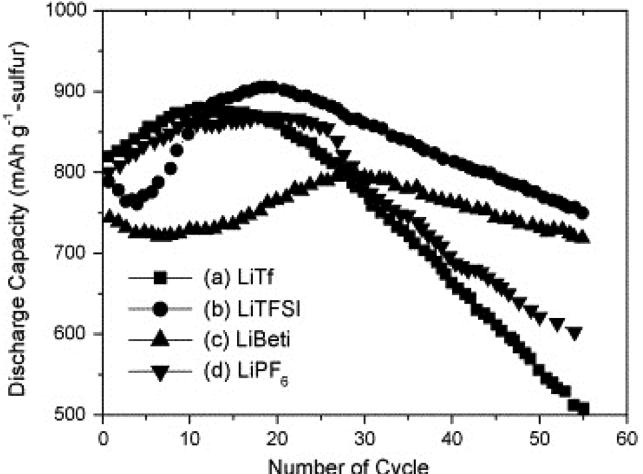

**Figure 10.** Cycling performance of Li/S cells containing a DOL/DME solvent mixture with a 1 m salt concentration. Reproduced with permission.[74] Copyright 2007, Elsevier.

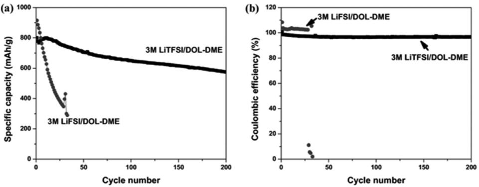

**Figure 11.** a) Cycling stability and b) coulombic efficiency of LiS batteries with 3 m LiTFSI and 3 m LiFSI in DOL–DME (1:1 by volume). Reproduced with permission.[74] Copyright 2016, Wiley.

TFSI− anion is unlikely; furthermore, even if it does break, it leads to the formation of lithium sulfide (LiS*x*) in the presence of soluble polysulfide. They also stated that the diffusion coefficient of FSI− anions (*D*FSI) in 3 m LiFSI–DME/DOL is clearly larger than the measured value for Li (*D*FSI > *D*Li). The diffusion coefficient of TFSI− anions in 3 m LiTFSI–DME/DOL, however, is similar to that of Li+ (*D*TFSI ≈ *D*Li). The higher diffusion coefficient of FSI− anions generally reflects weaker coordination by the solvent molecules, which may accelerate their decomposition on the surface of the Li metal anode, leading to a greater extent of polysulfide shuttling.

Another important characteristic for LiTFSI salt in DOL/ DME solvent has been observed by Suo et al. He found that highly concentrated LiTFSI salt in DOL/DME (later, he named it solvent-in-salt electrolyte) exhibits better electrochemical performance compared to its low concentration electrolyte. He demonstrated that this concentrated electrolyte can not only inhibit the polysulfide dissolution phenomenon but also can effectively protect the metallic lithium anode against the formation of lithium dendrites.[80] **Figure 12** shows that 7 m LiTFSI in DOL/DME solvent not only exhibits a higher discharge capacity compared to 2 m and 4 m electrolyte but also shows very high rate capability and better coulombic efficiency.

Transportation of ions, another important characteristics of electrolyte, has been briefly discussed in this section. The weakly coordinated lithium ion-based salts release lithium ion when solvated in solvent. During charging and discharging these ions move back and forth in between electrodes. The number of ions transported between the electrodes and their speed determine the energy and power of a battery. The ability to transfer a higher number of ions with greater speed between electrodes is also one of the key criteria for a suitable electrolyte. Ion transport between electrodes generally occurs in three ways: migration, convection, and diffusion.[55] Among them, migration and diffusion are the major transport means; however, ions in the electrolyte that are transported through convection are coordinated with electrolyte molecules and are driven to the counter electrode by an electric field. The speed of the ions has a significant impact on the energy and power of a cell

ν π = 1/( ) 6 η*r* (1)

The ion mobility is heavily dependent on the electrolyte, specifically the structure of the solvent and the viscosity of the electrolyte, which depend not only on the solvent structure but also on the salt. Equation (4), the Stokes–Einstein equation, determines the velocity of the ions. In Equation (4), η represents the viscosity of the electrolyte, *r* represents the solvation radius, and ν represents the ion mobility. The equation states that the ion mobility is inversely proportional to the viscosity and the solvation radius. Again, the viscosity and the solvation radius are functions of the solvents and salts. Solvents and salts that have high molecular weights and larger sizes show high viscosity and hence reduced ion mobility. Therefore, TEGDME/DOL has a lower ionic conductivity than DOL/DME.

#### **5. Additives and Formation of a Solid Electrolyte Interphase for Li/S Batteries**

From a thermodynamic point of view, electrolytes and salts should have an electrochemical stability window (energy gap between the highest occupied molecular orbital and the lowest unoccupied molecular orbital) that is beyond the oxidation and reduction potentials of the anode and cathode, respectively. The Li/S system, where Li metal is used as the anode, has a reduction potential of −3.04 V (vs. the standard hydrogen potential), which is higher than the lowest unoccupied molecular orbital energy of most aprotic electrolytes. Thus, the electrolyte should continuously decompose when the potential of the electrode passes beyond the electrochemical stability window. However, electrolytes have been shown to decompose and form an SEI layer on the lithium surface, which prevents further decomposition of the electrolyte.[85] In the Li/S system, when DOL/DME with LiTFSI salt is used as the electrolyte, an SEI is formed on the Li anode by the decomposition of DOL and LiTFSI.[86] The exact mechanism for the formation of the SEI is yet to be discovered, although it has been hypothesized that a thin layer of lithium complexes (LiOR, HCO2Li, Li2NSO2CF3, Li2SO2CF3, and Li*x*CF*y*) derived through reactions of DOL, LiTFSI, and lithium[85] comprise the thin SEI layer. However, due to the infinitive volume change of the Li anode during Li deposition/ depletion, this thin SEI layer cannot completely prevent further decomposition of the electrolyte during cycling.

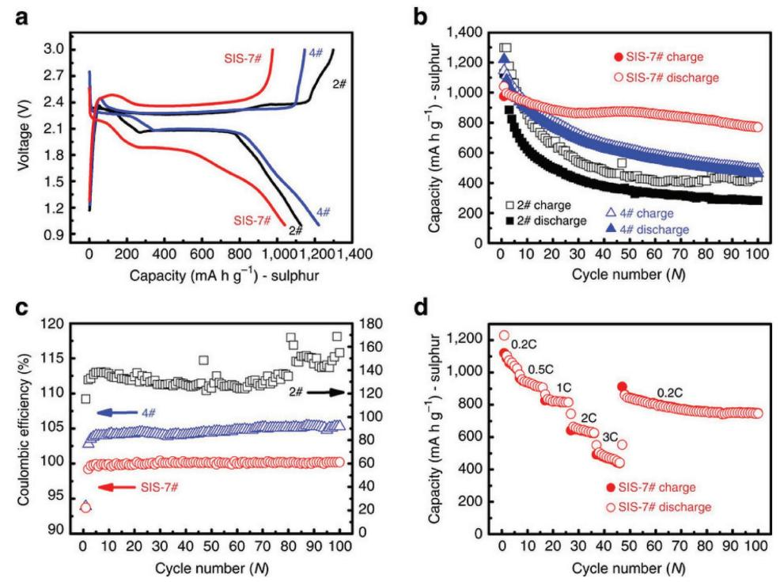

**Figure 12.** a) First discharge–charge profiles of C/S electrodes in electrolytes with different ratios of LiTFSI to DOL:DME (1:1 by volume), b) cyclic performance, c) coulombic efficiency at a current rate of 0.2C. d) Rate capability with 7 m LiTFSI electrolyte. Reproduced with permission.[80] Copyright 2013, Nature Publishing Group.

As mentioned earlier, the Li/S battery suffers from several notable challenges, and among them, the shuttle phenomenon, where longer chain polysulfides react with lithium and are reduced to shorter chain polysulfides, is the most notorious. The thin SEI layer that is formed by the decomposition of DOL and LiTFSI fails to prevent polysulfide diffusion to the lithium metal surface, and hence, severe capacity fading occurs in subsequent cycles. Comprehensive research has been conducted to mitigate this challenge, and the use of additives, specifically lithium salts (simple salts), was found to be helpful.[10,87–89] Among them, LiNO3 results in the most significant improvement in the cycling performance by forming a more stable and thicker SEI layer, which suppresses the shuttle phenomenon.[58,90] Aurbach et al. proposed that LiNO3, LiTFSI, and lithium metal react with ether-based electrolyte to form multiple complexes, which are then deposited at the lithium metal–organic electrolyte interface.[86] Xiong et al. meticulously studied the SEI formation and characterized its chemical structure. They found not only that LiNO3, LiTFSI, and DOL are responsible for SEI formation but also that polysulfides play a critical role in thickening the SEI layer.[89–92] They proposed that long-chain polysulfides (Li2S8, Li2S6, and Li2S4) dissolve during the first discharge, are reduced to short-chain polysulfides (Li2S2 and Li2S), and are deposited on the lithium metal surface along with the reduced product of LiNO3 (LiN*x*O*y*).[91,92] Another layer is also deposited on top of this layer, which consists of lithium sulfate and lithium thiosulfate formed through oxidation of the polysulfides (**Figure 13**). They also inferred that this top layer is much more stable and prevents direct contact between the electrolyte and the fresh lithium surface, which helps reduce the shuttle phenomenon.[93] A schematic illustration of their proposed SEI formation mechanism is shown below.

The effects of LiNO3 on the electrochemical performance have been studied by several researchers.[59,94,95] Among them, Liang et al. studied the effects of LiNO3 on the coulombic efficiency of a polypyrrole-coated sulfur electrode. They found that with the addition of 0.1 m LiNO3, 100% of the coulombic efficiency was retained, even after 50 cycles (**Figure 14**), and they concluded that a small amount of LiNO3 can form a dense and stable SEI, which successfully prevents the reduction of longer chain polysulfides, hence alleviating the shuttle phenomenon.

#### **6. Application of DOL/DME–LiTFSI-Based Electrolyte in Li/S Batteries**

Thus far, it has been well established that DOL/DME and LiTFSI-based electrolyte with LiNO3 additive possesses better electrochemical performance than alternative electrolytes. A short survey of the Web of Science was conducted regarding number of papers published on Li/S batteries in 2016. Among the 553 papers published in 2016, more than 92% used DOL/ DEM and LiTFSI electrolyte in their Li/S system, with most using LiNO3 as an additive in the electrolyte. A few recent works that have been published in high-impact journals, where DOL/DME and LiTFSI-based electrolyte was used along with a modified cathode and separator, are presented below, with details on their electrochemical performances.

**Figure 15**a,b shows the discharge capacity of two different Li/S cells that used DOL/DME and LiTFSI electrolyte with

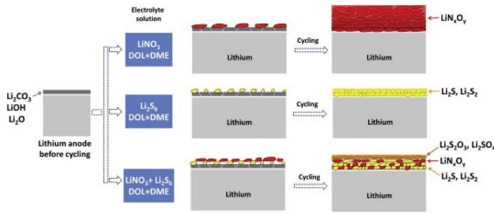

**Figure 13.** Effects of LiNO3 and polysulfides on the formation of the SEI. Reproduced with permission.[81] Copyright 2012, Elsevier.

LiNO3 additive. The only difference was in the fabrication of the cathode, where a polybenzimidazole binder was used in Figure 15a and a combination of different conductive carbons was used in Figure 15b. In both cases, the discharge capacity remained stable, even after several hundred cycles, and a very high coulombic efficiency was achieved, which is only possible by using the best combination of solvents, salts, and additives in the electrolyte.

Similar to Figure 15, **Figure 16** also shows the electrochemical performance of a Li/S system containing a DOL/DME, LiTFSI, and LiNO3 electrolyte system along with two modified sulfur cathodes. In Figure 16a, lithiated sulfur anchored in single-layer graphene was used instead of the conventional sulfur/carbon composite cathode. Alternatively, a sandwichtype hybrid carbon nanosheet and sulfur composite was applied in Figure 16b. In both cases, a high and stable discharge capacity was achieved, even at very high current density. It has been accepted by the scientific community that a high electrochemical performance can never be achieved by solely modifying the electrodes, specifically the cathode, unless a suitable electrolyte is employed.

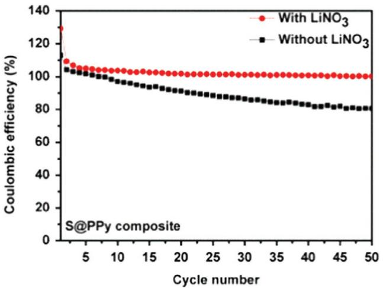

**Figure 14.** Effect of LiNO3 on the coulombic efficiency of a polypyrrolecoated sulfur cathode. Reproduced with permission.[55] Copyright 2015, Elsevier.

#### **7. Carbonate-Based Electrolyte with a Short-Chain Sulfur-Based Cathode for Li/S Systems**

As discussed earlier, even though carbonate-based electrolytes show better physiochemical properties and have been used in Li-ion batteries for the last two decades, they are not suitable for Li/S systems due to the irreversible reactions that occur between polysulfides and carbonates. The proposed mechanism and reaction products are shown in Figure 4. It was previously established that carbonate-based electrolytes are unsuitable for Li/S systems; however, in 2010, Gao and co-workers[48] reported that carbonate-based electrolytes (EC, PC, and DEC) together with LiPF6 salt can be used in Li/S batteries, but only if the sulfur particles are homogeneously dispersed inside the micropores of carbon spheres. Later, different approaches[100–103] were adopted to use carbonate-based electrolyte, in which different carbon sources were used instead of microporous carbon. Gentle and co-workers[100] used a hierarchy of micropores and mesopores, and Guo and Wang[104] impregnated disordered carbon nanofibers with sulfur, making them compatible with carbonate-based electrolytes. Both groups successfully used carbonate electrolytes, although the mechanism at the molecular level was not explained.

Few hypotheses regarding the mechanisms involved in the use of carbonate-based electrolytes have been well-accepted by the scientific community, namely, the formation of special complexes, the desolvation of solvated lithium ions in micropores, and the assimilation of short-chain sulfurs in micropores.[105] Among them, the latter approach is favored by most researchers. Wang et al. have claimed that at high temperature or in solution, short-chain sulfurs (S4, S2, etc.) can easily be impregnated into micropores due to their simple and linear molecular structure, and during discharge, they react with lithium to form short-chain polysulfides, which are nonreactive to carbonate-based electrolytes. The single plateau discharge curve and stable cycling performance, as shown in **Figure 17**, strengthen this claim. The conventional two-plateau discharge curve of Li/S systems, where the first plateau results from the formation of longer chain polysulfides (Li2S8, Li2S6), is absent in this case, which also supports the claim that small-chain sulfurs are confined in the micropores. In addition, the exceptional cycling stability, shown in Figure 17, also

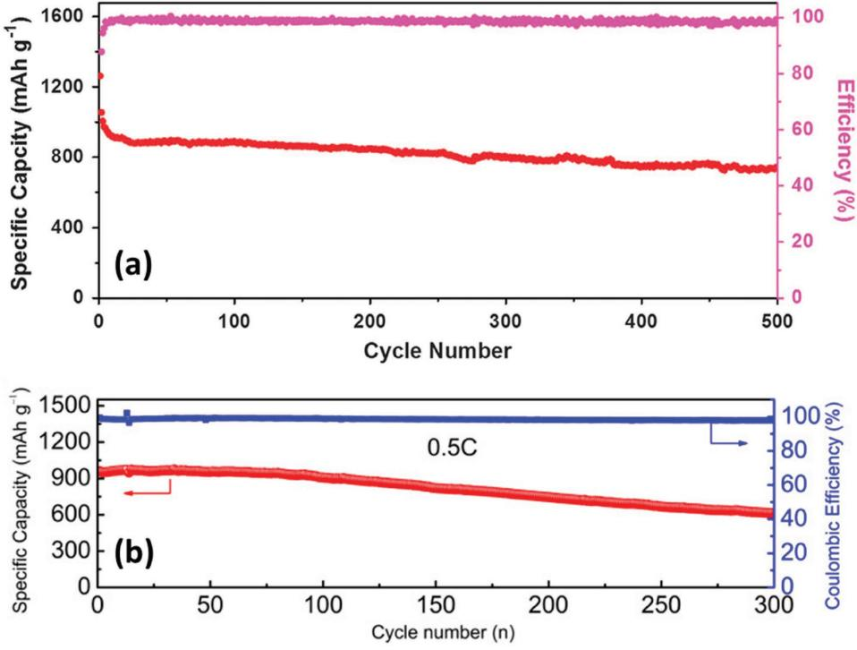

**Figure 15.** Electrochemical performance of Li/S systems where DOL/DME and LiTFSI electrolyte and LiNO3 additive were used with a) a polybenzimidazole binder and b) carbon nanotubes (CNTs) and activated carbon nanofibers (ACNFs) in an MnO2 host. a) Reproduced with permission.[96] Copyright 2016, Nature Publishing Group. b) Reproduced with permission.[97] Copyright 2016, Elsevier.

supports the claim that there are no longer chain polysulfides, which are mainly responsible for the abrupt capacity decay with cycle number due to the polysulfide shuttle phenomenon. Very recently, Aurbach and co-workers[105] claimed that porous carbon, with a pore size of 2–3 nm, can not only accommodate short-chain sulfur but can also accommodate long-chain sulfur or octasulfur (S5 to S8) and also exhibits the same discharge plateau behavior, which invalidates the proposed effect of the confinement of small-chain sulfurs in the microporous carbon.

Aurbach and co-workers[105] also claimed that the formation of an SEI on the sulfur cathode through a quasi-solid-state reaction during the initial discharge is responsible for the single plateau discharge curve and higher capacity retention. They found that the initial discharge plateau showed an extremely high discharge capacity compared to that in the second and third cycles, which is due to the irreversible reaction between the carbonate-based electrolyte and the microporous carbon/ sulfur composite to form an SEI on the cathode surface. Later, Ishikawa and co-workers[101] found that this single plateau behavior is found not only with carbonate electrolytes but also with ionic liquid and glyme electrolytes, as shown in **Figure 18**. They also showed support for the quasi-solid-state reaction behavior, as a high discharge capacity during initial discharge was also observed in each of the electrolytes that they studied.

Importantly, even though the use of carbonate-based electrolyte promotes high capacity retention, the discharge capacity is quite low, and the cell voltage is ≈1.5 V, which will reduce the total energy and power of the battery. Therefore, it can be

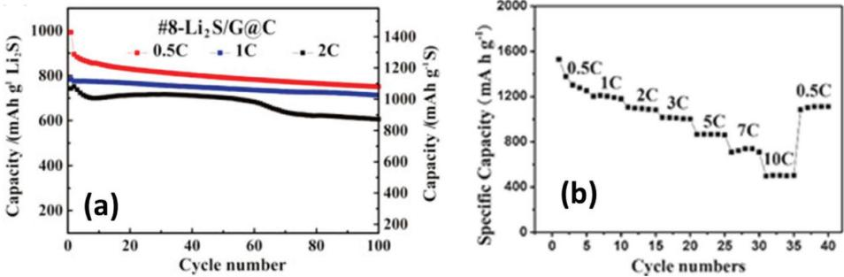

**Figure 16.** Electrochemical performance of an Li/S system containing a DOL/DME, LiTFSI, and LiNO3 electrolyte system and a) a graphene/Li2S cathode or b) a sandwich-type hybrid carbon nanosheet (SCNMM)/sulfur cathode. a) Reproduced with permission.[98] Copyright 2016, Elsevier. b) Reproduced with permission.[99] Copyright 2014, Wiley.

**Figure 17.** a) Charge–discharge curve and b) cycling performance of a sulfur-impregnated microporous carbon cathode. Reproduced with permission.[106] Copyright 2013, American Chemical Society.

inferred from the above discussion that carbonate-based electrolyte can only be used in microporous carbon and that the resultant cells still suffer from low energy and power.

#### **8. Fluorinated Electrolyte System for Li/S Battery**

Fluorinated ether-based electrolyte, which is a new kind of solvent for LiS system was recently introduced by Zhang and co-workers[107] and Wang and co-workers.[108,109] They used different types of linear fluorinated ethers, including bis(2,2,2-trifluoroethyl) ether (BTFE) and 1,1,2,2-tetrafluoroethyl-2,2,3,3-tetrafluoropropyl ether (TTE), instead of DME in the DOL/DME and LiTFSI system. They showed that the fluorinated ether-based solvent can form a stable and thick SEI, as well as reducing polysulfide dissolution. In addition, BTFE can significantly enhance the shelf life of the LiS system.

The schematic illustration in **Figure 19** shows that longchain polysulfides only have very limited solubility in the DOL/TTE solvent, which decreases the shuttle phenomenon. This new electrolyte system looks promising, but more fundamental work needs to be done, such as determining its ionic

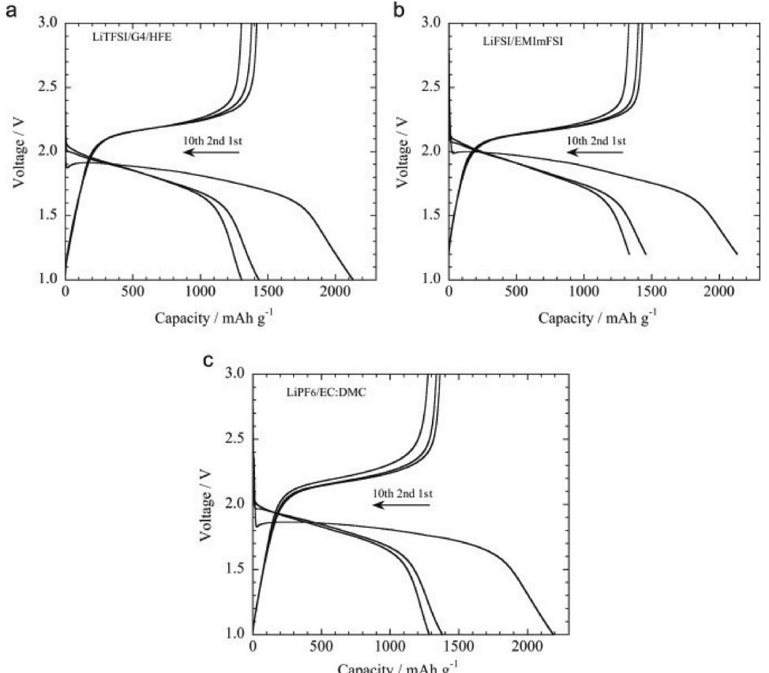

**Figure 18.** Charge–discharge curves of a sulfur/carbon electrode with a) LiTFSI/G4/HFE, b) LiFSI/EMImFSI, and c) LiPF6/EC:DMC electrolyte at 0.1 C. Reproduced with permission.[101] Copyright 2015, Elsevier.

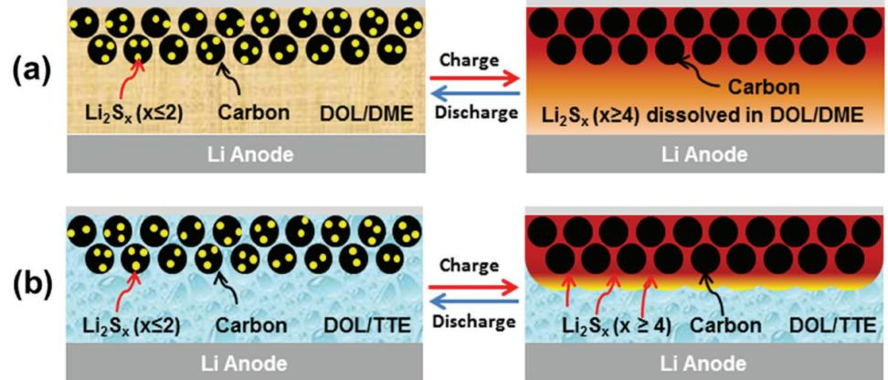

**Figure 19.** Schematic illustration of a) the reduction of polysulfide dissolution and b) the formation of a thick SEI in DOL/TTE electrolyte. Reproduced with permission.[107] Copyright 2015, American Chemical Society.

conductivity, viscosity, dielectric permittivity, and temperature stability. In addition, a comprehensive DOL-TTE/BTFE phase diagram also needs to be drawn to determine the most appropriate ratio of DOL to the fluorinated ethers.

#### **9. Conclusions**

In this mini review, we provided an overview of suitable organic electrolytes for Li/S systems. Moreover, the effect of the molecular structure on the properties of the solvents and salts in the electrolyte was also demonstrated. Proper selection of solvents, salts, and additives can significantly abate the challenges of Li/S batteries. However, these challenges are yet to be solved completely. The dissolution of elemental sulfur and longer chain polysulfides are indispensable and inevitable in Li/S systems. Since sulfur and its polysulfides are insulating in nature, polysulfide dissolved in the electrolyte (or catholyte) can effectively increase the active material utilization and enhance the redox reaction rate. However, highly soluble electrolyte suffers from the shuttle phenomenon due to the induced concentration gradient. Many researchers have inferred that manipulation of the solubility of polysulfide, with either controlled increases or decreases, can solve the challenges of Li/S systems. Concentrated electrolyte may successfully minimize the shuttle phenomenon by reducing the polysulfide solubility but can result in low ionic mobility and hence, low rate capability. If the lithium ion mobility and the transference number can successfully be improved in such concentrated electrolytes or ionic liquids, which also have appreciable polysulfide solubility, which increases the reaction rate and active material utilization, it is possible to mitigate all the challenges of Li/S systems. A mixture of DOL/DME solvents along with LiTFSI salt has been proven to be effective for ion transport, the dissolution of sulfur and polysulfides, the formation of a suitable SEI layer and the utilization of high amount active material by formation of stable S3 \*− radicals. The anionic stability of the LiTFSI salt and the reaction products of DOL and lithium increase the ionic conductivity and contribute to the thickness of the SEI layer, respectively. An additive salt, such as LiNO3, can also significantly reduce the shuttle phenomenon and increase the coulombic efficiency through the formation of a stable and dense SEI layer. Though the combination of DOL/DME, LiTFSI, and LiNO3 is currently the best electrolyte for the Li/S system, a few vital concerns remain. The high reactivity of LiNO3 and the high flammability of DOL/DME impede the commercialization of Li/S batteries. In addition, the cycling stability is another area of concern that can be mitigated by additives in this electrolyte system. Moreover, the amount of electrolyte also plays an important role in the electrochemical performance of LiS system. The dissolution of polysulfides largely depends on the electrolyte to sulfur ratio.[110] Comprehensive research should be conducted in DOL/DME and LiTFSI electrolyte systems to find out the electrolyte to sulfur ratio. The ongoing search for additives, salts, and solvents will surely resolve all the challenges of Li/S systems. We believe, however, that the solution lies in the electrolyte rather than in cathodic and anodic modifications of the Li/S system.

### **Acknowledgements**

The authors gratefully acknowledge the financial support provided by the Automotive Cooperative Research Centre (AUTO CRC 2020) and an Australian Research Council (ARC) Linkage Project (LP 160100914). The authors also thank Fang Li and Dr. Tania Silver for providing the schematic illustrations and a critical reading of the manuscript, respectively.

### **Conflict of Interest**

The authors declare no conflict of interest.

#### **Keywords**

lithium-sulfur batteries, organic electrolytes, structure-property relationships

Received: January 23, 2017 Revised: March 27, 2017 Published online: June 16, 2017

- [1] P. G. Bruce, S. A. Freunberger, L. J. Hardwick, J.-M. Tarascon, *Nat. Mater.* **2012**, *11*, 19.
- [2] M. Armand, J. M. Tarascon, *Nature* **2008**, *451*, 652.
- [3] Y. M. Chiang, *Science* **2010**, *330*, 1485.
- [4] S. S. Zhang, *J. Power Sources* **2013**, *231*, 153.
- [5] S. Zhang, K. Ueno, K. Dokko, M. Watanabe, *Adv. Energy Mater.* **2015**, *5*, 1500117.
- [6] A. Manthiram, Y. Fu, Y.-S. Su, *Acc. Chem. Res.* **2013**, *46*, 1125.
- [7] J. Zheng, M. Gu, M. J. Wagner, K. A. Hays, X. Li, P. Zuo, C. Wang, J.-G. Zhang, J. Liu, J. Xiao, *J. Electrochem. Soc.* **2013**, *160*, A1624.
- [8] A. Manthiram, Y. Fu, S.-H. Chung, C. Zu, Y.-S. Su, *Chem. Rev.* **2014**, *114*, 11751.
- [9] M. Wild, L. O'Neill, T. Zhang, R. Purkayastha, G. Minton, M. Marinescu, G. J. Offer, *Energy Environ. Sci.* **2015**, *8*, 3477.
- [10] J. Scheers, S. Fantini, P. Johansson, *J. Power Sources* **2014**, *255*, 204.
- [11] R. Xu, J. Lu, K. Amine, *Adv. Energy Mater.* **2015**, *5*, 1500408.
- [12] D. Larcher, J. M. Tarascon, *Nat. Chem.* **2015**, *7*, 19.
- [13] H. Yamin, A. Gorenshtein, J. Penciner, Y. Sternberg, E. Peled, *J. Electrochem. Soc.* **1988**, *135*, 1045.
- [14] E. Peled, Y. Sternberg, A. Gorenshtein, Y. Lavi, *J. Electrochem. Soc.* **1989**, *136*, 1621.
- [15] C. Erhardt, S'. Sörgel, S. Meinhard, T. Sörgel, *J. Power Sources* **2015**, *296*, 70.
- [16] Q. Zeng, X. Leng, K.-H. Wu, I. R. Gentle, D.-W. Wang, *Carbon* **2015**, *93*, 611.
- [17] J.-L. Shi, H.-J. Peng, L. Zhu, W. Zhu, Q. Zhang, *Carbon* **2015**, *92*, 96.
- [18] C.-Y. Fan, H.-H. Li, L.-L. Zhang, H.-Z. Sun, X.-L. Wu, H.-M. Xie, J.-P. Zhang, *Phys. Chem. Chem. Phys.* **2015**, *17*, 23481.
- [19] G. M. Zhou, L. Li, C. Q. Ma, S. G. Wang, Y. Shi, N. Koratkar, W. C. Ren, F. Li, H. M. Cheng, *Nano Energy* **2015**, *11*, 356.
- [20] J. W. Zhou, X. S. Yu, X. X. Fan, X. J. Wang, H. W. Li, Y. Y. Zhang, W. Li, J. Zheng, B. Wang, X. G. Li, *J. Mater. Chem. A* **2015**, *3*, 8272.
- [21] N. Ding, S. W. Chien, T. S. A. Hor, Z. Liu, Y. Zong, J. Power, *Sources* **2014**, *269*, 111.
- [22] H. Chen, C. Wang, Y. Dai, S. Qiu, J. Yang, W. Lu, L. Chen, *Nano Lett.* **2015**, *15*, 5443.
- [23] Q. Zhao, X. F. Hu, K. Zhang, N. Zhang, Y. X. Hu, J. Chen, *Nano Lett.* **2015**, *15*, 721.
- [24] J. Brückner, S. Thieme, H. T. Grossmann, S. Dörfler, H. Althues, S. Kaskel, *J. Power Sources* **2014**, *268*, 82.
- [25] X. Li, A. Lushington, J. Liu, R. Li, X. Sun, *Chem. Commun.* **2014**, *50*, 9757.
- [26] J. Yan, X. Liu, M. Yao, X. Wang, T. K. Wafle, B. Li, *Chem. Mater.* **2015**, *27*, 5080.
- [27] X. Q. Yu, H. L. Pan, Y. N. Zhou, P. Northrup, J. Xiao, S. Bak, M. Z. Liu, K. W. Nam, D. Y. Qu, J. Liu, T. P. Wu, X. Q. Yang, *Adv. Energy Mater.* **2015**, *5*, 1500072.
- [28] S. H. Yeon, W. Ahn, K. H. Shin, C. S. Jin, K. N. Jung, J. D. Jeon, S. Lim, Y. Kim, *Korean J. Chem. Eng.* **2015**, *32*, 867.
- [29] H. Shao, C. Li, N. Liu, W. Wang, H. Zhang, X. Zhao, Y. Huang, *RSC Adv.* **2015**, *5*, 47757.
- [30] Z. Zhang, Q. Li, K. Zhang, W. Chen, Y. Lai, J. Li, *J. Power Sources* **2015**, *290*, 159.
- [31] Q. Sun, X. Fang, W. Weng, J. Deng, P. Chen, J. Ren, G. Guan, M. Wang, H. Peng, *Angew. Chem., Int. Ed.* **2015**, *54*, 10539.
- [32] Q. Sun, B. He, X.-Q. Zhang, A.-H. Lu, *ACS Nano* **2015**, *9*, 8504.
- [33] J. Liu, W. Li, L. Duan, X. Li, L. Ji, Z. Geng, K. Huang, L. Lu, L. Zhou, Z. Liu, W. Chen, L. Liu, S. Feng, Y. Zhang, *Nano Lett.* **2015**, *15*, 5137.
- [34] M. Agostini, S. Xiong, A. Matic, J. Hassoun, *Chem. Mater.* **2015**, *27*, 4604.
- [35] L. Zeng, Y. Jiang, J. Xu, M. Wang, W. Li, Y. Yu, *Nanoscale* **2015**, *7*, 10940.
- [36] B. Ding, Z. Chang, G. Xu, P. Nie, J. Wang, J. Pan, H. Dou, X. Zhang, *ACS Appl. Mater. Interfaces* **2015**, *7*, 11165.
- [37] A. Manthiram, S.-H. Chung, C. Zu, *Adv. Mater.* **2015**, *27*, 1980.
- [38] N. Yan, X. F. Yang, W. Zhou, H. Z. Zhang, X. F. Li, H. M. Zhang, *RSC Adv.* **2015**, *5*, 26273.
- [39] G. M. Zhou, Y. B. Zhao, A. Manthiram, *Adv. Energy Mater.* **2015**, *5*, 1402263.
- [40] X. Gu, C. Lai, F. Liu, W. Yang, Y. Hou, S. Zhang, *J. Mater. Chem. A* **2015**, *3*, 9502.
- [41] C.-N. Lin, W.-C. Chen, Y.-F. Song, C.-C. Wang, L.-D. Tsai, N.-L. Wu, *J. Power Sources* **2014**, *263*, 98.
- [42] H. Yao, K. Yan, W. Li, G. Zheng, D. Kong, Z. W. Seh, V. K. Narasimhan, Z. Liang, Y. Cui, *Energy Environ. Sci.* **2014**, *7*, 3381.
- [43] J. Xu, J. Shui, J. Wang, M. Wang, H.-K. Liu, *ACS Nano* **2014**, *8*, 10920.
- [44] B. Wang, S. M. Alhassan, S. T. Pantelides, *Phys. Rev. Appl.* **2014**, *2*, 034004.
- [45] S.-H. Chung, A. Manthiram, *Adv. Funct. Mater.* **2014**, *24*, 5299.
- [46] Q. Pang, D. Kundu, M. Cuisinier, L. F. Nazar, *Nat. Commun.* **2014**, *5*, 5759.
- [47] J. R. Akridge, Y. V. Mikhaylik, N. White, *Solid State Ionics* **2004**, *175*, 243.
- [48] B. Zhang, X. Qin, G. R. Li, X. P. Gao, *Energy Environ. Sci.* **2010**, *3*, 1531.
- [49] M. Nagao, A. Hayashi, M. Tatsumisago, *Electrochim. Acta* **2011**, *56*, 6055.
- [50] Y. Zhang, Z. Bakenov, Y. Zhao, A. Konarov, Q. Wang, P. Chen, *Ionics* **2014**, *20*, 803.
- [51] J. Yan, X. Liu, X. Wang, B. Li, *J. Mater. Chem. A* **2015**, *3*, 10127.
- [52] J. Song, M. L. Gordin, T. Xu, S. Chen, Z. Yu, H. Sohn, J. Lu, Y. Ren, Y. Duan, D. Wang, *Angew. Chem., Int. Ed.* **2015**, *54*, 4325.
- [53] J. Song, Z. Yu, M. L. Gordin, D. Wang, *Nano Lett.* **2016**, *16*, 864.
- [54] S. Chen, F. Dai, M. L. Gordin, Z. Yu, Y. Gao, J. Song, D. Wang, *Angew. Chem.* **2016**, *128*, 4303.
- [55] K. Xu, *Chem. Rev.* **2004**, *104*, 4303.
- [56] J. Gao, M. A. Lowe, Y. Kiya, H. D. Abruña, *J. Phys. Chem. C* **2011**, *115*, 25132.
- [57] K. Xu, *Chem. Rev.* **2014**, *114*, 11503.
- [58] C. Barchasz, J.-C. Leprêtre, S. Patoux, F. Alloin, *Electrochim. Acta* **2013**, *89*, 737.
- [59] X. Liang, M. Zhang, M. R. Kaiser, X. Gao, K. Konstantinov, R. Tandiono, Z. Wang, H.-K. Liu, S.-X. Dou, J. Wang, *Nano Energy* **2015**, *11*, 587.
- [60] L. Carbone, M. Gobet, J. Peng, M. Devany, B. Scrosati, S. Greenbaum, J. Hassoun, *J. Power Sources* **2015**, *299*, 460.
- [61] D.-R. Chang, S.-H. Lee, S.-W. Kim, H.-T. Kim, *J. Power Sources* **2002**, *112*, 452.
- [62] Y. V. Mikhaylik, J. R. Akridge, *J. Electrochem. Soc.* **2003**, *150*, A306.
- [63] Y. V. Mikhaylik, J. R. Akridge, *J. Electrochem. Soc.* **2004**, *151*, A1969.
- [64] W. A. Henderson, *J. Phys. Chem. B* **2006**, *110*, 13177.
- [65] H.-S. Ryu, H.-J. Ahn, K.-W. Kim, J.-H. Ahn, K.-K. Cho, T.-H. Nam, J.-U. Kim, G.-B. Cho, *J. Power Sources* **2006**, *163*, 201.
- [66] H. S. Kim, T.-G. Jeong, N.-S. Choi, Y.-T. Kim, *Ionics* **2013**, *19*, 1795.
- [67] S.-I. Tobishima, H. Yamamoto, M. Matsuda, *Electrochim. Acta* **1997**, *42*, 1019.
- [68] Y. Mikhaylik, I. Kovalev, R. Schock, K. Kumaresan, J. Xu, J. Affinito, presented at *ECS Transactions*, Vienna, Austria, October **2009**.
- [69] K. H. Wujcik, T. A. Pascal, C. D. Pemmaraju, D. Devaux, W. C. Stolte, N. P. Balsara, D. Prendergast, *Adv. Energy Mater.* **2015**, *5*, 1500285.
- [70] Q. Wang, J. Zheng, E. Walter, H. Pan, D. Lv, P. Zuo, H. Chen, Z. D. Deng, B. Y. Liaw, X. Yu, X. Yang, J.-G. Zhang, J. Liu, J. Xiao, *J. Electrochem. Soc.* **2015**, *162*, A474.
- [71] M. Cuisinier, C. Hart, M. Balasubramanian, A. Garsuch, L. F. Nazar, *Adv. Energy Mater.* **2015**, *5*, 1401801.
- [72] A. Rosenman, E. Markevich, G. Salitra, D. Aurbach, A. Garsuch, F. F. Chesneau, *Adv. Energy Mater.* **2015**, *5*, 1500212.

- [73] R. Younesi, G. M. Veith, P. Johansson, K. Edstrom, T. Vegge, *Energy Environ. Sci.* **2015**, *8*, 1905.
- [74] W. Linert, A. Camard, M. Armand, C. Michot, *Coord. Chem. Rev.* **2002**, *226*, 137.
- [75] G. Schmidt, I. Cayrefourcq, S. Paillet, J. Fréchette, F. Barray, D. Clément, P. Hovington, A. Guerfi, K. Zaghib, *Meet. Abstr.* **2014**, MA2014-04, 741.
- [76] L. Niedzicki, S. Grugeon, S. Laruelle, P. Judeinstein, M. Bukowska, J. Prejzner, P. Szczeciñski, W. Wieczorek, M. Armand, *J. Power Sources* **2011**, *196*, 8696.
- [77] M. Carboni, R. Spezia, S. Brutti, *J. Phys. Chem. C* **2014**, *118*, 24221.
- [78] J. Foropoulos, D. D. DesMarteau, *Inorg. Chem.* **1984**, *23*, 3720.
- [79] L. Suo, O. Borodin, T. Gao, M. Olguin, J. Ho, X. Fan, C. Luo, C. Wang, K. Xu, *Science* **2015**, *350*, 938.
- [80] L. Suo, Y.-S. Hu, H. Li, M. Armand, L. Chen, *Nat. Commun.* **2013**, *4*, 1481.
- [81] H. Pan, X. Wei, W. A. Henderson, Y. Shao, J. Chen, P. Bhattacharya, J. Xiao, J. Liu, *Adv. Energy Mater.* **2015**, *5*, 1500113.
- [82] H. Pan, K. S. Han, M. Vijayakumar, J. Xiao, R. Cao, J. Chen, J. Zhang, K. T. Mueller, Y. Shao, J. Liu, *ACS Appl. Mater. Interfaces* **2017**, *9*, 4290.
- [83] S. Kim, Y. Jung, S.-J. Park, *Electrochim. Acta* **2007**, *52*, 2116.
- [84] R. Cao, J. Chen, K. S. Han, W. Xu, D. Mei, P. Bhattacharya, M. H. Engelhard, K. T. Mueller, J. Liu, J.-G. Zhang, *Adv. Funct. Mater.* **2016**, *26*, 3059.
- [85] A. Rosenman, E. Markevich, G. Salitra, D. Aurbach, A. Garsuch, F. F. Chesneau, *Adv. Energy Mater.* **2015**, *5*, 1500212.
- [86] D. Aurbach, E. Pollak, R. Elazari, G. Salitra, C. S. Kelley, J. Affinito, *J. Electrochem. Soc.* **2009**, *156*, A694.
- [87] S. Kinoshita, K. Okuda, N. Machida, T. Shigematsu, *J. Power Sources* **2014**, *269*, 727.
- [88] F. Wu, J. Qian, R. Chen, J. Lu, L. Li, H. Wu, J. Chen, T. Zhao, Y. Ye, K. Amine, *ACS Appl. Mater. Interfaces* **2014**, *6*, 15542.
- [89] S. Xiong, X. Kai, X. Hong, Y. Diao, *Ionics* **2012**, *18*, 249.
- [90] C. Barchasz, J.-C. Leprêtre, F. Alloin, S. Patoux, *J. Power Sources* **2012**, *199*, 322.
- [91] S. Xiong, K. Xie, Y. Diao, X. Hong, *Electrochim. Acta* **2012**, *83*, 78.
- [92] S. Xiong, K. Xie, Y. Diao, X. Hong, *J. Power Sources* **2013**, *236*, 181.
- [93] S. Xiong, K. Xie, Y. Diao, X. Hong, *J. Power Sources* **2014**, *246*, 840.
- [94] S. S. Zhang, *Electrochim. Acta* **2012**, *70*, 344.
- [95] S. S. Zhang, *J. Electrochem. Soc.* **2012**, *159*, A920.
- [96] G. Li, C. Wang, W. Cai, Z. Lin, Z. Li, S. Zhang, *NPG Asia Mater.* **2016**, *8*, 317.
- [97] H. Xu, L. Qie, A. Manthiram, *Nano Energy* **2016**, *26*, 224.
- [98] D. Sun, Y. Hwa, Y. Shen, Y. Huang, E. J. Cairns, *Nano Energy* **2016**, *26*, 524.
- [99] X. a. Chen, Z. Xiao, X. Ning, Z. Liu, Z. Yang, C. Zou, S. Wang, X. Chen, Y. Chen, S. Huang, *Adv. Energy Mater.* **2014**, *4*, 1301988.
- [100] D.-W. Wang, G. Zhou, F. Li, K.-H. Wu, G. Q. Lu, H.-M. Cheng, I. R. Gentle, *Phys. Chem. Chem. Phys.* **2012**, *14*, 8703.
- [101] T. Takahashi, M. Yamagata, M. Ishikawa, *Prog. Nat. Sci.: Mater. Int.* **2015**, *25*, 612.
- [102] Y. Xu, Y. Wen, Y. Zhu, K. Gaskell, K. A. Cychosz, B. Eichhorn, K. Xu, C. Wang, *Adv. Funct. Mater.* **2015**, *25*, 4312.
- [103] S. Zheng, P. Han, Z. Han, H. Zhang, Z. Tang, J. Yang, *Sci. Rep.* **2014**, *4*, 4842.
- [104] J. Guo, Y. Xu, C. Wang, *Nano Lett.* **2011**, *11*, 4288.
- [105] E. Markevich, G. Salitra, Y. Talyosef, F. Chesneau, D. Aurbach, *J. Electrochem. Soc.* **2017**, *164*, A6244.
- [106] S. Y. Zheng, Y. Chen, Y. H. Xu, F. Yi, Y. J. Zhu, Y. H. Liu, J. H. Yang, C. S. Wang, *ACS Nano* **2013**, *7*, 10995.
- [107] N. Azimi, Z. Xue, I. Bloom, M. L. Gordin, D. Wang, T. Daniel, C. Takoudis, Z. Zhang, *ACS Appl. Mater. Interfaces* **2015**, *7*, 9169.
- [108] M. L. Gordin, F. Dai, S. Chen, T. Xu, J. Song, D. Tang, N. Azimi, Z. Zhang, D. Wang, *ACS Appl. Mater. Interfaces* **2014**, *6*, 8006.
- [109] S. Chen, Z. Yu, M. L. Gordin, R. Yi, J. Song, D. Wang, *ACS Appl. Mater. Interfaces* **2017**, *9*, 6959.
- [110] S. Chen, Y. Gao, Z. Yu, M. L. Gordin, J. Song, D. Wang, *Nano Energy* **2017**, *31*, 418.

