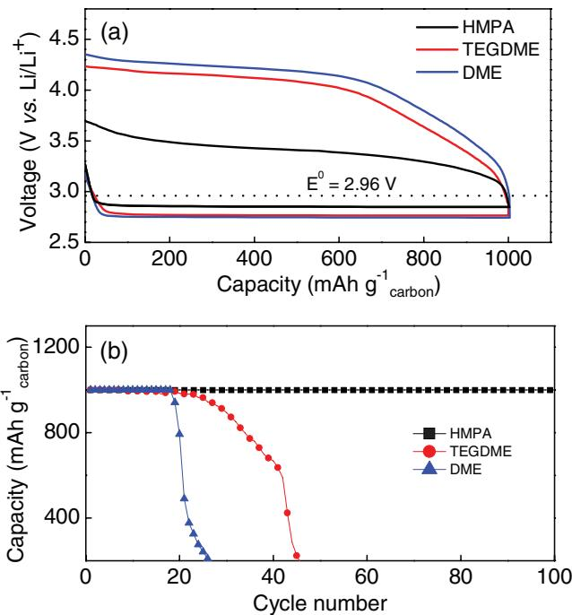
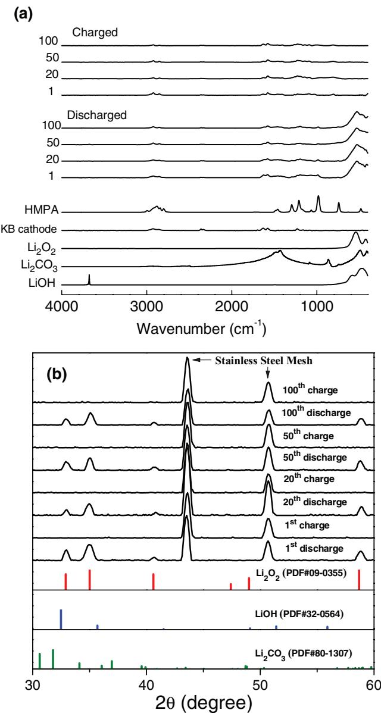
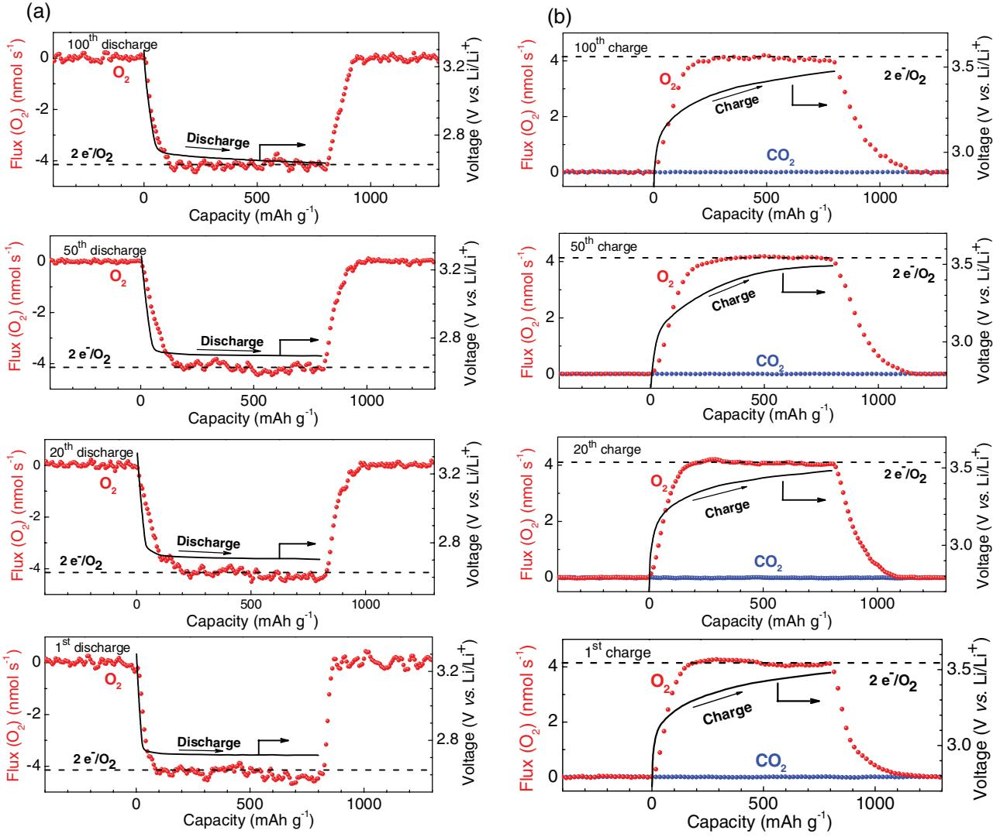
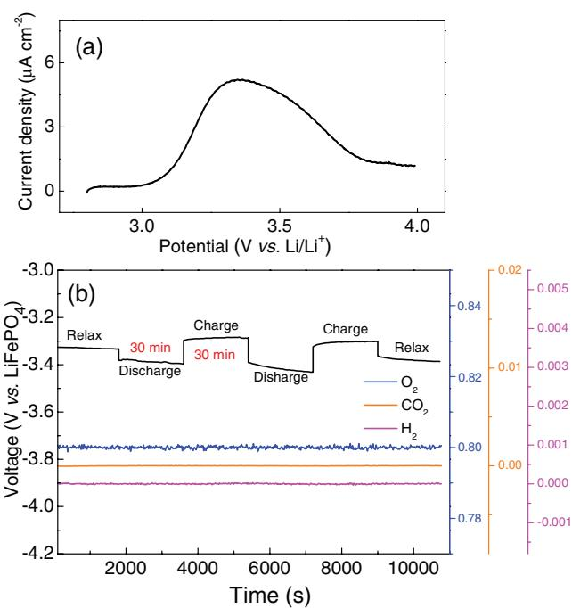

**Batteries**

# **A High-Performance Li–O2 Battery with a Strongly Solvating Hexamethylphosphoramide Electrolyte and a LiPON-Protected Lithium Anode**

*Bin Zhou, Limin Guo, Yantao Zhang, Jiawei Wang, Lipo Ma, Wen-Hua Zhang, Zhengwen Fu, and Zhangquan Peng\**

**The aprotic Li–O2 battery has attracted a great deal of interest because theoretically it can store more energy than today's Li-ion batteries. However, current Li–O2 batteries suffer from passivation/clogging of the cathode by discharged Li2O2, high charging voltage for its subsequent oxidation, and accumulation of side reaction products (particularly Li2CO3 and LiOH) upon cycling. Here, an advanced Li–O2 battery with a hexamethylphosphoramide (HMPA) electrolyte is reported that can dissolve Li2O2, Li2CO3, and LiOH up to 0.35, 0.36, and 1.11 × 10−3 m, respectively, and a LiPON-protected lithium anode that can be reversibly cycled in the HMPA electrolyte. Compared to the benchmark of ether-based Li–O2 batteries, improved capacity, rate capability, voltaic efficiency, and cycle life are achieved for the HMPA-based Li–O2 cells. More importantly, a combination of advanced research techniques provide compelling evidence that operation of the HMPA-based Li–O2 battery is backed by nearly reversible formation/decomposition of Li2O2 with negligible side reactions.**

To meet society's ever-growing energy storage demands, such as powering portable electronic devices and pure electric vehicles, a great deal of research efforts have been devoted to exploring novel battery chemistries (Li–S, Li–O2, Na–S, Na–O2, etc.), with the hope of realizing practical energy storage devices having

Dr. B. Zhou, Dr. L. Guo, Y. Zhang, Dr. J. Wang, Dr. L. Ma, Prof. Z. Peng State Key Laboratory of Electroanalytical Chemistry Changchun Institute of Applied Chemistry Chinese Academy of Sciences Changchun, Jilin 130022, P. R. China E-mail: zqpeng@ciac.ac.cn Dr. B. Zhou, Prof. W.-H. Zhang Sichuan Research Center of New Materials Institute of Chemical Materials China Academy of Engineering Physics Mianyang, Sichuan 621900, P. R. China Prof. Z. Fu Shanghai Key Laboratory of Molecular Catalysts and Innovative Materials Department of Chemistry and Laser Chemistry Fudan University

Shanghai 200433, P. R. China

The ORCID identification number(s) for the author(s) of this article can be found under https://doi.org/10.1002/adma.201701568.

#### **DOI: 10.1002/adma.201701568**

higher capacity and lower cost than today's Li-ion batteries.[1,2] Among these novel battery systems, the aprotic Li–O2 battery has received by far the most attention because of its unbeatable theoretical specific energy compared to other rechargeable batteries.[3–5] Typically a Li–O2 battery consists of a Li anode separated from a porous O2 cathode by a Li+ conducting electrolyte.[6] Operation of the Li–O2 battery relies on O2 reduction to solid Li2O2 on discharge and the reverse oxidation on recharge.[7] Due to a limited solubility of Li2O2 in aprotic solvents used for current Li–O2 batteries, the discharged Li2O2 can easily passivate and/or clog the porous cathode during discharge, which often leads to a premature cell death delivering a capacity far below the theoretical promise of Li–O2 batteries.[8] Moreover, charging of Li–O2 batteries presents another challenge because of the

sluggish oxidation of solid and insulating Li2O2 at the positive electrode, particularly when Li2O2 is somewhat remote from the electrode surface.[9,10] As a result, high overpotentials (η > 1 V) are frequently required for the charging of Li–O2 batteries, which lead to not only low voltaic efficiency but also degradation of battery components (such as cathode material and electrolyte), forming side reaction products (particularly Li2CO3 and LiOH) that are hard to remove and detrimental to Li–O2 batteries.[11–18]

Toward tackling the critical issues mentioned above, many researchers have resorted to a fundamental understanding of the Li–O2 chemistry and electrochemistry underpinning the operation of Li–O2 batteries.[19] So far, it is generally agreed that on discharge O2 is reduced to LiO2 (Equation (1)) that can transform to Li2O2 by either disproportionation (Equation (2)) or further electroreduction (Equation (3))

$$
O_2 + e^- + Li^+ = LiO_2 \tag{1}
$$

$$
LiO2 + LiO2 = Li2O2 + O2
$$
\n(2)

$$
\text{LiO}_2 + \text{e}^- + \text{Li}^+ = \text{Li}_2\text{O}_2 \tag{3}
$$

In high donor number (DN) electrolyte solvents that can effectively solvate Li+ ions, O2 −, from the dissociation of LiO2, has been identified to be a transiently stable intermediate on the cathode surface,[20] particularly when the discharge voltage is high or the current density is low.[21,22] The O2 − anions can diffuse from the cathode surface to the bulk electrolyte and transform to Li2O2 by reacting with Li+ ions therein, i.e., solution growth of Li2O2. [23] Solution growth of Li2O2 is very beneficial for achieving high discharge capacity of Li–O2 batteries.[10,20] While in aprotic solvents with low DN where the reactivity (or acidity) of Li+ ions is less buffered, LiO2 is observed at the cathode surface, which could transform to Li2O2 on the site where it is generated, i.e., surface growth of Li2O2. [20,24] Because of the poor electronic and ionic conductivities of solid Li2O2, [9,25–27] surface growth of Li2O2 often leads to a premature death of Li–O2 batteries.

Although surface growth of Li2O2 dominates in aprotic solvents with low DN, it has been reported that certain anions (such as NO3 −) with high DN also have the ability to indirectly stabilize O2 − by competing for Li+ ions and promote solution growth of Li2O2. [28] Moreover, in aprotic solvents with low DN LiO2 intermediates formed on the cathode surface can be solvated by some additives with high acceptor numbers (such as H2O and protic compounds) and transform to Li2O2 in bulk electrolyte solution.[29] Similar to the dissolution of intermediates of O2 − and LiO2 into the electrolyte solution, dissolution of the final discharge product of Li2O2 has also been attempted to enhance the discharge capacity of Li–O2 batteries by employing strongly coordinating compounds such as boroncontaining Lewis acid for O2 2− anions[30] and crown ethers for Li+ cations.[31,32]

In addition to promoting the dissolution of product and intermediate of Li–O2 batteries, variation of the O2 reduction pathway has also been proved to be an effective way to drive solution growth of Li2O2 even in low DN solvent-based electrolyte. This has been realized by using soluble reduction catalyst (or reduction mediator). The reduction catalyst, on discharge, is rapidly reduced on the cathode surface at voltages below the equilibrium potential of the O2/Li2O2 couple, and then diffuses to the electrolyte solution and reacts with O2 and Li+ producing Li2O2 with itself being regenerated simultaneously. A few reduction mediators have been studied, including viologen,[33] phthalocyanine,[34] and quinone.[10,35]

Although solution growth of Li2O2 is advantageous for achieving high discharge capacity, as described above, it makes the charging of Li–O2 batteries more challenging, because of the need to oxidize solid Li2O2 that is usually somewhat remote from the electrode surface.[10] This problem can be addressed by using oxidation mediators that are soluble in electrolytes and can be oxidized at a potential slightly above the equilibrium potential of O2/Li2O2 couple. Once oxidized at the electrode surface, the mediators diffuse to and oxidize Li2O2. A few oxidation mediators have been examined, including tetrathiafulvalene,[36] tris[4-(diethylamino)phenyl]amine,[37] 2,2,6,6-tetramethylpiperidinyloxy,[38] lithium iodide,[39] cobalt bis(terpyridine),[40] and other organic compounds.[41,42]

Another anvenue to tackle both cathode passivation/clogging during discharge and high charging voltage during recharge of Li–O2 batteries is to employ aprotic solvents that can at least partially dissolve solid Li2O2 (and, if possible, side reaction products Li2CO3 and LiOH as well), because solvated Li2O2 will not passivate or clog the cathode on discharge and can be facilely oxidized on recharge.[43] Here, we report a Li–O2 battery with a strongly solvating hexamethylphosphoramide (HMPA, DN = 38.8) electrolyte solvent that is highly stable toward O2 − and Li2O2 and has the ability to dissolve Li2O2, Li2CO3, and LiOH up to 0.35, 0.36, and 1.11 × 10−3 m, respectively. To prevent Li anode dissolution by HMPA, a Li anode protected by a Li+ conducting ceramic film of LiPON which is stable against lithium metal at potentials from 0 to 5 V was used.[44] Compared to the benchmark of ether-based Li–O2 batteries, improved capacity, rate capability, voltaic efficiency, and cycle life have been achieved for HMPA-based Li–O2 cells. More importantly, a combination of Fourier transform infrared (FTIR), powder X-ray diffraction (PXRD), nuclear magnetic resonance (NMR), and differential electrochemical mass spectrometry (DEMS) provide compelling evidence that operation of HMPA-based Li–O2 battery was backed by nearly reversible formation/decomposition of Li2O2 with negligible side reactions.

A Li–O2 cell, comprised of a protected Li anode, a Ketjen Black carbon-based O2 cathode and a 0.1 m LiClO4 HMPA electrolyte, was assembled and operated in 1 atm of O2; see the Supporting Information for details. Beforehand, a few physicochemical properties of the electrolyte pertaining to Li–O2 batteries were measured, including electrochemical stability window (0.5–4.2 V vs Li/Li+, Figure S1, Supporting Information), saturated concentration of dissolved O2 and its diffusion coefficient (2.75 × 10−3 m and 3.48 × 10−5 cm2 s−1 , respectively, Figure S2, Supporting Information), and solubility of Li2O2 in HMPA (≈0.35 × 10−3 m) that is much higher than in ethereal solvents (≈0.00 × 10−3 m) widely used in current Li–O2 batteries (Figure S3, Supporting Information). The O2 electrochemistry at the HMPA|planar-carbon interface was studied by cyclic voltammetry, where facile O2 reduction and subsequent reoxidation of the reduction products were ascertained (Figure S4, Supporting Information).

The first discharge/charge cycle of HMPA-based Li–O2 cell with a curtailed capacity of 1000 mAh g−1 carbon at a current density of 200 mA g−1 carbon are shown in **Figure 1**a black curve. For comparison, identical cells containing ethereal electrolytes, i.e., benchmark of current Li–O2 batteries, are also assembled and cycled under the same conditions (Figure 1a colored curves). It is shown that HMPA-based Li–O2 cell has a slightly higher discharge voltage plateau and a much decreased charging voltage profile compared to ether-based cells, suggesting the former has a better O2 reaction kinetics and thereby voltaic efficiency than the latter. When the above Li–O2 cells are discharged to 2.5 V at 200 mA g−1 carbon and other current densities without curtailing the discharge capacity, HMPA-based Li–O2 cell delivers a capacity ≈2–5 times what the ether-based cells can achieve, see Figure S5 (Supporting Information). Moreover, HMPA-based Li–O2 cell demonstrates a much better cyclability, as the initial capacity was retained after 100 cycles, while rapid capacity fading was observed for ether-based cells after only tens of cycles (Figure 1b). Discharge/charge curves for the HMPA-based Li–O2 cell on cycles 1, 50, 100, and 180 were shown in Figure S6 (Supporting Information).

As is now recognized from the work of many authors, the ability to cycle a Li–O2 battery is not proof that the reactions occurring at the positive electrode are reversible and involve formation/decomposition of Li2O2. [3–5] To verify whether operation of the HMPA-based Li–O2 battery is underpinned by the

**Figure 1.** a) Load curves of Li–O2 batteries containing HMPA and ethereal electrolytes with a curtailed capacity of 1000 mAh g−1 carbon at a current density of 200 mA g−1 carbon. b) Cycling profiles of Li–O2 batteries in (a).

desired Li–O2 electrochemistry, FTIR spectroscopy data were collected at the end of discharge as a function of cycle number (1, 20, 50, and 100). At the end of each discharge, Li2O2 was identified (**Figure 2**a). Its formation was corroborated by ex situ PXRD and scanning electron microscopy (SEM) of the discharged cathodes (Figure 2b and Figure S7 (Supporting Information)). A few tiny peaks, in addition to the peaks arising from Li2O2, are identified in the FTIR spectra at the end of discharge, at ≈480, 745, 980, 1210, 1300, and 2890 cm−1 . These peaks could be assigned to the residual HMPA trapped in the porous cathode with no other species (such as Li2CO3 and LiOH) being detected (Figure 2a). To probe the existence of any soluble decomposition products in the electrolyte solution, 1 H and 13C NMR spectroscopy were conducted. Sensitivity to detection of such species depends on the ratio between the amount of electrolyte and the amount of discharge product.[7] To improve the signal-to-noise ratio of the acquired NMR spectroscopy data, we concentrated the decomposition products through long-term cycling. However, no signals of any decomposition products were detected, even for the samples collected after 100 cycles, possibly due to the amounts of side reaction products were minor (Figure S8, Supporting Information).

We further confirmed that discharge of the HMPA-based Li–O2 battery was overwhelmingly dominated by Li2O2 formation by using a quantitative DEMS. The DEMS process involves in situ mass spectrometric analysis of the gases consumed/evolved during a galvanostatic discharge/charge cycle (**Figure 3**).[7,15] On discharge the only gases detected were Ar (carrier gas) and O2 (reaction gas) with the flux of the latter decreased due to O2 reduction reaction. The O2 consumption rate followed the discharge current (Figure 3a). There was no

**Figure 2.** a) FTIR and b) PXRD analyses of KB carbon electrodes at the end of discharge and charge in 0.1 m LiClO4 HMPA as a function of cycle number.

evidence of H2, CO2, NO, or NO2 (i.e., no evidence of electrolyte decomposition) during discharge, in contrast to Li–O2 cells containing other electrolytes.[15,45–47] By integrating the area under the curves of O2 consumption rate and comparing with the amount of charge passed during discharge, we obtained the ratios of the number of electrons to per O2 molecule (≈2e−/O2) for the discharge reactions at various cycle numbers of 1, 20, 50, and 100 (Table S1, Supporting Information), which suggested that discharge reaction was dominated by Li2O2 formation.[47]

The FTIR spectra collected at the end of charge on cycles of 1, 20, 50, and 100 are also shown in Figure 2a, from which it is clear that the Li2O2 formed on discharge has been removed upon charging. This observation was confirmed by the PXRD data in Figure 2b, where the characteristic diffraction pattern

**Figure 3.** DEMS of a KB carbon cathode during a) discharge and b) charge in 0.1 m LiClO4 HMPA. A 200 mA g−1 carbon current density is applied to operate the Li–O2 cell, the cathode carbon mass loading is ≈4.0 mg cm−2. Flux indicates the gas consumption/evolution rates.

for Li2O2, observed at the end of discharge, is absent from the PXRD pattern at the end of charge. These observations were in accord with the disappearance of Li2O2 in the SEM images (Figure S7, Supporting Information) at the end of charge. To probe the oxidation in more detail, we used DEMS on charging for cycles 1, 20, 50, and 100 (Figure 3b). The only gas evolved was O2, confirming that Li2O2 had formed on the previous discharge.[48] Upon examining the charging curve in Figure 3b, it can be seen that the average charging voltage plateau was ≈3.4 V, lower than the typical charging voltages observed for ether-based Li–O2 batteries,[47] and the threshold voltage (≈3.5 V) for carbon decomposition.[13] The ratio of charge passed to O2 (2e−/O2) evolved on charging is given in Table S1 (Supporting Information), in accord with charging involving oxidation of Li2O2 without detectable degradation of battery components. More importantly, the O2 recovery efficiency measured by DEMS for cycles 1, 20, 50, and 100 are all close to 1, which, together with the results of FTIR, PXRD, and NMR, suggest that the Li–O2 cell cycles via nearly reversible formation/decomposition of Li2O2 with negligible side reactions.

The outstanding electrochemical performance of the HMPAbased Li–O2 battery can be attributed to a few notable features of the cell configuration. First, the electrolyte solvent used is HMPA that can strongly dissolve metal ions owing to the sterically easy accessibility of the Oδ− atom of the pyramidal HMPA molecule (see Figure S1 inset and Table S2 in the Supporting Information for the compiled DN values of HMPA and other solvents). The saturated concentration of Li2O2 in HMPA was determined to be 0.35 × 10−3 m, which is much higher than in ethers (Figure S3, Supporting Information). The dissolved Li2O2 is stable in HMPA, as verified by NMR spectroscopy, in which essentially no change in the NMR spectrum was observed after 1 week aging of Li2O2-saturated HMPA solution (Figure S9, Supporting Information). Similarly, KO2-saturated HMPA solution after 1 week aging was also examined by NMR spectroscopy, and no detectable change in NMR spectrum was observed (Figure S10, Supporting Information), indicating that

**Figure 4.** a) Linear potential scan at a glassy carbon electrode (diameter 3 mm) in 0.1 m LiClO4 HMPA containing dispersed Li2O2, scan rate 0.1 V s−1 . b) DEMS study of the interface of HMPA|LiPON|Li electrode in a cell of Li0.5FePO4 – LiPON|Li containing 0.1 m LiClO4 HMPA electrolyte cycled at a current density of 50 µA cm−2 . During cell operation, a gaseous mixture of Ar and O2 (1:4 v/v) was purged through the DEMS cell with a constant flux of 1 mL min−1 .

the HMPA solvent is also chemically stable toward O2 − anions. The chemical stability of HMPA can be ascribed to the Pδ+ atom of HMPA that is buried by periphery O and N(CH3)2 groups sterically keeping nucleophiles (O2 −, LiO2, and Li2O2) from attacking.[49]

In addition, the dissolved Li2O2 could be in molecular form, as molecular complexes of Li2O2-HMPA (1:1) were identified by electrospray ionization-mass spectrometry (Figure S11, Supporting Information). The dissolved Li2O2 can be facilely oxidized, as can be seen in **Figure 4**a, where an oxidation peak centered at 3.3 V has been observed at a glassy carbon electrode during linear potential scan from open circuit potential (≈2.85 V) to 4.0 V in a 0.1 m LiClO4 HMPA electrolyte containing dispersed Li2O2, although solubility of Li2O2 in 0.1 LiClO4 HMPA shall be less than 0.35 × 10−3 m in theory. The low voltage with which Li2O2 can be oxidized also suggests that the side reactions of cathode and electrolyte will be minor as the major part of the charging voltage profile (cf., Figure 1a black curve and Figure 3b) was below 3.5 V, the threshold voltage required to oxidize carbon electrode in Li–O2 batteries.[13] The obtained low charging voltage and long cycle life could be also partially ascribed to the possible side reaction products (particularly Li2CO3 and LiOH) that can be dissolved by HMPA (0.36 × 10−3 m for Li2CO3 and 1.11 × 10−3 m for LiOH, see Figure S12 in the Supporting Information), and therefore they could not accumulate on the electrode surface to impair O2 reactions. Nonetheless, we believe that the side reaction extent at the positive electrode is too low to be quantified by the NMR protocols.[46]

The solubilizing ability of HMPA is so strong that it can even dissolve Li metal to Li+ ions and solvated electrons,[49,50] therefore a surface-protected Li anode must be used for the HMPAbased Li–O2 batteries. Here, the Li anode was coated with a Li+ conducting ceramic film of LiPON (specifically, 2.0 µm thick Li3.3P1.0O3.9N0.17). The LiPON coating can effectively prevent the underlying Li anode from reacting with the HMPA electrolyte. As shown in Figure 4b, cycling of a cell of Li0.5FePO4 – LiPON|Li containing O2-saturated 0.1 m LiClO4 HMPA electrolyte was monitored by in situ DEMS and no electrolyte decomposition (e.g., H2 evolution) was observed. In addition, a symmetrical cell of Li|LiPON – LiPON|Li with HMPA electrolyte can sustain prolonged discharge/charge cycling for hundreds of cycles, indicating a desired stability of the interface of HMPA|LiPON|Li anode (Figure S13, Supporting Information). It has been reported that unprotected alkali metal anode can react with common organic solvents producing H2 and other side reaction products that may shuttle to the positive electrode and interfere with the O2 reactions occurring therein.[51] By using Li anode protected by LiPON, the electrolyte decomposition on the negative electrode can be effectively suppressed, which obviously contributes to the overall reversibility of the HMPA-based Li–O2 battery.

In summary, critical issues of passivation/clogging of porous cathode and high charging voltages associated with current Li–O2 batteries have been tackled by using a strongly solvating HMPA electrolyte coupled with a Li anode surface-protected by LiPON. The HMPA solvent has the ability to dissolve the primary discharge product of Li2O2 (0.35 × 10−3 m) and potential side reaction products of Li2CO3 (0.36 × 10−3 m) and LiOH (1.11 × 10−3 m), which are all insoluble in ethereal electrolytes that are widely used in current Li–O2 batteries. As a result, the passivation/ clogging of O2 cathode upon discharge has been considerably alleviated, and the kinetics of Li2O2 oxidation on recharge can be greatly improved. Of note is that oxidation of Li2O2 in HMPA can proceed well below 3.5 V, and thereby decomposition of the battery components of carbon electrode and electrolyte is effectively suppressed. Moreover, on the negative electrode side, a Li+ conducting ceramic film of LiPON has been used to protect Li electrode and renders essentially reversible stripping/plating of the Li anode, which also contributes to the overall reversibility of the HMPA-based Li–O2 batteries. Compared to the benchmark of ether-based Li–O2 batteries, improved capacity, rate capability, voltaic efficiency, and cycle life have been achieved for the HMPA-based Li–O2 cells. A combination of advanced research techniques provide compelling evidence that operation of the Li– O2 battery with a HMPA-based electrolyte and a LiPON-coated Li anode was backed by nearly reversible formation/decomposition of Li2O2 with negligible side reactions.

# **Supporting Information**

Supporting Information is available from the Wiley Online Library or from the author.

### **Acknowledgements**

B.Z. and L.G. contributed equally to this work. Z.P. is indebted to the National Natural Science Foundation of China (Grant Nos. 91545129 and **www.advancedsciencenews.com www.advmat.de**

21575135), the "Strategic Priority Research Program" of the CAS (Grant No. XDA09010401), the National Key R&D Program of China (Grant No. 2016YBF0100100), the "Recruitment Program of Global Youth Experts" of China, and the Science and Technology Development Program of the Jilin Province (Grant Nos. 20150623002TC and 20160414034GH).

# **Conflict of Interest**

The authors declare no conflict of interest.

### **Keywords**

Li–O2 batteries, LiPON-protected Li anodes, reversibility, strongly solvating electrolytes

Received: March 20, 2017

Revised: April 19, 2017 Published online: June 6, 2017

[1] M. Armand, J. M. Tarascon, *Nature* **2008**, *451*, 652.

- [2] P. G. Bruce, S. A. Freunberger, L. J. Hardwick, J.-M. Tarascon, *Nat. Mater.* **2012**, *11*, 19.
- [3] A. C. Luntz, B. D. McCloskey, *Chem. Rev.* **2014**, *114*, 11721.
- [4] J. Lu, L. Li, J.-B. Park, Y.-K. Sun, F. Wu, K. Amine, *Chem. Rev.* **2014**, *114*, 5611.
- [5] N. Imanishi, A. C. Luntz, P. G. Bruce, *The Lithium Air Battery: Fundamentals*, Springer, New York **2014**.
- [6] K. M. Abraham, Z. Jiang, *J. Electrochem. Soc.* **1996**, *143*, 1.
- [7] Z. Peng, S. A. Freunberger, Y. Chen, P. G. Bruce, *Science* **2012**, *337*, 563.
- [8] J. Wang, Y. Zhang, L. Guo, E. Wang, Z. Peng, *Angew. Chem., Int. Ed.* **2016**, *55*, 5201.
- [9] Y. Zhang, Q. Cui, X. Zhang, W. C. McKee, Y. Xu, S. Ling, H. Li, G. Zhong, Y. Yang, Z. Peng, *Angew. Chem., Int. Ed.* **2016**, *55*, 10717.
- [10] X. Gao, Y. Chen, L. Johnson, P. G. Bruce, *Nat. Mater.* **2016**, *15*, 882.
- [11] P. Adelhelm, P. Hartmann, C. L. Bender, M. Busche, C. Eufinger, J. Janek, *Beilstein J. Nanotechnol.* **2015**, *6*, 1016.
- [12] S. A. Freunberger, Y. Chen, N. E. Drewett, L. J. Hardwick, F. Bardé, P. G. Bruce, *Angew. Chem., Int. Ed.* **2011**, *50*, 8609.
- [13] M. M. Ottakam Thotiyl, S. A. Freunberger, Z. Peng, P. G. Bruce, *J. Am. Chem. Soc.* **2013**, *135*, 494.
- [14] B. M. Gallant, R. R. Mitchell, D. G. Kwabi, J. Zhou, L. Zuin, C. V. Thompson, Y. Shao-Horn, *J. Phys. Chem. C* **2012**, *116*, 20800.
- [15] B. D. McCloskey, D. S. Bethune, R. M. Shelby, G. Girishkumar, A. C. Luntz, *J. Phys. Chem. Lett.* **2011**, *2*, 1161.
- [16] B. D. McCloskey, A. Speidel, R. Scheffler, D. C. Miller, V. Viswanathan, J. S. Hummelshøj, J. K. Nørskov, A. C. Luntz, *J. Phys. Chem. Lett.* **2012**, *3*, 997.
- [17] S. Meini, S. Solchenbach, M. Piana, H. A. Gasteiger, *J. Electrochem. Soc.* **2014**, *161*, A1306.
- [18] H. Beyer, S. Meini, N. Tsiouvaras, M. Piana, H. A. Gasteiger, *Phys. Chem. Chem. Phys.* **2013**, *15*, 11025.
- [19] D. Aurbach, B. D. McCloskey, L. F. Nazar, P. G. Bruce, *Nat. Energy* **2016**, *1*, 16128.
- [20] L. Johnson, C. Li, Z. Liu, Y. Chen, S. A. Freunberger, P. C. Ashok, B. B. Praveen, K. Dholakia, J.-M. Tarascon, P. G. Bruce, *Nat. Chem.* **2014**, *6*, 1091.
- [21] B. D. Adams, C. Radtke, R. Black, M. L. Trudeau, K. Zaghib, L. F. Nazar, *Energy Environ. Sci.* **2013**, *6*, 1772.
- [22] B. M. Gallant, D. G. Kwabi, R. R. Mitchell, J. Zhou, C. V. Thompson, Y. Shao-Horn, *Energy Environ. Sci.* **2013**, *6*, 2518.
- [23] Y. Zhang, X. Zhang, J. Wang, W. C. McKee, Y. Xu, Z. Peng, *J. Phys. Chem. C* **2016**, *120*, 3690.
- [24] Z. Peng, S. A. Freunberger, L. J. Hardwick, Y. Chen, V. Giordani, F. Bardé, P. Novák, D. Graham, J.-M. Tarascon, P. G. Bruce, *Angew. Chem., Int. Ed.* **2011**, *50*, 6351.
- [25] O. Gerbig, R. Merkle, J. Maier, *Adv. Mater.* **2013**, *25*, 3129.
- [26] A. Dunst, V. Epp, I. Hanzu, S. A. Freunberger, M. Wilkening, *Energy Environ. Sci.* **2014**, *7*, 2739.
- [27] M. D. Radin, D. J. Siegel, *Energy Environ. Sci.* **2013**, *6*, 2370.
- [28] C. M. Burke, V. Pande, A. Khetan, V. Viswanathan, B. D. McCloskey, *Proc. Natl. Acad. Sci. USA* **2015**, *112*, 9293.
- [29] N. B. Aetukuri, B. D. McCloskey, J. M. García, L. E. Krupp, V. Viswanathan, A. C. Luntz, *Nat. Chem.* **2015**, *7*, 50.
- [30] D. Zheng, H.-S. Lee, X.-Q. Yang, D. Qu, *Electrochem. Commun.* **2013**, *28*, 17.
- [31] W. Xu, J. Xiao, D. Wang, J. Zhang, J.-G. Zhang, *Electrochem. Solid-State Lett.* **2010**, *13*, A48.
- [32] X.-C. Wang, Y.-M. Wang, W. Liu, R.-P. Bai, Y.-F. Liu, L. Xiao, J.-T. Lu, L. Zhuang, *Acta Phys.-Chim. Sin.* **2016**, *32*, 343.
- [33] L. Yang, J. T. Frith, N. Garcia-Araez, J. R. Owen, *Chem. Commun.* **2015**, *51*, 1705.
- [34] D. Sun, Y. Shen, W. Zhang, L. Yu, Z. Yi, W. Yin, D. Wang, Y. Huang, J. Wang, D. Wang, J. B. Goodenough, *J. Am. Chem. Soc.* **2014**, *136*, 8941.
- [35] S. Matsuda, K. Hashimoto, S. Nakanishi, *J. Phys. Chem. C* **2014**, *118*, 18397.
- [36] Y. Chen, S. A. Freunberger, Z. Peng, O. Fontaine, P. G. Bruce, *Nat. Chem.* **2013**, *5*, 489.
- [37] D. Kundu, R. Black, B. Adams, L. F. Nazar, *ACS Cent. Sci.* **2015**, *1*, 510.
- [38] B. J. Bergner, A. Schürmann, K. Peppler, A. Garsuch, J. Janek, *J. Am. Chem. Soc.* **2014**, *136*, 15054.
- [39] H.-D. Lim, H. Song, J. Kim, H. Gwon, Y. Bae, K.-Y. Park, J. Hong, H. Kim, T. Kim, Y. H. Kim, X. Lepró, R. Ovalle-Robles, R. H. Baughman, K. Kang, *Angew. Chem., Int. Ed.* **2014**, *53*, 3926.
- [40] K. P. C. Yao, J. T. Frith, S. Y. Sayed, F. Bardé, J. R. Owen, Y. Shao-Horn, N. Garcia-Araez, *J. Phys. Chem. C* **2016**, *120*, 16290.
- [41] K. Liao, T. Zhang, Y. Wang, F. Li, Z. Jian, H. Yu, H. Zhou, *ChemSusChem* **2015**, *8*, 1429.
- [42] J. Liu, S. Renault, D. Brandell, T. Gustafsson, K. Edström, J. Zhu, *ChemSusChem* **2015**, *8*, 2198.
- [43] D. Shanmukaraj, S. Grugeon, G. Gachot, S. Laruelle, D. Mathiron, J.-M. Tarascon, M. Armand, *J. Am. Chem. Soc.* **2010**, *132*, 3055.
- [44] X. Yu, J. B. Bates, G. E. Jellison, F. X. Hart, *J. Electrochem. Soc.* **1997**, *144*, 524.
- [45] Y. Chen, S. A. Freunberger, Z. Peng, F. Bardé, P. G. Bruce, *J. Am. Chem. Soc.* **2012**, *134*, 7952.
- [46] S. A. Freunberger, Y. Chen, Z. Peng, J. M. Griffin, L. J. Hardwick, F. Bardé, P. Novák, P. G. Bruce, *J. Am. Chem. Soc.* **2011**, *133*, 8040.
- [47] B. D. McCloskey, A. Valery, A. C. Luntz, S. R. Gowda, G. M. Wallraff, J. M. Garcia, T. Mori, L. E. Krupp, *J. Phys. Chem. Lett.* **2013**, *4*, 2989.
- [48] S. Meini, N. Tsiouvaras, K. U. Schwenke, M. Piana, H. Beyer, L. Lange, H. A. Gasteiger, *Phys. Chem. Chem. Phys.* **2013**, *15*, 11478.
- [49] H. Normant, *Angew. Chem., Int. Ed. Engl.* **1967**, *6*, 1046.
- [50] G. Fraenkel, S. H. Ellis, D. T. Dix, *J. Am. Chem. Soc.* **1965**, *87*, 1406.
- [51] Y. Zhang, L. Ma, L. Zhang, Z. Peng, *J. Electrochem. Soc.* **2016**, *163*, A1270.