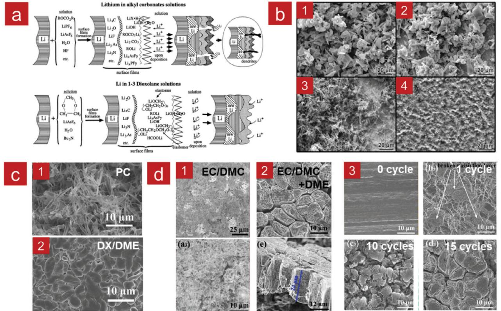
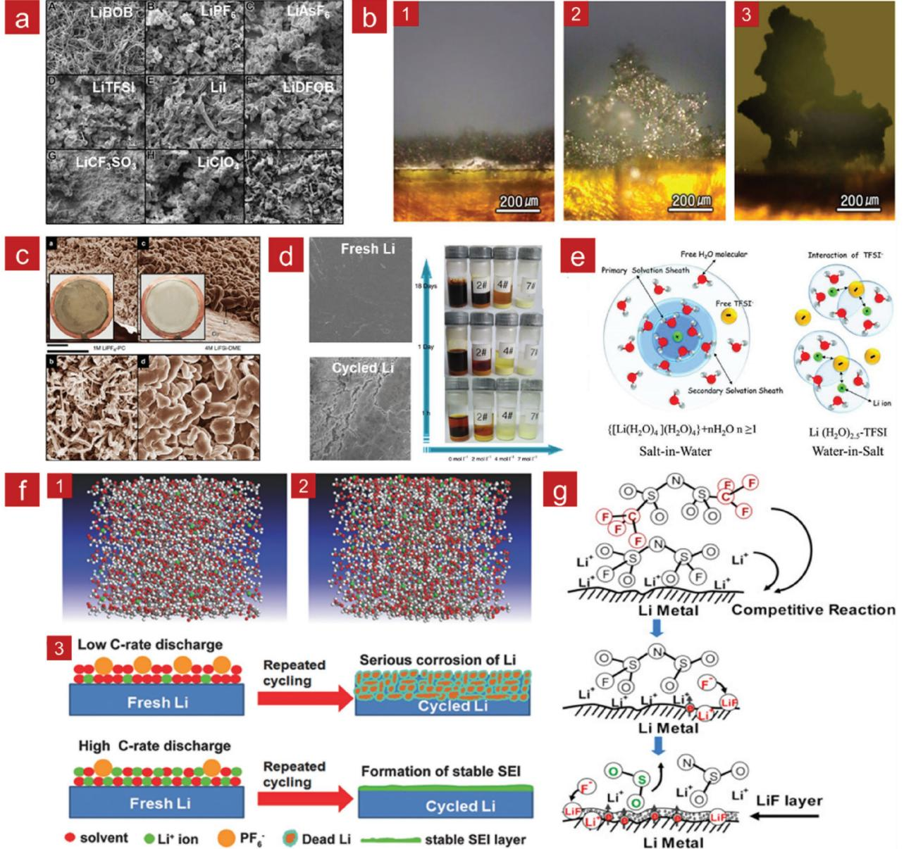
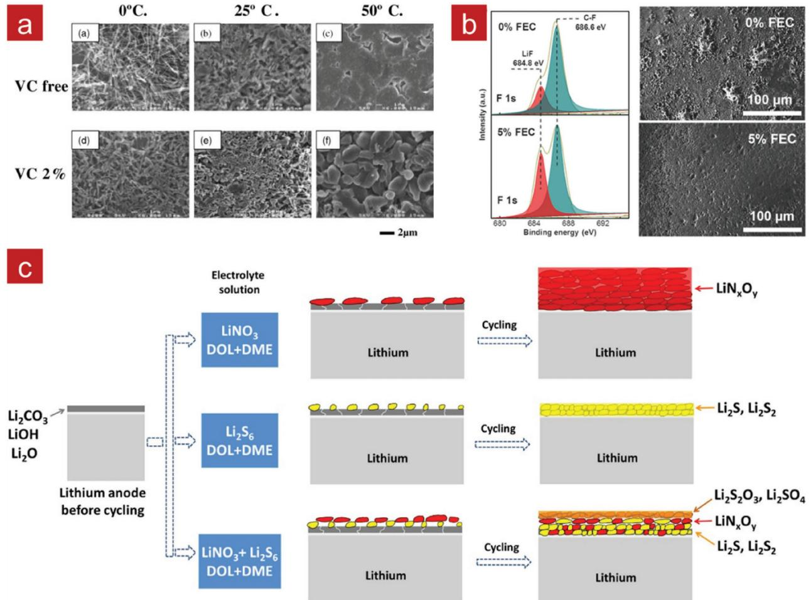
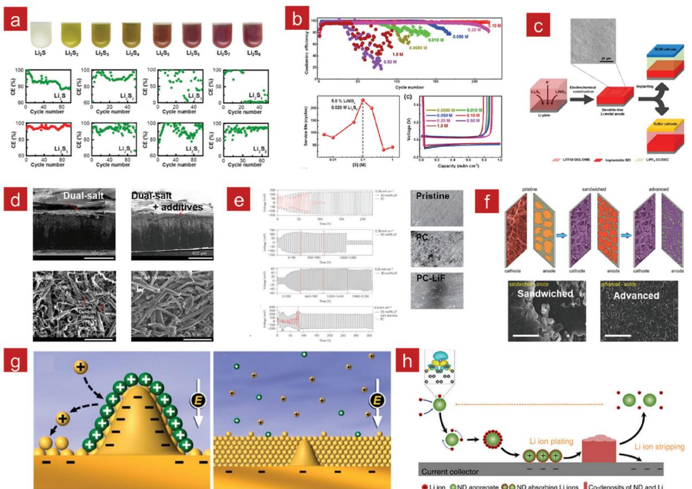
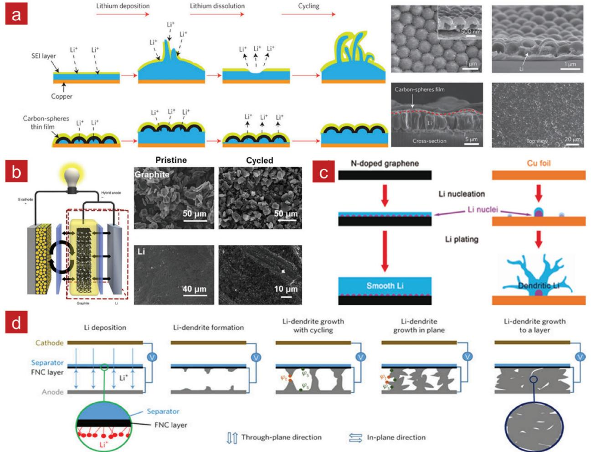
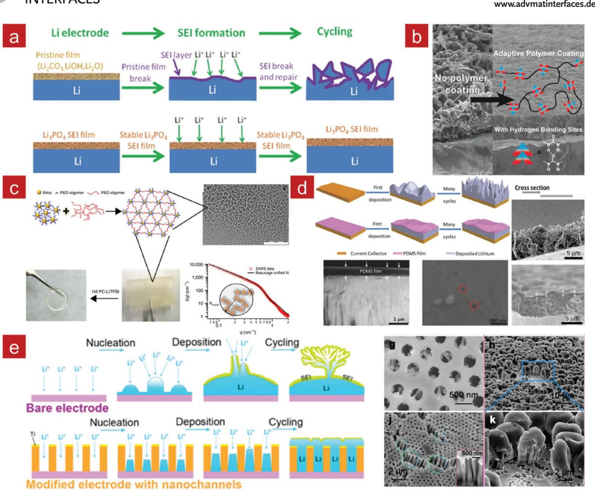
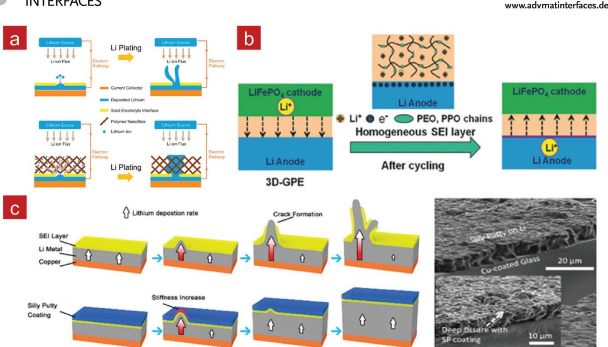
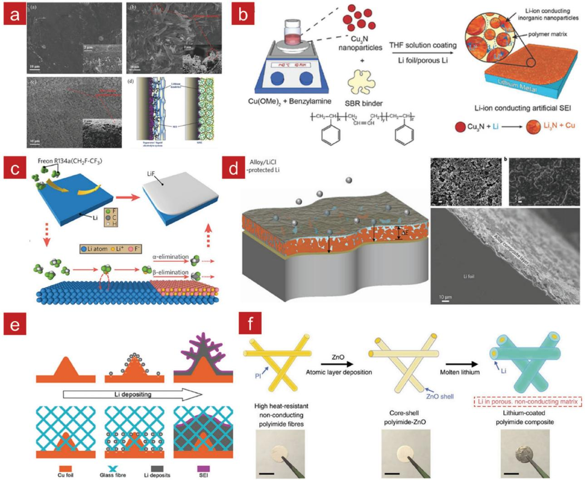
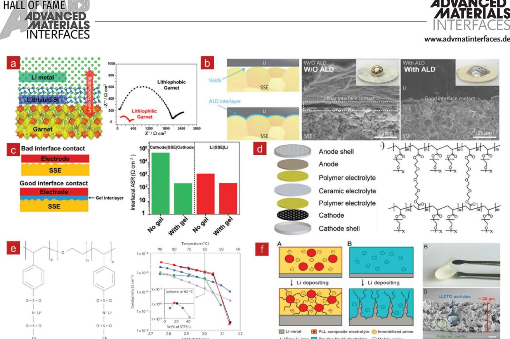

**Energy Storage**

# **Advances in Interfaces between Li Metal Anode and Electrolyte**

*Xue-Qiang Zhang, Xin-Bing Cheng, and Qiang Zhang\**

**Lithium metal has been considered as one of the most promising anode materials in high-energy-density rechargeable batteries due to its extremely high specific capacity and very low reduction potential of all possible candidates. However, the mysterious interfacial phenomena of lithium metal anode in long-term cycles, especially Li dendrite formation and low Coulombic efficiency, have greatly plagued the practical applications of Li metal in secondary batteries. The complex interface between Li metal and electrolyte plays a very important role in regulating Li deposition and enhancing the cycling stability of a full battery. In this review, recent advances in interfacial science and engineering are summarized to afford a fundamental understanding in Li deposition behavior and present design principles in constructing robust interface to stabilize Li metal anode in a working battery. Further investigations and directions are also included to promote the exploration of Li metal anodes. In particular, the rational combination of different Li metal protection strategies is strongly commended for practically applying Li metal anode in high-energy-density rechargeable batteries.**

## **1. Introduction**

With the increasing development and practical applications of portable electronics and electric vehicles, high-energy-density rechargeable batteries are strongly requested.[1,2] The specific energy capacity (energy per weight) of current commercial Li-ion batteries ranges from 160 to 250 Wh kg−1 based on intercalated cathodes and carbon based anodes.[2,3] However, the specific energy density of Li-ion batteries has nearly approached the theoretical values after growing by about 7 Wh kg−1 per year in the last 25 years.[2] Besides, to overcome the worries on the driving range (relating to the specific energy density) and price of electric vehicles, high energy density batteries are strongly considered. The specific energy density of a rechargeable battery is primarily determined by the specific capacity of electrode and operating voltage.[4,5] Consequently, except for the singleelectron based intercalation chemistry in the current Li ion batteries, the emerging multielectron conversion chemistry based

X.-Q. Zhang, Dr. X.-B. Cheng, Prof. Q. Zhang Beijing Key Laboratory of Green Chemical Reaction Engineering and Technology Department of Chemical Engineering Tsinghua University Beijing 100084, China E-mail: zhang-qiang@mails.tsinghua.edu.cn

The ORCID identification number(s) for the author(s) of this article can be found under https://doi.org/10.1002/admi.201701097.

**DOI: 10.1002/admi.201701097**

on Li metal anode paired with sulfur/ oxygen cathode is highly concerned.[6]

Li metal has extremely high theoretical specific capacity (3860 mA h g−1 ), nearly ten times higher than that of graphite anode, and the lowest reduction potential (−3.040 V vs. standard hydrogen electrode), which has been considered as a 'Holy Grail' anode in rechargeable batteries.[7] Moreover, Li metal anode can be paired with different cathode materials, such as intercalated cathodes (e.g., LiFePO4, [8] LiNi*x*Co*y*Mn1−*x*−*y*O2 [9,10]) and conversion cathodes (e.g., S,[11,12] O2 [13]), to construct different types of high energy density batteries. The specific energy densities of Li metal batteries are very hopeful to approach 500 Wh kg−1 in the next 5 to 10 years according to the goal of US Department of Energy.

Nevertheless, the rechargeable Li metal batteries have not been large-scale released

yet. Li metal anode was first applied in Li-TiS2 rechargeable batteries. In 1980s, the first-generation rechargeable Li metal batteries were commercialized by MOLI energy.[14] However, there were incessant reports about the fires and explosion events of rechargeable Li metal batteries. Safety issue has been the grand challenge hindering the practical applications of Li metal batteries since then. The main origin of safety issue comes from Li dendrites, i.e., random and spiculate Li deposition, which is induced by unstable interfaces between Li metal and liquid electrolyte.[2,15]

Due to its extreme reactivity, Li metal can react with nearly all electrolytes, inducing the spontaneous decomposition of organic electrolyte.[16] The reaction products between Li and electrolyte constitute the solid electrolyte interphase (SEI) on Li metal anode, which was first named by Peled in 1979.[17] However, the formed SEI is fragile and heterogeneous with varied spatial resistance,[18,19] which induces uneven Li ions flux and random Li deposition underneath. Consequently, the surface of Li metal in a working cell is not uniform, where there are many protuberances enhancing the local electric field and attracting Li ions to deposit.[20] When the Li ion concentration near anode surface decreases to zero at the characteristic time (named as Sand's time),[21] scarce Li ions aggravate the nonuniformity of Li deposition and accelerate the growth of Li dendrites, which is a self-amplifying process.[22] The dendritic Li can easily pierce fragile SEI and induce the rapid decomposition of liquid electrolyte to form new SEI.[19,23] In the subsequent stripping process, gracile Li dendrites may break from the roots forming dead Li.[24] The repeated formation of SEI and dead Li give rise to low Coulombic efficiency.[15] Additionally, interfacial resistance

increases rapidly due to the crack and repair of SEI film, which deteriorates the performance of rechargeable batteries.[25] After many plating and stripping cycles, the dendritic Li can grow into several-hundred microns. These large dendrites can possibly cross the separator to reach the cathode, giving rise to short circuit and thermal run away of rechargeable batteries. Therefore, it is of critic significance to build stable interface between Li metal and the electrolyte.

Both stability and uniformity of SEI are required to be concrete and quantitative instead of a vague concept. To protect the Li metal anode without Li dendrites formation, uniform Li ions flux across SEI, enhanced mechanical strength, and low interfacial resistance are strongly considered. These are also the important strategies in the interfacial engineering of Li metal anode.[25,26] Li dendrites are expected to be effectively suppressed and hence the lifespan of Li metal batteries can be greatly extended if the interface between Li metal anode and electrolyte is further understood and manipulated.

In fact, the interface between Li metal anode and liquid electrolyte is highly depended on the interfacial reactions. The specific interfacial reactions and issues are highly related to the type of cathode and reaction products in cycling of rechargeable lithium metal batteries, such as Li–sulfur (Li–S) and Li–O2 batteries. In Li–S batteries, the generated Li polysulfide (LiPS) can dissolve into electrolyte and shuttle to Li metal anode. It is well believed that LiPS can penetrate the SEI and react with Li metal underlying SEI, which complicates the interface reactions and makes Li protection more difficult, especially in employing high loading sulfur cathode.[12,27,28] In Li–O2 batteries, O2 crossovers from cathode to Li metal anode and the reactions between Li and O2 result in the consumption of electrolyte and premature death of full batteries,[29] which is similar to the hazards of LiPS in Li–S batteries.[30,31] Therefore, preventing Li metal from reacting with LiPS and O2 is another challenge besides suppressing Li dendrites in anode and issues from cathode.[32] To focus on the interface between Li metal and liquid or solid electrolyte, the scope of this review ignores the difference in cathode type provisionally. However, the advances in Li metal protection in Li–S and Li–O2 batteries are also included in the following sections.

In this review, advances in the interfaces of Li|liquid electrolyte and Li|solid electrolyte are reviewed (**Figure 1**). The interfaces of Li metal anode in working batteries are highly depended on the neighbor to be liquid or solid electrolytes. In the liquid electrolyte, the solvents, Li salts, and additives significantly determine the properties of the in situ SEI via modulating the components and structures.[5,15] Ex situ coating, i.e., artificial SEI, is expected to circumvent the fragility and uncontrollability of in situ SEI.[33] Solid electrolyte is another important choice for safe Li metal batteries due to its high mechanical strength to block Li dendrites.[34] Nevertheless, huge interfacial resistance emerges as grand challenges for interfaces between Li and solid electrolyte.[35,36] The interfacial engineering is very important in decreasing the interfacial resistance induced by poor contact,[37] strengthening the chemical and electrochemical stability toward Li metal and homogenizing Li ion flux. In addition to experiments in interfacial engineering, the theoretical calculation also provides more guidance and verification.[38] The insights and grand challenges of interfacial science and engineering of Li metal anode are also included.

**Xue-Qiang Zhang** obtained his bachelor at Tianjin University in 2016. He is currently a graduate student at Department of Chemical Engineering, Tsinghua University. His research interests focus on Li metal batteries, especially Li metal anode, and interface between Li and electrolyte.

**Xin-Bing Cheng** received his B.Eng. degree from Tianjin University in 2012 and Ph.D. degree from Tsinghua University in 2017 under the guidance of Prof. Qiang Zhang. In 2016, he was a visiting scholar in Prof. Yury Gogotsi team in Drexel University. Now, he is a research associate in Tsinghua University. His

current research interests mainly focus on energy storage materials and devices, including nanocarbon materials, Li–S batteries, and dendrite suppression of Li metal anode.

**Qiang Zhang** received his bachelor and Ph.D. degree from Tsinghua University in 2004 and 2009, respectively. After a stay in Case Western Reserve University, USA, and Fritz Haber Institute of the Max Planck Society, Germany, he was appointed an associate professor in Tsinghua University at 2011. His interests focus on energy mate-

rials, includes Li–S batteries, Li metal anode, 3D graphene, and electrocatalysts.

# **2. Li | Liquid Electrolyte**

## **2.1. In Situ SEI**

The nonaqueous liquid electrolyte is the most adopted electrolyte in the present Li-ion and Li metal batteries.[39,40] However, the liquid electrolyte is easily reduced chemically and electrochemically due to the low reduction potential of Li metal anode and the applied voltage in a working cell.[4] Then, the insoluble decomposition products precipitate on Li metal surface and form in situ SEI in a working cell. In most cases, the in situ

**Figure 1.** Schematic of the interfacial chemistry and engineering of Li metal anodes.

SEI achieved in a liquid electrolyte is fragile and nonuniform in components and structures, which induces the uneven Li deposition and the formation of Li dendrites. How to construct a stable and uniform SEI on a working Li metal anode is strongly considered.

The key features of stable and uniform SEI include strong mechanical strength, the uniformly distributed channels, and low resistance for Li ion diffusion. The components of liquid electrolyte, i.e., solvent, Li salt, and additives are the key factors to regulate the formation of in situ SEI.

#### *2.1.1. Solvent*

Solvent is the source of organic and partial inorganic species in the SEI.[15] The components and structure of SEI are mainly determined by solvents. Nonaqueous aprotic solvents, including alkyl carbonate and ether compounds, are widely applied for Li metal batteries.[39] The simplified structure model of SEI is composed of two layers (**Figure 2**a),[41,42] which includes the upper layer close to electrolyte and down layer close to Li metal. The upper layer is porous and mainly consists of organic species, such as ROLi, ROCO2Li, RCOOLi (R is the alkyl group), and oligomer, while the down layer mainly includes inorganic species decomposed by solvents and Li salts, such as LiF, Li2CO3, Li2O, and so on. Both the upper and down layers are critical to a working battery, although effect of each layer is not validated yet.

The stability and uniformity of the in situ SEI are significantly determined by the selection of solvent via regulating the components of structure of SEI. Therefore, the morphologies of Li depositions in different solvents are quite distinct. Ethers are generally more stable against reduction than alkyl

carbonates,[43,44] especially dimethoxyethane (DME), which renders excellent cycling stability during Li deposition.[45,46] In contrast, the morphology of Li deposits in alkyl carbonate is needle-like but Li film deposited in cyclic carbonate solvents (e.g., propylene carbonate (PC) and ethylene carbonate (EC)) is more uniform than that in linear carbonate solvents (dimethyl carbonate (DMC) and ethyl methyl carbonate (EMC), Figure 2b). The similar situation also occurs in the ether solvents. However, the shape of Li deposition in ethers is rounder than that in alkyl carbonates. Consequently, the Coulombic efficiency of carbonate electrolyte (≈85%) is lower than that of ether electrolyte (around 90%) in Li|Cu half cells.[15,47] Both cyclic carbonate and ether solvents tend to contribute to high Coulombic efficiency of Li metal anode.[45]

Several kinds of inorganic species, such as Li2CO3 and LiF, have been considered as critical components that have significant effect on the uniformity of Li ion flux and then Li deposition morphology.[48] Fluorinated solvents are considered as cosolvents to increase the content of F-containing species in SEI and simultaneously expand the electrochemical stable window.[49] Fluorinated solvents tend to be unstable against reduction but tolerant to oxidation due to the high electronegativity of F element. During the first plating process, fluorinated solvents are preferentially reduced to involve into the formation of the initial SEI.

Furthermore, routine solvents also render different reduction potentials and the order of reductive decomposition of solvents have great impact on SEI,[44] which affords an emerging method to adjust the components and structures of SEI. However, the reduction decomposition of every solvent is more complicated in mixture under an electrical field of a working cell. Aurbach et al. contributes an important method to identify the reduction potential of different solvents.[39] Furthermore, the recent advances in theoretical calculation render another powerful tool to predict the complex reduction of solvents.[50,51] Some homologues of present solvents are incorporated as solvents to enlarge the amount of current solvents. For instance, 1,4-dioxane (DX) is employed as to replace DOL due to its low reactivity to lithium and good antioxidation capability (Figure 2c).[52]

The rational combination of present ether and carbonate solvent emerges as a fresh attempt to regulate SEI formation and Li deposition.[53] The morphology of Li deposits varies from small and dendritic Li into large dense columnar Li (10 µm in diameter) while adding DME into carbonate electrolyte (Figure 2d).[54] The increase of flexible Li organic species (−(CH2CH2O)*n*−) and stable inorganic Li salts (Li2O and LiF) contributes to this significant change of the morphology of Li deposits. This attempt opens an emerging avenue for rational design of ideal solvents for Li metal batteries. Therefore, solvent regulation is a critical aspect in improving the stability and uniformity of in situ SEI mainly by enhancing the uniformity of Li ions flux across SEI.

Furthermore, ionic liquid-based electrolyte is another choice beyond liquid electrolyte due to its exceptional thermal and electrochemical stability and practically non-flammability.[55] Similarly, passivating layer formation on the electrode is also the key aspect to ionic–liquid electrolyte because the average electronegativity of C, H, N are not as low that of Li+. Therefore,

**Figure 2.** The insight of solvent on SEI formation and Li deposition. a) Scheme of SEI formation on Li metal anode in alkyl carbonate and in 1–3 dioxolane solution. Reproduced with permission.[42] Copyright 2000, Elsevier. b) Li deposition from 1.0 m LiPF6-based electrolytes containing PC (b1), EC (b2), DMC (b3), and EMC (b4). Reproduced with permission.[45] Copyright 2013, The Electrochemical Society. c) Li deposition in PC-LiFSI (c1) and DX/ DME-LiFSI (c2) at 0.25 mA cm−2 for 6 h. Reproduced under the terms of the CC-BY 4.0 license.[52] Copyright 2016, the authors. d) The Li metal plating in EC/DMC at 0.50 mA cm−2 after the 50th cycle (d1), and Li metal in EC/DMC-30% DME after the 200th cycling at 1 mA cm−2 (d2) and transformation of Li deposits after different cycles (d3). Reproduced with permission.[54] Copyright 2017, American Chemical Society.

the type of ionic liquid is critical to suppress the Li dendrites in lithium metal batteries.[56] Moreover, the combination of structure design and ionic liquid further enhance the potential to inhibit the formation of Li dendrites.[57] Ionic liquid plays a very important role in lithium metal batteries though the mechanisms behind are not clear, such as the structure and nature of passivation film formed.

#### *2.1.2. Li Salt*

Li salt is another indispensable component in the liquid electrolyte and serves as the main source of inorganic species in SEI. LiPF6 and lithium bis(trifluoromethane sulfonimide) (LiTFSI) are the most common Li salts due to their compromise properties in the price, viscosity, and ionic conductivity.[39] Both lithium bis(oxalate)borate (LiBOB) and LiBF4 have been employed as dual-salts or additives.[58,59] The uniformity and stability of SEI are also significantly depended on the Li salts in the liquid electrolyte.

Both the components and sizes of anions in the Li salts impact SEI formation and Li deposition (**Figure 3**a,b).[45,50] LiBOB, LiPF6, LiTFSI, and LiAsF6 are generally considered as Li salts that are beneficial to form a superb SEI layer and relatively uniform Li deposition.[15] According to experimental and density functional theory (DFT) calculation, reduction decompositions of Li salts follow the order from high to low voltage: LiBOB (1.2 V) LiTFSI > LiPF6. [58] This affects the components and structures of SEI as well as the morphology of Li deposits. Furthermore, the suitable combination of two types of Li salts has proved to enhance the cycling performance significantly.[58–60] The components and stability of SEI are changed effectively by sequential reduction of different Li salts.

The concentration of Li salt is generally 1.0 m to balance the ionic conductivity, viscosity, and salt solubility.[61] However, highly concentrated Li salt recently contributes much to the outstanding performance of Li-ion and Li metal batteries, and even high-voltage aqueous Li-ion batteries. 4.0 m (molarity) lithium bis(fluorosulfonyl)imide (LiFSI) in DME and 7.0 m (molal concentration) LiTFSI in 1,3-dioxolane (DOL)/DME exhibit outstanding performance by forming a thin and LiF-rich SEI on Li metal anode.[46,61] The nodule-like Li without dendrites is obtained in 4.0 m LiFSI at different current densities (Figure 3c). Li metal anode in 7.0 m LiTFSI maintains dendritefree morphology after 280 cycles (Figure 3d). When the ratio of salt-to-solvent is over 1.0 by both volume and weight, this electrolyte system can be called solvent-in-salt. The solvation state of Li cations and solvent molecules varies significantly when

**Figure 3.** The insight into Li salts on Li deposition. a) SEM images of Li films deposited in electrolytes of 1.0 m different Li salts in PC solvent. Reproduced with permission.[45] Copyright 2013, The Electrochemical Society. b) The Li morphology in (b1) 1.0 m LiTFSI–DME, (b2) 1.0 m LiTFSI-tetraglyme, and (b3) 1.0 m LiI-tetraglyme. Reproduced with permission.[50] Copyright 2014, Nature Publishing Group. c) The Li deposition in 1.0 m LiPF6-PC and 4.0 m LiFSI-DME at 1.0mAcm−2 for 1.5h. Scale bar, 10 mm. Reproduced under the terms of the CC-BY 4.0 license.[46] Copyright 2015, the authors. d) Left: Fresh Li metal and Li metal in 7.0 m LiTFSI after 280 cycles. Scale bar, 60 µm. Right: The states of samples with different concentration Li salts. Reproduced with permission.[61] Copyright 2013, Nature Publishing Group. e) Scheme of the evolution of the Li ion primary solvation sheath in diluted and highly concentration Li salt aqueous solutions. Reproduced with permission.[63] Copyright 2015, American Association for the Advancement of Science. f) Snapshots of ab initio MD simulations in low Li salt concentration at low discharge (f1) and the high Li salt concentration at high discharge rate (f2). Illustrations of the mechanisms of SEI evolutions on Li metal anodes cycled at low and high discharge rates. Reproduced with permission.[66] g) Scheme of interfacial competitive reaction between FSI and TFSI anion with lithium metal and the formed LiF-rich SEI. Reproduced with permission.[60] Copyright 2014, Elsevier.

the concentration of Li salt is over 3.0 m according to simulation and experiment characterization (Figure 3e).[62] The positive electrical field of Li cations cannot be neutralized although all solvent molecules have been solvated in highly concentrated electrolyte. Therefore, anions of Li salt have to involve into solvation in order to maintain electrical neutrality. The reduction potential of solvent and Li salts and the amount of anion reduced have both changed compared to dilute electrolyte. The alteration of SEI is inevitable, the uniformity and stability being enhanced significantly. The morphology of Li deposits is rounder and Coulombic efficiency is improved even at a very high current density. An extreme example is that the reduction

potential of water is enlarged to 2.0 V drastically when the molal concentration of LiTFSI increases to 21.0 m in aqueous electrolyte.[63] The liquid electrolyte with a high concentrated Li bi-salt is also explored and exhibits enhanced performance in aqueous Li-ion batteries recently,[64] which may be also useful in nonaqueous Li metal batteries. The effect of highly concentrated electrolyte has been reported to other electrolyte system, such as acetonitrile as solvent.[62] Even though, the solvation state of Li cation is required to further investigated, such as the inaction between Li and anions, the orientation of anions, and so on. In addition, a drawback of concentrated Li salt electrolyte is the decreased ionic conductivity due to the rise of electrolyte viscosity.[61,65] The dogma that fine rate capacity is directly related to high ionic conductivity of electrolyte is also challenged lately.[62] Similarly, the transient highly concentrated Li salt near Li anode is achieved by regulating the rate of discharge and charge, which significantly decreases the side reaction of solvent and prolongs the lifespan of batteries (Figure 3f).[66] In addition, the introduction of multifunctional Li salts is a feasible route to bring surprise in Li metal batteries despite other properties should be carefully considered and evaluated.[67]

The dual-salt electrolyte is another choice to improve the uniformity and stability of SEI film in Li metal batteries through rationally combining the merits of two kinds of Li salts. Thin and dense LiF layer is achieved on Li metal anode due to the preferential decomposition of –SO2F corresponding to −SO2CF3 in the presentence of LiFSI and LiTFSI dual salts.[60] Therefore, Li deposits exhibit smooth solid particle array and achieve stable Coulombic efficiency (Figure 3g).[60] In LiTFSI–LiBOB dual-salt electrolyte, the decompositions of LiTFSI result in a highly conductive SEI, and boron-containing semicarbonatelike species generated by LiBOB render the robust and stable SEI. Consequently, the constant growth of SEI is suppressed and the rapid charging of Li metal batteries is acceptable.[58]

## *2.1.3. Additives*

Additives are considered as the vital component of electrolyte except for solvent and Li salt to enhance the uniformity and stability of pristine in situ SEI even at ppm level.[68] Generally, the weight or volume fraction is less than 5%. Additives preferentially react with Li metal prior to solvent and Li salt, then form a dense SEI with controllable components and cycling stability. Both the morphology of Li deposits and Coulombic efficiency of Li metal cells are heavily related to the species and concentration of electrolyte additives. However, the gradual depletion of additives in the long-term cycling is therefore inevitably, which induces the failure of Li metal batteries. Therefore, alternative strategies are highly demanded to avoid the rapid consumption of additives.

According to the compositions of additives in working Li metal batteries, 4 categories of solvent analogues, Li salts, metal ions, and others are classified.

(1) *Solvent Analogues*: The structures of both vinylene carbonate (VC) and fluroethylene carbonate (FEC) are similar to that of ethylene carbonate (EC). VC and FEC contribute to uniform Li ion flux across SEI and flexibility of SEI film

by regulating the inorganic and organic species attached to Li metal anode. VC is easily reduced by Li metal through ring-opening polymerization due to its unsaturated structure, then forming a stable film on Li (**Figure 4**a).[69,70] FEC is also reduced owing to the effect of F functional group to form a LiF-rich SEI.[9,31,71] The enhanced uniformity and stability of SEI suppress the growth of Li dendrites and enhance the Coulombic efficiency (Figure 4b). Additives are reduced prior to solvent and Li salt, which can be confirmed by linear sweep voltammetry (LSV)[72] and first-principles calculation.[9] The volume fraction of additives in the liquid electrolyte also impacts the properties of SEI and electrolyte and even the performance of Li batteries.[73] New solvent analogues are also being investigated for their potential used in Li metal batteries.

- (2) *Li Salts*: The effect of Li salt additives is to regulate the uniform Li ion flux by changing the content and species of inorganic components. LiNO3 is widely accepted as an additive to prevent detrimental shuttle of polysulfide intermediates and protect Li metal anode from corrosion due to the passivation of Li metal in working lithium–sulfur batteries. The direct reduction of LiNO3 to form Li*x*NO*y* species and the oxidation of sulfur species to form various Li*x*SO*y* surface moieties contribute to the improvement of SEI and suppression of Li dendrites (Figure 4c).[41] The synergetic effect of lithium polysulfides and LiNO3 can be maximized via selecting the species of lithium polysulfides and the concentration of lithium polysulfides and LiNO3. [74] We systematically investigate the effects of concentration and species of polysulfides on the Li metal anode (**Figure 5**a,b).[27,75] The ether-based electrolyte containing 0.02 m Li2S5 exhibits best performance in protecting Li metal by forming the stable inorganic LiF-rich layer. Moreover, the formed SEI in the optimal electrolyte can be implantable into other rechargeable batteries with different electrolytes to improve the Coulombic efficiency in the initial cycles (Figure 5c).[10] Recently, LiPF6 is induced as an additive into Li metal batteries showing excellent cycling lifespan and high Coulombic efficiency. LiPF6 additive greatly alters the intrinsic SEI layer generated on the Li metal surface by inducing polycarbonates from the ring-opening polymerization of EC (Figure 5d).[59] Of course, the bi-salts-based electrolyte also contributes to the significant improvement of battery performance. Different from LiNO3 and LiPF6, insoluble LiF is also employed as an additive precipitating on Li metal surface to regulate Li deposition by enhancing the uniformity of Li ion surface diffusivity in SEI (Figure 5e).[76]
- (3) *Metal Ions*: Inorganic metal ions, such as Sn2+, [77] In3+, Mg2+, [78] can form alloy with Li by chemical and electrochemical reactions to suppress Li dendrites. However, an alloy layer is not stable. Both composite and morphology of Li alloy layer severely change in the long-term cycles of Li metal batteries. Recently, copper acetate is proposed as an additive to break the long range crystallinity of SEI. Such SEI impurity phases afford a large lithium-ion conductivity compared to that in the pristine Li, which contributes to the uniform Li deposition (Figure 5f).[79,80] Specific concentrated Cs+ is proposed to significantly inhibit Li dendrites by selfhealing electrostatic shield mechanism. Lowly concentrated

**Figure 4.** The insights into additives on the components and structures of Li deposits (Part I). a) Li deposition on Ni substrate in VC-free and VC electrolyte. Reproduced with permission.[70] Copyright 2003, Elsevier. b) F 1s spectra of the SEI formed in FEC-free and 5% FEC electrolyte, and the Li depositing morphology at 0.5 mA cm−2 after 50 cycles. Reproduced with permission.[9] c) Illustration of the SEI on Li cycling in LiNO3-free and LiNO3 containing electrolyte. Reproduced with permission.[41] Copyright 2013, Elsevier.

Cs+ cannot be reduced at the potential where Li ions are reduced easily due to its lower reduction potential than Li ions according to Nernst equation. Therefore, Cs+ will be absorbed at the tips of Li deposition and form a positively charged electrostatic shield to force subsequent Li ions to adjacent regions avoiding the self-amplifying process of Li dendrites (Figure 5g).[81] Similarly, Al3+-based colloidal particles[82] and *N*-methyl-*N*-butylpiperidinium[83] are also induced to stabilize Li metal anode based on electrostatic shield mechanism. In addition, Lewis acid AlI3 are reported to suppress Li dendrites by facilitates the formation of Li–Al alloy and thin polymer films, respectively.[84]

(4) *Others*: In the preparation process of electrolyte, impurities, e.g., CO2, H2O, is remained inevitably that affect the performance of Li metal batteries significantly. However, these impurities may benefit the formed SEI when their concentrations are controlled in a certain range. Trace CO2, [85] SO2, [86] HF,[87] and H2O[88] have been introduced into liquid electrolytes to selectively increase the content of inorganic species, such as Li2CO3 and LiF, which enhances the diffusion and uniformity of Li ion flux. However, the wide applications of these impurity additives are limited due to their toxic property and complex proceeding processes. Lately, nanodiamond is employed as codeposition additives to regulate the deposition morphology of Li (Figure 5h). Nanodiamond particles serve as heterogeneous nucleation seeds and absorb Li ions due to low surface diffusion energy barrier. Then adsorbed Li ions form the uniform Li deposition and grow into columnar Li rather than dendritic Li.[89]

#### **2.2. Ex Situ Coating**

Treating Li metal with specific chemicals prior to its battery applications is an ex situ and facile method to protect Li metal surface and suppress Li dendrites compared to in situ formed SEI in liquid electrolyte. Ex situ coating (or artificial SEI) is proposed to avoid the drawbacks of in situ SEI. Enhancing the mechanical strength of ex situ coating to block Li dendrites is the initial goal in this research field. Furthermore, the uniformity of Li ion flux across the coating layer and controllable interfacial resistance (i.e., high ionic conductivity and complex

**Figure 5.** The insights into additives on the components and structures of Li deposits (Part II). a) Digital photos of electrolytes containing different types of LiPSs, and Coulombic efficiency of electrolytes with different types of LiPSs. Reproduced with permission.[75] Copyright 2016, Elsevier. b) The Coulombic efficiency, lifespan, and voltage–capacity curves of electrolyte with different concentrations of Li2S5. Reproduced with permission.[27] Copyright 2016, Elsevier. c) Schematic of implantable SEI construction on Li metal. Reproduced with permission.[10] Copyright 2017, Elsevier. d) Cross-sectional views and top views of cycled Li anodes in dual-salt and dual-salt with additives. Reproduced with permission.[59] Copyright 2017, Nature Publishing Group. e) Left: The polarization voltage curves of Li–Li battery in PC and PC-30 mol% LiF electrolyte (left). Right: The Li deposition morphology at 0.38 mA cm−2 after 100 h in different electrolytes. Reproduced with permission.[76] Copyright 2014, Nature Publishing Group. f) Schematic evolvement of the surface of the pristine, sandwiched, and advanced cells. Cycled Li metal anode in the sandwiched and advanced cells. Scale bar: 50 µm. Reproduced with permission.[80] g) Illustrations for the effect of Cs+ (green) in Li deposition process based on the SHES mechanism. Reproduced with permission.[81] Copyright 2013, American Chemical Society. h) Illustration of the co-deposition and stripping process of Li ions with nanodiamond (ND) as additives. Reproduced under the terms of the CC-BY 4.0 license.[89] Copyright 2017, the authors.

interface between coating and Li metal) are also involved with more fundamental understanding. Up to now, carbon nanomaterials, polymer, and inorganic layer are the general choices of ex situ coating.

#### *2.2.1. Carbon Nanomaterials*

Carbon nanomaterials have been chosen as an ex situ coating due to its unique properties and structure, such as excellent chemical and electrochemical stability, strong mechanical strength, high electrical conductivity, and tunable nanostructures.[90] Moreover, there are many allotropes in carbon materials, e.g., graphite, hard carbon, graphene, carbon nanotubes, which afford abundant candidates for ex situ coating on Li metal anode.

Interconnected hollow carbon nanospheres are used as physical coating on Li metal to prevent the crack of SEI and side reaction between Li and electrolyte. Moreover, columnar Li emerges because this carbon coating serve as a uniform SEI to regulate Li ion plating (**Figure 6**a).[23] A graphite film is placed on Li metal surface serving as physical blocking layer and buffer layer to homogenize Li ions (Figure 6b),[91] the function being achieved by preintercalating Li ions in graphite prior to plating on Li anode. Graphene is also induced as a physical barrier to block Li dendrites.[92] The carbon nanomaterials are also used to modulate the surface properties of current collectors. Few layer graphene[93] and N-doped graphene[94] can guide the Li plating by the interactions between Li ion and edges/N heteroatoms in graphene (Figure 6c), respectively. Functionalized nanocarbon (FNC) with immobilized Li ions is coated on the separator to regulate the growth direction of Li dendrites. Li dendrites grow

**www.advmatinterfaces.de**

**www.advmatinterfaces.de**

**Figure 6.** The ex situ coating of nanocarbon materials in Li metal anode. a) The carbon-sphere thin film coating on Li (blue) serves as an artificial SEI and regulates the Li deposition. Reproduced with permission.[23] Copyright 2014, Nature Publishing Group. b) Schematic of the effect of graphite film coated on Li. SEM images of pristine and cycled graphite and Li after 1000 cycles at 3237 mA g−1 . Reproduced with permission.[91] Copyright 2014, Nature Publishing Group. c) Illustrations of the Li deposition process on N-doped graphene electrode and Cu foil anode. Reproduced with permission.[94] d) The mechanism of FNC coated on separator to regulate the growth direction of Li dendrites. Reproduced with permission.[95] Copyright 2017, Nature Publishing Group.

toward to each other from Li anode and FNC layer during cycling of Li metal batteries. Once dendrites meet, the growth direction will change due to mechanical effect preventing the short circuit of batteries (Figure 6d).[95] A comprehensive review on the role of carbon materials is also appeared.[90]

#### *2.2.2. Polymer*

Polymer is also a promising choice for ex situ coating on Li metal attributing to its flexibly, diversity, and controllability contributed by the cross-linked macromolar networks with tunable chemical reactivity. Polymer with high chemical and electrochemical stability should be screened carefully due to the extremely high reactivity of Li metal anode. The criteria of ex situ coating on mechanical strength, interfacial resistance, high ionic conductivity, and the uniformity of Li ion flux are important equally.

According to Newman's reports, the solid coating with a Young's modulus higher than 6 GPa is sufficient to suppress the growth of Li dendrites.[96] Therefore, polymer network with very high mechanical strength is highly expected as an effective method to inhibit Li dendrites. Artificial Li3PO4 layer prepared by reaction of polyphosphoric acid (PPA) with Li metal and its native film (**Figure 7**a),[97] adaptive polymer with slow flow (Figure 7b),[98] PEDOT-co-PEG copolymer,[99] and crosslinked polymer web with hairy nanoparticles serving as crosslinkers (Figure 7c)[100] are proposed to suppress Li dendrites due to the ex situ coating layer with high Young's modulus, high viscoelasticity, and high mechanical strength. Moreover, these materials possess excellent stability with liquid electrolyte and Li metal. The direct contact between electrolyte and Li metal is therefore hindered by ex situ coating, which avoids the corrosion of Li metal and unremitting consumption of electrolyte.

In addition, a coating layer with a high ionic conductivity is requested in Li metal batteries. Some low-cost polymer materials

**Figure 7.** Polymer ex situ coating to suppress Li dendrites (Part I). a) Schematics of the general Li metal and polyphosphoric acid (PPA) derived SEI modified Li metal anodes during cycling. Reproduced with permission.[97] b) Li deposition without polymer coating and with adaptive polymer coating. Reproduced with permission.[98] Copyright 2016, American Chemical Society. c) The scheme of crossed-linked nanoparticle–polymer composite and its SEM image, and photography of a free-standing membrane with and without electrolyte. Reproduced under the terms of the CC-BY 4.0 license.[100] Copyright 2015, the authors. d) Schematics of Li deposition on Cu and PDMS-coated Cu and SEM images of the cross-sectional views of PDMS film and Li deposition. Reproduced with permission.[101] e) Schematic of Li anodes with and without the vertical-aligned nanochannels coating, and SEM images of Li deposition at 1.0 mA cm−2 with a capacity of 0.1 and 1.0 mA h cm−2 . Reproduced with permission.[102] Copyright 2016, American Chemical Society.

without ionic conductivity, such as poly(dimethylsiloxane) (PDMS), have been modified to be endowed with Li ionic conductivity.[101] Acid treatment is employed to create nanopores in PDMS film to intake the liquid electrolyte and afford pathways for Li ion transport (Figure 7d). Besides, insulating polyimides (PI) have been fabricated by a facile template method.[102] Homogeneous Li ion flux distribution is therefore achieved by the interconnected channels with a size of several hundred nanometers, which accounts for the uniform Li nucleation and dendrite-free growth (Figure 7e).

To decentralize Li ion uniformly during Li plating, polar function groups or sediments of polymer are applied to disperse Li ion by the strong interactions between Li ion and polar species. Kimwipe paper,[103] treated polyacrylonitrile (PAN) polymer,[104] PAN fiber (**Figure 8**a),[105,106] and 3D network gel polymer electrolyte (Figure 8b)[107] are beneficial to uniform Li plating due to the guidance of polar species, in which O-containing and N-containing functional groups in the polymer chains contribute to strong interaction between Li ions and ex situ coating layers. However, the origin of such dipole–dipole interaction should be further investigated in a working battery. Recently, a new concept based on adaptive dynamic protecting is proposed by Cui and co-workers (Figure 8c). Silly putty (SP) generally flows and serves as a conformal coating on the Li anode to separate Li metal and electrolyte.[108] However, when there are some protuberances formed on the Li surface, SP coating locally increase in stiffness to eliminate rapid local overgrowth and suppress the formation of Li dendrites. Polymer are expected to be emerging candidates to protect Li metal anode through interfacial engineering due to its diversity and controllability. However, the related mechanism in Li metal protection is worth being investigated profoundly.

**Figure 8.** Polymer ex situ coating to suppress Li dendrites (Part II). a) Schematic diagrams of Li deposition with and without PAN coating. Reproduced with permission.[106] Copyright 2015, American Chemical Society. b) A 3D network gel polymer electrolyte prepared by initiator-free one-pot ring-opening polymerization with combination of mechanical strength, ionic conductivity, and the guidance of Li deposition by cross-linked network and abundant ether bonds. Reproduced with permission.[107] c) Li dendrites formed on unprotected Li metal anodes and the elimination of Li dendrites on Li metal coated by dynamically cross-linked polymer, and SEM images of coating on Li metal. Reproduced with permission.[108] Copyright 2017, American Chemical Society.

#### *2.2.3. Inorganic Materials*

Inorganic materials are usually with strong mechanical strength. This is the obvious advantage of inorganic compounds, while they are brittle and requests very complex materials processing. The rational combination of inorganic and polymer materials to construct flexible and rigid ex situ coating becomes an important choice. The strong mechanical strength is a significant merit of inorganics in suppressing Li dendrites.

SiO2 hollow spheres integrated with tripropylene gycol diacrylate (TPGDA) (**Figure 9**a)[109] and SiO2@PMMA (polymethyl methacrylate) core–shell nanospheres[110] exhibit promising potential to suppress Li dendrites due to their high mechanical strength, flexibility, and high electrolyte uptake ability. With the advances of atomic layer deposition (ALD), a conformal inorganic layer can be deposited on Li metal to suppress Li dendrites without any fracture. Dozens of nanometers Al2O3 layer is also conformal and relatively flexible to tolerate deformation of Li metal.[111] In addition, the application of CVD provides another effective approach to deal with the interfacial issues of Li metal anode. 2D boron nitride (BN) coated on Li metal surface serves an excellent interfacial protection layer. The dendrite-free Li morphology is achieved because of its flexibility, chemical stability, and mechanical strength resulting from strong interlayer bonds and ultrathin thickness.[112]

The inorganic coating with low ionic conductivity mainly contributes to interfacial resistance. The inorganic species with a high ionic conductivity is strongly considered. Li3N is considered as a solid electrolyte due to its high ionic conductivity. Li3N layer protects Li metal from side reactions with liquid electrolyte and promotes the rapid Li ion diffusion from electrolyte to Li surface.[113] Cu3N is transformed to Li3N when in contact with Li metal. When Cu3N is joined by styrene butadiene rubber (SBR), an effective SEI with simultaneously high ionic conductivity, strong mechanical strength, and robust flexibility is acquired (Figure 9b).[114] LiF has been regarded as an efficient component in regulating Li plating. The diffusion of Li ions on the surface of LiF particles is much faster than that in bulk phase and contributes to the regulation of Li deposition.[76] Recently, columnar Li deposition is achieved on LiF-protected Cu substrate by simple pre-treatment in aqueous LiPF6 solution and exhibits significant structure color, which further deepens the fundamental understanding of LiF in nucleation and growth of Li.[115] Conformal, compact, and homogeneous LiF passivation layer on Li metal surface is preferred recently. Li metal surface is well protected by minimizing the corrosion reactions with electrolytes. The Li dendrite is therefore suppressed even at a very high current density (Figure 9c).[116,117] The coating layers formed by Ar, CO2, N2, and O2 have been investigated. The mixed coating layer with Li3N and Li2CO3 displays the best stability and lowest polarization in Li–S cell system. The gas protected Li metal anode exhibits unique electrochemical properties and easy scalability in practical applications.[118] However, the purification of Li surface and optimization of gas treatment should be further explored.

**Figure 9.** Li metal protected by inorganics. a) Li depositing morphology and the schematic of general Li metal and Li metal with SiO2 hollow nanosphere-based composite coating. Reproduced with permission.[109] b) Illustration of the fabrication process of the Cu3N + SBR composite artificial SEI. Reproduced with permission.[114] c) The LiF coating formed on Li metal by reaction with Freon R134a. Reproduced with permission.[117] Copyright 2017, American Chemical Society. d) Schematic of LiIn alloy coating and SEM images of fresh and alloy protected Li metal. Reproduced with permission.[119] Copyright 2017, Nature Publishing Group. e) The polar groups of glass fibers coated on Li metal to regulate Li deposition. Reproduced with permission.[120] f) Fabrication process of Li-coated PI composite and the corresponding optical images of Li metal. The scale bars in (f) are 1 cm. Reproduced under the terms of the CC-BY 4.0 license.[122] Copyright 2016, the authors.

Recently, alloy phase is also introduced on the Li metal surface for their ability for fast Li ion diffusion (Figure 9d). Combining with insulating LiCl layer formed at the same time with LiIn alloy, this coating is endowed with a high Li ion conductivity and a protective layer, which is effective to suppress Li dendrites and avoid continuous consumption with Li metal.[119]

Although 3D skeleton current collectors are critically important for Li metal anode due to the sharply decreased current density, yet it is more possible for Li ions preferentially depositing on the top side of skeleton instead the inside of current collector. Inorganics can be employed to guide Li ions to deposit inside. Glass fibers with polar groups (Si−O, O−H, O−B) render strong interaction with Li ion giving rise to the uniform redistribution of Li deposition (Figure 9e).[120] ZnO is also reported to form lithiophilic surface by alloying reactions and then infuses molten Li metal into a matrix (Figure 9f).[121] Similarly, the effect of Si in guiding molten Li is obvious.[122] The metal Ni coated on Cu nanowires (Ni @ CuNWs) by electrochemical method also displays excellent lithiophilicity while meeting molten Li liquid.[123] However, the origin of lithiophilic or wetting[124] should be further explored.

The liquid electrolyte is widely adopted in commercial rechargeable batteries. The interfaces between Li metal anode and liquid electrolyte is highly depended on the complex interfacial reactions. The in situ SEI is strongly considered and regulated through the rational choice of electrolyte, salts, and additives. The carbon, polymer, and inorganic compounds are also explored as ex situ coating or artificial SEI to protect Li metal anode. However, most of organic electrolytes are flammable, and the interfaces between Li metal and liquid electrolyte

are not very stable. There are still many open questions to be explored to understand the science of interface formation and regulation. Nevertheless, the liquid electrolyte is still promising to match Li metal anode and assemble the high-energy-density batteries for practical applications in the current stage. The principles to increase the safety as well as the creation of very stable interfaces in Li|liquid electrolyte are highly demanded.

## **3. Li | Solid Electrolyte**

Solid electrolyte is expected to substitute the liquid electrolyte due to the intrinsic safety and its potential to restrain Li dendrites by mechanical strength.[35,125] However, the ionic conductivity and interfacial resistance of solid electrolyte become the main challenges hindering the practical applications.[36,126] Although the ionic conductivity of solid electrolyte ranges from 10−3 to 10−8 S cm−1 at room temperature, yet it cannot fully satisfy the demand of rechargeable batteries for electrical vehicles and portable electronic devices operating at a large current density. The interfaces between Li and solid electrolyte are usually "dot–dot" contact compared to the wetting of electrolyte on Li surface in a cell with liquid electrolyte.[37] Therefore, the interfacial resistance increases rapidly, which deteriorates the performance of batteries based on solid electrolyte. In addition, other problems related to solid electrolyte should be also considered, such as surface stability while exposed to air or water and contacting with Li metal during the materials processing for solid electrolyte and cell fabrication.[127] The keystone in this section is to decrease interfacial resistance between Li metal and inorganic solid electrolyte by interfacial engineering. The introduction of interface layer with high ionic conductivity between Li and inorganic solid electrolyte is expected to afford much more contact area, which becomes the main solution to decrease the interfacial resistance. In situ layer formed by liquid electrolyte and ex situ layer coated by polymer, alloy, and gel electrolyte are strongly explored.

#### **3.1. In Situ SEI**

Mitigating interfacial resistance between solid electrolyte and Li metal anode by in situ formed SEI has been put forward in solid-state batteries due to its easy material-processing and ultrathin feature. A small amount of liquid electrolyte is introduced between Li metal and solid electrolyte during cell assembly process. The decomposition products of liquid electrolyte cover the surface of solid electrolyte and serve as the buffer layer to reduce interfacial resistance.[128] This structure exhibits the functionality of a solid electrolyte interlayer, i.e., preventing electrical conduction but providing lithium ion conducting pathways. However, the compatibility between liquid electrolyte and solid electrolyte, and the uniformity, stability and thickness of SEI should be further explored.

The complex reactions between solid electrolyte and Li metal can also be employed to reduce the interfacial resistance. Solid electrolyte LiZr2(PO4)3 with a high bulk ionic conductivity reacts with Li metal to form a Li ion conducting passivation layer containing Li3P and Li8ZrPO4, which can wet both the Li

metal and LiZr2(PO4)3 electrolyte.[129] This strategy provides a facile but effective approach to overcome the interfacial issues.

### **3.2. Ex Situ Coating**

The introduction of ex situ coating onto Li metal anode is also effective to mitigate the interfacial resistance in Li|solid electrolyte. The species, component, and thickness of ex situ coating can be adjusted by controlling conditions. Alloy-formed and gel or polymer electrolyte are the main choices. Simple substances, such as Ge,[130] Al,[131] and Si,[132] react with Li metal and generate alloy to fill the interstice between Li metal and solid electrolyte, which therefore provides more close contact area. Gel or polymer electrolyte can infiltrate the interstice and form SEI during cycling. The soft gel or polymer between two solid materials avoids the "dot–dot" contact and serves as a buffer layer. Therefore, the ionic conductivity of ex situ coating is critically important to reduce the contact resistance.

The uniform Li ion flux should also be balanced to suppress the uneven Li deposition or Li dendrites. The ex situ coating between Li metal and solid electrolyte has to be soft to realize a tight contact. This is quite different form the ex situ coating between Li metal and liquid electrolyte.

#### *3.2.1. Inorganic Coating*

Inorganic materials that react with Li and form alloy play a critical role in reducing the interfacial resistance. Ultrathin and conformal coating enhances the wettability of solid electrolyte to molten Li, which can fill the gap between Li metal and solid electrolyte. A 10 nm Si coating is deposited on garnet electrolyte by plasma-enhanced chemical vapor deposition (PECVD). Si layer creates perfect contact with garnet and reacts with Li to achieve a lithiophilicity surface in term of lithiated Si. The interfacial resistance between Li and garnet electrolyte dramatically decreases (**Figure 10**a).[132] A thin Au layer is sputtered onto the polished surface of solid electrolyte to further flat the interface, which reduces the resistance and avoids the short circuit sharply.[133] Al-coated garnet by e-beam evaporator exhibits excellent wettability of Li metal by forming an intermediary alloy. The interfacial resistance therefore reduces.[131]

Ultrathin Al2O3 layer by ALD effectively reduces the Li metal/ garnet interfacial resistance. Al2O3 enables the wetting of Li metal anode while contacting with garnet and lithiated-alumina allows rapid Li ion transport across interface (Figure 10b).[134] Similarly, both Ge[135] and ZnO[136] also react with Li and form alloy layer to decrease the interfacial resistance.

Although alloy-formed materials exhibit significant effect on reducing the interfacial resistance, yet the concrete mechanism behind this modification is uncovered. Additionally, other types of inorganic materials need to be explored to flourish the interfacial science and engineering of Li|solid electrolyte. The strategies to modify the surface of solid electrolyte are investigated less. The joint structure of Li metal and solid electrolyte must be further explored and optimized to avoid the direct "dot–dot" contact.

**Figure 10.** The modifications to the interface between Li metal and solid electrolyte. a) Transition from superlithiophobicity to superlithiophilicity of garnet and much smaller interfacial resistance due to the existence of Si layer. Reproduced with permission.[132] Copyright 2016, American Chemical Society. b) Schematic and SEM images of Al2O3 layer between Li and garnet to decrease interfacial resistance. Reproduced with permission.[134] Copyright 2016, Nature Publishing Group. c) Schematic of gel interlayers between Li and solid electrolyte and the comparison of interfacial resistances. Reproduced with permission.[139] Copyright 2017, American Chemical Society. d) Illustration of all-solid-state battery design with the polymer/ceramic/ polymer sandwich electrolyte and the structure of polymer CPMEA. Reproduced with permission.[142] Copyright 2016, American Chemical Society. e) Chemical structure of P(STFSILi)-b-PEO-b-P(STFSILi) and its conductivity performances. Reproduced with permission.[145] Copyright 2013, Nature Publishing Group. f) Schematic of effect of immobilized anions in suppressing Li dendrites and digital and SEM images of composite electrolyte. Reproduced with permission.[148] Copyright 2017, National Academy of Sciences.

#### *3.2.2. Gel and Polymer Electrolyte*

Owning to their intrinsic soft structure, good wettability, and high ionic conductivity, both gel and polymer electrolyte are selected as buffer layers between Li metal and solid electrolyte. Furthermore, polymer-based electrolyte, such as polymeric single ion conductors[137] and organic–inorganic composite electrolyte,[36,138] can also be considered as ex situ coatings due to their additionally special properties to suppress Li dendrites and reduce interfacial resistance, which will be discussed more afterwards. Moreover, both gel and polymer-based electrolyte are suitable for manufacturing without harsh materials processing.

Poly(vinylidene fluoride-hexafluoropropylene) (PVDF-HFP) gel electrolyte is employed as an interlayer to form continuous contact between Li and solid electrolyte. The interfacial resistance dramatically reduces due to the increased contact area and high ionic conductivity of gel electrolyte with almost zero bulk resistance (Figure 10c).[139] Polypropylene (PP) thin film dissolved in liquid electrolyte is added between Li and solid electrolyte to build a rapid ionic conductive path.[140] Therefore, the components of liquid electrolyte, the types of polymer, and even impurities in gel determine the components and properties of the interface layer.[141] Cross-linked poly(ethylene glycol) methyl ether acrylate (CPMEA) is sandwiched between solid electrolyte and Li. Due to the fixed anions of the salt, CPMEA allows higher thermal stability and creates more contact area to reduce resistance. Moreover, the Li ion flux at the interface is more homogenous, which effectively suppress Li dendrites (Figure 10d).[142] PEO is also applied as buffer electrolyte in term of polymer electrolyte due to its stability to Li metal regardless of low ionic conductivity. The stability and ionic conductivity of polymer electrolyte are highly depended on the molecule weight of PEO and the ratio of PEO in polymer electrolyte.[143] Cross-linked hydrocarbon/PEO electrolyte exhibits both high ionic conductivity and strong lithium dendrite resistance. The crystallinity of hydrocarbon backbones demonstrates a key role in suppressing Li dendrites.[144]

Polymeric single ion conductors, of which anion is grafted on the backbone of polymer chains, have been reported with high Li ion transference number. When Li ion transference number approaches unity, Sand's time that defines the beginning time of Li dendrites are much enlarged according to the Monroe and Newman's simulations.[96] Recently, polyanionic BAB triblock copolymers, P(STFSILi)–PEO–P(STFSILi), are fabricated by Armand and co-workers (Figure 10e). It exhibits the combination of excellent mechanical strength, high Li ion transference number (>0.85), high ionic conductivity, and enlarged

electrochemical stable window (up to 5 V). A prototype battery employing this polymer-based electrolyte is also elaborated.[145]

Organic–inorganic composite electrolyte is proposed to reinforce the mechanical strength of general polymer electrolyte, in which inactive fillers (e.g., SiO2, [146] Al2O3 [147]), and inorganic solid electrolyte fillers[148,149] are added. Generally, particle size and physical nature of the fillers and filler ratio play a significant role in mechanical strength and ionic conductivity of composite polymer electrolyte.[150] Lately, an anion-immobilized composite electrolyte is proposed to suppress Li dendrites in lithium metal anodes, where anions are tethered to ceramic particles and polymer chains (Figure 10f). Uniform distribution of Li ion and even Li deposition are achieved due to immobilized anions.[148]

Though several progresses have been achieved, yet the research on interfaces between Li and solid electrolyte is just starting. The solid-state electrolytes have demonstrated intrinsic safety although Li dendrites can grow and penetrate through the solid electrolyte in some cases. The interfacial resistance originating from poor contact between Li and solid electrolyte is the core issue. Many in situ and ex situ coatings have demonstrated potential to increase the contact surface area and enhance the performance of solid-state Li metal batteries. However, the actual interfaces of Li|solid electrolyte in a working battery is a black box. The fundamental insights into the science of complex interfaces between Li metal anode and solid electrolyte should be highly concerned.

## **4. Conclusions and Perspective**

An ideal interface between Li metal anode and liquid/solid electrolyte with high ionic conductivity and stable cycling life is expected to possess high ionic conductivity, uniform Li ion flux, enhanced mechanical strength, and very low resistance. However, an actual interface between Li metal anode and electrolyte is very complex and highly depended on the interfacial reactions. With the strong consideration of high energy density batteries, there are many progresses on the fundamental understanding on the interfaces between Li metal anode and liquid/ solid electrolyte.

The interface between Li metal anode and liquid electrolyte is highly depended on the interfacial reactions. The in situ SEI is strongly considered and efficiently regulated through the rational choice of solvents, salts, and additives. The carbon, polymer, and inorganic species are applied as ex situ coating or artificial SEI to protect Li metal anode. While for the solid electrolyte, the routine contact between Li metal and electrolyte are in the "dot–dot" style. Therefore, the introduction of in situ SEI originating from interfacial reactions and/or ex situ coating of alloys, gel, polymer, and their derivatives are very effective to build intimate contact in solid-state Li metal batteries. By regulating the uniformity of Li ion flux through SEI, even Li deposition and Li dendrites suppression can be achieved. Once Li dendrites form and grow gradually, they can be physically blocked by the interface with high mechanical strength. The low interfacial resistance is the assurance to acquire great rate capacity and stable cycling of rechargeable batteries. Stable interfaces between electrode and electrolyte afford the cells

with long lifespan and excellent safety. Operationally, in situ method is simple. However, it is not easy to track the evolution of interface in a working cell. On the contrary, ex situ method is complex in material processing. The present strategies for Li metal interface regulation exhibit great potential for safe Li metal batteries with high energy density although they are only effective under specific condition. The Coulombic efficiency of Li–Cu half cells, which is an important parameter indicating the performance of Li metal anode, have been summarized in **Table 1** from the related data and concept presented in Figures 1– 9 to give a clear recent scenario.

The successful promotion of Li-ion batteries benefits from constructing the stable SEI on graphite anode. The components and structure, the mechanism of Li ion diffusion inside and the impacting factors related to SEI, however, are still not quantitative until now. In fact, the interface between Li and electrolyte is dynamic in a working battery due to highly reactivity and hostless nature of Li. The origin of complex interfaces to enable the broad application of Li metal is highly expected. The future research topics in the field of Li metal interfaces are also proposed as follows: (1) The fundamental understanding of the formation mechanism, components, structure, the role of inorganics and organics, the thickness, and the Li ion diffusion pathways of solid electrolyte interphases attached on Li metal anode are still inadequate. Moreover, the decomposition mechanism of solvent, Li salts, and additives and their corresponding impact on SEI should be further disclosed to guide the construction of stable SEI. The transference number of Li ion, solvation structure of Li ions, and the concentration gradient in a cycling battery should be also carefully considered. (2) The mechanism of desolvation of Li ions and Li ions diffusion across interfaces as well as the initial nucleation and growth of Li near interface are not clear yet. This confuses the principle to regulate the components and structure of SEI. More investigations are requested to disclose the mystery of interfaces in ion diffusion and initial deposition process. (3) The dynamic characteristics of interface between Li and electrolyte should be further probed in a working battery, in which the interface is variable in components and structures during cycling leading to the fluctuant performance and even the instant failure of working batteries. On the contrary, the stable interface between Li and electrolyte can prevent continual electrolyte decomposition, rendering a Li metal battery with high efficiency and long cycle life. Therefore, it is necessary to clarify the evolution of dynamic interfaces and the principle to maintain its stability. In situ and even operando characterizations are expected to be emerging approaches to track of dynamic interfaces. (4) The relationship between the structure and property of interfaces at the Li metal anode is vague. Concrete and key features should be identified based on experiments and theoretical investigation, which offers principles to obtain in situ SEI and ex situ coatings to enhance the stability of interface. (5) The design of interfaces in a working battery is highly depended on the states of its operating environment (such as the degree of charge/ discharge and temperature). The strategies to construct stable interfaces that can tolerate the change of operating conditions deserve much attention. (6) Safety is always the first and most important qualification for battery. The relation between interfacial stability and safety, and the origination of fire and explosion

|  | Table 1. Coulombic efficiency (CE) of Li-Cu cells based on liquid electrolyte. |  |  |  |  |  |  |  |
|--|--------------------------------------------------------------------------------|--|--|--|--|--|--|--|
|--|--------------------------------------------------------------------------------|--|--|--|--|--|--|--|

| Label           |    | Strategy                                       | CE                                                         | Electrolyte                                                   | Year & refs. |
|-----------------|----|------------------------------------------------|------------------------------------------------------------|---------------------------------------------------------------|--------------|
| In situ SEI     | 1  | High concentration electrolyte                 | 98.4% (4.0 mA cm−2, 1 mA h cm−2, 1000 cycles)              | 4.0 m LiFSI in DME                                            | 2015[46]     |
|                 |    |                                                | 99.1% (0.2 mA cm−2, 1 mA h cm−2 )                       |                                                               |              |
|                 | 2  | Dual-salts electrolyte                         | ≈99.0% (0.25 mA cm−2 , 0.625 mA h cm−2 , 120 cycles) | 0.5 m LiTFSI + 0.5 m LiFSI in DOL/DME                         | 2014[60]     |
|                 | 3  | FEC additives                                  | 98% (0.1 mA cm−2 , 0.5 mA h cm−2, 100 cycles)           | 1.0 m LiPF6 in EC/DEC                                         | 2017[9]      |
|                 |    |                                                | 95% (0.5 mA cm−2, 0.5 mA h cm−2 , 100 cycles)           |                                                               |              |
|                 | 4  | 0.1 m Li2S5 + 5% LiNO3                         | 97% (1.0 mA cm−2 , 1.0 mA h cm−2 )                   | 1.0 m LiTFSI in DOL/DME                                       | 2016[27]     |
|                 | 5  | Nanodiamonds additives                         | 96% (0.5 mA cm−2, 0.1 mA h cm−2)                           | 1.0 m LiPF6 in EC/DEC                                         | 2017[89]     |
| Ex situ coating | 1  | Interconnected hollow carbon nanospheres    | 99% (0.25 mA cm−2, 1.0 mA h cm−2, 150 cycles)              | 1 m LiTFSI in DOL/DME with 1% LiNO3 and 100 × 10−3 m Li2S8 | 2015[23]     |
|                 |    |                                                | 98.5 (0.5 mA cm−2, 1.0 mA h cm−2, 150 cycles)              |                                                               |              |
|                 | 2  | N-doped graphene                               | 98% (1.0 mA cm−2, 1.0 mA h cm−2, 150 cycles)               | 1.0 m LiTFSI in DOL/DME with 5% LiNO3                         | 2017[94]     |
|                 |    |                                                | 98% (1.0 mA cm−2, 2.0 mA h cm−2, 50 cycles)                |                                                               |              |
|                 | 3  | Adaptive polymer film                          | 97% (1.0 mA cm−2 , 1.0 mA h cm−2, 180 cycles)           | 1.0 m LiTFSI in DOL/DME with 1% LiNO3                         | 2016[98]     |
|                 | 4  | Crosslinked nanoparticle polymer composites | 90% (0.25 mA cm−2, 0.5 mA h cm−2, 100 cycles)              | 1.0 m LiTFSI in PC with 2% VC and 1% LiNO3                 | 2015[100]    |
|                 | 5  | PDMS film with nanopores                       | 98.2% (1.0 mA cm−2 , 1.0 mA h cm−2 , 100 cycles)     | 1 m LiTFSI in DOL/DME                                         | 2016[101]    |
|                 | 6  | Polyimide coating layer with nanochannels   | 97.6% (1.0 mA cm−2, 0.5 mA h cm−2, 240 cycles)             | 1 m LiTFSI in DOL/DME with 1% LiNO3                           | 2016[102]    |
|                 |    |                                                | 92.9% (2.0 mA cm−2, 0.5 mA h cm−2, 150 cycles)             |                                                               |              |
|                 |    |                                                | 88.6% (3.0 mA cm−2, 0.5 mA h cm−2 , 140 cycles)         |                                                               |              |
|                 | 7  | PAN coating                                    | 97.9% (1.0 mA cm−2 , 1.0 mA h cm−2, 120 cycles)         | 1 m LiTFSI in DOL/DME with 2% LiNO3                           | 2015[106]    |
|                 |    |                                                | 97.4% (3.0 mA cm−2 , 1.0 mA h cm−2, 120 cycles)         |                                                               |              |
|                 | 8  | Silly putty coating                            | 97.6% (0.5 mA cm−2, 1.0 mA h cm−2, 120 cycles)             | 1 m LiTFSI in DOL/DME with 1% LiNO3                           | 2017[108]    |
|                 |    |                                                | 97% (1.0 mA cm−2 , 1.0 mA h cm−2 , 120 cycles)       |                                                               |              |
|                 | 9  | Cu3N + SBR composite artificial SEI         | 97.4% (1.0 mA cm−2, 1.0 mA h cm−2, 100 cycles)             | 1.0 m LiPF6 in EC/DEC with 10% FEC                            | 2017[114]    |
|                 |    |                                                | 98.0% (0.25 mA cm−2, 0.5 mA h cm−2 , 140 cycles)        |                                                               |              |
|                 | 10 | 3D glass fiber cloth                           | 98% (0.5 mA cm−2 , 0.5 mA h cm−2 , 90 cycles)        | 1 m LiTFSI in DOL/DME with 2% LiNO3                           | 2016[120]    |
|                 |    |                                                | 97% (1.0 mA cm−2, 0.5 mA h cm−2, 70 cycles)                |                                                               |              |
|                 |    |                                                | 96% (2.0 mA cm−2, 0.5 mA h cm−2 , 63 cycles)            |                                                               |              |

should be focused. Solid electrolyte exhibits much potential in solving the safety problems of Li metal anode. The precise matching of electrolyte, electrode, and operating conditions is highly demanded. (7) The theoretical modeling is another effective route to probe the chemical and electrochemical reactions between Li and electrolyte, the solvation features of electrolyte and the diffusion way of Li ion in SEI, the Li dendrites formation and growth. The multiscale modeling based on ab initio calculation, molecular dynamics, Monte Carlo simulations, as well as element analysis are encouraged to describe the interfaces of Li metal anode. (8) Advanced in situ or operando characterization (such as operando AFM, TEM, SEM, and in situ optical techniques with higher space and time resolution) are strongly required to disclose formation of SEI, the evolution of interfaces, and the formation and growth of Li dendrites in a working battery. (9) Pouch cell is considered as the pilot attempt on the way of large-scale production of battery. The balance between initial and long-term Coulombic efficiency, and the suppression of Li dendrites at a high current density should also be taken into consideration. In addition, the extra parts, such as battery management system (BMS), are also necessary in practical battery applications. (10) In practical battery, the interfacial issues may be more complex than that in coin or pouch cells. How to exert the interfacial engineering from coin cell to practical battery should be carefully considered. More engineering experiences are necessary to enhance the performance of practical batteries with high energy density. The rational combination of different approaches is highly expected for practical applications of Li metal batteries. For example, 3D matrix or host with stable interfaces is effective to accommodate Li deposition and suppress volume changes of working Li anodes.[92,151]

There is not an ideal solution to make Li metal work well under all conditions yet. Attributed from the different application scenarios, rechargeable Li metal batteries with various design in energy density, rate performance, cycling life, cost, packing, and battery management systems are highly expected. Persistent investigation in science and technology of Li metal

battery interface will create new pathways for the commercialization of rechargeable Li metal batteries. The investigation on the interfaces of Li metal anode also shed fresh insights and research methods for other advanced energy materials for sustainable world.

## **Acknowledgements**

This work was supported by National Key Research and Development Program (Nos. 2016YFA0202500 and 2015CB932500) and Natural Scientific Foundation of China (No. 21676160). The authors thank Prof. Jia-Qi Huang, Chong Yan, Rui Zhang, Chen-Zi Zhao, Hong-Jie Peng, Xiao-Ru Chen, Ge Zhang, and Xin Shen for helpful discussion.

# **Conflict of Interest**

The authors declare no conflict of interest.

# **Keywords**

interfacial engineering, Li dendrite formation, lithium metal anodes, rechargeable batteries, solid electrolyte interphases

- Received: September 1, 2017
- Revised: October 12, 2017
- Published online: December 1, 2017
- [1] a) J. M. Tarascon, M. Armand, *Nature* **2001**, *414*, 359; b) D. Larcher, J. M. Tarascon, *Nat. Chem.* **2015**, *7*, 19; c) D. Lin, Y. Liu, Y. Cui, *Nat. Nanotechnol.* **2017**, *12*, 194; d) H. J. Peng, J. Q. Huang, Q. Zhang, *Chem. Soc. Rev.* **2017**, *46*, 5237.
- [2] X. B. Cheng, R. Zhang, C. Z. Zhao, Q. Zhang, *Chem. Rev.* **2017**, *117*, 10403.
- [3] C. A. Lundgren, K. Xu, T. R. Jow, J. Allen, S. S. Zhang, in *Springer Handbook of Electrochemical Energy* (Eds: C. Breitkopf, K. Swider-Lyons), Springer, Berlin **2017**, p. 449.
- [4] J. B. Goodenough, K. S. Park, *J. Am. Chem. Soc.* **2013**, *135*, 1167.
- [5] K. Xu, *Chem. Rev.* **2014**, *114*, 11503.
- [6] a) J. W. Choi, D. Aurbach, *Nat. Rev. Mater.* **2016**, *1*, 16013; b) X. Q. Zhang, X. B. Cheng, Q. Zhang, *J. Energy Chem.* **2016**, *25*, 967; c) J.-Q. Huang, Q. Zhang, F. Wei, *Energy Storage Mater.* **2015**, *1*, 127; d) J. Liang, Z.-H. Sun, F. Li, H.-M. Cheng, *Energy Storage Mater.* **2016**, *2*, 76.
- [7] a) Y. M. Sun, N. A. Liu, Y. Cui, *Nat. Energy* **2016**, *1*, 16071; b) P. G. Bruce, S. A. Freunberger, L. J. Hardwick, J. M. Tarascon, *Nat. Mater.* **2012**, *11*, 19.
- [8] H. Ye, S. Xin, Y. X. Yin, J. Y. Li, Y. G. Guo, L. J. Wan, *J. Am. Chem. Soc.* **2017**, *139*, 5916.
- [9] X. Q. Zhang, X. B. Cheng, X. Chen, C. Yan, Q. Zhang, *Adv. Funct. Mater.* **2017**, *27*, 1605989.
- [10] X.-B. Cheng, C. Yan, X. Chen, C. Guan, J.-Q. Huang, H.-J. Peng, R. Zhang, S.-T. Yang, Q. Zhang, *Chem* **2017**, *2*, 258.
- [11] a) A. Manthiram, Y. Fu, S. H. Chung, C. Zu, Y. S. Su, *Chem. Rev.* **2014**, *114*, 11751; b) H.-J. Peng, J.-Q. Huang, X.-B. Cheng, Q. Zhang, *Adv. Energy Mater.* **2017**, *7*, 1700260; c) H. J. Peng, J. Q. Huang, X. Liu, X. B. Cheng, W. T. Xu, C. Z. Zhao, F. Wei, Q. Zhang, *J. Am. Chem. Soc.* **2017**, *139*, 8458; d) S. Choi, G. Wang, *Chem* **2017**, *3*, 388.
- [12] X. B. Cheng, C. Yan, J. Q. Huang, P. Li, L. Zhu, L. D. Zhao, Y. Y. Zhang, W. C. Zhu, S. T. Yang, Q. Zhang, *Energy Storage Mater.* **2017**, *6*, 18.
- [13] a) D. S. Geng, N. Ding, T. S. A. Hor, S. W. Chien, Z. L. Liu, D. Wuu, X. L. Sun, Y. Zong, *Adv. Energy Mater.* **2016**, *6*, 1502164; b) J. Christensen, P. Albertus, R. S. Sanchez-Carrera, T. Lohmann, B. Kozinsky, R. Liedtke, J. Ahmed, A. Kojic, *J. Electrochem. Soc.* **2012**, *159*, R1.
- [14] M. S. Whittingham, *Chem. Rev.* **2004**, *104*, 4271.
- [15] W. Xu, J. L. Wang, F. Ding, X. L. Chen, E. Nasybutin, Y. H. Zhang, J. G. Zhang, *Energy Environ. Sci.* **2014**, *7*, 513.
- [16] J. B. Goodenough, Y. Kim, *Chem. Mater.* **2009**, *22*, 587.
- [17] a) E. Peled, *J. Electrochem. Soc.* **1979**, *126*, 2047; b) E. Peled, S. Menkin, *J. Electrochem. Soc.* **2017**, *164*, A1703.
- [18] M. D. Tikekar, S. Choudhury, Z. Y. Tu, L. A. Archer, *Nat. Energy* **2016**, *1*, 1.
- [19] D. Aurbach, E. Zinigrad, Y. Cohen, H. Teller, *Solid State Ionics* **2002**, *148*, 405.
- [20] C. P. Yang, Y. X. Yin, S. F. Zhang, N. W. Li, Y. G. Guo, *Nat. Commun.* **2015**, *6*, 8058.
- [21] J. Chazalviel, *Phys. Rev. A* **1990**, *42*, 7355.
- [22] P. Bai, J. Li, F. R. Brushett, M. Z. Bazant, *Energy Environ. Sci.* **2016**, *9*, 3221.
- [23] G. Zheng, S. W. Lee, Z. Liang, H. W. Lee, K. Yan, H. Yao, H. Wang, W. Li, S. Chu, Y. Cui, *Nat. Nanotechnol.* **2014**, *9*, 618.
- [24] X. B. Cheng, H. J. Peng, J. Q. Huang, R. Zhang, C. Z. Zhao, Q. Zhang, *ACS Nano* **2015**, *9*, 6373.
- [25] X. B. Cheng, R. Zhang, C. Z. Zhao, F. Wei, J. G. Zhang, Q. Zhang, *Adv. Sci.* **2016**, *3*, 1500213.
- [26] a) Y. Guo, H. Li, T. Zhai, *Adv. Mater.* **2017**, *29*, 1700007; b) D. Lin, Y. Liu, A. Pei, Y. Cui, *Nano Res.* **2017**, [https://doi.org/10.1007/](https://doi.org/10.1007/s12274-017-1596-1) [s12274-017-1596-1](https://doi.org/10.1007/s12274-017-1596-1).
- [27] C. Yan, X. B. Cheng, C. Z. Zhao, J. Q. Huang, S. T. Yang, Q. Zhang, *J. Power Sources* **2016**, *327*, 212.
- [28] a) Y. Fu, Y.-S. Su, A. Manthiram, *Angew. Chem.* **2013**, *52*, 6930; b) R. G. Cao, W. Xu, D. P. Lv, J. Xiao, J. G. Zhang, *Adv. Energy Mater.* **2015**, *5*, 1402273; c) H.-J. Peng, G. Zhang, X. Chen, Z.-W. Zhang, W. T. Xu, J.-Q. Huang, Q. Zhang, *Angew. Chem., Int. Ed.* **2016**, *55*, 12990; d) T.-Z. Hou, X. Chen, H.-J. Peng, J.-Q. Huang, B.-Q. Li, Q. Zhang, B. Li, *Small* **2016**, *12*, 3283; e) H. J. Peng, Z. W. Zhang, J. Q. Huang, G. Zhang, J. Xie, W. T. Xu, J. L. Shi, X. Chen, X. B. Cheng, Q. Zhang, *Adv. Mater.* **2016**, *28*, 9551; f) T. Tao, S. Lu, Y. Fan, W. Lei, S. M. Huang, Y. Chen, *Adv. Mater.* **2017**, *29*, 1700542.
- [29] a) J.-J. Xu, Q.-C. Liu, Y. Yu, J. Wang, J.-M. Yan, X.-B. Zhang, *Adv. Mater.* **2017**, *29*, 1606552; b) Y.-B. Yin, J.-J. Xu, Q.-C. Liu, X.-B. Zhang, *Adv. Mater.* **2016**, *28*, 7494.
- [30] L. Grande, E. Paillard, J. Hassoun, J. B. Park, Y. J. Lee, Y. K. Sun, S. Passerini, B. Scrosati, *Adv. Mater.* **2015**, *27*, 784.
- [31] Q. C. Liu, J. J. Xu, S. Yuan, Z. W. Chang, D. Xu, Y. B. Yin, L. Li, H. X. Zhong, Y. S. Jiang, J. M. Yan, *Adv. Mater.* **2015**, *27*, 5241.
- [32] a) J.-J. Xu, Z.-W. Chang, Y. Wang, D.-P. Liu, Y. Zhang, X.-B. Zhang, *Adv. Mater.* **2016**, *28*, 9620; b) J.-J. Xu, X.-B. Zhang, *Nat. Energy* **2017**, *2*, 17133.
- [33] C. Yang, K. Fu, Y. Zhang, E. Hitz, L. Hu, *Adv. Mater.* **2017**, *29*, 1701169.
- [34] A. Manthiram, X. Yu, S. Wang, *Nat. Rev. Mater.* **2017**, *2*, 16103.
- [35] R. J. Chen, W. J. Qu, X. Guo, L. Li, F. Wu, *Mater. Horiz.* **2016**, *3*, 487.
- [36] L. P. Yue, J. Ma, J. J. Zhang, J. W. Zhao, S. M. Dong, Z. H. Liu, G. L. Cui, L. Q. Chen, *Energy Storage Mater.* **2016**, *5*, 139.
- [37] Y.-S. Hu, *Nat. Energy* **2016**, *1*, 16042.
- [38] a) Y. Zhu, X. He, Y. Mo, *Adv. Sci.* **2017**, 1600517; b) Y. Zhu, X. He, Y. Mo, *J. Mater. Chem. A* **2016**, *4*, 3253; c) D. Bedrov, O. Borodin, J. B. Hooper, *J. Phys. Chem. C* **2017**, *121*, 16098; d) X. Chen,

**www.advmatinterfaces.de**

H.-J. Peng, R. Zhang, T.-Z. Hou, J.-Q. Huang, B. Li, Q. Zhang, *ACS Energy Lett.* **2017**, *2*, 795.

- [39] D. Aurbach, Y. Talyosef, B. Markovsky, E. Markevich, E. Zinigrad, L. Asraf, J. S. Gnanaraj, H.-J. Kim, *Electrochim. Acta* **2004**, *50*, 247.
- [40] K. Xu, *Chem. Rev.* **2004**, *104*, 4303.
- [41] S. Xiong, K. Xie, Y. Diao, X. Hong, *J. Power Sources* **2014**, *246*, 840.
- [42] D. Aurbach, *J. Power Sources* **2000**, *89*, 206.
- [43] D. Aurbach, H. Gottlieb, *Electrochim. Acta* **1989**, *34*, 141.
- [44] X. M. Wang, E. Yasukawa, S. Mori, *J. Electrochem. Soc.* **1999**, *146*, 3992.
- [45] F. Ding, W. Xu, X. L. Chen, J. Zhang, M. H. Engelhard, Y. H. Zhang, B. R. Johnson, J. V. Crum, T. A. Blake, X. J. Liu, J. G. Zhang, *J. Electrochem. Soc.* **2013**, *160*, A1894.
- [46] J. Qian, W. A. Henderson, W. Xu, P. Bhattacharya, M. Engelhard, O. Borodin, J. G. Zhang, *Nat. Commun.* **2015**, *6*, 6362.
- [47] J.-G. Zhang, W. Xu, W. A. Henderson, *Lithium Metal Anodes and Rechargeable Lithium Metal Batteries*, Springer, Switzerland **2017**.
- [48] a) Q. C. Liu, J. J. Xu, S. Yuan, Z. W. Chang, D. Xu, Y. B. Yin, L. Li, H. X. Zhong, Y. S. Jiang, J. M. Yan, X. B. Zhang, *Adv. Mater.* **2015**, *27*, 5241; b) L. Benitez, J. M. Seminario, *J. Electrochem. Soc.* **2017**, *164*, E3159; c) X. Q. Zhang, X. B. Cheng, X. Chen, C. Yan, Q. Zhang, *Adv. Funct. Mater.* **2017**, *27*, 1605989.
- [49] C.-C. Su, M. He, P. C. Redfern, L. A. Curtiss, I. A. Shkrob, Z. Zhang, *Energy Environ. Sci.* **2017**, *10*, 900.
- [50] M. S. Park, S. B. Ma, D. J. Lee, D. Im, S. G. Doo, O. Yamamoto, *Sci. Rep.* **2014**, *4*, 3815.
- [51] a) T. Z. Hou, W. T. Xu, X. Chen, H. J. Peng, J. Q. Huang, Q. Zhang, *Angew. Chem., Int. Ed.* **2017**, *56*, 8178; b) X. Chen, H. J. Peng, R. Zhang, T. Z. Hou, J. Q. Huang, B. Li, Q. Zhang, *ACS Energy Lett.* **2017**, *2*, 795.
- [52] R. Miao, J. Yang, Z. Xu, J. Wang, Y. Nuli, L. Sun, *Sci. Rep.* **2016**, *6*, 21771.
- [53] H. Ota, X. M. Wang, E. Yasukawa, *J. Electrochem. Soc.* **2004**, *151*, A427.
- [54] H. Yu, J. Zhao, L. Ben, Y. Zhan, Y. Wu, X. Huang, *ACS Energy Lett.* **2017**, *2*, 1296.
- [55] M. Armand, F. Endres, D. R. MacFarlane, H. Ohno, B. Scrosati, *Nat. Mater.* **2009**, *8*, 621.
- [56] a) A. Fernicola, F. Croce, B. Scrosati, T. Watanabe, H. Ohno, *J. Power Sources* **2007**, *174*, 342; b) N. W. Li, Y. X. Yin, J. Y. Li, C. H. Zhang, Y. G. Guo, *Adv. Sci.* **2017**, *4*, 1600400.
- [57] Y. Lu, S. K. Das, S. S. Moganty, L. A. Archer, *Adv. Mater.* **2012**, *24*, 4430.
- [58] H. F. Xiang, P. C. Shi, P. Bhattacharya, X. L. Chen, D. H. Mei, M. E. Bowden, J. M. Zheng, J. G. Zhang, W. Xu, *J. Power Sources* **2016**, *318*, 170.
- [59] J. Zheng, M. H. Engelhard, D. Mei, S. Jiao, B. J. Polzin, J.-G. Zhang, W. Xu, *Nat. Energy* **2017**, *2*, 17012.
- [60] R. R. Miao, J. Yang, X. J. Feng, H. Jia, J. L. Wang, Y. N. Nuli, *J. Power Sources* **2014**, *271*, 291.
- [61] L. Suo, Y. S. Hu, H. Li, M. Armand, L. Chen, *Nat. Commun.* **2013**, *4*, 1481.
- [62] Y. Yamada, K. Furukawa, K. Sodeyama, K. Kikuchi, M. Yaegashi, Y. Tateyama, A. Yamada, *J. Am. Chem. Soc.* **2014**, *136*, 5039.
- [63] L. Suo, O. Borodin, T. Gao, M. Olguin, J. Ho, X. Fan, C. Luo, C. Wang, K. Xu, *Science* **2015**, *350*, 938.
- [64] L. Suo, O. Borodin, W. Sun, X. Fan, C. Yang, F. Wang, T. Gao, Z. Ma, M. Schroeder, A. von Cresce, S. M. Russell, M. Armand, A. Angell, K. Xu, C. Wang, *Angew. Chem., Int. Ed.* **2016**, *55*, 7136.
- [65] J. Zheng, J. A. Lochala, A. Kwok, Z. D. Deng, J. Xiao, *Adv. Sci.* **2017**, *4*, 1700032.
- [66] J. Zheng, P. Yan, D. Mei, M. H. Engelhard, S. S. Cartmell, B. J. Polzin, C. Wang, J.-G. Zhang, W. Xu, *Adv. Energy Mater.* **2016**, *6*, 1502151.
- [67] Z. Fang, Q. Ma, P. Liu, J. Ma, Y.-S. Hu, Z. Zhou, H. Li, X. Huang, L. Chen, *ACS Appl. Mater. Interfaces* **2017**, *9*, 4282.
- [68] S. S. Zhang, *J. Power Sources* **2006**, *162*, 1379.
- [69] a) H. Ota, Y. Sakata, Y. Otake, K. Shima, M. Ue, J. Yamaki, *J. Electrochem. Soc.* **2004**, *151*, A1778; b) H. Sano, H. Sakaebe, H. Matsumoto, *J. Electrochem. Soc.* **2011**, *158*, A316.
- [70] H. Ota, K. Shima, M. Ue, J. Yamaki, *Electrochim. Acta* **2004**, *49*, 565.
- [71] a) E. Markevich, G. Salitra, F. Chesneau, M. Schmidt, D. Aurbach, *ACS Energy Lett.* **2017**, *2*, 1321; b) A. L. Michan, B. S. Parirnalam, M. Leskes, R. N. Kerber, T. Yoon, C. P. Grey, B. L. Lucht, *Chem. Mater.* **2016**, *28*, 8149; c) Q.-C. Liu, J.-J. Xu, S. Yuan, Z.-W. Chang, D. Xu, Y.-B. Yin, L. Li, H.-X. Zhong, Y.-S. Jiang, J.-M. Yan, X.-B. Zhang, *Adv. Mater.* **2015**, *27*, 5241.
- [72] M. Y. Nie, J. Demeaux, B. T. Young, D. R. Heskett, Y. J. Chen, A. Bose, J. C. Woicik, B. L. Lucht, *J. Electrochem. Soc.* **2015**, *162*, A7008.
- [73] J. H. Song, J. T. Yeon, J. Y. Jang, J. G. Han, S. M. Lee, N. S. Choi, *J. Electrochem. Soc.* **2013**, *160*, A873.
- [74] W. Li, H. Yao, K. Yan, G. Zheng, Z. Liang, Y.-M. Chiang, Y. Cui, *Nat. Commun.* **2015**, *6*, 7436.
- [75] C. Z. Zhao, X. B. Cheng, R. Zhang, H. J. Peng, J. Q. Huang, R. Ran, Z. H. Huang, F. Wei, Q. Zhang, *Energy Storage Mater.* **2016**, *3*, 77.
- [76] Y. Lu, Z. Tu, L. A. Archer, *Nat. Mater.* **2014**, *13*, 961.
- [77] M. Ishikawa, S. Yoshitake, M. Morita, Y. Matsuda, *J. Electrochem. Soc.* **1994**, *141*, L159.
- [78] S. Yoon, J. Lee, S.-O. Kim, H.-J. Sohn, *Electrochim. Acta* **2008**, *53*, 2501.
- [79] C. Zu, A. Manthiram, *J. Phys. Chem. Lett.* **2014**, *5*, 2522.
- [80] C. X. Zu, A. Dolocan, P. H. Xiao, S. Stauffer, G. Henkelman, A. Manthiram, *Adv. Energy Mater.* **2016**, *6*, 1501933.
- [81] F. Ding, W. Xu, G. L. Graff, J. Zhang, M. L. Sushko, X. Chen, Y. Shao, M. H. Engelhard, Z. Nie, J. Xiao, X. Liu, P. V. Sushko, J. Liu, J. G. Zhang, *J. Am. Chem. Soc.* **2013**, *135*, 4450.
- [82] H. Ye, Y. X. Yin, S. F. Zhang, Y. Shi, L. Liu, X. X. Zeng, R. Wen, Y. G. Guo, L. J. Wan, *Nano Energy* **2017**, *36*, 411.
- [83] B. Wu, Q. Liu, D. Mu, H. Xu, L. Wang, L. Shi, L. Gai, F. Wu, *RSC Adv.* **2016**, *6*, 51738.
- [84] L. Ma, M. S. Kim, L. A. Archer, *Chem. Mater.* **2017**, *29*, 4181.
- [85] D. Aurbach, Y. Gofer, M. Ben-Zion, P. Aped, *J. Electroanal. Chem.* **1992**, *339*, 451.
- [86] J. N. Butler, D. R. Cogley, J. C. Synnott, *J. Phys. Chem.* **1969**, *73*, 4026.
- [87] K. Kanamura, S. Shiraishi, Z. i. Takehara, *J. Electrochem. Soc.* **1996**, *143*, 2187.
- [88] J. Qian, W. Xu, P. Bhattacharya, M. Engelhard, W. A. Henderson, Y. Zhang, J.-G. Zhang, *Nano Energy* **2015**, *15*, 135.
- [89] X.-B. Cheng, M.-Q. Zhao, C. Chen, A. Pentecost, K. Maleski, T. Mathis, X.-Q. Zhang, Q. Zhang, J. Jiang, Y. Gogotsi, *Nat. Commun.* **2017**, *8*, 336.
- [90] a) H. Ye, S. Xin, Y.-X. Yin, Y.-G. Guo, *Adv. Energy Mater.* **2017**, *7*, 1700530; b) Y. Sun, G. Zheng, Z. W. Seh, N. Liu, S. Wang, J. Sun, H. R. Lee, Y. Cui, *Chem* **2016**, *1*, 287; c) J. Q. Huang, P. Y. Zhai, H. J. Peng, W. Zhu, Q. Zhang, *Sci. Bull.* **2017**, *62*, 1267; d) T. T. Zuo, X. W. Wu, C. P. Yang, Y. X. Yin, H. Ye, N. W. Li, Y. G. Guo, *Adv. Mater.* **2017**, *29*, 1700380.
- [91] C. Huang, J. Xiao, Y. Shao, J. Zheng, W. D. Bennett, D. Lu, L. V. Saraf, M. Engelhard, L. Ji, J. Zhang, X. Li, G. L. Graff, J. Liu, *Nat. Commun.* **2014**, *5*, 3015.
- [92] J.-S. Kim, D. W. Kim, H. T. Jung, J. W. Choi, *Chem. Mater.* **2015**, *27*, 2780.
- [93] H. K. Kang, S. G. Woo, J. H. Kim, J. S. Yu, S. R. Lee, Y. J. Kim, *ACS Appl. Mater. Interfaces* **2016**, *8*, 26895.
- [94] R. Zhang, X. R. Chen, X. Chen, X. B. Cheng, X. Q. Zhang, C. Yan, Q. Zhang, *Angew. Chem., Int. Ed.* **2017**, *56*, 7764.

- [95] Y. Liu, Q. Liu, L. Xin, Y. Liu, F. Yang, E. A. Stach, J. Xie, *Nat. Energy* **2017**, *2*, 17083.
- [96] C. Monroe, J. Newman, *J. Electrochem. Soc.* **2003**, *150*, A1377.
- [97] N. W. Li, Y. X. Yin, C. P. Yang, Y. G. Guo, *Adv. Mater.* **2016**, *28*, 1853.
- [98] G. Y. Zheng, C. Wang, A. Pei, J. Lopez, F. F. Shi, Z. Chen, A. D. Sendek, H. W. Lee, Z. D. Lu, H. Schneider, M. M. Safont-Sempere, S. Chu, Z. N. Bao, Y. Cui, *ACS Energy Lett.* **2016**, *1*, 1247.
- [99] G. Q. Ma, Z. Y. Wen, Q. S. Wang, C. Shen, J. Jin, X. W. Wu, *J. Mater. Chem. A* **2014**, *2*, 19355.
- [100] S. Choudhury, R. Mangal, A. Agrawal, L. A. Archer, *Nat. Commun.* **2015**, *6*, 10101.
- [101] B. Zhu, Y. Jin, X. Hu, Q. Zheng, S. Zhang, Q. Wang, J. Zhu, *Adv. Mater.* **2017**, *29*, 1603755.
- [102] W. Liu, D. Lin, A. Pei, Y. Cui, *J. Am. Chem. Soc.* **2016**, *138*, 15443.
- [103] C.-H. Chang, S.-H. Chung, A. Manthiram, *Adv. Sustainable Syst.* **2017**, *1*, 1600034.
- [104] Z. G. Zhang, Z. Peng, J. Y. Zheng, S. S. Wang, Z. X. Liu, Y. J. Bi, Y. S. Chen, G. Wu, H. Li, P. Cui, Z. Y. Wen, D. Y. Wang, *J. Mater. Chem. A* **2017**, *5*, 9339.
- [105] J. Lang, J. Song, L. Qi, Y. Luo, X. Luo, H. Wu, *ACS Appl. Mater. Interfaces* **2017**, *9*, 10360.
- [106] Z. Liang, G. Zheng, C. Liu, N. Liu, W. Li, K. Yan, H. Yao, P. C. Hsu, S. Chu, Y. Cui, *Nano Lett.* **2015**, *15*, 2910.
- [107] Q. Lu, Y. B. He, Q. Yu, B. Li, Y. V. Kaneti, Y. Yao, F. Kang, Q. H. Yang, *Adv. Mater.* **2017**, *29*, 1604460.
- [108] K. Liu, A. Pei, H. R. Lee, B. Kong, N. Liu, D. Lin, Y. Liu, C. Liu, P. C. Hsu, Z. Bao, Y. Cui, *J. Am. Chem. Soc.* **2017**, *139*, 4815.
- [109] D. Zhou, R. L. Liu, Y. B. He, F. Y. Li, M. Liu, B. H. Li, Q. H. Yang, Q. Cai, F. Y. Kang, *Adv. Energy Mater.* **2016**, *6*, 1502214.
- [110] W. Liu, W. Li, D. Zhuo, G. Zheng, Z. Lu, K. Liu, Y. Cui, *ACS Cent. Sci.* **2017**, *3*, 135.
- [111] A. C. Kozen, C. F. Lin, A. J. Pearse, M. A. Schroeder, X. Han, L. Hu, S. B. Lee, G. W. Rubloff, M. Noked, *ACS Nano* **2015**, *9*, 5884.
- [112] K. Yan, H. W. Lee, T. Gao, G. Zheng, H. Yao, H. Wang, Z. Lu, Y. Zhou, Z. Liang, Z. Liu, S. Chu, Y. Cui, *Nano Lett.* **2014**, *14*, 6016.
- [113] G. Ma, Z. Wen, M. Wu, C. Shen, Q. Wang, J. Jin, X. Wu, *Chem. Commun.* **2014**, *50*, 14209.
- [114] Y. Liu, D. Lin, P. Y. Yuen, K. Liu, J. Xie, R. H. Dauskardt, Y. Cui, *Adv. Mater.* **2017**, *29*, 1605531.
- [115] X. Q. Zhang, X. Chen, R. Xu, X. B. Cheng, H. J. Peng, R. Zhang, J. Q. Huang, Q. Zhang, *Angew. Chem., Int. Ed.* **2017**, *56*, 14207.
- [116] J. Zhao, L. Liao, F. Shi, T. Lei, G. Chen, A. Pei, J. Sun, K. Yan, G. Zhou, J. Xie, C. Liu, Y. Li, Z. Liang, Z. Bao, Y. Cui, *J. Am. Chem. Soc.* **2017**, *139*, 11550.
- [117] D. Lin, Y. Liu, W. Chen, G. Zhou, K. Liu, B. Dunn, Y. Cui, *Nano Lett.* **2017**, *17*, 3731.
- [118] L. Wen-jun, L. Quan, H. Jie, P. Jia-yue, C. Geng, L. Ya-xiang, Z. Jie-yun, L. Hong, *Chin. Phys. B* **2017**, *26*, 088202.
- [119] X. Liang, Q. Pang, I. R. Kochetkov, M. S. Sempere, H. Huang, X. Sun, L. F. Nazar, *Nat. Energy* **2017**, *2*, 17119.
- [120] X. B. Cheng, T. Z. Hou, R. Zhang, H. J. Peng, C. Z. Zhao, J. Q. Huang, Q. Zhang, *Adv. Mater.* **2016**, *28*, 2888.
- [121] Z. Liang, D. Lin, J. Zhao, Z. Lu, Y. Liu, C. Liu, Y. Lu, H. Wang, K. Yan, X. Tao, Y. Cui, *Proc. Natl. Acad. Sci. USA* **2016**, *113*, 2862.
- [122] Y. Liu, D. Lin, Z. Liang, J. Zhao, K. Yan, Y. Cui, *Nat. Commun.* **2016**, *7*, 10992.
- [123] L.-L. Lu, Y. Zhang, Z. Pan, H.-B. Yao, F. Zhou, S.-H. Yu, *Energy Storage Mater.* **2017**, *9*, 31.
- [124] K. Park, J. B. Goodenough, *Adv. Energy Mater.* **2017**, *7*, 1700732.
- [125] X. Y. Yao, B. X. Huang, J. Y. Yin, G. Peng, Z. Huang, C. Gao, D. Liu, X. X. Xu, *Chin. Phys. B* **2016**, *25*, 018802.
- [126] A. C. Luntz, J. Voss, K. Reuter, *J. Phys. Chem. Lett.* **2015**, *6*, 4599.
- [127] a) Y. Li, B. Xu, H. Xu, H. Duan, X. Lu, S. Xin, W. Zhou, L. Xue, G. Fu, A. Manthiram, J. B. Goodenough, *Angew. Chem., Int. Ed.* **2017**, *56*, 753; b) V. Thangadurai, S. Narayanan, D. Pinzaru, *Chem. Soc. Rev.* **2014**, *43*, 4714.
- [128] J.-Y. Wu, S.-G. Ling, Q. Yang, H. Li, X.-X. Xu, L.-Q. Chen, *Chin. Phys. B* **2016**, *25*, 078204.
- [129] Y. Li, W. Zhou, X. Chen, X. Lü, Z. Cui, S. Xin, L. Xue, Q. Jia, J. B. Goodenough, *Proc. Natl. Acad. Sci. USA* **2016**, *113*, 13313.
- [130] W. Luo, Y. Gong, Y. Zhu, Y. Li, Y. Yao, Y. Zhang, K. K. Fu, G. Pastel, C. F. Lin, Y. Mo, E. D. Wachsman, L. Hu, *Adv. Mater.* **2017**, *29*, 1606042.
- [131] K. K. Fu, Y. Gong, B. Liu, Y. Zhu, S. Xu, Y. Yao, W. Luo, C. Wang, S. D. Lacey, J. Dai, Y. Chen, Y. Mo, E. Wachsman, L. Hu, *Sci. Adv.* **2017**, *3*, e1601659.
- [132] W. Luo, Y. Gong, Y. Zhu, K. K. Fu, J. Dai, S. D. Lacey, C. Wang, B. Liu, X. Han, Y. Mo, E. D. Wachsman, L. Hu, *J. Am. Chem. Soc.* **2016**, *138*, 12258.
- [133] C. L. Tsai, V. Roddatis, C. V. Chandran, Q. Ma, S. Uhlenbruck, M. Bram, P. Heitjans, O. Guillon, *ACS Appl. Mater. Interfaces* **2016**, *8*, 10617.
- [134] X. Han, Y. Gong, K. K. Fu, X. He, G. T. Hitz, J. Dai, A. Pearse, B. Liu, H. Wang, G. Rubloff, Y. Mo, V. Thangadurai, E. D. Wachsman, L. Hu, *Nat. Mater.* **2017**, *16*, 572.
- [135] W. Luo, Y. Gong, Y. Zhu, Y. Li, Y. Yao, Y. Zhang, K. Fu, G. Pastel, C.-F. Lin, Y. Mo, E. D. Wachsman, L. Hu, *Adv. Mater.* **2017**, *29*, 1606042.
- [136] C. Wang, Y. Gong, B. Liu, K. Fu, Y. Yao, E. Hitz, Y. Li, J. Dai, S. Xu, W. Luo, E. D. Wachsman, L. Hu, *Nano Lett.* **2017**, *17*, 565.
- [137] H. Zhang, C. Li, M. Piszcz, E. Coya, T. Rojo, L. M. Rodriguez-Martinez, M. Armand, Z. Zhou, *Chem. Soc. Rev.* **2017**, *46*, 797.
- [138] A. M. Stephan, K. S. Nahm, *Polymer* **2006**, *47*, 5952.
- [139] B. Liu, Y. Gong, K. Fu, X. Han, Y. Yao, G. Pastel, C. Yang, H. Xie, E. D. Wachsman, L. Hu, *ACS Appl. Mater. Interfaces* **2017**, *9*, 18809.
- [140] X. Yu, Z. Bi, F. Zhao, A. Manthiram, *Adv. Energy Mater.* **2016**, *6*, 1601392.
- [141] B. Sun, C. Xu, J. Mindemark, T. Gustafsson, K. Edstrom, D. Brandell, *J. Mater. Chem. A* **2015**, *3*, 13994.
- [142] W. Zhou, S. Wang, Y. Li, S. Xin, A. Manthiram, J. B. Goodenough, *J. Am. Chem. Soc.* **2016**, *138*, 9385.
- [143] C. Wang, Y. Yang, X. Liu, H. Zhong, H. Xu, Z. Xu, H. Shao, F. Ding, *ACS Appl. Mater. Interfaces* **2017**, *9*, 13694.
- [144] Q. Zheng, L. Ma, R. Khurana, L. A. Archer, G. W. Coates, *Chem. Sci.* **2016**, *7*, 6832.
- [145] R. Bouchet, S. Maria, R. Meziane, A. Aboulaich, L. Lienafa, J. P. Bonnet, T. N. T. Phan, D. Bertin, D. Gigmes, D. Devaux, R. Denoyel, M. Armand, *Nat. Mater.* **2013**, *12*, 452.
- [146] S. Liu, N. Imanishi, T. Zhang, A. Hirano, Y. Takeda, O. Yamamoto, J. Yang, *J. Power Sources* **2010**, *195*, 6847.
- [147] K. Park, J. H. Cho, K. Shanmuganathan, J. Song, J. Peng, M. Gobet, S. Greenbaum, C. J. Ellison, J. B. Goodenough, *J. Power Sources* **2014**, *263*, 52.
- [148] C.-Z. Zhao, X.-Q. Zhang, X. B. Cheng, R. Zhang, R. Xu, P. Y. Chen, H. J. Peng, J. Q. Huang, Q. Zhang, *Proc. Natl. Acad. Sci. USA* **2017**, *114*, 11069.
- [149] a) K. Fu, Y. Gong, J. Dai, A. Gong, X. Han, Y. Yao, C. Wang, Y. Wang, Y. Chen, C. Yan, Y. Li, E. D. Wachsman, L. Hu, *Proc. Natl. Acad. Sci. USA* **2016**, *113*, 7094; b) X. Yan, Z. Li, Z. Wen, W. Han, *J. Phys. Chem. C* **2017**, *121*, 1431; c) W. Liu, N. Liu, J. Sun, P.-C. Hsu, Y. Li, H.-W. Lee, Y. Cui, *Nano Lett.* **2015**, *15*, 2740.
- [150] R. C. Agrawal, G. P. Pandey, *J. Phys. D: Appl. Phys.* **2008**, *41*, 18.
- [151] R. Zhang, N. W. Li, X. B. Cheng, Y. X. Yin, Q. Zhang, Y. G. Guo, *Adv. Sci.* **2017**, *4*, 1600445.