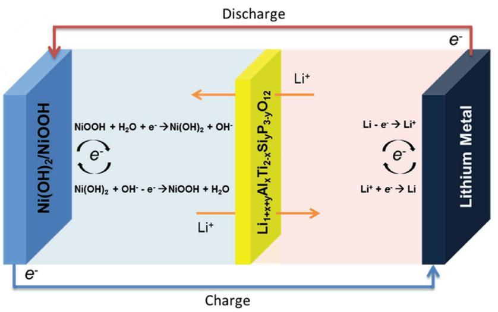
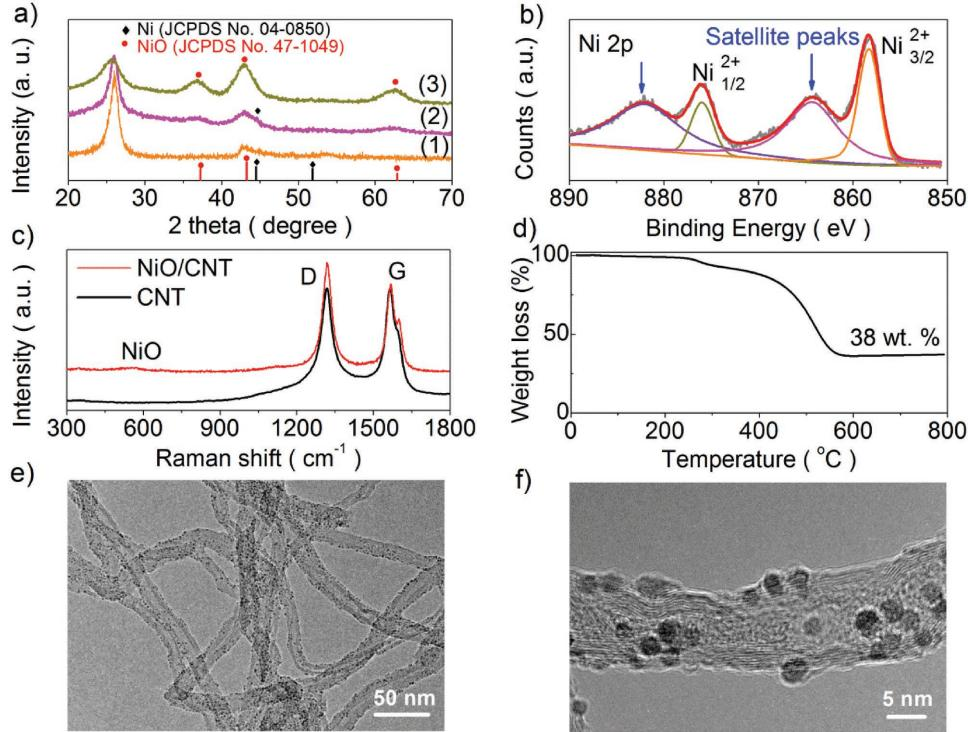
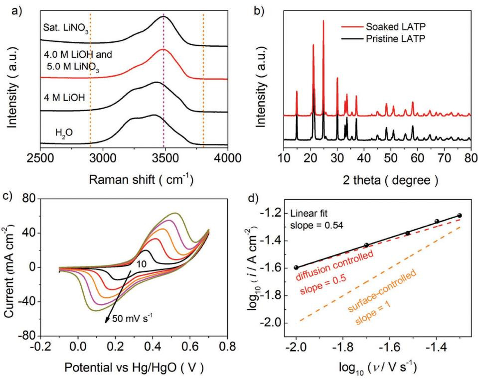
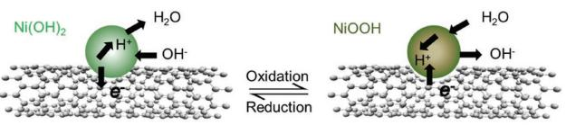
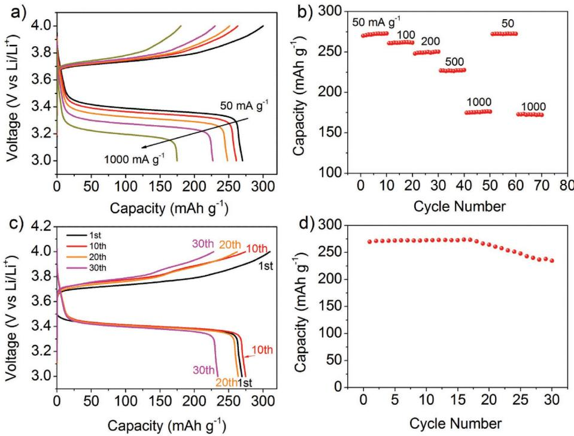
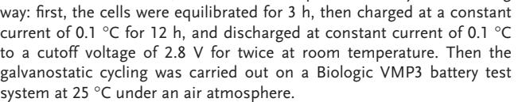

**Hybrid Batteries**

# **High-Performance Aqueous Rechargeable Li-Ni Battery Based on Ni(OH)2/NiOOH Redox Couple with High Voltage**

*Ming Zhang,\* Zheng Huang, Zhongrong Shen, Yingpeng Gong, Bo Chi,\* Jian Pu, and Jian Li*

**New energy storage and conversion systems require large-scale, cost-effective, good safety, high reliability, and high energy density. This study demonstrates a low-cost and safe aqueous rechargeable lithium-nickel (Li-Ni) battery with solid state Ni(OH)2/NiOOH redox couple as cathode and hybrid electrolytes separated by a Li-ion-conductive solid electrolyte layer. The proposed aqueous rechargeable Li-Ni battery exhibits an approximately open-circuit potential of 3.5 V, outperforming the theoretic stable window of water 1.23 V, and its energy density can be 912.6 W h kg-1 , which is much higher than that of state-of-the-art lithium ion batteries. The use of a solid-state redox couple as cathode with a metallic lithium anode provides another postlithium chemistry for practical energy storage and conversion.**

## **1. Introduction**

In recent years, rechargeable lithium-ion batteries (LIBs) have been the most commonly used batteries for electric vehicles (EVs) and large-scale energy storage in smart grid applications. However, the energy density of conventional LIBs of 150–200 W h kg-1 is still limited. Ideally, a three to tenfold increase in energy density is required to lower the cost for smart grids and longer driving distance for EVs comparable to gasoline-powdered automobiles.[1–3]

Generally, the battery performance, including specific capacity, energy density, and life cycle, is related to the intrinsic properties of the selected electrolyte and electrode materials. It remains a great challenge to find new materials, as well as the right combination of electrode/electrolyte to realize good battery

Dr. M. Zhang, Y. Gong, Prof. B. Chi, Prof. J. Pu, Prof. J. Li Center for Fuel Cell Innovation State Key Laboratory of Material Processing and Die & Mould Technology School of Materials Science and Engineering Huazhong University of Science & Technology Wuhan 430074, China E-mail: m-zhang@shinshu-u.ac.jp; chibo@hust.edu.cn Dr. M. Zhang, Dr. Z. Shen Materials and Chemical Engineering Faculty of Textile Science and Technology Shinshu University 3-15-1 Tokida, Ueda 386-8567, Japan Dr. Z. Huang Shanxi Province Key Laboratory of Functional Nanocomposite Materials School of Materials Science and Engineering

North University of China

Taiyuan 030051, China

#### **DOI: 10.1002/aenm.201700155**

performance. Metallic lithium has a very high electronegativity while possessing the lowest density among all metals, leading to a theoretically high specific capacity (3861 mA h g-1 ) and thus has been considered to be the best candidate for a rechargeable battery anode. To achieve a high energy value, many efforts have been focused on increasing cathode capacity to couple with the metallic lithium anode, which results in the appearance of various concepts of prototype batteries, such as lithium-oxygen (Li-O2) batteries,[4–7] lithium sulfur (Li-S) batteries,[8,9] aqueous rechargeable batteries (ARBs).[10–13] These batteries have demonstrated greater

capacity than that of the current LIB. Although Li-O2 and Li-S batteries have received wide attention due to their high energy density, there still exist some challenges for those batteries. In Li-O2 batteries, the decomposition of organic electrolyte and corrosion of carbon materials, and the porous cathode blocking, causes capacity fading.[14–18] High internal resistance caused by the formation of polysulfide dissolution will decrease the capacity rapidly for Li-S batteries,[8,19,20] culminating in poor discharge efficiency and rechargeability for Li-O2 and Li-S batteries. Among other energy storage devices, ARBs have attracted much attention due to their good safety, environmental issues, and low cost. Many types of ARBs have been explored recently, including aqueous alkali-ion batteries, aqueous metal-ion batteries, and aqueous nickel–metal hydride (NiMH) batteries.[11] While the performance of aqueous alkali-ion batteries and metal ion batteries is always restricted by the slow electrode kinetics relating to alkali ion intercalation/deintercalation from its host materials. NiMH batteries have the advantage of fast electrode kinetics reaction based on faradaic reactions, which involves one or multielectron reactions on electrode materials. The NiMH batteries mainly consist of the MH negative electrode, the Ni(OH)2 positive electrode, and the aqueous alkaline electrolyte. Both cathode and anode materials can deliver a large mass capacity. However, the battery voltage is only 1.32 V due to the limitation of aqueous electrolytes. Therefore, it can only achieve an energy density of 60–100 W h kg-1 . [21] In order to realize high voltage for aqueous batteries, hydrogen evolution reaction at the anode side must be avoided. If the potential of the negative electrode can be lowered below the limitation of the hydrogen evolution reaction, metallic lithium would be used in the extreme case, then battery voltage over 3.0 V can be expected.

In the present study, we develop a new type of high voltage, high specific energy density aqueous rechargeable Li-Ni

**Figure 1.** Structure schematic illustration of the as-fabricated Li-Ni battery device based on Ni(OH)2/NiOOH redox couple.

battery. It consists of Ni(OH)2/NiOOH redox couple formed by an in situ transformation from NiO anchored on multiwall carbon nanotubes (NiO/CNT) as cathode and metallic lithium anode with both organic electrolyte and aqueous electrolyte separated by a thin glass ceramic film Li1+*x*+*y*Al*x*Ti2-*x*Si*y*P3-*y*O12 (LATP, φ = 19 (±0.2) mm × 150 (±30) µm, Ohara Inc., Japan) with high lithium ionic conductivity, as shown in **Figure 1**. A voltage of 3.5 V for Li-Ni battery can be achieved because water permeation-free lithium ion conducting LATP separator can protect lithium metal anode from reacting with aqueous electrolyte.[22] This battery is able to deliver mass specific capacity and energy density twice higher compared to conventional LIB and MH batteries.

## **2. Results and Discussion**

Typical X-ray diffraction (XRD) patterns of the as-prepared NiO/CNT by solvothermal method are shown in **Figure 2**a. For NiO/CNT samples without treatment in air, there still exist some small peaks from nickel (JCPDS No. 04-0850) (included NiO/CNT after treatment in Ar; Figure S1, Supporting Information). All of the reflections from the XRD patterns of NiO/CNT with treatment in air can be indexed to cubic NiO phase (JCPDS No. 47-1049) except the crystalline

peaks at 26.4° and 44.3° that result from CNT substrate, indicating that the NiO/CNT composites have been completely synthesized after heating treatment. In addition, no nickel peaks and other impurity are detected from the treatment sample at 300 °C in air.

The surface valence state of Ni is investigated by X-ray photoelectron spectrum (XPS) analysis. As shown in Figure 2b, XPS

**Figure 2.** a) XRD patterns of (1) Pristine CNT, (2) NiO/CNT composite, and (3) NiO/CNT composite after annealing in air at 300 °C for 1.5 h, b) XPS spectra of Ni 2p, c) Raman spectra of CNT and NiO/CNT, d) TGA curve of NiO/CNT composite after annealing in air at 300 °C for 1.5 h, and TEM images of NiO/CNT composite at e) low and f) high magnification.

spectra of Ni 2p3/2 indicate that Ni2+ (858.3 eV) is the major phase in NiO/CNT nanomaterials. The peaks at 858.3 and 876 eV represent the Ni2+ state (2p3/2 and 2p1/2 main lines). The two shake up-satellite peaks are found at 864.3 and 882 eV for each of the emission lines of Ni 2p, respectively.[23] No peak at 851.7 eV for Ni (0) state is presented at surface,[24] confirming Ni is totally converted into NiO nanoparticles (NPs) after heating treatment.

The Raman spectra of pristine CNT and NiO/CNT composite are shown in Figure 2c. The bands centered at 1321 and 1565 cm−1 are assigned to CNT, in accordance with the typical carbon characteristic D (one-phonon dispersion relation, DR) and G (two-phonon DR) bands, respectively.[25] And the band featured at 556 cm−1 is assigned to the first-order transverse optical phonon modes of NiO.

The typical thermogravimetric analysis (TGA) profile for NiO/CNT composite is presented in Figure 2d. The thermal analysis of the NiO/CNT composite can be divided into three main regions. The weight loss region from room temperature to 200 °C can be assigned to loss of water adsorbed on the surface. Thereafter, a lightly weight lost between 250 and 300 °C may be ascribed to the chemical dehydrated conversion of residual Ni(OH)2 to NiO and H2O.[26] A broad peak in the TGA curve between 300 and 550 °C corresponds to an oxidation of the CNT combined with the evaporation of volatile products such as H2O and CO2. However, beyond this temperature, there is only a slight weight loss. The percentage of NiO in the NiO/CNT composite can be estimated from the weight loss in different temperature ranges. From this estimation, the quantities of NiO nanoparticles loaded on CNT are around 38 wt%, which is close to the quantitative result of NiO/CNT by XPS analysis (Figure S2, Supporting Information).

The morphology and structure of the as-prepared samples were observed by transmission electron microscopy (TEM). Figure 2e shows that NiO NPs are anchored homogeneously on the surfaces of CNT (pristine CNT; Figure S3, Supporting Information). The diameters of as-prepared NiO NPs are around 2–4 nm (Figure 2f),[27] which are also consistent with pure NiO NPs (Figure S4, Supporting Information).

For hybrid lithium batteries with both organic and aqueous electrolyte, the stability of LATP glass-ceramic separator in aqueous electrolyte is very important.[22,28] So it is necessary to choose a suitable aqueous electrolyte that can keep LATP surviving lithium stripping and deposition for a long lifespan in an aqueous electrolyte with low electrode polarization. Previous works have confirmed that LATP is more stable in aqueous alkaline solution with a high content of Li+ ions and a pH range below 11.[28–30] Meanwhile, oxygen evolution reaction and hydrogen evolution reaction can be suppressed by using highly concentrated aqueous electrolyte with a high alkalinity.[12,31] In this work, the aqueous electrolyte is 4.0 m LiOH–5.0 m LiNO3 solution with pH of about 10.20. Meanwhile, the OH stretching vibration modes of water molecules in pure water, 4.0 m LiOH, 4.0 m LiOH–5.0 m LiNO3, and saturated LiNO3 aqueous solution are evaluated by Raman spectroscopy (**Figure 3**a) in order to compare the alkalinity of aqueous electrolyte. In pure water,

**Figure 3.** a) Raman spectra of 4.0 m LiOH–5.0 m LiNO3 solution compared with pure water, 4.0 m LiOH, and saturated LiNO3 aqueous solution, b) XRD patterns of pristine LATP and LATP after immersion in 4.0 m LiOH–5.0 m LiNO3 aqueous solution for one month at room temperature, c) CVs of preactivated NiO/CNT electrode at various scan rates from 10 to 50 mV s−1 in 4.0 m LiOH–5.0 m LiNO3 electrolyte, and d) analysis of anodic peak currents as a function of the scan rate; the oxidation of Ni(OH)2 is limited by proton diffusion.

the broad bands in the range of 2900–3800 cm−1 are attributed to clusters of water molecules with various H-bonding environments. Yamada et al. have reported a new peak appeared at 3565 cm−1 at the expense of the broad water-cluster band for Li(TFSI)0.7(BETI)0.3·2H2O electrolyte. It indicates the banding state in Li(TFSI)0.7(BETI)0.3·2H2O electrolyte is close to that in crystalline hydrates.[31] The Raman band of saturated LiNO3 solution shows much narrow band and shifts to crystalline hydrates direction compared to pure water and 4.0 m LiOH aqueous solution. In addition, the Raman behavior of 4.0 m LiOH–5.0 m LiNO3 aqueous solution shows very similar OH stretching state with saturated LiNO3 aqueous solution. Meanwhile, there is no phase change from XRD patterns of LATP after immersion in 4.0 m LiOH–5.0 m LiNO3 solution for one month at room temperature (Figure 3b). Thus, it is reasonable to use 4.0 m LiOH–5.0 m LiNO3 aqueous solution as the catholyte for hybrid Li-Ni battery in this work.

A three-electrode cell is used to evaluate the reversibility of NiO/CNT electrode in the 4.0 m LiOH–5.0 m LiNO3 aqueous electrolyte. Cyclic voltammetry (CV) is generally used to characterize the electrochemical behavior of the electrode material. Figure 3c shows the typical CV curves of the as-prepared NiO/CNT at different scan rates in 4.0 m LiOH–5.0 m LiNO3 aqueous electrolyte over the potential range from –0.1 V to 0.7 V vs Hg/HgO. All the CV curves consist of a pair of strong redox peaks, indicating that the reaction characteristics are mainly governed by Faradaic redox reactions. It is very distinct from that of electric double-layer capacitors that usually produce a CV curve close to an ideal rectangular shape. Previous studies have attributed those reactions to Ni(OH)2/NiOOH redox reactions.[32–34] The anodic peak (positive current density) demonstrates a process related to the oxidation reaction of Ni(OH)2 to NiOOH, whereas the cathodic peak (negative current density) corresponds to a reverse process.

Usually, NiO tends to form Ni(OH)2 in contact with alkaline solutions.[33,35–37] In this work, Ni(OH)2 is formed from NiO/CNT composite in 4.0 m LiOH–5.0 m LiNO3 alkaline electrolyte solution via an in situ process as shown in Equations (1) and (2). First, H2O molecules are strongly adsorbed on the surface of NiO NPs where oxygen exerts a proton–acceptor site for H2O molecules through hydrogen bonding, leading to the conversion of surface NiO to the hydroxide phase Ni(OH)2. However, the amount of Ni(OH)2 spontaneously formed at the surface due to the interaction of H2O is still extremely limited. Therefore, at high potential during the preactivation process, the conversion of NiO to Ni(OH)2 will be promoted; Ni(OH)2 can be generated completely via one-electron transfer through Equation (2) by application of a cyclic potential sweep:[13,33,34,36,37]

$$
NiO + H_2O_{\text{physical}} \rightarrow NiO \cdot H_2O_{\text{strongly adsorbed}} \rightarrow Ni(OH)_{_2} \tag{1}
$$

$$
Ni(OH)_{2} + OH^{-} \frac{\text{Oxidation}}{\text{Reduction}} NiOOH + H_{2}O + e^{-}
$$
 (2)

The Randles–Sevcik equation (Equation (3)) can be used to reveal the voltammetric peak currents at the electrode with diffusion limitation in the particle bulk.[38,39] The fitting line (Equation (4)) of log *i*pa vs log υ plot shows a slope close to the theoretical value of 0.5 expected for a diffusion-controlled process in Figure 3d, as opposed to a value of 1 for a surfacecontrolled process:

$$
i_p = 268600n^{3/2}AD^{1/2}Cv^{1/2}
$$
\n(3)

$$
\log i_{\rm pa} = 0.5 \log \nu + \text{constant} \tag{4}
$$

where *i*p is the maximum peak current (A), *n* is the number of electrons transferred (here is 1), *A* is the electrode area (cm2), *D* is the diffusion coefficient (cm2 s), *C* is the bulk concentration of solution (mol cm-3), and *v* is the scan rate (V s-1 ), respectively.

It is very important to note that due to the small size dimensions of the electrode nanoparticles, the diffusion of the involved species in the electrolyte occurs extremely fast. Hence, it is the diffusion of protons inside the bulk of the formed Ni(OH)2 material that limits the overall oxidation reaction. Moreover, the oxidation peak potential shifts positively with increasing scan rate, suggesting a kinetic limitation in the reaction between the Ni(OH)2/NiOOH redox couple. The detailed reaction processes during CV sweeping can be explained by the redox switching mechanism as presented schematically in **Figure 4**. In the oxidation process prior to the peak potential, H+ ions leave and OH- ions enter the electrode/electrolyte interface and combine with H+ ions to produce H2O. During reduction, H2O molecules are dissociated to produce H+ ions that are reintercalated into the electrode lattice of NiOOH concurrently with OH- ions being expelled into electrolyte solution.

The performance of NiO/CNT electrode coated on Ti mesh has been evaluated using a home-designed hybrid Li-Ni battery (Figure S5, Supporting Information). For a full Li-Ni battery: (+)NiO/CNT|4.0 m LiOH–5.0 m LiNO3|LATP separator|1.0 m LiClO4 solution in ethylene carbonate/diethyl carbonate/dimethyl carbonate (EC/DEC/DMC)| Li (−), NiO NPs coated on CNT were automatic chemical and electrochemical converted into Ni(OH)2/NiOOH redox couple in alkaline electrolyte during the preactivation process. Therefore, the overall electrochemical reaction for Li-Ni battery is based on the following one-electron reaction (Equation (5)):

NiOOH + Li + H2O 
$$
\frac{\text{Discharge}}{\text{charge}} \text{Ni(OH)}_{2} + \text{LiOH}
$$
 (5)  

$$
(E^{\circ} \approx 3.5 \text{V vs Li}/\text{Li}^{+})
$$

During the discharge process, solid cathode undergoes insertion reactions, NiOOH is electrochemical reduced to Ni(OH)2 and the oxidation reaction (Li → Li+ + *e*-) synchronously occurs on Li-anode side. Thus, the formed Li+ ions diffuse from the organic electrolyte to an aqueous electrolyte through LATP

**Figure 4.** Schematic illustration of the oxidation and reduction process between Ni(OH)2/NiOOH redox couple (the process is limited by proton diffusion).

**Figure 5.** a) Rate capability of the Li-Ni battery. b) Stability of the Li-Ni battery at various current densities. c) Galvanostatic charge–discharge voltage cycles of the Li-Ni battery at 50 mA g-1 . d) Cycling performance of the Li-Ni battery at 50 mA g−1 .

that prevents crossover of aqueous/organic electrolyte while allowing for the exchange of Li+ ions for charge balance. In the charge process, Li-Ni battery undergoes a reverse reaction mechanism. Therefore, it can be supposed that all the NiO NPs can be converted into Ni(OH)2 during the preactivation process. And the theoretical capacity *Q*theoretical of Li-Ni battery associated with the above reaction is 289.03 mA h g−1 based on the mass of Ni(OH)2, which is about two times higher than commercial LIB with the carbon anode.[40–42]

The typical charge/discharge curves of Li-Ni battery at various current density are shown in **Figure 5**a. Obviously, the potential plateaus can be seen on all curves implying a batterytype characteristic of the electrode.[37] The battery exhibits a discharge specific capacity *Q*discharge of 270.0 mA h g-1 and a discharge voltage plateau of 3.38 V at current density of 50 mA g-1 (0.17 C) and the calculated mass specific energy density of Li-Ni battery is 912.6 W h kg-1 based on the mass of Ni(OH)2. It is worth noting that a discharge capacity of 174.8 mA h g−1 and mass specific energy density of 559.6 W h kg-1 can be

achieved at current density of 1000 mA g−1 (3.5 C). The related capacity, energy density, and coulombic efficiencies (ηc; Equation (6)) data for Li-Ni battery at various current density are summarized in **Table 1** and the corresponding coulombic efficiencies are about 93.4%, 90.2%, 85.8%, 78.5%, and 60.5% at current density of 50, 100, 200, 500, and 1000 mA g-1 , respectively. The gradual potential drop with the increase of current density indicates a mass transport loss, which is dominated by the slow mobility of Li+ ions in the Li+ ion conducting glass-ceramic electrolyte LATP.[13,43] Meanwhile, the reason for the gradually capacity decay is due to the kinetic limitation in the reaction between the Ni(OH)2/ NiOOH redox couple because of larger potential polarization and slower mobility of Li+ ions in the high resistance LATP to migrate from the aqueous cathode to the anode. Figure 5b shows the stability of discharge capacity at various current density and the results demonstrate a good specific capacity retention even after polarization at a high discharge/charge current density.

$$
\eta_{\rm c} = \frac{Q_{\rm discharge}}{Q_{\rm theoretical}} \times 100 \tag{6}
$$

Figure 5c,d shows the galvanostatic cycling curves and the corresponding coulombic efficiencies of Li-Ni battery at current density of 50 mA g−1 between 3.0 and 4.0 V vs Li/Li+. The specific capacity of the first and 10th discharge is 269.9 and 272.8 mA h g−1 , and a maximum capacity

**Table 1.** The related capacity, voltage, energy density, and coulombic efficiencies data for rechargeable Li-Ni battery at various current densities.

| Current density [mA g-1 ] | Discharge capacity [mA h g-1 ] | Discharge voltage plateau [V] | Charge capacity [mA h g-1 ] | Coulombic efficiency [%] | Energy density [W h kg-1 ] |
|---------------------------------|--------------------------------------|----------------------------------|-----------------------------------|-----------------------------|----------------------------------|
| 50                              | 270.0                                | 3.38                             | 300.1                             | 93.4                        | 912.6                            |
| 100                             | 261.1                                | 3.33                             | 263.2                             | 90.2                        | 869.5                            |
| 200                             | 248.3                                | 3.30                             | 251.3                             | 85.8                        | 819.4                            |
| 500                             | 226.9                                | 3.25                             | 230.2                             | 78.5                        | 737.4                            |
| 1000                            | 174.8                                | 3.20                             | 180.3                             | 60.5                        | 559.4                            |

273.8 mA h g−1 at the 16th cycle. The reason for the gradual increase of discharge capacity in the beginning 16 cycles may be the fully activation of NiO into NiOOH and Ni(OH)2. [35,44,45] However, the decay of specific capacity and voltage can be observed since the 16th cycle. The specific capacity of Li-Ni battery declines to 234.8 mA h g−1 at the 30th cycle, ≈81% of the theoretical discharge capacity. The decay of discharge capacity may be caused by the slowly dissolution of Ni(OH)2/NiOOH electrode materials during the long discharge and charge process since the color of the aqueous electrolyte becomes light dark green. In addition, lithium ion conducting glass ceramic LATP is also slightly damaged by both organic electrolyte and aqueous electrolyte during the test. Calculating from the electrochemical impedance spectra (EIS) data (Figure S6, Supporting Information), the total electrochemical conductivity of LATP after cycles decreased to 6.81 × 10-5 S cm-1 from 7.66 × 10-5 S cm-1 of pristine LATP. Corrosion and small holes are formed on both surface sides and cross side of LATP after galvanostatic discharge and charge test (Figures S7 and S8, Supporting Information). The corrosion depth on aqueous electrolyte side is much thicker than the organic electrolyte side for LATP from the cross section observation (Figure S8, Supporting Information). Of course, the mass specific capacity of Li-Ni battery still decays during a long lifespan. However, this capacity decay can be ameliorated by adjusting the composition of the aqueous electrolyte and the current collector and processing to suppress the slowly dissolution of Ni(OH)2/NiOOH redox couple, such as (1) using carbon-coated NiO as electrode materials; (2) adding some additives (salts contain Ni2+ ions) into the aqueous electrode to suppress the dissolution process; and (3) using porous Ni mesh as current collector.

## **3. Conclusion**

In summary, we successfully demonstrate a high energy efficiency hybrid Li-Ni battery with Ni(OH)2/NiOOH redox couple as the positive electrode prepared by an in situ method. The proposed aqueous Li-Ni battery exhibits a stable discharge potential about 3.38 V versus Li+/Li at current density of 50 mA g-1 and higher mass specific energy density of 912.6 W h kg-1 than that of state-of-the-art lithium ion batteries. It is an interesting alternative energy system in light of its high energy density, environmental friendliness, and fundamental safety. The above preliminary results demonstrate the feasibility of a rechargeable Li-Ni battery. Obviously, opportunities and challenges coexist in this new type of system. Further research is needed to improve the electrochemical properties, such as efficiency and cyclability. However, this approach provides another way to construct viable and practical aqueous rechargeable batteries by selecting solid redox-couple compounds as positive electrodes.

## **4. Experimental Section**

*Materials Synthesis*: NiO/CNT composite was synthesized by a solvothermal method.[27] Briefly, 34 mg ground CNT powders (purity >95%, diameter ∅15–20 nm, Sigma-Aldrich) was added into 20 mL *tert*-butyl alcohol in a stainless steel autoclave. After bath sonication for 30 min, 0.13 g (0.5 mmol) of nickel(II) acetylacetonate (Ni(acac)2, Sigma-Aldrich) was added to the suspension and the mixture was kept bath sonication for 1 h and then hermetically sealed. The autoclave was kept at 210 °C for 24 h. The solid was obtained by centrifuge and washed thoroughly with deionized water (DI water), dried in a vacuum oven. Finally, the sample was annealed in air at 300 °C for 1.5 h. NiO NPs were synthesized with the same steps just without CNT as reference.

*Electrode Preparation*: The NiO/CNT ink was prepared as follows: 6.2 mg NiO/CNT composite powder was dispersed in a mixture of 600 µL of DI water, 300 µL of ethanol, and 10 µL of 5 wt% Nafion solution. The ink in a sealed vial was sonicated until a homogeneous mixture was obtained. Then a 100 µL aliquot was dropped on a Ti plate electrode for a total NiO/CNT loading of ≈600 µg cmgeo −2 based on the geometric area of the Ti plate and then dried in air for 4 h and then kept in a vacuum oven at 60 °C for one night.

*Electrolyte Preparation*: Electrolyte components were dried and stored in the argon-filled glove box prior to use. The salt, lithium perchlorate (LiClO4) (Sigma-Aldrich; battery grade), was dried at 100 °C under vacuum and the solvent, alkyl carbonate solutions were prepared with EC/DEC (anhydrous >99%)/DMC (anhydrous >99%). The mixed EC/DEC/DMC (1:1:1 by vol.) solvent was dried using 3A molecular sieves prior to use to maintain H2O content less than 10 ppm (measured by Karl Fischer titration). The electrolyte, a 1.0 m LiClO4 solution in EC/DEC/DMC was prepared by mixing with a Teflon-coated stir bar in an argon glove box.

*Battery Assemble*: A prototype Li-Ni battery was assembled using a home-designed cell mould. Briefly, the structure of the hybrid Li-Ni battery was as follows: (+)SUS316|Ti sheet/NiO/CNT|catholyte container (polypropylene cylinder 1)|LATP separator|electrolyte container (polypropylene cylinder 2)| Li/Cu mesh/Cu sheet|SUS316 (−). The cylindrical polypropylene shells (inner diameter = 12 mm and out diameter = 24 mm) were used to fill with electrolyte solutions via a hole with ∅0.5 mm on each shell wall. The water-stable lithium-ion conducting glass ceramic LATP was sandwiched and attached between cylindrical polypropylene shells as the separator of organic electrolyte and aqueous electrolyte by a thin thermal bonding film (3M TBF615-4mil) at 80 °C for 30 min. NiO/CNT ink coated on Ti sheet was connected and faced to the catholyte cylinder 1. Negative electrode compartment was conducted in an Ar-filled glove box (H2O and O2 less than 1 ppm) where a thin and little excessive amount lithium metal was attached to a copper mesh (Nilaco; ∅0.11 x 100 x 100 mm) soldered on a flat Cu sheet within electrolyte cylinder 2. The whole cell was assembled and fixed into an SUS316 device. Then organic electrolyte of 1.0 m LiClO4 in EC/ DEC/DMC organic electrolyte (0.40 mL in volume) was added into the electrolyte cylinder 2 through the hole by gastight syringes (Hamilton; 1700 Series) and then the hole on the cylinder 2 was sealed by Kapton tape in a glove box. Finally, an aqueous solution containing 4.0 m LiOH and 5.0 m LiNO3 (0.45 mL in Volume) was injected into the positive part of the polypropylene cylinder 1 out of glove box, the aqueous electrolyte was purging by argon gas for 30 min before use.

*Materials Characterization*: Scanning electron microscope (SEM) images were obtained using a Hitachi SEM S-4800. The crystal structure of the samples was analyzed using XRD (Rigaku RINT 2500) with Cu Kα radiation at a scanning step rate of 0.02° s-1 . TEM was performed by a JEOL-JEM 2010 (Hitachi; 200kV). TGA of the NiO/CNT composite was carried out using a thermal analyzer (Rigaku Thermoplus; TG8120) at a heating rate of 10 °C min-1 from 20 to 800 °C. Raman measurements were carried out at room temperature in backscattering geometry with a LabRam HR800 UV spectrometer operating with a 488 nm Ar ion laser. XPS was performed on a Kratos Ultra AXIS Spectrometer system equipped with a monochromatic Al-Kα source (15kV).

*Electrochemical Measurements*: EIS were carried out using an impedance analyzer (Solartron 1260 and 1287) at 25 °C with the frequency range of 0.01 Hz–1 m Hz. CV was carried out in three-electrode cells using a CHI 600E electrochemical work station (CH Instruments, Inc.), and glass carbon (GC) decorated with NiO/CNT ink as working electrode. A Pt mesh with a large geometric area and a standard Hg/HgO served as the counter and reference electrodes, respectively. For electrochemical test, all the cells were preactivated by the following

## **Supporting Information**

Supporting Information is available from the Wiley Online Library or from the author.

#### **Acknowledgements**

The authors would like to thank Materials Characterization Center of Huazhong University of Science and Technology for samples characterization assistance.

## **Keywords**

hybrid aqueous lithium batteries, lithium ion conductors, Ni-MH, redox couples

- Received: January 16, 2017
- Revised: February 17, 2017
- Published online: May 10, 2017
- [1] M. Armand, J. M. Tarascon, *Nature* **2008**, *451*, 652.
- [2] C. Liu, F. Li, L. P. Ma, H. M. Cheng, *Adv. Mater.* **2010**, *22*, E28.
- [3] J. B. Goodenough, K. S. Park, *J. Am. Chem. Soc.* **2013**, *135*, 1167.
- [4] P. G. Bruce, S. A. Freunberger, L. J. Hardwick, J. M. Tarascon, *Nat. Mater.* **2012**, *11*, 19.
- [5] G. Girishkumar, B. McCloskey, A. C. Luntz, S. Swanson, W. Wilcke, *J. Phys. Chem. Lett.* **2010**, *1*, 2193.
- [6] Z. Q. Peng, S. A. Freunberger, Y. H. Chen, P. G. Bruce, *Science* **2012**, *337*, 563.
- [7] Z. L. Wang, D. Xu, J. J. Xu, X. B. Zhang, *Chem. Soc. Rev.* **2014**, *43*, 7746.
- [8] X. L. Ji, K. T. Lee, L. F. Nazar, *Nat. Mater.* **2009**, *8*, 500.
- [9] N. Jayaprakash, J. Shen, S. S. Moganty, A. Corona, L. A. Archer, *Angew. Chem., Int. Ed.* **2011**, *50*, 5904.
- [10] X. J. Wang, Y. Y Hou, Y. S. Zhu, Y. P. Wu, R. Holze, *Sci. Rep.* **2013**, *3*, 1401.
- [11] H. Kim, J. Hong, K.-Y. Park, H. Kim, S.-W. Kim, K. Kang, *Chem. Rev.* **2014**, *114*, 11788.
- [12] L. Suo, O. Borodin, T. Gao, M. Olguin, J. Ho, X. Fan, C. Luo, C. Wang, K. Xu, *Science* **2015**, *350*, 938.
- [13] H. Q. Li, Y. G. Wang, H. T. Na, H. M. Liu, H. S. Zhou, *J. Am. Chem. Soc.* **2009**, *131*, 15098.
- [14] F. Cheng, J. Chen, *Chem. Soc. Rev.* **2012**, *41*, 2172.
- [15] B. D. McCloskey, R. Scheffler, A. Speidel, D. S. Bethune, R. M. Shelby, A. C. Luntz, *J. Am. Chem. Soc.* **2011**, *133*, 18038.
- [16] J. J. Xu, D. Xu, Z. L. Wang, H.-G. Wang, L. L. Zhang, X. B. Zhang, *Angew. Chem., Int. Ed.* **2013**, *52*, 3887.
- [17] J. Cheng, M. Zhang, Y. X. Jiang, L. Zou, Y. P Gong, B. Chi, J. Pu, J. Li, *Electrochim. Acta* **2016**, *191*, 106.
- [18] Y. L. Zhao, L. Xu, L. Q. Mai, C. H. Han, Q. Y. An, X. Xu, X. Liu, Q. J. Zhang, *Proc. Natl. Acad. Sci. USA* **2012**, *109*, 19569.
- [19] Z. Li, Y. Jiang, L. Yuan, Z. Yi, C. Wu, Y. Liu, P. Strasser, Y. Huang, *ACS Nano* **2014**, *8*, 9295.
- [20] J. Ye, F. He, J. Nie, Y. L. Cao, H. X. Yang, X. P. Ai, *J. Mater. Chem. A* **2015**, *3*, 7406.
- [21] M. A. Fetcenko, S. R. Ovshinsky, B. Reichman, K. Young, C. Fierro, J. Koch, A. Zallen, W. Mays, T. Ouchi, *J. Power Sources* **2007**, *165*, 544.
- [22] T. Zhang, N. Imanishi, S. Hasegawa, A. Hirano, J. Xie, Y. Takeda, O. Yamamoto, N. Sammes, *Electrochem. Solid-State Lett.* **2009**, *12*, A132.
- [23] J. Wang, K. Li, Z. L. Wang, Z. Jiang, Z. J. Wu, X. B. Zhang, *Angew. Chem., Int. Ed.* **2015**, *54*, 10530.
- [24] R. Bhosale, S. Kelkar, G. Parte, R. Fernandes, D. Kothar, S. Ogale, *ACS Appl. Mater. Interfaces* **2015**, *7*, 20053.
- [25] M. S. Dresselhaus, G. Dresselhaus, R. Saito, A. Jorio, *Phys. Rep.* **2005**, *409*, 47.
- [26] J. Liang, H. Tan, C. H. Xiao, G. J. Zhou, S. W. Guo, S. J. Ding, *J. Power Sources* **2015**, *285*, 210.
- [27] K. Fominykh, J. M. Feckl, J. Sicklinger, M. Doblinger, S. Bocklein, J. Ziegler, L. Peter, J. Rathousky, E. W. Scheidt, T. Bein, D. Fattakhova-Rohlfing, *Adv. Funct. Mater.* **2014**, *24*, 3123.
- [28] M. Zhang, K. Takahashi, N. Imanishi, Y. Takeda, O. Yamamoto, B. Chi, J. Pu, J. Li, *J. Electrochem. Soc.* **2012**, *159*, A1114.
- [29] S. Hasegawa, N. Imanishi, T. Zhang, J. Xie, A. Hirano, Y. Takeda, O. Yamamoto, *J. Power Sources* **2009**, *189*, 371.
- [30] N. Imanishi, S. Hasegawa, T. Zhang, A. Hirano, Y. Takeda, O. Yamamoto, *J. Power Sources* **2008**, *185*, 1392.
- [31] Y. Yamada, K. Usui, K. Sodeyama, S. Ko, Y. Tateyama, A. Yamada, *Nat. Energy* **2016**, *1*, 16129.
- [32] J. Yan, Z. Fan, W. Sun, G. Ning, T. Wei, Q. Zhang, R. Zhang, L. Zhi, F. Wei, *Adv. Funct. Mater.* **2012**, *22*, 2632.
- [33] Y. Mu, D. L Jia, Y. Y. He, Y. Q. Miao, H. L. Wu, *Biosens. Bioelectron.* **2011**, *26*, 2948.
- [34] M. Nakamura, M. Tanaka, M. Ito, O. Sakata, *J. Chem. Phys.* **2005**, *122*, 224703.
- [35] L. Wang, H. Chen, Q. Daniel, L. L. Duan, B. Philippe, Y. Yang, H. Rensmo, L. C. Sun, *Adv. Energy Mater.* **2016**, *6*, 1600516.
- [36] C. C. Hu, K. H. Chang, T. Y. Hsu, *J. Electrochem. Soc.* **2008**, *155*, F196.
- [37] T. Brousse, D. Belanger, J. W. Long, *J. Electrochem. Soc.* **2015**, *162*, A5185.
- [38] D. S. Dalavi, R. S. Devan, R. S. Patil, Y. R. Ma, M. G. Kang, J. H. Kim, P. S. Patil, *J. Mater. Chem. A* **2013**, *1*, 1035.
- [39] M. E. G. Lyons, R. L. Doyle, I. Godwin, M. O'Brien, L. Russell, *J. Electrochem. Soc.* **2012**, *159*, H932.
- [40] L. X. Yuan, Z. H. Wang, W. X. Zhang, X. L. Hu, J. T. Chen, Y. H. Huang, *Energy Environ. Sci.* **2011**, *4*, 269.
- [41] A. Kraytsberg, Y. E. Eli, *Adv. Energy Mater.* **2012**, *2*, 922.
- [42] Y. N. Xu, Q. L. Wei, C. Xu, Q. D. Li, Q. Y. An, P. F. Zhang, J. Z. Sheng, L. Zhou, L. Q Mai, *Adv. Energy Mater.* **2016**, *6*, 1600389.
- [43] M. Zhang, K. Takahashi, I. Uechi, Y. Takeda, O. Yamamoto, D. M. Im, D. J. Lee, B. Chi, J. Pu, J. Li, N. Imanishi, *J. Power Sources* **2013**, *235*, 117.
- [44] B. Wang, J. S. Chen, Z. Wang, S. Madhavi, X. W. Lou, *Adv. Energy Mater.* **2012**, *2*, 1188.
- [45] K. L. Nardi, N. Y. Yang, C. F. Dickens, A. L. Strickler, S. F. Bent, *Adv. Energy Mater.* **2015**, *5*, 1500412.