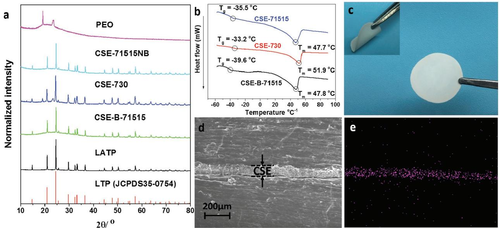
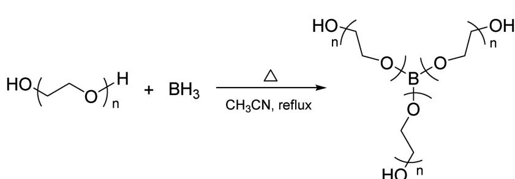
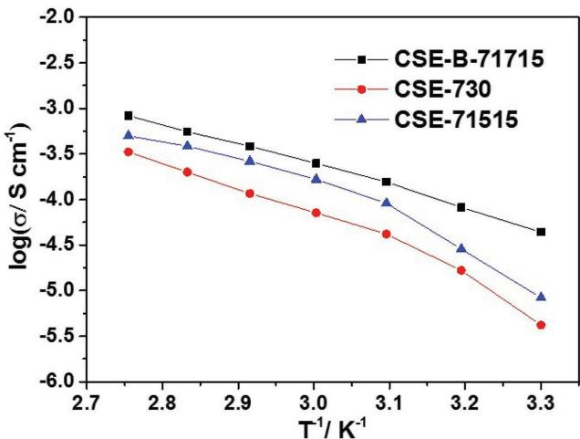
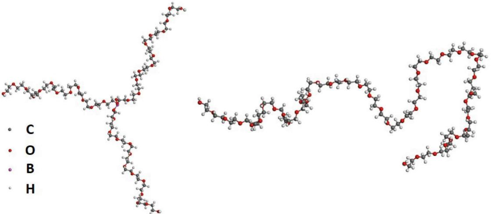
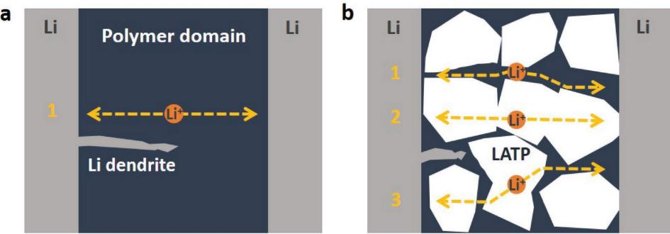
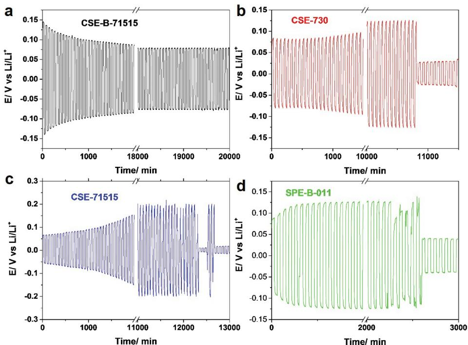
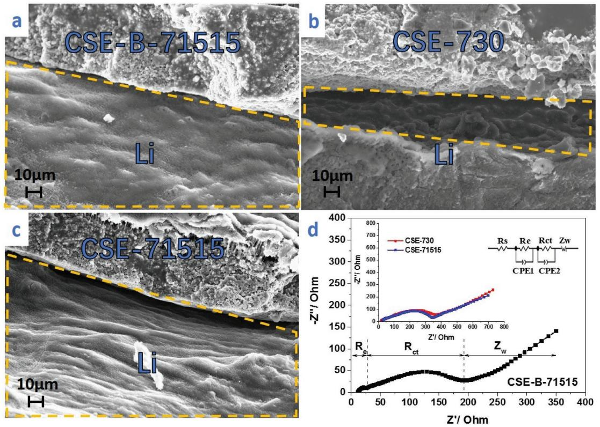
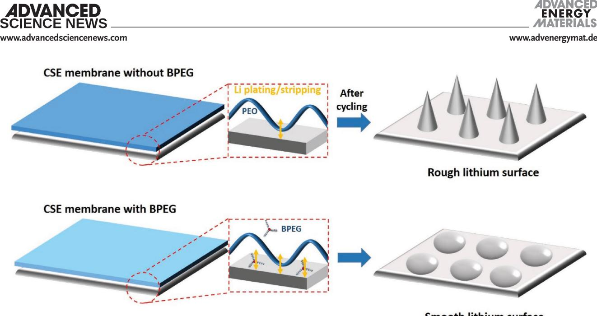
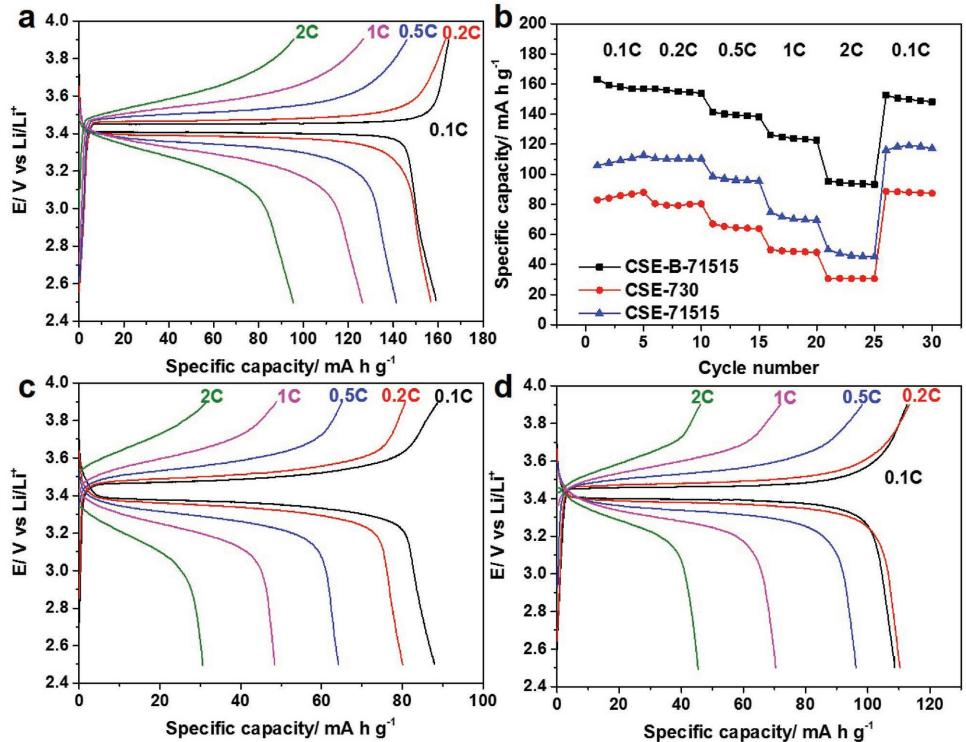

**Lithium-Ion Batteries**

# **Flexible Composite Solid Electrolyte Facilitating Highly Stable "Soft Contacting" Li–Electrolyte Interface for Solid State Lithium-Ion Batteries**

*Luyi Yang, Zijian Wang, Yancong Feng, Rui Tan, Yunxing Zuo, Rongtan Gao, Yan Zhao, Lei Han, Ziqi Wang, and Feng Pan\**

**A flexible composite solid electrolyte membrane consisting of inorganic solid particles (Li1.3Al0.3Ti1.7(PO4)3), polyethylene oxide (PEO), and boronized polyethylene glycol (BPEG) is prepared and investigated. This membrane exhibits good stability against lithium dendrite, which can be attributed to its well-designed combination components: the compact inorganic lithium ion conducting layer provides the membrane with good mechanical strength and physically barricades the free growth of lithium dendrite; while the addition of planar BPEG oligomers not only disorganizes the crystallinity of the PEO domain, leading to good ionic conductivity, but also facilitates a "soft contact" between interfaces, which not only chemically enables homogeneous lithium plating/stripping on the lithium metal anode, but also reduces the polarization effects. In addition, by employing this membrane to a LiFePO4/Li cell and testing its galvanostatic cycling performances at 60 °C, capacities of 158.2 and 94.2 mA h g−1 are delivered at 0.1 C and 2 C, respectively.**

## **1. Introduction**

All-solid-state lithium-ion batteries have attracted worldwide attentions due to their high energy density, long cycle life, and especially better safety compared to traditional lithium-ion batteries.[1–4] An all-solid-state lithium ion battery usually consists of three parts: a cathode, a metallic lithium anode, and a solid electrolyte. By replacing the commonly used liquid electrolytes with solid electrolyte, the packing density of the battery can be greatly improved. In addition, an all-solid-state battery allows

Dr. L. Yang, Z. Wang, Dr. Y. Feng, R. Tan, Y. Zuo, R. Gao, Y. Zhao, L. Han, Dr. Z. Wang, Prof. F. Pan School of Advanced Materials Shenzhen Graduate School Peking University Shenzhen 518055, P. R. China E-mail: panfeng@pkusz.edu.cn Dr. Y. Feng South China Academy of Advanced Optoeletronics South China Normal University Guangzhou 510006, P. R. China

The ORCID identification number(s) for the author(s) of this article can be found under https://doi.org/10.1002/aenm.201701437.

#### **DOI: 10.1002/aenm.201701437**

the usage of metal lithium, which has much higher energy density compared to commercially used graphite anodes.

As the key component in all-solid-state batteries, the solid electrolytes have been intensively studied and investigated. Solid electrolyte can be generally classified into three types: inorganic solid electrolytes (ISEs), solid polymer electrolytes (SPEs), and composite solid electrolytes (CSEs).[5] Traditional SPEs are limited by their poor room-temperature conductivity[6] and narrow electrochemical window,[7] and the development of ISEs is facing challenges such as brittleness,[8,9] large interfacial, and grain boundary resistance.[10,11] As the complex of ISE and SPE, CSEs not only inherit great flexibility and good interfacial contact with electrodes from SPEs, but also exhibit improved ionic conductivity at lower temperature.[12]

A common method to design CSE is to add inorganic fillers (e.g., Al2O3, [13] TiO2, [14] and Fe2O3) [15] with high surface area and Lewis-acid character into polymers in order to prevent the reorganization of the polymer chain, leading to enhanced Li-ion conductivity.[16] Up to now, the weight contents of inorganic substances in most reported CSEs are relatively low, and the inorganic particles are dispersed in the membrane, lacking of contact.[17] In an SPE, it can be reckoned that in such CSE membranes lithium ions will only move within the polymer domains so the ISEs mainly act as fillers instead of ion conductor. Therefore, the improved ionic conductivity should be attributed to the effect that inorganic fillers disordered the crystalline structure of the polymers.[18–20] By increasing the amount of inorganic materials in the CSE, the inorganic contents will become the main body of the CSE so the lithium ions can be transported through the inorganic network. In addition, a compact layer formed of inorganic particles is more likely to prevent the penetration of lithium dendrites. In this case, polymers in the CSE will not only act as lithium ion conductors, but also as binders that holding the inorganic particles together. Among various types of inorganic lithium-ion conductor, NASICONtype ceramics have attracted interests of many researchers due to their good stability and high room-temperature ionic conductivity. Aono et al. discovered that the conductivity of LiTi2(PO4)3 can be improved by doping appropriate amount of

trivalent ions such as Al3+, Fe3+, and Cr3+. It was also reported that Li1+*x*Al*x*Ti2–*x*(PO4)3 (LATP) exhibited the highest conductivity when *x* = 0.3.[21,22] Since then, LATP has been widely investigated as a competitive Li+ conductor due to its high bulk ionic conductivity at room temperature (>10−3 S cm−1).[21–24] As a commonly used SPE, poly(ethylene oxide) (PEO)–metal salt system has been widely studied since its ionic conducting ability was first reported in 1973.[25] Similar to many SPEs, PEO-based SPEs also suffer from low ionic conductivity at low temperature. It has been reported that the addition of branched or cross-linked polymers can be an effective method to promote the ionic conductivity of SPEs.[26–28] In our previous work, by mixing triboron-based poly(ethylene glycol) (PEG) (BPEG) with 15 wt% of PEO, the operating temperature of the SPE was decreased to 30 °C.[29] It was due to that the use of branched polymers can efficiently decrease the crystallinity of the PEO by disordering the structure of PEO segments, hence the mobility of the PEO chains was increased.

Herein, we designed and fabricated a CSE membrane consisting of both polymer and inorganic solid electrolytes. In this membrane, the closely packed LATP (*x* = 0.3) inorganic ceramic particles can be regarded as the main structure of the membrane and the polymer mixture (PEO + BPEG) not only fills the gaps between particles, offering more Li-ion transfer pathways, but also provides soft contact with the electrodes. PEO with high molecular weight (*M*w) (4 × 106 ) acts as binder to hold the inorganic particles together into a membrane with good flexibility and mechanical resilience. The addition of 2D structured BPEG improved the conductivity of the membrane (2.5 × 10−4 S cm−1 ) at 60 °C and facilitated a "softer contact" between the membrane and the lithium metal. This improvement allows the homogeneous stripping and plating of lithium and can potentially suppress the formation of lithium dendrites, which is pivotal to its application in solid state lithium ion batteries. Therefore, in this report, the CSE membrane not only has a compact inorganic layer, which acts as a physical barrier to lithium dendrite growth, but also exhibits depolarization effects on its interface with lithium metal which avoids nonuniform electrochemical deposition of lithium. Owing to this feature, this membrane demonstrates excellent Li–electrolyte interfacial stability. In addition, by combining this CSE membrane with LiFePO4 (LFP) cathode and Li metal anode, specific capacities of 158.2 and 94.2 mA h g−1 were obtained at the cycling rate of 0.1 C and 2 C, respectively, at 60 °C, which were comparable to the results from many lithium ion batteries using CSEs and SPEs previously reported (see Table S1, Supporting Information).

### **2. Results and Discussion**

#### **2.1. Physical Characterization**

LATP powder was prepared via solid-state synthesis as previously reported by Aono et al.[21] The scanning electron microscopy (SEM) image of the LATP powder (Figure S1a, Supporting Information) shows the diameter of the LATP particles is ≈2 µm. Energy dispersive spectra (EDS) of particles (Figure S1b,d, Supporting Information) show all elements are well-distributed within particles. From **Figure 1**a it can be seen that the X-ray diffraction (XRD) patterns of the prepared LATP are well indexed into the lithium titanium phosphate structure (JCPDS35-0754). BPEG was synthesized according to the reaction (**Scheme 1**) proposed in the previous literature.[29] In the Fourier transform infrared spectra of BPEG (Figure S2, Supporting Information), the bending (668 cm−1 ) and antisymmetric stretching (1326 and 1417 cm−1 ) vibration peaks of BO bond indicate the PEG chains have been chemically bonded with boron atoms, forming multibranched molecules. The CSE membranes are composed of inorganic part (LATP), PEO

**Figure 1.** a) XRD patterns of LATP, CSE-B-71515, CSE-730, CSE-71515, and PEO. b) Pictures and c) SEM image of the prepared CSE-B-71515 membrane. d) SEM image and e) Ti Kα1 EDS of cross-section view of Li/CSE-B-71515/Li cell.

**Scheme 1.** Reaction scheme for the synthesis of BPEG.

(*M*w = 4 × 106) and BPEG (*M*w ≈ 1800) in the weight ratio of 70:15:15. In this report, it is named as CSE-B-71515 for convenience. For comparison, three other solid electrolyte membranes were prepared in the same method: one consists of 70 wt% LATP and 30 wt% PEO (CSE-730); one consists of 70 wt% LATP, 15 wt% PEO, and 15 wt% PEG (*M*w = 1800), which is not boronized (CSE-71515); another one consists of no LATP, 50 wt% PEO, and 50 wt% BPEG (SPE-B-011). For better conductivity in the polymer domain, lithium bis(trifluoromethane sulfonimide) (LiTFSI) salt was added to the membrane and the ratio of [Li+]:[EO] is 1:20.

As presented in Figure 1a, the XRD patterns of all CSE membranes are similar to that of LATP. CSE-730 also shows a broad lump between 15° and 30° and two peaks at 19.1° and 23.4°, which can be traced to the XRD pattern of PEO. However, they cannot be found in the pattern of CSE-B-71515 and CSE-71515, indicating a lower degree of crystallinity in the polymer was obtained. In addition, differential scanning calorimetry (DSC) results in Figure 1b showed that the glass transition temperatures (*T*g) and the melting temperatures (*T*m) of CSE-B-71515 (*T*m = −39.6 °C, *T*g = 47.8 °C) and CSE-71515 (*T*m = −35.5 °C, *T*g = 47.7 °C) are clearly lower than that of CSE-730 (*T*m = −33.2 °C, *T*g = 51.9 °C). Therefore, it can be concluded that a higher amorphicity was resulted from the addition of oligomers with lower molecular weights. Since lower crystallinity indicates higher segmental movement ability, which is related to the ionic conductivity of PEO electrolyte,[30] it can be predicted that the addition of BPEG and PEG will have a positive effect on the conductivity of the CSE membrane. Figure 1c shows that the as-prepared membrane is free-standing and flexible. The thickness of the membranes was measured as ≈100 µm. By comparing the CSE membrane to traditional SPE membrane, the addition of 70 wt% ceramic solids is expected to improve the mechanical strength of the membrane. Therefore, to reveal the mechanical strength of the membranes, atomic force microscopy (AFM) tests were carried out in an Ar-filled glovebox. In Figure S3 in the Supporting Information, it is shown that the CSE-B-71515 membrane exhibited good mechanical strength with Young Module of 1.56 GPa, which is more than 80 times higher than that of SPE-B-011 (19 MPa). This remarkable improvement is attributed to the addition of inorganic particles that forming a tough and tensile membrane, which allows the construction of robust all-solid-state batteries. The SEM image (Figure S4, Supporting Information) also shows a homogeneous surface of the membrane. By combining the cross-section SEM image of Li/CSE-B-71515/Li symmetric cell (Figure 1d) and its Ti Kα1 EDS (Figure 1e), a compact LATP layer can be observed between lithium metal. Therefore, the inorganic particles in the membrane are in close contact with each other, allowing the Li-ion transfer between grains.

#### **2.2. Electrochemical Characterization**

The ion conductivity of the membranes was measured using electrochemical impedance spectroscopy. In **Figure 2**, variation of ionic

conductivity of different CSE membranes were compared at different temperature (from 30 to 90 °C) was presented. The results showed that CSE-B-71515 demonstrates the highest conductivity while CSE-730 exhibited lowest conductivity, especially when the temperature is below 60 °C. This is consistent with the XRD and the DSC results where lowest crystallinity of PEO was observed in CSE-B-71515, leading to the best ionic conductivity. Moreover, although the oligomers added into CSE-B-71515 (BPEG) and CSE-71515 (PEG) has similar molecular weight, differences in ionic conductivity are observed for these two membranes, which can be due to their different molecular conformations. The simulated molecular configurations of the as-prepared BPEG and PEG are presented in **Figure 3**. It can be seen the PEG molecule shows a 1D structure while BPEG molecule exhibits a 2D planar structure due to the empty p-orbital and the sp2-hybrid orbitals of the boron atom. As a result, the presence of BPEG with 2D planar structure could more effectively disrupt the crystal structure that consisting of linear polymer chains, therefore the better segments mobility and the improved ionic conductivity can be achieved. The ion conductivity of CSE-B-71515 at 60 °C is measured as 2.5 × 10−4 S cm−1 , which is higher than those of CSE-730 (7.1 ×10−5 S cm−1) and CSE-71515 (1.6 × 10−4 S cm−1 ). This number is lower than that of LATP ISEs at room temperature (above 10−3 S cm−1),[23] which is due to the degree of contact between inorganic particles in CSE is significantly lower than that in LATP ISEs that have been cold/hot-pressed under high pressure. However, as described hereinafter, the "soft contact"

**Figure 2.** Arrhenius plot for different CSE membranes from 30 to 90 °C.

**Figure 3.** Snapshot of BPEG (left) and PEG (right) molecules with similar molecular weights from the results of molecular dynamics simulation.

provided by the polymer part in the CSE membranes will greatly compensate this disadvantage. This value is also sufficient in battery tests. Therefore, the following experiments were carried out at 60 °C.

The Li+ transference numbers of different solid electrolyte membranes were also measured and recorded in **Table 1**. Similar to the traditional polymer solid electrolytes, the Li+ transference number of the membrane consisting of PEO and BPEG was measured as 0.16 while the cells with CSEs demonstrated much higher transference numbers: 0.49 for CSE-B-71515, 0.40 for CSE-71515, and 0.36 for CSE-730. Because Li ion is the only type of ion transferred in the inorganic ceramic electrolytes, the theoretical Li-ion transference number in LATP should be considered as unity. In this case, the significant increase in the Li+ transference number can be explained by that LATP domain was involved in the process of lithium ion transport. This conclusion is also in good consistence with a previously reported result by Zheng et al. where in an Li7La3Zr2O12 (LLZO)/PEO CSE, lithium ions will preferentially pass through the LLZO ceramic particles instead of the PEO/LLZO interphase or polymer.[31] Since less positive charge was trapped, it can be concluded that the ion concentration polarization effect in the membrane should be reduced. As proposed in **Scheme 2**, compared with traditional SPEs, there might be three possible Li-ion transfer routes in the CSE: 1. via the polymer domain; 2. via the inorganic domain; 3. via both domains. In route 2, the lithium ion transfer between LATP/LATP interfaces can be attributed to the close packing of the inorganic particles. Since both polymer chains and LATP particles have participated the

**Table 1.** Li ion transference numbers of different solid electrolyte membranes.

| Solid electrolyte compositions | Li-ion transference number |
|--------------------------------|----------------------------|
| CSE-B-71515                    | 0.49                       |
| CSE-71515                      | 0.40                       |
| CSE-730                        | 0.36                       |
| 50% PEO + 50% BPEG + LiTFSI    | 0.16                       |

Li-ion transfer process, the shapes of the curves in Figure 2 are determined by both processes. The Li-ion movement in SPEs can be explained with two models: Vogel–Tammann–Fulcher (VTF) model and Arrhenius model. Generally, when the temperature is above the melting point, the Li-ion migration follows the VTF model where Li ions migrate along with polymer segments; when the temperature is below the melting point, Li ions can only hop in the electrolytes decoupled with segmental movement, which obeys the Arrhenius model. Hence, the Arrhenius plots of SPEs usually show two different slopes.[32] As for ISEs, the Li-ion migration follows Arrhenius model therefore only one slope can be observed. Therefore, it can be deduced that the Arrhenius plot of CSE membranes will demonstrate combined characteristics of SPEs and ISEs. In Figure 2, the curves of three CSE membranes showed different degrees of this combined effect. Two slopes were obtained from the CSE-730 and CSE-71515 membranes, but the gradient differences were less obvious compared to those of SPEs previously reported,[29] which was an indication of combined mechanism; while the curve obtained from CSE-B-71515 membrane was almost a straight line, indicating that more inorganic particles were involved in Li-ion transfer, hence it can be inferred that better contacts between LATP particles and polymers were obtained in the presence of BPEG. This deduction is supported by the different values of Li+ transference number obtained from different CSE membranes (CSE-B-71515 > CSE-71515 > CSE-730).

Furthermore, the linear scanning voltammetry (LSV) results (Figure S5a, Supporting Information) showed that CSE-B-71515 demonstrated a higher apparent upper limit voltage than SPE-011, which is also beneficial to its application in batteries. It has been reported that Ti4+ tends to be reduced by Li metal.[33] The lower limit voltage of CSE-B-71515 was also tested, no significant reduction of Ti was observed above 2.41 V (Ti4+ + e− → Ti3+). Therefore, the electrochemical window of this CSE is suitable for the use of LiFePO4.

All-solid-state battery allows the usage of metallic lithium as anode, therefore, the ability to suppress the growth of lithium dendrite is crucial for solid electrolyte membranes. To further study the performance of the CSE membranes, cyclic lithium

**Scheme 2.** Proposed lithium ion transfer pathways and lithium dendrite growth in solid electrolytes a) without inorganic particles and b) with closely packed inorganic particles.

**Figure 4.** Galvanostatic cycles for a) Li/CSE-B-71515/Li, b) Li/CSE-730/Li, c) Li/CSE-71515/Li, and d) Li/SPE-B-011/Li symmetrical cells with a constant current density of 0.2 mA cm2 at 60 °C.

plating/stripping experiments in symmetric lithium cells were carried out at 60 °C. As the growth of dendrite short-circuits the cell, a voltage drop was resulted from the sudden change of internal resistance. In order to study the differences in the membrane components on the lithium dendrite growth, herein, four different CSE membranes were tested: CSE-B-71515, CSE-730, CSE-71515, and SPE-B-011. **Figure 4**a–d shows the time-dependent voltage profile of cells using different solid electrolyte membranes under a current density of 0.2 mA cm−2 . It can be seen that over 20 000 min of cycling with each charge/ discharge cycle length of 1 h, the Li/CSE-B-71515/Li cell was still able to work. Moreover, it is also notable that after experiencing a short period of short-circuit, the CSE membrane was able to self-recover, indicating its good resilience (Figure S6, Supporting Information). By contrast, cells that use CSE-730, CSE-71515, and SPE-B-011 membranes were able to be operated for 108 00, 12 300, and 2600 min, respectively, before cell failure. By comparing the results of CSEs with SPE-B-011, the CSE membranes exhibited much better stability against lithium dendrite in general. In this case, it was due to that in an SPE membrane, the growth of lithium dendrite was unhindered and it could easily penetrate the membrane; while in a CSE membrane, the compact inorganic layer acted as a physical barrier that restricting the free growth of lithium dendrite (as demonstrated in Scheme 2) hence a much longer cycle length can be obtained. However, the inorganic layer is not the only determining factor affecting the lithium dendrite growth as the result also shows that despite with same amount of inorganic component, it is more likely for lithium dendrites to form and grow using CSE-730 and CSE-71515 compared to CSE-B-71515. **www.advancedsciencenews.com www.advenergymat.de**

**Figure 5.** SEM images of the Li/CSE membrane interface in a) Li/CSE-B-71515/Li, b) Li/CSE-730/Li, and c) Li/CSE-71515/Li symmetrical cells after cycling. The lithium metal surfaces that used to contact with the CSE are highlighted with yellow dashed box. d) Electrochemical impedance spectra of Li/CSE/Li symmetric cells using different CSE membranes at 60 °C.

Therefore, it can be inferred that the polymer part in the CSE is also playing a crucial role in preventing dendrite growth.

In order to have a better understanding of these electrochemical behaviors, the postcycling SEM images of the Li– electrolyte interfaces are presented in **Figure 5**a–c, in which the surface of Li was the smoothest when CSE-B-71515 was employed while the cell using CSE-730 membrane resulted in the roughest Li surface. It has been previously reported that the inhomogeneous lithium plating and stripping was due to the nonuniform contact between lithium metal and the solid electrolyte, as a result, improved electrode–electrolyte interface will suppress the formation of lithium dendrite and result in a smooth lithium surface.[34–37] To further investigate the main reason for the different performances from these three CSE membranes, the impedance of the Li–Li symmetric cells was measured and plotted in Figure 5d. In the Nyquist plots, the impedance spectra of the cells are comprised of two semicircles and one inclined line, corresponding to the electrolyte resistance (*R*e), charge transfer resistance (*R*ct), and the Warburg impedance, respectively. For CSE-B-71515, the *R*ct was measured as 165 Ω, which is much lower than the values of CSE-730 (324 Ω) and CSE-71515 (270 Ω), implying a better contact between the solid electrode membrane and the electrodes. The difference in *R*ct can be explained by the addition of BPEG provides a softer interfacial contact, which benefits the charge transfer between the electrode and the electrolyte. Therefore, the proposed effect of the addition of BPEG on lithium dendrite formation is presented in **Scheme 3**. Instead of straight lines, high *M*w PEO segments are curvy chains with large curvature radius and tend to tangle up with others. As a result, there are void spaces left between the PEO chains and the electrode surface, leading to limited contact points. Since lithium ions can only be deposited or stripped through these contact points, the dendrites are more likely to be formed in this situation. By contrast, oligomers with smaller sizes can fill into those voids, as a result, the contact between the electrode and the electrolyte will be greatly improved. As the discrepant results from adding oligomers with similar *M*w but different structure, it might be due to that the 1D linear oligomers are prone to intertangling with other linear chains; while the planar oligomers with 2D structure are relatively more independent in the polymer domain and more likely to horizontally sit on the lithium surface, creating "softer-contact" with lithium with large contact area for lithium ion transfer. Due to the ability to inhibit the lithium dendrite formation and growth, the addition of BPEG with 2D molecular structure can be a promising approach to extend the cycle life of CSE membranes.

LFP/CSE/Li cells employed with different CSE membranes were assembled and their galvanostatic charge–discharge performances were tested at 60 °C. The loading of active materials on the cathode ranged from 0.4 to 0.6 mg cm−2. The rate discharge capability of the three cells is investigated at the C-rates from 0.1 C to 2.0 C, and the results are shown in **Figure 6**b. For the cell using CSE-B-71515, an average specific

**Scheme 3.** Proposed lithium plating/stripping processes and lithium surfaces when lithium metal is in contact with different CSE membrane.

capacity (per mass of LFP) of 158.2, 155.2, 139.6, 124.1, and 94.2 mA h g−1 was obtained at the C-rates of 0.1 C, 0.2 C, 0.5 C, 1 C, and 2 C, respectively. When the C-rate was reverted to 0.1 C again, a capacity of 150.0 mA h g−1 can be recovered, showing good cycling stability and reversibility. By contrast, at same C-rates, much lower capacities were obtained from the cells that using CSE-730 (85.8, 79.2, 68.5, 48.7, and 30.6 mA h g−1) and CSE-71515 (109.2, 110.1, 96.2, 70.3, and 46.0 mA h g−1) membranes. The charge–discharge voltage profiles of these three cells at different C-rates are presented in Figure 6a,c,d. It can be measured that the lowest over potentials were obtained when CSE-B-71515 was employed in the cell (0.08, 0.10, 0.21,

**Figure 6.** Charge–discharge profiles of a) LFP/CSE-B-71515/Li, c) LFP/CSE-730/Li, and d) LFP/CSE-71515/Li and discharge capacities of the three cells b) at 0.1 C, 0.2 C, 0.5 C, 1 C, and 2 C. All cells were tested at 60 °C. The loading area of the cathode material was 1 cm2 and the areal loadings of a) 0.502 mg cm−2 , b) 0.485 mg cm−2 , and c) 0.533 mg cm−2 .

0.34, and 0.58 V at 0.1 C, 0.2 C, 0.5 C, 1, and 2 C, respectively), followed by CSE-71515 (0.12, 0.14, 0.28, 0.41, and 0.50 V at 0.1 C, 0.2 C, 0.5 C, 1 C, and 2 C, respectively) and CSE-730 (0.23, 0.26, 0.36, 0.51, and 0.59 V at 0.1 C, 0.2 C, 0.5 C, 1 C, and 2 C, respectively). The superior cell performance delivered by CSE-B-71515 can be explained by the following two reasons: on the one hand, considering better electrolyte–lithium contact was achieved by the addition of BPEG, a better electrolyte– cathode contact can also be readily assumed, which will lead to depolarization effects and greatly enhance the performance of lithium ion batteries;[38] on the other hand, lower over potential reflects lower internal resistance and better ion transfer capability of the membrane, which is consistent with the results from Figure 2a where CSE-B-71515 exhibited the highest ionic conductivity.

#### **3. Conclusion**

In summary, a flexible composite solid electrolyte membrane (CSE-B-71515) comprised of LATP inorganic solid electrolyte particles, PEO, and 2D planar oligomer (BPEG) was prepared and studied. As the main body of the membrane, the compact inorganic served as not only a physical barrier to lithium dendrite growth, but also pathways for lithium ion transfer. PEO with high *M*w bound the particles together into a flexible membrane. Owing to the planar structure of the oligomers to be added to the membrane, improved ionic conductivity was obtained. More importantly, 2D structured BPEG enabled a "softer contact" with larger contact area between the lithium metal and the membrane, which depolarized the charge transfer process at the electrolyte–electrode interfaces. Consequently, the lithium dendrite growth was effectively suppressed. The rate performance LFP/CSE-B-71515/Li cell was tested at 60 °C, an average capacity of 158.2, 155.2, 139.6, 124.1, and 94.2 mA h g−1 was obtained at the C-rates of 0.1 C, 0.2 C, 0.5 C, 1 C, and 2 C, respectively. The promising results have led us to believe that the variation of this concept is an effective approach to design new composite solid electrolytes with desirable properties.

#### **4. Experimental Section**

*Synthesis of Composite Solid Electrolyte*: In this work, LATP ceramic powder was obtained via solid-state reaction as described in previous report.[21] Stoichiometric amounts of Li2CO3 (98%, Sinopharm Chemical Reagent), Al2O3 (analytical reagent, Aladdin), TiO2 (99.9%, Aladdin), and (NH4)2HPO4 (ACS reagent, Sigma-Aldrich) were ground mixed and calcined at 900 °C for 2 h. The resulting product was ball-milled with acetone for 6 h at 400 rpm, followed by calcination treatment at 900 °C for 2 h, and then it was ball-milled for another 6 h. The synthesis of BPEG was based on previous report:[29] 5.4 g of PEG (*M*w = 600, Sinopharm Chemical Reagent) was dissolved in 20 mL of acetonitrile under N2 atmosphere and the solution was stirred at 45 °C for 30 min. Then extra amount (6 mL) of borane tetrahydrofuran complex solution (1 m, Aladdin) was added at the rate of drop per 5 s. The reaction was held under reflux for 24 h. After removing the residual solvent and borane using rotary evaporator at 70 °C, the product was transferred to Ar-filled dry box. To obtain ceramic–polymer electrolyte, LATP, PEO (provided by Dow Chemical Company, *M*w = 4 m), PEG/BPEG, and LiTFSI (99.95%, Aldrich) were mixed and stirred in anhydrous acetonitrile (Macklin) for 12 h. The resultant homogeneous solution was cast on a Teflon mold and dried into a membrane in an Ar-filled dry box. The membrane was then collected and dried at 70 °C for 12 h before use.

*Preparation of LFP/CSE/Li Batteries*: To prepare the cathode, LFP (carbon-coated nanoparticles, provided by Dynanonic), acetylene black, and PEO (provided by Dow Chemical Company, *M*w = 4 m) were mixed and stirred in anhydrous acetonitrile for 12 h, with the ratio 5:3:2 by weight. Additional LiTFSI salt was (99.95%, Aldrich) added so that [EO]:[Li+] = 20:1. The resultant slurry was cast on a stainless steel current collector and dried at 80 °C for 12 h. The active material loading on each current collector ranges from 0.4 to 0.6 mg cm−2. The coin cells were fabricated using Li metal anode and LFP-loaded cathode obtained above, with ceramic–polymer electrolyte as a separator. All experiments above were performed in an argon atmosphere in a dry box.

*Material Characterization*: XRD was performed on a Bruker D8 Advance powder X-ray diffractometer, using Cu-Kα radiation with 2θ from 10° to 80°. Field-emission SEM was performed on a Zeiss SUPRA-55. The characteristic vibration of BPEG and PEG was studied by Fourier transform infrared spectroscopy (Frontier). DSC tests were carried out using DSC1 (Mettler Toledo) from −57.5 to 100 °C. AFM measurement was performed on an atomic force microscope (Multimode 8, Bruker), and PeakForce QNM mode was applied to measure the hardness of the membranes.

*Model and Simulation Details*: Each PEG chain consists of 40 repeat units. In the BPEG chain, one B atom links three PEG chains by BO bonds and each PEG segment contains 13 repeat units. The relative molecular mass of both chains are ≈1800. The simulated box contains 100 PEG chains and 100 BPEG chains, respectively. A multiple time step second-order symplectic integrator (RESPA) was employed, and the integration time step of 1 fs for the bond, the angle, and torsion forces, 2 fs for the nonbonded van der Waals forces, and 4 fs for the longrange Coulomb interactions. The cut-off distances for the nonbonded interactions and the long-range Coulomb interactions were both 10 Å. The isothermal-isorbaric ensemble was employed in the simulations, where the pressure was *P* = 0 bar, and temperature was fixed at *T* = 333 K. All molecular dynamics runs were carried out using the large scale atomic/molecular massively parallel simulator (LAMMPS) developed by Sandia National Laboratories.

*Electrochemical Measurements*: The electrochemical impedance spectrometry was carried out using electrochemical workstation (CHI 660E), with the frequency range of 200 kHz to 0.1 Hz. To measure the lithium ion transference number, the potential step experiments were studied by electrochemical workstation (PARSTAT 2273) at 60 °C, where a constant voltage (<100 mV) was applied to the Li/electrolyte/Li cell until the current reached a stable value. The transference number is calculated with Equation (1)

$$
t_{+} = \frac{i_{ss}(\Delta V - i_0 R_0)}{i_0(\Delta V - i_{ss} R_{ss})}
$$
\n(1)

In this equation, *t*+ refers to the transference number of Li+, Δ*V* is the constant voltage applied, *i*0 is the initial current, *i*ss is the steadystate current, and *R*0 and *R*ss are the impedances before and after the measurements, respectively. The LSV measurements were conducted with electrochemical workstation (CHI 660E) between 3.5 and 5.5 V with the scan rate of 1 mV s−1 at 60 °C. The electrochemical cycling performances of the cells were evaluated and found to be between 2.5 and 3.9 V using an automatic galvanostatic charge–discharge unit (Wuhan Land Electronic Co., Ltd. China) at 60 °C.

#### **Supporting Information**

Supporting Information is available from the Wiley Online Library or from the author.

**www.advancedsciencenews.com www.advenergymat.de**

#### **Acknowledgements**

This work was financially supported by grants from the National Materials Genome Project (2016YFB0700600), Guangdong Innovation Team Project (No. 2013N080), and Shenzhen Science and Technology Research Grant (JCYJ20160531141048950).

## **Conflict of Interest**

The authors declare no conflict of interest.

## **Keywords**

composite solid electrolytes, electrolyte–electrode interfaces, lithium dendrites, solid-state lithium-ion batteries

Received: May 25, 2017

Published online: September 1, 2017

- [1] M. Armand, J.-M. Tarascon, *Nature* **2008**, *451*, 652.
- [2] J. B. Goodenough, Y. Kim, *Chem. Mater.* **2010**, *22*, 587.
- [3] J.-M. Tarascon, M. Armand, *Nature* **2001**, *414*, 359.
- [4] J. Lu, Z. Chen, Z. Ma, F. Pan, L. A. Curtiss, K. Amine, *Nat. Nanotechnol.* **2016**, *11*, 1031.
- [5] R. Chen, W. Qu, X. Guo, L. Li, F. Wu, *Mater. Horiz.* **2016**, *3*, 487.
- [6] G. S. MacGlashan, Y. G. Andreev, P. G. Bruce, *Nature* **1999**, *398*, 792.
- [7] F. B. Dias, L. Plomp, J. B. J. Veldhuis, *J. Power Sources* **2000**, *88*, 169.
- [8] Y. Inda, T. Katoh, M. Baba, *J. Power Sources* **2007**, *174*, 741.
- [9] N. M. Asl, J. Keith, C. Lim, L. Zhu, Y. Kim, *Electrochim. Acta* **2012**, *79*, 8.
- [10] A. Manthiram, X. Yu, S. Wang, *Nat. Rev. Mater.* **2017**, *2*, 16103.
- [11] H. Yamada, D. Tsunoe, S. Shiraishi, G. Isomichi, *J. Phys. Chem. C* **2015**, *119*, 5412.
- [12] J.-K. Kim, Y. J. Lim, H. Kim, G.-B. Cho, Y. Kim, *Energy Environ. Sci.* **2015**, *8*, 3589.
- [13] M. R. Johan, O. H. Shy, S. Ibrahim, S. M. Mohd Yassin, T. Y. Hui, *Solid State Ionics* **2011**, *196*, 41.
- [14] Y. Tominaga, K. Yamazaki, *Chem. Commun.* **2014**, *50*, 4448.
- [15] N. S. T. Do, D. M. Schaetzl, B. Dey, A. C. Seabaugh, S. K. Fullerton-Shirey, *J. Phys. Chem. C* **2012**, *116*, 21216.

- [16] F. Croce, G. B. Appetecchi, L. Persi, B. Scrosati, *Nature* **1998**, *394*, 456.
- [17] N. B. Aetukuri, S. Kitajima, E. Jung, L. E. Thompson, K. Virwani, M. L. Reich, M. Kunze, M. Schneider, W. Schmidbauer, W. W. Wilcke, D. S. Bethune, J. C. Scott, R. D. Miller, H. C. Kim, *Adv. Energy Mater.* **2015**, *5*, 1.
- [18] W. Wang, E. Yi, A. J. Fici, R. M. Laine, J. Kieffer, *J. Phys. Chem. C* **2017**, *121*, 2563.
- [19] W. Liu, N. Liu, J. Sun, P. C. Hsu, Y. Li, H. W. Lee, Y. Cui, *Nano Lett.* **2015**, *15*, 2740.
- [20] J. H. Choi, C. H. Lee, J. H. Yu, C. H. Doh, S. M. Lee, *J. Power Sources* **2015**, *274*, 458.
- [21] H. Aono, E. Sugimoto, Y. Sadaoka, N. Imanaka, G. Adachi, *J. Electrochem. Soc.* **1990**, *137*, 1023.
- [22] M. Pérez-Estébanez, J. Isasi-Marín, D. M. Többens, A. Rivera-Calzada, C. León, *Solid State Ionics* **2014**, *266*, 1.
- [23] M. Monchak, T. Hupfer, A. Senyshyn, H. Boysen, D. Chernyshov, T. Hansen, K. G. Schell, E. C. Bucharsky, M. J. Hoffmann, H. Ehrenberg, *Inorg. Chem.* **2016**, *55*, 2941.
- [24] D. Rettenwander, A. Welzl, S. Pristat, F. Tietz, S. Taibl, G. J. Redhammer, J. Fleig, *J. Mater. Chem. A* **2016**, *4*, 1506.
- [25] D. E. Fenton, J. M. Parker, P. V Wright, *Polymer* **1973**, *14*, 589.
- [26] V. Münchow, V. Di Noto, E. Tondello, *Electrochim. Acta* **2000**, *45*, 1211.
- [27] H. Aydin, M. Enel, H. Erdemi, A. Baykal, M. Tülü, A. Ata, A. Bozkurt, *J. Power Sources* **2011**, *196*, 1425.
- [28] J. Shim, D.-G. Kim, J. H. Lee, J. H. Baik, J.-C. Lee, *Polym. Chem.* **2014**, *5*, 3432.
- [29] R. Tan, R. Gao, Y. Zhao, M. Zhang, J. Xu, J. Yang, F. Pan, *ACS Appl. Mater. Interfaces* **2016**, *8*, 31273.
- [30] A. Nitzan, M. A. Ratner, *J. Phys. Chem.* **1994**, *98*, 1765.
- [31] J. Zheng, M. Tang, Y. Y. Hu, *Angew. Chem., Int. Ed.* **2016**, *55*, 12538.
- [32] R. C. Agrawal, G. P. Pandey, *J. Phys. D: Appl. Phys.* **2008**, *41*, 223001.
- [33] S. Wenzel, T. Leichtweiss, D. Krüger, J. Sann, J. Janek, *Solid State Ionics* **2015**, *278*, 98.
- [34] K. Yan, H.-W. Lee, T. Gao, G. Zheng, H. Yao, H. Wang, Z. Lu, Y. Zhou, Z. Liang, Z. Liu, S. Chu, Y. Cui, *Nano Lett.* **2014**, *14*, 6016.
- [35] X. B. Cheng, T. Z. Hou, R. Zhang, H. J. Peng, C. Z. Zhao, J. Q. Huang, Q. Zhang, *Adv. Mater.* **2016**, *28*, 2888.
- [36] J. Zhang, N. Zhao, M. Zhang, Y. Li, P. K. Chu, X. Guo, Z. Di, X. Wang, H. Li, *Nano Energy* **2016**, *28*, 447.
- [37] Y. Ren, Y. Shen, Y. Lin, C. W. Nan, *Electrochem. Commun.* **2015**, *57*, 27.
- [38] W. Ren, K. Wang, J. Yang, R. Tan, J. Hu, H. Guo, Y. Duan, J. Zheng, Y. Lin, F. Pan, *J. Power Sources* **2016**, *331*, 232.