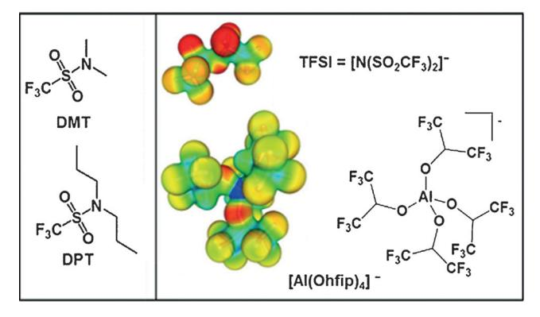
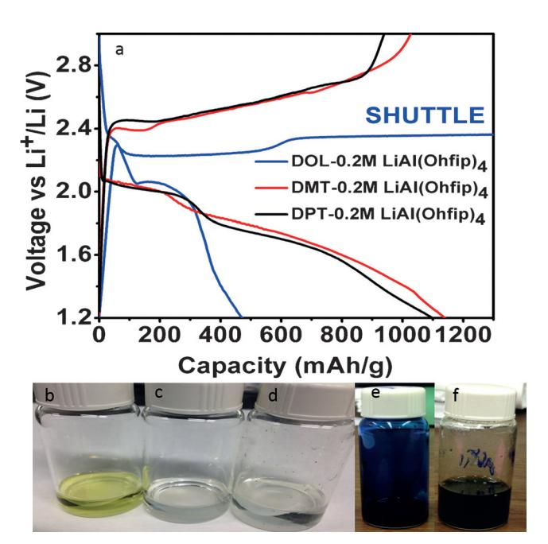
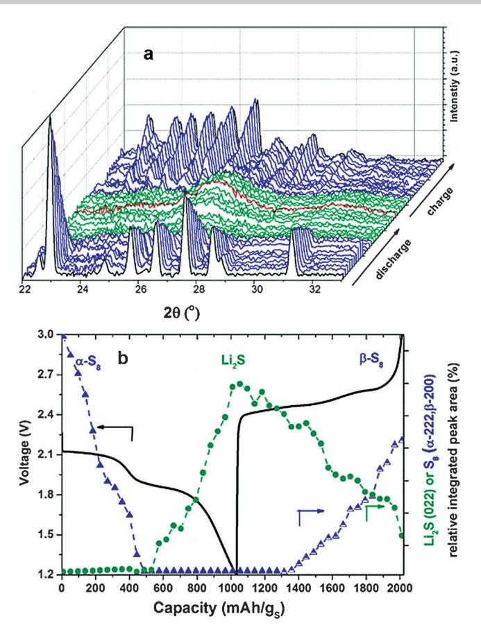
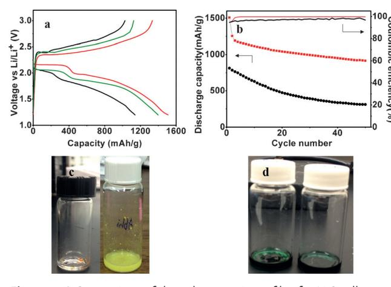
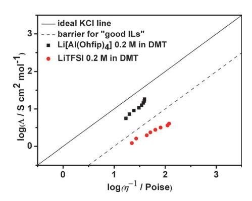

German Edition: DOI: [10.1002/ange.201701026](http://dx.doi.org/10.1002/ange.201701026) Lithium–Sulfur Batteries International Edition: DOI: [10.1002/anie.201701026](http://dx.doi.org/10.1002/anie.201701026)

## Inhibiting Polysulfide Shuttle in Lithium–Sulfur Batteries through Low-Ion-Pairing Salts and a Triflamide Solvent

Abhinandan Shyamsunder, Witali Beichel, Petra Klose, Quan Pang, Harald Scherer, Anke Hoffmann, [Graham](http://orcid.org/0000-0002-8795-2404) K. [Murphy,](http://orcid.org/0000-0002-8795-2404) Ingo [Krossing,\\*](http://orcid.org/0000-0002-7182-4387) and [Linda](http://orcid.org/0000-0002-3314-8197) F. [Nazar\\*](http://orcid.org/0000-0002-3314-8197)

Abstract: The step-change in gravimetric energy density needed for electrochemical energy storage devices to power unmanned autonomous vehicles, electric vehicles, and enable low-cost clean grid storage is unlikely to be provided by conventional lithium ion batteries. Lithium–sulfur batteries comprising lightweight elements provide a promising alternative, but the associated polysulfide shuttle in typical ether-based electrolytes generates loss in capacity and low coulombic efficiency. The first new electrolyte based on a unique combination of a relatively hydrophobic sulfonamide solvent and a low ion-pairing salt, which inhibits the polysulfide shuttle, is presented. This system behaves as a sparingly solvating electrolyte at slightly elevated temperatures, where it sustains reversible capacities as high as 1200–1500 mAhg @1 over a wide range of current density (2C–C/5, respectively) when paired with a lithium metal anode, with a coulombic efficiency of > 99.7% in the absence of LiNO3 additive.

Owing to the concern of CO2 emissions and their contribution to climate change, there has been increasing focus over the last decade on developing alternative sources of energy to conventional petroleum feedstocks. While solar and wind power derive from renewable resources, harnessing their real potential lies in the ability to store their intermittent energy, and to render it dispatchable. Electrochemical energy storage systems have emerged as one of the promising candidates to achieve this aim, both to satisfy the needs of large and intermediate scale storage, and also to power vehicular transport. Of these, the Li-S battery is a particularly appealing, environmentally friendly option. Sulfur is widely abundant, very low cost, and provides a high theoretical specific capacity and energy density of 1675 mAhg @1 and

[\*] A. Shyamsunder, Q. Pang, Prof. G. K. Murphy, Prof. L. F. Nazar Department of Chemistry and Waterloo Institute of Nanotechnology University of Waterloo Waterloo, Ontario N2L 3G1 (Canada) E-mail: lfnazar@uwaterloo.ca Dr. W. Beichel, P. Klose, Prof. I. Krossing Freiburger Materialforschungszentrum (FMF) Albert-Ludwigs-Universit-t Freiburg Stefan-Meier-Strasse 21, 79104 Freiburg im Breisgau (Germany) E-mail: krossing@uni-freiburg.de Dr. H. Scherer, Dr. A. Hoffmann, Prof. I. Krossing Institut ffr Anorganische und Analytische Chemie Albert-Ludwigs-Universit-t Freiburg Albertstrasse 21, 79104 Freiburg im Breisgau (Germany) Supporting information and the ORCID identification number(s) for

the author(s) of this article can be found under: [https://doi.org/10.1002/anie.201701026.](https://doi.org/10.1002/anie.201701026)

2600 Whkg@1 based on the reaction S8 + 16LiQ8Li2S.[1, 2] The volumetric energy density (based on an excess of lithium and a low electrolyte volume cell) provides a theoretical value of 2800 WhL @1 , which is almost five times that of commercially available Li-ion batteries, and practical values that could approach 650 WhL @1 . [3]

These promising metrics have not yet been achieved in practice, however, owing to numerous challenges. One is the formation of highly soluble intermediate polysulfides during the redox cycle, which migrate to and from the negative electrode. This creates the well-known shuttle phenomenon,[4, 5] which leads to poor coulombic efficiency and loss of active material from the positive electrode on cycling.[6] Lithium sulfide (Li2S) and S8 , the ultimate discharge and charge products of the cell, are also electronic insulators that require the addition of electronically conductive agents. Usually these are low density carbons that must be suitably wetted, whereas modeling studies suggest a low target ratio of electrolyte:sulfur of about 1.5 mLgS @1 is necessary for Li-S cells to be competitive with current Li-ion batteries. [7] To achieve this goal, cells must be able to operate in an electrolyte-starved mode. Nonetheless, the majority of todayQs Li-S cells function with high electrolyte volume using 1,3-dioxolane (DOL)/dimethoxyethane (DME) as a solvent, which fully solubilizes the intermediate polysulfide species and enables redox to occur in solution. Only a few reports have emerged that deviate from this approach. They have centered on lowering the ability of the electrolyte to dissolve polysulfides, utilizing either solvent-in-salt electrolytes, or chelate ionic liquid electrolytes that complex the lithium salt (typically LiTFSI) to a strongly solvating solvent such as DME or acetonitrile. [8–10] While effective, such systems suffer from the need for very high (and costly) salt fractions, which incur their own instability problems. Here, we report the first electrolyte system based on an entirely different principle. It combines a relatively non-polar triflamide solvent and a fluorinated lithium aluminate salt (Scheme 1). The combination behaves as a non-solvent for polysulfides at room temperature and transforms into a sparingly solvating electrolyte at slightly elevated temperatures.

Our concept was centered on multiple design considerations involving both solvent and salt. It obviates the need for clever additives such as LiNO3 [11] and LiI,[12] which are used to prevent reduction of polysulfides that cross over to the anode (but can be consumed on cycling) and large quantities of expensive Li+ salts. We note that an "ideal" solvent must be capable of dissolving a Li + salt as well as providing good electrochemical properties such as a wide voltage window, low viscosity, sufficient ionic conductivity to sustain good rate

**Scheme 1.** Molecular structures of DMT, DPT, and [Al(Ohfip)4]-. Calculated electrostatic potentials of TFSI $-$  and [Al(Ohfip)d] $-$  plotted onto an isodensity surface with like cut off values at a PBEO/def2-TZVPP level. Red: accumulation of negative charge; green: neutral; blue: positively charged surfaces.

capability, stability towards the polysulfides formed during discharge, a low vapor pressure, and high thermal stability.[13] The ability of a solvent to dissolve polysulfides or any salt depends on the nature of the Lewis basic sites present in the molecule. DOL and DME both have Lewis basic oxygen atoms, and their basicity is bolstered by electron-donating alkyl groups. To fabricate a solvent that has deactivated Lewis basic sites, highly electron-withdrawing groups can be introduced. Taking inspiration from the LiTFSI salt, which has an electron-withdrawing triflyl group attached to the nitrogen atom, we investigated two new battery solvents:  $N$ , $N$ dimethyl triflamide (DMT) and  $N$ , $N$ -dipropyl triflamide (DPT), the structures of which are shown in Scheme 1. They fall into the broad category of sulfonamides, which are known for their high electrochemical and thermal stability. Triflamides are commonly used in fuel cells, ionic liquids, and as conducting additives,[14] but they have not been considered as battery electrolytes owing to their relatively non-polar nature.[15] We have capitalized on that characteristic to inhibit the dissolution of polar polysulfides.

A  $Li^+$  salt that can dissolve in the non-polar solvent is also required to provide an ion carrier. Conventional lithium salts such as LiTFSI, LiOTf, or LiPF6[16] are all comprised of weakly coordinating anions,[17–19] enabling them to dissolve in classical non-aqueous organic solvents. For a salt to dissolve in a solvent with deactivated Lewis basic sites, even weaker coordinating anions are necessary.[17] Fluorinated alkoxy aluminates of the form  $[Al(ORF)4]$ - easily satisfy this condition. They are well-known weakly coordinating anions that provide sufficient ionic conductivities in solution either as Li salts[20,21] or as ionic liquids, the latter exhibiting high dissociation degrees.[22–25] The strong electrostatic interactions associated with commercially available salts are negligible in such fluorinated alkoxy aluminates, owing to the large size of the anion and the delocalization of the negative charge throughout the anion (see electrostatic potential plot in comparison to TFSI in Scheme 1). Their poorly polarizing fluorine atoms minimize the efficiency of ion-pairing and increase stability against oxidation. These salts, such as lithium tetrakis(hexafluoroisopropoxide) aluminum (Li[Al-

(Ohfip)4]) used herein, can be produced in the laboratory on a large scale and are comparable in cost to the commonly used LiTFSI.

The electrochemical stability of the new electrolyte system was evaluated through a cyclic voltammetric technique using a simple cell with a stainless steel working electrode and a lithium foil counter electrode. The cyclic voltammograms of the DMT and the DPT solvents containing  $0.2 \text{M}$  dissolved Li[Al(Ohfip)4] are given in the Supporting Information, Figure S1. In both cases, lithium plates on the stainless steel substrate at a potential less than 0 V with no reduction of either salt or solvent. In the anodic scan, the current begins to rise at 0 V, signaling the stripping of the plated lithium from the stainless steel substrate. The Li[Al-(Ohfip)4]-DMT electrolyte exhibited a stripping and plating current much higher than Li[Al(Ohfip)4]-DPT. This is a consequence of its higher ionic conductivity and lower viscosity. We note that DMT is stable up to 5.6 V, corresponding to the onset of electrolyte oxidation, while the DPT system shows an onset of oxidation at around  $5.4 \text{ V}$  (Supporting Information, Figure S1).

To verify the inhibition of the polysulfide shuttle conveyed by the new triflamide electrolytes, Li-S cells utilizing  $0.2$  M solutions of Li[Al(Ohfip)4] in DMT, DPT, and DOL were compared (Figure 1a). The latter exhibits the classic endless charging response associated with a polysulfide

Figure 1. a) Comparison of the galvanostatic profiles for Li-S cells run at C/10 at 25 °C using  $0.2 \text{ M Li[Al(Ohfip)}_4]$  salt in different solvents: DOL (blue curve), DMT (red curve), and DPT (black curve). b)d) Photographs of separators soaked in DOL, obtained from cells that underwent one full cycle at 25 °C using an electrolyte comprised of b) 0.2 M Li[Al(Ohfip)4]-DOL, c) 0.2 M Li[Al(Ohfip)4]-DMT, d) 0.2 M Li[Al- $(Ohfp)$ 4-DPT, e),f) typical solutions obtained from extracting cathodes (harvested from a room temperature cell in the charged state) with DMSO. The lapis blue color characteristic of the trisulfur  $S_3$ -- radical is observed immediately upon immersion in DMSO (e), and transforms within minutes to the olive-green solution characteristic of mediumlength polysulfides (f).

**Communications** 

shuttle, owing to the inability of this electrolyte to function without a LiNO3 additive to protect the Li anode, whereas DMT and DPT both exhibit profiles associated with solvents that do not dissolve polysulfides.[26] When the separators were soaked in 1,3-dioxolane, the yellow color of the solution derived from the Li[Al(Ohfip)4]-DOL cell clearly indicates the presence of residual polysulfides that become trapped in the separator between the positive and negative electrodes, whereas the two triflamide cells exhibit completely colorless solutions, indicative of essentially no polysulfides, and hence the lack of a shuttle (Figure 1b-d). Comparison of the electrochemical performance of the triflamide electrolytes shows that DMT exhibits superior cycling stability compared to DPT, which shows a sharp decrease in capacity on cycling (Supporting Information, Figure S2). The poor performance of DPT could be due to its longer alkyl chains, which make it more susceptible to a polysulfide initiated radical decomposition process.[27] However, likely more important is that the DPT electrolyte exhibits a lower ionic conductivity than DMT (0.24 mS cm $-1$  vs. 1.25 mS cm $-1$  respectively; Supporting Information, Table S1), which limits carrier transport. This is further confirmed from electrochemical impedance spectroscopy studies, where the Nyquist plots (Supporting Information, Figure S3) indicate that the DPT system suffers from a higher electrolyte/interphase resistance due to the poorer wetting of the electrode by the electrolyte and lower ionic conductivity. Therefore our studies focussed on the Li[Al- $(Ohfip)$ 4]-DMT system.

Although the Li[Al(Ohfip)4]-DMT system exhibits good cycling performance, the capacity of 380 mAh  $g^{-1}$  obtained after 50 cycles (Supporting Information, Figure S2) is lower than those obtainable with conventional high-electrolyte volume DOL-DME systems using a LiNO3 additive. Interestingly, polysulfides are clearly formed in the  $Li[Al(Ohfip)4]$ -DMT cell, as shown by postmortem analysis of a cell which was run for 30 cycles and disassembled at the end of charge. Dipping those cathodes in DMSO resulted in an intense blue ultramarine color associated with the  $S_3$ - radical, which immediately transformed to deep green in a matter of seconds (Figure 1 e,f). This unequivocally shows that the associated sulfur redox process involves the formation of lithium polysulfides, even though the process that interconverts  $S_8$ and  $\text{Li}_2S$  must occur in the solid state, not in solution. We base this on the fact that no polysulfides were found in the separator (Figure  $1b-d$ ). The kinetic limitations of this reaction are exacerbated in the poorly ionically conductive DMT electrolyte, and loss of electronic contact of the active sulfide mass with the carbon host owing to volume expansion/ contraction.

The capacity decay appears to be due to the formation of trapped polysulfide/lithium sulfide, which are inaccessible to further redox reactions. Indeed, while operando X-ray diffraction (XRD) measurements (Figure 2) demonstrate the formation of Li2S on discharge, and its consumption on charge, its oxidation is not quite complete. As in DOL/DME electrolytes,  $\alpha$ -S8 converts into the  $\beta$ -S8 polymorph on charge.[28]

To overcome the kinetic limitations of the quasi solid state reaction, we induced partial (very low) solubility of poly-

Figure 2. Operando XRD of a Li-S cell at 25 °C with 0.2 M Li[Al- $(Ohfip)$ 4]-DMT.

sulfides by slightly increasing the operating temperature of the cell to 50°C. Along with providing a vehicle for solutionbased chemical transformations, this has the additional benefit of lowering the viscosity and increasing the ionic conductivity. The positive impact of increased temperature is clearly evident in the first discharge-charge profile of the Li[Al(Ohfip)4]-DMT system at 50°C compared to that at room temperature (Figure 3a). While elevated temperatures have been used in cycling Li-S batteries in conventional DOL-DME electrolytes,[29,30] the positive effect is not so pronounced because the solubility of polysulfides is already sufficient at  $25^{\circ}$ C and a temperature increase does not show marked improvement. In the system herein, however, a nonsolvent system is converted into a sparingly soluble system. The improved kinetics result in more clearly defined plateaus and a capacity (1530 mAh  $g^{-1}$ ) remarkably close to theoretical  $(1675 \text{ mAh g}^{-1})$  at a moderate current rate of C/5 (C rate = 1675 mA $g^{-1}$ ). This represents better performance than most DOL-DME systems, where typically capacities of 1100- $1200 \text{ mAhg}^{-1}$  are reported at such rates. Even at a high current rate of 2C, an initial capacity of  $1500 \text{ mAh g}^{-1}$  was obtained, which settled to  $1200 \text{ mAh g}^{-1}$  on the second cycle. Very good coulombic efficiencies approaching 99.7% (Figure 3b) were observed over this wide range of current density in the absence of a LiNO3-induced passivation film on the negative Li electrode. While this is due in part to the improved electrolyte properties at elevated temperature, we

Figure 3. a) Comparison of the galvanostatic profiles for Li-S cells run at C/5 using 0.2m Li[Al(Ohfip)4 ] DMT for cells cycled at 258C (black) and 508C (red) and 2C at 50 8C (green); b) Discharge capacity (left axis) and coulombic efficiency (right axis) as a function of cycle number for Li-S cells examined at 25 8C (black) and 508C (red); c) photographs of Li[Al(Ohfip)4 ]-DMT at 258C (left) and at 50 8C (right) solutions with the yellow color indicating the presence of Li2S6 ; d) typical emerald green solutions obtained from extracting cathodes (harvested from a high-temperature cell in the charged state) with DMSO overnight.

believe it primarily results from the very sparing solubility of polysulfides in the electrolyte at 50 8C. The appearance of a pale yellow color of a typical polysulfide (Li2S6) in DMT-Li[Al(Ohfip)4 ] at 508C (vs. the colorless solution at 25 8C) shows the electrolyte transformation from a non-solvent to a sparingly soluble electrolyte (Figure 3 c). Most importantly, this slight increase in polysulfide solubility does not initiate a significant polysulfide shuttle process, even at slow rates such as C/20, since no overcharge is observed in the electrochemical profile (Supporting Information, Figure S4). Furthermore, no color is observed in the separator on postmortem analysis (Supporting Information, Figure S5). Rather the sparing solubility provides a kinetically less hindered pathway for the redox processes.

To further demonstrate the improved kinetics associated with increased temperature, galvanostatic intermittent titration technique (GITT) experiments were performed for the electrolyte systems at 25 8C and 508C (Supporting Information, Figure S6). At elevated temperatures, the quasi-equilibrium curve is similar to that exhibited in classic DOL-DME systems, while at room temperature the polarization is very large indeed. This underlines the importance of achieving sparing solubility of the polysulfides. Although an increase in temperature provided an increase in capacity and a decrease in the capacity fade, the cathodes recovered from fully charged cells and soaked in DMSO still show the presence of residual unconverted polysulfides. This is again evident from the coloration of the electrolyte shown in Figure 3 d. We note the difference in color relative to the 25 8C cell (emerald green, rather than olive-green), suggesting that the precise speciation of polysulfides in the cathode is not the same at the two temperatures, [31, 32] a point which will be the focus of a future operando XRD/XAS study.

The electrochemical behavior of 0.2m solutions of DMT-Li[Al(Ohfip)4 ] and DMT-LiTFSI were compared to understand the effect of the dissolved salt. At room temperature, the LiTFSI electrolyte performs slightly better than Li[Al- (Ohfip)4 ]. At 50 8C, however, DMT-Li[Al(Ohfip)4 ] exhibits better capacity (Supporting Information, Figure S7). T-dependent viscosities (h) and conductivities (s) of the 0.2m solutions were recorded between 08C and 708C (Supporting Information, Figure S8) to better understand this behavior. Although the viscosities of the LiTFSI solutions are lower than those of Li[Al(Ohfip)4 ] (Supporting Information, Table S1), the conductivities of the latter are higher at all measured temperatures, exceeding the former ones by a factor of 4.5–4.6. This suggests that the Li[Al(Ohfip)4 ] based electrolyte has a higher dissociation degree than the LiTFSI, as confirmed by the corresponding Walden plot (Figure 4). The DMT-Li[Al(Ohfip)4 ] system lies in the region

Figure 4. Walden plots confirming the higher dissociation degree of the Li[Al(Ohfip)4 ] salt in DMT compared to the LiTFSI salt.

between an ideal electrolyte system and the "good IL" barrier,[22, 33] while that of the LiTFSI falls quite below the latter. Furthermore, NMR-PGSTE measurements showed almost the same diffusion constants for the cation (D+ ) and the anion (D + ) in both electrolyte solutions (Supporting Information, Table S2) being around 0.26 X 10@9 m2 s @1 at 258C. At 50 8C D+/@ increase to values of around 0.44 X 10@10 m2 s @1 (as expected). By calculating the ionicity (I), which is a quantitative measure of the dissociation degree[23, 34] (I = 1 fully dissociated salt, I = 0 ion pairs) one arrives at values of 0.11 (258C) and 0.10 (50 8C) for the LiTFSI electrolyte and 0.48 (25 8C and 508C) for the Li[Al(Ohfip)4 ] electrolyte. This is in agreement with the Walden plots and our considerations of weakly coordinating anions as suitable conducting salts.

A further benefit of the new proposed electrolyte formulation is the low concentration of the Li[Al(Ohfip)4 ] salt. Although its maximum concentration in DMT is 0.5m, the optimum value to optimize capacity retention is about 0.2 M. These results clearly demonstrate the effectiveness of low ion pairing salts even at low concentrations.

A typical loss of capacity occurs when cells are cycled at very high rates, but the capacity recovers (albeit not completely) when the rate is decreased (Supporting Information, Figure S9). XPS analysis of the negative electrode from

the 50 8C cell indicates that LiF (a common component present in electrochemical systems when fluorinated electrolytes are used) is formed on the surface (either from residual electrolyte or from its reaction at the elevated temperature), along with other materials, which may facilitate the plating of lithium ions during charge (Supporting Information, Figure S10). In particular, the S 2p XPS spectrum confirms the absence of Li2S on the surface of the negative electrode, suggesting that neither polysulfides nor sulfur cross-over are present, where they would be reduced to lithium sulfide. The Al 2p spectrum also shows the presence of an "alumina-like" species, unique to our electrolyte system which may arise from Li[Al(Ohfip)4 ]-contamination and/or reaction to form an aluminum oxide like species. It has recently been shown that "alumina" helps in forming a stable interface on the lithium anode, as once lithiated, it provides a lithium-ion conductive pathway. [35] However, the interfacial composition is still not conclusive, and elucidation of species formed on the lithium surface with this electrolyte is beyond the scope of the current study.

In conclusion, a new, stable triflamide-based low concentration electrolyte combined with a low-ion pairing Li+ salt was developed for Li-S batteries for the first time. This electrolyte transforms from a non-solvent at room temperature to a sparingly solvating electrolyte at elevated temperature and inhibits the polysulfide shuttle in the system at both low, intermediate and fast rates, yielding a coulombic efficiency of > 99.7% without the use of LiNO3 . These electrolytes are anticipated to be low cost, as the salt is both inexpensive and comprises a small fraction of the total electrolyte compared to a ionic liquid chelate such as [(CH3CN)2 :LiTFSI] and suggest substantial mass savings in comparison to the highly concentrated salt-in-solvent electrolytes, which also exhibit reduced polysulfide shuttling. The next challenge will be to overcome the capacity fade, which appears to be due to gradually increasing electronic isolation of the Li2S formed on discharge owing to the complexity of dissolution-precipitation chemistry in poorly solvating media. Future studies will focus on the role of soluble redox mediators to address this problem, which have been found indispensable in recent studies of Li-S cells. [36, 37]

## Acknowledgements

The research was supported by the BASF International Scientific Network for Electrochemistry and Batteries. We thank the Waterloo Institute of Nanotechnology for awarding a fellowship to A.S.

## Conflict of interest

The authors declare no conflict of interest.

Keywords: lithium–sulfur batteries · low ion-pairing salts · polysulfide shuttle · sparingly solvating electrolyte · sulfonamide How to cite: Angew. Chem. Int. Ed. 2017, 56, 6192– 6197 Angew. Chem. 2017, 129, 6288– 6293

- [1] P. G. Bruce, S. A. Freunberger, L. J. Hardwick, J.-M. Tarascon, Nat. Mater. 2012, 11, 19.
- [2] N. S. Choi, Z. Chen, S. A. Freunberger, X. Ji, Y. K. Sun, K. Amine, G. Yushin, L. F. Nazar, J. Cho, P. G. Bruce, [Angew.](https://doi.org/10.1002/anie.201201429) [Chem.](https://doi.org/10.1002/anie.201201429) Int. Ed. 2012, 51, 9994; [Angew. Chem.](https://doi.org/10.1002/ange.201201429) 2012, 124, 10134.
- [3] L. F. Nazar, M. Cuisinier, Q. Pang, [MRS](https://doi.org/10.1557/mrs.2014.86) Bull. 2014, 39, 436.
- [4] R. Rauh, K. Abraham, G. Pearson, J. Surprenant, S. Brummer, [J.](https://doi.org/10.1149/1.2129079) [Electrochem.](https://doi.org/10.1149/1.2129079) Soc. 1979, 126, 523.
- [5] R. Rauh, F. Shuker, J. Marston, S. Brummer, J. [Inorg. Nucl.](https://doi.org/10.1016/0022-1902(77)80198-X) [Chem.](https://doi.org/10.1016/0022-1902(77)80198-X) 1977, 39, 1761.
- [6] Q. Pang, X. Liang, C. Y. Kwok, L. F. Nazar, Nat. [Energy](https://doi.org/10.1038/nenergy.2016.132) 2016, 1, [16132](https://doi.org/10.1038/nenergy.2016.132).
- [7] D. Eroglu, K. R. Zavadil, K. G. Gallagher, J. [Electrochem.](https://doi.org/10.1149/2.0611506jes) Soc. 2015, 162[, A982](https://doi.org/10.1149/2.0611506jes).
- [8] Y. Yamada, A. Yamada, J. [Electrochem.](https://doi.org/10.1149/2.0041514jes) Soc. 2015, 162, A2406.
- [9] J.-W. Park, K. Ueno, N. Tachikawa, K. Dokko, M. Watanabe, [J.](https://doi.org/10.1021/jp408037e) [Phys. Chem.](https://doi.org/10.1021/jp408037e) C 2013, 117, 20531.
- [10] M. Cuisinier, P.-E. Cabelguen, B. Adams, A. Garsuch, M. Balasubramanian, L. Nazar, Energy [Environ.](https://doi.org/10.1039/C4EE00372A) Sci. 2014, 7, 2697.
- [11] D. Aurbach, E. Pollak, R. Elazari, G. Salitra, C. S. Kelley, J. Affinito, J. [Electrochem.](https://doi.org/10.1149/1.3148721) Soc. 2009, 156, A694.
- [12] F. Wu, J.-T. Lee, J. Nitta, H. Kim, O. Borodin, G. Yushin, [Adv.](https://doi.org/10.1002/adma.201404194) [Mater.](https://doi.org/10.1002/adma.201404194) 2015, 27, 101.
- [13] J. Gao, M. A. Lowe, Y. Kiya, H. c. D. AbruÇa, J. [Phys. Chem.](https://doi.org/10.1021/jp207714c) C 2011, 115[, 25132.](https://doi.org/10.1021/jp207714c)
- [14] B. A. Shainyan, L. L. Tolstikova, [Chem.](https://doi.org/10.1021/cr300220h) Rev. 2013, 113, 699.
- [15] A. S. Madsen, H. M. Kristensen, G. Lanz, C. A. Olsen, [Chem-](https://doi.org/10.1002/cmdc.201300433)[MedChem](https://doi.org/10.1002/cmdc.201300433) 2014, 9, 614.
- [16] R. Younesi, G. M. Veith, P. Johansson, K. Edstrçm, T. Vegge, Energy [Environ.](https://doi.org/10.1039/C5EE01215E) Sci. 2015, 8, 1905.
- [17] I. Krossing, I. Raabe, [Angew. Chem.](https://doi.org/10.1002/anie.200300620) Int. Ed. 2004, 43, 2066; [Angew. Chem.](https://doi.org/10.1002/ange.200300620) 2004, 116, 2116.
- [18] I. Krossing, Comprehensive Inorganic Chemistry II, Vol. 1, Elsevier, Oxford, 2013, pp. 681 – 705.
- [19] T. A. Engesser, M. R. Lichtenhaler, M. Schleep, I. Krossing, Chem. [Soc. Rev.](https://doi.org/10.1039/C5CS00672D) 2016, 45, 789 – 899.
- [20] S. Tsujioka, B. G. Nolan, H. Takase, B. P. Fauber, S. H. Strauss, [J.](https://doi.org/10.1149/1.1776589) [Electrochem.](https://doi.org/10.1149/1.1776589) Soc. 2004, 151, A1418.
- [21] H. Tokuda, S.-i. Tabata, M. A. B. H. Susan, K. Hayamizu, M. Watanabe, J. [Phys. Chem.](https://doi.org/10.1021/jp048646r) B 2004, 108, 11995.
- [22] S. Bulut, P. Klose, M. M. Huang, H. Weing-rtner, P. J. Dyson, G. Laurenczy, C. Friedrich, J. Menz, K. Kgmmerer, I. Krossing, Chem. Eur. J. 2010, 16[, 13139](https://doi.org/10.1002/chem.201000982).
- [23] A. Rupp, N. Roznyatovskaya, H. Scherer, W. Beichel, P. Klose, C. Sturm, A. Hoffmann, J. Tgbke, T. Koslowski, I. Krossing, Chem. Eur. J. 2014, 20, 9794.
- [24] A. Rupp, S. Welle, P. Klose, H. Scherer, I. Krossing, [ChemPhys-](https://doi.org/10.1002/cphc.201500069)[Chem](https://doi.org/10.1002/cphc.201500069) 2015, 16, 1940.
- [25] A. B. Rupp, I. Krossing, Acc. [Chem.](https://doi.org/10.1021/acs.accounts.5b00247) Res. 2015, 48, 2537.
- [26] L. Suo, Y.-S. Hu, H. Li, M. Armand, L. Chen, Nat. [Commun.](https://doi.org/10.1038/ncomms2513) 2013, 4[, 1481.](https://doi.org/10.1038/ncomms2513)
- [27] M. Cuisinier, C. Hart, M. Balasubramanian, A. Garsuch, L. F. Nazar, [Adv. Energy](https://doi.org/10.1002/aenm.201401801) Mater. 2015, 5, 1401801.
- [28] S. Urbonaite, T. Poux, P. Nov#k, [Adv. Energy](https://doi.org/10.1002/aenm.201500118) Mater. 2015, 5, [1500118](https://doi.org/10.1002/aenm.201500118).
- [29] H. Kim, J. T. Lee, G. Yushin, J. Power [Sources](https://doi.org/10.1016/j.jpowsour.2012.10.028) 2013, 226, 256 [265](https://doi.org/10.1016/j.jpowsour.2012.10.028).
- [30] X. Li, A. Lushington, Q. Sun, W. Xiao, J. Liu, B. Wang, Y. Ye, K. Nie, Y. Hu, Q. Xiao, R. Li, J. Guo, T. Sham, X. Sun, [Nano](https://doi.org/10.1021/acs.nanolett.6b00577) Lett. 2016, 16, 3545 [– 3549](https://doi.org/10.1021/acs.nanolett.6b00577).
- [31] K. H. Wujcik, D. R. Wang, A. Raghunathan, M. Drake, T. A. Pascal, D. Prendergast, N. P. Balsara, J. [Phys. Chem.](https://doi.org/10.1021/acs.jpcc.6b04264) C 2016, 120, [18403](https://doi.org/10.1021/acs.jpcc.6b04264).

6196 [www.angewandte.org](http://www.angewandte.org) T 2017 Wiley-VCH Verlag GmbH & Co. KGaA, Weinheim Angew. Chem. Int. Ed. 2017, 56, 6192 –6197

- [32] K. H. Wujcik, T. A. Pascal, C. Pemmaraju, D. Devaux, W. C. Stolte, N. P. Balsara, D. Prendergast, [Adv. Energy](https://doi.org/10.1002/aenm.201500285) Mater. 2015, 5, [1500285.](https://doi.org/10.1002/aenm.201500285)
- [33] M. Yoshizawa, W. Xu, C. Angell, J. Am. [Chem.](https://doi.org/10.1021/ja035783d) Soc. 2003, 125, [15411.](https://doi.org/10.1021/ja035783d)
- [34] K. Ueno, H. Tokuda, M. Watanabe, [Phys. Chem.](https://doi.org/10.1039/b921462n) Chem. Phys. 2010, 12[, 1649](https://doi.org/10.1039/b921462n).
- [35] X. Han, Y. Gong, K. K. Fu, X. He, G. T. Hitz, J. Dai, A. Pearse, B. Liu, H. Wang, G. Rubloff, Y. Mo, V. Thangadurai, E. D. Wachsman, L. Hu, Nat. Mater. 2016, [https://doi.org/10.1038/](https://doi.org/10.1038/nmat4821) [nmat4821](https://doi.org/10.1038/nmat4821).
- [36] S. Meini, R. Elazari, A. Rosenman, A. Garsuch, D. Aurbach, [J.](https://doi.org/10.1021/jz500222f) [Phys. Chem.](https://doi.org/10.1021/jz500222f) Lett. 2014, 5, 915.
- [37] P. D. Frischmann, L. C. Gerber, S. E. Doris, E. Y. Tsai, F. Y. Fan, X. Qu, A. Jain, K. A. Persson, Y.-M. Chiang, B. A. Helms, [Chem.](https://doi.org/10.1021/acs.chemmater.5b02955) [Mater.](https://doi.org/10.1021/acs.chemmater.5b02955) 2015, 27, 6765.

Manuscript received: January 29, 2017 Revised: March 12, 2017 Final Article published: May 2, 2017