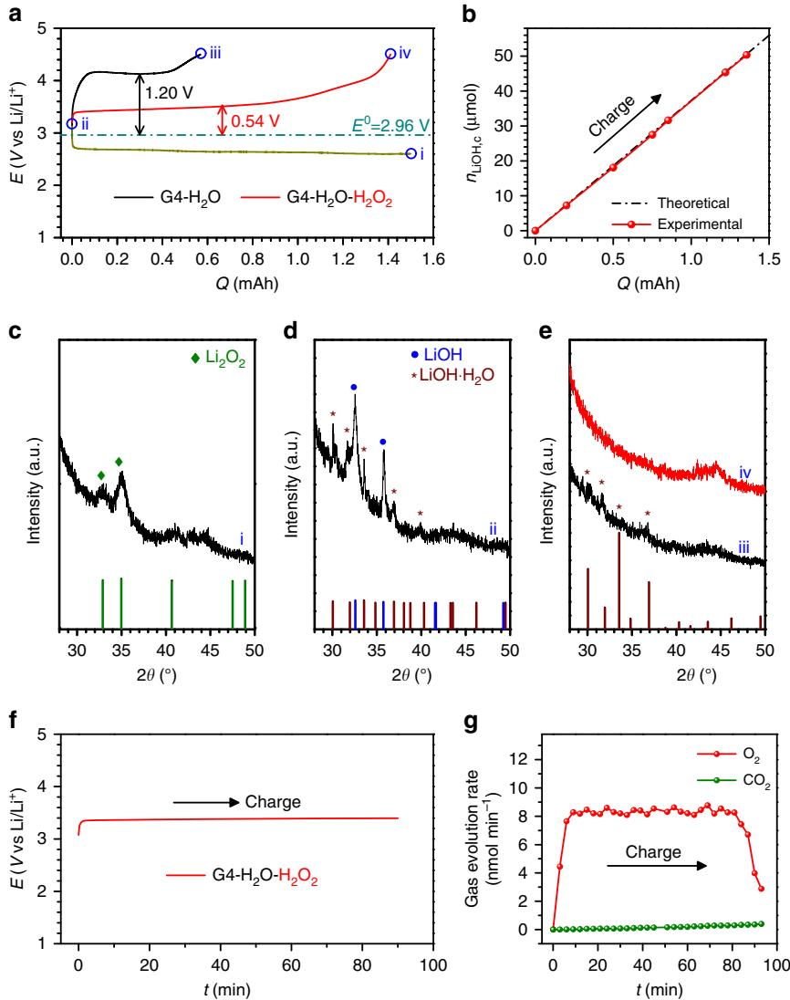
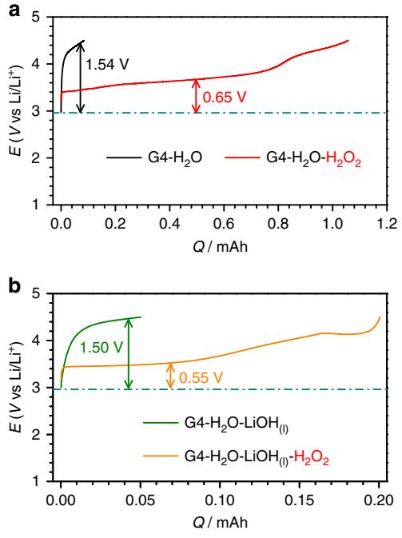
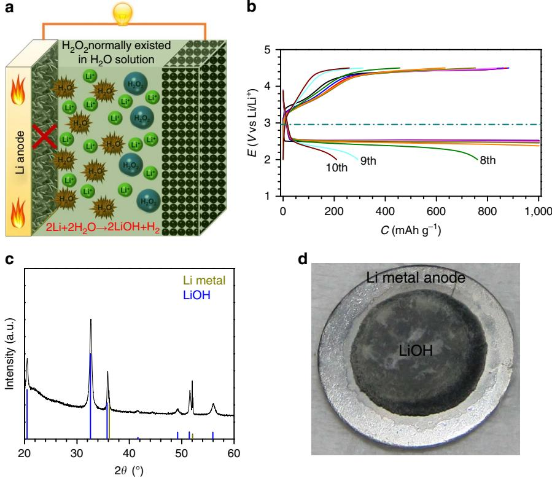
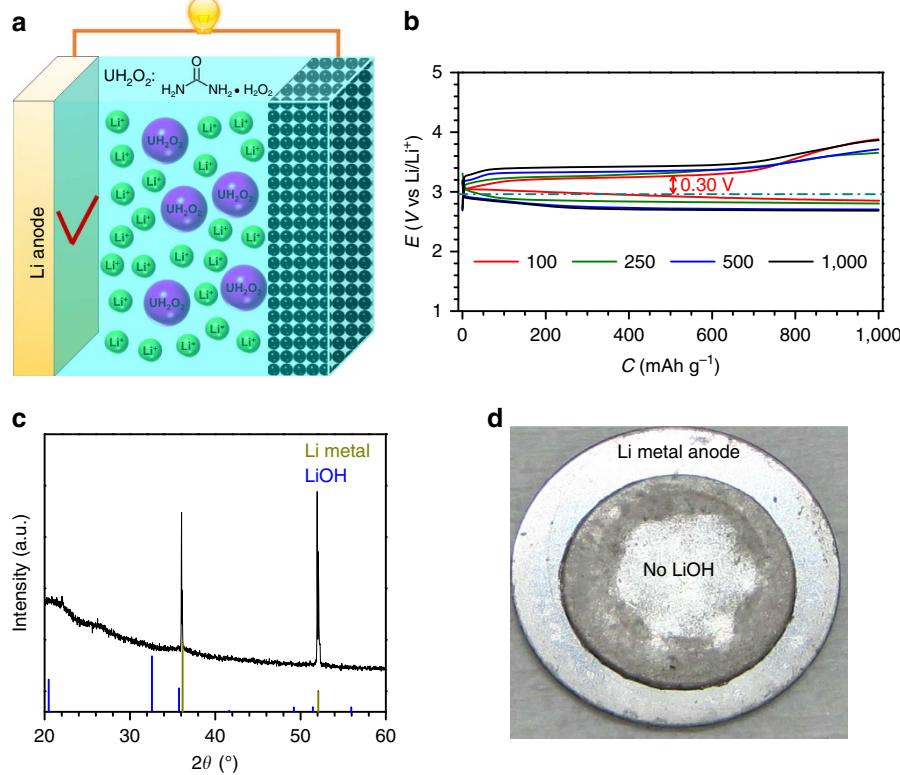
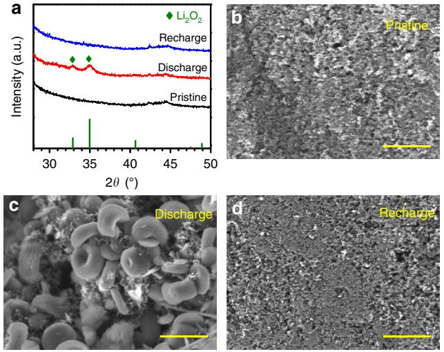
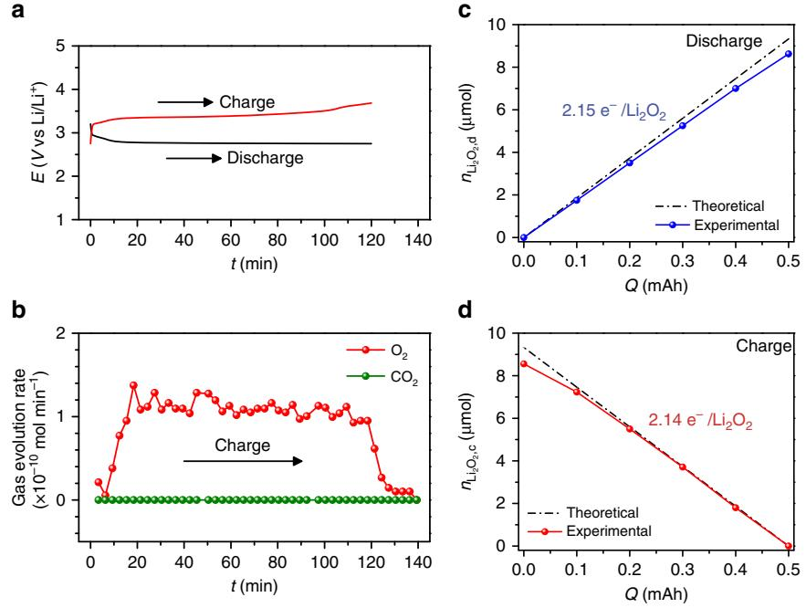
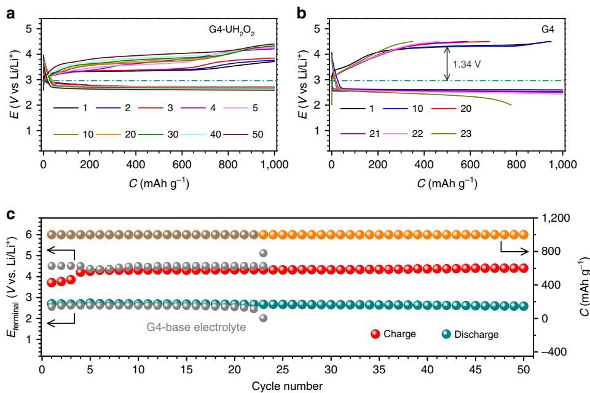

# ARTICLE

Received 28 Sep 2016 | Accepted 12 Apr 2017 | Published 6 Jun 2017

DOI: 10.1038/ncomms15607 **OPEN**

# Organic hydrogen peroxide-driven low charge potentials for high-performance lithium-oxygen batteries with carbon cathodes

Shichao Wu1,2, Yu Qiao1,2, Sixie Yang3, Masayoshi Ishida2, Ping He3 & Haoshen Zhou1,2,3

Reducing the high charge potential is a crucial concern in advancing the performance of lithium-oxygen batteries. Here, for water-containing lithium-oxygen batteries with lithium hydroxide products, we find that a hydrogen peroxide aqueous solution added in the electrolyte can effectively promote the decomposition of lithium hydroxide compounds at the ultralow charge potential on a catalyst-free Ketjen Black-based cathode. Furthermore, for non-aqueous lithium-oxygen batteries with lithium peroxide products, we introduce a urea hydrogen peroxide, chelating hydrogen peroxide without any water in the organic, as an electrolyte additive in lithium-oxygen batteries with a lithium metal anode and succeed in the realization of the low charge potential of B3.26 V, which is among the best levels reported. In addition, the undesired water generally accompanying hydrogen peroxide solutions is circumvented to protect the lithium metal anode and ensure good battery cycling stability. Our results should provide illuminating insights into approaches to enhancing lithium-oxygen batteries.

1 Energy Technology Research Institute, National Institute of Advanced Industrial Science and Technology (AIST), 1-1-1, Umezono, Tsukuba 305-8568, Japan. 2Graduate School of System and Information Engineering, University of Tsukuba, 1-1-1, Tennoudai, Tsukuba 305-8573, Japan. 3 Center of Energy Storage Materials and Technology, College of Engineering and Applied Sciences, National Laboratory of Solid State Microstructures, Collaborative Innovation Center of Advanced Microstructures, Nanjing University, Nanjing 210093, China. Correspondence and requests for materials should be addressed to H.Z. (email: [hs.zhou@aist.go.jp\)](mailto:hs.zhou@aist.go.jp).

Rechargeable Li-air batteries with the high energy density of B3,500 Wh kg - 1 demonstrate great promise for building capacious energy storage devices and developing electric vehicles with long driving range[1.](#page-7-0) A typical Li-air battery is composed of a Li metal anode, a separator, an electrolyte and an air cathode[2.](#page-7-0) The general net electrochemical reactions of non-aqueous Li-O2 batteries during discharge and charge are based on the formation and oxidative decomposition of lithium peroxide (2 Li þ O2 \$ Li2O2, E0 ¼ 2.96 V versus Li/Li þ ) [3–5](#page-7-0). The insulating nature of Li2O2 depositing on the surface of the air cathode may result in sudden battery death or limited discharge capacity during discharge[6–9](#page-7-0). Upon charge, the potential will be too high to decompose Li2O2 (44.2 V)[10.](#page-7-0) This may trigger the severe oxidative deterioration of the electrolyte and shorten the cycle life of the battery[11,12](#page-7-0). Such problems have blocked the realization of practical Li-air batteries. Carbon-based materials have been considered to be optimal selections for air cathodes, because their superior conductivity can buffer the poor electron conductivity of Li2O2 and thereby improve the discharge–charge performance[13,14.](#page-7-0) They also show other advantages such as low cost and high specific area and light weight, which ensure the high specific capacity and energy density of Li-O2 batteries[15.](#page-7-0) However, their poor catalysis ability towards the oxygen evolution reaction restrains the charge potential from realizing low values[14.](#page-7-0) Substantial efforts have been devoted to lowering the charge potential[16–21](#page-7-0). Noble metals and oxides (Pt, Au, Pd, Ru and RuO2 and so on)[22–27](#page-7-0) and transition metals and compounds (MnO2, TiC, Ti4O7, Cu2O, FeOOH, NiOOH, Ni2CoO4 and so on) have been tentatively introduced to construct carbon-based composite cathodes[28–30](#page-8-0). In this way, charge potentials of B3.5 V can be anticipated, but it is difficult to break through this limit. Also of note, the employment of inappropriate catalysts that strongly bind O2 or the discharge intermediate LiO2 may result in the undesired shift from Li2O2 to Li2O as discharge products and further lead to the poor reversibility of the Li-O2 battery[31,32](#page-8-0).

Recently, Li et al.[33](#page-8-0) in our group demonstrated a novel route to achieve the ultralow charge potential of B3.2 V in a dimethyl sulfoxide-based electrolyte containing 100 p.p.m. of H2O by constructing a composite cathode (MnO2 and Ru particles supported on Super P carbon). The primary electrochemical reactions (the formation of Li2O2) during discharge were converted to the formation of lithium hydroxide (LiOH) via the catalysis effect of MnO2 in the cathode towards the reactions between Li2O2 and H2O. The discharge process was proposed to involve a 2e electrochemical reaction and a following chemical reaction. During charge, Ru in the cathode decomposes the LiOH at the low charge potential. Following this idea, in a tetraglyme (G4)-based electrolyte, 4,600 p.p.m. of H2O was introduced to reduce the charge potential to B3.3 V[34](#page-8-0) and, by integrating a hydrophobic ionic liquid-based electrolytes, Wu et al.[35](#page-8-0) realized a synergistic system for Li-O2 batteries in a humid atmosphere (relative humidity of 51%) and a charge potential of B3.34 V was attained. Although the transformed net electrochemical reactions based on the reversible formation and decomposition of LiOH compounds efficiently improve the charge ability and cycling performance, the introduction of MnO2 and Ru or RuO2, with their heavy molecular weight and high cost, such as the abovementioned carbon-based composite cathodes, is inevitably subject to significantly decreased energy density and increased cost. Moreover, the overly strong catalytic activity of these additional catalysts may lead to parasitic reactions of the electrolyte. In the cases with carbon cathodes containing no catalysts, the charge potentials have been very high, generally above 4.2 V, although H2O was reported to largely enhance the discharge capacity[7,36,37](#page-7-0). Another work by Liu et al.[38](#page-8-0), also based on the assumed LiOH-related discharge–charge mechanism,

reported a charge potential of B3.1 V on an reduced graphene oxide (rGO)-based cathode in a dimethyl ether-based electrolyte in the presence of LiI and H2O. However, these features were not observed for Li-O2 batteries with common carbon material-based cathodes such as Super P carbon. Furthermore, some discussion challenged the detailed function of LiI and the reversibility of the Li-O2 battery with LiOH as the discharge product and suggested that the uncertain mechanism should be further explored[39–42](#page-8-0).

In this work, for an H2O-containing Li-O2 battery with LiOH products, we reveal the critical role of an H2O2 aqueous solution added into the electrolyte in assisting the decomposition of LiOH compounds at the ultralow charge potential when using a common Ketjen Black carbon (KB)-based cathode. Most importantly, for non-aqueous Li-O2 batteries with Li2O2 products, a novel electrolyte additive urea hydrogen peroxide that traps H2O2 in the H2O-free organic is, to the best of our knowledge, first introduced to reduce the charge potential to as low as B3.26 V and simultaneously avoid Li metal anode corrosion by H2O.

# Results

Low charge potential for decomposing LiOH compounds. As H2O2 generally exists in aqueous solution (30 wt%), to study the charge behaviour for decomposing LiOH compounds with or without the presence of H2O2 aqueous solution in the electrolyte, a Li metal anode-protected pouch cell is fabricated to prevent side reactions between the Li metal anode and H2O in the electrolyte[43.](#page-8-0) On the anode side, the Li metal is protected by utilizing a Li ion-conducting glass-ceramic film (LiSICON, Li2O-Al2O3-SiO2-P2O5-TiO2-GeO2, Ohara Corporation, Japan), only allowing the transport of Li þ and preventing the penetration of other ions. On the cathode side, a KB-based cathode and a glass fibre infiltrating electrolyte are constructed. [Figure 1a](#page-2-0) presents the charge profiles for decomposing solid LiOH compounds on the KB-based cathode in the electrolytes with and without H2O2 solution. The KB-based cathodes in situ loaded with solid LiOH compounds were obtained by first discharging Li-O2 pouch cells in the dry electrolyte to 1.50 mAh (corresponding to B4,000 mAh g - 1 KB and 3.5 mAh cm- 2, [Fig. 1a,i\)](#page-2-0), with Li2O2 as the product being evidenced by the X-ray diffraction (XRD) pattern in [Fig. 1c.](#page-2-0) Then, the discharged cathodes were extracted in an Ar glove box and left in an Ar atmosphere with a relative humidity of 75% for 7 days. The XRD pattern in [Fig. 1d](#page-2-0) confirms that all the Li2O2 on the discharged cathode was converted to a mixture of LiOH and LiOH H2O. New Li-O2 pouch cells ([Fig. 1a,ii\)](#page-2-0) were assembled with these cathodes and H2O2-containing/free electrolytes to investigate the effect of H2O2 on the charge performance. In the G4-H2O electrolyte, the charge potential increased rapidly to a plateau at B4.16 V, corresponding to the overpotential of 1.20 V. This high value indicates the difficulty of decomposing LiOH compounds at the KB-based cathode without an efficient catalyst. At the end of the charge process ([Fig. 1a,](#page-2-0)iii), the charge capacity is only B0.6 mAh, much lower than the discharged capacity (B1.50 mAh). The XRD pattern of the recharged cathode in [Fig. 1e,iii](#page-2-0) illustrates that there are undecomposed LiOH compounds. We rationalize these observations by the poor catalytic activity of KB and the weakening contacts between KB particles and LiOH compound particles during the charging process[33.](#page-8-0) In contrast, when H2O2 aqueous solution is introduced into the electrolyte, the charge plateau is greatly decreased to B3.50 V and the charge capacity is increased to above 1.40 mAh. It should be noted that 3.50 V is quite low, considering the large electrochemical impedance of the employed LiSICON film. The low charge overpotential of B0.54 V and the high recharge

Figure 1 | The reduced charge potentials for decomposing LiOH compounds formed in situ. (a) The discharge and charge profiles at 100 mA g - 1 KB. During charging, solid LiOH compounds can be oxidatively decomposed at a low potential of 3.50 V (corresponding to the overpotential of 0.54 V) in the presence of H2O2 solution in the electrolyte. This is much lower than the value (1.20 V) without H2O2. (b) The quantity of LiOH compounds consumed, nLiOH,c, during charge determined by titration. (c–e) XRD patterns of cathodes corresponding to the different states (i, ii, iii and iv) in a. The Li-O2 pouch cell is first discharged to 1.5 mAh (corresponding to B4,000 mAh g - 1 KB and 3.5 mAh cm- 2) in the dry electrolyte to produce Li2O2 at the cathode (c). The Li2O2 is converted to a mixture of LiOH and LiOHH2O (d) by keeping the cathode (i) in an Ar atmosphere with a relative humidity of 75% for 7 days. After charging, the LiOH and LiOHH2O are reversibly oxidized at low charge potential in the presence of H2O2 in the electrolyte, evidenced by the disappearance of their diffraction peaks in e,iv, whereas LiOHH2O remains undecomposed in the absence of H2O2 in the electrolyte (e,iii). (f) Charge profiles of Li-O2 pouch cell with in situ formed solid LiOH/KB cathode and G4-H2O-H2O2 electrolyte during the in situ DEMS measurement.

(g) Corresponding O2 and CO2 evolution rates during charge. Current density: 100 mA g - 1 KB. A LiSICON film preventing H2O penetration was employed to fabricate the Li-O2 pouch cells.

Coulombic efficiency of above 93% indicate the exceptional benefit of H2O2 in the electrolyte for decomposing LiOH compounds. The disappearance of LiOH compound peaks after recharge (Fig. 1e,iv) confirms their full decomposition and good charge reversibility. After charge, the electrolyte exhibits no obvious decomposition and no formation of soluble species, as evidenced by Fourier transform infrared (FTIR) spectra (Supplementary Fig. 1).

To quantitatively examine the charge process corresponding to the LiOH oxidation in the H2O2-containing electrolyte, we conducted a titration experiment to determine the consumed amount of LiOH at various charge states. The amount of these LiOH compounds (nLiOHii) was quantified by titration following the method of McCloskey et al.[44](#page-8-0) When the newly assembled cells were charged to certain capacities (0.2, 0.5, 0.75, 0.85, 1.22 or 1.356 mAh), the residual amount of LiOH compounds was titrated and the consumed amount of LiOH compounds could be obtained by subtracting the LiOH compounds at each point from nLiOHii. As shown in Fig. 1b, at each point during the charge process, the calculated amount of LiOH compounds consumed was almost equal to the theoretical value and the relationship of the consumed amount and the charge capacity is linearly dependent. In situ differential quantitative mass spectrometry (DEMS) was performed to examine whether O2 could be generated from LiOH decomposition at the low charge potential in the presence of H2O2. As shown in Fig. 1f,g, clear O2 evolution can be detected at B3.50 V during the charge process and there is no evolution of CO2. Accordingly, these quantitative results indicate that the oxidation of LiOH compounds dominates in the charge process.

We also examined the charge performance of commercial LiOH-preloaded KB-based cathodes in the H2O2-containing/free electrolytes. The results are shown in Fig. 2a and Supplementary Fig. 2. With the aid of H2O2 in the electrolyte, the preloaded LiOH in the KB-based cathode is much easier to fully decompose at a low charge potential (B3.61 V, Fig. 2a) than in the absence of H2O2 (4 4.40 V). In Fig. 2b, we present the charge profiles of Li-O2 pouch cells with dissolved LiOH aqueous solution and dissolved LiOH-H2O2 aqueous solution in the electrolytes. The presence of H2O2 allows a large reduction of charge overpotentials to 0.55 V from 1.50 V in the absence of H2O2. After charge at high potential in G4-H2O-LiOH(l) electrolyte, the LiOH peak at B3,680 cm- 1 in FTIR spectra (Supplementary Fig. 3,iii) remains, indicating the uncomplete decomposition of liquid LiOH in the electrolyte. In contrast, the LiOH can be fully decomposed after charge at low potential in the H2O2-containing electrolyte, as evidenced by the peak having disappeared (Supplementary Fig. 3,iv). This phenomenon may provide some insights into the improvement of the aqueous Li-O2 battery by adding H2O2 into the aqueous electrolyte; further work will continue to explore this phenomenon. All of these results emphasize that the introduction of H2O2 in the electrolyte can greatly enhance the decomposition ability of either solid LiOH compounds at common carbon cathodes or liquid LiOH in the electrolyte at low potentials during the charge process.

Figure 2 | The reduced charge potentials for decomposing preloaded LiOH. (a) Preloaded commercial LiOH on a KB-based cathode at 100 mA g - 1 KB and (b) liquid LiOH in the G4-based electrolyte by the action of H2O2 (current density: 100 mA g - 1 KB). During charging, the preloaded LiOH can be decomposed at a low potential of B3.61 V (corresponding to the overpotential of 0.65 V) in the presence of H2O2 solution in the electrolyte. This is much lower than the value (1.54 V) without H2O2. For the liquid LiOH, the charge overpotential is reduced from 1.50 V in the absence of H2O2 to 0.55 V in the presence of H2O2 in the electrolyte. The battery configuration is that of the Li-O2 pouch cell.

In view of the superiority of H2O2 in improving the charge performance in Li-O2 batteries, the cycling stability is expected to be promoted. Supplementary Fig. 4 shows the discharge–charge profiles of Li-O2 pouch cells with H2O2 aqueous solution in the electrolyte. Pure KB is used as the active material for the cathode and LiSICON film is used to protect the Li metal anode from corrosion by H2O. The pouch cells were discharged and charged with a limited specific capacity of 1,000 mAh g - 1 KB at 100 mA g - 1 KB and a voltage range of 2.00–4.50 V. In the ten cycles, the discharge plateaus are at B2.70 V and remain nearly unchanged. For the charge profiles, the first plateau is at B3.45 V and the charge-specific capacity can reach 1,000 mAh g - 1 KB with a terminal charge potential of o4.00 V at the end of charge process, indicating the strong charge ability and reversibility. In the initial five cycles, the low charge plateaus remain and the terminal charge potentials show no notable increase. Until the sixth cycle, the charge plateau increases to B3.65 V and the terminal potential reaches the limitation of 4.50 V in addition to the charge-specific capacity decreasing to 950 mAh g - 1 KB. After ten cycles, the charge profile shows a large increment (to B4.00 V) of the plateau and poor reversibility (charge capacity of only 800 mAh g - 1 KB). Electrochemical impedance analysis was performed before and after the cycles to determine the cause of the fading cycling stability (Supplementary Fig. 5). The first arcs in the high-frequency region corresponding to the interphase impedance are almost constant before and after ten cycles. However, the second arc in the middle-frequency region corresponding to the charge transfer notably change[s45,46.](#page-8-0) The large increase from 2.5 kO in the first cycle to 3.6 kO after the ten cycles is responsible for the difficulty of the Li þ transfer through the LiSICON film and the resulting poor cycling performance. These results imply that adopting the LiSICON film to overcome the H2O addition accompanying the H2O2 aqueous solution in the Li-O2 pouch cell is inadvisable in terms of realizing long cycle life and alternative strategies should be sought to exploit the merits of H2O2 for enhancing the performance of Li-O2 batteries.

Organic H2O2 compound introduction. In the general battery configuration with a KB-based cathode/glass fibre separator infiltrating electrolyte/Li metal anode structure, if the normal H2O2 aqueous solution is introduced in the electrolyte ([Fig. 3a](#page-4-0)), the concomitant H2O will inevitably attack the Li metal anode, causing battery death and possible safety issues. As shown in [Fig. 3d,](#page-4-0) even only 5,000 p.p.m. of H2O in the electrolyte can lead to serious corrosion of the Li metal anode after cycling. Large amounts of LiOH (determined by the XRD, [Fig. 3c](#page-4-0)) cover the surface of the Li metal anode and cut off the Li þ generation and transfer. This would probably result in the decreased dischargespecific capacity and battery failure within only a few cycles ([Fig. 3b](#page-4-0)).

To exploit the merits of H2O2 for reducing the charge overpotential and extending cycle life, introducing H2O2 in the electrolyte while eliminating H2O contamination should be a quick fix. Herein, we pilot an organic H2O2 compound (urea hydrogen peroxide, UH2O2) as the electrolyte additive to lower the charge potential and more importantly, to prohibit H2O-related side reactions [\(Fig. 4a](#page-5-0)). Urea has been reported to form deep eutectic electrolytes with LiTFSI, have pronounced effects on the transport and structural properties of LiTFSI and induce faster Li þ diffusion and improved ion transport[47.](#page-8-0) The ion conductivity of the G4-UH2O2 electrolyte is determined to 1.8 10 - 3 S cm- 1 through the Nyquist plot in Supplementary Fig. 6. This value is comparable to the levels of commercial electrolytes for Li ion batteries and indicates the high Li þ conductivity. In the electrolyte containing UH2O2, the rate

Figure 3 | H2O-induced poor battery performance and corrosion of the Li metal anode. (a) Schematic illustrations of Li-O2 cells with a general configuration (KB-based cathode/glass fibre separator infiltrating electrolyte/Li metal anode) in the G4-H2O-H2O2 electrolyte. (b) Discharge–charge profiles of Li-O2 cells with 5,000 p.p.m. of H2O in the electrolyte (current density: 500 mA g - 1 KB). (c) The XRD pattern of the Li metal anode after cycling in the electrolyte containing 5,000 p.p.m. of H2O. (d) A photo of a Li metal anode after cycling in the electrolyte containing 5,000 p.p.m. of H2O. In the presence of H2O2 aqueous solution, the Li metal anode was significantly corroded, resulting in LiOH on the surface, and the battery performance faded rapidly.

performances of Li-O2 cells were evaluated at current densities of 100, 250, 500 and 1,000 mA g - 1 KB; the results are given in [Fig. 4b](#page-5-0). At 100 mA g - 1 KB, the charge plateau is at B3.26 V, corresponding to the much lower overpotential of 0.30 V, which is among the lowest values reported. Even at the high current density of 1,000 mA g - 1 KB, the charge plateau is only B3.44 V, suggesting the excellent rate capability. With regard to the Li metal anode, no LiOH was detected on the surface of the Li metal anode after cycling, as expected [\(Fig. 4c](#page-5-0)). The silvery grey colour in the photo in [Fig. 4d](#page-5-0) confirms the Li metal anode to be intact, in sharp contrast with the almost damaged Li metal anode (photo in Fig. 3d). In addition, from the storage experiments (Supplementary Fig. 7), the steady open circuit voltage trends after a discharge process or one discharge–charge cycle indicate the solid stability of the Li-O2 cells with the G4-UH2O2 electrolyte. The results verify that employing the organic UH2O2 as an electrolyte additive is an accessible way to ensure the attractive charge performance of the Li-O2 cell and achieve high stability of the Li metal anode, along with maintaining reliable safety.

The discharge products on the cathode of the Li-O2 cell in the G4-UH2O2 electrolyte were analysed by XRD and scanning electron microscopy (SEM). [Figure 5a](#page-5-0) summarizes the XRD patterns of pristine, discharged and recharged cathodes. The discharge products are determined to be Li2O2. After recharge, the diffraction peaks of Li2O2 disappear, implying its full decomposition. The typical toroid morphology of Li2O2 after discharge can be directly observed from [Fig. 5c.](#page-5-0) After the cell is recharged, the particles are completely decomposed [\(Fig. 5d](#page-5-0)). This is in good agreement with the XRD results.

As the reactions during discharge and charge in the Li-O2 cell are complex multiphase processes, it is necessary to confirm whether the low charge potential in the Li-O2 cell with the G4-UH2O2 electrolyte resulted from the improved charge ability or the unexpected side reactions. Therefore, we conducted in situ DEMS measurement to monitor the O2 evolution during charge and titration experiments, to quantitatively analyse the Li2O2 formation and consumption during discharge and charge in the Li-O2 cell with the G4-UH2O2 electrolyte. The corresponding data are provided in [Fig. 6](#page-6-0). After discharging the cell to 0.1, 0.2, 0.3, 0.4 or 0.5 mAh at 0.05 mA, the Li2O2 formation was quantified by a titration method [\(Fig. 6c\)](#page-6-0). The yields of the formed Li2O2 (the amount of Li2O2 titrated divided by the amount of Li2O2 expected given the coulometry) held at B91%. This value is similar to the yield reported by McCloskey et al.[44](#page-8-0) and indicates some slight side reactions, possibly corresponding to inevitable electrolyte decomposition. The value of e- /Li2O2 can be estimated to be 2.15, close to the theoretical value of 2. The gas evolution rates of O2 and CO2 upon charge are presented in [Fig. 6b](#page-6-0). O2 evolution was detected from the beginning and continued along the charge potential of B3.3 V during the whole charge process. No evolution of CO2 was detected. The amounts of Li2O2 consumed during charge were analysed by titration measurement ([Fig. 6d](#page-6-0)). Li2O2 oxidation follows an B2.14e - /Li2O2 process during the whole charge process. This value approaches the ideal value of 2 and clearly demonstrates that the significant reduction of charge overpotential due to the UH2O2 additive in the electrolyte can prohibit the high charge potential-induced side reaction and that the introduction of UH2O2 can improve the charge performance. The DEMS and

Figure 4 | Blocking of H2O-induced problems in the developed G4-UH2O2 electrolyte. (a) Schematic illustrations of Li-O2 cells with a general configuration (KB-based cathode/glass fibre separator infiltrating electrolyte/Li metal anode) in the developed G4-UH2O2 electrolyte. (b) Rate performance of a Li-O2 coin cell in the G4-UH2O2 electrolyte. (c) The XRD pattern of the Li metal anode after cycling in the G4-UH2O2 electrolyte. (d) The photo of a Li metal anode after cycling in the G4-UH2O2 electrolyte. In the G4-UH2O2 electrolyte without H2O, the Li metal anode remained undamaged. The Li-O2 coin cell achieves the ultralow charge potential of 3.26 V (overpotential of 0.30 V) at 100 mA g - 1 KB with an excellent rate capability.

Figure 5 | Discharge products on the cathode of a Li-O2 cell in the G4-UH2O2 electrolyte. (a) XRD patterns of the pristine, discharged and recharged cathodes. SEM images of (b) the pristine cathode, (c) the discharged cathode and (d) the recharged cathode. The discharge products are identified as Li2O2 with typical toroid morphology. Scale bar, 2 mm.

titration results suggest that the charge reactions are dominated by the evolution of O2 and the consumption of Li2O2. Therefore, the high rechargeability of the Li-O2 cell with the G4-UH2O2 electrolyte can be affirmed.

A comparison of the discharge–charge profiles of Li-O2 cells in the electrolytes with and without UH2O2 in [Fig. 7a,b](#page-6-0), respectively, confirms the critical role of UH2O2 in ameliorating the insufficient oxygen evolution reaction catalysis ability when adopting pure KB carbon as the air cathode. At 500 mA g - 1 KB, the Li-O2 cell based on the KB cathode in the UH2O2-free electrolyte shows a charge potential as high as B4.30 V. This high value can result in the decomposition of electrolyte and the short cycle life of the Li-O2 cell. After B20 cycles, the charge-specific capacity cannot recover to 1,000 mAh g - 1 KB with a decreased Coulombic efficiency of B70%. With respect to the G4-UH2O2 electrolyte, the cycling performance of Li-O2 cell is shown in [Fig. 7a,c](#page-6-0). The electrolyte stability was evaluated through FTIR analysis (Supplementary Fig. 8). Compared with the pristine G4-UH2O2 electrolyte (iii), there is nearly no change in the FTIR spectra of the G4-UH2O2 electrolytes after discharge (iv) and charge (v), indicating no obvious decomposition of the electrolyte. After 50 cycles, the discharge profiles with plateaus at B2.68 V show almost no change, indicating good stability. The charge profiles present low plateaus at B3.33 V in the initial cycles, with a slight increment after 50 cycles. All of the 50 charge-specific capacities can achieve 1,000 mAh g - 1 KB with a Coulombic efficiency of 100%, implying excellent reversibility. The terminal charge potentials are restricted below B4.20 V. The improved cycling stability is attributed to this developed electrolyte additive UH2O2.

Considering the efficient assistance of H2O2 for decomposing the preloaded LiOH in the KB-based cathode ([Fig. 2](#page-3-0)), UH2O2 is also expected to solve the high charge potential for decomposing the preloaded commercial Li2O2. It is an essential prerequisite for constructing Li metal-free Li ion-O2 batteries[48.](#page-8-0) Supplementary Fig. 9 presents the first charge profiles of Li-O2 cells with commercial Li2O2-preloaded cathodes. In the electrolyte without

Figure 6 | Reversibility during discharge and charge processes in the G4-UH2O2 electrolyte. (a) Discharge and charge profiles of a Li-O2 cell with G4-UH2O2 electrolyte during the in situ DEMS measurement. (b) Corresponding O2 and CO2 evolution rates during charge. (c) The quantified level of Li2O2 formation, nLi2O2,d, during discharge determined by titration. (d) The quantified level of Li2O2 consumption, nLi2O2,c, during charge determined by titration.

Figure 7 | Cycling performance of the Li-O2 cell. Selected discharge and charge profiles in (a) the G4-UH2O2 and (b) G4-based electrolytes. (c) The corresponding discharge and charge terminal voltages along with capacities upon cycling. Current density: 500 mA g - 1 KB.

any additive, a high potential peak slope at B4.32 V, possibly arising from a thin surface coating of sparse LiOH or other impurities on the commercial Li2O2 particles, must first be overcom[e49.](#page-8-0) After that, the remaining part of the charge of Li2O2 is performed at the high potential of B3.95 V. In the G4-UH2O2 electrolyte; however, the charge barrier is circumvented well and the charge potential shifts to the low value of B3.48 V. After full charge, there is no Li2O2 remaining in the cathode, evidenced from the disappearance of the Li2O2 diffraction peaks (Supplementary Fig. 10) and the disappearance of the Li2O2 particles on the cathode as observed by SEM (Supplementary Fig. 11). Accordingly, the important role of UH2O2 in assisting the preloaded Li2O2 decomposition is verified.

#### Discussion

For an H2O-containing Li-O2 battery based on LiOH compounds as products, we developed an accessible route of introducing H2O2 solution in the electrolyte to realize a large reduction of charge potential (from B4.16 V to B3.50 V). The crucial role of H2O2 was confirmed to greatly assist the decomposition of either solid LiOH compounds at the cathode or liquid LiOH in the electrolyte. Certain factors may be implicated in improving the charge ability in the aqueous Li-O2 battery. Most importantly, for a non-aqueous Li-O2 battery with Li2O2 products, we first proposed an organic H2O2 compound (urea hydrogen peroxide) without any H2O as the electrolyte additive to significantly decrease the charge potential (to B3.26 V, among the best reported) and moreover to circumvent the problem of undesired H2O corrosion of the Li metal anode. Avoiding the damage to the Li metal anode ensured the enhancement of the cycling performance and the safety of the Li-O2 battery. With the aid of the novel additive, the preloaded Li2O2 becomes easier to decompose, which aids the potential development of Li metal-free Li ion O2 batteries. It should be emphasized that high performance is realized at the carbon-based cathode without any additional catalysts. Although much additional work should be conducted to understand the detailed mechanisms, these results are believed to contribute to the development of pure carbon-based cathodes for Li-O2 batteries, enabling the benefits of superior electron conductivity, high energy density and low cost, and should trigger further efforts to exploring other possible peroxides in addition to pointing to broader design principles for electrolytes.

#### Methods

Cathode preparation. KB carbon was used as the cathode material. Polytetrafluoroethylene (PTFE) was used as the binder. The weight ratio between KB and PTFE was 85:15. The cathodes were prepared by rolling the KB and PTFE paste in ethanol and then pressing the paste onto hydrophobic carbon papers (diameter of 7 mm). The mass loading of KB was B1.0 mg cm - 2. For the preparation of LiOH-preloaded cathodes, commercial LiOH particles were first ballmilled in an Ar atmosphere and then mixed with KB to obtain the LiOH-preloaded KB. The weight ratio between LiOH and KB was 1:1. For the preparation of Li2O2 preloaded cathodes, commercial Li2O2 particles and KB were mixed through ballmilling in an Ar atmosphere. The weight ratio between Li2O2 and KB was 1:1. Following a method similar to the KB cathode preparation, the LiOH-preloaded KB cathodes and the Li2O2-preloaded KB cathodes were completed. Before battery assembly, all the cathodes were dried in a vacuum oven at 80 -C for 12 h.

Electrolyte. Tetraglyme (G4) was used as the electrolyte solvent. Before utilization, the G4 was dried by molecular sieves for 7 days. After drying in a vacuum over at 120 -C for 24 h, LiTFSI was used as the lithium salt. The molar concentration of the G4 electrolyte was 1 M. The G4-H2O or G4-H2O-H2O2 electrolyte was prepared by adding H2O or H2O2 aqueous solution (30 wt%) into the G4 electrolyte. The weight percentage of the H2O or H2O2 aqueous solution in each electrolyte was 30 wt%. For the preparation of the G4-UH2O2 electrolyte, the urea hydrogen peroxide was dissolved in the dried G4 electrolyte at a weight percentage of 5 wt%.

Cell assembly. The Li-O2 pouch cell with LiSICON film to prohibit H2O crossover towards the Li metal anode was fabricated following the process described in previous work[43](#page-8-0). The coin-type Li-O2 cell was formed in an Ar-filled glove box (o1.0 p.p.m. of H2O and 1.0 p.p.m. of O2) using a 2032 coin cell with 6 holes on the top. A glassy fibre filter paper was adopted as the separator. The Li metal anode was the anode. The electrolyte volume was 30 ml for the LiSICON-based pouch cell and 50 ml for the coin cell. The assembled cells were stored in sealed glass chambers with volume capacities of 650 ml. Before electrochemical tests, the chambers were purged with O2 (99.999%) for at least 2 h. The relative humidity was controlled at B75% by a saturated NaCl solution.

Characterization and measurements. The galvanostatic discharge/charge was conducted on a Hokuto discharging/charging system at 25 -C. The specific capacities and current densities are calculated based on the mass of KB in the cathodes. The in situ DEMS system used a custom-built cell connected to equipment from Perkin-Elmer (Clarus 680 and SQ 8S)[50.](#page-8-0) The electrochemical impedance spectroscopy was performed on a Solartron (SI 1260) workstation at 25 -C. The frequency range was 106–10 - 2 Hz. The amplitude was ±5 mV. For ex situ XRD measurements, SEM measurement and the titration experiment of the discharged/recharged cathodes, the cells were disassembled in an Ar-filled glove box and the cathodes were extracted. The cathodes were further thoroughly washed by dimethyl ether three times to remove residual solvent and lithium salt and

finally dried in a vacuum chamber connected to the glove box. XRD measurements were performed on a Bruker D8 Advance diffractometer by sealing the cathodes with a Kapton polyimide film. SEM images were taken using a JSM-6700F instrument. The titration experiments were conducted following the method of McCloskey et al.[44](#page-8-0) FTIR measurements were performed on an FT/IR-6200 spectrometer (JASCO Corp.).

Data availability. The authors declare that all the relevant data are available within the paper and its Supplementary Information file or from the corresponding author upon reasonable request.

#### References

- 1. Bruce, P. G., Freunberger, S. A., Hardwick, L. J. & Tarascon, J.-M. Li-O2 and Li-S batteries with high energy storage. Nat. Mater. 11, 19–29 (2012).
- 2. Abraham, K. M. & Jiang, Z. A polymer electrolyte-based rechargeable lithium/oxygen battery. J. Electrochem. Soc. 143, 1–5 (1996).
- 3. Chang, Z.-W. et al. Recent progress on stability enhancement for cathode in rechargeable non-aqueous lithium-oxygen battery. Adv. Energy Mater. 5, 1500633 (2015).
- 4. Geng, D. et al. From lithium-oxygen to lithium-air batteries: challenges and opportunities. Adv. Energy Mater. 6, 1502164 (2016).
- 5. Manthiram, A. & Li, L. Hybrid and aqueous lithium-air batteries. Adv. Energy Mater. 5, 1401302 (2015).
- 6. Wang, J. et al. Identifying reactive sites and transport limitations of oxygen reactions in aprotic lithium-O2 batteries at the stage of sudden death. Angew. Chem. Int. Ed. 55, 5201–5205 (2016).
- 7. Aetukuri, N. B. et al. Solvating additives drive solution-mediated electrochemistry and enhance toroid growth in non-aqueous Li-O2 batteries. Nat. Chem. 7, 50–56 (2015).
- 8. Johnson, L. et al. The role of LiO2 solubility in O2 reduction in aprotic solvents and its consequences for Li-O2 batteries. Nat. Chem. 6, 1091–1099 (2014).
- 9. Xu, J.-J. et al. Tailoring deposition and morphology of discharge products towards high-rate and long-life lithium-oxygen batteries. Nat. Commun. 4, 2438 (2013).
- 10. Jung, H.-G. et al. An improved high-performance lithium-air battery. Nat. Chem. 4, 579–585 (2012).
- 11. Liu, B. et al. Electrochemically formed ultrafine metal oxide nanocatalysts for high-performance lithium-oxygen batteries. Nano Lett. 16, 4932–4939 (2016).
- 12. Wandt, J. et al. Singlet oxygen formation during the charging process of an aprotic lithium-oxygen battery. Angew. Chem. Int. Ed. 55, 6892–6895 (2016).
- 13. Thotiyl, M. M. O., Freunberger, S. A., Peng, Z. & Bruce, P. G. The carbon electrode in nonaqueous Li-O2 Cells. J. Am. Chem. Soc. 135, 494–500 (2013).
- 14. Lim, H.-D. et al. Enhanced power and rechargeability of a Li-O2 battery based on a hierarchical-fibril CNT electrode. Adv. Mater. 25, 1348–1352 (2013).
- 15. Kang, S. J. et al. Deactivation of carbon electrode for elimination of carbon dioxide evolution from rechargeable lithium-oxygen cells. Nat. Commun. 5, 3937 (2014).
- 16. Lu, J. et al. A lithium-oxygen battery based on lithium superoxide. Nature 529, 377–382 (2016).
- 17. Guo, X. et al. 3D nanoporous nitrogen-doped graphene with encapsulated RuO2 nanoparticles for Li-O2 batteries. Adv. Mater. 27, 6137–6143 (2015).
- 18. Jeong, Y. S. et al. Study on the catalytic activity of noble metal nanoparticles on reduced graphene oxide for oxygen evolution reactions in lithium-air batteries. Nano Lett. 15, 4261–4268 (2015).
- 19. Oh, S. H. et al. Synthesis of a metallic mesoporous pyrochlore as a catalyst for lithium-O2 batteries. Nat. Chem. 4, 1004–1010 (2012).
- 20. Lu, J. et al. A nanostructured cathode architecture for low charge overpotential in lithium-oxygen batteries. Nat. Commun. 4, 2383 (2013).
- 21. Oh, D. et al. Biologically enhanced cathode design for improved capacity and cycle life for lithium-oxygen batteries. Nat. Commun. 4, 2756 (2013).
- 22. Peng, Z., Freunberger, S. A., Chen, Y. & Bruce, P. G. A reversible and higher-rate Li-O2 battery. Science 337, 563–566 (2012).
- 23. Lu, Y.-C. et al. Platinum-gold nanoparticles: a highly active bifunctional electrocatalyst for rechargeable lithium-air batteries. J. Am. Chem. Soc. 132, 12170–12171 (2010).
- 24. Tan, P. et al. A nano-structured RuO2/NiO cathode enables the operation of non-aqueous lithium-air batteries in ambient air. Energy Environ. Sci. 9, 1783–1793 (2016).
- 25. Bhattacharya, P. et al. Dendrimer-encapsulated ruthenium oxide nanoparticles as catalysts in lithium-oxygen batteries. Adv. Funct. Mater. 24, 7510–7519 (2014).
- 26. Sun, B., Chen, S., Liu, H. & Wang, G. Mesoporous carbon nanocube architecture for high-performance lithium-oxygen batteries. Adv. Funct. Mater. 25, 4436–4444 (2015).
- 27. Cui, Z., Li, L., Manthiram, A. & Goodenough, J. B. Enhanced cycling stability of hybrid Li-air batteries enabled by ordered Pd3Fe intermetallic electrocatalyst. J. Am. Chem. Soc. 137, 7278–7281 (2015).
- 28. Tang, J. et al. Cage-type highly graphitic porous carbon-Co3O4 polyhedron as the cathode of lithium-oxygen batteries. ACS Appl. Mater. Interfaces 8, 2796–2804 (2016).
- 29. Ottakam Thotiyl, M. M. et al. A stable cathode for the aprotic Li-O2 battery. Nat. Mater. 12, 1050–1056 (2013).
- 30. Kundu, D., Black, R., Berg, E. J. & Nazar, L. F. A highly active nanostructured metallic oxide cathode for aprotic Li-O2 batteries. Energy Environ. Sci. 8, 1292–1298 (2015).
- 31. Krishnamurthy, D., Hansen, H. A. & Viswanathan, V. Universality in nonaqueous alkali oxygen reduction on metal surfaces: implications for Li-O2 and Na-O2 batteries. ACS Energy Lett. 1, 162–168 (2016).
- 32. McCloskey, B. D. & Addison, D. A viewpoint on heterogeneous electrocatalysis and redox mediation in nonaqueous Li-O2 batteries. ACS Catal. 7, 772–778 (2017).
- 33. Li, F. et al. The water catalysis at oxygen cathodes of lithium-oxygen cells. Nat. Commun. 6, 7843 (2015).
- 34. Wu, S. et al. Low charge overpotentials in lithium-oxygen batteries based on tetraglyme electrolytes with a limited amount of water. Chem. Commun. 51, 16860–16863 (2015).
- 35. Wu, S. et al. A synergistic system for lithium-oxygen batteries in humid atmosphere integrating a composite cathode and a hydrophobic ionic liquid-based electrolyte. Adv. Funct. Mater. 26, 3291–3298 (2016).
- 36. Meini, S. et al. The effect of water on the discharge capacity of a non-catalyzed carbon cathode for Li-O2 batteries. Electrochem. Solid State Lett. 15, A45–A48 (2012).
- 37. Schwenke, K. U. et al. The influence of water and protons on Li2O2 crystal growth in aprotic Li-O2 cells. J. Electrochem. Soc. 162, A573–A584 (2015).
- 38. Liu, T. et al. Cycling Li-O2 batteries via LiOH formation and decomposition. Science 350, 530–533 (2015).
- 39. Shen, Y., Zhang, W., Chou, S. L. & Dou, S. X. Comment on 'Cycling Li-O2 batteries via LiOH formation and decomposition'. Science 352, 667 (2016).
- 40. Viswanathan, V. et al. Comment on 'Cycling Li-O2 batteries via LiOH formation and decomposition'. Science 352, 667 (2016).
- 41. Burke, C. M. et al. Implications of 4 e oxygen reduction via iodide redox mediation in Li-O2 batteries. ACS Energy Lett. 1, 747–756 (2016).
- 42. Burke, C. M. et al. Implications of 4 e oxygen reduction viaiodide redox mediation in Li-O2 batteries. ACS Energy Lett. 1, 747–756 (2016).
- 43. Wang, Y. & Zhou, H. A lithium-air battery with a potential to continuously reduce O2 from air for delivering energy. J. Power Sources 195, 358–361 (2010).
- 44. McCloskey, B. D. et al. Combining accurate O2 and Li2O2 assays to separate discharge and charge stability limitations in nonaqueous Li-O2 batteries. J. Phys. Chem. Lett. 4, 2989–2993 (2013).
- 45. Kim, H., Ding, Y. & Kohl, P. A. LiSICON-ionic liquid electrolyte for lithium ion battery. J. Power Sources 198, 281–286 (2012).
- 46. Kanno, R. et al. A self-assembled breathing interface for all-solid-state ceramic lithium batteries. Electrochem. Solid State Lett. 7, A455–A458 (2004).
- 47. Lesch, V. et al. Atomistic insights into deep eutectic electrolytes: the influence of urea on the electrolyte salt LiTFSI in view of electrochemical applications. Phys. Chem. Chem. Phys. 18, 28403–28408 (2016).
- 48. Wu, S. et al. A long-life lithium ion oxygen battery based on commercial silicon particles as the anode. Energy Environ. Sci. 9, 3262–3271 (2016).
- 49. Meini, S. et al. Rechargeability of Li-air cathodes pre-filled with discharge products using an ether-based electrolyte solution: implications for cycle-life of Li-air cells. Phys. Chem. Chem. Phys. 15, 11478–11493 (2013).
- 50. Yang, S. X., He, P. & Zhou, H. S. Exploring the electrochemical reaction mechanism of carbonate oxidation in Li-air/CO2 battery through tracing missing oxygen. Energy Environ. Sci. 9, 1650–1654 (2016).

## Acknowledgements

The financial support from the ALCA of Japan project, the National Basic Research Program of China (2014CB932300) and the NSF of China (21373111) are acknowledged.

# Author contributions

S.W. designed and performed the experiments. Y.Q. conducted the SEM and FTIR studies. S.Y. performed the in situ DEMS test. All the authors contributed to the discussion. S.W. wrote the manuscript and H.Z. supervised the work.

## Additional information

Supplementary Information accompanies this paper at [http://www.nature.com/](http://www.nature.com/naturecommunications) [naturecommunications](http://www.nature.com/naturecommunications)

Competing interests: The authors declare no competing financial interests.

Reprints and permission information is available online at [http://npg.nature.com/](http://npg.nature.com/reprintsandpermissions/) [reprintsandpermissions/](http://npg.nature.com/reprintsandpermissions/)

How to cite this article: Wu, S. et al. Organic hydrogen peroxide-driven low charge potentials for high-performance lithium-oxygen batteries with carbon cathodes. Nat. Commun. 8, 15607 doi: 10.1038/ncomms15607 (2017).

Publisher's note: Springer Nature remains neutral with regard to jurisdictional claims in published maps and institutional affiliations.

This work is licensed under a Creative Commons Attribution 4.0 International License. The images or other third party material in this article are included in the article's Creative Commons license, unless indicated otherwise in the credit line; if the material is not included under the Creative Commons license, users will need to obtain permission from the license holder to reproduce the material. To view a copy of this license, visit<http://creativecommons.org/licenses/by/4.0/>

r The Author(s) 2017