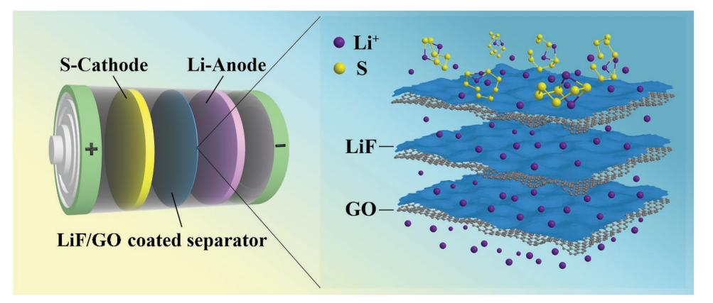
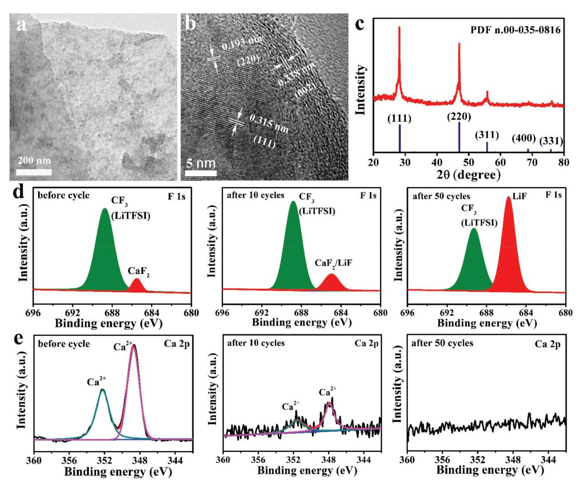
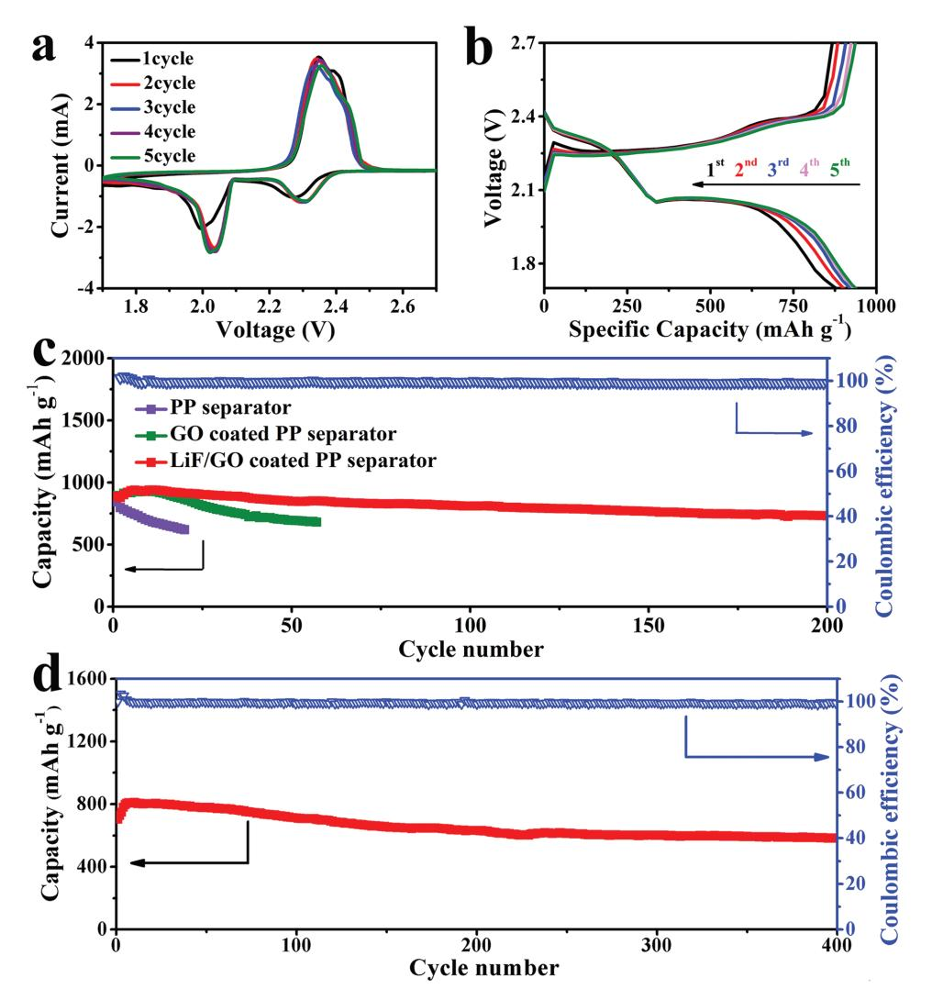
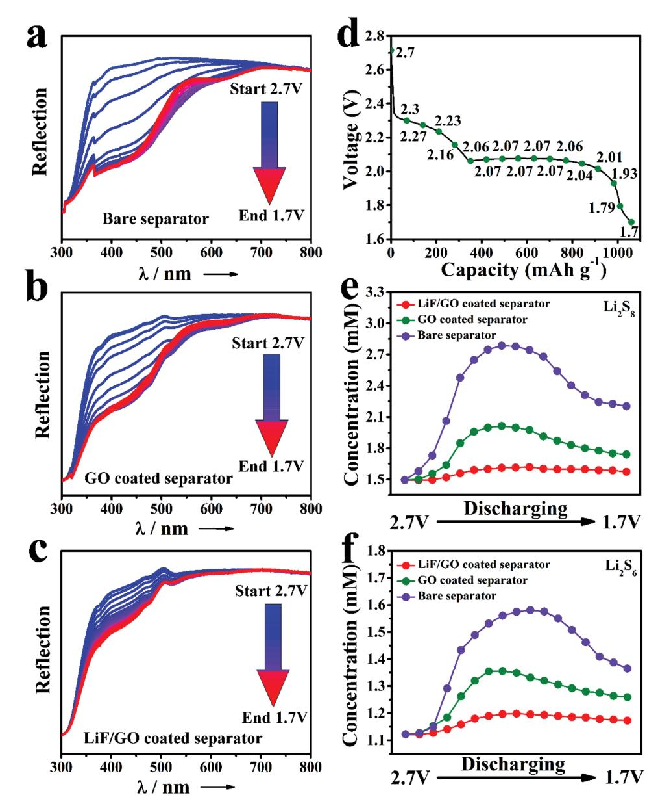

**Lithium-Sulfur Batteries**

# **High Lithium Ion Conductivity LiF/GO Solid Electrolyte Interphase Inhibiting the Shuttle of Lithium Polysulfides in Long-Life Li–S Batteries**

*Xuyan Ni, Tao Qian,\* Xuejun Liu, Na Xu, Jie Liu, and Chenglin Yan\**

**The "shuttle effect" that stems from the dissolution of polysulfides is the most fatal issue affecting the cycle life of lithium-sulfur (Li–S) batteries. In order to suppress the "shuttle effect," a new strategy of using a highly lithium ion conductive lithium fluoride/graphene oxide (LiF/GO) solid electrolyte interphase (SEI) to mechanically prevent the lithium dendrite breakthrough is reported. When utilized in Li–S batteries, the LiF/GO SEI coated separator demonstrates significant feature in mitigating the polysulfide shuttling as observed by in situ UV–vis spectroscopy. Moreover, the restrained "shuttle effect" can also be confirmed by analysis of electrochemical impedance spectroscopy and characterization of lithium dendrites, which indicates that no insulating layer of solid Li2S2/Li2S is found on lithium anode surface. Furthermore, the LiF/GO SEI layer puts out good lithium ion conductivity as its lithium ion diffusion coefficient reaches a high value of 1.5 × 10−7 cm2 s−1 . These features enable a remarkable cyclic property of 0.043% of capacity decay per cycle during 400 cycles.**

#### **1. Introduction**

Owing to the rapid development of portable electronic devices and electric vehicles, finding advanced energy-storage systems going beyond lithium-ion batteries that are limited by their low energy density is an immediate necessity. Lithium–sulfur (Li–S) battery is regarded as one of the most promising candidates for next-generation energy-storage systems because of its high theoretical gravimetric capacity (1675 mA h g−1 ) and energy density (2567 Wh kg−1).[1,2] Although Li–S battery has been studied for 30 years, it is still a research battery due to its rapid capacity attenuation during cycle process and security issue, which can be attributed to many causes. For example, the "shuttle effect" during the charge and discharge processes, the dendritic and mossy metal deposition on Li metal anode as well as the unstable solid electrolyte interphase (SEI) are generally considered as main issues for Li–S battery.[3–5] Among them, the most serious issue is the so-called "shuttle effect" arising from the dissolution of high-order lithium polysulfides (Li2S*n*, 4 < *n* ≤ 8) in organic electrolytes and their free migration between the cathode and anode. The formed highorder polysulfides are further lithiated to generate low-order polysulfides (Li2S*n*, 1 ≤ *n* ≤ 4) and produce insulating lithium sulfide (Li2S) on Li metal surface.[6–9] The whole process results in capacity loss of sulfur cathode and poor cycle life.

To address the "shuttle effect," one primary focus is to block the diffusion of polysulfides into electrolyte during discharge process. On the other hand, the confinement of elemental sulfur in conductive porous templates or assembled structures to restrict the diffusion of polysulfides was reported.[10–12] Nevertheless, it is still difficult to completely stop polysulfide dissolution solely via cathode modification, especially when sulfur content is substantially large in the sulfur cathode.[13–15] Hence, the modification of separator by coating with carbon materials such as graphene oxide (GO), carbon black and carbon nanotube have been carried out to remedy this problem by the physical absorption of polysulfides.[16–21] However, nonpolar nature of carbon leads to weak interaction with polar polysulfides and greatly influence the ability of the coating layer in blocking polysulfides. The utilization of metal oxides such as NiFe layered double hydroxide grew on mesoporous nitrogen-doped graphene substrate (LDH/NG) and integrating zinc oxide nanowires with a carbon nanofiber mat (ZnO/C), as polysulfide adsorbents in organic electrolyte were demonstrated in recent work.[22,23] These interlayers could optimize the chemical effect of metal oxides on confining polysulfides but they have the similar drawbacks of not dense and requiring high loading, which means a low loading of sulfur.

Based on the analysis of previous research, a dense layer on separator which can efficiently suppresses the migration of the dissolved polysulfides to the anode while allows effective transport of Li ion is needed. On the other hand, an ideal solid electrolyte interphase is featured with high Li ionic conductivity,

X. Ni, Dr. T. Qian, X. Liu, N. Xu, J. Liu, Prof. C. Yan Soochow Institute for Energy and Materials InnovationS College of Physics Optoelectronics and Energy & Collaborative Innovation Center of Suzhou Nano Science and Technology Soochow University Suzhou 215006, China E-mail: tqian@suda.edu.cn; c.yan@suda.edu.cn X. Ni, Dr. T. Qian, X. Liu, N. Xu, J. Liu, Prof. C. Yan Key Laboratory for Advanced Carbon Materials and Wearable Energy Technologies of Jiangsu Province Soochow University Suzhou 215006, China The ORCID identification number(s) for the author(s) of this article can be found under https://doi.org/10.1002/adfm.201706513.

**DOI: 10.1002/adfm.201706513**

good compact structure, and high elastic strength to mechanically prevent the lithium dendrite breakthrough.[24–29] Among several kinds of solid electrolyte interphase materials, lithium fluoride (LiF) has gained special attention arising from its wide electrochemical stability window and good lithium ion conductivity.[30–32] However, its mechanical property is undesirable since it is relatively brittle. GO possesses the advantages of high elastic modulus and desirable mechanical strength.[33,34] Therefore, a composite combined by LiF and GO could be an ideal SEI material. We report herein an effective strategy of using LiF/GO SEI coated separator to block the diffusion of polysulfides for high performance Li–S battery, in which the "shuttle effect" is greatly suppressed as evidenced by in situ UV–vis spectroscopy. Moreover, the excellent electron and lithium ion conductivity of cell assembled with LiF/GO coated separator was revealed by electrochemical impedance spectroscopy and lithium ion diffusion coefficient test. As a result, the assembled Li–S batteries with LiF/GO coated separator offers outstanding performance with a high discharge capacity of 1205 mA h g−1 at a current density of 0.2 C (1 C = 1675 mA g−1) and delivers only 0.043% of capacity decay per cycle during 400 cycles.

#### **2. Results and Discussion**

A composite made from calcium fluoride and graphene oxide (CaF2/GO) was coated onto the separator, and during discharge and charge process, CaF2 on the coating layer reacts with Li+ to produce LiF, leading to the in situ formation of SEI on the separator (**Figure 1**). Transmission electron microscopy (TEM) image (**Figure 2**a), along with scanning electron microscopy (SEM) and energy dispersive X-ray (EDX) spectroscopy (Figure S1, Supporting Information), clearly exhibits that the CaF2 particles are homogenously dispersed onto the nanosheets of GO. Besides, high-resolution TEM image (Figure 2b) shows that the lattice fringes are separated by 0.193, 0.315, and 0.338 nm, which correspond to the (111) orientation of CaF2, (220) orientation of CaF2 and (002) orientation of GO, respectively. The powder X-ray diffraction (XRD) analysis (Figure 2c) reveals the characteristic peaks at 28.2°, 47.0°, 55.8°, 68.8°, and 78.0°, corresponding to the (111), (220), (311), (400), and (331) planes of CaF2, respectively. These certify that we successfully synthesized CaF2 and make it spread on GO, and the total preparation of CaF2/GO composites is an easy and feasible process without using any sophisticated method, giving us a chance in real-world applications of these composites.

To monitor the formation of LiF SEI, X-ray photoelectron spectroscopy (XPS) analyses of the LiF coated separator removed from Li–S batteries after different cycles were performed. The F 1s and Ca 2p spectra of LiF/GO coated separator before cycle, after ten cycles and 50 cycles are shown in Figure 2d,e, respectively. In F1s spectrum, two peaks were observed at the binding energy of 685.5 and 688.8 eV, in keeping with the peaks of metal fluoride and lithium salt (LiTFSI) in electrolyte, respectively. The Ca 2p spectrum of the separator before cycling is similar to that of pure CaF2/GO composites (Figure S2c, Supporting Information), revealing that the metal fluoride is assigned to CaF2. After ten cycles, the signal of peak assigned to metal fluoride experiences a little change, but the signal of Ca element becomes very weak, revealing CaF2 has transformed into the LiF on the separator. After 50 cycles, no peak of Ca element can be observed in the Ca 2p spectrum, which verifies the disappearance of CaF2 on the separator. The complete transformation of CaF2, along with partial conversion of LiTFSI, results in a strong signal of metal fluoride. All above results certified the in situ formation of LiF/ GO SEI on separator during the discharge and charge processes.

To evaluate the improved electrochemical performance of Li–S batteries with LiF/GO coated separator, cells were assembled using sulfur cathode, lithium metal anode, and decorated polypropylene (PP) separator. As shown in **Figure 3**a, cyclic voltammograms (CV) test was conducted within the voltage range of 1.7–2.7 V at a scan rate of 0.1 mV s−1 . The two cathodic peaks, located around 2.3 and 2.0 V, correspond to the reduction of sulfur into high-order polysulfides (Li2S*n*, 4 < *x* ≤ 8) and polysulfides to solid lithium sulfides (Li2S2/Li2S), respectively, while the broad anodic peak around 2.4 V could be assigned to the oxidation–reduction of polysulfides to sulfur with facile electrochemical kinetics.[35] Both the change of peak currents and CV peak positions are very small, which indicates the good reversibility of the chemical reactions with LiF/GO coated separator. The galvanostatic discharge–charge profile study was then performed at a constant current rate of 1 C (Figure 3b). The discharge curves consist of two reduction plateaus at 2.3 and 2.0 V, respectively, while the charge curves consist of one long oxidation plateau at 2.4 V, which is consistent with the CV tests.

**Figure 1.** Schematic cell configuration of Li–S batteries assembled with LiF/GO coated separator.

**Figure 2.** a) TEM image of CaF2/GO composites. b) High-resolution TEM image of CaF2/GO composites. c) XRD pattern of CaF2/GO composites with reference pattern for CaF2. d) XPS F 1s spectra of LiF/GO coated PP separator removed from batteries before cycle, after ten cycles and after 50 cycles. e) XPS Ca 2p spectra of LiF/GO coated PP separator removed from batteries before cycle, after ten cycles and after 50 cycles.

According to the theoretical analysis, we are confident that LiF/GO SEI would be an ideal ion sieve, which selectively allows lithium ion passing through while efficiently restraining polysulfides migration. Hence, the cyclic property of Li–S batteries with LiF/GO coated PP separator was studied at a current rate of 1 C. For comparison, batteries using GO coated PP separator and bare PP separator were also measured at the same conditions. As displayed in Figure 3c, all three batteries exhibit similar initial capacities around 880 mA h g−1 , but the capacity of battery with bare PP separator falls to 619 mA h g−1 (73.1% of the initial discharge capacity) after just 20 cycles. After coating GO onto PP separator, a slight improvement was achieved. However, the discharge capacity still falls to 76% of the initial discharge capacity within 50 cycles. As expected, the battery with LiF/GO coated PP separator delivers an initial discharge capacity of 888 mA h g−1 and 82.3% capacity retention after 200 cycles. Additionally, the Coulombic efficiency of the battery with LiF/GO coated PP separator maintained to be greater than 99%, while the Coulombic efficiency of the batteries with bare PP separator and GO coated PP separator maintained to be around 97.1% and 98.3% (Figure S3, Supporting Information), respectively. The comparison results of the Coulombic efficiency attests that LiF/GO SEI can efficiently block the diffusion of soluble polysulfides. Moreover, the long-term cyclic performance of Li–S battery with LiF/GO coated PP separator was further evaluated at a rate of 2 C. As shown in Figure 3d, the battery demonstrates an initial capacity of 721 mA h g−1 and delivers only 0.043% of capacity decay per cycle during 400 cycles. Furthermore, a battery with high sulfur loading around 2.6 mg cm−2 was fabricated and evaluated at a current rate of 0.5 C (Figure S4a, Supporting Information). From the curve we can observe that the discharge capacity of the battery maintained to be around 700 mA h g−1 (1.7 mA h cm−2 ). This proves that the LiF/GO coated PP separator can be utilized in the Li–S batteries with high mass loading of sulfur, demonstrating its high potential to meet the demand of practical application.

**Figure 3.** a) Cyclic voltammogram profile of Li–S battery with LiF/GO coated PP separator at a scan rate of 0.1 mV s-1. b) Galvanostatic charge–discharge profiles at a rate of 1 C. c) Cycle test for batteries with PP, GO coated PP, LiF/GO coated PP separators at 1 C. d) Cycle test for battery with LiF/GO coated PP separator at 2 C.

The battery with LiF/GO coated PP separator was cycled at different current densities to study the rate performance. As displayed in Figure S4b in the Supporting Information, the battery delivers discharge capacities of 1195, 1042, 920, 800, and 524 mA h  $g^{-1}$  at 0.2, 0.5, 1, 2, and 3 C, respectively. When the rate turned back to 2, 1 and 0.5 C step by step, the discharge capacities of 794, 916, and 1035 mA h g-1 could be recovered, which indicates good rate performance due to the high lithium ion conductivity of LiF/GO SEI. Furthermore, CV tests with different sweep rates were performed to study the lithium ion diffusion coefficients to confirm the enhanced lithium ion conductivity of LiF/GO SEI interlayer (Figure S5a,c,e, Supporting Information). Then we analyzed the peak current data with Randles-Sevick equation which is given below[36,37]

$$I_{\rm P} = 2.69 \times 10^5 n^{1.5} A D_{\rm Li^+}^{0.5} C_{\rm Li} v^{0.5} \tag{1}$$

In the equation,  $I_P$  was the peak current (A), *n* referred to the number of electrons involved in the reaction ( $n = 2$  for Li–S battery), A represented the area of electrode (cm2),  $D_{Li}$ + stood for lithium ion diffusion coefficient (cm2 s-1), CLi was the lithium ion concentration (mol L-1), and  $\nu$  represented the scanning rate ( $V$  s-1). Linear fits of peak current of Li–S batteries with PP separator, GO coated PP separator, and LiF/GO coated PP separator is displayed in Figure S4b,d,f in the Supporting Information. Then the value of the  $D_{Li}^+$  was calculated and listed on Table S1 in the Supporting Information. Apparently, the highest lithium ion diffusion coefficient is achieved by the battery with LiF/GO coated PP separator.

Electrochemical impedance spectroscopy (EIS) was employed to characterize the fresh batteries and batteries after 20 cycles (Figure 4a,b). It can be seen from Figure 4a that before cycling, batteries using GO coated PP, LiF/GO coated PP separators and bare PP display similar EIS curves, suggesting fair lithium ion diffusion. Whereas, after cycling, the batteries show two semicircles (Figure 4b). The semicircle in high frequency (first semicircle) is assigned to the resistance and capacitance of the SEI layer on sulfur cathode and Li metal side, while the semicircle

**Figure 4.** Electrochemical impedance spectra of Li–S batteries a) before and b) after cycling using PP, GO coated PP, LiF/GO coated PP separators. Top-view SEM images of lithium deposition from battery assembled with c) LiF/GO coated PP separator and d) PP separator cycled for 50 cycles.

in middle frequency (second semicircle) is due to the formation of insulating layer of solid Li2S2/Li2S deposited on lithium anode surface.[38,39] As shown in Figure 4b, the observed large semicircles in middle frequency of the batteries with GO coated PP and PP separators imply serious deposition of Li2S2/Li2S on lithium anode surface. However, in the curves of the battery with LiF/GO coated PP separator, the semicircle in middle frequency is very small so that we can hardly observe it. It indicates that there is almost no insulating layer of solid Li2S2/Li2S on lithium anode surface, which is in accordance with the results of the SEM study with lithium plates shown in Figure 4c,d.

In situ UV–vis spectroscopy is an efficient tool to investigate the component transformation occurred in the electrolyte of Li–S batteries during the cycling process based on the principle of Beer–Lambert's law as polysulfides with different orders have different colors.[40] The different wave-lengths for Li2S*x* (2 ≤ *x* ≤ 8) have been studied in our previous reports (λ = 450 nm for Li2S2, λ = 505 nm for Li2S4, λ = 530 nm for Li2S6, and λ = 560 nm for Li2S8).[41,42] In order to detect polysulfides diffused through the separator without delay, a cell based on a hollow lithium plate as well as a hollow anode shell configuration with a sealed glass window was assembled. **Figure 5**a–c shows the measured UV–vis spectra of Li–S batteries with bare separator, GO coated separator, and LiF/GO coated separator, respectively. The continuous shifts of reflection at the peaks of the derivatives before discharged to 2.07 V are attributed to the appearance of polysulfides spread through the separator. When discharging from 2.07 to 1.7 V, the reflection at the peaks of the derivatives went up, which are attributed to the reaction from high-order polysulfides to low-order. The quantitative analysis of polysulfides in the electrolyte was done to certify the polysulfides blocking function of LiF/GO SEI. The concentration values of different polysulfides can be calculated according to the relationship between actual intensity and the concentration.[43] The concentrations of Li2S8 in three cells as the discharging goes on (Figure 5d) are shown in Figure 5e. It can be seen from the curve that the concentrations of Li2S8 in three cells are at the same level at very begins, but with the discharging went on, the concentrations of Li2S8 in cells with bare separator and GO coated separator raced up and then declined to a considerably high value. As a comparison, the concentration value of Li2S8 in the cell with LiF/GO coated separator keeps very small and stationary, declaring that almost no Li2S8 diffused to the anode, which means LiF/GO SEI is dense enough to block the diffusion of polysulfides. In addition, Figure 5f shows the comparison of concentration of Li2S6 in three cells, which is in similar situation to that of Li2S8.

# **3. Conclusion**

In summary, we have introduced a novel strategy to improve the cycle performance of Li–S batteries by using LiF/GO SEI to resist dissolved polysulfides. In situ UV–vis absorption spectra analysis confirmed the excellent hindering effect of LiF SEI on polysulfide diffusion. Furthermore, no insulating layer of solid Li2S2/Li2S was formed on lithium anode surface, which means the inhibiting effect of LiF SEI on the "shuttle effect." The batteries with LiF/GO coated separator exhibited good cyclic performance with a high discharge capacity of 1205 mA h g−1 at a current density of 0.2 C and delivered only 0.043% of capacity decay per cycle during 400 cycles. The strategy utilized in this work opens pathways by forming artificial SEI on the separator and efficiently restraining the "shuttle effect."

**Figure 5.** The in situ UV/vis spectra of discharging batteries assembled with a) bare separator, b) GO coated separator, and c) LiF/GO coated separator between λ = 300 and 800 nm. The polysulfide concentrations of e) Li2S8 and f) Li2S6 at different potentials in different cells demonstrate individual difference corresponding to d) the voltage changes.

### **4. Experimental Section**

*Materials*: 1-Methyl-2-pyrrolidinone (NMP, 99.5%) was from Aladdin. Sulfur powder (99.5%), calcium fluoride (30% Ca), and polyvinylidene difluoride (PVDF) were from Alfa Aesar. HF (40%) and isopropyl alcohol (99.7%) were from Sinopharm. Ketjen black and acetylene black were from Hefei Ke Jing Materials Technology CO., LTD. 1 m LiTFSI in DOL/ DME (1:1 by volume) with 1wt% LiNO3 was from Dodo Chem. All chemical reagents were used as received without any further purification.

*Synthesis of CaF2/GO Composites*: CaF2/GO composites were synthesized according to the method modified from the work reported by Salguero et\_al.[44] 15 mg of GO was dispersed into 30 mL of deionized water and then the dispersion was added into a tetrafluoroethylene round-bottom flask. 0.15 g (1.56 mmol) of CaSi2 was ground under argon atmosphere with mortar/pestle, followed by adding to the GO dispersion. Then, 28 drops of HF were added to the solution. The reaction was stirred for 1 h with the temperature of whole system remained around 0 °C. The product was washed with a mixture of deionized water and isopropyl alcohol and isolated by centrifugation until the supernatant became neutral. The final material was dried with condensation drying.

*Fabrication of Separator*: The LiF/GO coated separator layer was prepared using a vacuum-filtration method. CaF2/GO, Ketjen black and PVDF were mixed with weight ratio of 8:1:1 and the mixture were added to NMP to form a dispersion (0.75 mg mL−1 ). 2 mL of the dispersion were vacuum filtered through a polypropylene membrane and formed a flexible triple layer membrane. The membranes were dried at room temperature overnight and then punched into a round shape with diameter of 18 mm. The weight of the LiF/GO layer on each separator is around 0.15 mg cm−2 .

*Materials Characterization*: TEM and high-resolution TEM images were performed on FEI CM120 microscope and FEI Tecnai F20 microscope, respectively. The SEM image and EDX elemental maps were obtained

**www.advancedsciencenews.com www.afm-journal.de**

on a JEOL JSM 6700F electron microscope equipped with Oxford EDX analysis system. The composites were characterized by XRD(X' Pert PRO, PANalytical B.V., the Netherlands) with a Cu target (Kα, λ = 0.15406 nm). Ultrahigh vacuum ESCALAB 250 set-up equipped with the monochromatic Al Ka X-ray source (1486.6 eV; anode operating at 15 kV and 20 mA) was used for X-ray photoelectron spectroscopy measurement.

*Electrochemical Measurements*: Sulfur cathodes were prepared using a slurry casting method. Carbon/sulfur, acetylene black, and PVDF were mixed with weight ratio of 8:1:1 to form homogeneous slurry with NMP and then casted onto aluminum foil. The electrodes were dried at 60 °C in vacuum overnight. The loading density of the sulfur is ≈1.3 mg cm−2 , and a high sulfur density of 2.6 mg cm−2 was also evaluated. To evaluate the electrochemical performance, 2025-type coin cells were assembled using lithium metal as the anodes. The LiF/GO interlayer was placed between polypropylene separator and sulfur cathode. 1.0 m LiTFSI in DOL/DME (1:1 by volume) with 1 wt% LiNO3 were used as an electrolyte. The cyclic performance was tested on the CT2001A cell test instrument (Wuhan LAND Electronic Co., Ltd). The cyclic voltammetric and electrochemical impedance spectroscopy were tested on the CHI660E (Shanghai Chenhua instrument Co., Ltd) electrochemical workstation.

In situ *UV–Vis Spectroscopy Measurements*: The in situ UV– vis spectroscopy was operated on UV Lambda 750S UV/Vis/NIR spectrometer. Before assembling a cell, the anode shell needed to be punched and a thin optical glass was glued on the hole to form a window. Noted that a prepunched lithium plate was placed in the anode shell to ensure the separator can be exposed in the UV light. Whatman Glass–Fiber separator was chosen as the separator instead of PP separator. The LiF/GO interlayer was placed between Whatman Glass–Fiber separator and sulfur cathode. The sulfur loading of cathode electrode was 1 mg cm−2. 1.0 m LiTFSI in DOL/DME (1:1 by volume) with 1 wt% LiNO3 was used as the electrolyte.

# **Supporting Information**

Supporting Information is available from the Wiley Online Library or from the author.

### **Acknowledgements**

The authors acknowledge the support from the National Natural Science Foundation of China (Grant Nos. 51622208, 21703149), Natural Science Foundation of Jiangsu Province (No. BK20150338), and the Priority Academic Program Development of Jiangsu Higher Education Institutions (PAPD).

# **Conflict of Interest**

The authors declare no conflict of interest.

### **Keywords**

lithium sulfur batteries, separators, shuttle effect, solid electrolyte interphases

- Received: November 9, 2017
- Revised: December 13, 2017
- Published online: January 18, 2018

[1] R. Noorden, *Nature* **2013**, *498*, 416.

[2] D. Zheng, X. R. Zhang, J. K. Wang, D. Y. Qu, X. Q. Yang, D. Y. Qu, *J. Power Sources* **2016**, *301*, 312.

- [3] D. Bresser, S. Passerini, B. Scrosati, *Chem. Commun.* **2013**, *49*, 10545.
- [4] J. J. Hu, G. R. Li, X. P. Gao, *J. Inorg. Mater.* **2013**, *28*, 1181.
- [5] A. Manthiram, Y. Z. Fu, S. H. Chung, *Chem. Rev.* **2014**, *114*, 11751.
- [6] Y. V. Mikhaylik, J. R. Akridge, *J. Electrochem. Soc.* **2004**, *151*, A1969.
- [7] L. Suo, Y.-S. Hu, H. Li, M. Armand, L. Chen, *Nat. Commun.* **2013**, *4*, 1481.
- [8] T. Yim, M.-S. Park, J.-S. Yu, K. J. Kim, K. Y. Im, J.-H. Kim, G. Jeong, Y. N. Jo, S.-G. Woo, K. S. Kang, I. Lee, Y.-J. Kim, *Electrochim. Acta* **2013**, *107*, 454.
- [9] Y.-X. Yin, S. Xin, Y.-G. Guo, L.-J. Wan, *Angew. Chem., Int. Ed.* **2013**, *52*, 13186.
- [10] S. N. Talapaneni, T. H. Hwang, S. H. Je, O. Buyukcakir, J. W. Choi, A. Coskun, *Angew. Chem., Int. Ed.* **2016**, *55*, 3106.
- [11] J. Song, Z. Yu, M. L. Gordin, D. Wang, *Nano Lett.* **2016**, *16*, 864.
- [12] Y.-S. Su, A. Manthiram, *Nat. Commun.* **2012**, *3*, 1166.
- [13] J. Kim, D.-J. Lee, H.-G. Jung, Y.-K. Sun, J. Hassoun, B. Scrosati, *Adv. Funct. Mater.* **2013**, *23*, 1076.
- [14] W. Weng, V. G. Pol, K. Amine, *Adv. Mater.* **2013**, *25*, 1608.
- [15] S. Chen, F. Dai, M. L. Gordin, Z. Yu, Y. Gao, J. Song, D. Wang, *Angew. Chem., Int. Ed.* **2016**, *55*, 4231.
- [16] H. M. Kim, J. Y. Hwang, A. Manthiram, Y.-K. Sun, *ACS Appl. Mater. Interfaces* **2016**, *8*, 983.
- [17] K. Mi, Y. Jiang, J. Feng, Y. Qian, S. Xiong, *Adv. Funct. Mater.* **2016**, *26*, 1571.
- [18] S.-H. Chung, A. Manthiram, *Adv. Funct. Mater.* **2014**, *24*, 5299.
- [19] J. Zhang, M. Huang, B. Xi, A. Yuan, S. Xiong, *Adv. Energy Mater.* **2017**, *7*, 1701330.
- [20] A. Vizintin, M. Lozinsek, R. K. Chellappan, D. Foix, A. Krajnc, G. Mali, G. Drazic, B. Genorio, R. Dedryvere, R. Dominko, *Chem. Mater.* **2015**, *27*, 7070.
- [21] K. Mi, S. Chen, B. Xi, S. Kai, Y. Jiang, J. Feng, Y. Qian, S. Xiong, *Adv. Funct. Mater.* **2017**, *27*, 1604265.
- [22] H.-J. Peng, Z.-W. Zhang, J.-Q. Huang, G. Zhang, J. Xie, W.-T. Xu, J.-L. Shi, X. Chen, X.-B. Cheng, Q. Zhang, *Adv. Mater.* **2016**, *28*, 9551.
- [23] T. Zhao, Y. Ye, X. Peng, G. Divitini, H.-K. Kim, C.-Y. Lao, P. R. Coxon, K. Xi, Y. Liu, C. Ducati, R. Chen, R. V. Kumar, *Adv. Funct. Mater.* **2016**, *26*, 8418.
- [24] X.-B. Cheng, R. Zhang, C.-Z. Zhao, F. Wei, J.-G. Zhang, Q. Zhang, *Adv. Sci.* **2016**, *3*, 1500213.
- [25] I. A. Shkrob, T. W. Marin, Y. Zhu, D. P. Abraham, *J. Phys. Chem. C* **2014**, *118*, 19661.
- [26] L. Suo, Y.-S. Hu, H. Li, M. Armand, L. Chen, *Nat. Commun.* **2013**, *4*, 1481.
- [27] J. J. Hu, G. K. Long, S. Liu, G. R. Li, X. P. Gao, *Chem. Commun.* **2014**, *50*, 14647.
- [28] J. Heine, P. Hilbig, X. Qi, P. Niehoff, M. Winter, P. Bieker, *J. Electrochem. Soc.* **2015**, *162*, A1094.
- [29] J. Guo, Z. Y. Wen, M. F. Wu, J. Jin, Y. Liu, *Electrochem. Commun.* **2015**, *51*, 59.
- [30] Y. Liu, D. Lin, P. Y. Yuen, K. Liu, J. Xie, R. H. Dauskardt, Y. Cui, *Adv. Mater.* **2017**, *29*, 1605531.
- [31] M. D. Tikekar, S. Choudhury, Z. Tu, L. A. Archer, *Nat. Energy* **2016**, *1*, 16114.
- [32] Y. Zhu, X. He, Y. Mo, *ACS Appl. Mater. Interfaces* **2015**, *7*, 23685.
- [33] J.-Q. Huang, T.-Z. Zhuang, Q. Zhang, H.-J. Peng, C.-M. Chen, F. Wei, *ACS Nano* **2015**, *9*, 3002.
- [34] J. J. Shao, W. Lv, Q. H. Yang, *Adv. Mater.* **2014**, *26*, 5586.
- [35] Z. A. Ghazi, L. Zhu, H. Wang, A. Naeem, A. M. Khattak, B. Liang, N. A. Khan, Z. Wei, L. Li, Z. Tang, *Adv. Energy Mater.* **2016**, *6*, 1601250.
- [36] J.-Q. Huang, T.-Z. Zhuang, Q. Zhang, H.-J. Peng, C.-M. Chen, F. Wei, *ACS Nano* **2015**, *9*, 3002.
- [37] S. Bai, X. Liu, K. Zhu, S. Wu, H. Zhou, *Nat. Energy* **2016**, *1*, 16094.

**www.advancedsciencenews.com www.afm-journal.de**

- [38] Z. A. Ghazi, X. He, A. M. Khattak, N. A. Khan, B. Liang, A. lqbal, J. Wang, H. Sin, L. Li, Z. Tang, *Adv. Mater.* **2017**, *29*, 1606817.
- [39] H. Pan, J. Chen, R. Cao, V. Murugesan, N. N. Rajput, K. S. Han, K. Persson, L. Estevez, M. H. Engelhard, J.-G. Zhang, K. T. Mueller, Y. Cui, Y. Shao, J. Liu, *Nat. Energy* **2017**, *2*, 869.
- [40] M. U. M. Patel, R. Dominko, *ChemSusChem* **2014**, *7*, 2167.
- [41] W. Chen, T. Qian, J. Xiong, N. Xu, X. J. Liu, J. Liu, J. Q. Zhou, X. W. Shen, T. Z. Yang, Y. Chen, C. Yan, *Adv. Mater.* **2017**, *29*, 1605160.
- [42] N. Xu, T. Qian, X. J. Liu, Y. Chen, C. Yan, *Nano Lett.* **2017**, *17*, 538.
- [43] J. Liu, T. Qian, M. Wang, X. Liu, N. Xu, Y. You, C. Yan, *Nano Lett.* **2017**, *17*, 5064.
- [44] R. Ramachandran, D. Johnson-McDaniel, T. T. Salguero, *Chem. Mater.* **2016**, *28*, 7257.