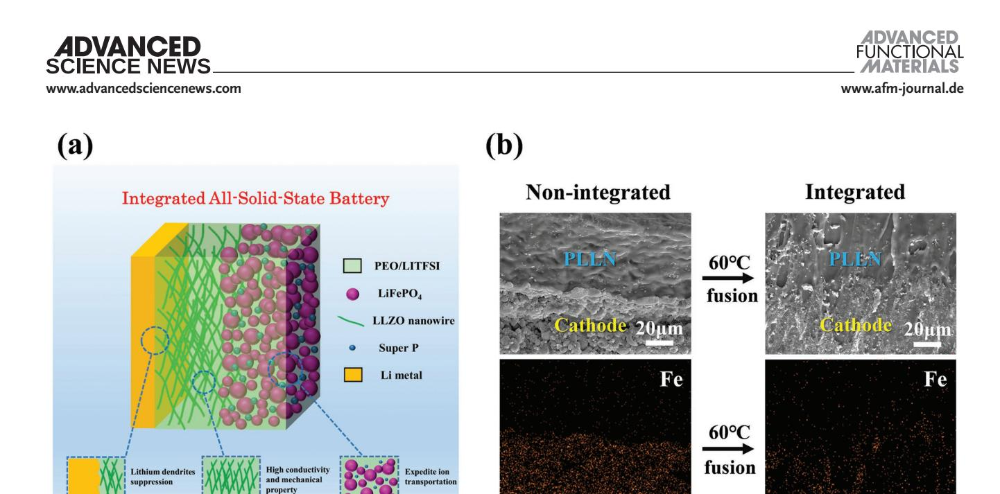
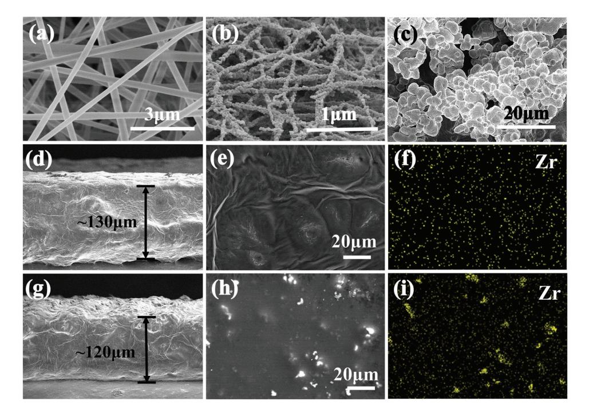
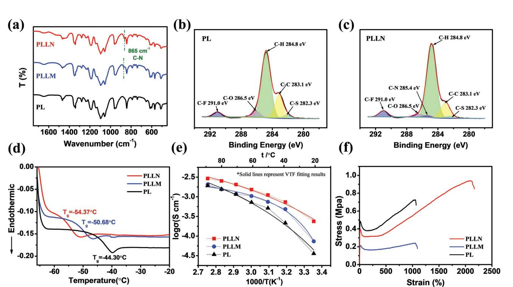
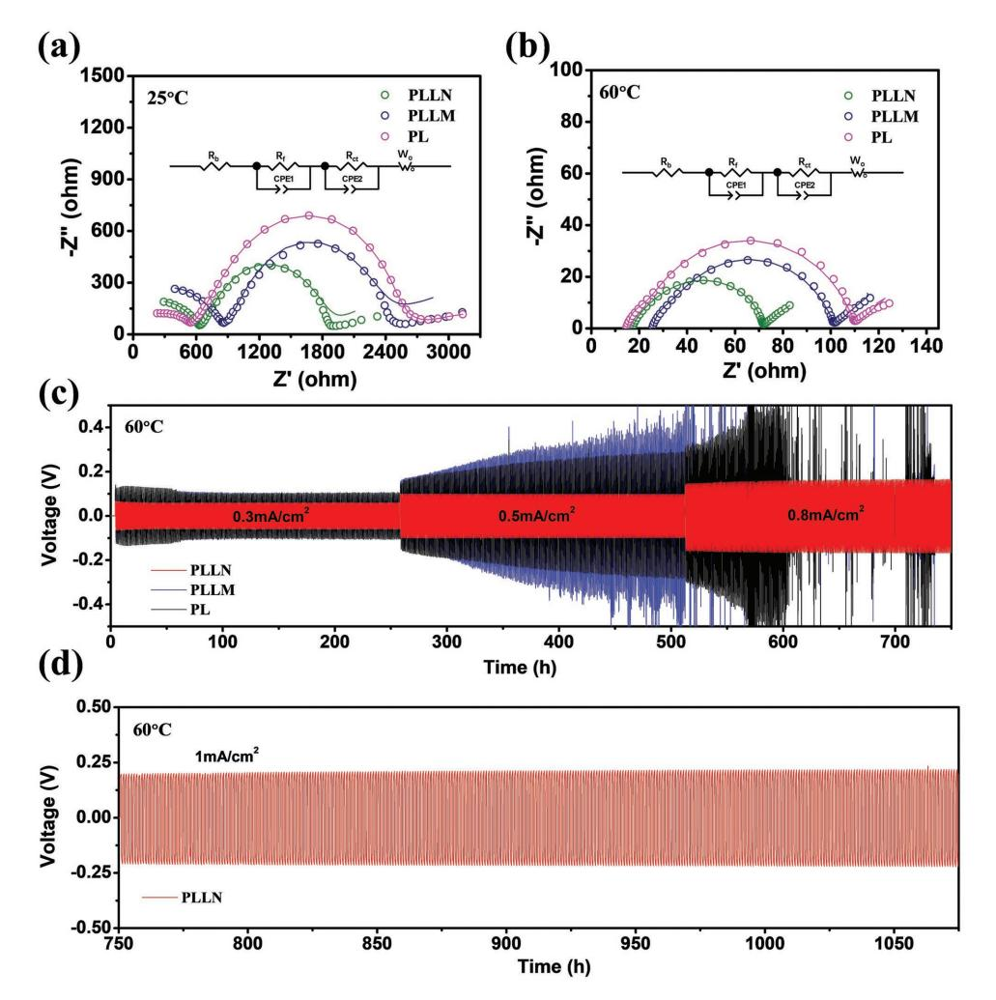
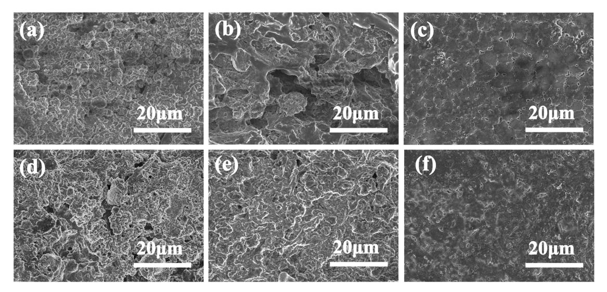
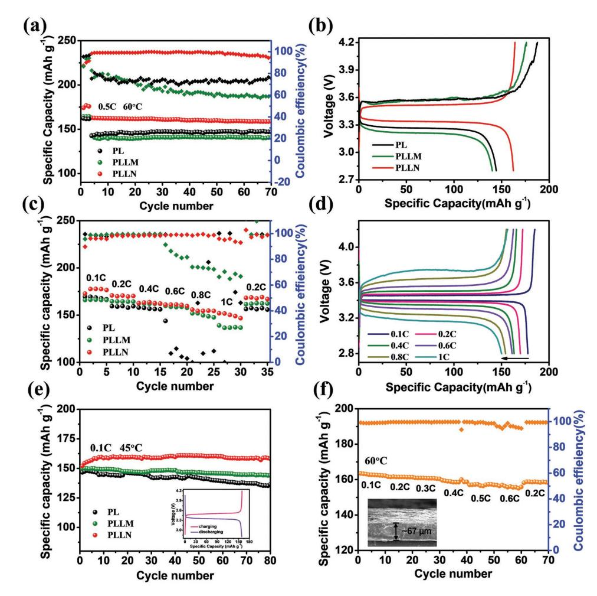

**All-Solid-State Batteries**

# **Low Resistance–Integrated All-Solid-State Battery Achieved by Li7La3Zr2O12 Nanowire Upgrading Polyethylene Oxide (PEO) Composite Electrolyte and PEO Cathode Binder**

*Zipei Wan, Danni Lei, Wei Yang, Cheng Liu, Kai Shi, Xiaoge Hao, Lu Shen, Wei Lv, Baohua Li, Quan-Hong Yang, Feiyu Kang, and Yan-Bing He\**

**All-solid-state lithium metal battery is the most promising next-generation energy storage device. However, the low ionic conductivity of solid electrolytes and high interfacial impedance with electrode are the main factors to limit the development of all-solid-state batteries. In this work, a low resistance–integrated all-solid-state battery is designed with excellent electrochemical performance that applies the polyethylene oxide (PEO) with lithium bis(trifluoromethylsulphonyl)imide as both binder of cathode and matrix of composite electrolyte embedded with Li7La3Zr2O12 (LLZO) nanowires (PLLN). The PEO in cathode and PLLN are fused at high temperature to form an integrated all-solid-state battery structure, which effectively strengthens the interface compatibility and stability between cathode and PLLN to guarantee high efficient ion transportation during long cycling. The LLZO nanowires uniformly distributed in PLLN can increase the ionic conductivity and mechanical strength of composite electrolyte efficiently, which induces the uniform deposition of lithium metal, thereby suppressing the lithium dendrite growth. The Li symmetric cells using PLLN can stably cycle for 1000 h without short circuit at 60 °C. The integrated LiFePO4/PLLN/Li batteries show excellent cycling stability at both 60 and 45 °C. The study proposed a novel and robust battery structure with outstanding electrochemical properties.**

#### **1. Introduction**

Lithium metal batteries have been extensively regarded as the most promising next-generation rechargeable energy storage devices due to their high energy density. However, conventional lithium metal batteries with liquid organic electrolytes

Z. P. Wan, Dr. D. N. Lei, Dr. W. Yang, C. Liu, K. Shi, X. G. Hao, Dr. L. Shen, Prof W. Lv, Prof. B. H. Li, Prof. F. Y. Kang, Prof. Y.-B. He Engineering Laboratory for the Next Generation Power and Energy Storage Batteries Graduate School at Shenzhen Tsinghua University Shenzhen 518055, P. R. China E-mail: he.yanbing@sz.tsinghua.edu.cn Z. P. Wan, Dr. D. N. Lei, C. Liu, K. Shi, X. G. Hao, Prof. F. Y. Kang Laboratory of Advanced Materials School of Materials Science and Engineering Tsinghua University Beijing 100084, P. R. China

The ORCID identification number(s) for the author(s) of this article can be found under https://doi.org/10.1002/adfm.201805301.

exhibit severe security risks such as electrolyte leakage, burning, or even exploding caused by lithium dendrite growth. Solid electrolytes have attracted increasing attention as they can solve the safety issue resulted from liquid electrolytes. But their low conductivity, poor mechanical stability and high interfacial impedance with electrode restrict the practical application of all-solid-state lithium metal batteries.[1–3] The qualified all-solid-state lithium batteries should possess the following properties: first, the lithium ion conductivity of solid electrolytes should be larger than 10−4 S cm−1; second, there is a stable and small impedance interface between electrolyte and electrode; third, solid electrolytes with certain mechanical strength and flexibility can control lithium dendrites growth and buffer the volume changing from cathode and Li metal during charging and discharging processes.[1–7]

Polyethylene oxide (PEO)-based electrolytes are very promising due to their flexibility, nonflammability, and low cost.

The lithium ion conductivity can reach 10−4 to 10−3 S cm−1 at 60 °C.[8] However, PEO-based electrolytes have low ionic conductivity at room temperature and cannot inhibit lithium dendrites at high temperature sufficiently because of the poor mechanical property. To overcome shortcomings of PEObased electrolytes, adding Li-ion conductive fillers to establish

Prof. Q.-H. Yang Nanoyang Group School of Chemical Engineering and Technology Tianjin University Tianjin 300072, China Prof. Q.-H. Yang Collaborative Innovation Center of Chemical Science and Engineering (Tianjin) Tianjin 300072, China

**Figure 1.** a) Schematic illustration of an integrated all-solid-state LiFPO4/PLLN/Li battery; b) cross-sectional images of cathode and PLLN electrolyte before and after 60 °C, the corresponding EDS mapping of Fe, and the cathode and PLLN fuse together at 60 °C to from an integrated all-solid-state battery.

solid composite electrolytes is a valid strategy.[3,9–13] In previous studies, researchers have discovered that ceramic fillers including particles and wires are not only available to raise lithium ion conductivity, but also improve the mechanical strength of solid polymer electrolyte to achieve the suppression of lithium dendrite growth. For instance, the PEO/LLZO particles composite electrolyte can construct a low impedance interface with electrode, which also can effectively suppress the lithium dendrite growth.[14] A flexible PEO-based composite electrolyte using Li6.75La3Zr1.75Ta0.25O12 as fillers can suppress lithium dendrites by immobilizing anion to induce a uniform distribution of space charges.[15]

Besides ceramic particles, ceramic nanowires can also obviously elevate the conductivity of solid polymer electrolytes. 3D Li6.4La3Zr2Al0.2O12 network was constructed in the PEO with lithium bis(trifluoromethylsulphonyl)imide (LITFSI) (PL) to form a flexible composite electrolyte, which can enhance the ion conductivity of PL and block lithium dendrites.[16] Li0.33La0.557TiO3 (LLTO) nanowire can greatly increase the ionic conductivity of polyacrylonitrile (PAN)–LiClO4 at room temperature.[17,18] Therefore, PEO/ceramic filler composite electrolytes can restrain lithium dendrite growth effectively. However, as is well known that the batteries using the PEO/ceramic fillers composite electrolytes need to be operated at above 60 °C due to the low ionic conductivity of composite electrolytes and large resistance interface.[19] It is significant to broaden the operation temperature of PEO-based electrolytes battery as much as possible. In addition, it is found that most works designed and prepared all-solid-state polymer/ceramic electrolytes with high ionic conductivity, while only few works assembled the all-solid-state batteries to examine the performance of polymer/ ceramic electrolytes. This may be attributed to the lower ionic conductivity of cathode and larger solid state electrolyte/cathode interface resistance in all-solid-state battery. Thus, how to achieve the high ionic conductivity inside all-solid-state cathode and construct a less resistance interface with all-solid-state electrolyte is also a large challenge. Furthermore, the advantages of ceramic nanowires in composite electrolytes compared to the ceramic particles for enhancement of conductivity and suppression of lithium dendrite growth are still unclear.

Garnet LLZO as Li-ion fast ionic conductor is the most extensively used ceramic filler with stiffness and fast ion transmission path.[14,20–22] In this paper, we designed a low resistance– integrated all-solid-state lithium battery using PL embedded with 10 wt% LLZO nanowire electrolytes (**Figure 1**a). In the all-solid-state lithium battery, to achieve high ionic conductivity of electrolytes, excellent interfacial contact and rapid ion transportation inside cathode, the LLZO nanowires were dispersed into PL to form solid composite electrolyte and the cathode was embedded in PL that was applied as binder. The PL in cathode and PLLN can be fused at high temperature (Figure 1b) to form an integrated structure, which not only can greatly reduce the interfacial impedance between the composite electrolyte and cathode, but also increase the ionic conductivity inside of cathode. In addition, the integrated structure can accommodate electrode volume changes and strengthen the interface affinity and stability between cathode and PLLN during charge/discharge cycling. Such an integrated LiFePO4/ PLLN/Li all-solid-state battery achieved outstanding electrochemical performance at both 60 and 45 °C. Furthermore, it is found that compared to the LLZO microparticles, the LLZO nanowires can further enhance the conductivity of composite electrolyte due to the formation of the continuous path, which can effectively facilitate the Li ion transportation and induce the uniform deposition of lithium metal to suppress the lithium dendrite growth. Moreover, the robust network formed by ceramic nanowires in composite electrolyte greatly enhances its mechanical strength to reduce the side reaction of electrolyte with electrode and enhance the safety and stability of batteries. This study developed a simple and effective all-solid-state battery with integration structure that achieves good cycling stability and rate performance.

**www.advancedsciencenews.com www.afm-journal.de**

# **2. Results and Discussion**

The morphologies of LLZO nanowires, LLZO microparticles, PLLN, and PL embedded with LLZO microparticles (PLLM) were shown in **Figure 2**. Figure 2a presents the scanning electron microscope (SEM) image of electrospun precursor fibers, which displays average diameter around 200 nm. After calcination at 700 °C, the LLZO nanowires consisting of continuous nanoparticles with diameter about 100–200 nm were obtained and LLZO nanowires formed a 3D cross-linking continuous network (Figure 2b). The morphology of LLZO microparticles presented in Figure 2c shows that the grain size is 3–5 µm and the LLZO particles are aggregated together. The X-ray diffractions in Figure S1a (Supporting Information) verify the garnet crystalline structure of the LLZO nanowires and LLZO microparticles. Based on the calculation from the Brunauere– Emmette–Teller (BET) curves shown in Figure S1b (Supporting Information), the specific surface area of LLZO nanowires is 2.9 m2 g−1, which is nearly 5 times that of the LLZO microparticles (0.6 m2 g−1 ).

According to the ionic conductivity of PL electrolyte with various LLZO microparticles (Figure S2a, Supporting Information), the PL with 10 wt% LLZO microparticles has an optimum lithium ionic conductivity. Therefore, for comparison, the content of LLZO nanowires in PL was also set as 10 wt%. Figure 2d,g exhibit the cross-sectional feature of PLLN and PLLM and the thickness of which is about 120–130 µm. The surface morphology and the corresponding EDS mapping of Zr in two composite electrolytes are given in Figure 2e,h and Figure 2f,i, respectively. It can be observed that the garnet LLZO ceramic nanowires were dispersed uniformly in PL

polymer electrolyte, while the LLZO ceramic microparticles were aggregated partly. The good dispersibility of LLZO nanowires in PEO is attributed to their unique 3D continuous network structure, which can promote the ion transportation.

The XRD patterns of PL, PLLM, and PLLN in Figure S2b (Supporting Information) indicate that the composition of LLZO nanowires and LLZO microparticles with PL has no obvious influence on the crystal structure of both samples. The FTIR spectrum in **Figure 3**a reveals that a new peak at 865 cm−1 appeared after addition LLZO nanowires or LLZO microparticles, which is corresponding to the functional group of C–N.[23] In order to validate the existence of C–N, the C 1s XPS spectra of PL and PLLN were measured, as shown in Figure 3b,c. The peaks at 284.8, 283.1, and 286.5 eV are assigned to carbon atoms of C–H, C–C, and C–O respectively, which are likely attributed to the carbon atoms in the PEO polymer.[24,25] The peaks at 291.0 and 282.3 eV are assigned to carbon atoms of C–F and C–S, possibly carbons in LITFSI salt. Whereas the C 1s spectra in PLLN appears a new peak at 285.4 eV, which is assigned to the C–N group, proving the formation of CN bond.[26,27] The C–N group may result from the interaction between carbon atoms in PEO and nitrogen atoms in LITFSI. The TFSI− anions could be immobilized by the PEO polymer chain owing to the existence of ceramic LLZO, thus inducing a uniform distribution of space charges, which could be beneficial for suppressing the lithium dendrite growth.[15] The larger contact area of LLZO nanowires than LLZO microparticles could contribute to a more intense combination between ceramic and polymer matrix.

The DSC profiles of PLLN, PLLM, and PL electrolytes were examined as shown in Figure 3d, which presents the glass

**Figure 2.** a) SEM image of electrospun fibers of LLZO precursor; b) SEM images of LLZO nanowires calcined at 700 °C; c) SEM images of LLZO microparticles; d) cross-sectional and e) surface SEM image of PLLN; f) EDS mapping of Zr in PLLN; g) cross-sectional SEM image and h) surface SEM image of PLLM; i) EDS mapping of Zr in PLLM.

www.advancedsciencenews.com

**Figure 3.** a) FTIR spectra of PL, PLLM, and PLLN solid electrolyte membrane; C 1s XPS spectra for b) PL and c) PLLN; d) DSC profiles; e) ionic conductivity; f) stress–strain curves of PL, PLLM, and PLLN solid electrolytes.

transition temperature  $(T_g)$  that is related to the operating temperature. The lowering  $T_g$  indicates a lower operating temperature.[3] It is seen that the  $T_g$  of PLLN is -54.37 °C, which is much lower than that of PL ( $-44.30$  °C) and PLLM (-50.68 °C). The lower  $T_{\sigma}$  represents that the polymer segments can move at a lower temperature, which leads to the improvement of the ionic conductivity, suggesting that the cell using PLLN can operate at a lower temperature.

Lithium ion conductivity  $\sigma$  is calculated via following equation[17]

$$\sigma = \frac{L}{RS} \tag{1}$$

in which  $S$  is the area of stainless steel,  $L$  is the thickness of electrolytes, and  $R$  is obtained by EIS measurement with electrolytes sandwiched between two stainless steels.[17] The impedance spectra of PL, PLLM, and PLLN solid electrolytes at different temperatures are tested as shown in Figure S3 (Supporting Information), which were used to calculate their ionic conductivity. As shown in Figure 3e, the PLLN composite electrolyte reaches a superior ionic conductivity of  $2.39 \times 10^{-4}$  S cm-1 at room temperature and  $1.53 \times 10^{-3}$  S cm-1 at 60 °C, which is one magnitude higher than that of PLLM (7.34  $\times$  10-5 S cm-1 at room temperature and  $1.04 \times 10^{-3}$  S cm-1 at 60 °C) and PL  $(3.57 \times 10^{-5} \text{ S cm}^{-1} \text{ at room temperature and } 7.20 \times 10^{-4} \text{ S cm}^{-1}$ at 60  $^{\circ}$ C). The lithium ion conductivity enhancement is attributed to following two reasons. First, the LLZO nanowires with large specific surface can reduce the polymer electrolyte crystallinity dramatically to improve the ionic conductivity. Second, LLZO nanowires with high ionic conductivity uniformly

distributed in PLLN establish a continuous fast highway network for highly efficient lithium ion transportation.[28]

Figure 3e presents the ionic conductivity of PL, PLLM, and PLLN solid electrolytes at different temperatures. It is found that the relationship of log  $\sigma$  versus 1000/T for these solid electrolytes are curves, which cannot be well fitted by linear relationships. Similar behaviors are also observed in previous reports.[11,16] This result indicates that the temperature dependence of ionic conductivity for the PL, PLLM, and PLLN solid electrolytes is suitable for Vogel–Tammann–Fulcher (VTF) empirical equation (Equation (2), Figure 3e). The activation energy ( $E_2$ ) of PLLN, PLLM and PL was calculated by simulating the experimental conductivity data using the following VTF empirical equation (Figure 3e), which is related to ion motion coupled with long-range motions of the polymer branches[29]

$$\sigma = \sigma_0 T^{-1/2} \exp\left(-\frac{E_a}{R(T - T_0)}\right)$$
 (2)

where  $\sigma$  is ionic conductivity,  $E_a$  is activation energy,  $\sigma_0$  is the pre-exponential factor,  $T_0$  is a parameter correlated to the glass transition temperature, and  $R$  is the ideal gas constant. The VTF fitting value of  $E_a$  for PLLN is 3.8 × 10-2 eV, which is obviously smaller than that for PLLM (4.5  $\times$  10-2 eV) and PL (5.0  $\times$  10-2 eV). The lower activation demonstrates that the movement of ions in PLLN electrolyte needs a smaller energy than that in PLLM and PL electrolytes, indicating a lower operating temperature for Li transport processes. The result further indicates that the batteries with PLLN electrolyte can work at a lower temperature.

The linear sweep voltammetry (LSV) curve of PL, PLLM, and PLLN solid electrolyte membrane presents that the addition

of LLZO nanowires and LLZO microparticles can widen the electrochemical stability window from 5.3 to 5.5 and 6.0 V (Figure S4, Supporting Information), while PLLM and PL electrolytes become unstable from 3.5 V, indicating the high stability of composite electrode against Li metal. The tensile strengths of PL and PLLM are only 0.73 and 0.24 MPa, respectively (Figure 3f), while in sharp contrast, that of PLLN increases to nearly 1.0 MPa with a maximum strain of 2092% owing to the high rigidness and good dispersity of LLZO nanowires. This reinforced mechanical property of PLLN decreases the possibility of short circuiting in the lithium batteries, improving their safety and stability. The reduced mechanical strength of PLLM results from the aggregation of LLZO microparticles in PL electrolyte, leading to inhomogeneous intensity of electrolyte membrane.

The EIS of Li/PL/Li, Li/PLLM/Li and Li/PLLN/Li symmetric cells were examined at 25 and 60 °C (**Figure 4**a,b). The EIS at 25 °C consists of two semicircles and an slope line, which represents surface layer resistance (*R*f), charge transfer impedance (*R*ct), and Warburg diffusion *W*o, respectively. The values of *R*f, *R*ct, and *W*o are obtained by simulating the EIS using the equivalent circuit shown in the inset Figure 4a,b, in which CPE1 and CPE2 are constant phase elements.[30–33] It is noted that the *R*ct and *R*f of battery using PLLN at room temperature are much less than those of cells using PL and PLLM electrolytes at both room temperature and 60 °C, indicating that the LLZO nanowires in composite electrolyte benefit for the ionic transportation. At 60 °C, the *R*ct of Li/PLLN/Li symmetric cell is only 54.4 Ω, much less than that of Li/PLLM/Li (74.1 Ω) and Li/PL/Li (87 Ω). The results illustrate that PLLN electrolyte membrane can effectively reduce the interfacial impedance between composite electrolyte and Li metal.

The mechanical stability of the solid electrolyte against Li dendrites was evaluated by Li symmetric cells. The Li/PL/Li, Li/PLLM/Li, and Li/PLLN/Li symmetric cells were charged and discharged for 0.5 h under current densities of 0.3, 0.5, and 0.8 mA cm−2, respectively, at 60 °C (Figure 4c). It is seen that the voltage of Li/PLLN/Li cell is stabilized at 60 mV at 0.3 mA cm−1 , which is much smaller than that of Li/PLLM/Li and Li/PL/Li cells (122 and 133 mV). This phenomenon confirms that the PLLN electrolyte is more effective to restrain the lithium dendrite growth than the PLLM and PL electrolytes.

**Figure 4.** Electrochemical performance of Li/PL/Li, Li/PLLM/Li, and Li/PLLN/Li symmetric cells. The impedance spectra of the symmetric cells at a) 25 °C and b) 60 °C; c) voltage profiles of the lithium plating/stripping cycling with current density of 0.3, 0.5, and 0.8 mA cm−2 at 60 °C; d) Voltage profile of the continued lithium plating/stripping cycling of Li/PLLN/Li cell with a current density of 1.0 mA cm−2 at 60 °C.

**Figure 5.** The surface morphologies of Li electrode obtained from a) Li/PL/Li and b) Li/PLLM/Li symmetric cells cycling about 750 h; c) the surface morphology of Li electrode obtained from Li/PLLN/Li symmetric cell cycling about 1075 h; the surface morphologies of Li electrode obtained from d) LiFePO4/PL/Li cell, e) LiFePO4/PLLM/Li cell, and f) LiFePO4/PLLN/Li cell after 70 cycles at 0.5 C and 60 °C.

Furthermore, when the current density increases to 0.5 or even 0.8 mA cm−2 , the voltage of Li/PL/Li and Li/PLLM/Li cells obviously increased, suggesting the gradual increase of the polarization due to the severe lithium dendrite growth. The result is attributed to the inhomogeneous ionic conductivity and low ionic conductivity of PLLM and PL, which leads to the uneven deposition of lithium causing short circuit of cell. The voltage of Li/PLLN/Li cells kept at 103 mV at 0.5 mA cm−2 and 156 mV at 0.8 mA cm−2 without polarization amplifying. In the following cycles at 1.0 mA cm−2 (Figure 4d), the voltage of Li/PLLN/ Li cells is stabilized at 208 mV and maintained about 350 h, revealing good cycling stability with long cycle life and superior ability to control lithium dendrite growth. The enlarged detail view of voltage profiles at various current densities is displayed in Figure S5 (Supporting Information), proving that the Li symmetric batteries work normally under various currents and no short circuit occurs during operation. It is noted that the voltage plateau of Li/PLLM/Li and Li/PL/Li cells is not flat during lithium plating/stripping process but the Li/PLLN/Li cells present much flatter voltage plateau. The EIS spectra of Li/PLLN/Li, Li/PLLM/Li and Li/PL/Li symmetric cells during the 26th cycle using 0.3 mA cm−2 at 60 °C were in situ examined (Figure S6a–c, Supporting Information), which were simulated to obtain total cell resistance (*R*total = *R*b + *R*f + *R*ct) (Figure S6d, Supporting Information). It is seen that the total resistance of Li/PLLM/Li and Li/PL/Li cells is much larger than that of Li/PLLN/Li cell and it has an obvious larger change during lithium plating process, suggesting the polarization is much smaller for Li/PLLN/Li cell. Therefore, the voltage of Li/ PLLM/Li and Li/PL/Li cells decreases greatly during plating process but the Li/PLLN/Li cells present flatter voltage plateau. This may also be attributed to the inhomogeneous and low ionic conductivity of PLLM and PL electrolytes, which leads to the uneven deposition of lithium that greatly destroys the stability of PLLM/Li and PL/Li interfaces, resulting in an obviously increase in polarization and a large decrease in the

voltage curve.[31,34,35] In the process of lithium stripping process, a large voltage increase is found, which is caused by the inhomogeneous lithium dissolution, leading to the increase of interfacial resistance and polarization.

In order to confirm the superior ability of PLLN to inhibit lithium dendrite growth, the surface SEM images of Li anode obtained from symmetric cell after different cycling times were examined. **Figure 5**a,b present the morphology changes of Li metal in Li/PL/Li and Li/PLLM/Li symmetric cells after cycling time about 750 h with current densities of 0.3, 0.5, and 0.8 mA cm−2 at 60 °C, in which massive irregular lithium dendrites can be observed. In sharp contrast, the Li anode of Li/PLLN/Li symmetric cell cycled about 1050 h with current densities of 0.3, 0.5, 0.8, and 1.0 mA cm−2 at 60 °C shows a dense, uniform, and smooth surface without lithium dendrites (Figure 5c). Furthermore, similar results were also observed on the Li surface of the LiFePO4/PL/Li (Figure 5d), LiFePO4/ PLLM/Li (Figure 5e), and LiFePO4/PLLN/Li (Figure 5f) integrated cells after 70 cycles at 0.5 C. The outstanding ability to inhibit lithium dendrite growth of PLLN may be attributed to two reasons. First, as shown in Figure 2f, the LLZO nanowires with high ionic conductivity are uniformly distributed inside the PL solid electrolyte, which can increase the density and uniformity of lithium ion transportation channels that induce the uniform deposition of lithium metal, thereby reducing lithium dendrite growth.[36,37] Second, the LLZO nanowires are uniformly embedded in the polymer electrolyte, which increase the overall and partial mechanical strength of PLLN due to the high rigidity of LLZO nanowires.[16,37,38] As a result, the PLLN electrolyte benefits for the formation a uniform SEI film as shown in Figure 5c,f. Therefore, the lithium dendrite growth would be effectively suppressed.

To verify the function of PLLN electrolyte membrane, the electrochemical performances of integrated all-solid-state LiFePO4/PL/Li, LiFePO4/PLLM/Li and LiFePO4/PLLN/Li cells were tested (**Figure 6**). The cathode and solid composite

www.advancedsciencenews.com

Figure 6. Electrochemical performances of LiFePO4/PL/Li, LiFePO4/PLLM/Li, and LiFePO4/PLLN/Li cells. a) Cycling performances at 0.5 C and 60 °C; b) charge–discharge voltage profiles at 0.5 C and 60 °C; c) rate performances at 60 °C; d) Charge–discharge voltage profiles of LiFePO4/PLLN/Li cells at different rates under 60 °C; e) cycling performances of at 0.1 C and 45 °C; f) rate performance of LiFePO4/PLLN/Li cell at 60 °C with a PLLN thickness of 67 um.

electrolyte would fuse through PL electrolytes during batteries cycling at high temperature, which can accommodate electrode volume changes and strengthen the interface between cathode and PLLN during charge/discharge cycling. These integrated batteries can minimize interfacial impedance between cathode and electrolyte. In addition, using PL as binder instead of polyvinylidene fluoride (PVDF) is able to avoid the side reaction between LLZO and PVDF.[23,39] Figure S7a (Supporting Information) and Figure 6a present the cycling performance at 0.1 C and 0.5 C under 60 °C, respectively. At a small current density of 0.1 C, the specific capacity of LiFe $PO_4$ /PLLN/Li cell was 162.7 mAh  $g^{-1}$  after 120 cycles with a capacity retention rate of 91.7% (Figure S7a, Supporting Information), which exhibits higher cycling stability than  $LiFePO_4/PLLM/Li$  and  $LiFePO_4/PL/$ Li cells. When at a large current density of 0.5 C, the discharge capacity of LiFe $PO_4$ /PLLN/Li cell maintains 158.8 mAh g-1 after 70 cycles with a capacity retention rate of 97.4% (Figure 6a). However, the LiFePO4/PLLM/Li and LiFePO4/PL/Li cells only obtained a capacity of 140.7 and 147.5 mAh  $g^{-1}$ , respectively. As shown in **Table 1**, it can also be clearly seen that the specific capacity of our designed integrated LiFePO4/PLLN/Li cells after cycling is much larger than that of other reported all-solid-state batteries using composite solid-state electrolyte with both ceramic nanowires and particles. The significant promotion of specific capacity is attributed to the high conductivity of PLLN ensuring fast ion transport and stable and low resistance interfacial contact between cathode and PLLN in the integrated LiFe $PO_4$ /PLLN/Li cells. More importantly, it is found from Figure 6a,b that the  $LiFePO4/Li$  batteries with PLLN electrolyte have a much higher Coulombic efficiency (98.7%) than those with PLLM and PL electrolytes (62.8% and 72.5%) cycled between 2.8 and 4.2 V. The main reason is that the PLLN electrolyte possesses much higher electrochemical stability than PLLM and PL electrolytes above 3.5 V (Figure S4, Supporting Information), which greatly reduces the side reaction of electrolyte with electrode at 60 °C and thus enhances the Coulombic efficiency of the battery. Impressively, Figure 6a presents that the LiFePO4/Li batteries with PLLN electrolyte can be stably cycled between 2.8 and 4.2 V, suggesting the PLLN electrolyte can be applied in the high voltage battery.

The charge-discharge curves at 0.1 C and 0.5 C indicate that the LiFePO4/PLLN/Li cell presents minimum polarization

#### **DVANCED** IENCE NEWS

| Solid electrolyte                   | Ionic conductivity                                 | Active material            | Electrochemical performance                             | Ref.            |
|-------------------------------------|----------------------------------------------------|----------------------------|---------------------------------------------------------|-----------------|
| $PEO/LITFSI + LLZTO particles$      | $2.1 \times 10^{-4}$ S cm -1 at 30 °C   | $LiFe_{0.15}Mn_{0.85}PO_4$ | 107 mAh $g^{-1}$ after 200 cycles under 0.1 C at 60 °C  | $\mathbf{[11]}$ |
| $PEO/LiClO_4$ + LATP particles      | $7.985 \times 10^{-6}$ S cm -1 at 25 °C |                            |                                                         | $[12]$          |
| $PEO/LITFSI + LAGP$                 | $6.76 \times 10^{-4}$ S cm -1 at 60 °C  | LiFePO A        | 143 mAh g -1 under 0.5 C at 60 °C            | $[40]$          |
| PEO/LITFSI + 10 wt% LLZTO particles | $1.17 \times 10^{-4}$ S cm -1 at 30 °C  | LiFePO 4        | 127 mAh $g^{-1}$ after 200 cycles under 0.2 C at 55 °C  | $[14]$          |
| $PEO/LITFSI + LATP/PAN$ nanofiber   | $6.5 \times 10^{-4}$ S cm -1 at 60 °C   | LiFePO A        | 144 mAh $g^{-1}$ after 100 cycles under 0.2 C at 60 °C  | $[41]$          |
| $PAN/LiClO_4$ + LLTO nanowires      | $2.4 \times 10^{-4}$ S cm -1 at 25 °C   |                            |                                                         | [17]            |
| PEO/LITFSI + 3D network LLZAO       | $2.5 \times 10^{-4}$ S cm -1 at 25 °C   |                            |                                                         | $[16]$          |
| $PEO/LITFSI + LLTO$ nanowires       | $2.4 \times 10^{-4}$ S cm -1 at 25 °C   | $\overline{ }$             |                                                         | $[42]$          |
| $PEO/LITFSI + LLZO$ nanowires       | $2.39 \times 10^{-4}$ S cm -1 at 25 °C  | LiFePO A        | 158.7 mAh $g^{-1}$ after 80 cycles under 0.1 C at 45 °C | This work       |
|                                     | $1.53 \times 10^{-3}$ S cm -1 at 60 °C  |                            | 158.8 mAh $g^{-1}$ after 70 cycles under 0.5 C at 60 °C |                 |

**Table 1.** The electrochemical performance of Li metal batteries using different solid electrolytes.

(Figure S7b, Supporting Information; Figure 6b). The result explains that the PLLN can effectively suppress Li dendrite growth, which is corresponding to the voltage profile of symmetric cells in Figure 4c where the polarization potential of Li/PLLN/Li cell is the smallest at each current density. Besides, the typical and stable LiFePO4/Li battery plateaus can be observed in LiFePO4/PLLN/Li cells. Whereas the charge curves of LiFePO $_4$ /PLLM/Li and LiFePO $_4$ /PL/Li cells are unstable with several plateaus, firmly manifesting the existence of side reactions. These side reactions are still unknown and require further researches.

Rate performance of  $LiFePO_4/PL/Li$ ,  $LiFePO_4/PLLM/$ Li and LiFe $PO_4$ /PLLN/Li cells at various rates from 0.1 C to 1 C at 60  $^{\circ}$ C is presented in Figure 6c. The specific capacity of LiFePO4/PLLN/Li cell at 0.1 C, 0.6 C, and 1.0 C is 177.4, 161.3, and 150.2 mAh g-1, respectively, higher than that of  $LiFePO_4/PLLM/Li$  and  $LiFePO_4/PL/Li$  cells at corresponding rates, indicating rapid ion transportation of PLLN. When the rate went back to 0.2 C, the specific capacity returned to 168.2 mAh  $g^{-1}$ , suggesting excellent stability of integrated allsolid-state LiFePO4/PLLN/Li batteries. Meanwhile, the Coulombic efficiency of LiFe $PO_4$ /PLLM/Li and LiFe $PO_4$ /PL/Li cells deteriorates dramatically at 0.6 C, illustrating that the PLLM and PL membrane cannot afford high rate operation because of their poor ability to inhibit lithium dendrite at temperature. Figure 6d shows that the  $LiFePO_4/PLLN/Li$  cells present smooth charge-discharge curves at different rates, indicating that there are no side reactions occurring and PLLN possess ultrahigh electrochemical stability.

The much lower  $E_a$  of PLLN than PLLM and PL suggests that the batteries with PLLN can work at a lower temperature. The cycling performance of LiFePO4/PLLN/Li cell at 0.1 C and 45  $\degree$ C are tested, as shown in Figure 6e. It is obvious that the cell can operate well not only at 60  $^{\circ}\text{C}$ , but also at a lower temperature 45 °C. After 80 cycles, the discharge specific capacity of LiFePO4/PLLN/Li cell is maintained at 158.7 mAh  $g^{-1}$ , which is quite stable and much higher than that of LiFePO4/PLLM/Li (144.0 mAh  $g^{-1}$ ) and LiFePO4/PL/Li cells (135.3 mAh  $g^{-1}$ ). The charge–discharge profile of LiFe $PO_4$ /PLLN/Li cell at 0.1 C and 45 °C indicates that the polarization ( $\triangle V = 0.15$  V) between the charging platform and the discharging platform is slightly larger than that at 60 °C ( $\triangle V$  < 0.1 V) (Figure 6e), but still within a stable range. The large specific surface area of nanowire LLZO reduced the crystallinity of PEO segments, pulled down the  $Tq$ of PLLN solid electrolyte membrane, which contributed to the good electrochemical performance of LiFePO4/PLLN/Li cells. As mentioned in Figure 4c, the PLLN possess highest mechanical strength and the thickness of PLLN film was decreased to 67 µm approximately. The rate property of batteries at 60 °C is presented in Figure 6f, with a decent specific capacity of 162.9, 158.8, and 155.7 mAh  $g^{-1}$  at 0.1, 0.4, and 0.6 C, respectively. When returned back to 0.2 C, the specific capacity is 158.6 mAh  $g^{-1}$  with a retention rate of 98.9%. High mechanical strength ensures that the allsolid-state battery using the PLLN electrolyte with only thickness 67  $\mu$ m also shows outstanding electrochemical performance.

# 3. Conclusion

In summary, an integrated all-solid-state battery was developed and the polyethylene oxide with LITFSI was applied as binder of cathode and matrix of composite electrolyte embedded with LLZO nanowires (PLLN). The PEO in both cathode and solid electrolyte was fused and integrated to form a stable structure, which can accommodate electrode volume changes and strengthen the interface between cathode and PLLN during charge/discharge cycling. The LLZO nanowires reduced the activation energy  $(E_a)$  and enhanced the mechanical property of PLLN. The PLLN effectively suppresses the lithium dendrite growth and the Li symmetric cells using PLLN can stably cycle about 1000 h without short circuit at 60 °C. The all-solid-state LiFePO4/PLLN/Li batteries exhibit favorable electrochemical performance, which present a specific capacity of 158.8 mAh g-1 after 70 cycles at 0.5 C under 60 °C and a specific capacity of 158.7 mAh  $g^{-1}$  after 80 cycles at 0.1 C and a lower temperature of 45  $^{\circ}$ C. The integrated battery structure achieves high ionic conductivity of solid-state composite electrolyte, small interfacial resistance, and expedites ion transportation in cathode for high performance all-solid-state batteries.

## 4. Experimental Section

Preparation of Composite Electrolyte:  $LiNO_3$ ,  $La(NO_3)_3 \cdot 6H_2O$ , and  $ZrO(NO_3)_2·6H_2O$  (purchased from Macklin) with a stoichiometric ratio

**www.advancedsciencenews.com www.afm-journal.de**

of 8.4: 3: 2 were dissolved in dimethylformamide (DMF) containing 10 wt% polyvinyl pyrrolidone (PVP, *M*w = 1300 000, Sigma), and the solution was stirred for 12 h at room temperature. The LLZO nanowire precursors were prepared by electrospinning. The electrospinning voltage was 20 kV and the distance between needle and drum collector was 15 cm. The precursor sample was preoxided at 280 °C for 2 h in air and calcined at 700 °C for 2 h in air at a heating rate of 1.0 °C min−1 to obtain the LLZO nanowires. LLZO microparticles were purchased from Hefei Department of crystal material Technology Co. Ltd. The PLLN composite electrolyte was prepared by mixing LLZO nanowires, PEO (*M*w = 600 000, Sigma), and LITFSI (Sigma) into acetonitrile with an EO/Li ratio of 16. After stirring solution in glove box for 12 h, the solution was poured into polytetrafluoroethylene molds and dried at 60 °C for 10 h under vacuum to obtain the PLLN composite electrolyte. The PLLM and PL electrolyte membranes were prepared by a similar method.

*Characterization of Composite Electrolyte*: X-ray diffraction (XRD) patterns of the LLZO nanowires, LLZO microparticles, and composite electrolytes were examined by a Riguka D/max 2500/PC diffractometer (Riga Corp., Japan) using Cu Kα radiation (λ = 1.5418 Å) in an angular range of 10°–90° (2θ). Their morphology was observed using a field emission scanning electron microscope (FE-SEM, HITACH S4800, Japan) with energy-dispersive X-ray spectroscopy (EDS). The specific surface area was calculated through Brunauer–Emmett–Teller equation. The Fourier transform infrared (FTIR) spectra were executed by VERTEX 70 spectrometer. The X-ray photoelectron spectroscopy (XPS) was carried out on a physical Electronics PHI5802 instrument. Differential scanning calorimetry (DSC) measurements were conducted on a TA Instrument (Q5000IR) with a heating rate of 5 °C min−1 from −67 to 10 °C under N2 atmosphere. The ratio of stress to strain was evaluated by the stress–strain curves and the tensile strength was taken as the stress value at the maximum of the curves.

*Electrochemical Characterization of Solid Composite Electrolyte*: The ionic conductivity of the solid composite electrolyte at different temperatures was measured by sandwiching the solid composite electrolyte between two stainless steel (SS) sheets in CR2032 cells. The ionic conductivity plots were obtained by electrochemical impedance spectroscopy (EIS) with frequency range from 1 MHz to 0.1 Hz at temperature from 25 to 90 °C to CHI660E electrochemical station. Li/CPE/SS cells were applied to test the electrochemical stability window testing through linear sweep voltammetry at 1.0 mV s−1 on a VMP3 multichannel electrochemical station. Li/CPE/Li cells were assembled for testing the interfacial resistance and polarization under elevated current density. The EIS of Li/CPE/Li cells was tested to examine the interfacial resistance. The polarization curves of Li/CPE/Li cells were generated through galvanostatic charge–discharge on Land 2001A battery testing system.

*Batteries Assembly and Electrochemical Characterization*: The integrated all-solid-state lithium battery was prepared using PEO/ LITFSI composited with 10 wt% LLZO nanowire (PLLN) as electrolyte, LiFePO4 as cathode material, and Li metal as anode and sealed in 2032 coin cells. The LiFePO4 cathode consists of 80 wt% LFP, 10 wt% PEO/ LITFSI (EO:Li = 16), and 10 wt% carbon blacks. The mass loading of LiFePO4 in batteries is around 1.68 mg cm−2. The batteries were assembled in glove box in Ar atmosphere without using separator or any other liquid electrolyte. The cycling performance of all-solid-state lithium battery at 60 and 45 °C was acquired at 0.1 C and 0.5 C with voltage range from 2.8 to 4.2 V, respectively. The rate performances were obtained from 0.1 C to 1 C at 60 °C. All electrochemical tests mentioned above were realized by the Land 2001A battery testing system.

# **Supporting Information**

Supporting Information is available from the Wiley Online Library or from the author.

#### **Acknowledgements**

This work was supported by the National Natural Science Foundation of China (Grant No. 51672156), Local Innovative Research Teams Project of Guangdong Pearl River Talents Program (Grant No. 2017BT01N111), Guangdong special support program (Grant No. 2015TQ01N401), Guangdong Province Technical Plan Project (Grant Nos. 2017B010119001, and 2017B090907005), and Shenzhen Technical Plan Project (Grant Nos. JCYJ20170817161221958 and JCYJ20170412170706047).

#### **Conflict of Interest**

The authors declare no conflict of interest.

#### **Keywords**

integrated all-solid-state batteries, Li metal anodes, LLZO microparticles, LLZO nanowires

> Received: August 1, 2018 Revised: September 20, 2018 Published online: October 24, 2018

- [1] R. Chen, W. Qu, X. Guo, L. Li, F. Wu, *Mater. Horiz.* **2016**, *3*, 487.
- [2] Y. Wang, W. H. Zhong, *ChemElectroChem* **2015**, *2*, 22.
- [3] E. Quartarone, P. Mustarelli, *Chem. Soc. Rev.* **2011**, *40*, 2525.
- [4] D. Lei, K. Shi, H. Ye, Z. Wan, Y. Wang, L. Shen, B. Li, Q. H. Yang, F. Kang, Y. B. He, *Adv. Funct. Mater.* **2018**, *28*, 1707570.
- [5] J. Yue, M. Yan, Y. X. Yin, Y. G. Guo, *Adv. Funct. Mater.* **2018**, *28*, 1707533.
- [6] S. Xin, Y. You, S. Wang, H.-C. Gao, Y.-X. Yin, Y.-G. Guo, *ACS Energy Lett.* **2017**, *2*, 1385.
- [7] J. C. Bachman, S. Muy, A. Grimaud, H.-H. Chang, N. Pour, S. F. Lux, O. Paschos, F. Maglia, S. Lupart, P. Lamp, L. Giordano, Y. Shao-Horn, *Chem. Rev.* **2016**, *116*, 140.
- [8] W. Gorecki, M. Jeannin, E. Belorizky, C. Roux, M. Armand, *J. Phys.: Condens. Matter* **1995**, *7*, 6823.
- [9] S. H.-S. Cheng, K.-Q. He, Y. Liu, J.-W. Zha, M. Kamruzzaman, R. L.-W. Ma, Z.-M. Dang, R. K. Y. Li, C. Y. Chung, *Electrochim. Acta* **2017**, *253*, 430.
- [10] H. T. T. Le, D. T. Ngo, R. S. Kalubarme, G. Cao, C.-N. Park, C.-J. Park, *ACS Appl. Mater. Interfaces* **2016**, *8*, 20710.
- [11] J. Zhang, N. Zhao, M. Zhang, Y. Li, P. K. Chu, X. Guo, Z. Di, X. Wang, H. Li, *Nano Energy* **2016**, *28*, 447.
- [12] Y.-J. Wang, Y. Pan, D. Kim, *J. Power Sources* **2006**, *159*, 690.
- [13] A. Manuel Stephan, K. S. Nahm, *Polymer* **2006**, *47*, 5952.
- [14] L. Chen, Y. Li, S.-P. Li, L.-Z. Fan, C.-W. Nan, J. B. Goodenough, *Nano Energy* **2018**, *46*, 176.
- [15] C.-Z. Zhao, X.-Q. Zhang, X.-B. Cheng, R. Zhang, R. Xu, P.-Y. Chen, H.-J. Peng, J.-Q. Huang, Q. Zhang, *Proc. Natl. Acad. Sci. USA* **2017**, *114*, 11069.
- [16] K. Fu, Y. Gong, J. Dai, A. Gong, X. Han, Y. Yao, C. Wang, Y. Wang, Y. Chen, C. Yan, Y. Li, E. D. Wachsman, L. Hu, *Proc. Natl. Acad. Sci. USA* **2016**, *113*, 7094.
- [17] W. Liu, N. Liu, J. Sun, P.-C. Hsu, Y. Li, H.-W. Lee, Y. Cui, *Nano Lett.* **2015**, *15*, 2740.
- [18] W. Liu, S. W. Lee, D. Lin, F. Shi, S. Wang, A. D. Sendek, Y. Cui, *Nat. Energy* **2017**, *2*, 17035.
- [19] I. E. Kelly, J. R. Owen, B. C. H. Steele, *J. Power Sources* **1985**, *14*, 13.

**www.advancedsciencenews.com www.afm-journal.de**

- [20] J.-H. Choi, C.-H. Lee, J.-H. Yu, C.-H. Doh, S.-M. Lee, *J. Power Sources* **2015**, *274*, 458.
- [21] J. Zheng, H. Dang, X. Feng, P.-H. Chien, Y.-Y. Hu, *J. Mater. Chem. A* **2017**, *5*, 18457.
- [22] J. W. Fergus, *J. Power Sources* **2010**, *195*, 4554.
- [23] X. Zhang, T. Liu, S. Zhang, X. Huang, B. Xu, Y. Lin, B. Xu, L. Li, C.-W. Nan, Y. Shen, *J. Am. Chem. Soc.* **2017**, *139*, 13779.
- [24] H. Cheng, C. Zhu, M. Lu, Y. Yang, *J. Power Sources* **2007**, *173*, 531.
- [25] S. Leroy, H. Martinez, R. Dedryvère, D. Lemordant, D. Gonbeau, *Appl. Surf. Sci.* **2007**, *253*, 4895.
- [26] N. Mitik-Dineva, J. Wang, R. C. Mocanasu, P. R. Stoddart, R. J. Crawford, E. P. Ivanova, *Biotechnol. J.* **2008**, *3*, 536.
- [27] C. P. Stallard, P. Solar, H. Biederman, D. P. Dowling, *Plasma Processes Polym.* **2016**, *13*, 241.
- [28] J. Zheng, M. Tang, Y.-Y. Hu, *Angew. Chem., Int. Ed.* **2016**, *55*, 12538.
- [29] F. Croce, M. L. Focarete, J. Hassoun, I. Meschini, B. Scrosati, *Energy Environ. Sci.* **2011**, *4*, 921.
- [30] B. Scrosati, F. Croce, L. Persi, *J. Electrochem. Soc.* **2000**, *147*, 1718.
- [31] X. Qian, N. Gu, Z. Cheng, X. Yang, E. Wang, S. Dong, *Electrochim. Acta* **2001**, *46*, 1829.

- [32] I. M. Hodge, M. D. Ingram, A. R. West, *J. Electroanal. Chem.* **1976**, *74*, 125.
- [33] C. H. Chen, J. Liu, K. Amine, *J. Power Sources* **2001**, *96*, 321.
- [34] N. Chen, Y. Dai, Y. Xing, L. Wang, C. Guo, R. Chen, S. Guo, F. Wu, *Energy Environ. Sci.* **2017**, *10*, 1660.
- [35] C. Yan, X.-B. Cheng, Y. Tian, X. Chen, X.-Q. Zhang, W.-J. Li, J.-Q. Huang, Q. Zhang, *Adv. Mater.* **2018**, *30*, 1707629.
- [36] D. Zhou, R. Liu, Y.-B. He, F. Li, M. Liu, B. Li, Q.-H. Yang, Q. Cai, F. Kang, *Adv. Energy Mater.* **2016**, *6*, 1502214.
- [37] Y. Liu, D. Lin, Y. Yuen Pak, K. Liu, J. Xie, H. Dauskardt Reinhold, Y. Cui, *Adv. Mater.* **2016**, *29*, 1605531.
- [38] R. Khurana, J. L. Schaefer, L. A. Archer, G. W. Coates, *J. Am. Chem. Soc.* **2014**, *136*, 7395.
- [39] Y. Xia, X. Wang, X. Xia, R. Xu, S. Zhang, J. Wu, Y. Liang, C. Gu, J. Tu, *Chem. – Eur. J.* **2017**, *23*, 15203.
- [40] Y. Zhao, Z. Huang, S. Chen, B. Chen, J. Yang, Q. Zhang, F. Ding, Y. Chen, X. Xu, *Solid State Ionics* **2016**, *295*, 65.
- [41] D. Li, L. Chen, T. Wang, L.-Z. Fan, *ACS Appl. Mater. Interfaces* **2018**, *10*, 7069.
- [42] P. Zhu, C. Yan, M. Dirican, J. Zhu, J. Zang, R. K. Selvan, C.-C. Chung, H. Jia, Y. Li, Y. Kiyak, N. Wu, X. Zhang, *J. Mater. Chem. A* **2018**, *6*, 4279.

