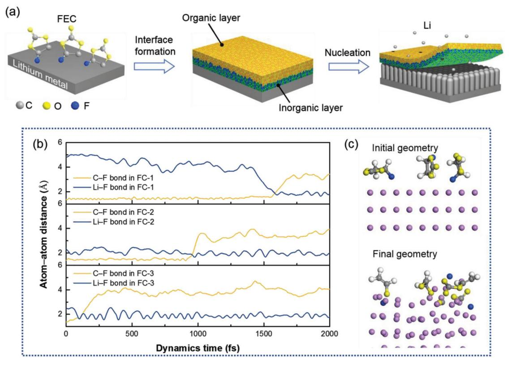
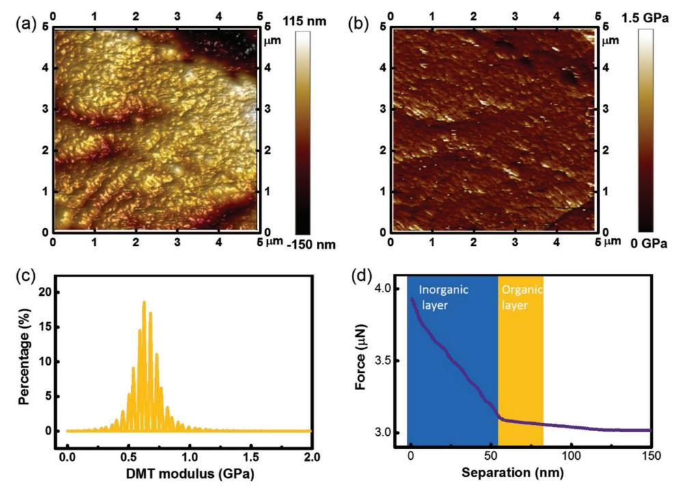
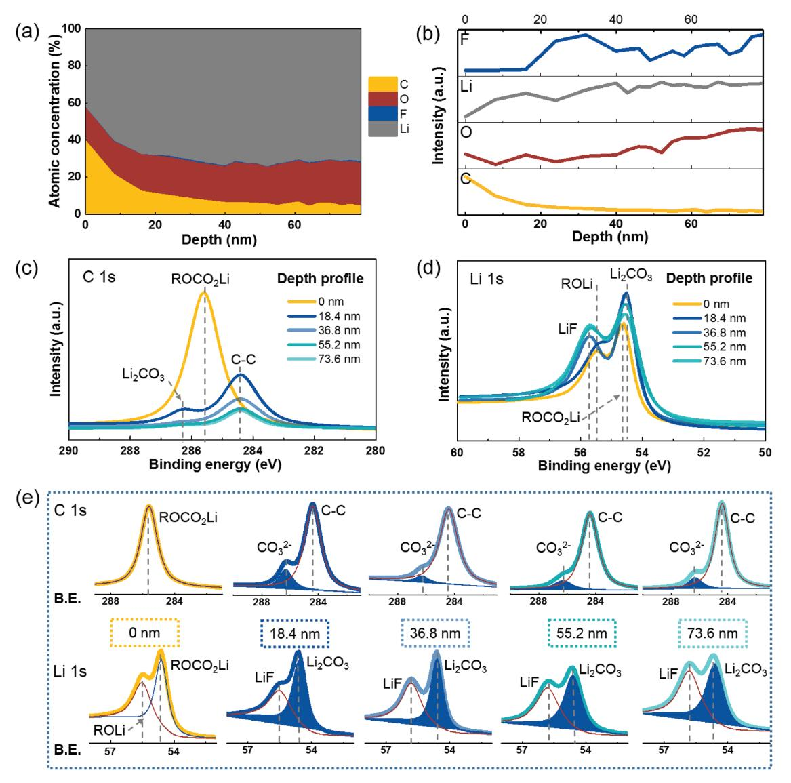
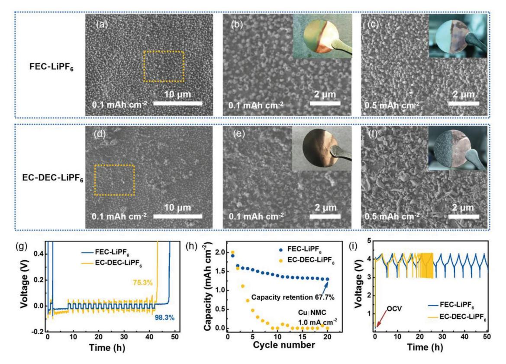
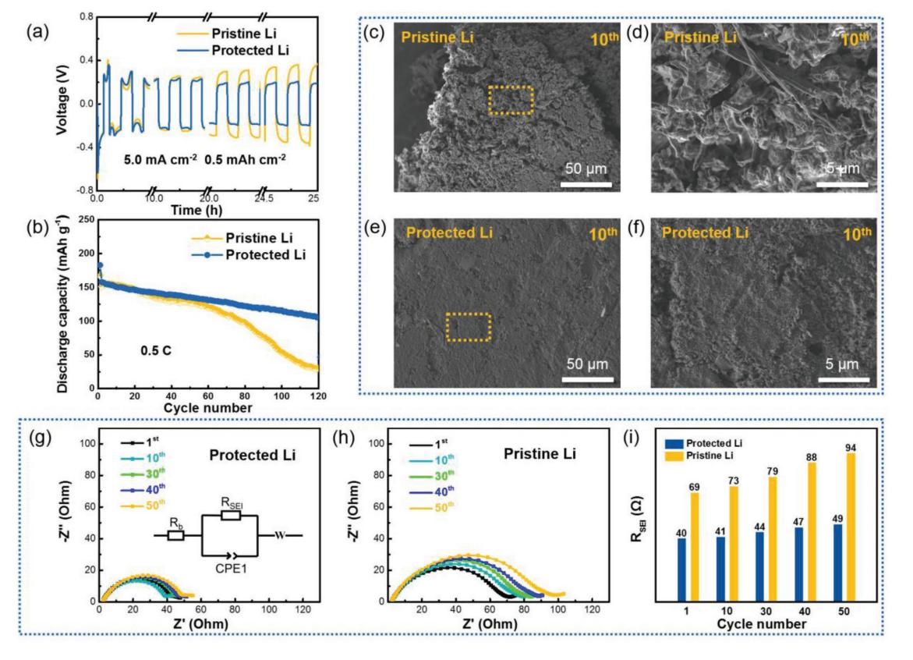

**Lithium Metal Anodes**

# **Dual-Layered Film Protected Lithium Metal Anode to Enable Dendrite-Free Lithium Deposition**

*Chong Yan, Xin-Bing Cheng, Yang Tian, Xiang Chen, Xue-Qiang Zhang, Wen-Jun Li, Jia-Qi Huang,\* and Qiang Zhang\**

**Lithium metal batteries (such as lithium–sulfur, lithium–air, solid state batteries with lithium metal anode) are highly considered as promising candidates for next-generation energy storage systems. However, the unstable interfaces between lithium anode and electrolyte definitely induce the undesired and uncontrollable growth of lithium dendrites, which results in the short-circuit and thermal runaway of the rechargeable batteries. Herein, a dual-layered film is built on a Li metal anode by the immersion of lithium plates into the fluoroethylene carbonate solvent. The ionic conductive film exhibits a compact dual-layered feature with organic components (ROCO2Li and ROLi) on the top and abundant inorganic components (Li2CO3 and LiF) in the bottom. The dual-layered interface can protect the Li metal anode from the corrosion of electrolytes and regulate the uniform deposition of Li to achieve a dendrite-free Li metal anode. This work demonstrates the concept of rational construction of dual-layered structured interfaces for safe rechargeable batteries through facile surface modification of Li metal anodes. This not only is critically helpful to comprehensively understand the functional mechanism of fluoroethylene carbonate but also affords a facile and efficient method to protect Li metal anodes.**

Battery technology is a key issue in sustainable energy conversion/storage and plays a crucial factor in limiting the development of electrical vehicles, unmanned aerial vehicles, and smart mobile devices. Among alternative types of batteries, lithium (Li) ion batteries (LIBs) have been dominating the mainstream market since 1991 due to the features of high voltage, high capacity, no memory effect, and low self-discharge rate.[1] However, the energy densities of traditional LIBs are approaching the theoretical limit, especially, the graphite anode with a small theoretical specific capacity of 372 mAh g−1 . The LIBs cannot

C. Yan, Y. Tian, Prof. J.-Q. Huang Advanced Research Institute of Multidisciplinary Science Beijing Institute of Technology Beijing 100081, China E-mail: jqhuang@bit.edu.cn C. Yan, Y. Tian School of Materials Science and Engineering Beijing Institute of Technology Beijing 100081, China

The ORCID identification number(s) for the author(s) of this article can be found under https://doi.org/10.1002/adma.201707629.

#### **DOI: 10.1002/adma.201707629**

satisfy the ever-growing demands of advanced power sources with very high energy and power densities.[2] Consequently, lithium metal batteries (LMBs; such as Li–sulfur, Li–air, and solid state batteries with lithium metal anode) are strongly considered as a potential choice for next-generation energy storage systems due to the high theoretical specific capacity (3860 mAh g−1 ) and low electrode potential (−3.04 V vs standard hydrogen electrode) of lithium metal anode.[3]

However, the practical applications of LMBs encounter two severe issues. (1) The unstable interfaces between lithium and electrolyte can induce the growth of lithium dendrites, which results in the potential short-circuit and thermal runaway of cells.[4] (2) The continuous breakup and formation of solid electrolyte interphase (SEI) film during repeated cycles consume Li metal and electrolytes, leading to capacity loss and lifespan expiration.[5] In addition, the growth of Li dendrites

commonly accompanies with the formation of "dead lithium" once breaking away from the conductive substrates,[6] which can sharply increase the polarization and voltage decay.[7] Therefore, a controllable and stable film on Li metal anode is critically indispensable for a high-capacity and long-lifespan Li metal anode in working LMBs.

Some strategies have been proposed to stabilize the working lithium metal anode by electrolyte additives,[8,9] implantable/ artificial SEI film,[10–12] high-salt-concentration electrolytes,[13,14] lithiophilic coating on the solid-state electrolytes,[15] and 3D

Dr. X.-B. Cheng, X. Chen, X.-Q. Zhang, Dr. W.-J. Li, Prof. Q. Zhang Beijing Key Laboratory of Green Chemical Reaction Engineering and Technology Department of Chemical Engineering Tsinghua University Beijing 100084, China E-mail: zhang-qiang@mails.tsinghua.edu.cn Dr. W.-J. Li Key Laboratory for Renewable Energy Beijing Key Laboratory for New Energy Materials and Devices Beijing National Laboratory for Condensed Matter Physics Institute of Physics Chinese Academy of Sciences Beijing 100190, China

nanostructured scaffolds.[16] For instance, Guo and co-workers designed an artificial uniform Li3PO4 SEI layer through in situ reaction of polyphosphoric acid with Li metal.[11] Wang and co-workers stabilized Li metal anodes by coating the Li metal surface with poly((N-2,2-dimethyl-1,3-dioxolane-4-methyl)- 5-norbornene-exo-2,3-dicarboximide).[17] These strategies afford insights into Li metal protection and achieve superior electrochemical performance. These proposed strategies mainly focus on the chemical composition of interfaces. However, beyond the formation of organic and inorganic components, constructing a film with well-designed structures is also crucial to suppress Li dendrite growth and achieve a long lifespan of LMBs.

In this contribution, a dual-layered film is constructed on Li metal anode by spontaneous reaction between Li metal and fluoroethylene carbonate (FEC) solvent. FEC is an attractive electrolyte component or additive in electrolyte solutions for it can be particularly effective in enhancing the CE and capacity retention on rechargeable Li-ion and Li metal batteries. Versatile protective films can be formed by the reduction of FEC on negative electrodes, including silicon, graphite, and lithium metal anode, etc.[18,19] The protective film is dense and robust to inhibit further parasitic reactions between electrolyte and electrode. Moreover, the as-formed interface induce a low overpotential, which benefits the reversibility of the cells.[19] Therefore, inspired by the formation of robust SEI layer in LiNi0.5Co0.2Mn0.3O2 (NCM)|Li cells with FEC additive in ester-based electrolyte,[9] herein pure FEC is explored to achieve a structured protective film on Li metal anode. The as-obtained film on Li metal anode affords a typical dual-layered structure with compact organic components (ROCO2Li and ROLi) on the top and rigid inorganic components (Li2CO3 and LiF) in the bottom. The dual-layered interface film can protect Li metal anode from the corrosion of organic electrolyte and regulate the uniform deposition of Li ions to achieve a dendrite-free Li metal anode.

As indicated in the schematic diagram shown in **Figure 1**a, a surface film with dual-layered structure is achieved on Li metal anode through spontaneous chemical reaction between Li metal and FEC. FEC decomposes in prior to routine solvents on the anode side, which has been demonstrated by the firstprinciples calculations.[9,20,21] Herein, predicted by ab initio molecular dynamics (AIMD) analysis (Figure 1b,c), pure FEC solvent undergoes decomposition reactions similar with that of FEC additive in solvents.[20] The CF bond in FEC was weaken and finally broken by the LiF interaction due to the electrostatic attraction between positive-charged Li atom and negative-charged F atom, resulting in the formation of LiF component. Specifically, the bond length of LiF in FEC-1 molecule enlarges from 1.54 to 2.09 Å when a lithium atom was absorbed to the FEC-1 molecule around 1600 ps during the AIMD simulations (Figure 1b). Subsequently, the organic composition also formed, such as CH2CHOCO2Li and CH2CHOLi. These components form and deposit on the anode surface simultaneously,

**Figure 1.** Schematic diagram of the dual-layered film formation on Li metal anode through FEC treatments. a) The organic and inorganic layers are achieved on the lithium surface by spontaneous reactions between Li metal and FEC. The dual-layered film can regulate the uniform deposition of Li ions during repeated charge/discharge cycles and protect Li metal anode without dendrite formation. b) Time evolution of the three decomposed FEC molecules during AIMD simulations. c) Initial and final geometrical structures of the three decomposed FEC molecules on Li (110) surface. The hydrogen, lithium, carbon, oxygen, and fluorine atoms are marked with white, purple, gray, yellow, and blue, respectively.

forming a mosaic morphology of this SEI film. As the organic salts possess relatively higher solubility in the FEC solvent than the inorganic components,[19,22] the dissolution of organic species into the solvent and subsequent evaporation of FEC solvent attribute to the formation of the dual-layered interface structure. Therefore, organic components tend to enrich in the outer part and inorganic parts in the inner part in the dual-layered interface structure. The dual-layered interface on Li surface is effective to uniformly arrange nucleation seeds of Li ions and induce a dendrite-free morphology during lithium plating.

Scanning electron microscope (SEM), atomic force microscope (AFM), and electrochemical properties of Li|Li symmetrical cells was employed to investigate the structure of the duallayered film. The dual-layered film achieved on Li metal after 5 h treatment in FEC demonstrated the most uniform morphology (Figure S1, Supporting Information) and stable cycling in Li|Li symmetrical cells (Figure S2, Supporting Information). The longer immersion time results in the formation of small particles and continue to polymerize into clusters. The pathway of Li ion through SEI film is blocked by these disorder structures. The topographic AFM image (**Figure 2**a) also exhibits a uniform morphology of the film. Mechanical properties of the dual-layered film are quantitatively described by the mapping of Young's modulus (Figure 2b) with an even distribution ranging from 0.3 to 1.0 GPa (Figure 2c). The dual-layered feature of the interface film is directly disclosed by depth-dependent Young's modulus profile (Figure 2d). The retracted force–distance curves exhibit two consecutive lines with different slopes. The Young's modulus of the top layer is around 0.6 GPa, corresponding to the layer of organic components.[23] Further penetration into the film reveals a high Young's modulus region of 7.0 GPa, representing the underneath inorganic layer.[11] Based on the depth profile of Young's modulus, the thickness of the organic-rich and inorganic-rich layers are determined to be ≈25 and 50 nm, respectively, confirming a dual-layer feature of the FEC-induced protected film.

To further identify the composition distribution in the duallayered film, X-ray photoelectron spectroscopy (XPS) depth profile was collected. **Figure 3**a presents the atomic concentration distribution along with the depth of SEI film. The etching depth corresponds to the standard thermal oxidation of SiO2 samples. The content of C in the SEI film drops sharply within the first 20 nm depth, and keeps stable, corresponding to the decrease of organic component content in the dual-layered interface film. With subsequent etching, the signals representing the inorganic layer became stable, as indicated by the element contents of C, F, O, and Li (Figure 3b). The detailed analysis of C 1s and Li 1s spectra (Figure 3c–e) indicated that the surface of dual-layered film mainly consists of organic components of ROCO2Li (285.7 eV in C 1s and 54.8 eV in Li 1s spectra) and ROLi (55.5 eV in Li 1s spectrum). The peak corresponding to ROCO2Li species vanishes in C 1s spectrum after full removal of the top layer (Figure 3c,e), with the appearance of peaks at 284.5 and 286.2 eV, respectively, representing CC and CO3 2−. Similarly, the major species in Li 1s spectra shifted from ROCO2Li and ROLi to LiF and Li2CO3 underneath the top layer of the dual-layered interface. In addition, both O 1s and F 1s spectra also demonstrate the depth distribution of the duallayered structure (Figures S3 and S4, Supporting Information). These results are in accordance with the AFM depth profile,

**Figure 2.** AFM topography images and Young's modulus of protected Li surface. a) The topography image of lithium surface after soaking in FEC solvents for 5 h. b) The corresponding distribution of the Young's modulus in area (a). c) The quantitative distribution of the Young's modulus about the top layer (organic layer) of the preformed SEI film in (b). d) The retracted force–distance curves of the preformed SEI film. The inflection point of slope represents the boundary datum in Young's modulus of organic and inorganic layers.

**Figure 3.** The surface chemistry of protected Li investigated by XPS. The evolution profiles of a) atomic percentages and b) relative elemental intensities along the depth directions. The XPS species in c) C 1s and d) Li 1s and XPS peak-differentiation-imitating analysis of e) C 1s and Li 1s during the different sputtering layers of the protected Li. The separation distance was 18.4 nm, calculated by the tester.

unambiguously verifying the dual-layered feature of the FECinduced film on Li metal anode.

To further probe the role of dual-layered film on the plating behavior of protected Li metal anode, the nucleation and deposition behaviors of Li in pure FEC and EC electrolytes were probed. Cu foil was used as the working electrode and the SEI layer was achieved by electrochemical decompositions. The decomposition voltage of solvent reduction is 1.2 and 0.8 V in FEC and EC solvent, respectively (Figure S5, Supporting Information). FEC can act as an effective additive in EC solvent to form a stable SEI film on lithium surface, which agrees with our previous experimental and theoretical results well.[9] The overpotential of Li nucleation in FEC solvent is lower than that of EC solvents both at initial nucleation (290 vs 610 mV) and stable deposition states (285 vs 603 mV) (Figure S6, Supporting Information). This indicates that the energy barrier of Li diffusion, nucleation, and deposition in the FEC-induced film is much smaller than that in the EC-induced film on Li metal anode.

When the deposition capacity is quantitatively set at 0.1 mAh cm−2 , dense and ordered nucleation sites form on Cu foil in FEC solvent (**Figure 4**a), and the Li deposition presents blue color in Figure 4b. As the plating capacity further increases to 0.5 mAh cm−2, uniform columnar Li crystals almost with the same heights are generated (Figure 4c). The Li deposition layer preserves the bright blue color, which generally indicates a uniform deposition behavior of columnar Li metal.[24] On the contrary, the nucleation sites form in EC solvent are mossy and disordered, showing black color with a plating capacity of 0.1 mAh cm−2 (Figure 4d,e). The irregular deposition of Li in EC solvent leads to the formation of Li dendrites at a higher plating capacity of 0.5 mAh cm−2 (Figure 4f). Combining with the structure and component features, a dual-layered **www.advancedsciencenews.com www.advmat.de**

**Figure 4.** SEM images of nucleation and growth of Li metal in FEC-LiPF6 and EC-DEC-LiPF6 electrolyte. a) FEC-LiPF6 can form the uniform nucleation sites on the surface and c) guide the homogeneous growth of lithium deposits. d) EC-DEC-LiPF6 electrolyte results in uneven nucleation sites on the surface and f) the formed lithium deposit is disordered and heterogeneous. b,e) The magnified images of marked area in (a) and (d). g) The voltage versus time plot in CE evaluation test. h) The cycling performance of Cu|NMC with LiPF6 in EC-based and FEC-based electrolytes and i) the voltage–time curves.

film formed in FEC solvent ensures the uniform nucleation and dendrite-free growth of Li metal, as well as the decreased overpotential at the initial cycles. Furthermore, the Coulombic efficiency (CE) of Li|Cu cell has been evaluated based on the Method 3 proposed by Zhang and co-workers.[25] An average CE of the cell with FEC solvent reaches 98.3% at a current density of 1.0 mA cm−2, which is much higher than that with EC solvent at 75.3% (Figure 4g). The Cu|NCM cell is also employed to confirm the stability of the dual layer during cycles as a proofof-concept (Figure 4h,i).[14] Compare to the rapid depletion of Li within 10 cycles in EC solvent, the capacity retention of the cell with FEC solvent is 67.7% after 20 cycles. The significantly improved cycling performance both in CE and Cu|NMC in FEC solvent than EC solvent demonstrate the high stability of interface enabled by the dual-layered film.

Electrochemical impedance spectroscopy (EIS) test was applied to demonstrate the stability of the interface of Li|Li symmetrical batteries, which is also an important descriptor to evaluate the self-discharge rate of Li metal anode. The protected Li with a dual-layered film maintains a stable and low impedance over time, even after a 52 h standing (186 Ω at 2 h and 174 Ω at 52 h) (Figure S7a, Supporting Information). However, the impedance of pristine Li significantly increases along with the shelving time (218 Ω at 2 h and 324 Ω at 52 h), which is attributed to the growing of passivation film through spontaneous and continuous reaction between pristine Li and corrosive electrolytes (Figure S7b, Supporting Information). Therefore, the duallayered film induced by FEC solvent on Li metal is order and thin enough to achieve lower interfacial resistance to ion migration at the electrode–electrolyte interface than routine SEI layer.[12,26] In addition, the dual-layered film is stable enough to avoid the parasitic reactions between lithium and electrolyte, leading to a stable interface impedance and an expectable reduced self-discharge rate of LMBs (Figure S7c, Supporting Information).

The long-term cycling performance of protected Li in working batteries is evaluated by Li|Li symmetrical cells at a very high areal current density. The protected Li in the symmetrical cells indicates a stable voltage–time curve, while the polarization are 360 and 590 mV on protected and pristine Li at a current density of 5.0 mA cm−2 and a capacity of 0.5 mAh cm−2 , respectively (**Figure 5**a and Figure S8, Supporting Information). Both the pristine and protected Li present similar voltage hysteresis at the beginning, indicating the gradual formation of dead Li and repeated damage and construction of SEI films are the main reasons for the eventually deteriorate of Li metal anode in EC. The Li|Li symmetrical cells were also conducted at 2.5 and 1.0 mA cm−2 (Figures S9 and S10, Supporting Information). The protected Li possesses a superior long-term cycling performance. The surface morphology of pristine Li turned into porous and loose structure after 10 cycle at a current of

**Figure 5.** Electrochemical performances of Li|Li and Li|NCM cells. a) The Li ions plating/stripping voltage curves of Li|Li cells at a current density of 5.0 mA cm−2 and capacity of 0.5 mAh cm−2. b) Cycling performance profiles of Li|NCM cells at a rate of 0.5 C and voltage window of 3.0–4.3 V, with one activation cycle initially performed at 0.1 C prior to 0.5 C cycling (1.0 C = 182 mA g−1 ). c–f) SEM images of the Li anode surface (including pristine and protected Li) after 10 cycles plating–stripping obtained from the Li|NCM cells at 0.5 C. c) The mossy dendrites of pristine Li. e) The smooth and flat dendrite-free morphology of protected Li. d,f) The magnified images of marked areas in (c) and (e). EIS plots and the equivalent circuit of g) protected Li and h) pristine Li during cycles in symmetric Li|Li cells. i) The comparison of SEI resistance (*R*SEI) of protected and pristine Li.

2.5 mA cm−2 indicates the formation of a large amount of mossy Li deposits (Figure S11a,b, Supporting Information). In comparison, the surface of the protected Li kept a smooth and flat morphology, without the formation of dendritic or dead lithium (Figure S11c,d, Supporting Information). The thickness evolution of the "reactive layer" during cycling is also investigated (Figure S12, Supporting Information). The protected reactive layer with the dual-layered film is much thinner than that of the pristine layer in both 10th and 50th cycles. Therefore, the dual-layered film can effectively prevent the electrolyte from contacting with the Li metal. The further plating/stripping of Li in symmetrical batteries exhibits a distinct difference between protected and pristine Li. The potential of pristine Li rapidly increases after 20 h and large fluctuations rise after 48 h (Figure S9, Supporting Information). The protected Li renders a stable cycling during 90 h, maintaining a much lower polarization than pristine Li.

Both protected and pristine Li anodes were paired with NCM cathodes in full cell test. Similar to the stable cycling of Li metal anode in symmetric cells, the protected Li metal anode through 5 h FEC treatment exhibits the most stable cycling in NCM|Li full cells (Figure S13, Supporting Information). Protected Li exhibits a superior capacity retention of 68.2% compared with pristine Li (19.1%) (Figure 5b) after 120 cycles. The average CE of the cell with protected Li reaches 99.5%, superior to that of cell with pristine Li at 98.1% (Figure S14, Supporting Information). The dual-layered film on protected Li can stabilize the interface and inhibit the continuous reaction between fresh Li and electrolyte, contributing to an improved CE. The pristine Li gets rapidly attenuated after 50 cycles due to the continuous generation of dead lithium. The mossy Li layer covers on the surface of active lithium and increases the migration resistance of Li ions (Figure 5c,d). The deterioration of pristine Li surface leads to the continuously rising overpotential during the prolonged cycles (Figure S15, Supporting Information). A uniform deposition of Li ions is realized and no dendrite formation is observed on dual-layered film protected Li metal anode (Figure 5e,f). In addition, protected Li with dual-layered film almost keeps stable in EIS impedance (40–49 Ω) while the pristine Li with routine SEI film exhibits a sharp increase in resistance (69–94 Ω) (Figure 5g). Therefore, the artificial dual-layered film is quite stable along with the continuous plating/stripping of lithium metal.

FEC is one of the most successful additives in LIBs and recently in LMBs. However, due to the mystery in the components and structures of the interfaces, the detailed mechanism of FEC to protect anode with long and stable cycling should be further explored. In addition, FEC additives are generally

co-adopted with other solvents, making it quite difficult to independently reveal its magical role. Herein, pure FEC was firstly applied to generate a film on Li metal anode without contribution from other solvent, salt, or additive. Attributing from the electrostatic attraction between positive-charged Li atom and negative-charged F atom, the CF bond in FEC was weaken and then broken by the LiF interaction, resulting in the formation of LiF. Subsequently, the organic composition also formed, such as CH2CHOCO2Li and CH2CHOLi. Therefore, the as-formed film present a dual-layered structure, consisting of organic components (ROLi and ROCO2Li) on the top and inorganic component (Li2CO3 and LiF) in the bottom layer. The organic components afford the flexibility and relieve the volume changes during Li plating/stripping, while the inorganic components of high mechanical modulus can suppress Li dendrite growth. Both the depositing morphology and electrochemical cycling data strongly demonstrate the role of this dual-layered SEI film in regulating Li ion nucleation and growth, and finally obtaining a long-lifespan and high-capacity LMBs. This preformed dual-layered SEI film presents a clear platform to understand the functional mechanism of FEC additives comprehensively. An effective strategy is also verified to protect Li metal anode in working LMBs.

In summary, a dual-layered film on Li metal surface was proposed to guide the dendrite-free deposition of Li metal in a working battery. A uniform and compact interface film was constructed on the Li metal surface through chemical reactions between Li metal and FEC. The surface film exhibit a dual-layered structure with organic components (ROLi and ROCO2Li) on the top layer and the inorganic substances (Li2CO3 and LiF) in the bottom layer. The organic layer contributes good flexibility to avoid damages, and inorganic Li2CO3–LiF layer guides ordered nucleation sites and suppresses the formation of lithium dendrites. The protected Li metal anode exhibits a low self-discharge rate due to the almost unchanged resistance during standing for 52 h. The protected Li presents dense and uniform surface morphology, and smaller interface polarization (360 mV for protected Li and 590 mV for pristine Li at 5.0 mA cm−2). Therefore, the lifespan can be greatly prolonged with the strategy of using Li anode with dual-layered film in Li|Li symmetrical cycles and NCM|Li cycles at different current densities. The initial dual-layered film formed on Li surface determines the nucleation and plating/stripping behavior of Li anode. The structure of surface film acts a profound role in stabilizing Li anode. A chemically defined dual-layered interface can render controllable and homogeneous deposition of Li ions and eventually realize a stable cycle-life for robust LMBs.

#### **Supporting Information**

Supporting Information is available from the Wiley Online Library or from the author.

#### **Acknowledgements**

C.Y. and X.-B.C. contributed equally to this work. This work was supported by National Key Research and Development Program (2016YFA0202500 and 2016YFA0200102), National Natural Science Foundation of China (21776019 and 21676160), and Young Elite Scientists Sponsorship Program by CAST (2015QNRC001). The authors acknowledge the support from Tsinghua National Laboratory for Information Science and Technology for theoretical simulations.

## **Conflict of Interest**

The authors declare no conflict of interest.

### **Keywords**

dendrite-free electrode, fluoroethylene carbonate, lithium fluoride, lithium metal anode, rechargeable batteries

> Received: December 31, 2017 Revised: February 14, 2018 Published online: April 20, 2018

- [1] N. Nitta, F. Wu, J. T. Lee, G. Yushin, *Mater. Today* **2015**, *18*, 252.
- [2] J. W. Choi, D. Aurbach, *Nat. Rev. Mater.* **2016**, *1*, 16013.
- [3] a) S. Xin, Z. Chang, X. Zhang, Y.-G. Guo, *Natl. Sci. Rev.* **2016**, *4*, 54; b) X. B. Cheng, R. Zhang, C. Z. Zhao, Q. Zhang, *Chem. Rev.* **2017**, *117*, 10403; c) Y. Guo, H. Li, T. Zhai, *Adv. Mater.* **2017**, *29*, 1700007; d) D. C. Lin, Y. Y. Liu, Y. Cui, *Nat. Nanotechnol.* **2017**, *12*, 194.
- [4] X. B. Cheng, H. J. Peng, J. Q. Huang, R. Zhang, C. Z. Zhao, Q. Zhang, *ACS Nano* **2015**, *9*, 6373.
- [5] a) R. Cao, W. Xu, D. Lv, J. Xiao, J.-G. Zhang, *Adv. Energy Mater.* **2015**, *5*, 1402273; b) D. Wang, W. Zhang, W. Zheng, X. Cui, T. Rojo, Q. Zhang, *Adv. Sci.* **2017**, *4*, 1600168.
- [6] a) X.-B. Cheng, C. Yan, J.-Q. Huang, P. Li, L. Zhu, L. Zhao, Y. Zhang, W. Zhu, S.-T. Yang, Q. Zhang, *Energy Storage Mater.* **2017**, *6*, 18; b) R. Zhang, N.-W. Li, X.-B. Cheng, Y.-X. Yin, Q. Zhang, Y.-G. Guo, *Adv. Sci.* **2017**, *4*, 1600445.
- [7] a) C. Yang, K. Fu, Y. Zhang, E. Hitz, L. Hu, *Adv. Mater.* **2017**, *29*, 1701169; b) X.-B. Cheng, R. Zhang, C.-Z. Zhao, F. Wei, J.-G. Zhang, Q. Zhang, *Adv. Sci.* **2016**, *3*, 1500213.
- [8] a) J. Zheng, M. H. Engelhard, D. Mei, S. Jiao, B. J. Polzin, J.-G. Zhang, W. Xu, *Nat. Energy* **2017**, *2*, 17012; b) F. Ding, W. Xu, G. L. Graff, J. Zhang, M. L. Sushko, X. Chen, Y. Shao, M. H. Engelhard, Z. Nie, J. Xiao, X. Liu, P. V. Sushko, J. Liu, J. G. Zhang, *J. Am. Chem. Soc.* **2013**, *135*, 4450; c) W. Li, H. Yao, K. Yan, G. Zheng, Z. Liang, Y. M. Chiang, Y. Cui, *Nat. Commun.* **2015**, *6*, 7436; d) C.-Z. Zhao, X.-B. Cheng, R. Zhang, H.-J. Peng, J.-Q. Huang, R. Ran, Z.-H. Huang, F. Wei, Q. Zhang, *Energy Storage Mater.* **2016**, *3*, 77; e) C. Yan, X.-B. Cheng, C.-Z. Zhao, J.-Q. Huang, S.-T. Yang, Q. Zhang, *J. Power Sources* **2016**, *327*, 212; f) X. B. Cheng, M. Q. Zhao, C. Chen, A. Pentecost, K. Maleski, T. Mathis, X. Q. Zhang, Q. Zhang, J. Jiang, Y. Gogotsi, *Nat. Commun.* **2017**, *8*, 336; g) Y. Lu, Z. Tu, L. A. Archer, *Nat. Mater.* **2014**, *13*, 961.
- [9] X.-Q. Zhang, X.-B. Cheng, X. Chen, C. Yan, Q. Zhang, *Adv. Funct. Mater.* **2017**, *27*, 1605989.
- [10] a) X. Han, Y. Gong, K. K. Fu, X. He, G. T. Hitz, J. Dai, A. Pearse, B. Liu, H. Wang, G. Rubloff, Y. Mo, V. Thangadurai, E. D. Wachsman, L. Hu, *Nat. Mater.* **2017**, *16*, 572; b) H. Ye, Y.-X. Yin, S.-F. Zhang, Y. Shi, L. Liu, X.-X. Zeng, R. Wen, Y.-G. Guo, L.-J. Wan, *Nano Energy* **2017**, *36*, 411; c) Y. Liu, D. Lin, P. Y. Yuen, K. Liu, J. Xie, R. H. Dauskardt, Y. Cui, *Adv. Mater.* **2017**, *29*, 1605531; d) D. Lin, Y. Liu, W. Chen, G. Zhou, K. Liu, B. Dunn, Y. Cui, *Nano Lett.* **2017**, *17*, 3731; e) J. Becking, A. Grobmeyer, M. Kolek, U. Rodehorst, S. Schulze, M. Winter, P. Bieker, M. C. Stan, *Adv.*

**www.advancedsciencenews.com www.advmat.de**

*Mater. Interfaces* **2017**, *4*, 1700166; f) S. Moon, H. Park, G. Yoon, M. H. Lee, K. Y. Park, K. Kang, *Chem. Mater.* **2017**, *29*, 9182; g) Z. Peng, N. Zhao, Z. G. Zhang, H. Wan, H. Lin, M. Liu, C. Shen, H. Y. He, X. X. Guo, J. G. Zhang, D. Y. Wang, *Nano Energy* **2017**, *39*, 662; h) Y. Y. Liu, D. C. Lin, P. Y. Yuen, K. Liu, J. Xie, R. H. Dauskardt, Y. Cui, *Adv. Mater.* **2017**, *29*, 1605531; i) B. Zhu, Y. Jin, X. Z. Hu, Q. H. Zheng, S. Zhang, Q. J. Wang, J. Zhu, *Adv. Mater.* **2017**, *29*, 1603755; j) X.-B. Cheng, C. Yan, X. Chen, C. Guan, J.-Q. Huang, H.-J. Peng, R. Zhang, S.-T. Yang, Q. Zhang, *Chem* **2017**, *2*, 258; k) Q. Pang, X. Liang, A. Shyamsunder, L. F. Nazar, *Joule* **2017**, *1*, 871.

- [11] N. W. Li, Y. X. Yin, C. P. Yang, Y. G. Guo, *Adv. Mater.* **2016**, *28*, 1853.
- [12] J. Zhao, L. Liao, F. Shi, T. Lei, G. Chen, A. Pei, J. Sun, K. Yan, G. Zhou, J. Xie, C. Liu, Y. Li, Z. Liang, Z. Bao, Y. Cui, *J. Am. Chem. Soc.* **2017**, *139*, 11550.
- [13] J. Qian, W. A. Henderson, W. Xu, P. Bhattacharya, M. Engelhard, O. Borodin, J. G. Zhang, *Nat. Commun.* **2015**, *6*, 6362.
- [14] J. Qian, B. D. Adams, J. Zheng, W. Xu, W. A. Henderson, J. Wang, M. E. Bowden, S. Xu, J. Hu, J.-G. Zhang, *Adv. Funct. Mater.* **2016**, *26*, 7094.
- [15] a) K. K. Fu, Y. Gong, J. Dai, A. Gong, X. Han, Y. Yao, C. Wang, Y. Wang, Y. Chen, C. Yan, Y. Li, E. D. Wachsman, L. Hu, *Proc. Natl. Acad. Sci. USA* **2016**, *113*, 7094; b) C. L. Tsai, V. Roddatis, C. Vinod Chandran, Q. Ma, S. Uhlenbruck, M. Bram, P. Heitjans, O. Guillon, *ACS Appl. Mater. Interfaces* **2016**, *8*, 10617; c) T. Hakari, M. Deguchi, K. Mitsuhara, T. Ohta, K. Saito, Y. Orikasa, Y. Uchimoto, Y. Kowada, A. Hayashi, M. Tatsumisago, *Chem. Mater.* **2017**, *29*, 4768; d) X. Zhang, T. Liu, S. Zhang, X. Huang, B. Xu, Y. Lin, B. Xu, L. Li, C. W. Nan, Y. Shen, *J. Am. Chem. Soc.* **2017**, *139*, 13779; e) C.-Z. Zhao, X.-Q. Zhang, X.-B. Cheng, R. Zhang, R. Xu, P.-Y. Chen, H.-J. Peng, J.-Q. Huang, Q. Zhang, *Proc. Natl. Acad. Sci. USA* **2017**, *114*, 11069.
- [16] a) S. Jin, Z. W. Sun, Y. L. Guo, Z. K. Qi, C. K. Guo, X. H. Kong, Y. W. Zhu, H. X. Ji, *Adv. Mater.* **2017**, *29*, 1700783; b) R. Zhang, X. B. Cheng, C. Z. Zhao, H. J. Peng, J. L. Shi, J. Q. Huang,

J. F. Wang, F. Wei, Q. Zhang, *Adv. Mater.* **2016**, *28*, 2155; c) T. T. Zuo, X. W. Wu, C. P. Yang, Y. X. Yin, H. Ye, N. W. Li, Y. G. Guo, *Adv. Mater.* **2017**, *29*, 1700389; d) R. Zhang, X. R. Chen, X. Chen, X. B. Cheng, X. Q. Zhang, C. Yan, Q. Zhang, *Angew. Chem., Int. Ed.* **2017**, *56*, 7764; e) Y. M. Sun, G. Y. Zheng, Z. W. Seh, N. Liu, S. Wang, J. Sun, H. R. Lee, Y. Cui, *Chem* **2016**, *1*, 287; f) L. Liu, Y.-X. Yin, J.-Y. Li, N.-W. Li, X.-X. Zeng, H. Ye, Y.-G. Guo, L.-J. Wan, *Joule* **2017**, *1*, 563.

- [17] Y. Gao, Y. Zhao, Y. C. Li, Q. Huang, T. E. Mallouk, D. Wang, *J. Am. Chem. Soc.* **2017**, *139*, 15288.
- [18] a) E. Markevich, G. Salitra, D. Aurbach, *ACS Energy Lett.* **2017**, *2*, 1337; b) A. Schiele, B. Breitung, T. Hatsukade, B. B. Berkes, P. Hartmann, J. Janek, T. Brezesinski, *ACS Energy Lett.* **2017**, *2*, 2228; c) Q.-C. Liu, J.-J. Xu, S. Yuan, Z.-W. Chang, D. Xu, Y.-B. Yin, L. Li, H.-X. Zhong, Y.-S. Jiang, J.-M. Yan, X.-B. Zhang, *Adv. Mater.* **2015**, *27*, 5241; d) M. Nie, D. P. Abraham, Y. Chen, A. Bose, B. L. Lucht, *J. Phys. Chem. C* **2013**, *117*, 13403; e) N. N. Sinha, J. C. Burns, J. R. Dahn, *J. Electrochem. Soc.* **2013**, *160*, A709.
- [19] E. Markevich, G. Salitra, F. Chesneau, M. Schmidt, D. Aurbach, *ACS Energy Lett.* **2017**, *2*, 1321.
- [20] J. M. Martinez de la Hoz, F. A. Soto, P. B. Balbuena, *J. Phys. Chem. C* **2015**, *119*, 7060.
- [21] F. A. Soto, Y. Ma, J. M. Martinez de la Hoz, J. M. Seminario, P. B. Balbuena, *Chem. Mater.* **2015**, *27*, 7990.
- [22] K. Xu, Y. Lam, S. S. Zhang, T. R. Jow, T. B. Curtis, *J. Phys. Chem. C* **2007**, *111*, 7411.
- [23] A. v Cresce, S. M. Russell, D. R. Baker, K. J. Gaskell, K. Xu, *Nano Lett.* **2014**, *14*, 1405.
- [24] X. Q. Zhang, X. Chen, R. Xu, X. B. Cheng, H. J. Peng, R. Zhang, J. Q. Huang, Q. Zhang, *Angew. Chem., Int. Ed.* **2017**, *56*, 14207.
- [25] B. D. Adams, J. Zheng, X. Ren, W. Xu, J.-G. Zhang, *Adv. Energy Mater.* **2017**, *7*, 1702097.
- [26] a) D. Aurbach, A. Zaban, *J. Electroanal. Chem.* **1994**, *367*, 15; b) S. Choudhury, A. Agrawal, S. Wei, E. Jeng, L. A. Archer, *Chem. Mater.* **2016**, *28*, 2147.