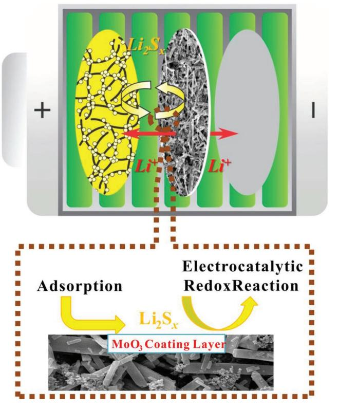
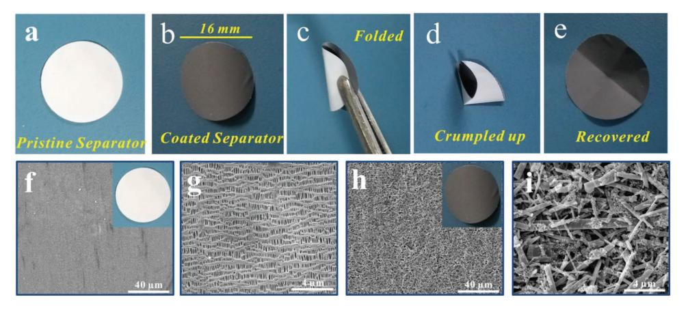
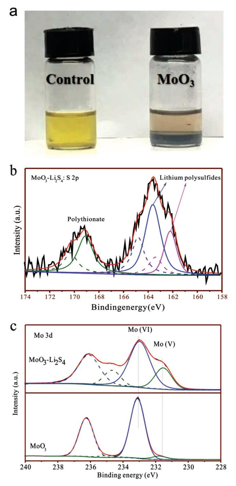
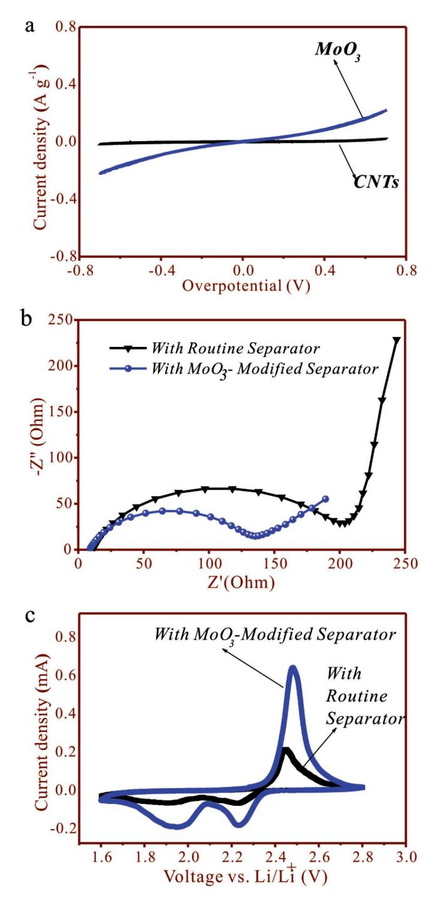
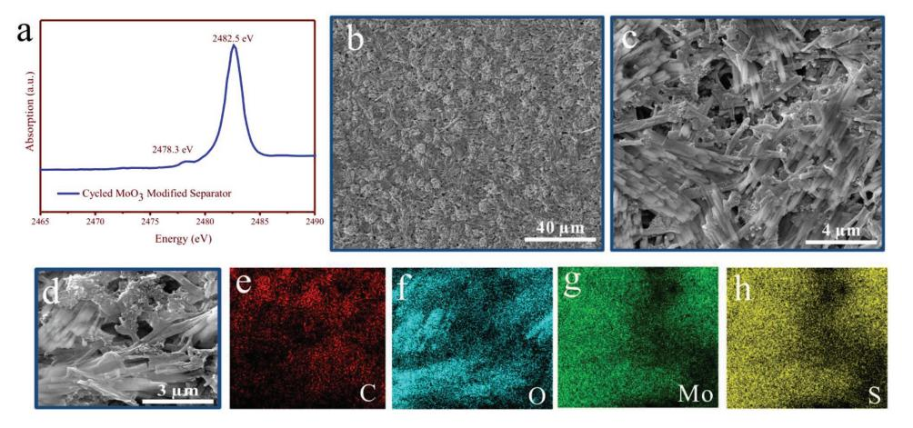
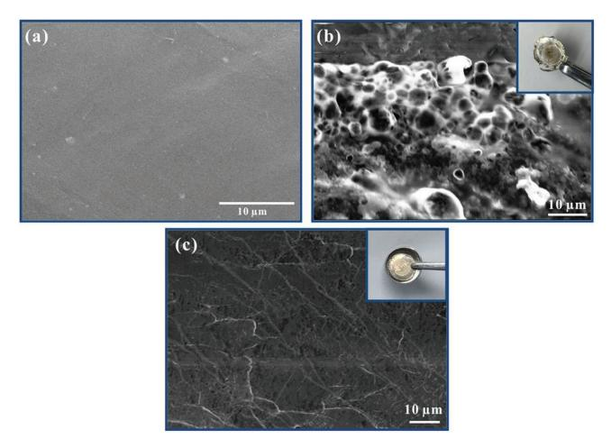

**Battery Performance**

# **Electrocatalysis on Separator Modified by Molybdenum Trioxide Nanobelts for Lithium–Sulfur Batteries**

*Sumair Imtiaz, Zahid Ali Zafar, Rameez Razaq, Dan Sun, Ying Xin, Qian Li, Zhaoliang Zhang,\* Lei Zheng, Yunhui Huang, and James A. Anderson\**

**Lithium–sulfur batteries (LSBs) have been regarded as the supreme feasible future generation energy storage system for high-energy applications due to the exceptional-specific energy density of 2600 Wh kg−1 and theoretical-specific capacity of 1675 mAh g−1 . Nevertheless, some key challenges which are linked with polysulfide shuttling and sluggish kinetics of polysulfide conversion are the main obstacles in the high electrochemical performance of LSBs. Here, a molybdenum trioxide (MoO3) nanobelt catalytic layer is fabricated on the separator to solve these issues. The MoO3 layer shows strong chemical interaction with polysulfides by successfully blocking the polysulfides on the separator from shuttling and significantly accelerates the redox reaction of polysulfide conversion. Furthermore, the randomly arranged layers of MoO3 nanobelts possess enough porous networks that provide effective space for electrolyte infiltration and facile pathway for fast ion transportation. The resultant LSBs exhibit a very high initial capacity of 1377 mAh g−1 . After 200 cycles at 0.5 C, the capacity is 684.4 mAh g−1 with the fading rate of only 0.251% per cycle. Additionally, the MoO3 modification provides good surface protection of lithium anode and depresses the lithium anode degradation.**

## **1. Introduction**

With the growing demand for the efficient usage and storage of renewable energy, research to develop advanced rechargeable batteries at an affordable cost and with high-energy density has substantially increased.[1] Accordingly, lithium–sulfur batteries (LSBs) have gained much attraction as future-generation rechargeable batteries due to the exceptional-specific energy density of 2600 Wh kg−1 and theoretical-specific capacity of 1675 mAh g−1 , which are significantly higher than those of the traditional lithium-ion batteries.[2] Regardless of the great potential, LSBs face some great challenges that hinder their commercialization. Some of the major challenges are the low active material utilization, which is a consequence of the insulating nature of orthorhombic sulfur and its discharged products, volume expansion during redox reactions, and shuttle effect that occurs due to dissolution of long-chain lithium polysulfides (Li2S*x*, 4 ≤ *x* ≤ 8) into the electrolyte, allowing the formation of insoluble, insulating Li2S2/Li2S precipitates on the surface of lithium anode and sulfur cathode. The dissolution of polysulfides

not only retards the reaction kinetics of the electrodes, but also causes low Coulombic efficiency, rapid capacity fading, and poor cycle life of the LSBs.[3] Meanwhile, the lithium is highly reactive and the gas generation during cycling also results in speedy capacity degradation of LSBs.[4]

| S. Imtiaz, Z. Ali Zafar, R. Razaq, D. Sun, Y. Xin, Q. Li, Prof. Z. Zhang | Prof. Y. Huang                                                |
|--------------------------------------------------------------------------|---------------------------------------------------------------|
| School of Chemistry and Chemical Engineering                             | School of Materials Science and Engineering                   |
| Shandong Provincial Key Laboratory of Fluorine                           | State Key Laboratory of Material Processing and Die and Mould |
| Chemistry and Chemical Materials                                         | Technology                                                    |
| University of Jinan                                                      | Huazhong University of Science and Technology                 |
| Jinan 250022, China                                                      | Wuhan, Hubei 430074, China                                    |
| E-mail: chm_zhangzl@ujn.edu.cn                                           | Prof. J. A. Anderson                                          |
| S. Imtiaz                                                                | Surface Chemistry and Catalysis Group                         |
| Faculty of Engineering                                                   | Materials and Chemical Engineering                            |
| Department of Mechanical Engineering                                     | School of Engineering                                         |
| The Hong Kong Polytechnic University                                     | University of Aberdeen                                        |
| Hung Hum, Kowloon, Hong Kong                                             | Aberdeen AB24 3UE, UK                                         |
| L. Zheng                                                                 | E-mail: j.anderson@abdn.ac.uk                                 |
| Institute of High Energy Physics                                         |                                                               |
| Chinese Academy of Sciences                                              |                                                               |
| Beijing 100049, China                                                    |                                                               |

The ORCID identification number(s) for the author(s) of this article can be found under https://doi.org/10.1002/admi.201800243.

#### **DOI: 10.1002/admi.201800243**

Tremendous effort has been made so far to overcome these critical issues, such as by the use of LiNO3 as electrolyte additive to promote the formation of solid electrolyte interface (SEI) film at anode.[5] This scheme suppresses the Li reactivity and gas generation during the charge/discharge.[4] However, it only focuses on the anode side and cannot effectively prevent the capacity degradation.[6] It is noted that various porous conductive matrices, for example, porous carbons,[7] graphenes,[8] carbon nanotubes, and[9] and nanofibers[10] were employed to infiltrate the molten sulfur. These methods of holding sulfur in a conductive matrix with the inherent porosity have alleviated volume expansion during redox reactions. However, the real Achilles' heel in LSBs, the shuttle effect as mentioned above, was not fully addressed as nonpolar carbon and polar lithium polysulfides have limited interaction. Accordingly, various polar hosts were introduced, such as functionalized carbons,[11] metal sulfides,[12] and oxides.[13,14] These polar materials offer strong chemical adsorption affinity with polysulfides, thus avoiding the polysulfide dissolution and limiting shuttle effect to a greater extent.

On the other hand, novel LSB configurations with modified/ novel separators and interlayers have gained much attention on account of their particular advantages to inhibit the polysulfide shuttling.[15] The separator is a crucial component of the LSBs, whose main function is to prevent the internal electrical connection (short circuit). As a porous membrane, the separator is an electronic insulator and maintains the lithium–ion transportation.[16] The widely used porous separators for LSBs are not sufficiently capable to prevent polysulfides diffusion through them; therefore, its modification to avoid the shuttle effect maybe an effective strategy. In addition, this novel configuration may significantly reduce production cost of LSBs.[17,18] Till now, mesoporous carbon,[17] carbon nanotubes (CNTs),[19] graphene,[20] and graphene oxides[21] have been reported. Recently, oxide materials have also gained attention because of their strong binding affinity to polysulfides. For instance, using Al2O3 [22] BaTiO3 [23] and SiO2. [19] as coating materials, the electrochemical performance of both LSBs was improved by preventing polysulfides from passing through the separator.

The aforesaid strategies only inhibit the diffusion of lithium polysulfides by physisorption or chemisorption. However, polysulfide accumulation is not only assigned to the irreversible thermodynamic diffusion but also to the slow redox kinetics of its conversion.[24] Thus, the need to accelerate the transformation of polysulfides is crucial to achieving high performance of LSBs. Several related pioneering papers have focused on the cathodes. Babu et al.[25] found that Ni or Pt coated on Al foil is catalytically active and obtained enhanced kinetics of polysulfide conversion. Al Salem et al.[26] reported a Pt/graphene composite for preferential adsorption of polysulfides and efficient electrocatalytic polysulfides redox reaction. Since then, the concept of electrocatalysis on sulfur-loading cathodes has been invoked and various metal sulfides[24,27] and transition metal dichalcogenides[28] appear as strong contenders as electrocatalysts for polysulfide redox reactions. Recently, Lin et al.[29] developed a sulfur-deficient MoS2–*x* as electrocatalyst for polysulfide conversion. The electrocatalytic layer-modified separator is also reported based on Ir-supported Ketjen black.[26] However, all these catalysts are limited to metals and metal sulfides, and it is proposed that the surface sulfur deficiencies participated in the

**Scheme 1.** A schematic of LSB with CNT/S cathode and MoO3 modified separator.

polysulfide redox reactions.[28] The development of the catalytic conversion of polysulfides is still in the early stage of research.

Here, we combined the above two strategies, separator modification and up-to-date electrocatalysis together. Therefore, an innovative concept "electrocatalysis on separator" was put forward (**Scheme 1**). In detail, the electrocatalyst that is coated on the separator is based on oxides rather than metals and sulfides. The bifunctional (chemical encapsulation and electrocatalytic conversion of polysulfides) material is α-MoO3 with a layered structure and high electrical conductivity, which has been demonstrated to be an efficient electrocatalysts in the hydrogen evolution reaction.[30] However, there is no report of its utilization as an electrocatalyst for polysulfide conversion in LSBs, let alone coating on a separator. MoO3 on separator exhibits strong chemical interaction with polysulfides by successfully blocking the polysulfides on the separator and also significantly catalyzes the redox reaction of polysulfide conversion. The resultant LSBs exhibited a very high initial capacity of 1377 mAh g−1 . After 200 cycles at 0.5 C, the capacity is 684.4 mAh g−1 with the fading rate of only 0.251% per cycle. Simultaneously, the MoO3 modified separator provided good surface protection of the lithium anode and depressed lithium anode degradation.

#### **2. Results and Discussion**

The CNT/S cathode was prepared via a solution-based process (Figure S1a, Supporting Information). The CNT is commercial product (Figure S1b, Supporting Information). After

**Figure 1.** Digital images of (a) pristine separator, (b) MoO3-coated separator, (c) folded, (d) crumpled up, and (e) recovered. SEM images of the (f,g) pristine separator, (h,i) separator coated with MoO3 catalytic layer.

S loading, orthorhombic sulfur (JCPDS 08–0247) was observed as indicated in the X-ray diffraction (XRD) patterns displayed (Figure S1b, Supporting Information), indicating that sulfur is attached to the CNT and is crystalline without the formation of any carbon–sulfur compounds during the synthesis process.[31] The thermal decomposition characteristics of the CNT/S composite from thermogravimetry analyses (TGA) revealed that the sulfur loading is 70 wt% (Figure S1c, Supporting Information), which is consistent with theoretical loading of sulfur and in good agreement with the literature for the controllability of sulfur content in composites made with this method.[31] The transmission electron microscopy (TEM) image of CNT/S composite confirmed that the clusters of sulfur nanoparticles are anchored uniformly on the CNT network (Figure S1d, Supporting Information).

The MoO3 obtained from hydrothermal method is orthorhombic α-MoO3 (JCPDS 05–0508) (Figure S2, Supporting Information).[32] Furthermore, the XRD intensities of lines due to reflections from the (020), (040), and (060) planes are much higher than others, suggesting a layered crystal structure and a highly anisotropic growth of the oxides (nanobelts, see below).[33]

#### **2.1. Morphology of MoO3-Modified Separator**

The aim of this catalytic modification of the separator is to eliminate the shuttle effect and to enhance the redox kinetics in LSBs. While suppressing shuttling, the modified separator should also be able to provide enough space for electrolyte wettability, and lithium ion transportation should not be blocked between the anode and cathode.[34] The digital images of the coated separator demonstrate that the polypropylene separator is completely coated with MoO3 (**Figure 1**a and b). The MoO3-modified separator has the ability to hold its initial shape after being fully folded or crumpled (Figure 1c-e), which suggests that MoO3 is thoroughly bound to the separator and has high mechanical strength, robust structure, and sufficient flexibility.[35,36]

The weight of MoO3 coating layer is less than the pristine separator itself, as it is only about 0.45 mg cm−2 , whereas the pristine separator has a density of 1.12 mg cm−2 , indicating that the introduction of the MoO3 coating cannot be a burden of separator. Figure 1f–i and Figure S3 in the Supporting Information show scanning electron microscopy (SEM) images of the pristine separator and the MoO3-modified separator under different magnification. The pristine separator contains slit-like porous structure of around several hundred nanometers, which allows easy penetration of electrolyte, fast lithium-ion transportation, and electronic transfer during redox reactions.[36,37] The SEM images of the coated separator clearly reveal that the latter is fully coated with the MoO3 layer and the structure of the MoO3 is like a nanobelt, consistent with XRD patterns (Figure S1b, Supporting Information) and literature.[32] The catalytic layer of the MoO3 nanobelt with Super-P particles is homogeneously distributed over the separator and bound together by polyvinylidene fluoride (PVDF) binder, which also improved the conductivity of the separator due to the excellent conductivity of MoO3. [38] The addition of small amount of Super-P is to further enhance the conductivity, whereas the PVDF is used as a binding media. This randomly arranged layer of the MoO3 nanobelt contains enough porous network to provide effective space for electrolyte infiltration and facile pathway for fast ionic transportation. This coating is expected to directly interact with polysulfides and thus inhibit the shuttling effect, and increase the overall conductivity of the separator. Furthermore, this catalytic coating will also reduce the overall resistance and improve the redox kinetics of polysulfides as discussed in the later sections. All of these advantages ultimately promote the performance of LSBs.[39]

#### **2.2. Adsorption and Electrocatalysis**

The MoO3-coated separator is anticipated to provide sufficient active sites for anchoring of polysulfide.[40] Static adsorption tests were carried out to confirm the nature of the interaction between polysulfide and MoO3. When an appropriate amount of MoO3 was added into a preprepared 10.0 × 10−3 m L−1 Li2S4 solution in 1, 3-dioxolane (DOL)/1,2-dimethoxyethane (DME), a sudden change in color was observed (**Figure 2**a), indicating that MoO3 exhibited strong adsorption capability for Li2S4 molecules. **www.advancedsciencenews.com**

**Figure 2.** a) Visualized adsorption of Li2S4 on MoO3, (b) S 2p spectrum of MoO3-Li2S4, (c) Mo 3d spectra of MoO3 and MoO3-Li2S4.

Furthermore, X-ray photoelectron spectroscopy (XPS) analysis of MoO3 after the adsorption was performed (Figure 2b,c). The S 2p spectrum of the MoO3-Li2S4 composite revealed two sulfur environments (Figure 2b). The peaks between 160 and 167 eV are assigned to lithium polysulfides (terminal and bridging sulfur species),[14,41,42] while that at 169.2 eV is attributed to the polythionate complex resulting from the oxidation of Li2S4 by MoO3, [42,43] which is clearly deduced from the presence of Mo5+

at 231.5 eV (Figure 2c).[14] In addition, the Mo6+ peak in MoO3- Li2S4 shifts to a slightly lower energy in comparison with MoO3. The two facts are the strong indicative of the chemical interaction of the MoO3 nanobelts and Li2S4, which directly enhanced retention of polysulfides by the separator and ensured the subsequent effective catalytic redox reactions of the polysulfides during cycling.

To demonstrate the latter postulation, we fabricated symmetric cells in electrolyte containing Li2S6 and compared the cyclic voltammetry (CV) in the range of −0.7 to 0.7 V for MoO3 and CNTs. As shown in **Figure 3**a, a significant increase in the current density was observed with MoO3 compared with CNTs, which demonstrated that MoO3 not only provides strong interaction with polysulfides but also enhances electrochemical reactions of lithium polysulfides, thus improving the overall reaction kinetics.[24] The catalytic electrochemical reactions of lithium polysulfides were further assessed by electrochemical impedance spectra (EIS) and CV of the LSBs. Figure 3b shows the Nyquist plots for cells with and without modified separator, in which both plots exhibit a semicircle at middle frequency region correspond to the charge transfer resistance and an inclined line at low frequency range which is related to the mass transfer process.[44] The LSB with the MoO3-modified separator shows a smaller semicircle compared with the pristine separator, suggesting that the MoO3-modified separator promotes fast electron transfer during redox reactions thus facilitating the solid–liquid/liquid–solid electrochemical reactions in LSBs.[45,46] In order to determine the consequences of the MoO3 catalytic layer on the separator, the redox reactions of LSBs with and without coated separator were performed via CV (Figure 3c). Both CV profiles show the typical reduction/oxidation behavior of polysulfides.[47] In comparison with the pristine separator, enhanced current density is achieved with the coating of MoO3 on the separator, suggesting that the reaction kinetics were improved significantly. The sharper redox peaks and larger covering area for the modified separator are also an indication of the fast redox process and high capacity.[36] Importantly, the second reduction peak corresponding to the second discharge plateau at the 2 V region, which is relatively slower and more influenced by the kinetic factors compared to the first plateau, shows a positive shift, confirming the catalytic reduction of long-chain polysulfides to Li2S.[42]

#### **2.3. Electrochemical Performance**

The electrochemical performance of LSBs was probed by galvanostatic discharging/charging in a voltage range of 1.6–2.8 versus Li/Li+. **Figure 4**a,b shows the first discharge/ charge profiles of the cells with the pristine and MoO3-modified separator at 0.2, 0.5, and 1C, respectively. Both cells show the typical voltage profiles corresponding to two-step redox reactions,[48] in accordance with the CV profiles as shown in Figure 3d. However, a more flat and stable discharge/charge voltage plateaus was observed for the cell with the MoO3-modified separator as compared with the pristine separator at all C-rates, indicative of the reversibility and improved reaction kinetics following modification.[45,49] Furthermore, the voltage plateau gaps for MoO3-modified separator are 219, 235, and 345 mV at 0.2,

**www.advancedsciencenews.com**

**Figure 3.** a) Polarization curves of symmetric cells, (b) EIS, and (c) CV of LSBs with the pristine and MoO3-modified separator.

0.5, and 1 C, respectively, whereas those for the pristine separator are 260, 300, and 370, respectively, for the same C-rates, (Figure 4c). The longer voltage plateaus and smaller voltage gap may indicate faster redox reaction kinetics and reuse of the sulfur for the modification of separator with the catalytic layer of MoO3.

The MoO3-modified separator also substantially enhances the rate performance of LSBs. Figure 4d shows the

rate performance of the cells with the pristine and MoO3-modified separator. The cell with the pristine separator shows limited utilization of sulfur at different current rates, as capacities of 707, 628, and 547 mAh g−1 were obtained at current densities of 0.2, 0.5, and 1 C, respectively. Comparatively, the cell with the MoO3-modified separator shows a higher discharge capacity of 1425.2 mAh g−1 at 0.2 C, corresponding to a remarkable sulfur utilization of 85%. When the C-rate is enhanced to 0.5 and 1 C, the modified separator still delivered discharge capacities of 1217.5 and 1074.4 mAh g−1 , respectively, much higher than those of the cell with the pristine separator. In particular, when the current density is reverted to 0.5 C, a reversible capacity of 1138.9 mAh g−1 is obtained, which is about 93.3% of the original capacity. The cycling performances of the cells with the pristine and the MoO3-modified separator were evaluated by employing a fixed current rate of 0.5 C. As shown in Figure 4e, the LSB with the MoO3-modified separator shows an initial discharge capacity of 1377 mAh g−1, corresponding to 76.5% sulfur utilization. On the other hand, the LSB with the pristine separator exhibits an initial capacity of only 614.7 mAh g−1, which was about 55.4% lower than that for the MoO3-modified separator. It is noteworthy that the fast capacity degradation occurs at the initial cycles due to sulfur deposition (Figure S4, Supporting Information). However, the capacity becomes stable later on. The capacity retention of the cell with the MoO3-modified separator is 782 and 648.4 mAh g−1 after 100 and 200 cycles, respectively, which are significantly higher than 511 and 429 mAh g−1 for the unmodified cell after the same cycle numbers. Even the capacity after 200 cycles with the modification is higher than the initial capacity of the pristine separator cell. Evidently, the Coulombic efficiency remains at almost 100% in all cycles.

Importantly, the cell still exerted Coulombic efficiency of 91% with LiNO3-free electrolyte with the MoO3 catalytic layer (Figure S5, Supporting Information), demonstrating that the MoO3-coated separator has the ability to suppress the dissolution of polysulfides. In order to fabricate high-energy LSBs, the cell was also tested with a high area loading of sulfur (2.2 mg cm−2). At current rate 1 C, the cell with MoO3-catalytic layer still shows satisfactory capacity of 780 mAh g−1 (Figure S6, Supporting Information), confirming an advantage in its compatibility with high areal loading of sulfur and improved sulfur utilization.

#### **2.4. Postmortem Analysis after Cycling**

To further investigate the effect of MoO3 catalytic modification of separator on the enhanced electrochemical performance of LSBs, postmortem analysis was carried out by running the cells at 0.5 C for 50 cycles, followed by dismantling in a glovebox. A X-ray absorption near edge structure (XANES) study was first performed on the modified separator to understand the nature of the chemical interaction between MoO3 and polysulfide intermediates. As shown in **Figure 5**a, the S K-edge XANES spectrum of the cycled MoO3-modified separator reveals a significant peak due to thiosulfate species at 2482.5 eV and a negligible shoulder at 2478.3 eV related to the characteristic peak of +4 valent S with oxygen ligands,[50] both of which arise from

**Figure 4.** Initial charge/discharge curves of cells (a) with the pristine separator, (b) with MoO3-modified separator at 0.2, 0.5, and 1 C, respectively, and (c) potential difference analysis of lithium–sulfur cells. d) The corresponding rate performance of the lithium–sulfur cells and (e) cycling performance of the cells with and without MoO3-modified separator at 0.5 C.

surface redox reactions of polysulfides on the MoO3 nanobelts, in accordance with the presence of polythionate species in XPS (Figure 2b,c). This suggested that the MoO3 catalytic layer has the ability to chemically interact with polysulfide intermediates and thus retain the soluble long-chain polysulfides at the cathode side. Furthermore, polysulfides were confirmed to combine with MoO3 by formation of surficial O*x*S*n* moieties, which may possibly act as active sites to catalyze polysulfide reduction,[37a] similar to the active unsaturated sulfur sites in reported sulfide-based electrocatalysts on cathodes.[28,29]

The SEM-energy-dispersive spectroscopy (EDS) analysis was performed for cycled separators. As shown in Figure 5b,c, the deposited material can be clearly observed on the MoO3 coating layer and within the interspaces, suggesting that the coating layer of MoO3 is a strong matrix to absorb, seize, and hold the polysulfides due to electrochemical deposition at the end of discharge/charge reactions,[51] An EDX inspection of the MoO3 modified separator after cycling clearly exhibited elemental C, O, Mo, and S on the separator (Figure 5d–h), which are uniformly distributed over the MoO3-modified separator matrix, highlighting the absorption and interception properties of the MoO3 coating.

The MoO3-modified separator also produced protective effects on the lithium metal anode. **Figure 6** shows the SEM images of the fresh lithium anode and the cycled lithium anodes with the pristine separator and MoO3-modified separator. The pristine lithium anode shows a very even and compacted surface. After 50 cycles, the lithium anode with the pristine separator presents a highly roughened surface with severe corrosion, which can be attributed to the deposits resulting from the side reaction products between the shuttled polysulfides and metallic lithium anode during the redox

**Figure 5.** a) S K-edge XANES spectra of the MoO3-modified Celgard separator after cycling, (b,c) SEM microscopic images of the MoO3-modified separator after cycling. d) Selected image for elemental mapping e–h) corresponding to C, O, Mo, and S distributions, respectively.

process.[52] In contrast, a relatively smooth and uniform surface of metallic lithium anode is observed when the MoO3-modified separator is employed, confirming surface protection of lithium anode via the modification of separator with MoO3. The entrapment of polysulfide intermediates through the MoO3-coating layer depresses the lithium anode degradation and thus protracts its lifetime.[45]

The results demonstrate that the MoO3 layer can greatly improve the performance of LSBs. The MoO3 layer on the separator demonstrates strong chemical interaction with polysulfides by successfully blocking the polysulfides, significantly accelerates the redox reaction of polysulfide conversion, and possesses enough porous networks that provide effective space for electrolyte infiltration and facile pathway for fast ion transportation. Moreover, the MoO3 modification also provides good surface protection of lithium anode and depressed the lithium anode degradation. As a result, the MoO3 modified separator shows great potential for prospective applications of Li–S batteries.

**Figure 6.** SEM images of the lithium metal anode, a) pristine, b) pristine separator after 50 cycles, and c) MoO3-modified separator after 50 cycles.

#### **3. Conclusion**

MoO3 nanobelts were prepared by a facile hydrothermal method and applied as a catalytic coating material of a separator in order to improve the performance of LSBs. The MoO3 catalytic layer exhibits strong chemical interaction with polysulfides by successfully blocking the polysulfides on the separator, and which also significantly accelerates the redox reaction of polysulfide conversion. Furthermore, the randomly arranged catalytic layers of MoO3 nanobelts provide appropriate porous networks that provide effective space for electrolyte infiltration and facile pathway for fast ion transportation. The resultant LSBs exhibited a very high initial capacity of 1377 mAh g−1. After 200 cycles at 0.5 C, the capacity is 684.4 mAh g−1 with the fading rate of only 0.251% per cycle. The initial capacity, rate, and cycle numbers are the highest, while the decay is the lowest among the similar modified systems published recently. Furthermore, the modification with MoO3 provides good surface protection of the lithium anode and depresses the lithium anode degradation, and thus protracts its lifetime. This concept of "electrocatalysis on separator" exhibits a new strategy to enhance the performance of LSBs and the importance of electrocatalysts for polysulfides redox reactions. This will also promote catalytic mechanistic studies such as active sites on metal oxides besides the widely studied metals and sulfides as sulfurloading cathodes.

### **4. Experimental Section**

*Materials*: Ammonium heptamolybdate tetrahydrate (NH4)6- Mo7O24·4H2O was purchased from Tianjin Guangcheng Chemical Reagent Co. Ltd.. Sublimed sulfur, bis(trifluoromethanesulfonyl) imide (LiTFSI), lithium nitrate (LiNO3), DME, Li2S, and DOL were obtained from Sigma-Aldrich. Nitric acid, anhydrous ethanol, Super-P, and *N*-methyl-2-pyrrolidone (NMP) were purchased from Sinopharm Chemical Reagent Company. CNTs and PVDF were received from XF Nano and Arkema Inc., respectively. All chemical reagents were used as received without any further purification.

*Preparation of Molybdenum Trioxide*: The molybdenum trioxide (MoO3) was prepared according to the procedure as reported elsewhere.[32]

Briefly, 0.4 mmol (NH4)6Mo7O24·4H2O was first dissolved in 20 mL ultrapure water with continuous stirring for 30 min at room temperature (RT) and the peroxomolybdic acid precursor solution was obtained. Second, 10 mL of HNO3 was added to this solution and followed by stirring for 30 min. After that, the mixture obtained was transferred into a 50 mL Teflon-lined stainless autoclave and was maintained at 180 °C for 20 h, and then allowed to cool to room temperature. The resultant precipitates were collected by filtration, washed thoroughly with ultrapurified water and ethanol, and finally dried in air at 70 °C in an electric oven for 24 h.

*Fabrication of MoO3-Modified Separator*: MoO3-modified separator was fabricated by direct coating of the slurry containing MoO3, Super P, and PVDF onto the commercial separator (Celgard 2300). Briefly, the slurry was prepared by mixing MoO3, Super-P, and PVDF in NMP in a weight ratio of 8: 1: 1, respectively and stirred in a sealed plastic tube for about 90 min. The obtained slurry was casted onto a Celgard separator by wet film applicator. Then, the modified separator was dried in oven at 60 °C for about 24 h. Finally, the obtained modified separator was punched into circular disks of 16 mm for using in coin cells.

*Synthesis of the CNTS/S Composite*: The pristine CNTs with outer diameter of 10–20 nm and purity of >95% were purchased from XF Nano and ultrasonically treated with HCl before use. The CNT/S composite was prepared using intensive ultrasonication[31] and the synthesis procedure was as follows. Approximately, 117 mg of sulfur was initially suspended in ≈220 mL of ethanol by using high power ultrasonication (1500 W) for 10 min. CNTs (about 50 mg) were then added in the ethanol-sulfur solution and the resulting solution was sonicated for ≈1 h. Ultra-purified (UP) water was added drop wise every 10 min during this process to allow precipitation of sulfur. The obtained mixture was then dried at about 35 °C to obtain the dried CNT/S composite for further use.

*Lithium–Sulfur Cell Assembly*: The cathodes were fabricated by slurrycoating method with wet film applicator. To prepare the slurry, the CNT/S composite, Super-P, and PVDF dissolved in NMP were mixed by using a ball-mill in a weight ratio 7:2:1, respectively. After mixing in ball mill for about 3 h, the obtained slurry was cast onto carbon-coated Al foil (0.90–1.0 mg cm−2 active material loading) and then dried at 60 °C for 24 h. The electrode films were cut into disks with a diameter of 8 mm. Coin-type (CR2025) cells were assembled in an Ar-filled glove box with a water and oxygen content of less than 1 ppm. The CNT/S cathode, MoO3 modified separator, lithium foil as anode, and nickel foam spacer were placed in a sequence into a CR2025 coin-type cell. The electrolyte employed was 1 m LiTFSI in solvent mixture of DME and DOL (1:1, v/v) with 0.2 m LiNO3 as an additive. The amount of electrolyte controlled at about 40 µL. For comparison, the coin cell with the pristine separator was also prepared. After preparation, the coin cells were left to rest for about 12 h, before testing. The charge/discharge voltage range was 1.6–2.8 V. The CV tests were performed on an electrochemistry workstation (SP-300) at a scan rate of 0.1 mV s−1 and specific capacity values were computed with respect to the mass of sulfur only. EIS measurements were conducted on SP-300 at a frequency range of 100 kHz to 100 mHz.

*Symmetrical Cell Assembly*: To study the redox kinetics of polysulfides, symmetrical cells were fabricated,[24] which were constructed using the MoO3 electrodes without addition of elemental sulfur. For electrode preparation, MoO3 and PVDF in NMP were mixed in a weight ratio of 3: 1 and stirred for about 1 h in a sealed plastic tube. The slurry obtained was then coated onto aluminum foil followed by drying at 60 °C for 24 h. The dried electrodes were then cut into circular disks of 12 mm diameter. Those electrodes were used as both working and counter electrodes for symmetrical cells, whereas the electrolyte used was 1 mol L−1 LiTFSI dissolved in DOL/DME (v/v = 1/1) containing 0.5 mol L−1 Li2S6. The Li2S6 was prepared by adding S and Li2S to the corresponding solvent at a molar ratio of 5:1. The remaining assembly was the same as that of the cell described above. CV tests were performed on SP-300 at a scan rate of 50 mV s−1 .

*Preparation of Lithium Polysulfide (Li2S4) Solution*: The 10 × 10−3 m Li2S4 solution was prepared by reacting commercial Li2S and sulfur in a 1:3 (molar ratio) in DOL and DME which was in 1:1 (v/v%). The solution was stirred for about 24 h at 60 °C.

*Characterization*: XRD patterns were recorded on a Rigaku D/max-2500/PC diffractometer employing Cu Kα radiation (λ = 1.5418 Å) operating at 50 kV and 200 mA. The surface morphology with EDS was examined by emission SEM (S-2500, Hitachi). TEM was conducted on a JEOL JEM-2010 microscope at an accelerating voltage of 200 kV. X-ray absorption fine-structure (XAFS) measurements for the S K-edge were performed on the XAFS station of Beijing synchrotron radiation facility (BSRF, Beijing, China). S K-edge (3608 eV) data were collected at the 4B7A beam line and analyzed by using IFEFFIT software package.[53] TGA was conducted on a PerkinElmer TG47 from RT to 800 °C with a heating rate of 20 K min−1 in Ar.

# **Supporting Information**

Supporting Information is available from the Wiley Online Library or from the author.

# **Acknowledgements**

This work was supported by National Natural Science Foundation of China (No. 21477046) and Key Technology R&D Program of Shandong Province (No. 2016ZDJS11A03).

# **Conflict of Interest**

The authors declare no conflict of interest.

# **Keywords**

electrocatalysis, lithium-sulfur battery, molybdenum trioxide, polysulfide shuttle

> Received: February 13, 2018 Revised: March 12, 2018 Published online: June 7, 2018

- [1] a) A. Manthiram, Y. Fu, S. H. Chung, C. Zu, Y. S. Su, *Chem. Rev.* **2014**, *114*, 11751; b) P. G. Bruce, S. A. Freunberger, L. J. Hardwick, J. M. Tarascon, *Nat. Mater.* **2012**, *11*, 19; c) Z. A. Zafar, S. Imtiaz, R. Razaq, S. Ji, T. Huang, Z. Zhang, Y. Huang, J. A. Anderson, *J. Mater. Chem. A* **2017**, *5*, 5646.
- [2] a) S. Imtiaz, J. Zhang, Z. A. Zafar, S. Ji, T. Huang, J. A. Anderson, Z. Zhang, Y. Huang, *Sci. China Mater.* **2016**, *59*, 389; b) S. Urbonaite, T. Poux, P. Novák, *Adv. Energy Mater.* **2015**, *5*, 1500118; c) L. Ma, K. E. Hendrickson, S. Wei, L. A. Archer, *Nano Today* **2015**, *4*, 315.
- [3] a) Y. Yang, G. Y. Zheng, Y. Cui, *Chem. Soc. Rev.* **2013**, *42*, 3018; b) J.-G. Wang, K. Xie, B. Wei, *Nano Energy* **2015**, *15*, 413.
- [4] A. Jozwiuk, B. B. Berkes, T. Weiß, H. Sommer, J. Janek, T. Brezesinski, *Energy Environ. Sci.* **2016**, *9*, 2603.
- [5] G. Zhou, E. Paek, G. S. Hwang, A. Manthiram, *Nat. Commun.* **2015**, *6*, 7760.
- [6] X. Li, K. Zhao, L. Zhang, Z. Ding, K. Hu, *J. Alloys Compd.* **2017**, *692*, 40.
- [7] a) Z. Li, L. X. Yuan, Z. Q. Yi, Y. M. Sun, Y. Liu, Y. Jiang, Y. Shen, Y. Xin, Z. L. Zhang, Y. H. Huang, *Adv. Energy Mater.* **2014**, *4*, 1301473; b) G. He, X. Ji, L. Nazar, *Energy Environ. Sci.* **2011**, *4*, 2878; c) S. Ji, S. Imtiaz, D. Sun, Y. Xin, Q. Li, T. Huang, Z. Zhang, Y. Huang, *Chem. - Eur. J.* **2017**, *23*, 18208.

**www.advancedsciencenews.com**

- [8] a) M. Q. Zhao, X. F. Liu, Q. Zhang, G. L. Tian, J. Q. Huang, W. Zhu, F. Wei, *ACS Nano* **2012**, *6*, 10759; b) H. Xu, Y. F. Deng, Z. C. Shi, Y. X. Qian, Y. Z. Meng, G. H. Chen, *J. Mater. Chem. A* **2013**, *1*, 15142.
- [9] a) L. Yuan, H. Yuan, X. Qiu, L. Chen, W. Zhu, *J. Power Sources* **2009**, *189*, 1141; b) X. B. Cheng, J. Q. Huang, Q. Zhang, H. J. Peng, M. Q. Zhao, F. Wei, *Nano Energy* **2014**, *4*, 65.
- [10] G. Zheng, Y. Yang, J. J. Cha, S. S. Hong, Y. Cui, *Nano Lett.* **2011**, *11*, 4462.
- [11] a) K. A. See, Y. S. Jun, J. A. Gerbec, J. K. Sprafke, F. Wudl, G. D. Stucky, R. Seshadri, *ACS Appl. Mater. Interfaces* **2014**, *6*, 10908; b) L. Ma, H. L. Zhuang, S. Wei, K. E. Hendrickson, M. S. Kim, G. Cohn, R. G. Hennig, L. A. Archer, *ACS Nano* **2016**, *10*, 1050.
- [12] S. S. Zhang, D. T. Tran, *J. Mater. Chem. A* **2016**, *4*, 4371.
- [13] a) Z. Li, J. T. Zhang, X. W. Lou, *Angew. Chem., Int. Ed.* **2015**, *54*, 12886; b) Q. Pang, D. Kundu, M. Cuisinier, L. F. Nazar, *Nat. Commun.* **2014**, *5*, 4759.
- [14] X. Liang, C. Hart, Q. Pang, A. Garsuch, T. Weiss, L. F. Nazar, *Nat. Commun.* **2015**, *6*, 5682.
- [15] a) J.-Q. Huang, Q. Zhang, F. Wei, *Energy Storage Mater.* **2015**, *1*, 127; b) M. S. Kim, L. Ma, S. Choudhury, L. A. Archer, *Adv. Mater. Interfaces* **2016**, *3*, 1600450; c) L. Ma, P. Nath, Z. Tu, M. Tikekar, L. A. Archer, *Chem. Mater.* **2016**, *28*, 5147.
- [16] J.-Q. Huang, Q. Zhang, H.-J. Peng, X.-Y. Liu, W.-Z. Qian, F. Wei, *Energy Environ. Sci.* **2014**, *7*, 347.
- [17] J. Balach, T. Jaumann, M. Klose, S. Oswald, J. Eckert, L. Giebeler, *Adv. Funct. Mater.* **2015**, *25*, 5285.
- [18] U. Stoeck, J. Balach, M. Klose, D. Wadewitz, E. Ahrens, J. Eckert, L. Giebeler, *J. Power Sources* **2016**, *309*, 76.
- [19] a) C. H. Chang, S. H. Chung, A. Manthiram, *Small* **2016**, *12*, 174; b) M. S. Kim, L. Ma, S. Choudhury, S. S. Moganty, S. Wei, L. A. Archer, *J. Mater. Chem. A* **2016**, *4*, 14709.
- [20] G. Zhou, L. Li, D. W. Wang, X. Y. Shan, S. Pei, F. Li, H. M. Cheng, *Adv. Mater.* **2015**, *27*, 641.
- [21] J. Q. Huang, T. Z. Zhuang, Q. Zhang, H. J. Peng, C. M. Chen, F. Wei, *ACS Nano* **2015**, *9*, 3002.
- [22] Z. Zhang, Y. Lai, Z. Zhang, K. Zhang, J. Li, *Electrochim. Acta* **2014**, *129*, 55.
- [23] T. Yim, S. H. Han, N. H. Park, M.-S. Park, J. H. Lee, J. Shin, J. W. Choi, Y. Jung, Y. N. Jo, J.-S. Yu, K. J. Kim, *Adv. Funct. Mater.* **2016**, *26*, 7817.
- [24] Z. Yuan, H. J. Peng, T. Z. Hou, J. Q. Huang, C. M. Chen, D. W. Wang, X. B. Cheng, F. Wei, Q. Zhang, *Nano Lett.* **2016**, *16*, 519.
- [25] G. Babu, K. Ababtain, K. Y. Ng, L. M. Arava, *Sci. Rep.* **2015**, *5*, 8763.
- [26] H. Al Salem, G. Babu, V. R. C, L. M. Arava, *J. Am. Chem. Soc.* **2015**, *137*, 11542.
- [27] G. Zhou, H. Tian, Y. Jin, X. Tao, B. Liu, R. Zhang, Z. W. Seh, D. Zhuo, Y. Liu, J. Sun, J. Zhao, C. Zu, D. S. Wu, Q. Zhang, Y. Cui, *Proc. Natl. Acad. Sci. USA* **2017**, *114*, 840.
- [28] G. Babu, N. Masurkar, H. Al Salem, L. M. R. Arava, *J. Am. Chem. Soc.* **2017**, *139*, 171.
- [29] H. Lin, L. Yang, X. Jiang, G. Li, T. Zhang, Q. Yao, G. W. Zheng, J. Y. Lee, *Energy Environ. Sci.* **2017**, *10*, 1476.

- [30] a) L. Li, T. Zhang, J. Yan, X. Cai, S. F. Liu, *Small* **2017**, *13*, 1700441; b) L. Cao, M. Skyllas-Kazacos, D.-W. Wang, *ChemElectroChem* **2017**, *4*, 1836.
- [31] J. Gong, W. Zeng, H. Zhang, *Mater. Lett.* **2015**, *154*, 170.
- [32] L. Sun, M. Li, Y. Jiang, W. Kong, K. Jiang, J. Wang, S. Fan, *Nano Lett.* **2014**, *14*, 4044.
- [33] a) C. V. Subba Reddy, E. H. Walker, S. A. Wicker, Q. L. Williams, R. R. Kalluru, *J. Solid State Chem* **2008**, *13*, 1945; b) L. Q. Mai, B. Hu, W. Chen, Y. Y. Qi, C. S. Lao, R. S. Yang, Y. Dai, Z. L. Wang, *Adv. Mater.* **2007**, *19*, 3712.
- [34] J. Zhu, C. Chen, Y. Lu, J. Zang, M. Jiang, D. Kim, X. Zhang, *Carbon* **2016**, *101*, 272.
- [35] S.-H. Chung, P. Han, R. Singhal, V. Kalra, A. Manthiram, *Adv. Energy Mater.* **2015**, *5*, 1500738.
- [36] D. Zhao, X. Qian, L. Jin, X. Yang, S. Wang, X. Shen, S. Yao, D. Rao, Y. Zhou, X. Xi, *RSC Adv.* **2016**, *6*, 13680.
- [37] H. Tang, S. Yao, X. Shen, X. Xi, K. Xiao, *Energy Technol.* **2017**, *5*, 623.
- [38] L. Zhou, L. Yang, P. Yuan, J. Zou, Y. Wu, C. Yu, *J. Phys. Chem. C* **2010**, *114*, 21868.
- [39] a) Y. S. Su, A. Manthiram, *Nat. Commun.* **2012**, *3*, 1166; b) S. H. Chung, A. Manthiram, *ChemSusChem* **2014**, *7*, 1655.
- [40] Q. Qu, T. Gao, H. Zheng, Y. Wang, X. Li, X. Li, J. Chen, Y. Han, J. Shao, H. Zheng, *Adv. Mater. Interfaces* **2015**, *2*, 1500048.
- [41] X. Wang, G. Li, J. Li, Y. Zhang, W. Ahn, A. Yu, Z. Chen, *Energy Environ. Sci.* **2016**, *9*, 2533.
- [42] X. Liang, C. Y. Kwok, F. Lodi-Marzano, Q. Pang, M. Cuisinier, H. Huang, C. J. Hart, D. Houtarde, K. Kaup, H. Sommer, T. Brezesinski, J. Janek, L. F. Nazar, *Adv. Energy Mater.* **2016**, *6*, 1501636.
- [43] R. Ponraj, A. G. Kannan, J. H. Ahn, D. W. Kim, *ACS Appl. Mater. Interfaces* **2016**, *8*, 4000.
- [44] M. V. Reddy, T. Yu, C. H. Sow, Z. X. Shen, C. T. Lim, G. V. SubbaRao, B. V. R. Chowdari, *Adv. Funct. Mater.* **2007**, *17*, 2792.
- [45] J. Balach, T. Jaumann, M. Klose, S. Oswald, J. Eckert, L. Giebeler, *J. Power Sources* **2016**, *303*, 317.
- [46] X. Li, Y. Lu, Z. Hou, W. Zhang, Y. Zhu, Y. Qian, J. Liang, Y. Qian, *ACS Appl. Mater. Interfaces* **2016**, *8*, 19550.
- [47] S. H. Chung, A. Manthiram, *Adv. Mater.* **2014**, *26*, 7352.
- [48] C. Barchasz, F. Molton, C. Duboc, J. C. Lepretre, S. Patoux, F. Alloin, *Anal. Chem.* **2012**, *84*, 3973.
- [49] J. Song, D. Su, X. Xie, X. Guo, W. Bao, G. Shao, G. Wang, *ACS Appl. Mater. Interfaces* **2016**, *8*, 29427.
- [50] a) P. Zhu, J. Song, D. Lv, D. Wang, C. Jaye, D. A. Fischer, T. Wu, Y. Chen, *J. Phys. Chem. C* **2014**, *118*, 7765; b) M. J. Morra, S. E. Fendorf, P. D. Brown, *Geochim. Cosmochim. Acta* **1997**, *61*, 683.
- [51] a) T. G. Jeong, Y. H. Moon, H. H. Chun, H. S. Kim, B. W. Cho, Y. T. Kim, *Chem. Commun.* **2013**, *49*, 11107; b) C. Zu, Y. S. Su, Y. Fu, A. Manthiram, *Phys. Chem. Chem. Phys* **2013**, *15*, 2291.
- [52] J. Zhu, Y. Ge, D. Kim, Y. Lu, C. Chen, M. Jiang, X. Zhang, *Nano Energy* **2016**, *20*, 176.
- [53] M. Newville, *J. Synchrotron Radiat.* **2001**, *8*, 322.

