**Lithium Sulfur Batteries**

safety, nontoxicity, and durability directly determine the applicability of the essential characteristics (e.g., capacity, and energy and power densities) of Li-ion batteries (LIBs) in our daily life. Thus, when safety issues such as material defects, electrolyte leakage, and combustion occur, the manifested failure can start unpredictable electrochemical effects, which might lead to cell failure or even potentially hazardous events.[6,7] Especially, as the voltage output of a cell is on the order of 1–2.5 V, many cells are operated in series to obtain voltages and power outputs in the ranges that are normally required.[7] This operation in series could cause the failure of all the cells if one of the cells is completely destroyed. As a result, appropriate methods are urgently needed to address

For the many failed mechanisms (e.g., overcharge/discharge, external/internal short circuits, thermal overload, mechanical impact, and cell internal defects), electrolyte systems containing one of the main ignition sources cause major threats and high flammability in LIBs.

# **Designing Safe Electrolyte Systems for a High-Stability Lithium–Sulfur Battery**

*Wei Chen, Tianyu Lei, Chunyang Wu, Min Deng, Chuanhui Gong, Kai Hu, Yinchang Ma, Liping Dai, Weiqiang Lv, Weidong He,\* Xuejun Liu, Jie Xiong,\* and Chenglin Yan\**

**Safety, nontoxicity, and durability directly determine the applicability of the essential characteristics of the lithium (Li)-ion battery. Particularly, for the lithium–sulfur battery, due to the low ignition temperature of sulfur, metal lithium as the anode material, and the use of flammable organic electrolytes, addressing security problems is of increased difficulty. In the past few years, two basic electrolyte systems are studied extensively to solve the notorious safety issues. One system is the conventional organic liquid electrolyte, and the other is the inorganic solid-state or quasi-solid-state composite electrolyte. Here, the recent development of engineered liquid electrolytes and design considerations for solid electrolytes in tackling these safety issues are reviewed to ensure the safety of electrolyte systems between sulfur cathode materials and the lithium-metal anode. Specifically, strategies for designing and modifying liquid electrolytes including introducing gas evolution, flame, aqueous, and dendrite-free electrolytes are proposed. Moreover, the considerations involving a high-performance Li+ conductor, air-stable Li+ conductors, and stable interface performance between the sulfur cathode and the lithium anode for developing all-solid-state electrolytes are discussed. In the end, an outlook for future directions to offer reliable electrolyte systems is presented for the development of commercially viable lithium–sulfur batteries.**

# **1. Introduction**

Among the enormous research efforts for improving the electrochemical performance of the lithium–sulfur (Li–S) battery, safety considerations directly correlated with practical applications have attracted considerable attention.[1–5] Basically,

W. Chen, T. Lei, C. Wu, M. Deng, C. Gong, K. Hu, Y. Ma, L. Dai, Prof. J. Xiong State Key Laboratory of Electronic Thin Film and Integrated Devices University of Electronic Science and Technology of China Chengdu 610054, China E-mail: jiexiong@uestc.edu.cn W. Chen, X. Liu, Prof. C. Yan Soochow Institute for Energy and Materials Innovations College of Physics Optoelectronics and Energy & Collaborative Innovation Center of Suzhou Nano Science and Technology

Soochow University

Suzhou 215006, China

E-mail: c.yan@suda.edu.cn

The ORCID identification number(s) for the author(s) of this article can be found under https://doi.org/10.1002/aenm.201702348.

**DOI: 10.1002/aenm.201702348**

For instance, in the LiFePO4 battery system, the mixture of organic solvents is highly flammable due to the low boiling points such as ethylene carbonate (boiling point: 243 °C), diethyl carbonate (127 °C), dimethyl carbonate (90 °C), and ethyl acetate (77 °C).[6] In particular, for the Li–S battery, since the classical carbonate-based electrolyte systems are incompatible

these security issues.

W. Chen, X. Liu, Prof. C. Yan Key Laboratory of Advanced Carbon Materials and Wearable Energy Technologies of Jiangsu Province Soochow University Suzhou 215006, China Dr. W. Lv, Prof. W. He School of Energy Science and Engineering University of Electronic Science and Technology of China Chengdu 610054, China E-mail: weidong.he@uestc.edu.cn

with the intermediate polysulfides (PSs), new typical electrolyte systems with lower boiling points, including 1,3-dioxolane (DOL) (75 °C) and 1,2-dimethoxymethane (DME) (42°C), are used. As a result, such security problems are increasingly serious compared with ordinary lithium-ion batteries because of the lower boiling points of the electrolyte components and the low ignition temperature of sulfur.[8,9] Moreover, the high reactivity of aprotic liquid electrolytes leads to Li formation at the porous ion-conducting solid electrolyte interphase (SEI) layer on the metal, but the spontaneously formed SEI layers on Li are typically inhomogeneous and mechanically fragile, providing nucleation sites for dendrite formation.[10] Overcharge and high-rate charge make the dangerous dendrite formation worse. Furthermore, the portion of the protruding dendrite can potentially cause a short-circuiting explosion.[10] As the two processes (dendrite formation and electrolyte loss) occur in tandem, it is a formidable challenge to create a reliable Li–S battery that operates stably and safely.[3,11,12]

In the past few years, two basic types of electrolyte systems have been studied to solve the notorious safety issues associated with cycling metallic lithium for deployment of reliable, safe, and long-life Li–S batteries. One system is the conventional organic liquid electrolyte,[13–15] and the other system is an inorganic solid-state or quasi-solid-state composite electrolyte.[16–20] Both the liquid and solid electrolytes have been designed and explored extensively for highly safe Li–S batteries.[21] Therefore, in this review, we present an overview of the recent development of engineered liquid electrolytes including flammability, thermal failure, explosion, acute toxicity, and dendrite-inherent problems. In addition, solid electrolytes containing a designed high-performance Li+ conductor, air-stable Li+ conductors at ambient environment, a stable interface between the cathode and the electrolyte, and a stable interface between the Li anode and the electrolyte are discussed symmetrically. Finally, we present an outlook on future directions to offer reliable electrolyte systems for the development of commercially viable Li–S batteries.

# **2. Electrochemical Redox of Sulfur Cathode in a Liquid Electrolyte**

Sulfur has been regarded as one of the potential alternative cathode materials in LIBs against an Li metal anode due to the high theoretical specific capacity (1675 mA h g−1), high energy density (2600 Wh kg−1), low cost, and environmentally friendliness.[1,9,11,12,22] The typical Li–S battery framework contains a sulfur cathode, a metal lithium anode, and ether-type electrolytes (such as DOL/DME, tetraethyleneglycol dimethyl ether, or tetraglyme) containing ≈1 m of the Li salt lithium bis(trifluoromethanesulfonyl) imide (LiTFSI).[23] The Li–S electrochemistry is more complex than the electrochemistry of other conversion reactions, and the transformation between S and Li2S involves a multistep reaction.[9] In recent years, the transfer process has been investigated via a series of advanced in situ technologies such as ultraviolet– visible spectroscopy (UV–vis),[24–26] X-ray diffraction,[27–30] transmission electron microscopy (TEM),[30] operando X-ray absorption spectroscopy,[31] and X-ray photoelectron

**Weidong He** is a Professor at the University of Electronic Science and Technology of China, leading a group of researchers working on synthesis, property analysis and theoretical simulations of energy materials for batteries and fuel cells. He received his Ph.D. degree in Materials Science from Vanderbilt University in 2012. He then

went to Pacific Northwest National Laboratory for his postdoctoral research.

**Jie Xiong** is a full Professor at the University of Electronic Science and Technology of China (UESTC). He received his Ph.D. degree in materials physics and chemistry from UESTC in 2007, and went to Los Alamos National Laboratory for his postdoctoral research from 2009 to 2011. His research interests have focused on the

synthesis–structure–property–mechanism of functional nanomaterials and energy materials and their applications in energy science, electronics, and optoelectronics. He has been elected as the New Century Excellent Talent of Ministry of Education (2013), Sichuan Distinguished Young Scholars (2014), and Distinguished Professor of Sichuan "1000 talent plan" (2014).

**Chenglin Yan** is a full Professor at Soochow University and executive director of key laboratory of advanced carbon materials and wearable energy technology in Suzhou, China. He received his Ph.D. from Dalian University of Technology in 2008. In 2011, he became a staff scientist and a group leader at

the Institute for Integrative Nanoscience at the Leibniz Institute in Dresden.

spectroscopy (XPS).[9] The electrochemical reaction of the discharge process in nonaqueous electrolytes is briefly described as follows (**Figure 1**): (1) at the higher plateau of ≈2.4 V, plenty of long/middle-length-chain PSs (Li2S*n*, *n* ≥ 4) are formed due to the reduction of S, and long/middlelength-chain PSs are highly soluble and form dissolution regions; (2) at the second plateau region, middle-length

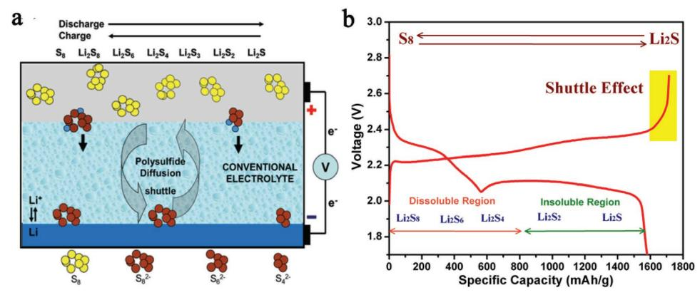

Figure 1. a) Polysulfide shuttle reactions in Li-S battery. Reproduced with permission.[28] Copyright 2013, Wiley-VCH. b) Typical charge-discharge curves of Li–S cell with 1 M LiTFSI in the mixture of DOL and DME (1:1  $v/v$ ).

chain PSs and Li2S are present at the low-potential plateau to release a capacity of  $\approx 1256$  mA h g-1.[9] However, the easy shuttling of Li2Sn ( $n \ge 4$ ) in many aprotic electrolytes driven by a concentration gradient was a big problem,[11] and the aprotic electrolytes could reach the surface of the Li metal negative electrode.[11] A chemical redox reaction  $[(x-1) Li_2S_x + 2Li \rightarrow xLi_2S_{x-1}]$  and an electrochemical reduction  $[(x - 1) \text{Li}_2S_x + 2\text{Li}^+ + 2\text{e}^- \rightarrow x\text{Li}_2S_{x-1}]$  occurred at the surface of the lithium anode where the long-chain PSs were reduced to shorter-chain PSs.[32] Insoluble shorter-chain PSs  $(Li_2S/Li_2S_2)$  tend to precipitate on the lithium metal surface and passivate the anode,  $[33-35]$  leading to both material loss and increased impedance.[36] The soluble PSs that move back to the cathode parts are reoxidized to long-chain PSs, resulting in the internal shuttle phenomenon[34] and causing the significantly prolonged charging process, rendering a low Coulombic efficiency (discharge capacity/charge capacity, usually below 80%) and a high self-discharge rate for longterm storage (Figure 1b).[37-39] The main failing mechanism, called the "shuttle effect," of PSs caused the cyclic stability of the Li-S battery to drop sharply. In the reverse reaction process of the charging process, catalysis of the decomposition of Li2S and oxidization of Li2S to Li2Sn ( $n = 2$ , 4, and 6) and finally to  $Li_2S_8$  or  $S_8$  was followed by two plateau regions at  $\approx 2.1$  and  $\approx 2.3$  V.[40] However, the "shuttle effect" of PSs causes the cyclic instability of the Li-S battery. In recent years, tremendous efforts have been employed in Li-S batteries to suppress the "shuttle effect" by designing different sulfur host materials,[35,41-43] functional-modified carbon materials,[44-49] polar binders,[24,50-55] sandwich structure interlayers,[56-58] multifunctional separators,[59-63] and robust Li anodes.[1] For instance, some articles have reported that a more than 500 cycle capacity retention of 80% could be achieved by suppressing the "shuttle effect."[49,64-67] High sulfur loading is reported compared with the practical level of 3-5 mg cm-2.[68-70] In particular, Manthiram and coworkers reported a sulfur cathode with a sulfur loading of 61.4 mg cm-2 and a sulfur content of 80 wt%,[71] showing remarkable areal, volumetric, and gravimetric capacities simultaneously. These studies have demonstrated the huge achievements in the Li-S battery.[8,28]

# 3. Advanced Modification in Liquid Electrolyte **System for Achieving Reliable Li–S Battery**

# 3.1. Gas Evolution of Li-S Battery in Liquid Electrolytes

In the Li-S battery system, lithium metal was used as the ideal anode because it has a high theoretical specific capacity and a low redox potential.[72] However, the commonly used electrolytes in the Li-S battery are a mixture of DOL and DME or an electrolyte of longer-chain glymes.[13] The Li metal anode is strongly reducing and is incompatible with the electrolytes. For instance, Aurbach et al. found that LixNOy and  $Li_xSO_y$  species exist on the lithium surface by investigating the decomposition products of the DOL/LiTFSI electrolyte using Fourier transform infrared (FTIR) spectroscopy and XPS.[73] Therefore, since  $Li_vNO_v$  and  $Li_vSO_v$  species decompose the ethereal electrolyte solvent, gas evolution occurs, leading to the production of a large internal pressure of the battery or even the risk of explosion. To study the gassing processes, Brezesinski and co-workers investigated the critical role of gas evolution by an in situ Li–S battery using a diglyme/LiTFSI electrolyte.[74] They indirectly reflected the generation of gas by measuring changes in the internal pressure of the battery.[75] They found that for the electrolyte without LiNO3, the pressure increases significantly with time, and an increase of 40 mbar (dead volume of  $\approx$ 24 mL) corresponding to a gas volume of  $\approx$  220 µL was observed after eight cycles with a linear increase rate of 1.5 mbar  $h^{-1}$ . The authors also confirmed that those gaseous species were mainly  $H_2$ and CH4 based on mass spectrometry and FTIR spectroscopy. For the generation of  $H_2$ , the authors proposed two reasons: the remaining traces of H2O in electrolyte and a decomposition product of the diglyme electrolyte. Similarly,  $CH_4$  is most likely generated from the reaction of the electrolyte with the metal lithium anode from the methyl group of diglyme. With  $LiNO3$  as the stabilizing additive in the electrolyte, little pressure increase was observed. Although the Li-S battery with  $LiNO3$  involves a small amount of  $N2$  and  $N2O$  in addition to  $CH_4$  and  $H_2$  (Figure 2), the suppression of gas generation by LiNO3 is probably related to the stable SEI formed on the lithium anode. Moreover, the suppression of the polysulfide

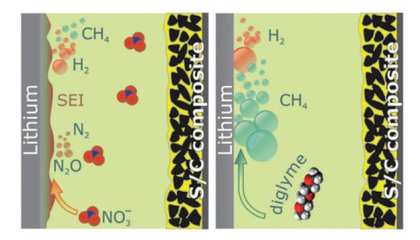

**Figure 2.** Gas evolution of Li–S battery with (left) and without (right) LiNO3. Reproduced with permission.[74] Copyright 2016, the authors, published under a CC-BY-3.0 license.

shuttle and the gases (N2 and N2O) are consumed and possibly built into the SEI. Evolution of H2S and SO2 was also observed with LiNO3 addition, which could be related to traces of H2O. Therefore, from these studies of gas evolution, it seems that LiNO3 or other suitable additions in the electrolyte to form a strong SEI structure are beneficial to decrease the risk of internal pressure by blocking the violent reactions of metal lithium and the electrolyte and increasing the safety of the Li–S battery.

### **3.2. Flammability and Thermal Failure of Organic Electrolyte**

#### *3.2.1. Inherently Nonflammable Electrolytes*

**Figure 3** shows the heat generation process and related mean surface temperature measurement of the failed cells at high temperature.[76] To eliminate the flammability of solvents and to address these issues, flame-retardant additives and inherently nonflammable electrolytes such as phosphates, phosphides, phosphazenes, and fluorinated ethers,[77] solid-state electrolytes, or ionic liquids were studied.[78–81] Among those inherently nonflammable electrolytes, Wang and co-workers[82–84] reported a series of safe Li–S batteries based on pyrolyzed polyacrylonitrile (pPAN) and sulfur (pPAN@S) cathode and nonflammable electrolytes (such as dimethyl methylphosphonate,[82] triphenyl phosphite,[83] and tris (2,2,2-trifluoroethyl) phosphite (TTFP)[84]). As shown in **Figure 4**a,b, pPAN is generally classified as a flammable textile material because of its low limited oxygen index value of ≈18%. Furthermore, they confirmed the nonflammable effect of TTFP by flame tests. The combustion of the blank electrolyte (Figure 4a) lasts for 14 s as a comparison. The addition of TTFP results in the mixed electrolyte being nonflammable. They further resolved the self-extinguishing time (SET) and ionic conductivity of the electrolyte to study the influence of TTFP in the mixed electrolyte (Figure 4b). However, a linear decrease in the conductivity with increasing TTFP content was exhibited. Importantly, the nonflammable Li–S battery using

**Figure 3.** Cell failure: a) heat generation process at a high temperature. Reproduced with permission.[76] Copyright 2007, Elsevier. b,c) Temperature measurement of mean surface temperature profiles of the three regions (shown in the thermal image) of different cell capacities for 2.6 and 2.2 Ah, respectively. Reproduced with permission.[7] Copyright 2015, the authors, published under CC-BY-4.0 license.

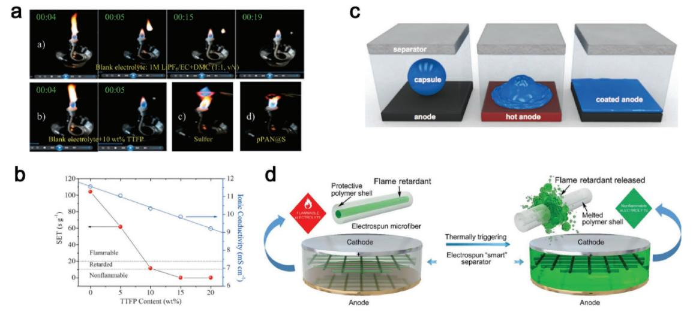

**Figure 4.** a) Flame tests and the effect of TTFP on the self-extinguishing time. b) SET and conductivity of the electrolytes with different TTFP contents. Reproduced with permission.[84] Copyright 2014, Wiley-VCH. c) Schematic representation of microsphere-based shutdown concept for Li-ion batteries. Reproduced with permission.[85] Copyright 2012, Wiley-VCH. d) Schematic of the "smart" electrospun separator with thermal-triggered flame-retardant properties for lithium-ion batteries. Reproduced with permission.[86] Copyright 2017, the authors, published under CC-BY-4.0 license.

flame-inhibiting carbonate electrolytes derived from the addition of TTFP and a pPAN@S composite cathode maintained extremely stable electrochemical activity over 750 cycles.

#### *3.2.2. Autonomic Shutdown Additions*

To prevent catastrophic thermal failure inside cells, the autonomic shutdown additions were designed to mediate the thermal failure performance in liquid electrolytes when operating temperature exceeded a critical value. The working mechanism of autonomic shutdown additions is usually by incorporating thermoresponsive polymer microspheres onto the battery cathode, separators, or anodes.[85] As shown in Figure 4c, White and co-workers employed polyethylene (PE) microspheres and paraffin microspheres as autonomic shutdown additions.[85] When the triggering temperature reached 110 °C (PE) or 65 °C (paraffin), the shutdown materials would prevent further battery operation by wetting the interface of the lithium anode and providing an ion-insulating barrier. Similarly, flame-retardant separators are also considered to be a promising approach to hinder thermal runaway for the safety of lithium-ion batteries.[85,86] In general, the melting temperature of the polypropylene (PP) separator that was widely used in the Li–S battery was 165 °C.[87] However, there was a risk for battery fire when the local hot spot was generated.[86] Thus, Lee and co-workers reported a flexible/functional porous ceramic membrane as the separator beyond polymeric battery separators to improve both thermal/dimensional tolerance and mechanical flexibility in the lithium-ion battery.[88] The ceramic membranes show no thermal shrinkage at 150 °C for 0.5 h. At high-temperature cycling performance (60 °C), the cell incorporating the ceramic separator can retain ≈94% capacity after 100 cycles. In contrast, the cell incorporating the PE separator (the melting temperature at 130 °C) presented a sharp decay to approach zero after 60 cycles. In the research addressing flame-retardant separators, the separator consisting of a PE–PP bilayer or a PP–PE–PP trilayer structure is another shutdown separator.[89] Recently, Cui and co-workers demonstrated a novel method by designing a core–shell microfiber separator with flame-retardant materials (e.g., triphenyl phosphate) as core and polymer (e.g., poly(vinylidene fluoride–hexafluoropropylene), the melting point is ≈160 °C) as shell (Figure 4d).[86] These studies provided a light strategy for the flame-retardant separator with no decreased ionic conductivity for liquid electrolytes for the development of safe Li-ion batteries.

# *3.2.3. Alternative Materials to Improve the Safety*

In addition to autonomic shutdown additions, alternative cathode materials such as smart cathode materials and thermaltriggered separators were also studied. Bao and co-workers demonstrated a fast and reversible thermoresponsive polymer switching (TRPS) for a safe battery (**Figure 5**).[90] The schematic concept of a safe battery design is as follows. First, a temperature-sensitive polymer (TRPS layer) forms a high-thermalexpansion-coefficient polymer filled with nanostructured metal particles (Figure 5b,c). Then, one or two current collectors are coated with a thin TRPS layer, which operates normally below the switching temperature (*T*s). However, once the operating temperature is above *T*s, the resistance of TRPS will instantaneously increase, and the battery will shut down. After cooling, the TRPS layer reverts to its original state (Figure 5d). As a result, the battery structure can be protected without damage and can be repeatedly shut down. They maintained that this design of the TRPS layer can endure a highly reversible shutdown process and that the safe battery could deliver a stable capacity at 25 °C, whereas the cycling capacity dropped to almost zero at the high temperature of 70 °C. Safe batteries with this TRPS material show excellent battery performance, which suggests a design for a reliable, fast, and reversible pathway for

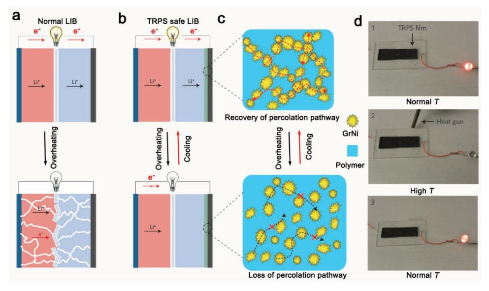

Figure 5. Schematic illustration of safe battery design. a) A normal LIB. b) The safe battery has one or two current collectors coated with a thin TRPS layer. c) Thermal switching mechanism of the TRPS material. d) Demonstration of thermal switching behavior of a TRPS film using an light emitting diode (LED) connected in the circuit. The symbol (x) illustrates blocking of electron or ion transport. Reproduced with permission.[90] Copyright 2016, Nature Publishing Group.

achieving high battery performance and battery safety. The commercial Li-ion batteries are equipped with positive temperature coefficient (PTC) resistors on their cases that aim to prevent overpressure and overheating.[91,92] However, the time for the temperature to increase inside cells can occur at much higher speeds than the speed that can be detected by PTC resistors.[91] Thus, the PTC-modified current collector is usually a promising approach for internal safety strategies in preventing thermal runaway owing to their simplicity and reversible operation. In addition, a switching cathode material synthesized with active material and temperature-sensitive material is another main method to improve cycling performance at ambient temperatures.[93] For example, Ai and co-workers[94] reported a new temperature-sensitive cathode of poly(3-decylthiophene)-coated  $\text{LiCoO}_2$  particles showing the shutdown function at an elevated temperature of 110  $^{\circ}$ C.

# **3.3. Aqueous Electrolytes Used in the Lithium–Sulfur Battery**

Due to the high flammability of DME and DOL, the Li-S batteries may face terrible safety hazards when unpredictable disasters (e.g., damage and electrolyte leakage) occur. Therefore, an aqueous Li-S battery was proposed to improve the safety problem since a noncombustible aqueous electrolyte was used in this system.[95-97] Additionally, two advantages of the aqueous electrolyte over the organic electrolyte for the Li–S battery are as follows: (I) the solid-state phases of insoluble  $Li_2S_2$  and  $Li_2S$  in organic electrolytes do not exist in the aqueous electrolyte, and the nonconductive solids precipitating on the composite matrix were overcome;[95] and (II) the ionic conductivity of the aqueous electrolyte is approximately two orders of magnitude higher than the conductivity of the organic electrolytes.[96] However, two issues need to be overcome for the future use of aqueous

electrolytes. (I) The thermodynamic stability window (1.23 V) of water is too low for use in the Li-S battery, resulting in lower energy density.[96] As shown in **Figure 6a**, the energy density shifts with pH at  $0.059$  V per pH unit. Fortunately, the thermodynamic stability window in practical applications is well related to active materials (such as sulfur at  $\approx$ 2.2–2.3 V) above its thermodynamic limits (Figure 6b). (II) The electrochemical redox reaction of sulfur is different compared to that of organic electrolytes.[98,99] Therefore, the electrochemical redox reaction of the aqueous Li–S battery should be considered.[100–102]

The first report of solid sulfur as a cathode material for aqueous batteries was presented in 1993 by Peramunage and Licht.[99] They showed a different electrochemical reaction of the sulfur phenomenon in an aqueous electrolyte in which three main chemical species are formed,  $H_2S(aq)$ ,  $HS^-$ , and  $S_x^{2-}$ , and determined by the pH as follows: S + H2O + 2e-  $\Leftrightarrow$  $5HS^-$  + OH-. They also found that the redox reaction process in aqueous aluminum/sulfur batteries was different from an organic electrolyte as follows:  $2Al + S_4^{2-} + 2OH^- +$  $4H_2O \Leftrightarrow 2Al(OH)_3 + 4HS^-$ . However, the progress invested in the aqueous Li-S battery was not further improved until Zheng et al.[97] in 2013. According to Zheng et al.'s research, the discharge product of sulfur ( $HS^-$ ) is also soluble, similar to PSs in the organic electrolyte. Thus, they proposed that the positively charged polypyrrole (PPy) framework can restrain HS- ions from diffusing into the electrolyte and is also highly reversible and stable. In contrast, when PPy was replaced with activated carbon, the new S@AC composite inhibited a poor reversibility of the electrode reaction because the highly porous structure of activated carbon cannot confine the discharge product of sulfur (HS-) into the electrode. Similarly, Tarascon et al.[96] reported an Li-ion/polysulfide cell configuration with  $0.5$  M of Li2SO4-containing electrolyte that offers a stable cycling profile over 100 cycles with a faster C-regime.

DVANCED

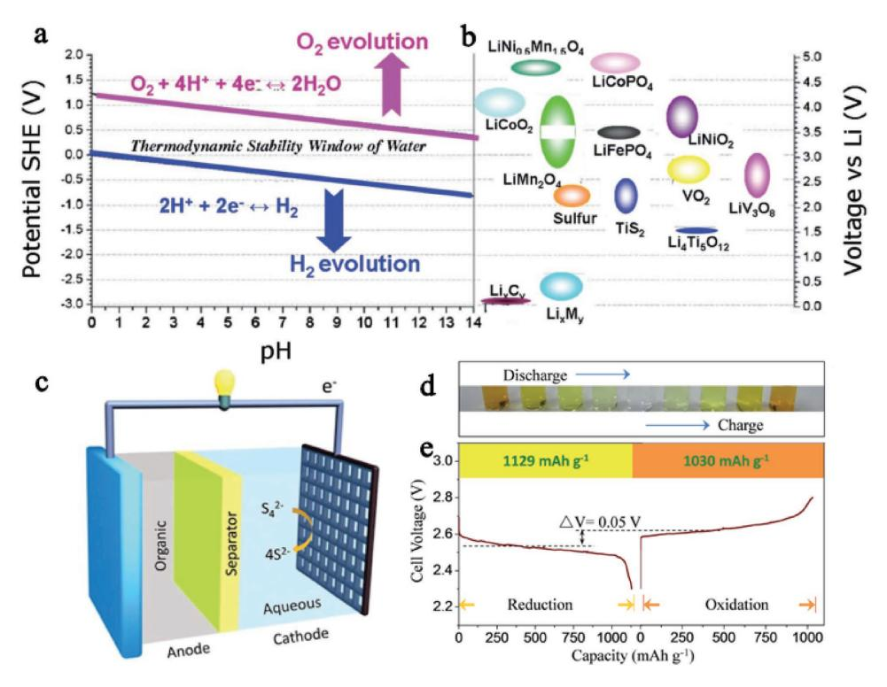

Figure 6. a,b) Thermodynamic stability window of water together with several electrode materials in lithium-ion batteries. Reproduced with permission.[96] Copyright 2014, Royal Society of Chemistry. c) Schematic of an aqueous dissolved  $S_4^{2-}/S^{2-}$  cathode for lithium–sulfur batteries. d) An image of color gradients of the Li2S4/Li2S electrolyte, from ye aqueous lithium-polysulfide battery using 0.1 M Li2S4 solution at 0.2 mA cm-2. Reproduced with permission.[95] Copyright 2014, Royal Society of Chemistry.

For further study of the aqueous Li-S battery, Zhou and coworkers[95] first demonstrated a reversible specific capacity of up to 1030 mA h  $g^{-1}$  with a discharge potential of 2.53 V versus  $Li^+/Li$  for Li–S batteries with an aqueous dissolved polysulfide cathode. As shown in Figure 6c, they produced a catholyte-type cell that has two significant advantages: (I) although negligible volume expansion occurred, rapid interfacial reactions can generate high capacities and rate capabilities due to the highly soluble polysulfide species and solid reduction products in aqueous electrolytes, and (II) low viscosity of the aqueous electrolyte can result in easy circulation in the flow-through configuration at room temperature. However, the redox potential of the  $S_4^{2-}/S^{2-}$  couple ( $\approx$ 2.53 V vs Li+/Li) is close to the hydrogen evolution reaction (HER) of water, as shown in Figure 6a,b, so the electrolysis of water needs to be considered. The authors demonstrated that adding 0.2 M of LiOH in the catholyte could effectively reduce the HER potential to 2.08 V. Therefore, they set the cutoff voltage at  $2.3$  V to preclude the possibility of the  $H_2$  evolution reaction. Figure 6d shows the color change of the reversible redox reaction of the  $S_4^{2-}/S^{2-}$  couple in this aqueous solution. The yellow color  $(S_4^{2-})$  is gradually transformed into transparent  $(S^{2-})$  with the discharge proceeding and then transferred back to yellow  $(S_4^{2-})$  after charging. Furthermore, Figure 6e shows the initial galvanostatic cycles with a single voltage plateau of both the discharge and charge voltage profiles. The battery exhibits high discharge- and charge-specific capacities (based on the Li2S4 active mass within the catholyte) of 1129 mA h g-1 ( $\approx$ 99.7% of theoretical specific capacity) and

1030 mA h  $g^{-1}$ , respectively. The plateau shows a small gap  $(0.05 \text{ V})$ , indicating a higher oxidation energy barrier for S2- oxidation to  $S_4^{2-}$ . Furthermore, due to the high plateau voltage  $(2.5-2.7 \text{ V} \text{ vs } \text{Li}^{\dagger}/\text{Li})$  as well as the high discharge capacity, the advantages of the aqueous Li-S battery are promising higher energy densities than conventional aqueous Li-ion batteries. For instance, the authors obtained a high energy density of  $\approx$ 654 Wh kg-1 by increasing the concentration of the catholyte using a saturated aqueous  $Li_2S_4$  saturated electrolyte.[95] Although the aqueous Li-S battery represents a new promising and safe avenue toward future development of large-scale energy storage, a few articles to date have reported the optimization of important parameters such as electrode design and temperature to receive significant performance improvements.

**ENFRG** 

www.advenergymat.de

# 3.4. Addressing Dendrite-Inherent Problems in **Liquid Electrolytes**

Dendrite formation on the lithium surface is difficult to avoid in Li–S batteries since metal lithium has a low negative electrochemical potential  $(-3.04$  V vs standard hydrogen potential (SHE)).[103-105] The formation mechanism of Li dendrites is described by several models such as the SEI model,[103] the phase-field model,[106] the deposition/dissolution model,[107] and the charge-induced growth model.[108] Cui and coworkers[109] experimentally studied the morphology of lithium in the early stages of nucleation. They showed that the size of

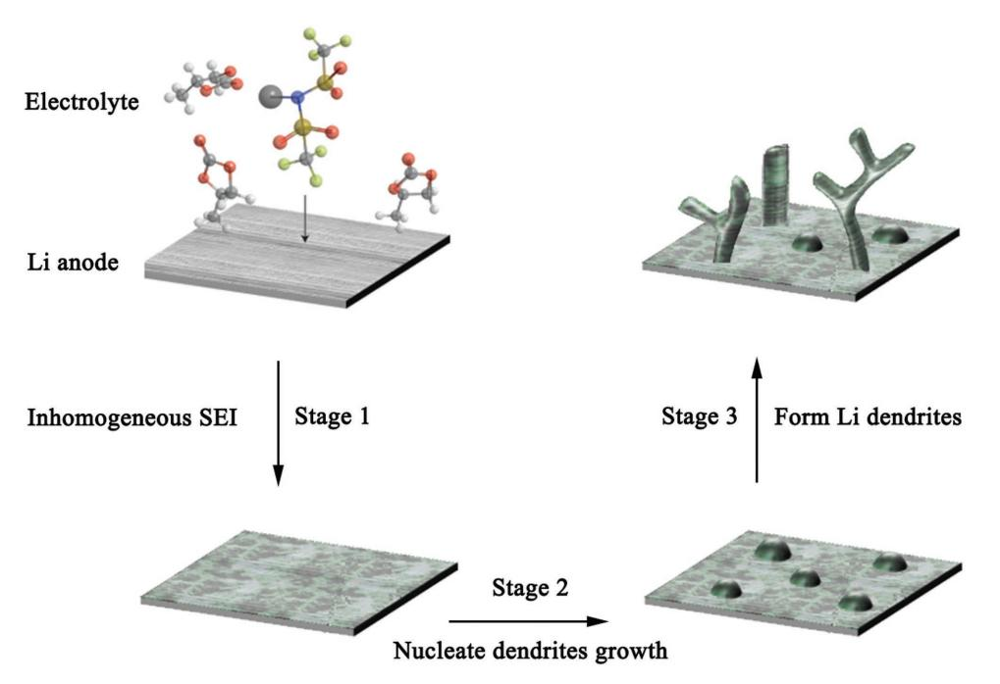

**Figure 7.** Stages of dendrite growth on a planar Li metal anode. Reproduced with permission.[10] Copyright 2016, Nature Publishing Group.

the nuclei is proportional to the inverse of overpotential, and the number density of the nuclei is proportional to the cubic power of the overpotential. In general, the typical Li dendrite growth phenomenon is related to the unstable SEI layers due to the spontaneous reaction of highly reactive Li metal and organic electrolyte solvents at the beginning process as shown in **Figure 7**. Nevertheless, the SEI layers formed in the organic electrolyte have a low modulus and fail to withstand the mechanical deformation during Li+ insertion and pulling out, resulting in breakdown and the formation of surface defect sites on the SEI film.[110] Subsequently, Li+ tends to assemble toward these locations where the current density is locally concentrated and forms small dendrites due to the inhomogeneous distribution of the electric field.[111,112] Thus, the Li+ is prone to deposit on these small dendrites followed by growing dangerous dendrites on the surface of the metal lithium and finally piercing the separator, causing short-circuiting accompanied by the risk of explosion. More specifically, for the Li–S battery, due to the soluble intermediate PSs (Li2S*n*, *n* = 8, 6, and 4) in the organic liquid electrolyte and the shuttle phenomenon, the Li anode is more susceptible to corrosion by PSs compared with other conventional Li-ion batteries.[113–115]

As parasitic effects, two types of safe issues may be formed in the Li–S battery by Li dendrite growth: (I) the electrode– electrolyte interface is destabilized when dendrites eventually penetrate into the electrolyte, which increases the resistance (or overpotential), leading to continuous capacity decay; and (II) in the charge process, Li dendrites will pierce through the separator, resulting in internal short circuits and potential safety hazards.[116] Especially, during overcharge or high-rate charge processes, the fast deposition of Li+ on the surface of the lithium will accelerate the Li dendrite growth.[103,112] To control the growth of Li dendrites and stabilize the SEI structure, tremendous strategies, focused on modifying the electrolyte, have been formulated, such as Cs+, Rb+, [108] TFSI− anion,[117] LiNO3, [118] and Li2S8. [119] Among those strategies to suppress dendrites, facile nitride materials and self-healing electrostatic shield (SHES) mechanisms by metal cations were treated as the most advanced modifications in the electrolyte system for reducing Li dendrites, which are summarized as follows.

# *3.4.1. Reducing Dendrites by Facile Nitride Materials*

Adding some facile nitride materials such as KNO3, [120] LaNO3, [121] and LiNO3 as an effect additive can obviously suppress the shuttle effect and relieve the growth of Li dendrites. LiNO3 was widely used as an electrolyte additive in Li–S batteries due to its direct reduction by lithium to Li*x*NO*y* species and its oxidation of S species to Li*x*SO*y* moieties, suppressing attachment reactions between Li metal and PS species.[122] However, only LiNO3 in the electrolyte system is not enough to oppose the formation of Li dendrites, and the volume change of the Li anode may create serious cracks and pits, and result in lower impedance due to lithium deposition at the defect sites, leading to the rapid growth of lithium filaments and dendrites.[119] Cui and co-workers[119] demonstrated that the synergetic effect of lithium polysulfide (Li2S8) and LiNO3 has the ability to form a stable and uniform SEI to prevent lithium dendrite growth and minimize electrolyte decomposition, as shown in **Figure 8**a,b. When Li2S8 is added to the electrolyte, the reaction between Li2S8 and fiber-like lithium dendrites will be generated, contributing to the formation of stable and uniform SEI on the lithium surface (Figure 8b) by preventing the growth of dendritic lithium. As shown in Figure 8c,d, after 100 cycles of charge/discharge at 2 mA cm−2 , the edge region's surface of

**www.advenergymat.de**

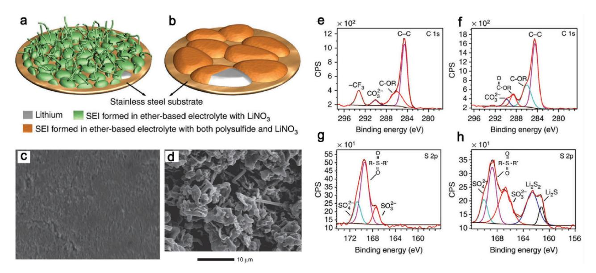

**Figure 8.** Schematic of the morphologies of lithium deposited on the substrate in different electrolytes of a) without Li2S8 and b) containing Li2S8. Morphology characterization of the surface of the deposited lithium after 100 cycles c) with the addition of both Li2S8 (0.18 m) and LiNO3 (5 wt%), and d) with the addition of only LiNO3 (5 wt%) at a deposition capacity of 2 mA h cm−2 ; characterization of SEI layers formed in different electrolytes by XPS of with e,g) the addition of only LiNO3 (5 wt%) and f,h) with the addition of both Li2S8 (0.18 m) and LiNO3 (5 wt%) after ten cycles. Reproduced with permission.[119] Copyright 2015, Nature Publishing Group.

the plated lithium exhibited relatively uniform morphology (Figure 8c). In contrast, without adding Li2S8, the uneven growth of dendrites is visible (Figure 8d). Further, chemical compositions of the respective SEIs with only LiNO3 and with both LiNO3 and Li2S8 were carried out by XPS analysis with C1s, and S2p spectra (Figure 8e,h). It was found that the SEI formed in the presence of Li2S8 has obvious differences compared with that formed without the Li2S8 additive. Two extra peaks in the spectrum of S2p at 161.3 and 162.5 eV were observed, which reflect the composition of Li2S and Li2S2 in the SEI layer. These phenomena indicated an effect of the decomposition of fiberlike lithium dendrites by Li2S8. In addition to S2p, they also observed that LiTFSI decomposed and Li2NSO2CF3 and LiCF3 were formed without Li2S8 for the SEI whereas the peak of CF3 in Li2NSO2CF3 and LiCF3 does not show up in the SEI in the Li2S8-containing electrolyte. The work indicates that the additives of lithium polysulfide and LiNO3 can effectively suppress dendrite growth and greatly minimize electrolyte decomposition.

Although LiNO3 contact with Li2S8 is necessary for the formation of a uniform and high-integrity SEI, a strong oxidant like LiNO3 should be considered because both the Li anode and the S cathode will continually consume LiNO3 and make it preferable to decrease with time. Zhang[123,124] studied the role of LiNO3 in both the Li anode and the S cathode, respectively. Similar phenomena were observed with LiNO3 participating to form a stable passivation film and prevent continued infinite growth due to the consumption of LiNO3. However, on the cathode, they found that LiNO3 is irreversibly reduced and further forms insoluble products that would severely affect the reversibility and capacity of the sulfur cathode if the potential in the first discharge is below 1.6 V.[123] The authors suggested that raising the discharge cutoff voltage (≥1.6 V) is beneficial to the Li–S battery.[123] In addition to setting the cutoff voltage, the authors also thought that it was more suitable to adopt LiNO3 as a co-salt instead of an additive because of the consumption of LiNO3 on the Li anode. In addition, since flammable and expensive LiNO3 decreases the safety properties of the Li–S battery, it is necessary to develop a new method to form a uniform SEI layer on the Li anode without LiNO3. For example, Yan and co-workers reported that using amine and a sulfydrylfunctionalized composite is an effective way to protect the Li anode.[125] They proposed sulfydryl-functionalized graphene nanosheets to replace LiNO3 to form a very dense and uniform SEI layer on the Li surface. Without LiNO3, the top surface of the Li still shows uniform structure without the growth of Li dendrites after 100 cycles.

Compared with LiNO3 approaches for dendrite prevention, an SHES mechanism is another way to reduce the Li dendrites, as proposed by Zhang and co-workers (**Figure 9**).[108] By adding low concentrations of cations in the electrolyte, the modifying electrolyte shows a high potential for fundamentally altering the dendrite formation. Although the authors demonstrated that the SHES mechanism is based on a carbonate electrolyte, regardless of carbonate- or ether (DOL/DME)-based electrolytes, they could share a similar electrostatic mechanism for an electrostatic shield on the Li surface.[108]

# *3.4.2. Reducing Dendrites by Li Salt Concentration*

Suo et al.[117] presented a different method (**Figure 10**a) that can effectively suppress the formation of lithium dendrites. The "solvent-in-salt" (SIS) method shows a low roughness and complete metallic lithium anode during the increase of salt concentration. Suo et al. thought that the ultrahigh salt concentration

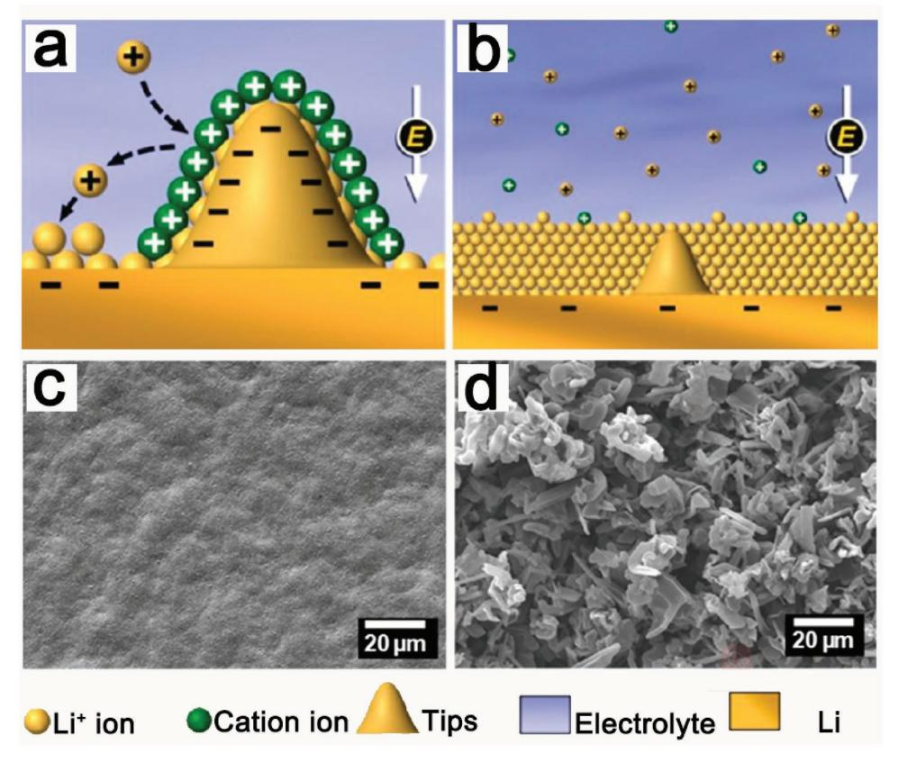

**Figure 9.** a,b) Novel illustration of Li deposition process based on the SHES mechanism and SEM images of c,d) the morphologies of Li films deposited in electrolyte with 0.05 m CsPF6 and 0 m at a current density of 0.1 mA cm−2 , respectively. Reproduced with permission.[108] Copyright 2013, American Chemical Society.

keeps the balance of cation and anion, and the condition is not favorable for dendrite growth. However, because of the high viscosity, the pressure to push back the growing dendrites might be increased. Therefore, when testing the SIS system, little of the PSs' shuttle phenomenon, Coulombic efficiency approaching 100%, and long cycling stability were achieved. They further used scanning electron microscopy (SEM) images to observe the surface of the Li anode, and high salt concentrations (7 mol per one solvent) obviously show the best results. A few dendrites can be found, and the damage level of the Li anode is also the lowest compared with the other samples (such as 0, 2, 4 mol per one solvent). The results clearly demonstrated that the presence of the SIS electrolyte can reduce the corrosion, and the formation of lithium dendrites can also be suppressed due to the ultrahigh lithium salt concentration and high viscosity. In a different direction, Xiao and co-workers[126] reported a new fundamentally different anode-shielding mechanism for the highly concentrated electrolyte. They considered that the electric field effect on the electrode surface in contact with a highly concentrated electrolyte is the main reason for protecting the anode surface by forming a reversible passivation layer (Figure 10b). Once the electric field is withdrawn, the surface reverts to its original structure that is essentially SEI free. This surface layer thereby effectively isolates (shields) the charged surface from the electrolyte solvent molecules, preventing significant electrolyte decomposition.

#### **3.5. Ionic Liquid Electrolytes Used in the Lithium–Sulfur Battery**

Beyond the organic liquid electrolyte, ionic liquid (IL) electrolytes are considered the third type of electrolyte (following organic and water) that has advantages such as thermal stability, low volatility, and fire-retardant ability, and promises much safer electrolytes compared to conventional organicliquid-based electrolytes. As an alternative strategy, ILs have also attracted increasing attention in the Li–S battery fields. The main promise of ILs applied to the Li–S cell is the possibility of tailoring the solubility properties of PSs.[80] In the traditional organic electrolyte solution (DME/DOL–LiTFSI), high-order PSs can readily solubilize the ether electrolyte according to the Lewis-acidity/basicity theory because the Li+ ions of PSs with the solvent anions (TFSI−) dominate the dissolution of ionic PSs. In other words, the TFSI anions have a high donor number (O atoms of two sulfonyl groups), which would preferentially coordinate with the Lewis-acidic cations of Li+. [127–130] Thus, the PSs can readily solubilize in ether electrolytes. In contrast, the ILs usually consist of weakly Lewis-acidic cations and a weakly Lewis-basic anion, with decreased ability to coordinate with Li+. As shown in Figure 10c,d, Wang et al.[127] proposed a typical ionic liquid of the *N*-methyl-*N*-propylpiperidinium bis(trifluoromethanesulfonyl) imide (PP13TFSI)-based electrolyte that shows that the solubility of Li2S8 can reduce to 0.3 m (right) from 0.45 m (left),

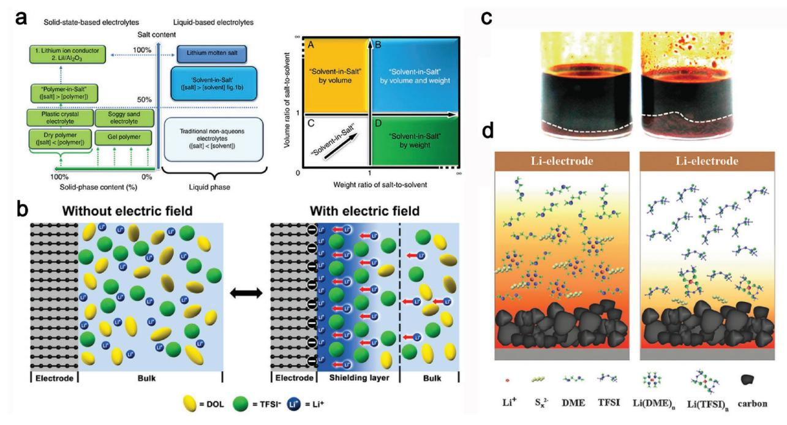

**Figure 10.** a) A general concept for solvent-in-salt electrolyte. Reproduced with permission.[117] Copyright 2013, Nature Publishing Group. b) Schematic diagram of electrode-concentrated electrolyte interface with and without electrode polarization. Reproduced with permission.[126] Copyright 2017, American Chemical Society. c) Polysulfide solubility test in electrolyte solvents. 0.5 m Li2S8 dissolved in a mixture solvent of DOL/DME (1/1, v/v) (left) or PP13TFSI/DOL/DME (2/1/1, v/v) (right). d) Schematic illustration of the function mechanism of polysulfide dissolution and diffusion in ether (left) or PP13TFSI-based (right) solvent. Reproduced with permission.[127] Copyright 2015, Royal Society of Chemistry.

and the self-discharge performance of the Li–S battery with (PP13TFSI)-based electrolyte combining with LiNO3 can approach zero after full charge for 2 d. However, the discharge capacity is not advantageous compared to ether electrolytes, and the rate performance should also be increased[131] because of the low ionic conductivity and slower mass transport of ILbased electrolytes. Thus, the high capacity of the Li–S battery can be obtained only at a low rate with a small current density, resulting in large polarization and low capacity for high-rate charge–discharge.[132] Therefore, according to Kim et al*.,*[133] another reasonable approach is to introduce organic solvents to improve the conductivity and mass transport of IL-based electrolytes. They proposed a mixed IL/organic electrolyte via adding 1-ethyl-3-methyl-imidazolium bis(perfluoroethyl sulfonyl)imide (EMIMBETI) and 1-butyl-3-methyl-imidazolium hexafluorophosphate (BMIMPF6) to 0.5 m LiTF or 0.5 m LiPF6 dioxolane (DIOX):DME (1:4 v/v). The result shows that both discharge capacity and cyclability were effectively improved by the addition of 10% ILs. Similarly, Dokko and co-workers added a hydrofluoroether solvent, 1,1,2,2-tetrafluoroethyl-2,2,3,3-tetrafluoropropyl ether (HFE), in lithium bis(trifluoromethanesulfonyl) imide mixed with tetraglyme ([Li(G4)1][TFSA]) to obtain [Li(G4)1][TFSA]/HFE electrolytes in a glove box.[132] They found that the HFE additive provided a good cycle stability, high Coulombic efficiency, and small overpotential. Correspondingly, the Li+ conductivity of [Li(G4)1] [TFSA]/HFE electrolytes showed a significant improvement (≈5 mS cm−1). Thus, adding the optimized amount of ILs to an organic electrolyte to mitigate the dissolution of PSs for improving the performance of the Li–S battery is an effective approach to control the solubility of PSs. Moreover, some ILs or ions were found to form an effective SEI film on the lithium metal anode,[134] which also prevented the parasitic redox shuttling. The Li salt–glyme solvate ILs were highly soluble even in low-polar molecular solvents such as HFE, and they behaved as a supporting salt in the polysulfide soluble electrolytes.

# **4. Developing All-Solid-State Electrolyte for Safe Li–S Battery**

In addition to liquid electrolytes, using a ceramic solid electrolyte to replace the organic and flammable electrolyte will enhance the benefit of extra safety provided by the intrinsically nonflammable ceramic SE materials.[135,136] The turning point in the strategic thinking about the solid-state electrolyte was started in 1969 when the fast ion 2D Na+ ion transport was discovered in ß-Al2O3 by Kummer and Weber and suggested for the Na–S battery.[4] Since then, multiplex solid electrolytes appear like a fountain. In 1976, the sodium superionic conductor (NASICON) of Na1+*x*Zr2P3-*x*Si*x*O12 was reported by Goodenough et al.[136] The crystalline structure consists of a corner-sharing PO4 tetrahedral and MO6 (M = Ge, Ti, or Zr) octahedral assembled to form a 3D network structure, and Na+ occupies interstitial sites and transports along the *c*axis.[138] When Na+ is replaced with Li+, this conductor will turn into an Li+ conductor. However, Li+ conductivity is decreased because (I) the ionic radius of Na+ is much larger than that of Li+, and (II) Na+ has less mobility than Li+ because of the

LiO bond being more covalent than the NaO bond.[18] Soon after, in 1977, the nitride solid electrolytes (Li3N) were discovered,[139] with a high ionic conductivity of 0.2–0.4 mS cm−1 , the highest conductivity of 6 mS cm−1 , and lower *E*a = 0.20 eV at room temperature.[140] In 1978, oxide solid electrolytes (OSEs) of Li14ZnGe4O16 as lithium superionic conductor (LISICON) with a conductivity of 0.13 S cm−1 at 300 °C were first reported by Hong.[141] Similar materials with tetrahedral units and an LiO polyhedral have been considered, including Li3PO4 [142] and Li4X*χ*Si1−*χ* (X = Zr, Sn)O4. [143] Even so, the operating temperature of OSEs is still high because their ionic conductivity at room temperature is too low (<0.1 mS cm−1 ) compared with liquid electrolytes (1–6 mS cm−1 at room temperature) in addition to poor stability when in contact with Li and air.[144] With the continuous development of super high Li+ conductors, to date, other typical systems such as garnet,[145,146] perovskites,[147] thio-LISICON[135] and glass/glassy ceramics[3] have made great progress in making the construction of all-solid-state cells commercially visible.

Previous work has been devoted to improving the Li–S battery performance based on approaches such as solid-state polymer and inorganic electrolytes.[148] This work has demonstrated that the thin ceramic and polymer electrolytes are most likely to be competitive in terms of high gravimetric energy density. Induced by the unique structure (Li-ion pathways) of solid electrolytes, the serious and annoying problem of the PS shuttle effect in liquid electrolytes could be completely avoided to gain safe and reliable high energy density Li–S batteries.[149]

Although the rechargeable solid Li–S battery has been extensively investigated recently, the performance of the solid Li–S cells still falls behind the performance with liquid electrolytes. The road to the practical application of a safe solid Li–S battery is still long, and many issues are subjected to extensive effort to minimize stress/strain, synthesize a high Li+ conductor, and construct a robust electronic and ionic pathway in both the S cathode and the Li anode. A facile representation to increase mechanical strength, ionic conductivity, and stability is to combine the advantages of the polymer and ceramic electrolyte, for instance, by employing polyethylene oxide (PEO) and Li7La3Zr2O12 (LLZO) to synthesize a solid-state composite (**Figure 11**).[150] However, a slight drop of specific capacity in the

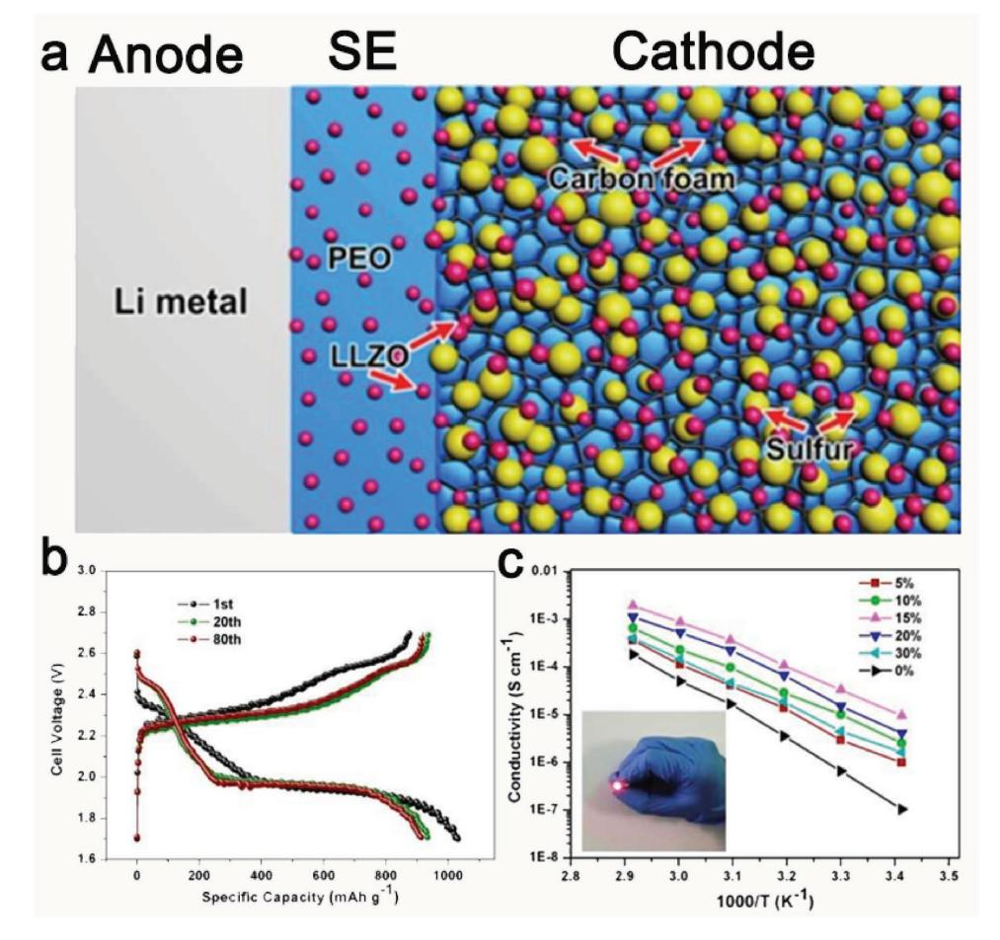

**Figure 11.** a) Schematic illustration of an all-solid-state Li–S battery based on LLZO nanostructures. The blue background indicates the PEOLiClO4 solid polymer electrolyte. The pink and yellow spheres correspond to the LLZO and S particles, respectively. b) Typical charge/discharge curves of the first, 20th, and 80th cycles of the S@LLZO@C cathode with a current density of 0.05 mA cm−2 at 37 °C. c) Arrhenius plots of the conductivity of nanocomposite LLZO–PEO–LiClO4 with different LLZO concentrations. The inset is an optical photograph of a red LED lightened by the solid-state Li–S batteries between the fingers. Reproduced with permission.[150] Copyright 2017, American Chemical Society.

**www.advenergymat.de**

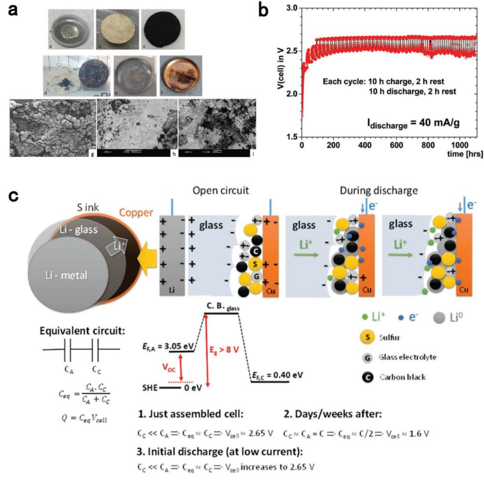

**Figure 12.** a) Images of the electrodes of an Li–S cell before and after discharge. b) Voltage versus time of a Li–S plating cell discharged for 10 h at 40 mA g−1 and charged at constant voltage with a 2 h rest between discharge and charge for 46 cycles. c) Schematic representation of a plating cathode: the plating process on discharge with a redox center, the electrode energies, and the electrical double layer (EDL) capacitances at electrode/electrolyte interfaces are shown. Reproduced with permission.[3] Copyright 2017, Royal Society of Chemistry.

initial several cycles could be observed that was caused by PSs' dissolution in the polymer (PEO) electrolyte (Figure 11b).[151] To design all-solid-state Li–S batteries with an interface friendly with the Li anode, Goodenough and co-workers[3] thought that lower lowest unoccupied molecular orbital (LUMO) (a chemical potential of *E*F < 1.3 eV below the *E*F of the lithium metal) of organic liquid electrolyte other than alkali metal (e.g., Li) was the main factor that caused dendrites and SEI formation and growth. Thus, they developed a solid glass electrolyte with an Li+ or Na+ conductivity *i* > 4 × 10−2 S cm−1 at 25 °C with a motional enthalpy of 0.06 eV. The energy-gap window of the glass electrolyte is ≈9 eV, making it stable in contact with both the alkali-metal anode and the high-voltage cathode (e.g., S cathodes) without the formation of an SEI (**Figure 12**a). The voltage versus time, shown in Figure 12b, has revealed the stable cycle performance as an ultralong 1000 h (corresponding to 46 cycles) and good Coulombic efficiency in this voltage range between initial voltage and 2.34 V, which is considered as the threshold voltage for reversible, safe, and large capacity for the Li–S battery. Below 2.34 V, they considered that the S8 molecules (a redox center) would be reduced to Li2S*n* (1 < *n* < 8), which could cause the metal Li on the anode to be exhausted (Figure 12c).

In recent years, all-solid-state Li batteries have been a comprehensive development.[17,18,152–154] For example, an ultralong cycle of over 10 000 battery cycles with lithium phosphorous oxynitride (LiPON) solid electrolyte as well as a high-voltage LiNi0.5Mn1.5O4 cathode with an Li metal anode was demonstrated.[155] However, the power densities in developing all-solidstate Li–S batteries are still not comparable to those assembled with organic liquid electrolytes. Some issues such as poor interfacial contact,[156,157] interfacial degradation due to mutual diffusion,[158,159] chemical stability against the lithium metal,[104,160] and the wet performance by a metallic lithium[104] are still crucial. Thus, in the following sections, we systematically analyze design considerations in the development of highly safe electrolyte systems (especially for an all-solid-state electrolyte) for making the Li–S batteries business visible.

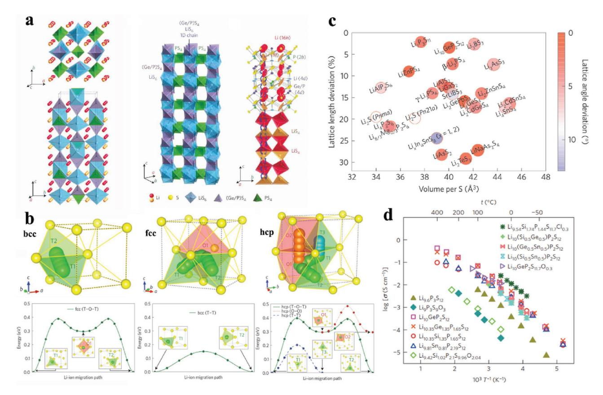

**Figure 13.** a) Crystal structure of Li10GeP2S12. Reproduced with permission.[135] Copyright 2017, Nature Publishing Group. b) Li-ion migration pathways in bcc/fcc/hcp-type anion lattices, respectively. c) Similarity of screened the Inorganic Crystal Structure Database structures containing Li and S to a bcc anion framework using the structural matching algorithm. Reproduced with permission.[138] Copyright 2015, Nature Publishing Group. d) Arrhenius conductivity plots for the LGPS family. Reproduced with permission.[153] Copyright 2016, Nature Publishing Group.

#### **4.1. Designing a High-Performance Li+ Conductor for the Li–S Battery**

High Li+ diffusion, featuring liquid-like Li-ion conduction, in good ionic conductors between stable sites through a higher energy environment has a pivotal position for practical application. To date, many types of super high Li+ conductors have been reported. For example, Mitsui and co-workers reported a lithium superionic conductor of Li10GeP2S12 (LGPS) that was synthesized by Li2S, GeS2, and P2S5 according to the reacting stoichiometric quantities at 550 °C in an evacuated quartz tube,[135] representing an extremely high lithium ionic conductivity in a solid electrolyte of 12 mS cm−1 at room temperature with 24 kJ mol−1 . [161] Structural analysis of the sulfide-based compound shows that Li10GeP2S12 has a new 3D framework structure. As shown in **Figure 13**a, briefly, the (Ge0.5P0.5)S4 tetrahedral and the LiS6 octahedral form a 1D chain along the *c-*axis for the Li+ conduction pathways by sharing a common edge, and the PS4 tetrahedral connects the 1D pathways to form the 3D framework. The zigzag conduction pathways of Li+ along the *c-*axis are indicated in Figure 13a. Similarly, using the Sn or Si atom to replace the Ge in Li10GeP2S12 was also found to give a high conductivity with similar activation energy.[162–164] In 2014, Tatsumisago and co-workers found that the body-centered cubic (bcc)-like anion framework of Li7P3S11

exhibits an extremely high ionic conductivity of 17 mS cm−1 with 17 kJ mol−1 of activation energy that is superior to liquid ion conductors in rechargeable batteries.[165] Studies show that Li7P3S11 shows a crystal structure similar to Li10GeP2S12 with bcc-like anion framework.[166–168]

Inspiration originated in the similar structures of the super high ion conductors. Ceder and co-workers[138] tried to resolve the secret as to why such a high ion conductivity could be achieved in both Li10GeP2S12 and Li7P3S11 systems and then committed to find the optimal design principles for high ion conductors. As shown in Figure 13b, the dynamic processes of Li+ in simplified crystal model structures (bcc, face-centered cubic (fcc), and hexagonal close-packed (hcp) anion lattices) were employed to describe the basic step in Li+ ionic diffusion. For all S lattices, Ceder and co-workers found that Li is most stable in the tetrahedral site, and the body-centered cubic-like anion framework is most desirable to achieve high ionic conductivity. Furthermore, the influences of the lattice volume versus activation barrier for Li-ion migration were summarized. With continued attention to highly ionic conductors for an actual battery device, a new LGPS-type conductor, a chlorinedoped silicon-based system with exceptionally high conductivity (25 mS cm−1 for Li9.54Si1.74P1.44S11.7Cl0.3) was reported by Kanno and co-workers[153] The rate capability of the all-solid-state cells using Li9.54Si1.74P1.44S11.7Cl0.3 as the solid-state electrolyte and

 $LiCoO2$  as the cathode materials at operating temperatures of 25 °C displayed 150 and 1350 C at 100 °C, respectively. Therefore, high C-rate performance is the maximum value in allsolid-state batteries. Noteworthy, the  $\text{Li}_{9,54}\text{Si}_{1,74}\text{P}_{1,44}\text{S}_{11,7}\text{Cl}_{0,3}$ conductors are used for the evolution of  $Li_{10}GeP_2S_{12}$  via ion substitution and doping. Other typical representatives can also be found.[162,163,168,169] Therefore, Ceder and co-workers[138] noted that doping is ideally done in the underlying anion sublattice to dominate the activation energy by setting the site connectivity (Figure 13c). In addition, Li concentration also tailors the ionic conduction mechanism and conductivity.[170,171] As summarized above, we found that the high Li-ion conductor has far higher lithium-ion mobility than the liquid electrolyte (Figure 13d).

# 4.2. Air-Stable Li+ Conductors in an Ambient Environment

Although the promising high ionic conductivities of sulfidebased electrolytes (thio-LISICONs such as  $Li_{10}GeP_2S_{12}$ (12 mS cm-1),[135] Li7P3S11 (17 mS cm-1),[165] and  $\mathrm{Li_{9.54}Si_{1.74}P_{1.44}S_{11.7}Cl_{0.3}}~(25~mS~cm^{-1})^{[153]}\text{) have led to gain}$ popularity compared with other classical conductors (such as  $garnet,$ [145] perovskites,[153,172,173] and glass/glassy ceramics[3]), thio-LISICONs, which have a great potential for the Li-S battery, still face a huge challenge due to the high air or moisture sensitivity. When kept in contact with air, noxious  $H_2S$  gas will be released because oxygen reacts preferentially with germanium and phosphorus atoms and replaces S based on hard and soft acid and base (HSAB) theory.[174] Thus, a dry inert gas atmosphere (e.g., an argon-filled glove box is needed for preparation) is required to perform the sophisticated and tedious procedures during the synthesis process, which increases their processing cost. Therefore, to improve the air or moisture sensitivity, Liang and co-workers[174] reported a direct strategy where the selected soft acid atom as the center elements forms compounds with S to impart excellent chemical stability against oxygen. For example, they employed soft acids Sn and arsenic (As) as center elements to form air-stable compounds with S.[174] An obvious improved stability of both Li4SnS4 and  $Li_3AsS_4$  against oxygen and water by replacing P with Sn and As was observed, and anhydrous Li4SnS4 can be produced from its hydrated form through direct dehydration without hydrolysis and oxidation by air. They further synthesized  $Li_{3.833}Sn_{0.833}As_{0.166}S_4$  as a synergistic compound, which showed a promising high Li-ionic conductivity of  $1.39 \times 10^{-3}$  S cm-1 at room temperature with superior chemical stability against air and/or moisture conditions. Similarly, a meaningful route has appeared to study NASICON compounds using Sb to replace P atoms to form air-stable Na3SbS4 supersonic conductor prepared via a feasible route arising from the interaction between  $Sb^{5+}$  and  $S^{2-}[175]$  Thus, the above results indicate the deep insight into synthetic methods for solid-state electrolytes with improved air stability based on the HSAB theory guide. The design and synthesis of solid electrolytes under the guidance of HSAB will have an important impact on the search for highperformance all-solid-state batteries.[175-177] In addition, some oxide electrolytes have also been considered to have a higher air and moisture stability but lower ionic conductivity than sulfide electrolytes.[136]

# **4.3. Interface Issues between Cathode and Electrolyte**

The interface stability and electrochemical activity are challenging issues for all-solid-state Li-S batteries when solid-state high Li+ conductors are used as the transmission medium for Li+. Low ionic conductivity and electrochemical compatibility between cathode and solid electrolyte materials would cause low energy density and cycling stability.[178] However, a few articles focus on the interface issues in Li-S batteries. To resolve these reasons for the serious interfacial questions and find effective ways to suppress those negative effects, some possible mechanisms and strategies have been discussed in the following sections.

# 4.3.1. Improving Electrical Intimate Contact by Nanosulfur

As we know, the insulated characteristics of S and lithium sulfide (S:  $\delta = 5 \times 10^{-30}$  S cm-1; Li2S:  $\delta = 10^{-13}$  S cm-1) hinder the utilization of active materials, causing a serious problem. The reversible discharge capacities and rate performance of the cells are far lower than the theoretical capacity. The issues become more severe in developing all-solid-state Li-S batteries because of the lack of intimate contact between the electrolyte and the active materials.[179] Initially, to mitigate these electrical intimate contact issues, gas/solid mixing[180] or an ion conductivity-type additive (e.g., copper crystalline powder)[179] constitutes the most promising approach for fabricating an S-composite electrode consisting of a homogeneous distribution of active material, a solid electrolyte, and conductive additives. For instance, to reduce the interfacial resistance caused by the low conductivity of S and lithium sulfides, solid electrolyte and acetylene black were necessary to add into the sulfur electrodes via homogeneous mixing with S to improve the electronic and ionic conductivities.[158] However, high-energy ball milling is needed to prepare the uniform S composite electrode by forming point-to-point contact.[40,181] which will lead to a decrease in the energy density of the Li–S batteries.

In recent years, Liang and co-workers have presented a facile synthetic approach to increase the conductivity of active cathode materials by designing a core-shell structure with the nano-S or Li2S as core and compatible solid electrolyte as shell via the reaction of  $\text{Li}_2S$  and  $P_2S_5$ .[182] The ionic conductivity of core (nano- $Li_2S$ )-shell ( $Li_2PS_4$ ) structure increased six orders of magnitude from  $10^{-13}$  S cm-1 at 25 °C (Li2S) to  $10^{-7}$  S cm-1 at 25 °C (nano-Li2S-Li3PS4 structure), indicating the elimination of the polysulfide shuttle. However, the cyclability of the battery that shows only 100 cycles with a capacity retention of 70% needs to be further increased to meet the practical requirements. This inspiration of decreasing the interface resistance of active materials and electrolytes was further explored by Wang and coworkers as shown in Figure 14a.[137] They provided the novel bottom-up method and valuable guidelines via dissolving Li2S, polyvinylpyrrolidone (PVP), and Li6PS5Cl in ethanol, followed by a coprecipitation and high-temperature carbonization process to synthesize such nanocomposites with a particle size of  $\approx$ 4 nm (Figure 14b,c). These nanocomposites show a significant increase in ionic conductivity ( $9.6 \times 10^{-6}$  S cm-1) and electronic

**www.advenergymat.de**

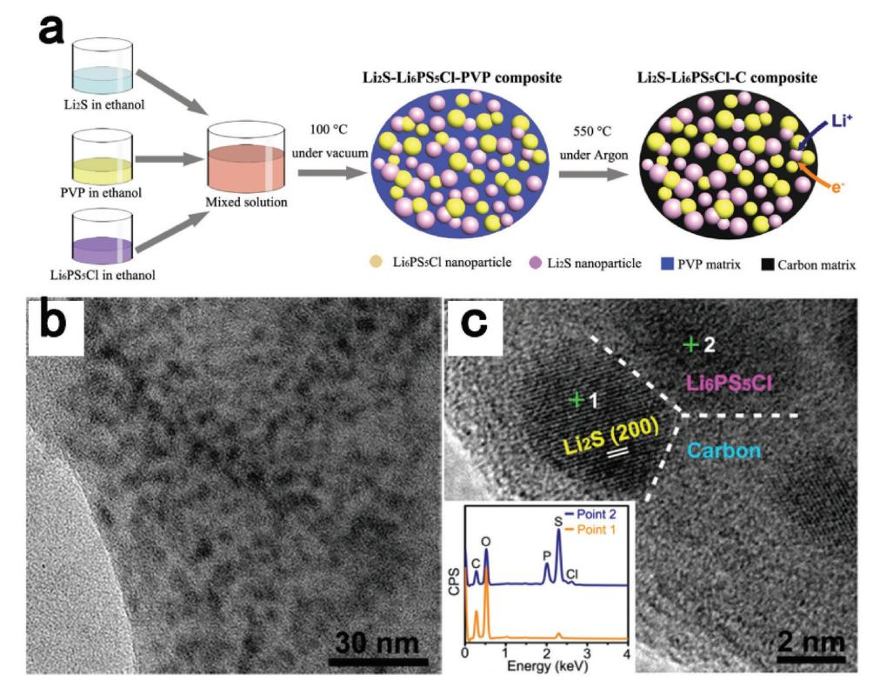

**Figure 14.** a) Schematic illustration of the bottom-up synthesis of the mixed conducting Li2S nanocomposite. b) The TEM image of the Li2S−Li6PS5Cl−C nanocomposite. c) The high-resolution TEM image of the as-obtained Li2S−Li6PS5Cl−C nanocomposite, and the inset shows the energy dispersive spectrometer (EDS) results at point 1 and point 2, respectively. Reproduced with permission.[137] Copyright 2016, American Chemical Society.

conductivity (2.2 × 10−5 S cm−1), leading to ≈100% capacity retention over 60 cycles. Similarly, Xu and co-workers[178] also demonstrated an interfacial design of cutting Li7P3S11 electrolyte with a particle size of ≈10 nm via an in situ liquid-phase approach and then anchoring the Li7P3S11 particle on cobalt sulfide nanosheets as interfacial architecture. Li7P3S11–cobalt sulfide nanocomposites, neat Li7P3S11 electrolytes, and super P were employed as the cathode against Li as the anode. The cell exhibits excellent cycling stability and power densities (1000 cycles at 1.27 mA cm−2 and 3823 W kg−1 at 12.73 mA cm−2 , respectively.). Therefore, it seems that the enhancement in power density and electrochemical activity may be guaranteed by increasing the surface area with a uniform distribution and tight integration between different components (active material, solid electrolyte, and conductive additives).

Although physical intimate contact of electrolyte and active materials could effectively decrease contact resistance,[183] there is, to date, still no article that has discussed and demonstrated that the space-charge layer (SCL) regions exist between S or Li2S cathodes and sulfur-based solid-state electrolytes that were considered to be suitable for bulk-type all-solid-state Li–S batteries. Meng and co-workers[184] used an LiCoO2/LiPON/ Si thin-film battery as a target to uncover the interfacial information via in situ scanning transmission electron microscopy coupled with electron energy-loss spectroscopy, and they suggested a new understanding that a highly oxidized Co-ion species along with lithium oxide and lithium peroxide species is formed during in situ charging. Similarly, without cycling, an inherent and structurally disordered interfacial layer exists between the LiCoO2 cathode and LiPON solid electrolyte. Therefore, they found that the failure of interfacial impedance at the interface of LiCoO2/LiPON was attributed to the chemical changes instead of space-charge effects. To the best of our knowledge, the cation concentration (e.g., Li+) at the intimate interface between the solid electrolyte and the active masteries tends to a lower concentration that runs to active mastery regions because of weak bonding of Li+ and sulfide ions when a high-voltage S cathode contacts the electrolyte.[185,186] For the side of the sulfide electrolyte, the intense decrease of Li+ concentration will result in Li+ fast depletion. As a result, the interface will form high resistance, which is attributed to the shortage of charge carriers, and then will cause rate determination in a solid-state battery.[156] For example, Tateyama and co-workers analyzed the SCL effect at the interface between LiCoO2 (LCO) and LiNbO3 (LNO) where the LNO-coated LCO particles exhibited the least resistance.[156] They showed that LNO-coated buffer layers on LCO will form smooth interfaces without Li adsorption sites for both LCO and β-Li3PS4 (LPS) sides, whereas there are attractive Li adsorption sites and disordered structure when no LNO buffer layers exist. Therefore, the possible diffusion dynamics (e.g., S from cathode to electrolyte and Li ion from electrolyte to cathode) of the interface should be investigated because parasitic effects (such as the loss of active material and the interface "dead" layers) decrease the performance of the Li–S battery and cause unpredictable results.

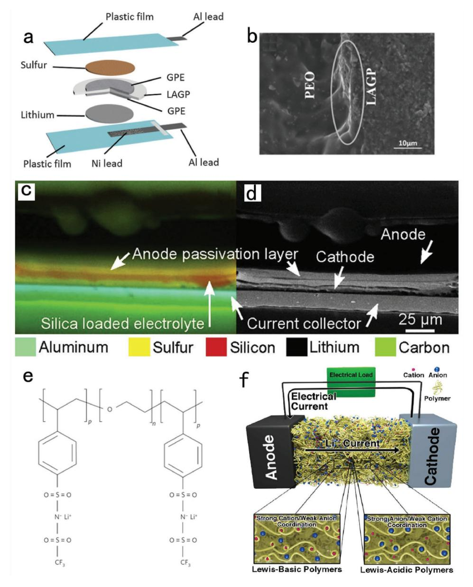

Figure 15. a) Schematic illustration for the fabrication of the Li-S battery using multilayer electrolyte. b) SEM images of the cross section of the gelceramic multilayer electrolyte. Reproduced with permission.[151] Copyright 2016, Royal Society of Chemistry. c) EDS map after three cycles showing the elements: sulfur (yellow), silicon (red), aluminum (cyan), carbon (green), and d) the corresponding backscattered electron (BSE) image. Reproduced with permission.[189] Copyright 2016, Elsevier. e) Chemical structure of the single-ion conductor triblock copolymer P(STFSILi)-b-PEO-b-P(STFSILi) proposed as an electrolyte for lithium-metal-based batteries. Reproduced with permission.[163] Copyright 2013, Nature Publishing Group. f) Ion diffusion concept based on Lewis-basic polymers and Lewis-basic polymers. Rep

# 4.3.2. Diffusion Issues of PSs in Polymeric Electrolytes

The volume density of  $Li_2S$  (1.67 g cm-3) is much lower than the volume density of S (2.03 g  $\text{cm}^{-3}$ ), which would cause a volume expansion of the S cathode of ≈78% compared to the initial state during the entire discharge process. Upon a charge process (Li desertion) in the same cycle, the PSs shrink back to their original state. All-solid-state electrolytes, however, cannot fully follow the shrinkage of PSs, thus leading to an inevitable contact loss of electroactive materials from the carbon matrix and active materials, inferior performance of most sulfur-based composites, and increased contact resistance. To improve those volume changes, Chen and co-workers reported a facile design concept including a gel-ceramic multilayer electrolyte for the solid Li–S battery (Figure 15a).[151] The Li1.5Al0.5Ge1.5(PO4)3 (LAGP) and the gel-polymer electrolytes (GPE) are stuck well (marked by a circle in Figure 15b), which is good for the transport of the Li ions across the interface and benefits volume change. Initial discharge/charge profiles at  $1/20$  C,  $1/10$  C,  $1/5$  C, and  $1/2$  C rates, respectively, show the distinct discharge plateaus and two overlapped charge plateaus.[187] However, the soluble lithium PSs would accumulate and gradually be constrained in

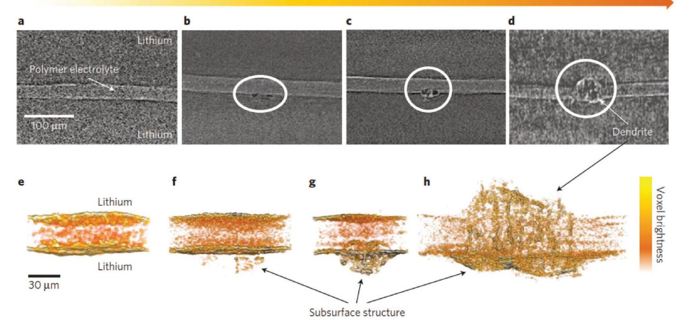

**Figure 16.** Evolution of dendrite growth. a–d) X-ray tomography slices showing the cross sections of symmetric lithium cells cycled at various stages. The thin, bright horizontal strip through the center of the images is the polystyrene-*block*-poly(ethylene oxide) copolymer electrolyte sandwiched between two lithium metal electrodes. The amount of charge passed, *C*, for each cell is a) 0 C cm−2, b) 9 C cm−2, and c) 84 C cm−2, and d) shorted cell of 296 C cm−2 . Dendritic structures are evident in panels (b)–(d). e–h) Magnified, 3D reconstructed volumes of cells shown in the top panel: e) an uncycled cell with no dendritic structures, *C* = 0 C cm−2. f) Heterogeneous structures begin to form in the bottom electrode in early stages of cycling, *C* = 9 C cm−2. g) Dendritic structures in both electrolyte and electrode phases are seen at the intermediate stage of cycling, *C* = 84 C cm−2. h) Dendritic structures that span the thickness of the electrolyte are seen in the shorted cell, *C* = 296 C cm−2. The arrow indicates the color scale for voxel brightness. Reproduced with permission.[118] Copyright 2014, Nature Publishing Group.

the GPE.[151,188] Zaghib and co-workers resolved the lithium/solid polymer electrolyte (SPE)/S batteries by the in-operando techniques: SEM and UV–vis absorption spectroscopy to observe the shuttle effect of the PSs in the electrolyte during battery cycling.[189] They observed ≈5 mm needle shapes during the charge reaction, preferably formed at the interface of the electrode/electrolyte. During the charge process, the soluble sulfur species was found in the electrolyte.[190] However, the in-operando cell (**Figure 16**c,d) after three cycles shows that the PSs were transformed onto the lithium anode due to the shuttle effect and that the thickness of the SPE was greatly reduced from 12 to 4 mm. They further used in-operando UV–vis spectroscopy to identify the intermediate products. Therefore, the polysulfide shuttle effect was observed. These results further demonstrate the reason for the observable attenuation conditions of the specific capacity of Li–S cells during the initial cycle in most solid-state/quasi-solid-state polymer electrolytes.[152,191]

# *4.3.3. Enhancing Li*+ *Diffusion and Suppressing PS Anion Diffusion in Polymeric Electrolytes*

Although the SPE has the potential to decrease the contact resistance and has a net conductivity (synergies of cation and anions) on the order of 10−4 –10−3 S cm−1, [192] no ion selectivity diffusion results in easy shuttling. Actually, measurements of the ion transference number show that anion diffusivity is an order of magnitude larger than Li+ diffusivity for common salts.[193] To reveal structure and dynamics of SPE electrolytes, Savoie et al. employed molecular dynamics simulations to investigate the ion diffusion in SPE.[194] They found that the Lewis-basic polymers (such as PEO-based ) favor cation and rapid anion diffusion due to the strong coordination of Li+ in PEO, as reflected in the helical distortion of the polymer structure and the sharp peak distribution of coordination structures (Figure 15f). In contrast, each anion is weakly associated with numerous methylene units from several PEO segments, and a broad distribution of coordination structures is observed. In contrast, Lewis-acidic polymers are essentially inverted with respect to the Lewis-basic polymer. This inversion of the charge distribution between PEO and the Lewis-acidic polymers is reflected in the weaker coordination of Li+ and stronger coordination of the anions in the ion-coordination structures (Figure 15f). Therefore, compared with no ion-selective gel– electrolyte (PEO-type), the study of new polymer chemistries is required to make SPEs a viable alternative to liquid electrolytes. For instance, Armand and co-workers[195] reported a BAB-type block copolymer (where A is the ionic conductor block, and B is the block showing the mechanical strength) using polyanionic block copolymers containing polystyrene segments (Figure 15e). Unfortunately, a few articles reported these block single Li-ion copolymers in Li–S batteries to suppress the polysulfide anion shuttle. In general, the gel–ceramic multilayer electrolyte may be the best method to (I) prevent the PS diffusion from cathode to metal lithium anode via a single Li-ion path of all-solidstate ceramic electrolytes, (II) buff the volume change of the cathode by gel electrolyte, (III) reduce the free volume between the ceramic electrolyte and active materials, and (IV) improve

the mechanical strength of the electrolyte due to an awful crush of the all-solid-state ceramic electrolyte.

### **4.4. Interface Issues between Anode and Electrolyte**

Undoubtedly, a solid electrolyte will benefit greatly by effectively suppressing the shuttle mechanism of PS in the Li–S battery and prohibiting Li2S/Li2S2 deposit on the Li surface. However, the challenges of using ceramic electrolytes are lack of stability in contact with Li, and cycling the Li/ceramic interface is difficult.[187] In this section, we summarize the main problems of the ceramic electrolyte contacted with metal lithium and the related mechanism and progress.

The spread of Li dendrites is still a challenging problem when solid or polymer electrolytes are employed. Balsara and co-workers[118] used synchrotron hard X-ray microtomography to image the evolution of growing the Li dendrite structures. As shown in Figure 16, they thought nucleation and the following growth in the early stages of dendrite formation were the main reasons for the dendritic structure to protrude from the electrode surface. Therefore, suppressing the nucleation of subsurface structures in the lithium anode itself is more beneficial to prevent the growth of Li dendrites. Correspondingly, Monroe and Newman used linear elasticity theory to analyze the electrode stability and concluded that if the shear modulus of the electrolyte is more than twice that of the Li metal, the growth of lithium dendrites can be prohibited.[196] However, the Li dendrite growth was also found in some electrolytes with high shear modulus. The reasons determined by Guillon co-workers were that the inhomogeneous contact between the Li electrode and the solid electrolyte was the main reason for the Li dendrite formation.[197] Furthermore, they provided a good idea that utilizing thin layers of an Au buffer to improve the contact between Li7La3Zr2O12 and Li electrodes resulted in a dramatically reduced interface. Meanwhile, interfacial coating layers with lithium metal such as 70% Li2S–29% P2S5–1% P2O5 [198] is considered an effective method to suppress the reaction between the LGPS-type electrolytes (such as Li10GeP2S12) and the Li electrodes, ensuring the compatibility between electrolyte and metallic lithium. Thus, the remaining challenge is to prepare a dense garnet membrane (even a singlecrystal conductor) without pinholes on Li metal anodes for practical applications. Another strategy is to replace Li metal with Li alloy with higher chemical stability toward PSs.[199] Scrosati and co-workers have adopted the Sn–C–Li alloy cell, where Li2S and the polymer–gel membrane were the cathode materials and

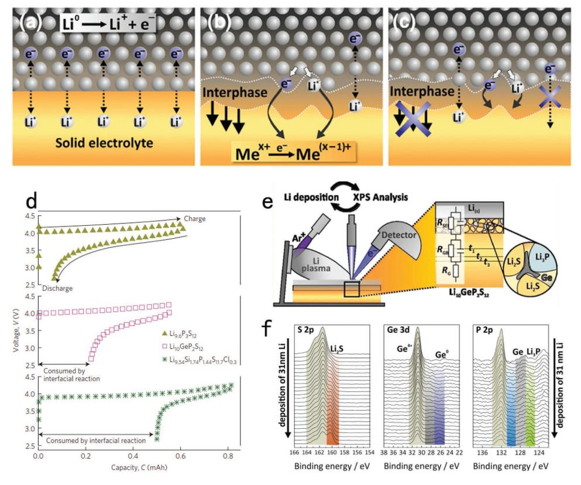

**Figure 17.** Types of interfaces between lithium metal and a solid lithium-ion conductor. a) Nonreactive and thermodynamically stable interface, b) reactive and mixed conducting interphase, c) reactive and metastable solid-electrolyte interphase (SEI). Reproduced with permission.[200] Copyright 2015, Elsevier. d) Electrochemical stability of the LGPS family. Reproduced with permission.[153] Copyright 2016, Nature Publishing Group. e) Schematic of detector and the interphase formation at the Li/Li10GeP2S12 interface. The decomposition leads to different binary compounds with poor transport properties, such as Li3P, Li2S, and Ge (or Li15Ge4), leading to an increasing interfacial impedance with the time, f) XPS spectra recorded during deposition of 31 nm Li metal on Li10GeP2S12. S 2p, Ge 3d, and P 2p/Ge 3p detail spectra are shown for different deposition states. With increasing Li deposition time, LGPS decomposes. The identified species are marked and labeled in the spectra. Reproduced with permission.[202] Copyright 2016, American Chemical Society.

electrolyte, respectively.[200] The voltage profiles revealed similar electrochemical processes during repeated charge-discharge cycles. Moreover, a specific energy of  $\approx$ 1100 Wh kg-1 for tens of cycles was sustained, which had not previously been achieved for the Li-metal-free battery.

IDVANCED

CIENCE NEWS www.advancedsciencenews.com

As metal lithium anodes are desired for all-solid-state Li-S batteries with high energy density, the strong chemical activity of metal lithium makes the contact interface of electrolytes (especially the LGPS-type) unstable. As shown in **Figure 17a–c**, the ideal two phases in contact are a sharp 2D interface in thermodynamic equilibrium without reacting with the lithium metal. On a thermodynamically unstable interface (complicated chemical reactions occur), two different types of interface formation are distinguished.[201] One type is the interphase that might grow "into" the solid electrolyte and thereby change the property of the bulk material (Figure 17b). These conducting interphases eventually allow electron transport through the electrolyte and finally lead to the self-discharge of the battery. Introducing some protecting films was the main method that was demonstrated by Imanishi et al.[202] In contrast to Figure 17b, the other unstable interface (Figure 17c) is a stable interphase (stable SEI). In this case, the ion-conducting property of the interphase determines the battery performance. Obviously, cycling experiments can indirectly replay the influence of the formation resistive interphases. Figure 17d shows the first charge and discharge curves of the LGPS family, the instability accompanying an interfacial layer (or interfacial resistance layer) at the LGPS/lithium anode interface, causing low initial efficiency of  $\text{Li}_{9.6}P_3S_{12}$  (90%),  $\text{Li}_{10}\text{GeP}_2S_{12}$  (61%), and  $\text{Li}_{9.54}\text{Si}_{1.74}\text{P}_{1.44}\text{S}_{11.7}\text{Cl}_{0.3}$  (39%), respectively. In addition to LGPS-types, LiPON, NASICON-type materials, and Li7P3S11 are not stable against reduction by lithium metal, and the formation of mixed ionic-electronic conducting interphases and kinetically stabilized SEIs takes time.[201] Janek and co-workers employed a fast ionic conductor  $\text{Li}_{10}\text{GeP}_2\text{S}_{12}$ ,[203] a typical representative of lithium superionic conductors, for the observation of the interfacial instability against lithium via time-resolved electrochemical measurements and in combination with in situ XPS (Figure 17e). The interfacial decomposition of  $Li_{10}GeP_2S_{12}$ as a function of time results in further resistance increase with time. In addition, a similar behavior was observed for lithium alloy as electrode.[204] Thus, they assumed that the decomposition electrolyte may be from the tetrahedral bonding motive and Ge4+. They monitored the interphase formation via in situ XPS during deposition of 31 nm Li metal on  $Li_{10}GeP_2S_{12}$ . As shown in Figure 17f, the represented compositional changes of different spectral features change the intensities. For S 2p region, an emerging signal of Li2S emerges at lower binding energies. Lower-valence Ge species ( $Ge^0$  and  $Ge$ ) and  $Li_3P$  were well detected in the case of Ge 3p and P 2p. Thus, the decomposition of the solid electrolyte formed new chemical species on the interface corresponding to germanium metal or Li-Ge alloy. Following interphase formation reactions were suggested by combining theoretical and experimental results[203]

$$\text{Li}_{10}\text{GeP}_2\text{S}_{12} + 20\text{Li} \rightarrow 12\text{Li}_2\text{S} + 2\text{Li}_3\text{P} + \text{Ge}$$
 (1)

 $\text{Li}_{10}\text{GeP}_2\text{S}_{12} + 23.75\text{Li} \rightarrow 2\text{Li}_2\text{S} + 2\text{Li}_3\text{P} + 0.25\text{Ge}_4\text{Li}_{15}$ 

However, regarding  $Li_7P_3S_{11}$  with no Ge elements, it is approximately ten times lower than  $R_{SEI}$ , compared to Li10GeP2S12 due to an interphase growth. To well describe the diffusion-controlled process, parabolic rate law was used. The fit of the data leads to the parabolic growth constant of  $(2.33 \pm 0.22) \times 10^{-8}$  cm h-0.5 for  $\text{Li}_7\text{P}_3\text{S}_{11}$  and (3.60 ± 0.08) × 10-7 cm h-0.5 for LGPS. The growth thickness of SEI for LGPS reaches  $\approx$ 370 nm and Li7P3S11 is about 23 nm after 1 year, accompanied by an interphase resistance of  $R_{SFI}$  ≈ 4.6 kΩ cm2 for LGPS and  $R_{SFI}$  ≈ 0.28 kΩ cm2 for  $\text{Li}_7\text{P}_3\text{S}_{11}$ .[203]

# 5. Summary and Outlook

In this review, we look back at the main issues of electrolyte systems that influence the safety concerns in Li-S batteries, including liquid and all-solid-state electrolyte systems. For liquid electrolytes, the main safety concern roles could be attributed to (I) flammability, (II) toxicity, and (III) dendrite formation. Among those, the Li dendrite formation and then piercing the separator are the largest safety concerns. The effective suppression of Li dendrite growth can be summarized as follows: (I) utilizing nanoparticle salt and lithiated ionomers to retard space-charge formation, (II) using nanostructured networks to enhance electrolyte stiffness without compromising ion transport, (III) effective artificial SEI coatings based on nanoparticles and polymer coatings formed on Li to improve the lifetime of the batteries, and (IV) changing the structure of metal lithium to form a 3D porous lithium metal anode to prohibit the dendrite growth. Moreover, larger versions of the "lithium-free" LIB battery designs (e.g., S-Si battery) are expected soon. The feasible all-solid-state electrolyte, which is the ideal safe electrolyte in the future, must meet the following requirements: high ionic conductivity, excellent interface compatibility with both lithium and cathode and stable, and wide electrochemical window. Achieving the high rate, high capacity, and long cycles of the Li-S battery for practical applications is also the challenging goal when using an all-solid-state electrolyte due to the large interface resistance between the electrolyte and the S cathode. Finally, development of a new method for the protection of the lithium anode for the safety considerations of the lithium-sulfur battery system for the future large-scale application is strongly needed.

# Acknowledgements

 $\text{W.C., T.L.,}$  and  $\text{C.W.}$  contributed equally to this work. The authors gratefully acknowledge the support from "973 Program-National Basic Research Program of China" Special Funds for the Chief Young Scientist (2015CB358600), the National Natural Science Foundation of China (Grant Nos. 51722204, 91421110, 51622208, 51402202), and Fundamental Research Funds for the Central Universities (ZYGX2016Z004).

# **Conflict of Interest**

The authors declare no conflict of interest.

 $(2)$ 

# **Keywords**

electrolytes, lithium–sulfur batteries, safety

Received: August 26, 2017 Revised: November 14, 2017 Published online: January 17, 2018

- [1] Z. W. Seh, Y. Sun, Q. Zhang, Y. Cui, *Chem. Soc. Rev.* **2016**, *45*, 5605.
- [2] X. Duan, J. Xu, Z. Wei, J. Ma, S. Guo, H. Liu, S. Dou, *Small Methods* **2017**, *1*, 1700156.
- [3] M. H. Braga, N. S. Grundish, A. J. Murchison, J. B. Goodenough, *Energy Environ. Sci.* **2017**, *10*, 331.
- [4] J. T. Kummer, N. Weber, *US Patent 3458356*, **1969**.
- [5] M. Yu, J. Ma, H. Song, A. Wang, F. Tian, Y. Wang, H. Qiu, R. Wang, *Energy Environ. Sci.* **2016**, *9*, 1495.
- [6] M. Held, R. Brönnimann, *Microelectron. Reliab.* **2016**, *64*, 705.
- [7] D. P. Finegan, M. Scheel, J. B. Robinson, B. Tjaden, I. Hunt, T. J. Mason, J. Millichamp, M. D. Michiel, G. J. Offer, G. Hinds, D. J. Brett, P. R. Shearing, *Nat. Commun.* **2015**, *6*, 6924.
- [8] J. A. Lochala, H. Zhang, Y. Wang, O. Okolo, X. Li, J. Xiao, *Small Methods* **2017**, *1*, 1700099.
- [9] R. Xu, J. Lu, K. Amine, *Adv. Energy Mater.* **2015**, *5*, 1500408.
- [10] M. D. Tikekar1, S. Choudhury, Z. Tu, L. A. Archer, *Nat. Energy* **2016**, *1*, 16114.
- [11] T. Lei, W. Chen, J. Huang, C. Yan, H. Sun, C. Wang, W. Zhang, Y. Li, J. Xiong, *Adv. Energy Mater.* **2017**, *7*, 1601843.
- [12] Y. Guo, H. Li, T. Zhai, *Adv. Mater.* **2017**, *29*, 1700007.
- [13] M. Barghamadi, A. S. Best, A. I. Bhatt, A. F. Hollenkamp, M. Musameh, R. J. Rees, T. Rüther, *Energy Environ. Sci.* **2014**, *7*, 3902.
- [14] M. D. Bhatt, C. O'Dwyer, *Phys. Chem. Chem. Phys.* **2015**, *17*, 4799.
- [15] L. Cheng, L. A. Curtiss, K. R. Zavadil, A. A. Gewirth, Y. Shao, K. G. Gallagher, *ACS Energy Lett.* **2016**, *1*, 503.
- [16] C. Cao, Z. B. Li, X. L. Wang, X. B. Zhao, W. Q. Han, *Front. Energy Res.* **2014**, *2*, 1.
- [17] J. C. Bachman, S. Muy, A. Grimaud, H. H. Chang, N. Pour, S. F. Lux, O. Paschos, F. Maglia, S. Lupart, P. Lamp, L. Giordano, Y. Shao-Horn, *Chem. Rev.* **2016**, *116*, 140.
- [18] R. Chen, W. Qu, X. Guo, L. Li, F. Wu, *Mater. Horiz.* **2016**, *3*, 487.
- [19] J. Zheng, J. A. Lochala, A. Kwok, Z. D. Deng, J. Xiao, *Adv. Sci.* **2017**, *4*, 1700032.
- [20] J. J. Kim, K. Yoon, I. Park, K. Kang, *Small* **2017**, *1*, 1700219.
- [21] J. Zhang, G. Jiang, M. Goledzinowski, F. J. E. Comeau, K. Li, T. Cumberland, J. Lenos, P. Xu, M. Li, A. Yu, Z. Chen, *Small Methods* **2017**, *1*, 1700237, [https://doi.org/10.1002/](https://doi.org/10.1002/smtd.201700237) [smtd.201700237](https://doi.org/10.1002/smtd.201700237).
- [22] H. J. Peng, J. Q. Huang, X. B. Cheng, Q. Zhang, *Adv. Energy Mater.* **2017**, *7*, 1700260.
- [23] G. Zhang, Z. W. Zhang, H. J. Peng, J. Q. Huang, Q. Zhang, *Small Methods* **2017**, *1*, 1700134.
- [24] W. Chen, T. Qian, J. Xiong, N. Xu, X. Liu, J. Liu, J. Zhou, X. Shen, T. Yang, Y. Chen, C. Yan, *Adv. Mater.* **2017**, *29*, 1605160.
- [25] M. U. Patel, R. Demir-Cakan, M. Morcrette, J. M. Tarascon, M. Gaberscek, R. Dominko, *ChemSusChem* **2013**, *6*, 1177.
- [26] M. U. Patel, R. Dominko, *ChemSusChem* **2014**, *7*, 2167.
- [27] X. Yu, A. Manthiram, *Small Methods* **2017**, *1*, 1700217.
- [28] R. Xu, I. Belharouak, J. Li, X. Zhang, I. Bloom, J. Bareño, *Adv. Energy Mater.* **2013**, *3*, 833.
- [29] E. Talaie, P. Bonnick, X. Sun, Q. Pang, X. Liang, L. F. Nazar, *Chem. Mater.* **2017**, *29*, 90.
- [30] S. Walus´, C. Barchasz, R. Bouchet, J. C. Leprêtre, J. F. Colin, J. F. Martin, E. Elkaïm, C. Baehtz, F. Alloin, *Adv. Energy Mater.* **2015**, *5*, 1500165.

### **www.advenergymat.de**

- [31] M. Cuisinier, P. E. Cabelguen, S. Evers, G. He, M. Kolbeck, A. Garsuch, T. Bolin, M. Balasubramanian, L. F. Nazar, *J. Phys. Chem. Lett.* **2013**, *4*, 3227.
- [32] S. S. Zhang, *J. Power Sources* **2013**, *231*, 153.
- [33] S. Zanotto, A. Blancato, A. Buchheit, M. Muñoz-Castro, H.-D. Wiemhöfer, F. Morichetti, A. Melloni, *Adv. Opt. Mater.* **2017**, *5*, 1600732.
- [34] Y. Diao, K. Xie, S. Xiong, X. Hong, *J. Power Sources* **2013**, *235*, 181.
- [35] T. Lei, Y. Xie, X. Wang, S. Miao, J. Xiong, C. Yan, *Small* **2017**, *13*, 1701013.
- [36] R. Demir-Cakan, M. Morcrette, Gangulibabu, A. Guéguen, R. Dedryvère, J. M. Tarascon, *Energy Environ. Sci.* **2013**, *6*, 176.
- [37] R. Giannuzzi, M. Balandeh, A. Mezzetti, L. Meda, P. Pattathil, G. Gigli, F. Di Fonzo, M. Manca, *Adv. Opt. Mater.* **2015**, *3*, 1614.
- [38] M. Jia, X. Xu, J. Peng, J. Zhang, C. Yao, L. Li, *Adv. Opt. Mater.* **2016**, *4*, 1635.
- [39] J. Zhou, T. Qian, N. Xu, M. Wang, X. Ni, X. Liu, X. Shen, C. Yan, *Adv. Mater.* **2017**, *29*, 1701294.
- [40] M. Nagao, Y. Imade, H. Narisawa, T. Kobayashi, R. Watanabe, T. Yokoi, T. Tatsumi, R. Kanno, *J. Power Sources* **2013**, *222*, 237.
- [41] W. J. Lee, J. Lim, S. O. Kim, *Small Methods* **2017**, *1*, 1600014.
- [42] X. Ji, K. T. Lee, L. F. Nazar, *Nat. Mater.* **2009**, *8*, 500.
- [43] S. Yuan, Z. Guo, L. Wang, S. Hu, Y. Wang, Y. Xia, *Adv. Sci.* **2015**, *2*, 1500071.
- [44] T. Wang, K. Kretschmer, S. Choi, H. Pang, H. Xue, G. Wang, *Small Methods* **2017**, *1*, 1700089.
- [45] Z. Wang, Y. Dong, H. Li, Z. Zhao, H. B. Wu, C. Hao, S. Liu, J. Qiu, X. W. Lou, *Nat. Commun.* **2014**, *5*, 5002.
- [46] S. Wei, L. Ma, K. E. Hendrickson, Z. Tu, L. A. Archer, *J. Am. Chem. Soc.* **2015**, *137*, 12143.
- [47] J. Song, Z. Yu, M. L. Gordin, D. Wang, *Nano Lett.* **2016**, *16*, 864.
- [48] J. Liu, T. Qian, M. Wang, X. Liu, N. Xu, Y. You, C. Yan, *Nano Lett.* **2017**, *3*, 5064.
- [49] F. Wu, J. T. Lee, E. Zhao, B. Zhang, G. Yushin, *ACS Nano* **2016**, *10*, 1333.
- [50] Y. Jiao, W. Chen, T. Lei, L. Dai, B. Chen, C. Wu, J. Xiong, *Nanoscale Res. Lett.* **2017**, *12*, 195.
- [51] Y. Jung, S. Kim, *Electrochem. Commun.* **2007**, *9*, 249.
- [52] M. J. Lacey, F. Jeschull, K. Edstrom, D. Brandell, *Chem. Commun.* **2013**, *49*, 8531.
- [53] J. Sun, Y. Huang, W. Wang, Z. Yu, A. Wang, K. Yuan, *Electrochim. Acta* **2008**, *53*, 7084.
- [54] P. Bhattacharya, M. I. Nandasiri, D. Lv, A. M. Schwarz, J. T. Darsell, W. A. Henderson, D. A. Tomalia, J. Liu, J.-G. Zhang, J. Xiao, *Nano Energy* **2016**, *19*, 176.
- [55] J. Wang, Z. Yao, C. W. Monroe, J. Yang, Y. Nuli, *Adv. Funct. Mater.* **2013**, *23*, 1194.
- [56] J. Sun, Y. Sun, M. Pasta, G. Zhou, Y. Li, W. Liu, F. Xiong, Y. Cui, *Adv. Mater.* **2016**, *28*, 9797.
- [57] X. Yu, J. Joseph, A. Manthiram, *Mater. Horiz.* **2016**, *3*, 314.
- [58] J. Park, B. C. Yu, J. S. Park, J. W. Choi, C. Kim, Y. E. Sung, J. B. Goodenough, *Adv. Energy Mater.* **2017**, *7*, 1602567.
- [59] N. Deng, W. Kang, Y. Liu, J. Ju, D. Wu, L. Li, B. S. Hassan, B. Cheng, *J. Power Sources* **2016**, *331*, 132.
- [60] Y. Xiang, J. Li, J. Lei, D. Liu, Z. Xie, D. Qu, K. Li, T. Deng, H. Tang, *ChemSusChem* **2016**, *9*, 3023.
- [61] H. J. Peng, D. W. Wang, J. Q. Huang, X. B. Cheng, Z. Yuan, F. Wei, Q. Zhang, *Adv. Sci.* **2016**, *3*, 1500268.
- [62] K. E. Hendrickson, L. Ma, G. Cohn, Y. Lu, L. A. Archer, *Adv. Sci.* **2015**, *2*, 1500068.
- [63] S. Choi, J. Song, C. Wang, S. Park, G. Wang, *Chem. Asian J.* **2017**, *12*, 1470, [https://doi.org/10.1002/asia.201700402.](https://doi.org/10.1002/asia.201700402)
- [64] Y. Qiu, G. Rong, J. Yang, G. Li, S. Ma, X. Wang, Z. Pan, Y. Hou, M. Liu, F. Ye, W. Li, Z. W. Seh, X. Tao, H. Yao, N. Liu, R. Zhang,

G. Zhou, J. Wang, S. Fan, Y. Cui, Y. Zhang, *Adv. Energy Mater.* **2015**, *5*, 1501369.

- [65] G. Li, M. Ling, Y. Ye, Z. Li, J. Guo, Y. Yao, J. Zhu, Z. Lin, S. Zhang, *Adv. Energy Mater.* **2015**, *5*, 1500878.
- [66] L. Qie, C. Zu, A. Manthiram, *Adv. Energy Mater.* **2016**, *6*, 1502459.
- [67] Z. Yuan, H. J. Peng, T. Z. Hou, J. Q. Huang, C. M. Chen, D. W. Wang, X. B. Cheng, F. Wei, Q. Zhang, *Nano Lett.* **2016**, *16*, 519.
- [68] G. Zhou, L. Lia, C. Ma, S. Wang, N. Y. Shi, W. Ren, F. Li, H. Cheng, *Nano Energy* **2015**, *11*, 356.
- [69] L. Qie, A. Manthiram, *Adv. Mater.* **2015**, *27*, 1694.
- [70] M. Yu, J. Ma, M. Xie, H. Song, F. Tian, S. Xu, Y. Zhou, B. Li, D. Wu, H. Qiu, R. Wang, *Adv. Energy Mater.* **2017**, *7*, 1602347.
- [71] S. H. Chung, C. H. Chang, A. Manthiram, *ACS Nano* **2016**, *10*, 10462.
- [72] J. M. Tarascon, M. Armand, *Nature* **2001**, *414*, 359.
- [73] D. Aurbach, E. Pollak, R. Elazari, G. Salitra, C. Scordilis-Kelley, J. Affinito, *J. Electrochem. Soc.* **2009**, *156*, 40.
- [74] A. Jozwiuk, B. B. Berkes, T. Weiß, H. Sommer, J. Janek, T. Brezesinski, *Energy Environ. Sci.* **2016**, *9*, 2603.
- [75] B. B. Berkes, A. Jozwiuk, H. Sommer, T. Brezesinski, J. Janek, *Electrochem. Commun.* **2015**, *60*, 64.
- [76] G. H. Kim, A. Pesaran, R. Spotnitz, *J. Power Sources* **2007**, *170*, 476.
- [77] B. Wu, F. Pei, Y. Wu, R. Mao, X. Ai, H. Yang, Y. Cao, *J. Power Sources* **2013**, *227*, 106.
- [78] K. Xu, S. Zhang, J. L. Allen, T. R. Jow, *J. Electrochem. Soc.* **2002**, *149*, A1079.
- [79] J. Hassoun, B. Scrosati, *Adv. Mater.* **2010**, *22*, 5198.
- [80] J. W. Park, K. Ueno, N. Tachikawa, K. Dokko, M. Watanabe, *J. Phys. Chem. C* **2013**, *117*, 20531.
- [81] J. Dong, Z. Zhang, Y. Kusachi, K. Amine, *J. Power Sources* **2011**, *196*, 2255.
- [82] F. Lin, J. Wang, H. Jia, C. W. Monroe, J. Yang, Y. NuLi, *J. Power Sources* **2013**, *223*, 18.
- [83] H. Jia, J. Wang, F. Lin, C. W. Monroe, J. Yang, Y. NuLi, *Chem. Commun.* **2014**, *50*, 7011.
- [84] J. Wang, F. Lin, H. Jia, J. Yang, C. W. Monroe, Y. NuLi, *Angew. Chem.* **2014**, *53*, 10099.
- [85] M. Baginska, B. J. Blaiszik, R. J. Merriman, N. R. Sottos, J. S. Moore, S. R. White, *Adv. Energy Mater.* **2012**, *2*, 583.
- [86] K. Liu, L. Wei, Y. Qiu, B. Kong, Y. Sun, Z. Chen, D. Zhuo, D. Lin, Y. Cui, *Sci. Adv.* **2017**, *3*, e1601978.
- [87] J. Zhang, L. Yue, Q. Kong, Z. Liu, X. Zhou, C. Zhang, Q. Xu, B. Zhang, G. Ding, B. Qin, Y. Duan, Q. Wang, J. Yao, G. Cui, L. Chen, *Sci. Rep.* **2014**, *4*, 3935.
- [88] J. H. Kim, J. H. Kim, J. M. Kim, Y. G. Lee, S. Y. Lee, *Adv. Energy Mater.* **2015**, *5*, 1500954.
- [89] S. S. Zhang, *J. Power Sources* **2007**, *164*, 351.
- [90] Z. Chen, P. C. Hsu, J. Lopez, Y. Li, J. W. F. To, N. Liu, C. Wang, S. C. Andrews, J. Liu, Y. Cui, Z. Bao, *Nat. Energy* **2016**, *1*, 15009.
- [91] X. M. Feng, X. P. Ai, H. X. Yang, *Electrochem. Commun.* **2004**, *6*, 1021.
- [92] L. Xia, L. Zhu, H. Zhang, X. Ai, *Chin. Sci. Bull.* **2012**, *57*, 4205.
- [93] F. Zhou, X. Zhao, J. R. Dahn, *J. Electrochem. Soc.* **2010**, *157*, A798.
- [94] L. Xia, S. L. Li, X. P. Ai, H. X. Yang, Y. L. Cao, *Energy Environ. Sci.* **2011**, *4*, 2845.
- [95] N. Li, Z. Weng, Y. Wang, F. Li, H. M. Cheng, H. Zhou, *Energy Environ. Sci.* **2014**, *7*, 3307.
- [96] R. D. Cakan, M. Morcrette, J. B. Leriche, J. M. Tarascon, *J. Mater. Chem. A* **2014**, *2*, 9025.
- [97] J. Shao, X. Li, L. Zhang, Q. Qu, H. Zheng, *Nanoscale* **2013**, *5*, 1460.
- [98] S. Licht, D. Peramunage, *J. Electrochem. Soc.* **1993**, *140*, L4.
- [99] D. Peramunage, S. Licht, *Science* **1993**, *261*, 1029.

- [100] W. Li, J. R. Dahn, D. S. Wainwright, *Science* **1994**, *264*, 1115.
- [101] H. Park, H. D. Lim, H. K. Lim, W. M. Seong, S. Moon, Y. Ko, B. Lee, Y. Bae, H. Kim, Kang, K. *Nat. Commun.* **2017**, *8*, 14989.
- [102] G. Wang, L. Fu, N. Zhao, L. Yang, Y. Wu, H. Wu, *Angew. Chem.* **2007**, *119*, 299.
- [103] X. B. Cheng, T. Z. Hou, R. Zhang, H. J. Peng, C. Z. Zhao, J. Q. Huang, Q. Zhang, *Adv. Mater.* **2016**, *28*, 2888.
- [104] W. Li, X. Sun, Y. Yu, *Small Methods* **2017**, *1*, 1600037.
- [105] J. Chen, W. A. Henderson, H. Pan, B. R. Perdue, R. Cao, J. Z. Hu, C. Wan, K. S. Han, K. T. Mueller, J. G. Zhang, Y. Shao, J. Liu, *Nano Lett.* **2017**, *17*, 3061.
- [106] Y. Okajima, Y. Shibuta, T. Suzuki, *Comput. Mater. Sci.* **2010**, *50*, 118.
- [107] J.-i. Yamaki, S.-i. Tobishima, K. Hayashi, K. Saito, Y. Nemoto, M. Arakawa, *J. Power Sources* **1998**, *74*, 219.
- [108] F. Ding, W. Xu, G. L. Graff, J. Zhang, M. L. Sushko, X. Chen, Y. Shao, M. H. Engelhard, Z. Nie, J. Xiao, X. Liu, P. V. Sushko, J. Liu, J. G. Zhang, *J. Am. Chem. Soc.* **2013**, *135*, 4450.
- [109] A. Pei, G. Zheng, F. Shi, Y. Li, Y. Cui, *Nano Lett.* **2017**, *17*, 1132.
- [110] H. Kim, G. Jeong, Y. U. Kim, J. H. Kim, C. M. Park, H. J. Sohn, *Chem. Soc. Rev.* **2013**, *42*, 9011.
- [111] Q. Yun, Y. B. He, W. Lv, Y. Zhao, B. Li, F. Kang, Q. H. Yang, *Adv. Mater.* **2016**, *28*, 6932.
- [112] C. Zhao, Y. Lu, Y. Li, L. Jiang, X. Rong, Y. S. Hu, H. Li, L. Chen, *Small Methods* **2017**, *1*, 1600063.
- [113] J. Zheng, J. Tian, D. Wu, M. Gu, W. Xu, C. Wang, F. Gao, M. H. Engelhard, J. G. Zhang, J. Liu, *Nano Lett.* **2014**, *14*, 2345.
- [114] Q. Pang, D. Kundu, M. Cuisinier, L. Nazar, *Nat. Commun.* **2014**, *5*, 4759.
- [115] X. Ji, S. Evers, R. Black, L. F. Nazar, *Nat. Commun.* **2011**, *2*, 325.
- [116] W. Liu, Z. Chen, G. Zhou, Y. Sun, H. R. Lee, C. Liu, H. Yao, Z. Bao, Y. Cui, *Adv. Mater.* **2016**, *28*, 3578.
- [117] L. Suo, Y. S. Hu, H. Li, M. Armand, L. Chen, *Nat. Commun.* **2013**, *4*, 1481.
- [118] K. J. Harry, D. T. Hallinan, D. Y. Parkinson, A. A. MacDowell, N. P. Balsara, *Nat. Mater.* **2014**, *13*, 69.
- [119] W. Li, H. Yao, K. Yan, G. Zheng, Z. Liang, Y. M. Chiang, Y. Cui, *Nat. Commun.* **2015**, *6*, 7436.
- [120] W. Jia, C. Fan, L. Wang, Q. Wang, M. Zhao, A. Zhou, J. Li, *ACS Appl. Mater. Interfaces* **2016**, *8*, 15399.
- [121] S. Liu, G. R. Li, X. P. Gao, *ACS Appl. Mater. Interfaces* **2016**, *8*, 7783.
- [122] S. Xiong, K. Xie, Y. Diao, X. Hong, *J. Power Sources* **2014**, *246*, 840.
- [123] S. S. Zhang, *Electrochim. Acta* **2012**, *70*, 344.
- [124] S. S. Zhang, *J. Electrochem. Soc.* **2012**, *159*, A920.
- [125] N. Xu, T. Qian, X. Liu, J. Liu, Y. Chen, C. Yan, *Nano Lett.* **2017**, *17*, 538.
- [126] D. Lu, J. Tao, P. Yan, W. A. Henderson, Q. Li, Y. Shao, M. L. Helm, O. Borodin, G. L. Graff, B. Polzin, C. M. Wang, M. Engelhard, J. G. Zhang, J. J. De Yoreo, J. Liu, J. Xiao, *Nano Lett.* **2017**, *17*, 1602.
- [127] L. Wang, J. Liu, S. Yuan, Y. Wang, Y. Xia, *Energy Environ. Sci.* **2016**, *9*, 224.
- [128] N. Tachikawa, K. Yamauchi, E. Takashima, J.-W. Park, K. Dokko, M. Watanabe, *Chem. Commun.* **2011**, *47*, 8157.
- [129] M. Watanabe, M. L. Thomas, S. Zhang, K. Ueno, T. Yasuda, K. Dokko, *Chem. Rev.* **2017**, *117*, 7190.
- [130] J. Scheers, S. Fantini, P. Johansson, *J. Power Sources* **2014**, *255*, 204.
- [131] L. X. Yuan, J. K. Feng, X. P. Ai, Y. L. Cao, S. L. Chen, H. X. Yang, *Electrochem. Commun.* **2006**, *8*, 610.
- [132] K. Dokko, N. Tachikawa, K. Yamauchi, M. Tsuchiya, A. Yamazaki, E. Takashima, J.-W. Park, K. Ueno, S. Seki, N. Serizawa, M. Watanabe, *J. Electrochem. Soc.* **2013**, *160*, A1304.
- [133] S. Kim, Y. Jung, S.-J. Park, *J. Power Sources* **2005**, *152*, 272.

#### **www.advenergymat.de**

- [134] C. Shen, G. Hu, L.-Z. Cheong, S. Huang, J.-G. Zhang, D. Wang, *Small Methods* **2017**, [https://doi.org/10.1002/smtd.201700298.](https://doi.org/10.1002/smtd.201700298)
- [135] N. Kamaya, K. Homma, Y. Yamakawa, M. Hirayama, R. Kanno, M. Yonemura, T. Kamiyama, Y. Kato, S. Hama, K. Kawamoto, A. Mitsui, *Nat. Mater.* **2011**, *10*, 682.
- [136] J. B. Goodenough, H. Y. P. Hong, J. A. Kafalas, *Mater. Res. Bull.* **1976**, *11*, 203.
- [137] F. Han, J. Yue, X. Fan, T. Gao, C. Luo, Z. Ma, L. Suo, C. Wang, *Nano Lett.* **2016**, *16*, 4521.
- [138] Y. Wang, W. D. Richards, S. P. Ong, L. J. Miara, J. C. Kim, Y. Mo, G. Ceder, *Nat. Mater.* **2015**, *14*, 1026.
- [139] U. Alpen, A. Rabenau, G. H. Talat, *Appl. Phys. Lett.* **1977**, *30*, 621.
- [140] T. Lapp, S. Skaarup, A. Hooper, *Solid State Ionics* **1983**, *11*, 97.
- [141] H. Y. P. Hong, *Mater. Res. Bull.* **1978**, *13*, 117.
- [142] Y. Kobayashi, H. Miyashiro, K. Takei, H. Shigemura, M. Tabuchi, H. Kageyama, T. Iwahori, *J. Electrochem. Soc.* **2003**, *150*, A1577.
- [143] S. Adnan, N. Mohamed, *Ceram. Int.* **2014**, *40*, 6373.
- [144] Z. Yu, S. L. Shang, J. H. Seo, D. Wang, X. Luo, Q. Huang, S. Chen, J. Lu, X. Li, Z. K. Liu, *Adv. Mater.* **2017**, *29*, 1605561.
- [145] V. Thangadurai, S. Narayanan, D. Pinzaru, *Chem. Soc. Rev.* **2014**, *43*, 4714.
- [146] V. Thangadurai, D. Pinzaru, S. Narayanan, A. K. Baral, *J. Phys. Chem. Lett.* **2015**, *6*, 292.
- [147] Y. Li, W. Zhou, S. Xin, S. Li, J. Zhu, X. Lü, Z. Cui, Q. Jia, J. Zhou, Y. Zhao, J. B. Goodenough, *Angew. Chem. Int. Ed.* **2016**, *55*, 9965.
- [148] J. Hassoun, B. Scrosati, *Angew. Chem., Int. Ed.* **2010**, *49*, 2371.
- [149] T. Yamada, S. Ito, R. Omoda, T. Watanabe, Y. Aihara, M. Agostini, U. Ulissi, J. Hassoun, B. Scrosati, *J. Electrochem. Soc.* **2015**, *162*, A646.
- [150] X. Tao, Y. Liu, W. Liu, G. Zhou, J. Zhao, D. Lin, C. Zu, O. Sheng, W. Zhang, H. W. Lee, *Nano Lett.* **2017**, *17*, 2967.
- [151] Q. Wang, Z. Wen, J. Jin, J. Guo, X. Huang, J. Yang, C. Chen, *Chem. Commun.* **2016**, *52*, 1637.
- [152] Y. Xia, X. Wang, X. Xia, R. Xu, S. Zhang, J. Wu, Y. Liang, C. Gu, J. Tu, *Chem. – Eur. J.* **2017**, *23*, 15203.
- [153] Y. Kato, S. Hori, T. Saito, K. Suzuki, M. Hirayama, A. Mitsui, M. Yonemura, H. Iba, R. Kanno, *Nat. Energy* **2016**, *1*, 16030.
- [154] M. Nagao, K. Suzuki, Y. Imade, M. Tateishi, R. Watanabe, T. Yokoi, M. Hirayama, T. Tatsumi, R. Kanno, *J. Power Sources* **2016**, *330*, 120.
- [155] J. Li, C. Ma, M. Chi, C. Liang, N. J. Dudney, *Adv. Energy Mater.* **2015**, *5*, 1401408.
- [156] J. Haruyama, K. Sodeyama, L. Han, K. Takada, Y. Tateyama, *Chem. Mater.* **2014**, *26*, 4248.
- [157] S. Ohta, T. Kobayashi, J. Seki, T. Asaoka, *J. Power Sources* **2012**, *202*, 332.
- [158] M. Nagao, A. Hayashi, M. Tatsumisago, *Electrochem. Commun.* **2012**, *22*, 177.
- [159] H. Yamada, Y. Oga, I. Saruwatari, I. Moriguchi, *J. Electrochem. Soc.* **2012**, *159*, A380.
- [160] R. Xu, X. Xia, X. Wang, Y. Xia, J. Tu, *J. Mater. Chem. A* **2017**, *5*, 2829.
- [161] P. Stallworth, J. Fontanella, M. Wintersgill, C. D. Scheidler, J. J. Immel, S. Greenbaum, A. Gozdz, *J. Power Sources* **1999**, *81*, 739.
- [162] N. W. Li, Y. X. Yin, C. P. Yang, Y. G. Guo, *Adv. Mater.* **2016**, *28*, 1853.
- [163] P. Bron, S. Johansson, K. Zick, J. Schmedt auf der Gunne, S. Dehnen, B. Roling, *J. Am. Chem. Soc.* **2013**, *135*, 15694.
- [164] Z. Liu, W. Fu, E. A. Payzant, X. Yu, Z. Wu, N. J. Dudney, J. Kiggans, K. Hong, A. J. Rondinone, C. Liang, *J. Am. Chem. Soc.* **2013**, *135*, 975.

- [165] Y. Seino, T. Ota, K. Takada, A. Hayashi, M. Tatsumisago, *Energy Environ. Sci.* **2014**, *7*, 627.
- [166] H. Yamane, M. Shibata, Y. Shimane, T. Junke, Y. Seino, S. Adams, K. Minami, A. Hayashi, M. Tatsumisago, *Solid State Ionics* **2007**, *178*, 1163.
- [167] A. Kuhn, V. Duppel, B. V. Lotsch, *Energy Environ. Sci.* **2013**, *6*, 3548.
- [168] A. Kuhn, O. Gerbig, C. Zhu, F. Falkenberg, J. Maier, B. V. Lotsch, *Phys. Chem. Chem. Phys.* **2014**, *16*, 14669.
- [169] J. M. Whiteley, J. H. Woo, E. Hu, K. W. Nam, S. H. Lee, *J. Electrochem. Soc.* **2014**, *161*, A1812.
- [170] Y. Li, J. T. Han, C. A. Wang, S. C. Vogel, H. Xie, M. Xu, J. B. Goodenough, *J. Power Sources* **2012**, *209*, 278.
- [171] L. J. Miara, S. P. Ong, Y. Mo, W. D. Richards, Y. Park, J. M. Lee, H. S. Lee, G. Ceder, *Chem. Mater.* **2013**, *25*, 3048.
- [172] X. Lu, J. W. Howard, A. Chen, J. Zhu, S. Li, G. Wu, P. Dowden, H. Xu, Y. Zhao, Q. Jia, *Adv. Sci.* **2016**, *3*, 1500359.
- [173] R. Yu, Q.-X. Du, B.-K. Zou, Z. Y. Wen, C. H. Chen, *J. Power Sources* **2016**, *306*, 623.
- [174] G. Sahu, Z. Lin, J. Li, Z. Liu, N. Dudney, C. Liang, *Energy Environ. Sci.* **2014**, *7*, 1053.
- [175] H. Wang, Y. Chen, Z. D. Hood, G. Sahu, A. S. Pandian, J. K. Keum, K. An, C. Liang, *Angew. Chem., Int. Ed.* **2016**, *55*, 8551.
- [176] C. Ma, Y. Cheng, K. Chen, J. Li, B. G. Sumpter, C. W. Nan, K. L. More, N. J. Dudney, M. Chi, *Adv. Energy Mater.* **2016**, *6*, 1600053.
- [177] C. Ma, E. Rangasamy, C. Liang, J. Sakamoto, K. L. More, M. Chi, *Angew. Chem.* **2015**, *127*, 131.
- [178] X. Yao, D. Liu, C. Wang, P. Long, G. Peng, Y. S. Hu, H. Li, L. Chen, X. Xu, *Nano Lett.* **2016**, *16*, 7148.
- [179] A. Hayashi, T. Ohtomo, F. Mizuno, K. Tadanaga, M. Tatsumisago, *Electrochim. Acta* **2004**, *50*, 893.
- [180] T. Kobayashi, Y. Imade, D. Shishihara, K. Homma, M. Nagao, R. Watanabe, T. Yokoi, A. Yamada, R. Kanno, T. Tatsumi, *J. Power Sources* **2008**, *182*, 621.
- [181] X. Yao, N. Huang, F. Han, Q. Zhang, H. Wan, J. P. Mwizerwa, C. Wang, X. Xu, *Adv. Energy Mater.* **2017**, *7*, 1602923.
- [182] Z. Lin, Z. Liu, N. J. Dudney, C. Liang, *ACS Nano* **2013**, *3*, 2829.
- [183] J. Yue, F. Han, X. Fan, X. Zhu, Z. Ma, J. Yang, C. Wang, *ACS Nano* **2017**, *11*, 4885.
- [184] Z. Wang, D. Santhanagopalan, W. Zhang, F. Wang, H. L. Xin, K. He, J. Li, N. Dudney, Y. S. Meng, *Nano Lett.* **2016**, *16*, 3760.
- [185] K. Takada, *Langmuir* **2013**, *29*, 7538.
- [186] C. Yada, A. Ohmori, K. Ide, H. Yamasaki, T. Kato, T. Saito, F. Sagane, Y. Iriyama, *Adv. Energy Mater.* **2014**, *4*, 1301416.
- [187] P. G. Bruce, S. A. Freunberger, L. J. Hardwick, J. M. Tarascon, *Nat. Mater.* **2011**, *11*, 19.
- [188] Y. Sun, Z. W. Seh, W. Li, H. Yao, G. Zheng, Y. Cui, *Nano Energy* **2015**, *11*, 579.
- [189] H. Marceau, C.-S. Kim, A. Paolella, S. Ladouceur, M. Lagacé, M. Chaker, A. Vijh, A. Guerfi, C. M. Julien, A. Mauger, M. Armand, P. Hovington, K. Zaghib, *J. Power Sources* **2016**, *319*, 247.
- [190] N. A. Cañas, D. N. Fronczek, N. Wagner, A. Latz, K. A. Friedrich, *J. Phys. Chem. C* **2014**, *118*, 12106.
- [191] Y. Sun, G. Li, Y. Lai, D. Zeng, H. Cheng, *Sci. Rep.* **2016**, *6*, 22048.
- [192] L. Zhang, Z. Zhang, S. Harring, M. Straughan, R. Butorac, Z. Chen, L. Lyons, K. Amine, R. West, *J. Mater. Chem.* **2008**, *18*, 3713.
- [193] K. Hayamizu, K. Sugimoto, E. Akiba, Y. Aihara, T. Bando, W. S. Price, *J. Phy. Chem. B* **2002**, *106*, 547.

- [194] B. M. Savoie, M. A. Webb, T. F. Miller, *J. Phys. Chem. Lett.* **2017**, *8*, 641.
- [195] R. Bouchet, S. Maria, R. Meziane, A. Aboulaich, L. Lienafa, J. P. Bonnet, T. N. T. Phan, D. Bertin, D. Gigmes, D. Devaux, R. Denoyel, M. Armand, *Nat. Mater.* **2013**, *12*, 452.
- [196] C. Monroe, J. Newman, *J. Electrochem. Soc.* **2005**, *152*, A396.
- [197] C. L. Tsai, V. Roddatis, C. V. Chandran, Q. Ma, S. Uhlenbruck, M. Bram, P. Heitjans, O. Guillon, *ACS Appl. Mater. Interfaces* **2016**, *8*, 10617.
- [198] H. Wan, G. Peng, X. Yao, J. Yang, P. Cui, X. Xu, *Energy Storage Mater.* **2016**, *4*, 59.

- [199] C. M. Park, J. H. Kim, H. Kim, H. J. Sohn, *Chem. Soc. Rev.* **2010**, *39*, 3115.
- [200] G. Derrien, J. Hassoun, S. Panero, B. Scrosati, *Adv. Mater.* **2007**, *19*, 2336.
- [201] T. L. S. Wenzel, D. Krüger, J. Sann, J. Janek, *Solid State Ionics* **2015**, *278*, 98.
- [202] N. Imanishi, S. Hasegawa, T. Zhang, A. Hirano, Y. Takeda, O. Yamamoto, *J. Power Sources* **2008**, *185*, 1392.
- [203] S. Wenzel, S. Randau, T. Leichtweiß, D. A. Weber, J. Sann, W. G. Zeier, J. Janek, *Chem. Mater.* **2016**, *28*, 2400.
- [204] M. Sakuma, K. Suzuki, M. Hirayama, R. Kanno, *Solid State Ionics* **2016**, *285*, 101.