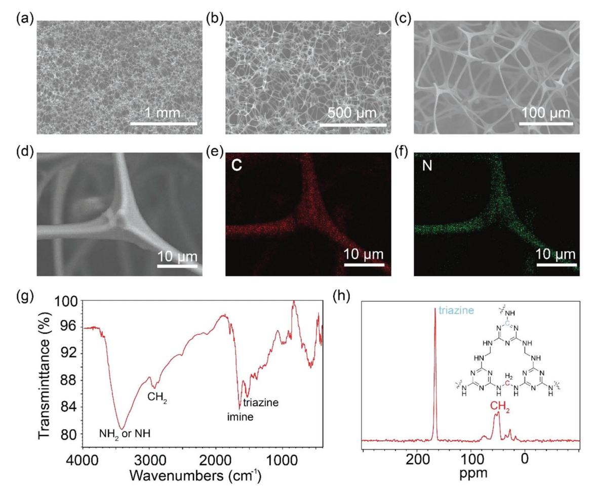
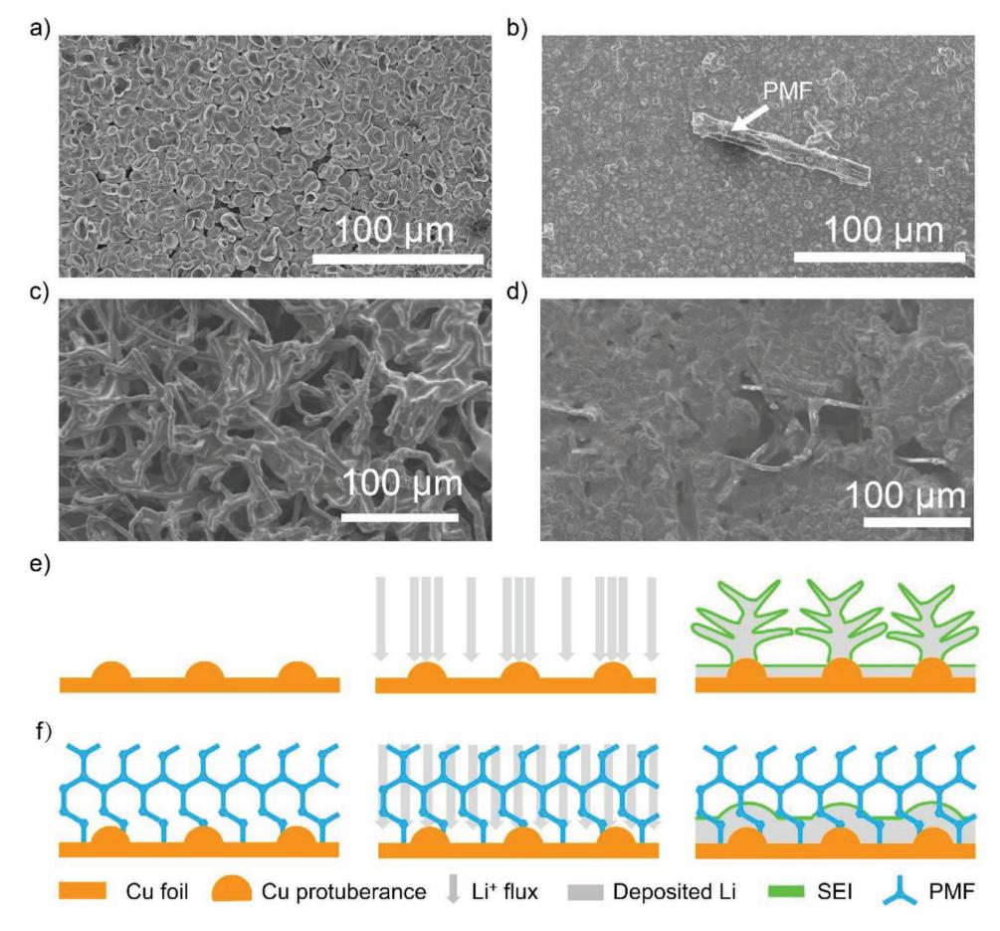
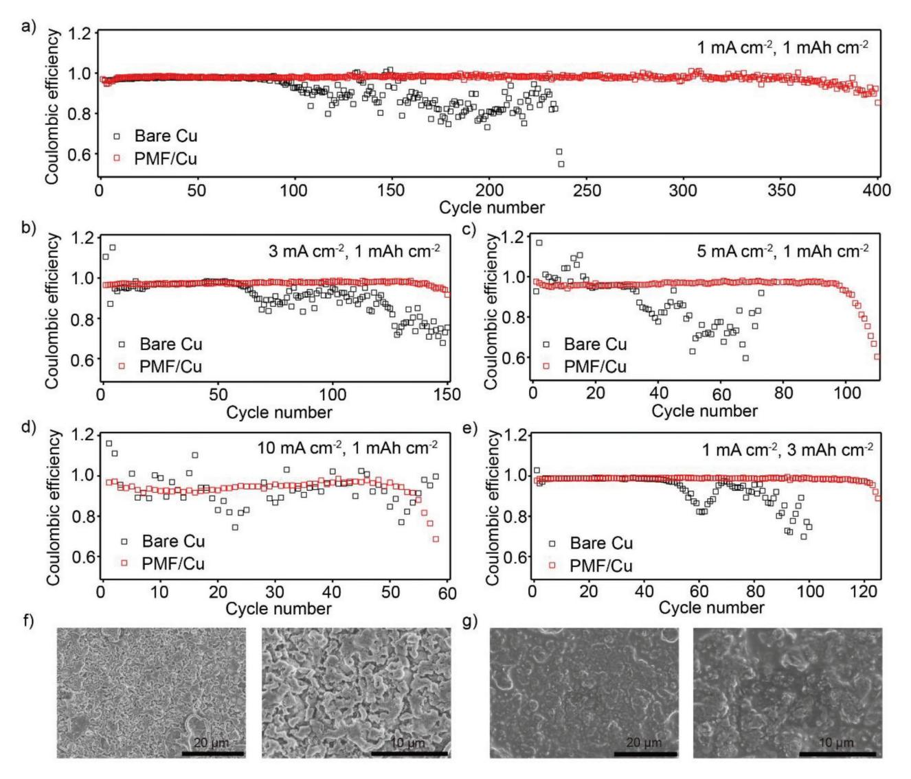
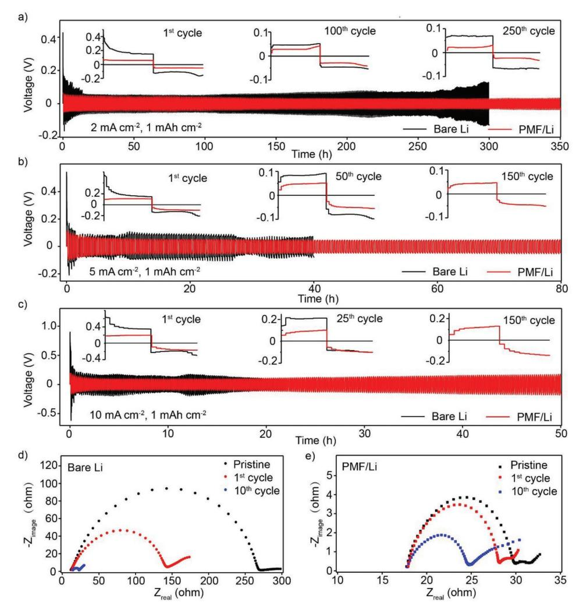
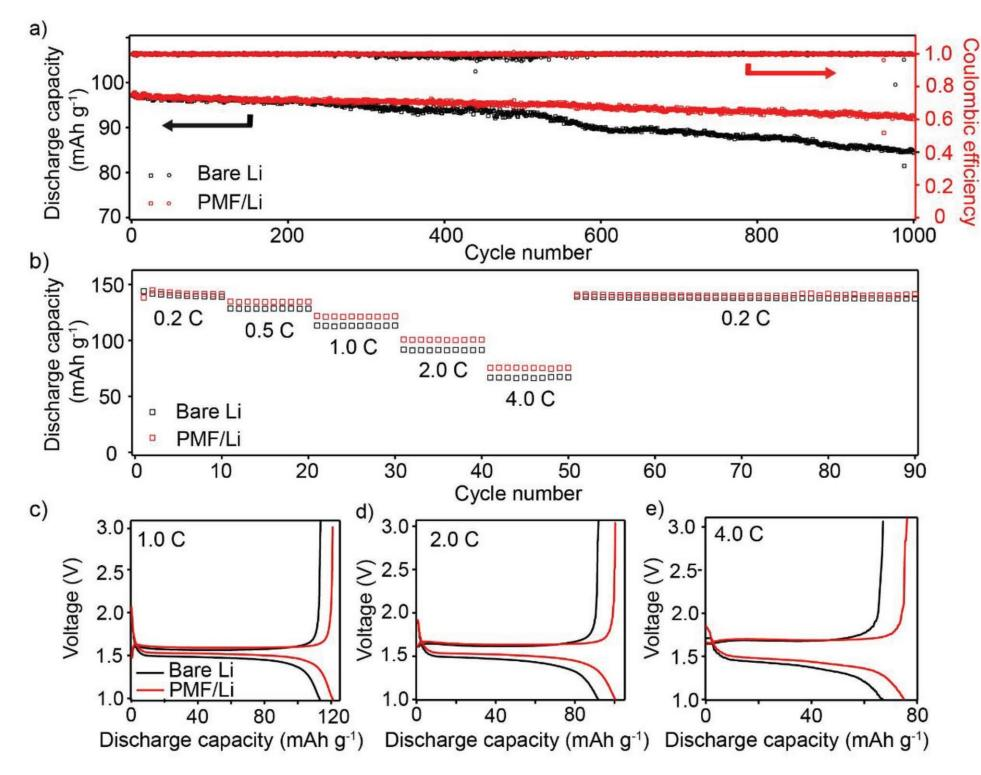

# **Stable Lithium Electrodeposition at Ultra-High Current Densities Enabled by 3D PMF/Li Composite Anode**

*Lei Fan, Houlong L. Zhuang, Weidong Zhang, Yao Fu, Zhihao Liao, and Yingying Lu\**

**Lithium metal batteries (LMBs) are promising candidates for next-generation energy storage due to their high energy densities on both weight and volume bases. However, LMBs usually undergo uncontrollable lithium deposition, unstable solid electrolyte interphase, and volume expansion, which easily lead to low Coulombic efficiency, poor cycling performance, and even safety hazards, hindering their practical applications for more than forty years. These issues can be further exacerbated if operated at high current densities. Here a stable lithium metal battery enabled by 3D porous poly-melamine-formaldehyde (PMF)/Li composite anode is reported. PMF with a large number of polar groups (amine and triazine) can effectively homogenize Li-ion concentration when these ions approach to the anode surface and thus achieve uniform Li deposition. Moreover, the 3D structured anode can serve as a Li host to mitigate the volume change during Li stripping and plating process. Galvanostatic measurements demonstrate that the 3D composite electrode can achieve high-lithium Coulombic efficiency of 94.7% at an ultrahigh current density of 10 mA cm−2 after 50 cycles with low hysteresis and smooth voltage plateaus. When coupled with Li4Ti5O12, half-cells show enhanced rate capabilities and Coulombic efficiencies, opening great opportunities for high-energy batteries.**

Rechargeable lithium batteries have been widely used in electric vehicles, portable electronics, and grid-scale energy storage.[1–3] However, due to the inherent capacity limitations of graphite anodes and transition metal oxide-based cathodes, the energy density of current lithium ion batteries (LIBs) can hardly meet the increasing requirements of customers' demands.[4,5] As an ultimate choice for the anode materials of lithium-based batteries, lithium metal has the highest theoretical capacity (3860 mA h g−1) and lowest electrochemical potential (−3.04 V vs the standard hydrogen electrode).[6,7] Lithium metal anode is

L. Fan, W. Zhang, Prof. Y. Lu State Key Laboratory of Chemical Engineering Institute of Pharmaceutical Engineering College of Chemical and Biological Engineering Zhejiang University Hangzhou 310027, China E-mail: yingyinglu@zju.edu.cn Prof. H. L. Zhuang School for Engineering of Matter Transport & Energy Arizona State University Tempe, AZ 85287, USA

The ORCID identification number(s) for the author(s) of this article can be found under https://doi.org/10.1002/aenm.201703360.

**DOI: 10.1002/aenm.201703360**

also indispensable for next generation high-energy lithium sulfur and lithium oxygen batteries.[8–10]

However, the poor cyclability and safety issues have limited the commercialization of LMBs for more than 40 years.[11] These problems are more or less related to uneven lithium electrodeposition or solid electrolyte interphase (SEI) formation. Upon repeated cycling, the surface of lithium anode tends to form dendritic lithium structure, pierce the separator, and cause an internal short-circuit.[12,13] This dendrite-induced cell failure is inherently hard to avoid. Specifically, locally concentrated lithium ion flux can form at the electrode/electrolyte interface due to the inhomogeneous morphology or chemistry of SEI layer, or anode surface defects from manufactural and processing.[14–16] Lithium ions consequently prefer to deposit on the tip of the surface bump, thus amplifying the surface roughness.[17] The dendrite building-up process

can be further fastened at high current densities. Besides, the volume expansion of lithium metal anode is another serious problem.[18] If paired in a full-cell configuration, lithium metal can be fully striped, leaving an empty or hostless anode. It means that lithium metal has relative infinite volume expansion which is even worse than graphite (≈10%) and silicon (≈400%) anodes.[19] It can cause huge internal stress fluctuations as well as the floating of electrode/separator interface. These two problems can mutually promote each other and consume the electrolyte irreversibly due to the high-chemical

Y. Fu Department of Chemistry Zhejiang University Hangzhou 310027, China Z. Liao Department of Materials Science and Engineering Cornell University

Ithaca, NY 14853-5201, USA

reactivity of lithium. As a net result of all the above situations, the capacity of LMBs fades sharply during cycling.

IDVANCED

CIENCE NEWS www.advancedsciencenews.com

Many efforts have been devoted to solve the dendrite problem as well as the volume expansion of LMBs. These efforts are also significant to current LIBs because LIBs can fail in the same manner when charging too fast or being overcharged.[12] Researchers have developed electrolyte additives,[20,21] solidstate electrolytes,[22-24] artificial SEIs,[12,25,26] and lithiophilic anodic hosts[18,27] to retard or even eliminate the above-mentioned problems. These strategies aim at stopping the dendrite nucleation at the first stage (dendrite formation) and/or preventing its penetration at the second stage (dendrite growth). It is known that concentrated ion flux and continuous deposition leads to the initiation of lithium dendrites, and the growth of the dendrite nuclei is driven by the preferential transport of ions, which can be resisted by promoted elasticity of electrolytes or separators.[28] 3D scaffold/lithium metal composite anodes are regarded as viable alternatives to planar lithium metal anode because they can simultaneously lower the local current density as well as undermine the volume expansion.[29] The experiment of layered Li-reduced grapheme oxide 3D composite anode showed that the volume change and dendrite formation can be significantly mitigated by the 3D structure.[18] Several studies with a variety of 3D composite Li metal anode such as 3D porous Cu/Li-metal, Li-coated 3D polymeric matrix, Li-carbon nanofiber, and Li-carbonized wood later presented consistent evidence.[30–34]

Previously, we proposed a novel design for lithium metal anode with modified 3D structure, in which lithium metal was hosted in a 3D copper "cage" to reduce the local electric field at the anode surface and slow down the volume expansion.[35] Here we report a stable lithium metal battery realized by 3D nonconductive host, porous poly-melamine-formaldehyde (PMF). A specific goal is densely plating Li metal in the macroporous anodic structure. Because PMF is electrically nonconductive, lithium ions can only deposit on the plated Li substrate, leading to increased lithium Coulombic efficiency compared to the previous Cu host. PMF was employed as the nonconductive 3D host because it owns a large number of polar groups (amine and triazine) and can effectively regulate lithium ion distributions when these ions approach to the anode surface and thus achieve uniform Li deposition. Specifically, the polar groups (amine and triazine) on the PMF foam have strong interactions with Li-ions, determined by density functional theory (DFT) simulation. It can thus redistribute lithium ions and reduce the ion concentration gradient caused by preferential ion flux near dendritic tips. The 3D structure is also effective in slowing the volume expansion and lowering the interfacial resistance, which are responsible for stable cycling behavior. As a net result of these merits, 3D PMF/Li composite anode enables enhanced electrochemical performance of LMBs.

We employed the cluster model to simulate the PMF structure via density functional theory calculations (See Supporting Information for simulation parameters). A similar cluster model was previously used to study the binding between CO2 and PMF.[36] Figure 1a illustrates the optimized PMF structure. To model the interactions between Li ions and PMF, we considered three different initial adsorption sites denoted as N1, N2, and N3, respectively. The binding energy  $E_b$  of Li ions with PMF is calculated as  $E_b = E_{PMF} + E_{Li} - E_{Li+PMF}$ , where  $E_{PMF}$ ,  $E_{Li}$ , and  $E_{Li+PMF}$  refer to the energies of the PMF cluster model, an isolated Li atom, and PMF with an adsorbed Li atom adsorbed, respectively. The optimized structures are shown in Figure 1b-d. As can be seen, the addition of Li atoms causes significant distortions of structures. In addition, the Li ion that was initially close to the  $N_3$  site moved to a position that is closer to the  $N_2$  site due to the geometry optimizations. We found that the binding energies in vacuum environment for  $N_1$ ,  $N_2$ , and  $N_3$  sites are 0.82, 1.08, and 0.96 eV, respectively. Taking into account the solvation effect caused by the electrolyte (mixed 1,3-dioxolane (DOL) and 1,2-dimethoxyethane (DME)) correct the binding energies to 1.45, 1.61, and 2.61 eV, respectively, which suggest the importance of the electrolyte effects. All the data of binding energies are sufficiently sizable to demonstrate strong interactions of Li ions with PMF. By contrast, we also computed the binding energy of Li ion interacting with polypropylene (PP) (Figure S1, Supporting Information). We found repulsive energies of  $-0.22$  and  $-0.37$  eV in vacuum and in the electrolyte, respectively. These results provide guidance for our experiment to choose PMF instead of PP for capturing Li ions.

PMF foam is endowed with cross-linked 3D porous structure, which was determined by scanning electron microscopy (SEM) analysis (Figure 2a-d) and visual photos (Figure S2a,b, Supporting Information). The structure of PMF under optical microscope (Figure S2c,d, Supporting Information) presents consistent evidence. The framework of PMF contains interconnected fibers of about 100  $\mu$ m long with a diameter of 3–4  $\mu$ m. The electrolyte wettability of PMF was conducted by optical contact angle measurement. As displayed in Figure S3 in the Supporting Information, the electrolyte can easily wet PMF foam with negligible contact angle (almost  $0^{\circ}$ ), much lower than common PP/polyethylene (PE)/PP separator (39°). It suggests that porous PMF has strong affinity with liquid electrolytes and thus can uptake more electrolytes, experimentally proving the simulation predictions of DFT calculation. Figure 2e,f shows the energy dispersive X-ray spectroscopy (EDX) mapping result of carbon (C) and nitrogen (N) and prove strong signals of both elements.

We used elemental analyzer to further determine the concentration of each element (Figure S4, Supporting Information). The concentrations of N and C are 43% and 34%, respectively, suggesting high amount of nitrogen-based polar groups in PMF. To further determine the chemical composition and functional groups of PMF, Fourier transform infrared spectroscopy (FTIR), and solid-state nuclear magnetic resonance (NMR) were conducted. The infrared spectrum of PMF (Figure 2g) shows peaks corresponding to NH,  $NH_2$  at 3423 cm-1, CH2 at 2924 cm-1, imine at 1654 cm-1, and triazine at 1535 cm-1.[37] Result from solid state 13C NMR spectroscopy (Figure 2h) shows a peak at 166 ppm which is assigned to the carbon atoms presented in the triazine ring. The double resonances at 54 and 48 ppm are attributed to  $CH_2$  groups that link two melamine molecules.[37] These results confirm that PMF owns a large number of N-functional groups with high polarities, leading to enhanced affinity with Li ions and thus slowing the growth rate of instabilities in electroplating from ion concentration gradient. The thermal stability of PMF was also tested. Figure S5a in the Supporting Information exhibits the thermogravimetric analysis (TGA) results and shows PMF with excellent thermal stability up to 350 °C, much high than commercial PP/PE/PP separator

**Figure 1.** Simulation results of the interaction between Li ion and PMF cluster. a) PMF cluster model: N1, N2, and N3 denote three possible adsorption sites for Li ions. b–d) different N sites of PMF.

(200 °C). Long-term thermal stability is examined by assessing their dimensional changes at 150 °C. After 1 h thermal treatment, the dimension change of PMF is negligible while PP/ PE/PP separator suffers from drastic shrinkage (Figure S5b,c, Supporting Information). When used as a host for highly active lithium metal anode, the outstanding thermal stability of PMF is beneficial for alleviating the safety hazard in LMBs.

The effectiveness of 3D PMF host on dendrite suppression was measured by galvanostatic Li plating tests. Cu substrate was used as the current collector for lithium deposition. We compare the surface morphologies of deposited lithium on Cu substrate with or without PMF host. After depositing 1 mA h cm−2 lithium at a current density of 1 mA cm−2 , cells with PMF host show more stabilized and uniform lithium electrodeposition with no observations of lithium dendrites (**Figure 3**a,b). The zoom-in SEM images were provided in Figure S6a–d in the Supporting Information. From the residue PMF ribbon on lithium surface, it can be seen that lithium metal is nicely attached to PMF, indicating good compatibility of PMF with lithium metal. When the lithiation capacity increased to 20 mA h cm−2 , the dendrite problem is even severe with sharp and needle-like structures (Figure 3c). In contrast, with the assistant of PMF, such instability is effectively suppressed (Figure 3d). The side view of PMF in Figure S6e,f in the Supporting Information suggests that the newly deposited lithium metal is well-confined in the 3D structure of PMF with no loose or mossy structures. The lithium deposition mechanisms on Cu substrate with or without PMF were schemed in Figure 3e,f. During electrodeposition, microscopic seeds are formed due to the depletion of salts near the metal surface upon polarization, which is also called "space charge."[38] For the case of highly reactive metal, such as lithium or sodium, the formation of SEI layers is another source of seed nucleation. Cations, driven by local concentration gradient, will preferentially deposit on the seeds and form dendrites.[39] On further deposition on the nuclei, the dendrites grow dramatically and form uneven electrodeposits, such as moss-like or needle-like microstructures. PMF, with a large number of polar groups, is capable of attracting lithium ions and thus is effective to regulate the distribution of lithium ions and mitigate the preferential deposition. As shown

**Figure 2.** Characterization of 3D porous poly (melamine formaldehyde) (PMF). a–c) SEM images of PMF at different magnifications. d) Detailed SEM image of PMF and corresponding EDX mapping results of e) carbon and f) nitrogen. g) FTIR spectrum of PMF. h) Solid state 13C NMR spectrum of PMF. Inset: Chemical structure of PMF.

in Figure 3f, the growth of the nuclei is resisted by the suppression of transport-driven destabilization, favoring a lowsurface-area and flat deposition. Figure S6g in the Supporting Information depicts that upon further deposition, lithium plates and embeds from the bottom of the PMF foam because of the nonconductive nature of PMF. These results indicate that with the strong interaction between PMF and Li ion, the morphological instabilities in electrodeposition can be suppressed through the use of 3D PMF/Li composite anode.

Li/Cu cells were used to measure the lithium Coulombic efficiency and substantiate the practicality of PMF. Lithium Coulombic efficiency is a critical index to evaluate the reversibility of lithium metal anode and is associated with the SEI formation and dendrite growth.[40] It is defined as the ratio of the amount of Li plating on the Cu current collector and the amount of Li stripping from the metal anode. We measured the lithium Coulombic efficiencies at various current densities with fixed amount of lithium striping from the anode (1 mA h cm−1). As can be seen from **Figure 4**a–d, cells with PMF host show enhanced lithium Coulombic efficiencies at all current densities measured and can even cycle stably at ultrahigh current density of 10 mA cm−2, where more unfavorable dendrite growth and side reactions occur. At current density of 10 mA cm−2, cells without PMF can hardly operate and fail quickly while cells with the protection of PMF exhibit 94.7% in lithium Coulombic efficiency at 50th cycle. The increment in lithium Coulombic efficiency indicates that the irreversible consumption of lithium, such as SEI formation or "dead lithium," is remarkably suppressed. The effectiveness of 3D PMF host at high areal capacity (3 mA h cm−2) was also studied, shown in Figure 4e. The control cells begin to fail after 50 cycles, whereas PMF-modified cells display a stable cycling over 120 cycles. Table S1 in the Supporting Information summarizes the Coulombic efficiencies of this work and results from a wide variety of previous state-of-art studies. For example, 3D glass fiber cloths with polar functional group have been used to uniform Li deposition. Under a current density of 1, 5, or 10 mA cm−2, cells using glass fiber-modified Cu foil deliver a Coulombic efficiency of 97.0% at 67th cycle, 93.0% at 48th cycle, or 91.0% at 40th cycle, respectively. Comparison of these results with cells using 3D PMF host shows that PMF exhibits superior ability to homogenize Li-ion flux, stabilize Li deposition, and enhance the lithium Coulombic efficiency. The voltage profiles of Li/Cu cells and PMF-modified

**Figure 3.** Lithium dendrite suppression mechanism of PMF. Morphologies of a) Cu foil and b) PMF-modified Cu foil after depositing 1 mA h cm−2 lithium at a current density of 1 mA cm−2. Morphologies of c) bare Cu foil and d) Cu foil with 3D PMF host after depositing 20 mA h cm−2 lithium at a current density of 1 mA cm−2 . Lithium deposits on copper foil e) directly and f) through PMF. Lithium nucleates on the conductive Cu foil at the beginning, after that, lithium continues deposit and cover the PMF foams.

Li/Cu cells at 10th, 50th, 100th, 200th cycles are shown in Figure S7a–d, respectively, in the Supporting Information. The voltage hysteresis, which is defined as the potential difference between Li plating and stripping, is maintained at ≈50 mV over 200 cycles for cells with PMF host, while it continuously grows for cells using bare Cu foil and is ≈80 mV at 200th cycle. We also summarized the long-term overpotentials of lithium plating in Figure S7e in the Supporting Information. It suggests that using PMF with increased interactions with lithium ions would induce small overpotentials over at least 400 cycles and thus lead to small cell resistance. The small cell resistance is also an indication of less unfavorable side reactions which would be beneficial in suppressing dendrite formation. Figure 4f,g shows the morphologies of deposited lithium, harvested from cells with or without 3D PMF host after operating for ten cycles at 1 mA cm−2, 1 mA h cm−2. The results further confirm the enhancement in the reversibility of lithium plating and striping with a lower-surface area and flatter deposition (also see Figure S8 in the Supporting Information for morphologies at various magnifications). Besides, the 3D structure of PMF is well-maintained after repeated cycling (Figure S9, Supporting Information), which suggests the stable structure of PMF.

Galvanostatic charge/discharge was performed to access cycling performance of bare Li anode and 3D PMF/Li composite anode. As displayed in **Figure 5**a–c, symmetrical cells were cycled at 2, 5, or 10 mA cm−2 with a fixed capacity of 1 mA h cm−1 in ether-based electrolytes (1 m LiTFSI (lithium bis (trifluoromethanesulfonyl) imide) in DOL/DME). Cells with 3D PMF/Li composite anode exhibit stable voltage profiles with small hysteresis whereas cells with bare Li foil show a gradual hysteresis augment over cycles. Detailed comparison of voltage profiles at different cycles is shown in the insets of each figure. The stable voltage profile and small hysteresis of PMF-modified cell is attributed to the mitigation of ion concentration gradient and the stabilization of SEI formation. Such superiority is more obvious at high current densities. At a high current density of 5 mA cm−2 (Figure 5b) or 10 mA cm−2 (Figure 5c), bare Li electrode shows not only higher hysteresis but also fluctuant cycling plateaus in both Li deposition and dissolution processes. In contrast, stable and smooth voltage plateaus are achieved in 3D PMF/Li electrodes. In order to further confirm the effectiveness of PMF/Li composite anode with different electrolytes, we conducted the symmetrical cells with carbonate-based electrolyte (1 m lithium hexafluorophosphate (LiPF6) in 1:1 ethylene carbonate/diethyl carbonate). As shown in Figure S10 in the

**www.advancedsciencenews.com www.advenergymat.de**

**Figure 4.** Lithium Coulombic efficiency measurements for Li/Cu cells with or without the protection of 3D PMF host. Lithium Coulombic efficiencies at various current densities (a) 1 mA cm−2 ; b) 3 mA cm−2, c) 5 mA cm−2 , d) 10 mA cm−2) with a fixed lithiation capacity of 1 mA h cm−2. e) Lithium Coulombic efficiency at a current density of 1 mA cm−2 with a high areal capacity of 3 mA h cm−2. SEM images of the morphologies of deposited lithium at 10th cycle (1 mA cm−2, 1 mA h cm−2) from f) cells using bare Cu or g) cells using PMF/Cu.

Supporting Information, cells with PMF/Li composite anode present a stable cycling performance at high current densities (5 or 10 mA cm−2 ) in carbonate-based electrolytes.

After 30 cycles, the coin cells were disassembled and lithium electrodes were harvested to observe the surface and cross-section morphologies of both electrodes. As shown in Figure S11 in the Supporting Information, using 3D PMF/Li composite electrodes lead to significant improvements over bare lithium anode where the electrodeposition is more stable and homogeneous. Cross-section morphologies were used to study the volume change of lithium anode upon cycling (Figure S12, Supporting Information). It is known that the volume expansion of lithium anode can reduce the amount of active anode material and also cause the floatation of the separator, leading to huge internal stress (Figure S12a,b, Supporting Information). Porous 3D PMF host was used to accommodate the volume change of lithium anode during cycling where deposited lithium can be well-fixed in its framework structure. Figure S12c,d in the Supporting Information compares the thicknesses of lithium anode with or without using PMF host after operating 30 cycles. The thickness increment of 3D PMF/Li composite electrodes is only 6 µm while the change for bare lithium anode is 67 µm. The curbing in volume expansion by using 3D PMF/Li composite electrodes indicates that PMF can be used as a reservoir for hosting Li metal, thus enhancing the cycling performance.

Electrochemical impedance spectroscopy was conducted for symmetrical cells to further study the interfacial properties at different cycles. The corresponding Nyquist plots were obtained for cells with bare Li electrode and 3D PMF/Li composite electrodes (Figure 5d,e) The semicircle in high frequency range is associated with the charge transfer resistance and the interfacial resistance. For bare Li electrode, the interfacial resistance **www.advancedsciencenews.com www.advenergymat.de**

**Figure 5.** Cycling performance of symmetrical cells using bare Li electrodes or 3D PMF/Li composite electrodes in ether-based electrolytes. Voltage profiles under a current density of a) 2 mA cm−2 , b) 5 mA cm−2 , or c) 10 mA cm−2 with a fixed capacity of 1 mA h cm−2 . Insets are detailed voltage profiles with cycle number indicated. Impedance spectra of cells with d) bare Li electrodes or e) 3D PMF/Li composite electrodes at different cycles.

before cycling is as large as ≈270 Ω, which could originate from the formation of the passivation layers. Because of the collapse of the passivation layers and the growth of Li dendrite, the resistance drops to ≈140 Ω after the first cycle and 25 Ω after ten cycles. In contrast, 3D PMF/Li composite electrodes show stable interfacial resistance of 30 Ω before cycling, 28 Ω after the first cycle, and 25 Ω after ten cycles. The stable and low interfacial resistance demonstrates that enhanced Li plating/ stripping kinetics and more stable electrode interface can be achieved by using PMF host.

To further verify the superiority of 3D PMF/Li composite electrodes, bare Li electrode or 3D PMF/Li composite electrodes were paired with Li4Ti5O12 (LTO) to study half-cell cycling performance. Long-term cyclabilities of Li/LTO cells with or without PMF at a rate of 2.0 C are shown in **Figure 6**a. The discharge capacities of the two cells are almost the same initially. However, after 300 cycles, the capacity and the Coulombic efficiency of the bare Li/LTO cells decrease harshly while cells with 3D PMF/Li composite electrode deliver stable cyclability behaviors over 1000 cycles. Li/LTO cells with PMF also show better rate performance than cells with bare Li foil, especially at high rates. As can be seen from Figure 6b–e, PMF-modified Li/LTO cells render discharge capacities of 120 mA h g−1 at 1.0 C, 100 mA h g−1 at 2.0 C, and 76 mA h g−1 at 4.0 C. In comparison, bare Li/LTO only offers capacities of 112 mA h g−1 at 1.0 C, 90 mA h g−1 at 2.0 C, and 65 mA h g−1 at 4.0 C. These ranking performance of 3D PMF/Li composite electrodes in Li/LTO cells indicate its great potential of being used as lithium anode in high-energy LMBs.

In summary, 3D porous PMF/Li composite anode was created to achieve stable Li deposition and improved cycling performance in high-energy LMBs. The 3D porous structure of PMF serves as a host for Li deposition, which can remit the volume expansion of Li metal anode. The nonconductive nature of PMF also facilitates the dense deposition of lithium plating and suppresses the volume expansion. Moreover, the large amount of N-based polar groups in the PMF has strong interactions with Li ions, leading to homogenized Li ions distribution and regulated lithium deposition. Taken these advantages, cells using PMF host show enhanced lithium Coulombic efficiencies

**Figure 6.** Electrochemical cycling performance of bare Li/LTO cells and 3D PMF modified Li/LTO cells. a) Long-term cycling performance at a rate of 2.0 C. b) Rate performance from 0.2 to 4 C. Voltage profiles at c) 1.0 C, d) 2.0 C, and e) 5.0 C.

of 98.4%, 97.4%, 95.6%, and 94.7% under current densities of 1, 3, 5, and 10 mA cm−2, respectively. Symmetrical cells using 3D porous PMF/Li composite electrode can cycle stably at ultrahigh current density of 10 mA cm−2 and exhibit low voltage hysteresis and interfacial resistance. When paired with LTO electrode, long-term cyclability and excellent rate performance can be realized. This novel tactic opens a new opportunity to achieve stable LMBs as well as other high-energy batteries such as Na, Al, Mg, Zn-based batteries.

## **Supporting Information**

Supporting Information is available from the Wiley Online Library or from the authors.

# **Acknowledgements**

The authors thank Prof. Fang Chen with the help of SEM analysis. This work was supported by the National Key R&D Program of China (2016YFA0202900), the Natural Science Foundation of China (NSFC, grant number 21676242), and State Key Laboratory of Chemical Engineering (No. SKL-ChE-17D01). This research also used computational resources of the Texas Advanced Computing Center under contract No. TG-DMR170070. H.L.Z. thanks the start-up funds from Arizona State University.

# **Conflict of Interest**

The authors declare no conflict of interest.

### **Keywords**

composite lithium anodes, high current densities, lithium metal batteries, stable lithium electrodeposition

> Received: November 29, 2017 Revised: January 6, 2018 Published online: February 13, 2018

- [1] M. R. Palacin, A. de Guibert, *Science* **2016**, *351*, 1253292.
- [2] X. B. Cheng, R. Zhang, C. Z. Zhao, Q. Zhang, *Chem. Rev.* **2017**, *117*, 10403.
- [3] H. S. Wang, D. C. Lin, Y. Y. Liu, Y. Z. Li, Y. Cui, *Sci. Adv.* **2017**, *3*, 9.
- [4] M.-H. Ryou, D. J. Lee, J.-N. Lee, Y. M. Lee, J.-K. Park, J. W. Choi, *Adv. Energy Mater.* **2012**, *2*, 645.
- [5] Y. Guo, H. Li, T. Zhai, *Adv. Mater.* **2017**, *29*, 1700007.
- [6] X. Han, Y. Gong, K. K. Fu, X. He, G. T. Hitz, J. Dai, A. Pearse, B. Liu, H. Wang, G. Rubloff, Y. Mo, V. Thangadurai, E. D. Wachsman, L. Hu, *Nat. Mater.* **2017**, *16*, 572.
- [7] J. Shim, H. J. Kim, B. G. Kim, Y. S. Kim, D.-G. Kim, J.-C. Lee, *Energy Environ. Sci.* **2017**, *10*, 1911.
- [8] K. Fu, Y. Gong, G. T. Hitz, D. W. McOwen, Y. Li, S. Xu, Y. Wen, L. Zhang, C. Wang, G. Pastel, J. Dai, B. Liu, H. Xie, Y. Yao, E. D. Wachsman, L. Hu, *Energy Environ. Sci.* **2017**, *10*, 1568.
- [9] L. Fan, H. L. Zhuang, K. Zhang, V. R. Cooper, Q. Li, Y. Lu, *Adv. Sci.* **2016**, *3*, 1600175.
- [10] C. C. Yang, J. H. Han, P. Liu, C. Hou, G. Huang, T. Fujita, A. Hirata, M. W. Chen, *Adv. Mater.* **2017**, *29*, 7.
- [11] D. Lin, Y. Liu, Y. Cui, *Nat Nanotechnol.* **2017**, *12*, 194.
- [12] L. Fan, H. L. Zhuang, L. Gao, Y. Lu, L. A. Archer, *J. Mater. Chem. A* **2017**, *5*, 3483.

**www.advancedsciencenews.com www.advenergymat.de**

- [13] X. Liang, Q. Pang, I. R. Kochetkov, M. S. Sempere, H. Huang, X. Sun, L. F. Nazar, *Nat. Energy* **2017**, *2*, 17119.
- [14] W. Liu, D. Lin, A. Pei, Y. Cui, *J. Am. Chem. Soc.* **2016**, *138*, 15443.
- [15] Z. Tu, P. Nath, Y. Lu, M. D. Tikekar, L. A. Archer, *Acc. Chem. Res.* **2015**, *48*, 2947.
- [16] M. D. Tikekar, S. Choudhury, Z. Tu, L. A. Archer, *Nat. Energy* **2016**, *1*, 16114.
- [17] X. B. Cheng, T. Z. Hou, R. Zhang, H. J. Peng, C. Z. Zhao, J. Q. Huang, Q. Zhang, *Adv. Mater.* **2016**, *28*, 2888.
- [18] D. Lin, Y. Liu, Z. Liang, H. W. Lee, J. Sun, H. Wang, K. Yan, J. Xie, Y. Cui, *Nat. Nanotechnol.* **2016**, *11*, 626.
- [19] G. Zheng, S. W. Lee, Z. Liang, H. W. Lee, K. Yan, H. Yao, H. Wang, W. Li, S. Chu, Y. Cui, *Nat. Nanotechnol.* **2014**, *9*, 618.
- [20] F. Ding, W. Xu, G. L. Graff, J. Zhang, M. L. Sushko, X. Chen, Y. Shao, M. H. Engelhard, Z. Nie, J. Xiao, X. Liu, P. V. Sushko, J. Liu, J. G. Zhang, *J. Am. Chem. Soc.* **2013**, *135*, 4450.
- [21] Y. Lu, Z. Tu, L. A. Archer, *Nat. Mater.* **2014**, *13*, 961.
- [22] C. Yang, K. Fu, Y. Zhang, E. Hitz, L. Hu, *Adv. Mater.* **2017**, *29*.
- [23] Z. D. Hood, H. Wang, A. Samuthira Pandian, J. K. Keum, C. Liang, *J. Am. Chem. Soc.* **2016**, *138*, 1768.
- [24] Q. Lu, Y. B. He, Q. Yu, B. Li, Y. V. Kaneti, Y. Yao, F. Kang, Q. H. Yang, *Adv. Mater.* **2017**, *29*, 1604460.
- [25] N. W. Li, Y. X. Yin, C. P. Yang, Y. G. Guo, *Adv. Mater.* **2016**, *28*, 1853.
- [26] Y. Liu, D. Lin, P. Y. Yuen, K. Liu, J. Xie, R. H. Dauskardt, Y. Cui, *Adv. Mater.* **2017**, *29*, 1605531.

- [27] R. Zhang, X. R. Chen, X. Chen, X. B. Cheng, X. Q. Zhang, C. Yan, Q. Zhang, *Angew. Chem., Int. Ed.* **2017**, *56*, 7764.
- [28] M. D. Tikekar, L. A. Archer, D. L. Koch, *Sci. Adv.* **2016**, *2*, 15.
- [29] R. Zhang, X. B. Cheng, C. Z. Zhao, H. J. Peng, J. L. Shi, J. Q. Huang, J. Wang, F. Wei, Q. Zhang, *Adv. Mater.* **2016**, *28*, 2155.
- [30] Y. Liu, D. Lin, Z. Liang, J. Zhao, K. Yan, Y. Cui, *Nat. Commun.* **2016**, *7*, 10992.
- [31] Z. Liang, D. C. Lin, J. Zhao, Z. D. Lu, Y. Y. Liu, C. Liu, Y. Y. Lu, H. T. Wang, K. Yan, X. Y. Tao, Y. Cui, *Proc. Natl. Acad. Sci. USA* **2016**, *113*, 2862.
- [32] S.-S. Chi, Y. Liu, W.-L. Song, L.-Z. Fan, Q. Zhang, *Adv. Funct. Mater.* **2017**, *27*, 1700348.
- [33] S. S. Chi, Y. C. Liu, W. L. Song, L. Z. Fan, Q. Zhang, *Adv. Funct. Mater.* **2017**, *27*, 10.
- [34] Y. Zhang, W. Luo, C. Wang, Y. Li, C. Chen, J. Song, J. Dai, E. M. Hitz, S. Xu, C. Yang, Y. Wang, L. Hu, *Proc. Natl. Acad. Sci. USA* **2017**, *114*, 3584.
- [35] Q. Li, S. Zhu, Y. Lu, *Adv. Funct. Mater.* **2017**, *27*, 1606422.
- [36] M. X. Tan, Y. Zhang, J. Y. Ying, *ChemSusChem* **2013**, *6*, 1186.
- [37] M. X. Tan, Y. N. Sum, J. Y. Ying, Y. Zhang, *Energy Environ. Sci.* **2013**, *6*, 3254.
- [38] Y. Lu, S. K. Das, S. S. Moganty, L. A. Archer, *Adv. Mater.* **2012**, *24*, 4430.
- [39] A. Pei, G. Y. Zheng, F. F. Shi, Y. Z. Li, Y. Cui, *Nano Lett.* **2017**, *17*, 1132.
- [40] Z. Liang, G. Zheng, C. Liu, N. Liu, W. Li, K. Yan, H. Yao, P. C. Hsu, S. Chu, Y. Cui, *Nano Lett.* **2015**, *15*, 2910.