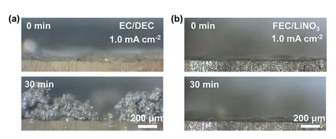
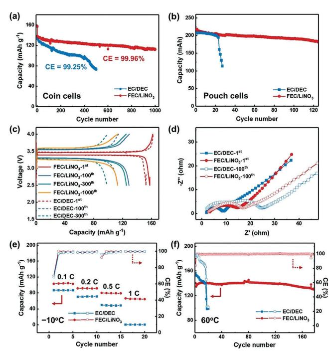
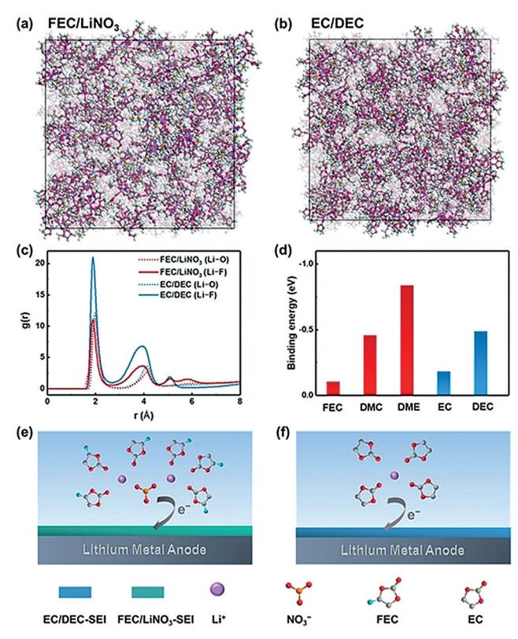

Internationale Ausgabe: DOI: [10.1002/anie.201801513](http://dx.doi.org/10.1002/anie.201801513) Lithium Hot Paper Deutsche Ausgabe: DOI: [10.1002/ange.201801513](http://dx.doi.org/10.1002/ange.201801513)

## Highly Stable Lithium Metal Batteries Enabled by Regulating the Solvation of Lithium Ions in Nonaqueous Electrolytes

Xue-Qiang Zhang, Xiang Chen, Xin-Bing Cheng, Bo-Quan Li, Xin Shen, Chong Yan, Jia-Qi Huang, and Qiang [Zhang\\*](http://orcid.org/0000-0002-3929-1541)

Abstract: Safe and rechargeable lithium metal batteries have been difficult to achieve because of the formation of lithium dendrites. Herein an emerging electrolyte based on a simple solvation strategy is proposed for highly stable lithium metal anodes in both coin and pouch cells. Fluoroethylene carbonate (FEC) and lithium nitrate (LiNO3) were concurrently introduced into an electrolyte, thus altering the solvation sheath of lithium ions, and forming a uniform solid electrolyte interphase (SEI), with an abundance of LiF and LiNxOy on a working lithium metal anode with dendrite-free lithium deposition. Ultrahigh Coulombic efficiency (99.96%) and long lifespans (1000 cycles) were achieved when the FEC/LiNO3 electrolyte was applied in working batteries. The solvation chemistry of electrolyte was further explored by molecular dynamics simulations and first-principles calculations. This work provides insight into understanding the critical role of the solvation of lithium ions in forming the SEI and delivering an effective route to optimize electrolytes for safe lithium metal batteries.

Safe, high-energy-density, and rechargeable batteries have been pursued owing to the increasing demand for portable electronics and electric vehicles. [1] Lithium metal is regarded as a promising anode to further increase the energy density of batteries because of its high theoretical specific capacity (3860 mAhg @1 ) and low reduction potential (@3.04 V vs. standard hydrogen electrode).[2] However, lithium metal is extremely reactive towards almost all nonaqueous electrolytes. [3, 4] Furthermore, uncontrollable lithium deposition during plating/stripping, generally emerging as dendritic and mossy lithium, induces cell failure and even thermal runaway causing fire/explosion events, which plagues the utility of lithium metal anodes in practical applications. [5]

Tremendous efforts have been devoted to lithium metal protection,[6] including artificial protective layers, [7] polymer or solid-state electrolytes, [8] nonaqueous electrolytes[9, 10] or additives, [11, 12] ionic liquids, [13] and three-dimensional scaffolds. [14] Among them, the modification of electrolytes

[https://doi.org/10.1002/anie.201801513.](https://doi.org/10.1002/anie.201801513)

exhibits significant advantages in terms of energy density, cost, and the compatibility of the process for practical use.

In nonaqueous electrolytes, lithium ions are always solvated by solvents and anions, thus forming a solvation sheath with specific components and structures. [4] The solvation sheath can diffuse together with the lithium ions, and thus has a higher probability of touching the lithium surface compared to the free solvents and anions. Once touching the lithium surface, the solvation sheath is reduced by electrons and becomes the main component for the solid electrolyte interphase (SEI).[15] These components dictate the uniformity of the SEI and the following lithium deposition. Hence, the uniformity of the SEI and lithium deposition can be enhanced by regulating the solvation sheath of lithium ions. [16]

Solvents and anions are the two components that can be used in regulating the solvation sheath of lithium ions. The solvents in the solvation sheath of lithium ions are selective. Cyclic carbonate solvents are the main part of the solvation sheath because they are preferentially conscripted by lithium ions in comparison to linear carbonate solvents. [17] Therefore, the uniformity of the SEI and lithium deposition is highly dependent on the type of cyclic carbonate solvent in the electrolytes. For instance, when fluoroethylene carbonate (FEC), as either an additive or co-solvent, is added to the electrolyte, the uniformity of the SEI is significantly enhanced and dendrite-free lithium deposition is achieved.[12, 18] Anions in the solvation sheath also contribute to a uniform SEI and lithium deposition. For instance, NO3 @ from LiNO3 can participate in the solvation sheath of lithium ions in an ether electrolyte and generate LiNxOy in the SEI, thus enhancing the uniformity of lithium deposition.[19,20] Although both cyclic carbonate solvents and anions contribute to the enhanced uniformity of SEI and lithium deposition, their combination has never been investigated. If cyclic carbonate solvents and anions in the solvation sheath of lithium ions are regulated simultaneously, the as-obtained SEI is expected to be endowed with complementary components that can dictate lithium plating/stripping behavior in lithium metal batteries.

Based on the above considerations, FEC and NO3 @ were selected as the cyclic carbonate solvent and anion, respectively. Each of their decomposition products contributes to unifrom lithium deposition.[18, 20] However, LiNO3 is insoluble in carbonate solvents such as FEC. Herein, an emerging solvation strategy was applied to solve this solubility problem. A carbonate/ether mixed solvent was employed, wherein FEC was selected as co-solvent instead of ethylene carbonate (EC), and a LiNO3 additive was dissolved in the electrolyte using dimethoxyethane (DME). The electrolyte is denoted FEC/LiNO3 . Both FEC and NO3 @ are introduced into the

[\*] X.-Q. Zhang, X. Chen, Dr. X.-B. Cheng, B.-Q. Li, X. Shen, Prof. Q. Zhang Beijing Key Laboratory of Green Chemical Reaction Engineering and Technology, Department of Chemical Engineering Tsinghua University, Beijing 100084 (P. R. China) E-mail: zhang-qiang@mails.tsinghua.edu.cn C. Yan, Prof. J.-Q. Huang Advanced Research Institute of Multidisciplinary Science Beijing Institute of Technology, Beijing 100081 (P. R. China) Supporting information and the ORCID identification number(s) for the author(s) of this article can be found under:

solvation sheath of lithium ions, thus rendering an abundance of LiF and LiNxOy in the SEI for lithium metal protection. As a comparison, the commercial electrolyte, 1.0m LiPF6 dissolved in EC/diethyl carbonate (DEC; denoted as EC/DEC electrolyte), was adopted.

The growth process of lithium deposition was recorded by in situ optical microscopy. The surface of the lithium metal is smooth and lacks any protuberance during the initial stages in both the EC/DEC and FEC/LiNO3 electrolytes. Dendritic and mossy lithium forms in the EC/DEC electrolyte after 30 minutes at 1.0 mAcm@2 (Figure 1 a), thus exposing fresh

Figure 1. In situ optical microscopy observations of lithium deposition process in a) EC/DEC and b) FEC/LiNO3 electrolytes at 1.0 mAcm@2 . The images are captured from the videos; see Movies 1 and 2 in the Supporting Information.

lithium to consume the electrolytes. In contrast, the lithium surface remains smooth, without lithium dendrites, in the FEC/LiNO3 electrolyte (Figure 1 b). As shown in the scanning electron microscope (SEM) images, the lithium deposition in the EC/DEC electrolyte is dendritic and mossy with a porous surface after 10 cycles (see Figure S1a in the Supporting Information), while the lithium deposition in the FEC/LiNO3 electrolyte exhibits a dendrite-free and sturdy morphology (see Figure S1b). The lithium stripping morphology in the FEC/LiNO3 electrolyte is also denser than that in EC/DEC after repeated cycling (see Figures S1c and S1d). The lithium tends to deposit uniformly in the FEC/LiNO3 electrolyte.

The FEC/LiNO3 electrolyte was further evaluated in working coin and pouch batteries. The initial specific capacity of Li j LiFePO4 coin cells with the EC/DEC electrolyte at 1.0 C is 135.2 mAhg @1 and its lifespan is 172 cycles when the capacity retention reaches 80% of the initial specific capacity in coin cells (Figure 2 a). Once the electrolyte is replaced by the FEC/LiNO3 electrolyte (see Figure S2), the capacity retention is 80.8% after 1000 cycles with an initial specific capacity of 138.4 mAhg @1 . The average Coulombic efficiency (CE) of Li j LiFePO4 full battery in the EC/DEC electrolyte over 500 cycles is 99.25%. In contrast, the average CE in the FEC/LiNO3 electrolyte over 1000 cycles is as high as 99.96% (see Figure S3). Pouch cells were further investigated to evaluate the synergy of FEC and LiNO3 under practical conditions (see Figure S4). The pouch cells with the EC/DEC electrolyte fail after only 25 cycles. However, the pouch cells employing the FEC/LiNO3 electrolyte remain stable over 120 cycles (Figure 2 b). The FEC/LiNO3 electrolyte infrequently extends the cycle life and maintains ultrahigh CE in long cycling coin and pouch cells.

Figure 2. Electrochemical performance of Li j LiFePO4 coin or pouch cells with either the EC/DEC or FEC/LiNO3 electrolyte. a) The cycle life and CE of Li j LiFePO4 coin cells at 1.0 C after one cycle at 0.1 C. b) Cycling performance of Li j LiFePO4 pouch cells with a theoretical capacity of 0.25 Ah at 0.2 C after one cycle at 0.05 C. 50 mm thick lithium foils were used as anodes. c) Voltage-capacity curves of Li j LiFePO4 coin cells. d) Electrochemical impedance spectroscopy (EIS) of Li j LiFePO4 coin cells. e) Rate capacity and CE of Li j LiFePO4 coin cells at @108C at 1.0 C. f) High-temperature performance of Li j LiFePO4 coin cells at 608C and corresponding CE at 1.0 C.

The interfacial resistance of the batteries with the FEC/ LiNO3 electrolyte is significantly reduced, although its rate performance does not decrease. (Figure 2 c; see Figure S5). The interfacial resistance of the batteries with the FEC/LiNO3 electrolyte increases by 4 Wafter 100 cycles, but by 21 W in the EC/DEC electrolyte (Figure 2 d). Moreover, a new semicircle at mid-frequency emerges in the impedance spectroscopy of the EC/DEC electrolyte as a result of the formation of a porous, thick, dead lithium layer (see Figure S6). Hence, both interfacial resistance and dead lithium are significantly decreased in the FEC/LiNO3 electrolyte.

Except for working at room-temperature, the FEC/LiNO3 electrolyte also demonstrates a wide temperature range. The specific capacity of batteries with the FEC/LiNO3 electrolyte increases by about 20 mAhg @1 at different rates relative to that with the EC/DEC electrolyte at @108C. Moreover, the FEC/LiNO3 electrolyte operates well at 1.0 C at the low temperature of @10 8C, while the cells with the EC/DEC electrolyte fail rapidly. When the working temperature increases to 608C, the FEC/LiNO3 electrolyte renders stable operation for over 180 cycles with a high CE, but the cells with the EC/DEC electrolyte fail after 25 cycles with a decreasing CE (Figure 2 f).

According to the in situ observation and electrochemical performance of coin and pouch cells, the lithium anodes with uniform deposition and significantly stable interfaces are obtained in the FEC/LiNO3 electrolyte. The superior performances are closely related to the formed SEI between the lithium metal and electrolyte. The chemical composition of the SEI was further probed by in-depth X-ray photoelectron spectroscopy (XPS) to disclose the underlying mechanism. There are mainly four peaks, LiF (55.6 eV), Li2CO3 (55.2 eV), ROCO2Li (54.7 eV), and Li2O (53.8 eV), in the Li 1 s spectra of the SEI achieved in both the EC/DEC and FEC/LiNO3 electrolytes. In the EC/DEC electrolyte, there is little LiF next to the lithium metal and at different depths of the SEI because of the lack of fluorine in the solvation sheath (see Figure S7a).[17] Little LiF is generated by decomposition of PF6 @ . In contrast, there is an abundance of LiF throughout the whole SEI and also attached to the lithium surface owing to the additional reduction of FEC in addition to PF6 @ (Figure 3 a). Also, the N 1 s spectra appears as a result of the reduction of LiNO3 in the FEC/LiNO3 electrolyte (Figure 3 b). The content of LiNxOy increases with increased depth and there is an abundance of LiNxOy close to the lithium surface. Furthermore, the atomic concentrations of F and N in the SEI obtained in FEC/LiNO3 are much higher than those in the EC/DEC electrolyte (see Figure S7b). Both the quantity and distribution of the components in the SEI change significantly in the FEC/LiNO3 electrolyte. The abundance of LiF and LiNxOy in the SEI attached to the lithium surface contribute to uniform and rapid lithium ion diffusion in the SEI.[9, 21, 22]

Figure 3. The in-depth XPS spectra of SEI formed on Li surface after 100 cycles at 1.0 C in Li j LiFePO4 coin cells with FEC/LiNO3 electrolyte. a) Li 1s spectra and b) N 1s spectra. c) TEM images of SEI formed in FEC/LiNO3 electrolyte after 10 cycles. The inset: the HRTEM image of SEI. d) Arrhenius behavior of the reciprocal resistances corresponding to interfacial components and the activation energy derived for the SEI formed in the FEC/LiNO3 and EC/DEC electrolytes.

The components of the SEI formed in FEC/LiNO3 were further probed by transmission electron microscope (TEM). On the whole, the SEI is composed of particles with about a 5.0 nm diameter (Figure 3 c). There are both crystalline and non-crystalline particles in the SEI as confirmed by selected area electron diffraction (SEAD; see Figure S8a) and a darkfield TEM image (see Figure S8b). These non-crystalline particles contain an abundance of LiF and other inorganic lithium compounds according to the results from SEAD, XPS, and energy dispersive spectroscopy (EDS). The distributions of F and N are uniform in the lateral direction (see Figure S8c). Hence, LiF and LiNxOy are mixed and dispersed uniformly, and thus afford many interfaces for rapid diffusion of lithium ions. The activation energy for lithium-ion diffusion through the SEI is direct evidence for this presumption. The activation energy for lithium-ion diffusion through the SEI decreases from 51 kJmol@1 in EC/DEC to 34 kJmol@1 in FEC/ LiNO3 (Figure 3 d; see Figure S9).[23]

As mentioned before, the vast majority of the SEI blocks are obtained from the solvation sheath. Therefore, the nature of the solvation sheath is important to further understand the effect of the solvation sheath on the SEI. Molecular dynamics simulations (MD) in combination with first-principle calculations were conducted (Figure 4; see Figures S10–S13). After 200 ps MD simulations, around 30 and 37% of the solvents become solvated solvents within the lithium-ion solvation sheath in the FEC/LiNO3 and EC/DEC electrolytes, respectively (Figure 4 a–c; see Figure S11 and Tables S1 and S2). Cyclic carbonate solvents, such as EC and FEC, are a major part of the solvated solvents (see Tables S1 and S2). According to the binding energy between the solvated solvents and lithium ions, the interaction between FEC and the lithium ion is minimized with a binding energy of @0.10 eV (Figure 4 e; see Figure S10), which is favorable for the desolvation process, and preferential decomposition forms the SEI on the lithium metal anodes.

The microstructure of the solvation sheath of the lithium ions also exhibit significant differences in the FEC/LiNO3 and EC/DEC electrolytes. The solvation sheath of the lithium ions in the EC/DEC electrolyte contains one or two lithium ions (see Figure S12). However, the solvation sheath in the FEC/ LiNO3 electrolyte can contain two or more lithium ions connected by PF6 @ or NO3 @ (see Figure S13).

Based on experimental and computational simulation results, it is inferred that both FEC and NO3 @ participate in the solvation sheath of lithium ions in the carbonate/ether mixed electrolyte, in which FEC is a major component. Differentially solvated lithium ions can be connected by either NO3 @ or PF6 @ to form a large solvation sheath (Figure 4 e), which increases the probability of the simultaneous decomposition of FEC, NO3 @ , and PF6 @ . Therefore, there is an abundance of LiF and LiNxOy in the formed SEI. LiF and LiNxOy disperse uniformly, thus contributing to uniform and rapid lithium-ion diffusion for low-diffusion energy on the surface. [21] Therefore, sturdy and dendrite-free lithium deposition and impressive battery performance are achieved. On the contrary, in the EC/DEC electrolyte, the decomposition of EC within the solvation sheath cannot contribute to the formation of LiF and the small amount of

Figure 4. Simulation results of FEC/LiNO3 and EC/DEC electrolytes. Snapshots of the MD simulation boxes of a) FEC/LiNO3 and b) EC/ DEC electrolyte. Colors for different elements: H white, Li purple, C gray, O red, N blue, F green, and P yellow. The unsolvated solvent molecules are colored in light grey. The enlarged snapshots of a) and b) are shown in Figure S11. c) MD simulation of Li–O and Li–F radical distribution functions g(r) in the FEC/LiNO3 and EC/DEC electrolytes. d) Summary of the binding energy between solvents and lithium ions based on first-principle calculations. The schematics of slovation sheath of lithium ions and the SEI formed in e) FEC/LiNO3 and f) EC/ DEC electrolytes, in which PF6 @ is not shown for clear comparison.

LiF is from PF6 @ (Figure 4 f), thus leading to an SEI with very little and unevenly distributed LiF, which corresponds to lithium dendrite formation in a working battery.

In conclusion, an emerging electrolyte comprising FEC and LiNO3 was proposed to regulating the solvation sheath appropriately for stable lithium metal batteries. FEC was introduced, rather than EC, to solvate lithium ions. LiNO3 was dissolved in a carbonate/ether mixed electrolyte and then engaged the solvation sheath. The solvation sheath of lithium ions is different from that of the more common EC/DEC electrolyte. FEC and NO3 @ participate in the solvation sheath concurrently, and thus induce the formation of an abundance of LiFand LiNxOy in the SEI by decomposition on the lithium surface, and then enhance the uniformity of the SEI. Consequently, dendrite-free lithium deposition is obtained. Furthermore, the FEC/LiNO3 electrolyte delivers a much prolonged cycle life and high CE under very rigorous conditions, such as pouch and coin cells at low and high temperature. This work affords a fresh and in-depth look into the solvation chemistry of electrolytes. This work inspires a rational strategy based on regulating solvation chemistry to optimize and design electrolytes for safe and high-energydensity lithium metal batteries.

## Acknowledgements

This work was supported by National Key Research and Development Program (2016YFA0202500 and 2016YFA0200102), National Natural Scientific Foundation of China (21676160), and China Postdoctoral Science Foundation (2017M620773 and BX201700125). The authors acknowledged the support from Tsinghua National Laboratory for Information Science and Technology for theoretical simulations.

## Conflict of interest

The authors declare no conflict of interest.

Keywords: batteries · dendrites · electrolytes · lithium · solvation

How to cite: Angew. Chem. Int. Ed. 2018, 57, 5301– 5305 Angew. Chem. 2018, 130, 5399– 5403

- [1] M. Armand, J. M. Tarascon, [Nature](https://doi.org/10.1038/451652a) 2008, 451, 652; N. S. Choi, Z. Chen, S. A. Freunberger, X. Ji, Y. K. Sun, K. Amine, G. Yushin, L. F. Nazar, J. Cho, P. G. Bruce, [Angew. Chem.](https://doi.org/10.1002/anie.201201429) Int. Ed. 2012, 51, [9994](https://doi.org/10.1002/anie.201201429); [Angew. Chem.](https://doi.org/10.1002/ange.201201429) 2012, 124, 10134.
- [2] D. Lin, Y. Liu, Y. Cui, Nat. [Nanotechnol.](https://doi.org/10.1038/nnano.2017.16) 2017, 12, 194.
- [3] J. B. Goodenough, Y. Kim, [Chem.](https://doi.org/10.1021/cm901452z) Mater. 2010, 22, 587; D. Aurbach, J. Power [Sources](https://doi.org/10.1016/S0378-7753(00)00431-6) 2000, 89, 206.
- [4] K. Xu, Chem. Rev. 2014, 114[, 11503](https://doi.org/10.1021/cr500003w).
- [5] W. Xu, J. L. Wang, F. Ding, X. L. Chen, E. Nasybutin, Y. H. Zhang, J. G. Zhang, Energy [Environ.](https://doi.org/10.1039/C3EE40795K) Sci. 2014, 7, 513.
- [6] X. B. Cheng, R. Zhang, C. Z. Zhao, Q. Zhang, [Chem.](https://doi.org/10.1021/acs.chemrev.7b00115) Rev. 2017, 117[, 10403](https://doi.org/10.1021/acs.chemrev.7b00115).
- [7] Y. Liu, D. Lin, P. Y. Yuen, K. Liu, J. Xie, R. H. Dauskardt, Y. Cui, [Adv. Mater.](https://doi.org/10.1002/adma.201605531) 2017, 29, 1605531; N. W. Li, Y. Shi, Y. X. Yin, X. X. Zeng, J. Y. Li, C. J. Li, L. J. Wan, R. Wen, Y. G. Guo, [Angew.](https://doi.org/10.1002/anie.201710806) [Chem.](https://doi.org/10.1002/anie.201710806) Int. Ed. 2018, 57, 1505; [Angew. Chem.](https://doi.org/10.1002/ange.201710806) 2018, 130, 1521; X.- B. Cheng, C. Yan, X. Chen, C. Guan, J.-Q. Huang, H.-J. Peng, R. Zhang, S.-T. Yang, Q. Zhang, [Chem](https://doi.org/10.1016/j.chempr.2017.01.003) 2017, 2, 258; Q. Pang, X. Liang, C. Y. Kwok, L. F. Nazar, Nat. [Energy](https://doi.org/10.1038/nenergy.2016.132) 2016, 1, 16132.
- [8] R. Bouchet, S. Maria, R. Meziane, A. Aboulaich, L. Lienafa, J. P. Bonnet, T. N. T. Phan, D. Bertin, D. Gigmes, D. Devaux, R. Denoyel, M. Armand, Nat. [Mater.](https://doi.org/10.1038/nmat3602) 2013, 12, 452; J. Zhang, N. Zhao, M. Zhang, Y. Li, P. K. Chu, X. Guo, Z. Di, X. Wang, H. Li, Nano [Energy](https://doi.org/10.1016/j.nanoen.2016.09.002) 2016, 28, 447; K. Fu, Y. Gong, Z. Fu, H. Xie, Y. Yao, B. Liu, M. Carter, E. Wachsman, L. Hu, [Angew. Chem.](https://doi.org/10.1002/anie.201708637) Int. Ed. 2017, 56[, 14942](https://doi.org/10.1002/anie.201708637); [Angew. Chem.](https://doi.org/10.1002/ange.201708637) 2017, 129, 15138; C. Z. Zhao, X. Q. Zhang, X. B. Cheng, R. Zhang, R. Xu, P. Y. Chen, H. J. Peng, J. Q. Huang, Q. Zhang, [Proc. Natl.](https://doi.org/10.1073/pnas.1708489114) Acad. Sci. USA 2017, 114[, 11069](https://doi.org/10.1073/pnas.1708489114).
- [9] L. Suo, W. Xue, M. Gobet, S. G. Greenbaum, C. Wang, Y. Chen, W. Yang, Y. Li, J. Li, [Proc. Natl.](https://doi.org/10.1073/pnas.1712895115) Acad. Sci. USA 2018, 115, 1156.
- [10] Y. Yamada, A. Yamada, J. [Electrochem.](https://doi.org/10.1149/2.0041514jes) Soc. 2015, 162, A2406; J. Zheng, J. A. Lochala, A. Kwok, Z. D. Deng, J. Xiao, [Adv. Sci.](https://doi.org/10.1002/advs.201700032) 2017, 4[, 1700032](https://doi.org/10.1002/advs.201700032); L. Wang, Y. Ma, Y. Qu, X. Cheng, P. Zuo, C. Du, Y. Gao, G. Yin, [Electrochim.](https://doi.org/10.1016/j.electacta.2016.01.032) Acta 2016, 191, 8.
- [11] J. Zheng, M. H. Engelhard, D. Mei, S. Jiao, B. J. Polzin, J.-G. Zhang, W. Xu, Nat. [Energy](https://doi.org/10.1038/nenergy.2017.12) 2017, 2, 17012; F. Ding, W. Xu, G. L. Graff, J. Zhang, M. L. Sushko, X. Chen, Y. Shao, M. H. Engelhard, Z. Nie, J. Xiao, X. Liu, P. V. Sushko, J. Liu, J. G.

Zhang, J. Am. [Chem.](https://doi.org/10.1021/ja312241y) Soc. 2013, 135, 4450; J. Xia, R. Petibon, A. Xiao, W. M. Lamanna, J. R. Dahn, J. [Electrochem.](https://doi.org/10.1149/2.0831608jes) Soc. 2016, 163[, A1637.](https://doi.org/10.1149/2.0831608jes)

- [12] X. Q. Zhang, X. B. Cheng, X. Chen, C. Yan, Q. Zhang, [Adv.](https://doi.org/10.1002/adfm.201605989) Funct. Mater. 2017, 27[, 1605989.](https://doi.org/10.1002/adfm.201605989)
- [13] Y. Lu, S. K. Das, S. S. Moganty, L. A. Archer, [Adv. Mater.](https://doi.org/10.1002/adma.201201953) 2012, 24[, 4430](https://doi.org/10.1002/adma.201201953); N. Chen, Y. J. Dai, Y. Xing, L. L. Wang, C. Guo, R. J. Chen, S. J. Guo, F. Wu, Energy [Environ.](https://doi.org/10.1039/C7EE00988G) Sci. 2017, 10, 1660; D. R. MacFarlane, N. Tachikawa, M. Forsyth, J. M. Pringle, P. C. Howlett, G. D. Elliott, J. H. Davis, M. Watanabe, P. Simon, C. A. Angell, Energy [Environ.](https://doi.org/10.1039/C3EE42099J) Sci. 2014, 7, 232.
- [14] T. T. Zuo, X. W. Wu, C. P. Yang, Y. X. Yin, H. Ye, N. W. Li, Y. G. Guo, [Adv. Mater.](https://doi.org/10.1002/adma.201700389) 2017, 29, 1700389; R. Zhang, X. R. Chen, X. Chen, X. B. Cheng, X. Q. Zhang, C. Yan, Q. Zhang, [Angew.](https://doi.org/10.1002/anie.201702099) [Chem.](https://doi.org/10.1002/anie.201702099) Int. Ed. 2017, 56, 7764; [Angew. Chem.](https://doi.org/10.1002/ange.201702099) 2017, 129, 7872; Q. Lu, Y. B. He, Q. Yu, B. Li, Y. V. Kaneti, Y. Yao, F. Kang, Q. H. Yang, [Adv. Mater.](https://doi.org/10.1002/adma.201604460) 2017, 29, 1604460.
- [15] K. Xu, J. [Electrochem.](https://doi.org/10.1149/1.2409866) Soc. 2007, 154, A162.
- [16] K. Ueno, R. Tatara, S. Tsuzuki, S. Saito, H. Doi, K. Yoshida, T. Mandai, M. Matsugami, Y. Umebayashi, K. Dokko, M. Watanabe, [Phys. Chem.](https://doi.org/10.1039/C4CP05943C) Chem. Phys. 2015, 17, 8248; A. von Wald Cresce, K. Xu, Electrochem. Solid-State Lett. 2011, 14, A154.
- [17] A. V. Cresce, O. Borodin, K. Xu, J. Phys. Chem. C 2012, 116, 26111.

- [18] E. Markevich, G. Salitra, F. Chesneau, M. Schmidt, D. Aurbach, [ACS Energy](https://doi.org/10.1021/acsenergylett.7b00300) Lett. 2017, 2, 1321.
- [19] D. Aurbach, E. Pollak, R. Elazari, G. Salitra, C. S. Kelley, J. Affinito, J. [Electrochem.](https://doi.org/10.1149/1.3148721) Soc. 2009, 156, A694.
- [20] S. Xiong, K. Xie, Y. Diao, X. Hong, [Electrochim.](https://doi.org/10.1016/j.electacta.2012.07.118) Acta 2012, 83, [78](https://doi.org/10.1016/j.electacta.2012.07.118).
- [21] Y. Lu, Z. Tu, L. A. Archer, Nat. [Mater.](https://doi.org/10.1038/nmat4041) 2014, 13, 961.
- [22] X. Q. Zhang, X. Chen, R. Xu, X. B. Cheng, H. J. Peng, R. Zhang, J. Q. Huang, Q. Zhang, [Angew. Chem.](https://doi.org/10.1002/anie.201707093) Int. Ed. 2017, 56, 14207; [Angew. Chem.](https://doi.org/10.1002/ange.201707093) 2017, 129, 14395; X. Fan, L. Chen, X. Ji, T. Deng, S. Hou, J. Chen, J. Zheng, F. Wang, J. Jiang, K. Xu, C. Wang, [Chem](https://doi.org/10.1016/j.chempr.2017.10.017) 2018, 4, 174; Q. Zhang, J. Pan, P. Lu, Z. Liu, M. W. Verbrugge, B. W. Sheldon, Y.-T. Cheng, Y. Qi, X. Xiao, [Nano](https://doi.org/10.1021/acs.nanolett.5b05283) Lett. 2016, 16[, 2011.](https://doi.org/10.1021/acs.nanolett.5b05283)
- [23] T. Abe, H. Fukuda, Y. Iriyama, Z. Ogumi, J. [Electrochem.](https://doi.org/10.1149/1.1763141) Soc. 2004, 151[, A1120](https://doi.org/10.1149/1.1763141); K. Xu, Y. Lam, S. S. Zhang, T. R. Jow, T. B. Curtis, J. [Phys. Chem.](https://doi.org/10.1021/jp068691u) C 2007, 111, 7411.

Manuscript received: February 5, 2018 Accepted manuscript online: February 21, 2018 Version of record online: March 7, 2018