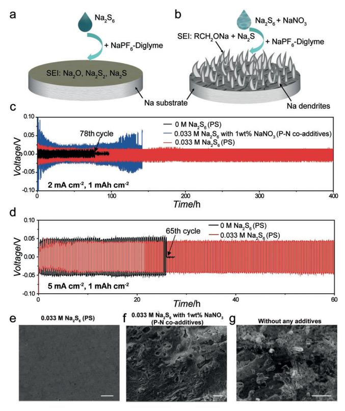
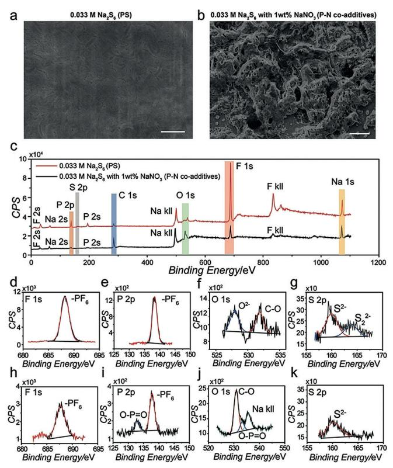
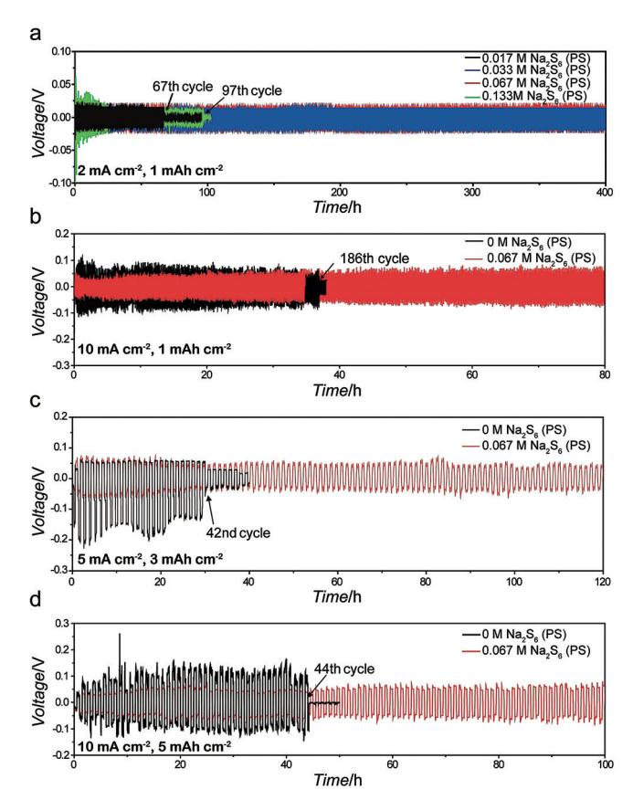
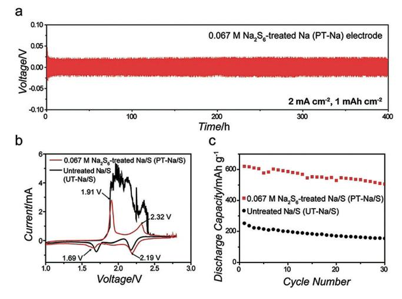

Deutsche Ausgabe: DOI: 10.1002/ange.201801818 Internationale Ausgabe: DOI: 10.1002/anie.201801818

## **Facile Stabilization of the Sodium Metal Anode with Additives: Unexpected Key Role of Sodium Polysulfide and Adverse Effect of Sodium Nitrate**

Huan Wang+, Chuanlong Wang+, Edward Matios, and Weiyang Li\*

**Abstract:** Sodium metal is an attractive anode for nextgeneration energy storage systems owing to its high specific capacity, low cost, and high abundance. Nevertheless, uncon*trolled Na dendrite growth caused by the formation of unstable* solid electrolyte interphase (SEI) leads to poor cycling performance and severe safety concerns. Sodium polysulfide  $(Na_2S_6)$  alone is revealed to serve as a positive additive or pre*passivation agent in ether electrolyte to improve the long-term* stability and reversibility of the Na anode, while  $Na_2S_6$ -NaNO2 as co-additive has an adverse effect, contrary to the prior findings in the lithium anode system. A superior cycling *behavior of Na anode is first demonstrated at a current density* up to 10 mA cm-2 and a capacity up to 5 mAh cm-2 over 100 cycles. As a proof of concept, a high-capacity Na-S battery was prepared by pre-passivating the Na anode with  $Na_2S_6$ . This study gives insights into understanding the differences between Li and Na systems.

 $\mathbf{L}$  ver-increasing energy consumption has incentivized the development of grid-scale energy storage devices by storing electricity generated by renewable sources.[1] Lithium (Li)-ion batteries are the main power sources for portable electronics and electric-powered vehicles.[2] However, the increasing cost and scarcity of Li raw materials have hindered their applications for large-scale energy storage, stimulating research in seeking cost-effective substitutes for Li.[3] Sodium (Na) is the most promising alternative because of its similar chemistry to Li, high abundance, and low cost.

Among the anodes for Na batteries, Na metal outperforms other candidates owing to its lowest redox potential  $(-2.71 \text{ V} \text{ vs. standard hydrogen electrode})$  and high theoretical capacity (1166 mAh  $g^{-1}$ ).[4] Na metal is able to pair with many high-capacity cathodes to form high-energy Na-S, Na- $O2$ , and Na-CO2 batteries having theoretical specific energies 3–4 times higher than those of Li-ion batteries.[5] Despite the advantages, metallic Na anode suffers from severe dendrite growth owing to the formation of unstable solid electrolyte interphase (SEI), causing rapid electrode degradation and short circuit of batteries.[6]

To prevent Na dendrite growth, current research mainly focuses on three approaches: 1) constructing an artificial SEI on Na surface;[7] 2) employing a matrix material to cage Na metal;[8] and 3) tuning the electrolyte compositions.[9] Among these methods, the exploration of appropriate electrolyte is the simplest approach that could be easily adapted to practical applications. It has been recognized that a uniform SEI could be formed in ether electrolyte together with appropriate Na salts.[9a-c] Ether electrolyte is considered the best system for high-energy Na metal batteries,[5,10] and can also be employed in Na-ion batteries.[11] However, recent research showed that the as-formed SEI was not able to maintain its integrity at high current densities.[7b] So far, there have been very few reports on seeking an effective additive in ether electrolyte to stabilize Na anode.

Herein we present the role of sodium polysulfide  $(Na_2S_6)$ as a positive additive and a pre-passivation agent in improving long-term Na anode stability. Prior study on Li metal anode found that a uniform SEI was formed owing to a synergetic effect of both  $Li_2S_8$  and  $LiNO_3$  as additives in ether electrolyte.[12] In this work we find that  $Na_2S_6$  and  $NaNO_3$  as coadditives could result in an extremely unstable environment for Na metal, which provides new insights into understanding the differences between Li and Na systems. We demonstrate that by adding an optimized concentration of  $\text{Na}_2\text{S}_6$ , a superior cycling performance of Na anode can be achieved at a high current density up to  $10 \text{ mA cm}^{-2}$  and a capacity up to  $5 \text{ mAh cm}^{-2}$  over 100 cycles. A highly stable Na anode can also be realized by pre-treating Na metal surface with  $Na_2S_6$ . We further demonstrate a Na-S battery using the surface pretreated Na anode.

Figure 1 a and b illustrate the differences between the SEI formed in diglyme electrolyte with  $Na_2S_6$  alone and with both  $Na_2S_6$  and  $NaNO_3$ , respectively. The SEI (major composition:  $Na_2O$ ,  $Na_2S_2$ , and  $Na_2S$ ) formed with  $Na_2S_6$  alone is stable enough to suppress Na dendrite growth (Figure 1a). In contrast, the as-formed SEI with both  $Na_2S_6$  and  $NaNO_3$ with a composition of sodium alkoxide ( $RCH2ONa$ ) and Na2S results in dendritic/mossy Na growth (Figure 1b). The cycling stability of the Na electrode was studied in symmetric cells. 1M NaPF6 in diglyme with  $0.033$  M Na2S6 (PS) alone and with both  $0.033$  M PS and 1 wt% NaNO3 (ca.  $0.12$  M) as coadditives (P-N co-additives) were employed, respectively, as electrolytes. Figure 1c compares the voltage profiles of the symmetric cells with 0 M PS, 0.033 M PS and P-N co-additives cycling at  $2 \text{ mA cm}^{-2}$  and  $1 \text{ mA h cm}^{-2}$ . The cell without additives (0 M PS) failed after 78 cycles. In contrast, the cell with  $0.033 \text{ m}$  PS alone exhibited a stable voltage profile over 400 cycles. For the case with P-N co-additives, the cell

[\*] Dr. H. Wang, [+] C. Wang, [+] E. Matios, Prof. W. Li Thayer School of Engineering, Dartmouth College 14 Engineering Drive, Hanover, New Hampshire 03755 (USA) E-mail: Weiyang.Li@dartmouth.edu

 $[+]$  These authors contributed equally to this work.

Supporting information and the ORCID identification number(s) for the author(s) of this article can be found under:  $\bigoplus$ https://doi.org/10.1002/anie.201801818.

Figure 1. The role of  $Na_2S_6$  additive and  $Na_2S_6$ -NaNO3 co-additives in affecting Na stability in diglyme electrolyte. The Na surface morphology difference with a) PS alone and b)  $P-N$  co-additives. Galvanostatic cycling of symmetric cells at c)  $2 \text{ mA cm}^{-2}$  and  $1 \text{ mA/h cm}^{-2}$  and d) 5 mA cm $-2$  and 1 mAh cm $-2$ . SEM images of the Na surface after 30 cycles at 2 mA cm-2 and 1 mAh cm-2 with e) 0.033 M PS alone, f) P-N co-additives, and g)  $0 \text{ m}$  PS (no additives). Scale bars in (e)–(g) are  $10 \text{ u}$ m.

exhibited a highly fluctuated voltage profile with a large overpotential.

Moreover, the role of PS additive was more significantly revealed at  $5 \text{ mA cm}^{-2}$  (Figure 1 d). The cell without any additives quickly failed at the 65th cycle, while the one with 0.033 M PS displayed a much more stable voltage profile over 150 cycles. Meanwhile, the addition of 1 wt  $%$  NaNO3 alone also made the voltage profile highly unstable (Supporting Information, Figure S1). Scanning electron microscope (SEM) characterization was performed to reveal the surface condition after 30 cycles (Figure 1 e-g). The Na electrode cycling with  $0.033 \text{ m}$  PS exhibited a smooth surface, while the one with P-N co-additives was very rough with obvious cracks/holes. For the case without any additives, dendritic/ mossy structures could be observed.

The additive effect on Na reversibility was also examined (Supporting Information, Figures S2–S4) and the cell with PS exhibited a high Coulombic efficiency of 99.0% over 500 cycles. By completely stripping the deposited Na from the substrate, we were able to accurately study the morphology/ compositions of the SEI. The SEI formed with PS alone after 10 cycles was uniform (Figure 2a), whereas the SEI formed with P-N co-additives was very rough (Figure 2b).

Angewandte

Chemie

Figure 2. SEM images of SEI layers formed with a) 0.033 M PS alone and b) P-N co-additives, after 10 cycles at 0.5 mA cm-2 and 1 mAh cm-2. Scale bars in (a) and (b) are 10  $\mu$ m. c) Full-survey XPS spectra of respective SEIs. Corresponding  $F_{1s}$ ,  $P_{2p}$ ,  $O_{1s}$ ,  $S_{2p}$  spectra are presented in  $(d)$ – $(g)$  and  $(h)$ – $(k)$ , respectively.

X-ray photoelectron spectroscopy (XPS) was performed to characterize the compositions of the respective SEIs. The peaks of Na, C, F, P, and O could be detected in the full survey XPS spectra (Figure 2c). The binding energies of all elements were calibrated with respect to  $C_{1s}$  at 284.8 eV (Supporting Information, Figure S5). It is noticed that the peak intensities of F and P in the SEI with PS alone are much stronger than those with P-N co-additives. As to  $F_{1s}$  spectra (Figure 2d,h), both peaks were located at 687 eV, which could be assigned to  $PF_6^-$  of the NaPF6 salt.[10,13] This is consistent with the peaks located at 138 eV in  $P_{2p}$  spectra (Figure 2 e,i). For  $P_{2p}$  spectra, the SEI formed with P-N co-additives displayed an extra peak at 133 eV, which was assigned to  $O-P=O$  and in accordance with the peak at 533.1 eV in the  $O_{1s}$  spectrum (Figure 2i). The existence of O-P=O may originate from  $Na_rPF_vO_z$ , a major decomposition product of NaPF6.[13]

As to  $O_{1s}$ , for the case with PS alone (Figure 2 f), the peaks at 528.1 eV, 531.9 eV correspond to  $O^{2-}$  in Na2O,[14] and C-O, respectively. For the case with P-N co-additives (Figure 2j), the two peaks at 531.1 eV and 535.7 eV could be assigned to C-O and Na kll, respectively, and no signal from Na2O could be detected. The C-O peak could be from RCH2ONa, a major reduction product of diglyme.[9a] Therefore, we can infer that the much weaker peak intensities of P and F for the case with P-N co-additives could be due to the continuous side reactions among Na, diglyme, NaPF6, and co-additives. The much higher peak intensity of RCH2ONa for the case with P-N co-additives indicates that RCH2ONa is the main composition of its SEI. As to S2p, two peaks could be detected for the case with PS alone (Figure 2 g), corresponding to S 2@ in Na2S (160.4 eV) and S2 2@ in Na2S2 (163.8 eV),[15] respectively. There was only one Na2S peak located at 160.2 eV (Figure 2 k) with P-N co-additives. No signal from NaF (684 eV) was detected for both cases (Figure 2 d,h). This is different from the reported work, in which the SEI was mainly composed of NaF without additives. [9a]

From the analyses above it is concluded that the SEI formed with only PS as an additive is mainly composed of Na2O, Na2S2 , and Na2S, which is robust enough to protect the Na surface from further reacting with the electrolyte components. However, this stable SEI could not be formed when P-N co-existed, possibly because Na metal could preferentially react with NaNO3 because of the much stronger oxidizing ability of NaNO3 than that of PS. The SEI formed in this case could not protect Na from further reacting with electrolyte components, causing continuous decomposition of NaPF6 / diglyme and dendrite growth. Our result of Na metal is quite different from the previous report of Li metal, in which a synergistic effect of Li2S8 -LiNO3 could suppress Li dendrite growth and electrolyte decomposition.[12]

We further studied the cycling stability of Na electrodes in symmetric cells with different PS concentrations. For the cell with 0.017m PS, short circuiting occurred at the 67th cycle because the PS concentration is too low to form a robust SEI. In contrast, a flat voltage plateaus can be maintained over 400 cycles with 0.033m and 0.067m PS (Figure 3 a; Supporting Information, Figure S6). When 0.133m PS was added, voltage profile was much more fluctuant and short-circuited at the 97th cycle. This is because at such a high concentration, PS could react with Na surface too violently to form a uniform SEI. The cell with 0.067m PS exhibited a much more stable voltage profile over 400 cycles at 5 mA cm@2 (Supporting Information, Figure S7), while the cell with 0.033m PS failed at the 354th cycle. Hence, the optimal PS concentration to stabilize Na electrode is about 0.067m. Moreover, the Na electrode with 0.067m PS displayed a superior cycling behavior at an increased current density or capacity (10 mAcm@2 , 1 mAhcm@2 over 400 cycles in Figure 3 b and the Supporting Information, Figure S8, and 5 mA cm @2 , 3 mAhcm@2 over 100 cycles in Figure 3 c), while the cell without additives short-circuited at the 186th and 42nd cycle, respectively. It is worth mentioning that a stable voltage profile with an overpotential of about 52 mV over 100 cycles could still be achieved at a very high current density of 10 mAcm@2 and a high capacity of 5 mAhcm@2 (Figure 3 d). In contrast, the cell without additives exhibited a high overpotential and failed at the 44th cycle.

Besides using PS as an electrolyte additive, we also employed PS as a pre-treating agent. ArcherQs group reported the use of bromopropane to pre-stabilize Na surface. [16] In light of this, we immersed Na electrode in diglyme electrolyte with 0.067m PS to form a passivation layer on Na surface. The symmetric cell with two identical PS-treated (PT) Na electrodes displayed a stable voltage profile over 400 cycles (Figure 4 a). Na-S batteries were fabricated to demonstrate the

Figure 3. Galvanostatic cycling of symmetric cells with different concentrations of PS at a) 2 mAcm@2 and 1 mAhcm@2 , b) 10 mA cm@2 and 1 mAhcm@2 , c) 5 mAcm@2 and 3 mAhcm@2 , and d) 10 mAcm@2 and 5 mAhcm@2 .

Figure 4. a) Galvanostatic cycling of a symmetric cell made from two identical PT-Na electrodes, cycled at 2 mA cm@2 and 1 mAhcm@2 without additives. b) Typical CV curves of PT-Na/S cell (red line) and UT-Na/S cell (black line). c) Discharge capacities vs. cycle numbers of PT-Na/S (red squares) and UT-Na/S cells (black spheres) at 1 C.

contributive effect of Na2S6 passivation on Na anode. PT-Na and fresh Na metal without treatment (UT-Na) were used as anode, respectively. Hollow S nanospheres coated with poly(3,4-ethylenedioxythiophene) was employed as cathode. [17] For the anodic peaks in the cyclic voltammetry (CV) curves, there were two sharp peaks at 1.91 V and 2.32 V for PT-Na/S, which correspond the transitions from insoluble Na2Sx to soluble ones and further oxidized to S. For UT-Na/S cell, the two anodic peaks displayed a broad and rough curve, indicating the difficulty in completing the conversion owing to a severe shuttle effect. A similar comparison was also seen in the charge–discharge curves (Supporting Information, Figure S9). Figure 4 c compared the discharge capacities of PT-Na/S and UT-Na/S cells at a current rate of 1 C (1 C = 1675 mAg @1 ; high current rate was tested to better reveal the influence of Na anode). The PT-Na/S cell exhibited a high specific capacity of 621 mAhg @1 and was maintained at 508 mAhg @1 after 30 cycles. In contrast, the UT-Na/S cell displayed a low discharge capacity of 252 mAhg @1 and dropped to 159 mAhg @1 after 30 cycles. These results clearly show that the pre-passivation of Na surface could protect Na anode and alleviate the shuttle effect.

In conclusion, we revealed that using Na2S6 as an electrolyte additive or pre-passivation agent could improve the longterm stability of Na anode, while Na2S6 -NaNO3 as coadditives could seriously deteriorate the electrode. A stable voltage profile could be achieved even at a high current density of 10 mAcm@2 and a capacity of 5 mAhcm@2 . A Na-S battery with improved performance was also demonstrated via pre-passivating Na anode with Na2S6 .

## Acknowledgements

The authors greatly acknowledge the support from Young Investigator Program funded by US Air Force Office of Scientific Research under award FA9550-17-1-0184, and support from the start-up funds at Thayer School of Engineering, Dartmouth College. The authors also thank Dr. Hailiang Wang and Dr. Min Li from Yale University on the assistance of XPS characterization.

## Conflict of interest

The authors declare no conflict of interest.

Keywords: additives · sodium metal anodes · sodium nitrate · sodium polysulfide · stability

How to cite: Angew. Chem. Int. Ed. 2018, 57, 7734– 7737 Angew. Chem. 2018, 130, 7860– 7863

- [1] D. Larcher, J. M. Tarascon, Nat. [Chem.](https://doi.org/10.1038/nchem.2085) 2015, 7, 19 29.
- [2] A. Yoshino, [Angew. Chem.](https://doi.org/10.1002/anie.201105006) Int. Ed. 2012, 51, 5798 5800; [Angew.](https://doi.org/10.1002/ange.201105006) [Chem.](https://doi.org/10.1002/ange.201105006) 2012, 124, 5898 – 5900.
- [3] M. D. Slater, D. Kim, E. Lee, C. S. Johnson, [Adv. Funct.](https://doi.org/10.1002/adfm.201200691) Mater. 2013, 23, 947 [– 958](https://doi.org/10.1002/adfm.201200691).

- [4] A. P. Cohn, N. Muralidharan, R. Carter, K. Share, C. L. Pint, Nano Lett. 2017, 17, 1296 [– 1301.](https://doi.org/10.1021/acs.nanolett.6b05174)
- [5] a) A. Manthiram, X. Yu, Small 2015, 11[, 2108](https://doi.org/10.1002/smll.201403257) 2114; b) P. Hartmann, C. L. Bender, M. Vracar, A. K. Durr, A. Garsuch, J. Janek, P. Adelhelm, Nat. [Mater.](https://doi.org/10.1038/nmat3486) 2013, 12, 228 – 232; c) X. Hu, J. Sun, Z. Li, Q. Zhao, C. Chen, J. Chen, [Angew. Chem.](https://doi.org/10.1002/anie.201602504) Int. Ed. 2016, 55, 6482 [– 6486](https://doi.org/10.1002/anie.201602504); [Angew. Chem.](https://doi.org/10.1002/ange.201602504) 2016, 128, 6592 – 6596.
- [6] H. Yadegari, Q. Sun, X. Sun, [Adv. Mater.](https://doi.org/10.1002/adma.201504373) 2016, 28, 7065 7093.
- [7] a) W. Luo, C.-F. Lin, O. Zhao, M. Noked, Y. Zhang, G. W. Rubloff, L. Hu, [Adv. Energy](https://doi.org/10.1002/aenm.201601526) Mater. 2017, 7, 1601526; b) Y. Zhao, L. V. Goncharova, A. Lushington, Q. Sun, H. Yadegari, B. Wang, W. Xiao, R. Li, X. Sun, Adv. Mater. 2017, 29; c) Y. J. Kim, H. Lee, H. Noh, J. Lee, S. Kim, M. H. Ryou, Y. M. Lee, H. T. Kim, [ACS](https://doi.org/10.1021/acsami.6b14437) Appl. [Mater. Interfaces](https://doi.org/10.1021/acsami.6b14437) 2017, 9, 6000 – 6006; d) H. Wang, C. Wang, E. Matios, W. Li, Nano Lett. 2017, 17, 6808 [– 6815](https://doi.org/10.1021/acs.nanolett.7b03071); e) Y. Zhao, L. V. Goncharova, Q. Zhang, P. Kaghazchi, Q. Sun, A. Lushington, B. Wang, R. Li, X. Sun, Nano Lett. 2017, 17[, 5653](https://doi.org/10.1021/acs.nanolett.7b02464) – [5659](https://doi.org/10.1021/acs.nanolett.7b02464).
- [8] a) W. Luo, Y. Zhang, S. Xu, J. Dai, E. Hitz, Y. Li, C. Yang, C. Chen, B. Liu, L. Hu, Nano Lett. 2017, 17, 3792 [– 3797;](https://doi.org/10.1021/acs.nanolett.7b01138) b) H. J. Yoon, N. R. Kim, H.-J. Jin, Y. Yun, Adv. Energy Mater. 2017, 7, 1701261; c) S. Liu, S. Tang, X. Zhang, A. Wang, Q. Yang, J. Luo, Nano Lett. 2017, 17, 5862 [– 5868](https://doi.org/10.1021/acs.nanolett.7b03185); d) A. Wang, X. Hu, H. Tang, C. Zhang, S. Liu, Y. Yang, Q.-H. Yang, J. Luo, [Angew. Chem.](https://doi.org/10.1002/anie.201703937) Int. Ed. 2017, 56, 11921 [– 11926](https://doi.org/10.1002/anie.201703937); [Angew. Chem.](https://doi.org/10.1002/ange.201703937) 2017, 129, 12083 – [12088](https://doi.org/10.1002/ange.201703937); e) D. Zhang, B. Li, S. Wang, S. Yang, [ACS Appl.](https://doi.org/10.1021/acsami.7b12568) Mater. [Interfaces](https://doi.org/10.1021/acsami.7b12568) 2017, 9, 40265 – 40272; f) S.-S. Chi, X.-G. Qi, Y.-S. Hu, L.-Z. Fan, Adv. Energy Mater. 2018, 8, 1702764.
- [9] a) Z. W. Seh, J. Sun, Y. Sun, Y. Cui, [ACS Cent.](https://doi.org/10.1021/acscentsci.5b00328) Sci. 2015, 1, 449 [455](https://doi.org/10.1021/acscentsci.5b00328); b) J. Lee, Y. Lee, J. Lee, S. M. Lee, J. H. Choi, H. Kim, M. S. Kwon, K. Kang, K. T. Lee, N. S. Choi, [ACS Appl.](https://doi.org/10.1021/acsami.6b14878) Mater. [Interfaces](https://doi.org/10.1021/acsami.6b14878) 2017, 9, 3723 – 3732; c) R. Cao, K. Mishra, X. Li, J. Qian, M. H. Engelhard, M. E. Bowden, K. Han, K. T. Mueller, W. A. Henderson, J.-G. Zhang, Nano [Energy](https://doi.org/10.1016/j.nanoen.2016.09.013) 2016, 30, 825 – 830; d) J. Song, G. Jeong, A. J. Lee, J. H. Park, H. Kim, Y. J. Kim, [ACS](https://doi.org/10.1021/acsami.5b08111) Appl. [Mater. Interfaces](https://doi.org/10.1021/acsami.5b08111) 2015, 7, 27206 – 27214; e) D. Ruiz-Mart&nez, A. Kovacs, R. Glmez, Energy [Environ.](https://doi.org/10.1039/C7EE01735A) Sci. 2017, 10, 1936 [– 1941.](https://doi.org/10.1039/C7EE01735A)
- [10] L. Lutz, D. Alves Dalla Corte, M. Tang, E. Salager, M. Deschamps, A. Grimaud, L. Johnson, P. G. Bruce, J. M. Tarascon, [Chem.](https://doi.org/10.1021/acs.chemmater.7b01953) Mater. 2017, 29, 6066 – 6075.
- [11] K. Xu, [Chem.](https://doi.org/10.1021/cr030203g) Rev. 2004, 104, 4303 4417.
- [12] W. Li, H. Yao, K. Yan, G. Zheng, Z. Liang, Y. M. Chiang, Y. Cui, Nat. Commun. 2015, 6, 7436.
- [13] M. Nie, J. Demeaux, B. T. Young, D. R. Heskett, Y. Chen, A. Bose, J. C. Woicik, B. L. Lucht, J. [Electrochem.](https://doi.org/10.1149/2.0021513jes) Soc. 2015, 162, A7008 [– A7014.](https://doi.org/10.1149/2.0021513jes)
- [14] B. Philippe, R. Dedryvere, J. Allouche, F. Lindgren, M. Gorgoi, H. Rensmo, D. Gonbeau, K. Edstrom, [Chem.](https://doi.org/10.1021/cm2034195) Mater. 2012, 24, 1107 [– 1115.](https://doi.org/10.1021/cm2034195)
- [15] S. Wei, S. Xu, A. Agrawral, S. Choudhury, Y. Lu, Z. Tu, L. Ma, L. A. Archer, Nat. [Commun.](https://doi.org/10.1038/ncomms11722) 2016, 7, 11722.
- [16] S. Choudhury, S. Wei, Y. Ozhabes, D. Gunceler, M. J. Zachman, Z. Tu, J. H. Shin, P. Nath, A. Agrawal, L. F. Kourkoutis, T. A. Arias, L. A. Archer, Nat. Commun. 2017, 8, 898.
- [17] W. Li, Q. Zhang, G. Zheng, Z. W. Seh, H. Yao, Y. Cui, [Nano](https://doi.org/10.1021/nl403130h) Lett. 2013, 13, 5534 [– 5540](https://doi.org/10.1021/nl403130h).

Manuscript received: February 13, 2018

Accepted manuscript online: April 25, 2018

Version of record online: May 25, 2018