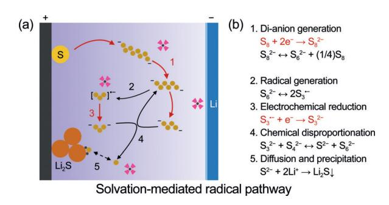
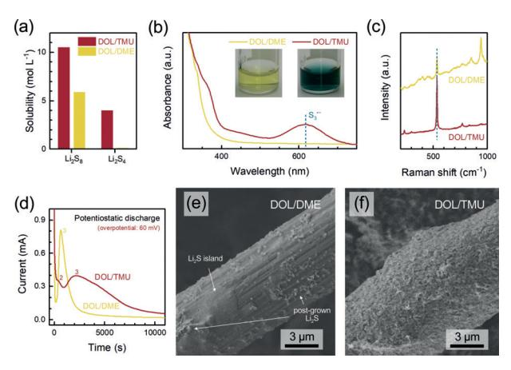
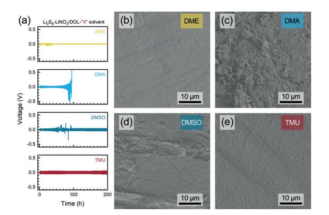
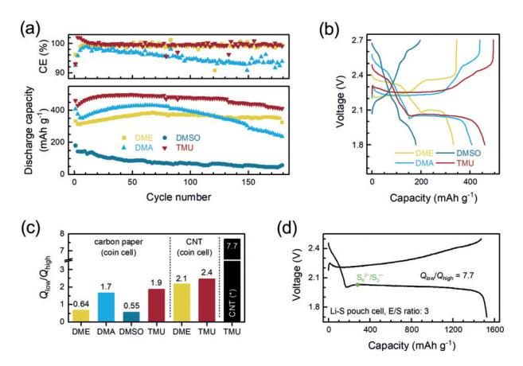

Internationale Ausgabe: DOI: [10.1002/anie.201810132](http://dx.doi.org/10.1002/anie.201810132) Electrolytes Hot Paper Deutsche Ausgabe: DOI: [10.1002/ange.201810132](http://dx.doi.org/10.1002/ange.201810132)

# The Radical Pathway Based on a Lithium-Metal-Compatible High-Dielectric Electrolyte for Lithium–Sulfur Batteries

Ge Zhang+ , Hong-Jie Peng+ , Chen-Zi Zhao, Xiang Chen, Li-Da Zhao, Peng Li, Jia-Qi Huang, and Qiang [Zhang\\*](http://orcid.org/0000-0002-3929-1541)

Abstract: High-dielectric solvents were explored for enhancing the sulfur utilization in lithium–sulfur (Li@S) batteries, but their applications have been impeded by low stability at the lithium metal anode. Now a radical-directed, lithium-compatible, and strongly polysulfide-solvating high-dielectric electrolyte based on tetramethylurea is presented. Over 200 hours of cycling was realized in Li j Li symmetric cells, showing good compatibility of the tetramethylurea-based electrolyte with lithium metal. The high solubility of short-chain polysulfides, as well as the presence of active S3 C@ radicals, enabled pouch cells to deliver a discharge capacity of 1524 mAhg @1 and an energy density of 324 Whkg@1 . This finding suggests an alternative recipe to ether-based electrolytes for Li@S batteries.

The rapidly growing global demand for energy appeals for advanced energy storage systems beyond current lithium-ion batteries. The lithium metal anode is regarded as the cornerstone of next-generation secondary batteries. [1] To fully exert the virtue of high-capacity lithium anode, high-capacity cathode materials like sulfur are strongly preferred. Benefiting from the multi-electron conversion reactions, the sulfur cathode delivers a theoretical capacity of 1675 mAhg @1 , and endows lithium–sulfur (Li@S) batteries with a remarkable energy density up to 2600 Whkg@1 , far exceeding the theoretical limits of lithium-ion batteries. [2]

Substantial efforts have been dedicated in the past decade to addressing the issues of Li@S batteries, such as the insulating sulfur compounds and the shuttle effect.[3] Despite these efforts, there is still a huge gap between the practical energy density and the theoretical value, owing to 1) low sulfur utilization, 2) undesirable sulfur content, 3) low areal loading of sulfur, 4) large excess of lithium anode, and 5) large electrolyte-to-sulfur mass ratio (E/S ratio).[4] Among them, E/ S ratio and sulfur utilization have the most significant implications on energy density (Supporting Information, Figure S1).[5] Nevertheless, low E/S ratio is always counterbalanced by the simultaneous decline of sulfur utilization in conventional ether-based electrolytes. Therefore, understanding the interplay between electrolyte and sulfur species and further rationalizing the electrolyte recipe appears to be crucial and urgent to close the gap.

The counterbalance between low E/S ratio and high sulfur utilization is essentially associated with the solvation of sulfur species in electrolytes. Owing to the medium polarity (a dielectric constant, e, of around 7 at 25 8C), the most common dimethoxyethane (DME)/dioxolane (DOL) electrolyte only allows moderate solvation of polysulfides, always resulting in cathode passivation via the early precipitation of lowsolubility short-chain polysulfides (Li2Sn , n , 4; Supporting Information, Figure S2a).[6] To circumvent this dilemma, one approach is to decouple the reaction of elemental sulfur from polysulfide dissolution through non/sparsely polysulfide-solvating electrolytes (Supporting Information, Figure S2b).[7] Nevertheless, the slow reaction and transport kinetics at room temperature are the major challenges. Another approach is to enhance the solvation of sulfur species by employing high-e solvents (Supporting Information, Figure S2c).[8–10] Unfortunately, the poor stability of high-e solvents hinders their applications in batteries. It is therefore highly desirable to find a high-e electrolyte that is compatible with lithium anode and high-loading sulfur cathode.

Herein, we explored a radical-directed, lithium-compatible, and strongly polysulfide-solvating electrolyte based on a high-e aprotic solvent of tetramethylurea (TMU) to resolve the conflict between reducing electrolyte amount and obtaining high capacities (Figure 1 a). High-e solvents such as

Figure 1. a) Illustration of the solvation-mediated radical pathway for Li@S batteries with a TMU-based electrolyte. Arrow: red solid: electrochemical reduction; black solid: chemical dissociation of S6 2@ into S3 C@ and their disproportionation; black dashed: dissolution/precipitation equilibrium. b) Proposed radical pathway adopted from the operando X-ray absorption near edge spectroscopic (XANES) study by Cuisinier et al.[8]

16974 T 2018 Wiley-VCH Verlag GmbH & Co. KGaA, Weinheim Angew. Chem. 2018, 130, 16974 –16978

[\*] G. Zhang,[+] Dr. H.-J. Peng,[+] C.-Z. Zhao, X. Chen, L.-D. Zhao, P. Li, Prof. Q. Zhang Beijing Key Laboratory of Green Chemical Reaction Engineering and Technology, Department of Chemical Engineering Tsinghua University, Beijing 100084 (P. R. China) E-mail: zhang-qiang@mails.tsinghua.edu.cn Prof. J.-Q. Huang Advanced Research Institute of Multidisciplinary Science Beijing Institute of Technology Beijing 100081 (P. R. China) [ +

] These authors contributed equally to this work.

Supporting information and the ORCID identification number(s) for the author(s) of this article can be found under: [https://doi.org/10.1002/anie.201810132.](https://doi.org/10.1002/anie.201810132)

dimethyl sulfoxide (DMSO), dimethyl acetamide (DMA), and dimethyl formamide reported in early studies have been suggested to effectively stabilize a highly active intermediate, the  $S_3$ - radical, directing a reaction pathway toward high sulfur utilization (Figure 1b).[8,10] TMU exhibits a comparable ability to solvate  $S_3$ - radicals but possesses better anodic stability against metallic lithium. With DOL as the co-solvent that assists to passivate the lithium, the DOL/TMU ( $v/v = 1:1$ ) electrolyte enabled a mediated reaction mechanism at electrolyte-starved conditions. Practically, 20% higher capacities were yielded in Li-S coin cells and a high energy density of 324 Wh kg-1 was achieved in a pouch cell employing TMU-based electrolyte.

TMU was selected due to its high  $\varepsilon$  and relatively low viscosity that are comparable to previously validated high- $\varepsilon$  solvents of DMSO and DMA, as well as low vapor pressure and high flash point for safety concerns (Supporting Information, Table S1). By directly measuring the solubility, we found that TMU could dissolve  $10.5 \text{ mol L}^{-1}$  (M) Li2S8 (in sulfur) even when diluted to 50% by DOL (denoted as DOL/ TMU), which was more than twice the solubility in DOL/ DME (Figure 2a). More importantly,  $4.0 \text{ m}$  of Li2S4 (a)

**Figure 2.** Properties of TMU-based electrolyte. a) Solubility of  $Li_2S_8$  and Li2S4 in DOL/TMU vs. in DOL/DME. b) Ultraviolet-visible light (UV/ Vis) spectra of 2 mm [S]  $Li_2S_6$ -solution. Inset: optical photographs of the corresponding solutions. c) Raman spectra of 200 mm [S]  $\text{Li}_2\text{S}_6$ solution. d) Chronoamperometry profiles in two electrolytes. Scanning electron microscopy (SEM) images of carbon fibers discharged in e) DOL/DME and f) DOL/TMU for 60000 s.

representative of short-chain polysulfides) can be dissolved in DOL/TMU, in contrast to no more than 0.10M in DOL/ DME, consistent with previous reports.[9] The solubility of  $Li_2S_4$  in DOL/TMU even exceeded the reported value in DMSO, suppressing the early passivation of electrode.[9] The high  $\varepsilon$  contributes to reducing the electrostatic interaction between Li+ cations and polysulfide anions, leading to such an unprecedented solubility of polysulfides, especially the shortchain ones.

Besides the solubility, TMU also alters the polysulfide speciation significantly compared to DME. The existence of  $S_3$ - was indicated by the light blue color of a dilute Li2S6-DOL/TMU solution, different from the light vellow Li2S6-

DOL/DME solution (Figure 2b, inset).[8] Spectroscopic evidence corresponds well with our visual observation: the characteristic peaks of  $S_3$ -- (625 nm for UV/Vis and 535 cm-1) for Raman spectrum) possess high intensity in DOL/TMU, whereas in DOL/DME they are hardly observable (Figure 2b,c).[10–12] The stabilization of  $S_3$ - radicals is attributed to the larger dipole moment of TMU than DME to afford stronger solvation effect towards Li+ cations in lithium polysulfide clusters.

As demonstrated previously, high- $\varepsilon$  solvents are featured with  $S_3$ - radicals.[8, 10] Nevertheless, the implication of radicals on the reaction kinetics has rarely been investigated. In this sense, chronoamperometry was performed to probe the electrodeposition kinetics of lithium sulfide (Li2S; Figure 2d).[13,14] Driven by an identical overpotential of 60 mV vs. the equilibrium potential determined by galvanostatic intermittent titration technique (GITT; Supporting Information, Figure S3), the nucleation and growth of  $Li2S$  in DOL/ TMU exhibited significantly different characteristics from in DOL/DME. There are two peaks for the chronoamperometry curve of DOL/TMU: one at 320 s and the other at 2200 s (denoted as peak 2 and 3, respectively), while for DOL/DME, there is only one peak at 660 s. Since  $S_3$ - only exists in DOL/ TMU, we attribute the prior peak 2 to the reduction of  $S_3$ - because of its higher activity than dianions.[8,10] And the peak 3, that is, the only peak in DOL/DME, is ascribed to the conversion of diamons (for example,  $S_4^{2-}$ ) to Li2S. Fan et al. explained the current peak as the point when the carbon/ electrolyte/Li2S triple-phase boundary possessed the longest length.[13] According to the Avrami equation and a twodimensional (2D) nucleation/growth model, the time  $(t_m)$  at which the maximum current density occurs can be described as:

# $t_m = (\pi A k^2/2)^{-1/3}$

where  $A$  and  $k$  are nucleation and growth rates of Li2S, respectively. The term  $Ak^2$  thereby indicates the deposition kinetics of Li2S. For DOL/DME with a dianion reaction pathway,  $Ak^2 = 2.22 \times 10^{-9} \text{ s}^{-3}$ ; while for DOL/TMU, the radical (peak 2) and dianion (peak 3) pathways render a  $Ak^2$  of  $1.98 \times 10^{-8}$  and  $6.87 \times 10^{-11}$  s-3, respectively. Such a difference in kinetic parameters corresponds well with the previous predication and observation.[13,15] The lower ionic conductivity explains the later peak 3 of DOL/TMU than DOL/DME (that is, smaller  $Ak^2$ ) (Supporting Information, Figure S4); while the kinetically faster radical-to-Li2S conversion yields smaller nucleus size and larger nucleation density.[16]

By comparing the chronoamperometry curves derived from 2D Avrami equation (see the Supporting Information), it was found that the experimental curves were biased from ideal ones, especially for DOL/TMU (Supporting Information, Figure S5). Since the Avrami equation is a simplified description, the observed bias, mostly derived from post-peak profiles, can be ascribed to an Ostwald ripening process.[16] Li2S clusters deposited at the triple-phase boundary were prone to dissolve and diffuse, transforming the 2D Li2S deposits to larger particles with smaller surface energy and thereby postponing the cathode passivation. In DOL/DME, the negligible solubility of S 2@ impeded this transformation, maintaining a 2D deposit morphology with few post-grown particles (Figure 2 e). While in DOL/TMU, the soluble S 2@ facilitated the post-growth on existed Li2S rather than at the triple-phase boundary, resulting in thicker, denser, yet porous precipitates (Figure 2 f). The precipitation capacities for DOL/DME and DOL/TMU were calculated as 146 and 343 mAhg @1 , respectively, corresponding well with the capacity of the second plateau (Qlow, in against to Qhigh referring to high-plateau capacity) in galvanostatic discharge (Supporting Information, Figure S6).

To validate the above peak assignment during chronoamperometry analysis, differential galvanostatic discharge profiles (dQ/dV) with Li2S6 /DOL-X electrolytes (X represents the solvent, including DME, DMA, DMSO, and TMU) were plotted (Supporting Information, Figure S7). It is shown that unlike DME, of which the dQ/dV only contain two cathodic peaks at approximately 2.35 and 2.08 V (denoted as peak 1 and 3), respectively, high-e electrolytes based on DMA, DMSO, and TMU all exhibit an extra peak at 2.1–2.2 V (denoted as peak 2). Since it is a common characteristic, it is deduced that the peak 2 is related to distinct S3 C@ radicals in high-e electrolytes, which is also in accordance with the observation by Cuisinier et al. from operando XANES. [8] Therefore, as illustrated in Figure 1 b, high-e electrolytes based on TMU enable a solvation-mediated radical pathway toward high sulfur utilization.[11,17]

Although the radical pathway is promising toward high sulfur utilization, the high-e electrolytes suffer from severe issue of incompatibility with lithium metal owing to the high reactivity. [8, 9] To evaluate the anodic stability, Li jLi symmetric cells were constructed with various Li2S6 /DOL-X electrolytes (hereinafter referred to the X co-solvent) (Figure 3 a). The addition of Li2S6 and lithium nitrate co-salt synergistically contribute to a stable solid electrolyte interphase (SEI) and suppression of lithium dendrite growth; [18] while the DOL cosolvent can further reinforce the SEI via ring-opening oligomerization.[19] As demonstrated in Figure 3 a, Li jLi symmetric cell with TMU exhibited highly reversible lithium stripping/plating for over 200 h. The cycling stability was comparable to that of DME despite the larger voltage polarization. In contrast, the overpotential of DMA cell increased rapidly after only 80 h, and the cell impedance was essentially infinite after 100 h possibly because of electrolyte dry-up. Unlike DMA, the DMSO cell exhibited no progressively increasing polarization, but the voltage–time profile kept fluctuating during the initial 100 h, implying unstable interfaces.

After washing the electrolyte residue away, a dense and flat surface was observed for lithium cycled in TMU and DME electrolytes (Figure 3 b,e). On the contrary, the lithium surface was rough and pulverized with a plenty of mossy lithium deposits after cycling in DMA and DMSO electrolytes (Figure 3 c,d). Mossy lithium whiskers were reported to form through a stress buildup/release process when solvent decomposition rate was high enough to compete with lithium deposition, whereas dense lithium clusters were observed in the opposing situation.[20] Therefore, TMU, unlike DMA and DMSO, may enable the reversible cycling of lithium through either a stable SEI that effectively blocks the solvent molecules or a lower decomposition rate than lithium ion reduction rate under our experimental conditions. X-ray photoelectron spectroscopy further suggests that SEI induced by TMU contains the highest amount of inorganic compounds that are beneficial to SEI reinforcement and ion conduction (Supporting Information, Figures S8, S9).[21, 22] Besides, TMU also contributes greatly to the suppression of salt decomposition owing to its low Gutmann acceptor number (AN) for anion solvation (see the Supporting Information).

Li j polysulfide cells using carbon paper as cathode current collectors were evaluated to examine each Li2S6 /DOL-X electrolyte. DME served as a standard reference, which enabled stable cycling for 180 cycles at 0.1 C with an average Coulombic efficiency (CE) of 99.5% after the initial 5 cycles (Figure 4 a). However, the capacity was no more than 380 mAhg @1 . The low capacity can be attributed to the

Figure 3. Lithium metal compatibility. a) Voltage vs. time profile of Li j Li symmetric cells at a current density of 0.25 mAcm@2 and a capacity of 0.25 mAhcm@2 . SEM images of lithium surfaces after 10 cycles in symmetric cells with b) DME, c) DMA, d) DMSO, and e) TMU-based electrolytes.

Figure 4. Battery applications. a) Cycling performance of Li j polysulfide coin cells at a current density of 0.1 C. b) Galvanostatic discharge–charge voltage profile for the first cycle. c) Qlow/Qhigh of each Li-S cell. \* refers to the pouch cell shown in (d). d) Galvanostatic discharge–charge profile for the first cycle of a pouch cell with TMU electrolyte (sulfur loading: 2.5 mgcm@2 ).

incomplete conversion of Li2S4 to Li2S, as the short low voltage plateau indicated (Figure 4 b). Among three highe electrolytes, DMSO was troubled by severe polarization, delivering very low capacities. More importantly, the CE of DMSO cell fluctuated extremely (Supporting Information, Figure S10). An ultralow CE of 20%, along with severe overcharge, was recorded, suggesting an uncontrolled shuttle effect. The cell with DMA offered an initial discharge capacity of 407 mAhg @1 , but the capacity decayed rapidly after 100 cycles with only 54% retained at the end. The CE also continuously dropped to around 90%. The fast capacity and CE decay was attributed to the high reactivity of DMA toward lithium, as well as the resultant electrolyte depletion. In sharp contrast, the cell with TMU achieved the highest reversible capacity (ca. 500 mAhg @1 , 32% higher than DME), stable CE of 99.6% in average, and the least capacity loss over 180 cycles, demonstrating the superior compatibility of TMU for Li@S batteries than other high-e solvents.

The voltage profiles reveal that the difference in specific capacity is mainly due to Qlow, which is closely related to the Li2S precipitation (Figure 4 b). Herein, the ratio of Qlow/Qhigh is employed to evaluate the conversion efficiency to Li2S and summarized in Figure 4 c. The Qlow/Qhigh of each cell is in order of DMSO (0.55) < DME (0.64) < DMA (1.7) < TMU (1.9). Generally, high-e electrolytes (DMA and TMU) possess a high Qlow/Qhigh since the radical pathway leads to more Li2S precipitation as indicated in Figure 2. The only exception is DMSO, which possesses an even lower Qlow/Qhigh than DME. The inferior kinetics of DMSO is probably ascribed to its higher viscosity (2.24 cP) than other solvents, which retards the diffusion of solvated Li2S clusters to form larger precipitates (Supporting Information, Table S1). Its highest AN also renders strong polysulfide anion solvation, yielding additional energy penalty from desolvation before reduction.

Owing to the relatively low surface area of carbon paper, the full conversion to Li2S was hindered. Therefore, Li@S coin cells with high-surface-area carbon nanotube (CNT)/S composite cathode were fabricated, realizing a CE over 98% and an initial discharge capacity of 1134 mAhg @1 at 0.1 C with TMU electrolyte (Supporting Information, Figure S11). Compared to the capacity of DME cell (943 mAhg @1 ), the TMU cell exhibited 20% enhancement, and such an enhancement was mainly due to the increase in Qlow (Supporting Information, Figure S12). Correspondingly, the Qlow/Qhigh reached 2.1 and 2.4 for DME and TMU electrolytes, respectively (Figure 4 c). Note that the TMU coin cell exhibited considerable kinetic polarization as GITT indicated (Supporting Information, Figure S13). Thus, decreasing the current density to 0.05 C rendered better cyclability (Supporting Information, Figure S11).

The effectiveness of TMU electrolyte was further examined in Li@S pouch cells at an electrolyte-starved condition (E/S mass ratio 3), demonstrating an ultrahigh initial capacity of 1524 mAhg @1 at 0.05 C (Figure 4 d). The TMU-based pouch cell also survived at a limited cycling condition (Supporting Information, Figure S14). Owing to the simultaneous decrease in electrolyte amount and increase in sulfur utilization (91%), a high energy density of 324 Whkg@1 based on the full cell was achieved (Figure 4 d). The most distinct cell feature with a limited amount of TMU electrolyte is the unusually long lower plateau (1350 mAhg @1 ), resulting in a Qlow/Qhigh of 7.7 and exceeding the maximum capacity in ether electrolyte (1256 mAhg @1 by assuming Li2S4 -to-Li2S full conversion). This feature is desirable for practical electrolytestarved Li@S batteries because the generation of solid products is much earlier than in DOL/DME, thereby demanding for less electrolyte to dissolve polysulfides. It is interesting to note that the onset of liquid-to-solid conversion in TMU is even earlier than the point at which all S8 could be reduced to S3 C@ . That may be explained as the prior saturation of S3 C@ to drive the disproportionation at an electrolytestarved condition. Mechanistic insights are required with the assist of advanced in situ or operando characterization.

In conclusion, we proposed a high-e electrolyte for Li@S batteries based on lithium-metal-compatible TMU, enabling a solvation-mediated radical pathway to achieve high sulfur utilization. TMU exhibited favorable Li2S deposition kinetics and better compatibility toward lithium anode than other high-e solvents. At an electrolyte-starved condition, the Li@S pouch cell realized a high sulfur utilization of 91% and a high energy density of 324 Whkg@1 , offering a promising route toward practical high-energy Li@S batteries. However, extended cycling was still hindered due to the electrolyte depletion at harsh conditions. Therefore, when decreasing the E/S ratio for Li@S batteries, the electrolyte consumption at the anode must also be considered. Ongoing efforts in developing the radical-directed concept for electrolytestarved and high-energy Li@S batteries could be 1) tuning the cation/anion couples for radical stabilization rather than high-e solvents that are more aggressive toward lithium; [23] 2) localizing the reactive high-e solvents through high salt concentration and co-solvent engineering; [24] and 3) protecting the lithium via artificial SEI.[21, 25] Besides, in situ or operando characterization is required for sulfur speciation and mechanism validation in working cells with extreme operating conditions that simulate the reality. [11,26]

### Acknowledgements

This work was supported by the National Key Research and Development Program (2016YFA0202500, 2016YFA0200102, and 2015CB932500), National Natural Scientific Foundation of China (21676160, 21825501, and 21776019), and Tsinghua University Initiative Scientific Research Program. The authors thanks insightful discussion with Jin-Lei Qin, Xin-Bing Cheng, Long Kong, Ze-Wen Zhang, and Jin Xie.

## Conflict of interest

The authors declare no conflict of interest.

Keywords: electrolytes · high-dielectric systems · lithium– sulfur batteries · radicals · reaction mechanisms

- [1] X. B. Cheng, R. Zhang, C. Z. Zhao, Q. Zhang, [Chem.](https://doi.org/10.1021/acs.chemrev.7b00115) Rev. 2017, 117[, 10403](https://doi.org/10.1021/acs.chemrev.7b00115) – 10473; D. C. Lin, Y. Y. Liu, Y. Cui, Nat. [Nano](https://doi.org/10.1038/nnano.2017.16)[technol.](https://doi.org/10.1038/nnano.2017.16) 2017, 12, 194 – 206.
- [2] Y. X. Yin, S. Xin, Y. G. Guo, L. J. Wan, [Angew. Chem.](https://doi.org/10.1002/anie.201304762) Int. Ed. 2013, 52, 13186 [– 13200](https://doi.org/10.1002/anie.201304762); [Angew. Chem.](https://doi.org/10.1002/ange.201304762) 2013, 125, 13426 – 13441; Z. W. Seh, Y. M. Sun, Q. F. Zhang, Y. Cui, Chem. [Soc. Rev.](https://doi.org/10.1039/C5CS00410A) 2016, 45[, 5605](https://doi.org/10.1039/C5CS00410A) – 5634; R. P. Fang, S. Y. Zhao, Z. H. Sun, W. Wang, H. M. Cheng, F. Li, [Adv. Mater.](https://doi.org/10.1002/adma.201606823) 2017, 29, 1606823; H. J. Peng, J. Q. Huang, X. B. Cheng, Q. Zhang, [Adv. Energy](https://doi.org/10.1002/aenm.201700260) Mater. 2017, 7, [1700260](https://doi.org/10.1002/aenm.201700260); S. H. Chung, C. H. Chang, A. Manthiram, [Adv. Funct.](https://doi.org/10.1002/adfm.201801188) Mater. 2018, 28[, 1801188.](https://doi.org/10.1002/adfm.201801188)
- [3] X. Liang, C. Hart, Q. Pang, A. Garsuch, T. Weiss, L. F. Nazar, Nat. Commun. 2015, 6, 5682; G. Q. Tan, R. Xu, Z. Y. Xing, Y. F. Yuan, J. Lu, J. G. Wen, C. Liu, L. Ma, C. Zhan, Q. Liu, T. P. Wu, Z. L. Jian, R. Shahbazian-Yassar, Y. Ren, D. J. Miller, L. A. Curtiss, X. L. Ji, K. Amine, Nat. [Energy](https://doi.org/10.1038/nenergy.2017.90) 2017, 2, 17090; Z. H. Sun, J. Q. Zhang, L. C. Yin, G. J. Hu, R. P. Fang, H. M. Cheng, F. Li, Nat. [Commun.](https://doi.org/10.1038/ncomms14627) 2017, 8, 14627; Y. S. Ye, F. Wu, Y. T. Liu, T. Zhao, J. Qian, Y. Xing, W. L. Li, J. Q. Huang, L. Li, Q. M. Huang, X. D. Bai, R. J. Chen, [Adv. Mater.](https://doi.org/10.1002/adma.201700598) 2017, 29, 1700598; S. H. Chung, A. Manthiram, [Joule](https://doi.org/10.1016/j.joule.2018.01.002) 2018, 2, 710 – 724.
- [4] M. Hagen, D. Hanselmann, K. Ahlbrecht, R. Maca, D. Gerber, J. Tubke, [Adv. Energy](https://doi.org/10.1002/aenm.201401986) Mater. 2015, 5, 1401986; D. Eroglu, K. R. Zavadil, K. G. Gallagher, J. [Electrochem.](https://doi.org/10.1149/2.0611506jes) Soc. 2015, 162, A982 – [A990](https://doi.org/10.1149/2.0611506jes).
- [5] M. A. Pope, I. A. Aksay, [Adv. Energy](https://doi.org/10.1002/aenm.201500124) Mater. 2015, 5, 1500124.
- [6] S. Walus´, C. Barchasz, R. Bouchet, J. C. LeprÞtre, J. F. Colin, J. F. Martin, E. Elka"m, C. Baehtz, F. Alloin, Adv. Energy Mater. 2015, 5, 1500165; H. J. Peng, J. Q. Huang, X. Y. Liu, X. B. Cheng, W. T. Xu, C. Z. Zhao, F. Wei, Q. Zhang, J. Am. [Chem.](https://doi.org/10.1021/jacs.6b12358) Soc. 2017, 139[, 8458](https://doi.org/10.1021/jacs.6b12358) – 8466; F. Y. Fan, Y. M. Chiang, J. [Electrochem.](https://doi.org/10.1149/2.0051706jes) Soc. 2017, 164, A917 [– A922](https://doi.org/10.1149/2.0051706jes).
- [7] M. Cuisinier, P. E. Cabelguen, B. D. Adams, A. Garsuch, M. Balasubramanian, L. F. Nazar, Energy [Environ.](https://doi.org/10.1039/C4EE00372A) Sci. 2014, 7, 2697 [– 2705](https://doi.org/10.1039/C4EE00372A); C. W. Lee, Q. Pang, S. Ha, L. Cheng, S. D. Han, K. R. Zavadil, K. G. Gallagher, L. F. Nazar, M. Balasubramanian, [ACS Cent.](https://doi.org/10.1021/acscentsci.7b00123) Sci. 2017, 3, 605 – 613; A. Shyamsunder, W. Beichel, P. Klose, Q. Pang, H. Scherer, A. Hoffmann, G. K. Murphy, I. Krossing, L. F. Nazar, [Angew. Chem.](https://doi.org/10.1002/anie.201701026) Int. Ed. 2017, 56, 6192 [– 6197](https://doi.org/10.1002/anie.201701026); [Angew. Chem.](https://doi.org/10.1002/ange.201701026) 2017, 129, 6288 – 6293.
- [8] M. Cuisinier, C. Hart, M. Balasubramanian, A. Garsuch, L. F. Nazar, [Adv. Energy](https://doi.org/10.1002/aenm.201401801) Mater. 2015, 5, 1401801.
- [9] H. L. Pan, X. L. Wei, W. A. Henderson, Y. Y. Shao, J. Z. Chen, P. Bhattacharya, J. Xiao, J. Liu, [Adv. Energy](https://doi.org/10.1002/aenm.201500113) Mater. 2015, 5, [1500113.](https://doi.org/10.1002/aenm.201500113)
- [10] Q. L. Zou, Y. C. Lu, J. [Phys. Chem.](https://doi.org/10.1021/acs.jpclett.6b00228) Lett. 2016, 7, 1518 1525; T. Chivers, P. J. W. Elder, Chem. [Soc. Rev.](https://doi.org/10.1039/c3cs60119f) 2013, 42, 5996 – 6005.
- [11] G. Zhang, Z. W. Zhang, H. J. Peng, J. Q. Huang, Q. Zhang, [Small](https://doi.org/10.1002/smtd.201700134) Methods 2017, 1[, 1700134](https://doi.org/10.1002/smtd.201700134).

- [12] M. Hagen, P. Schiffels, M. Hammer, S. Dorfler, J. Tubke, M. J. Hoffmann, H. Althues, S. Kaskel, J. [Electrochem.](https://doi.org/10.1149/2.045308jes) Soc. 2013, 160, A1205 [– A1214.](https://doi.org/10.1149/2.045308jes)
- [13] F. Y. Fan, W. C. Carter, Y. M. Chiang, [Adv. Mater.](https://doi.org/10.1002/adma.201501559) 2015, 27, 5203 [– 5209.](https://doi.org/10.1002/adma.201501559)
- [14] H. J. Peng, G. Zhang, X. Chen, Z. W. Zhang, W. T. Xu, J. Q. Huang, Q. Zhang, [Angew. Chem.](https://doi.org/10.1002/anie.201605676) Int. Ed. 2016, 55, 12990 – [12995](https://doi.org/10.1002/anie.201605676); [Angew. Chem.](https://doi.org/10.1002/ange.201605676) 2016, 128, 13184 – 13189.
- [15] L. C. H. Gerber, P. D. Frischmann, F. Y. Fan, S. E. Doris, X. Qu, A. M. Scheuermann, K. Persson, Y. M. Chiang, B. A. Helms, [Nano](https://doi.org/10.1021/acs.nanolett.5b04189) Lett. 2016, 16, 549 – 554.
- [16] H. L. Pan, J. Z. Chen, R. G. Cao, V. Murugesan, N. N. Rajput, K. S. Han, K. Persson, L. Estevez, M. H. Engelhard, J. G. Zhang, K. T. Mueller, Y. Cui, Y. Y. Shao, J. Liu, Nat. [Energy](https://doi.org/10.1038/s41560-017-0005-z) 2017, 2, 813 [– 820.](https://doi.org/10.1038/s41560-017-0005-z)
- [17] M. Cuisinier, P. E. Cabelguen, S. Evers, G. He, M. Kolbeck, A. Garsuch, T. Bolin, M. Balasubramanian, L. F. Nazar, J. [Phys.](https://doi.org/10.1021/jz401763d) [Chem.](https://doi.org/10.1021/jz401763d) Lett. 2013, 4, 3227 – 3232; M. Wild, L. OQNeill, T. Zhang, R. Purkayastha, G. Minton, M. Marinescu, G. J. Offer, [Energy](https://doi.org/10.1039/C5EE01388G) [Environ.](https://doi.org/10.1039/C5EE01388G) Sci. 2015, 8, 3477 – 3494.
- [18] W. Y. Li, H. B. Yao, K. Yan, G. Y. Zheng, Z. Liang, Y. M. Chiang, Y. Cui, Nat. Commun. 2015, 6, 7436; C. Z. Zhao, X. B. Cheng, R. Zhang, H. J. Peng, J. Q. Huang, R. Ran, Z. H. Huang, F. Wei, Q. Zhang, Energy [Storage](https://doi.org/10.1016/j.ensm.2016.01.007) Mater. 2016, 3, 77 – 84.
- [19] Y. Gofer, Y. E. Ely, D. Aurbach, [Electrochim.](https://doi.org/10.1016/0013-4686(92)85096-4) Acta 1992, 37, 1897 [– 1899.](https://doi.org/10.1016/0013-4686(92)85096-4)
- [20] P. Bai, J. Li, F. R. Brushett, M. Z. Bazant, Energy [Environ.](https://doi.org/10.1039/C6EE01674J) Sci. 2016, 9, 3221 [– 3229](https://doi.org/10.1039/C6EE01674J).
- [21] X. B. Cheng, C. Yan, X. Chen, C. Guan, J. Q. Huang, H. J. Peng, R. Zhang, S. T. Yang, Q. Zhang, [Chem](https://doi.org/10.1016/j.chempr.2017.01.003) 2017, 2, 258 – 270.
- [22] G. X. Li, Y. Gao, X. He, Q. Q. Huang, S. R. Chen, S. H. Kim, D. H. Wang, Nat. Commun. 2017, 8, 850; G. X. Li, Q. Q. Huang, X. He, Y. Gao, D. W. Wang, S. H. Kim, D. H. Wang, [ACS Nano](https://doi.org/10.1021/acsnano.7b08035) 2018, 12, 1500 [– 1507](https://doi.org/10.1021/acsnano.7b08035).
- [23] Q. L. Zou, Z. J. Liang, G. Y. Du, C. Y. Liu, E. Y. Li, Y. C. Lu, [J.](https://doi.org/10.1021/jacs.8b04536) Am. Chem. Soc. 2018, 140, 10740 [– 10748](https://doi.org/10.1021/jacs.8b04536); H. L. Pan, K. S. Han, M. H. Engelhard, R. G. Cao, J. Z. Chen, J. G. Zhang, K. T. Mueller, Y. Y. Shao, J. Liu, [Adv. Funct.](https://doi.org/10.1002/adfm.201707234) Mater. 2018, 28, 1707234.
- [24] X. D. Ren, S. R. Chen, H. Lee, D. H. Mei, M. H. Engelhard, S. D. Burton, W. G. Zhao, J. M. Zheng, Q. Y. Li, M. S. Ding, M. Schroeder, J. Alvarado, K. Xu, Y. S. Meng, J. Liu, J. G. Zhang, W. Xu, Chem 2018, 4, 1877 [– 1892](https://doi.org/10.1016/j.chempr.2018.05.002).
- [25] M. D. Tikekar, S. Choudhury, Z. Y. Tu, L. A. Archer, Nat. Energy 2016, 1, 16114; G. Y. Zheng, S. W. Lee, Z. Liang, H. W. Lee, K. Yan, H. B. Yao, H. T. Wang, W. Y. Li, S. Chu, Y. Cui, [Nat.](https://doi.org/10.1038/nnano.2014.152) [Nanotechnol.](https://doi.org/10.1038/nnano.2014.152) 2014, 9, 618 – 623.
- [26] R. Xu, J. Lu, K. Amine, [Adv. Energy](https://doi.org/10.1002/aenm.201500408) Mater. 2015, 5, 1500408.

Manuscript received: September 5, 2018 Accepted manuscript online: October 29, 2018 Version of record online: November 25, 2018