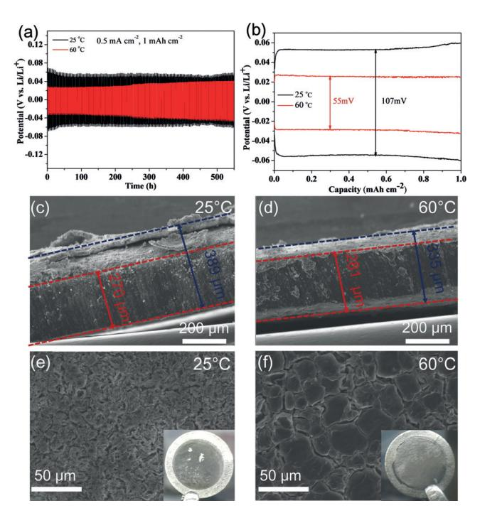
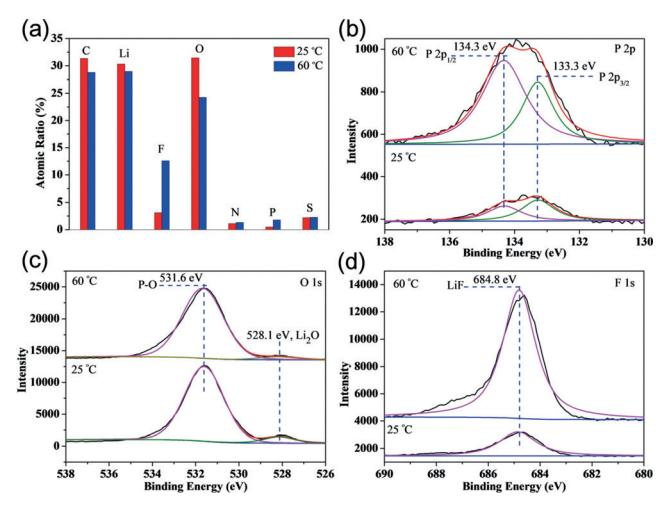
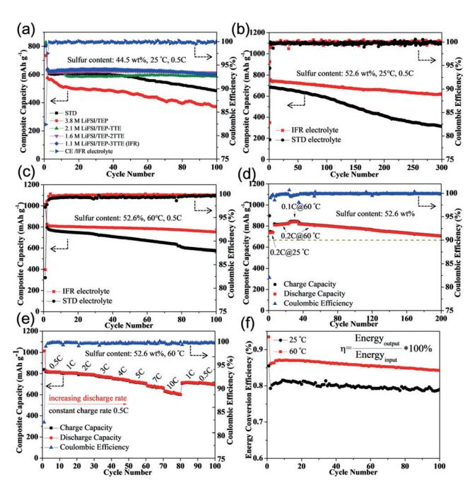
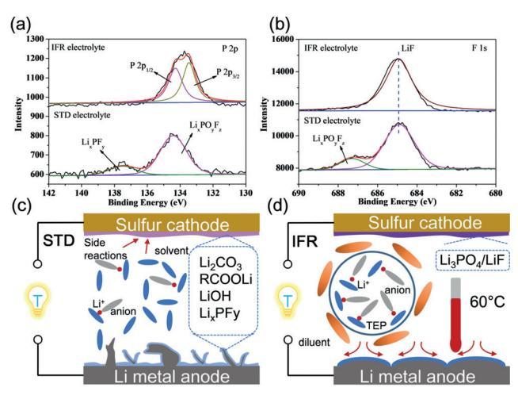

Internationale Ausgabe: DOI: [10.1002/anie.201811291](http://dx.doi.org/10.1002/anie.201811291) Battery Safety Deutsche Ausgabe: DOI: [10.1002/ange.201811291](http://dx.doi.org/10.1002/ange.201811291)

## An Intrinsic Flame-Retardant Organic Electrolyte for Safe Lithium-Sulfur Batteries

Huijun Yang, Cheng Guo, Jiahang Chen, Ahmad Naveed, Jun Yang, Yanna Nuli, and Jiulin [Wang\\*](http://orcid.org/0000-0001-8165-0096)

Abstract: Safety concerns pose a significant challenge for the large-scale employment of lithium–sulfur batteries. Extremely flammable conventional electrolytes and dendritic lithium deposition cause severe safety issues. Now, an intrinsic flameretardant (IFR) electrolyte is presented consisting of 1.1m lithium bis(fluorosulfonyl)imide in a solvent mixture of flame-retardant triethyl phosphate and high flashpoint solvent 1,1,2,2-tetrafluoroethyl-2,2,3,3-tetrafluoropropyl (1:3, v/v) for safe lithium–sulfur (Li@S) batteries. This electrolyte exhibits favorable flame-retardant properties and high reversibility of the lithium metal anode (Coulombic efficiency > 99%). This IFR electrolyte enables stable lithium plating/stripping behavior with micro-sized and dense-packing lithium deposition at high temperatures. When coupled with a sulfurized pyrolyzed poly(acrylonitrile) cathode, Li@S batteries deliver a high composite capacity (840.1 mAhg @1 ) and high sulfur utilization of 95.6%.

Lithium–sulfur (Li-S) batteries have been extensively investigated as one of the most promising battery candidates owing to its high theoretical energy density (2600 Whkg@1 ) and abundant sulfur resources. [1] The electrochemical behavior of Li-S batteries has been improved through many comprehensive strategies in recent years. [2] Nonetheless, safety concern remains a critical factor to determine the practical application of Li-S batteries. [3] It mainly derives from highly flammable organic solvents and dendritic lithium (Li) formation during battery operation.[4] Therefore, how to intrinsically enhance the battery safety and simultaneously improve electrochemical performance are the major challenges for commercially viable Li-S batteries.

The conventional organic solvent mixtures for Li-S batteries have a low flashpoint, such as @68C for DOL and 18C for DME. Carbonate solvents usually possess a relatively higher flashpoint, but they are also easily ignited and cause severe security problems under abuse conditions. [5] Meanwhile, the presence of sulfur/carbon mixtures makes this system unsafe when the collected heat reaches the threshold and leads to thermal runaway. Furthermore, the intrinsic instability of Li with electrolytes and ambient air poses greater safety challenges than LIBs. A large amount of dendrite and evolving dead Li would quickly form because the fragile solid electrolyte interphase (SEI) could not shield the attack of electrolyte. [6] Therefore, uncontrollable Li dendritic not only induces short cyclic lifespan, but also remains a serious safety issue.

Considerable attention has been paid to the electrolyte to address battery safety issues including intrinsic safe ionic liquid and solid-state electrolytes. However, the high viscosity of the ionic liquid electrolyte[7] and huge interfacial impedance of the solid-state electrolyte[8] critically hamper their development though the inherent non-flammability. Another efficient and effective strategy is blending flame-retardant additives with standard electrolytes. Wang et al. firstly reported phosphorus-rich compounds such as tris(2,2,2-trifluoroethyl) phosphite (TTFP)[9] and triethyl phosphate (TEP)[10] to enhance both safety and electrochemical performance for Li-S batteries. Recently, high salt concentration in trimethyl phosphate (TMP)[11] and TEP[12] was introduced in lithium batteries to enhance safety and compatibility with electrodes. Hydrofluoroether (HFE) solvents were employed as co-solvent to mitigate shuttle effect of Li-S batteries. [13] Among them, the high flashpoint solvent 1,1,2,2-tetrafluoroethyl-2,2,3,3-tetrafluoropropyl ether (TTE) was recently reported to improve battery safety and Li deposition behavior.[14] All above results reveal that the application of nonflammable electrolytes can relieve the safety pressure and improve electrochemical behavior. However, less reports about the comprehensive protection of Li-S batteries has been reported to date owing to some intractable problems (Supporting Information, Figure S1). Herein, we proposed a new electrolyte to build safe Li-S batteries with sulfurized pyrolyzed poly(acrylonitrile) (S@pPAN) composite material at extreme test condition of high temperatures (60 8C) and high sulfur content (52.6 wt%).

The physical properties of common used solvents for Li-S batteries and the proposed electrolyte are compared in Table S1. Flame-retardant co-solvent of TEP and TTE and lithium bis(fluorosulfonyl)imide (LiFSI) was selected in this work (Figure S2). The salt concentration ranges from 3.8 to 1.1m with TEP/TTE volume ratios of 1:0, 1:1, 1:2, and 1:3 to form saturated and homogeneous electrolytes. TTE has low Li salt solubility but effectively decreases the viscosity of electrolyte and Li salt concentration. To impress its safety, a direct electrolyte ignition test proves the flame-retardant property of the intrinsic flame-retardant electrolyte 1.1m LiFSI/TEP-3TTE (IFR), compared with continuously burning standard carbonate electrolyte (STD; Figure S3). The

Angew. Chem. 2019, 131, 801 –805 T 2019 Wiley-VCH Verlag GmbH & Co. KGaA, Weinheim 801

[\*] H. J. Yang, C. Guo, J. H. Chen, A. Naveed, Prof. J. Yang, Prof. Y. N. Nuli, Prof. J. L. Wang Shanghai Electrochemical Energy Devices Research Center School of Chemistry and Chemical Engineering Shanghai Jiao Tong University, Shanghai 200240 (China) E-mail: wangjiulin@sjtu.edu.cn

Supporting information and the ORCID identification number(s) for the author(s) of this article can be found under: [https://doi.org/10.1002/anie.201811291.](https://doi.org/10.1002/anie.201811291)

Cu j Li cells were assembled to examine Li plating/ stripping behavior with different electrolytes at 0.2 mAcm@2 . Figure S4a shows the Coulombic efficiency (CE) of all of the TEP-contained electrolytes approaching 99% after several cycles. The low over-potential of about 32.8 mV was obtained in IFR electrolyte due to remarkably low viscosity (Figure S4b,c). FEC-contained electrolyte was treated as a convincing control group due to its verified film forming ability of FEC. [15] Figure S4d shows stable average CE of 98.3% over 200 cycles at 1 mA cm@2 , compared with the decayed performance of FEC-contained electrolyte. Moreover, average CE (1 mAcm@2 /3 mAhcm@2 ) maintained 98.6% in IFR electrolyte within 50 cycles (Figure S5). This is comparable to the reported results of concentrated electrolyte (Table S2). Scanning electron microscopy (SEM) images shows porous and dendritic Li deposition in STD electrolyte. In the high concentrated electrolyte, comparatively uniform morphology has been observed along with some fibrous dendrites. In contrast, uniform and dense-packing Li deposition was obtained in IFR electrolyte (Figure S6).

Li jLi cells were further confirmed the interfacial stability. Extremely stable profile over 2400 h (100 days) in IFR electrolyte without obvious hysteresis increase outperforms the gradual deterioration in STD electrolyte at room temperature (Figure S7). For the high-temperature test, the STD electrolyte shows a shortened lifespan. On the contrary, prolonged lifespan was achieved in IFR electrolyte even with capacity of 2 mAhcm@2 (Figure S7). The corrosive Li deposition and notable dendrite formation were checked out in standard carbonate electrolyte, which agrees with the short cell lifespan (Figure S8). To further reveal the effect of temperatures, both stable hysteresis profiles are compared in IFR electrolyte at 25 and 608C (Figure 1 a). However, the voltage hysteresis at both charge and discharge states exhibits huge difference under different temperatures. A much flatter plateau and lower over-potential throughout the whole cycle were retained under 60 8C operation. The enlarged profiles of the 20th cycle (Figure 1 b) display hysteresis (107 mV) at 258C, almost twice than it (55 mV) at 60 8C. Changing temperature from 258C to 608C reduces porosity of Li deposition and thickness of deposited Li from 389 mm to 335 mm (Figure 1 c and d). Although room temperature enables smooth deposition without discernible dendrite formation, slender fibrous and porous Li would induce more interfacial reaction owing to its large specific area (Figure 1 e; Supporting Information, Figure S9a,b). On the contrary, micro-sized and round-edged deposition suggests less interfacial contact at 60 8C (Figure 1 f; Supporting Information, Figure S9c,d). It is in agreement with previous report on high-temperature behavior in organic electrolytes though their safety problems. [16] High-temperature operation would directly facilitate Li+ transfer, which can increase the concentrations of Li+ in the region of dendrite tip. [17] Moreover, the rapid surface diffusion of Li+ at high temperature is

Figure 1. a) The evolution of voltage profiles of the symmetric cells in IFR electrolyte at 25 and 608C. b) Voltage hysteresis of the 20th cycle. c),d) Cross-section of Li deposition after 50 cycles at 25 and 608C. e),f) Top-view images of Li deposition after 50 cycles at 25 and 608C. The pristine Li metal thickness is 300 mm. Insets: optical photographs of the Li anode after cycling.

beneficial for packed Li deposition. Supporting evidence from electrochemical impedance spectroscopy (EIS) analysis clearly states lower interfacial resistance and charge transfer resistance before and after cycling at 608C (Figure S10).

The unique interphase is another major factor to determine stable Li plating/stripping performance in IFR electrolyte. X-ray photoelectron spectroscopy (XPS) analysis reveals the layer composition change of Li cycled at different test conditions. The resistive species on Li anode surface such as Li2O, LiOH and Li alkylcarbonates were examined in STD electrolyte. For Li cycled in IFR electrolyte, the peaks of C 1s, Li 1s, F 1s, P 2p, N 1s, S 2p were detected both at ambient temperature and high temperature (Figure S11). One major difference lies in element amounts in two samples. The one formed at high temperature exhibits higher F and P contents but lower C and O contents than that formed at ambient temperature (Figure 2 a). The atomic ratio of F:C and P:O of two different layers are multiplied by 4.4 and 4.9 times, respectively. In the P 2p spectra, two peaks at 133.3 and 134.3 eV correspond to two split component 2P3/2 and 2P1/2, respectively (Figure 2 b). The only one environment of phosphorous from observation has a good agreement with (PO4) 3@ group. [18] Combined with basic element analysis, the presence of phosphorous may be Li3PO4 , which can be ascribed from reduction of TEP by Li metal. According to previous reports, the artificial Li3PO4 layer has a high YoungQs modulus and enhanced Li+ transport capacity. [19] In the O 1s spectra, substantial P@O bond and tiny Li2O furthermore proves the existence of Li3PO4 (Figure 2 c). The peak of F 1s

Figure 2. XPS analysis of Li anode surface cycled in IFR electrolyte at 258C (lower) and 608C (upper). a) Elemental concentration. b) P 2p spectra. c) O 1s spectra. d) F 1s spectra.

spectra at 684.8 eV substantiated a LiF-rich SEI has developed from fluorinated electrolyte, especially under high temperatures. The key interphase components of Li3PO4 and LiF play two crucial roles here: 1) serve as a robust electronic insulator to block electrolyte consumption,[20] which permits long-term stability; 2) regulate a dendritefree Li deposition due to their high surface diffusivity for Li+ . [21] Li+ are encouraged to migrate along the surface and deposit in an aligned direction due to this unique developed interphase. Apart from the primary N@SOx species derived from decomposition of FSI@ anion, the Li@N species at 393.6 eV promises high Li+ conductivity in the high temperature group (Figure S11I).[22] Figure S12 illustrates the relationship between electrolyte component and Li deposition behavior. The low overpotential in the IFR electrolyte at high temperatures largely increases nucleation rate and nucleation density. Both the rapid Li+ transport and well-developed interphase result in dense-packing Li deposition.

The effect of electrolyte composition on electrochemical performance of Li-S was further evaluated. Table S3 shows two types of S@pPAN materials and their theoretical specific capacities calculated on composite cathode. X-ray diffraction indicates some elemental sulfur residue in S@pPAN (52.6 wt%, Figure S13). Specific capacity based on composite cathode is a more critical parameter in practical application. For instance, common sulfur/carbon (S/C) composite material owns 80 wt% sulfur content, which usually delivers near 800 mAhg @1 based on sulfur and 640 mAhg @1 based on composite cathode. The cyclic behavior of S@pPAN cathode with common sulfur content (44.5 wt%) was firstly examined in different electrolytes. Figure 3 a evidently shows the most stable cyclic performance in IFR electrolyte, compared with gradual fading in STD and high concentrated electrolyte. After initial activation, the composite capacity in IFR electrolyte reaches 622.8 mAhg @1 with sulfur utilization of 83.7%. S@pPAN cathodes (52.6 wt%) were employed to improve composite capacities to 756.8 and 683.8 mAhg @1 in IFR and STD electrolytes, respectively (Figure 3 b). The rapid

Figure 3. Electrochemical performance of Li@S batteries at different test conditions. a) Cyclic performances in different electrolytes at 258C. b,c) Cyclic performance comparison with S@pPAN (52.6 wt%) at 25 and 608C. d) Changed test conditions in IFR electrolyte. e) Rate performance in IFR electrolyte at 608C. f) Comparison of energy conversion efficiency.

capacity decay in STD electrolyte results in remaining 311.1 mAhg @1 after 300 cycles. On the contrary, it still maintains 418.1 mAhg @1 after 1000 cycles in IFR electrolyte (Figure S14). All of the above results suggest significant advantage of the proposed electrolyte over STD electrolyte. More extreme test condition of high temperatures was further employed in Li-S@pPAN cells. Figure 3 c presents cyclic performance comparison under 60 8C with S@pPAN (52.6 wt%). The STD electrolyte displays worse stability compared with ambient temperature operation. However, IFR electrolyte ensures composite capacity of 751.8 mAhg @1 and capacity retention of 92.4% after 100 cycles. It proves the benign compatibility with S@pPAN even under evaluated temperatures. To distinctly emphasize the capacity contribution from temperature lifting, one selected Li-S@pPAN cell under changed temperature was examined. It shows capacity improvement from 739.6 to 820.3 mAhg @1 due to test temperature change to 60 8C. The composite capacity further approaches 840.1 mAhg @1 at 0.1 C and indicates sulfur utilization reaching to 95.6%. The composite capacity after 200 cycles still outperforms the best reported data so far (dotted line, Figure 3 d).[23] Moreover, cells under evaluated temperature can satisfy high power for charge–discharge cycling. The capacity maintains 620.1 mAhg @1 even at high discharge rate of 10 C (Figure 3 e). All the CE of Li-S cells remain 99.95% except the first few cycles. In addition to improved capacity, high temperature operation boosts energy conversion efficiency (h) to 87%. h depends on the usefulness of the output and energy loss derived from Joule heat. Figure 3 f shows about 7% energy conversion efficiency gains from temperature increasing to 60 8C. In consideration of counterproductive heat release during battery operation, high temperature operation for large-scale application would be extremely beneficial from both the heat recycle and energy conversion efficiency gain.

Charge–discharge profiles are shown in Figure S15. The typical inclined plateau is consistent with cyclic voltammograms (CVs) curves. The voltage shift can exactly interpret the plateau change from evaluated temperature. CVs at sequent scanning rate were conducted to determine Li+ diffusion coefficients. Higher peak currents were obtained at high temperature, corresponding to faster kinetics (Figure S16b). Peak current (Ip ) is in directly proportion to square root of the scan rate, which ensures the diffusion-controlled mechanism. The square ratio of fitting slope determines about double increase gained from temperature augment (Figure S16c,d). The high-performance of Li-S batteries depends on interphases to ensure reversible reactions and fast kinetics on sulfur cathodes. XPS analysis on S@pPAN surface was carried out to explore component differences. The degradation of LiPF6 due to trace water was confirmed by LixPFy and LixPOyFz species (Figure 4 a). The F 1s spectra further con-

Figure 4. XPS analysis of S@pPAN cathode in IFR (upper) and STD electrolyte (lower). a) P 2p spectra. b) F 1s spectra. c),d) Illustration of Li@S batteries using STD electrolyte and IFR electrolyte.

firmed the instability of standard electrolyte. However, reductive decomposition of TEP in IFR electrolyte on cathode would result in Li3PO4 layer. Moreover, the sole and strong LiF peak in experimental electrolyte group proves effectiveness of fluorinated interphase (Figure 4 b). S@pPAN cathode was known its benign compatibility with electrolyte via solid-solid conversion (SSC) mechanism.[24] However, the side-reaction between sulfur species and carbonate solvents always exists, especially when elemental sulfur residue exists in the surface. [25] Long-chain LiPS generated from discharge of elemental sulfur would rapidly react with electrophilic carbon via nucleuphilic substitution.[26] Therefore, rapid capacity can be explained by inactivation of sulfur species during cycling. However, capacity in IFR electrolyte maintains stable even under high temperature operation. There are mainly two critical factors: 1) the Li3PO4 and LiF-rich interphase on cathode side can suppress side-reaction between electrolyte and sulfur species; 2) TEP is highly coordinated with LiFSI and no free solvent molecular can be attacked by LiPS in this work. This special solvation structure after hydrofluoroether co-solvent addition has been proved by similar reports. [22b, 27] Raman spectroscopy exhibits that absorption peak of TEP moleculars shifts from 733 cm@1 to 741 cm@1 due to the enhanced Li+ -TEP solvation.[28] However, the consistent signal of vibration band of TTE (603 cm@1 ) and LiFSI (stretching vibration of S=O at 1225 cm@1 ) indicates their minimal effect on the solvation structures (Figure S17).[12b] In all, the advantages over STD electrolyte are schematically illustrated in Figure 4 c and d.

In conclusion, we develop a flame-retardant electrolyte to enable extreme test conditions of using high capacity cathode S@pPAN (52.6 wt%) at a high temperature (60 8C). This electrolyte shows significant progress in high reversibility of Li and stable cycling performance of symmetric cells. The micro-sized and dense-packing Li deposition largely reduces consumption of both Li and electrolyte, boosts the security of Li usage and enhances volumetric capacity of Li. When coupled with S@pPAN cathode, robust interphase and less free TEP molecular in IFR electrolyte attributed to less sidereaction. This safe Li-S battery system delivers high composite capacity and stable cyclic performance. The benign high temperature behavior offers an extra usage. In all, this system sheds new light on safe and high-energy-density Li-S batteries and other metal–sulfur batteries.

## Acknowledgements

This work was financially supported by the National Natural Science Foundation of China (21333007, U1705255, 21373137), and New Century Excellent Talents in University (NCET-13-0371).

## Conflict of interest

The authors declare no conflict of interest.

Keywords: battery safety · flame-retardant electrolytes · high temperature · lithium · lithium-sulfur batteries

How to cite: Angew. Chem. Int. Ed. 2019, 58, 791– 795 Angew. Chem. 2019, 131, 801– 805

[2] a) Q. Pang, X. Liang, C. Y. Kwok, L. F. Nazar, Nat. Energy 2016, 1, 16132; b) X. Yang, X. Li, K. Adair, H. Zhang, X. Sun, [Electrochem.](https://doi.org/10.1007/s41918-018-0010-3) Energy Rev. 2018, 1, 239 – 293; c) Z. W. Seh, Y. Sun, Q. Zhang, Y. Cui, Chem. [Soc. Rev.](https://doi.org/10.1039/C5CS00410A) 2016, 45, 5605 – 5634; d) Y. He, Z. Chang, S. Wu, H. Zhou, J. [Mater. Chem.](https://doi.org/10.1039/C8TA01115J) A 2018, 6, 6155 [– 6182.](https://doi.org/10.1039/C8TA01115J)

[1] a) A. Manthiram, Y. Fu, S. H. Chung, C. Zu, Y. S. Su, [Chem.](https://doi.org/10.1021/cr500062v) Rev. 2014, 114[, 11751](https://doi.org/10.1021/cr500062v) – 11787; b) R. Fang, S. Zhao, Z. Sun, D. W. Wang, H. M. Cheng, F. Li, [Adv. Mater.](https://doi.org/10.1002/adma.201606823) 2017, 29, 1606823; c) Y. X. Yin, S. Xin, Y. G. Guo, L. J. Wan, [Angew. Chem.Int.](https://doi.org/10.1002/anie.201304762) Ed. 2013, 52, 13186 [– 13200](https://doi.org/10.1002/anie.201304762); [Angew. Chem.](https://doi.org/10.1002/ange.201304762) 2013, 125, 13426 – 13441.

- [3] W. Chen, T. Lei, C. Wu, M. Deng, C. Gong, K. Hu, Y. Ma, L. Dai, W. Lv, W. He, X. Liu, J. Xiong, C. Yan, [Adv. Energy](https://doi.org/10.1002/aenm.201702348) Mater. 2018, 8[, 1702348](https://doi.org/10.1002/aenm.201702348).
- [4] a) X. B. Cheng, R. Zhang, C. Z. Zhao, Q. Zhang, [Chem.](https://doi.org/10.1021/acs.chemrev.7b00115) Rev. 2017, 117, 10403 [– 10473](https://doi.org/10.1021/acs.chemrev.7b00115); b) H. Yang, C. Guo, A. Naveed, J. Lei, J. Yang, Y. Nuli, J. Wang, Energy [Storage](https://doi.org/10.1016/j.ensm.2018.03.001) Mater. 2018, 14, 199 – [221.](https://doi.org/10.1016/j.ensm.2018.03.001)
- [5] a) P. G. Balakrishnan, R. Ramesh, T. Prem Kumar, J. [Power](https://doi.org/10.1016/j.jpowsour.2005.12.002) [Sources](https://doi.org/10.1016/j.jpowsour.2005.12.002) 2006, 155, 401 – 414; b) T. Tsujikawa, K. Yabuta, T. Matsushita, T. Matsushima, K. Hayashi, M. Arakawa, J. [Power](https://doi.org/10.1016/j.jpowsour.2009.02.010) [Sources](https://doi.org/10.1016/j.jpowsour.2009.02.010) 2009, 189, 429 – 434.
- [6] a) D. Aurbach, E. Zinigrad, H. Teller, Y. Cohen, G. Salitra, H. Yamin, P. Dan, E. Elster, J. [Electrochem.](https://doi.org/10.1149/1.1502684) Soc. 2002, 149, A1267; b) E. Peled, J. [Power Sources](https://doi.org/10.1016/0378-7753(83)87026-8) 1983, 9, 253 – 266.
- [7] K. Xu, Chem. Rev. 2014, 114, 11503  [11618](https://doi.org/10.1021/cr500003w).
- [8] Y. Shen, Y. Zhang, S. Han, J. Wang, Z. Peng, L. Chen, Joule 2018, <https://doi.org/10.1016/j.joule.2018.06.021>.
- [9] J. Wang, F. Lin, H. Jia, J. Yang, C. W. Monroe, Y. NuLi, [Angew.](https://doi.org/10.1002/anie.201405157) Chem. Int. Ed. 2014, 53, 10099 [– 10104](https://doi.org/10.1002/anie.201405157); [Angew. Chem.](https://doi.org/10.1002/ange.201405157) 2014, 126, 10263 [– 10268](https://doi.org/10.1002/ange.201405157).
- [10] H. Yang, Q. Li, C. Guo, A. Naveed, J. Yang, Y. Nuli, J. Wang, Chem. [Commun.](https://doi.org/10.1039/C7CC09942H) 2018, 54, 4132 – 4135.
- [11] J. Wang, Y. Yamada, K. Sodeyama, E. Watanabe, K. Takada, Y. Tateyama, A. Yamada, Nat. Energy 2017, 3, 22.
- [12] a) Z. Zeng, V. Murugesan, K. S. Han, X. Jiang, Y. Cao, L. Xiao, X. Ai, H. Yang, J.-G. Zhang, M. L. Sushko, J. Liu, Nat. [Energy](https://doi.org/10.1038/s41560-018-0196-y) 2018, 3, 674 [– 681](https://doi.org/10.1038/s41560-018-0196-y); b) S. Chen, J. Zheng, C. Niu, H. Lee, W. Xu, J. Xiao, J. Liu, J.-G. Zhang, Joule 2018, [https://doi.org/10.1016/j.](https://doi.org/10.1016/j.joule.2018.05.002) [joule.2018.05.002.](https://doi.org/10.1016/j.joule.2018.05.002)
- [13] a) N. Azimi, Z. Xue, I. Bloom, M. L. Gordin, D. Wang, T. Daniel, C. Takoudis, Z. Zhang, ACS Appl. [Mater. Interfaces](https://doi.org/10.1021/acsami.5b01412) 2015, 7, 9169 [– 9177](https://doi.org/10.1021/acsami.5b01412); b) M. L. Gordin, F. Dai, S. Chen, T. Xu, J. Song, D. Tang, N. Azimi, Z. Zhang, D. Wang, ACS Appl. [Mater. Interfaces](https://doi.org/10.1021/am501665s) 2014, 6, 8006 [– 8010](https://doi.org/10.1021/am501665s); c) C. K. Kim, K. Kim, K. Shin, J. J. Woo, S. Kim, S. Y. Hong, N. S. Choi, ACS Appl. [Mater. Interfaces](https://doi.org/10.1021/acsami.7b12352) 2017, 9, 44161 [– 44172](https://doi.org/10.1021/acsami.7b12352); d) C. W. Lee, Q. Pang, S. Ha, L. Cheng, S. D. Han, K. R. Zavadil, K. G. Gallagher, L. F. Nazar, M. Balasubramanian, [ACS Cent.](https://doi.org/10.1021/acscentsci.7b00123) Sci. 2017, 3, 605 – 613.
- [14] X. Fan, L. Chen, O. Borodin, X. Ji, J. Chen, S. Hou, T. Deng, J. Zheng, C. Yang, S. C. Liou, K. Amine, K. Xu, C. Wang, [Nat.](https://doi.org/10.1038/s41565-018-0183-2) [Nanotechnol.](https://doi.org/10.1038/s41565-018-0183-2) 2018, 13, 715 – 722.
- [15] E. Markevich, G. Salitra, F. Chesneau, M. Schmidt, D. Aurbach, [ACS Energy](https://doi.org/10.1021/acsenergylett.7b00300) Lett. 2017, 2, 1321 – 1326.
- [16] a) R. Mogi, M. Inaba, Y. Iriyama, T. Abe, Z. Ogumi, [J.](https://doi.org/10.1149/1.1454138) [Electrochem.](https://doi.org/10.1149/1.1454138) Soc. 2002, 149, A385 – A390; b) L. Li, S. Basu, Y. Wang, Z. Chen, P. Hundekar, B. Wang, J. Shi, Y. Shi, S. Narayanan, N. Koratkar, [Science](https://doi.org/10.1126/science.aap8787) 2018, 359, 1513 – 1516.

- [17] H. H. Yan, Y. H. Bie, X. Y. Cui, G. P. Xiong, L. Chen, [Energy](https://doi.org/10.1016/j.enconman.2018.02.002) [Convers. Manage.](https://doi.org/10.1016/j.enconman.2018.02.002) 2018, 161, 193 – 204.
- [18] M. Maccario, L. Croguennec, A. Wattiaux, E. Suard, F. Lecras, C. Delmas, Solid State Ionics 2008, 179, 2020 [– 2026.](https://doi.org/10.1016/j.ssi.2008.07.004)
- [19] N. W. Li, Y. X. Yin, C. P. Yang, Y. G. Guo, [Adv. Mater.](https://doi.org/10.1002/adma.201504526) 2016, 28, 1853 [– 1858.](https://doi.org/10.1002/adma.201504526)
- [20] Q. Zhang, J. Pan, P. Lu, Z. Liu, M. W. Verbrugge, B. W. Sheldon, Y. T. Cheng, Y. Qi, X. Xiao, Nano Lett. 2016, 16, 2011 [– 2016.](https://doi.org/10.1021/acs.nanolett.5b05283)
- [21] X. Q. Zhang, X. Chen, R. Xu, X. B. Cheng, H. J. Peng, R. Zhang, J. Q. Huang, Q. Zhang, [Angew. Chem.](https://doi.org/10.1002/anie.201707093) Int. Ed. 2017, 56, 14207 – [14211](https://doi.org/10.1002/anie.201707093); [Angew. Chem.](https://doi.org/10.1002/ange.201707093) 2017, 129, 14395 – 14399.
- [22] a) M. Olschewski, R. Gustus, O. Hçfft, A. Lahiri, F. Endres, [J.](https://doi.org/10.1021/acs.jpcc.6b10139) [Phys. Chem.](https://doi.org/10.1021/acs.jpcc.6b10139) C 2017, 121, 2675 – 2682; b) X. Ren, S. Chen, H. Lee, D. Mei, M. H. Engelhard, S. D. Burton, W. Zhao, J. Zheng, Q. Li, M. S. Ding, M. Schroeder, J. Alvarado, K. Xu, Y. S. Meng, J. Liu, J.-G. Zhang, W. Xu, Chem. 2018, [https://doi.org/10.1016/j.](https://doi.org/10.1016/j.chempr.2018.05.002) [chempr.2018.05.002.](https://doi.org/10.1016/j.chempr.2018.05.002)
- [23] a) Z. Xu, J. Wang, J. Yang, X. Miao, R. Chen, J. Qian, R. Miao, [Angew. Chem.](https://doi.org/10.1002/anie.201605931) Int. Ed. 2016, 55, 10372 – 10375; [Angew. Chem.](https://doi.org/10.1002/ange.201605931) 2016, 128[, 10528](https://doi.org/10.1002/ange.201605931) – 10531; b) H. M. Kim, J.-Y. Hwang, D. Aurbach, Y.-K. Sun, J. [Phys. Chem.](https://doi.org/10.1021/acs.jpclett.7b02354) Lett. 2017, 8, 5331 – 5337; c) H. Yang, A. Naveed, Q. Li, C. Guo, J. Chen, J. Lei, J. Yang, Y. Nuli, J. Wang, Energy [Storage](https://doi.org/10.1016/j.ensm.2018.05.014) Mater. 2018, 15, 299 – 307.
- [24] a) J. L. Wang, J. Yang, C. R. Wan, K. Du, J. Y. Xie, N. X. Xu, [Adv.](https://doi.org/10.1002/adfm.200304284) Funct. [Mater.](https://doi.org/10.1002/adfm.200304284) 2003, 13, 487 – 492; b) S. Wei, L. Ma, K. E. Hendrickson, Z. Tu, L. A. Archer, J. Am. [Chem.](https://doi.org/10.1021/jacs.5b08113) Soc. 2015, 137, 12143 [– 12152.](https://doi.org/10.1021/jacs.5b08113)
- [25] J. Wang, Z. Yao, C. W. Monroe, J. Yang, Y. Nuli, [Adv. Funct.](https://doi.org/10.1002/adfm.201201847) [Mater.](https://doi.org/10.1002/adfm.201201847) 2013, 23, 1194 – 1201.
- [26] T. Yim, M.-S. Park, J.-S. Yu, K. J. Kim, K. Y. Im, J.-H. Kim, G. Jeong, Y. N. Jo, S.-G. Woo, K. S. Kang, I. Lee, Y.-J. Kim, [Electrochim.](https://doi.org/10.1016/j.electacta.2013.06.039) Acta 2013, 107, 454 – 460.
- [27] a) F. Huang, G. Ma, Z. Wen, J. Jin, S. Xu, J. Zhang, J. [Mater.](https://doi.org/10.1039/C7TA08274F) [Chem.](https://doi.org/10.1039/C7TA08274F) A 2018, 6, 1612 – 1620; b) S. Chen, J. Zheng, D. Mei, K. S. Han, M. H. Engelhard, W. Zhao, W. Xu, J. Liu, J. G. Zhang, [Adv.](https://doi.org/10.1002/adma.201706102) Mater. 2018, 30[, 1706102](https://doi.org/10.1002/adma.201706102); c) M. Cuisinier, P. E. Cabelguen, B. D. Adams, A. Garsuch, M. Balasubramanian, L. F. Nazar, [Energy](https://doi.org/10.1039/C4EE00372A) [Environ.](https://doi.org/10.1039/C4EE00372A) Sci. 2014, 7, 2697 – 2705.
- [28] H. Nakagawa, M. Ochida, Y. Domi, T. Doi, S. Tsubouchi, T. Yamanaka, T. Abe, Z. Ogumi, J. [Power Sources](https://doi.org/10.1016/j.jpowsour.2012.04.013) 2012, 212, 148 – [153](https://doi.org/10.1016/j.jpowsour.2012.04.013).

Manuscript received: October 1, 2018

Revised manuscript received: November 12, 2018

Accepted manuscript online: November 13, 2018

Version of record online: December 13, 2018