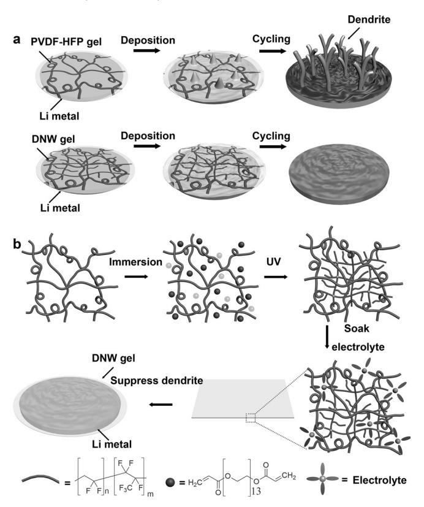
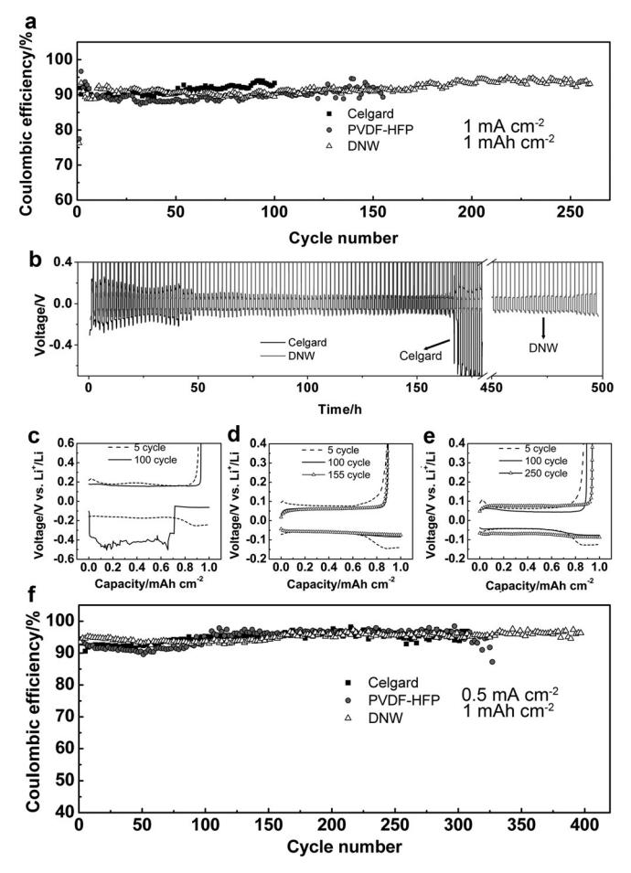
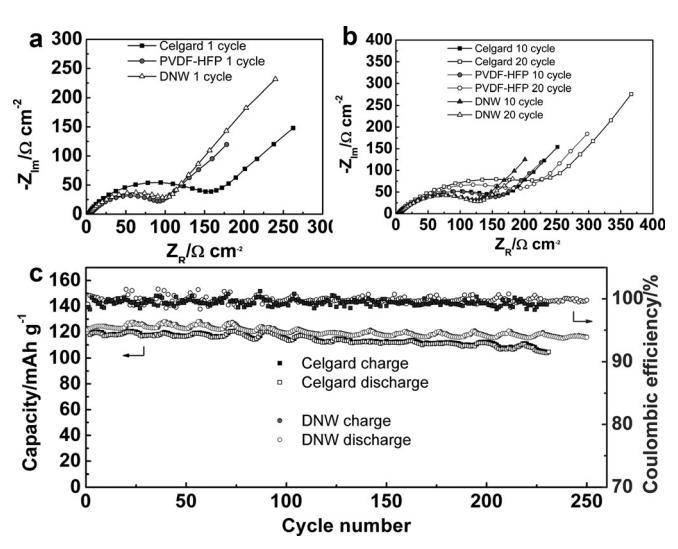
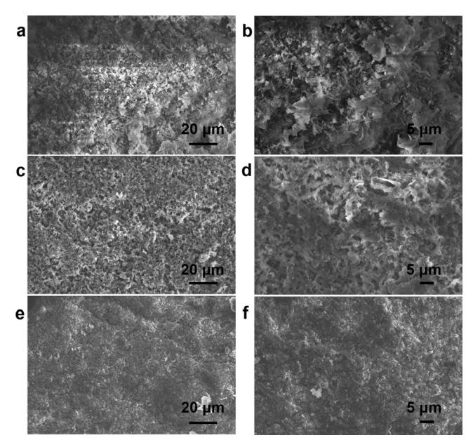

Metal German Edition: DOI: [10.1002/ange.201709774](http://dx.doi.org/10.1002/ange.201709774) Anodes International Edition: DOI: [10.1002/anie.201709774](http://dx.doi.org/10.1002/anie.201709774)

## Tough Gel Electrolyte Using Double Polymer Network Design for the Safe, Stable Cycling of Lithium Metal Anode

Haiping Wu, Yue Cao, Haiping Su, and Chao [Wang\\*](http://orcid.org/0000-0002-0739-6066)

Abstract: The growth of lithium dendrites and low coulombic efficiency restrict the development of Li metal anodes. Polymer electrolytes are expected to be promising candidates to solve the issue, but ways to obtain a polymer electrolyte that integrates high ionic conductivity and high mechanical toughness is still challenging. By introducing a double polymer network into the electrolyte design to reshape it, a tough polymer electrolyte was developed with high conductivity, and stable operation of lithium metal anodes was further realized. The double network (DNW) gel electrolyte has high modulus of 44.3 MPa and high fracture energy of 69.5 kJm@2 . The conductivity of DNW gel is 0.81 mScm@1 at 308C. By using this gel electrolyte design, the lithium metal electrode could be cycled more than 400 times with a coulombic efficiency (CE) as high as 96.3% with carbonate-based electrolytes.

Rechargeable batteries with high energy density are highly desirable owing to the increasing demand for electronic devices and electric vehicles. Current commercial lithium ion batteries use graphite as anodes with a theoretical specific capacity of 372 mAhg @1 . In comparison, the capacity of Li metal is 3860 mAhg @1 , ten times higher than that of graphite. Furthermore, Li metal has many other advantages, including low redox potential (@3.04 V vs. standard hydrogen electrode) and low density (0.534 g cm@3 ).[1] Despite so many advantages, the lithium metal anode is still not yet ready for commercial applications because of the growth of lithium dendrites and low coulombic efficiency, leading to low cycling lifetime and safety concerns. [2] During the cycling process of lithium metal anodes, the non-uniform repeated stripping/ plating of a lithium metal layer will form dendritic and mossy metal deposits. [3] The Li dendrite will penetrate through the separator and result in safety hazards. What is more, the growth of lithium dendrite will cause breaks in the solid electrolyte interfaces (SEI) and lead to exposure of fresh

| [*] Dr. H. Wu, Prof. C. Wang                                      |
|-------------------------------------------------------------------|
| Department of Chemistry, Tsinghua University                      |
| Beijing, 100084 (China)                                           |
| E-mail: chaowang.chn@gmail.com                                    |
| Dr. H. Wu, Dr. Y. Cao, Prof. C. Wang                              |
| Department of Chemistry, University of California Riverside       |
| 900 University Ave., Riverside, CA 92521 (USA)                    |
| H. Su                                                             |
| Department of Chemical and Environmental Engineering              |
| University of California Riverside                                |
| 900 University Ave., Riverside, CA 92521 (USA)                    |
| Supporting information and the ORCID identification number(s) for |
| the author(s) of this article can be found under:                 |
| https://doi.org/10.1002/anie.201709774.                           |

lithium metal to the electrolyte, resulting in the continuous decomposition of the electrolyte and low CE.[1a]

Recently, the mechanism of nucleation[4] and the suppression of Li dendrites[5] have attracted much attention. To restrict the growth of lithium dendrites, two major factors need to be considered from a mechanical perspective. Firstly, the electrolytes should have enough modulus to suppress the dendrite growth.[6] Secondly, high fracture energy is important to accommodate with the volumetric changes of lithium dendrite growth. Inorganic electrolytes can have high mechanical modulus but their fracture energy is low because they are brittle. [7] Polymer gel electrolyte shows a plastic selfstanding appearance, which has a high ionic conductivity but is mechanically soft.[8] Recently many gel electrolytes based on cross-linked polymers[9] and nanocomposites[10] utilize hard–soft designs to overcome conventional trade-offs between modulus and conductivity. These materials all show good results for stabilizing Li, even when the electrolyte modulus is below that of Li metal.

Herein, we successfully demonstrate a new chemistry in electrolyte design that can enhance mechanical toughness and ion conductivity at the same time. We introduced the concept of double network polymer chemistry into gel electrolyte design to tackle this grand challenge. Using a double polymer network of poly(vinylidene fluoride-co-hexafluoropropylene) (PVDF-HFP) and poly(ethylene oxide) PEO as the framework, we successfully obtained a gel electrolyte having high toughness, good stretchability, high modulus, and high ion conductivity at the same time. With this electrolyte, a stable lithium metal electrode for more than 400 cycles with a CE as high as 96.3% can be realized with carbonate-based electrolytes. What is more, a uniform lithium metal deposition could form over the cycling process.

Double network gels have been developed for making tough hydrogels. [11] There are two strategies in designing double network gels: either by introducing covalent short polymer chains or physical cross-linking sites to dissipate mechanical energy. The covalent approach offers better electrochemical stability as well as higher mechanical modulus. [11b, 12] Similar to the design of a double network hydrogel, polymer networks with relatively short and long polymer chains are interpenetrated to obtain the double network gel. We chose commercial PVDF-HFP as the long-chain polymer network, which can maintain its original configurations. A branched PEO polymer cross-linked from oligomer poly( ethylene glycol) diacrylate (PEGDA) acts as short-chain networks, which can be fractured to dissipate mechanical energy. Upon mechanical deformation, the PEGDA chains will break first to dissipate the strain energy, greatly enhancing the fracture energy of the gel. Compared with the

conventional gel electrolytes, our double polymer network gel electrolytes can accommodate the volume change of lithium deposition because of their higher modulus and larger fracture energy. In this way, the dendrite growth could be suppressed and the stability of Li metal batteries can be increased (Scheme 1 a).

Scheme 1. a) The morphologies of lithium with a single polymer gel and double network gel. b) Preparation procedure and utilization of a double network gel.

On the other hand, the polymer chemistry design of a double network gel electrolyte has many more requirements than that of a hydrogel. First, both the two polymer chains are required to be compatible with the polar carbonate solvent in the electrolyte. Second, the two polymers should be chemically compatible with each other. Third, the polymer chains should be highly electrochemically stable for the operation in the batteries. PVDF-HFP polymer is highly polar and known to form a gel electrolyte with carbonate-based electrolyte. [13] Besides, PVDF-HFP polymer is expected to be highly anodically stable because of the strong electron-withdrawing C@F bonds. [14] Both PVDF-HFP and PEO are highly polar and electrochemically stable under the operation window of lithium metal anodes.

The double network gel electrolyte was prepared using a two-step approach.[15] As shown in Scheme 1 b, PVDF-HFP polymer was firstly dissolved in dimethyl carbonate and diethyl carbonate DMC/DEC. The solution was then dropcast into a film. After drying, the film was immersed in the PEGDA solution and then cross-linked under UV light to form an interpenetrating network. The polymer network was finally soaked in the electrolyte to form a double polymer network gel.

The obtained double network gel is highly uniform, transparent, and flexible from optical and SEM images (Supporting Information, Figure S1). The structure of the double network is confirmed by FTIR and XPS (Supporting Information, Figure S2). The peak of the C=C disappears after UV curing, indicating that the PEGDA molecules are successfully photopolymerized into cross-linked PEO polymers. [16] After UV-curing, two new peaks appear that can be assigned to C=O (288.7 eV) and C@O (286.5 eV), respectively. [17]

The mechanical performance of the gels were tested using a strain–stress mechanical tester. As Figure 1 a shows, the formation of the double network gel can greatly enhance the YoungQs modulus as well as the maximum stress. The DNW gel with a PVDF-HFP:PEGDA ratio of 70:30 shows opti-

Figure 1. a) Stress–strain curves of PVDF-HFP gel and DNW gel. b) Fracture energy of PVDF-HFP gel and DNW gel after soaking in DEC. c) Conductivity of the gel polymer electrolyte. d) Electrolyte uptake of PVDF-HFP gel and DNW. e) Strain of DNW. f) Strain of DNW with a notch.

mized stress, modulus, fracture energy, and high conductivity. Therefore, all of the tests are based on this ratio (Supporting Information, Table S2). To suppress dendrite growth and avoid penetration of the gel electrolyte, the gel needs to be tough as well. The toughness of the gel can be characterized using fracture tests (Figure 1 e,f; Supporting Information, Figure S6). The fracture energy is usually used to quantify the intrinsic resistance of various materials for fracture, including rubber and gel.[18] Therefore, the fracture energy is useful to compare the resistance for fracture when lithium dendrites penetrate the gel electrolyte. The fracture energy of PVDF-HFP gel is 47.8 kJm@2 , while the value of DNW gel increases to as high as 69.5 kJm@2 (Figure 1 b). One major concern upon formation of double network gel electrolyte is the decrease of ion conductivity caused by the dramatic increase of modulus and toughness. However, the DNW gel electrolyte exhibits an even higher ion conductivity than the PVDF-HFP gel. The PVDF-HFP gel has an ion conductivity of 1.7 X 10@4 S cm@1 (Figure 1 c). The conductivity of DNW gel electrolyte is 8.1 X 10@4 S cm@1 at 30 8C, and it increases to above 10@3 S cm@1 with an increase of temperature. The reasons for the increase of the ion conductivity are twofold. First, PEO polymer is a good ionic conductor. The PEO network will facilitate transport of the ion in the gel. Second, although the density of the polymer chains is increased, the electrolyte content increases at the same time (Figure 1 d). The liquid content of PVDF-HFP gel is around 28% while that of DNW gel is 41%. This is very close to the turning point between "polymer electrolyte" and "hybrid electrolyte", as reported in TarasconQs early work. A slight change in the liquid content can result in nearly one order of difference in ion conductivity. [13] As shown in Figure 1 c, the ion conductivities of DNW gels are higher than those of the PVDF-HFP gels at all temperatures.

Furthermore, the stability and thermal behavior of our gel electrolyte were investigated using TGA and DSC (Supporting Information, Figure S4). The DNW dry film can be stable at a temperature as high as 3008C. The glass transition temperature (Tg ) of DNW is @42.18C, indicating DNW can work well at room temperature as the gel electrolyte for lithium batteries.

To finally assess the utilization for lithium ion batteries, the electrochemcial stability window of different gels were tested by cyclic voltammetry using Li j gel jstainless steel cells. [19] Between @0.2 to 5 V, the sharp reduction and oxidation peak can be ascribed to reversible deposition and stripping of lithium metal.[20] Notably, the DNW gel has a wide electrochemical stability window (Supporting Information, Figure S16). The oxidation of DNW gel takes place at around 4.3 V vs. Li+ /Li, which is sufficient for application in lithium metal batteries with many cathode materials, such as LiFePO4 and LiCoO2 .

The performances of the lithium metal anodes with our DNW gel electrolytes were studied using a half-cell consisting of Li metal and copper (Cu) substrate (Supporting Information, Figure S9). Firstly, lithium was electrochemically deposited onto the Cu substrate from the Li metal and then the deposited layer of Li was stripped away. For batteries with conventional liquid electrolytes, the platting/stripping process of lithium will quickly lead to the formation of lithium dendrite, causing battery failure and safety hazards. The electrolyte we used here is the ethylene carbonate/diethyl carbonate/vinylene carbonate/ fluoroethylene carbonate (EC/ DEC/VC/FEC) electrolyte. The additives VC and FEC were found to form radical poly(VC) and linear polycarbonate and LiF, respectively, which can stabilize the SEI and increase the CE.[21] When we directly used the liquid electrolyte with Celgard as separator at a current density of 1 mA cm@2 with a deposition capacity of 1 mAhcm@2 , the cell voltage quickly jumps within less than 100 cycles. The battery with Celgard exhibits a overpotential (ca. 130 mV) within first 25 cycles and overpotential increases to very large after 165 h (Figure 2 b,c), which might be attributed to dendrite-induced soft short circuit.[22] With the PVDF-HFP gel electrolyte, the battery remains stable until 155 cycles, which is slightly better than the liquid electrolyte. But the battery becomes short circuit after 425 h (Supporting Information, Figure S17). Strikingly, the batteries using our DNW gel electrolyte can stably cycle up to more than 260 cycles, maintaining a CE of 93.1% (Figure 2 a). The voltage profile also shows that the lithium metal anode is stable after 260 cycles. DNW shows a much lower overpotential (50 mV) and achieves a stable cycling

Figure 2. a) Cycling performance of batteries tested at 1 mA cm@2 with a deposition capacity of 1 mAhcm@2 . b) Voltage stability of batteries with Celgard and DNW tested at 1 mA cm@2 . c)–e) Voltage profile of batteries with c) Celgard, d) PVDF-HFP, and e) DNW. f) Cycling performance of batteries tested at 0.5 mAcm@2 with a deposition capacity of 1 mAhcm@2 .

after about 500 h (Figure 2 b,e). The long cycle life is also consistent with the SEI observation. The morphologies of the SEI layer with different electrolytes were monitored and compared. After cycling, the SEI layer of the DNW battery is still very compact and uniform while that of Celgard battery and PVDF-HFP gels are very rough (Supporting Information, Figure S10).[23] XPS results further show that the outer part of SEI is thinner with DNW gel than that with Celgard and the decomposition of electrolyte is well-suppressed in batteries with DNW gel (Supporting Information, Figures S27, S28).

When the deposition/dissolution current density is lower to 0.5 mAcm@2 , the effect is even more significant. As shown in Figure 2 f, the batteries with DNW can be cycled to 400 cycles with a CE as high as 96.3%. The efficiency of battery with Celgard decreases to 89.2% after 308 cycles. For the battery using PVDF-HFP gel electrolyte, the efficiency decreases to 87.2% after 327 cycles. The voltage also shows that the battery remains stable after 400 cycles, and as long as 1560 h (Supporting Information, Figure S18).

It should also be noted that our double network gel here is different from the previously reported interpenetrating polymer networks for polymer gels. The previous reports used microporous fluorine polymers cross-linked by PEO derivatives (Supporting Information, Figure S13). In this way, the fluorine polymers and PEO polymers are not interpenetrated on the molecular level in the gel. Although their ion conductivities are high, their stretchability and toughness are very low (Supporting Information, Figure S8), it only can be stretched to 67% with a stress of 6.8 MPa, leading to poor cycling performance. The batteries using this approach fail after less than 95 cycles (Supporting Information, Figure S24).

We also studied the impedance changes of the batteries. As shown in Figure 3, our DNW gel electrolyte shows the lowest impedance after the first cycle. After 10 cycles, the impedance of the cell with Celgard separators and PVDF-HFP gel increases dramatically. The cell with DNW gel electrolyte, however, remains stable after 20 cycles, indicating the stable interface of the cell with DNW gel electrolyte. It should be mentioned that the cell remains stable at different current densities. The battery with DNW gel was tested at different current density, from 0.5 mAcm@2 to 4 mA cm@2 . The efficiency is 97.2% at 0.5 mAcm@2 and remains 93% at 4 mA cm @2 . When the current density decreases to 0.5 mAcm@2 again, the battery shows almost the same efficiency as that at the beginning (Supporting Information, Figure S25).

To pursue the potential applications using DNW gel electrolyte, we further investigated the cycling performance of LiFePO4 j DNWj Li cells. As shown in Figure 3 c, with DNW gel, the capacity can remain 91.3% after 250 cycles at 1 C. The polarization voltage is low, indicating the high conductivity and good stability of DNW gel electrolyte (Supporting Information, Figure S26). With Celgard separator, the capacity retains 87.5% after 230 cycles. The little fluctuation is due to the variation of temperature.

It should be noted that the DNW can also work in 1m LiPF6 EC-DEC electrolyte without any additives. As shown in the Supporting Information, Figure S22, the efficiency gradually increases to 89.9% after three cycles. The efficiency

Figure 3. a) Electrochemical impedance spectroscopy (EIS) after 1 cycle. b) EIS after 10 and 20 cycles. Cell with DNW shows lowest resistance after 20 cycles. c) Cycling stability of LiFePO4 jDNWj Li cells. Tested at 1 C.

can remain at 83.7% after 100 cycles, which is lower compared with the cell containing additives (Figure 2 a). The voltage profile is stable and plating voltage is around 0.06 V.

The stable cycling and uniform deposition of lithium with DNW gel electrolyte were verified by SEM (Figure 4; Supporting Information, Figure S10). Many dendrites can be observed after the cycling process for the batteries with Celgard, as evidenced by the filament and sharp particles on the surface. When PVDF-HFP gel electrolyte is used, the roughness of the Cu surface slightly improves but porous structures and large particles are still observed, probably because the SEI is broken and reforms repeatedly during the cycling process. With our DNW gel electrolyte, however, the deposited lithium metal film remains flat and smooth even after the cycling process. No filament and dendrites are found. This uniform deposition of lithium can be ascribed to the higher fracture energy of DNW gel compared with PVDF-HFP. With higher fracture energy, the DNW gel can accommodate the volume change during lithium deposition, therefore suppress the growth of lithium dendrites.

In summary, we have successfully developed a tough and stretchable gel electrolyte for stable lithium metal anodes using a double polymer network. Benefiting from this new design, the lithium metal anodes can be tested to more than 400 cycles maintaining a coulombic efficiency of 96.3%. This new gel electrolyte design will open a new avenue to develop the next generation electrolytes for stable operations of lithium metal anodes. Furthermore, this facile and low cost approach has great potential for industrial applications. Not only lithium metal anodes, but also other high-performance electrodes such as silicon, sulfur, and tin, can also take advantage of this new type of electrolyte. By combining our DNW chemistry with strategies including electrolyte additives, surface modifications, and so on, we can further improve the performance towards industrial applications.

Figure 4. SEM images (right side: higher resolution) of solid electrolyte interface (SEI) on Cu after a cycling test. The batteries were tested at 1 mA cm@2 with deposition capacity of 1 mAhcm@2 . The batteries with different separators: a),b) Celgard; c),d) PVDF-HFP; e),f) DNW.

## Acknowledgements

The authors acknowledge the Startup funds of University of California Riverside. They thank NSF grant DMR-0958796 for XPS instrument and thank Dr. Ilkeun Lee for XPS test. The authors thank Fang Liu for XPS test. We also thank Prof. Juchen Guo (UCR) for the help on providing TGA tests. We acknowledge Prof. Yunfeng Lu (UCLA) for the help on providing XPS tests. We acknowledge Prof. Kathryn Uhrich (UCR) for helpful discussions.

## Conflict of interest

The authors declare no conflict of interest.

Keywords: double polymer networks · gel electrolytes · lithium · metal anodes

How to cite: Angew. Chem. Int. Ed. 2018, 57, 1361– 1365 Angew. Chem. 2018, 130, 1375– 1379

- [1] a) W. Xu, J. L. Wang, F. Ding, X. L. Chen, E. Nasybutin, Y. H. Zhang, J. G. Zhang, Energy [Environ.](https://doi.org/10.1039/C3EE40795K) Sci. 2014, 7, 513 – 537; b) Z. Liang, D. C. Lin, J. Zhao, Z. D. Lu, Y. Y. Liu, C. Liu, Y. Y. Lu, H. T. Wang, K. Yan, X. Y. Tao, Y. Cui, Proc. Natl. [Acad.](https://doi.org/10.1073/pnas.1518188113) Sci. USA 2016, 113, 2862 [– 2867](https://doi.org/10.1073/pnas.1518188113).
- [2] J. W. Choi, D. Aurbach, Nat. [Rev. Mater.](https://doi.org/10.1038/natrevmats.2016.13) 2016, 1, 16013.
- [3] W. Y. Li, H. B. Yao, K. Yan, G. Y. Zheng, Z. Liang, Y. M. Chiang, Y. Cui, Nat. [Commun.](https://doi.org/10.1038/ncomms8436) 2015, 6, 7436 – 7443.
- [4] a) K. Yan, Z. D. Lu, H. W. Lee, F. Xiong, P. C. Hsu, Y. Z. Li, J. Zhao, S. Chu, Y. Cui, Nat. Energy 2016, 1[, 16010](https://doi.org/10.1038/nenergy.2016.10); b) R. Zhang, X. R. Chen, X. Chen, X. B. Cheng, X. Q. Zhang, C. Yan, Q. Zhang, [Angew. Chem.](https://doi.org/10.1002/anie.201702099) Int. Ed. 2017, 56, 7764 – 7768; [Angew.](https://doi.org/10.1002/ange.201702263) [Chem.](https://doi.org/10.1002/ange.201702263) 2017, 129, 5653 – 5656.

- [5] a) M. D. Tikekar, S. Choudhury, Z. Tu, L. A. Archer, [Nat.](https://doi.org/10.1038/nenergy.2016.114) [Energy](https://doi.org/10.1038/nenergy.2016.114) 2016, 1, 16114; b) X. B. Cheng, M. Q. Zhao, C. Chen, A. Pentecost, K. Maleski, T. Mathis, X. Q. Zhang, Q. Zhang, J. J. Jiang, Y. Gogotsi, Nat. Commun. 2017, 8, 336; c) X. X. Zeng, Y. X. Yin, N. W. Li, W. C. Du, Y. G. Guo, L. J. Wan, J. Am. [Chem.](https://doi.org/10.1021/jacs.6b10088) Soc. 2016, 138, 15825 [– 15828](https://doi.org/10.1021/jacs.6b10088); d) H. P. Wu, Y. Cao, L. X. Geng, C. Wang, [Chem.](https://doi.org/10.1021/acs.chemmater.6b05475) Mater. 2017, 29, 3572 – 3579; e) K. Fu, Y. H. Gong, J. Q. Dai, A. Gong, X. G. Han, Y. G. Yao, C. W. Wang, Y. B. Wang, Y. N. Chen, C. Y. Yan, Y. J. Li, E. D. Wachsman, L. B. Hu, [Proc. Natl.](https://doi.org/10.1073/pnas.1600422113) Acad. Sci. USA 2016, 113, 7094 – 7099.
- [6] a) Y. Kato, S. Hori, T. Saito, K. Suzuki, M. Hirayama, A. Mitsui, M. Yonemura, H. Iba, R. Kanno, Nat. Energy 2016, 1[, 16030](https://doi.org/10.1038/nenergy.2016.30); b) S. Wenzel, S. Randau, T. Leichtweiss, D. A. Weber, J. Sann, W. G. Zeier, J. Janek, [Chem. Mater.](https://doi.org/10.1021/acs.chemmater.6b00610) 2016, 28, 2400 –2407; c) Y. T. Li, B. Y. Xu, H. H. Xu, H. N. Duan, X. J. Lu, S. Xin, W. D. Zhou, L. G. Xue, G. T. Fu, A. Manthiram, J. B. Goodenough, Angew. [Chem. Int.](https://doi.org/10.1002/anie.201608924) Ed. 2017, 56[, 753– 756](https://doi.org/10.1002/anie.201608924); Angew. Chem. 2017, 129[, 771– 774.](https://doi.org/10.1002/ange.201608924)
- [7] a) M. Koo, K. I. Park, S. H. Lee, M. Suh, D. Y. Jeon, J. W. Choi, K. Kang, K. J. Lee, Nano Lett. 2012, 12[, 4810](https://doi.org/10.1021/nl302254v) – 4816; b) R. Murugan, V. Thangadurai, W. Weppner, [Angew. Chem.](https://doi.org/10.1002/anie.200701144) Int. Ed. 2007, 46, 7778 [– 7781](https://doi.org/10.1002/anie.200701144); [Angew. Chem.](https://doi.org/10.1002/ange.200701144) 2007, 119, 7925 – 7928.
- [8] a) J. Shim, H. J. Kim, B. G. Kim, Y. S. Kim, D.-G. Kim, J.-C. Lee, Energy Environ. Sci. 2017, [https://doi.org/10.1039/](https://doi.org/10.1039/C1037EE01095H) [C1037EE01095H](https://doi.org/10.1039/C1037EE01095H); b) Q. W. Lu, Y. B. He, Q. P. Yu, B. H. Li, Y. V. Kaneti, Y. W. Yao, F. Y. Kang, Q. H. Yang, [Adv. Mater.](https://doi.org/10.1002/adma.201604460) 2017, 29[, 1604460.](https://doi.org/10.1002/adma.201604460)
- [9] a) R. Khurana, J. L. Schaefer, L. A. Archer, G. W. Coates, J. [Am.](https://doi.org/10.1021/ja502133j) [Chem.](https://doi.org/10.1021/ja502133j) Soc. 2014, 136, 7395 – 7402; b) Q. W. Pan, D. M. Smith, H. Qi, S. J. Wang, C. Y. Li, [Adv. Mater.](https://doi.org/10.1002/adma.201502059) 2015, 27, 5995 – 6001.
- [10] S. Choudhury, R. Mangal, A. Agrawal, L. A. Archer, [Nat.](https://doi.org/10.1038/ncomms10101) [Commun.](https://doi.org/10.1038/ncomms10101) 2015, 6, 10101.
- [11] a) J. P. Gong, Soft [Matter](https://doi.org/10.1039/b924290b) 2010, 6, 2583 2590; b) X. H. Zhao, Soft [Matter](https://doi.org/10.1039/C3SM52272E) 2014, 10, 672 – 687; c) J. Y. Sun, X. H. Zhao, W. R. K. Illeperuma, O. Chaudhuri, K. H. Oh, D. J. Mooney, J. J. Vlassak, Z. G. Suo, [Nature](https://doi.org/10.1038/nature11409) 2012, 489, 133 – 136.
- [12] S. T. Lin, H. Yuk, T. Zhang, G. A. Parada, H. Koo, C. J. Yu, X. H. Zhao, [Adv. Mater.](https://doi.org/10.1002/adma.201504152) 2016, 28, 4497 – 4505.
- [13] J. M. Tarascon, A. S. Gozdz, C. Schmutz, F. Shokoohi, P. C. Warren, Solid State [Ionics](https://doi.org/10.1016/0167-2738(96)00330-X) 1996, 86 – 8, 49 – 54.
- [14] J. Y. Song, Y. Y. Wang, C. C. Wan, J. [Power Sources](https://doi.org/10.1016/S0378-7753(98)00193-1) 1999, 77, 183 [– 197.](https://doi.org/10.1016/S0378-7753(98)00193-1)
- [15] J. P. Gong, Y. Katsuyama, T. Kurokawa, Y. Osada, [Adv. Mater.](https://doi.org/10.1002/adma.200304907) 2003, 15, 1155 [– 1158](https://doi.org/10.1002/adma.200304907).
- [16] H. J. Ha, E. H. Kil, Y. H. Kwon, J. Y. Kim, C. K. Lee, S. Y. Lee, Energy [Environ.](https://doi.org/10.1039/c2ee03025j) Sci. 2012, 5, 6491 – 6499.
- [17] S. Kizilel, V. H. Perez-Luna, F. Teymour, Langmuir 2004, 20, 8652 – 8658.
- [18] Y. Tanaka, R. Kuwabara, Y. H. Na, T. Kurokawa, J. P. Gong, Y. Osada, J. [Phys. Chem.](https://doi.org/10.1021/jp0500790) B 2005, 109, 11559 – 11562.
- [19] R. Bouchet, S. Maria, R. Meziane, A. Aboulaich, L. Lienafa, J. P. Bonnet, T. N. T. Phan, D. Bertin, D. Gigmes, D. Devaux, R. Denoyel, M. Armand, Nat. [Mater.](https://doi.org/10.1038/nmat3602) 2013, 12, 452 – 457.
- [20] Q. W. Lu, J. Yang, W. Lu, J. L. Wang, Y. Nuli, [Electrochim.](https://doi.org/10.1016/j.electacta.2014.11.176) Acta 2015, 152, 489 [– 495](https://doi.org/10.1016/j.electacta.2014.11.176).
- [21] a) L. El Ouatani, R. Dedryvere, C. Siret, P. Biensan, S. Reynaud, P. Iratcabal, D. Gonbeau, J. [Electrochem.](https://doi.org/10.1149/1.3029674) Soc. 2009, 156, A103 – [A113](https://doi.org/10.1149/1.3029674); b) N. S. Choi, K. H. Yew, K. Y. Lee, M. Sung, H. Kim, S. S. Kim, J. [Power Sources](https://doi.org/10.1016/j.jpowsour.2006.05.049) 2006, 161, 1254 – 1259.
- [22] Y. Y. Liu, D. C. Lin, Z. Liang, J. Zhao, K. Yan, Y. Cui, [Nat.](https://doi.org/10.1038/ncomms10992) [Commun.](https://doi.org/10.1038/ncomms10992) 2016, 7, 10992.
- [23] G. Bieker, M. Winter, P. Bieker, [Phys. Chem.](https://doi.org/10.1039/C4CP05865H) Chem. Phys. 2015, 17, 8670 [– 8679](https://doi.org/10.1039/C4CP05865H).

Manuscript received: September 25, 2017 Revised manuscript received: December 10, 2017 Accepted manuscript online: December 16, 2017 Version of record online: January 5, 2018

Angew. Chem. Int. Ed. 2018, 57, 1361 –1365 T 2018 Wiley-VCH Verlag GmbH & Co. KGaA, Weinheim [www.angewandte.org](http://www.angewandte.org) 1365