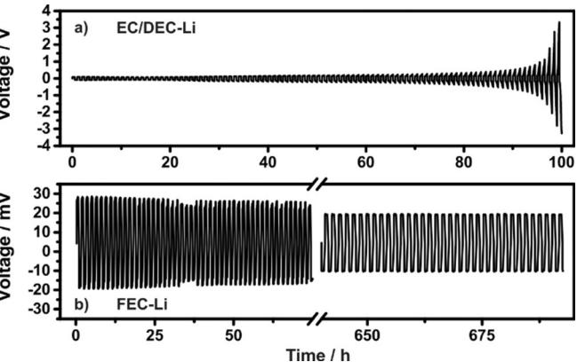
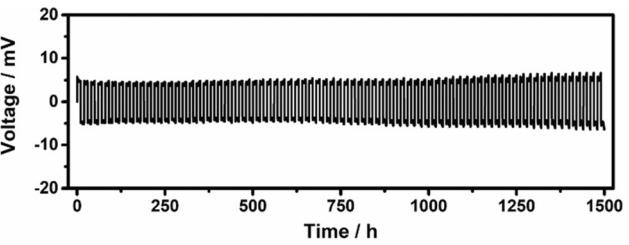
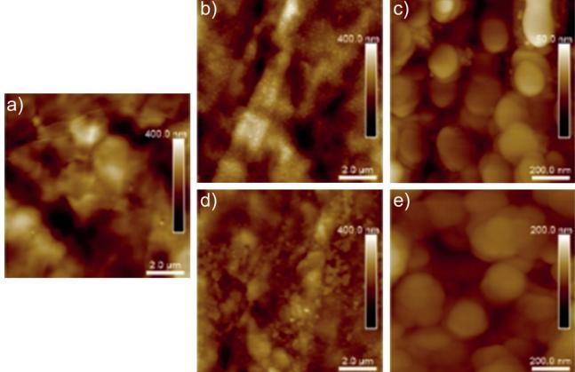
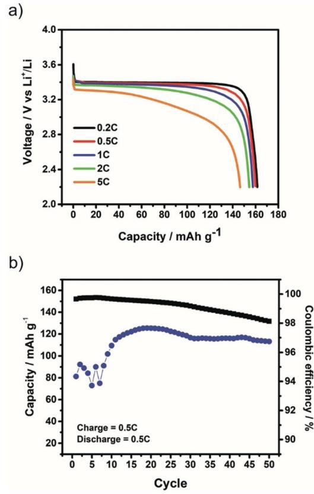

German Edition: DOI: [10.1002/ange.201801737](http://dx.doi.org/10.1002/ange.201801737) Lithium Metal Batteries International Edition: DOI: [10.1002/anie.201801737](http://dx.doi.org/10.1002/anie.201801737)

## An Artificial Lithium Protective Layer that Enables the Use of Acetonitrile-Based Electrolytes in Lithium Metal Batteries

[Ngoc](http://orcid.org/0000-0003-3845-3702) Duc [Trinh,](http://orcid.org/0000-0003-3845-3702) David [Lepage,](http://orcid.org/0000-0002-5755-2514) David [Aym8-Perrot,](http://orcid.org/0000-0002-5755-2514) [Antonella](http://orcid.org/0000-0002-1026-4136) Badia,\* [Mickael](http://orcid.org/0000-0002-8887-6730) Doll8,\* [and](http://orcid.org/0000-0002-8887-6730) Dominic [Rochefort\\*](http://orcid.org/0000-0003-0693-1108)

Abstract: The resurgence of the lithium metal battery requires innovations in technology, including the use of non-conventional liquid electrolytes. The inherent electrochemical potential of lithium metal (@3.04 V vs. SHE) inevitably limits its use in many solvents, such as acetonitrile, which could provide electrolytes with increased conductivity. The aim of this work is to produce an artificial passivation layer at the lithium metal/ electrolyte interface that is electrochemically stable in acetonitrile-based electrolytes. To produce such a stable interface, the lithium metal was immersed in fluoroethylene carbonate (FEC) to generate a passivation layer via the spontaneous decomposition of the solvent. With this passivation layer, the chemical stability of lithium metal is shown for the first time in 1m LiPF6 in acetonitrile.

Lithium metal is an ideal candidate for the negative electrode (anode) in Li metal batteries because it has the highest theoretical capacity (3860 mAhg @1 ) combined with the lowest electrochemical potential (@3.04 V vs. SHE).[1] There is renewed interest in the Li metal battery owing to the limitations of Li-ion batteries for electric vehicle purposes, for example, in terms of energy densities. [2] Emerging technologies that use Li metal anodes, such as Li-Air and Li-S, provide the high theoretical energy densities required for next-generation energy storage applications. [3]

Liquid electrolyte decomposition and dendrite formation are known issues that limit the application of Li metal in a battery. Many strategies have been proposed to use Li metal anodes, [4] but the only practical application where their instability problem has been controlled is the Li metal-dry polymer battery, in which the dendrite evolution remains constrained by the stiff polymer in comparison to liquids. [5] The presence of a physical barrier at the electrode/electrolyte interface, that is, a passivation layer at the Li metal surface, is an effective solution to overcome issues associated with dendrite formation and electrolyte decomposition. Such

| [*] Dr. N.-D. Trinh, Dr. D. Lepage, Prof. A. Badia, Prof. M. Doll8, |
|---------------------------------------------------------------------|
| Prof. D. Rochefort                                                  |
| Department of Chemistry, Universit8 de Montr8al                     |
| Montreal, H3T1J4 (Canada)                                           |
| E-mail: antonella.badia@umontreal.ca                                |
| mickael.dolle@umontreal.ca                                          |
| dominic.rochefort@umontreal.ca                                      |
| Dr. D. Aym8-Perrot                                                  |
| Prospective lab, Total SA                                           |
| Paris La D8fense, 92069 (France)                                    |
| Supporting information and the ORCID identification number(s) for   |
| the author(s) of this article can be found under:                   |
|                                                                     |

[https://doi.org/10.1002/anie.201801737.](https://doi.org/10.1002/anie.201801737)

a passivation layer can be formed in situ, as the electrochemical potential of the Li metal is sufficiently low to initiate the electrolyte reduction that leads to formation of the solid electrolyte interphase (SEI).[6] Remarkable efforts have been made by Peled and Aurbach to understand this crucial component of the Li battery. [7] The SEI layer permits Li+ ion transport from the bulk to the Li metal electrode and hinders the continuous consumption of the electrolyte, that is, infinite Li+ consumption. An effective SEI layer requires a homogeneous chemical composition and morphology and a high ionic conductivity. [8] Moreover, the mechanical strength of the SEI layer is important since the non-uniform plating/stripping at the Li surface will generate local stress.

The SEI layer is normally formed during initial electrochemical cycling in the lower potential range (< 1 V vs. Li + /Li for carbonate-based solvents). Intensive efforts have been made to mimic this passivation layer via a chemical treatment to modify its surface and deliberately create a physical barrier (artificial SEI). Different approaches including atomic layer deposition (ALD),[9] in situ polymerization,[10] and solutionbased reactions[11] have been used to deliberately passivate the Li metal surface.

Producing an artificial SEI layer on Li metal surfaces opens new avenues to improve the performance of batteries. The use of unconventional solvents that provide interesting electrolyte properties, but are normally unstable with Li metal can be considered. Acetonitrile (ACN), for instance, has a high dielectric constant (e = 35.9)[12] and high solvating power but a lower viscosity than carbonates. These properties are attractive for high-power applications, which are very demanding in terms of ionic transport, despite the higher vapor pressure of ACN compared to carbonates. [13] ACN electrolytes are currently applied in supercapacitors. [14] However, ACN is thermodynamically unstable in the presence of Li metal and, in contrast to cyclic carbonates, cannot form an in situ SEI. Its decomposition rather results in the formation of highly toxic cyanide ions. [15] Furthermore, the role of ACN solvent in HF formation during the decomposition of LiPF6 remains to be demonstrated.[13] A major step towards the application of ACN in Li batteries was accomplished by Yamada et al., when they demonstrated the stability of ACN under reductive conditions and the electrochemically reversible lithiation of graphite in superconcentrated ACN electrolyte (4.2m Li bis(trifluoromethanesulfonyl)imide (LiTFSI)).[16] They proposed that the chemical stability comes from the lack of free solvent molecules in the electrolyte, inhibiting ACN insertion into the graphitic layers. [16] As a result, the stability of ACN is highly improved, even in the presence of Li metal, indicating a tolerance against reductive conditions. A drawback to the superconcentrated electrolyte is that the large concentration in Li salt (4.2m LiTFSI) inevitably increases the viscosity and ionic conductivity, making the electrolyte less attractive for highpower batteries. Furthermore, it has been demonstrated that TFSI@ anions accelerate the anodic dissolution of the aluminum current collectors. [17] For these reasons, it is more desirable to use moderate, conventional concentrations of Li salt in ACN electrolyte, that is, 1m LiPF6 /ACN. [18]

The purpose of this work is to demonstrate the stability of Li metal in 1m LiPF6 /ACN after chemical treatment with fluoroethylene carbonate (FEC), a well-known additive in battery electrolytes. [19] We show that a passivation layer is formed via the spontaneous degradation of FEC when the Li metal is immersed in the neat solvent. This study aims to evaluate the passivation layer formed spontaneously upon the immersion of Li metal in neat FEC. A comparative study was performed by immersing Li metal in a commercial electrolyte consisting of 1m LiPF6 in EC/DEC 1:2 (v/v) to generate an artificial SEI. Only the Li metal pretreated with FEC showed excellent cyclability and long-term stability in a Li-symmetrical cell in 1m LiPF6 /ACN.

Two distinct ex situ chemical treatments of the Li metal were used to prepare protective layers: one involving FEC (sample labeled FEC-Li) and the other a commercial electrolyte consisting of 1m LiPF6 in EC/DEC 1:2 (v/v) (sample labeled EC/DEC-Li; Table 1). In both cases, the treatment

Table 1: Summary of the cycling stability of Li/Li cells with different treatments of the Li anode. Cycling was done using 0.1 mAcm@2 for 30 minutes per half cycle.

| Li anode treatment | Electrolyte used for cycling | Number of hours before failure[a] |
|-----------------------|---------------------------------|--------------------------------------|
|                       | 1 m LiPF6 in ACN             | 0                                    |
| Bare Li               | 1 m LiPF6 in ACN+10% FEC     | <2                                   |
| EC/DEC-Li             | 1 m LiPF6 in ACN             | <90                                  |
|                       | 1 m LiPF6 in ACN             | >700                                 |
| FEC-Li                | 1 m LiPF6 in ACN+10% FEC     | >200                                 |
|                       | 1 m LiPF6 in EC/DEC          | >200                                 |
| FEC-Li-washed         | 1 m LiPF6 in ACN+10% FEC     | <2                                   |

[a] Defined as the onset of unrecoverable cell resistance increase.

consisted in immersing the Li foil in either neat FEC (neat FEC has a concentration of 13.7m) or the carbonate mixture for 12 h. The electrochemical performance of these two samples was investigated in standard coin cells. The Lisymmetrical cells were cycled at 0.1 mAcm@2 for 30 min per half cycle in 1m LiPF6 /ACN. The voltage–time profiles of the treated electrodes are displayed in Figure 1. The cycles of the EC/DEC-Li (Figure 1 a) were relatively stable during the first 20 h, with an average overpotential of about 75 mV. Subsequent cycles displayed a gradual increase in the overpotential over 100 h and reached a maximum value of > 3 V, indicating cell failure. These results demonstrate the ineffectiveness of the EC/DEC-Li surface layer at preventing the decomposition of ACN on Li. The surface film allowed the initial Li plating/stripping, but the electrochemical reaction accelerated the film degradation and left an exposed and unpro-

Figure 1. Voltage–time profiles of Li-symmetrical cells at 0.1 mAcm@2 for 30 min per half cycle for a) EC/DEC-Li and b) FEC-Li in 1m LiPF6/ ACN at a temperature of 308C. The break in (b) covers 75 to 640 h.

tected Li metal, thereby initiating the ACN reduction. By contrast, the FEC-Li sample demonstrated an excellent electrochemical behavior; the initial overpotential was very low (ca. 20 mV) and remained stable for repetitive cycles (Figure 1 b), as the cell displayed no significant overpotential fluctuation after 700 h of cycling.

To evaluate the stability of FEC-Li at higher regimes, analogous experiments were performed, but with different charge/discharge time reactions per half cycle. The 10 h half cycle is presented in Figure 2 and the 2 h in the Supporting

Figure 2. Voltage–time profiles of Li-symmetrical cells at 0.1 mAcm@2 for 10 h per half cycle for FEC-Li in 1m LiPF6/ACN at a temperature of 308C.

Information, Figure S1, showing stable cycling for over 1500 h. The passivation layer remained stable even when using a higher current density (1.0 mAcm@2 ) for over 150 h (Supporting Information, Figure S2). These results reveal the markedly different behavior of the FEC-Li compared to EC/ DEC-Li, suggesting that the underlying lithium metal plating reaction shows good electrochemical reversibility and a good Li+ cation transport through the passivation film.

FEC is usually added in small amounts to the electrolyte to promote SEI formation during operation. We therefore compared the effectiveness of the SEI formed in cell with that of a layer formed ex-cell at preventing the decomposition of ACN. Li-symmetrical cells made with untreated Li metal in 10% (v/v) FEC in 1m LiPF6 /ACN ([FEC] = 1.37m) showed a continuous increase in the overpotential after only 2 h of cycling and subsequently reached a maximum value of 10 V (Supporting Information, Figure S3a), suggesting that, although effective in conventional electrolytes, a FEC additive cannot prevent the decomposition of ACN ataLi metal anode. At 10%(v/v), FEC decomposition results in a passivation layer, which might not be dense enough to prevent ACN permeation. To demonstrate that the stability in ACN comes from the FEC chemical decomposition film, one FEC-Li sample was rinsed with DMC to deliberately remove some of the layer from the surface (labelled FEC-Li-washed; Supporting Information, Figure S3b). We noticed an electrochemical behavior similar to the cell with FEC used as additive in the electrolyte. In both cases, the initial overpotential remained lower than 100 mV for a short time after rapidly increasing to the 10 V cut-off, showing that only dense passivation layers formed by pure FEC decomposition can efficiently prevent ACN decomposition.

The morphology of the different passivation layers was monitored by AFM. The Li metal was immersed in 1m LiPF6 in EC/DEC 1:2 (v/v) or neat FEC for 5 h. The untreated Li metal surface (Figure 3 a) presents a relatively smooth surface

Figure 3. AFM images of the Li metal surface: a) in an argon-filled atmosphere without chemical treatment, b),c) after spontaneous reaction in 1m LiPF6 in EC/DEC 1:2 (v/v), and d),e) after immersion in neat FEC for 5 h. Image size for (a), (b), and (d) is 10 mmW10 mm and for (c) and (e) is 1 mmW1 mm.

with few cavities. In Figure 3 b,c the surface was imaged after 5 h of immersion in 1m LiPF6 in EC/DEC 1:2 (v/v). The formation of a surface layer is clearly visible, which can be described as a homogeneous granular film that completely covers the surface. The film is composed of flat quasi-circular structures of approx. 100–250 nm diameter, as estimated from the AFM images (Figure 3 c). Moreover, according to Kanamura et al., the spontaneous reaction between Li metal and 1m LiPF6 in DEC produces a surface layer mainly composed of inorganic Li salts, including PF5 and LiF, [20] and the degradation of EC forms a stable SEI mostly composed of Li ethylene dicarbonate (CH2OCO2Li)2 . [21] The combination of both the solvent and the salt creates a surface layer similar to the widely accepted SEI mosaic structure model which consists of multiple inorganic and organic products originating from the electrolyte decomposition.[7a] For comparison, Figure 3 d,e display the topography of the Li metal surface after 5 h reaction in FEC. The film presents a heterogeneous morphology composed of individual circular particles (ca. 100–200 nm in diameter) and agglomerates, which are seen in Figure 3 e.

The surface morphology and composition of the FEC-Li after extensive electrochemical cycling (700 h) in a symmetrical cell in 1m LiPF6 /ACN were characterized by SEM. The image in the Supporting Information, Figure S6, reveals a smooth surface, which indicates no dendrite formation. XPS (Supporting Information, Figures S7, S8 and Tables S1– S4) shows that the passivation layer produced from FEC decomposition is composed of LiF with an important contribution of Li carbonate organics. The FEC-Li yields higher atomic % of carbon and oxygen by a factor of about 3 compared to EC/DEC-Li. This higher content in organic compounds from the reduction of fluoroethylene carbonate may explain the increased stability of the FEC-based layer.

The electrochemical performance of LiFePO4 (cathode) using FEC-Li (anode) was investigated in 1m LiPF6 /ACN at 308C. The discharge curves at different C-rates, ranging from 0.2C to 5C, in the 2.2–4.2 V vs. Li+ /Li voltage window for LiFePO4 are presented in Figure 4 a. The discharge capacity yielded 162 mAhg @1 at 0.2C, which is close to the theoretical value of 170 mAhg @1 . Interestingly, the discharge capacities varied from 162 mAhg @1 at 0.2C to 154 mAhg @1 at 2 C, despite a small polarization at higher C-rates. Even at 5 C, the discharge capacity retained about 90% of the maximum

Figure 4. a) Discharge curves obtained at various C-rates (0.2C to 5C, charge at 0.2C). b) Capacity evolution (black squares) and coulombic efficiency (blue circles) during 50 cycles at 0.5C for LiFePO4 using FEC-Li in 1m LiPF6/ACN at a temperature of 308C.

experimental value obtained at 0.2C. The capacity evolution was studied at 0.5C for both the charge/discharge processes (Figure 4 b). An initial discharge capacity of 152 mAhg @1 was obtained. A slight decrease was observed and 82% of the capacity was retained after 50 cycles at 0.2C. The coulombic efficiency was low over the 50 cycles (97% after stabilization) but similar to the values reported by Zhang et al. of 98% and 96% for Li metal/Cu in LiPF6–EC/DEC electrolyte with 5% FEC after 50 cycles at 0.1 and 0.5 mAcm@2 , respectively. [22] In our case, the LiFePO4 composite electrode might also interact with ACN and impact the efficiency and capacity. While further investigations on the passivation layer, electrode and electrolyte integrity after long-term cycling will be needed to provide the system with improved stability, the approach proposed here opens new perspectives to employ Li metal anodes with solvents other than carbonates.

The chemical pre-treatment of lithium metal with neat fluoroethylene carbonate produces a highly effective passivation layer against ACN reduction, allowing the use of acetonitrile-based electrolytes in batteries. This layer is composed of a high proportion of organic compounds and lower amounts of LiF versus layers formed from EC/DEC decomposition. The Li-symmetrical cells using FEC-treated lithium could be cycled for over 700 h at different current densities without cell failure. The efficacy of the FEC treatment was demonstrated in a half-cell using LiFePO4 , where a discharge capacity of 162 mAhg @1 at 0.2C was obtained. The simple yet effective method described here is, to our knowledge, the first demonstration of the chemical stability of lithium metal in 1m LiPF6 /ACN for lithium batteries.

## Acknowledgements

The authors thank Dr. Michel Gauthier for his assistance during the work and critical review of this manuscript. We acknowledge the financial support of the National Sciences and Engineering Research Council of Canada (NSERC), Hutchinson Aeronautics & Industry and Total (NSERC Collaborative Research and Development Grant #RDCPJ468656-14).

## Conflict of interest

The authors declare no conflict of interest.

Keywords: acetonitrile · electrochemistry · electrolytes · lithium metal anodes · solid–electrolyte interface

How to cite: Angew. Chem. Int. Ed. 2018, 57, 5072– 5075 Angew. Chem. 2018, 130, 5166– 5169

- [1] K. Zhang, G.-H. Lee, M. Park, W. Li, Y.-M. Kang, [Adv. Energy](https://doi.org/10.1002/aenm.201600811) Mater. 2016, 6[, 1600811.](https://doi.org/10.1002/aenm.201600811)
- [2] D. Lin, Y. Liu, Y. Cui, Nat. [Nanotechnol.](https://doi.org/10.1038/nnano.2017.16) 2017, 12, 194.
- [3] P. G. Bruce, S. A. Freunberger, L. J. Hardwick, J.-M. Tarascon, Nat. [Mater.](https://doi.org/10.1038/nmat3191) 2012, 11, 19.
- [4] A. Mauger, M. Armand, C. M. Julien, K. Zaghib, J. [Power](https://doi.org/10.1016/j.jpowsour.2017.04.018) [Sources](https://doi.org/10.1016/j.jpowsour.2017.04.018) 2017, 353, 333.
- [5] L. Long, S. Wang, M. Xiao, Y. Meng, J. [Mater. Chem.](https://doi.org/10.1039/C6TA02621D) A 2016, 4, [10038](https://doi.org/10.1039/C6TA02621D).
- [6] X.-B. Cheng, R. Zhang, C.-Z. Zhao, F. Wei, J.-G. Zhang, Q. Zhang, Adv. Sci. 2016, 3[, 1500213.](https://doi.org/10.1002/advs.201500213)
- [7] a) E. Peled, D. Golodnitsky, G. Ardel, J. [Electrochem.](https://doi.org/10.1149/1.1837858) Soc. 1997, 144[, L208](https://doi.org/10.1149/1.1837858); b) D. Aurbach, J. Power [Sources](https://doi.org/10.1016/S0378-7753(00)00431-6) 2000, 89, 206.
- [8] M. Gauthier, T. J. Carney, A. Grimaud, L. Giordano, N. Pour, H.-H. Chang, D. P. Fenning, S. F. Lux, O. Paschos, C. Bauer, F. Maglia, S. Lupart, P. Lamp, Y. Shao-Horn, J. [Phys. Chem.](https://doi.org/10.1021/acs.jpclett.5b01727) Lett. 2015, 6[, 4653.](https://doi.org/10.1021/acs.jpclett.5b01727)
- [9] A. C. Kozen, C.-F. Lin, A. J. Pearse, M. A. Schroeder, X. Han, L. Hu, S.-B. Lee, G. W. Rubloff, M. Noked, [ACS Nano](https://doi.org/10.1021/acsnano.5b02166) 2015, 9, [5884](https://doi.org/10.1021/acsnano.5b02166).
- [10] D. G. Belov, O. V. Yarmolenko, A. Peng, O. N. Efimov, [Synth.](https://doi.org/10.1016/j.synthmet.2006.04.006) Met. 2006, 156[, 745](https://doi.org/10.1016/j.synthmet.2006.04.006).
- [11] a) Q.-C. Liu, J.-J. Xu, S. Yuan, Z.-W. Chang, D. Xu, Y.-B. Yin, L. Li, H.-X. Zhong, Y.-S. Jiang, J.-M. Yan, X.-B. Zhang, [Adv. Mater.](https://doi.org/10.1002/adma.201501490) 2015, 27[, 5241](https://doi.org/10.1002/adma.201501490); b) L. Ma, M. S. Kim, L. A. Archer, [Chem.](https://doi.org/10.1021/acs.chemmater.6b03687) Mater. 2017, 29[, 4181](https://doi.org/10.1021/acs.chemmater.6b03687); c) Z. Hu, S. Zhang, S. Dong, W. Li, H. Li, G. Cui, L. Chen, [Chem.](https://doi.org/10.1021/acs.chemmater.7b00091) Mater. 2017, 29, 4682.
- [12] J. A. Riddick, W. B. Bungh, T. K. Sakano, Organic Solvents: Physical Properties and Methods of Purification, 4th ed., Wiley, New York, 1986, p. 472.
- [13] N. P. Lebedeva, L. Boon-Brett, J. [Electrochem.](https://doi.org/10.1149/2.0171606jes) Soc. 2016, 163, [A821.](https://doi.org/10.1149/2.0171606jes)
- [14] M. M. Thackeray, C. Wolverton, E. D. Isaacs, Energy [Environ.](https://doi.org/10.1039/c2ee21892e) Sci. 2012, 5[, 7854](https://doi.org/10.1039/c2ee21892e).
- [15] M. W. Rupich, L. Pitts, K. M. Abraham, J. [Electrochem.](https://doi.org/10.1149/1.2124314) Soc. 1982, 129[, 1857.](https://doi.org/10.1149/1.2124314)
- [16] Y. Yamada, K. Furukawa, K. Sodeyama, K. Kikuchi, M. Yaegashi, Y. Tateyama, A. Yamada, J. Am. [Chem.](https://doi.org/10.1021/ja412807w) Soc. 2014, 136[, 5039](https://doi.org/10.1021/ja412807w).
- [17] E. Kr-mer, T. Schedlbauer, B. Hoffmann, L. Terborg, S. Nowak, H. J. Gores, S. Passerini, M. Winter, J. Electrochem. Soc. 2013, 160, A356.
- [18] a) X. Zhang, T. M. Devine, J. [Electrochem.](https://doi.org/10.1149/1.2214465) Soc. 2006, 153, B344; b) S.-T. Myung, Y. Hitoshi, Y.-K. Sun, J. [Mater. Chem.](https://doi.org/10.1039/c0jm04353b) 2011, 21, [9891](https://doi.org/10.1039/c0jm04353b).
- [19] a) E. Markevich, G. Salitra, D. Aurbach, [ACS Energy](https://doi.org/10.1021/acsenergylett.7b00163) Lett. 2017, 2[, 1337](https://doi.org/10.1021/acsenergylett.7b00163); b) I. A. Shkrob, J. F. Wishart, D. P. Abraham, J. [Phys.](https://doi.org/10.1021/acs.jpcc.5b03591) Chem. C 2015, 119[, 14954](https://doi.org/10.1021/acs.jpcc.5b03591); c) H. Shin, J. Park, A. M. Sastry, W. Lu, J. [Electrochem.](https://doi.org/10.1149/2.0071509jes) Soc. 2015, 162, A1683; d) I. A. Profatilova, S.-S. Kim, N.-S. Choi, [Electrochim.](https://doi.org/10.1016/j.electacta.2009.03.032) Acta 2009, 54, 4445; e) N.-S. Choi, K. H. Yew, K. Y. Lee, M. Sung, H. Kim, S.-S. Kim, J. [Power](https://doi.org/10.1016/j.jpowsour.2006.05.049) [Sources](https://doi.org/10.1016/j.jpowsour.2006.05.049) 2006, 161, 1254.
- [20] a) A. Gu8guen, D. Streich, M. He, M. Mendez, F. F. Chesneau, P. Nov#k, E. J. Berg, J. [Electrochem.](https://doi.org/10.1149/2.0981606jes) Soc. 2016, 163, A1095; b) S. F. Lux, I. T. Lucas, E. Pollak, S. Passerini, M. Winter, R. Kostecki, [Electrochem.](https://doi.org/10.1016/j.elecom.2011.10.026) Commun. 2012, 14, 47; c) K. Kanamura, H. Takezawa, S. Shiraishi, Z. I. Takehara, J. [Electrochem.](https://doi.org/10.1149/1.1837718) Soc. 1997, 144[, 1900.](https://doi.org/10.1149/1.1837718)
- [21] D. Aurbach, B. Markovsky, A. Shechter, Y. Ein-Eli, H. Cohen, [J.](https://doi.org/10.1149/1.1837300) [Electrochem.](https://doi.org/10.1149/1.1837300) Soc. 1996, 143, 3809.
- [22] X.-Q. Zhang, X.-B. Cheng, X. Chen, C. Yan, Q. Zhang, [Adv.](https://doi.org/10.1002/adfm.201605989) Funct. Mater. 2017, 27[, 1605989.](https://doi.org/10.1002/adfm.201605989)

Manuscript received: February 13, 2018 Accepted manuscript online: March 1, 2018 Version of record online: March 22, 2018