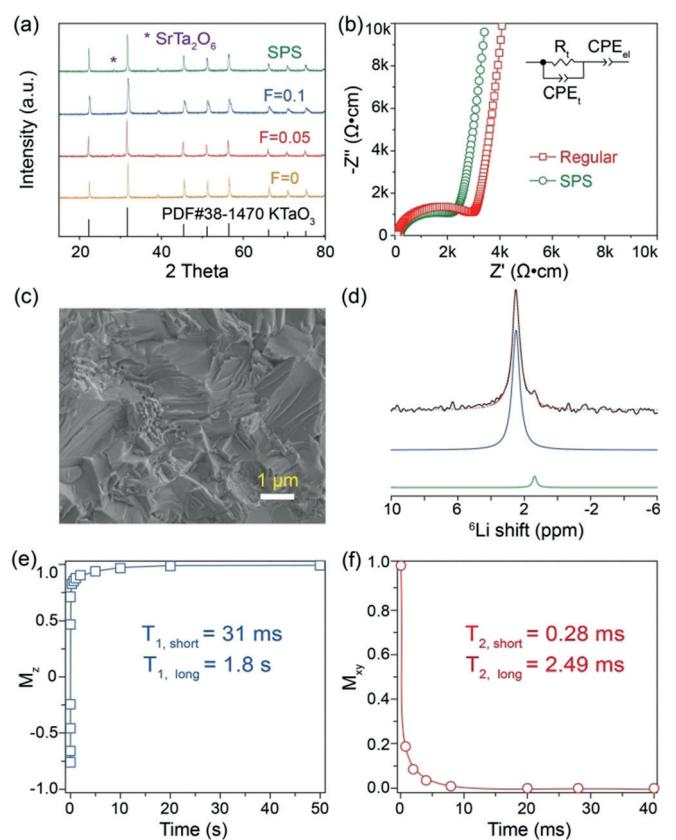
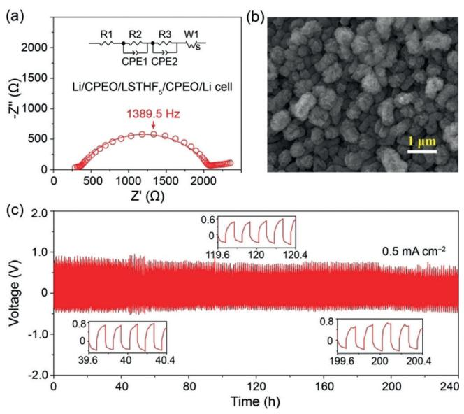
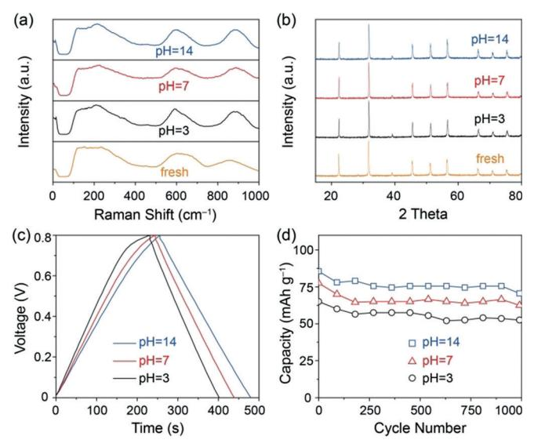
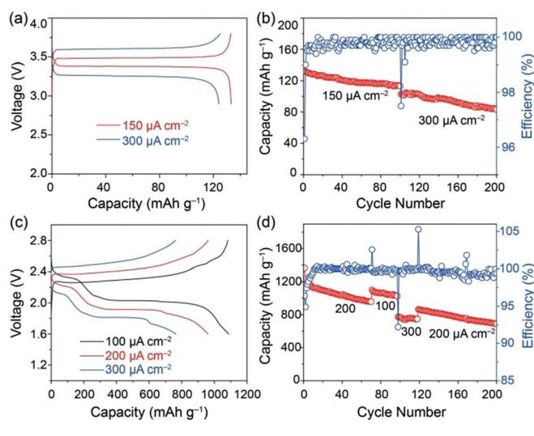

## **Batteries**

## A Perovskite Electrolyte That Is Stable in Moist Air for Lithium-Ion **Batteries**

Yutao Li, Henghui Xu, Po-Hsiu Chien, Nan Wu, Sen Xin, Leigang Xue, Kyusung Park, *Yan-Yan Hu, and John B. Goodenough*\*

**Abstract:** Solid-oxide  $Li^+$  electrolytes of a rechargeable cell are generally sensitive to moisture in the air as  $H^+$  exchanges for the mobile  $Li^+$  of the electrolyte and forms insulating surface phases at the electrolyte interfaces and in the grain boundaries of a polycrystalline membrane. These surface phases dominate the total interfacial resistance of a conventional rechargeable cell with a solid-electrolyte separator. We report a new perovskite  $Li^+$  solid electrolyte,  $Li_{0.38}Sr_{0.44}Ta_{0.7}Hf_{0.3}O_{2.95}F_{0.05}$ , with a lithium-ion conductivity of  $\sigma_{Li} = 4.8 \times 10^{-4} \text{ S cm}^{-1}$  at 25°C that does not react with water having  $3 < pH < 14$ . The solid electrolyte with a thin  $Li^+$ -conducting polymer on its surface to prevent reduction of  $Ta^{5+}$  is wet by metallic lithium and provides low-impedance dendrite-free plating/stripping of *a lithium anode. It is also stable upon contact with a composite* polymer cathode. With this solid electrolyte, we demonstrate excellent cycling performance of an all-solid-state  $Li/LiFePO_4$ cell, a Li-S cell with a polymer-gel cathode, and a supercapacitor.

 $\mathbf{K}$ eplacement of the flammable organic liquid electrolyte of a Li-ion battery by a non-flammable solid Li+ electrolyte from/to which low-impedance dendrite-free plating/stripping of a metallic-lithium anode can occur over a long cycle life is a high-priority technical target.[1] Dendrite-free plating/stripping of a lithium anode over a long cycle life requires not only wetting of the solid electrolyte by metallic lithium,[2] but also an electric energy gap for the solid electrolyte of  $Eg > 5$  eV that has the bottom of its conduction band above the Fermi level of metallic lithium.[3] High rates of charge/discharge require a low impedance for plating/stripping across the electrode/electrolyte interface as well as an ionic conductivity of  $\sigma_i > 5 \times 10^{-3}$  S cm-1 at the operating temperature  $T_{op}$  of the cell.[4] Solid Li+ electrolytes previously reported are mostly moisture-sensitive and plagued by the formation of insulating

|   | [*] Y. Li, H. Xu, N. Wu, S. Xin, L. Xue, K. Park, J. B. Goodenough Materials Science and Engineering Program and Texas Materials Institute, University of Texas at Austin Austin, TX 78712 (USA) |
|---|-----------------------------------------------------------------------------------------------------------------------------------------------------------------------------------------------------------|
|   | E-mail: jgoodenough@mail.utexas.edu                                                                                                                                                                       |
|   | P. Chien, Y.-Y. Hu Department of Chemistry and Biochemistry Florida State University Tallahassee, FL 32310 (USA)                                                                                 |
|   | Y.-Y. Hu National High Magnetic Field Laboratory 1800 East Paul Dirac Drive, Tallahassee, FL 32310 (USA)                                                                                            |
| ₪ | Supporting information and the ORCID identification number(s) for the author(s) of this article can be found under: $\frac{1}{2}$                                                                      |

https://doi.org/10.1002/anie.201804114.

surface layers on grain boundaries and at the anode/electrolyte interface that reduce the  $\sigma_i$  value of a polycrystalline electrolyte membrane.[5] Moreover, interfacial degradation also prevents wetting of the solid electrolyte by lithium and introduces a large interfacial resistance that increases with cycling.[6] Herein, we report a new oxo-perovskite Li+ electrolyte,  $\text{Li}_{0.38}\text{Sr}_{0.44}\text{Ta}_{0.7}\text{Hf}_{0.3}\text{O}_{2.95}\text{F}_{0.05}$ , that provides lowimpedance plating/stripping of a lithium-metal anode over a long cycle life if a thin Li+-conducting polymer coats the surface contacting the anode; this coat suppresses the reduction of Ta5+. Fluorine doping helps reduce the interfacial resistance of the battery. The solid electrolyte is moisturetolerant at  $3 \le pH \le 14$  and also retains a low-impedance interface with a composite cathode. Full-cell assembly is facile, and low-cost full cells with a long cycle life are demonstrated.

 $\text{Li}_{0.38}\text{Sr}_{0.44}\text{Ta}_{0.75-x}\text{Hf}_{0.25+x}\text{O}_{3-x}\text{F}_x$  (0  $\leq$  x  $\leq$  0.1) samples prepared by regular high-temperature sintering have a cubic perovskite structure (Figure 1a; see also the Supporting Information, Figure S1 a); only a very small amount of the  $SrTa2O6$  secondary phase exists. The lattice parameter of  $\text{Li}_{0.38}\text{Sr}_{0.44}\text{Ta}_{0.75-x}\text{Hf}_{0.25+x}\text{O}_{3-x}\text{F}_x$  (Table S1 and Figure S1b) increases with  $x$  because the ionic radius of Hf4+ is larger than that of  $Ta^{5+}.$  The  $\mbox{Li}_{0.38}\mbox{Sr}_{0.44}\mbox{Ta}_{0.7}\mbox{Hf}_{0.3}\mbox{O}_{2.95}\mbox{F}_{0.05}$  (LSTHF5) pellet has the highest density of 6.8 g cm-3 (Table S1), and a few closed pores were observed in the pellet (Figure S2). The density and mechanical strength of LSTHF5 pellets were further improved by firing the LSTHF5 powders with spark plasma sintering (SPS). The strong bonding between the grains of LSTHF5 is evidenced by the transcrystalline rupture (Figure 1c), which increases the Li-ion transport across the grain-boundary. The LSTHF5 pellets fired by conventional sintering and by SPS have room-temperature Li-ion conductivities of 3.3 and  $4.8 \times 10^{-4}$  S cm-1, respectively (Figure 1 b and Figure S1 c).

High-resolution 6Li NMR spectroscopy was performed to resolve the lithium local structural environment. The Li+ ions in LSTHF5 have two different local environments with resonances at  $\delta = 2.49$  and 1.37 ppm (Figure 1 d). The major component at  $\delta = 2.49$  ppm corresponds to 96% of the total integral while the minor component accounts for the remaining 4%. The A site coordinated by twelve oxygen atoms in a cubic perovskite structure  $(ABO3)$  is too large for a small Li+ ion, and the face of the cubic framework containing four coplanar oxygen atoms is large enough to accept a  $Li^+$  ion. The  $Li^+$  ions in LSTHF5 can 1) occupy the faces bordering two empty A sites (Figure S3) or 2) it is displaced from a face by electrostatic repulsion from a  $Sr^{2+}$  ion on one side of the face. The  $Li^+$ /cubic face ratio in LSTHF5 is close to 1:8, and the

Figure 1. a) XRD patterns of Li0.38Sr0.44Ta0.75@xHf0.25+xO3@xFx . b) Roomtemperature electrochemical impedance plots of the LSTHF5 pellets; the impedance plot was fitted with an equivalent circuit (RtCPEt )- (CPEel). c) SEM image of LSTHF5 prepared by SPS. d) High-resolution 6 Li MAS NMR spectra of LSTHF5 ; results of spectral simulations (green and blue lines and red dotted line) are displayed with the experimental spectrum (black line). e,f) 7 Li spin–lattice relaxation times (T1 ) and spin–spin relaxation times (T2 ) of LSTHF5 . Both short and long T1 and T2 relaxation times are given in the Figure.

small activation energy of 0.3 eV was ascribed to fast Li-ion hopping between faces separating empty A sites (Figure S1d). Fast-ion dynamics are closely related to the spin– lattice (T1) and spin–spin relaxation times (T2). Shorter relaxation times, especially T1 , imply fast Li-ion movement (Figure 1 e, f). The calculated T1 and T2 relaxation times show distinct Li-ion motion between two different sites. Most Li ions (at d = 2.49 ppm) in LSTHF5 are more mobile as is indicated by the much shorter T1 and T2 times. The ratio between the two separate magnetization quantities in both T1 and T2 relaxation measurements agrees well with the proportion of the integrals extracted from the 6Li spectrum.

The electrochemical stability of LSTHF5 tested in a Li/ LSTHF5 /Au cell is shown in Figure S4; the metallic lithium anode and LSTHF5 electrolyte were separated by a 100 mmthick crosslinked Li-ion conductive polymer (CPEO) with a Li ion conductivity of approximately 10@4 S cm@1 at 65 8C and a high melting point exceeding 2008C.[7] LSTHF5 is stable between 1.3 and 4.5 V, but is unstable at voltages below 1.3 V because of reduction of the Ta5+ ions. [8] A solid Li+ -conducting lithium alloy[9] or polymer layer[10] is usually added between a lithium metal anode and an oxide solid electrolyte to 1) reduce the interfacial resistance, 2) retain the Li/solidelectrolyte interface during cycling, and 3) homogenize the current density through the solid electrolyte. The impedance plot of the symmetric Li/Li cell is shown in Figure 2 a;

Figure 2. a) Electrochemical impedance plot of LSTHF5 in symmetric Li electrodes at 658C. b) SEM image of Li metal after cycling the symmetric Li/LSTHF5/Li cell. c) Charge and discharge voltage profiles of the Li/LSTHF5/Li cell at 658C.

LSTHF5 has a small interfacial resistance of about 220 Wcm2 with the CPEO, which is much smaller than that of the Li7La3Zr2O12 garnet electrolyte (900 Wcm2 ).[10b] The symmetric cell cycling at 0.5 mAcm@2 in Figure 2 c has a low overpotential of 0.6 V, and there is no notable voltage increase after 240 h. Lithium only grows at the Li/CPEO interface in the form of particles with an average size of 1 mm (Figure 2 b), and no lithium dendrites were observed on the Li metal surface. The symmetric Li/CPEO/Li cell was short-circuited at 0.4 mAcm@2 after 72 h, and the voltage kept increasing, indicating an unstable interface (Figure S5). The current density of the symmetric Li/Li cell with the LSTHF5 pellet is almost double the critical current density of the cell with a garnet electrolyte (300 mA cm@2 ).[6]

The chemical stability of a solid electrolyte upon exposure to moisture and CO2 in the air determines the total internal resistance of a Li-ion battery. The exchange of electrolyte Li+ and the H + of adsorbed water as OH@ and (HCO3) @ occurs where the Li+ ions of the electrolyte are destabilized by Li+ – Li+ repulsion across a shared site face, which occurs in the garnet Li7La3Zr2O12 ; the resulting LiOH and Li2CO3 phases on the surface and the grain boundaries of a polycrystalline membrane introduce a large internal resistance unless removed by appropriate high-temperature annealing. The mobile Li+ ions of the oxoperovskite LSTHF5 do not share a common site face, and the Li+ ions displaced by a Sr 2+ neighbor are not mobile. The TGA result of LSTHF5 aged in the air for one year (LSTHF5 /1Y) in Figure S6 a shows that it has good chemical stability in the air; the weight loss of  $0.1$ – 0.15 wt% between 180 and 320°C can be assigned to the loss of adsorbed water. The bands at 598 and 892 cm-1 in the Raman spectra (Figure S6b) of LSTHF5 and LSTHF5/1Y originate from the vibration of Hf-O and Ta-O bonds, respectively; no band at  $1090 \text{ cm}^{-1}$  corresponding to the vibration of  $CO_3^{2-}$  was observed in the Raman spectra. The fresh LSTHF5 and LSTHF $\sqrt{1}$ Y pellets have the same lattice parameters  $(4.000 \text{ Å})$  and nearly room-temperature Li-ion conductivity (Figure S6c, d); all results indicate the excellent stability of LSTH $F_5$  in the air.

The stability of an oxide solid electrolyte in water is important if it is used in an aqueous solution. However, most oxide electrolytes are unstable in water, which limits their application in an aqueous redox-flow battery.[11] For example, the pH of neutral water increases to 12 after putting the garnet electrolyte  $Li_7La_3Zr_2O_{12}$  in water for several minutes because of the fast exchange of Li+/H+, and the Li-ion conductivity decreases by two orders of magnitude after the reaction. To check the structural and chemical stability of LSTHF5 in water with different pH values, LSTHF5 pellets were immersed in water with pH 0, 3, 7, or 14 (LSTHF5-pH- $x$ ) for two weeks. The Raman spectra and XRD results of the LSTHF5-pH- $x$  (3  $\leq$   $x$   $\leq$  14) pellets in Figure 3 a, b are the same as those of the fresh LSTHF5 pellet, which confirms the good stability of LSTHF5 in aqueous solution. Moreover, all of the LSTHF5-pH-x ( $3 \le x \le 14$ ) and fresh LSTHF5 pellets have the same lattice parameters of 4.000 Å. The TEM images of LSTHF5-pH-x (3  $\leq$  x  $\leq$  14) powders in Figure S7 show that the surfaces of the LSTHF5 powders retained the cubic perovskite structure of the fresh LSTHF5 sample. The roomtemperature impedance plots of LSTHF5-pH-x ( $3 \le x \le 14$ ) pellets dried at 100°C showed that there was no obvious change in the Li-ion conductivities between fresh LSTHF5

**Figure 3.** The chemical and electrochemical stability of LSTHF5 in water with different pH values. a) Raman spectra, b) XRD patterns, c) charge/discharge curves, and d) the cycling performance of C/ LSTHF5/C supercapacitors with LSTHF5 treated with water of different  $pH$  values.

Angew. Chem. Int. Ed. 2018, 57, 8587-8591

© 2018 Wiley-VCH Verlag GmbH & Co. KGaA, Weinheim

and LSTHF5-pH- $x$  (3 < 14) pellets (Figure S8). The Li-ion conductivity of the LSTHF-pH-0 pellet decreased from  $3.6 \times$  $10^{-4}$  to  $2 \times 10^{-4}$  S cm-1, indicating good stability of LSTHF5 even in a strongly acidic environment. To check the possible  $H^+$ -ion conduction inside the perovskite after putting it in water for 14 days, Li/organic electrolyte/LSTHF5-pH- $x$ / organic electrolyte/LiFePO4 batteries with LSTHF5-pH- $x$  pellets dried at 100°C as separators were prepared; the Li/ LiFePO4 battery had a total resistance of approximately  $400 \Omega$  (Figure S9a). The small overpotential and good cycling performance of a Li/LiFePO4 battery (Figure S9b, c) indicate that the conductivity of the LSTHF5-pH- $x$  (3  $\leq$   $x$   $\leq$  14) pellets is due to Li-ion transport and not to H-ion transport.

To further check the electrochemical stability of LSTHF5 in water with different pH values, a symmetric C/LSTHF5/C supercapacitor with LSTHF5 as the separator was tested; aqueous electrolytes with different pH values were added into the carbon electrodes. In Figure S10, the LSTHF5 had an interfacial resistance of 165  $\Omega$  cm2 with carbon electrodes wet by the electrolyte. The charge/discharge curves of the supercapacitors with  $3 < pH < 14$  in Figure 3c show a symmetric triangular shape from the electric-double-layer capacitance, and the specific capacitances are about  $70-80 \text{ Fg}^{-1}$ . The cycling capability of the C/LSTHF5/C supercapacitors at  $0.1 \text{ mA cm}^{-2}$  in Figure 3 d showed that the specific capacitance of C/LSTHF5/C at pH 3, 7, and 14 retained, respectively, over 95, 93, and 92.5% of its initial value after 1000 cycles (Figure 3d), which indicates that the LSTH $F_5$  is electrochemically stable in aqueous solution with  $3 \le pH \le 14$ .

The excellent stability of LSTHF5 in moist air and in aqueous solution helps to reduce the interfacial resistance of a Li-ion battery. An all-solid-state Li/LiFePO4 battery with the LSTHF5 electrolyte was assembled to check the Li-ion transport across the LSTHF5 interfaces. The Li-metal anode and the LSTHF5 pellet were separated by the CPEO polymer, which can suppress lithium-dendrite formation at the Limetal/polymer interface as confirmed in the symmetric Li/Li cell. Carbon and the CPEO were added into the LiFePO4 cathode to provide electronic and ionic conductivities. In Figure S11a, the total resistance of the all-solid-state Li/ LiFePO4 battery at 65 °C is about 600  $\Omega$  cm2, which is much smaller than that of the reported all-solid-state battery with a fast Li-ion-conducting garnet pellet.[10b] LSTHF5 shows a small interfacial resistance of 380  $\Omega$  cm2 with the composite  $LiFePO4$  cathode. The LSTHF5 electrolyte also shows a much smaller interfacial resistance with the solid polymer and the composite LiFePO4 cathode than the antiperovskite Li2- $(OH)_{0.9}F_{0.1}Cl$  electrolyte because the antiperovskite electrolyte is highly unstable even in an organic electrolyte.[5c, 10a] The all-solid-state Li/LiFePO4 cell had low overpotentials of 0.15 and 0.28 V at 150 and 300  $\mu$ A cm-2, respectively, with corresponding initial discharge capacities of 142 and 128 mAhg-1 (Figure 4a). Capacities of 120 and  $82 \text{ mAh g}^{-1}$  at 150 and  $300 \mu A \text{ cm}^{-2}$  were retained after 100 and 200 cycles with a high coulombic efficiency of 99.8–100% (Figure 4b).

To study the interfacial resistance and the performance of LSTHF5 in a Li redox-flow battery, a Li-S cell with the LSTHF5 solid electrolyte was assembled. The garnet and LISICON electrolytes have been shown in hybrid Li-S

Figure 4. All-solid-state Li-metal battery operating at 658C. a) Charge/ discharge voltage profiles at 150 and 300 mA cm@2 . b) Capacity retention and cycling efficiency. Electrochemical characterization of a Li-S battery operating at 258C. c) Charge/discharge curves. d) The cycling performance at different current densities.

batteries to block the severe polysulfide shuttle problem, but the garnet electrolyte had a large interfacial resistance (2620 Wcm2 ) with an inorganic electrolyte while the LISI-CON Li1.3Al0.3Ti1.7(PO4)3 electrolyte reacted with the polysulfide anions. [10b, 12] The LSTHF5 electrolyte is stable in a Li-S battery because of the relatively large electrochemical window. The total resistance of the Li-S cell with LSTHF5 in Figure S11b was 800 Wcm2 , which is one third of that of the Li-S cell with the garnet electrolyte. [10b] LSTHF5 displayed a smaller interfacial resistance than LSHTFx with x = 0 in the Li-S and all-solid-state Li/LiFePO4 cell (Figure S11); the residual LiF on the grain surface may increase the stability of the perovskite. The Li-S cell featured a small discharge versus charge voltage gap (0.34 and 0.45 V) and discharge capacities of 1074 and 980 mAhg @1 at 100 and 200 mA cm @2 , respectively (Figure 4 c). The cell has a high coulombic efficiency of almost 100% over the subsequent 200 cycles (Figure 4 d), which is much higher than that of the Li-S cell without LSTHF5 , indicating that the LSTHF5 can efficiently block the polysulfide shuttle. The reversible cycling capacities stabilized at about 975 mAhg @1 after 100 cycles with retention of 90.7% of the stabilized capacity in the second cycle. After cycling the Li-S battery, the LSTHF5 pellet gave rise to the same Raman spectrum and XRD pattern as the fresh LSTHF pellet (Figure S12), indicating excellent stability of LSTHF5 in Li-S batteries.

The chemical stability of oxide Li-ion electrolytes has a great influence on the Li-ion transport across the electrode/ electrolyte interfaces in an all-solid-state Li-ion battery and a Li-redox-flow battery. The new oxoperovskite electrolyte Li0.38Sr0.44Ta0.7Hf0.3O2.95F0.05 (LSTHF5) has a high room-temperature Li-ion conductivity of 4.8 X 10@4 S cm @1 and good electrochemical stability up to 4.5 V. This perovskite electrolyte, which is stable in aqueous solution with pH 3–14, has a much smaller interfacial resistance in aqueous solution, a solid composite cathode, and a commercial organic electrolyte. The all-solid-state Li/LiFePO4 battery and a hybrid Li-S battery with LSTHF5 solid electrolytes have high coulombic efficiencies of 99.7–100% with stable long-term cycling performances.

## Acknowledgements

This work was supported by the Assistant Secretary for Energy Efficiency and Renewable Energy, Office of Vehicle Technologies of the U.S. Department of Energy through the Advanced Battery Materials Research (BMR) Program award number 7223523 and Battery500 Consortium award number DE-EE0007762.

## Conflict of interest

The authors declare no conflict of interest.

Keywords: all-solid-state batteries · electrolytes · hybrid Li-S batteries · interfacial resistance · perovskites

How to cite: Angew. Chem. Int. Ed. 2018, 57, 8587– 8591 Angew. Chem. 2018, 130, 8723– 8727

- [1] a) J. B. Goodenough, Y. Kim, [Chem.](https://doi.org/10.1021/cm901452z) Mater. 2010, 22, 587 603; b) A. Manthiram, X. Yu, S. Wang, Nat. Rev. Mater. 2017, 2, 16103; c) Y. Kato, S. Hori, T. Saito, K. Suzuki, M. Hirayama, A. Mitsui, M. Yonemura, H. Iba, R. Kanno, Nat. [Energy](https://doi.org/10.1038/nenergy.2016.30) 2016, 1, [16030](https://doi.org/10.1038/nenergy.2016.30).
- [2] a) Y. Li, W. Zhou, X. Chen, X. Lg, Z. Cui, S. Xin, L. Xue, Q. Jia, J. B. Goodenough, [Proc. Natl.](https://doi.org/10.1073/pnas.1615912113) Acad. Sci. USA 2016, 113, 13313 – [13317](https://doi.org/10.1073/pnas.1615912113); b) Q. Pang, X. Liang, A. Shyamsunder, L. F. Nazar, [Joule](https://doi.org/10.1016/j.joule.2017.11.009) 2017, 1, 871 [– 886](https://doi.org/10.1016/j.joule.2017.11.009).
- [3] J. B. Goodenough, Nat. [Electron.](https://doi.org/10.1038/s41928-018-0048-6) 2018, 1, 204 204.
- [4] a) H. Duan, Y.-X. Yin, Y. Shi, P.-F. Wang, X.-D. Zhang, C.-P. Yang, J.-L. Shi, R. Wen, Y.-G. Guo, L.-J. Wan, J. Am. [Chem.](https://doi.org/10.1021/jacs.7b10864) Soc. 2018, 140[, 82 –](https://doi.org/10.1021/jacs.7b10864) 85; b) X. Zhang, T. Liu, S. Zhang, X. Huang, B. Xu, Y. Lin, B. Xu, L. Li, C.-W. Nan, Y. Shen, J. Am. [Chem.](https://doi.org/10.1021/jacs.7b06364) Soc. 2017, 139, 13779 [– 13785](https://doi.org/10.1021/jacs.7b06364).
- [5] a) L. Cheng, E. J. Crumlin, W. Chen, R. Qiao, H. Hou, S. Franz Lux, V. Zorba, R. Russo, R. Kostecki, Z. Liu, K. Persson, W. Yang, J. Cabana, T. Richardson, G. Chen, M. Doeff, [Phys.](https://doi.org/10.1039/C4CP02921F) Chem. Chem. Phys. 2014, 16[, 18294](https://doi.org/10.1039/C4CP02921F) – 18300; b) S. D. Jackman, R. A. Cutler, J. Power [Sources](https://doi.org/10.1016/j.jpowsour.2012.12.022) 2013, 230, 251 – 260; c) D. J. Schroeder, A. A. Hubaud, J. T. Vaughey, [Mater. Res. Bull.](https://doi.org/10.1016/j.materresbull.2013.10.006) 2014, 49[, 614](https://doi.org/10.1016/j.materresbull.2013.10.006) – 617; d) L. Truong, M. Howard, O. Clemens, K. S. Knight, P. R. Slater, V. Thangadurai, J. [Mater. Chem.](https://doi.org/10.1039/c3ta13005c) A 2013, 1, 13469 [– 13475.](https://doi.org/10.1039/c3ta13005c)
- [6] A. Sharafi, E. Kazyak, A. L. Davis, S. Yu, T. Thompson, D. J. Siegel, N. P. Dasgupta, J. Sakamoto, [Chem.](https://doi.org/10.1021/acs.chemmater.7b03002) Mater. 2017, 29, 7961 [– 7968.](https://doi.org/10.1021/acs.chemmater.7b03002)
- [7] W. Zhou, S. Wang, Y. Li, S. Xin, A. Manthiram, J. B. Goodenough, J. Am. [Chem.](https://doi.org/10.1021/jacs.6b05341) Soc. 2016, 138, 9385 – 9388.
- [8] B. Huang, B. Xu, Y. Li, W. Zhou, Y. You, S. Zhong, C.-A. Wang, J. B. Goodenough, ACS Appl. [Mater. Interfaces](https://doi.org/10.1021/acsami.6b03070) 2016, 8, 14552 – [14557](https://doi.org/10.1021/acsami.6b03070).
- [9] a) K. Fu, Y. Gong, B. Liu, Y. Zhu, S. Xu, Y. Yao, W. Luo, C. Wang, S. D. Lacey, J. Dai, Y. Chen, Y. Mo, E. Wachsman, L. Hu, Sci. Adv. 2017, 3[, e1601659](https://doi.org/10.1126/sciadv.1601659); b) W. Luo, Y. Gong, Y. Zhu, K. K. Fu, J. Dai, S. D. Lacey, C. Wang, B. Liu, X. Han, Y. Mo, E. D. Wachsman, L. Hu, J. Am. Chem. Soc. 2016, 138, 12258 [– 12262](https://doi.org/10.1021/jacs.6b06777);

c) X. Han, Y. Gong, K. Fu, X. He, G. T. Hitz, J. Dai, A. Pearse, B. Liu, H. Wang, G. Rubloff, Y. Mo, V. Thangadurai, E. D. Wachsman, L. Hu, Nat. [Mater.](https://doi.org/10.1038/nmat4821) 2016, 16, 572.

- [10] a) Y. Li, W. Zhou, S. Xin, S. Li, J. Zhu, X. Lg, Z. Cui, Q. Jia, J. Zhou, Y. Zhao, J. B. Goodenough, [Angew. Chem.](https://doi.org/10.1002/anie.201604554) Int. Ed. 2016, 55, 9965 [– 9968](https://doi.org/10.1002/anie.201604554); [Angew. Chem.](https://doi.org/10.1002/ange.201604554) 2016, 128, 10119 – 10122; b) Y. Li, B. Xu, H. Xu, H. Duan, X. Lg, S. Xin, W. Zhou, L. Xue, G. Fu, A. Manthiram, J. B. Goodenough, [Angew. Chem.](https://doi.org/10.1002/anie.201608924) Int. Ed. 2017, 56, 753 [– 756](https://doi.org/10.1002/anie.201608924); [Angew. Chem.](https://doi.org/10.1002/ange.201608924) 2017, 129, 771 – 774.
- [11] Y. Zhao, Y. Ding, Y. Li, L. Peng, H. R. Byon, J. B. Goodenough, G. Yu, Chem. [Soc. Rev.](https://doi.org/10.1039/C5CS00289C) 2015, 44, 7968 – 7996.
- [12] X. Yu, Z. Bi, F. Zhao, A. Manthiram, [Adv. Energy](https://doi.org/10.1002/aenm.201601392) Mater. 2016, 6, [1601392](https://doi.org/10.1002/aenm.201601392).

Manuscript received: April 6, 2018 Accepted manuscript online: May 7, 2018 Version of record online: June 7, 2018