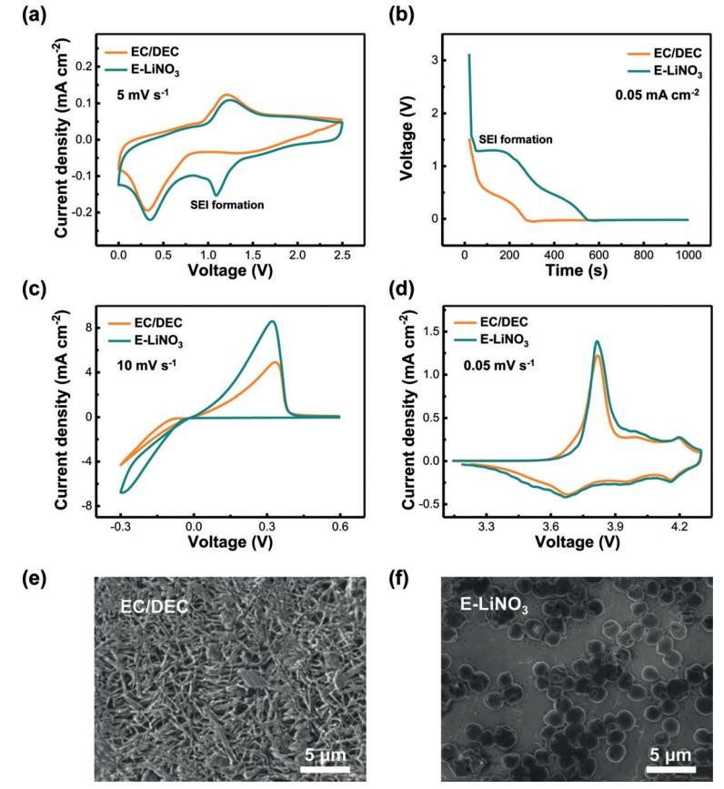
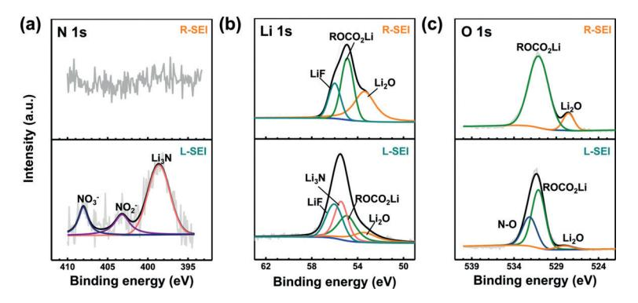
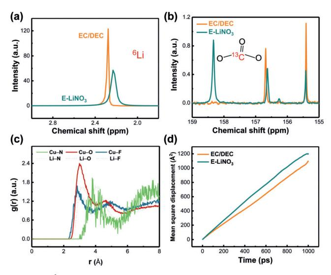

German Edition: DOI: [10.1002/ange.201807034](http://dx.doi.org/10.1002/ange.201807034) Lithium Metal Batteries International Edition: DOI: [10.1002/anie.201807034](http://dx.doi.org/10.1002/anie.201807034)

## Lithium Nitrate Solvation Chemistry in Carbonate Electrolyte Sustains High-Voltage Lithium Metal Batteries

[Chong](http://orcid.org/0000-0001-9521-4981) Yan [+](http://orcid.org/0000-0001-9521-4981) [,](http://orcid.org/0000-0001-9521-4981) [Yu-Xing](http://orcid.org/0000-0001-6350-1206) Yao [+](http://orcid.org/0000-0001-6350-1206) [,](http://orcid.org/0000-0001-6350-1206) [Xiang](http://orcid.org/0000-0002-7686-6308) Chen[,](http://orcid.org/0000-0002-7686-6308) [Xin-Bing](http://orcid.org/0000-0001-7567-1210) Cheng, [Xue-Qiang](http://orcid.org/0000-0003-2856-1881) Zhang[, J](http://orcid.org/0000-0003-2856-1881)ia-Qi [Huang,\\*](http://orcid.org/0000-0001-7394-9186) [and](http://orcid.org/0000-0001-7394-9186) Qiang [Zhang](http://orcid.org/0000-0002-3929-1541)

Abstract: The lithium metal anode is regarded as a promising candidate in next-generation energy storage devices. Lithium nitrate (LiNO3 ) is widely applied as an effective additive in ether electrolyte to increase the interfacial stability in batteries containing lithium metal anodes. However, because of its poor solubility LiNO3 is rarely utilized in the high-voltage window provided by carbonate electrolyte. Dissolution of LiNO3 in carbonate electrolyte is realized through an effective solvation regulation strategy. LiNO3 can be directly dissolved in an ethylene carbonate/diethyl carbonate electrolyte mixture by adding trace amounts of copper fluoride as a dissolution promoter. LiNO3 protects the Li metal anode in a working high-voltage Li metal battery. When a LiNi0.80Co0.15Al0.05O2 cathode is paired with a Li metal anode, an extraordinary capacity retention of 53% is achieved after 300 cycles (13% after 200 cycles for LiNO3 -free electrolyte) and a very high average Coulombic efficiency above 99.5% is achieved at 0.5 C. The solvation chemistry of LiNO3 -containing carbonate electrolyte may sustain high-voltage Li metal anodes operating in corrosive carbonate electrolytes.

Securing long battery life between charges is a long-term pursuit in mobile energy storage devices with high energy density. [1] Lithium-ion batteries—one of the most mature and widely adopted energy storage devices—are now approaching a theoretical energy density limit. Therefore, alternative strategies are needed to meet the increasing demands of portable electronics, electric vehicles, and grid-scale energy storage. [2] Lithium metal batteries (LMBs), which contain a high-voltage cathode and Li metal anode, outperform other candidates because they possess an ultrahigh theoretical specific capacity (3860 mAhg @1 ) and the lowest reduction potential (@3.04 V vs. standard hydrogen electrode (SHE)) among Li metal anodes. [3, 4]

[\*] C. Yan,[+] Prof. J.-Q. Huang Advanced Research Institute of Multidisciplinary Science Beijing Institute of Technology Beijing 100081 (P.R. China) E-mail: jqhuang@bit.edu.cn Y.-X. Yao,[+] X. Chen, Dr. X.-B. Cheng, X.-Q. Zhang, Prof. Q. Zhang Beijing Key Laboratory of Green Chemical Reaction Engineering and Technology, Department of Chemical Engineering Tsinghua University Beijing 100084 (P.R. China)

+ ] These authors contributed equally to this work.

Supporting information and the ORCID identification number(s) for the author(s) of this article can be found under: [https://doi.org/10.1002/anie.201807034.](https://doi.org/10.1002/anie.201807034)

[

Angew. Chem. Int. Ed. 2018, 57, 14055 –14059 T 2018 Wiley-VCH Verlag GmbH & Co. KGaA, Weinheim 14055

Nevertheless, severe problems impede the practical application of high-voltage LMBs—and particularly Li metal anodes, which first appeared in the 1970s. [5] Instead of forming uniform deposits, Li tends to adopt dendritic morphology during electrodeposition because of non-uniform current/ion distributions. [6] Li dendrites commonly lead to the formation of unstable solid electrolyte interfaces (SEI), low Coulombic efficiency (CE) because of high chemical reactivity, and even severe safety hazards when the separator is penetrated.[7, 8] The unstable SEI can further aggravate dendrite growth, finally leading to rechargeable batteries with a poor lifespan. Therefore, stabilizing the Li interface is required to ensure that LMBs are practically viable.

Spontaneous reactions between Li metal and electrolyte generate SEI,[7] and regulating the properties of the SEI by altering the electrolyte components is a facile and feasible approach. Lithium nitrate (LiNO3), with a high solubility in ether solvent (typically 5 wt% in dimethoxyethane and 1,3-dioxolane) is regarded as a critical electrolyte additive in lithium–sulfur (Li–S) batteries and plays a remarkable roles in inhibiting the "shuttle effect" of lithium polysulfides and dendrite growth of Li metal by stabilizing the Li interface. [9,10] Additionally, some other additives in ether-based electrolytes, such as methyl viologen and lithium polysulfides, also require the LiNO3 to jointly enhance the cycling efficiency of the Li metal anode. [11] However, routine ether-based electrolytes cannot be adopted in high-voltage batteries because of their narrow electrochemical window.

Carbonate electrolytes are frequently applied in highvoltage battery systems, which possess a wider electrochemical window as well as a better high-temperature performance compared to ether electrolytes. [12] Although LiNO3 can function well with ether electrolytes, it has long been considered incompatible with carbonate electrolyte because of its poor solubility in carbonate electrolytes such as ethylene carbonate (EC) and diethyl carbonate (DEC).[13] Therefore, regulating the dissolution behavior of LiNO3 in carbonate electrolytes and exploring its effect on cycling performance is essential for the development of safe, high-voltage LMBs.

Herein, we describe the solvation chemistry of LiNO3 in routine carbonate electrolytes (denoted by EC/DEC) and we propose a strategy for dissolving 1.0 wt% LiNO3 by introducing a trace amount of copper fluoride (CuF2) as a dissolution promoter. The insolubility of LiNO3 is altered because of the emerging solvation structure. The blue color of the solution is the result of copper ions (Supporting Information, Figure S1). The LiNO3 -containing EC/DEC electrolyte (E-LiNO3 ) leads to the formation of a uniform SEI film consisting of nitrogencontaining lithium compounds on the Li metal, producing spherical Li deposits and stable cycling. This unique protective film endows the Li anode with stability in carbonate electrolyte, and thereby allows coupling with a symmetrical Li electrode, copper electrode, LiFePO4 (LFP), or even a highvoltage LiNi0.80Co0.15Al0.05O2 (NCA) cathode. The uniform morphology of the deposited lithium provides a high CE, low interface resistance, and a long electrode lifespan.

In Figure 1, the electrochemical performance of Li j LFP and Li j NCA batteries are presented. E-LiNO3 is compatible with Li j LFP cells (Figure 1 a), presenting an extended lifespan of 400 cycles with 80% capacity retention. Compared to the EC/DEC electrolyte, E-LiNO3 exhibits a lower hysteresis voltage of 160 mVat the 50th cycle (in contrast, 320 mV for EC/DEC electrolyte; Figure 1 c), and a higher average CE of 99.8% (91.2% after 120 cycles for EC/DEC electrolyte). The polarization voltage increases slightly after 120 cycles for E-LiNO3 (220 mV) while it is 510 mV for the EC/DEC electrolyte. Similar electrochemical behaviors were also verified in Li j NCA cells (Figure 1 b). During the cycling test, the Li j NCA cell with E-LiNO3 exhibits an extraordinary capacity retention (53% after 300 cycles) and a high average CE above 99.5%. In comparison, the unprotected Li anode in an EC/DEC electrolyte exhibits a relatively low and fluctuating CE around 98.4% in the first 100 cycles. The capacity declines rapidly (13% of initial capacity after 200 cycles) until the cell fails completely. The poorer capacity retention of the EC/DEC electrolyte during cycling is mainly induced by higher voltage hysteresis and larger cell impedance (Figure 1 d).

Electrochemical impedance spectroscopy (EIS) measurements of the full cells were carried out to uncover the kinetic features of the electrode interfacial film. The Nyquist plots of the cells are mainly composed of one semicircle at high frequencies, of which the radius represents the Li+ migration resistance through an interface. The cell in an EC/DEC electrolyte exhibits a large total interfacial resistance. In contrast, a LiNO3 -containing cell shows an exceptionally small total interfacial resistance even after long-term cycling in Li j LFP and Li j NCA cells (Figures 1 e,f).

Scanning electron microscopy (SEM) was used to observe the morphologies of Li metal anodes upon introduction of LiNO3 to a working battery (Figure S2). SEM images of the Li anode with LiNO3 present a smooth and dendrite-free morphology after cycling; thereby convincingly demonstrating the integrity of the interface in response to LiNO3 inclusion.

Superior full cell performance in Li j LFP and Li j NCA batteries demonstrates the remarkable role that the LiNO3 contaning EC/DEC electrolyte plays in protecting the Li metal anode and achieving a high discharge capacity and long

Figure 1. Electrochemical performance of Li j LFP and Li j NCA cells with and without LiNO3 in carbonate electrolyte. The cycle life and CE of a) Li j LFP cells at 0.5 C after one cycle at 0.1 C and b) Li j NCA cells at 0.5 C. Voltage profiles of c) Li j LFP and d) Li j NCA cells. EIS of e) Li j LFP cells after 100 cycles at 0.5 C, 2.5–4.0 V, and f) Li j NCA cells after cycles at 0.5 C, 3.0–4.3 V.

14056 [www.angewandte.org](http://www.angewandte.org) T 2018 Wiley-VCH Verlag GmbH & Co. KGaA, Weinheim Angew. Chem. Int. Ed. 2018, 57, 14055 –14059

lifespan in high-voltage LMBs. To determine the nature of the protective role of LiNO3 in EC/DEC electrolyte, Li j Li symmetrical cells and Li j Cu half cells were used to determine the interfacial stability and surface chemistry of the Li metal anode.

The interfacial stability between Li metal and electrolyte was evaluated in Li j Li symmetrical cells. As shown in Figure S3, monitoring of the voltage hysteresis revealed that cells with E-LiNO3 present more stable voltage profiles at 1.0, 2.5, and 10.0 mAcm@2 compared to those with EC/DEC electrolyte. These results demonstrate the poor stability of the interfacial film generated by the EC/DEC electrolyte, which does not tolerate rapid Li plating/stripping.

The morphology of Li deposits after 100 cycles in symmetrical cells was investigated (Figure S4). Large dendrites and dead Li are evident on the electrode surface in the EC/DEC electrolyte, whereas the Li electrode in the E-LiNO3 displays a dense and smooth morphology. Additionally, the interfacial resistance (27.1 W) is effectively diminished after 100 cycles compared to that in an EC/DEC electrolyte (38.2 W; Figure S5) because of the high ionic conductivity of the uniform SEI film.

The CE of electrolytes upon the Li metal anode were examined using a method proposed by Zhang and co-workers. [14] E-LiNO3 achieved a much higher CE of 98.1% compared to EC/DEC electrolyte (87.8%; Figure S6). A Li anode with a high CE indicates that much less Li is consumed through reaction with organic electrolytes, and as a direct consequence of the uniform and intact nature of the SEI film created E-LiNO3 . The well-protected Li metal anode facilitates rapid transport of Li ions, and delivers a smaller voltage hysteresis and interfacial impedance (Figure S7), and thus contributes to a better cell performance. Therefore, E-LiNO3 plays a pivotal role in the formation of the SEI film, leading to outstanding stability between the electrode and electrolyte.

It is generally acknowledged that LiNO3 can be reduced on the surface of the Li electrode when the potential is under 1.6 V in an ether electrolyte; thus, LiNO3 is employed to protect the Li metal anode in Li–S batteries. [10] E-LiNO3 exhibits a relatively low initial CE (73.8%) compared to the 83.6% CE of the EC/DEC electrolyte in Li j NCA cells, which is ascribed to the irreversible formation of SEI with extra Li consumption (Figure 1 b). To gain further insight into the mechanism of SEI film formation and reveal the electrochemical reduction potential of LiNO3 in carbonate electrolytes, both cyclic voltammetry (CV) and chronopotentiometry tests were conducted. A voltage range of 0–2.5 V was adopted for the CV test, allowing LiNO3 to decompose while avoiding deposition of

Li ions (Figure 2 a). The reduction peak around 0.3 V is attributed to the underpotential deposition of Li,[15] which is independent of LiNO3 additives. E-LiNO3 exhibits an additional reduction peak starting at 1.4 V, which represents the reduction of LiNO3 , and is slightly lower than the decomposition voltage in the ether electrolyte at 1.6 V.[10] When Li deposits by a chronopotentiometry method at a constant current density (Figure 2 b), the lower voltage platform at 0.4 V indicates underpotential deposition while the upper voltage platform at 1.3 V indicates the decomposition of LiNO3 . Therefore, the CV chronopotentiometry results demonstrate that LiNO3 reduction takes place at around 1.4 V in carbonate electrolytes, which precedes the reduction potential of EC solvents.

CV tests of Li j Cu half cells and Li j NCA full cells were performed to further probe the decomposition electrochemistry of LiNO3 additive in a working battery. The current response in E-LiNO3 (Figure 2 c) increased significantly during Li plating/stripping on Cu substrate, corresponding to rapid Li+ transport and reversible reaction kinetics. At a higher voltage range, CV curves of Li j NCA cells in the EC/DEC and E-LiNO3 nearly overlap with each other

Figure 2. Decomposition electrochemistry of E-LiNO3 . a) CV curves of Li j Cu half cells scanned at 0–2.5 V, 5 mVs@1 . b) Galvanostatic voltage profiles of Li depositing onto the Cu substrate in the EC/DEC and E-LiNO3 at a current density of 0.05 mAcm@2 . c) Current response of Li j Cu cells scanned at @0.3–0.6 V, 10 mVs @1 . d) CV curves of Li j NCA full cells at 3.0–4.3 V, 0.05 mVs @1 . Surface morphologies of the lithium anode in e) EC/DEC and f) E-LiNO3 at a current density of 0.5 mAcm@2 with a capacity of 0.1 mAhcm@2 .

(Figure 2 d); three pairs of reversible peaks were assigned to phase transitions of the NCA lattice. [16] Therefore, oxidation at the cathode and lithium intercalation are not dominated by these additives, suggesting compatibility of E-LiNO3 and most cathodes.

The morphology of Li deposits on Cu substrate is presented in Figures 2 e,f. In contrast to the needle-like dendritic deposition in the EC/DEC electrolyte, Li tends to deposit into spherical structures in E-LiNO3 . Consequently, the nucleation and growth of Li metal can be regulated by the chemical composition of the SEI film.

The chemical composition of the SEI film was probed by X-ray photoelectron spectroscopy (XPS) of the electrode after one CV cycle (Figure 2 a). TheN1s spectrum of the SEI film formed in the EC/DEC electrolyte (routine SEI (R-SEI)) reveals an absence of N (Figure 3 a). The SEI film formed in E-LiNO3 (L-SEI) exhibits three peaks in the N 1s spectrum at 398.6, 403.2, and 408.1 eV, corresponding to Li3N, LiNO2 , and LiNO3 , respectively. The existence of Li3N, LiNO2 , and LiNO3 enhances the ionic conductivity as well as the stability of the SEI film, which contributes to uniform and rapid deposition of Li ions. [17, 18] In the F 1s spectrum, signals corresponding to

Figure 3. XPS characterization of the SEI films formed on Cu substrates after one cycle of CV test within 0–2.5 V (cells in Figure 2 a). Spectra of a) N 1s, b) Li 1s, and c) O 1s of R-SEI and L-SEI films.

Li@F and C@F at 684.5 and 686.8 eV, respectively, are similar in the L- and R-SEI films (Figure S8), indicating that trace amounts of dissolved CuF2 contribute little to SEI formation on the Li surface in dilute carbonate electrolytes.

The Li 1s spectrum in the R-SEI film demonstrates three peaks at 53.5, 54.9, and 56.0 eV (Figure 3 b), corresponding to Li2O, ROCO2Li, and LiF, respectively. The spectrum of L-SEI film exhibits an additional Li@N peak at 55.5 eV, signifying Li3N and LiNxOy . In the Li 1s spectrum, the relative intensity of Li2O and ROCO2Li decreased in the L-SEI film, which is also observed in the O 1s spectrum (Figure 3 c), indicating that O atoms are involved in the formation of N@O bonds at 532.2 eV. The pivotal role of Li@N and N@O in the SEI film is analogous to that of N-doped host materials for Li deposition, which can guide the nucleation of Li metal.[19] The LiNO3 induced Li@N inorganic (Li3N and LiNxOy ) SEI film effectively regulates the nucleation of Li, suppresses Li dendrites, and boosts CE as a consequence of its high YoungQs modulus, high ionic conductivity, and low chemical activity. [16]

The dissolution chemistry of LiNO3 in carbonate electrolyte, and its contribution to formation of the SEI, are strongly associated with the solvation structure of electrolytes. Fourier transform infrared (FTIR) and nuclear magnetic resonance (NMR) techniques, as well as molecular dynamics (MD) simulations, were applied to investigate the solvation structure of E-LiNO3 . Characteristic absorption peaks in the FTIR spectra (Figure S9) remain unchanged after the introduction of LiNO3 and CuF2 , indicating that LiNO3 additives are readily soluble without any destruction of the solvent structure. However, the intensity of the absorption peaks at 1803 (C=O in EC), 1772 (C=O in DEC), 1196 (C@O in EC), and 1166 cm@1 (C@O in DEC) decrease notably, implying that the concentrations of those organic functional groups is reduced.[20] Therefore, a fraction of solvent molecules participate in the solvation with additional cations or anions, forming a novel solvation structure in LiNO3 -conatining electrolytes.

The solvation structure was probed by 6Li and 13C NMR spectroscopy. The 6Li chemical shift of E-LiNO3 is smaller than that of EC/DEC electrolyte (Figure 4 a), indicating the shielding effect of the solvation sheath on Li ions. This is possibly induced by the extra NO3 @ ions, which interact more strongly with Li ions and possess a larger electron-donating ability than PF6 @ . Notably, the 13C NMR spectra present chemical shifts that indicate the EC/DEC molecules are coordinated to Cu2+ (Figure 4 b; Figures S10 and S11). The Cu 2+ ion has a similar ionic radius (0.73 c vs. 0.76 c of Li+ ) but a larger charge compared to that of Li+ . Therefore, Cu 2+ possesses a stronger electron-withdrawing ability and can achieve a deshielding effect on the coordinated solvent molecules. The solvents interacting with Cu2+ generate new 13C NMR peaks that are displaced downfield.

MD simulations were conducted to probe the solvation structure and unveil the dissolution mechanism of LiNO3 /CuF2 in EC/DEC electrolytes at the atomic level. The radial distribution functions show peaks around 3.0 and 4.0 c

indicative of Cu@O and Cu@N, respectively, which suggest that copper ions are coordinated by NO3 @ (Figure 4 c; Figure S12). Interactions between Cu2+ and NO3 @ are stronger than that between Li+ and NO3 @ because of the higher charge but similar radius of Cu2+ compared to Li+ . The competition of copper ions and the as-formed Cu2+@NO3 @ complex unambiguously explain the dissolution mechanism of LiNO3 in EC/DEC solvents. Moreover, the Li-ion diffusion coefficient in E-LiNO3 was determined to be 1.12 X 10@11 m2 s @1 , compared to 9.94 X 10@12 m2 s @1 in the EC/DEC electrolyte (Figure 4 d). Improved Li mobility is beneficial to a cell operating at large current density.

Based on insights from the FTIR, NMR, and MD results, the distinctive solvation structure in E-LiNO3 is responsible for the blue color of the solution. The Cu 2+ ions are coordinated by NO3 @ rather than F @ to form Cu2+@NO3 @ , leading to dissociation of Cu@F and Li+@NO3 @ . Therefore, Cu2+@NO3 @ and the Li+ -EC/DEC complex can dissolve in EC/DEC solvents and form a Li-N inorganic (Li3N and

Figure 4. 6 Li NMR spectra and MD Simulations of the electrolyte with and without LiNO3 . a) 6 Li and b) 13C NMR spectra in electrolytes. c) The MD simulation of Li/Cu-N/O/F radial distribution functions g(r) in E-LiNO3 . d) The mean square displacement of Li+ ions in EC/DEC and E-LiNO3 electrolytes.

LiNxOy) SEI film during cycling, thereby producing a lithium metal battery with superior stability (Figure S13).

In conclusion, LiNO3 was dissolved in carbonate electrolytes for the first time by adding a trace amount of CuF2 as a dissolution promoter. An ionically conductive, dense, and stable SEI film was constructed on the Li surface to effectively protect the Li metal. The solvation chemistry of E-LiNO3 and its roles within high-voltage LMBs were thoroughly investigated. Preferential reduction of LiNO3 occurs around 1.4 V versus Li+ /Li in carbonate electrolytes, thus forming a stable interfacial film, which is mainly attributed to reduction products such as LiNxOy and Li3N. The protective SEI film results in spheroidal deposition, considerably reduced voltage hysteresis, and a longer cycle life for the Li metal anode. A high average CE of 98.1% is achieved (in contrast to 87.8% in EC/DEC electrolyte) and dendrite-free Li deposition morphology is observed. When the LiNO3 -protected Li metal anode matches the NCA cathode, a high initial capacity (186 mAhg @1 ) and stable cycling performance (53% after 300 cycles) are achieved compared to poor capacity retention (13% after 200 cycles). Additionally, a high average CE of 99.5% is obtained even after 300 cycles (in contrast to 98.4% in EC/DEC electrolyte). The proposed strategy provides a facile but effective way to elevate the cycling performance of high-energy-density LMBs composed of a Li anode and a high-voltage intercalation-type cathode (NCA or LiNixCoyMnzO2 (x + y + z = 1)). This contribution combines LiNO3 additive and carbonate electrolytes with a high voltage window. The LiNO3 additive has a protective mechanism on the Li anode that may be applicable to next-generation batteries.

## Acknowledgements

This work was supported by National Key Research and Development Program (2016YFA0202500 and 2016YFA0200102), National Natural Scientific Foundation of China (21776019 and 21676160), Beijing Key Research and Development Plan (Z181100004518001), China Postdoctoral Science Foundation (2018M631480 and BX201700125). Support is acknowledged from Tsinghua National Laboratory for Information Science and Technology for theoretical simulations.

## Conflict of interest

The authors declare no conflict of interest.

Keywords: electrolyte additives · high-voltage cathodes · lithium anodes · lithium deposition · lithium nitrate

How to cite: Angew. Chem. Int. Ed. 2018, 57, 14055– 14059 Angew. Chem. 2018, 130, 14251– 14255

- [1] M. Armand, J. M. Tarascon, [Nature](https://doi.org/10.1038/451652a) 2008, 451, 652 657.
- [2] J. W. Choi, D. Aurbach, Nat. Rev. Mater. 2016, 1, 16013.
- [3] D. C. Lin, Y. Y. Liu, Y. Cui, Nat. [Nanotechnol.](https://doi.org/10.1038/nnano.2017.16) 2017, 12, 194 206.
- [4] R. G. Cao, W. Xu, D. Lv, J. Xiao, J.-G. Zhang, [Adv. Energy](https://doi.org/10.1002/aenm.201402273) Mater. 2015, 5[, 1402273.](https://doi.org/10.1002/aenm.201402273)
- [5] X.-B. Cheng, C. Yan, J.-Q. Huang, P. Li, L. Zhu, L. Zhao, Y. Zhang, W. Zhu, S.-T. Yang, Q. Zhang, Energy [Storage](https://doi.org/10.1016/j.ensm.2016.09.003) Mater. 2017, 6[, 18 –](https://doi.org/10.1016/j.ensm.2016.09.003) 25.
- [6] X.-B. Cheng, R. Zhang, C.-Z. Zhao, Q. Zhang, [Chem.](https://doi.org/10.1021/acs.chemrev.7b00115) Rev. 2017, 117, 10403 [– 10473.](https://doi.org/10.1021/acs.chemrev.7b00115)
- [7] E. Peled, J. [Electrochem.](https://doi.org/10.1149/1.2128859) Soc. 1979, 126, 2047 2051.
- [8] R. Zhang, N.-W. Li, X.-B. Cheng, Y.-X. Yin, Q. Zhang, Y.-G. Guo, Adv. Sci. 2017, 4[, 1600445](https://doi.org/10.1002/advs.201600445).
- [9] A. Jozwiuk, B. B. Berkes, T. Weiß, H. Sommer, J. Janek, T. Brezesinski, Energy [Environ.](https://doi.org/10.1039/C6EE00789A) Sci. 2016, 9, 2603 – 2608; A. Rosenman, R. Elazari, G. Salitra, E. Markevich, D. Aurbach, A. Garsuch, J. [Electrochem.](https://doi.org/10.1149/2.0861503jes) Soc. 2015, 162, A470 – A473.
- [10] S. S. Zhang, [Electrochim.](https://doi.org/10.1016/j.electacta.2012.03.081) Acta 2012, 70, 344 348.
- [11] H. Wu, Y. Cao, L. Geng, C. Wang, [Chem.](https://doi.org/10.1021/acs.chemmater.6b05475) Mater. 2017, 29, 3572 [3579](https://doi.org/10.1021/acs.chemmater.6b05475); W. Li, H. Yao, K. Yan, G. Zheng, Z. Liang, Y. M. Chiang, Y. Cui, Nat. Commun. 2015, 6, 7436; C.-Z. Zhao, X.-B. Cheng, R. Zhang, H.-J. Peng, J.-Q. Huang, R. Ran, Z.-H. Huang, F. Wei, Q. Zhang, Energy [Storage](https://doi.org/10.1016/j.ensm.2016.01.007) Mater. 2016, 3, 77 – 84; C. Yan, X.-B. Cheng, C.-Z. Zhao, J.-Q. Huang, S.-T. Yang, Q. Zhang, J. [Power](https://doi.org/10.1016/j.jpowsour.2016.07.056) [Sources](https://doi.org/10.1016/j.jpowsour.2016.07.056) 2016, 327, 212 – 220.
- [12] K. Xu, [Chem.](https://doi.org/10.1021/cr030203g) Rev. 2004, 104, 4303 4418.
- [13] Q. Shi, Y. Zhong, M. Wu, H. Wang, H. Wang, [Proc. Natl.](https://doi.org/10.1073/pnas.1803634115) Acad. Sci. USA 2018, 115, 5676 [– 5680](https://doi.org/10.1073/pnas.1803634115); X.-Q. Zhang, X. Chen, X.-B. Cheng, B.-Q. Li, X. Shen, C. Yan, J.-Q. Huang, Q. Zhang, [Angew.](https://doi.org/10.1002/anie.201801513) [Chem.](https://doi.org/10.1002/anie.201801513) Int. Ed. 2018, 57, 5301 – 5305; [Angew. Chem.](https://doi.org/10.1002/ange.201801513) 2018, 130, 5399 [– 5403.](https://doi.org/10.1002/ange.201801513)
- [14] B. D. Adams, J. M. Zheng, X. Ren, W. Xu, J.-G. Zhang, [Adv.](https://doi.org/10.1002/aenm.201702097) Energy Mater. 2018, 8[, 1702097](https://doi.org/10.1002/aenm.201702097).
- [15] D. Aurbach, J. [Electrochem.](https://doi.org/10.1149/1.2096876) Soc. 1989, 136, 906 913.
- [16] J. Duan, G. Hu, Y. Cao, C. Tan, C. Wu, K. Du, Z. Peng, J. [Power](https://doi.org/10.1016/j.jpowsour.2016.07.008) [Sources](https://doi.org/10.1016/j.jpowsour.2016.07.008) 2016, 326, 322 – 330.
- [17] U. von Alpen, A. Rabenau, G. H. Talat, Appl. [Phys. Lett.](https://doi.org/10.1063/1.89283) 1977, 30, 621 [– 623](https://doi.org/10.1063/1.89283); K. Park, B.-C. Yu, J. B. Goodenough, [Adv. Energy](https://doi.org/10.1002/aenm.201502534) Mater. 2016, 6[, 1502534](https://doi.org/10.1002/aenm.201502534); J. Guo, Z. Yang, Y. Yu, H. D. AbruÇa, L. A. Archer, J. Am. [Chem.](https://doi.org/10.1021/ja309435f) Soc. 2013, 135, 763 – 767.
- [18] Y. Zhu, X. He, Y. Mo, Adv. Sci. 2017, 4[, 1600517.](https://doi.org/10.1002/advs.201600517)
- [19] R. Zhang, X.-R. Chen, X. Chen, X.-B. Cheng, X.-Q. Zhang, C. Yan, Q. Zhang, [Angew. Chem.](https://doi.org/10.1002/anie.201702099) Int. Ed. 2017, 56, 7764 – 7768; [Angew. Chem.](https://doi.org/10.1002/ange.201702263) 2017, 129, 5653 – 5656.
- [20] H. Kuwata, M. Matsui, H. Sonoki, Y. Manabe, N. Imanishi, M. Mizuhata, J. [Electrochem.](https://doi.org/10.1149/2.0951807jes) Soc. 2018, 165, A1486 – A1491.

Manuscript received: June 18, 2018

Accepted manuscript online: August 10, 2018

Version of record online: September 7, 2018