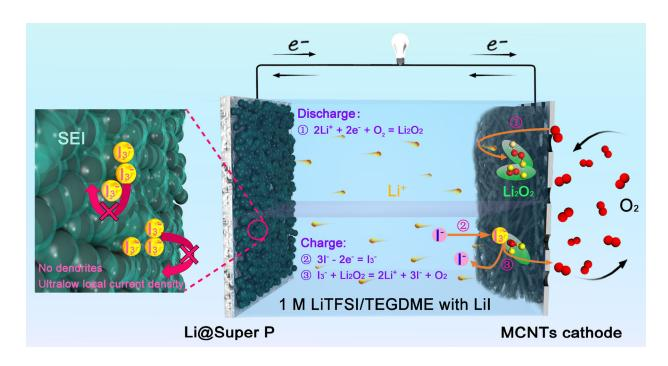
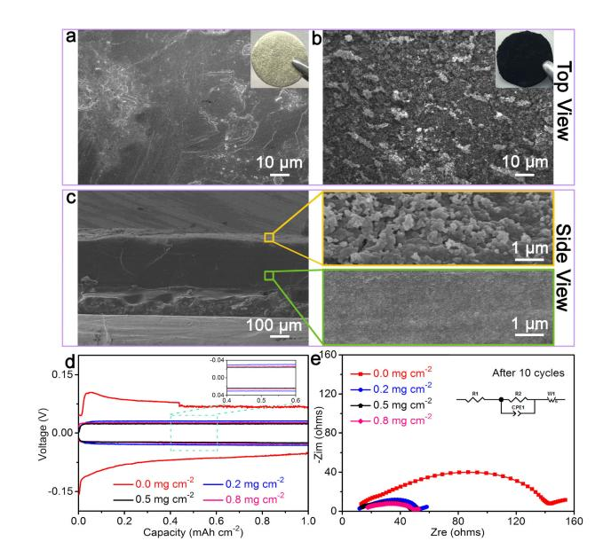
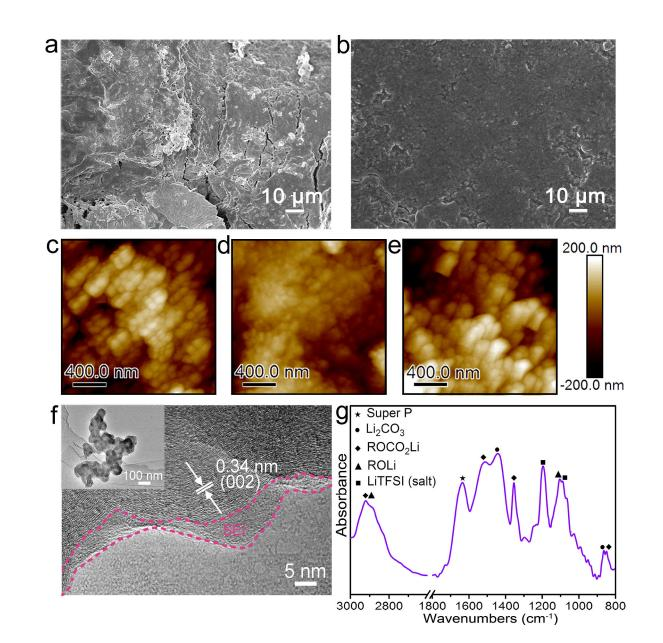
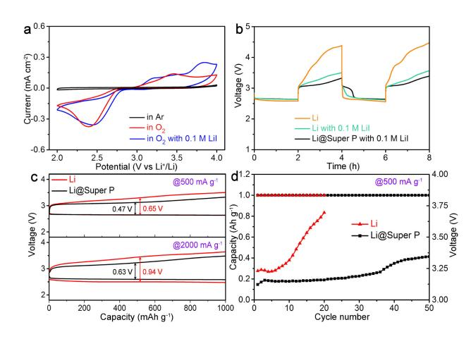
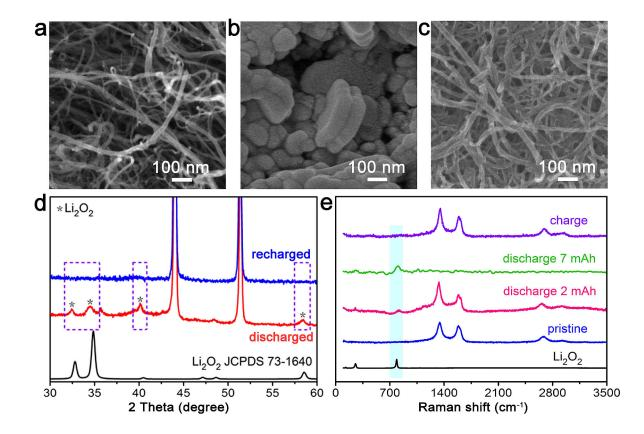

# **Super P Carbon Modified Lithium Anode for High-Performance Li–O2 Batteries**

Jiaqi Wang,[a] Junxiang Liu,[a] Yichao Cai,[a] Fangyi Cheng,[a] Zhiqiang Niu,\*[a] and lun Chen\* $[a, b]$ 

Rechargeable  $Li-O_2$  batteries represent a highly attractive battery technology, owing to a high theoretical energy density of 3500 Wh kg-1, but they suffer from large charging polarization and lithium anode degradation on cycling. Herein, we report a Li-O2 battery system with reduced polarization and a long lifespan, which is realized by using a novel Li@Super P composite anode integrated with lithium iodide in ether-based electrolyte. Coating a Super P carbon layer, with an optimal thickness of approximately 30 µm, onto the lithium anode

# 1. Introduction

Rechargeable Li-O2 batteries are promising electrochemical energy storage and conversion technology because of high theoretical energy density of 3500 Wh  $kq^{-1}$  (based on reaction  $2Li + O_2 \leftrightarrow Li_2O_2$ .[1] However, current Li–O2 batteries still suffer from several critical issues. For the cathode, recharging the insulating discharge product Li2O2 is kinetically sluggish, leading to high overpotential and low energy efficiency.[2] For the lithium anode, the uncontrollable growth of dendritic lithium will significantly increase polarization and bring severe safety risk.[3] To accelerate  $Li_2O_2$  decomposition on charging, an effective strategy is to employ a dissolvable redox mediator (RM) such as Lil in the electrolyte.[4] Although the mediator lowers the charge/discharge overpotentials, the shuttle effect will passivate the lithium anode and result in energy loss or even battery failure.[5] Therefore, it is desirable to take advantage of the cathode mediator in combination of Li anode protection.

A variety of approaches have been proposed to modify the metallic lithium anode in the context of developing highperformance Li-based batteries.[6] The use of three dimensional (3D) porous current collectors helps to suppress the formation

| [a] Dr. J. Wang, J. Liu, Y. Cai, Prof. F. Cheng, Prof. Z. Niu, Prof. J. Chen Key Laboratory of Advanced Energy Materials Chemistry |
|---------------------------------------------------------------------------------------------------------------------------------------|
| (Ministry of Education)                                                                                                               |
| College of Chemistry, Nankai University                                                                                               |
| Tianjin 300071, China                                                                                                                 |
| E-mail: zaniu@nankai.edu.cn                                                                                                           |
| chenabc@nankai.edu.cn                                                                                                                 |
| [b] Prof. J. Chen                                                                                                                     |
| Collaborative Innovation Center of Chemical Science and                                                                               |
| Engineering, Nankai University                                                                                                        |
| Tianjin 300071, China                                                                                                                 |
| Supporting information for this article is available on the WWW u                                                                     |

under https://doi.org/10.1002/celc.201800289

results in a lowered interface impedance and a decreased Li depositing/stripping overpotential ( $<$  15 mV) over 300 cycles at 0.3 mA cm $-2$ . The Li–O2 batteries assembled with the Li@Super P anode and Lil additive could mitigate the detrimental shuttling effect of  $I_3^-$  and deliver a high reversible capacity of 1000 mAh  $g^{-1}$  with a median charge voltage lower than 3.3 V after 50 cycles. This study provides a simple yet effective way to protect the lithium anode and design high-performance Li–O2 batteries.

of Li dendrites.[7] Coating an artificial protection layer on the Li anode is another common strategy to form uniform lithium by decreasing the energy barrier of Li depositing/stripping. Protective layers such as polymers,[8] artificial solid electrolyte interphase,[9] and carbon[10] have been demonstrated to stabilize the lithium anode. Carbonaceous materials including carbon fibers, hollow carbon spheres and graphene are widely used due to low density and high electronic conductivity.[5d,11] A recent seminal work by Cui's group showed that coating the lithium metal anode with a monolayer of interconnected amorphous hollow carbon nanospheres gave rise to decreasing polarization and facilitating the formation of a stable solid electrolyte interphase, indicating that the interfacial nanoscale engineering approach can improve Li metal cycling performance.[11a] The methods mentioned above lead to remarkable progress in Li anode protection but most of them require complicated material preparation/processing procedures and are not economical. Besides, few of Li anode modification has been adopted in rechargeable  $Li-O2$  batteries. Thus, it is attractive to exploit facile and low-cost lithium-protecting strategies for building advanced  $Li-O_2$  battery technologies.

Herein, we report the application of a new Li@Super P composite anode integrated with lithium iodide in  $Li-O2$ battery system, as schematically illustrated in Figure 1. The advantages of Li@Super P composite anode can be highlighted as follows. i) Super P is a commercial conductive carbon commonly used in the battery industry and a simple brushing process is applied in coating Super P on Li, which makes the composite anode economical and viable for scale-up manufacture. ii) The increased specific surface area ensures a decrease of local current density, which is expected to prevent undesired Li metal dendrite growth and may recycle dead Li. iii) Stable and dense SEI layer can be formed, which is advantageous for suppressing side reactions associated with  $I_3^-$  shuttling and for prolonging the battery life. We demonstrate that the combina-

# Articles

Figure 1. Schematic structure of a Li-O2 battery composed of a Li@Super P carbon composite anode, an ether-based electrolyte with LiI additive, and a multi-walled carbon nanotubes (MWCNTs) cathode.

tion of Li@Super P anode, carbon nanotubes cathode, and 1 M LiTFSI/TEGDME + 0.1 M LiI electrolyte results in significantly improved performance of Li-O2 battery.

### 2. Results and Discussion

The Li@Super P composite anode was synthesized through a facile and low-cost brushing method (details described in Supporting Information). Figure 2a and inset show the scanning electron microscopy (SEM) image and optical photo of the pristine Li anode, revealing dense surface and shiny metallic

Figure 2. Characterization of Li and the Li@Super P composite anode. Topview SEM images of a) bare Li and b) Li@Super P. The insets show optical images. c) Side-view SEM image of Li@Super P with partial amplification. d) Discharge/charge voltage profiles of Li@Super P with different Li/Super P ratios at 1 mA cm-2 in the initial cycle. e) Nyquist plots of the impedance spectra of Li@Super P symmetrical batteries after ten cycles. Inset shows the equivalent circuit, where R1 is the ohmic resistance of the electrolyte and battery components, R2 is the interfacial resistance between the Li anode and the electrolyte, W1 is the Li ion diffusion impedance, and CPE is a constant-phase element.

appearance. Figures 2b and 2c display the SEM images of Li@Super P composite anode from top and side view, respectively. Clearly, the surface of Li is evenly coated with a black layer of spherical Super P carbon particles, which have an average diameter of 63.5 nm (Figure S1). The fluffy Super P layer would increase the specific surface area and provide space for uniform lithium deposition and stripping.

For comparison, we prepared Li@Super P composite with different composition (Table S1). The thickness of the coated layer increases with the amount of Super P carbon; a carbon loading higher than 0.8 mg cm-2 leads to peeling of the coated layer (Figure S2 and S3). Figure 2d displays the discharge/ charge profiles of the fabricated symmetrical batteries with two Li@Super P composite electrodes. The Super P coated electrodes clearly outperform the pristine lithium electrode, showing lower charge and discharge overpotentials. Super P coating significantly reduces electrode polarization in long-term cycling (Figure S4). The optimized loading of carbon is ~0.5 mg cm-2 , corresponding to a layer thickness about 30 mm and resulting in the lowest overpotential of 23 mV at current density of 1 mA cm-2 . Electrochemical impedance spectroscopy (EIS) further indicates that coating 0.5 mg cm-2 Super P on lithium surface decreases the charge transfer resistance from 141 to 35 W while maintaining similar interfacial resistance (Figure 2e). The Li@Super P composite has a specific surface area of 60 m2g-1 , as measured by the nitrogen absorption-desorption isotherms (Figure S5), which is much higher than that of planer Li. Current density is a crucial factor to regulate the morphology of Li deposits based on Sand's time model (Equation (1)) as follows,

$$\tau = \pi D \frac{eC_0(\mu_a + \mu_{Li^+})^2}{2J\mu_a} \tag{1}$$

where t is the time when Li dendrites start to grow and J is the effective electrode current density.[12] Accordingly, the enhanced specific surface area would decrease the local current density and supply more electroactive sites on the surface for homogenous deposition of Li. The void between spherical particles of Super P is expected to provide space to accommodate Li depositing/stripping and thus also contribute to suppressed growth of Li dendrites.

Figure 3a shows the charge/discharge curves of symmetric batteries assembled with two bare Li electrodes or two Li@Super P electrodes. The batteries were cycled at a current density of 0.3 mA cm-2 with a controlled charge/discharge capacity of 0.3 mAh cm-2 in 1 M LiTFSI/TEGDME (lithium bis(trifluoromethanesulfonyl)imide dissolved in tetraglyme). The bare Li electrode exhibits a large Li depositing/stripping overpotential and unstable voltage profiles with fluctuation. In comparison, Li@Super P displays highly reduced polarization and stable cycling with flat voltage plateau (Figure 3a inset). The overpotential of Li@Super P was ~10 mV within the first 200 cycles and increased slightly to ~15 mV after 300 cycles. Such exceptional long-term cycling performance could be associated with more uniform Li deposition/stripping. Smaller polarization of Li@Super P composite electrode was also

Figure 3. Electrochemical characterization of the bare Li and Li@Super P electrodes. a) Galvanostatic cycling of a symmetric battery containing two bare Li electrodes (red) or two Li@Super P electrodes (blue). Insets, voltage profiles of the 30th, 60th, 200th and 300th cycles. b) Rate performance.

observed as we extended the ending capacity to 1 mAh cm-2 and increased the current density to 0.5 mA cm-2 (Figure S6) and 1 mA cm-2 (Figure S7), respectively. The superior rate performance of Li@Super P can be further viewed in Figure 3b.

The morphology of the bare Li and Li@Super P composite electrode was investigated after galvanostatic cycling. The bare lithium foil becomes mossy and rugged after 100 cycles (Figure 4a), whereas the Li@Super P electrode maintains flat surface without formation of cracks after 300 cycles (Figure 4b).

Figure 4. Top-view SEM images of a) bare Li electrode after 100 cycles and b) the Li@Super P electrode after 300 cycles. Atomic force microscopy images with 2D view of Li@Super P electrode c) before and d) after Li depositing, and e) after the first depositing/stripping cycle. f) TEM image of the Li@Super P electrode after the first cycle. The solid electrolyte interface (SEI) film is marked. g) FTIR spectrum of SEI film showing the composition.

# Articles

We further employed atomic force microscopy (AFM) to observe the morphological evolution of the surface of Li@Super P electrode during the initial depositing/stripping cycle. A large number of spherical Super P particles can be seen before Li plating (Figure 4c). After galvanostatic deposition of lithium (capacity 3 mAh cm-2 ), the interparticle void was filled and the boundaries turned to be blurred (Figure 4d), without the formation of dendritic or mossy lithium. As expected, the roughness decreases after the flat lithium plating (Figure S8). Stripping the deposited lithium reverses the surface morphology with higher roughness (Figure 4e). This reversible morphological change benefits the cycling stability of Li@Super P electrode.

Comparing the pristine and cycled electrodes indicates a slight increase of particle size, which could be ascribed to the formation of solid electrolyte interface (SEI) film. Coating the lithium metal anode with carbon would facilitate the formation of dense SEI film, as suggested previously in the case of using carbon nanospheres.[11a] Transmission electron microscopy (TEM) image evidences the presence of SEI layer on Super P (Figure 4f), which shows fringes with (002) interplanar distance of 0.34 nm.[13] The composition of the formed SEI film was identified by the Fourier transform infrared (FTIR) spectrum (Figure 4g). The main components include lithium salt (LiTFSI), Super P, lithium carbonate, lithium alkyl carbonate, and ROLi, which was observed for TEGDME-based batteries.[14] This stable SEI is favorable for the use of lithium metal anode.

The superior performance of Li@Super P in symmetric batteries motivated us to further evaluate its application as anode in Li-O2 battery. Cyclic voltammograms (CVs, Figure 5a) between 2.0 and 4.0 V under O2 or Ar atmosphere were conducted in coin-type batteries assembled with multi-walled carbon nanotubes cathode and 1 M LiTFSI/TEGDME electrolyte. There is no apparent current response under Ar atmosphere in the selected electrochemical window. The CV curves depict an

Figure 5. Electrochemical performance of assembled batteries with multiwalled carbon nanotubes cathode and bare Li anode or Li@Super P composite anode. a) CV curves of the batteries at a scan rate of 0.1 mV s-1 . b) Voltage profiles at a charge/discharge current density of 500 mA g-1 . c) Discharge–charge curves of the batteries with the electrolyte containing 0.1 M LiI. d) Median charge voltages versus cycle number with an ending capacity of 1000 mAh g-1 at 500 mA g-1 .

onset potential of oxygen reduction at 2.75 V and an onset reduction of  $I_3^-$  at 2.80 V, similar to previous report on Li–O2 cells.[15] As expected, the presence of Lil decreases the charge terminal voltage from 4.4 V to 3.5 V at an ending capacity of 1000 mAh  $g^{-1}$  (Figure 5b). Applying Li@Super P composite anode, the charge terminal voltage drops further to 3.3 V. Previous studies have suggested that the charge curves do not correspond to the battery reaction of  $Li_2O_2 \rightarrow 2Li^+ + O_2 + 2e^$ but relate to the electrochemical reaction of  $3l^{-} \rightarrow l_{3}^{-} +$ 2e-[4a-c,15] Instead, the decomposition of insulated discharge product Li2O2 is mediated by  $I_3^-$ , following the reaction of  $I_3^-$ +  $Li_2O_2 \rightarrow 3I^- + 2Li^+ + O_2$ .

The rate capability of  $Li-O2$  battery with a bare Li anode or a Li@Super P composite anode in 0.1 M Lil+1 M LiTFSI/ TEGDME electrolyte was evaluated with cut-off capacity of 1000 mAh  $g^{-1}$  (Figure 5c). At a current density of 500 mA  $g^{-1}$ , the bare Li anode gives rise to a discharge-charge voltage gap of 0.65 V, while the Li@Super P composite anode exhibits a voltage separation of 0.47 V during the initial cycle. At a high current density of 2000 mA $g^{-1}$ , the composite anode enables a 0.31 V lowering of median charge-discharge voltage gap. As shown in Figure 5d, galvanostatic cycling testing indicates unsatisfactory performance with bare Li anode. When cycling with a fixed ceasing capacity of 1000 mAh  $g^{-1}$  at 500 mA  $g^{-1}$ , the median charge voltage quickly reaches 3.7 V after 20 cycles. In contrast, the cells with Li@Super P composite anode can sustain 50 cycles with the median charge voltage no more than 3.3 V. The terminal voltage of cells with Li@Super P anode is still lower than that of bare Li anode (Figure S9). Similarly, the Li@Super P composite anode outperformed the bare Li anode at elevated mass loading (Figure S10).

The superior battery performance of Li@Super P composite over bare Li anode can be interpreted by the ability to resist the detrimental effect of shuttled  $I^{-}/I_{3}^{-}$ . For metallic lithium anode, the formation of a stable SEI plays a crucial role in determining the electrode performance. The SEI layer generated on bare Li anode is easily broken upon cycling. The exposure of fresh lithium tends to be attacked by  $I_3^-$ . This irreversible side reaction leads to the loss of both the redox mediator and the decrease of energy efficiency. The side reaction between Li and  $I_3^-$  is clearly evidenced by the color change from yellow to colorless in a designed visualized cell (Figure S11). In comparison, a dense and stable SEI layer was generated on Li anode by modifying spherical Super P carbon nanoparticles (Figure 4). Furthermore, the reversibility of the  $Li-O2$  cells with Li@Super P composite anode was verified by SEM, which indicates reversible decomposition of bumpy discharge products during the discharge and charge processes (Figure 6a–c). The diffraction peaks corresponding to  $Li_2O_2$ disappeared from X-ray diffraction (XRD) as charging proceeds (Figure 6d), suggesting that  $Li_2O_2$  at the cathode can be decomposed, which is further confirmed by Raman spectra in Figure 6e. In addition, when the cathode is discharged to 7 mAh, the signal of MWCNTs is not collected due to MWCNTs is covered by thick  $Li_2O_2$  layer (green line of figure 6e). We expect that the Li@Super P composite anode is applicable to

# **CHEMELECTROCHEM** Articles

Figure 6. Electrochemical performance of assembled batteries with multiwalled carbon nanotubes cathode and bare Li anode or Li@Super P composite anode. a-c) SEM images of pristine, discharged and charged MWCNT cathodes in 1 M LiTFSI/TEGDME + Lil with Li@Super P anode. d) XRD patterns and e) Raman spectra of the discharged and recharged cathodes.

combine with other redox mediator and cathode materials (e.g., CNT supported manganese oxides[16]).

#### 3. Conclusions

In summary, a  $Li-O_2$  battery showing low charge overpotential and stable cyclability is constructed with the integration of a Li@Super P composite anode and a Lil electrolyte additive. The uniform Super P carbon layer coating on Li anode surface significantly enhances the specific surface area and decreases the local current density, giving rise to remarkably reduced Li depositing/stripping overpotential ( $<$  15 mV over 600 h). Super P modification further promotes the formation of stable and dense SEI to alleviate the unwanted side reactions between lithium and shuttled  $I_3$ -. The combination of protected Li anode and Lil mediator thus results in lowered charge/discharge voltage gap and increased cycling performance of Li–O2 batteries. The low-cost, easy-processing route of coating of Super P carbon presented in this study hold great promise for applications in metallic lithium-based battery technologies.

#### **Experimental Section**

#### Synthesis of Li@Super P Composite Anode

Take a certain amount of commercial Super P, dried in advance in a vacuum oven at  $100^{\circ}$ C for 10 hours. The lithium foil (12 mm in diameter, 0.3 mm in thickness, 0.013  $m^2q^{-1}$ ) was evenly coated with carbon layer ( $\sim$  30  $\mu$ m) via brushing and rolling in the Ar-filled glovebox (Mikrouna Universal 2400/750).

#### **Preparation of the Electrolyte**

Tetraethylene glycol dimethyl ether (TEGDME) was purchased from Sigma-Aldrich and dried over 4 Å molecular sieves. Lithium bis(trifluoromethanesulfonyl)imide (LiTFSI) was used as received from J&K Chemical. Lithium iodide (Lil, 99.99% metals basis) was

from Aladdin. The electrolyte was prepared by mixing appropriate amount of LiTFSI, Lil and the solvent (TEGDME) in the Ar-filled alovebox (Mikrouna Universal 2400/750). The concentration of LiTFSI and Lil in TEGDME was 1 mol L-1 and 0.1 mol L-1, respectively.

#### **Fabrication of MWCNT Cathode**

The air electrode was fabricated by blending 90 wt% commercial multi-walled CNTs (MWCNTs, Beijing Cnano Technology Limited) and polyvinylidene fluoride (PVdF) in N-methyl-2-pyrrolidone with a weight ratio of 90:10. The obtained slurry was uniformly coated on a piece of Ni foam ( $\sim$  0.0247 g, 10 mm in diameter, 0.3 mm in thickness), dried at 100°C for 10 hours in vacuum.

#### **Materials Characterization**

The structures of Li@Super P and the morphologies of the discharge products were observed by field-emission scanning electron microscopy (SEM, JEOL JSM7500F) with acceleration voltage of 5 kV and work distance of 8 mm. Atomic force microscopy images and the roughness of Li@Super P electrode surface with 3 different states (pristine, Li depositing and stripping) were collected on a Dimension Icon (Bruker) with Scan Asyst Mode. The morphologies of the solid-electrolyte interface (SEI) film components were investigated by transmission electron microscopy (TEM, Philips Tecnai G2F-20) with acceleration voltage of 200 kV. The components of SEI film were detected by infrared spectroscopy (Thermo Nicolet MAGNA-IR 550 Spectrometer). The discharge product in  $Li-O2$  batteries was characterized by powder X-ray diffraction (Rigaku MiniFlex600, Cu K $\alpha$  radiation). Raman spectrum was collected on a Raman microscope (DXR Thermo Fisher Scientific) with excitation at 532 nm from an Ar-ion laser. The Brunauer-Emmett-Teller (BET) specific surface area was determined by the N2 adsorption–desorption isotherm at 77 K (BELSORP-mini instrument).

#### **Electrochemical Measurements**

The electrochemical performance of non-aqueous  $Li-O2$  was tested at room temperature using CR2032 coin-type batteries with holes in the cathode shell. The batteries consist of an anode (bare lithium foil or Li@Super P), a glass fiber separator (16 mm in diameter, 0.3 mm in thickness, filter fineness 0.22 µm, porosity 92%-98%), and an air electrode. The electrolyte is 50  $\mu$ L of 1 M LiTFSI (lithium bis-(trifluoromethanesulfonyl)-imide) in TEGDME (tetraethylene glycol dimethyl ether) with 0.1 M Lil. The battery capacity in this study is based on the sum mass of MWCNTs and PVdF on the cathode. All the batteries were assembled in a glove box (Mikrouna Universal 2440/750) with  $H_2O$  and oxygen content < 1.0 ppm. After resting for  $5 \sim 10$  h, the batteries were subjected to galvanostatic discharge/charge on a LAND-CT2001A battery-testing system under pure  $O_2$  environment at room temperature. Electrochemical performance of the symmetrical batteries was also analyzed using CR2032 coin-type cells. The symmetrical cells contained two bare lithium foil or Li@Super P electrodes. The electrolyte was 50  $\mu$ l of 1 M LiTFSI (lithium bis-(trifluoromethanesulfonyl)-imide) in TEGDME (tetraethylene glycol dimethyl ether) with or without 0.1 M Lil. Electrochemical impedance spectroscopy (EIS) was performed with an AC voltage of  $5 \text{ mV}$  amplitude in the frequency range from 100 kHz to 100 mHz. Before EIS tests, the assembled  $Li-O_2$  cells were first discharged/charged at  $0.5 \text{ Ag}^{-1}$  for 10 cycles to stabilize the cells. Cyclic voltammograms (CVs) were carried out on a CHI660E electrochemical workstation (CHI Instruments) at a scan rate of 0.1 mV  $S^{-1}$  from 2.0 V to 4.0 V.

### **Acknowledgements**

This work was supported by the Projects of MOST (No. 2017Y-FA0206700 and No. 2016YFA0202500), MOE 111 (No. B12015) and Tianjin Key (No. 16PTSYJC00030).

## **Conflict of Interest**

The authors declare no conflict of interest.

**Keywords:** Li@Super P composite · spherical carbon · anode · lithium iodide  $\cdot$  Li–O2 batteries

- [1] a) K. M. Abraham, Z. Jiang, J. Electrochem. Soc. **1996**, *143*, 1–5; b) Z. Peng, S. A. Freunberger, Y. Chen, P. G. Bruce, Science 2012, 337, 563-566; c) F. Cheng, J. Chen, Chem. Soc. Rev. 2012, 41, 2172-2192; d) J. Lu, L. Li, J. B. Park, Y. K. Sun, F. Wu, K. Amine, Chem. Rev. 2014, 114, 5611-5640; e) A. C. Luntz, B. D. McCloskey, Chem. Rev. 2014, 114, 11721-11750; f) L. Ye, W. Lv, J. Cui, Y. Liang, P. Wu, X. Wang, H. He, S. Lin, W. Wang, J. H. Dickerson, W. He, *ChemElectroChem* **2015**, *2*, 312–323.
- [2] a) H. Wang, Y. Yang, Y. Liang, G. Zheng, Y. Li, Y. Cui, H. Dai, Energy Environ. Sci. 2012, 5, 7931–7935; b) L. Li, C. Liu, G. He, D. Fan, A. Manthiram, Energy Environ. Sci. 2015, 8, 3274-3282; c) I. Landa-Medrano, R. Pinedo, I. R. de Larramendi, N. Ortiz-Vitoriano, T. Rojo, J. Electrochem. Soc. 2015, 162, A3126–A3132; d) J. R. Harding, Y. C. Lu, Y. Tsukada, Y. Shao-Horn, Phys. Chem. Chem. Phys. 2012, 14, 10540-10546; e) J. J. Xu, Z. L. Wang, D. Xu, L. L. Zhang, X. B. Zhang, *Nat. Commun.* 2013, 4, 2438–2449; f) Z. Guo, C. Li, J. Liu, X. Su, Y. Wang, Y. Xia, J. Mater. Chem. A 2015, 3, 21123–21132.
- $[3]$ a) W. Xu, J. Wang, F. Ding, X. Chen, E. Nasybulin, Y. Zhang, J.-G. Zhang, *Energy Environ. Sci.* **2014**, *7*, 513–537; b) D. Lin, Y. Liu, Y. Cui, Nat. *Nanotechnol.* **2017**, *12*, 194–206; c) X.-B. Cheng, R. Zhang, C.-Z. Zhao, Q. Zhang, Chem. Rev. 2017, 117, 10403–10473; c) Z. Guo, X. Dong, Y. Wang, Y. Xia, Chem. Commun. 2015, 51, 676-678. d) K. Zhang, G.-H. Lee, M. Park, W. Li, Y.-M. Kang, Adv. Energy Mater. 2016, 1600811. DOI: 10.1002/ aenm.201600811
- [4] a) H. D. Lim, H. Song, J. Kim, H. Gwon, Y. Bae, K. Y. Park, J. Hong, H. Kim, T. Kim, Y. H. Kim, X. Lepro, R. Ovalle-Robles, R. H. Baughman, K. Kang, Angew. Chem. Int. Ed. 2014, 53, 3926-3931; Angew. Chem. 2014, 126, 4007-4012; b) T. Liu, M. Leskes, W. Yu, A. J. Moore, L. Zhou, P. M. Bayley, G. Kim, C. P. Grey, Science 2015, 350, 530–533; c) C. M. Burke, R. Black, I. R. Kochetkov, V. Giordani, D. Addison, L. F. Nazar, B. D. McCloskey, ACS Energy Lett. 2016, 1, 747-756; d) Z. Guo, C. Li, J. Liu, Y. Wang, Y. Xia, Angew. Chem. Int. Ed. 2017, 56, 7505-7509; Angew. Chem. 2017, 129, 7613–7617; e) H.-D. Lim, B. Lee, Y. Zheng, J. Hong, J. Kim, H. Gwon, Y. Ko, M. Lee, K. Cho, K. Kang, *Nat. Energy* **2016**, *1*, 16066.
- [5] a) D. J. Lee, H. Lee, Y. J. Kim, J. K. Park, H. T. Kim, Adv. Mater. 2016, 28, 857-863; b) T. Zhang, K. Liao, P. He, H. Zhou, Energy Environ. Sci. 2016, 9, 1024–1030; c) S. Ha, Y. Kim, D. Koo, K.-H. Ha, Y. Park, D.-M. Kim, S. Son, T. Yim, K. T. Lee, J. Mater. Chem. A 2017, 5, 10609-10621; d) W.-J. Kwak, S.-J. Park, H.-G. Jung, Y.-K. Sun, Adv. Energy Mater. 2017, 1702258. DOI: 10.1002/aenm.201702258
- [6] a) X. Lou, C. Lin, Q. Luo, J. Zhao, B. Wang, J. Li, Q. Shao, X. Guo, N. Wang, Z. Guo, ChemElectroChem 2017, 4, 3171–3180. b) C. Lin, L. Hu, C. Cheng, K. Sun, X. Guo, Q. Shao, J. Li, N. Wang, Z. Guo, Electrochim. Acta 2018, 260, 65-72; c) Y. Guo, Y. Li, X. Lou, J. Guan, Y. Li, X. Mai, H. Liu, C. X. Zhao, N. Wanq, C. Yan, G. Gao, H. Yuan, J. Dai, R. Su, Z. Guo, J. Mater. Sci. 2018, DOI: 10.30919/es.180318; d) L. Yan, H. Wang, D. Huang, H. Luo, Eng. Sci. 2018, DOI: 10.1007/s10853-018-2229-0
- [7] a) L. L. Lu, J. Ge, J. N. Yang, S. M. Chen, H. B. Yao, F. Zhou, S. H. Yu, *Nano* Lett. 2016, 16, 4431-4437; b) Q. Li, S. Zhu, Y. Lu, Adv. Funct. Mater. 2017, 27.1606422.
- [8] a) Y. Liu, D. Lin, Z. Liang, J. Zhao, K. Yan, Y. Cui, Nat. Commun. 2016, 7, 10992; b) S. Matsuda, Y. Kubo, K. Uosaki, S. Nakanishi, ACS Energy Lett. 2017. 2. 924–929.
- [9] a) N. W. Li, Y. X. Yin, C. P. Yang, Y. G. Guo, Adv. Mater. 2016, 28, 1853-1858; b) L. Ma, M. S. Kim, L. A. Archer, Chem. Mater. 2017, 29, 4181-4189

- [10] a) D. Hirshberg, D. Sharon, E. De La Llave, M. Afri, A. A. Frimer, W. J. Kwak, Y.-K. Sun, D. Aurbach, ACS Appl. Mater. Interfaces 2017, 9, 4352– 4361; b) K. Xie, K. Yuan, K. Zhang, C. Shen, W. Lv, X. Liu, J. G. Wang, B. Wei, ACS Appl. Mater. Interfaces 2017, 9, 4605–4613; c) H. Ye, S. Xin, Y.-X. Yin, Y.-G. Guo, Adv. Energy Mater. 2017, 1700530. DOI: 10.1002/ aenm.201700530
- [11] a) G. Zheng, S. W. Lee, Z. Liang, H.-W. Lee, K. Yan, H. Yao, H. Wang, W. Li, S. Chu, Y. Cui, Nat. Nanotechnol. 2014, 9, 618–623; b) T. T. Zuo, X. W. Wu, C. P. Yang, Y. X. Yin, H. Ye, N. W. Li, Y. G. Guo, Adv. Mater. 2017, 29, 1700389; c) H. K. Kang, S. G. Woo, J. H. Kim, J. S. Yu, S. R. Lee, Y. J. Kim, ACS Appl. Mater. Interfaces 2016, 8, 26895–26901.
- [12] a) V. Fleury, J. N. Chazalviel, M. Rosso, B. Sapoval, J. Electroanal. Chem. Interfacial Electrochem. 1990, 290, 249–255; b) J. N. Chazalviel, Phys. Rev. A 1990, 42, 7355–7367.
- [13] C.-M. Wu, P.-I. Pan, Y.-W. Cheng, C.-P. Liu, C.-C. Chang, M. Avdeev, S.-K. Lin, J. Power Sources 2017, 340, 14–21.

- [14] I.-C. Jang, S. Ida, T. Ishihara, ChemElectroChem 2015, 2, 1380–1384.
- [15] a) W.-J. Kwak, D. Hirshberg, D. Sharon, M. Afri, A. A. Frimer, H.-G. Jung, D. Aurbach, Y.-K. Sun, Energy Environ. Sci. 2016, 9, 2334–2345; b) W.-J. Kwak, D. Hirshberg, D. Sharon, H.-J. Shin, M. Afri, J.-B. Park, A. Garsuch, F. F. Chesneau, A. A. Frimer, D. Aurbach, Y.-K. Sun, J. Mater. Chem. A 2015, 3, 8855–8864.
- [16] a) X. Hu, J. Wang, Z. Li, J. Wang, D. H. Gregory, J. Chen, Nano Lett. 2017, 17, 2073–2078; b) T. Ma, C. Li, X. Chen, F. Cheng, J. Chen, Inorg. Chem. Front. 2017, 4, 1628–1633.

Manuscript received: March 1, 2018 Accepted Article published: April 23, 2018 Version of record online: May 15, 2018