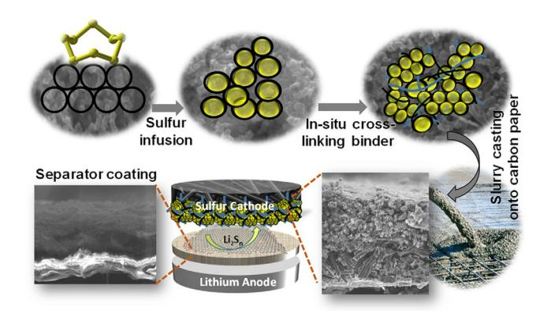
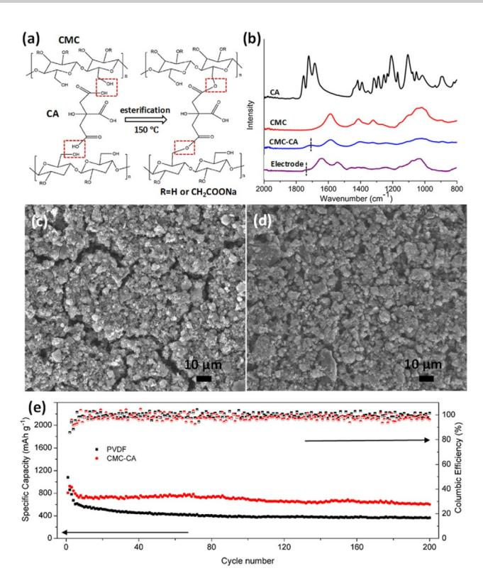
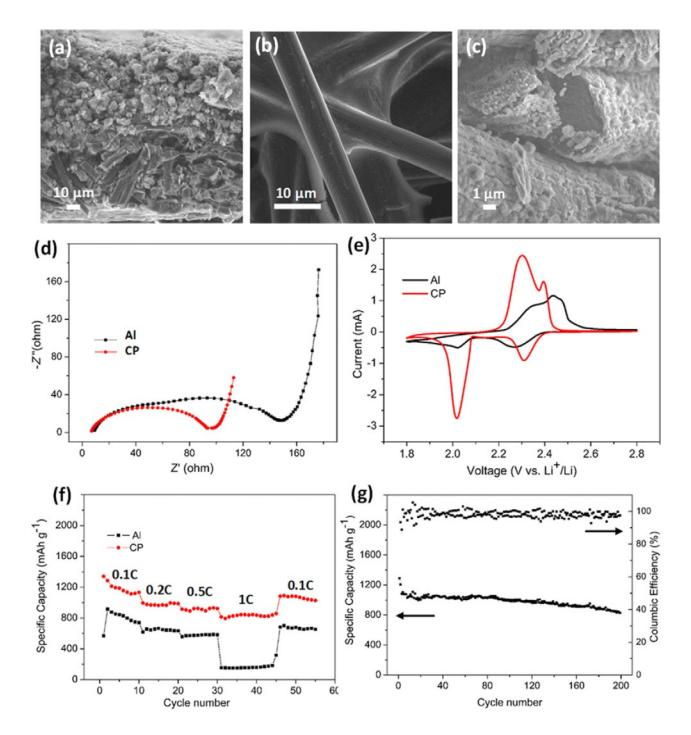
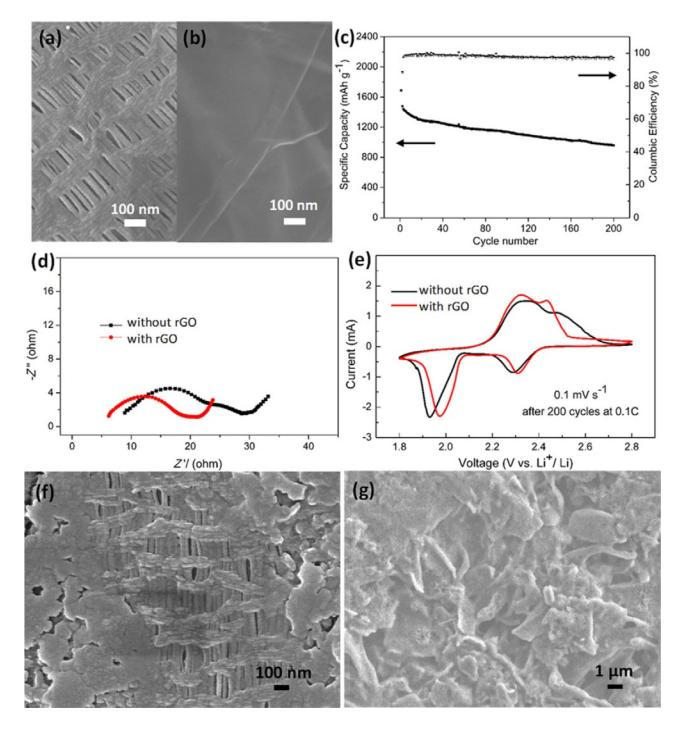
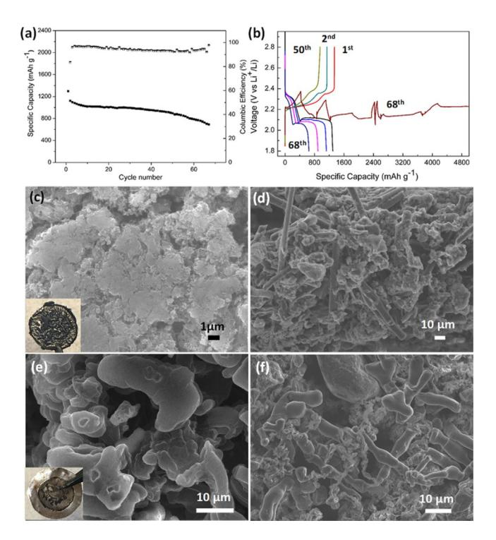

## & Batteries |Hot Paper|

## An Integrated Strategy towards Enhanced Performance of the Lithium–Sulfur Battery and its Fading Mechanism

Xia Huang,[a] [Bin](http://orcid.org/0000-0003-2088-6403) [Luo](http://orcid.org/0000-0003-2088-6403),\*[a] Ruth Knibbe,[b] Han Hu,[a] Miaoqiang Lyu,[a] Mu Xiao,[a] Dan Sun,[a] Songcan Wang,[a] and Lianzhou Wang\*[a]

Abstract: To fulfil the potential of Li–S batteries (LSBs) with high energy density and low cost, multiple challenges need to be addressed simultaneously. Most research in LSBs has been focused on the sulfur cathode design, although the performance is also known to be sensitive to other parameters such as binder, current collector, separator, lithium anode, and electrolyte. Here, an integrated LSB system based on the understanding of the different roles of binder, current collector, and separator is developed. By using the cross-linked carboxymethyl cellulose–citric acid (CMC-CA)

## Introduction

To meet the demand for high energy density and low-cost energy storage, various "post lithium-ion" systems have been pursued.[1] The Li–S battery (LSB) is among the most promising candidates.[2] It couples earth-abundant sulfur as the cathode with lithium as the anode, generating a high theoretical energy density of 2567 Whkg@1 , which is more than five times that of the Li-ion battery (LIB). However, the practical application of LSBs is hindered by multiple fundamental challenges, including poor electronic conductivity of sulfur and its reduced products (Li2S and Li2S2 ), dissolution of lithium polysulfides intermediates (LiPS, Li2Sn , 2<n,8), cathode volume change, lithium dendrite growth, and lithium corrosion. [3] Various strategies have been proposed to solve these issues, including elaborate cathode design,[4–7] separator modification, [8,9] anode protection, [10,11] advanced binders, [12,13] current collectors,[14] and modified electrolyte systems.[15,16] Progress has been made

[a] X. Huang, Dr. B. Luo, Dr. H. Hu, Dr. M. Lyu, M. Xiao, D. Sun, Dr. S. Wang, Prof. L. Wang Nanomaterials Centre, School of Chemical Engineering and Australian Institute for Bioengineering and Nanotechnology The University of Queensland, St Lucia, QLD 4072 (Australia) E-mail: b.luo1@uq.edu.au l.wang@uq.edu.au [b] Dr. R. Knibbe School of Mechanical and Mining Engineering The University of Queensland, St Lucia, QLD 4072 (Australia)

Supporting information and the ORCID identification number(s) for the author(s) of this article can be found under: [https://doi.org/10.1002/chem.201804369.](https://doi.org/10.1002/chem.201804369)

Part of a Special Issue focusing on topics within the field of renewable energy. To view the complete issue, visit [Issue](http://onlinelibrary.wiley.com/doi/10.1002/chem.v24.69/) 69.

binder, Toray carbon paper current collector, and reduced graphene oxide (rGO) coated separator, LSBs achieve a high capacity of 960 mAhg @1 after 200 cycles (2.5 mgcm@2 ) and 930 mAhg @1 after 50 cycles (5 mgcm@2 ) at 0.1 C. Moreover, the failure mechanism at a high sulfur loading with characteristics of fast capacity decay and infinite charging is discussed. This work highlights the synergistic effect of different components and the challenges towards more reliable LSBs with high sulfur loading.

in specific areas, such as sulfur utilization, sulfur content, sulfur loading, rate performance, and cycling life.[17,18] However, when considering the energy density and stability at the cell level, there are still more efforts required to reach the state-of-theart LIBs.[19–21] Current commercial LIBs have an energy density of up to 260 Whkg@1 (or 700 Whl @1 ), with good durability for hundreds to thousands of cycles.[22] There are a few commercial LSBs with relatively higher energy density but limited cycling performance. One example is the system from Oxis Energy, which demonstrates energy densities of 390 Whkg@1 after 50 cycles, 350 Whkg@1 after 100 cycles, although only 152 Whkg@1 can be retained after 1400 cycles.

In the past decade, the majority of LSBs research has been related to the sulfur host material design, aiming to confine the soluble lithium polysulfides to the cathode.[23,24] However, as with all battery systems, there are many other factors in LSBs that can be optimized to improve battery performance. More specifically, the LSB performance is not only dependent on the sulfur host, but also on other components, including the binder, current collector, separator, lithium anode, and electrolyte.[25] As such, integrating different achievements is an efficient approach towards reliable LSBs. Furthermore, low-cost raw materials and simple synthesis processes that are compatible with industrial battery technology are necessary for practical applications.[19]

In this work, by integrating carboxymethyl cellulose–citric acid (CMC-CA) binder, Toray carbon paper (CP) current collector, and reduced graphene oxide (rGO) coated separator (Figure 1), the LSB achieves high capacities of 960 mAhg @1 after 200 cycles (2.5 mgcm@2 ) and 930 mAhg @1 after 50 cycles (5 mgcm@2 ) at 0.1 C. The capacity and cycling stability of this modified LSB presents a dramatic improvement in comparison

Figure 1. Schematic illustration of the integrated strategy for LSBs. Sulfur powder and Ketjenblack (KB) were first mixed, followed by a melt-diffusion process; the obtained S/KB composite was in situ interlinked to the CMC-CA network. The S/KB/CMC-CA slurry was cast onto carbon paper, resembling concrete poured into a steel mesh. A rGO-coated separator could block the LiPS from escaping.

to the traditional LSB using polyvinylidene fluoride (PVDF) binder, carbon coated aluminium (Al) current collector, and unmodified polypropylene separator (370 mAhg @1 after 200 cycles at 0.1 C with 2.5 mgS cm @2 ). By examining the morphology of the electrode, electrochemical impedance spectroscopy (EIS) and cyclic voltammetry (CV), systematic investigations on the role of the binder, current collector, and separator are provided. CMC-CA binder strongly glues the active species with the conductive additives through an in situ esterification process. This produces a crack-free electrode, which maintains a robust structure even after 200 cycles. The CP current collect has a staggered carbon fiber microstructure that provides many conductive sites for active species distribution and concurrently an efficient charge transfer pathway. The rGO coated separator further increases sulfur utilization and capacity retention by blocking and reactivating the lithium polysulfide, which also mitigates the aggregation of cell impedance.

High sulfur loading electrodes are essential to achieve LSBs with desirable energy densities for application. However, even with the integrated system, batteries with a high sulfur loading (5 mgcm@2 ) commonly encounter fast capacity degradation or infinite charging within a short cycling life of less than 100 cycles. Post-mortem analysis reveals that the major reason for the fast capacity degradation is the deposition of thick insulated layers on the cathode surface, which hinders the conductive pathway and electrolyte permeation. The infinite charging is mainly due to the combination of the shuttle effect, lithium corrosion, and greater lithium anode volume change in high sulfur loading systems. The higher anode volume change causes continuous breaking/reforming of the solid electrolyte interface (SEI), which consumes both the electrolyte and lithium. For high sulfur loading LSBs, many degradation challenges are aggregated. Thus, advanced electrolyte system and anode protection are required before more reliable high sulfur loading LSBs can be obtained.

## Results and Discussion

Impregnating sulfur into a porous carbon-based material by melt-diffusion is an efficient way to incorporate sulfur into conducting networks.[4,26] Ketjenblack (KB) is widely used as a conductive agent in batteries as it has the merits of high conductivity, stability, and low cost. The mesoporous carbon matrix (Figure S1 a in the Supporting Information) with high specific surface area enables homogeneous infiltration of a high content sulfur (78 wt%, Figure S1b in the Supporting Information). X-ray diffraction (XRD) results demonstrate no significant sulfur peaks in the S/KB composite (Figure S1c in the Supporting Information), suggesting that sulfur is well-diffused into the KB pores.[27] The distribution of sulfur was further verified by nitrogen adsorption/desorption isotherms (Figure S1 d in the Supporting Information). After sulfur infusion, the specific surface area (Brunauer–Emmett–Teller, BET) of KB decreases from 1338 to 14 m2g @1 and the pore volume decreases from 2.72 to 0.06 cm3g @1 .

#### Interplay of different components

#### (a) Binder

Binders play a critical role in practical batteries. They act as an effective dispersion agent to connect the active materials and conductive additives together and then adhere them to the current collectors. This enables good electrical pathways and maintains the porosity and mechanical stability of the electrode. PVDF has been the most commonly used binder in both commercial LIBs and in LSBs. However, PVDF shows limitations when thick electrodes are prepared and does not accommodate the volume change during cycling test. For example, when thick electrodes are prepared by using PVDF, cracks or pinholes on the electrode surface are commonly observed.[28] To obtain a higher sulfur loading, a thicker electrode is required. Both sulfur and the carbon additive have a low packing density, which causes the electrode to shrink during production. This issue is amplified for the thicker electrode, which can lead to excessive shrinkage and eventually surface cracking during electrode drying.[29] Thus, a more adhesive and elastic binder is required to construct a robust sulfur electrode. Various binder systems have been investigated,[13,30–32] among which CMC-CA is one of the most impressive. When a CMC-CA binder is used, the active species and conductive additives are glued together by the cross-linked networks between -OH groups (from CMC) and -COOH (from CA) through esterification (Figure 2 a).[33–35]

In the present study, the obtained S/KB composite (85 wt%) was mixed with CMC-CA (4.5 wt% CMC as polymer matrix and 0.5 wt% CA as cross linker) and additional conductive agents (5 wt% multi-walled carbon nanotubes and 5 wt% KB), followed by a heat treatment at 150 8C for 2 h, during which the S/KB composites were in situ bonded into CMC-CA networks.[36] Fourier transform infrared spectroscopy (FTIR) was conducted on CMC, CA, cross-linked CMC-CA, and the crosslinked electrode (Figure 2 b). In accordance with previous reports, new peaks at around 1700 cm@1 confirm the successful

Figure 2. (a) Schematic illustration of the cross-linking effect. (b) FTIR spectra of CMC, CA, cross-linked CMC-CA, and cross-linked electrodes. Scanning electron microscopy (SEM) images of the sulfur electrodes based on (c) PVDF and (d) CMC-CA. (e) Cycling performance of CMC-CA- and PVDFbased LSBs.

cross linking in the CMC-CA compound.[34,35] In comparison with electrodes using PVDF (Figure 2 c), uniform and crack-free electrodes (2.5 mgS cm@2 ) were obtained when CMC-CA was used (Figure 2 d). Furthermore, the cross-linked CMC-CA binder makes a significant contribution to the cycling stability (Figure 2 e). The capacity of LSBs based on CMC-CA maintains a specific capacity of approximately 600 mAhg @1 after 200 cycles at 0.1 C, which is much higher than that of LSBs based on PVDF (&370 mAhg @1 ). The uniform structure of the CMC-CAbased cathode is well preserved after 200 cycles (Figure S2a, b in the Supporting Information) in comparison with the PVDFbased electrode (Figure S2c, d in the Supporting Information).

#### (b) Current collector

Current collectors bridge the conductive pathway from active species to external circuits, and also physically support the electrode.[14] Owing to their low cost and good conductivity, Al or carbon-coated Al foils are widely used as cathode current collectors in both LIBs and LSBs. However, these current collectors are limited by their planar geometry and long-term stability. The planar geometry limits sulfur accommodation ability and leads to inefficient ionic/electronic transfer for thick sulfur electrodes.

Furthermore, Al corrosion has been observed in LSBs.[37] To solve these issues, various 3D current collectors have been investigated, which allow a high sulfur loading, efficient charge transfer and long cycling stability. [37–44] However, these innovative structures have some drawbacks, including: a) complex and expensive fabrication procedures that are difficult to scale up, b) a special sulfur introduction step that is incompatible with traditional slurry preparation processes, c) the demand for large electrolyte volume to wet the electrode, which sacrifices the overall energy density. [35,45] Current collectors that offset these shortfalls while maintaining some structural advantages are desirable.[46]

In this work, Toray carbon paper (CP, 170 mm thick) was used as the current collector, which consists of randomly dispersed carbon fibers of around Ø6 mm (Figure 3 a). The S/KB/CMC-CA slurry permeates into the carbon paper interspaces (Figure 3 b).

Figure 3. SEM images of (a) fresh carbon fiber of the carbon paper, (b) cross section of carbon paper-based electrode, (c) carbon fiber after 200 cycles. (d) EIS results, (e) CV curves, (f) rate performance of the batteries based on Al and carbon paper. (g) Cycling performance of battery based on CP.

In comparison, the slurry is only present on the Al top surface (Figure S3 in the Supporting Information). Electrodes based on CP could be sufficiently wetted by using 10 mlmg @1 of electrolyte/sulfur, which is attributed to the compact electrode. Electrochemical impedance spectroscopy (EIS) of the fresh cells was conducted (Figure 3 d). The classic Randles' equivalent circuit with the Warburg impedance is used to relate the impedance to specific electrochemical parameters (Figure S4 in the Supporting Information), where Rs is the resistance of the electrolyte solution and the cell parts, and Rct is the charge transfer resistance.[47] LSBs based on CP demonstrate a smaller Rct than those based on Al current collectors, which can be attributed to the intimate contact of sulfur with the CP fiber conductive network.

The redox process was further investigated by CV. Typical LSB CV curves with two cathodic peaks and an overlapped anodic peak were observed (Figure 3 e). The first reduction peak at 2.4–2.2 V involves the reduction of solid S8 to soluble Li2Sn (3,n,8), and the second reduction peak at 2.1–1.9 V corresponds to the reduction of Li2Sn to Li2S2 /Li2S.[48] During the anodic scan, the peaks overlap at 2.2–2.6 V, relating to the oxidation of lithium sulfide to LiPS/sulfur. [49,50] A rounder summit in Al current collector-based LSBs corresponds to a higher charge transfer barrier, [47] which agrees with the EIS results. The improved charge transfer impedance also allows the CP-based LSB to show improved rate performance (Figure 3 f), especially at a higher rate of 1 C (1675 mAg @1 ). Moreover, an improved initial capacity and cycling stability have been achieved for CP-based LSBs in comparison to Al foil-based ones. The Al foil-based LSB delivers an initial capacity of approximately 800 (increased to 1000 mAhg @1 in the followed cycles) and 600 mAhg @1 after 200 cycles (Figure 2 e), whereas a high initial capacity of 1350 mAhg @1 and 830 mAhg @1 after 200 cycles at 0.1 C are achieved when using CP (Figure 3 g). After a cycling test, a thin layer of sulfur deposits was observed on the carbon fibers (Figure 3 c), indicating that the carbon fibers can provide additional conductive sites, where the active species (sulfur and lithium sulfide) can be redistributed and reused. [51]

#### (c) Separator modification

Robust electrodes with efficient charge transfer networks have been obtained by using CMC-CA binder and CP current collector. However, the soluble LiPS still could pass through the separator owing to the abundant crevices (Figure 4 a) of the commonly used separator, leading to active material loss and a reduced columbic efficiency (CE, Qdischarge/Qcharge), as observed in Figures 2 e and 3 g.Aseparator coating or an interlayer between the cathode and separator have been demonstrated as an efficient way to deal with this issue.[49,52–54] Among the materials for separator coating (or as an interlayer), rGO shows promise, allowing for strong chemical interactions with the LiPS that mitigate LiPS migration, good electronic conductivity that allows for the trapped LiPS species to be reactivated, and potential for large-scale production. [17,55–58]

Here, GO was synthesized by a modified version of Hummers' method.[59] After heat treatment at 350 8C in N2 /H2 (95:5, v/ v), rGO was obtained (Figure S5 in the Supporting Information) with a C/O ratio of 3.3 from elemental analysis (Table S1 in the Supporting Information). A thin layer of rGO (Figure S6 in the Supporting Information) was coated on the separator (Figure 4 b) through the doctor-blade method. The rGO coating layer further enhances the battery performance in terms of initial capacity, cycling stability, and columbic efficiency. The LSB with the rGO modified separator shows an initial capacity of 1600 mAhg @1 (2.5 mgS cm@2 ) and 960 mAhg @1 after 200 cycles at 0.1 C (Figure 4 c), which are higher than the capacities of the LSB with uncoated separator (Figure 3 g). EIS and CV tests were conducted before and after 200 cycles to investigate the effect of rGO modification. For fresh cells with the rGO-coated sepa-

# Full Paper

Figure 4. SEM images of (a) general separator and (b) rGO-coated separator. (c) Cycling performance of battery with rGO-coated separator. (d) EIS and (e) CV test of batteries with and without rGO after 200 cycles. SEM images of the separator surface (f) without rGO and (g) with rGO after 200 cycles.

rator, EIS (Figure S7 a in the Supporting Information) and CV (Figure S7b in the Supporting Information) curves are similar to those of LSBs with general separator (Figure 3 e), suggesting the coating layer does not hinder lithium-ion diffusion. [49,54] After 200 cycles, LSBs with rGO-coated separator show a lower Rs (resistance from electrolyte and cell parts) than that with the general separator (Figure 4d). This is further confirmed by CV results of the cycled batteries (Figure 4 e), which show that higher reduction potentials and lower oxidation potentials are achieved by using the rGO-coated separator. Comparing with the fresh LSBs, the cycled batteries demonstrate a higher Rs , which is mainly caused by the increased electrolyte viscosity (LiPS dissolution). Rs of the rGO-coated separator is lower than that of the bare separator, indicating a suppressed LiPS dissolution by rGO coating. Moreover, passivation layers (sulfur and lithium sulfide) formed on electrodes (Figure S8 in the Supporting Information) and separator surface lead to an increased Rct. [60] The battery based on rGO-coated separator demonstrates a lower Rct than that of bare separator, which can be attributed to that separator modification could mitigate the passivation layer on the interface of the cathode and separator. [52,61,62]

The post-mortem analysis of the cycled LSBs shows that the LSB cell with the uncoated separator is covered with particles (Figure 4 f). In comparison, the rGO provides a uniform conductive layer for the insulating sulfur and lithium sulfide redistribution (Figure 4 g), which contributes to the lower cell impedance. It should be noted that both the rate capability and initial capacity have been improved by rGO modification, which can be attributed to the following two reasons. First, the con-

ductivity of the sulfur cathode is further enhanced by rGO modification, which acts as an upper current collector and improves the sulfur utilization. Second, it retards lithium polysulfide from escaping from the cathode side, thus a more complete discharging reaction is achieved.

To better understand the contribution of each component to the sulfur utilization and capacity retention (after 200 cycles), a brief quantitative analysis is given in Table S2 (in the Supporting Information). In comparison to the non-optimized system, CMC-CA binder greatly improves the capacity retention by 64%, demonstrating the importance of electrode mechanical stability. It shows no significant influence on the discharge capacity of the 2 nd cycle. When carbon paper is applied in the CMC-CA system, both the discharge capacity of the 2 nd cycle and capacity retention after 200 cycles increase greatly, with an increase of 29.8% and 62.6%, respectively. This is because the carbon paper not only increases the sulfur utilization but also provides more conductive sites for active species distribution. When the rGO-coated separator is introduced, the discharge capacity of the 2 nd cycle is further increased by 22.7%, which is due to the enhanced conductivity (higher sulfur utilization) and lithium polysulfide retention (more complete reaction). As a result, the capacity retention after 200 cycles further increases by 34.7%.

#### Fading mechanism analysis

Encouraged by the enhanced electrochemical performance of LSBs with a moderate sulfur loading (2.5 mgS cm @2 ), LSBs with a higher sulfur loading of 5 mg cm@2 were assembled and tested based on the integrated strategy. Both the EIS and CV results of the fresh cells (Figure S9 in the Supporting Information) are similar to that with 2.5 mg S cm@2 , which further confirm the benefit of the highly conductive penetrable carbon fiber networks. The battery achieves an initial capacity of 1360 mAhg @1 , which maintains 930 mAhg @1 after 50 cycles at 0.1 C (Figure 5 a). However, LSBs with high sulfur loading (5 mgcm@2 ) tend to suffer from fast capacity degradation and/ or infinite charging in a prolonged cycling measurement even with the integrated system. For example, the cell in Figure 5 b suffers from a fast capacity decrease to approximately 700 mAhg @1 after 50 cycles and then ends up with infinite charging at the 68th cycle.

Post-mortem analysis of the failed batteries shows that the cathode is covered by a thick and compact passivation layer (Figure 5 c). Energy-dispersive X-ray (EDX) analysis demonstrates the cycled cathode surface is mainly composed of sulfur-rich species (Figure S10 in the Supporting Information).[37,62] The current collector is overwhelmed with deposits throughout the whole matrix (Figure 5 d), losing its ability to provide conductive sites for the redistribution and utilization of active species. The fast capacity degradation is mainly caused by the uncontrolled deposition of the insulating sulfur/ lithium sulfide on the cathode surface, which blocks the conductive pathway and electrolyte permeation.

In addition to the strong degradation observed on the cathode surface, serious corrosion is observed on the lithium

## Full Paper

Figure 5. Performance and characterization of high sulfur loading batteries. (a) Cycling performance, (b) selected discharge/charge curves, optical (insets) and SEM images of cycled (c) cathode surface, (d) cross section of the carbon paper, and (e, f) lithium anode.

anode (inset of Figure 5 e), with isolated lithium particles and dendrites being present (Figure 5 e). Furthermore, sulfur-containing species are also observed on the surface of the cycled lithium anode (Figure 5 f and Figure S11 in the Supporting Information), indicating a severe shuttle effect. During charging, the soluble long-chain LiPSs generated at the cathode diffuse to the anode, where the LiPSs can be chemically reduced to short-chain LiPSs. The short-chain LiPSs diffuse back to the cathode, which are electrochemically re-oxidized to long-chain LiPSs, leading to low CE or even infinite charging.[63,64] LiNO3 is added into the electrolyte with the aim of forming a stable SEI on the lithium surface, protecting it from reacting with LiPS continuously. [65] Although the CE increases with the rGOcoated separator, the thin rGO layer may not be sufficient to block the LiPS diffusion at a high sulfur loading. Moreover, for high sulfur loading LSBs, lithium experiences large volume changes, leading to the repeated formation/breakage of the SEI with an unsustainable consumption of LiNO3 , thus infinite charging occurs.[66] Furthermore, the repeated formation/breakage of the SEI at the lithium surface induces non-uniform lithium-ion conductivity, promoting inhomogeneous lithium plating/stripping.[66] Inhomogeneous plating (charge) causes protrusions or even dendrites. During lithium striping (discharge), the volume shrinkage breaks the protrusions or the dendrite, leading to isolated lithium that could hardly be reused.[67] Both the inhomogeneous lithium plating/stripping and the resultant protrusions or dendrites aggravate the SEI breakage and shuttle effect as well, leading to a vicious cycle and battery failure. In this study, batteries fail before the short circuit caused by

lithium dendrites, which is common in lab-scale research.[68] However, dendrite growth is still a safety issue for the practical application of Li metal batteries. Note that, despite the efforts to achieve a high-performance cathode for LSBs, to produce commercially feasible LSBs with competitive energy density and cost, other parameters including but not limited to the electrolyte amount, lithium anode mass, and cell configurations, should be considered simultaneously.

## Conclusion

We have demonstrated an integrated strategy to improve the electrochemical performance of LSBs based on optimized binder, current collector, and separator. The modified LSB system (with a moderate sulfur loading (2.5 mgS cm @2 ) achieves a high reversible capacity of 960 mAhg @1 after 200 cycles at 0.18C. Controlled experimental results demonstrate the essential role of the binder, current collector, and separator, and their synergistic effect to enhance the battery performance. We have further investigated the failure mechanism of LSBs with high sulfur loading. The massive deposition of insulating sulfur/lithium sulfide species increase the battery resistance and block the ion transport pathways, leading to a diminishing sulfur utilization and fast capacity decay. The aggravated shuttle effect and large lithium anode volume change leads to repeated SEI destruction/re-formation and continuous LiNO3 consumption, eventually resulting in infinite charging. Thus, further optimizations including cathode design, separator modification, anode protection, and electrolyte optimization are required for more reliable LSBs with high sulfur loading.

## Experimental Section

#### Materials and synthesis

Sulfur/Ketjenblack (S/KB) composites: Sulfur powder (Sigma–Aldrich) and KetjenblackSEC-600JD (KB) were mixed by ball milling at a mass ratio of 8:2, followed by a melt-diffusion process at 1558C for 12 h in a sealed glass vial.

Carboxymethyl cellulose–critic acid (CMC-CA) binder based electrode: The obtained S/KB composite (85 wt%), KB (5 wt%), MWCNTs (multi-wall carbon nanotubes, 5 wt%), 4CMC (.5 wt%), and CA (0.5 wt%) were mixed by hand grinding. The mixture was transferred to a glass vial, sealed, and heated at 1508C for 2 h. The S/KB/CMC-CA slurry was obtained by adding deionized (DI) water/ dimethylformamide (DMF) (3:2, v/v). The slurry was then pasted onto Toray carbon paper (Sigma–Aldrich) or carbon-coated aluminium foil by the doctor-blade method, dried in a vacuum oven at 558C for 20 h, then punched and weighted.

PVDF binder based electrode: The obtained S/KB composite (80 wt%), KB (5% wt), MWCNTs (5 wt%), poly(vinylidene fluoride) (PVDF; 10 wt%) were mixed by hand grinding. The S/KB/PVDF slurry was formed by adding N-Methyl-2-pyrrolidone (NMP), followed by the same process as the CMC-CA system.

Reduced graphene oxide (rGO)-coated separator: Graphene oxide (GO) was prepared from natural graphite powder by a modified version of Hummers' method.[59] Briefly, graphite (5 g) and NaNO3 (8 g) were added to H2SO4 (250 mL, 98%) in a roundbottom flask in an ice bath, which was keep stirring during the subsequent addition of KMnO4 (22.5 g). The temperature was maintained at <10 8C, and the mixture was stirred overnight. The flask was transferred to a 35 8C water bath and stirred for 5 days. A 2 L beaker was prepared with 1 L cold water added. The contents of the round-bottom flask was poured into the beaker, with stirring, and the mixture was heated at around 90 8C. H2O2 (5 mL, 5%) was added dropwise until the color of the solution became gold yellow. The product was repeatedly washed with DI water to obtain neutral pH by centrifuge. rGO was obtained by heat treatment of the freeze-dried GO at 3508C for 3 h in N2 /H2 (95:5, v/v) flow. The rGO was mixed with PVDF at a mass ratio of 9:1 in NMP by hand grinding. The slurry was cast onto a Celgard 2400 surface by the doctor-blade method, followed by a drying process in a vacuum oven at 508C for 20 h.

#### Electrochemical performance measurements

Standard 2032 coin cells were assembled. The lithium foil was used as the anode, Celgard 2400 or reduced graphene oxide-coated Celgard 2400 was the separator. The electrolyte consisted of 1m bis( trifluoromethanesulfonyl)imide (LiTFSI) with 2 wt% LiNO3 dissolved in 1,3-dioxolane (DOL) and dimethoxymethane (DME) (1:1, v/v). Batteries were assembled in an argon-filled glovebox. The ratio of electrolyte volume to sulfur weight was 10 mLmg @1 . The assembled cells were kept at rest for at least 3 h for electrodes and separator wetting. The galvanostatic discharge/charge was conducted between 1.8 V and 2.8 V at 0.1 C rate (1 C=1675 mAg @1 ) at room temperature. Cyclic voltammograms (CV) were scanned at a rate of 0.1 or 0.05 mVs @1 between 1.8 V and 2.8 V. Electrochemical impedance spectroscopy (EIS) was measured in the range 100 kHz to 0.1 Hz.

#### Characterization

X-ray diffraction (XRD) measurements were conducted to characterize the distribution of sulfur in carbon by using a D8-Advance Xray diffractometer with CuKa radiation (Bruker, l=0.15406 nm). Thermogravimetric analysis (TGA, PerkinElmer, Diamond TG) was conducted to figure out the decomposing temperature as well as to decide the final sulfur content of the S/C composite after the melt-diffusion, which was operated to 8008C at a heating rate of 108Cmin@1 in nitrogen. The nitrogen sorption isotherms and BET surface area were measured at 77 K with a Tristar nitrogen sorption instrument (Micrometrics Instrument Corporation). The morphology and microstructure of composite materials and electrodes were characterized by field-emission scanning electron microscopy (FE-SEM, JEOL-7100) and transmission electron microscopy (FE-TEM F20). Elemental analysis was conducted with a FlashEA112 series elemental analyzer.

## Acknowledgments

We gratefully thank the Australian Research Council through its Discovery, DECRA, and Linkage Programs. X. Huang thanks the financial support from the Chinese Scholarship Council (CSC). The Australian Microscopy & Microanalysis Research Facility is also gratefully acknowledged for providing characterization faculties. The authors also thank Prof. Eric McFarland, Dr. Hongqiang Wang, Ms. Ju Sun, Mr. Yuxiang Hu, Ms. Xin Fan, Dr. Xiaobo Zhu, Dr. Delai Ye, and Mr. Masud Rana for their helpful discussions.

|  |  |  |  | Chem. Eur. J. 2018, 24, 18544 – 18550 |  |
|--|--|--|--|---------------------------------------|--|
|--|--|--|--|---------------------------------------|--|

### Conflict of interest

The authors declare no conflict of interest.

Keywords: batteries · binders · capacity degradation · current collectors · separator integrated modification

- [1] J. W. Choi, D. Aurbach, Nat. Rev. Mater. 2016, 1, 16013.
- [2] P. G. Bruce, S. A. Freunberger, L. J. Hardwick, J.-M. Tarascon, Nat. [Mater.](https://doi.org/10.1038/nmat3191) [2012](https://doi.org/10.1038/nmat3191), 11, 19.
- [3] A. Manthiram, Y. Fu, S.-H. Chung, C. Zu, Y.-S. Su, [Chem.](https://doi.org/10.1021/cr500062v) Rev. 2014, 114, [11751.](https://doi.org/10.1021/cr500062v)
- [4] X. Ji, K. T. Lee, L. F. Nazar, Nat. [Mater.](https://doi.org/10.1038/nmat2460) 2009, 8, 500.
- [5] M. A. Pope, I. A. Aksay, [Adv. Energy Mater.](https://doi.org/10.1002/aenm.201500124) 2015, 5, 1500124.
- [6] J. Zhang, C.-P. Yang, Y.-X. Yin, L.-J. Wan, Y.-G. Guo, [Adv. Mater.](https://doi.org/10.1002/adma.201602913) 2016, 28, [9539.](https://doi.org/10.1002/adma.201602913)
- [7] S. Rehman, S. Guo, Y. Hou, Adv. [Mater.](https://doi.org/10.1002/adma.201506111) 2016, 28, 3167.
- [8] J.-Q. Huang, Q. Zhang, F. Wei, [Energy Storage](https://doi.org/10.1016/j.ensm.2015.09.008) Mater. 2015, 1, 127.
- [9] N. Deng, W. Kang, Y. Liu, J. Ju, D. Wu, L. Li, B. S. Hassan, B. Cheng, [J.](https://doi.org/10.1016/j.jpowsour.2016.09.044) Power [Sources](https://doi.org/10.1016/j.jpowsour.2016.09.044) 2016, 331, 132.
- [10] T. Tao, S. Lu, Y. Fan, W. Lei, S. Huang, Y. Chen, Adv. [Mater.](https://doi.org/10.1002/adma.201700542) 2017, 29, [1700542](https://doi.org/10.1002/adma.201700542).
- [11] X.-B. Cheng, R. Zhang, C.-Z. Zhao, Q. Zhang, [Chem.](https://doi.org/10.1021/acs.chemrev.7b00115) Rev. 2017, 117, [10403.](https://doi.org/10.1021/acs.chemrev.7b00115)
- [12] C. Milroy, A. Manthiram, Adv. [Mater.](https://doi.org/10.1002/adma.201601665) 2016, 28, 9744.
- [13] W. Chen, T. Lei, T. Qian, W. Lv, W. He, C. Wu, X. Liu, J. Liu, B. Chen, C. Yan, [Adv. Energy](https://doi.org/10.1002/aenm.201702889) Mater. 2018, 8, 1702889.
- [14] L. Kong, H.-J. Peng, J.-Q. Huang, Q. Zhang, Nano Res. 2017, 10[, 4027.](https://doi.org/10.1007/s12274-017-1652-x) [15] M. Barghamadi, A. S. Best, A. I. Bhatt, A. F. Hollenkamp, M. Musameh,
- R. J. Rees, T. Rether, Energy [Environ.](https://doi.org/10.1039/C4EE02192D) Sci. 2014, 7, 3902. [16] S. Zhang, K. Ueno, K. Dokko, M. Watanabe, Adv. [Energy](https://doi.org/10.1002/aenm.201500117) Mater. 2015, 5,
- [1500117.](https://doi.org/10.1002/aenm.201500117)
- [17] Q. Pang, X. Liang, C. Y. Kwok, L. F. Nazar, Nat. Energy 2016, 1, 16132.
- [18] Z. W. Seh, Y. Sun, Q. Zhang, Y. Cui, [Chem.](https://doi.org/10.1039/C5CS00410A) Soc. Rev. 2016, 45, 5605.
- [19] S. Urbonaite, T. Poux, P. Nov#k, Adv. Energy Mater. 2015, 5[, 1500118](https://doi.org/10.1002/aenm.201500118).
- [20] D. Eroglu, K. R. Zavadil, K. G. Gallagher, J. [Electrochem.](https://doi.org/10.1149/2.0611506jes) Soc. 2015, 162, [A982](https://doi.org/10.1149/2.0611506jes).
- [21] T. Cleaver, P. Kovacik, M. Marinescu, T. Zhang, G. Offer, J. [Electrochem.](https://doi.org/10.1149/2.0071801jes) Soc. 2018, 165[, A6029](https://doi.org/10.1149/2.0071801jes).
- [22] R. Schmuch, R. Wagner, G. Hçrpel, T. Placke, M. Winter, Nat. [Energy](https://doi.org/10.1038/s41560-018-0107-2) [2018](https://doi.org/10.1038/s41560-018-0107-2), 3, 267.
- [23] J. Zhang, H. Huang, J. Bae, S. H. Chung, W. Zhang, A. Manthiram, G. Yu, Small Methods 2018, 2[, 1700279](https://doi.org/10.1002/smtd.201700279).
- [24] Y. Wang, X. Huang, S. Zhang, Y. Hou, Small Methods 2018, 2[, 1700345.](https://doi.org/10.1002/smtd.201700345)
- [25] M. Hagen, D. Hanselmann, K. Ahlbrecht, R. MaÅa, D. Gerber, J. Tebke, [Adv. Energy](https://doi.org/10.1002/aenm.201401986) Mater. 2015, 5, 1401986.
- [26] L. Borchardt, M. Oschatz, S. Kaskel, [Chem.](https://doi.org/10.1002/chem.201600040) Eur. J. 2016, 22, 7324.
- [27] J. Zheng, M. Gu, M. J. Wagner, K. A. Hays, X. Li, P. Zuo, C. Wang, J.-G. Zhang, J. Liu, J. Xiao, J. [Electrochem. Soc.](https://doi.org/10.1149/2.013310jes) 2013, 160, A1624.
- [28] D. Lv, J. Zheng, Q. Li, X. Xie, S. Ferrara, Z. Nie, L. B. Mehdi, N. D. Browning, J. G. Zhang, G. L. Graff, [Adv. Energy Mater.](https://doi.org/10.1002/aenm.201402290) 2015, 5, 1402290.
- [29] A. Kraytsberg, Y. Ein-Eli, [Adv. Energy Mater.](https://doi.org/10.1002/aenm.201600655) 2016, 6, 1600655.
- [30] J. Liu, D. G. Galpaya, L. Yan, M. Sun, Z. Lin, C. Yan, C. Liang, S. Zhang, Energy [Environ.](https://doi.org/10.1039/C6EE03033E) Sci. 2017, 10, 750.
- [31] P. Bhattacharya, M. I. Nandasiri, D. Lv, A. M. Schwarz, J. T. Darsell, W. A. Henderson, D. A. Tomalia, J. Liu, J.-G. Zhang, J. Xiao, Nano [Energy](https://doi.org/10.1016/j.nanoen.2015.11.012) 2016, 19[, 176.](https://doi.org/10.1016/j.nanoen.2015.11.012)
- [32] W. Chen, T. Qian, J. Xiong, N. Xu, X. Liu, J. Liu, J. Zhou, X. Shen, T. Yang, Y. Chen, Adv. Mater. 2017, 29[, 1605160.](https://doi.org/10.1002/adma.201605160)
- [33] J. Song, Z. Yu, M. L. Gordin, X. Li, H. Peng, D. Wang, ACS [Nano](https://doi.org/10.1021/acsnano.5b04474) 2015, 9, [11933.](https://doi.org/10.1021/acsnano.5b04474)

- [34] Y. Liu, Z. Tai, T. Zhou, V. Sencadas, J. Zhang, L. Zhang, K. Konstantinov, Z. Guo, H. K. Liu, [Adv. Mater.](https://doi.org/10.1002/adma.201703028) 2017, 29, 1703028.
- [35] Q. Pang, X. Liang, C. Y. Kwok, J. Kulisch, L. F. Nazar, [Adv. Energy](https://doi.org/10.1002/aenm.201601630) Mater. 2017, 7[, 1601630.](https://doi.org/10.1002/aenm.201601630)
- [36] S. Gorgieva, V. Kokol, [Carbohydr. Polym.](https://doi.org/10.1016/j.carbpol.2011.03.037) 2011, 85, 664.
- [37] H. J. Peng, W. T. Xu, L. Zhu, D. W. Wang, J. Q. Huang, X. B. Cheng, Z. Yuan, F. Wei, Q. Zhang, [Adv. Funct.](https://doi.org/10.1002/adfm.201602071) Mater. 2016, 26, 6351.
- [38] H. Nara, T. Yokoshima, H. Mikuriya, S. Tsuda, T. Momma, T. Osaka, J. [Elec](https://doi.org/10.1149/2.0381701jes)[trochem. Soc.](https://doi.org/10.1149/2.0381701jes) 2017, 164, A5026.
- [39] Q. Zhao, X. Hu, K. Zhang, N. Zhang, Y. Hu, J. Chen, Nano Energy 2015, 15, 721.
- [40] G. Zhou, L. Li, C. Ma, S. Wang, Y. Shi, N. Koratkar, W. Ren, F. Li, H.-M. Cheng, Nano [Energy](https://doi.org/10.1016/j.nanoen.2014.11.025) 2015, 11, 356.
- [41] G. Hu, C. Xu, Z. Sun, S. Wang, H. M. Cheng, F. Li, W. Ren, [Adv. Mater.](https://doi.org/10.1002/adma.201504765) 2016, 28[, 1603.](https://doi.org/10.1002/adma.201504765)
- [42] G. Zhou, E. Paek, G. S. Hwang, A. Manthiram, Nat. Commun. 2015, 6, 7760.
- [43] H.-J. Peng, J.-Q. Huang, Q. Zhang, Chem. Soc. Rev. 2017, 46[, 5237.](https://doi.org/10.1039/C7CS00139H)
- [44] M. Zhen, J. Wang, X. Wang, C. Wang, [Chem. Eur. J.](https://doi.org/10.1002/chem.201705515) 2018, 24, 5860.
- [45] J.-Y. Hwang, H. M. Kim, Y.-K. Sun, J. [Electrochem.](https://doi.org/10.1149/2.0131801jes) Soc. 2018, 165, A5006.
- [46] H. J. Peng, J. Q. Huang, X. B. Cheng, Q. Zhang, [Adv. Energy](https://doi.org/10.1002/aenm.201700260) Mater. 2017, 7[, 1700260.](https://doi.org/10.1002/aenm.201700260)
- [47] D. Linden, T. B. Reddy in Linden's Handbook of Batteries, 4th ed., McGraw-Hill, New York, 2002, pp. 43– 46.
- [48] L. Kong, H.-J. Peng, J.-Q. Huang, W. Zhu, G. Zhang, Z.-W. Zhang, P.-Y. Zhai, P. Sun, J. Xie, Q. Zhang, Energy [Storage](https://doi.org/10.1016/j.ensm.2017.05.009) Mater. 2017, 8, 153.
- [49] S. Bai, X. Liu, K. Zhu, S. Wu, H. Zhou, Nat. Energy 2016, 1, 16094.
- [50] H. Yamin, A. Gorenshtein, J. Penciner, Y. Sternberg, E. Peled, J. [Electro](https://doi.org/10.1149/1.2095868)[chem. Soc.](https://doi.org/10.1149/1.2095868) 1988, 135, 1045.
- [51] S. Walus´, C. Barchasz, R. Bouchet, J.-F. Martin, J.-C. LeprÞtre, F. Alloin,
- Electrochim. Acta 2016, 211, 697. [52] Y.-S. Su, A. Manthiram, Nat. Commun. 2012, 3, 1166.
- [53] Z. Xiao, Z. Yang, L. Wang, H. Nie, M. e. Zhong, Q. Lai, X. Xu, L. Zhang, S. Huang, [Adv. Mater.](https://doi.org/10.1002/adma.201405637) 2015, 27, 2891.
- [54] J.-Q. Huang, T.-Z. Zhuang, Q. Zhang, H.-J. Peng, C.-M. Chen, F. Wei, [ACS](https://doi.org/10.1021/nn507178a) Nano 2015, 9[, 3002.](https://doi.org/10.1021/nn507178a)
- [55] L. Zhang, L. Ji, P.-A. Glans, Y. Zhang, J. Zhu, J. Guo, Phys. [Chem.](https://doi.org/10.1039/c2cp42866k) Chem. Phys. 2012, 14[, 13670](https://doi.org/10.1039/c2cp42866k).
- [56] L. Ji, M. Rao, H. Zheng, L. Zhang, Y. Li, W. Duan, J. Guo, E. J. Cairns, Y. Zhang, J. Am. Chem. Soc. 2011, 133[, 18522](https://doi.org/10.1021/ja206955k).
- [57] B. Wang, Y. Wen, D. Ye, H. Yu, B. Sun, G. Wang, D. Hulicova-Jurcakova, L. Wang, Chem. Eur. J. 2014, 20[, 5224.](https://doi.org/10.1002/chem.201400385)
- [58] B. Luo, L. J. Zhi, Energy [Environ.](https://doi.org/10.1039/C4EE02578D) Sci. 2015, 8, 456.
- [59] W. S. Hummers, R. E. Offeman, J. Am. [Chem.](https://doi.org/10.1021/ja01539a017) Soc. 1958, 80, 1339.
- [60] R. Xu, I. Belharouak, X. Zhang, R. Chamoun, C. Yu, Y. Ren, A. Nie, R. Shahbazian-Yassar, J. Lu, J. C. Li, ACS Appl. Mater. [Interfaces](https://doi.org/10.1021/am504763p) 2014, 6, [21938](https://doi.org/10.1021/am504763p).
- [61] H. Yao, K. Yan, W. Li, G. Zheng, D. Kong, Z. W. Seh, V. K. Narasimhan, Z. Liang, Y. Cui, Energy [Environ.](https://doi.org/10.1039/C4EE01377H) Sci. 2014, 7, 3381.
- [62] H. J. Peng, D. W. Wang, J. Q. Huang, X. B. Cheng, Z. Yuan, F. Wei, Q. Zhang, Adv. Sci. 2016, 3[, 1500268.](https://doi.org/10.1002/advs.201500268)
- [63] Y. V. Mikhaylik, J. R. Akridge, J. [Electrochem.](https://doi.org/10.1149/1.1806394) Soc. 2004, 151, A1969.
- [64] S. S. Zhang, J. [Power Sources](https://doi.org/10.1016/j.jpowsour.2006.07.074) 2006, 162, 1379.
- [65] S. S. Zhang, [Electrochim.](https://doi.org/10.1016/j.electacta.2012.03.081) Acta 2012, 70, 344.
- [66] D. Lin, Y. Liu, Y. Cui, Nat. [Nanotechnol.](https://doi.org/10.1038/nnano.2017.16) 2017, 12, 194.
- [67] X. B. Cheng, R. Zhang, C. Z. Zhao, F. Wei, J. G. Zhang, Q. Zhang, [Adv. Sci.](https://doi.org/10.1002/advs.201500213) 2016, 3[, 1500213.](https://doi.org/10.1002/advs.201500213)
- [68] B. Wu, J. Lochala, T. Taverne, J. Xiao, Nano [Energy](https://doi.org/10.1016/j.nanoen.2017.08.005) 2017, 40, 34.

Manuscript received: August 28, 2018

Accepted manuscript online: September 28, 2018

Version of record online: November 14, 2018

Full Paper