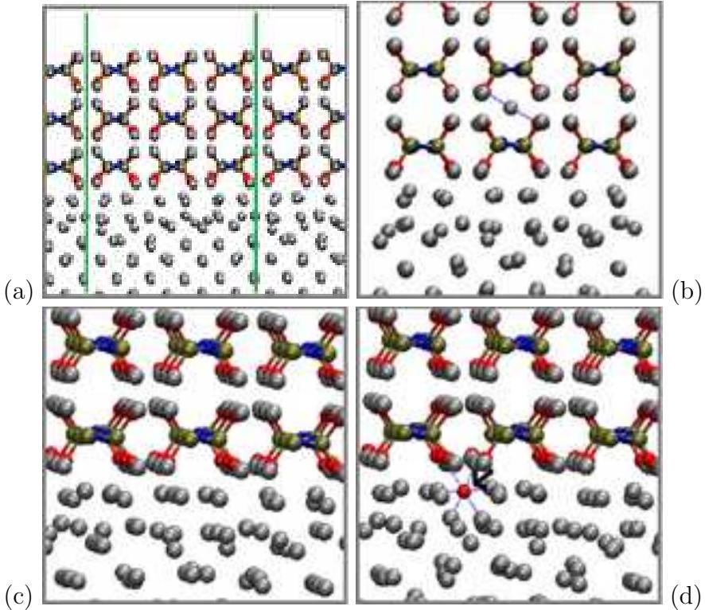
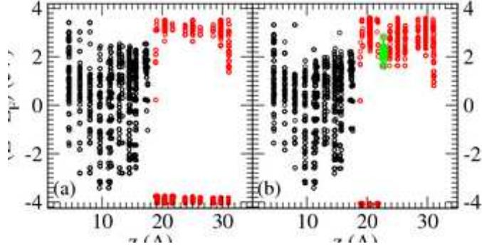
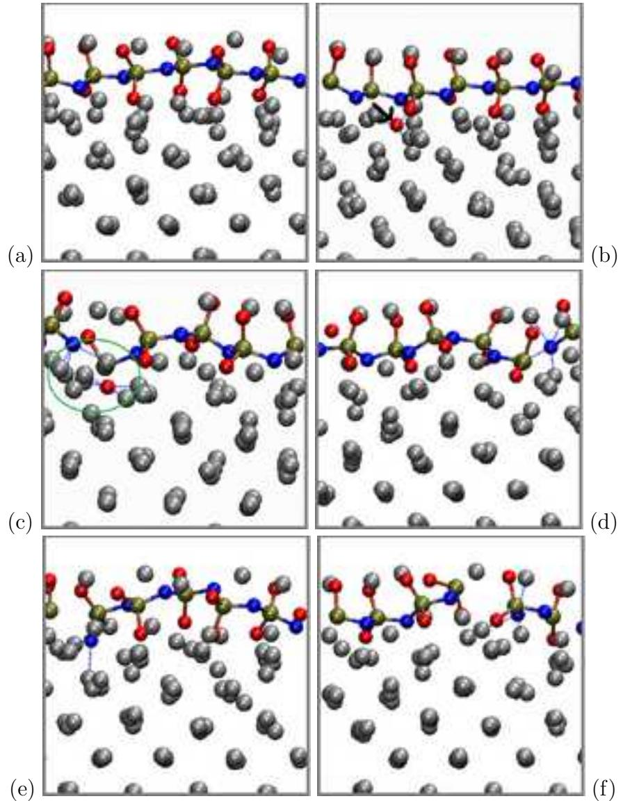
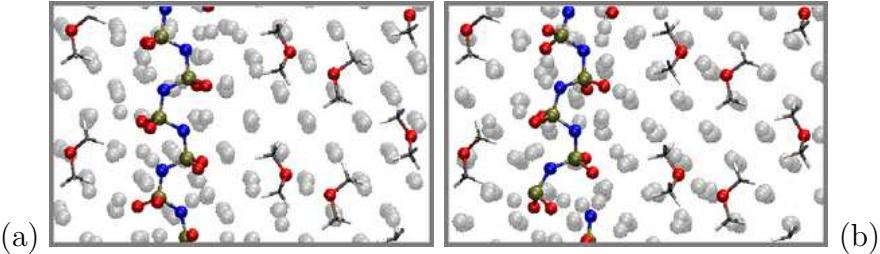
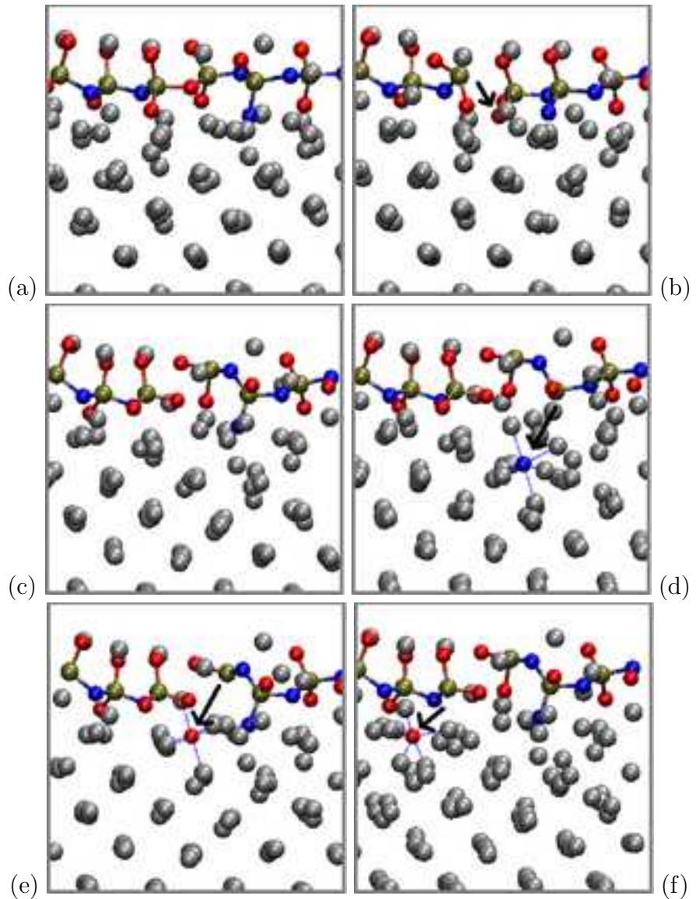
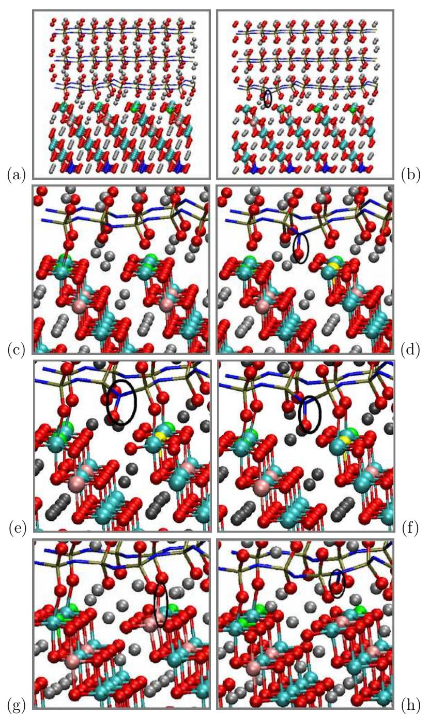
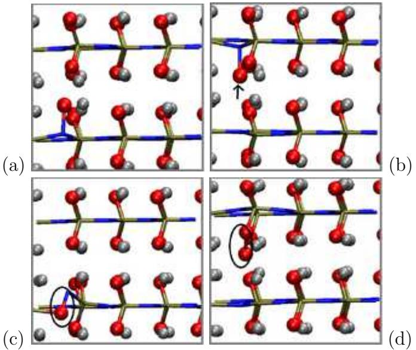
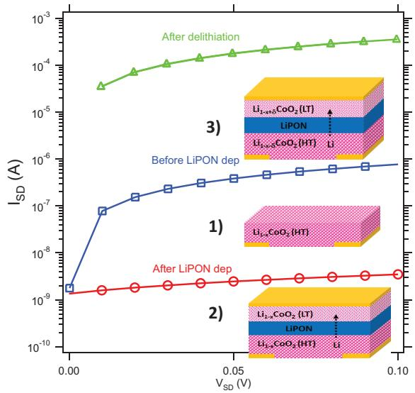
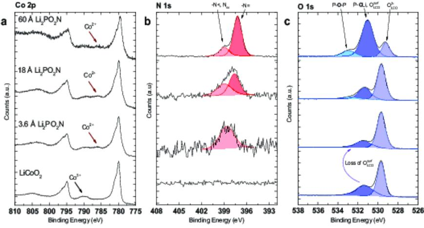

# Kinetics-Controlled Degradation Reactions at Crystalline LiPON/LixCoO2 and Crystalline LiPON/Li-metal Interfaces

Dr. Kevin Leung[a]∗ , Dr. Alexander J. Pearse,[b] Dr. A. Alec Talin,[c] Dr. Elliot J. Fuller,[c] Prof. Gary W. Rubloff,[b] and Dr. Normand A. Modine[a]

June 26, 2018

[a]Sandia National Laboratories, Albuquerque, NM 87185 email: ∗kleung@sandia.gov; fax: 15058445470 [b]Department of Materials Science and Engineering, University of Maryland [c]Sandia National Laboratories, Livermore, CA 94550

#### Abstract

Detailed understanding of solid-solid interface structure-function relations is critical for the improvement and wide deployment of all solid-state batteries. The interfaces between lithium phosphorous oxynitride ("LiPON") solid electrolyte material and lithium metal anode, between LiPON and LixCoO2 cathode surfaces, have been reported to generate solid electrolyte interphase ("SEI")-like products and/or disordered regions. Using electronic structure calculations and crystalline LiPON models with atomic-layer-deposition-like stoichiometry, we predict LiPON models with purely P-N-P backbones are kinetically inert towards lithium at room temperature. In contrast, transfer of oxygen atoms from low-energy LixCoO2 (104) surfaces to LiPON is much faster under ambient conditions. The mechanisms of the primary reaction steps, LiPON motifs that readily react with lithium metal, experimental results on amorphous LiPON to partially corroborate these predictions, and possible mitigation strategies to reduce degradations are discussed. LiPON interfaces are found to be useful case studies for highlighting the importance of kineticscontrolled processes during battery assembly at moderate processing temperatures.

keywords: lithium ion batteries; LiPON; ab initio calculations; solidsolid reactions; interfaces.

# 1 Introduction

The deployment of solid electrolytes in all-solid-state batteries in transportation energy storage applications can effectively address safety concerns associated with current commercial, organic-solvent-based lithium ion batteries. Technical issues remain[1, 2, 3, 4, 5, 6], many of which are associated with buried solid-solid interfaces between electrolytes and electrodes[7]. While cross-sectional transmission electron microscopy (TEM)[8, 9, 10], potential mapping[11, 12], X-ray photoemission spectroscopy[13, 14, 15, 16, 17], and other experimental techniques have provided a wealth of information about such interfaces, so far they lack sufficient resolution to yield atomic lengthscale details – especially in materials without crystalline order.

Electronic structure (e.g., Density Functional Theory, DFT) calculations on model solid-solid interfaces yield insights complementary to measurements[18, 19, 20, 21, 22, 23, 24, 25, 26, 27]. They can further raise novel scientific questions that will attract experimental inquiry. One important topic to address is the charge separation associated with the solid-state electric double layer (EDL) at such interfaces[28]. Electric field associated with the EDL are expected to aid Li+ diffusion during charge and discharge events, but may also accelerate interfacial chemical or electrochemical reactions between electrode and electrolyte to form a "solid electrolyte interphase" (SEI)[29]. Such SEI products have indeed been reported at some all-solid battery interfaces. Liquid electrolytes also take part in interfacial reactions, although in that case the SEI is often formed during the first few charging cycles, while in all-solidstate batteries part of the SEI already emerges during battery assembly[33].

This work focuses on crystalline model of lithium phosphorous oxynitride ("LiPON")[8, 13, 15, 17, 34, 35, 36, 37, 38, 39, 40, 41, 42, 43, 44, 45, 46, 47] solid electrolyte materials in contact with lithium metal (Li(s)) anode and lithium cobalt oxide (LixCoO2) cathode surfaces. LiPON interfaces present interesting case studies. It has been reported that LiPON forms interfacial reaction products when in contact with Li(s)[15] and with LixCoO2[8, 9, 10, 13, 17], especially at elevated temperature, although the batteries continue to function. Heating may even reduce interfacial charge transfer resistance[48]. Therefore modeling of the electrode/electrolyte interfaces, which control the EDL and charge transfer, necessarily requires first addressing the reactions that produce SEI. Here we distinguish SEI products obtained from gaseous precursors during battery fabrication and assembly, before the solid component being grown is fully formed, and SEI products which emerge during cycling[33]. The latter register as increase in SEI after cycling, and are the focus of our modeling work.

We apply DFT calculations to study LiPON interfacial reactions on the low energy Li(001) and LixCoO2 (104) surfaces. While many solid-state batteries feature silicon anodes[37], the top layer of lithiated silicon is typically terminated by Li atoms[49], which minimizes the surface energy. Therefore our work may also be relevant to Si anodes. On the cathode side, our calculations draw on previous modeling work on LixCoO2 bulk crystal[50], its (vacuum) surfaces[50, 51, 52], electron spin distributions,[8, 23] and on LiPON studies using model structures[26, 55, 56, 57, 58]. Related modeling work on Li(Mn,Ni,Co)O2 surfaces are also relevant[53, 54]. Our work also benefits from single phase thermodynamics predictions[59], which describe the stability window outside which LiPON and electrode materials can react. If reactions are not limited by slow kinetics and reach equilibrium, single phase thermodynamics efficiently predict the final, most stable interfacial products. However, unlike crystal growth associated with cathode synthesis routinely conducted at 700-1000oC, the processing temperatures for fabricating interfaces are much lower (150-300oC for oxides, and lower for sulfides). So metastable products may dominate at solid-solid interfaces. Indeed, there is experimental evidence that kinetics- rather than thermodynamics-determined products are formed in some all-solid batteries[8, 60]. Even more obvious examples are the anode SEI in organic liquid electrolytebased batteries. The SEI films there are formed at room temperature; many SEI components are demonstrably metastable and exist only because of complex kinetics constraints[61]. In liquid-electrolyte SEI, single-phase thermodynamics predictions clearly fail; combining kinetics and thermodynamics modeling is crucial to yield insights that can be related to measurements.

Here we apply perspectives from liquid state batteries[62, 63, 61] and examine the activation energies of rate-limiting primary degradation reactions at explicit electrode-electrolyte interfaces. A few subsequent, secondary reactions are also considered; in some cases, they are faster than the first reactions which activate the chain of degradation events. Unlike single-phase thermodynamic calculations[59], this kinetic approach does not predict the final products, which may be the culmination of reactions many steps later. Instead, we examine the temperature and voltage dependence of primary reaction steps, elucidate the mechanisms, and gain insight into what material variations can raise reaction barriers. This will allow mitigation of degradation processes. We predict faster degradation reactions on the cathode than on the anode surface, but some reactions can occur at room temperature at both interfaces.

For experimental work, we perform conductivity measurements on pristine and LiPON-coated LixCoO2 to support the prediction that transfer of chemical species between the LiPON surface layers and LixCoO2 occurs. Finally, X-ray photoelectron spectroscopy (XPS) is used to confirm chemical changes at the cathode/LiPON interface.

There are many challenges associated with the computational approach stated above. LiPON encompasses a family of amorphous materials synthesized with different deposition techniques. Different LiPON materials exhibit variations in chain lengths and stoichiometries, especially in the nitrogen content. We start with a crystalline Li2PO2N model[55] which is close to the stoichiometry obtained in atomic layer deposition (ALD) synthesis[37]. The model has infinitely long chains, exclusively 2-coordinated N atoms, and no P-O-P or P(N)3 motifs, although the latter are minority LiPON features under low temperature growth conditions[13, 14, 38]. We also consider defected LiPON modified from perfect LiPON crystals. We stress that our modeling work is not meant to match any particular set of measurement. Instead, we elucidate interfacial reaction mechanisms and kinetically stable/reactive structural motifs that should be of general interest, and inform interpretations about the reactions of different LiPON realizations.

Atomic structures normally used as starting point of modeling efforts are largely unknown from existing measurements of buried battery interfaces. Registry- and lattice-matching between two solid state components are nontrivial; the need to account for possible addition or removal of Li atoms at battery interfaces adds complexity. As interfaces usually involve spatial heterogeneities, the predicted reaction rates may span a continuum. Therefore multiple reactive sites are examined. The Co charge- and spin-states at the LiPON interface can change with the coordination environment. The reproducibility of the predicted set of LixCoO2 spin states is an issue. The literature mostly focus on either x=0 or x=1 surfaces[50, 51, 52], which exhibit all Co3+ or Co4+, circumventing this issue. We show that the problem must be confronted for slab geometries at intermediate x values. Regarding voltage-dependence[29, 30, 31, 32, 65], reactions at interfaces may or may not vary with applied potential, depending on whether the rate-limiting step involves electron transfer or not; this distinction will be examined. Qualitative comparison between our predictions and experimental results in the literature is presented in the Discussion Section.

# 2 Results: LiPON-Lithium Interfaces

#### 2.1 LiPON slab on Li(s) surface

Reaction between LiPON and lithium metal to form Li3P, Li2O, and LiPN2 are thermodynamically favorable[59], indicating that LiPON is metastable against lithium. It is the reaction rate that needs to be determined.

Figure 1a depicts a simulation cell with model LiPON in a slab geometry. There are 18 LiPON O-atoms in contact with the Li metal. As discussed in the supporting information document (S.I.), one Li atom is inserted beneath each O2− to form an interlayer. Figures 1c-d are expanded view of the reaction region, before and after breaking one P-O bond. In Fig. 1d, after optimizing the atomic configuration, the detached O2− anion becomes buried inside the Li metal, coordinated to 6 Li with O-Li bond lengths of 2.1 ˚A or less. Bader charge analysis[66] is qualitatively consistent with the transfer of two electron from Li metal to the original P5+ to form P3+ with a broken bond. The energy released is significant, with ∆E=-0.63 eV.

At the transition state, the P-O distance is 2.27 ˚A. The reaction barrier ∆E∗ is predicted to be a very substantial 2.15 eV. Using an Arhenius rate expression 1/τ (T)=k exp(−∆G∗ /kBT), approximating the free energy barrier with the zero temperature ∆E∗ , and assuming a kinetic prefactor of k=1012/s, the room temperature reaction time τ (T) associated with breaking a bond with ∆E∗=0.92 eV is about an hour; breaking a bond with ∆E∗ > 1.1 eV takes far beyond battery operational time scales. At T≈690 K, τ (T) shrinks to one hour. However, this is above the lithium metal melting point. Lithium interfaces must be assembled below 500 K. At this temperature, the predicted ∆E∗ is too still high for the reaction to occur within reasonable timescales. The high activation energy associated with P-O bond cleavage is likely the reason Li3PO4 has also been used as coating layers for lithium metal[64], even though Li3PO4 is also thermodynamically unstable against Li metal[27].

We have also attempted to break the other 17 P-O bonds at the inter-

Figure 1: (a): Periodically replicated simulation cell (green boundaries) containing LiPON slab on Li metal. A vacuum region exists. (b): Expanded view with an extra Li atom in LiPON interior region. (c)-(d): Interface region in (a) expanded, before/after P-O bond-breaking, respectively. Silver, red, blue, and dark green represents Li, O, N, and P atoms, respectively. Blue dashed lines depict selected Li-O distances that are less than 2.2 ˚A. Black arrows in some panels indicate the motion of key atoms in bond-breaking reactions.

face. The ∆E predicted depends on the coordination of the released O2−, and ranges from -0.77 eV to -0.30 eV. They average to -0.53±0.03 eV. ∆E∗ calculations are more costly, and are only attempted for two other P-O cleavage events. ∆E ∗=2.16 and 2.30 eV are found to be associated with breaking these other bonds, again indicating that the reaction would be very slow under room conditions.

Attempts to break single P-N bonds in a LiPON chain at the interface and then re-optimize the configuration lead to either reformation of the P-N bond and the original LiPON structure, or a metastable structure with the P and N atoms separated by 2.22 ˚A (not shown) instead of the 1.55-1.59 ˚A P-N bond length in equilibrium LiPON models. The energy of the configuration with a broken bond is a very significant 1.76 eV above that of the intact LiPON slab. While breaking two P-N bonds and depositing the N atom onto the Li metal far from the two P atoms is exothermic, we have not found a pathway with a sufficiently low reaction barrier to justify this mechanism at room temperature. Thus we conclude that neither P-O nor P-N cleavage is kinetically viable at the crystalline LiPON/Li metal interface.

Because the model system is metallic and the simulation cell has a vacuum region, the instantaneous electrochemical potential or voltage Ve of this system can be unambiguously assigned. Ve is the work function Φ divided by |e| and subtracted by 1.37 V[29]. Before breaking the P-O bond, Ve=0.12 V vs. Li+/Li(s) reference. The orbital alignment is depicted in Fig. 2a. Unlike the calculations in Refs. [58, 27], Fig. 2a accounts for explicit LiPON/lithium anode interfaces; although this figure represents thin films, absolute (not relative) orbital energy levels can be obtained.

Ve is sufficiently close to the equilibrium voltage below which Li metal is stable, at 0.0 V vs. Li+/Li(s), that the predicted ∆E and ∆E∗ can be regarded as associated with approximately the equilibrium Li-plating or stripping voltage. If P-O bond breaking in Fig. 1d is a electrochemical reaction, according to the Butler-Volmer equation[68], ∆E∗ is expected to be lowered by 0.12 eV relative to the same reaction at 0.0 V, assuming that the rate-determining step involves two-electron transfer and α = 0.5[68]. This reduction in ∆E ∗ would not change the conclusion that ∆E ∗ remains far too high for P-O or P-N breaking reaction to occur at room temperature. We will show below that, in fact, barriers associated with LiPON reactions on lithium metal do not strongly depend on Ve.

It is also of interest to observe whether long-range electron injection into

defects in the middle of the LiPON solid region can occur. In batteries based on liquid electrolytes, such e − transfer has been widely acknowledged. To this end, we have attempted to break a P-N bond in the LiPON crystal region away from the interface, with one or two Li inserted in the void space around the broken bond, while maintaining charge neutrality. Such a "grand canonical" scheme represents reactions accompanied excess Li migration into LiPON from Li metal. After optimization of the atomic configuration, the P-N bond is reconstituted (Fig. 1b), and Bader charge analysis indicates negligible excess e − residing in the Li inserted. This finding is consistent with the predicted orbital alignment (Fig. 2b). In other words, the inserted Li is a Li+. The total energies of these systems are less favorable than without Li insertion into the LiPON interior region by 1.16 eV after accounting for the Li metal cohesive energy. Note that Ve assicated with Fig. 1d and Fig. 2b is 0.28 V. The slight difference in Ve compared with that in Fig. 1c is due to the change in the surface dipole moment following the insertion. It is an artifact of our finite simulation cell. Although Ve is found to be slightly too high to correspond to the true 0.0 V vs. Li+/Li(s), we can at least conclude that at Ve ∼0.12 to 0.28 V, long range electron transfer into the interior of our LiPON model should not occur.

#### 2.2 LiPON chain or fragment on Li(s) surface

The previous section fails to explain why LiPON decomposes on Li metal surfaces at room temperature[15]. Next we consider the fact that LiPON is not crystalline. It consists of short chains in disordered environments[58]. We attempt to model such regions as a single Li2PO2N chain deposited on Li metal. Fig. 3a is obtained by removing all other periodically replicated chains in Fig. 1a, and re-optimizing the atomic configuration. This lifts structural constraints (e.g., hindrance of local rotation along the P-N-P chain) which stabilize LiPON against bond breaking.

There are 12 P-N bonds in the LiPON backbone in the simulation cell, 6 P-O bonds with O atoms in contact with the metal surface, and another 6 P-O bonds with O atoms pointing outwards (Fig. 3a). Fig. 3b depicts a configuration where one of the first group of P-O bonds is broken. The reaction results in ∆E=-1.15 eV. The products are more exothermic than those obtained by breaking most P-O bonds in the crystalline LiPON slab (Fig. 1b). Our attempt to compute a reaction barrier for this reaction leads

Figure 2: (a)-(b) Kohn-Sham orbitals corresponding to Fig. 1a-b. Black and red spheres correspond to location of orbitals along z-axis (perpendicular to interface) localized on Li metal and LiPON atoms, respectively. Green circles correspond to orbitals on the excess Li added in the LiPON interior region. They lie above the Fermi level and are unoccupied.

to breaking a P-N bond in addition to the initial P-O cleavage event (Fig. 3c), yielding a very exothermic ∆E=-2.41 eV relative to the initial intact LiPON chain. This suggests that breaking P-N bonds in a LiPON chain exhibits lower barriers than breaking P-O, and that P-O cleavage intermediates are unlikely to be the first reaction products.

Next we focus on the twelve P-N bonds. Fig. 3d depicts the optimzed configuration after breaking one of these bonds. ∆E is −2.04 eV. The reaction is highly exothermic, in contrast to the analogous reaction in the slab geometry discussed in the last section. The terminal N-atom generated by the broken bond "burrows" into the Li metal region, becoming coordinated to 4 Li atoms (Fig. 3d). The LiPON chain undergoes significant conformational changes to accommodate this motion. Such motions are hindered in a LiPON crystal environment (Fig. 1a).

However, ∆E∗=1.63 eV is predicted. It is smaller than P-O bond cleavage ∆E∗ described in the last section, but remains too large for a room temperature, one-hour reaction time scale. At the transition state, the P-N distance is 2.21 ˚A. Incidentally, the combination of large negative ∆E and large positive ∆E∗ is not exceptional. This is one of many examples where a large "thermodynamic driving force" is correlated with a slow reaction rate. It shows that ∆E and ∆E∗ are not necessarily correlated, and that reaction barriers must be explicitly computed to understand interfacial reactions.

We have also attempted to break the other eleven P-N bonds, one by one. Two attempts revert back to the intact LiPON chain structure. The other nine yield exothermic reactions. The ∆E of the resulting metastable structures vary from -0.87 eV to -1.32 eV, depending on whether the Natom broken off from the phosphorus is 4- (Fig. 3d), 2- (Fig. 3e), or 3 coordinated (Fig. 3f). They average to ∆E=-1.20 eV±0.10 eV. Given the low barriers associated with Li motion on its metal surfaces, subsequent atomic configuration rearrangement from the less exothermic (∼-0.87 eV) to very exothermic (∼-1.63 eV) metastable product configurations via Li diffusion on the metal surface may occur readily, but this is not the object of our studies. Instead, we focus on the barrier associated with primary P-N bond cleavage reaction, which should be the rate-limiting step. We have computed the reaction barriers of four of the ten P-N cleavage reactions, in addition to the ∆E ∗ associated with ∆E=-1.63 eV. They average to ∆E ∗=1.54±0.15 eV. The barriers are too high to permit room temperature reactions at reasonable timescales.

Experimentally, LiPON is known to be composed of finite chains. In Sec. S3 of the S.I., we consider short LiPON fragments instead of infinite chains. Those calculations suggest that the terminal P-O and P-N groups of LiPON fragments, bonded to four-coordinated P5+ atoms, are about as kinetically stable as interior bonds.

#### 2.3 Effects of Anode Voltage on LiPON chain

The instantaneous electronic Ve for the reactant configuration in Fig. 3a is predicted to be 0.57 V. At this potential, Li metal should dissolve into the electrolyte as Li+, releasing e −. In other words, the calculations associated with Fig. 3 are not at electrochemical equilibrium[29], but reflect a computational overpotential of Φ=0.57 V. To lower the voltage to the equilibrium value of 0 V, we expand the x-lattice constant from 16.41 ˚A to 23.06 ˚A. The simulation cell is created by taking the adsorbed LiPON geometry in Fig. 3a and adding a strip of bare Li (001) slab. Therefore the LiPON adsorption geometry should be unchanged. Next, we add 4 [(CH3)2O]2Li+ units adsorbed on the Li (001) surface away from the LiPON chain (Fig. 4a-b). Ether

Figure 3: Simulation cell with LiPON chain on Li metal. (a): intact; (b): broken P-O bond; (c): attempting to calculate barrier to (b) breaks a P-N bond instead; (d)-(f): broken P-N bond with edge N-atom coordinated to 4, 2, and 3 Li, respectively. For color scheme, see Fig. 1.

Figure 4: (a)-(b) Intact and decomposed LiPON chain on enlarged Li(100) surface simulation cell with 4 [(CH3)2O]2Li+ units which lower the voltage. The LiPON configurations are similar to Fig. 3c-d. For color scheme, see Fig. 1.

((CH3)2O) molecules are chosen because they are kinetically stable against lithium metal and do not decompose during optimization calculations. In the charge-neutral simulation cell, the positive charges of the 4 added, ethercoordinated Li+ induce negative surface charges on the Li metal surface. This results in a surface dipole density that reduces Ve to 0.04 V[29]. On this surface, breaking one of the P-N bonds (Fig. 4b) now yields ∆E=-1.59 eV and ∆E∗=1.61 eV.

Fig. 3d, associated with breaking the same bond at Ve=0.57 V in a smaller simulation cell, have -2.04 eV and 1.63 eV for these values. Despite the decrease of Ve, expected to increase the exothermicity of an electrochemical reaction, ∆E does not become more negative. The smaller |∆E| magnitude for Fig. 4b compared with Fig. 3b may arise from subtle reorientation of the [(CH3)2O]2Li+ units. ∆E ∗ is almost unchanged. This voltage-independence suggests that the rate determining step of the reaction "does not involve" e − transfer from the Li electrode. This conclusion is surprising. Many charge transfer reactions, like water reduction or oxidation on metal surfaces, exhibit ∆E that vary linearly with overpotential Φ. In DFT calculations, the voltage dependence is often added a posteriori to DFT values as (neΦ), where n is the number of electrons transferred per reaction,[67] and e is the electronic charge. Regarding ∆E∗ , the Butler-Volmer equation assumes modification of the reaction barrier by nαΦ, where α is typically 0.5[68].

The fact that neither ∆E nor ∆E∗ becomes more negative with decreasing Φ suggests that the bond-breaking in LiPON on lithium metal is a surface chemical, not electrochemical, reaction. In metal surface catalyzed electrochemical reactions[67], the electrons transferred to the solution induce a delocalized surface charges on the metal electrode. In the reaction between Li(100) and the LiPON chain, we propose that two Li atom on the metal surface turn into discrete Li+, with their e − donated to the LiPON chain and no delocalized positive charge induced on the electrode surface. In this way, the value of Ve associated with Fig. 3 and 4 do not affect the reaction energetics. Note that it is difficult to quantify the charge distribution on lithium metal surfaces. Bader charge decomposition yields ambiguous, non-uniform charge distributions even on pristine Li (100).

#### 2.4 Variations in LiPON Backbone

The above calculations have not yet explained the small amount of SEI formation observed upon depositing Li on pre-formed LiPON[15]. Next we turn to chemical variations along the LiPON chain. LiPON is an amorphous solid with variable chemical compositions[1]. Many experimental papers, as well as some modeling work[57, 58], have shown that some P-O-P linkages exist.

Fig. 5a depicts a P-O-P sequence in the P-N-P chain on Li surface. It is derived by switching an N and an O atom in Fig. 3a. The total energy of this unreacted chain is 1.56 eV higher than of Fig. 3a, which has the same stochiometry. This shows that Holzwarth et al.'s all N-P-N-backbone model is energetically far more favorble, and suggests that P-O-P configurations generated under the fabrication conditions are highly metastable. Fig. 5b represents a configuration where one P-O bond, originally of length 1.65 ˚A, is broken. For this reaction, ∆E=-2.48 eV, and ∆E ∗ is only 0.90 eV. The other P-O bond in the backbone has an equilibrium bond length of 1.77 ˚A. Cleaving this bond yields ∆E=-3.14 eV, and ∆E∗ is only 0.43 eV (Fig. 5c). In both cases, Bader analysis[66] qualitatively indicates that the 3-coordinated P atoms resulting from breaking the bond are in +3 formal charge states. These calculations accomplish our goal of demonstrating the existence of at least one primary reaction that can occur within a one-hour time frame at room temperature.

Fast LiPON reaction with Li metal is also observed in Ref. [27], where the model LiPON backbone contains both P-O-P bonds and N-(P)3 motifs, although the anode voltage is not reported there. We have not attempted inserting Li atoms into the bulk LiPON region, unlike Ref. [27]; this approach may be more directly relevant to Li-vapor deposition experimental conditions reported in XPS measurements[15, 27] rather than electrochemical interfaces which are the focus of our calculations.

Next, we consider possible reactions subsequent to the formation of the structure in Fig. 5c. Fig. 5d depicts the breaking of a P-N bond where N is not part of the backbone. The reaction is endothermic by 0.72 eV, and should not proceed. Fig. 5e depicts the cleavage of an O-atom from 3-coordinated P3+ atom. This step is exothermic by 0.47 eV. The predicted barrier is lower than those associated with breaking other P-O bonds we have reported earlier, but remains a substantial ∆E∗=1.18 eV. This magnitude for ∆E∗ is consistent with a reaction time scale that is still far beyond 1-hour at room temperature. Finally, Fig. 5f depicts breaking a P-O bond on the -N-PO3 terminus. The reaction is exothermic by 0.28 eV, but the barrier (∆E∗=1.74 eV) is again high. This last prediction dovetails with our finding that that 4-coordinated N-PO3 end groups in short LiPON fragments are kinetically inert at room temperature (S.I. Sec. S3).

From these calculations, we conclude that LiPON can react with Li metal in a one-hour time frame at room temperature, by cleaving P-O bonds within metasable P-O-P sequences in the backbone. After the initial bond-breaking, the undercoordinated P3+ atom is slightly more reactive; subsequent P3+-O bond breaking exhibits lower barriers than P+5-O or P+5-N linkages, but the reaction rates associated with such reactions remain low compared to battery operation timescales. Surprisingly, despite the thermodynamic instability of LiPON against lithium[59], LiPON without P-O-P or N(P)3 is kinetically robust on Li surfaces. In contrast, C-O bonds at Li2CO3/Li(s) interfaces exhibit far lower ∆E ∗ , likely due to the fact that the C atoms there are only 3-coordinated and have empty p orbitals.

# 3 Results: LiPON/LixCoO2 (104) Interface

#### 3.1 Explicit Interface

This section focuses on the interface between model LiPON and LixCoO2 (104) (Fig. 6a). The predictions herein are more qualitative, partly because of uncertainties in the voltages associated with the simulation cells.

Small x in LixCoO2 is consistent with high equilibrium voltage, which should increase degradation[9]. In this work, x is set to a fairly large value,

Figure 5: (a) LiPON chain with one P-O-P linkage on Li metal; (b) broken P-O bond along the backbone; (c) a different broken P-O bond along the backbone; (d) breaking a P-N bond in (c); (e)-(f) breaking two different P-O bond in (c). For color scheme, see Fig. 1.

0.83, to facilitate convergence of DFT calculations. (See the Technical section and the S.I., Sec. 1, for details.) The cobalt spin states are also depicted in Fig. 6. Cobalt exhibits low-spin Co3+ and low-spin Co4+ states in the interior of the cathode slab. Half the cobalt at the interface are bonded to LiPON O atoms; they are 6-coordinated low-spin Co3+. In contrast, 5-coordinated cobalt ions on the surfaces are in intermediate-spin Co3+[51, 23] and highspin Co4+ states. There are a total of 63 net up-spin in these simulation cells. Switching to 65 net unpaired electrons changes ∆E∗ by only 0.025 eV.

Fig. 6a-d depict the configurations before and after moving an O atom from the LixCoO2 surface to a LiPON N-atom at the interface. The N-O distances in these configurations are 2.36 ˚A and 1.35 ˚A, respectively. The distance between the reacted N atom and one of the two P-atoms to which it is bonded increases from about 1.65 ˚A to 1.75 ˚A. The 5-coordinated Co4+ on the surface originally bonded to the transferring O2− in Fig. 6c, colored in green, has turned into a 4-coordinated, Co3+ (yellow) in Fig. 6d. It now has four unpaired electrons, reminiscent of 4-coordinated Co3+ on the stoichiometric (110) surface[51]. Another low-spin, 6-coordinated Co4+ in the second oxide layer has become a low-spin Co3+. These changes are consistent with the loss of two e − from the transferring O2− to LCO. In other words, LiPON has been oxidized. As further confirmation, maximally localized Wannier orbital analysis shows that, in the P-(N-O)-P group created, a charge-neutral O atom is transferred, forming a dative covalent bond with the N-atom. In contrast, oxygen atoms on the unreacted cathode surface have -2 formal charges.

∆E and ∆E ∗ for this reaction are +0.29 eV and +1.09 eV, respectively. This indicates that the O-transfer reaction is thermodynamically unfavorable and kinetically slow.

Increasing the cathode voltage should favor oxidation of LiPON. Rigorously speaking, raising the voltage (Ve) requires lowering the cathode Fermi level. This should be accompanied with removal of Li+ and e − pairs in a consistent, grand canonical ensemble manner; Li atoms with vacancy formation energies below |e|Ve should be removed from the simulation cell. As LixCoO2 is a polaronic conductor with no band gap in parts of the phase diagram, the simplest way to model voltage dependence is to add a metallic "current collector"[29]. However, in our case, net spin can accumulate in the metal slab, which would hinder the control of the total spin in LCO. Determining which Li atom(s) to remove in the interfacial region is also a difficult task,

Figure 6: (a)-(b) Original and reacted LiPON slab on LixCoO2 (104) surface. Circle indicates the formation of a N-O bond. (c)-(d) Same as (a)-(b), respectively, in expanded views. (e)-(f) Similar to (d), but with distinct Li+ removed from the reaction zone. (g)-(h) Similar to (c)-(d), but with an extra Li2O unit added to the interface. Low and high spin Co4+ are depicted as pink and green spheres. Low, intermediate, and high spin Co3+ are depicted cyan, blue, and yellow spheres. The rest of the color scheme is as in Fig. 1, but P and N atoms are now depicted as sticks, not spheres. 18

given the disordered configuration there; removal of many distinct interfacial Li atoms have to be attempted. Here we make a local approximation. We remove one Li+ plus an e − from the system, and re-compute ∆E and ∆E∗ . Rigorous voltage determinations[29] are deferred to future work.

Fig. 6e-f are obtained by removing one Li from Fig. 6d. They represent two Li deletion choices, and exhibit three Li in the reaction zone instead of four Li in Fig. 6d. The pre-reaction configurations are similar to Fig. 6a and are not shown; compared with Fig. 6c, they both entail an energy cost of 4.30 eV after accounting or the chemical potential of the Li removed. While not rigorous, this suggests that the "voltage" associated with Li loss is about 4.30 V vs. Li+/Li(s) in both cases before O-transfer, if the Li-content is indeed at equilibrium with the instantaneous Ve. ∆E associated with O transfers from the LCO surface to LiPON are predicted to be +0.11 and +0.10 eV, while ∆E∗ are also almost indistinguishable 0.98 eV and 0.95 eV.

In general, ∆E<0 is required for reactions to go forward. But further lowering the x value further below our current x=0.83 is expected to be consistent with more negative, ultimately favorable ∆E. Section S4 of the S.I. further suggests that the DFT+U method used in this work overestimates ∆E; a more generally accurate functional like PBE0 should reduce ∆E and render the reaction exothermic. Finally, in Sec. S5 of the S.I., we show that a similar O-transfer reaction between this crystalline LiPON model and the LixCoO2 (110) surface is exothermic by 0.36 eV even when using the DFT+U method. Regarding the barrier, ∆E∗ are 0.95 and 0.98 eV in the two panels, consistent with reaction times of roughly one hour at room temperature. Therefore we assert that this set of calculations show that interfacial reactions between the cathode and the electrolyte are viable at room temperature. These predictions are consistent with apparent oxygen loss from LixCoO2 – especially during charging at high temperature[9, 10]. The change in spin polarization predicted at the LiPON/LixCoO2 interface may be measurable. Note that our calculations pertain to high equilibrium voltages, not as-grown conditions.

Section S4 of the S.I. demonstrates that moving an O atom from the bulk (as opposed to the surface) of LCO to LiPON is energetically more unfavorable. This trend is generally observed on cathode oxide surfaces[69]. Hence continuous loss of O atoms from LCO must be mediated by other mechanisms. One possibility is the migration of undercoordinated surface Co from their surface sites, which creates more undercoordinated oxygen at

Figure 7: Li2PO2N bulk crystal simulation cell with eight formula units and one extra O atom bonded to a N-atom in the backbone. (a) and (b) are two topologically equivalent configurations with N-O bonds and have equal energies. The text describes the transfer of the extra O atom between them. (c) O atom inserted between P and N. (d) O atom added to a LiPON O atom.

LCO surfaces.

So far we have focused on flat LixCoO2 (104) surfaces. Other models, in which (104) surfaces are covered with CoOH groups due to reaction with H2O in the atmosphere, have been proposed[70]. Fig. 6g-h explore this possibility by adding a Li2O formula unit at the interface, with the added O2− attached to a formerly 5-coordinated Co ion. Using computational procedures similar to those used above, we find that ∆E=-1.61 eV and ∆E∗=0.10 eV for transferring the newly added O atom from the Co ion to a LiPON nitrogen atom nearby. The reaction proceeds much more readily since there is no need to create an oxygen vacancy on the cathode surface. This calculation strongly suggests that no Co-O bond with O atom sticking out of the surface survives contact with LiPON.

#### 3.2 Excess Oxygen Diffusion Inside LiPON

Next we consider possible subsequent oxygen migration steps. Here we turn to LiPON bulk "crystal" models not in contact with LixCoO2 to represent interior LiPON regions away from the interface. This is done to reduce the computational cost. Fig. 7a depicts a LiPON crystal supercell with eight formula units and one O atom added to one of the LiPON N atoms, like in Fig. 6d. Fig. 7b depicts another optimized configuration where the added O atom has been manually moved to an equivalent position on a neighboring LiPON chain. The two configurations have identical energies. The diffusion barrier between them is a low 0.68 eV. This suggests that O atoms abstracted from LixCoO2 readily diffuse inside LiPON once it is away from the interface, possibly aiding further creation of oxygen vacancies on the cathode surface.

We also explore other locations where an additional O atom can insert into LiPON. Fig. 7c depicts a P-O-N motif which is 0.17 eV more favorable than the P-N-O linkage in Fig. 7a-b. This configuration can be a reaction product or intermediate subsequent to N-O bond formation in Fig. 7a-b. In contrast, O-O bond formation (Fig. 7d) is less favorable than Fig. 7a-b by 0.64 eV. N-O bond formation appears a crucial step in LiPON oxidation by LCO. We predict that that N atoms are the reactive sites at LiPON/cathode interfaces, and propose that a lower N-content at the interface may provide better kinetic LiPON stability against LixCoO2.

While various defects have been considered in LiPON simulations[72], to our knowledge there has been little effort to model or measure the migration of excess oxygen bonded to N-atoms in the LiPON backbone. It is possible that the amorphous arrangements of LiPON chains in experimental samples may impede interchain oxygen transport.

# 4 Results: Conductivity and XPS

This section reports some conductivity and XPS measurements relevant to the LCO/LiPON interface calculations above. Experimental LiPON is amorphous, unlike the crystalline models. However, the local structures responsible for chemical reactions are not expected to depend on LiPON long-range order.

The electronic conductivity of LiCoO2 varies by as much as six orders of

Fig. 8. Current (Isd) as a function of applied voltage (Vsd) in solid-state devices. Blue: bare LiCoO2; red: LiCoO2 after LiPON deposition; green: same device as depicted in red but with an applied bias that delithiates LiCoO2. (1)-(3), in that order, depict currents associated with the sequence of events described in the text.

magnitude depending on Li concentration[73, 74, 75], and can be used as a sensitive probe of lithitation[75]. To experimentally investigate the transfer of Li between LiCoO2 and a LiPON electrolyte, electrochemical transistors were fabricated consisting of a thin film stack of sputtered LiCoO2/LiPON/LiCoO2 layers, with the bottom LiCoO2 acting as a transistor channel and the top LiCoO2 acting as an electrochemical gate. Sputtered LiPON is known to yield amorphous LiPON[76]. The fully fabricated transistor cell consists of 100 nm of high-temperature (HT) LiCoO2, 400 nm of LiPON, 100 nm of low-temperature (LT) LiCoO2. The transistor channel was fabricated using photo lithographically defined Pt electrodes (60 nm) with channel dimensions of 4 µm length and 1700 µm width. Further details of device fabrication process were described previously[75].

The electronic conductivity of the bottom LiCoO2 layer was measured after deposition of each subsequent layer in order to qualitatively understand the Li transfer during sputter fabrication processes.

Figure 8 depicts the current vs. voltage characteristics of the transistor source drain terminals with an illustration of the various layers at the time of measurement. The current is measured parallel to the LiCoO2 surface and/or the LiCoO2/LiPON interface. Initially (1), there is no external bias normal to the surface. At the same applied voltage parallel to the interface, the current is much higher before LiPON deposition (1) than after (2), indicating that the resistivity has gone up significantly. This is consistent with the transfer of Li (i.e., Li+ and e −.) from LiPON to LiCoO2. The latter may be slightly Li-defective when first synthesized. Lithiation of LixCoO2 at x∼1 is known to increase its resistivity. This point is confirmed by applying an external bias perpendicular to the LiCoO2/LiPON interface, which removes Li from LiCoO2 to the electrochemical gate on the other side of the LiPON film (3). The magnitude of the current (green line) goes back up, to a value above that obtained before LiPON deposition.

The results depicted in Fig. 8 are consistent with removal of Li+ and e − from LiPON. By themselves they do not yield evidence of oxygen migration from LiCoO2 to LiPON. But LiPON oxidation is most readily accomplished by oxidizating either O- or N anions. Li+ and P5+ atoms cannot be further oxidized. Adding O to LiPON would be consistent with our predictions in the last section. Note that the excess Li in LiCoO2 could also be the cause of the disorder observed in Refs. [8, 9, 10]. One possible secondary reaction after the oxygen transfer is a charge-neutral NO molecule release from P-

Fig. 9. XPS spectra for various thicknesses of LiPON films deposited on LiCoO2. (a) Co region; (b) N; (c) O.

(NO)-P created in the first step, with the LiPON surface losing an e − and a Li+ to LixCoO2 in the processs. This suggestion from our experimental collaboration will be considered in future computational work.

We have also performed XPS measurements on LiPON deposited on LiCoO2 using the atomic layer deposition (ALD) method, prior to cycling. Our previous studies have shown that this method yields amorphous LiPON in the tested temperature range, as indicated by the lack of identifiable peaks in X-ray diffraction[37]. The results are depicted in Fig. 9. It shows the Co 2p, O 1s, and N 1s spectra of 0, 6, 30, and 100 cycles of ALD Li2PO2N grown at T=250oC, resulting in nominally 0, 3.6, 18, and 60 ˚A of coverage over LCO, respectively. The deposition process immediately produces a satellite feature in the Co 2p spectrum consistent with reduction of surface states to Co2+. The O 1s spectrum shows a loss in what is often considered "surface" or "undercoordinated" O feature in LixCoO2, though this is not a strong definition. It could be consistent with loss of these oxygen atoms to the ALD precursors/Li2PO2N layer, as the N 1s spectrum clearly shows that the N atoms closest to the interface are all in a more highly oxidized state than in the "bulk" Li2PO2N. This is similar to what other groups have

seen with other methods of growing LiPON[13, 17]. The N-O bond formation predicted in Fig. 6 is consistent with oxidized nitrogen. There is a clear signature of P-O-P sequence in the O spectra. This feature is reflected in our anode model depicted in Fig. 5.

Note that some of these features, especially Co2+, are at least partially produced by vacuum annealing of LCO at 250oC. Co2+ is not seen in our calculations because the partial delithiation in our DFT models should yield Co3+ and Co4+. We also stress that the samples and devices analyzed in Fig. 9 are distinct from those described in Fig. 8.

# 5 Discussions: Comparison with Experimental Literature

Our interfacial simulations focus on initial reaction barriers in crystalline models. They are not meant to predict final chemical speciations. Hence comparisons with structural measurements require some extrapolation – especially since experimental LiPON is amorphous. The previous section has revealed qualitative agreement between our predictions and measurements. This section focuses on comparison with published experimental work.

As stated in the Introduction, all-solid-state batteries with Li metal anode, LiCoO2 cathode, and LiPON electrolytes have been shown to cycle well if the LiPON film is sufficiently thick, especially at room temperature[5, 37, 9, 10]. At the same time, some degradation products and/or disordered regions are reported at both cathode[9, 10, 13, 17] and anode[15, 27] interfaces. While the specific LiPON structure or composition used in experiments may not coincide with our models or even with each other, our predictions can help interpret these results.

At the anode interface, we predict that only P-O-P sequences can readily break at room conditions. This mechanism is also proposed in Ref. [15]; see in particular Fig. 4 there. Most other bond-breaking barriers, e.g., those involving P-N cleavage, are predicted to exceed ∆E∗=1.5 eV. This suggests that temperatures of >450 K, which approach the Li melting point, are needed to make these P-N-P/Li(s) reactions fast enough to occur at room temperature. This finding is consistent with the survival of LiPON XPS signals seen in vapor deposition of Li on LiPON[15]. The ratio between triply- and doubly-coordinated N atom in amorphous LiPON significanty decreases upon deposition Li,[15] consistent with the hypothesis that triplycoordinated N, which does not exist in our model, is far more reactive than doubly-coordinated N. To the best of our knowledge, the Li/LiPON interface has not been reported as a major source of degradation in all-solid-state batteries. Our predictions are also consistent with the kinetic stability observed in Pt/LiPON/Li devices, which are stable for months with little change in conductivity[37], although some SEI products from ALD-deposited LiPON likely also help passivation.

At the cathode surface, a 10 ˚A thick NO− 2 and/or NO− 3 layer has been estimated from XPS measurements[13, 17]. The formation of N-O bonds is consistent with the first step reaction mechanism predicted in our calculations (Fig. 6).

More recently, disordered LiCoO2 regions in contact with LiPON have been reported in STEM studies[9, 10]. The disordered layer can be hundreds of nanometer thick at room temperature prior to cycling. Its thickness increases with charge/discharge and especially with temperature. However, the all-solid battery retains its capacity after 250 cycles[9]. The LiPON region does not exhibit significant changes, possibly because LiPON is already amorphous. Co3O4 and Li2O2 are identified in the disordered LixCoO2 region by STEM and electron energy loss spectroscopy[9, 10]. These measurements suggest the presence of Co2+ at the interface and imply loss of oxygen from LixCoO2. Oxygen transfer from LiCoO2 to LiPON are proposed to occur already at the as-grown, uncycled LiCoO2/LiPON interface in these experimental works. Peroxides species are also reported at these interfaces[8]. Recall that our XPS measurements (Fig. 9) also indictate the presence of Co2+.

Our calculations focus on charged LixCoO2, x = 0.83, which only contains Co3+ and Co4+ ions. No Co2+ is expected at this x value. We predict loss of oxygen from LixCoO2. Upon transfer of an O-atom to LiPON, two Co4+ turn into Co3+. The oxygen vacancies formed may be consistent with a disordered LixCoO2 region[8]. Our calculations focus on the initial stages of reaction, and provide no information about the thickness of the reacted cathode layer. We have not observed peroxide formation. Peroxide-like structures have been predicted in oxygen-depleted Li2MnO3[71]. In our simulation cells, however, N-O bond formation is found to be more favorable than O-O.

# 6 Conclusions

In conclusion, we have applied electronic structure DFT calculations to study interfacial degradation reactions between model crystalline LiPON and the surfaces of two electrodes: Li metal and LixCoO2. Some experimental corroboration is also provided; this assumes that interfacial reactions on amorphous and crystalline LiPON models are similar. The predictions are relevant to the interfacial film ("solid electrolyte interphase" or "SEI") products formed during cycling of all-solid-state batteries using LiPON solid electrolytes. LiPON proves to be an interesting case study. Single phase thermodynamics calculations predict instabilities at both interfaces, which do not distinguish the extent of reactions formed in the two cases. In this work, we instead focus on models with explicit interfaces and calculate the reaction activation energies. Multiple reaction sites and bond-breaking events are considered. The predictions suggest that most initial reactions on the anode surface are slow for LiPON with P-N-P backbone and ALD-like stoichiometry,[37] while cathode interfacial reactions can occur within battery cycling timescales.

On lithium (001) surfaces, ordered LiPON chains with P-N-P backbones, P-O side groups, and 2-coordinated N atoms are found to exhibit P-N and P-O cleavage barriers in excess of 1.4 eV, which correspond to reactant half lives far in excess of battery operation timescales. In contrast, P-O-P sequences, much less energetically favorable but known to exist in LiPON, are found to exhibit faster bond-breaking reactions. However, subsequent reactions again exhibit barriers exceeding 1 eV and are slow. The electrode potential does not strongly affect the exothermicity or the reaction barrier. From these calculations, some SEI products are expected at this interface, but extensive degradation is not expected at room temperature. This is consistent with experimental data showing that some 2-coordinated N persists after lithium vapor deposition.[15] Our model thus helps pinpoint less reactive LiPON motifs. This is consistent with experimental data. Our predicted reaction rates are much lower than those in models with both N(P)3 and P-O-P groups.[27]

At LiPON/LixCoO2 (104) interfaces, cobalt ions can exhibit five different spin/charge states, which makes reproducible calculations of Kohn-Sham wavefunctions difficult. We believe this is a general phenomenon associated with LixCoO2 surfaces, and propose that extra care should be taken in future modeling of interfacial spin states associated with this material. By working close to x=1, and propagating wavefunctions quasi-continuously from product to reactant, estimates for reaction barriers are obtained. We find that even the surfaces of chemically ordered, crystalline LiPON slabs are oxidized by LixCoO2 within battery cycling (one-hour) timescale at room temperature. The LiPON N-atom abstracts a O atom from the oxide surface in the process. O-atoms added to crystalline LiPON interior are mobile, potentially creating pathways for further degradation of LixCoO2 as battery cycling continues. We propose that interfaces with less nitrogen content may yield less degradation on cathodes.

This work emphasizes kinetics, not thermodynamics, at solid-solid interfaces. Under processing (∼200 oC) and cycling (room temperature) conditions, electrode-electrolyte interfaces may not be at thermodynamic equilibrium, and metastable starting materials and/or intermediate products may persist. In addition to shedding light on reaction kinetics, our calculations elucidate the low-barrier initial bond-breaking steps involved in degradation reactions. This will facilitate future design of solid state materials and interfaces more resilient to degradation.

# 7 Technical Section

DFT calculations are conducted using the Vienna Atomic Simulation Package (VASP) version 5.3[77, 78, 79] and the PBE functional[80]. Modeling LixCoO2 with x ∼1 requires spin-polarized DFT+U augmented treatment[81] of Co 3d orbitals. The U and J values depend on the orbital projection scheme and DFT+U implementation details; here U −J =3.30 eV is adopted in accordance with the literature[50]. In Sec. S4 of the S.I., the more computationally costly PBE0 functional[82], which is generally more accurate, is used for spot-checks.

We adopt one of the crystalline LiPON (Li2PO2N "s2") crystal structures created by the Holzwarth group[55]. This model consists of parallel zig-zag LiPON chains, and is chosen because the lattice dimensions, re-optimized using the PBE functional, best match the Li (001) supercell size.

Our interfacial model systems are charge-neutral asymmetric slabs. The details of representative simulation cells are listed in Table 1. The standard dipole correction is applied to negate image interactions in the periodically replicated, charge-neutral anode-side simulation cells[83]. This correction is

| system       | dimensions            | stoichiometry       | k-sampling | Figure   |
|--------------|-----------------------|---------------------|------------|----------|
| Li(s)/LiPONc | 14.28×16.41×28.00     | Li172P6O12N6        | 2×2×1      | Fig. 3a  |
| Li(s)/LiPONf | 14.28×23.06×28.00     | Li236P6O12N6        | 2×1×1      | Fig. S1a |
| Li(s)/LiPONs | 14.28×16.41×40.00     | Li274P54O108N54     | 2×2×1      | Fig. 1a  |
| LCO/LiPONs   | 11.41×23.62×36.00     | Li195Co96O312P60N60 | 2×1×1      | Fig. 6a  |
| LiPON        | 10.94×9.26×9.52       | Li32P16O32N16       | 2×2×2      | Fig. 7a  |
| LixCoO2−δ    | 8.53×8.53×14.18 (hex) | Li25P27O53          | 2×2×1      | NA       |

Table 1: Computational details of representative simulation cells. LiPONs, LiPONc, and LiPONf refer to a LiPON slab, a single chain, and a fragment respectively. Typically the configurations are first optimized using Γ-point sampling and then re-optimized using the listed k-point grid.

found to be O(1) meV on the cathode side, and is omitted therein.

Reaction barriers are computed using the climbing-image nudged elastic band (cNEB) method[84]. The barriers associated with LiPON P-N bond cleavage on lithium surfaces are non-trivial to compute because cNEB can mistake (P-O)-Li+ dissociation with true bond-breaking events. When the cNEB approach yields a configuration close to the barrier top, we typically switch to quasi-Newton algorithm optimization of that single configuration until the maximal force on each atom is less than 0.07 eV/˚A. When LixCoO2 slabs are present in the simulation cell, we have propagated wavefunctions quasi-continuously from product to reactant. More details on computational and experimental methods are found in Sec. S1 of the S.I.

Lithium is a metallic conductor and its Fermi level (EF) is well defined. Work functions are computed as differences between EF and vacuum levels. The work function minus 1.37 V is the instantaneous electronic voltage (Ve) relative to Li+/Li(s). We distinguish Ve from the equilibrium or ionic voltage, which is function of the lithium chemical potential referenced to lithium metal cohesive energy[29]. There is no reason to expect that DFT interfacial models are automatically at electrochemical equilibrium, in the sense that the two definitions are equal. As discussed in the text, such models are more likely to be at overpotential conditions unless care is taken.

The charge states of Co ions are determined by cross-referencing maximally localized Wannier function analysis[85] and approximate local spin polarzations sz predicted by the VASP code. |sz|≈0.0, 1.0, 2.0, 2.2, and 2.8 are assigned to low-spin Co3+, low-spin Co4+, intermediate-spin Co3+, high spin Co4+, and high-spin Co3+, respectively. Note that the VASP code requires that Wannier calculations be conducted using Γ-point Brillouin zone sampling.

# Acknowledgement

We thank Yue Qi for useful discussions. This work was performed, in part, at the Center for Integrated Nanotechnologies, an Office of Science User Facility operated for the U.S. Department of Energy (DOE) Office of Science. It was supported by Nanostructures for Electrical Energy Storage (NEES), an Energy Frontier Research Center funded by the U.S. Department of Energy, Office of Science, Office of Basic Energy Sciences under Award Number DESC0001160. Sandia National Laboratories is a multimission laboratory managed and operated by National Technology and Engineering Solutions of Sandia, LLC, a wholly owned subsidiary of Honeywell International, Inc., for the U.S. Department of Energys National Nuclear Security Administration under contract DE-NA0003525.

# References

- [1] K. Kerman, A. Luntz, V. Viswanathan, Y.-M. Chiang, Z. Chen, J. Electrochem. Soc. 2017, 164, A1731.
- [2] A. Mauger, M. Armand, C.M. Julien, K. Zaghib, J. Power Sources 2017, 353, 333.
- [3] Y. Ren, K. Chen, R. Chen, T. Liu, Y. Zhang, C.-W. Nan, J. Am. Ceram. Soc. 2015, 98, 3603.
- [4] C. Sun, J. Liu, Y. Gong, D.P. Wilkinson, J. Zhang, Nano Energy, 2017, 33, 363.
- [5] J.B. Bates, N.J. Dudney, B. Neudecker, A. Ueda, C.D. Evans, Solid State Ionics, 2000, 135, 33.
- [6] J.B. Bates, N.J. Dudney, G.R. Gruzalski, R.A. Zuhr, A. Choudhury, C.F. Luck, J.D. Robertson, J. Power Sources 1993, 43, 103.
- [7] A.C. Luntz, J. Voss, K. Reuter, J. Phys. Chem. Lett. 2015, 6, 4599.
- [8] Z. Wang, D. Santhanagopalan, W. Zhang, F. Wang, H.L. Xin, K. He, J. Li, N.J. Dudney, Y.S. Meng, Nano Lett. 2016, 16, 3760.
- [9] Z.Y. Wang, J.Z. Lee, H.L.L. Xin, L.L. Han, N. Grillon, D. Guy-Bouyssou, E. Bouyssou, M. Proust, Y.S. Meng, J. Power Sources 2016, 324, 342.
- [10] D. Santhanagopalan, D. Qian, T. McGilvray, Z. Wang, F. Wang, F. Camino, J. Graetz, N.J. Dudney, Y.S. Meng, J. Phys. Chem. Lett. 2014, 5, 298.
- [11] Y. Aizawa, K. Yamamoto, T. Sato, H. Murata, R. Yoshida, C.A.J. Fisher, T. Kato, Y. Iriyama, T. Hirayama, Ultramicroscopy, 2017, 178, 20.
- [12] K. Yamamoto, Y. Iriyama, T. Asaka, T. Hirayama, H. Fujita, C.A.J. Fisher, K. Nonaka, Y. Sugita, Z. Ogumi, Angew. Chem. Int. Ed. 2010, 49, 4414.
- [13] S. Jacke, J. Song, G. Cherkashinin, L. Dimesso, W. Jaegermann, Ionics 2010, 16, 769.
- [14] S. Jacke, J. Song, L. Dimesso, J. Br¨otz, D. Becker, W. Jaegermann, J. Power Sources 2011, 196, 6911.
- [15] A. Schw¨obel, R. Hausbrand, W. Jaegermann, Solid State Ionics 2015, 273, 51.
- [16] R. Hausbrand, G. Cherkashinin, H. Ehrenberg, M. Gr¨oting, K. Albe, C. Hess, W. Jaegermann, Mater. Sci. Engr. B 2015, 192, 3.
- [17] M. Fingerle, R. Buchheit, S. Sicolo, K. Albe, R. Hausbrand. Chem. Mater. 2017, 29, 7675.
- [18] J. Haruyama, K. Sodeyama, Y. Tateyama, ACS Appl. Mater. Interfaces 2017, 9, 286.
- [19] J. Haruyama, K. Sodeyama, L. Han, K Takada, Y. Tateyama, Chem. Mater. 2014, 26, 4248.
- [20] N.D. Lepley, N.A.W. Holzwarth, Phys. Rev. B 2015, 92, 214201.
- [21] N.D. Lepley, N.A.W. Holzwarth, Y.A. Du, Phys. Rev. B 2013, 88, 104103.
- [22] K.C. Santosh, K. Xiong, R.C. Longo, K. Cho, J. Power Sources 2013, 244, 136.
- [23] M. Sumita, T. Ohno, Phys. Chem. Chem. Phys. 2016, 18, 4316.
- [24] M. Sumita, Y. Tanaka, M. Ikeda, T. Ohno, J. Phys. Chem. C 2015, 119, 14.
- [25] S.S. Chandrasekaran, P. Murugan, Appl. Sur. Sci. 2017, 418, 17.
- [26] K. Thai, E. Lee, J. Electrochem. Soc. 2017, 164, A594.
- [27] S. Sicolo, M. Fingerle, R. Hausbrand, K. Albe, J. Power Sources 2017, 354, 124
- [28] J. Song, S. Jacke, G. Cherkashinin, S. Schmid, Q. Dong, R. Hausbrand, W. Jaegermann, Electrochem. Solid State Lett. 2011, 14, A189.
- [29] K. Leung, A. Leenheer, J. Phys. Chem. C 2015, 119, 10234.
- [30] K. Letchworth-Weaver, T.A. Arias, Phys. Rev. B 2012, 86, 075140.
- [31] C.D. Taylor, S.A. Wasileski, J.-S. Filhol, M. Neurock, Phys. Rev. B 2006, 73, 165402.
- [32] M. Nielsen, M. Bjorketun, M.H. Hansen, J. Rossmeisl, 2015, 631, 2.
- [33] Operationally, assembling interfaces often involves atomic layer deposition, plasma laser deposition, and other technique to deposit LiPON or other solid electrolytes on to electrode surfaces. These techniques do not correspond to pressing the flat surfaces of two pre-formed materials together. Intermixing of electrolye and electrode components at the interface may occur naturally during growth; therefore the SEI interlayers may result from gas phase reactions in addition to degradation of fullyformed LiPON. What is needed to address such growth conditions is a comprehensive science of rocessing conditions.
- [34] C.F. Lin, M. Noked, A.C. Kozen, C.Y. Liu, O. Zhao, K. Gregorczyk, L.B. Hu, S.B. Lee, G.W. Rubloff, ACS Nano, 2016, 10, 2693.
- [35] C. Gong, D. Ruzmetov, A. Pearse, D. Ma, J.N. Munday, G. Rubloff, A.A. Talin, M.S. Leite, ACS Appl. Mater. Interfaces 2015, 7, 26007.
- [36] V.P. Oleshko, T. Lam, D. Ruzmetov, P. Haney, H.J. Lezec, A.V. Davydov, S. Krylyuk, J. Cumings, A.A. Talin, Nanoscale, 2014, 6, 11756.
- [37] A.J. Pearse, T.E. Schmitt, E.J. Fuller, F. El-Gabaly, C.-F. Lin, K. Gerasopoulos, A.C. Kozen, A.A. Talin, G.W. Rubloff, K.E. Gregorczyk, Chem. Mater. 2017, 29, 3740.
- [38] A.C. Kozen, A.J. Pearse, C.-F. Lin, M. Noked, G.W. Rubloff, Chem. Mater., 2015, 27, 5324.
- [39] D. Li, Z. Ma, J. Xu, Y. Li, K. Xie, Mater. Lett. 2014, 134, 237.
- [40] Y. Yoon, C. Park, J. Kim, D. Shin, Electrochim. Acta 2013, 111, 144.
- [41] Y. Kim, G.M. Veith, J. Nanda, R.R. Unocic, M. Chi, N.J. Dudney, Electrochim. Acta 2011, 56, 6573.
- [42] C.S. Nimisha, G.M. Rao, N. Munichandraiah, G. Natarajan, D.C. Cameron, Solid State Ionics 2011, 185, 47.
- [43] Q. Zhang, A.K. Kercher, G.M. Veith, V. Sarbada, A.B. Brady, J. Li, E.A. Stach, R. Hull, K.J. Takeuchi, E.S. Takeuchi, N.J. Dudney, A.C. Marschilok, J. Electrochem. Soc. 2017, 164, A1503.
- [44] P.D. Mani, S. Saraf, V. Singh, M. Real-Robert, A. Vijayakumar, S.J. Duranceau, S. Seal, K.R. Coffey, Solid State Ionics 2016, 287, 48.
- [45] H. Porthault, C. Decaux, Electrochim. Acta 2016, 194, 330.
- [46] S. Tintignac, R. Baddour-Hadjean, J.P. Pereira-Ramos, R. Salot, Electrochim. Acta 2014, 146, 472.
- [47] S. Wenzel, T. Leichtweiss, D. Kr¨uger, J. Sann, J. Janek, Solid State Ionics 2015, 278, 98.
- [48] Y. Iriyama, T. Kako, C. Yada, T. Abe, Z. Ogumi, Solid State Ionics, 2005, 176, 2371
- [49] K. Leung, S.B. Rempe, M.E. Foster, Y. Ma, J.M. Martinez de Hoz, N. Sai, P.B. Balbuena, J. Electrochem. Soc., 2014, 161, A213
- [50] D. Kramer, G. Ceder, Chem. Mater. 2009, 21, 3799.
- [51] D. Qian, Y. Hinuma, H. Chen, L.-S. Du, K.J. Carroll, G. Ceder, C.P. Grey, Y.S. Meng, J. Am. Chem. Soc. 2012, 134, 6096
- [52] L. Giordano, P. Karayaylali, Y. Yu, Y. Katayama, F. Maglia, S. Lux, Y. Shao-Horn. J. Chem. Phys. Lett. 2017, 8, 3811
- [53] S. Xu, G. Luo, R. Jacobs, S. Fang, M.K. Mahanthappa, R.J. Hamers, D. Morgan, ACS Appl. Mater. Interfaces 2017, 9, 20545.
- [54] J.C. Garcia, J. Bareno, J. Yan, G. Chen, A. Hauser, J.R. Croy, H. Iddir. J. Phys. Chem. C 2017, 121, 8290.
- [55] Y.A. Du, N.A.W. Holzwarth, Phys. Rev. B 2010, 81, 184106.
- [56] K. Senevirathne, C.S. Day, M.D. Gross, A. Lachgar, N.A.W. Holzwarth, Solid State Ionics 2013, 233, 95.
- [57] E. Guille, G. Vallverdu, I. Baraille, J. Chem. Phys. 2014, 141, 244703.
- [58] S. Sicolo, K. Albe, J. Power Sources 2016, 331, 382.
- [59] Y. Zhu, X. He, Y. Mo. ACS Appl. Mater. Interface, 2015, 7, 23685.
- [60] L. Sang, R.T. Haasch, A.A. Gewirth, R.G. Nuzzo, Chem. Mater. 2017, 29, 3029.
- [61] K. Leung, F. Soto, K. Hankins, P.B. Balbuena, K.L. Harrison, J. Phys. Chem. C 2016, 120, 6302.
- [62] K. Leung, J. Phys. Chem. C 2012, 116, 9852.
- [63] K. Leung, Chem. Mater. 2017, 29, 2550.
- [64] L. Wang, Q. Wang, W. Jia, S. Chen, P. Gao, J. Li, J. Power Sources 2017, 342, 175.
- [65] Y. Li, K. Leung, Y. Qi, Acc. Chem. Res. 2016, 49, 2363.
- [66] G. Henkelman, A. Arnaldsson, H. J´onsson, Comput. Mater. Sci. 2006, 36, 354.
- [67] K. Chan, J.K. Norskov, J. Phys. Chem. Lett. 2015, 6, 2663.
- [68] J.O'M. Bockris, A.K.N.Reddy, M. Gamboa-Aldeco, Modern Electrochemistry 2A. Fundamentals of Electrodics. 2000, 2nd Ed., Kluwer Academic/Plenum Publishers, p.1083.
- [69] Y. Shin and K.A. Persson, ACS Appl. Mater. Interfaces 2016, 8, 25595.
- [70] J.L. Tebbe, T.F. Fuerst, C.B. Musgrave, Appl. Mater. Interface 2016, 8, 26664.
- [71] A. Marusczyk, J.M. Albina, T. Hammerschmidt, R. Drautz, T. Eckl, G. Henkelman, J. Mater. Chem A 2017, 5, 15183.
- [72] Y.A. Du, N.A.W. Holzwarth, Phys. Rev. B 2008, 78, 174301.
- [73] M. M´en´etrier, I. Saadoune, S. Levasseur, C. Delmas, J. Mater. Chem. 1999, 9, 1135.
- [74] A. Milewska, K. Swierczek, J. Tobola, F. Boudoire, Y. Hu, D.K. Bora, B.S. Mun, A. Braun, J. Molenda, Solid State Ionics 2014, 263, 110.
- [75] E.J. Fuller, F. El Gabaly, F. Leonard, S. Agarwal, S.J. Plimpton, R.B. Jacobs-Gedrim, C.D. James, M.J. Marinella, A.A. Talin, Adv. Mater. 2017, 29, 1604310.
- [76] J.B. Bates, N.J. Dudney, G.R. Gruzalski, R.A. Zuhr, A. Choudhury, C.F. Luck, J. Power Sourcecs 1993, 43-44, 103.
- [77] G. Kresse, J. Furthm¨uller, Phys. Rev. B 1996, 54, 11169.
- [78] G. Kresse, J. Joubert, Phys. Rev. B 1999, 59, 1758.
- [79] J. Paier, M. Marsman, G. Kresse, J. Chem. Phys. 2007, 127, 024103.
- [80] J.P. Perdew, K. Burke, M. Ernzerhof, Phys. Rev. Lett. 1996, 77, 3865.
- [81] S.L. Dudarev, G.A. Botton, S.Y. Savrasov, C.J. Humphreys, A.P. Sutton, Phys. Rev. B 1998, 57, 1505.
- [82] C. Adamo, V. Barone, J. Chem. Phys. 1999, 110, 6158.
- [83] J. Neugebauer, M. Scheffler, Phys. Rev. B 1992, 46, 16067.
- [84] G. Henkelman, B.P. Uberuaga, H. Jonsson, J. Chem. Phys. 2000, 113, 9901.
- [85] N. Marzari, D. Vanderbilt, Phys. Rev. B, 1997, 56, 12847.