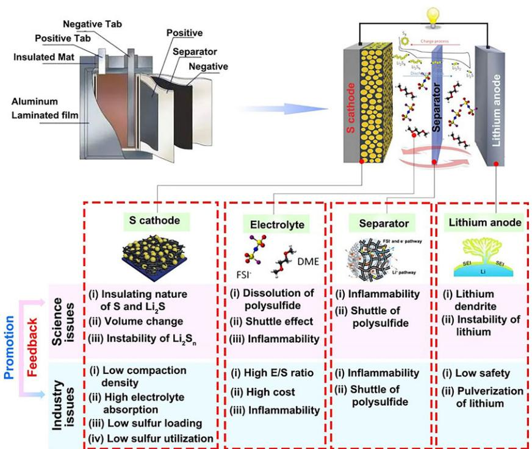
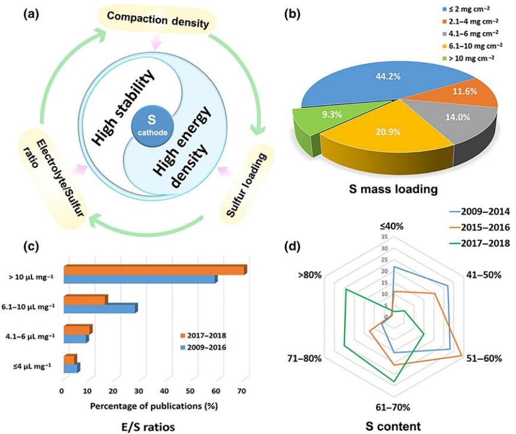
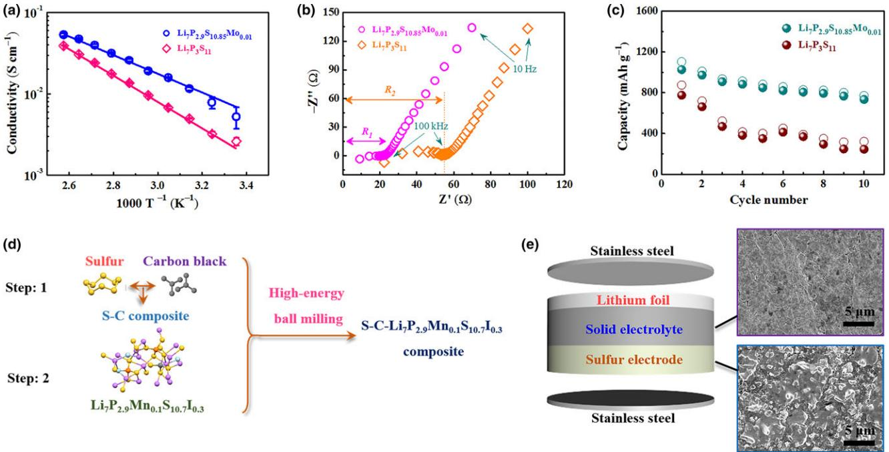
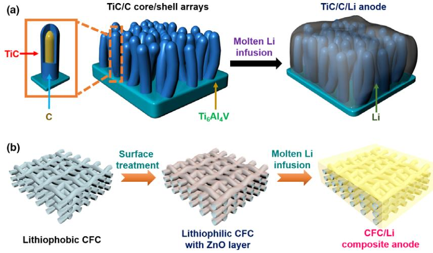

Lithium-Sulfur Batteries

# Revisiting Scientific Issues for Industrial Applications of Lithium–Sulfur Batteries

Bo Liu, Ruyi Fang, Dong Xie, Wenkui Zhang, Hui Huang, Yang Xia\* , Xiuli Wang, Xinhui Xia[\\*](http://orcid.org/0000-0002-5976-5337) , and Jiangping Tu\*

Inspired by high theoretical energy density (~2600 W h kg1 ) and costeffectiveness of sulfur cathode, lithium–sulfur batteries are receiving great attention and considered as one of the most promising next-generation highenergy-density batteries. However, over the past decades, the energy density and reliable safety levels as well as the commercial progress of lithium–sulfur batteries are still far from satisfactory due to the disconnection and huge gap between fundamental research and practical application. Therefore, it is highly necessary to revisit the scientific issues for the industrial applications of lithium–sulfur batteries. In this review, we focus on discussing the impact of design parameters (such as compaction density, sulfur loading, and electrolyte/sulfur ratio) on the electrochemical performance of lithium–sulfur batteries and corresponding inherent relationship and rules between them. We also propose the practical design rules of advanced sulfur electrodes. Moreover, safety hazard in respect of electrolyte, separator, and lithium metal anode is also illustrated in detail. With the target of paving the way for practical application of lithium–sulfur batteries, feasible solutions and strategies are brought up to address the aforementioned problems. Finally, we will discuss the current challenges and future research chance of lithium– sulfur batteries.

# 1. Introduction

In response to the vast consumption of fossil fuel and consequent environmental pollution, world powers are racing to develop green highefficiency electrochemical energy storage technologies such as batteries

B. Liu and R. Y. Fang contributed equally to this work.

DOI: 10.1002/eem2.12021

and supercapacitors.[1–6] Since the 1990s, the advent of lithium-ion batteries (LIBs) has greatly changed the landscape of green energy due to their high working voltage, low maintenance cost, and large energy density.[7,8] Just as expected, they quickly conquered the market and gained worldwide popularity. After the rapid development on the energy density from 90 to 250 W h kg1 , the LIBs hit the bottleneck and cannot meet the growing demand of large-volume transportation area such as electric vehicles and hybrid electric vehicles, which require more powerful and cheaper batteries to drive further and faster.[9–12] It is known that current LIBs are based on a typical "rocking chair" mechanism, which involves intercalation of lithium ion into certain specific sites of layerstructured electrode materials (e.g., LiCoO2(cathode)|separator|graphite(anode) system). Unfortunately, the energy density of the above routine LIBs is lower than 200 W h kg1 , and their application potential is digging out.[10–14] Therefore, exploring new battery systems with higher energy densities is highly urgent and desirable.

In such a context, lithium–sulfur batteries (LSBs) emerge and are being intensively studied owing to low cost and much higher energy density (~2600 W h kg1 ) than their predecessors.[12–15] Apart from the highcapacity sulfur cathode (1675 mA h g1 ), another unique advantage of LSBs is to adopt high-energy Li metal anode with a large capacity of 3860 mA h g1 . In other words, both high-energy cathode and anode are combined into one system and meant to bring out new "sparkles." The electricity of LSBs is generated through the electrochemical redox reaction between sulfur cathode and lithium anode. The overall reaction during discharge can be simply described by the following equations:

Cathode: S8 þ 16Liþ þ 16e \$ 8Li2S ð1Þ

$$
Anode: 16\text{Li} \leftrightarrow 16\text{Li}^+ + 16\text{e}^- \tag{2}
$$

$$
Overall: S_8 + 16Li \leftrightarrow 8Li_2S \tag{3}
$$

According to the above reaction equations, theoretically, the energy density of LSBs is much larger than that of commercial LIBs (e.g., LiCoO2(cathode)|separator|graphite(anode) system lower than 200 W h kg1 ).[10–14] Nevertheless, there are still some technical

B. Liu, Dr. X. Wang, Prof. X. Xia, Prof. J. Tu

State Key Laboratory of Silicon Materials, Key Laboratory of Advanced Materials and Applications for Batteries of Zhejiang Province, School of Materials Science & Engineering, Zhejiang University, Hangzhou 310027, China

E-mail: helloxxh@zju.edu.cn

R. Fang, W. Zhang, H. Huang, Y. Xia

College of Materials Science and Engineering, Zhejiang University of Technology, Hangzhou 310014, China

E-mail: nanoshine@zjut.edu.cn

D. Xie

Guangdong Engineering and Technology Research Center for Advanced Nanomaterials, School of Environment and Civil Engineering, Dongguan University of Technology, Dongguan 523808, China E-mail: xiedong@dgut.edu.cn

The ORCID identification number(s) for the author(s) of this article can be found under <https://doi.org/10.1002/eem2.12021>.

barriers in the fundamental researches of LSBs. 1) Inherent insulating nature of sulfur and Li2S. Sulfur has a conductivity as low as 5 9 1030 S cm1 at 25 °C, and its discharge products Li2S/Li2S2 also have a poor conductivity of 3 9 107 S cm1 . [16,17] Therefore, it is difficult for the active materials to obtain or lose electrons quickly from the current collector, leading to increased electronic resistivity and poor rate performance. In addition, once the insulated Li2S precipitates on the sulfur cathode and lithium anode, further lithiation will be largely impeded or even stopped. Consequently, the utilization of active material is low with undermined discharge capacity. 2) Volume variation of sulfur cathode. Due to the difference in mass density between sulfur (2.03 g cm3 ) and Li2S (1.66 g cm3 ), the volume expansion can reach up to about 80% when sulfur is fully converted to Li2S.[18] This may result in structure collapse of electrode during the repeated cycling. 3) Safety issues. Adverse factors such as internal electrical short circuits may cause serious safety issues. Though lithium metal exhibits higher theoretical specific capacity (3860 mA h g1 ) and lower potential (3.045 V) than other alternative anode materials such as silicon and carbon, the employment of lithium metal anode may induce severe pulverization coupled with dendrite growth, which can pierce separator and cause short circuit or fire.[19,20] 4) Shuttle effect of polysulfides. Actually, the discharge process is not as simple as aforementioned, but a more complex two-electron reduction process accompanied by a series of intermediate long-chain polysulfides (Li2S4, Li2S6, Li2S8) formed in ether-based electrolyte commonly used for LSBs.[21–23] The involved reactions can be illustrated as follows:

$$
S_8 + 2Li^+ + 2e^- \leftrightarrow Li_2S_8 \tag{4}
$$

$$
3Li_2S_8 + 2Li^+ + 2e^- \leftrightarrow 4Li_2S_6 \tag{5}
$$

$$
2\text{Li}_2\text{S}_6 + 2\text{Li}^+ + 2\text{e}^- \leftrightarrow 3\text{Li}_2\text{S}_4\tag{6}
$$

Li2S4 þ 2Liþ þ 2e \$ 2Li2S2 ð7Þ

$$
Li_2S_2 + 2Li^+ + 2e^- \leftrightarrow 2Li_2S \tag{8}
$$

The long-chain polysulfides not only dissolve readily in electrolyte, resulting in irreversible active material loss and thus fast capacity decay, but also shuttle back and forth between the electrodes driven by the concentration gradient force (from the cathode to anode) and the electric field (from the anode to cathode), leading to prolonged charge–discharge, self-discharge phenomenon, and hence inferior coulombic efficiency.[24–26] Moreover, the reduced short-chain polysulfides will form electrochemically inactive layers on the surface of electrode. This tends to increase the impedance/resistance due to the inhomogeneous distribution of active materials, further deteriorating the battery performance.[9,27,28]

To solve these challenges, most of the published works focused on design and fabrication of host materials (e.g., carbon materials) for sulfur from the perspective of fundamental research. We have witnessed the impressive specific capacity and enhanced cycling stability enabled by multifunctional cathodes. Nevertheless, the corresponding energy density has fallen short of expectations and safety problems are still serious because of the excess use of lithium, abuse

Bo Liu is currently pursuing her Master degree under the supervision of Prof. Xinhui Xia in School of Materials Science and Engineering at Zhejiang University (ZJU). She obtained her Bachelor degree from Huazhong University of Science and Technology (HUST) in 2018. Her current research

interest is mainly focused on the lithium metal anode for advanced secondary batteries.

Ruyi Fang obtained her B.Sc. degree from Jiangxi University of Science and Technology in 2014. Now, she is pursuing her Ph.D. degree under the supervision of Prof. Wenkui Zhang at College of Materials Science and Engineering, Zhejiang University of Technology. Her research interests mainly focus on the highenergy-density cathode mate-

rials for advanced secondary batteries, such as Li-S batteries and Li-Se batteries.

Dong Xie is currently a lecturer at Dongguan University of Technology. He received his Ph.D. degree from Zhejiang University in 2017. His current interests are developing novel nanostructured materials for lithium ion batteries and sodium ion batteries.

Wenkui Zhang is a professor in College of Materials Science and Engineering, Zhejiang University of Technology. He received his Ph.D. degree in 1997 from Zhejiang University. His research activities focus mainly on advanced secondary batteries and energy storage/conversion materials such as lithium-

ion batteries, lithium–sulfur batteries, fuel cells, and supercapacitors.

of electrolyte, and low sulfur loading. Given all that, the intrinsic gap between fundamental research and large-scale commercialization of LSBs cannot be ignored. Hence, this review systematically revisits the scientific issues for the industrial applications of LSBs (Figure 1). The fundamental scientific issues are discussed based on an overview of various design parameters in LSBs, and feasible solutions/steps to address these problems are also provided. The following sections start with the design parameters of carbon–sulfur composite cathode, including compaction density, sulfur loading, and electrolyte/sulfur (E/S) ratio. These parameters should be taken seriously and optimized in order to enhance energy density. Safety problems in respect of electrolyte, separator, and the lithium metal anode are subsequently discussed. Finally, we propose some insights into the future directions of LSBs in an outlook section.

# 2. Carbon–Sulfur Composite Cathode

Great efforts have been devoted to overcoming issues concerning the poor electrochemical performance of sulfur. It is universally acknowledged that an appropriate electrical conductor needs to be added into sulfur cathode to form interconnected conducting networks and enhance the physical spatial entrapment of the polysulfides.[4] Among all these conductors, carbon materials are recognized as one of the most common materials incorporated into sulfur cathode in recent years. On the one hand, the addition of active carbon is an effective way to limit polysulfide dissolution and shuttle because its stable porous structure along with high specific surface area could store sulfur active materials and absorb its discharge intermediates of polysulfides.[29,30] On the other hand, previous studies have demonstrated that carbon material can be derived from various precursors (e.g., pig bone,[31] olive stones,[32] litchi shells,[33] silk cocoon,[34] rice,[35] microalgae,[36] yeast,[37] bamboo[38]) by diverse carbonization techniques with different parameters. Besides, a wide range of carbonaceous materials including microporous carbons,[39–41] mesoporous carbons,[29,42–44] carbon nanotubes and fibers (CNTs and CNFs),[38,39,45–47] carbon nanoflakes,[48,49] graphene,[50–53] 3D reduced graphene oxide (3D rGO),[54–56] and mixtures thereof[57–63] have been reviewed elsewhere. They have been endowed with many applications in LSBs. What's more, in dealing with restraining sulfur on the cathode side and trapping the polysulfides in situ formed, porous carbon hosts are often used, which was first introduced by Nazar and his coworkers in 2009,[42] while bringing about its own problems like the low content of sulfur in the composite. The sulfur content plays a crucial part in the energy output of practical applications, which will be addressed in detail in the following sections (Section 2.2).

What have been discussed above mainly lie in the materials fundamental research of sulfur cathode. When it comes to industrial applications of LSBs, not only materials but also cell engineering and electrode construction matter a lot. In this field, one of the most important indicators is energy density, this parameter must exhibit a superior level, which is calculated relied on the following formula:

Energy density
$$
(\mathrm{Whkg}^{-1}) = \mathrm{Capacity}(m\mathrm{Ahg}^{-1}) \times \mathrm{Potential}(V) \tag{9}
$$

where capacity is specific to the mass of cathode active materials only, precisely refers to theoretical specific capacity (1675 mA h g1 ).[11] When taking additional mass of other components including anode and electrolyte into account, the practical specific energy is

Hui Huang is a professor in College of Materials Science and Engineering, Zhejiang University of Technology. He received his Ph.D. degree in 2003 from Zhejiang University of Technology. His research interests mainly focus on nanofunctional materials and their applications in environment and energy-related fields.

Yang Xia is an associate professor at College of Materials Science and Engineering, Zhejiang University of Technology. He received his Ph.D. degree from Zhejiang University of Technology in 2013. His research interests focus on carbon materials derived from biomass for lithium-ion batteries, lithium–sulfur batteries, and supercapacitors.

Xiuli Wang obtained her B.S. degree (2001) and Ph.D. degree (2006) in Materials Science and Engineering from Zhejiang University, respectively. After a postdoctoral fellowship in Zhejiang University, she was appointed an associated professor in 2010. From 2013 to 2014, she worked in Nanyang Technological University as a research fellow. Her scientific research

focuses on electrochemical energy storage engineering, surface modification, and advanced materials.

Xinhui Xia is currently a professor at Zhejiang University since 2015. He received Ph.D. from Zhejiang University in 2010, followed by postdoctoral at Zhejiang University and Nanyang Technological University (NTU). His research interests include controllable synthesis of nanomaterials and multicomponent core/shell nanoarrays,

and their applications in electrochemical energy storage and conversion.

approximately 350 W h kg1 in prototype cells, demonstrated by LSB manufacturers Sion Power,[64] which is less than the expected 500– 600 W h kg1 in commercial applications and far less than the theoretical value of 2600 W h kg1 . In this regard, approaches for improved energy density are worth exploring to pave the way for the commercialization of LSBs. The specific energy density is definitely calculated as:

Specific energy density ðW h kg1 Þ

¼ Energy density ðW h kg1 Þ Sulfur content

¼ Energy density ðW h kg1 Þ

Sulfur loading ðmgÞ=Total weightðmgÞ

¼ Energy density ðW h kg1 Þ

- Sulfur loading ðmgÞ=ðC/S composite ðmgÞ
- þ Electrolyte ðmgÞ þ OthersðmgÞÞ

# where electrolyte can be further described as:

Electrolyte (mg) = Electrolyte/Sulfur(
$$
\mu
$$
L mg-1)  
\n× Sulfur loading (mg) ×  $\rho$ (g mL-1) (11)

Apparently, in order to obtain a higher energy density, the sulfur loading needs to be as high as possible, and the E/S ratio as well as the weight of passive components such as current collectors, safety devices should be as low as possible with normal functionality and high safety of the cell. As for reducing electrolyte value, it can be realized by directly decreasing the amount of electrolyte or increasing compaction density of electrode materials in the process of cell engineering. Obviously, the compaction density, sulfur loading, and E/S ratio play vital roles in determining the energy density (Figure 2a). A comprehensive evaluation of these variable parameters will be analyzed in detail based on the experiment exploration conducted to date in the following sections.

Figure 1. The science and industry issues in the Li-S battery system.

ð10Þ

Jiangping Tu received his Ph.D. degree from Zhejiang University in 1994. From 1998 to 2000, he worked as a Japan Society for the Promotion of Science (JSPS) research fellow at the Department of Chemical Engineering of Hiroshima University, Japan. He has been a full professor in the school of Materials Science and Engineering at Zhejiang University

since 2000. His main research interests are the fabrication and tribological properties of nanocomposites and nanocomposite coatings, novel electrochemical energy storage materials, and solid electrolyte materials.

### 2.1. Compaction Density

The importance of compaction density needs to be particularly emphasized in the cell engineering process, while many publications rarely dealt with this topic so far. In fact, different compaction densities exert a direct influence on the thickness of electrode and electrolyte absorption value, which further affect specific energy density, internal resistance, and electrochemical performance.[3] Through changing the pressure operated in press machines, various compaction densities can be achieved.

For the slurry-coating preparation, a slurry mixture of active materials, conductive additive, solvent (e.g., N-methyl pyrrolidone), and poly-

mer binder (e.g., polyvinylidene fluoride, LA132, carboxymethyl cellulose/styrene butadiene rubber) are casted onto a flat 2D current collector. Generally, the electrode needs to be dried in a vacuum oven at a temperature ranging from 60 °C to 120 °C, during which the solvent volatilizes ceaselessly, leaving surface asperities and voids in all size. Coupled with the increasing electrode thickness, the problem of poor electrical contact of active materials with the current collector will be amplified, indicating a sluggish electronic transport as well as an increased internal resistance of the cell. Due to higher overpotentials within fixed voltage limits, this phenomenon will reduce the capacity of the battery.[65]

As thinner electrodes are associated with higher compactness, the volume of the battery is going to be affected to some extent. From this point of view, increasing the compaction density is one of the effective methods for increasing the volume-specific energy of LSBs. For the other thing, the contact and distance between the particles from microscopic viewpoints will get tighter and smaller, respectively.[3] For the same reason mentioned above, it ensures the desired electrical contact,

Figure 2. a) The relationship between industrial parameters and the requirements for reliable lithium– sulfur batteries. Statistical analysis of b) areal sulfur loading (distributions from 2017 to 2018), c) electrolyte/sulfur ratio (distributions from 2009 to 2018), and d) sulfur content (distributions from 2009 to 2018). Reproduced with permission from ref. [26]. Copyright 2017, John Wiley and Sons.

facilitates efficient electron transport, and reduces the impedance.[65] Meanwhile, the electrolyte is in a liquid state, and when a sufficient amount of electrolyte is injected, it will penetrate into the gap between the particles to a saturated state. If the contact turns tighter, the corresponding amount of electrolyte absorption value could be greatly reduced, which means boosting specific energy density.

However, if the compaction density is higher than expected, electrolyte wettability becomes dominating and significantly lowers electronic conductivity on the contrary. Therefore, low amounts of electrolyte should be used with the desired electrolyte wettability. Furthermore, the problem of volume variation abovementioned also needs to be provided an appropriate void space to accommodate the volume expansion and preserve structural integrity upon charging and discharging processes, which would inevitably affect the specific capacity. In this regard, the compaction density of the electrode needs to be controlled for a balance between electrochemical performance and specific energy density.

#### 2.2. Sulfur Loading

Sulfur loading contains two connotations: One is the sulfur content in the active materials, and the other is the areal sulfur loading (mg cm2 ) of the prepared electrodes. Moreover, they also typically depend on the sulfur utilization, especially when the current density is very high.[64] The areal sulfur loading usually decreases with decreasing sulfur content and increasing sulfur utilization. According to the evaluation of LSBs, to obtain higher energy density, sulfur content and areal sulfur loading combined with sulfur utilization should be as high as possible. Therefore, the importance of these indicators needs to be particularly emphasized in the marketplace.

For carbon–sulfur composite cathode, to enhance their electronic conductivity and sulfur utilization, large amounts of conductive additive like Ketjen black and Super P are often added. As a result, the sulfur content is significantly decreased. In general, the sulfur content is widely distributed from 10% to above 80%, most of the reported cathodes have sulfur content in the range of 40–70%, which is at a disadvantage compared to the value of 90% in the mass-commercialized Li-ion technology.[26,64] As displayed in Figure 2d, it is evidenced that the value distribution of sulfur content from 2009–2014, 2015– 2016, to 2017–2018 tends to be higher. Noticeably, the proportion of the sulfur content higher than 80% is achieved to be approaching 25% in 2017–2018, which means more attentions have been focused on this parameter in recent years. Additionally, sulfur content and sulfur utilization have a joint effect on determining the value of specific capacity. It is known that high sulfur content and high sulfur utiliza-

tion can lead to high specific capacity, whereas a high sulfur content always means a decreased sulfur utilization because low conductivity of sulfur results in depressed kinetics for electrons and lithium ions. Therefore, a good balance between sulfur content and sulfur utilization is needed for higher specific capacity.

It is also worth noting that high sulfur content is not accompanied by high areal sulfur loading if the compaction density is low. However, the electrochemical performance like areal capacity with high areal sulfur loading is an indispensable parameter to demonstrate the possibility for practical application. The detailed relationship between areal capacity and areal sulfur loading can be expressed as follows:

Areal capacity ðmA h cm2 Þ ¼ TSC ðmA h g1 Þ Sulfur utilization ð%Þ Areal sulfur loading ðmg cm2 Þ ð12Þ

where TSC represents the value of theoretical specific capacity (1675 mA h g1 ). Therefore, in order to achieve areal capacity of 6 mA h cm2 , the areal sulfur loading should be improved to at least 5 mg cm2 or preferably higher, assuming a sulfur utilization of 70%. Otherwise, the LSBs are less competent than commercialized Li-ion system in price per kW h1 due to the relatively lower average cell voltage of 2.2 V.[4,26] Nevertheless, the areal sulfur loading of most reported papers is <2 mg cm1 . Under this circumstance, even if 100% sulfur utilization is achieved, areal specific capacity is <4 mA h cm2 . Additionally, such low areal sulfur loading has much lower energy density than traditional LIBs, which makes the fundamental experiments make sense in studying reaction mechanism or carrying out analytical research of LSBs. As shown in Figure 2b, compared with the data selected from 2009 to 2016 by Fang et al.,[26] there is an evident increase in the value of areal sulfur loading in 2017–2018, indicating more efforts have been extended from materials research to design parameters.

# 2.3. Electrolyte/Sulfur ratio

Electrolyte/sulfur ratio is another parameter that has not received enough attention despite its significance. Recently, major improvements were made to achieve prolonged cycling performance, which can generally be accomplished by using an excessive amount of electrolyte. Cheng et al.[66] reported that with a sulfur loading of 1.28 M, E/S ratio was about 24.5 lL mg1 sulfur, a high initial discharge capacity of 1053 mA h g1 at current density of 1 C was delivered, and 535 mA h g1 was still preserved after 1000 cycles, during which the decay rate was ultralow to 0.049% per cycle. Since electrolyte is directly associated with the polysulfide dissolution, continuous dissolution of polysulfides makes sulfur expose to the conductive matrix, ensuring the benign electron transport, which facilitates the progress of sulfur reduction.[26] As a result, electrolyte is conductive to obtain high sulfur utilization and superior cycle life. Nevertheless, the "shuttle effect" accompanied by polysulfide dissolution in liquid electrolyte is corresponding to low coulombic efficiency, high self-discharge, and poor electrochemical performance.[9,24–28] More than that, with an excess of electrolyte involved, the energy density cannot meet the commercial standard even if the sulfur cathode performance like compaction density, sulfur content, and areal sulfur loading is satisfactory, because electrolyte as an inactive component in LSBs drastically plays a fateful role in determining energy density, as discussed earlier. Therefore, the E/S ratio should be rationally controlled to simultaneously realize remarkable electrochemical performance and energy density.

The tendency of E/S ratio value from 2009–2016 to 2017–2018 is shown in Figure 2c. Typically, the allocation proportion of the E/S ratio ranged in different values essentially remains unchanged in the past years. The existing publications recorded that the quantity of electrolyte added into the cell is more than 10 lL mg1 sulfur, which means E/S ratio is higher than 10:1 assuming that the ether-based electrolyte typically used in LSBs has a density of approximately 1.0 mg lL 1 . [26] Hagen et al.[67] evaluated possible cell energy density with various E/S ratios through experiments of material test cells and created small pouch cells to examine ideal E/S ratio for LSBs. They finally drew a conclusion that despite taking account of the passive weight of the electrolyte, most electrodes still have an E/S ratio of exceeds 7:1 in order to achieve highest possible cycle numbers and sulfur utilization, compensating for continuous electrolyte decomposition. The E/S ratio of around 5:1 or 4:1 can deliver energy density in the range of 150–300 W h kg1 comparable to versatile LIBs additionally with several thousand stable cycles. Only E/S ratio of around 3:1 or 2:1 significantly enables energy density above state-of-the-art level of up to 400 W h kg1 , while the E/S ratio less than 4:1 in the examined papers still makes up a very small proportion (Figure 2c). In particular, E/S ratio of 2:1 with a high utilization of about 75% at moderate currents could achieve a value of around 500 W h kg1 . However, considering the electrolyte depletion during repeated charging and discharging processes, too low E/S ratios are not such qualified for desired sulfur utilization and electrode wettability.

# 3. Electrolyte

Except energy density needs to be developed, safety concerns are the other considerable technical obstacle for widespread deployment of LSBs, which are attributed to the combustible and unstable configuration including sulfur cathode, conductive carbon, electrolyte, advanced separator, and lithium metal anode.[68] Under abusive conditions, such as internal short-circuiting, overcharging, thermal overloading, crashing, might these parts cause serious hazards such as leakage, explosion, and fire.[69–71]

The electrolyte acts as the mediator for sulfur cathode and lithium metal anode, providing a pathway for ion transportation at the same time. Although liquid electrolytes have been widely used for LSBs due to their higher ion conductivity, they still suffer from serious safety risks. More attentions should be paid to exploring more credible solid electrolytes (SEs). Furthermore, all-solid-state LSB is an irresistible trend for conventional cells to solve safety problems radically and thus greatly contribute to the development of LSBs.

# 3.1. Conventional Electrolytes and Additives

Classical carbonate-based electrolyte systems, such as LiPF6 in ethylene carbonate/diethyl carbonate, are qualified to LIB but not LSB, since they are incompatible with the polysulfides.[72,73] It appears that the ether-based solvents are more suitable for Li-S electrolyte system. Up to now, LiN(SO2CF3)2 (LiTFSI) as lithium salt and LiNO3 as additive mixed with solvent containing 1,2-dimethoxyethane (DME) and 1,3 dioxolane (DOL) remain in the domain. Overall, LiN(SO2CF3)2 is beneficial in less pitting corrosion to the Al substrate and provides high ion conductivity as the most suitable lithium salt.[74,75] The introduction of LiNO3 with oxidative property in ether-based electrolyte mainly aims at passivating lithium surface and alleviating the "shuttle effect" caused by polysulfides. Unfortunately, LiNO3 is gradually depleted with cycling of the cells and has risk in explosion when contacts with the gun-powder-like cathode composition (sulfur and carbon).[76] Linear DME is a polar solvent, which is good for dissolving polysulfides and reaction kinetics but reactive with lithium metal. It is also superior in providing high dielectric constant and low viscosity, resulting in a more complete reduction of polysulfides.[77] On the contrary, DOL is a nonpolar solvent with cyclic structure, which was first reported in 1989 by Peled et al.[78] as an appropriate cosolvent for LSBs. This solvent can generate more stable and thicker protective solid electrolyte interface (SEI) on the surface of lithium by sacrificing its own structure, while offering lower polysulfide solubility and slower polysulfide reaction kinetics.[79] As a result of their complementary nature, the combination of DOL and DME has synergetic effects reflecting as high chemical stability, high polysulfide solubility, low viscosity, and high ion conductivity.[76,80] Even thus, considering the relatively low flash points, high volatility, flammability, and potential leakage situation, there still exist unpredictable safety hazards for organic liquid electrolytes.

#### 3.2. Solid-State Electrolytes

The appropriate electrolyte optimization is unnegligible to address the notorious security issues of LSBs, in which solid-state electrolyte is the ultimate substitute for the liquid-state electrolyte.[76] A feasible SE asks for a high ion conductivity of over 103 S cm1 at ambient temperature[81] and a wide electrochemical stability window up to 5 V vs Li/ Li+ . [82] In particular, good chemical compatibility with sulfur cathode, lithium metal anode, and polysulfide intermediates is also required.[83,84] Generally, the SE can be divided into two categories, namely polymer electrolyte and inorganic SE or quasi-solid-state electrolyte. During the past two decades, the latter system has been extensively studied although polymer electrolyte possesses many advantages including excellent mechanical properties and favorable interface with lithium metal anode. Poly(ethylene glycol) (dimethyl ether),[85,86] poly(ethylene oxide),[85,87,88] and poly(vinylidene fluoride-co-hexafluoropropylene)[29,89] polymer electrolytes are typical representatives of short-chain polymers, long-chain polymers, and copolymers, respectively. Given that the low ionic conductivity at room temperature and the probability of explosion and ignitability at high temperature of polymer electrolyte, this kind of electrolyte system still needs further exploration in the future.

Compared with the polymer electrolyte system, inorganic SE system brings more attractive merits for LSBs. Firstly, the utilization of inorganic SE has the highest safety, since it can not only eliminate the explosion and combustion of organic compounds, but also exclude the possible liquid leakage and flammability risk.[90] Secondly, inorganic SE is able to intrinsically prevent the soluble polysulfides from permeating and effectively avoid dissolution as well as diffusion, thereby moderating the "shuttle" mechanism.[90,91] Lastly, SE with lithium ion transference number approaching 1 benefits uniform lithium stripping/plating process and dendrite suppression.[68] Oxide SEs and sulfide SEs are two major families of inorganic SE. According to the crystal structures, oxide SEs have three typical types: perovskite, Na+ superionic conductor (NASICON), and garnet. Similar to the oxide SEs, the sulfide SEs can be simply regarded as the substitution of O2 with S2, which owns larger ion radius and higher polarization. These advantages effectively contribute to higher conductivity. In addition, the interfacial impedance in sulfide SE–electrode interfaces could be controlled by cold pressing,[92] which is more suitable for battery construction than annealing at over 1000 K of oxide SE. Therefore, sulfide SEs, especially Li2S-P2S5 glass and glass–ceramic[93–96] as well as thio-Li+ superionic conductor (thio-LISICON),[82,97–99] have gained more evaluations in LSBs.

All-solid-state batteries represent the general trend of LSB developments when shuttle problem and safety hazard are considered prudently. Our team has made great efforts in this field. We obtained a tailored MoS2-doped Li2S-P2S5 glass–ceramic electrolyte (Li7P2.9S10.85Mo0.01) with a noticeable ion conductivity of 4.8 mS cm1 (Figure 3a,b) via a facile method of high-energy ball milling combined with annealing.[94] Compared with the Li7P3S11 counterpart, Li7P2.9S10.85Mo0.01 got along with the lithium metal anode more harmoniously and showed a higher reversible capacity of 1020 mA h g1 in an assembled all-solid-state cell as shown in Figure 3c. Afterward, we also studied another lithium superior conductor of Li7P2.9Mn0.1S10.7I0.3 glass–ceramic with a further improved ion conductivity of 5.6 mS cm1 simply by high-energy milling.[95] All-solid-state LSBs were fabricated with homogeneously mixed sulfur, carbon black, and Li7P2.9Mn0.1S10.7I0.3 prepared by two-step high-energy ball milling (Figure 3d,e). It is a good method for all-solid-state batteries to promote ionic conductivity. The sulfur composite cathode delivered a large capacity of 796 mA h g1 at 0.05 C and retained around 800 mA h g1 after 60 cycles. Our studies provided some new types of SE for the construction of all-solid-state LSBs with outstanding electrochemical performance, expecting these valuable references can shed light on the further development of LSBs.

Moreover, it is still worth emphasizing that solid-state electrolytes are intrinsically safe because of lack of leakage and thermally stability, notwithstanding there are still many critical challenges in high interfacial resistance in SE/solid electrode interfaces. These difficulties strongly impede the practical application of solid-state LSBs, which impulse more scientific and technical breakthroughs.

# 4. Separator

A typical Li-S battery configuration comprises sulfur cathode and lithium anode physically isolated by porous separator with saturated electrolyte. As an indispensable part of LSBs, separator acts as an ion conductor but an electron insulator. Commercial choice for separator is "expanded polypropylene (PP)" with micron-sized pores, which are permeable for soluble polysulfides. As discussed in Section 1, the polysulfide intermediates shuttle back and forth between the electrodes and subsequently form insoluble Li2S and Li2S2 layer on the surface of lithium. Such phenomenon inevitably gives rise to the rampant dendrite growth of lithium and penetration of the membrane separator, which might lead to exothermic reactions between the organic electrolytes and the electrodes initiated by internal short circuits.[100] The subsequent thermal runaway might even induce fire and explosion disaster. As a result, apart from novel nanostructured cathode refinement, SEs system investigation, and lithium anode protection, burgeoning efforts are also exerted on the modification of separators for blocking soluble polysulfides in order to reduce safety risk to some extent.

It is confirmed that separators with functional materials are ion-selective, which is more promising to build a physical barrier for restraining the "shuttle effect." Numerous materials have been utilized to decorate the pristine separator, of which Nafion is a representative example. Nafion is widely used in the proton exchange membrane fuel cells and flow batteries for its excellent chemical stability and cation selectivity.[101–103] When applied in LSBs, it is able to prohibit the polysulfide anions electrostatically.[104] Accordingly, Jin et al.[105] further performed lithiation in lithium hydroxide at the temperature of 80 °C to replace protons in Nafion by Li+ and applied the lithiated Nafion ionomer film for LSBs. The lithium ion conductivity and transference of the lithiated Nafion membranes were verified to be 2.1 9 105 S cm1 and 0.986, respectively, at room temperature, which indicated high lithium ion passing rate but seldom polysulfide anions. The cycle performance and coulombic efficiency of LSBs with the lithiated Nafion ionomer exhibited an obvious improvement. Recognizing this possibility, researchers put more attentions on well-designed and functionalized Nafion. Other than lithiated Nafion ionomer, LSBs assembled with Nafion-coated PP separator,[106] a thin layer of 1 lm, 0.7 mg cm2 [107] in particular, and Nafion/super P-modified separator[108] have therefore attained long-term cycling stability.

Along with Nafion, abundant materials could be put into use, which can be classified into three categories including carbon-based (Super P,[109–111] CNTs,[112] CNFs,[113] graphene,[114,115] porous carbon[116,117]), functional groups (–COOH,[118] –SO3 [119]), and inorganic substance (MOF,[120] Al2O3, [121–124] V2O5, [124,125] NbC,[126] Li4Ti5O12[127] nanoparticles, and so on). All of them could selectively sieve Li+ and efficiently alleviate the shuttle effect of polysulfides via physical adsorption. Obviously, carbon-based materials are acknowledged to be more inexpensive and environmentally friendly than

Figure 3. Li7P3S11 and Li7P2.9S10.85Mo0.01 electrolytes: a) Arrhenius conductivity plots at temperatures of Li7P3S11 and Li7P2.9S10.85Mo0.01 from 298 to 388 K; b) impedance plots of the electrolytes at room temperature; c) cycling performances for all-solid-state lithium–sulfur batteries (LSBs) at a rate of C/20 at room temperature. Reproduced with permission from ref. [94]. Copyright 2017, Royal Society of Chemistry. d) schematic of the preparation process of S–C– Li7P2.9Mn0.1S10.7I0.3 composite cathode; e) schematic diagram of the configuration for all-solid-state LSBs. Reproduced with permission from ref. [95]. Copyright 2017, Royal Society of Chemistry.

others. However, because of inadequate binding affinity with polysulfide caused by the nonpolar nature of carbon-based materials and unique porous structure, they exhibit weaker chemical adsorption to trap polysulfides and inevitably improved high E/S ratio, respectively. On the contrary, inorganic substance, especially polar noncarbon, materials reveal superiority in respect of chemical interaction with polysulfide. In addition, the relevant mechanism behind functional group-modified separators (especially –COOH and –OH modification) might be instituted in the improved hydrophilic properties and electronic effect raised by Manthiram's group.[118] Particularly, SE summarized above is always functioned as separator in operation of allsolid-state LSBs ascribed to its improved safety and effectively immobilization of polysulfides.

However, the separator modification or SE system always takes expense of the increasement of additional weight and thickness, resulting in sacrifice of the energy density as discussed before. Trevey et al. proposed to create cathodes with a sulfur loading of 2.5–3.5 mg cm2 and used a separator of 150 mg cm2 when assembling cells.[127] Similarly, researchers Nagata and Chikusa demonstrated LSBs with a sulfur loading of 4.9 mg cm2 accompanied by separator of around 45 mg cm2 . [128] Both of them exhibited exceptional capacity and cycle retention, which confirmed negligible polysulfide migration. While the projected energy density of 200 W h kg1 was not desirable compared with exceed 500 W h kg1 when a lightweight and thin separator was applied.[5] Therefore, it is more rational to modify the separator and synthesize the SE with a lightweight and thin material instead. Chung and Manthiram[129] presented a conductive and porous polyethylene glycol (PEG)-supported microporous carbon coating

(MPC/PEG coating) as a polysulfide trap attached to PP separator (Figure 4) to facilitate sulfur utilization and achieve outstanding electrochemical performance (extended cycle life and negligible capacity fading). Compared with their former work of only using conductive carbon MWCNT and Super P as the coating materials, the MPC/PEGcoated separator combined PEG binder with flexible/robust PP membrane not only enhanced its mechanical strength, but also minimized the weight and thickness of the coating layer. Afterward, they further shifted the way of thinking, presenting an alternative strategy by forming a facile carboxyl functional group on the conventional PP backbone, as shown in Figure 4, which did not influence the weight of cell at all.[118] Specifically, Zhou et al.[115] provided another cell configuration to decrease the negative weight of a battery by proposing a flexible sulfur–graphene–polypropylene separator-integrated electrode applied in LSBs (Figure 4). Different from traditional sulfur-coated Al foil electrodes or graphene current collector, they only adopted pure sulfur without any complicated host material and the coated graphene utilized as a novel "current collector."

# 5. Lithium Anode

Lithium metal provides a highest theoretical specific capacity (3860 mA h g1 ) and lowest electrochemical potential (3.04 V versus the standard hydrogen electrode) among all metallic elements.[19,20] As a consequence, lithium metal is regarded as the ideal anode material both for LIBs and for LSBs and is extensively investigated in the fancy research, until frequent safety concerns

make it fall into oblivion for decades. Flammable Li metal is known to have parasitic reactions with organic liquid electrolyte and soluble polysulfides, thus forming a passivating layer, that is, SEI layer on the surface of Li. SEI layer, on the one hand, might bring about poor ion transport and enhance the impedance of the anode, resulting in batteries wear out in the end. On the other hand, SEI is so unstable that it cannot accommodate the large volume variation during lithium plating/stripping. Owing to the inhomogeneity of surface potential, Li has a tendency to deposit in dendritic form, which might penetrate through the separator. Under this condition, it is prone to bring about internally shorting and consequently lead to catastrophic overheating and explosion hazards.[130] Moreover, the initial formed SEI layer would undergo periodic damage and regeneration with continuous electrolyte/polysulfide consumption and rampant lithium dendrite growth,[131,132] ending in the morphology of a porous Li-SEI matrix and "dead Li."[133] This phenomenon in another way illuminates that the large amount of electrolyte promises prolonged cycle life compensated with energy density. It is also worth noting that the sulfur cathode is required to couple with excess lithium, which contributes to the same result.

However, the use of lithium metal is favorable for Li-S systems since sulfur is lithium-free. It is reasonable to improve the reliability of lithium metal anode to circumvent the safety issue by achieving dendrite-free Li deposition and SEI conservation. Specific approach is to introduce a thin and stable protection layer to the surface of lithium anode. The protection layer functions as the SEI layer, which can be realized before battery assembly (ex situ) through inserting an artificial SEI layer (e.g., Li3N layer,[134] Al2O3, [135] graphite film,[136] Li3PO4 layer[137]) between the lithium metal anode and normal separator or during battery operation (in situ) by introducing suitable electrolyte additives. A major breakthrough in the latter area was reported by

| <b>Modification</b>                                                                                                                                                                                                                         | <b>Structure</b>                                                                                                                                                                                                              | <b>Function</b>                                                                                                                                                                                                                                                                                                                                              | <b>Disadvantage</b>                                                                                                               |
|---------------------------------------------------------------------------------------------------------------------------------------------------------------------------------------------------------------------------------------------|-------------------------------------------------------------------------------------------------------------------------------------------------------------------------------------------------------------------------------|--------------------------------------------------------------------------------------------------------------------------------------------------------------------------------------------------------------------------------------------------------------------------------------------------------------------------------------------------------------|-----------------------------------------------------------------------------------------------------------------------------------|
| <b>Carbon-based</b> (1) Super P, CNTs, CNFs, graphene, porous carbon; (2) Heteroatom doping carbon (N, P, B, and S, etc.)                                                                                                       | MPC/PEG-coated separator Li anode S cathode ຣີ cathod MPC olysulfide trap <b>Celgard PP</b> Polysulfides 10 um Polysulfide trap <b>Celgard PP</b> MPC/PEG-coated separator G@PP separator | (1) Alleviate the shuttle effect of polysulphides via physical adsorption; (2) Simple, inexpensive, environmentally friendly; (3) Utilized as another current collector                                                                                                                                                                    | (1) Weak chemical adsorption; (2) Increased E/S ratio;                                                                         |
| <b>Functional</b> groups $(1)$ -COOH and -OH; $(2) - SO3$ -                                                                                                                                                                        | $20 \mu m$ Carboxyl functional group modified separator                                                                                                                                                                    | (1) Suppress the dissolution of lithium polysulfides; (2) Improve the wettability; (3) Increase the electrical insulating properties.                                                                                                                                                                                                            | (1) Weak chemical adsorption; (2) Low ionic conductivity                                                                       |
| Inorganic substance MOF, Al 2 O 3 , V 2 O 5 , TiO 2 , $W_{18}O_{49}$ , Ti 3 C 2 , SiO 2 , Ti 4 O 7 , $MnO2$ , etc | MOF & GO separat MOF@GO separator dsorbed Sy $• u'$ NbC-coated membrane (NCM)                                                                                                                                     | $\frac{1}{2}$ (1) Selectively sieves Li + ions while efficiently suppressing undesired polysulfides migrating to the anode side; (2) Improve thermal stability $(3)$ Improve the wetting behaviors; $\frac{1}{2}(4)$ Prevent the dendrite penetration; $\frac{1}{2}(5)$ High safety. (6) High electrolyte solution uptake | (1) Inevitably cut down the energy density; (2) Inflexibility, fragile; (3) Expensive; (4) Environmentally unfriendly |

Figure 4. The structure, function, and disadvantage of different material-modified separator. Reproduced with permission from refs. [115], Copyright 2014, John Wiley and Sons, [118], Copyright 2016, Royal Society of Chemistry, [120], Copyright 2016, Springer Nature, [126], Copyright 2017, John Wiley and Sons, and [129], Copyright 2014, John Wiley and Sons.

Figure 5. Schematic illustration of a) fabrication process of TiC/C/Li anode and b) CFC/Li anode by ZnOinduced molten method. Reproduced with permission from refs. [143], Copyright 2017, John Wiley and Sons, and [144], Copyright 2018, John Wiley and Sons.

Aurbach and his coworkers that LiNO3 could be employed as electrolyte additive in LSBs. As classified in Section 3, LiNO3 is gradually depleted with cycles and might risk in explosion at high temperature or under high concentrations. In search of safer and more effective additives, P2S5, [138] InI3, [139] etc. were reported to potentially inhibit polysulfide diffusion and protect the lithium metal surface as well. In addition, in view of the volume change and inhomogeneous deposition of lithium coupled with inspiration from design of sulfur host, constructing 3D host is highly desirable to suppress the growth of lithium dendrite. Numerous materials have been employed as skeletons to accommodate lithium, especially carbon materials, such as porous carbon,[140] hollow carbon spheres,[141] carbon sphere film,[141] and graphene oxide,[142] whose distinctive porous structure could provide enough space for volume expansion and guide uniform deposition. Recently, our group fabricated a self-supported 3D TiC/C core/shell nanowire arrays with diameters of 400–500 nm as scaffold to confine molten Li (Figure 5a),[143] and embedded lithium into a novel 3D straw-brick-like carbon fiber cloth matrix via a facile ZnO-induced molten method (Figure 5b).[144] The as-obtained electrodes exhibited both higher coulombic efficiency and lower voltage hysteresis compared with bare lithium. When assembling full cells with sulfur, they also displayed prominent electrochemical performance, which is mainly ascribed to the unique 3D conductive framework. These strategies provide some fresh ideas for lithium modification.

Although the protection layer construction to the lithium metal anode could improve the stability of battery systems, the safety problems still remain. Therefore, attempts to substitute Li-containing anode paired with sulfur cathode or Li-free anode (such as carbon, alloy-type silicon, tin) paired with Li-containing cathode (such as Li2S) for lithium metal in LSBs become an alternative.[145–149] For example, Yan et al.[146] constructed a safer configuration with prelithiated Si/C microspheres as anode and S/C composites as cathode with a safer room temperature ionic liquid instead of conventional flammable liquid electrolyte as an electrolyte. The as-assembled LSBs delivered an initial specific capacity of 1457 mA h g1 at 0.1 C, suggesting the feasibility of the unique cell configuration. Yang et al.[147] proposed to replace the

Li anode with a silicon nanowire anode married to Li2S/mesoporous carbon composite cathode, the novel metal-free rechargeable battery successfully avoided the safety issue of elemental Li and yielded an initial specific energy density of 630 W h kg1 . Both approaches have not been fully explored, and further advancement still needs to be achieved.

# 6. Summary and Outlook

In summary, this review systematically revisits the scientific issues for the industrial applications of LSBs. We hope to merge the gap between scientific research and commercialization to advance the large-scale production of LSBs. It is known that scientific innovation is often regardless of cost, while commercializa-

tion much considers the cost performance and optimizes the fabrication techniques. In this review, on the one hand, the fundamental scientific research status of energy density of LSBs is comprehensively discussed based on various parameters including compaction density, sulfur loading, and E/S ratio derived from the literature published in recent years. On the other hand, safety hazards induced by electrolyte, separators, and lithium metal anodes are also analyzed thoroughly. As of yet, in spite of attractive advancements in specific capacity and retention, energy density and safety level are usually discussed independently, while their combination has not been reported. Several feasible solutions to address the aforementioned problems are provided as follows:

# 6.1. Compaction Density of Carbon–Sulfur Composite Cathode

The compaction density of the electrode achieved in press machine needs to be controlled for a balance between electrochemical performance and specific energy density. Amounts of electrolyte should be used as low as possible to achieve the desired electrolyte wettability. Therefore, the forces operated in the press machine for different cathode materials need to be determined before cell assembly.

#### 6.2. Sulfur Loading of Carbon–Sulfur Composite Cathode

To obtain higher energy density, sulfur content and areal sulfur loading combined with sulfur utilization should be as high as possible. As a result, more works should be done to realize a competitive areal capacity of 6 mA h cm2 with at least 5 mg cm2 or preferably higher areal sulfur loading and over 70% sulfur utilization corresponding to a specific capacity of 1170 mA h g1 .

#### 6.3. E/S Ratio

As an inactive component in LSBs, an excess of electrolyte results in prolonged cycling performance but unsatisfactory energy density. The E/S ratio should be rationally controlled to simultaneously realize remarkable electrochemical performance and energy density. Considering the electrolyte depletion during cycling, the E/S ratio from 5:1 to 3:1 is required for energy density in the range of 150–400 W h kg1 accompanied by impressive capacity retention.

#### 6.4. Electrolyte

Solid-state electrolyte system promises higher level of safety compared with liquid-state electrolyte. Therefore, further improvements need to be focused on exploring more innovative SE systems. Furthermore, the SE/solid electrode interfaces should be investigated in detail with the target of paving the way for more applicable solid-state LSBs.

#### 6.5. Separator

Separator modification is essential for blocking soluble polysulfides when taking account of safety problems. Burgeoning efforts are exerted on compensating for energy density, such as utilizing a lightweight and thin material or exploring other extraordinary ideas to modify the separator.

#### 6.6. Anode

Lithium metal is one of the most critical safety risks in LSBs due to short circuit problems associated with lithium dendrite growth. For one thing, the mechanism of it needs further verification to obtain a better understanding. For another effective approaches like introducing a thin and stable protection layer into the surface of lithium metal either by inserting an artificial SEI layer (ex situ) or using suitable electrolyte additives (in situ) need more investigations. In addition, Li-containing anodes and Li-free anodes as substitutions to address safety concerns need more considerations on energy density improvement.

In a nutshell, comprehensive engineering must be taken to achieve high-performance LSBs. Single modification on one component can improve the electrochemical performance of LSBs, but this reinforcement is still limited. Only the collaboration of all factors including current collectors, sulfur cathodes, electrolytes, separators, and anodes can overcome the drawbacks and produce LSBs with high-energy density and good safety.

# Acknowledgements

B.L. and R.F. contributed equally to this work. This work is supported by National Natural Science Foundation of China (Grant No. 51772272, 51502263, and 51728204), Fundamental Research Funds for the Central Universities (Grant No. 2018QNA4011), Qianjiang Talents Plan D (QJD1602029), and Startup Foundation for Hundred-Talent Program of Zhejiang University. Y.X. acknowledges the support by National Natural Science Foundation of China (21403196) and Natural Science Foundation of Zhejiang Province (LY17E020010). W.Z. acknowledges the support by National Natural Science Foundation of China (51572240) and Natural Science Foundation of Zhejiang Province (LY16E070004 and 2017C01035). H.H. acknowledges the support by Natural Science Foundation of Zhejiang Province (LY18B030008).

# Conflict of Interest

The authors declare no conflict of interest.

# Keywords

energy storage, lithium, lithium–sulfur batteries, safety issue, sulfur cathode

Received: September 24, 2018 Revised: October 12, 2018

- [1] M. Armand, J.-M. Tarascon, Nature 2008, 451, 652.
- [2] N.-S. Choi, Z. Chen, S. A. Freunberger, X. Ji, Y.-K. Sun, K. Amine, G. Yushin, L. F. Nazar, J. Cho, P. G. Bruce, Angew. Chem. Int. Ed. 2012, 51, 9994.
- [3] V. Etacheri, R. Marom, R. Elazari, G. Salitra, D. Aurbach, Energy Environ. Sci. 2011, 4, 3243.
- [4] A. Manthiram, Y. Fu, S.-H. Chung, C. Zu, Y.-S. Su, Chem. Rev. 2014, 114, 11751.
- [5] M. A. Pope, I. A. Aksay, Adv. Energy Mater. 2015, 5, 1500124.
- [6] S. Rehman, K. Khan, Y. Zhao, Y. Hou, J. Mater. Chem. A 2017, 5, 3014.
- [7] W. Guo, Y. Fu, Energy Environ. Mater. 2018, 1, 20.
- [8] X. Zhang, X. Mu, S. Yang, P. Wang, S. Guo, M. Han, P. He, H. Zhou, Energy Environ. Mater. 2018, 1, 61.
- [9] X. Ji, L. F. Nazar, J. Mater. Chem. 2010, 20, 9821.
- [10] Z. W. Seh, Y. Sun, Q. Zhang, Y. Cui, Chem. Soc. Rev. 2016, 45, 5605.
- [11] Y. Yang, G. Zheng, Y. Cui, Chem. Soc. Rev. 2013, 42, 3018.
- [12] P. G. Bruce, S. A. Freunberger, L. J. Hardwick, J.-M. Tarascon, Nat. Mater. 2012, 11, 19.
- [13] J. B. Goodenough, K. S. Park, J. Am. Chem. Soc. 2013, 135, 1167.
- [14] M. S. Whittingham, Chem. Rev. 2014, 114, 11414.
- [15] D. Peramunage, S. Licht, Science 1993, 261, 1029.
- [16] J. Nelson, S. Misra, Y. Yang, A. Jackson, Y. Liu, H. Wang, H. Dai, J. C. Andrews, Y. Cui, M. F. Toney, J. Am. Chem. Soc. 2012, 134, 6337.
- [17] S.-E. Cheon, K.-S. Ko, J.-H. Cho, S.-W. Kim, E.-Y. Chin, H.-T. Kim, J. Electrochem. Soc. 2003, 150, A796.
- [18] D.-W. Wang, Q. Zeng, G. Zhou, L. Yin, F. Li, H.-M. Cheng, I. R. Gentle, G. Q. M. Lu, J. Mater. Chem. A 2013, 1, 9382.
- [19] J.-M. Tarascon, M. Armand, Nature 2001, 414, 359.
- [20] W. Xu, J. Wang, F. Ding, X. Chen, E. Nasybutin, Y. Zhang, J.-G. Zhang, Energy Environ. Sci. 2014, 7, 513.
- [21] K. Kumaresan, Y. Mikhaylik, R. E. White, J. Electrochem. Soc. 2008, 155, A576.
- [22] N. Xu, T. Qian, X. Liu, J. Liu, Y. Chen, C. Yan, Nano Lett. 2017, 17, 538.
- [23] T. Zhou, W. Lv, J. Li, G. Zhou, Y. Zhao, S. Fan, B. Liu, B. Li, F. Kang, Q.-H. Yang, Energy Environ. Sci. 2017, 10, 1694.
- [24] Y. V. Mikhaylik, J. R. Akridge, J. Electrochem. Soc. 2004, 151, A1969.
- [25] S. S. Zhang, J. Power Sources 2013, 231, 153.
- [26] R. Fang, S. Zhao, Z. Sun, W. Wang, H.-M. Cheng, F. Li, Adv. Mater. 2017, 29, 1606823.
- [27] S. Evers, L. F. Nazar, Acc. Chem. Res. 2013, 46, 1135.
- [28] A. Manthiram, Y. Fu, Y.-S. Su, Acc. Chem. Res. 2013, 46, 1125.
- [29] J. L. Wang, J. Yang, J. Y. Xie, N. X. Xu, Y. Li, Electrochem. Commun. 2002, 4, 499.
- [30] J. Wang, L. Liu, Z. Ling, J. Yang, C. Wan, C. Jiang, Electrochim. Acta 2003, 48, 1861.
- [31] S. Wei, H. Zhang, Y. Huang, W. Wang, Y. Xia, Z. Yu, Energy Environ. Sci. 2011, 4, 736.
- [32] N. Moreno, A. Caballero, L. Hernan, J. Morales, Carbon 2014, 70, 241.
- [33] S. Zhang, M. Zheng, Z. Lin, N. Li, Y. Liu, B. Zhao, H. Pang, J. Cao, P. He, Y. Shi, J. Mater. Chem. A 2014, 2, 15889.
- [34] B. Zhang, M. Xiao, S. Wang, D. Han, S. Song, G. Chen, Y. Meng, ACS Appl. Mater. Interfaces. 2014, 6, 13174.
- [35] Y. Zhong, X. Xia, S. Deng, J. Zhan, R. Fang, Y. Xia, X. Wang, Q. Zhang, J. Tu, Adv. Energy Mater. 2018, 8, 1701110.
- [36] Y. Xia, R. Fang, Z. Xiao, H. Huang, Y. Gan, R. Yan, X. Lu, C. Liang, J. Zhang, X. Tao, W. Zhang, ACS Appl. Mater. Interfaces. 2017, 9, 23782.
- [37] Y. Xia, H. Zhong, R. Fang, C. Liang, Z. Xiao, H. Huang, Y. Gan, J. Zhang, X. Tao, W. Zhang, J. Power Sources 2018, 378, 73.
- [38] X. Zhang, Y. Zhong, X. Xia, Y. Xia, D. Wang, C. Zhou, W. Tang, X. Wang, J. B. Wu, J. Tu, ACS Appl. Mater. Interfaces. 2018, 10, 13598.
- [39] S. Xin, L. Gu, N. H. Zhao, Y. X. Yin, L. J. Zhou, Y. G. Guo, L. J. Wan, J. Am. Chem. Soc. 2012, 134, 18510.
- [40] Z. Li, L. Yuan, Z. Yi, Y. Sun, Y. Liu, Y. Jiang, Y. Shen, Y. Xin, Z. Zhang, Y. Huang, Adv. Energy Mater. 2014, 4, 1301473.
- [41] B. Zhang, X. Qin, G. R. Li, X. P. Gao, Energy Environ. Sci. 2010, 3, 1531.
- [42] X. Ji, K. T. Lee, L. F. Nazar, Nat. Mater. 2009, 8, 500.
- [43] X. Tao, X. Chen, Y. Xia, H. Huang, Y. Gan, R. Wu, F. Chen, W. Zhang, J. Mater. Chem. A 2013, 1, 3295.
- [44] L. Zhang, H. Huang, Y. Xia, C. Liang, W. Zhang, J. Luo, Y. Gan, J. Zhang, X. Tao, H. J. Fan, J. Mater. Chem. A 2017, 5, 5905.
- [45] Y. Liu, G. Li, Z. Chen, X. Peng, J. Mater. Chem. A 2017, 5, 9775.
- [46] Y. Zhong, D. Chao, S. Deng, J. Zhan, R. Fang, Y. Xia, Y. Wang, X. Wang, X. Xia, J. Tu, Adv. Funct. Mater. 2018, 28, 1706391.
- [47] C. Jin, W. Zhang, Z. Zhuang, J. Wang, H. Huang, Y. Gan, Y. Xia, C. Liang, J. Zhang, X. Tao, J. Mater. Chem. A 2017, 5, 632.
- [48] Y. Kong, J. Luo, C. Jin, H. Yuan, O. Sheng, L. Zhang, C. Fang, W. Zhang, H. Huang, Y. Xia, C. Liang, J. Zhang, Y. Gan, X. Tao, Nano Res. 2017, 11, 477.
- [49] H. Yuan, W. Zhang, J.-G. Wang, G. Zhou, Z. Zhuang, J. Luo, H. Huang, Y. Gan, C. Liang, Y. Xia, J. Zhang, X. Tao, Energy Storage Mater. 2018, 10, 1.
- [50] Y. Zhao, J. Liu, Y. Hu, H. Cheng, C. Hu, C. Jiang, L. Jiang, A. Cao, L. Qu, Adv. Mater. 2013, 25, 591.
- [51] C. Tang, B.-Q. Li, Q. Zhang, L. Zhu, H.-F. Wang, J.-L. Shi, F. Wei, Adv. Funct. Mater. 2016, 26, 577.
- [52] J. Zhang, C. P. Yang, Y. X. Yin, L. J. Wan, Y. G. Guo, Adv. Mater. 2016, 28, 9539.
- [53] Z. Sun, J. Zhang, L. Yin, G. Hu, R. Fang, H. M. Cheng, F. Li, Nat. Commun. 2017, 8, 14627.
- [54] F.-F. Zhang, X.-B. Zhang, Y.-H. Dong, L.-M. Wang, J. Mater. Chem. 2012, 22, 11452.
- [55] C. Zhang, W. Lv, W. Zhang, X. Zheng, M.-B. Wu, W. Wei, Y. Tao, Z. Li, Q.-H. Yang, Adv. Energy Mater. 2014, 4, 1301565.
- [56] S. Zheng, Y. Wen, Y. Zhu, Z. Han, J. Wang, J. Yang, C. Wang, Adv. Energy Mater. 2014, 4, 1400482.
- [57] X. A. Chen, Z. Xiao, X. Ning, Z. Liu, Z. Yang, C. Zou, S. Wang, X. Chen, Y. Chen, S. Huang, Adv. Energy Mater. 2014, 4, 1301988.
- [58] H.-J. Peng, J.-Q. Huang, M.-Q. Zhao, Q. Zhang, X.-B. Cheng, X.-Y. Liu, W.-Z. Qian, F. Wei, Adv. Funct. Mater. 2014, 24, 2772.
- [59] C. Tang, Q. Zhang, M. Q. Zhao, J. Q. Huang, X. B. Cheng, G. L. Tian, H. J. Peng, F. Wei, Adv. Mater. 2014, 26, 6100.
- [60] Y. Zhao, W. Wu, J. Li, Z. Xu, L. Guan, Adv. Mater. 2014, 26, 5113.
- [61] X. Tao, J. Wang, Z. Ying, Q. Cai, G. Zheng, Y. Gan, H. Huang, Y. Xia, C. Liang, W. Zhang, Y. Cui, Nano Lett. 2014, 14, 5288.
- [62] H. Huang, J. Liu, Y. Xia, C. Cheng, C. Liang, Y. Gan, J. Zhang, X. Tao, W. Zhang, J. Alloys Compd. 2017, 706, 227.
- [63] R. Fang, C. Liang, Y. Xia, Z. Xiao, H. Huang, Y. Gan, J. Zhang, X. Tao, W. Zhang, J. Mater. Chem. A 2018, 6, 212.
- [64] M. Hagen, D. Hanselmann, K. Ahlbrecht, R. Maca, D. Gerber, J. T€ubke, Adv. Energy Mater. 2015, 5, 1401986.
- [65] M. Singh, J. Kaiser, H. Hahn, J. Electrochem. Soc. 2015, 162, A1196.
- [66] X.-B. Cheng, J.-Q. Huang, H.-J. Peng, J.-Q. Nie, X.-Y. Liu, Q. Zhang, F. Wei, J. Power Sources 2014, 253, 263.
- [67] M. Hagen, P. Fanz, J. Tubke, € J. Power Sources 2014, 264, 30.
- [68] Y.-Z. Sun, J.-Q. Huang, C.-Z. Zhao, Q. Zhang, Sci. China Chem. 2017, 60, 1508.
- [69] P. G. Balakrishnan, R. Ramesh, T. Prem Kumar, J. Power Sources 2006, 155, 401.
- [70] R. Cao, W. Xu, D. Lv, J. Xiao, J.-G. Zhang, Adv. Energy Mater. 2015, 5, 1402273.
- [71] J. Feng, Y. An, L. Ci, S. Xiong, J. Mater. Chem. A 2015, 3, 14539.
- [72] J. Gao, M. A. Lowe, Y. Kiya, H. D. Abruna, ~ J. Phys. Chem. C 2011, 115, 25132.
- [73] W. Chen, T. Lei, C. Wu, M. Deng, C. Gong, K. Hu, Y. Ma, L. Dai, W. Lv, W. He, X. Liu, J. Xiong, C. Yan, Adv. Energy Mater. 2018, 8, 1702348.
- [74] L. J. Krause, W. Lamanna, J. Summerfield, M. Engle, G. Korba, R. Loch, R. Atanasoski, J. Power Sources 1997, 68, 320.
- [75] Y. Aihara, T. Bando, H. Nakagawa, H. Yoshida, K. Hayamizu, E. Akiba, W. S. Price, J. Electrochem. Soc. 2004, 151, A119.
- [76] Y. Ye, F. Wu, S. Xu, W. Qu, L. Li, R. Chen, J. Phys. Chem. Lett. 2018, 9, 1398.
- [77] Y.-X. Yin, S. Xin, Y.-G. Guo, L.-J. Wan, Angew. Chem. Int. Ed. 2013, 52, 13186.
- [78] E. Peled, Y. Sternberg, A. Gorenshtein, Y. Lavi, J. Electrochem. Soc. India 1989, 136, 1621.
- [79] Q. Pang, X. Liang, C. Y. Kwok, L. F. Nazar, Nat. Energy 2016, 1, 1.
- [80] Y. V. Mikhaylika, I. Kovaleva, R. Schocka, K. Kumaresana, J. Xua, J. Affinitoa, ESC Trans. 2010, 25, 23.
- [81] T. Matsuyama, M. Deguchi, A. Hayashi, M. Tatsumisago, T. Ozaki, Y. Togawa, S. Mori, Electrochemistry 2015, 83, 889.
- [82] N. Kamaya, K. Homma, Y. Yamakawa, M. Hirayama, R. Kanno, M. Yonemura, T. Kamiyama, Y. Kato, S. Hama, K. Kawamoto, A. Mitsui, Nat. Mater. 2011, 10, 682.
- [83] M. Chen, X. Yin, M. V. Reddy, S. Adams, J. Mater. Chem. A 2015, 3, 10698.
- [84] M. R. Busche, D. A. Weber, Y. Schneider, C. Dietrich, S. Wenzel, T. Leichtweiss, D. Schr€oder, W. Zhang, H. Weigand, D. Walter, S. J. Sedlmaier, D. Houtarde, L. F. Nazar, J. Janek, Chem. Mater. 2016, 28, 6152.
- [85] D. Marmorstein, T. H. Yu, K. A. Striebel, F. R. McLarnon, J. Hou, E. J. Cairns, J. Power Sources 2000, 89, 219.
- [86] J. Shim, K. A. Striebel, E. J. Cairns, J. Electrochem. Soc. 2002, 149, A1321.
- [87] S. S. Jeong, Y. T. Lim, Y. J. Choi, G. B. Cho, K. W. Kim, H. J. Ahn, K. K. Cho, J. Power Sources 2007, 174, 745.
- [88] O. Sheng, C. Jin, J. Luo, H. Yuan, C. Fang, H. Huang, Y. Gan, J. Zhang, Y. Xia, C. Liang, W. Zhang, X. Tao, J. Mater. Chem. A 2017, 5, 12934.
- [89] S. Abbrent, J. Plestil, D. Hlavata, J. Lindgren, J. Tegenfeldt, A. Wendsj€o, Polymer 2001, 42, 1407.
- [90] Y. Liu, P. He, H. Zhou, Adv. Energy Mater. 2018, 8, 1701602.
- [91] Z. Lin, C. Liang, J. Mater. Chem. A 2015, 3, 936.
- [92] A. Sakuda, A. Hayashi, M. Tatsumisago, Sci. Rep. 2013, 3, 2261.
- [93] Y. Seino, T. Ota, K. Takada, A. Hayashi, M. Tatsumisago, Energy Environ. Sci. 2014, 7, 627.
- [94] R.-C. Xu, X.-H. Xia, X.-L. Wang, Y. Xia, J.-P. Tu, J. Mater. Chem. A 2017, 5, 2829.
- [95] R.-C. Xu, X.-H. Xia, S.-H. Li, S.-Z. Zhang, X.-L. Wang, J.-P. Tu, J. Mater. Chem. A 2017, 5, 6310.
- [96] F. Mizuno, A. Hayashi, K. Tadanaga, M. Tatsumisago, Adv. Mater. 2005, 17, 918.
- [97] Y. Mo, S. P. Ong, G. Ceder, Chem. Mater. 2011, 24, 15.
- [98] S. P. Ong, Y. Mo, W. D. Richards, L. Miara, H. S. Lee, G. Ceder, Energy Environ. Sci. 2013, 6, 148.
- [99] Y. Wang, W. D. Richards, S. P. Ong, L. J. Miara, J. C. Kim, Y. Mo, G. Ceder, Nat. Mater. 2015, 14, 1026.
- [100] Z. L. Xu, J. K. Kim, K. Kang, Nano Today 2018, 19, 84.
- [101] H. Hanawa, K. Kunimatsu, M. Watanabe, H. Uchida, J. Phys. Chem. C 2012, 116, 21401.
- [102] C.-Y. Jung, S.-C. Yi, Electrochem. Commun. 2013, 35, 34.
- [103] K.-D. Kreuer, G. Portale, Adv. Funct. Mater. 2013, 23, 5390.
- [104] L. Borchardt, M. Oschatz, S. Kaskel, Chemistry 2016, 22, 7324.
- [105] Z. Jin, K. Xie, X. Hong, Z. Hu, X. Liu, J. Power Sources 2012, 218, 163.

- [106] I. Bauer, S. Thieme, J. Bruckner, H. Althues, S. Kaskel, € J. Power Sources 2014, 251, 417.
- [107] J.-Q. Huang, Q. Zhang, H.-J. Peng, X.-Y. Liu, W.-Z. Qian, F. Wei, Energy Environ. Sci. 2014, 7, 347.
- [108] Z. Hao, L. Yuan, Z. Li, J. Liu, J. Xiang, C. Wu, R. Zeng, Y. Huang, Electrochim. Acta 2016, 200, 197.
- [109] S.-H. Chung, A. Manthiram, Adv. Funct. Mater. 2014, 24, 5299.
- [110] H. Yao, K. Yan, W. Li, G. Zheng, D. Kong, Z. W. Seh, V. K. Narasimhan, Z. Liang, Y. Cui, Energy Environ. Sci. 2014, 7, 3381.
- [111] H. Wang, W. Zhang, H. Liu, Z. Guo, Angew. Chem. Int. Ed. Engl. 2016, 55, 3992.
- [112] S. H. Chung, A. Manthiram, J. Phys. Chem. Lett. 2014, 5, 1978.
- [113] S.-H. Chung, P. Han, R. Singhal, V. Kalra, A. Manthiram, Adv. Energy Mater. 2015, 5, 1500738.
- [114] G. Zhou, S. Pei, L. Li, D. W. Wang, S. Wang, K. Huang, L. C. Yin, F. Li, H. M. Cheng, Adv. Mater. 2014, 26, 625.
- [115] G. Zhou, L. Li, D. W. Wang, X. Y. Shan, S. Pei, F. Li, H. M. Cheng, Adv. Mater. 2015, 27, 641.
- [116] Y. S. Su, A. Manthiram, Nat. Commun. 2012, 3, 1166.
- [117] J. Zhu, Y. Ge, D. Kim, Y. Lu, C. Chen, M. Jiang, X. Zhang, Nano Energy 2016, 20, 176.
- [118] X. Yu, J. Joseph, A. Manthiram, Mater. Horiz. 2016, 3, 314.
- [119] J. Conder, S. Urbonaite, D. Streich, P. Novak, L. Gubler, RSC Adv. 2015, 5, 79654.
- [120] S. Bai, X. Liu, K. Zhu, S. Wu, H. Zhou, Nat. Energy 2016, 1, 16094.
- [121] J. Lee, C.-L. Lee, K. Park, I.-D. Kim, J. Power Sources 2014, 248, 1211.
- [122] Z. Zhang, Y. Lai, Z. Zhang, K. Zhang, J. Li, Electrochim. Acta 2014, 129, 55. [123] R. Song, R. Fang, L. Wen, Y. Shi, S. Wang, F. Li, J. Power Sources 2016,
- 301, 179.
- [124] X. Liu, J.-Q. Huang, Q. Zhang, L. Mai, Adv. Mater. 2017, 29, 1601759.
- [125] W. Li, J. Hicks-Garner, J. Wang, J. Liu, A. F. Gross, E. Sherman, J. Graetz, J. J. Vajo, P. Liu, Chem. Mater. 2014, 26, 3403.
- [126] W. Cai, G. Li, K. Zhang, G. Xiao, C. Wang, K. Ye, Z. Chen, Y. Zhu, Y. Qian, Adv. Funct. Mater. 2018, 28, 1704865.
- [127] J. E. Trevey, J. R. Gilsdorf, C. R. Stoldt, S.-H. Lee, P. Liu, J. Electrochem. Soc. 2012, 159, A1019.
- [128] H. Nagata, Y. Chikusa, J. Power Sources 2014, 264, 206.
- [129] S. H. Chung, A. Manthiram, Adv. Mater. 2014, 26, 7352.
- [130] D. Bresser, S. Passerini, B. Scrosati, Chem. Commun. 2013, 49, 10545.
- [131] C. M. Lopez, J. T. Vaughey, D. W. Dees, J. Electrochem. Soc. 2009, 156, A726.
- [132] Z. Li, J. Huang, B. Yann Liaw, V. Metzler, J. Zhang, J. Power Sources 2014, 254, 168.
- [133] D. Lu, Y. Shao, T. Lozano, W. D. Bennett, G. L. Graff, B. Polzin, J. Zhang, M. H. Engelhard, N. T. Saenz, W. A. Henderson, P. Bhattacharya, J. Liu, J. Xiao, Adv. Energy Mater. 2015, 5, 1400993.
- [134] G. Ma, Z. Wen, M. Wu, C. Shen, Q. Wang, J. Jin, X. Wu, Chem Comm 2014, 50, 14209.
- [135] H.-K. Jing, L.-L. Kong, S. Liu, G.-R. Li, X.-P. Gao, J. Mater. Chem. A 2015, 3, 12213.
- [136] C. Huang, J. Xiao, Y. Shao, J. Zheng, W. D. Bennett, D. Lu, L. V. Saraf, M. Engelhard, L. Ji, J. Zhang, X. Li, G. L. Graff, J. Liu, Nat. Commun. 2014, 5, 3015.
- [137] N. W. Li, Y. X. Yin, C. P. Yang, Y. G. Guo, Adv. Mater. 2016, 28, 1853.
- [138] Z. Lin, Z. Liu, W. Fu, N. J. Dudney, C. Liang, Adv. Funct. Mater. 2013, 23, 1064.
- [139] T. Zhang, K. Liao, P. He, H. Zhou, Energy Environ. Sci. 2016, 9, 1024.
- [140] C. Jin, O. Sheng, J. Luo, H. Yuan, C. Fang, W. Zhang, H. Huang, Y. Gan, Y. Xia, C. Liang, J. Zhang, X. Tao, Nano Energy 2017, 37, 177.
- [141] K. Yan, Z. Lu, H.-W. Lee, F. Xiong, P.-C. Hsu, Y. Li, J. Zhao, S. Chu, Y. Cui, Nat. Energy 2016, 1, 16010.
- [142] D. Lin, Y. Liu, Z. Liang, H. W. Lee, J. Sun, H. Wang, K. Yan, J. Xie, Y. Cui, Nat. Nanotechnol. 2016, 11, 626.
- [143] S. Liu, X. Xia, Y. Zhong, S. Deng, Z. Yao, L. Zhang, X.-B. Cheng, X. Wang, Q. Zhang, J. Tu, Adv. Energy Mater. 2018, 8, 1702322.
- [144] S. Liu, X. Xia, Z. Yao, J. Wu, L. Zhang, S. Deng, C. Zhou, S. Shen, X. Wang, J. Tu, Small Methods 2018, 2, 1800035.
- [145] J. Ping, Y. Wang, Q. Lu, B. Chen, J. Chen, Y. Huang, Q. Ma, C. Tan, J. Yang, X. Cao, Z. Wang, J. Wu, Y. Ying, H. Zhang, Adv. Mater. 2016, 28, 7640.
- [146] Y. Yan, Y.-X. Yin, S. Xin, J. Su, Y.-G. Guo, L.-J. Wan, Electrochim. Acta 2013, 91, 58.
- [147] Y. Yang, M. T. McDowell, A. Jackson, J. J. Cha, S. S. Hong, Y. Cui, Nano Lett. 2010, 10, 1486.
- [148] S. Liang, Y. Xia, C. Liang, Y. Gan, H. Huang, J. Zhang, X. Tao, W. Sun, W. Han, W. Zhang, J. Mater. Chem. A 2018, 6, 9906.
- [149] J. Xu, T. Lawson, H. Fan, D. Su, G. Wang, Adv. Energy Mater. 2018, 8, 1702607.