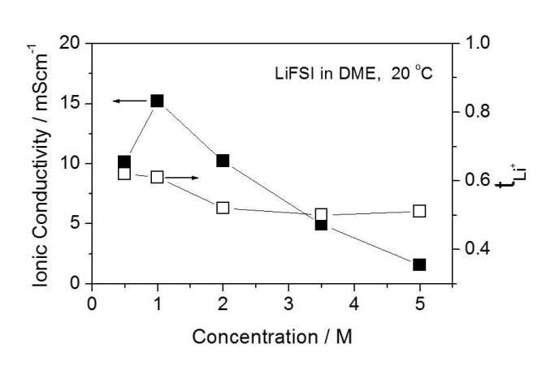
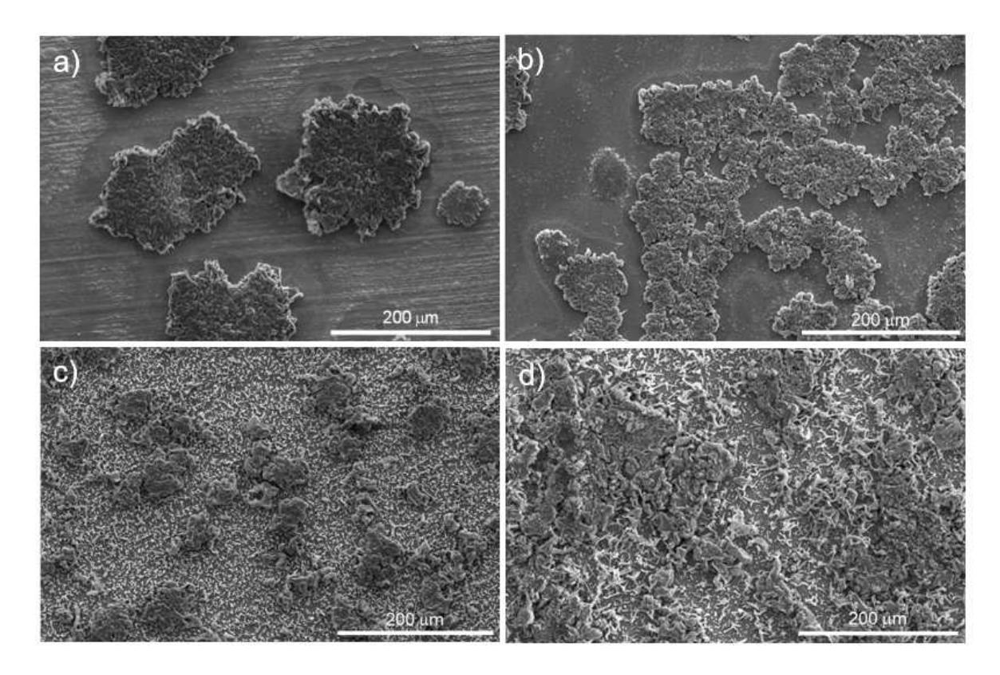
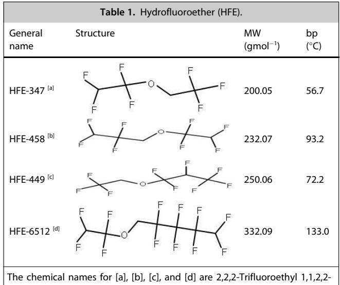
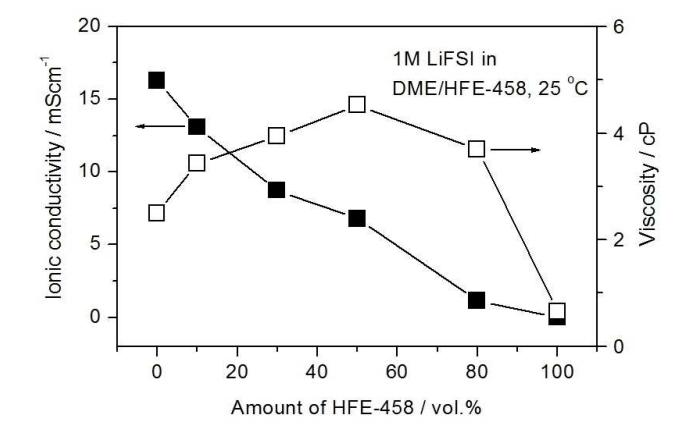
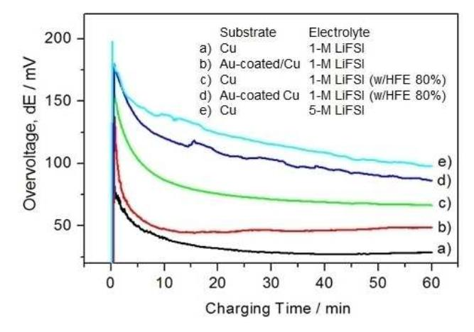
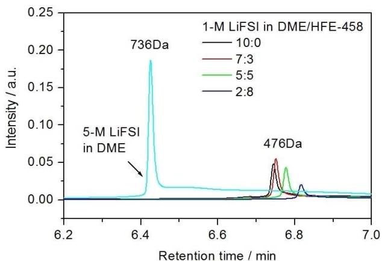
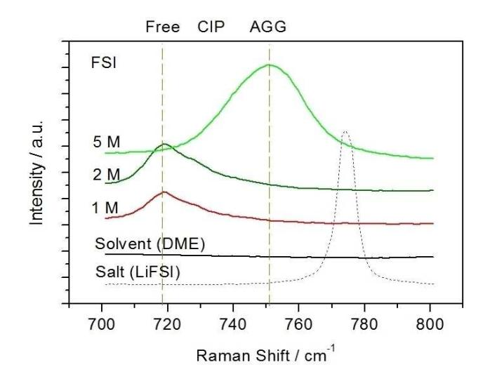
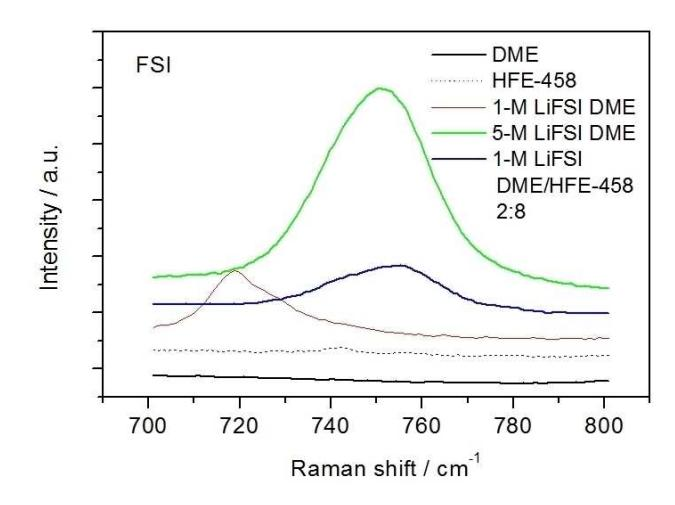

## Energy Technology & Environmental Science

# An Aggregate Cluster-Dispersed Electrolyte Guides the **Uniform Nucleation and Growth of Lithium at Lithium Metal Anodes**

Min-Suk Lee,\*[a] Victor Roev,[b] Changhoon Jung,[b] Ji-Rae Kim,[b] Sangil Han,[a] Hyo-Rang Kang,[b] Dongmin Im,[b] and Il-Seok Kim[a]

Rechargeable lithium metal battery technology is widely recognized as being a suitable candidate for replacing lithium ion batteries. A critical barrier preventing its application to electrical storage systems is that lithium grows irregularly, which is the fundamental cause of poor characteristics during a battery's lifetime, and also causes safety concerns. There are two reasons for the irregular growth of lithium: lithium prefers to nucleate on specific surfaces; subsequently, the lithium atoms grow rapidly from any protrusions. To suppress such irregularities in electroplating, we combined two approaches; applying a coating of lithiophilic metal to a substrate that would otherwise attract the nucleation of lithium, and using an electrolyte in which aggregate clusters are dispersed, with strongly solvated ionic liquids enclosed by another solvent such as a hydrofluoroether. Together, these are intended to guide the uniform nucleation and growth of lithium. By tuning the combination of the two approaches, it was concept proven that lithium would nucleate and grow more uniformly than on a pristine Cu or Ni substrate.

Since rechargeable lithium ion batteries (LIB) were first commercialized as electrical storage devices, their energy density has been steadily increasing towards the theoretical limitations imposed by the cell form factors. Therefore, any post LIB technologies must be developed to satisfy the market demands for electrical storage devices such as portable devices, power tools, and electric vehicles and offer higher energy densities than conventional LIBs. Among the various technical and theoretical approaches, replacing the graphite of the anode with lithium metal is seen as being a promising technology because the capacity of lithium metal is about ten times greater than that of graphite and the electrochemical potential (relative to a standard hydrogen electrode) is lower than that of graphite.[1] Even though lithium metal offers advantages over graphite, rechargeable lithium metal batteries (RLMB) have not yet been commercialized because of two main technical hurdles that have yet to be overcome: dendrite growth and low Coulombic efficiency. Indeed, electroplated lithium forms dendrites as it grows, resulting in so-called "dead lithium" (a loss of lithium metal), short circuits, and pulverized lithium (a safety concern), while gradually consuming the electrolyte.[2]

To understand why lithium usually forms dendrites while magnesium does not, a simulation based on periodic density functional theory calculations was undertaken.[3] As a result of this simulation, it was concluded that magnesium tends to easily diffuse across surfaces through hopping or exchanges, whereas lithium does not. In other words, lithium tends to remain isolated, and thus forms dendrites. To suppress the growth of these dendrites, several technical and theoretical approaches have been proposed, many of which rely on Sand's equation:[4]

$$\tau = \pi D \left( \frac{eC_o}{2Jt_a} \right)^2 \tag{1}$$

where D is the ambipolar diffusion coefficient,  $C_0$  is the initial Li salt concentration, J is the effective electrode current density, and  $t_{\scriptscriptstyle\rm a}$  is the anionic transference number. The cationic transference number  $t_{Li}^+$  is expressed as  $t_{Li}^+ + t_a \approx 1$ . As the Sand's time increases, it takes longer for the dendritic growth to initiate. The use of a fibrous  $Li_7B_6$  matrix or a layer of lithium powder at the anode is an example of decreasing the effective current density through increasing the surface area.[5] The control of the input galvanostatic current,[6] making the current density uniform,[7] or the use of a pulsed current[8] can all be classified as modifications of the effective current density. In the same way as in the case of the current density, as the anionic transference number decreases (ideally to zero), the Sand's time will increase to infinity. Examples of a practical case would include immobilization of the anions by bulky cations in an electrolyte, or the introduction of a single ionic conductor  $(Nafion)$ .[9]

As described by Equation (1), increasing the concentration of cations in an electrolyte is also an effective means of retarding the dendritic growth. Therefore, the use of high- or even super-concentration electrolytes has been suggested.[10]

[a] *Dr. M.-S. Lee, Dr. S. Han, Dr. I.-S. Kim* SDI R&D Center, Samsung SDI Co., LTD, 130 Samsung-ro, Suwon-si, Gyeonggi-do 16678, Republic of Korea E-mail: physiker.lee@samsung.com

[b] Dr. V. Roev, Dr. C. Jung, J.-R. Kim, Dr. H.-R. Kang, Dr. D. Im Samsung Advanced Institute of Technology (SAIT), Samsung Electronics Co., LTD, 130 Samsung-ro, Suwon-si, Gyeonggi-do 16678, Republic of Korea

Supporting information for this article is available on the WWW under https://doi.org/10.1002/slct.201800757

Figure 1. Schematic drawings showing a) structure of electrolyte; with HFE, aggregate clusters of Li ions are dispersed in a HFE medium, whereas, without HFE, point-contact pairs of Li jons are dispersed in a DME medium, affecting the subsequent sequential Li plating processes: b) nucleation, and c) growth. Here, the buffer layer is a lithiophilic metal, to support the nucleation.

These electrolytes have been proven to be an effective means of suppressing dendritic growth, but their rate performances are limited due to their viscosity. To overcome this issue, dilution with a hydrofluoroether (HFE) has been suggested as a means of lowering the viscosities of these highly concentrated electrolytes.[11]

The electroplating of an anode with lithium involves complex chemical interactions. Equation (1) describes the process assuming an influx of ionic species across the substrate. As described in the simulation,  $[3]$  the initial surface states of the anode or newly formed surfaces, called the "solid electrolyte interface" (SEI), involve a chemical interaction between the anode and the electrolyte which can influence the nucleation and growth of lithium. Regarding this, there have been many related suggestions: the decrease of native impurities such as  $Li_2CO_{3}$ ,[12] the introduction of a buffer layer to decrease the overpotential and thus reduce the number of cations,[13] and the modification of the physical and chemical properties of the SEI layers by adding additives to the electrolyte.[14]

To suppress dendritic growth at the anode, two phenomena should be considered: the shipping of Li ions over the anode, and modification of the surface of the Li metal onto which Li ions are plated. The addition of terminal-modified nano-diamond particles to an electrolyte, to ship clusters of Li ions over the anode, is an interesting approach.[15] Similarly, in the present study, we examined how to effectively ship Li ions over the anode while decreasing the over-potential for reducing Li ions as well as suppressing dendritic growth. To ship the Li ions over the anode, an aggregate cluster-dispersed (ACD) electrolyte was employed, while to easily reduce the number of Li ions on the anode, a buffer layer of lithiophilic metal[13a,c] was also introduced (Figure 1). The ACD electrolyte is prepared by mixing a highly concentrated electrolyte, lithium bis(fluorosulfonyl)-imide (LiFSI), dissolved in 1,2-dimethoxyethane (DME), with a hydrofluoroether (HFE). The latter cannot dissolve the salt at all but is easily miscible with DME. The ACD electrolyte is a solvated ionic liquid, in which aggregate clusters (e.g. 2Li+...FSI-, 3Li+...FSI-) are dispersed in the HFE medium.

Without the HFE, the electrolyte is of ion-contact-pair type (ICP, e.g. Li+⋅⋅⋅FSI- ) dispersed in free DME.[10b] The use of both a buffer layer and an ACD electrolyte means that the lithium can easily nucleate and grow uniformly. Without these, the lithium forms dendrites.

LiFSI is a salt with a higher conductivity and cation transference number (in an appropriate solvent) than the LiPF6 that is primarily used in commercial LIBs.[16] When using DME as the solvent for LiFSI, a solution with a concentration of more than 5 M can be attained. As shown in Figure 2, for concen-

concentration of electrolyte (LiFSI dissolved in DME).

trations of 0.5 ∼ 5 M, the conductivity (σ) is a maximum at around 1 M whereas the cation transference number is about 0.6 at 1 M or less, but this decreases to around 0.5 for higher concentrations of electrolyte. As not displayed in Figure 2, the viscosity (η) is increased as the concentrations is increased: 2.5 cP for 1 M, 64 cP for 5 M at RT.

For an electrolyte consisting of 1-M LiFSI in DME (σ=15 mScm-1, η=2.5 cP, tLi+ =0.6), the first lithium plating during a half cycle in a coin cell is strongly dependent on the substrate material (Figure 3). When Cu or Ni is used as the substrate, the electroplated lithium forms islands, so that the substrate is not completely coated (Figure 3a, 3b). By first applying a layer of a metal such as Au or Zn to the substrate, however, the surface is completely coated with lithium (Figure 3c, 3d). This finding indicates that the Au or Zn acts as an accelerator and decreases the overpotential leading to the nucleation of the Li atoms on the substrate.[13a] Even though the problem of nucleation is lessened by the application of a layer of Au or Zn in advance, the electroplated lithium does not grow uniformly. Instead, uniform lithium electroplating is achieved only for some areas of the substrate. Given the characteristic behavior of Li ions, that is, if σ is high, the Li ions will move more quickly through a liquid along an electric field towards a protrusion, growing locally rather than diffusing across the surface.[3] Therefore, pulsed plating was used, whereby the Li ions are caused to **Figure 2.** Plots of ionic conductivity and cation transference number versus flow/not flow towards the substrate through the application of

**Figure 3.** SEM images showing forms of Li metal electrodeposited onto different anode substrates in an electrolyte of 1-M LiFSI dissolved in DME: a) Cu, b) Ni, (c) Au-coated Cu, d) Zn-coated Cu. The small particles are semi-bright in c) and in d) Li have nucleated but not grown further.

**Communications**

a pulsed current; when the Li ions are not being driven by the electric field, they instead diffuse along the concentration gradient.[8] The use of a pulsed current appears to enhance the uniformity of the grown lithium, with the quality improving as the resting time increases (Figure S1). However, when the duration of each pulse is in the order of minutes, rather than seconds, the degree of enhancement is very limited and the surface is not completely coated.

An evaluation of the pulse modes clearly reveals that, if the Li ions are given time to diffuse into the liquid medium, by reducing the strength of the electric field, the uniformity of the grown Li will tend to improve. This result suggests that a highly concentrated electrolyte would limit the mobility of the Li ions. For 5-M LiFSI-DME, σ=1.56 mScm-1, η=64 cP, and *tLi*þ = 0.5. As a result of using the concentrated electrolyte, the uniformity of the Li electrodeposits is considerably improved (Figure S2). The substrate surface is more uniformly coated with lithium, even without the presence of a buffer layer, while a continuous galvanostatic current, rather than a pulsed current, is applied. Our findings are in good agreement with the literature.[10]

An electrolyte with a concentration of 5 M or greater is very viscous, and thus consumes a significant number of Li ions. To reduce the electrolyte viscosity, it should be diluted with another low-viscosity co-solvent. However, problems arise regarding how to maintain the advantages of a highly concentrated electrolyte and, depending on the salt being used, how to dissolve that salt, and the solvent that should be used to dilute the electrolyte. For the latter, we selected a type of HFE (Table 1). Among the available HFE products, it was

tetrafluoroethyl ether, 1,1,2,2-Tetrafluoroethyl 2,2,3,3-tetrafluoropropyl ether, 2,2,3,4,4,4-Hexafluorobutyl trifluoromethyl ether, and 1H,1H,5H-Octafluoropentyl 1,1,2,2-tetrafluoroethyl ether, respectively.

found that only HFE-449 is not miscible with the electrolyte; all the other HFEs exhibit good miscibility and form a clear solution. With HFE-449, however, the solution is initially white, but later separates into two parts (Figure S3).

When compared with Li grown on an Au-coated Cu sheet in 1-M LiFSI-DME (Figure 3c), the replacement of some of the DME with HFE-458 leads to a considerable improvement in the electrodeposit morphology (Figure 4). Even when only 10 vol.% of the DME is replaced, the majority of the surface is covered with grown Li (Figure 4a). From the replacement with 30 vol.% the surface is completely covered with lithium (Figure 4b). Observing at a magnified mode, the Li deposits look different, depending on the portion of HFE-458 (Figure 4c, 4d); when the portion of HFE-458 is increased, a string type of Li deposits is more populated than randomly agglomerated Li deposits.

To determine the reason for the improvement in electrodeposition, electrolytes containing the two solvents were examined in terms of their conductivity and viscosity (Figure 5). Thus, as the proportion of the HFE-458 is increased, the conductivity linearly decreases, while the viscosity peaks at about 50 vol.%. Compared with a LiFSI-DME electrolyte, the conductivity is similar, but the viscosity is very different. Given that the DME can dissolve the salt, but the HFE-458 cannot, we can conclude that a decrease in the amount of DME causes a decrease in the conductivity, while an increase in the amount of HFE-458 suppresses any increase in the viscosity.

As shown in Figure 6, the overvoltage during electrodeposition is affected by both the anode and the electrolyte. According to *ex-situ* SEM observations, higher overpotential improves the density of electrodeposits: higher the overpotential, denser the lithium deposits are formed. This observation points that a gold coating onto Cu sheet, a highly concentrated electrolyte and a mixture of HFE-458 could support the nucleation.

According to a simple equation (S2) defining ionic conductivity, the conductivity is affected by three physical parameters, namely, n, q, and μ. If we consider two electrolytes that differ in their concentrations, specifically, 1-M LiFSI-DME (15 mScm-1, 2.5 cP), and 5-M LiFSI-DME (1.56 mScm-1, 64 cP), the second one exhibits a conductivity that is ca. 10 times lower than the less-concentrated one because it is ca. 25 times more viscous, which reduces the mobility μ, even though it has five times the number of potentially available charge carriers. On the other hand, for the 1-M LiFSI-DME-HFE electrolyte (2:8, v:v; 1.15 mScm-1, 3.7 cP), its conductivity is ca. 13 times less than that of the 1-M LiFSI-DME, while the viscosity varies by a factor of only 1.5. Therefore, upon comparing the 1-M LiFSI-DME and 1-M LiFSI-DME-HFE electolytes (2:8, v:v), Equation (S2) allows us to conclude why the latter has a much lower conductivity. Indeed, assuming that for 1 molL-1, n is constant, and that μ (η) may be regarded as being a constant given the relatively small difference, the effective charge, q, has the greatest effect on the conductivity.[17] Therefore, it is assumed that the effective charge on the lithium ions in the 1-M LiFSI-DME-HFE is significantly reduced.

To gain a deeper insight into how the molecules are structured, the electrolytes were examined by using gel permeation chromatography (GPC) and Raman analyses. GPC can provide information on how molecules exist in a liquid medium; the size of a cluster in a sample can be compared with that in a standard sample. The y-axis gives an intensity of

*ChemistrySelect* **2018**, *3*, 11527– 11534 11530 © 2018 Wiley-VCH Verlag GmbH & Co. KGaA, Weinheim

Figure 4. SEM images of Li metal grown on an Au-coated Cu sheet using four different electrolytes, prepared by first dissolving LiFSI in DME and later mixing with HFE-458 to a volume ratio of: a) 9:1, b) 7:3, c) 9:1 Magnified, d) 2:8 Magnified.

Figure 5. Plots of ionic conductivity and viscosity versus amount of HFE-458 for a mixture of HFE-458 and LiFSI in DME, listed in Table S1.

absorbance for 254 nm, which responds to a population of clusters in the medium. On the other hand, the x-axis is a delayed time to pass a column, which gets shorter when a larger cluster is carried. Generally, it appears as a peak if a simple form of clusters is formed. Our GPC analysis revealed that, when the concentration is higher, the cluster size is larger (Figure 7). Moreover, as we replaced an increasing portion of the DME with HFE, the cluster size became smaller. Hence, there is no significant difference in the cluster sizes of the 1-M LiFSI with and without HFE, relative to that of the 5-M LiFSI-

Figure 6. Voltage profiles obtained during galvanostatic deposition in a half cell at a current density of 1.7mAcm-2 for one hour.

DME. The GPC analyses alone do not explain the improvement in the grown Li morphologies resulting from the replacement of part of the DME with HFE.

Our Raman analyses revealed how the molecules are structured in the liquid electrolyte with various concentrations of LiFSI salt in Figure 8. The salt LiFSI has a vibration peak originating from the stretching mode ( $v_s$ ) of S–N-S at 759 cm-  $^{1}$ [18a] while the peak appeared at 774 cm-1 in our system because the differences in chemical environment around S-N-S

**Figure 7.** GPC signals recorded for electrolytes, where 736 Da and 476 Da indicate standard samples as reference.

**Figure 8.** Raman shifts by FSI- anions for electrolytes of LiFSI in DME that differ in their concentration. The Raman spectrum for a salt is obtained from its powder. Free, CIP, AGG indicate free FSI- , contact ion pairs, and aggregate, respectively. Here, CIP may exist between free FSI- and AGG, even though its peak is not observed clearly. The acronyms are reproduced with permis-

bonding may also have an effect. The DME solvent exhibits no peak in the range of 700–800 cm-1. On the other hand, the peaks are observed at 719 cm-1 for free FSI- anion and 750 cm-1 for aggregates (FSI- coordinating to two or more Li+). The peak shifts towards the characteristic vibration of the dry salt when the Li salt concentration is increased from 1 M to 5 M. This tendency is typically observed in the amide-based concentrated solvent.[18b,c] At high concentration like 5 M, most of the FSI- anions exist as AGGs with strong coulombic interaction with multiple Li+ cations. This indicates that, as the concentration increases, the number of free molecules of DME decreases, while the atomic arrangement of the FSI- anions seems to be more closely ordered.

On the other hand, the range between 800–900 cm-1 can provide information on the Li solvation (Figure S4). The

the peak position being similar. However, the relative intensity tends to increase with the salt concentration. To maintain the number of Li ions in solution, various ratios of the DME and HFE-458 solvents can be prepared (Table S1). Unlike a solvent system, the HFE is used to dissolve a salt while decreasing the viscosity of a mixed solution.[18b] In our system, HFE-458 cannot dissolve the salt LiFSI at all. Therefore, as the

proportion of HFE-458 is increased, the concentration of LiFSI-DME must be increased. For this reason, the Raman shift of the S N-S of the two solvents coincides with the initial concentration of the LiFSI-DME. In other words, the arrangement of the LiFSI solvated in DME cannot be classed as a dilution but rather as a dispersion in a HFE medium (Figure 1). Therefore, we can understand why the Raman shift in S N-S stretching mode appears to be similar to that of the initial concentration of LiFSI-DME, regardless of the portion in the DME-HFE system (Figure 9, Figures S5–S6).

molecules of DME exhibit two vibrational modes near 820 and 850 cm-1, with these peaks becoming weaker as the concentration is increased. This is caused by a decrease in the number of free molecules in the DME, and by the Li solvation becoming stronger. The Li solvation first appears at around 775 cm-1, with

sion.[10b] Copyright 2016, Nature Publishing Group **Figure 9.** Raman shifts by FSI- anions for a mixture of HFE-458 and 5-M LiFSI in DME where the portion of HFE-458 is 80 vol.% to maintain the number of Li ions at 1 molL-1.

In addition to the HFE-458, other HFEs were also examined to determine how they affected the morphologies of the electroplated Li (Figure S7). The morphologies appear to be similar. Moreover, Raman analyses support the similarities being attributable to the similar features of the electrolytes (Figure S8).

To determine how the HFEs affect a DME-HFE system, the flash points of the solvents were measured (Figure S9). DME is a very flammable solvent, having a flash point of around -2°C. The flash point of a 1-M LiFSI electrolyte, dissolved in DME, is about 23°C. This result indicates that the salt can prevent most of the free molecules of DME from evaporating until the temperature reaches 23°C. When the concentration is in-

creased to 5 M using DME only, the flash point rises to 103°C. This is a synergistic effect of two behaviors; the amounts of extremely flammable free molecules of DME are greatly decreased, and the solvation is much stronger. Even when 80 vol.% of the DME is replaced with an HFE such as HFE-347, HFE-458, or HFE-6512, the flash point does not fall below that of the 5-M LiFSI-DME; the flash point increases slightly with the boiling point (Table 1).

As described in the schematic drawing (Figure 1), our concept involves combining two approaches: employing a layer of lithiophilic metal on the substrate, to provide more nucleation sites, while dispersing highly concentrated clusters of Li ions and FSI- in the HFE solution, which may suppress the random scattering of the Li ions. The use of a lithiophilic metal coating may be impractical at high concentrations, but it of great benefit with low-concentration electrolytes, such as 1-M LiFSI-DME. The Sand's time value indicates how Li ions are transported toward the anode. For a given current density (J), the anion transference number (ta ∼ 0.5 or tLi+ ∼0.5), t � *D* � *C*2 *o*. At higher concentrations, the ambipolar diffusion coefficient may become smaller, while both the number of Li ions and the viscosity is increasing. This causes the Li ions to be confined and move in a limited amount of space as low-charge aggregates, making them less sensitive to external electric forces or polarization, so that the Li ions move evenly toward surfaces regardless of whether the surfaces are flat or protrusions. Hence, the growth of Li at high concentrations will be better than at low concentrations. Our second approach involves guiding these highly concentrated electrolytes, dispersed in a weak solvent such as like HFE, toward the anode. The GPC results indicate that Li solvation exists as a cluster in 1-M LiFSI-DME as well as 1-M LiFSI-DME-HFE (2:8, v:v). The Raman shifts indicate that the FSI signal from the 1-M LiFSI-DME-HFE (2:8, v:v) is the same as that of the 5-M LiFSI-DME rather than that of the 1-M LiFSI-DME. This indicates that the Li clusters in the 5-M LiFSI-DME are not scattered but held in the mixed solution. The 1-M LiFSI-DME-HFE (2:8, v:v) appears to be weak in the same way as the 1-M LiFSI-DME, while its conductivity and cationic transference number are very close to those of the 5-M LiFSI-DME. This may explain why the 1-M LiFSI-DME-HFE (2:8, v:v) is similar to the 5-M LiFSI-DME in terms of the morphologies of the electroplated Li.

In summary, we have devised a concept that combines two approaches, which has proven to be very effective for guiding the uniform nucleation and growth of lithium. The effect is very clear in that the lithophilic metal layer creates more nucleation sites while highly concentrated Li clusters dispersed in the HFE medium uniformly drift towards the anode regardless of whether it is a planar surface or protrusion. This concept could be applied to the design of a liquid electrolyte for rechargeable lithium metal batteries.

The contents of the supporting information include details of the coin cell used, cation transference number measurement procedure, electrolyte preparation, electrodeposition condition, scanning electron microscopy images, experimental values of ionic conductivity and viscosity, as well as gel permeation chromatography, Raman analysis and flash point measurement protocols and results.

#### **Supporting Information Summary:**

All experimental details can be found in the Supporting Information.

### *Acknowledgements*

*We thank Dr. Sungjun Park (Samsung Electronics, Co., LTD, Rep. of Korea) for his support with the GPC analysis, as well as his technical input and Mr. Youngeal Kim (Samsung Electronics, Co., LTD, Rep. of Korea) for his support in preparing materials for this paper.*

## *Conflict of Interest*

The authors declare no conflict of interest.

**Keywords:** anode **·** electrodeposition **·** electrolyte **·** lithium dendrite **·** salt-insoluble solvent

- [1] K. G. Gallagher, S. Goebel, T. Greszler, M. Mathias, W. Oelerich, D. Eroglu, V. Srinivasan *, Energy Environ. Sci.* **2014***, 7,* 1555–1563.
- [2] W. Xu, J. Wang, F. Ding, X. Chen, E. Nasybulin, Y. Zhang, J.-G. Zhang, *Energy Environ. Sci.* **2014**, *7*, 513–537.
- [3] M. Jäckle, A. Groß, *J. Chem. Phys.* **2014***, 141,* 1–7.
- [4] C. Brissot, M. Rosso, J.-N. Chazalviel, S. Lascaud, *J. Power Sources* **1999**, *81–82*, 925–929.
- [5] a) X.-B. Cheng, H.-J. Peng, J.-Q. Huang, F. Wei, Q. Zhang *, small* **2014**, *10,* 4257–4263; b) J. Heine, S. Krüger, C. Hartnig, U. Wietelmann, M. Winter, P. Bieker, *Adv. Energy Mater.* **2014**, *4*, 1–7.
- [6] A. Pei, G. Zheng, F. Shi, Y. Li, Y. Cui, *Nano Lett.* **2017**, *17,* 1132–1139.
- [7] P. Barai, K. Higa, V. Srinivasan, *Phys. Chem. Chem. Phys.* **2017**, *19*, 20493– 20505.
- [8] a) H. Yang, E. O. Fey, B. D. Trimm, N. Dimitrov, M. S. Whittingham, *J. Power Sources* **2014**, *272*, 900–908; b) M. Z. Mayers, J. W. Kaminski, T. F. Miller, *J. Phys. Chem. C* **2012**, *116,* 26214–26221; c) A. Aryanfar, D. Brooks, B. V. Merinov, W. A. Goddard, A. J. Colussi, M. R. Hoffmann, *J. Phys. Chem. Lett.* **2014**, *5*, 1721–1726; d) Q. Li, S. Tan, L. Li, Y. Lu, Y. He, *Sci. Adv.* **2017**, *3*, 1–9.
- [9] a) Y. Lu, K. Korf, Y. Kambe, Z. Tu, L. A. Archer *, Angew. Chem. Int. Ed.* **2014**, *53*, 488–492; b) J. Song, H. K. Lee, M.-J. Choo, J.-K. Park, H.-T. Kim *, Scientific Reports* **2015**, *5,* 1–9.
- [10] a) J. Qian, W. A. Henderson, W. Xu, P. Bhattacharya, M. Engelhard, *Nat. Commun.* **2015**, *6*, 1–9; b) J. Wang, Y. Yamada, K. Sodeyama, C. H. Chiang, Y. Tateyama, A. Yamada, *Nat. Commun.* **2016**, *7,* 1–9; c) L. E. Camacho-Forero, T. W. Smith, P. B. Balbuena, *J. Phys. Chem. C* **2017**, *121*, 182–194; d) C. Wan, M. Y. Hu, O. Borodin, J. Qian, Z. Qin, J.-G. Zhang, J. Z. Hu, *J. Power Sources* **2016**, *307*, 231–243.
- [11] a) K. A. See, H.-L. Wu, K. C. Lau, M. Shin, L. Cheng, M. Balasubramanian, K. G. Gallagher, L. A. Curtiss, A. A. Gewirth, *ACS Appl. Mater. Interfaces* **2016**, *8*, 34360–34371; b) M. Shin, H.-L. Wu, B. Narayanan, K. A. See, R. S. Assary, L. Zhu, R. T. Haasch, S. Zhang, Z. Zhang, L. A Curtiss, A. A. Gewirth, *ACS Appl. Mater. Interfaces* **2017**, *9*, 39357–39370; c) M. Haruta, Y. Masuo, T. Moriyasu, A. Tomita, C. Sakakibara, A. Kamei, M. Hirota, T. Takenaka, T. Doi, M. Inaba, *Electrochemistry* **2015**, *83*, 837–839; d) S. Saito, H. Watanabe, K. Ueno, T. Mandai, S. Seki, S. Tsuzuki, Y. Kameda, K. Dokko, M. Watanabe, Y. Umebayashi, *J. Phys. Chem. B* **2016**, *120*, 3378– 3387.
- [12] J. Becking, A. Gröbmeyer, M. Kolek, U. Rodehorst, S. Schulze, M. Winter, P. Bieker, M, C. Stan, *Adv. Mater. Interfaces* **2017**, *4*, 1700166–1700175..
- [13] a) K. Yan, Z. Lu, H.-W. Lee, F. Xiong, P.-C. Hsu, Y. Li, J. Zhao, S. Chu, Y. Cui, *Nature Energy* **2016**, *1*, 1–8; b) G. Zheng, S. W. Lee, Z. Liang, H.-W. Lee, K.

Yan, H. Yao, H. Wang, W. Li, S. Chu, Y. Cui, *Nature Nanotech.* **2014**, *9*, 1–6; c) R. Zhang, X.-R. Chen, X. Chen, X.-B. Cheng, X.-Q. Zhang, C. Yan, Q. Zhang, *Angew. Chem. Int. Ed.* **2017**, *56*, 7764–7768.

- [14] a) F. Ding, W. Xu, G. L. Graff, J. Zhang, M. L. Sushko, X. Chen, Y. Shao, M. H. Engelhard, Z. Nie, J. Xiao, X. Liu, P. V. Sushko, J. Liu, J.-G. Zhang, *J. Am. Chem. Soc.* **2013**, *135*, 4450–4456; b) Y. Zhang, J. Qian, S. M. Russell, X. Chen, E. Nasybulin, P. Bhattacharya, M. H. Engelhard, D. Mei, R. Cao, F. Ding, A. V. Cresce, K. Xu, J.-G. Zhang, *Nano. Lett.* **2014**, *14*, 6889–6896; c) F. Ding, W. Xu, X. Chen, J. Zhang, Y. Shao, M. H. Engelhard, Y. Zhang, T. A. Blake, G. L. Graff, X. Liu, J.-G. Zhang, *J. Phys. Chem. C* **2014**, *118*, 4043–4049; d) Y. Lu, Z. Tu, L. A. Archer, *Nature Mater.* **2014**, *13*, 961–969; e) W. Li, H. Yao, K. Yan, G, Zheng, Z, Liang, Y.-M. Chiang, Y. Cui, *Nat. Commun.* **2015***, 6*, 1–8; f) X.-Q. Zhang, X.-B. Cheng, X. Chen, C. Yan, Q. Zhang *, Adv. Funct. Mater.* **2017**, *27*, 1–8; h) N.-W. Li, Y.-X. Yin, J.-Y. Li, C.- H. Zhang, Y.-G. Guo, *Adv. Sci.* **2017**, *4*, 1–6.
- [15] X.-B. Cheng, M. Q. Zhao, C. Chen, A. Pentecost, K. Maleski, T. Mathis, X.- Q. Zhang, Q. Zhang, J. Jiang, Y. Gogotsi, *Nat. Commun.* **2017**, *8*, 1–9.
- [16] H.-B. Han, S.-S. Zhou, D.-J. Zhang, S.-W. Feng, L.-F. Li, K. Liu, W.-F. Feng, J. Nie, H. Li, X.-J. Huang, M. Armand, Z.-B. Zhoua, *J. Power Sources* **2011**,*196*, 3623–3632.
- [17] M. Gouverneur, J. Kopp, L. v. Wüllen, M. Schönhoff, *Phys. Chem. Chem. Phys.* **2015**, *17*, 30680–30686.
- [18] a) M. Kerner, N. Plylahan, J. Scheers, P. Johansson, *RSC Adv.* **2016**, *6*, 23327–23334; b) T. Doi, Y. Shimizu, M. Hashinokuchi, M. Inaba, *J. Electrochem. Soc.* **2017**, *164,* A6412–A6416; c) Y. Yamada, K. Furukawa, K. Sodeyama, K. Kikuchi, M. Yaegashi, Y. Tateyama, A. Yamada, *J. Am. Chem. Soc.* **2014**, *136*, 5039–5046.

Submitted: March 14, 2018 Accepted: October 25, 2018