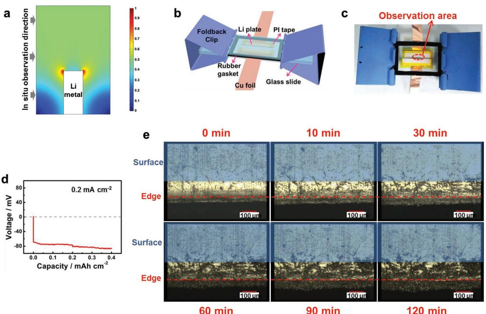
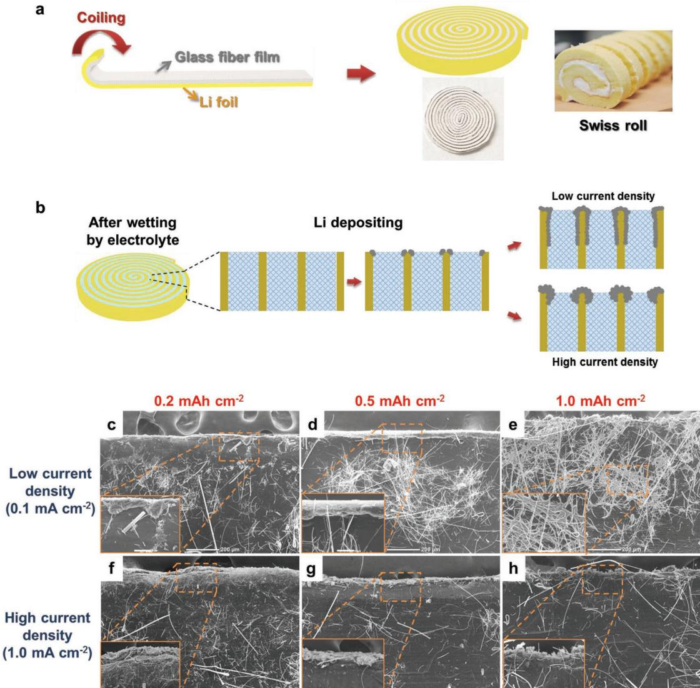
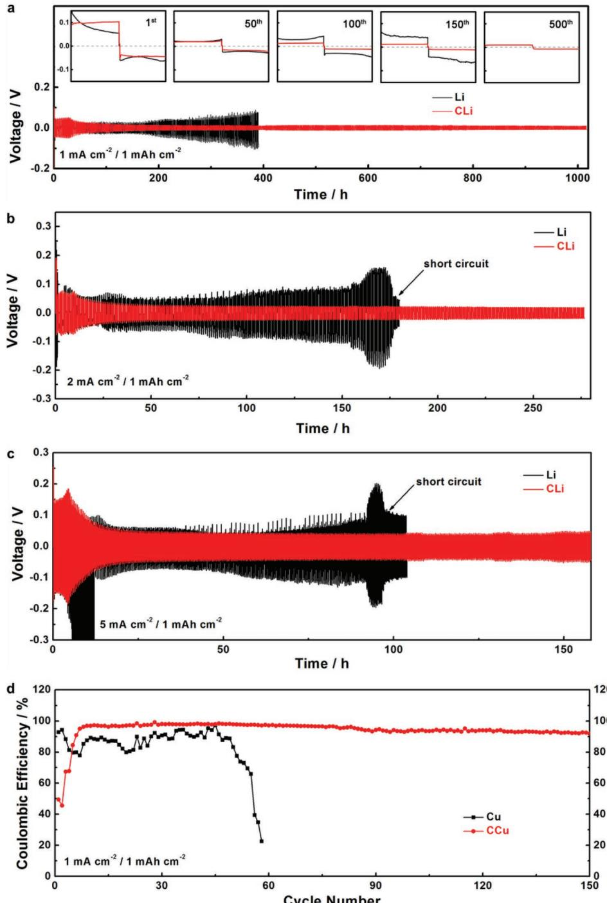
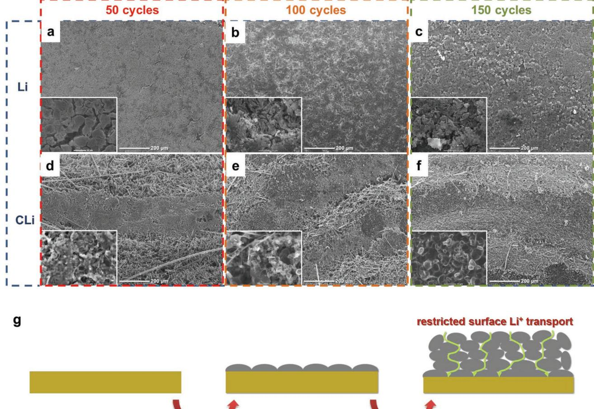
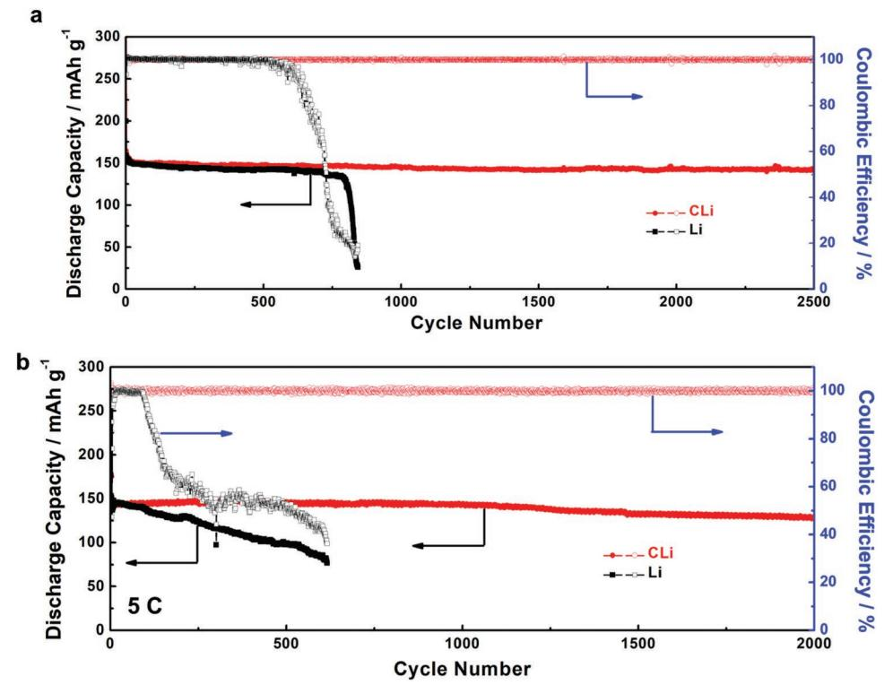

**Upright Lithium Anodes**

# **Long Cycle Life Lithium Metal Batteries Enabled with Upright Lithium Anode**

*Yuqing Chen, Meng Yue, Cuilian Liu, Hongzhang Zhang,\* Ying Yu, Xianfeng Li,\* and Huamin Zhang*

**The lithium metal anode is the holy grail of the battery field due to its lowest reduction potential and high specific capacity; however, its application is hindered by severe safety hazards and inferior cyclic stability due to dendrites and unstable solid electrolyte interphase (SEI). Aiming at these problems, a coiled Li anode with a unique upright structure is proposed. The upright structure endows coiled Li anode with abundant inner reaction interface/space/mass for lithium deposit/storage/transport, which can induce the inner growth of Li dendrites and SEI. The Li+ transport/deposit behavior and mechanism of coiled Li anode are clarified via in situ observation and numerical simulation. Benefiting from the small volume expansion and sufficient Li+ transport, the coiled Li anodes combined with Li4Ti5O12 cathodes achieve a long life of over 2000 cycles at 5C with a reversible capacity of 129 mAh g−1 and 100% Coulombic efficiency.**

# **1. Introduction**

The booming development of customer electronics and electrical vehicles urgently requires high energy density rechargeable batteries.[1] Lithium metal is one of the most promising anodes owing to its lowest reduction potential (−3.0 V vs standard hydrogen electrode) and high theoretical specific capacity (3860 mAh g−1 ).[2,3] Unfortunately, severe safety hazard and inferior cyclic stability greatly hinder the application of lithium metal batteries, including lithium-ion, lithium–air, and lithium–sulfur batteries.[4–6] These issues are essentially caused by the heterogeneous deposition and high reaction

Y. Q. Chen, M. Yue, C. L. Liu, Prof. H. Z. Zhang, Y. Yu, Prof. X. F. Li, Prof. H. M. Zhang Division of Energy Storage Dalian Institute of Chemical Physics Chinese Academy of Sciences Zhongshan Road 457, Dalian 116023, China E-mail: zhanghz@dicp.ac.cn; lixianfeng@dicp.ac.cn Y. Q. Chen, M. Yue, Y. Yu School of Chemical Science University of Chinese Academy of Sciences Beijing 100049, China Prof. H. Z. Zhang, Prof. X. F. Li, Prof. H. M. Zhang Collaborative Innovation Center of Chemistry for Energy Materials (iChEM) Dalian 116023, China

The ORCID identification number(s) for the author(s) of this article can be found under https://doi.org/10.1002/adfm.201806752.

**DOI: 10.1002/adfm.201806752**

activity of lithium metal. On the one hand, nonuniform nucleation and growth of lithium produce needle-like or dendritic protuberances, which may pierce through the separator leading to short circuit of batteries and even triggering a fire.[7] On the other hand, highly active lithium metal can spontaneously react with electrolyte to yield solid electrolyte interphase (SEI). SEI is fragile and easy to crack and rebuild along with the anode volume expansion during cycling, which renders the continuous depletion of electrolyte and gradually increment of the battery internal resistance, leading to low Coulombic efficiency and rapid capacity decay.[8]

For common planar Li anode, there are two factors leading to the failure of lithium

metal batteries. At high current density, Li depositing/dissolving reaction rate is much higher than Li+ diffusion rate, so that the irregularity of Li+ distribution and Li dendrite growth is exacerbated, causing the short circuit of batteries. As for low current density, Li dendrites are not serious enough to puncture the separator. Nevertheless, the cracking and rebuilding of SEI become the main reasons to cause the death of lithium metal batteries, which bring issues like the electrolyte drying out and overlarge internal resistance. Plenty of strategies have been proposed to solve the challenges of Li metal anode, including forming stable SEI layer,[9] adopting gel/solid electrolyte,[6,10] improving mechanical property of separator[11] and optimizing the anode structure.[12] Among these strategies, constructing 3D framework of metallic lithium anode has attracted much attention for high cyclic stability achieved at even high current density. It is because the increased specific surface area of 3D lithium anode can effectively reduce the practical current density and further facilitate smooth Li depositing morphology. Besides, the void inside of the 3D structure also provides large storage space for lithium deposition, which reduces risk of separator penetration by Li dendrites. However, the synthesis of lithium anode with 3D structure always requires the complicated process or excess current collector. Moreover, it is also difficult to control dendrites growth direction.

Here, we have come up with a bold idea to let the planar Li stand up. Once the planar Li stands up, the broad upper surface will turn into side surface, inducing upper growth of Li dendrites to transform into inner growth, which reduces the risk of upper Li dendrites piercing through separator. Further passivating the upper surface of upright Li, the dendrite

**Figure 1.** a) The 2D current density distribution of standing Li plate in electrolyte. b) The schematic diagram of the double-electrode transparent cell for in situ observation. c) The photograph of the transparent cell in the direction of optical microscope observation. The region within the dash lines is the observation area. d) The voltage curve during the depositing process at current density of 0.2 mA cm−2. e) The optical photographs before and after depositing for 10, 30, 60, 90, and 120 min, where the magnification is 20 times.

growth direction will convert from vertical to horizontal, thus greatly improved the security of Li metal batteries (Figure S1, Supporting Information). The upright Li anode was simply realized by a coiling method, without a complicated process or excess current collector. Glass fiber film was used as the structure supporter, but made up only 0.72% and 1.94% weight percentage in LiFePO4 and Li–S pouch batteries as we calculated respectively. Moreover, glass fibers possess high porosity, high electrolyte uptake ability, and good Li affinity, which can provide large lithium storage space and abundant Li+ supplement to facilitate inner Li deposition and improve the cyclic stability of Li metal batteries.

### **2. Results and Discussion**

In order to better understand the depositing behavior of the upright Li, the current density distribution and Li morphology evolution during the depositing process was investigated by COMSOL simulation and optical microscope. The simulation result, as shown in **Figure 1**a, demonstrated the 2D current density distribution of upright Li from the section view. The maximum current density was set to 1, while the current density at a certain position was represented by the ratio between the value at that position and the maximum value. The result is consistent with the famous "lightning rod theory," which says that the charge density on the surface of the conductor increases with the curvature of the conductor.[13] In Figure 1a, two points on the top of upright Li possessed the highest current density owing to its highest curvature, corresponding to the highest electrochemical reaction activity for Li deposition. Further to confirm the simulation result, in situ observation of Li plating process was conducted by using optical microscope. As shown in Figure 1b–c, a double-electrode transparent cell was well designed and assembled to clearly exhibit the Li morphology evolution. Li plates with thickness of 180 µm was used as both work and counter electrodes and set horizontally to imitate upright Li with the observation direction shown in Figure 1a. Besides, high curvature edges of Li plates were sealed by polyimide (PI) tape except the opposite ones, so that the deposition zone can be limited to observing area and make it convenient for observation (Figure 1c). Ether electrolyte was injected into the hollow part of rubber gasket and sealed by glasses to ensure high Li+ transmission. At low current density of 0.2 mA cm−2 , lithium initially deposited at the edge rather than the broad surface area (Figure 1e). Subsequently Li grains grew up and had a regular spherical shape.[14] As time going, Li grains gradually extended from the edge towards broad surface and counter electrode, showing a dispersive and uniform distribution. When the current density increased to 0.5 mA cm−2 ,

**Figure 2.** a) The schematic diagram of the CLi preparation process. b) The schematic diagram of Li depositing process on CLi at low current density and high current density. The SEM images of CLi after depositing c) 0.2, d) 0.5, e) 1.0 mAh cm−2 at low current density of 0.1 mA cm−2. The SEM images of CLi after depositing f) 0.2, g) 0.5, h) 1.0 mAh cm−2 at high current density of 1.0 mA cm−2. The insert pictures magnified the selected area and the length of scar bars represented 50 µm.

the distribution of Li grains mainly concentrated at the edge and extended towards counter electrode direction (Figure S2, Supporting Information). Further improving the current density up to 1.0 mA cm−2 , Li grains only extended towards counter electrode direction and hardly appeared on surface (Figure S3, Supporting Information). All the results point to a fact that current density is a determining factor of Li depositing morphology, while the distribution of Li grains becomes denser at a higher current density and extends along with the ion transport path.[2,15]

To make the planar Li stand up and easy to scale up, we simply coiled Li foil into the vortex-shape structure, like a Swiss roll (**Figure 2**a). Entire preparation was conducted in the extremely dry environment with a dew point below −35 °C. First, glass fiber film (thickness of 270 µm) and Li foil (thickness of 180 µm) were both cut into narrow strips with about 1.5 mm width. The length of glass fiber was 250 mm and the Li foil was about 300 mm. As shown in Figure 2a, the strip of glass fiber was put upon the Li foil and then coiled together with Li foil from one side to another, while a part of Li foil with 1 cm length was reserved and placed at the bottom of coiled Li (CLi) anode to ensure the good electrical conductivity (Figure S4, Supporting Information). The diameter of CLi was around 1.4 cm, and the surface area of CLi was about 7.95 cm2, which is four times of planar Li (1.54 cm2 ) with the same diameter (the calculation details described in the Supporting Information). This unique structure endows the CLi anode with many advantages: (i) High side surface area of upright Li provides broad reaction interface, in addition to the good Li affinity of glass fibers, which can facilitate the inner Li deposition. (ii) The

high porosity of glass fiber interlayer provides large lithium storage space, which can alleviate the anode volume expansion and avoid the short circuit of batteries caused by dendrites penetration; (iii) High electrolyte uptake ability of glass fibers can absorb large amount of electrolyte and provide abundant Li+ supplement and continuous transfer paths, which prevents dry out of electrolyte and sustains durable Li+ transport to suppress the increasing battery resistance, leading to high stability and long cycle life of Li metal batteries.

Figure 2b showed the Li depositing process of CLi anodes at low current density and high current density respectively. Firstly, lithium preferred to deposit on high curvature position, where referred to the edges of upper surface of CLi anode. Then, the depositing morphology varied with different current density. At low current density, Li distribution was much more uniform and spread from narrow upper surface to broad side surface. As shown in Figure 2c–e, the Li depositing process at low current density of 0.1 mA cm−2 was recorded by the scanning electron microscope (SEM) images of CLi from the side surface view. At the initial 2 h, deposited lithium first appeared at the edges of upper surface (Figure 2c). Then, the depositing layer gradually spread along the edges and evenly covered the upper surface after 5 h (Figure 2d). After 10 h, the depositing layer turned to spread toward the broad inner surface of CLi and wrapped lots of glass fibers (Figure 2e). It confirmed that the inner Li deposition not only attributed to large side surface area of upright Li, but also took advantage of good Li affinity of glass fibers owing to the strong polar absorption to Li+ by its essential component SiO2. [16] Besides, similar Li morphology evolution was obtained by COMSOL simulation, as shown in Figure S5 in the Supporting Information. At high current density, Li depositing and Li+ consuming rate were accelerated, thus the mass transfer became the determining factor of Li depositing morphology. The depositing process of CLi was well consistent with in-situ observation result at the same current density of 1.0 mA cm−2. As shown in Figure 2f–h, Li depositing layer was mainly concentrated on the upper face, while almost no deposited lithium on the side surface.

**Figure 3**a–c displayed the galvanostatic charge/discharge cyclic performances of Li symmetric batteries at a capacity of 1.0 mAh cm−2 and different current density of 1.0, 2.0, and 5.0 mA cm−2. At low current density of 1.0 mA cm−2, the voltage hysteresis of planar Li exhibited a gradual rising trend after 100 h, and reached above 100 mV after 300 h, representing the continuously aggravated polarization of depositing/dissolving process. As for CLi, its voltage hysteresis was initially a bit higher than that of planar Li but gradually reduced to a comparable value after the first 100 h. Then such a low value was sustained over 1000 h, demonstrating the superior cyclic stability. As is well known, the large amount of electrolyte can achieve long cycling life. The CLi anode with large amount of electrolyte uptake can provide sufficient Li+ supplement and durable Li+ transport, activating inner active sites and preventing aggravated polarization. When increased the current density to 2.0 and 5.0 mA cm−2, the CLi│CLi batteries with upright Li structure could still stably operate over 270 and 150 h, respectively. While Li│Li batteries with planar Li structure appeared short circuit at such high current density. It further confirmed that the death of Li metal batteries is mainly caused by dry out of electrolyte at low current density and short circuit at high current density, as we mentioned before. The upright structure of CLi took advantages of its high electrolyte uptake and lager Li storage space, which not only provided sufficient Li+ supplement and fast inner Li+ transport, but also alleviated volume change during cycling. Therefore, high stability of Li anode can be achieved by the upright structure no matter low or high current density. Further improving the capacity up to 2.0 mAh cm−2, CLi still kept outstanding cyclic stability over 1000 h, while planar Li had a short circuit after 500 h with a sudden voltage drop (Figure S6, Supporting Information).

To demonstrate the real Coulombic efficiency of the upright anode structure, the coiled Cu current collectors (CCus) were prepared by the same method like CLi and assembled with Li plate to obtain Li│CCu batteries. As shown in Figure S7 (Supporting Information), the height of the coiled Cu collector was around 1.7 mm, and the diameter was 9–10 mm. In order to reduce the contact resistance between coiled Cu collector (CCu) and the stainless steel shell of coin cell, a little strip of Cu foil was stuck on one side of coiled Cu collector. Compared with Li│Cu batteries, the Coulombic efficiency of Li│CCu batteries exhibited superior cyclic stability, which could reach to 99% and remain over 92% after 150 cycles. It means the upright structure is conducive to building stable SEI film by virtue of sufficient electrolyte uptake and LiNO3 component. The low value at initial ten cycles should be caused by SEI film generation process. Differently, the Coulombic efficiency of Li│Cu batteries exhibited drastic fluctuation between 80% and 95%, which rapidly dropt after only 50 cycles.

The electrochemical impedance spectroscopy (EIS) was conducted with the symmetric batteries to further explore the electrochemical properties of planar Li and CLi. **Figure 4**a showed impedances of planar Li and CLi before cycling. Equivalent circuits and fitting results of impedances were displayed in Figure S8 and Table S1 in the Supporting Information. Despite a bit higher charge transfer resistance of CLi than planar Li, it was obvious that the CLi existed a distinct Warburg impedance but the planar Li did not. Warburg impedance was closely related to the mass transfer, so that the mass transfer models of planar Li and CLi were proposed to analyze the Li+ transport mechanism in details (Figure 4b). Planar Li had large upper surface area and vertically face-to-face Li+ transport mechanism, providing short transfer distance and fast Li+ migration on electrode/electrolyte interface, which led to extremely low diffusion resistance. Due to the small upper surface of CLi, the fast Li+ migration based on face-to-face transport mechanism was limited. The Li+ transport towards the broad inner surface of CLi was horizontal through the glass fibers, which provided longer transfer distance and slower migration rate than face-to-face transport, resulting in higher diffusion resistance than planar Li. The higher charge transfer resistance and initial voltage hysteresis of CLi was also caused by the slower Li+ transport. But after cycling, the impedance of CLi was gradually reduced and reached to a stable value (Figure 4c, Figure S9, Supporting Information), guaranteeing the high cyclic stability of CLi over 1000 h. While the impedance of planar Li was gradually increased during cycling, which led to the aggravated polarization of planar Li (Figure 3a).

**Figure 3.** Cyclic performance of planar Li and CLi symmetric batteries with a capacity of 1 mAh cm−2 and different current density of a) 1.0 mA cm−2 , b) 2.0 mA cm−2, and c) 5.0 mA cm−2. d) Cyclic performance of planar Li│Cu and Li│CCu batteries with a capacity of 1 mAh cm−2 and a current density of 1.0 mA cm−2.

As is well known, the morphology and composition of SEI are critical factors to determine the cyclic stability of Li anodes.[5,17] To investigate the SEI morphology evolution, the SEM measurement of Li anodes after cycling was conducted and the results displayed in **Figure 5**a–f. The morphology of planar Li and CLi before cycling was shown in Figure S10 in the Supporting Information. At the initial stage, the SEI of planar Li was uniform and consisted of closely aligned Li grains (Figure 5a; Figure S11a, Supporting Information). While for CLi anode, the different morphology from planar Li was caused by current density, which said higher current density leads to smaller grain size and denser distribution.[15] Based on the current density

**Figure 4.** a) EIS spectrums of planar Li and CLi symmetric batteries before cycling. b) The schematic diagrams of Li+ transport mechanism within the planar Li and CLi symmetric batteries before cycling. c) EIS spectrums of planar Li and CLi symmetric batteries after 50, 100, and 150 cycles with the capacity of 1 mAh cm−2 and current density of 1.0 mA cm−2.

simulation of CLi (Figure 1a), charges preferred to accumulate at the edges of its upper surface and produced higher partial current density than planar Li, thus leading to finer Li grains and closer packing (Figure 5d; Figure S11d, Supporting Information). With the increasing of cycle number, the SEI thickness of planar Li was continuously increased (Figure S11b,c, Supporting Information), meanwhile its morphology became looser and more rough (Figure 5b,c, Supporting Information), which caused by repeatedly cracking and rebuilding process. By contrast, the Li grains of CLi still kept close packing and spread towards glass fibers interlayer (Figure 5e,f; S11e,f, Supporting Information). Although lithium initially deposited on the upper surface of CLi, with the increasing of cycle number, the SEI on the upper surface of CLi became thicker, resulting in selfpassivation of the upper surface. But differing from planar Li, CLi possessed broad side surface of the upright Li configuration, which provided abundant inner active sites. Better still, high porosity and superior electrolyte uptake of glass fibers interlayer further provided large Li storage space and good Li+ transmission. All of these advantages facilitated inner growth of Li dendrites and converted dendrites growing direction from vertical to horizontal, as previously illustrated in Figure S1 in the Supporting Information. As shown in Figure S12 (Supporting Information), the volume expansion of Li anodes can be effectively suppressed, demonstrating a much thinner upper surface SEI (40 µm) of CLi than that of planar Li (110 µm).

The SEI morphology evolution procedures of planar Li and CLi were displayed in Figure 5g and Li+ transmission mechanisms after cycling were further studied. For planar Li, the Li+ transfer paths became narrow and circuitous with the increasing thickness of SEI film and depleted electrolyte, resulting in restricted Li+ transport and further causing increased charge transfer resistance and aggravated polarization. For CLi, the glass fibers could absorb abundant electrolyte inside of the anode, which enabled sufficient Li+ supplement with continuous inner transfer paths. Taking advantages of this mechanism, the durable Li+ transport ensured superior cyclic stability of CLi.

Combining Li4Ti5O12 (LTO) electrodes with lithium anodes, LTO│CLi and LTO│Li batteries were assembled and carried out galvanostatic charge/discharge measurement. **Figure 6**a displayed the cyclic performance of LTO batteries at the rate of 1C. The Coulombic efficiency of LTO│Li batteries began to reduce after 600 cycles, while the discharge capacity rapidly faded after 800 cycles. Figure 6c exhibited the charging/discharging voltage curves of LTO│Li batteries during cycling. It was obvious that the polarization gradually increased during cycling, which mainly caused by the sluggish Li+ transmission. In addition, the Coulombic efficiency reduction of LTO│Li batteries mainly caused by the consumption of electrolyte including LiNO3 additive, which played a crucial role in sustaining high depositing/dissolving efficiency of Li anodes. Beneficial from the durable Li+ transport and broad inner reaction interface and space of CLi anodes, LTO│CLi batteries showed excellent cyclic stability, which reserved 141 mAh g−1 capacity after 2500 cycles and maintained almost 100% Coulombic efficiency. Better still, no distinct increment of the polarization for LTO│CLi batteries occurred during the 2500 cycles (Figure S13a, Supporting Information). Even rising the rate up to 5C, LTO│CLi batteries also achieved superior cyclic stability over 2000 cycles with reversible capacity of 129 mAh g−1 and no significant decline of Coulombic efficiency, while the performance for planar Li anodes decayed rapid after just 100 cycles (Figure 6b). The charging/discharging curves at rate of 5C were displayed in Figure S14 in the Supporting Information. For LTO│CLi batteries, the polarization exhibited superior stability within 1000 cycles and the capacity retention was over 99%. Even after 2000 cycles, the capacity retention could also achieve to 88%. Nevertheless, the polarization of LTO│Li batteries dramatically increased from 100 cycles to 400 cycles and only 66% capacity remained after 400 cycles. LiNO3 is an effective additive agent in ether electrolyte to form stable SEI layer on Li anode, however, which is continuously consumed during cycling. At high rate 5C of LTO batteries, the actual current density is about 1.68 mA cm−2. Together with the low discharge cut-off voltage (1.0 V), the depletion of LiNO3 is accelerated, resulting in rapid capacity fading and poor cyclic stability of LTO batteries. While with CLi anodes, durable Li+ transport and abundant active sites can fully utilize electrolyte and suppress the increasing polarization, which further improving the cyclic stability of LTO batteries.

The high electrolyte uptake stability (816.7%, as shown in Table S2 in the Supporting Information) of glass fiber is key to provide durable Li+ transport of CLi anodes, but dissatisfy the high energy density demand of rechargeable batteries with

**Figure 5.** a) The SEM images of a–c) planar Li and d–f) CLi symmetric batteries after 50, 100, and 150 cycles from top view. The capacity was 1 mAh cm−2 and current density was 1.0 mA cm−2. g) The schematic diagrams of SEI morphology evolution and Li+ transfer paths after cycles.

current thickness of 270 µm. Based on the assembly experience of soft-pouch batteries in our group, the energy density has been estimated with sulfur cathode, LiFePO4 cathode and CLi anode. When thickness of glass fiber and Li foil both reduced to 50 µm, the mass energy density of Li–S batteries and LiFePO4 batteries can achieve 367 and 243 Wh kg−1, while the volume energy density of lithium sulfur batteries and LiFePO4 batteries can achieve 331 and 450 Wh L−1 (as shown in Tables S3 and S4 in the Supporting Information). The glass fiber film made up only 1.94% and 0.72% percent of whole battery weight in Li–S and LiFePO4 pouch batteries, respectively. Besides, the amount of electrolyte for anodes made up only 15.81% and 5.85% percent of whole battery weight (28% and 20% percent of total amount of electrolyte) in Li–S and LiFePO4 pouch batteries, respectively. That means the excess weight of upright Li anode and amount of electrolyte for anodes do not dramatically lower the energy density of pouch batteries, but significantly improve the cyclic stability and prolong the cycle life of batteries, which shows great possibility for practical application.

#### **3. Conclusion**

In summary, a kind of upright Li anodes was well-designed and synthesized with a simple coiling method, which possessed broader reaction interface, larger Li storage space, and more durable Li+ transport than traditional planar Li anodes. At low current density, lithium could uniformly deposit on both upper and side surface of upright Li. At high current density,

**Figure 6.** a) Cyclic performance of LTO│CLi and LTO│Li batteries at rate of 1C. b) Cyclic performance of LTO│CLi and LTO│Li batteries at rate of 5C.

though lithium initially deposits on upper surface of upright Li, thickened SEI would passivate the upper surface and convert dendrites growing direction from topside to inside, which effectively alleviated the lithium volume expansion during cycling. Furthermore, high electrolyte uptake inside of upright Li enabled durable Li+ transport with abundant Li+ supplement and continuous inner transfer paths, sustaining the superior cyclic stability of Li metal anode. As a result, long life lithium metal batteries were achieved by the upright Li anodes and LTO cathodes, which could sustain 141 mAh g−1 capacity after 2500 cycles at 1C and 129 mAh g−1 capacity after 2000 cycles at 5C, both with almost 100% Coulombic efficiency. Further suppressing upper surface reaction and facilitating inner surface reaction of upright Li, this unique structure can completely convert the direction of dendrites growth and greatly improve the safety and stability of lithium metal batteries.

## **Supporting Information**

Supporting Information is available from the Wiley Online Library or from the author.

### **Acknowledgements**

The authors acknowledge the financial support from the National Natural Science Foundation of China (Nos. 51673199 and 51677176); the Youth Innovation Promotion Association of CAS (No. 2015148); the Innovation Foundation of DICP (Nos. ZZBS201615 and ZZBS201708); the Dalian Science and Technology Star Program (No. 2016RQ026); and the Dalian National Laboratory for Clean Energy (DNL180307).

### **Conflict of Interest**

The authors declare no conflict of interest.

# **Keywords**

glass fibers, high surface area, lithium metal batteries, long cycle life, upright lithium anodes

> Received: September 25, 2018 Revised: January 29, 2019 Published online: February 21, 2019

- [1] a) S. Chu, A. Majumdar, *Nature* **2012**, *488*, 294; b) N. S. Choi, Z. Chen, S. A. Freunberger, X. Ji, Y. K. Sun, K. Amine, G. Yushin, L. F. Nazar, J. Cho, P. G. Bruce, *Angew. Chem., Int. Ed.* **2012**, *51*, 9994; c) B. Dunn, H. Kamath, J.-M. Tarascon, *Science* **2011**, *334*, 928.
- [2] L. Li, S. Basu, Y. Wang, Z. Chen, P. Hundekar, B. Wang, J. Shi, Y. Shi, S. Narayanan, N. Koratkar, *Science* **2018**, *359*, 1513.
- [3] C. Yan, X. B. Cheng, Y. Tian, X. Chen, X. Q. Zhang, W. J. Li, J. Q. Huang, Q. Zhang, *Adv. Mater.* **2018**, *30*, 1707629.
- [4] a) G. Li, Y. Gao, X. He, Q. Huang, S. Chen, S. H. Kim, D. Wang, *Nat. Commun.* **2017**, *8*, 850; b) E. Cha, M. D. Patel, J. Park, J. Hwang, V. Prasad, K. Cho, W. Choi, *Nat. Nanotechnol.* **2018**, *13*, 521; c) D. Sharon, P. Sharon, D. Hirshberg, M. Salama, M. Afri, L. J. W. Shimon, W. J. Kwak, Y. K. Sun, A. A. Frimer, D. Aurbach, *J. Am. Chem. Soc.* **2017**, *139*, 11690; d) B. Tong, J. Huang, Z. Zhou, Z. Peng, *Adv. Mater.* **2018**, *30*, 1704841; e) D. Lin, Y. Liu, W. Chen, G. Zhou, K. Liu, B. Dunn, Y. Cui, *Nano Lett.* **2017**, *17*, 3731.

- [5] J. Zheng, M. H. Engelhard, D. Mei, S. Jiao, B. J. Polzin, J. G. Zhang, W. Xu, *Nat. Energy* **2017**, *2*, 17012.
- [6] Q. Lu, Y. B. He, Q. Yu, B. Li, Y. V. Kaneti, Y. Yao, F. Kang, Q. H. Yang, *Adv. Mater.* **2017**, *29*, 1604460.
- [7] a) Q. Li, S. Zhu, Y. Lu, *Adv. Funct. Mater.* **2017**, *27*, 1606422; b) H. Yu, J. Zhao, L. Ben, Y. Zhan, Y. Wu, X. Huang, *ACS Energy Lett.* **2017**, *2*, 1296.
- [8] a) Y. Li, Y. Li, A. Pei, K. Yan, Y. Sun, C.-L. Wu, L. M. Joubert, R. Chin, A. L. Koh, Y. Yu, J. Perrino, B. Butz, S. Chu, Y. Cui, *Science* **2017**, *358*, 506; b) K. Park, J. B. Goodenough, *Adv. Energy Mater.* **2017**, *7*, 1700732.
- [9] a) K. Liu, A. Pei, H. R. Lee, B. Kong, N. Liu, D. Lin, Y. Liu, C. Liu, P. C. Hsu, Z. Bao, Y. Cui, *J. Am. Chem. Soc.* **2017**, *139*, 4815; b) X. Liang, Q. Pang, I. R. Kochetkov, M. S. Sempere, H. Huang, X. Sun, L. F. Nazar, *Nat. Energy* **2017**, *2*, 17119; c) Z. Hu, S. Zhang, S. Dong, W. Li, H. Li, G. Cui, L. Chen, *Chem. Mater.* **2017**, *29*, 4682.
- [10] a) K. Fu, Y. Gong, Y. Li, S. Xu, Y. Wen, L. Zhang, C. Wang, G. Pastel, J. Dai, B. Liu, H. Xie, Y. yao, E. Wachsman, L. Hu, *Energy Environ. Sci.* **2017**, *10*, 1568; b) W. Zhou, S. Wang, Y. Li, S. Xin, A. Manthiram, J. B. Goodenough, *J. Am. Chem. Soc.* **2016**, *138*, 9385.
- [11] a) S. Choudhury, R. Mangal, A. Agrawal, L. A. Archer, *Nat. Commun.* **2015**, *6*, 10101; b) W. Na, A. S. Lee, J. H. Lee, S. S. Hwang, E. Kim, S. M. Hong, C. M. Koo, *ACS Appl. Mater. Interfaces* **2016**, *8*, 12852.
- [12] a) J. Zhao, G. Zhou, K. Yan, J. Xie, Y. Li, L. Liao, Y. Jin, K. Liu, P. C. Hsu, J. Wang, H. M. Cheng, Y. Cui, *Nat. Nanotechnol.* **2017**, *12*, 993; b) Y. Liu, D. Lin, Y. Jin, K. Liu, X. Tao, Q. Zhang, X. Zhang, Y. Cui, *Sci. Adv.* **2017**, *3*, eaao0713; c) T. T. Zuo, X. W. Wu, C. P. Yang, Y. X. Yin, H. Ye, N. W. Li, Y. G. Guo, *Adv. Mater.* **2017**, *29*, 1700389.
- [13] a) S. H. Wang, Y. X. Yin, T. T. Zuo, W. Dong, J. Y. Li, J. L. Shi, C. H. Zhang, N. W. Li, C. J. Li, Y. G. Guo, *Adv. Mater.* **2017**, *29*, 1703729; b) Q. Li, B. Quan, W. Li, J. Lu, J. Zheng, X. Yu, J. Li, H. Li, *Nano Energy* **2018**, *45*, 463.
- [14] a) G. Li, Q. Huang, X. He, Y. Gao, D. Wang, S. H. Kim, D. Wang, *ACS Nano* **2018**, *12*, 1500; b) R. Miao, J. Yang, Z. Xu, J. Wang, Y. Nuli, L. Sun, *Sci. Rep.* **2016**, *6*, 21771.
- [15] A. Pei, G. Zheng, F. Shi, Y. Li, Y. Cui, *Nano Lett.* **2017**, *17*, 1132.
- [16] X. B. Cheng, T. Z. Hou, R. Zhang, H. J. Peng, C. Z. Zhao, J. Q. Huang, Q. Zhang, *Adv. Mater.* **2016**, *28*, 2888.
- [17] X. Ren, Y. Zhang, M. H. Engelhard, Q. Li, J. G. Zhang, W. Xu, *ACS Energy Lett.* **2018**, *3*, 14.