**Lithium Metal Batteries**

# **Electro–Chemo–Mechanical Issues at the Interfaces in Solid-State Lithium Metal Batteries**

*Peng Wang, Wenjie Qu, Wei-Li Song,\* Haosen Chen,\* Renjie Chen,\* and Daining Fang\**

**Effective solid-state interfacial contact of both the cathode and lithium metal anode with the solid electrolyte (SE) are required to improve the performance of solid-state lithium metal batteries (SSBs). Electro–chemo–mechanical coupling (ECMC) strongly affects the interfacial stability of SSBs. On one hand, mechanical stress strongly influences interfacial contact and causes side reactions. On the other hand, electrochemical reactions such as lithium deposition cause mechanical deformation and stress at electrode/ SE interfaces. To solve the degradation/failure problems of interfaces and provide guidelines to construct high-performance SSBs, the ECMC at electrode/SE interfaces should be comprehensively investigated. In this review, the problems associated with ECMC at electrode/SE interfaces are summarized. The interfacial degradation/failure mechanisms, including the contact and electrochemical stability of interfaces, are introduced. Mechanical factors affecting interfacial contact and lithium deposition are highlighted. Experimental observation and computational analysis methods for electrode/ SE interfaces are then summarized. Strategies to construct stable electrode/SE interfaces, such as assembling stress and wetting layers to improve interfacial contact, 3D SE structure, and plating stress relief to suppress lithium dendrite formation, are reviewed. The remaining challenges to better understanding ECMC and related solutions to aid SSB development are discussed.**

# **1. Introduction**

Compared with traditional lithium ion batteries (LIBs), solidstate lithium metal batteries (SSBs) have many advantages such

P. Wang, Prof. W.-L. Song, Prof. H. Chen, Prof. D. Fang Institute of Advanced Structure Technology Beijing Key Laboratory of Lightweight Multi-Functional Composite Materials and Structures Beijing Institute of Technology Beijing 100081, China E-mail: weilis@bit.edu.cn; chenhs@bit.edu.cn; fangdn@pku.edu.cn Dr. W. Qu, Prof. R. Chen School of Material Science and Engineering Beijing Institute of Technology Beijing 100081, China E-mail: chenrj@bit.edu.cn Prof. D. Fang State Key Laboratory for Turbulence and Complex System College of Engineering Peking University Beijing 100871, China

The ORCID identification number(s) for the author(s) of this article can be found under https://doi.org/10.1002/adfm.201900950.

#### **DOI: 10.1002/adfm.201900950**

as high energy density,[1–3] high thermostability over a wide temperature range (from −30 to 100 °C),[4–6] simple structure, and promise in flexible and microscale electronics.[7–10] In SSBs, the liquid organic electrolyte is replaced with a solid electrolyte (SE), which allows the use of a lithium metal anode. However, only a few prototype SSBs have been commercialized in the current energy storage market because there are still many technical problems that limit the manufacture of practical SEs (materials issue) and SSBs (device issue). In addition, the degradation mechanisms of SEs and SSBs have not been thoroughly investigated, which has substantially hindered the development of SEs and SSBs that exhibit stable operation.

In general, the current mature configuration of an SSB consists of a cathode, lithium metal anode, and SE. There are two main kinds of SEs: polymer electrolytes and inorganic SEs. Polymer electrolytes are generally fabricated by adding a lithium salt to a polymer matrix (along with electrolyte additive in some cases) to form either

an all-solid-state or gel SE. The corresponding SSBs are usually fabricated as film-type devices.[11] A broad range of inorganic SEs have been developed including crystalline electrolytes, such as garnet-, [12–14] perovskite-, [15–17] lithium superionic conductor (LISICON)-, [18] thio-LISICON-, [19] and sodium superionic conductor (NASICON)-type[20,21] materials, and noncrystalline electrolytes, such as lithium phosphorus oxynitride (LiPON)[22,23] and partial sulfide materials.[24] Because of their typical ceramic features, these electrolytes usually possess high mechanical strength and are stable in ambient air and at high temperature.[11,25,26] SSBs with inorganic SEs are often called all-solid-state lithium batteries and they are usually fabricated as bulk-type devices.[3,7,11,27] For both film- and bulk-type SSBs, the complex interfacial structures between two solid materials, particularly the particle contacts and interface contacts, and poor interface stability are currently critical bottlenecks for SSBs. In recent reviews, electrode/SE interfaces have been comprehensively considered from the viewpoints of materials and electrochemistry.[2–6,8,10,26–30] Mechanical stress and deformation strongly affect the performance of LIBs, and their effects are even more acute in SSBs. Therefore, in the current review, we take a different angle and focus on the effects of electro–chemo–

mechanical coupling (ECMC) on the different interfaces in SSBs, particularly on the mechanical degradation/failure mechanisms and corresponding strategies to improve electrode/SE interfaces.

ECMC strongly affects the interfacial stability at multiple levels. For SSBs, electrodes should be in good contact with SEs to ensure sufficient contact area and ion transport paths. However, because the surfaces of electrodes and SEs are solid, rigid, and not perfectly smooth, gaps can form at their interfaces. On a macro level, there are material incompatible induced contact problem (MIIC) for electrode/electrolyte contact and volume change induced contact problem (VCIC) for lithium deposition. First, many projections and cavities are present on the uneven surfaces of both the electrodes and SEs, which dramatically decrease the interfacial contact area.[31–33] In addition, some electrochemical processes, such as lithium deposition, also cause interfacial void formation because of the volume changes of lithium metal anodes during cycling.[34–36] At the microscopic level, the most serious problem is deformation and fracture induced contact problem (DFIC). The contacts between cathode and SE particles in bulk-type SSBs are usually point to point, and the expansion and fracture of cathode particles during the lithiation process induce contact degradation, resulting in few paths for lithium ion transport.[37–39] For lithium metal/SE interfaces, material incompatible induced contact problem (MIIC) is an important problem. Gaps at grain boundaries, which are caused by the poor wetting properties of inorganic SEs and molten lithium metal, would also lead to poor interfacial contact and high interfacial resistance.[40,41] In addition, the interfacial contacts between electrodes and SEs are extremely sensitive to mechanical pressure. For example, appropriate deformation can cause projections and cavities on solid surfaces to match with each other, changing the point-to-point contact between cathode and SE particles to face-to-face contact. Face-to-face interfacial contact is favorable because the high contact area leads to more paths for lithium transport and thus lower interfacial resistance (**Figure 1**).

Another important requirement for an electrode/SE interface is that it must be electrochemically stable, which means that no side reaction(s) or dendrite formation occurs at the interface. For SSBs, a space charge layer and side reactions at electrode/SE interfaces cause high interfacial resistance,[42–47] and dendrite formation and volume changes of the lithium metal anode cause short circuit and interfacial delamination.[34,48–54] Among these problems, the formation of lithium dendrites is one of the most complex phenomena because it involves both electrochemical and mechanical factors. Therefore, the effect of ECMC on lithium deposition is noteworthy. During lithium plating/stripping, the loose deposited layer will form on the surface of pristine lithium metal and make its thickness increase greatly, which means that the lithium metal anode will undergo great volume changes. The deposition and volume changes of lithium can induce obvious interfacial stress and deformation. In turn, the interfacial stress, SEs modulus, and constituents of lithium metal will affect the deposition morphology of lithium.[55–57] In addition, the growth of lithium dendrites will destroy the stable solid electrolyte interface (SEI) on lithium metal and then make the pristine SEI

**www.advancedsciencenews.com www.afm-journal.de**

**Haosen Chen** is an associate professor in the Institute of Advanced Structure Technology at Beijing Institute of Technology. His research focuses on mechanical behaviors under multifield loadings, such as mechanics of electro/magneto-active materials and structures, and electro-chemo-mechanics of electrodes in Li-ion batteries.

**Renjie Chen** is a professor in the School of Materials Science and Engineering at Beijing Institute of Technology. His research focuses on electrochemical energy storage and conversion technology.

**Daining Fang** is an academician at the Chinese Academy of Engineering, honorary president and chief scientist of Institute of Advanced Structure Technology at Beijing Institute of Technology. He founded the International Association of Applied Mechanics and served as the first president. He is also vice-president of

The Chinese Society of Theoretical & Applied Mechanics and The Chinese Society for Composite Materials. His research focuses on the mechanical behaviors of advanced materials and structures under coupled mechanical/electric/magnetic/thermal multifield loadings.

stretching and fracture, resulting in more fresh lithium metal exposed (Figure 1).[2,21,56,57]

Because ECMC strongly affects the stability of electrode/ SE interfaces, here we present some typical effects of ECMC on SSBs and some mechanical solutions to these issues. In this review, we start by considering the general degradation behavior of each of the components of SSBs, along with analysis of the critical features, and their effects on the corresponding degradation and failure behavior of SSBs. To better understand the degradation mechanism of SSBs, various in situ observation technologies have been used to investigate the evolution of each SSB component from the micro- to the

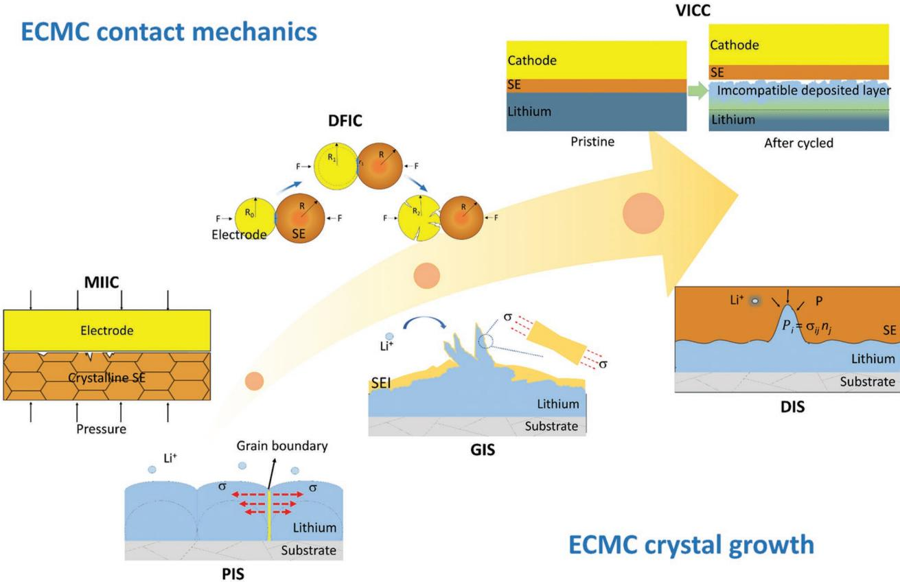

**Figure 1.** Illustration of multiscale ECMC issues and failure mechanisms for electrode/SE interface in SSBs. For physical contact, the significant issues are material incompatible induced contact problem (MIIC), deformation and fracture induced contact problem (DFIC), and volume change induced contact problem (VCIC). As to lithium deposition, the important ECMC issues are plating induced stress problem (PIS), growth induced stress problem (GIS), and deformation induced stress problem (DIS).

macroscale. Based on the observed results, well-established multiscale models are used to fundamentally understand the degradation mechanisms of the main components in SSBs. Subsequently, the established potential mechanical solutions to the degradation mechanisms of SSBs are summarized and the remaining challenges and future prospects for SSB interfaces are discussed.

# **2. Effects of ECMC on Electrode/SE Interfaces in SSBs**

#### **2.1. Physical Contact Compatibility**

Physical contact is an important factor affecting the quality of electrode/SE interfaces because it influences lithium ion transport and diffusion; poor interfacial contact can hinder the effective transport of lithium ions between the SE and electrode because few lithium ion transport pathways are available. Undesirable electrochemical kinetics at the SE/cathode interface is a particularly prominent problem in SSBs.[58,59] In conventional liquid LIBs, the contact resistance between an electrode and electrolyte is very low because of the wetting behavior of liquid electrolytes. Conversely, the interfacial resistance at the electrode/SE interfaces in SSBs is very high because of the poor interfacial contact between two solid conductors, contributing more than 60% of the total resistance of SSBs.[60] Here we discuss the interfacial contact compatibility between electrodes and SEs.

#### *2.1.1. Physical Contact at Cathode/SE Interfaces*

SSBs with bare cathode particles generally present poor charge/ discharge performance and limited cycle life. These problems are associated with insufficient physical contact between the cathode materials and SE, which leads to poor diffusion and transport of lithium ions (**Figure 2**a).[3,60–62] Therefore, solid cathode particles are often sintered together with SE powder (usually a ceramic electrolyte) to increase their interfacial contact. Sintering conditions such as temperature, sintering time, and pressure strongly affect the quality of such electrode/SE interfaces.[3] Kim et al.[63] used three different mixing methods to prepare composite cathodes that consisted of solid lithium cobalt oxide (LiCoO2) powder, SE, and Super P carbon. Battery cathodes are fabricated using the same components but different mixing methods presented diverse morphological properties and interfacial resistance (Figure 2b,c). It was apparent that more uniformly distributed cathode particles provided more favorable particle-to-particle contact and lowered

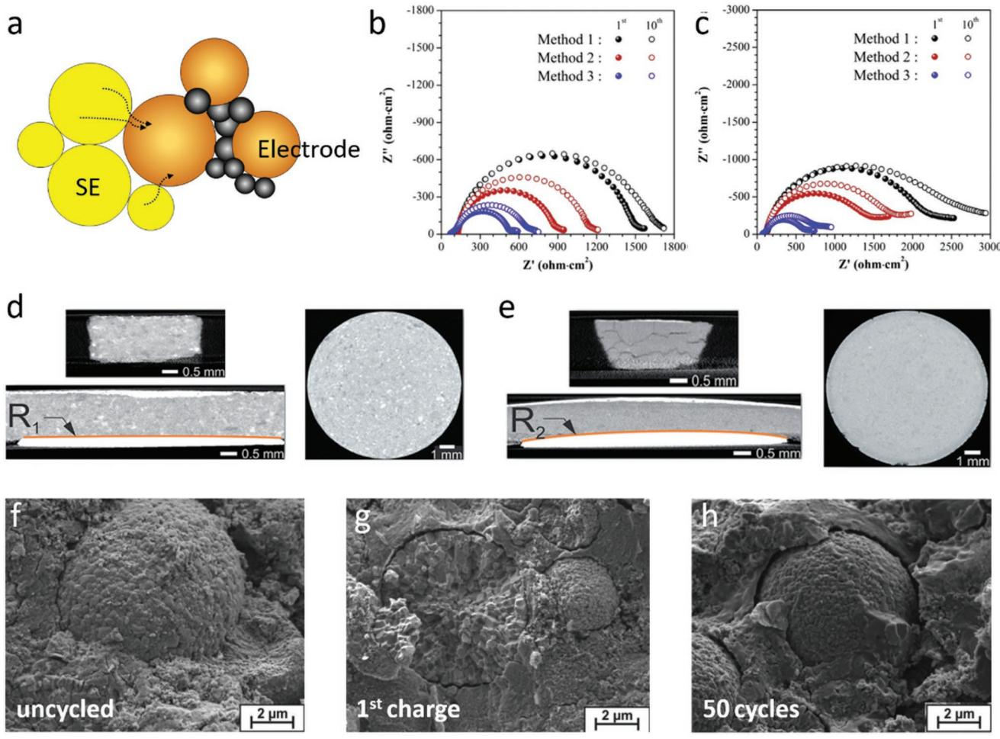

**Figure 2.** a) Schematic of poor point-to-point contact between cathode and SE particles. The black spheres represent carbon black and the black arrows indicate the lithium ion migration pathways. Reproduced with permission.[3] Copyright 2016, Springer Nature. b,c) Variation in the AC impedance spectra (1st/10th cycles) of the SSBs using composite cathodes prepared by three different mixing methods after a full charge to 3.6 V and a full discharge to 1.9 V. Reproduced with permission.[63] Copyright 2012, Elsevier B.V. d) Ex situ transmission X-ray tomography of a pristine SSB fabricated by isostatic pressing. e) Ex situ transmission X-ray tomography of an SSB after 1st charge at a current density of 0.1C. Because there is no external compressive pressure applied on the pellet during the galvanostatic charging, change in the shape of the cell was observed obviously in d,e). Reproduced with permission.[67] Copyright 2017, The Royal Society of Chemistry. f–h) Scanning electron micrographs of the cathode composite of NCM811 and β-Li3PS4 electrolyte: pristine, after 1st charge and after 50 cycles, respectively. The NCM-811 particles shrink during delithiation (charge) and lose contact with the SE. The remaining imprint of the NCM morphology on the electrolyte shows the initially intimate contact between the active material and the electrolyte. Reproduced with permission.[69] Copyright 2017, American Chemical Society.

the resistance and polarization of the cell, which increased its reversible capacity.

The physical mismatch at a solid/solid interface causes irreversible damage in the forms of material disconnection, poor physical contact, and increased internal resistance. When cathode particles and ceramic electrolytes are weakly bonded/ contacted or the SSBs are assembled using a ceramic film, problems induced by the interfacial incompatibility become highly prominent. Shen et al.[64] fabricated bulk-type SSBs using a garnet-structured electrolyte and found that the cell exhibited non-successive degradation during cycling because of the formation of cracks originating from the volume change of LiCoO2 particles in the composite layer. Crack formation in cathode particles would destroy the effective contact between cathode and SE particles. For soft polymer electrolytes, these problems would be slightly alleviated, but the interfacial resistance would be still a concern.

The volume changes that occur during repeated lithiation/ delithiation processes could enlarge the interfacial stress between electrode materials and SEs.[65,66] In liquid electrolyte-based LIBs, volume expansion of the electrodes is usually accommodated by the liquid electrolyte. Conversely, in SSBs, the cycling-induced increase of interfacial stress between electrode materials and SEs is prominent because of the rigid mechanical coupling between the SE and electrodes. Zeier et al.[67] studied the pressure and height changes in typical SSBs. They found that some cracks formed at the edges of the SE, and the charged cell and SE were bent because of the expansion of the electrode (Figure 2d,e). Tallarek and colleagues found that the void space between the LiCoO2 cathode and SE can markedly increase the tortuosity of ionic transport, which caused high interface impedance and hindered the transport of lithium ions.[68] For a cathode with a high nickel content, LiNi0.8Co0.1Mn0.1O2 (NCM-811), the volume expansion and interface mismatch is severe because of its substantial deformation during cycling. Janek et al.[69] investigated the interfacial behavior between NCM-811 and an SE and demonstrated that after cycling, the NCM-811 particles contracted and lost contact with the SE (Figure 2f–h). Recently, Wagemaker et al.[70] proposed that 2D lithium-ion exchange nuclear magnetic resonance (NMR) spectroscopy is an effective way to get unprecedented insight into the evolution of the resistance between an SE and cathode. The change of NMR chemical shifts indicated that the interfacial contact between Li2S and argyrodite Li6PS5Br electrolyte can be compromised greatly because of the large volume deformation of cathode particles and increased diffusion barriers caused by interfacial side reactions during cycling.

### *2.1.2. Physical Contact at Lithium Metal/SE Interfaces*

During cycling of SSBs with lithium metal anodes, the lithium metal anode shifts by several micrometers. The SE is likely to move with the lithium metal anode because of their interfacial adherence, resembling the behavior of chewing gum sticking to a shoe as it is lifted from a hot pavement.[71] The contact compatibility of electrode/electrolyte interfaces needs to be sufficient for stable battery operation. Unfortunately, the adhesion of SEs to anodes is generally weak in practical cases because of the large volume change of lithium metal anodes during cycling and poor interfacial wetting properties. Such results would lead to partial delamination and voids at the interface between SEs and lithium metal anodes, resulting in a large increase of interfacial impedance in SSBs during operation.

In batteries with polymer SEs, the interfacial contact between the electrolyte and lithium metal anode would be acceptable initially because polymer SEs are soft and flexible, allowing effective adherence to lithium metal.[2] However, the volume change of the lithium anode during cycling numerous times still eventually induces partial delamination and void formation between the lithium metal foil and electrolyte layer.[34] In batteries with inorganic ceramic SEs, the problem of poor interface compatibility is particularly serious; the interfacial resistance is very high because of the rigid nature of the ceramic SE. Hu et al.[40] demonstrated that the poor wetting properties of garnet SEs and molten lithium metal resulted in microscopic gaps at their interface, which led to a high interfacial resistance of up to 1710 Ω cm2 (**Figure 3**b,c). Guillon et al.[41] synthesized Al-contaminated Ta-substituted Li7La3Zr2O12 (LLZ:Ta) and Al-free Ta-substituted Li7La3Zr2O12 (HP-LLZ:Ta) SEs by a free sintering process and hot pressing, respectively. Analysis of the prepared samples by high-resolution transmission electron microscopy and electron energy loss spectroscopy revealed that there were some gaps at the grain boundaries between the SEs and lithium metal, along with a mixture of Li3N, Li2CO3, and LiOx phases formed along the grain boundaries (Figure 3d). Doeff and co-workers investigated the effect of postprocessing conditions on Al-substituted Li7La3Zr2O12 (LLZO) pellets and then established the relationship between surface properties and electrochemical performance.[72] They reported that a surface insulating layer formed on the LLZO surface upon exposure to the ambient environment and the high interfacial resistance primarily originated from the poor contact between the surface insulating layer and lithium metal. They found that an LLZO/lithium interface with low resistance could be produced through an elaborate polishing procedure.

The huge volume change of lithium metal anodes during cycling is another major problem that could cause interface failure in SSBs. As the lithium ions undergo reversible transfer between the anode and cathode, voids would appear at the interface between the lithium metal anode and SE because of the erosion of the lithium metal surface when the lithium ions move from the anode surface toward the cathode. Then, the lithium ions would deposit back on the anode to form a lithium metal layer on the anode surface. Compared with the pristine lithium metal, the deposited lithium metal layer is less dense. In other words, the volume of a lithium metal anode after full charge is larger than its pristine volume because of the deposition of a loosely packed lithium metal layer. This substantial volume change of the lithium metal anode causes delamination between the lithium metal anode and SE, inducing high interfacial impedance and lithium loss, as illustrated in Figure 3a.

Devaux et al.[34] investigated the mechanisms of capacity fade and failure in an LiFePO4/polystyrene-b-poly(ethylene oxide) (SEO)/lithium metal cell. The results implied that the cell failed because of partial delamination and void formation between the lithium foil and electrolyte layer (Figure 3e), which was caused by the different volumes of charged and discharged electrodes. A similar phenomenon was also found in liquid lithium metal batteries (Figure 3f). Sun et al.[35] investigated the morphological evolution of electrochemically plated/ stripped lithium microstructures by synchrotron X-ray phase contrast tomography. They presented a 3D characterization of electrochemically stripped lithium metal electrodes, which showed that the huge volume change during cycling changed the initially smooth interface between the anode and separator so that its possessed undulations and delaminated areas. Hovington and colleagues studied the interface between lithium metal and a polymer electrolyte in an SSB by in situ scanning electron microscopy (SEM) and electrochemical impedance spectroscopy during cycling.[36] The thickness changes of the cathode and polymer SE were not obvious in in situ SEM images. In contrast, because of the transfer of lithium ions between the cathode and deposited lithium film, the thickness of the lithium film varied markedly. During the first discharge process, the thickness of the lithium film decreased from 39 to 33 µm. At the end of the first charge process, the thickness of the lithium layer increased to 42 µm (Figure 3g). With further cycling, the thickness of the lithium layer changed periodically. After multiple cycles, the surface of the lithium film displayed increased roughness. The increase of roughness was small but continuous, indicating the aging of the SSB. They also found that when the lithium foil was too thin, holes formed in it through corrosion. In addition, when pressure was applied to the cell, the inhomogeneous lithium plating

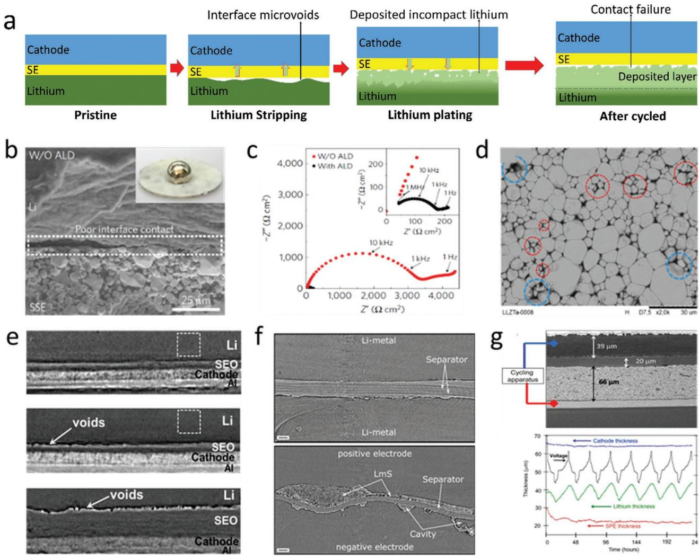

**Figure 3.** a) Schematic illustration of the effect of the anode volume problem. Both for lithium-metal anode and lithium-based intercalation compound, from left to right: a pristine state cell; anode then undergoes the first stripping (or de-intercalation) during discharge; anode undergoing the first plating (or intercalation) during charge; anode after many cycles. b) SEM images of the garnet SE/lithium metal interface, and the poor interfacial wetting behavior can be observed obviously, c) EIS profiles of the symmetric Li nonblocking garnet cells, which showed a great interface impedance. Reproduced with permission.[40] Copyright 2016, Springer Nature. d) Microstructure of LLZ:Ta. The blue dashed circles indicate the closed porosity and red dashed circles indicate the Al-Li glassy phase between the grains. Reproduced with permission.[41] Copyright 2016, American Chemical Society. e) The volume change problem observed on the cross section of lithium metal polymer batteries through the X-ray microtomography. From top to bottom, uncycled battery annealed at 90 °C, battery A after cycling and battery B after cycling. The dashed square shows the area used to normalize pixel intensity for thresholding calculations. Reproduced under the terms and conditions of the Creative Commons Attrubition License 4.0.[34] Copyright 2015, The Authors, published by The Electrochemical Society. f) The volume change problem observed in liquid lithium-metal battery. The Celgard separator is sandwiched between two lithium electrodes. There are uncycled pristine Li-Li-1 sample and Li-Li-2 sample after electrochemically stripping for 10 h at 0.3 mA·cm−2 from top to bottom. Reproduced with permission.[35] Copyright 2016, American Chemical Society. g) The volume change problem in Li1.2V3O8/lithiummetal battery observed by in situ SEM and the variations of the thickness of the different layers of the cell upon cycling; the voltage is reported in parallel as a function of time to relate the variations of thickness to the cycling process. Reproduced with permission.[36] Copyright 2016, American Chemical Society.

was decreased but not completely suppressed. The holes in the lithium foil were occupied by the polymer electrolyte under the applied pressure.

#### **2.2. Mechanical Factors Influencing Lithium Deposition**

Lithium dendrite formation is a serious problem in conventional liquid electrolyte-based LIBs. In the development of lithium metal batteries, the substantial problems induced by lithium dendrites have greatly hindered the development of safe full cells.[48,49,73] This problem still remains in the current typical SSB configuration[34,50–54,74] and the formation of dendrites strongly affects the performance of SSBs. On one hand, lithium dendrites can penetrate through the polymer electrolyte, leading to irreversible capacity fade and internal short circuit.[53,54] On the other hand, dendrite growth can damage solid-electrolyte interphase (SEI) layers and leave fresh lithium metal exposed to the electrolyte, resulting in direct reaction with the electrolyte to form a new SEI.[2,75] This process would repeat until the dendrite growth stops. Such side reactions can consume large amounts of electrolyte, which leads to high polarization in SSBs.[76,77]

Similar to lithium dendrites in liquid electrolytes, in SSBs the dendritic growth is also determined by three parameters, that is, current density,[50] temperature,[51] and intrinsic electrolyte properties.[52] Different from the lithium dendrites in batteries with liquid electrolytes, however, additional critical factors such as the elasticity modulus of the SE, viscoplastic behavior of lithium metal, and plating compressive stress also substantially influence the dendrite growth at the solid/solid interfaces in SSBs.

Newman et al.[78] used the linear elasticity theory to study the interfacial stability in lithium/polymer systems. They proposed that for a PEO polymer electrolyte, when the electrolyte shear modulus is about twice that of lithium, the interfacial roughness can be mechanically suppressed. Although this theory provides a primary mechanical benchmark for SEs, it is still difficult to achieve glassy SEs with such high shear modulus.[71,79,80] Based on Newman's study, Srinivasan et al.[81] proposed that the proper stress can lower the current at the tip of dendrites and eliminate the formation of dendrites by redistributing the current density at the lithium metal anode/SE interface. Harry et al.[55] monitored the internal structure evolution of a cell with a polymer electrolyte by time-resolved hard X-ray microtomography and found that the current density was initially maximized at the lithium globule tip. Conversely, the current density was maximized at the globule perimeter during later cycles (**Figure 4**b). They established a simplified geometric model for a globule dendrite (Figure 4a) and determined the stress distribution in the vicinity of a growing globule based on the deformation of the polymer electrolyte. The results revealed that the globule grows mainly in height in the early growth stages. Consequently, both the compressive stress at the globule tip and tensile stress at the globule perimeter increased substantially from 8.27 to 16.53 C cm−2 (Figure 4c–f). As the globule broadened in the intermediate growth stages, these stresses relaxed. The maximum compressive stress occurred at a finite distance above the tip, not at the tip, which is a consequence of the severe stretching experienced by the electrolyte. It presented that when dendrites penetrate through SE, great local stress would appeare at the tip of dendrites, which would make obvious influence on the distribution of current density at the tip.

In addition, the mechanical properties of lithium metal also affect dendrite growth. Because the yield strength of lithium metal is low, the stress generated at a lithium metal/SE interface could cause plastic deformation in the lithium electrode at a yield strength that is a fraction of the modulus. During cycling, further plastic deformation may cause lithium redistribution, leading to a change in the shape of the lithium anode/ SE interface. Therefore, it is important to comprehensively understand the mechanical properties of lithium metal, especially its plastic flow behavior.

Wang et al.[82] conducted nanoindentation tests on pure lithium metal in an argon-filled glove box to study its viscoplastic behavior at room temperature (**Figure 5**b). Combining nanoindentation measurements with an iterative finite element modeling approach, they determined a constitutive law for the viscoplasticity of lithium. Their results revealed that the elastic modulus (of the order of GPa) had negligible influence on the indentation response of lithium. This indicates that elastic deformation of lithium metal would be very small, so the viscoplastic deformation should mainly be considered when designing lithium metal electrodes. Based on the experiment results of Wang et al., Anand et al.[83] studied the mechanical interaction between a lithium metal and SE by a large deformation isotropic elastic-viscoplastic theory and finite element simulations. They found that the asperities on the surface of lithium metal flattened when the metal layer was compressed tightly by the smooth SE. However, when some cavities were present on the surface of SE, lithium metal deformed greatly to

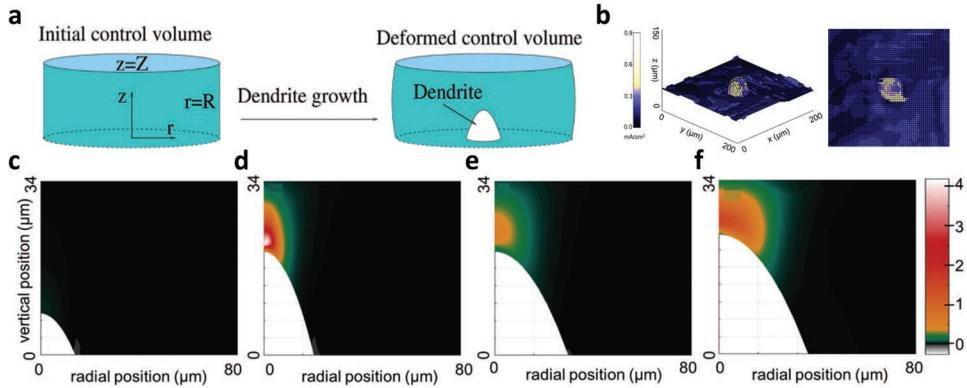

**Figure 4.** a) Diagram of computational domains in initial and deformed states. The top and bottom surfaces remain stationary, except in the globule region. The outer edge of domain displaces outward to compensate for intrusion of the globule and the limited compressibility of electrolytes. b) Local current densities maps the growth of lithium. In the initial stages, a perturbation at the lithium/electrolyte interface resulted in a higher average current density than that at the tip of the small globule (left image); as the globule grew, the current delocalized away from the tip of the globule(right image). c–f) Maps of stresses in the polymer electrolyte due to compression from the growing lithium globule. Stresses are based on an electrolyte with a modulus of 106 Pa. The polymer electrolyte experienced compressive stresses at the tip of the lithium globule and tensile stresses at the perimeter under different current densities, (c) 8.27 C cm−2 , (d) 16.53 C cm−2 , (e) 35.82 C cm−2 , and (d) 54.72 C cm−2. Reproduced under the terms and conditions of the Creative Commons Attrubition License 4.0.[55] Copyright 2016, The Authors, published by The Electrochemical Society.

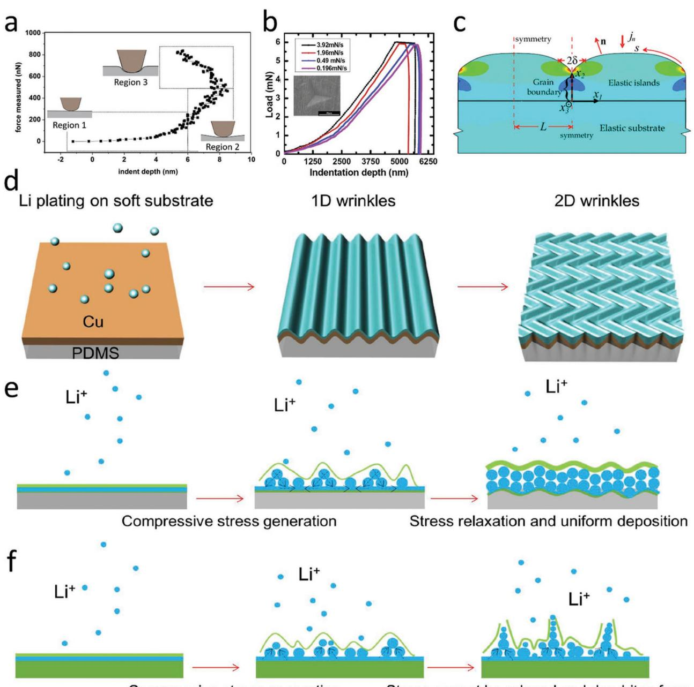

**Figure 5.** a) Force versus depth of indent curve used to calculate the elastic modulus of lithium metal, with peak force-applied greater than that required to produce plastic deformation. The regions 1, 2, and 3 illustrate schematically the different behaviors of the tip as the applied force increases. Reproduced under the terms and conditions of the Creative Commons Attrubition 4.0 International License.[56] Copyright 2016, The Authors, published by Springer Nature. b) Typical load-displacement curves of lithium metal with different loading rates. Tested by the nanoindentation experiment in an argon-filled glove box. Reproduced with permission.[82] Copyright 2016, Acta Materialia Inc. c) Representative geometry of an array of evolving islands when metal ions are deposited on the elastic substrate. Adjacent islands extruded and coalesced until the stable grain boundary formed between them, which caused significant plating stress on the substrate. Reproduced with permission.[84] Copyright 2007, The American Physical Society. d) Cu thin film wrinkles due to the compressive stress generated during lithium plating; e) Upon lithium electroplating, compressive stress is generated, and soft substrate releases compressive stress, and thus mitigates lithium dendrite growth. f) Lithium plating-induced compressive stress cannot be relaxed on hard Cu foil, and causes the formation of lithium dendrite. Orange, blue, green, and gray represent Cu, lithium, SEI, and PDMS, respectively. Reproduced with permission.[57] Copyright 2018, Springer Nature.

fill the cavity space. Campbell and co-workers investigated the mechanical and wear properties of lithium metal using atomic force microscopy (AFM) in an airtight cell.[56] They found that the lithium metal surface underwent work hardening because of the presence of residual compressive stress (Figure 5a). The residual tensile stress beneath a spherical indenter was found to lower the current density at the dendrite tip and eliminate dendrite formation entirely.[56]

Plating compressive stress is another important factor influencing dendrite growth. Dendritic growth is intrinsically a process of metal electrochemical deposition, and three typical stages have been observed in the growth process. In the initial stage, isolated islands are generally found to nucleate and grow. In the subsequent stage, adjacent islands coalesce and the resultant channels are connected until a stable grain boundary forms between the adjacent islands (Figure 5c). Finally, continuous films form and continue to grow with constant deposition.[84–88] A corresponding polycrystal growth model has been well studied for thin films fabricated by vapor deposition, revealing that there is a complex relation between the growth morphology and stress of thin films. For materials with high surface mobility, the first, second, and third growth stages are associated with compressive, tensile, and compressive stress evolution, respectively. In contrast, materials with low mobility do not recover back to the compression state at the last stage and the tensile stress increases during film formation.[57,89] Such a complex relation between plating stress and dendrite formation also exists in both LIBs and SSBs with lithium metal anodes. Lithium deposition induces plating stress, and the accumulating residual stress in turn influences the lithium deposition morphology. However, the relevant investigations of SSBs are still very scarce. Recently, Jiang et al.[57] proposed that the lithium plating stress in liquid electrolyte-based batteries can be effectively released by using a soft current collector. They used polydimethylsiloxane (PDMS) and a copper thin film as the soft substrate and current collector, respectively. The results showed that dendrite growth was inhibited on such soft substrates through surface wrinkling-induced stress relaxation in the deposited lithium film. Such a novel approach should be a promising way to inhibit dendrite growth in SSBs (Figure 5d–f).

# **3. In Situ Observation Techniques of the Electrode/SE Interfaces in SSBs**

Future development and performance optimization of batteries critically depend on fully understanding the electrochemical reactions and degradation processes that occur during cycling. Therefore, in situ study of electrochemical processes is a powerful strategy to track the structural and chemical transformations during battery cycling. In this section, we summarize the in situ techniques commonly used to investigate SSBs.

### **3.1. In Situ Optical Microscopy**

The diffraction limit of visible light means that optical microscopy has a low resolution that therefore limits the detection of nanostructures. Through combination with electrochemical devices, in situ optical microscopy may offer a large-area view of the microstructure evolution or color change of a battery during charge/discharge cycling (**Figure 6**a).

Application of optical microscopy, especially in situ optical microscopy, to SSBs has been very limited because the optically opaque SEs (polymer and inorganic SEs) typically used in SSBs only allow observation of the morphology of dendrites from the side. Therefore, relevant studies on SSBs using in situ optical microscopy are very limited. To solve the problem of opaque SEs, Rosso et al.[50,90,91] heated a solid cell in a furnace at temperatures above 80 °C. This method not only improved the ionic conductivity of the electrolyte, but, more importantly, increased its optical transparency to allow in situ optical observation. As shown in Figure 6b,c, a visualization cell was developed to study polymer electrolytes. Using their setup, they observed the initiation and evolution of dendrites in lithium/ polymer/lithium symmetric cells and found that the dendrites displayed a thermofusible effect, that is, the dendrites burnt under a sufficiently high current. Porz et al.[74] used in situ optical microscopy to monitor lithium metal penetration into an Li6La3ZrTaO12 (LLZTO) electrolyte during electrodeposition. Crack formation and propagation occurred in the electrolyte at a current density of 5 mA cm−2 (based on the area of the gold electrode). Other in situ optical observations on an SSB with a sulfide SE have also been carried out, along with ex situ SEM observation for verification.[92]

#### **3.2. In Situ Scanning Electron Microscopy**

In situ SEM has higher resolution than that of optical microscopy, so it is usually used to examine the initial interface topography, dendrite nucleation, and plating/stripping processes in SSBs (Figure 6d–f). As early as 1988, Armand et al.[93] conducted in situ SEM measurements to observe the morphological changes of cathode materials during the discharge process of lithium batteries with polymer electrolytes. In 1998, the same group used in situ SEM to examine the electrochemical performance of SSBs with solvent-free solid-polymer electrolytes (Figure 6e).[94] Recently, Hovington et al.[36] reported in situ SEM characterization of lithium metal/polymer batteries with nanosized C-LiFePO4 and nanosized Li1.2V3O8, as shown in Figure 6f. They observed the interface evolution of SSBs, finding that the thickness of the lithium film varied considerably because of the lithium transfer between the cathode (nanosized C-LiFePO4 and nano Li1.2V3O8) and deposited lithium film. Using in operando SEM, Marceau et al.[95] studied different phenomena in lithium/polymer SE/sulfur cells, such as dissolution of various polysulfide species in the polymer SE, the formation of an insulating sulfur-rich layer on the lithium metal surface, the appearance of elemental sulfur during the charge reaction at a voltage higher than or equal to 2.3 V, and the decrease of the polymer SE thickness upon cycling. Sagane and colleagues observed the morphology variation during electrochemical lithium plating/stripping reactions at a LiPON glass electrolyte/copper current collector interface by in situ SEM.[96] Similarly, Kuwabata et al.[92] studied the electrochemical lithium deposition and dissolution mechanism in bulk-type SSBs with a Li2S-P2S5 SE by in situ SEM observation. They first fabricated bulk-type solid-state cells with 80Li2S·20P2S5 glassceramic SE layers and lithium foils in a dry argon-filled glove box, and then put samples in a holder to maintain the inert atmosphere during transfer to the SEM apparatus. Motoyama et al.[97] conducted the in situ observation experiment of lithium

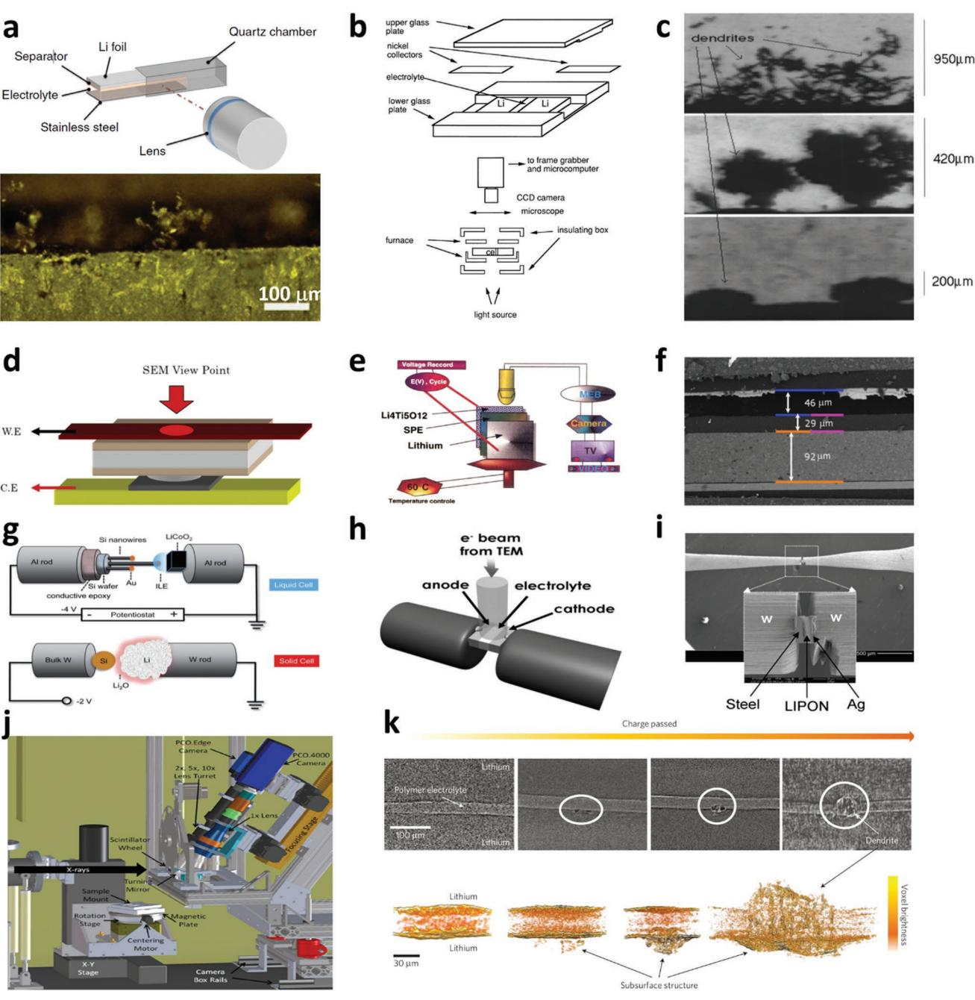

**Figure 6.** a) Schematic illustration of the quartz liquid cell device and the dendrite observed by in situ optical microscopy in liquid lithium ion battery. Reproduced with permission.[207] Copyright 2015, Nature Publishing Group. b,c) Schematic representation of the in situ optical cell and the typical dendrites obtained with different current densities. Reproduced with permission.[90] Copyright 1997, Elsevier Science Ltd. d) Schematic diagram of an in situ electrochemical SEM cell to observations of Li plating and stripping reactions at the solid electrolyte/Cu interface. Reproduced with permission.[96] Copyright 2012, Elsevier B.V. e) In situ SEM experimental platform for anode expansion study. Reproduced with permission.[94] Copyright 1998, The Electrochemical Society. f) In situ cross section SEM image of the LFP cross section. Reproduced with permission.[36] Copyright 2015, American Chemical Society. g) Schematic illustrations of the open cell nanobattery setup inside a TEM, enabling in situ TEM electrochemical experiments. Reproduced with permission.[105] Copyright 2011, The Royal Society of Chemistry. h,i) Design concept for in situ TEM observation of the lithium ion battery using solid electrolyte in a thin film system and the SEM image showing A0020FIB microfabricated thin slice of battery is welded onto two electrodes. Reproduced with permission.[110] Copyright 2010, Materials Research Society. j) The CT experiment equipment at the advanced light source of Lawrence Berkeley National Laboratory, Berkeley. Reproduced with permission.[208] Copyright 2012, Society of Photo-Optical Instrumentation Engineers. k) Evolution of dendrite growth: X-ray tomography slices showing the cross sections of symmetric lithium cells cycled to various stages. The thin, bright horizontal strip through the center of the images is the polystyrene-block-poly(ethylene oxide) copolymer electrolyte sandwiched between two lithium metal electrodes. Reproduced with permission.[52] Copyright 2013, Springer Nature.

plating and stripping with platinum current collector on LiPON glass electrolyte. They presented that when lithium-platinum alloying reactions reached saturation, lithium particles would grow and deform the supersaturated alloyed film into a dome shape. With lithium particles growing constantly, the deformation would make the alloyed film fracture. One of the biggest advantages of in situ SEM is that the sandwich structure of battery samples to examine is very colse to a real battery structure, and sometimes the samples would also exhibit good cycle performance. Golozar et al.[98] recently monitored the cycling behavior of SSBs with LiFePO4 cathodes through in situ SEM. They presented that during cycling, lithium dendrites with hollow morphology and great hardness would penetrate through the polymer electrolyte. Besides, their experiment results also revealed that controlling pressure on the battery can effectively inhibit the formation of dendrites.

Similar to optical methods, in situ SEM can only observe the battery cross section, but at higher resolution than optical observation technology. In addition, the structure of a battery able to be examined by in situ SEM is closer to a real battery compared to that observed in transmission electron microscopy (TEM) experiments. Thus, in situ SEM is a quite effective method to study ECMC issues in the visualization of SSBs, including the evolution of interface contact, electrode deformation, and lithium depositon.

#### **3.3. In Situ Transmission Electron Microscopy**

The resolution of TEM can reach the atomic level, which is much higher than those of optical microscopy and SEM. Micrometer-scale batteries need to be constructed to observe the surface deformation of an electrode using in situ TEM technology.

For in situ TEM of ordinary liquid electrolytes, it is necessary to use a sealed film to prevent evaporation in the highvacuum environment, and the film needs to be thin enough to allow penetration of the electron beam.[99–108] In addition, the cell to be characterized by in situ TEM must be miniaturized to certain dimensions, which differ from those of a conventional battery. For example, a nano liquid battery used for in situ TEM observation is usually composed of a small amount of active materials (e.g., only a few nanowires) and electrolyte, which could operate for no more than ten cycles (Figure 6g).[100,101,106]

Brazier et al.[109] performed the first cross-sectional observation of a solid-state lithium ion "nanobattery" by TEM, but their method could not be used to conduct in situ observation. They pointed out that in situ TEM for SSBs faces numerous challenges such as the battery fabrication process, poor contact between the electrolyte and anode, and rapid deterioration of the anode/electrolyte interface during cycling because of the migration of the chemical elements between the electrode and electrolyte layers. Based on Brazier's work, Wang et al.[110] expended great effort exploring the design concept and technique of in situ TEM investigation of LIBs with an SE (LiPON). Figure 6h,i shows the conceptual design and preliminary work based on focused ion beam microfabrication of a thin film battery to carry out in situ TEM observation. However, because of the tiny scale of this battery system, the battery was already disconnected from the current collector after loading on the TEM holder. Recently, Wang et al.[111] successfully studied the interface evolution of LiCoO2/LiPON/Si thin film battery by in situ scanning transmission electron microscopy (STEM), they found that there was a disordered interfacial layer forming on the LiCoO2/LiPON interface without cycling. And when in situ charging, the layer evolved to more highly oxidized Co ions, lithium oxides, and lithium peroxides, which indicated that the interfacial impedance between LiCoO2 and LiPON was caused by the interface reactions. On the basis of previous work, Chen et al.[112] successfully achieved the applicition of in situ TEM in a working solid state battery. They assembled nano batteries with LiCoO2 cathode, LLZO electrolyte, and gold anode. From in situ TEM observation, they found that after high voltage delithiation, the pristine single crystal LiCoO2 would become nanosized polycrystal connected by coherent twin boundaries and antiphase domain boundaries, which was greatly different from a series of phase transitions of LiCoO2 taking place in liquid electrolyte batteries during delithiation. It is noticed that both the works by Wang et al. and Chen et al. did not employ the lithium metal anode due to its high chemical activity and high operation difficulty. With the development of microfabrication technology and optimization of TEM testing environments, it is hoped that in situ TEM observation LIBs with SEs will be achieved in the future. Such observations should greatly contribute to the study of the ionic conduction mechanism at electrode/SE interfaces.

#### **3.4. In Situ X-Ray Tomography**

For traditional in situ observation measurements such as in situ optical microscopy, SEM, and TEM, it is necessary to design specific battery devices to allow observation and these devices often differ considerably from the practical batteries. X-ray tomography is a new type of nondestructive testing technique that can detect the internal structure evolution of practical batteries (Figure 6j).[97,113–116] The resolution of a conventional X-ray system is determined by the X-ray spot size, which depends on the X-ray source and working distance between the sample and source. The X-ray spot size in turn determines the X-ray field-of view and magnification.[117] X-ray tomography often has high resolution and can thus be used to observe lithium dendrite growth, cathode particle deformation, and electrode/electrolyte interface evolution during charge– discharge processes. Some researchers have used ex situ X-ray tomography to study the failure mechanism of SSBs, but the application of in situ X-ray tomography to the study of SSBs is still limited.

Devaux et al.[34] conducted early research on electrode/SE interface evolution by ex situ X-ray tomography. By imaging batteries using synchrotron hard X-ray microtomography, they found that after cycling, partial delamination between the lithium foil and solid block polymer electrolyte was the main reason for the capacity fade and failure of the battery. Harry and colleagues used ex situ synchrotron hard X-ray microtomography to study the effect of cycling temperature (from 90 to 120 °C) on dendrite growth of a battery containing a polymer electrolyte and LiTFSI.[51] The X-ray tomography

**www.advancedsciencenews.com www.afm-journal.de** images revealed that the location of lithium dendrites depended on temperature because the rheological properties of the polymer electrolyte were affected by temperature. At 90 °C, a large portion of lithium dendritic structure resided within the lithium electrode, whereas at 105 and 120 °C, most of the dendrites were located within the electrolyte. Based on their previous work, Harry et al.[52] then successfully developed an in situ X-ray microtomography instrument to study the dendrite growth in symmetric lithium/polymer/lithium cells. From the reconstructed volume of the dendritic structure, they found that during the early stage of dendrite growth, the bulk of the dendritic structure lay underneath the polymer/electrode

interface. Furthermore, they observed crystalline impurities that were present in the uncycled lithium anodes at the base of the subsurface dendritic structures. The dendrite protruded further into the electrolyte upon cycling until it reached the other electrode/electrolyte interface and caused a short circuit (Figure 6k). According to these experimental results, a new solution to prevent dendritic growth was proposed, which was to inhibit the formation of subsurface structures in the lithium electrode.

All in situ observation techniques mentioned in Section 3 can give us an intuitive understanding of the working mechanism of SSBs. It is very important to use a combination of these techniques to study the effects of ECMC in SSBs. At the micro- and macroscales, in situ optical microscopy and SEM can be used to study the electrode/SE interface evolution and electrode deformation. In situ TEM can be used to investigate the nanoscale, providing important information about electrochemical reactions and ion transport at electrode/SE interfaces. An extensive range of subjects can be studied using in situ X-ray tomography. At the microscale, in situ X-ray tomography can effectively identify the deformation of electrode particles, dendrite formation, and the microscale evolution of the interfaces between electrode particles and SEs. In addition, in situ X-ray tomography is also important for practical application of SSBs because it can be used to observe the internal structure evolution and failure mechanism of large and commercial SSBs at the macroscale.

# **4. Theoretical and Computational Research on ECMC at Electrode/SE Interfaces**

#### **4.1. Contact Mechanics at Electrode/SE Interfaces**

Effective electrode/SE contacts require sufficient contact areas to provide lithium-ion transport paths. However, two solids will generally not make atomic contact everywhere within the nominal (or apparent) contact area when they are pressed together. Mechanical pressure can strongly affect the interface microtopography and contact area through deformation. This feature has dramatic practical implications and must be considered in many technological applications for SSBs.

Hertz contact theory is one of the most well-known contact theories. Hertz contact theory describes the contact between two elastic spherical bodies of radii *R*1 and *R*2 with perfectly smooth surfaces. Assume that the spheres are squeezed together by force *F*. The deformation field in the solids can be determined by minimizing the elastic deformation energy.[32] The radius of the circular contact region *r*0 (**Figure 7**a) is given by the following equation.

$$
r_0 = \left(\frac{R_1 R_2}{R_1 + R_2}\right)^{\frac{1}{3}} \left(\frac{3F(1 - \nu^2)}{4E}\right)^{\frac{1}{3}}\tag{1}
$$

where *E* and υ represent the equivalent modulus and equivalent Poisson ratio, respectively, and are determined by

$$
\frac{1 - v^2}{E} = \frac{1 - v_1^2}{E_1} + \frac{1 - v_2^2}{E_2}
$$
 (2)

where *E*1 and *E*2 represent the elastic moduli of two solids and υ1 and υ2 are the corresponding Poisson ratios.

In Hertz contact theory, the deformation field in solids is determined by minimizing the elastic energy and interfacial binding energy. This theory explicitly reveals that the deformation of two spheres at their interface can increase their effective contact area. However, the Hertz theory is a very simplified situation and cannot be used for large contact areas (>50%) because it neglects the interaction between contacting asperities. To accurately analyze the contact area evolution between an electrode and SE, Qi et al.[32] studied the contact area loss between an electrode and SE using the 1D Newman battery model and Persson contact mechanics theory, as illustrated in Figure 7b. The simulation results revealed that the discharge voltage and capacity of SSBs drop much faster at high rate than at low rate because of the loss of contact area between SEs and electrodes. They also found that when a suitable pressure was applied to the electrode/SE interface, the contact area could be effectively recovered because of the deformation of the SE and electrode.

For inorganic SE, the active particles are tightly embedded in a mixed conductor, consisting of rigid SE particles and electronically conductive additives. When lithium ions are inserted into electrode particles, actives particles will expand greatly, and the interaction force between cathode and SE particles will increase enormously because of the powerful mechanical constraint. The resulting high stress could cause active or SE particle failure and fracture. Carter et al.[118] first presented a quantitative evaluation model to study the stress evolution caused by lithiation-induced expansion of active particles in SSBs and concurrently predicted the extension of fracture of an inorganic SE matrix. Although the focus of their study was negative particles constrained by the surrounding SE matrix, the anode material in SSBs is usually lithium metal so their method is more appropriate for sintered composite cathodes than SSB anodes. According to the theoretical continuum model proposed in their previous work,[119] they presented a finite element model that contained 36 randomly oriented square particles and a square SE matrix (dimensions of 11 × 11 µm). The squares with sharp corners approached the real representation of active particles[120] and their area ratio was about 50%. They used a cohesive zone model to simulate the evolution of damage and then presented the quantitative conditions under which fracture

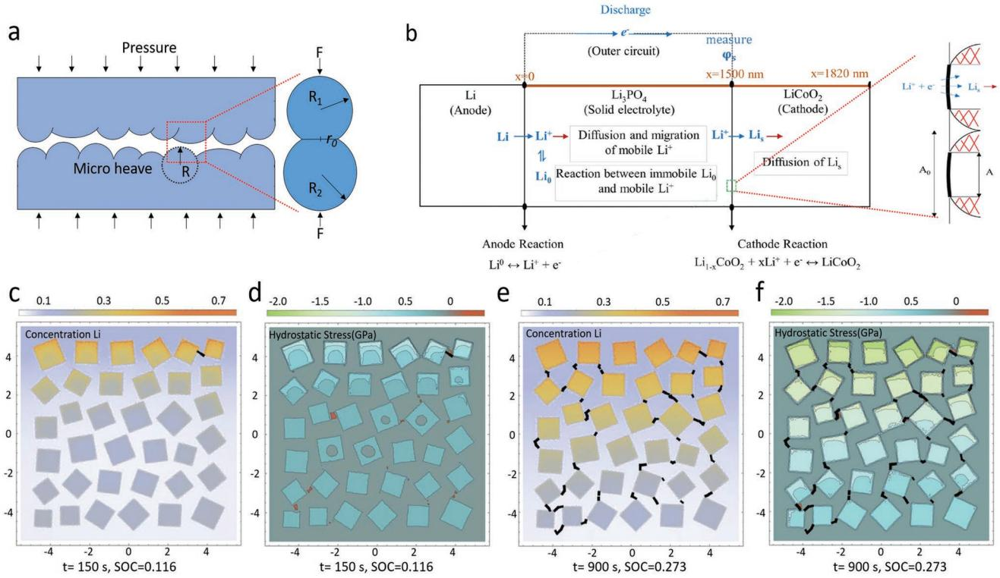

**Figure 7.** a) Schematic of contact between two rough surfaces in Hertz contact theory. Two solids are squeezed together with pressure. At the local in the interface, the micro heaves were simplified as spherical objects and a circular contact area (radius *r*0) is formed. The spheres are squeezed together with the force F and the deformation of two spheres can effectively increase the contact areas. Reproduced with permission.[33] Copyright 2006, Elsevier. b) 1D model of SSBs based on contact mechanic theory and 1D Newman battery model. The model includes a lithium metal negative electrode, a 1500 nm-thick Li3PO4 as SE, and a 320-nm thick LiCoO2 cathode. Contact coefficient γ represents the ratio of the real contact area A to the total area A0. γ = 1 represents that there is a perfect contact at the SE/electrode interface and γ = 0 represents that the SE and electrode are not contact together. Reproduced with permission.[32] Copyright 2017, The Electrochemical Society. c,d) Lithium distribution and the hydrostatic Cauchy stress caused due to the expansion of active particles when stage of charge(SOC) = 0.116; e,f) lithium distribution and the hydrostatic Cauchy stress caused due to the expansion of active particles when SOC = 0.273. Black lines represent the cracks propagating within the SE material, and their thickening represents progressive interface separation and accumulation of damage. Reproduced with permission.[118] Copyright 2017, The Royal Society of Chemistry.

would occur. The Young's modulus and fracture energy of the SE were set as 15 GPa and 1.0 J cm−2, respectively, and the current density was set as a constant value at 1 mA cm−2. The finite element simulations indicated that fracture occurred when particles had only 3% volume deformation (Figure 7c– f). The compressive stress in the active particles was higher than 1 GPa when their lithium capacity reached 50% of the total value. In addition, they also studied the effect of fracture energy on the damage progress of SEs and found that when the fracture energy of an SE matrix is higher than 1.0 J cm−2 and the volume deformation of active particles is lower than 7.5%, the fracture failure of SEs can be effectively prevented. The results obtained by Carter and colleagues provided quantitative selection criteria for inorganic SEs and reminded us that many mechanical properties of SEs, including Young's modulus, fracture energy, and fracture toughness, can greatly affect electrode/SE interfaces. The existing research only considers simple Hertz theory between two elastic spherical bodies and it neglects complicated structures with rough surface and large deformation of two contact objects. In addition, the existing research only focused on the the influence of mechanics on electrochemistry at interface. So the fully coupled electro–chemo–mechanical model for electrode/ electrolyte contact urgently needs to be proposed to study the interface evolution in SSBs.

#### **4.2. ECMC Analysis of Lithium Dendrites**

Separators in liquid electrolyte-based LIBs have proved to be ineffective at preventing the growth and penetration of lithium dendrites. Therefore, SEs with both high mechanical stability and high ionic conductivity have been studied extensively. Although plenty of computational models have been used to study the mechanical aspects of dendrite growth in liquid electrolyte-based LIBs,[121–128] very few relevant studies on SSBs have been reported. Of the well-studied electrolyte prototypes, polymer and ceramic SEs may suffer from performance degradation induced by dendrite growth from the lithium anode. In cells with polymer electrolytes, the mechanical properties of

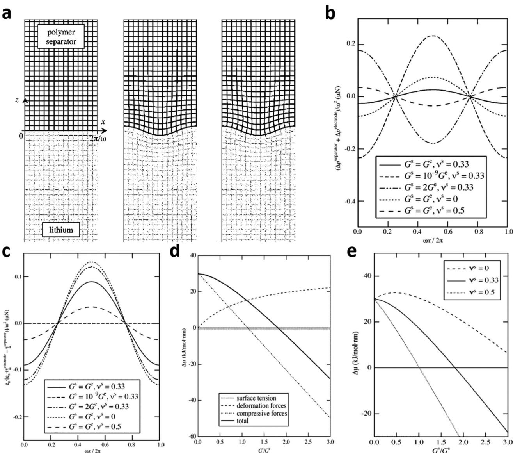

**Figure 8.** a) Displacement distributions yielded at different polymer shear moduli. One period of displacement in *x* and 1.5 displacement periods above and below the *z*-axis are shown in each figure. The upper region has the material properties of lithium and the lower has properties characteristic of a separator. b) Gage pressure term from Equation (4) with *A* = 0.4/ω for separators with various elastic properties. c) Deformation stresses term from Equation (2) with *A* = 0.4/ω for separators with various elastic properties. d) Contributions of compressive forces, deformational forces, and surface forces to the interfacial stability parameter as a function of separator shear modulus. e) Interfacial stability parameter as a function of separator shear modulus and Poisson's ratio. Reproduced with permission.[78] Copyright 2005, The Electrochemical Society.

the SEs are the main factors responsible for hindering lithium dendrite penetration.

Newman et al.[78] established a theoretical model to evaluate the effects of polymer shear modulus and Poisson's ratio on the interfacial stability of lithium metal/polymer SE systems with the aim of qualitatively determining the related values to suppress dendrite growth. In their theoretical model (**Figure 8**a), the interface between lithium metal and the polymer SE was assumed to possess an idealized 2D displacement of arbitrary amplitude and frequency. Analytical solutions were obtained for the 2D elastic field of lithium metal and polymer electrolyte in the regime of linear elasticity. The geometrical configurations of the interface in different deformation states revealed that the surface was subjected to a periodic displacement in the *z*-direction with amplitude *A* and frequency ω, which is defined by the following equation.

$$
u_z(x,0) = A\cos(\omega x) \tag{3}
$$

To solve the steady-state equation of motion and boundary conditions, the deformation stresses on either side of the interface were obtained analytically, which satisfied the relationships.

$$
\Delta p^{\text{electrolyte}} + \Delta p^{\text{separation}}   
\n= A\omega \cdot \frac{G^{s2}(3 - 4\nu^{\epsilon}) - G^{c2}(3 - 4\nu^{\epsilon})}{G^{s}(3 - 4\nu^{\epsilon})(1 - \nu^{\epsilon}) + G^{s}(3 - 4\nu^{\epsilon})(1 - \nu^{\epsilon})} \cos(\omega x)
$$
\n(4)

$$
e_n \cdot [e_n \cdot (\tau_-^{\text{electrolyte}} - \tau_-^{\text{separator}})]
$$
  
=  $-A\omega \frac{4G^s G^e [1 - (\nu^s + \nu^e) + (1 - 2\nu^s)(1 - 2\nu^e)]}{G^s (3 - 4\nu^e)(1 - \nu^s) + G^e (3 - 4\nu^s)(1 - \nu^e)} \cos(\omega x)$  (5)

where **e***n* is the unit surface normal vector pointing into the electrolyte solution, *v* is the Poisson ratio, *G* is the shear modulus, and τ = *i* and Δ*pi* are the deformation stress tensor and compressive force, respectively. Equations (4) and (5) show that τ = *i* and Δ*pi* are both strongly related to the mechanical properties (*G* and *v*) of the polymer SE and lithium metal. i) Initially, Δ*pi* is strongly influenced by the elastic properties of the polymer, and the sign of the force amplitude could be even reversed with the adjustment of *v* and *G* of the polymer SE (Figure 8b). ii) Similarly, the deformation stresses are also related to the elastic properties of polymers. Theoretically, there would be no deformation stress at the interface if *G* is almost zero. iii) The interfacial stability parameter (Δµ), which represents the electrochemical potential change in the electrons within the electrode induced by local strain or interfacial shape change, is a function of *G* of the separator. In fact, Δµ is affected by compressive forces, deformational forces, and surface tension (Figure 8d). Generally, surface tension is beneficial to promote electrode stability because of its negative contribution to Δµ. However, surface tension delivers a much smaller contribution to Δµ than those of compressive and deformational forces. This mechanical phenomenon is substantially different from past theories of electrode stability, which consider that surface tension is the major force that promotes stability at lithium/liquid interfaces. Deformational forces are found to greatly damage the electrode stability over the whole *G* range of SEs. As *G* increases, the contribution of deformational force could enlarge simultaneously until approaching a maximum value. Additionally, compressive forces in the SEs would contribute to the interfacial stability when *G* is greater than 1.125 *Ge*. iv) In addition to the effect of *G* on the SE compressibility, the effect of *v* was also investigated (Figure 8c–e). When the SE was assumed to be incompressible, interfacial stability could be obtained when *G*s/*G*e = 1. In contrast, stability is more difficult to achieve if the SE is compressible. This qualitative analysis highlights that the resistance to bulk compression in the system could contribute substantially to electrode stability, providing the solution of introducing highly rigid ceramic particles into the polymer SE to prevent lithium dendrite growth.

Natsiavas et al.[129] formulated a model of the growth of electrode/SE interfaces in lithium batteries in the presence of an elastic prestress. This model accounted for the kinetics of lithium ion transport through an SE and, within the interface, it explained the kinetics of lithium ion adsorption by the anode, electrostatics, and the elastic field. The elastic field was calculated by asymptotic analysis of a nearly flat interface between two semi-infinite elastic bodies (**Figure 9**a). Based on their mathematical model, a linear stability analysis was conducted

to determine the effects of critical unstable wavelength, state of prestress, and fundamental parameters including surface diffusivity, surface energy, deposition kinetics, and elastic moduli on interfacial roughening (Figure 9b–d). Then, the model was examined considering the experimental observations of the effect of applied pressure on lithium/dioxolane dimethoxyethane electrolyte systems. With reasonable choices of parameters and some calibration, the model accounted for the observation that a modest applied pressure resulted in substantial suppression of the roughening of the lithium surface during cycling.

Besides the sufficient modulus, recently, Ahmad and Viswanathan proposed that the interfacial stability or roughening conditions at solid/solid interfaces can also depend on the Poisson's ratio and density change at the interface.[130,131] They derived general stability criteria for electrodeposition at solid/solid interfaces using linear stability analysis and assumed that the solids were linearly elastic isotropic materials. Based on the stability criteria, they presented a general stability plot with two parameters, shear modulus ratio and molar volume ratio, and found that two distinct regions of stable electrodeposition were present. The results indicated that typical inorganic SEs have a higher shear modulus but lower molar volume than that required for stable electrodeposition, and solid polymer electrolytes have a higher molar volume but lower shear modulus than the requirements; as a result, both types of electrolytes can cause unstable electrodeposition. The stability plot illustrated that an SE with a combination of high (low) lithium molar volume and high (low) lithium shear modulus is required for stable electrodeposition (Figure 9e). Additionally, Ahmad and Viswanathan[132] further developed the model considering the anisotropic mechanical response at solid/solid interfaces. They first considered the treatment of anisotropy in the elastic tensor, and then applied the Stroh formalism to solve deformation equations obtained on a linear perturbation. The results indicated that the stability parameter strongly depended on the crystallographic orientation at the interface between the anisotropic lithium metal and anisotropic SE. The parameter ν was used to represent the ratio of molar volume of the lithium ions in the SE to that in the lithium metal. For SE with ν > 1, compliance along the [1 0 0] direction of the SE led to less stringent requirements on the modulus for dendrite suppression, whereas that of [1 1 1] led to more stringent requirements (Figure 9f). This study provided a new approach to study the mechanism of lithium deposition and search for advanced SEs.

#### **4.3. Computational Research on ECMC at Electrode/SE Interfaces**

The failure mechanisms of electrode/SE interface in SSBs involve multiscale and multiphysical field coupling. Various in situ observation technologies and corresponding theoretical approaches have been used to investigate the degradation mechanism of SSBs (**Figure 10**). However, the research on ECMC theory is very limited, as is the corresponding computational research. On the nanoscale, some researchers have studied the chemical and electrochemical stabilities of electrode/SE interfaces using first principle calculations.

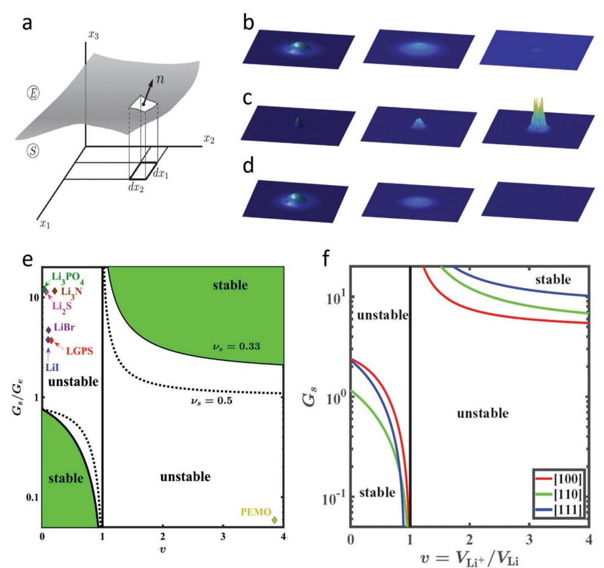

**Figure 9.** a) Electrolyte-electrode domain and area projection on the *x*1-*x*2 plane. b–d) Computed time-evolution of a lithium/LiPON interface with an initial imperfection. b)Stable growth of an initial perturbation with wavenumbers *k*1 = *k*2 = 0.5 µm−1 . Initial (left), intermediate(center), and finalplanar state (right). The interface becomes ostensibly planar after *t* = 19 000 s. c) Unstable growth of an initial perturbation with wavenumbers *k*1 = *k*2 = 2 µm−1 . Initial (left), intermediate(center), and clearly unstable state at *t* = 25 s (right). d) Stable growth of an initial perturbation with wavenumbers *k*1 = *k*2 = 0.5 µm−1 and the elastic prestress [σ11\*] = 100 MPa. Initial (left), intermediate (center), and final-planarstate (right). The interface becomes ostensibly planar after *t* = 1300 s. Reproduced with permission.[129] Copyright 2016, Elsevier. e) Stability diagram showing the range of shear moduli over which electrodeposition is stable and its dependence on the volume ratio ν of the cation and metal atom. Regions with stable electrodeposition are shaded green. Reproduced with permission.[131] Copyright 2017, American Physical Society. f) Stability diagram of interface between isotropic SE and anisotropic lithium metal. Reproduced with permission.[132] Copyright 2017, American Physical Society.

Mo et al.[133] conducted a series of studies on the interfacial chemical stability between an inorganic electrolyte and lithium metal using first principle calculations. First, Li10GeP2S12 and cubic lithium-garnet LLZO were selected as model sulfide and oxide SEs, respectively. The thermodynamic electrochemical stability windows of these materials were then calculated. The results indicated that these two SEs have much narrower electrochemical windows than those previously determined from semi-blocking electrodes (**Figure 11**a). Therefore, the high interfacial resistance resulting from the SE decomposition should be addressed by stabilizing the SE. Their findings indicated that taking advantage of the spontaneous formation or artificial application of SEI layers to extend the stability window of SEs is an attractive approach to improve the performance of bulktype SSBs. The same group also analyzed the electrochemical stability of several kinds of inorganic SEs in SSBs, suggesting that the kinetic stabilization of SE materials was an intrinsic problem for SSBs.[134] The results revealed that the sluggish kinetics of the decomposition reactions could cause a high overpotential, leading to the nominally wide electrochemical window observed in many experiments (Figure 11b). Based on the previous studies and a materials database, they selected stable electrolyte materials across the periodic table and found that nitride anion chemistry exhibited unique stability against lithium metal, which was either thermodynamically intrinsic or a result of stable passivation (Figure 11c–f).[135]

Haruyama et al.[47] established a representative oxide/ sulfide electrolyte model for the cathode/SE interface to calculate the stable structure, electronic states, and formation and transport of lithium vacancies. Their calculations agreed with the observed phenomena at the atomic scale, and allowed the matching behavior of the oxide electrode/sulfide electrolyte and effect of the interlayer on interfacial behavior to be explained. The LiCoO2 (LCO)/β-Li3PS4 (LPS) structure indicated that lithium adsorbs on the oxide side to form a deformed space charge layer. In contrast, a smooth interface without

**Figure 10.** Summary of multiscale, multifield coupling methods to study SE/electrode interface for SSBs.

a lithium-rich layer formed after the addition of an LiNbO3 (LNO) intermediate layer, and therefore the uneven distribution of lithium ions was suppressed. The electrochemical potential of lithium ions based on the vacancy-forming energy indicated that lithium ions in LNO migrate to the LCO/LPS interface because of its lower lithium ion potential than that of LNO, thus forming a space charge layer. The LNO interlayer inhibited the growth of the space charge layer and provided transport channels for lithium ions.

The first principles calculation is an ideal approach to analyze interfacial electrochemical stability at the nanoscale when ECMC is present at the micro- and macroscales. Both the classical finite element method and phase field theory allow ECMC in SSBs to be investigated (Figure 11). However, little research on this topic has appeared to date, representing an attractive direction for further research.

# **5. Strategies to Improve the Interfaces in SSBs**

#### **5.1. Mechanical Solutions to Increase Interfacial Contact Areas**

#### *5.1.1. Structure Design of Electrodes*

In cathode of SSBs, active materials need to have sufficient contact area with SEs to construct effective cathode/SE interfaces. The universal approach is to design a new interface structure, such as a surface coating layer (**Figure 12**a) or nanocomposite cathode (Figure 12b), to ensure sufficient effective contact area between the cathode and SE. When uncoated LiCoO2 and LiNbO3-coated LiCoO2 were used as cathode materials, the assembled cells were unable to be sufficiently charged or discharged because these composite electrolytes did not contain

enough pathways for lithium ion conduction. Sakuda et al.[136] used pulsed laser deposition (PLD) technology to deposit highly conductive Li2S-P2S5 or LiNbO3 on the surface of LiCoO2 particles (Figure 12d,e). Greatly improved performance was observed for the SSB using Li2S-P2S5 SE-coated LiCoO2 particles, which presented reversible capacities of 15, 35, and 65 mAh g−1 using SEs coated with Li2S-P2S5 for 10, 40, and 120 min, respectively. The results indicated that effective physical contact between the LiCoO2 particles and electrolyte could be achieved using PLD technology. In addition, a similar approach has also been used with an Li3BO3 coating layer[13] and polymethylmethacrylate gel polymer layer.[137] The coating layer can not only improve the interfacial contact between cathode and SE particles, but also provides paths to allow rapid lithium-ion transport. Constructing nanocomposite cathode can be another way to provide sufficient contact area between cathode and electrolyte particles. Shin et al.[138] used ball milling to prepare nanocomposite electrodes with TiS2 and Li2S-P2S5 SEs, which were then assembled into SSBs. Compared with the manually mixed electrodes, the ball-milled ones showed markedly increased charge capacities along with improved capacity retention. This is because ball milling enhanced the physical contact between particles by decreasing their size and increasing the interfacial contact area between the cathode material and electrolyte. Interestingly, an amorphous phase of Li-Ti-P-S was detected during the ballmilling process, which contributed to the increased capacity and retention of ionic and electronic conduction pathways. Torsten and co-workers obtained similar results for SSBs with an Li1+*x*(Ni1-*y*−*z*Co*y*Mn*z*)1−*x*O2 (NCM) cathode.[37] Hu et al.[139] demonstrated a garnet SE with a 3D bilayer framework for use in advanced SSBs with a lithium metal anode. The thick porous layer filled with the electrode materials acted as a nanocomposite cathode with numerous pathways for continuous ion transport. At the same time, the dense bilayer with a thickness of a few micrometers maintained good mechanical stability, thereby preventing the penetration of lithium dendrites (Figure 12f).

At lithium metal/SE interfaces, an effective approach to improve the interface stability is to include a compatible layer that can effectively eliminate the microscopic gaps caused by the rigid contact and also prevent interfacial side reactions. Hu et al.[40] fabricated an ultrathin Al2O3 coating on garnet-like Li7La2.75Ca0.25Zr1.75Nb0.25O12 via atomic layer deposition (ALD), which dramatically improved the wettability and stability of the garnet SE toward the lithium metal anode. Consequently, the interfacial impedance decreased from 1710 to 1 Ω cm2 . Experimental and computational studies were conducted to investigate the possible mechanism of the positive effect of the ALD-Al2O3 coating on the properties of the lithium metal/ garnet SE interface. The results suggested that the ALD-Al2O3 coating on the garnet SE provided a conformal lithium metal/ garnet SE interface. Furthermore, the high binding energy of lithium with lithiated Al2O3 further enhanced the conformal interface and the ultrathin lithiated Al2O3 provided effective lithium ion transport paths through the interface. Moreover, the Al2O3 coating could possibly protect the garnet SE from decomposition when in contact with lithium metal. As a result, the lithium metal/garnet SE interface was able to remain stable and displayed excellent electrical properties. To lower

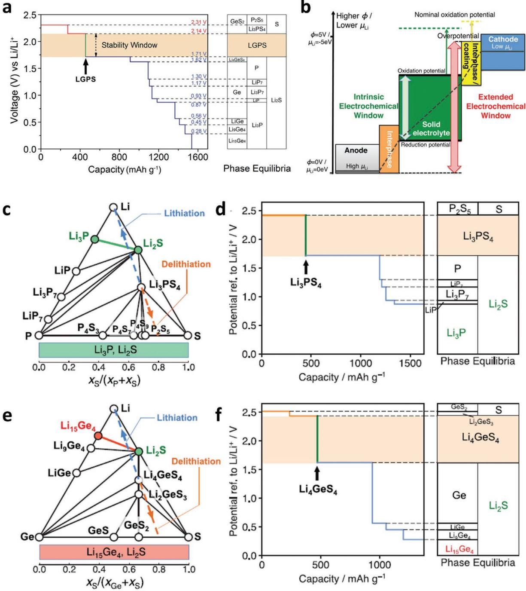

**Figure 11.** a) The first principles calculation results of the voltage profile and phase equilibria of LGPS upon lithiation and delithiation. Reproduced with permission.[133] Copyright 2016, Wiley-VCH. b) Schematic diagram about the electrochemical window (color bars) and the lithium chemical potential profile (black line) in the SSBs. The profile of chemical potential is schematic in this plot and may not be linear. The high µ*Li* in the anode (silver) and low µ*Li* in the cathode (blue) are beyond the stability window of the SE (green). The observed nominal electrochemical window is extended by the over-potential (dashed line) and by the interphases (orange and yellow), which account for the gap of µ*Li* between SE and electrodes across the interfaces. Reproduced with permission.[134] Copyright 2015, American Chemical Society. c,e) Phase diagrams of Li-P-S and Li-Ge-S system, and d,f), the equilibrium voltage profiles and phase equilibria for lithiation and delithiation reactions of Li3PS4 and Li4GeS4. Lithium-stable phases that are electronic insulating (Li3P and Li2S) and that are electronic conductive (Li15Ge4) are colored green and red, respectively. The bottom bar in (c) and (e) represents the phase equilibria with lithium metal as a function of atomic fraction *XS* and *XM*, where passivating and nonpassivating ranges are colored green and red, respectively. The lithiation and delithiation paths in (c) and (e) are marked as blue and orange dashed lines, respectively. These lines represent constant ratio of *S* and *M* atomic fraction *XS* to *XM* (*M* = P, Ge) but varying content of lithium in the composition. Reproduced under the terms and conditions of the Creative Commons Attribution International Licence 4.0.[135] Copyright 2017, The Authors, published by Wiley-VCH.

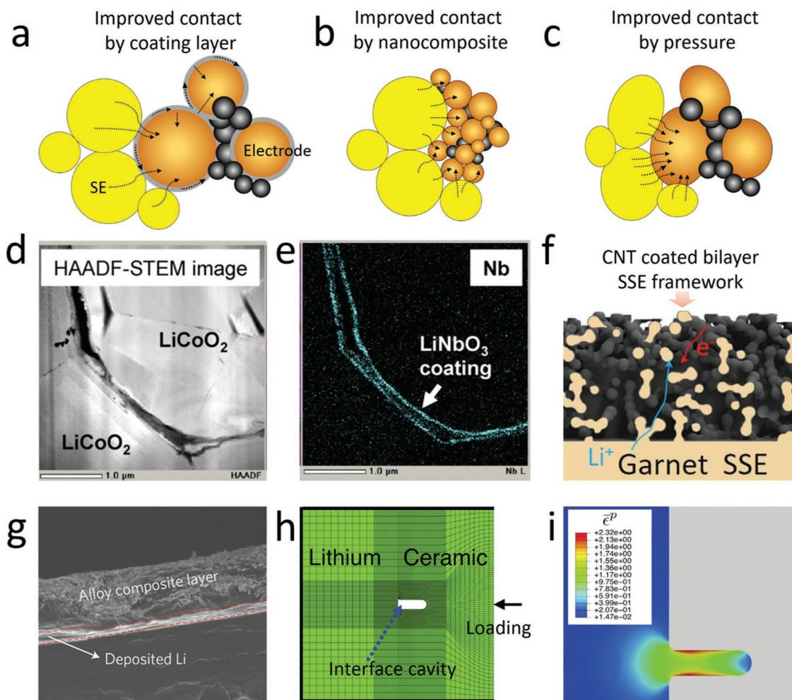

**Figure 12.** a–c) Schematics of improved cathode/SE interface contacts by surface coating layer, nanocomposite, and pressure, respectively. The black spheres represent carbon black and the black arrows indicate the lithium ion migration pathway. d,e) Cross-sectional high-angle annular dark field (HAADF) TEM images and EDX mappings of a composite electrode composed of SE-coated LiCoO2 in a SSB after 450 cycles. Reproduced with permission.[136] Copyright 2011, Elsevier. f) Schematic of the garnet bilayer framework after sintering by Hu et al., active materials (sulfur), and electron conductive network(CNT) were encapsulated in the pores. The mechanically stable bilayer garnet structure can accommodate the volume expansion of sulfur and maintain the electrode structure stable during cycling. Reproduced with permission.[139] Copyright 2017, The Royal Society of Chemistry. g) Cross-sectional SEM image for composite Li13In3|Li plated with 2 mAh cm−2 of lithium. The alloy composite layer Li13In3 can greatly improve interface wettability and contribute to uniform lithium deposition. Reproduced with permission.[143] Copyright 2017, Springer Nature. h) Finite element mesh for the lithium intrusion simulation and i) deformation and contour plots of the equivalent tensile plastic strain when lithium metal completely filled into the cavity. Reproduced with permission.[82] Copyright 2016, Acta Materialia Inc.

the high interface resistance between lithium and an LLZO electrolyte, Guillon et al.[41] improved the contact compatibility by finely polishing the surface of Ta-substituted LLZO along with introducing an Au buffer layer. Li and colleagues directly coated amorphous Li3PO4 thin films (0–200 nm thick) on the surface of lithium metal foil via magnetron sputtering.[140] The lithium metal foil with a 30-nm Li3PO4 coating delivered the best cycling performance and smallest electrochemical polarization of the samples. In addition to acting as a protecting layer to suppress side reactions between the lithium foil and electrolyte, the amorphous nature of Li3PO4 provided a homogeneous distribution of current density on the foil surface, which was believed to markedly suppress the growth of lithium dendrites via a tunnel effect. Different from ex situ depositing of a protective layer on lithium metal, a new and scalable method is to construct the protective layer in situ (that is, the protective layer is formed directly on the lithium metal surface) through interfacial reactions. Hu et al.[141] proposed that Li-Al alloy formed through the lithiation of a thin Al film exhibited high ionic conductivity and mechanical stability and seemed an ideal material for lithium protection. They fabricated an Li|Al coated-LLZO cell and found that the Li-Al alloy formed in situ effectively filled the gaps at the interface between the SE and lithium metal and improved interface wettability. Based on the same idea, Sun et al.[142] prepared an Li3PS4 layer in situ by the self-limiting reaction between P4S16 and lithium in N-methyl-2-pyrrolidone (Figure 12g). Nazar et al.[143] directly prepared protective films on lithium metal through the reduction of metal chlorides by lithium at room temperature. Recently, the same group developed a protective layer for dendrite suppression that

was formed in situ using a low-concentration electrolyte additive, which meant that the functional film was directly formed at the SE/lithium metal interface inside the assembled cell.[144] Although this method is restricted to use in liquid LIBs now, it still has as a great value for interfacial design to realize highperformance SSBs.

#### *5.1.2. Pressure during Assembly*

Applying an appropriate pressure during assembly is another factor that affects the interfacial contact in SSBs, and is often considered a critical technological parameter in their assembly process. The contact resistance between two solid conductors is usually controlled by the hardness of the materials and contact pressure. In general, low material hardness and high contact pressure contribute to low interfacial resistance.[145] The typical contact between cathode and SE particles is pointto-point contact, which leads to a small effective contact area. The deformation of cathode and electrolyte particles at an appropriate pressure changes the point-to-point contact to surface-to-surface contact, substantially improving the contact compatibility (Figure 12c). Besides, the appropriate deformation can make the surface of lithium metal flatten when it is mechanically impressed by a ceramic SE, and the viscoplastic large deformation of lithium metal will make lithium metal fill in the interface voids and provide sufficient contact areas for lithium ion transport (Figure 12h,i). Therefore, the pressure applied during SSB manufacture is a very important consideration. Ryoji et al.[146] studied the influence of applied pressure during the assembly of SSBs with Li10GeP2S12 electrolyte. They found that when compressed under a pressure of 19 MPa, the SSB demonstrated poor performance because of the deterioration of the physical contact between the TiS2 cathode and Li10GeP2S12 electrolyte. When the pressure was increased to 228 MPa, the cell exhibited stable performance. These experimental results are consistent with those of a simulation conducted by Qi's group.[32]

#### **5.2. Lithium Dendrite Inhibition Based on ECMC Analysis**

#### *5.2.1. High-Strength SEs with Advanced Structure*

In SSBs, the SE plays dual roles as both an electrolyte and separator to protect lithium metal. Thus, in order to prevent dendrites from penetrating SE, the most effective way to retard or eliminate dendrites in SSBs is to construct a high-strength SE. Newman et al.[62] studied the effect of elastic deformation on deposition kinetics at lithium/polymer interfaces. Their results revealed that a solid film with high shear modulus should be sufficient to suppress the growth of lithium dendrites. Consequently, to hinder the penetration of lithium dendrites and achieve stable interfacial contact between electrodes and SEs at the same time, the structure design of high-strength SEs requires that the outer regions of SEs, which contact electrodes, are soft enough, but their inner regions are simultaneously rigid enough.

*Multilayered Composite SEs*: Based on gradient design of layer structures, some researchers have proposed soft and rigid combined composite SEs. Goodenough et al.[147] have demonstrated a kind of multilayered composite SE with a thickness of ≈100 µm to inhibit dendrite growth and simultaneously lower the electric field across the polymer/lithium interface. This composite SE has a polymer/ceramic/polymer sandwich structure. The wetting of polymer surface by the lithium anode can provide a uniform lithium ion flux across the polymer/ lithium metal interface and thus suppress the dendrite formation. In addition, the ceramic layer with high mechanical stiffness can not only prevent dendrite penetration but also lower the double-layer electric field at the polymer/lithium interface. In addition, they also proposed a double-layer hybrid SE with a thickness of ≈500 µm consisting of cross-linked polyethylene oxide (CPEO)-LiTFSI polymer and garnet electrolyte LLZTO and found that it exhibited stable performance by inhibiting dendrite growth.[148] Taking the similar approach, Wan et al.[149] recently demonstrated a thinner asymmetric SE (thickness of ≈36 µm) to concurrently meet the requirements of lithium metal anode and cathode. They assembled batteries using an LiFePO4 cathode, liquid polymer monomers, dense LLZOcoated separator, and lithium metal anode by in situ polymerization (**Figure 13**a,b). Structural characterization revealed that the composite SE consisted of two functionalized layers: a rigid ceramic layer and a soft polymer layers. The polymer layers (thickness of ≈6 µm) formed at the cathode side provided sufficient contact between the solid electrodes and SEs, and the LLZO-coated separator layer at the lithium metal side effectively restrained dendrite growth and penetration because of its high elastic modulus and stiffness (Figure 13c–e). A surprising result obtained from AFM measurements was that a quite thin polymer coating layer (thickness of ≈7.5 nm) formed because of the capillarity during in situ polymerization. The ultrathin polymer layer dramatically improved the wettability of the SE/ lithium metal interface and made the lithium ion flux more homogeneous at this interface.

*Hybrid Reinforced Composite SEs*: In the study of mechanics, another important method to improve material strength is adding reinforced nanoparticles. Particle-reinforced composite SEs with suitable mechanical properties are regarded as another important design to prevent SE penetration by dendrites. In this design, the mechanical strength of polymer electrolytes is increased by using nanoparticles as a reinforcement phase (**Figure 14**a). Daniel et al.[150] reported that mechanical properties of SEs must be enhanced enough to avoid cracking as well as inhibit dendrite penetration. They estimated the effective conductivity of a polymer SE with LiPON reinforcement and concurrently calculated its effective stiffness tensor by the conventional Mori–Tanaka approach. Their results indicated that the effective conductivity and elasticity modulus can be expressed as functions of the LiPON content of the composite SE: a high LiPON content with vertically layered arrangements can provide high conductivity, but a low volume fraction of particulate reinforcement would be more suitable for dendrite suppression because of the high modulus. Similar studies have also been conducted through finite element analysis,[151] atomistic simulations,[152] and effective medium theory,[153] providing a primary theoretical basis for the design of hybrid reinforced composite SEs.

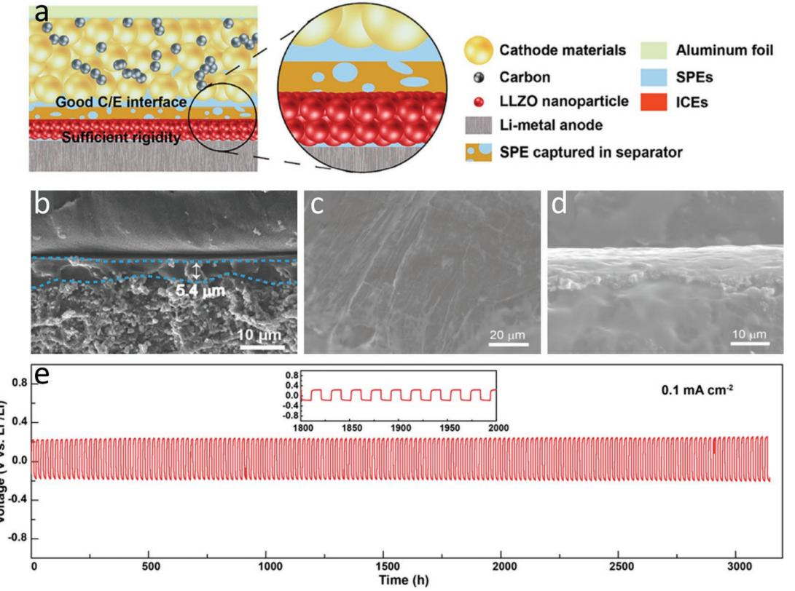

**Figure 13.** a) Schematic diagram of SSB with asymmetric composite SE. b) Cross-sectional SEM image of LLZO-coating layer. c,d) Surface and crosssectional SEM images of lithium metal on LLZO-coating layer side, respectively after lithium plating/stripping 3200 h in symmetric battery. e) Voltage profiles for the Li|Li symmetric battery at the current density 0.1 mA cm−2 . Reproduced with permission.[149] Copyright 2017, American Chemical Society.

PEO is the most common polymer matrix used for hybrid reinforced composite SEs. In an early study in this field, Weston et al.[154] added α-Al2O3 as an inert filler into lithium perchlorate-doped PEO polymer electrolytes. Their experimental results indicated that addition of 10 vol% α-Al2O3 had little effect on the ionic conductivity of PEO but markedly improved its mechanical stability; the composite samples showed no obvious creep behavior even at temperatures up to 120 °C. Scrosati et al.[155] proposed that when the size of added ceramic particles is decreased to the nanoscale region, the ceramic nanoparticles can behave as both solid plasticizers and a mechanical strengthening phase. For example, TiO2 or Al2O3 nanoparticles can effectively influence the recrystallization kinetics of the PEO polymer chains and thereby ultimately promote localized amorphous regions to enhance the lithiumion transport below 60 °C. Meanwhile, the nanoparticles also induce a large enhancement of the Young's modulus of polymer electrolyte. Li et al.[156] produced SE composite membranes that consisted of lithium garnet (i.e., LLZTO) particles and lithium salt-free PEO. Compared with conventional PEO embedded with lithium salts, the insulating PEO in the PEO:LLZTO membrane electrolyte effectively suppressed lithium dendrite growth because of its high mechanical strength and ability to restrict current flow (Figure 14b). Instead of a PEO polymer matrix reinforced by particle fillers, a hybrid polymer SE reinforced by a 3D network often presents both high conductivity and mechanical stability. In addition, the 3D microstructure can effectively improve the interfacial charge distribution and modulate the direction of dendrite growth. Hu et al.[157] reported a 3D lithium ion-conducting ceramic network based on the garnet-type LLZO lithium ion conductor, which provided continuous lithium ion transfer channels in a PEO-based composite. Because the garnet nanofibers were able to form a 3D structure that contained long-range lithium ion transfer pathways and also provided structural reinforcement, the composite membrane effectively blocked dendrites in a symmetric lithium/electrolyte/lithium cell during long-term repeated lithium stripping/plating reactions (Figure 14c,d). To further raise the mechanical stability of PEO-based polymer SEs, Cui et al.[158] used a stiff mesoporous SiO2 aerogel as a strong skeleton (Figure 14e). The hybrid polymer SE composited with SiO2 aerogel/PEO/LiTFSI exhibited a very high modulus (0.43 GPa), high hardness (0.17 GPa), and high ionic conductivity (0.6 mS cm−1 ) at room temperature.

Besides the PEO polymer matrix, poly(vinylidene fluoridehexafluoropropylene) (PVDF-HFP) is another common matrix for polymer electrolytes. Archer and co-workers[159] reported an SSB model for PVDF-HFP/Al2O3 laminates infused with liquids as the separator/electrolyte. Their results showed the stable electrodeposition of lithium metal with no obvious dendrite formation at the lithium/SE interface. Recently, Sun et al.[160] proposed a kind of hybrid SE composed of a PVDF-HFP polymer

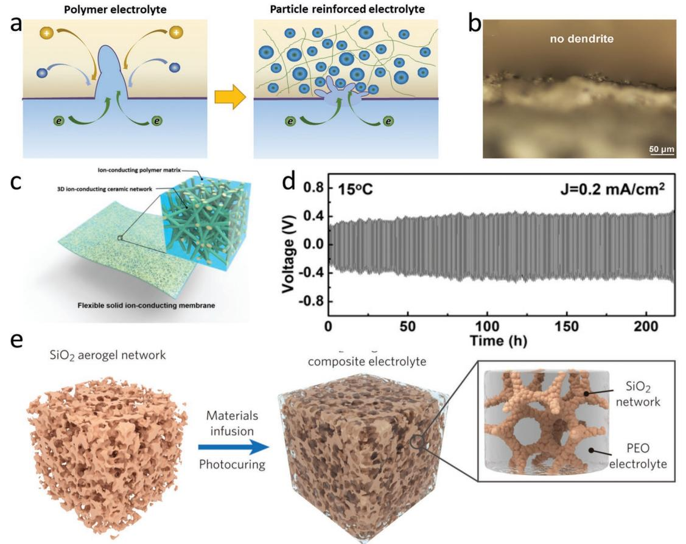

**Figure 14.** a) Mechanism scheme of dendrite inhibition for particle reinforced polymer SE. b) The optical observation of Li/PEO:LLZTO/Li cell after cycling over 700 h. It was obvious that there was no dendrite growth. Reproduced with permission.[156] Copyright 2016, Elsevier. c) Schematic of the hybrid solid-state composite electrolyte, where ceramic garnet nanofibers function as the reinforcement and lithium-ion-conducting polymer functions as the matrix. The garnet nanofiber network provides a continuous ion-conducting pathway in the electrolyte membrane d) Voltage profile of the lithium plating/striping cycling with a current density of 0.2 mA cm−2 at 15 °C. Reproduced with permission.[157] Copyright 2016, National Academy of Sciences. e) Schematic showing the synthetic procedures of the SiO2-aerogel-reinforced composite SE proposed by Cui et al. Reproduced with permission.[158] Copyright 2018, Wiley.

matrix and LLZO particles. Their experiment results indicated that homogeneously dispersed LLZO particles in the polymer matrix substantially increased the mechanical strength of the composite electrolyte. The tensile strength, fracture strain, and Young's modulus of this electrolyte were 6.9 MPa, 86.6%, and 12.5 MPa, respectively. By using new ceramic fillers, palygorskite ((Mg,Al)2Si4O10(OH)) nanowires, with a PVDF polymer matrix, Yang and co-workers successfully improved the Young's modulus of the PVDF-based polymer from 9.0 to 96 MPa, and its yield stress was still high at 4.7 Mpa (**Figure 15**a–c).[161] To raise the elasticity modulus of polymer electrolyte from ≈MPa to ≈GPa level, Lee et al.[162] proposed a remarkable multifunctional additive, perfluoropolyether (PFPE)-functionalized 2D nitride nanoflakes (FBNs), for a PVDF-HFP matrix. Adding even a minimal addition (0.5 wt%) of the nanoflakes into the PVDF-HFP matrix decreased the crystallinity of PVDF-HFP and generated porous structure, which contributed to abundant electrolyte uptake (Figure 15d). In addition, the large surface areas of 2D nanomaterials can effectively reinforce the interfacial interactions between nanofillers and polymer matrices, which can greatly improve the mechanical strength of polymer composites.[163–165] Their experiment results revealed that the composite membranes without liquid electrolyte had a Young's modulus as high as 27 GPa and tensile strength of 53 MPa. Even after immersion in liquid electrolyte, the hybrid SE still exhibited high ionic conductivity and high Young's modulus of 27.4 GPa (Figure 15e,f). Besides the PEO and PVDF polymer matrixes, some other matrix materials reinforced by additives have also been used as stable SE, such as the ionic conductive poly(ethylene glycol) (PEG) matrix,[166] free-standing gel formed by 1,3:2,4-di-O-methyl-benzylidene-D-sorbitol (MDBS)-fumed silica (FS) network,[167] LiTFSI-di(ethylene glycol) dimethyl ether(DGM) matrix,[168] and sodium alginate nanocomposite film.[169]

According to the conclusions of Monroe and Newman,[78] most researchers have paid attention to constructing hybrid SEs with high modulus to inhibit dendrite growth; the physical mechanism through which the modulus of SEs affects lithium deposition is still unclear. It has been found that dendrites can grow and penetrate both soft polymer electrolytes[51,52] and rigid

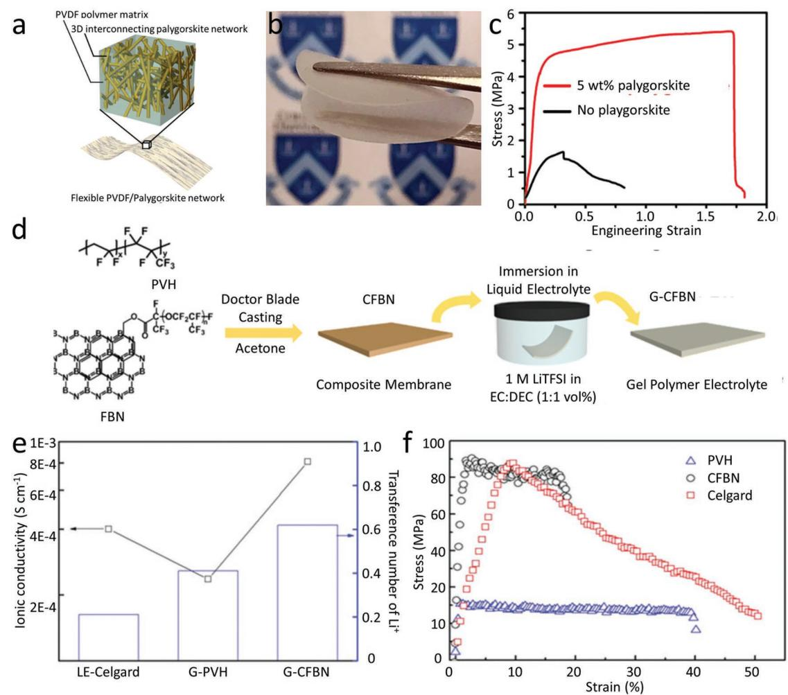

**Figure 15.** a,b) Schematic diagram and optical picture of the palygorskite nanowires reinforced polymer electrolyte based on the PVDF polymer matrix, respectively. c) Tensile stress–strain curves of different PVDF-based membranes under uniaxial tension at strain rate of 0.001 s−1 . The tensile strength of PVDF matrix reinforced by 5 wt% palygorskite is much higher than the value of PVDF polymer without reinforcement. Reproduced with permission.[161] Copyright 2018, American Chemical Society. d) Preparation of hybrid polymer electrolyte based on PVDF-HFP polymer matrix and FBN additives. e) Ionic conductivity and lithium ions transference number of conventional liquid electrolyte-Celgard separator, PVDF-HFP polymer SE without FBNs (PVH) and PVDF-HFP polymer SE with 0.5 wt% FBN additives (CFBN). f) Tensile stress–strain curves of conventional liquid electrolyte-Celgard separator, PVH and CFBN. Reproduced with permission.[162] Copyright 2017, The Royal Society of Chemistry.

inorganic electrolytes.[41] The SE modulus (Young's modulus or shear modulus) may not be the only mechanical factor limiting dendrite growth. Several other mechanical parameters besides modulus should be considered for candidate SEs, including yield stress, tensile strength, and the strain of elongation at break of polymer electrolytes, and the hardness, fracture toughness, and flexure strength of brittle inorganic SEs. Herein, various SEs that have been previously used in SSBs are employed, the components, ionic conductivity, and mechanical properties of each are briefly summarized in **Table 1**. Because most reported experiments on polymer electrolytes have been performed under uniaxial tension, herein the elastic storage modulus of the polymer is considered approximately equivalent to the Young's modulus.[170,171] Table 1 clearly reveals that the mechanical strength of hybrid reinforced polymer is generally higher than that of polymer electrolytes. Most studies have presented the Young's modulus as a critical parameter for dendrite suppression; the effects of other mechanical parameters on dendrite growth still need further research.

#### *5.2.2. Stress Regulation*

As discussed in Section 5.2.1, using a high-strength SE to mechanically suppress dendrite growth shows the most potential to alleviate this obstacle. The interaction between a high-strength SE and lithium metal is determined by the mechanical properties of the SE as much as those of lithium metal. However, it is difficult to study the mechanical behavior of lithium metal at any length scale and temperature because of its extremely high reactivity. Greer et al.[172] conducted nanomechanical experiments using in situ SEM to study the mechanical strength of lithium metal. Their results showed that micrometer-sized lithium particles exhibited extremely

#### **Table 1.** Mechanical properties and ionic conductivity of some mainstream SEs reported in literatures.

| Type                             | Components                                             | Young's modulus [MPa]  | Temperature [°C] | Ionic conductivity [mS cm−1 ] | Supporting Information                                              | Ref.          |
|----------------------------------|--------------------------------------------------------|---------------------------|---------------------|-------------------------------------|------------------------------------------------------------------------|---------------|
| Polymer electrolyte              | PEO/POSS-PEG*/LiTFSI                                   | 0.1                       | 23                  | 0.050                               | –                                                                      | [173]         |
|                                  | PMMA* nanoparticles/PEO/LiTFSI                         | 0.5                       | 20                  | 0.100                               | –                                                                      | [174]         |
|                                  | PEO/PDMS/LiClO4                                        | 1.0                       | 25                  | 0.030                               | –                                                                      | [175]         |
|                                  | PAN*/PEO/PEG/LiTFSI                                    | 1.0                       | 25                  | 1.300                               | –                                                                      | [176]         |
|                                  | MPC*+SBVI*/LiTFSI                                      | 14.3                      | 23                  | 1.100                               | –                                                                      | [177]         |
|                                  | PVA*/Chitosan /LiClO4                                  | 24.0                      | 25                  | 0.003                               | Tensile strength 8.83 MPa, strain of elongation break 445.69%       | [178]         |
|                                  | POSS-PEG/LiTFSI                                        | 43.0                      | 30                  | 0.021–0.095                         | –                                                                      | [179]         |
|                                  | PVDF-HFP/PEO                                           | 44.0                      | 30                  | 0.810                               | Fracture energy 69.5 kJ cm−2                                           | [180]         |
|                                  | PEO/EMIBF4                                             | 50.0                      | 25                  | 1.500                               | –                                                                      | [181]         |
|                                  | PMMA/PVDF/LiClO4                                       | 100.0                     | 25                  | 0.100                               | –                                                                      | [182]         |
|                                  | PEO/PEO-b-PE/LiClO4                                    | 114.0                     | 25                  | 5.51 × 10−5                         | Tensile strength = 7.29 MPa, strain of elongation break of 1142.53% | [183]         |
|                                  | hPEMs/PEG/LiTFSI                                       | 150.0                     | 25                  | 0.020                               | Tensile strength 10 MPa, critical break strain of 30%               | [184]         |
| Hybrid reinforced electrolyte | Cellulosic whiskers/PEO/LiTFSI                         | 72.0                      | 60                  | 0.410                               | –                                                                      | [185]         |
|                                  | Palygorskite nanowire/PVDF                             | 96.0                      | 25                  | 0.120                               | Yield stress 4.7 MPa                                                   | [161]         |
|                                  | Fumed silica/LiBETI                                    | 100.0                     | 25                  | 1.000                               | –                                                                      | [186]         |
|                                  | Cellulose nanofibril/PEG/LiPF6                         | 400.0                     | 25                  | 0.050                               | –                                                                      | [187]         |
|                                  | SiO2-aerogel/PEO/LiTFSI                                | 430.0                     | 30                  | 0.600                               | Hardness 0.17                                                          | [158]         |
|                                  | Fumed silica/MDBS/PC/LiTFSI                            | 1000.0                    | 25                  | 5.000                               | Yield stress 0.011 MPa                                                 | [188]         |
|                                  | TiO2 fillers/PVA/PVdF/LiCF3SO3                         | –                         | 30                  | 3.700                               | Tensile strength 22.6 MPa, strain of elongation break 131%          | [189]         |
|                                  | BN nanoflakes/PVDF-HFP//LiTFSI                         | 27.4 × 103                | 25                  | 0.100                               | Tensile strength 53 MPa                                                | [162]         |
|                                  | g-C3N4 microspheres/ Sodium alginate composite film | 3.54 × 103                | 25                  | 0.100                               | Critical break strain of 103%                                          | [168,169]     |
| Inorganic electrolyte            | β-Li3PS4                                               | 12.9 × 103 –16.0 × 103 | 25                  | 0.160                               |                                                                        | [80,190]      |
|                                  | Li2S-P2S5                                              | 18 × 103–25 × 103         | 25                  | 0.340                               | Fracture toughness KIC = 0.23 MPa m1/2                              | [79,191–193]  |
|                                  |                                                        |                           |                     |                                     | Hardness = 1.9 GPa                                                     |               |
|                                  | Li2S-P2S5-P2O5                                         | 27 × 103                  | 25                  | 0.120                               | –                                                                      | [194]         |
|                                  | LGPS                                                   | 37 × 103                  | 25                  | 12.000                              | –                                                                      | [195]         |
|                                  | Li3BO3-Li2SO4                                          | 30 × 103–50 × 103         | 25                  | 0.010                               | –                                                                      | [196]         |
|                                  | LAGP                                                   | 63 × 103                  | 25                  | 0.160                               | –                                                                      | [197]         |
|                                  | LATP                                                   | 115 × 103                 | 25                  | 0.160                               | Fracture toughness KIC = 1.1 MPa m1/2                               | [198]         |
|                                  | LiPON                                                  | 143 × 103                 | 25                  | 0.002                               | Critical fracture load of 3.01 mN,                                     | [199–201]     |
|                                  |                                                        |                           |                     |                                     | Hardness = 3.9–5.8 GPa                                                 |               |
|                                  | LLZO                                                   | 160 × 103 –200 × 103   | 25                  | 0.24–0.56                           | Fracture toughness KIC = 1.25 MPa m1/2 Hardness = 6.3 GPa        | [198,202–204] |
|                                  | LLTO                                                   | 180 × 103–200 × 103       | 25                  | 1–1.65                              | Flexure strength 252.06 ± 14.28 MPa                                    | [198,205–208] |
|                                  |                                                        |                           |                     |                                     | Fracture toughness KIC = 1 MPa m1/2                                 |               |
|                                  |                                                        |                           |                     |                                     | Hardness = 7.0–10.0 GPa                                                |               |

\*Description of some acronyms appeared in Table 1 for the first time; POSS-PEG, Polyhedral oligomeric silsesquioxane-polyethylene glycol; PMMA, Poly(methyl methacrylate); PAN, Polyacrylonitrile; PVA, Poly(vinyl alcohol); MPC, 2-methacryloyloxyethyl phosphorylcholine; SBVI, Sulfobetaine vinylimidazole.

high strengths of 105 and 35 MPa at room temperature and 90 °C, respectively. They demonstrated that single-crystalline lithium exhibited a power-law size effect at the micrometer and sub-micrometer length scales, with strengthening exponents of −0.68 and −1.00 at room temperature and 90 °C, respectively. The results suggested that dendrite growth suppression by inducing plastic deformation would be much more effective than using SEs with higher shear moduli at high temperatures. That is, the effect of lithium mechanical properties on dendrite formation is considerable and should be comprehensively explored.

Another potential strategy to suppress dendrite formation is to change the mechanical behavior of lithium metal. As mentioned in Section 2.2, lithium deposition induces plating stress, and the accumulated residual stress in turn influences the lithium deposition morphology. Lithium metal is very soft and can easily deform considerably under pressure. Thus, manipulating the plating stress is a promising new way to change the lithium deposition morphology in SSBs.[57] Campbell et al.[56] pointed out that lithium metal can be slightly plastically deformed by repeated impacts to introduce a degree of residual compressive stress into the surface layer. The effect of such nanopatterning can cause the lithium metal surface to undergo work hardening. The deformation of lithium metal and compressive stress can redistribute the surface current density, which can strongly affect lithium deposition.

# **6. Conclusions and Perspective**

Interest in SSBs is growing rapidly. Nevertheless, SSBs are still in the early stage of research and the understanding of their degradation mechanisms remains incomplete. From Section 2 to Section 5, we discussed the effects of ECMC on the interfaces of SSBs, including the degradation mechanisms, corresponding computational research, and ways to improve SSBs from two aspects: physical contact compatibility of electrode/SE interfaces and suppression of lithium deposition.

The most effective solutions to physical contact problems caused by the poor wetting properties and volume expansion of the electrode are to construct an advanced structure and apply optimal pressure during the battery manufacturing process. During material preparation, constructing a nanocomposite electrode can markedly increase the number of ion transport channels. Sintering the cathode at a suitable pressure can also increase the contact area at an electrode/SE interface. As for material modification, including a coating layer as a transition layer at an electrode/SE interface can effectively improve interface wettability, raise the stability of SEs toward electrodes, and lower the energy barrier for ion transport. During battery assembly, low applied pressure can lead to poor interfacial contact and high interfacial impedance, but excessive pressure can lead to structural damage of electrodes. Therefore, exploring the optimal pressure to ensure both stable interfacial contact

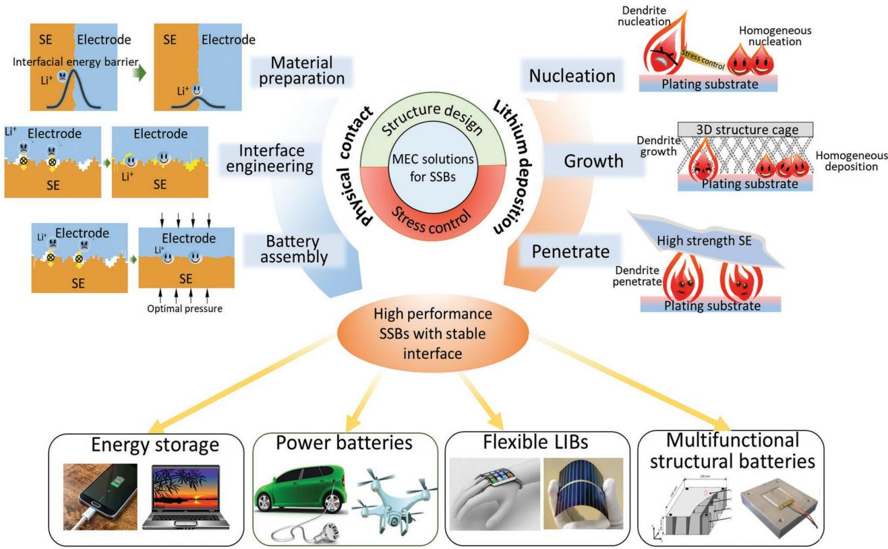

**Figure 16.** ECMC improvements of electrode/SE interface: structure design and stress control, and the potential applications of SSBs. The left illustration: Reproduced with permission.[209] Copyright 2006. Christoph Schwingshackl, published by the American Institute of Aeronautics and Astronautics, Inc. The right illustration: Reproduced with permission.[210] Copyright 2008, SAGE Publications.

and reliable electrode structure is critical to improve battery performance.

The solutions to lithium deposition can be implemented at three stages: dendrite nucleation, growth, and penetration (**Figure 16**). During nucleation stage, improving uniform nucleation is very critical to prevent dendrites from taking root. One of the basic principles to promote homogeneous nucleation is releasing plating stress, like releasing plating stress by buckling of some soft current collectors. In addition, lithium dendrite growth is essentially a process of crystal growth, so adjusting texturing (preferential orientation of crystal growth) would be a new possible direction to improve lithium deposition. As dendrites grow, a 3D composite structure can act as a cage to improve the distribution of current density and suppress the dendrite growth, such as designing a lithium metal anode with 3D structure or composite electrode with 3D structure. In the final stage, dendrites try to penetrate through the SE, so it is important to increase the mechanical strength of the SE to block dendrite penetration. So constructing a high strength hybrid electrolyte with novel structure or reinforced by nanoparticles is very important for SE developement.

From this review, four main points are clear. First, advanced SEs with mechanical robustness, high chemical stability, and high ionic conductivity are urgently required to guarantee stable operation of SSBs. Second, optimization of interfacial kinetics between SEs and active materials requires more investigation, especially the interface between SEs and lithium metal anodes. Third, SEs can allow the use of lithium metal anodes, but SSBs containing such anodes would face many new problems such as the protection of lithium metal and potential safety risk. Therefore, lithium alloy anodes may be an appropriate choice to replace pure lithium metal anodes. Besides, the mechanical properties of lithium metal strongly influence dendrite formation, and thus require further attention. Fourth, advanced research methods for SSBs, especially more accurate in situ experimental techniques and computational approaches, need to be developed.

Overall, although the use of thick lithium metal anodes seems very difficult, SSBs are a promising concept with a wide application range in energy storage, power batteries, flexible LIBs, and batteries with new structures. Therefore, establishing new robust theories, simulation methods, and experimental techniques is critical for SSB development and application. In addition, nanomaterials and nanotechnology concepts are expected to play major roles in the development of SSBs, especially advanced active materials and electrolyte structure design. There are also many potential in situ study techniques that could be adapted to investigate SSBs; for instance, in situ X-ray diffraction, in situ Raman spectroscopy, and in situ nuclear magnetic resonance spectroscopy.

### **Acknowledgements**

P.W. and W.Q. contributed equally to this work. Financial support from National Key R&D Program of China (Grant No. 2018YFB0104400), National Natural Science Foundation of China (Grant Nos. 11672341 and 11572002), Innovative Research Groups of the National Natural Science Foundation of China (Grant No. 11521202), National Materials Genome Project (Grant No. 2016YFB0700600), and Beijing Natural Science Foundation (Grant Nos. 16L00001 and 2182065) is gratefully acknowledged. This work was also supported by the National Key Research and Development Program of China "New Energy Project for Electric Vehicle" (2016YFB0100204), the National Natural Science Foundation of China (51772030), the Joint Funds of the National Natural Science Foundation of China (U1564206), Major Achievements Transformation Project for Central University in Beijing, and Beijing Science and Technology Project (Z181100004518001).

## **Conflict of Interest**

The authors declare no conflict of interest.

### **Keywords**

degradation mechanism, electro–chemo–mechanical coupling, interfaces, solid-state lithium batteries, solutions

> Received: January 30, 2019 Revised: March 5, 2019 Published online: April 16, 2019

- [1] J. Janek, W. G. Zeier, *Nat. Energy* **2016**, *500*, 300.
- [2] C. Yang, K. Fu, Y. Zhang, E. Hitz, L. B. Hu, *Adv. Mater.* **2017**, *29*, 1701169.
- [3] Y. S. Hu, *Nat. Energy* **2016**, *1*, 16042.
- [4] N. Kamaya, K. Homma, Y. Yamakawa, M. Hirayama, R. Kanno, M. Yonemura, A. Mitsui, *Nat. Mater.* **2011**, *10*, 682.
- [5] J. C. Bachman, S. Muy, A. Grimaud, H. H. Chang, N. Pour, S. F Lux, L. Giordano, *Chem. Rev.* **2016**, *116*, 140.
- [6] V. Thangadurai, S. Narayanan, D. Pinzaru, *Chem. Soc. Rev.* **2014**, *43*, 4714.
- [7] S. Troy, A. Schreiber, T. Reppert, H. G. Gehrke, M. Finsterbusch, S. Uhlenbruck, P. Stenzel, *Appl. Energy* **2016**, *169*, 757.
- [8] M. Koo, K. I. Park, S. H. Lee, M. Suh, D. Y. Jeon, J. W. Choi, K. J. Lee, *Nano Lett.* **2012**, *12*, 4810.
- [9] H. Gwon, J. Hong, H. Kim, D. H. Seo, S. Jeon, K. Kang, *Energy Environ. Sci.* **2014**, *7*, 538.
- [10] S. D. Jones, J. R. Akridge, *Solid State Ionics* **1996**, *86–88*, 1291.
- [11] A. Manthiram, X. Yu, S. Wang, *Nat. Rev. Mater.* **2017**, *2*, 16103.
- [12] R. Murugan, V. Thangadurai, W. Weppner, *Angew. Chem., Int. Ed.* **2007**, *46*, 7778.
- [13] S. Ohta, S. Komagata, J. Seki, T. Saeki, S. Morishita, T. Asaoka, *J. Power Sources* **2013**, *238*, 53.
- [14] S. Ohta, T. Kobayashi, J. Seki, T. Asaoka, *J. Power Sources* **2012**, *202*, 332.
- [15] N. Bonanos, K. S. Knight, B. Ellis, *Solid State Ionics* **1995**, *79*, 161.
- [16] Y. Li, H. Xu, P. H. Chien, N. Wu, S. Xin, L. Xue, J. B. Goodenough, *Angew. Chem., Int. Ed.* **2018**, *57*, 8587.
- [17] J. A. Dawson, T. S. Attari, H. Chen, S. P. Emge, K. E. Johnston, M. S. Islam, *Energy Environ. Sci.* **2018**, *11*, 2993.
- [18] Y. Deng, C. Eames, B. Fleutot, R. David, J. N. Chotard, E. Suard, M. S. Islam, *ACS Appl. Mater. Interfaces* **2017**, *9*, 7050.
- [19] K. Suzuki, D. Kato, K. Hara, T. A. Yano, M. Hirayama, M. Hara, R. Kanno, *Electrochim. Acta* **2017**, *258*, 110.
- [20] H. Xu, S. Wang, H. Wilson, F. Zhao, A. Manthiram, *Chem. Mater.* **2017**, *29*, 7206.
- [21] Y. Liu, Q. Sun, Y. Zhao, B. Wang, P. Kaghazchi, K. R. Adair, Y. Hu, *ACS Appl. Mater. Interfaces* **2018**, *10*, 31240.
- [22] D. L. Xiao, J. Tong, Y. Feng, G. H. Zhong, W. J. Li, C. L. Yang, *Solid State Ionics* **2018**, *324*, 202.

- [23] A. C. Kozen, A. J. Pearse, C. F. Lin, M. Noked, G. W. Rubloff, *Chem. Mater.* **2015**, *27*, 5324.
- [24] F. Wu, W. Fitzhugh, L. Ye, J. Ning, X. Li, *Nat. Commun.* **2018**, *9*, 4037.
- [25] W. A. van Schalkwijk, B. Scrosati, *Advances in Lithium-Ion Batteries*, Kluwer Academic/Plenum, New York **2002**.
- [26] C. Sun, J. Liu, Y. Gong, D. P. Wilkinson, J. Zhang, *Nano Energy* **2017**, *33*, 363.
- [27] Y. S. Jung, D. Y. Oh, Y. J. Nam, K. H. Park, *Isr. J. Chem.* **2015**, *55*, 472.
- [28] Y. Y. Ren, K. Chen, R. J. Chen, T. Liu, Y. B. Zhang, C. W. Nan, *J. Am. Ceram. Soc.* **2015**, *98*, 3603.
- [29] J. Dai, C. Yang, C. Wang, G. Pastel, L. B. Hu, *Adv. Mater.* **2018**, *30*, 1802068.
- [30] Q. Yang, C. Li, *Energy Storage Mater.* **2018**, *14*, 100.
- [31] T. Liu, Y. Y. Ren, Y. Shen, S. X. Zhao, Y. H. Lin, C. W. Nan, *J. Power Sources* **2016**, *324*, 349.
- [32] H. K. Tian, Y. Qi, *J. Electrochem. Soc.* **2017**, *164*, E3512.
- [33] B. N. Persson, *Surf. Sci. Rep.* **2006**, *61*, 201.
- [34] D. Devaux, K. J. Harry, D. Y. Parkinson, R. Yuan, D. T. Hallinan, A. A. MacDowell, N. P. Balsara, *J. Electrochem. Soc.* **2015**, *162*, A1301.
- [35] F. Sun, L. Zielke, H. Markötter, A. Hilger, D. Zhou, R. Moroni, I. Manke, *ACS Nano* **2016**, *10*, 7990.
- [36] P. Hovington, M. Lagacé, A. Guerfi, P. Bouchard, A. Mauger, C. M. Julien, K. Zaghib, *Nano Lett.* **2015**, *15*, 2671.
- [37] F. Strauss, T. Bartsch, L. Biasi, A. Y. Kim, J. Janek, P. Hartmann, T. Brezesinski, *ACS Energy Lett.* **2018**, *3*, 992.
- [38] D. Y. Oh, Y. J. Nam, K. H. Park, S. H. Jung, S. J. Cho, Y. K. Kim, Y. S. Jung, *Adv. Energy Mater.* **2015**, *5*, 1500865.
- [39] R. Koerver, W. Zhang, L. Biasi, S. Schweidler, A. Kondrakov, S. Kolling, J. Janek, *Energy Environ. Sci.* **2018**, *11*, 2142.
- [40] X. Han, Y. Gong, K. Fu, X. He, G. T. Hitz, J. Dai, A. Pearse, B. Liu, H. Wang, G. Rubloff, Y. Mo, V. Thangadurai, E. D. Wachsman, L. Hu, *Nat. Mater.* **2017**, *16*, 572.
- [41] C. L. Tsai, V. Roddatis, C. V. Chandran, Q. L. Ma, S. Uhlenbruck, M. Bram, P. Heitjans, O. Guillon, *ACS Appl. Mater. Interfaces* **2016**, *8*, 10617.
- [42] Z. Wang, J. Z. Lee, H. L. Xin, L. Han, N. Grillon, D. Guy-Bouyssou, E. Bouyssou, M. Proust, Y. S. Meng, *J. Power Sources* **2016**, *324*, 342.
- [43] A. Sakuda, A. Hayashi, M. Tatsumisago, *Chem. Mater.* **2010**, *22*, 949.
- [44] K. H. Kim, Y. Iriyama, K. Yamamoto, S. Kumazaki, T. Asaka, K. Tanabe, C. A. J. Fisher, T. Hirayama, R. Murugan, Z. Ogumi, *J. Power Sources* **2011**, *196*, 764.
- [45] K. Takada, *Acta Mater.* **2013**, *61*, 759.
- [46] Y. Seino, T. Ota, K. Takada, *J. Power Sources* **2011**, *196*, 6488.
- [47] J. Haruyama, K. Sodeyama, L. Han, K. Takada, Y. Tateyama, *Chem. Mater.* **2014**, *26*, 4248.
- [48] J. Steiger, D. Kramer, R. Mönig, *J. Power Sources* **2014**, *261*, 112.
- [49] C. Monroe, J. Newman, *J. Electrochem. Soc.* **2003**, *150*, A1377.
- [50] M. Rosso, C. Brissot, A. Teyssot, M. Dollé, L. Sannier, J. M. Tarascon, R. Bouchet, S. Lascaud, *Electrochim. Acta* **2006**, *51*, 5334.
- [51] N. S. Schauser, K. J. Harry, D. Y. Parkinson, H. Watanabe, N. P. Balsara, *J. Electrochem. Soc.* **2015**, *162*, A398.
- [52] K. J. Harry, D. T. Hallinan, D. Y. Parkinson, A. A. MacDowell, N. P. Balsara, *Nat. Mater.* **2014**, *13*, 69.
- [53] M. Dollé, L. Sannier, B. Beaudoin, M. Trentin, J. M. Tarascon, *Electrochem. Solid-State Lett.* **2002**, *5*, A286.
- [54] M. Rosso, T. Gobron, C. Brissot, J. N. Chazalviel, S. Lascaud, *J. Power Sources* **2001**, *97–98*, 804.
- [55] K. J. Harry, K. Higa, V. Srinivasan, N. P. Balsara, *J. Electrochem. Soc.* **2016**, *163*, A2216.
- [56] C. Campbell, Y. M. Lee, K. Y. Cho, Y. G. Lee, B. Lee, C. Phatak, S. Hong, *Sci. Rep.* **2018**, *8*, 2514.
- [57] X. Wang, W. Zeng, L. Hong, W. Xu, H. Yang, F. Wang, H. Duan, M. Tang, H. Jiang, *Nat. Energy* **2018**, *3*, 227.
- [58] O. Haik, N. Leifer, Z. Samuk-Fromovich, E. Zinigrad, B. Markovsky, L. Larush, D. Aurbach, *J. Electrochem. Soc.* **2010**, *157*, A1099.
- [59] B. R. Shin, Y. J. Nam, D. Y. Oh, D. H. Kim, J. W. Kim, Y. S. Jung, *Electrochim. Acta* **2014**, *146*, 395.
- [60] X. Yao, B. Huang, J. Yin, G. Peng, Z. Huang, C. Gao, D. Liu, X. Xu, *Chin. Phys. B* **2016**, *25*, 018802.
- [61] M. Tatsumisago, M. Nagao, A. Hayashi, *J. Asian Ceram. Societies* **2013**, *1*, 17.
- [62] A. Hayashi, M. Tatsumisago, *Electron. Mater. Lett.* **2012**, *8*, 199.
- [63] J. Kim, M. Eom, S. Noh, D. Shin, *J. Power Sources* **2013**, *244*, 476.
- [64] T. Liu, Y. B. Zhang, R. J. Chen, S. X. Zhao, Y. H. Lin, C. W. Nan, Y. Shen, *Electrochem. Commun.* **2017**, *79*, 1.
- [65] M. Nagao, A. Hayashi, M. Tatsumisago, T. Ichinose, T. Ozaki, Y. Togawa, S. Mori, *J. Power Sources* **2015**, *274*, 471.
- [66] T. Okumura, T. Nakatsutsumi, T. Ina, Y. Orikasa, H. Arai, T. Fukutsuka, Y. Iriyam, T. Urug, H. Tanid, Y. Uchimotoa, Z. Ogumib, *J. Mater. Chem.* **2011**, *21*, 10051.
- [67] W. Zhang, D. Schröder, T. Arlt, I. Manke, R. Koerver, R. Pinedo, D. A. Weber, J. Sann, W. G. Zeier, J. Janek, *J. Mater. Chem. A* **2017**, *5*, 9929.
- [68] D. Hlushkoua, A. E. Reising, N. Kaiser, S. Spannenberger, S. Schlabach., Y. Kato, B. Roling, U. Tallarek, *J. Power Sources* **2018**, *396*, 363.
- [69] R. Koerver, I. Aygün, T. Leichtwei, C. Dietrich, W. Zhang, J. O. Binder, P. Hartmann, W. G. Zeier, J. Janek, *Chem. Mater.* **2017**, *29*, 5574.
- [70] C. Yu, S. Ganapathy, E. R. Van Eck, H. Wang, S. Basak, Z. Li, M. Wagemaker, *Nat. Commun.* **2017**, *8*, 1086.
- [71] G. M. Stone, S. A. Mullin, A. A. Teran, D. T. Hallinan Jr., A. M. Minor, A. Hexemer, N. P. Balsara, *J. Electrochem. Soc.* **2012**, *159*, A222.
- [72] L. Cheng, E. J. Crumlin, W. Chen, R. Qiao, H. Hou, S. F. Lux, V. Zorba, R. Russo, R. Kostecki, Z. Liu, K. Persson, W. Yang, J. Cabana, T. Richardson, G. Chena, M. Doeff, *Phys. Chem. Chem. Phys.* **2014**, *16*, 18294.
- [73] B. Liu, J. G. Zhang, W. Xu, *Joule* **2018**, *2*, 1.
- [74] L. Porz, T. Swamy, B. W. Sheldon, D. Rettenwander, T. Frömling, H. L. Thaman, S. Berendts, R. Uecker, W. C. Carter, Y. M. Chiang, *Adv. Energy Mater.* **2017**, *7*, 1701003.
- [75] J. Hu, K. Chen, C. Li, *ACS Appl. Mater. Interfaces* **2018**, *10*, 34322.
- [76] D. Aurbach, E. Zinigrad, Y. Cohen, H. Teller, *Solid State Ionics* **2002**, *148*, 405.
- [77] D. Aurbach, *J. Power Sources* **2000**, *89*, 206.
- [78] C. Monroe, J. Newman, *J. Electrochem. Soc.* **2005**, *152*, A396.
- [79] A. Sakuda, A. Hayashi, Y. Takigawa, K. Higashi, M. Tatsumisago, *J. Ceram. Soc. Jpn.* **2013**, *121*, 946.
- [80] A. Sakuda, A. Hayashi, M. Tatsumisago, *Sci. Rep.* **2013**, *3*, 2261.
- [81] P. Barai, K. Higa, V. Srinivasan, *J. Electrochem. Soc.* **2017**, *164*, A180.
- [82] Y. Wang, Y. T. Cheng, *Scr. Mater.* **2017**, *130*, 191.
- [83] S. Narayan, L. Anand, *Extreme Mechanics Lett.* **2018**, *24*, 21.
- [84] J. S. Tello, A. F. Bower, E. Chason, B. W. Sheldon, *Phys. Rev. Lett.* **2007**, *98*, 216104.
- [85] J. W. Shin, E. Chason, *Phys. Rev. Lett.* **2009**, *103*, 056102.
- [86] E. Chason, A. Engwall, F. Pei, M. Lafouresse, U. Bertocci, G. Stafford, J. A. Murphy, C. Lenihan, D. N. Buckley, *J. Electrochem. Soc.* **2013**, *160*, D3285.
- [87] R. Koch, D. Z. Hu, A. K. Das, *Phys. Rev. Lett.* **2005**, *94*, 146101.
- [88] W. D. Nix, B. M. Clemens, *J. Mater. Res.* **1999**, *14*, 3467.
- [89] G. Abadias, Ph. Guerin, *Appl. Phys. Lett.* **2008**, *93*, 111908.
- [90] C. Brissot, M. Rosso, J. N. Chazalviel, P. Baudry, S. Lascaud, *Electrochim. Acta* **1998**, *43*, 1569.

- [91] C. Brissot, M. Rosso, J. N. Chazalviel, S. Lascaud, *J. Power Sources* **1999**, *81–82*, 925.
- [92] M. Nagao, A. Hayashi, M. Tatsumisago, T. Kanetsuku, T. Tsuda, S. Kuwabata, *Phys. Chem. Chem. Phys.* **2013**, *15*, 18600.
- [93] P. Baudry, M. Armand, *Solid State Ionics* **1988**, *28–30*, 1567.
- [94] K. Zaghib, M. Armand, M. Gauthier, *J. Electrochem. Soc.* **1998**, *145*, 3135.
- [95] H. Marceau, C. S. Kim, A. Paolella, S. Ladouceur, M. Lagace, M. Chaker, A. Vijh, A. Guerfi, C. M. Julien, A. Mauger, M. Armand, P. Hovington, K. Zaghib, *J. Power Sources* **2016**, *319*, 247.
- [96] F. Sagane, R. Shimokawa, H. Sano, H. Sakaebe, Y. Iriyama, *J. Power Sources* **2013**, *225*, 245.
- [97] M. Motoyama, M. Ejiri, T. Yamamoto, Y. Iriyama, *J. Electrochem. Soc.* **2018**, *165*, A1338.
- [98] M. Golozar, P. Hovington, A. Paolella, S. Bessette, M. Lagace, P. Bouchard, K. Zaghib, *Nano Lett.* **2018**, *18*, 7583.
- [99] G. Zheng, S. W. Lee, Z. Liang, H. W. Lee, K. Yan, H. Yao, H. Wang, W. Li, S. Chu, Y. Cui, *Nat. Nanotechnol.* **2014**, *9*, 618.
- [100] A. Kushima, K. P. So, C. Su, P. Bai, N. Kuriyama, T. Maebashi, Y. Fujiwara, M. Z. Bazant, J. Li, *Nano Energy* **2017**, *32*, 271.
- [101] N. D. Jonge, F. M. Ross, *Nat. Nanotechnol.* **2011**, *6*, 695.
- [102] M. Sun, H. G. Liao, K. Niu, H. Zheng, *Sci. Rep.* **2013**, *3*, 3227.
- [103] H. Ghassemi, M. Au, N. Chen, P. A. Heiden, R. S. Yassar, *Appl. Phys. Lett.* **2011**, *99*, 123113.
- [104] Z. Zeng, W. I. Liang, H. G. Liao, H. L. Xin, Y. H. Chu, H. Zheng, *Nano Lett.* **2014**, *14*, 1745.
- [105] X. H. Liu, J. Y. Huang, *Energy Environ. Sci.* **2011**, *4*, 3844.
- [106] X. H. Liu, Y. Liu, A. Kushima, S. Zhang, T. Zhu, J. Li, J. Y. Huang, *Adv. Energy Mater.* **2012**, *2*, 722.
- [107] Q. Su, L. Chang, J. Zhang, G. Du, B. Xu, *J. Phys. Chem. C* **2013**, *117*, 4292.
- [108] J. Xie, F. Tu, Q. Su, G. Du, S. Zhang, T. Zhu, G. Cao, X. Zhao, *Nano Energy* **2014**, *5*, 122.
- [109] A. Brazier, L. Dupont, L. Dantras-Laffont, N. Kuwata, J. Kawamura, J. M. Tarascon, *Chem. Mater.* **2008**, *20*, 2352.
- [110] C. M. Wang, W. Xu, J. Liu, D. W. Choi, B. Arey, L. V. Saraf, J.G. Zhang, Z.G. Yang, S. Thevuthasan, D. R. Baer, N. Salmon, *J. Mater. Res.* **2010**, *25*, 1541.
- [111] Z. Wang, D. Santhanagopalan, W. Zhang, F. Wang, H. L. Xin, K. He, Y. S. Meng, *Nano Lett.* **2016**, *16*, 3760.
- [112] Y. Gong, J. Zhang, L. Jiang, J. A. Shi, Q. Zhang, Z. Yang, D. Zou, J. Y. Wang, X. Q. Yu, R. J. Xiao, Y. S. Hu, L. Gu, H. Li, L. Q. Chen, *J. Am. Ceram. Soc.* **2017**, *139*, 4274.
- [113] P. R. Shearing, L. E. Howard, P. S. Jrgensen, N. P. Brandon, S. J. Harris, *Electrochem. Commun.* **2010**, *12*, 374.
- [114] M. Ebner, F. Marone, M. Stampanoni, V. Wood, *Science* **2013**, *342*, 716.
- [115] D. P. Finegan, M. Scheel, J. B. Robinson, B. Tjaden, I. Hunt, T. J. Mason, J. Millichamp, M. Di Michiel, G. J. Offer, G. Hinds, D. J. L. Brett, P. R. Shearing, *Nat. Commun.* **2015**, *6*, 6924.
- [116] B. Yan, C. Lim, L. Yin, L. Zhu, *J. Electrochem. Soc.* **2012**, *159*, A1604.
- [117] P. Shearing, Y. Wu, S. J. Harris, N. Brandon, *ECS Interface* **2011**, *20*, 43.
- [118] G. Bucci, T. Swamy, Y. M. Chiang, W. C. Carter, *J. Mater. Chem. A* **2017**, *5*, 19422.
- [119] G. Bucci, Y. M. Chiang, W. C. Carter, *Acta Mater.* **2016**, *104*, 33.
- [120] S. J. Harris, P. Lu, *J. Phys. Chem. C* **2013**, *117*, 6481.
- [121] J. N. Chazalviel, *Phys. Rev. A* **1990**, *42*, 7355.
- [122] C. Monroe, J. Newman, *J. Electrochem. Soc.* **2004**, *151*, A880.
- [123] R. F. Voss, M. Tomkiewicz, *J. Electrochem. Soc.* **1985**, *132*, 371.
- [124] W. Xu, J. Wang, F. Ding, X. Chen, E. Nasybulin, Y. Zhang, J. G. Zhang, *Energy Environ. Sci.* **2014**, *7*, 513.
- [125] A. Jana, D. R. Ely, R. E. García, *J. Power Sources* **2015**, *275*, 912.
- [126] R. Akolkar, *J. Power Sources* **2014**, *246*, 84.
- [127] M. D. Tikekar, L. A. Archer, D. L. Koch, *J. Electrochem. Soc.* **2014**, *161*, A847.
- [128] M. D. Tikekar, L. A. Archer, D. L. Koch, *Sci. Adv.* **2016**, *2*, e1600320.
- [129] P. P. Natsiavas, K. Weinberg, D. Rosato, M. Ortiz, *J. Mech. Phys. Solids* **2016**, *95*, 92.
- [130] L. Angheluta, E. Jettestuen, J. Mathiesen, *Phys. Rev. A* **2009**, *79*, 031601.
- [131] Z. Ahmad, V. Viswanathan, *Phys. Rev. Lett.* **2017**, *119*, 056003.
- [132] Z. Ahmad, V. Viswanathan, *Phys. Rev. Mater.* **2017**, *1*, 055403.
- [133] F. Han, Y. Zhu, X. He, Y. Mo, C. Wang, *Adv. Energy Mater.* **2016**, *6*, 1501590.
- [134] Y. Zhu, X. He, Y. Mo, *ACS Appl. Mater. Interfaces* **2015**, *7*, 23685.
- [135] Y. Zhu, X. He, Y. Mo, *Adv. Sci.* **2017**, *4*, 1600517.
- [136] A. Sakuda, A. Hayashi, T. Ohtomo, S. Hama, M. Tatsumisago, *J. Power Sources* **2011**, *196*, 6735.
- [137] K. Hoshina, K. Dokko, K. Kanamura, *J. Electrochem. Soc.* **2005**, *152*, A2138.
- [138] B. R. Shin, Y. J. Nam, J. W. Kim, Y. G. Lee, Y. S. Jung, *Sci. Rep.* **2015**, *4*, 5572.
- [139] K. Fu, Y. Gong, G. T. Hitz, D. W. McOwen, Y. Li, S. Xu, Y. Wen, L. Zhang, C. Wang, G. Pastel, J. Dai, B. Liu, H. Xie, Y. Yao, E. D. Wachsman, L. Hu, *Energy Environ. Sci.* **2017**, *10*, 1568.
- [140] L. Wang, Q. Wang, W. Jia, S. Chen, P. Gao, J. Li, *J. Power Sources* **2017**, *342*, 175.
- [141] K. K. Fu, Y. Gong, B. Liu, Y. Zhu, S. Xu, Y. Yao, Y. Chen, *Sci. Adv.* **2017**, *3*, e1601659.
- [142] J. Liang, X. Li, Y. Zhao, L. V. Goncharova, G. Wang, K. R. Adair, L. Zhang, *Adv. Mater.* **2018**, *30*, 1804684.
- [143] X. Liang, Q. Pang, I. R. Kochetkov, M. S. Sempere, H. Huang, X. Sun, L. F. Nazar, *Nat. Energy* **2017**, *2*, 17119.
- [144] Q. Pang, X. Liang, A. Shyamsunder, L. F. Nazar, *Joule* **2017**, *1*, 871.
- [145] S. S. Babu, M. L. Santella, Z. Feng, B. W. Riemer, J. W. Cohron, *Sci. Technol. Weld. Joining* **2001**, *6*, 126.
- [146] W. J. Li, M. Hirayama, K. Suzuki, R. Kanno, *Mater. Trans.* **2016**, *57*, 549.
- [147] W. Zhou, S. Wang, Y. Li, S. Xin, A. Manthiram, J. B. Goodenough, *J. Am. Chem. Soc.* **2016**, *138*, 9385.
- [148] Y. Li, B. Xu, H. Xu, H. Duan, X. Lü, S. Xin, J. B. Goodenough, *Angew. Chem., Int. Ed.* **2017**, *56*, 753.
- [149] H. Duan, Y. X. Yin, Y. Shi, P. F. Wang, X. D. Zhang, C. P. Yang, L. J. Wan, *J. Am. Chem. Soc.* **2018**, *140*, 82.
- [150] S. Kalnaus, A. S. Sabau, W. E. Tenhaeff, N. J. Dudney, C. Daniel, *J. Power Sources* **2012**, *201*, 280.
- [151] S. Kalnaus, W. E. Tenhaeff, J. Sakamoto, A. S. Sabau, C. Daniel, N. J. Dudney, *J. Power Sources* **2013**, *241*, 178.
- [152] S. Mogurampelly, V. Sethuraman, V. Pryamitsyn, V. Ganesan, *J. Chem. Phys.* **2016**, *144*, 154905.
- [153] Y. Li, Y. Zhao, Y. Cui, Z. Zou, D. Wang, S. Shi, *Comput. Mater. Sci.* **2018**, *144*, 338.
- [154] J. E. Weston, B. C. H. Steele, *Solid State Ionics* **1982**, *7*, 75.
- [155] F. Croce, G. B. Appetecchi, L. Persi, B. Scrosati, *Nature* **1998**, *394*, 456.
- [156] J. Zhang, N. Zhao, M. Zhang, Y. Li, P. K. Chu, X. Guo, Z. Di, X. Wang, H. Li, *Nano Energy* **2016**, *28*, 447.
- [157] K. K. Fu, Y. Gong, J. Dai, A. Gong, X. Han, Y. Yao, C. Wang, Y. Wang, Y. Chen, C. Yan, Y. Li, E. D. Wachsman, *Proc. Natl. Acad. Sci. U. S. A.* **2016**, *113*, 7094.
- [158] D. Lin, P. Y. Yuen, Y. Liu, W. Liu, N. Liu, R. H. Dauskardt, Y. Cui, *Adv. Mater.* **2018**, *30*, 1802661.
- [159] Z. Tu, Y. Lu, L. A. Archer, *Small* **2015**, *11*, 2631.
- [160] W. Zhang, J. Nie, F. Li, Z. L. Wang, C. Sun, *Nano Energy* **2018**, *45*, 413.
- [161] P. Yao, B. Zhu, H. Zhai, X. Liao, Y. Zhu, W. Xu, K. M. Myers, *Nano Lett.* **2018**, *18*, 6113.

- [162] J. Shim, H. J. Kim, B. G. Kim, Y. S. Kim, D. G. Kim, J. C. Lee, *Energy Environ. Sci.* **2017**, *10*, 1911.
- [163] T. Kuilla, S. Bhadra, D. Yao, N. H. Kim, S. Bose, J. H. Lee, *Prog. Polym. Sci.* **2010**, *35*, 1350.
- [164] H. J. Kim, M. Y. Lim, K. H. Jung, D. G. Kim, J. C. Lee, *J. Mater. Chem. A* **2015**, *3*, 6798.
- [165] A. Pakdel, Y. Bando, D. Golberg, *Chem. Soc. Rev.* **2014**, *43*, 934.
- [166] M. Willgert, S. Leijonmarck, G. Lindbergh, E. Malmström, M. ohansson, *J. Mater. Chem. A* **2014**, *2*, 13556.
- [167] V. R. Basrur, J. Guo, C. Wang, S. R. Raghavan, *ACS Appl. Mater. Interfaces* **2013**, *5*, 262.
- [168] J. Hu, J. Tian, C. Li, *ACS Appl. Mater. Interfaces* **2017**, *9*, 11615.
- [169] Y. Shi, S. Jiang, K. Zhou, C. Bao, B. Yu, X. Qian, Y. Hu, *ACS Appl. Mater. Interfaces* **2014**, *6*, 429.
- [170] M. Jamal, S. S. Kadam, R. Xiao, F. Jivan, T. M Onn, R. Fernandes, D. H. Gracias, *Adv. Healthcare Mater.* **2013**, *2*, 1142.
- [171] A. D. Mulliken, M. C. Boyce, *Int. J. Solids Struct.* **2006**, *43*, 1331.
- [172] C. Xu, Z. Ahmad, A. Aryanfar, V. Viswanathan, J. R. Greer, *Proc. Natl. Acad. Sci. U. S. A.* **2017**, *114*, 57.
- [173] A. R. Polu, H. W. Rhee, *J. Ind. Eng. Chem.* **2015**, *31*, 323.
- [174] E. Glynos, P. Petropoulou, E. Mygiakis, A. D. Nega, W. Pan, L. Papoutsakis, S. H. Anastasiadis, *Macromolecules* **2018**, *51*, 2542.
- [175] A. B. Puthirath, S. Patra, S. Pal, M. Manoj, A. P. Balan, S. Jayalekshmi, *J. Mater. Chem. A* **2017**, *5*, 11152.
- [176] M. Patel, A. J. Bhattacharyya, *Electrochem. Commun.* **2008**, *10*, 1912.
- [177] A. J. D'Angelo, M. J. Panzer, *Adv. Energy Mater.* **2018**, *8*, 1801646.
- [178] S. G. Rathod, R. F. Bhajantri, V. Ravindrachary, B. Poojary, P. K. Pujari, T. Sheela, J. Naik, *J. Elastomers Plast.* **2016**, *48*, 442.
- [179] Q. Pan, D. M. Smith, H. Qi, S. Wang, C. Y. Li, *Adv. Mater.* **2015**, *27*, 5995.
- [180] H. Wu, Y. Cao, H. Su, C. Wang, *Angew. Chem., Int. Ed.* **2018**, *57*, 1361.
- [181] A. S. Westover, F. N. Shabab, J. W. Tian, S. Bernath, L. Oakes, W. R. Erwin, C. L. Pint, *J. Electrochem. Soc.* **2014**, *161*, E112.
- [182] I. Nicotera, L. Coppola, C. Oliviero, M. Castriota, E. Cazzanelli, *Solid State Ionics* **2006**, *177*, 581.
- [183] J. Ji, B. Li, W. H. Zhong, *Electrochim. Acta* **2010**, *55*, 9075.
- [184] D. M. Smith, Q. Pan, S. Cheng, W. Wang, T. J. Bunning, C. Y. Li, *Adv. Mater. Interfaces* **2018**, *5*, 1700861.
- [185] F. Alloin, A. D'Aprea, N. El Kissi, A. Dufresne, F. Bossard, *Electrochim. Acta* **2010**, *55*, 5186.
- [186] Y. Li, P. S. Fedkiw, *J. Electrochem. Soc.* **2007**, *154*, A1140.
- [187] M. Hema, P. Tamilselvi, *J. Phys. Chem. Solids* **2016**, *96–97*, 42.
- [188] L. L. Baranowski, C. M. Heveran, V. L. Ferguson, C. R. Stoldt, *ACS Appl. Mater. Interfaces* **2016**, *8*, 29573.
- [189] Z. Liu, W. Fu, E. A. Payzant, X. Yu, Z. Wu, N. J. Dudney, C. Liang, *J. Am. Chem. Soc.* **2013**, *135*, 975.
- [190] A. Kato, M. Nose, M. Yamamoto, A. Sakuda, A. Hayashi, M. Tatsumisago, *J. Ceram. Soc. Jpn.* **2018**, *126*, 719.
- [191] F. P. McGrogan, T. Swamy, S. R. Bishop, E. Eggleton, L. Porz, X. Chen, J. Van Vliet, *Adv. Energy Mater.* **2017**, *7*, 1602011.
- [192] A. Kato, M. Nagao, A. Sakuda, A. Hayashi, M. Tatsumisago, *J. Ceram. Soc. Jpn.* **2014**, *122*, 552.
- [193] Z. Q. Wang, M. S. Wu, G. Liu, X. L. Lei, B. Xu, C. Y. Ouyang, *Int. J. Electrochem. Sci.* **2014**, *9*, 562.
- [194] M. Tatsumisago, R. Takano, M. Nose, K. Nagao, A. Kato, A. Sakuda, A. Hayashi, *J. Ceram. Soc. Jpn.* **2017**, *125*, 433.
- [195] S. Zekoll, C. Marriner-Edwards, A. O. Hekselman, J. Kasemchainan, C. Kuss, D. E. Armstrong, P. G. Bruce, *Energy Environ. Sci.* **2018**, *11*, 185.
- [196] J. Wolfenstine, J. L. Allen, J. Sakamoto, D. J. Siegel, H. Choe, *Ionics* **2018**, *24*, 1271.
- [197] G. Li, M. Li, L. Dong, H. Song, J. Deng, D. Li, *Int. J. Hydrogen Energy* **2014**, *39*, 16103.
- [198] E. G. Herbert, W. E. Tenhaeff, N. J. Dudney, G. M. Pharr, *Thin Solid Films* **2011**, *520*, 413.
- [199] P. Knauth, *Solid State Ionics* **2009**, *180*, 911.
- [200] A. Wachter-Welzl, J. Kirowitz, R. Wagner, S. Smetaczek, G. C. Brunauer, M. Bonta, J. Fleig, *Solid State Ionics* **2018**, *319*, 203.
- [201] S. Yu, R. D. Schmidt, R. Garcia-Mendez, E. Herbert, N. J. Dudney, J. B. Wolfenstine, D. J. Siegel, *Chem. Mater.* **2016**, *28*, 197.
- [202] J. E. Ni, E. D. Case, J. S. Sakamoto, E. Rangasamy, J. B. Wolfenstine, *J. Mater. Sci.* **2012**, *47*, 7978.
- [203] X. Hu, W. Qiang, B. Huang, *J. Am. Ceram. Soc.* **2017**, *100*, 4153.
- [204] Y. H. Cho, J. Wolfenstine, E. Rangasamy, H. Kim, H. Choe, J. Sakamoto, *J. Mater. Sci.* **2012**, *47*, 5970.
- [205] C. Cooper, A. C. Sutorik, J. Wright, E. A. Luoto III, G. Gilde, J. Wolfenstine, *Adv. Eng. Mater.* **2014**, *16*, 755.
- [206] X. Hu, X. Cheng, S. Qin, G. Yan, J. Malzbender, W. Qiang, B. Huang, *Ceram. Int.* **2018**, *44*, 1902.
- [207] W. Li, H. Yao, K. Yan, G. Zheng, Z. Liang, Y. M. Chiang, Y. Cui, *Nat. Commun.* **2015**, *6*, 7436.
- [208] A. A. MacDowell, D. Y. Parkinson, A. Haboub, E. Schaible, J. R. Nasiatka, C. A. Yee, J. R. Jameson, J. B. Ajo-Franklin, C. R. Brodersen, A. J. McElrone, *Proc. SPIE* **2012**, *8506*, 850618.
- [209] C. W. Schwingshackl, G. S. Aglietti, P. R. Cunningham, *AIAA journal* **2007**, *45*, 491.
- [210] S. C. Roberts, G. S. Aglietti, *Proc. IMechE., Part G: J. Aerospace Engineering* **2008**, *222*, 41.