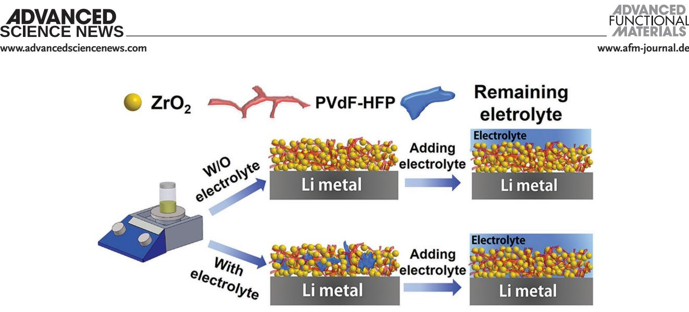
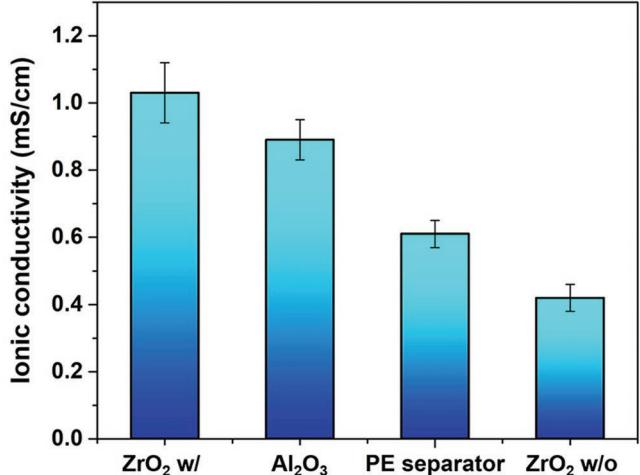
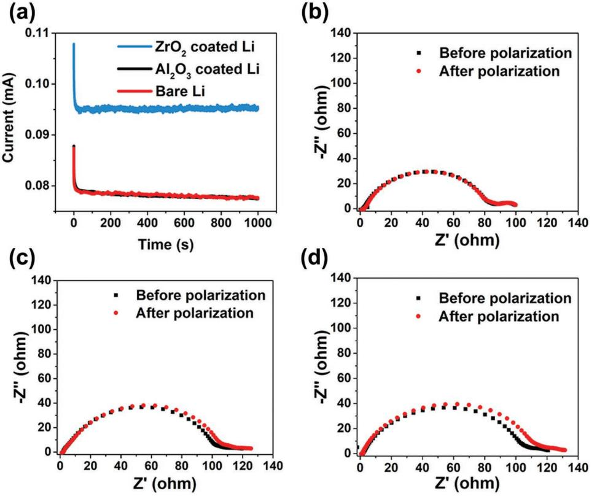
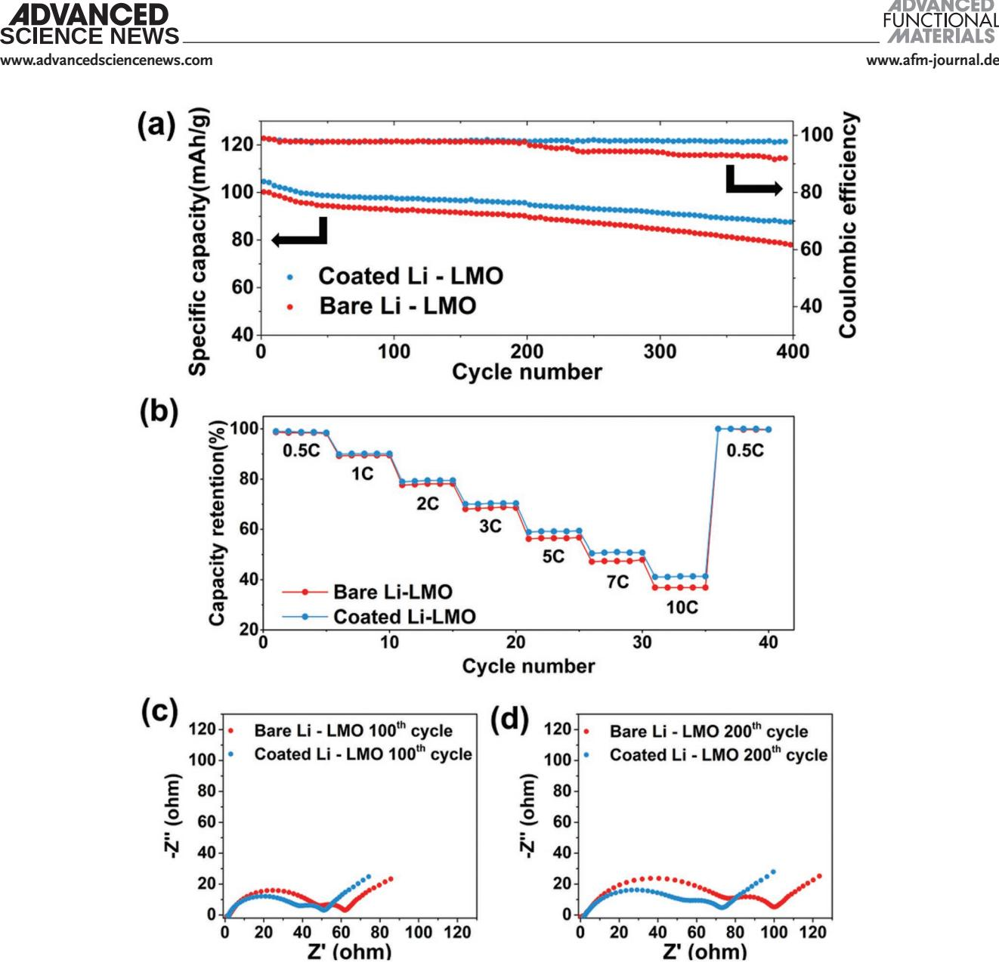
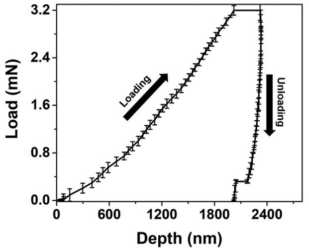
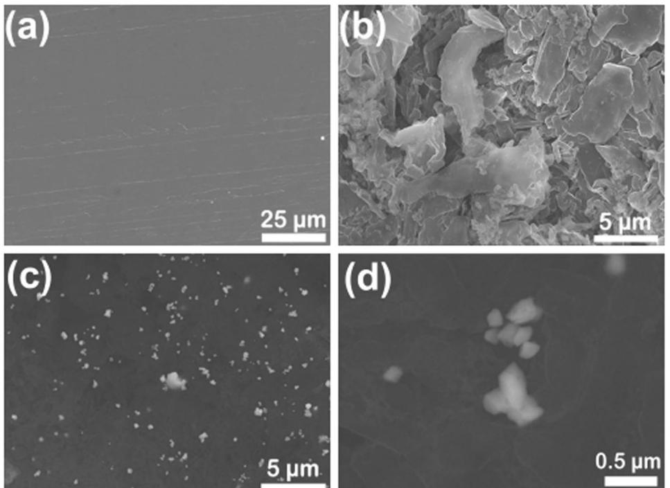
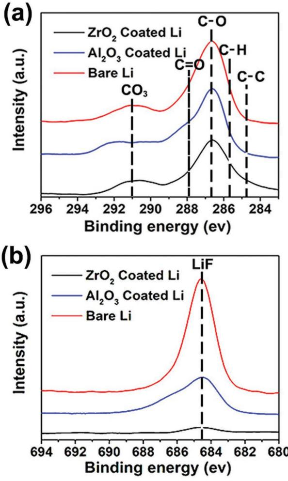
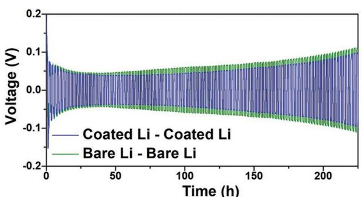
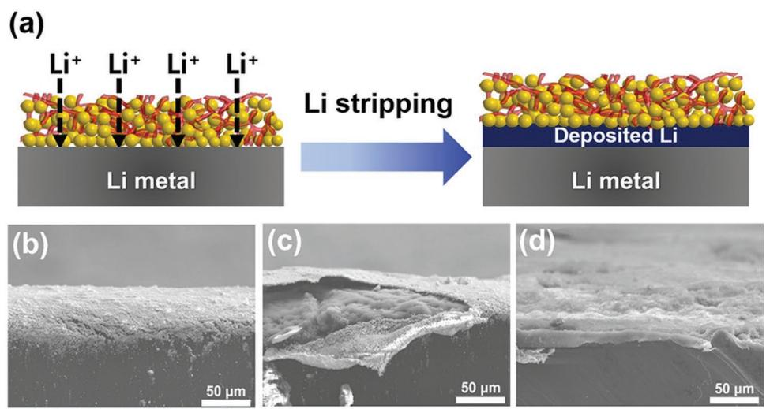

# **High Dielectric, Robust Composite Protective Layer for Dendrite-Free and LiPF6 Degradation-Free Lithium Metal Anode**

*Eun Kwang Jang, Jinhyeok Ahn, Sukeun Yoon, and Kuk Young Cho\**

**The development of lithium metal anodes for next generation batteries remains a challenge. Uncontrolled Li dendrite growth not only induces severe safety issues but also leads to capacity fading by continuously consuming the electrolyte. This study demonstrates the design and fabrication of a composite protective layer composed of a high dielectric polymer, inorganic particles, and an electrolyte to overcome these obstacles. This layer not only suppresses dendrite growth, but also prevents LiPF6 degradation. The electrolyte introduced in the protective layer remains within the coating layer after solvent removal and acts as an ion transport channel at the interface. This enables the protective layer to exhibit high ionic conductivity and mechanical strength. The composite protective layer, which exhibits synergistic soft-rigid characteristics, is placed on the Li metal anode and facilitates superior interfacial stability during long-term cycles. LiMn2O4/ coated lithium full cells using the composite protective layer show a superior rate capability and enhanced capacity retention compared to the cells using a bare lithium anode. The proposed strategy opens new avenues to fabricate a sustainable composite protective layer that affords superior performance in lithium metal batteries.**

# **1. Introduction**

Rechargeable lithium metal batteries are currently attracting significant attention because of their potential to overcome the theoretical energy density limitations of the state-of-the-art lithium-ion batteries by replacing graphite anodes with lithium metal, which exhibits ten times higher specific capacity. This increase in specific capacity (from 250 to 500 kW kg−1 based on cell) is necessary for electric vehicles to replace internal

Department of Materials Science and Chemical Engineering Hanyang University 55 Hanyangdaehak-ro, Sangnok-gu, Ansan, Gyeonggi 15588, South Korea E-mail: kycho@hanyang.ac.kr Prof. S. Yoon

Division of Advanced Materials Engineering

1223-24 Cheonan-daero, Seobuk-gu, Cheonan, Chungnam 31080, South Korea

The ORCID identification number(s) for the author(s) of this article can be found under https://doi.org/10.1002/adfm.201905078.

**DOI: 10.1002/adfm.201905078**

combustion engines. As the lithium metal will continue to be used as an anode in next generation secondary lithium batteries that comprise lithium–sulfur and lithium–O2 systems, achieving the best performance of the lithium metal anode is considered the "holy grail" of current research efforts. In addition to a high specific capacity (3860 mAh g−1 ), it demonstrates low electrochemical potential (−3.040 V vs standard hydrogen electrode).[1,2]

However, issues like dendrite formation at the lithium metal anode and the resulting problems hinder stable and long-term charge–discharge operation of lithium metal batteries.[3,4] Currently, efforts are underway to overcome these obstacles. These approaches can be broadly classified into three categories. First, physical modification of the lithium metal (foams and surface patterning[5]), second, identifying new components or replacements in conventional cell configurations (new electrolytes and salts,[6–8]

solid-state electrolytes[9,10]), and third, use of protective coatings. Among these categories, protective coatings, which readily form an artificial solid electrolyte interface (SEI) at the surface, provide the most intuitive, and feasible solution. As constantly generated SEI and dead Li form a thick, porous layer with high interfacial resistance, a stable and uniform protective layer that suppresses Li dendrite growth and withstands the volume change is of critical importance.[11] The protective layer on the lithium metal surface can be an ex situ coating or an in situ SEI layer that is formed from the solvents,[12] Li salts, and electrolyte additives.[13] Its thickness can vary from several nanometers to tens of micrometers, depending on the coating method.[14,15] The coating materials can be organic,[16] inorganic,[17] metallic materials, or their hybrids.[18–20] The insufficient mechanical robustness of polymers and the poor interfacial contact of ceramics remain formidable challenges to the formation of efficient protective layers. Approaches using composites or hybrids can combine the advantages and eliminate the disadvantages of polymers and ceramics.[11,14,21]

During the last decade, new approaches to the fabrication of protective layers for preventing or reducing dendrites have been developed, but significant gaps remain in the relevant knowledge. A clear understanding of the surface reactivity and

E. K. Jang, J. Ahn, Prof. K. Y. Cho

Kongju National University

behavior of the lithium metal at the interface with the hybrid coating is necessary for successful practical applications.[22] Thus, detailed investigations of various aspects of the protective coating, such as the effect of fabrication, role of the materials used in the protective layer, additional advantages afforded by such a layer, and the effectiveness of the protective layer in prolonged charge–discharge cycles are required.

Recently, it was highlighted that direct polymer coating onto lithium metal should possess a high dielectric constant, low surface energy, and low reactivity to adjust with the plating and deplating of lithium on the lithium metal anode.[23] These indicate that proper choice of the material for direct coating onto lithium as well as detailed investigations are important for establishing standards and improving performance of lithium metal protection.

Herein, for the first time, we present the direct application of a hybrid protective layer composed of zirconia (ZrO2) particles and poly(vinylidene fluoride-co-hexafluoropropylene) (PVdF-HFP).

PVdF-HFP is a well-known material used as a binder for cathode and anode plate fabrication.[24] It is also used as a matrix for gel electrolytes, owing to its relatively high ionic conductivity and chemical and electrochemical stabilities. It shows a high dielectric constant in comparison to other polymers. Zirconia exhibits outstanding mechanical hardness and dielectric constant (ε' = 23 for monoclinic structure below 1170 °C) compared to other ceramics. Furthermore, it shows a very high dielectric constant as well as a high surface energy in comparison to polymers.[25]

The composite protective layer fabricated herein from high dielectric polymer and ceramic particles exhibits favorable attributes, such as a high mechanical modulus, a high ionic conductivity, superior shape conformability, good compatibility with the Li metal anode, high transference number, and prevention of LiPF6 salt degradation. Li-LiMn2O4 (LMO) cells exhibited remarkable capacity retention (more than 87% of the initial capacity) after 400 charge–discharge cycles. We have also investigated the preparation conditions and analyzed the surface of the hybrid protective layer that is directly applied on the lithium metal surface.

This work not only emphasizes the importance of the preparation conditions for the hybrid protective coating, but also introduces a promising, long-term, stable protective layer for lithium metal anodes.

# **2. Results and Discussion**

Basically, the composite protective layer of a lithium anode is composed of ceramic particles and polymeric binders. Zirconia (ZrO2) particles with a density of 5.68 g cm−3 and a mean diameter of 5 µm were used as the ceramic particles. PVdF-HFP, which is widely used as a binder in electrodes, was used as the polymeric binder. The HFP phase helps to capture large amounts of liquid electrolytes and the PVdF crystalline phase acts as a mechanical support for the polymer matrix.[26] PVdF-HFP has a high dielectric constant, which enhances lithium salt dissociation. It has been reported that the high dielectric constant is beneficial for the disassociation of the lithium salt in solution.[27] From this viewpoint, monoclinic ZrO2, which has a high dielectric constant (ε' = 23) as well as superior mechanical properties (high fracture toughness) (Figure S1, Supporting Information), is an attractive candidate. A coating slurry using N,N-dimethylformamide (DMF) as a solvent was prepared and used to fabricate the coating layer on the lithium anode. The composition ratio of the ZrO2 and the PVdF-HFP was varied from 6:4 to 9:1 based on weight. The cycling performance of the protection-coated lithium anode was first investigated to obtain the optimal composition. ZrO2:PVdF-HFP ratios of 8:2 and 7:3 showed the highest capacity retention, and ZrO2:PVdF-HFP = 8:2 was chosen for further investigation in this work (Figure S2, Supporting Information).

In preparing the ceramic protective coating layer for the lithium anode, differences were observed from the previous reports, based on whether the liquid electrolyte was introduced into the coating slurry or not. First, a protective layer was prepared using a coating slurry free from liquid electrolyte and compared with the uncoated bare lithium anode. The results showed a somewhat improved capacity retention but also a slightly higher impedance, symmetric voltage profile, and poor rate capability for the lithium anode with the protective layer (Figures S3–S6, Supporting Information).

We believe that this is caused by the poor wetting at the surface of the lithium anode when the protective layer was applied. Difficulty in liquid electrolyte intrusion throughout the protective layer was due to the size of capillary pores. It is anticipated that the liquid electrolyte that filled the protective layer at the initial stage can serve as a pathway for the facile movement of lithium ions when cycling begins (**Figure 1**). We prepared coating slurries for the protective layer with and without liquid electrolyte and applied the slurries to the lithium anode. The change in weight of the protective layer was measured after drying in vacuum. The composition of the coating slurry with and without the liquid electrolyte was ZrO2 particle:PVdF-HFP:DMF:liquid electrolyte = 4:1:20:3 and 4:1:20:0, respectively. The results (Table S1, Supporting Information) indicated that the solvent was completely removed after drying for 12 h. However, almost all the liquid electrolyte initially introduced remained in the coating layer after drying. This is because of the higher molecular weight of the liquid electrolytes in comparison to that of the solvent (DMF).

To investigate the initial introduction of the liquid electrolyte in the coating slurry, a protective coating for an anode was prepared from the slurry containing the liquid electrolyte (Figure S7a, Supporting Information). A conformal composite protective layer on the lithium metal anode was obtained after a coating and drying procedure (Figure S7b, Supporting Information). As can be seen from the cross-sectional and surface scanning electron microscopy (SEM) image, the ZrO2 composite layer is uniform and conformal to the lithium metal (Figure S8a,b, Supporting Information). Coating thickness was 21.7 µm.

Using an impedance analyzer, the ionic conductivity of the coating layer with the electrolyte (with an stainless use steel (SUS)/coating layer/SUS configuration) was determined to be 1.08 mS cm−1 , which is higher than that of commercial polyethylene separators (0.608 mS cm−1 ; 16 µm thick), ZrO2 coating layers without electrolyte (0.42 mS cm−1 ; 19 µm thick), and Al2O3 coating layers with electrolyte (0.89 mS cm−1 ; 17 µm thick) (**Figure 2**).

**Figure 1.** Schematic of fabrication method. In the method without the electrolyte, it is difficult to sufficiently penetrate the coating layer when the electrolyte is filled. In the method with the electrolyte, the electrolyte remains after the drying process. So, the remaining electrolyte acts as a channel.

The Li+ ion transference numbers obtained from the combination of chronoamperometry and electrochemical impedance spectroscopy (EIS) of Li–Li symmetric cells are shown in **Figure 3**. The Li+ ion transference numbers of Li metal with ZrO2, Al2O3, and without coating are 0.53, 0.44, and 0.37, respectively. A low *t*Li+ indicates an abundance of mobile anions, which could increase the electrode polarization and lead to undesirable side reaction on the electrode. Moreover, a low *t*Li+ may also induce dendrite growth in the lithium metal anode.[28,29] The reason for the increase in transference number is that more "free" Li+ ions were released owing to the presence of the coating layer with a high dielectric constant. The higher amount of free Li+ ions may have also influenced the ion conductivity. The result indicates good ion transfer through the protective layer. It is also advantageous that the high ionic conductivity suppresses lithium dendrite growth by preventing large electric fields.[30,31]

The mechanical robustness of the protective layer against the liquid electrolyte was evaluated by immersing lithium metal anodes with and without a protective layer in the liquid electrolyte

**Figure 2.** Ionic conductivity of ZrO2 coating layer (with and without the electrolyte), Al2O3 coating layer, and PE separator. 1.0 m LiPF6 in EC/EMC (3/7, vol%) was used as the electrolyte.

(1 m LiPF6 in ethylene carbonate (EC)/ethyl methyl carbonate (EMC) (3/7, vol%)) (Figure S9, Supporting Information). Photographic images clearly indicate that the protective layer with the electrolyte showed stable adherence to the lithium anode. Moreover, the impedances of the bare and protection-coated lithium anode were compared for up to 14 days. Initially, the impedance of the bare Li symmetric cell was lower than that of the cell assembled with the coating layer, owing to the presence of the ZrO2 coating layer on the surface of the Li metal electrode. With the passage of time, however, the impedance of the bare Li cell increased continuously, which was attributed to the gradual growth of the SEI layer as a result of the reaction between Li metal electrode and the electrolyte. By contrast, the impedance of the coated Li cell stabilized after 3 days, indicating that the ZrO2 coating layer on the surface of the Li metal electrode effectively isolated the Li electrode and organic electrolytes, thus preventing the side reaction (Figure S10, Supporting Information).[32]

The cycling performance of a lithium metal battery (LMB) with a full cell configuration (i.e., Li/separator/LMO) using a cut-off potential of 4.5 V versus Li/Li+ with and without the ZrO2 layer is shown in **Figure 4**. The initial discharge capacities of the cells with and without the coating were 104.6 and 100.2 mAh g−1 , respectively. Interestingly, a higher initial discharge capacity was observed for the cells using a protection-coated lithium anode at every cycle for the three different cycling tests. We also compared with the cell using Al2O3-based composite-coated Li anode (Figure S11, Supporting Information). This kind of initial increase in capacity by the composite protective layer has not been reported for other protective coating layers using ceramic particles such as Al2O3. This phenomenon is not fully understood at this stage, but the increase of the initial discharge capacity originates from the use of ZrO2 particles. This behavior of the increase of the initial capacity was also reported for the thin ZrO2 atomic layer deposition coating on to graphite from another group and is attributed to the intrinsic capacity of ZrO2. [33]

Charge–discharge cycles of cells are repeated up to 400 cycles. The capacity retentions of the cells with and without protective layer are 87.2 and 81.2%, respectively, after 400 cycles. In the pursuit of a high performance LMB, the accurate measurement of coulombic efficiency is the most critical factor to predict the cycle

**Figure 3.** a) Chronoamperometry of Li/Li symmetric cells assembled with and without a coating layer. EIS for the same cells before and after polarization assembled b) with ZrO2, c) with Al2O3, and d) without protective coating layer.

life.[34] The coulombic efficiency remarkably improved from 91.1 to 97.8% by applying ZrO2 protective layer after 400 cycles. This is the consequence of preventing continuous decomposition of the electrolyte at the lithium surface. The rate capability of a lithium metal battery can be of great importance when used as an energy source for EVs. The results clearly showed an improvement in the rate capability of cells with the ZrO2-coated lithium anode, especially at the high charge–discharge rates (>5 C) (Figure 4b).

The Nyquist plots comparing the impedance of the cells with bare and protected lithium anodes were measured at 100 and 200 cycles. These indicate that the cell with the protected lithium anode exhibited a lower resistance (Figure 4c,d).

The impedance value after 100 cycles was higher for the cell without a coating layer (**Table 1**). This was because of the formation of an unstable SEI layer by the side reaction. In the same way, the impedance value after 200 cycles was much lower than that of the cell without a coating layer. lithium ion diffusion resistance (*R*f) value increased from 42.4 to 68.3 Ω when the coating layer was not present on the lithium metal anode. This is attributed to the resistive surface layer originating from incessant electrolyte decomposition. Meanwhile, the *R*f values of cells with coating layers after 200 cycles (47.8 Ω) showed a small increase over that of bare lithium metal anode cells. This indicates the formation of a stable surface film in the early cycle process, avoiding further oxidation of the electrolyte solvent. In addition, the cell with the coating layer showed a much smaller charge transfer resistance (*R*ct) value (26.2 Ω) than that without the coating layer (30.5 Ω). Thus, the enhanced overall performance with the coating layer is ascribed to the more stable lithium metal/electrolyte interface. The electrochemical performance clearly showed that introduction of the liquid electrolyte in the coating slurry has an influence on the performance. It is noteworthy that fabrication compositions also have an impact on the final performances of the cells with a composite protective layer on the lithium anode.[35]

Recently, it was reported that dendrite formation can be suppressed by a high mechanical modulus, robust protective layer. From this viewpoint, a composite protective layer that contains inorganic particles is advantageous because of the general improvement in mechanical properties of the composite coating for various applications. We investigated the hardnessmodulus properties of our composite protective layer with ZrO2 particles using the nanoindentation method.

Nanoindentation technology is an analytical method that measures mechanical properties such as elastic modulus, hardness, and creep by applying an indenter with various sizes and geometries to a material surface with a small load corresponding to nano or micro units. The elastic modulus was calculated using Poisson's ratio; measurements were carried out using an adhesion testing instrument

$$
\frac{1}{E_{\rm r}} = \frac{\left(1 - \nu_{\rm s}^2\right)}{E_{\rm s}} + \frac{\left(1 - \nu_{\rm i}^2\right)}{E_{\rm i}}\tag{1}
$$

Where *E*r is the reduced modulus, *E*s is the modulus of the sample, νs is the Poisson's ratio of the sample, *E*i is the modulus of indenter tip, νi is the Poisson's ratio of indenter tip.[36]

**Figure 4.** a) Cycle life and coulombic efficiency of bare and coated Li-LMO cells. b) Rate capability of bare and coated Li-LMO cells. c) Nyquist plot of Li-LMO cell after 100 and d) 200 cycles. The rate of charge was 0.5 C and the cut-off voltage was 4.5 V.

Previous work reported that the coating layer or artificial SEI layer should exhibit an elastic modulus on the order of 1 GPa to suppress lithium dendrite formation on the lithium metal surface.[37] To calculate the elastic modulus from Equation (1), force–displacement curve from nanoindentation was constructed (**Figure 5**). In our system, the ZrO2 composite

**Table 1.** Fitted resistance values of cells with and without a coating layer at the 100th and 200th cycles based on the equivalent circuit model and the impedances shown in Figure 4.

| Fitted resistance [Ω] |           | Rb  | Rf   | Rct  |
|-----------------------|-----------|-----|------|------|
| 100th                 | Bare Li   | 2.6 | 42.4 | 21.6 |
| cycle                 | Coated Li | 2.0 | 32.4 | 21.1 |
| 200th                 | Bare Li   | 2.6 | 68.3 | 30.5 |
| cycle                 | Coated Li | 2.8 | 47.8 | 26.2 |

protective layer showed an elastic modulus of 2.17 GPa, which is much higher than that of the bare lithium metal (1.17 ± 0.55 GPa).[38] The value exceeded the threshold to suppress lithium dendrite formation on the lithium metal surface for an artificial SEI, which is on the order of 1 GPa.[37]

The surface morphologies of lithium metal anodes removed from the cells after 100 charge–discharge cycles are compared for the bare and protected lithium (**Figure 6**). Unprotected lithium metal from the cycled cell (Figure 6b) showed severe dendrite formation compared to the clean, bare lithium metal (Figure 6a). To investigate the surface of the lithium metal under the protective coating, the protective layer was carefully removed by immersing the composite-coated lithium in the DMF for 5 min followed by peeling the softened coating layer using forceps, prior to SEM observation. Unlike the extremely rough surface of the cycled bare lithium metal, a clear and smooth surface (Figure 6c) with unremoved ZrO2 particles **www.advancedsciencenews.com www.afm-journal.de**

**Figure 5.** Force–displacement curves of ZrO2 coating layer by nanoindenter.

(Figure 6d) was observed for the protected lithium metal. The results clearly indicate that our ZrO2 composite protective layer successfully suppressed lithium dendrite formation for the lithium anode cycled for 100 cycles.

As indicated in the Introduction, dendrite formation and side reaction are the main causes of performance deterioration in lithium metal batteries. In addition to observations of dendrite formation on the surface of the lithium metal anode, further investigations on the surface of the lithium metal anode were conducted using X-ray photoelectron spectroscopy (XPS) to observe the side reaction. The surfaces of the bare and protected lithium metal anodes from cells disassembled after 10 charge– discharge cycles were investigated (**Figure 7**). C 1s spectra from both lithium metal anodes with and without the protective coating were compared. Peaks of CO species, representing Li-alkyl carbonates (ROCO2Li), and Li-carbonates (Li2CO3), appeared at 291.5, 286.6, and 285 eV, respectively. These are products of the reductive decomposition of carbonate electrolyte solvents. The relatively low peak intensity of the protected lithium metal anode surface compared to the uncoated one indicates the suppression of electrolyte decomposition.

It is well-known that the side reaction originates from the liquid electrolyte, previous reports mainly focused on the dissociation of the electrolyte solvent and did not pay significant attention to the lithium salt, which is one of the important components of the liquid electrolyte.

In the state-of-the-art commercial lithium-ion batteries, lithium hexafluorophosphate (LiPF6) dissolved in the mixture of linear and cyclic carbonates is the most popular electrolyte system.[39,40] Despite the shortcomings of poor light and thermal stability of LiPF6, it is the dominant choice as a lithium salt because of its high ionic conductivity and low molecular weight. However, this poor stability inevitably induces participation in the formation of HF from the reaction with trace water, and the formation of acidic compounds negatively impacts the stability of the SEI layer.[41] Furthermore, LiPF6-carbonate solvents also form an inorganic SEI layer consisting mainly of Li2CO3 and LiF. It was reported that the presence of isolated LiF crystals is the most important factor leading to an unstable SEI layer.[42]

**Figure 6.** SEM images of the lithium metal anode surface. a) Initial uncycled bare lithium. b) Bare lithium anode from the cells after 100 charge–discharge cycles. c) Protected lithium anode from the cells after 100 charge–discharge cycles after removal of the ZrO2 composite protective layer. d) Magnified image of (c) showing a ZrO2 particle on the surface of lithium metal.

**Figure 7.** XPS spectra of the Li metal anode disassembled from LMO/Li cell with the 1 m LiPF6 in EC/EMC (3/7, vol%) after a) 10 cycles of C 1s and b) F 1s.

In the high-resolution F 1s spectra (Figure 7b) of the Li metal, a sharp LiF peak appears at 684.5 eV. The existence of this peak indicates the decomposition of LiPF6 on the lithium metal surface. Interestingly, only a small peak was observed for the surface of lithium metal with the protective layer. Furthermore, the ZrO2 composite coating layer exhibits a lower LiF peak than the Al2O3 composite layer. This is because ZrO2 has a higher dielectric constant than Al2O3. This new finding clearly demonstrates that the ZrO2 composite protective layer effectively prevents LiPF6 dissociation.

The stability of the Li metal electrode in the electrolyte during cycling is important factor in the cell system. This is because when the Li metal electrode exhibits poor cycling stability, the breakdown of the SEI layer occurs, which causes a continuous decomposition reaction of the electrolyte on the lithium surface.

The polarization of the coated Li symmetric cell is lower than that of the symmetric cell without coating, as demonstrated in **Figure 8**. This indicates that the coating layer improves stability when stripping/plating.

**Figure 9** shows SEM images of the charging state of coated Li metal (Figure 9b,c) and bare Li metal (Figure 9d) in LMO-Li

**Figure 8.** Voltage profiles of Li stripping/plating in a Li–Li symmetric cell at a capacity of 1 mAh cm−2, at a current density of 1 mA cm−2.

cell after ten cycles using the same conditions as in the cycling test. The coating layer has a clean surface despite the charging process. However, after charging, the interior was filled with lithium that has a morphology similar to that of bare Li metal. This means that lithium ions were deposited under the coating layer because the coating layer does not interfere with the movement of lithium ions during charging.

### **3. Conclusion**

In summary, an electrolyte-assisted composite protective layer with a high dielectric polymer and a robust ceramic particle has been investigated. Our experiments demonstrate that the high dielectric and electrolyte-assistance during fabrication of the protective layer is of great importance for achieving the high ionic conductivity and low resistance of the coating layer. The resulting protected Li metal cell shows the best performance, with an electrolyte channel, a high dielectric constant, and superior mechanical properties.

Finally, the coulombic efficiency and capacity retention of the Li-LMO cell were 97.8% and 87.2%, respectively, which are among the high rank in the lithium metal cells based on carbonate electrolytes. Most importantly, this excellent performance was achieved without salt degradation- and dendritefree, which is highly desirable for lithium metal batteries.

#### **4. Experimental Section**

*Fabrication and Ceramic Based Hybrid Protection Layer*: The slurry of organic/inorganic composite was prepared by mixing zirconium (IV) oxide powder, 5 µm, 99% trace metals basis (ZrO2 Sigma-Aldrich, USA) or Al2O3 powder (average particle size = 500 nm),[43] PVdF-HFP (Sigma-Aldrich, USA), N,N-Dimethylformamide (anhydrous 99.8%, Sigma-Aldrich, USA), and electrolyte. 1 m LiClO4 in EC/propylene carbonate (1/1, vol%) gifted from PANAX ETEC was used to prepare mixture slurry. The mixing ratio of ZrO2, PVdF-HFP, DMF, and electrolyte was 4:1:20:3 by weight. Mixture slurry was coated on the Li metal foil (450 µm thickness; Honzo, japan) using doctor blade followed by drying in vacuum for 12 h at room temperature. The thickness of the coating layer was 21.7 µm.

*Cell Assembly*: 2032 type coin cells were assembled to investigate the electrochemical properties of composite protection layer coated lithium metal anode. A LMO (MTI Korea) cathode was prepared by slurry casting on Al foil with blend of LMO, Carbon black (Super-P),

**Figure 9.** a) Schematic of lithium plating on Li anode. Cross-sectional SEM images of ZrO2-based composite protective layer on lithium metal anode after plating b) showing the protective layer and c) inside the protective layer. d) SEM image of bare lithium metal after plating.

and PVdF (KF 1300, Kureha Co.) at a weight ratio of 90:5:5 in N-methyl-2-pyrrolidone solvent. After the slurry casting cathode dried at room temperature for 48 h. The thickness, loading level, and capacity density are 66 µm, 9.05 mg cm−2, and 0.93 mAh cm−2, respectively.

Bare Li metal and protection-coated Li metal were used as anode for cell. The porous polyethylene (PE) separator with 12 µm thickness (W-Scope korea) was placed between the anode and cathode. The 1 m LiPF6 in EC/EMC (3/7, vol%) was used as electrolyte. Every cell was fabricated in glove box filled with argon gas (99.999% purity).

*Characterization*: To investigate the surface of protection-coated lithium metal anode after charge–discharge cycles, cells were first disassembled in as Ar-filled glove box using cell disassembler (Coin cell disassembling M/C, ROHTEC, Korea). Protection coating layer was carefully removed after immersing the coated lithium anode in DMF for 5 min, which fully softened coating layer. Lithium metal anode was dried in vacuum chamber equipped in glove box. The surface morphology was observed using field-emission scanning electron microscopy (S-4800, Hitachi) equipped with an energy dispersive spectroscopy (Intech Co.).

Mechanical property (elastic modulus) of coating layer was measured using nanoindenter (NanoTest Vantage Platform, Micro material co.). The nanoindentation system monitors and records the load and displacement of the pyramidal diamond (Berkovich) indenter during indentation with a force resolution of about (3 µN) and a displacement resolution of about (0.02 µm). The Poisson's ratio was obtained through an experiment using an adhesion testing instrument (TXA Texture Analyzer; YEONJIN S-TEC, Korea). The chemical composition of the Li metal surface of the cell after cycling was investigated by the XPS (R3000, VG SCIENTA) spectra obtained with mono Al Kα as the X-ray source (1486.6 eV) under ultrahigh vacuum. The structure of ZrO2 was determined via Raman spectroscopy (RAMANtouch, Nanophoton) equipped with a 532 nm laser (laser power of 28 mW) light source and a 0.90/100× objective providing 70 µm diameter laser spot.

*Electrochemical Analysis*: The galvanostatic charge–discharge test was conducted using a battery tester (PNE solution, Korea) in the voltage range of 3.0–4.5 V (vs Li/Li+). Cycle performances were evaluated from the results of the cell cycled at 0.5 C in a constant current (CC)/ constant voltage (CV) mode for charging process and CC mode for discharging process at room temperature. The rate capabilities were measured varying from 0.5 to 10 C rate (0.5, 1, 2, 3, 5, 7, and 10 C) in the range of 3.0–4.5 V (vs Li/Li+). Alternating current impedance was measured at an amplitude of 10 mV in the frequency range of

1 MHz–10 mHz. EIS measurement was performed with an impedance analyzer (VSP, BioLogic). Li–Li symmetric cells were used to study the Li stripping/plating behaviors using a battery tester (WonATech, Korea). The ionic conductivities of the coating layer were obtained by measuring impedance in the frequency range 1 MHz–100 kHz with two stainless steel block electrodes in the coin cell. The Li+ ion transference number was obtained by the combination of chronoamperometry and EIS. The electrolyte-soaked separators were placed between two lithium foils, and then. The calculation equation is as follows: ( ) ( ) Li ss 0 0 0 ss ss *t I* + = × ∆ − *V I R I* ÷ × ∆ − *V I R* , where *I*0 and *I*ss are the initial and steady-state currents obtained by chronoamperometry, respectively; *R*0 and *R*ss are the initial interfacial and steady-state resistances obtained by EIS, respectively; Δ*V* is the step potential difference (10 mV).

# **Supporting Information**

Supporting Information is available from the Wiley Online Library or from the author.

# **Acknowledgements**

This research was supported by the National Research Foundation of Korea (NRF) granted Mid-Career Research Program (Grant No. 2018R1A2B6003422).

#### **Conflict of Interest**

The authors declare no conflict of interest.

#### **Keywords**

dendrite, lithium metal anode, lithium metal battery, protective coating, salt degradation

> Received: June 25, 2019 Revised: August 13, 2019 Published online: September 9, 2019

**www.advancedsciencenews.com www.afm-journal.de**

- [1] D. Lin, Y. Liu, Y. Cui, *Nat. Nanotechnol.* **2017**, *12*, 194.
- [2] X. B. Cheng, R. Zhang, C. Z. Zhao, Q. Zhang, *Chem. Rev.* **2017**, *117*, 10403.
- [3] Y. Gao, Z. Yan, J. L. Gray, X. He, D. Wang, T. Chen, Q. Huang, Y. C. Li, H. Wang, S. H. Kim, T. E. Mallouk, D. Wang, *Nat. Mater.* **2019**, *18*, 384.
- [4] J. Alvarado, M. A. Schroeder, T. P. Pollard, X. Wang, J. Z. Lee, M. Zhang, T. Wynn, M. Ding, O. A. Borodin, S. Meng, *Energy Environ. Sci.* **2019**, *12*, 780.
- [5] J. Park, J. Jeong, Y. Lee, M. Oh, M.-H. Ryou, Y. M. Lee, *Adv. Mater. Interfaces* **2016**, *3*, 1600140.
- [6] Y. Yamada, A. Yamada, *J. Electrochem. Soc.* **2015**, *162*, A2406.
- [7] Q. Ma, Z. Fang, P. Liu, J. Ma, X. Qi, W. Feng, J. Nie, Y.-S. Hu, H. Li, X. Huang, L. Chen, Z. Zho, *ChemElectroChem* **2016**, *3*, 531.
- [8] J. Zheng, J. A. Lochala, A. Kwok, Z. D. Deng, J. Xiao, *Adv. Sci.* **2017**, *4*, 1700032.
- [9] S. Wenzel, T. Leichtweiss, D. Krüger, J. Sann, J. Janek, *Solid State Ionics* **2015**, *278*, 98.
- [10] S. Wenzel, S. Randau, T. Leichtweiss, D. A. Weber, J. Sann, W. G. Zeier, J. Janek, *Chem. Mater.* **2016**, *28*, 2400.
- [11] R. Xu, X. Q. Zhang, X. B. Cheng, H. J. Peng, C. Z. Zhao, C. Yan, J. Q. Huang, *Adv. Funct. Mater.* **2018**, *28*, 1705838.
- [12] K. Yoshida, M. Nakamura, Y. Kazue, N. Tachikawa, S. Tsuzuki, S. Seki, K. Dokko, M. Watanabe, *J. Am. Chem. Soc.* **2011**, *133*, 13121.
- [13] a) Y. Lu, Z. Tu, L. A. Archer, *Nat. Mater.* **2014**, *13*, 961; b) J. Qian, W. Xu, P. Bhattacharya, M. Engelhard, W. A. Henderson, Y. Zhang, J. G. Zhang, *Nano Energy* **2015**, *15*, 135.
- [14] H. K. Jing, L. L. Kong, S. Liu, G. R. Li, X. P. Gao, *J. Mater. Chem. A* **2015**, *3*, 12213.
- [15] E. Kazyak, K. N. Wood, N. P. Dasgupta, *Chem. Mater.* **2015**, *27*, 6457.
- [16] G. Zheng, S. W. Lee, Z. Liang, H.-W. Lee, K. Yan, H. Yao, H. Wang, W. Li, S. Chu, Y. Cui, *Nat. Nanotechnol.* **2014**, *9*, 618.
- [17] A. C. Kozen, C.-F. Lin, A. J. Pearse, M. A. Schroeder, X. Han, L. Hu, S.-B. Lee, G. W. Rubloff, M. Noked, *ACS Nano* **2015**, *9*, 5884.
- [18] D. Zhou, R. Liu, Y.-B. He, F. Li, M. Liu, B. Li, Q.-H. Yang, Q. Cai, F. Kang, *Adv. Energy Mater.* **2016**, *6*, 1502214.
- [19] W. Liu, W. Li, D. Zhuo, G. Zheng, Z. Lu, K. Liu, Y. Cui, *ACS Cent. Sci.* **2017**, *3*, 135.
- [20] L. Chen, Z. Huang, R. Shahbazian-Yassar, J. A. Libera, K. C. Klavetter, K. R. Zavadil, J. W. Elam, *ACS Appl. Mater. Interfaces* **2018**, *10*, 7043.
- [21] H. Lee, D. J. Lee, Y.-J. Kim, J.-K. Park, H.-T. Kim, *J. Power Sources* **2015**, *284*, 103.
- [22] F. Liu, Q. Xiao, H. B. Wu, L. Shen, D. Xu, M. Cai, Y. Lu, *Adv. Energy Mater.* **2018**, *8*, 1701744.
- [23] J. Lopez, A. Pei, J. Y. Oh, G.-J. N. Wang, Y. Cui, Z. Bao, *J. Am. Chem. Soc.* **2018**, *140*, 11735.
- [24] Z. Wang, S. Tian, S. Li, L. Li, Y. Yin, Z. Ma, *RSC Adv.* **2018**, *8*, 20025.
- [25] D. P. Thompson, A. M. Dickins, J. S. Thorp, *J. Mater. Sci.* **1992**, *27*, 2267.
- [26] R. Miao, B. Liu, Z. Zhu, Y. Liu, J. Li, X. Wang, Q. Li, *J. Power Sources* **2008**, *184*, 420.
- [27] E. R. Logan, E. M. Tonita, K. L. Gering, J. Li, X. Ma, L. Y. Beaulieu, J. R. Dahn, *J. Electrochem. Soc.* **2018**, *165*, A21.
- [28] K. Xu, *Chem. Rev.* **2004**, *104*, 4303.
- [29] L. Porcarelli, C. Gerbaldi, F. Bell, J. R. Nair, *Sci. Rep.* **2016**, *6*, 19892.
- [30] J.-N. Chazalviel, *Phys. Rev. A* **1990**, *42*, 7355.
- [31] M. Rosso, C. Brissot, A. Teyssot, M. Dollé, L. Sannier, J.-M. Tarascon, R. Bouchet, S. Lascaud, *Electrochim. Acta* **2006**, *51*, 5334.
- [32] L. Wang, Q. Wang, W. Jia, S. Chen, P. Gao, J. Li, *J. Power Sources* **2017**, *342*, 175.
- [33] I. R. M. Kottegoda, Y. Kadoma, H. Ikuta, Y. Uchimoto, M. Wakihara, *Electrochem. Solid-State Lett.* **2002**, *5*, A275.
- [34] B. D. Adams, J. Zheng, X. Ren, W. Xu, J. G. Zhang, *Adv. Energy Mater.* **2018**, *8*, 1702097.
- [35] S. H. Lee, S. Yoon, E.-H. Hwang, Y.-G. Kwon, Y.-G. Lee, K. Y. Cho, *J. Power Sources* **2018**, *378*, 112.
- [36] K. Kese, A.-M. Alvarez, J.-H. Karlsson, K. Nilsson, *J. Nucl. Mater.* **2018**, *507*, 267.
- [37] Y. Liu, D. Lin, P. Y. Yuen, K. Liu, J. Xie, R. H. Dauskardt, Y. Cui, *Adv. Mater.* **2017**, *29*, 1605531.
- [38] C. Campbell, Y. M. Lee, K. Y. Cho, Y.-G. Lee, B. Lee, C. Phatak, S. Hong, *Sci. Rep.* **2018**, *8*, 2514.
- [39] D. Guyomard, J.-M. Tarascon, *J. Electrochem. Soc.* **1992**, *139*, 937.
- [40] P. Verma, P. Maire, P. Novák, *Electrochim. Acta* **2010**, *55*, 6332.
- [41] T. Kawamura, A. Kimura, M. Egashira, S. Okada, J.-I. Yamaki, *J. Power Sources* **2002**, *104*, 260.
- [42] A. Andersson, K. Edström, *J. Electrochem. Soc.* **2001**, *148*, A1100.
- [43] S. W. Kim, M.-H. Ryou, Y. M. Lee, K. Y. Cho, *J. Alloys Compd.* **2016**, *675*, 341.

