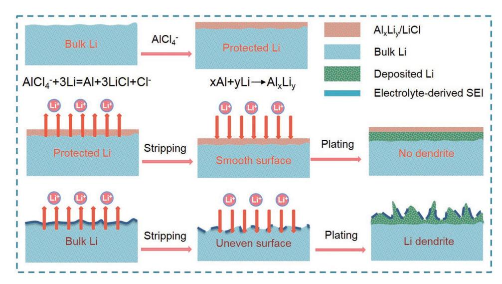
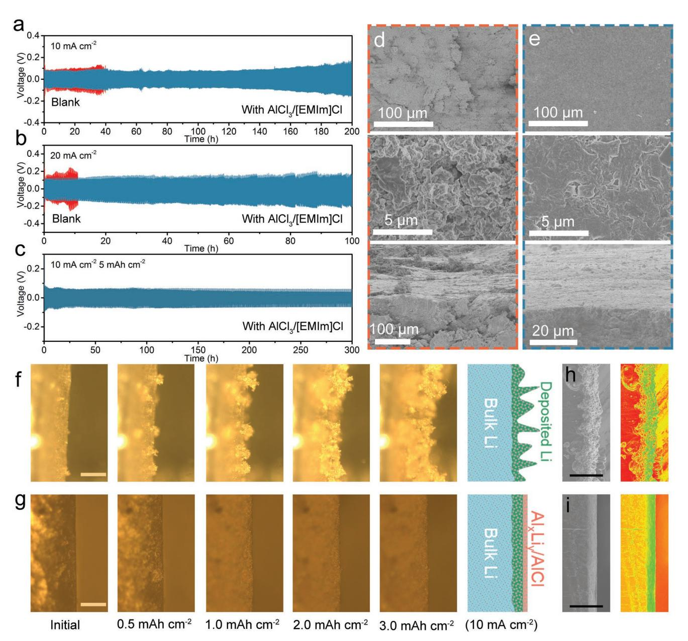
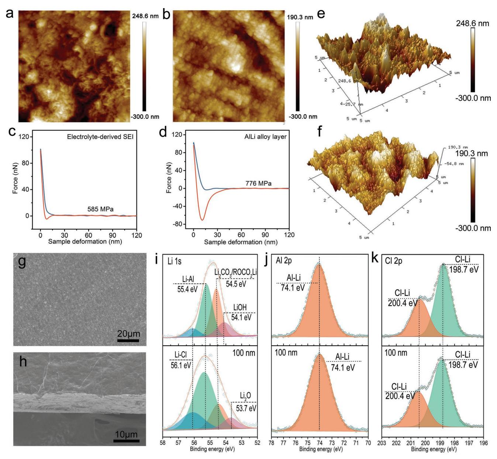
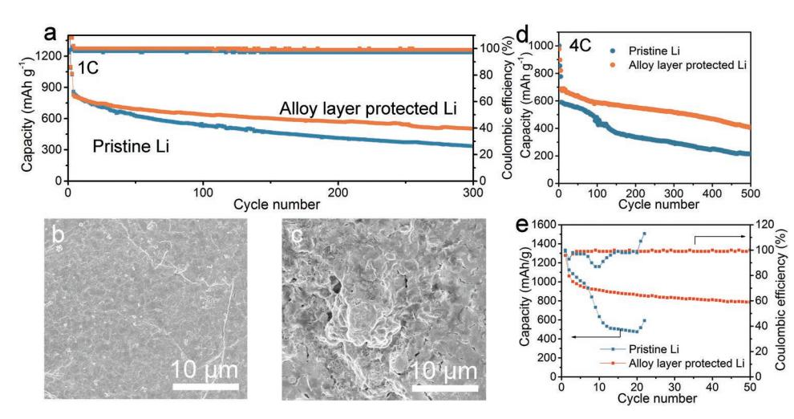

# **Constructing a High-Strength Solid Electrolyte Layer by In Vivo Alloying with Aluminum for an Ultrahigh-Rate Lithium Metal Anode**

*Ziyang Lu, Wantang Li, Yu Long, Jiachen Liang, Qinghua Liang, Shichao Wu,\* Ying Tao, Zhe Weng, Wei Lv, and Quan-Hong Yang\**

**The serious safety issues caused by uncontrollable lithium (Li) dendrite growth, especially at high current densities, seriously hamper the rapid charging of Li metal-based batteries. Here, the construction of Al–Li alloy/ LiCl-based Li anode (ALA/Li anode) is reported by displacement and alloying reaction between an AlCl3-ionic liquid and a Li foil. This layer not only has high ion-conductivity and good electron resistivity but also much improved mechanical strength (776 MPa) as well as good flexibility compared to a common solid electrolyte interphase layer (585 MPa). The high mechanical strength of the Al–Li alloy interlayer effectively eliminates volume expansion and dendrite growth in Li metal batteries, so that the ALA/Li anode achieves superior cycling for 1600 h (2.0 mA cm−2 ) and 1000 cycles at an ultrahigh current density (20 mA cm−2 ) without dendrite formation in symmetric batteries. In lithium–sulfur batteries, the dense alloy layer prevents direct contact between polysulfides and Li metal, inhibiting the shuttle effect and electrolyte decomposition. Long cycling performance is achieved even at a high current density (4 C) and a low electrolyte/sulfur (6.0 µL mg−1 ). This easy fabrication process provides a strategy to realize reliable safety during the rapid charging of Li-metal batteries.**

# **1. Introduction**

With the rapid development of electric vehicles (EVs), the requirement for high energy and power densities is gradually becoming greater than the limit of graphite anodebased lithium-ion (Li-ion) batteries.[1–5] Li metal is regarded as the anode of choice for promising secondary batteries such as Li–S[6,7] and Li-O2 [8–10] due to its high theoretical specific capacity (3860 mAh g−1) and lowest redox potential

Z. Lu, W. Li, Y. Long, J. Liang, Dr. S. Wu, Prof. Y. Tao, Prof. Z. Weng, Prof. Q.-H. Yang Nanoyang Group State Key Laboratory of Chemical Engineering School of Chemical Engineering and Technology Tianjin University Tianjin 300350, China E-mail: wushichao@tju.edu.cn; qhyangcn@tju.edu.cn The ORCID identification number(s) for the author(s) of this article

can be found under https://doi.org/10.1002/adfm.201907343.

**DOI: 10.1002/adfm.201907343**

(−3.04 V vs RHE).[11,12] However, uncontrolled Li dendrite growth[13,14] during repeated charging and discharging may short-circuit the cathode and anode and induce battery safety issues.[15–17] Especially at current densities on the Li anode greater than 10–20 mA cm−2 that are required for EVs to be charged in a short time (e.g., 10–15 min, 4–6 C, the goal of the United States Department of Energy),[18] the growth of Li dendrites and capacity decay are more obvious according to Sand's theory.[19–21] In addition, the severe volume change causes the rapid fragmentation of the fragile solid electrolyte interphase (SEI), which further aggravates the occurrence of side reactions and the growth of dendrites.[22,23] Therefore, the development of effective strategies to prevent dendrite growth at ultrahigh current densities is essential.

Two main strategies have been proposed to improve the Li stripping/plating performance at ultrahigh current densi-

ties (>10 mA cm−2). One is designing a 3D current collector with a high specific surface area to reduce the local current density. The 3D collector includes electron-conducting carbon materials that may or may not be lithiophilic (cellular graphene,[24] Ag-graphene,[25] covalently connected graphite microtubes,[26] carbon nanotubes,[27] ZnO-CNTs[28]), ion-conducting materials (AlF3) [29] and cation/anion regulation materials (polyethylene terephthalate nonwoven fabric,[30] poly-melamineformaldehyde,[31] glass fiber,[32] metal–organic framework,[33]

Z. Lu, W. Li, Y. Long, J. Liang, Dr. S. Wu, Prof. Y. Tao, Prof. Z. Weng, Prof. Q.-H. Yang Joint School of National University of Singapore and Tianjin University International Campus of Tianjin University Binhai New City, Fuzhou 350207, China Dr. Q. Liang Department of Chemical Engineering The University of Melbourne Parkville, VIC 3010, Australia Prof. W. Lv Shenzhen Key Laboratory for Graphene-based Materials Graduate School at Shenzhen Tsinghua University Shenzhen 518055, China

**Figure 1.** Schematic illustration of high-strength layer formation and stripping/plating process on an Al–Li alloy/LiCl-based Li (ALA/Li) and a pristine Li (PLi) anodes.

polyacrylamide-grafted graphene oxide[34]). In these cases, the current densities can be generally increased to 10–20 mA cm−2. However, the introduction of a large amount of inactive material by a complicated fabrication process dramatically reduces the energy density of the battery for practical applications.[35–37] Besides, Li-plating tends to occur at the surface/separator interface near the Li anode due to the smaller resistance of electron and ion charge-transfer at this interface, increasing the possibility of dendrite formation even by this strategy.[38,39]

The second is to regulate the composition of the electrolyte (i.e., solvent, Li salt, and additive) to tailor the properties of the SEI. Compared to the design of a 3D current collector/ interlayer, this is a much easier but less-reported approach to realize stable Li anode than the first approach. For example, an increased concentration of lithium bis(fluorosulfonyl) imide salt (LiFSI) in 1,2-dimethoxyethane (DME) resulted in the growth of a LiF-rich SEI and improved Li anode stability at 10 mA cm−2 , [40] and Xia and co-workers improved the Li anode stability (100 cycles at 10 mA cm−2) by constructing a LiF and Li3N-rich artificial SEI.[41] The latter strategy is often effective at current densities less than 10 mA cm−2 because the low mechanical strength of the SEI produced from conventional electrolyte decomposition is unable to withstand large volume changes during Li stripping and plating (**Figure 1**).[42–44] Further improvements to the high rate performance of a Li metal battery at current densities of 20 mA cm−2 by simply modifying the composition and strength of the SEI are highly desirable but challenging.

#### **2. Results and Discussion**

Here, a high-strength protective alloy layer was constructed at the surface of a Li metal anode by displacement and alloying reactions between the active Li metal and the ionic liquid AlCl3/1-ethyl-3-methylimidazolium chloride (AlCl3/[EMIm]Cl) electrolyte used normally for the aluminum-ion battery (Figure 1). The protective alloy layer was easily fabricated by adding the ionic liquid AlCl3/[EMIm]Cl to the electrolyte or pretreating the Li foil in this solution before cycling. The AlCl3/ [EMIm]Cl undergoes a displacement reaction with the reactive Li, resulting in LiCl and Al products. The displaced Al then reacts with the adjacent Li metal to form an Al–Li alloy. The Al–Li alloy/LiCl anode formed (named ALA/Li anode) shows good Li+ transport and electron insulating properties, preventing the direct reduction of Li+ on the anode surface (Figure 1). In addition, benefiting from the good ductility, fatigue resistance, high strength, and low density of Al–Li alloy which enables its wide application in the aerospace industry, this Al–Li alloy layer can effectively withstand the strain of Li dendrites and large volume changes during cycling. As such, the ALA/Li anode delivers stable Li plating/stripping for 1600 h at 2.0 mA cm−2 and even an ultrahigh current density of 20 mA cm−2 for 1000 cycles in symmetric batteries, and these are among the highest levels ever reported. Furthermore, the protective layer blocks direct contact between ether electrolyte/ polysulfides and Li, thus inhibiting the consumption of electrolyte and the shuttle effect in Li–S batteries. Consequently, a long-cycle life at a high current density (4 C) and low electrolyte/sulfur (E/S) (6 µL mg−1 ) can be achieved in Li–S batteries with the as-developed ALA/Li anode.

#### **2.1. The Construction of Al–Li Alloy Protective Layer**

We first studied the effects of adding different amounts of AlCl3/[EMIm]Cl on the stability of a Li|Li symmetrical battery. A series of electrolytes were prepared with volume ratios of AlCl3/[EMIm]Cl to the blank electrolyte ranging from 1:50 to 1:2, as shown in **Figure 2**a. Stripping/plating measurements were carried out with an areal capacity of 1.0 mAh cm−2 at 2.0 mA cm−2 for each discharge/charge process (Figure 2b). At an optimum ratio of 1:10, the symmetrical battery shows an ultralow overpotential of 24 mV at 2.0 mA cm−2 over a 1600 h cycling test, which surpasses the most results ever reported. The magnified Li plating/stripping profiles (Figure 2c; Figure S1,

**Figure 2.** a) Photographs of the mixed electrolytes with different ratios of AlCl3/[EMIm]Cl to blank electrolyte. b) Stripping-plating profiles of the symmetric batteries with the different electrolytes. c) Magnified stripping-plating profiles during 100–120 h. d) The relationship between the ratio of AlCl3/[EMIm]Cl to the blank electrolyte and the overpotential of the symmetrical batteries (the overpotential value was obtained after 100 h of cycling). e) EIS of ALA/Li|ALA/Li batteries with different ratios of AlCl3/[EMIm]Cl and blank electrolyte. f) EIS of ALA/Li|ALA/Li batteries after five cycles with the electrolyte at a ratio of AlCl3/[EMIm]Cl to blank electrolyte of 1:10. g) EIS of ALA/Li|ALA/Li batteries after 50 and 100 cycles with the electrolyte with a ratio of AlCl3/[EMIm]Cl to blank electrolyte of 1:10. h) EIS of PLi|PLi batteries after 50 and 100 cycles with blank electrolyte.

Supporting Information) show that the symmetrical cell with this optimum electrolyte ratio (1:10) exhibits the minimum overpotential of 23 mV, which is smaller than that of a pristine Li (PLi)|PLi symmetric battery with blank electrolyte (27 mV). Figure 2d exhibits the relationship between the added amount of AlCl3/[EMIm]Cl and the overpotential in a symmetrical cell. The minimum overpotential was obtained when the ratio was 1:10, because when the concentration of AlCl3/[EMIm]Cl is too high, the reaction rate is too fast which result in a less dense alloy layer. Electrochemical impedance spectroscopy (EIS) tests show that the cell interfacial impedance in the presence of AlCl3/[EMIm]Cl is larger than that of the cell with the unmixed electrolyte at the initial stage (Figures 2e). However, after five cycles the value decreases to 46.4 and 55.3 Ω for batteries with and without the AlCl3/[EMIm]Cl additive, respectively (Figure 2f). After 50 cycles, the interfacial impedance was reduced to 1.1 Ω for the battery with the AlCl3/[EMIm]Cl additive, and after 100 cycles the value remained almost unchanged (Figure 2g). In contrast, the battery without the additive showed an interfacial resistance of 4.2 Ω after 50 cycles which increased to 10.4 Ω after 100 cycles (Figure 2h). These results indicate that the presence of an optimum amount of the AlCl3/[EMIm] Cl additive stabilizes the Li anode interface and the batteries have a minimal interfacial impedance with remarkable stability

**Figure 3.** a,b) Comparison of the cycling performance in symmetric batteries at 10 and 20 mA cm−2 with an areal capacity of 1.0 mAh cm−2 (red: PLi|PLi battery, blue: ALA/Li|ALA/Li battery). c) The cycling performance of the symmetric ALA/Li|ALA/Li battery at a current density of 10 mA cm−2 with a high areal capacity 5 mAh cm−2 . d,e) SEM images of the Li foils after 100 cycles with top and cross-section views using d) blank electrolytes and e) AlCl3/[EMIm]Cl-containing electrolytes. f,g) In situ optical microscopy observations of Li electrochemical deposition on f) PLi and g) ALA/Li anodes. The scale bars are 100 µm. h,i) SEM images and the corresponding color displays of Li electrochemical deposition on h) PLi and i) ALA/Li anodes. The scale bars are 50 µm.

during cycling. In order to evaluate the effect of Li+ concentration on battery performance, we prepared a series of electrolytes with different Li salt concentrations to study the effect on the performance of batteries. In Figure S2 (Supporting Information), as the decrease of Li salt concentration in the electrolyte, the overpotential of symmetrical batteries shows small differences at a current density of 5 mA cm−2. Therefore, the effect of Li+ concentration on battery performance is negligible and the improvement of battery performance is due to the protection of the alloy layer.

#### **2.2. The Role of Al–Li Alloy Protective Layer in Li Metal Protection**

The Li stripping/plating behavior of the symmetric batteries in the presence of AlCl3/[EMIm]Cl was also evaluated at high current densities (**Figure 3**a–c). Stable voltage profiles with an overpotential of ≈24 mV at 2.0 mA cm−2 over 1600 h and ≈80 mV at 5.0 mA cm−2 over 500 h were obtained in the AlCl3/[EMIm]Cl-containing batteries (Figure S3a,b, Supporting Information). In contrast, the blank electrolyte-based batteries showed a much larger overpotential and their voltage suddenly

**Figure 4.** a,b) 2D AFM images (5 × 5 µm2 scan size) of a) the blank electrolyte-derived SEI and b) the Al–Li alloy-based SEI layer. c,d) Force–displacement plots of c) the blank electrolyte-derived SEI and d) the Al–Li alloy-based SEI layer. e,f) 3D AFM scanning images of e) the blank electrolyte-derived SEI and f) the Al–Li alloy-based SEI layer. g,h) SEM images of g) the plane view and h) the cross-section of the ALA/Li anode. i) Li 1s, j) Al 2p, and k) Cl 2p spectra of the ALA/Li anode (top) before and (bottom) after 100 nm sputtering.

dropped, presumably because of rapid Li dendrite growth and subsequent battery shorting. The positively protective effect induced by the AlCl3/[EMIm]Cl additive is better demonstrated by increasing the current densities to 10 and 20 mA cm−2 . The ALA/Li|ALA/Li symmetric battery shows an ultralow and stable overpotential of 110 mV at 10 mA cm−2 over 200 h cycles (Figure 3a). In contrast, the pristine Li based PLi|PLi symmetric battery shows an erratic overpotential followed by a sudden short circuit after only 40 h. Even when cycling at an ultrahigh current density of 20 mA cm−2 , the AlCl3/[EMIm]Cl-containing ALA/Li|ALA/Li symmetric batteries show a low overpotential of ≈202 mV for 1000 cycles (Figure 3b). This excellent stability, especially at ultrahigh current densities, is far superior to all published results (Table S1, Supporting Information). Voltage changes at different current densities were also revealed in the magnified Li plating/stripping profiles (Figure S4, Supporting Information). Furthermore, even at high current density (5 and 10 mA cm−2 ) and a high areal capacity (5 mAh cm−2 ), the ALA/Li anode-based symmetric battery still exhibits excellent cycling stability with stable voltage plateaus and a low overpotential (Figure 3c; Figure S5, Supporting Information).

Scanning electron microscopy (SEM) was used to study Li dendrite suppression and crack elimination (Figure 3d,e). The Li anodes were obtained from symmetrical cells after 100 cycles

at 10 mA cm−2 . The surfaces of the PLi anode were very rough with obvious cracks, and many Li dendrites and dead Li can be seen from the cross-section image (Figure 3d). In contrast, the ALA/Li anode showed flat and dense surfaces without cracks (Figure 3e), suggesting stable Li plating/stripping in the ALA/Li anode. An ALA/Li anode was also obtained by the simple process of directly immersing a Li foil in the ionic liquid AlCl3/ [EMIm]Cl solution (Figure S6, Supporting Information), indicating its promise for practical use. Such an ALA/Li anode obtained with this immersion method has the similar composition and morphology (Figures S7 and S8, Supporting Information) to the case with the ALA/Li|ALA/Li symmetric batteries, and possesses a stable voltage profile evolution over 1400 h at 2.0 mA cm−2 and 200 h at 10 mA cm−2 (Figure S9, Supporting Information). In order to investigate the Li deposition, in operando optical microscopy and SEM observations were performed on the ALA/Li and PLi anodes (Figure S10, Supporting Information). A high plating current density of 10 mA cm−2 was used to study the deposition process at different states. Many fluffy dendrites were observed in the PLi anode even at a low Li deposition of 1.0 mAh cm−2 (Figure 3f; Movie S1, Supporting Information). As the Li deposition amount increased, the PLi anode showed more dendrites and the surface became uneven and porous. In contrast, the ALA/Li anode showed a compact surface with no Li dendrites. A slight volume change was only observed after plating 3 mAh cm−2 of Li (Figure 3g; Movie S2, Supporting Information). These differences were confirmed by SEM observations. Since Li was directly deposited on the surface of the PLi anode, the deposition was uneven, with a rough surface and a dendritic morphology (Figure 3h). However, the ALA/Li anode exhibited smooth and nondendritic Li deposition, as clearly seen from the color contrast in the corresponding SEM image (Figure 3i).

#### **2.3. Mechanical Properties and Composition Analysis of the Al–Li Alloy Protective Layer**

We assumed that the great improvement of Li stripping/plating performance of the ALA/Li anode was due to the protective SEI layer generated from the reaction between Li and the AlCl3/ [EMIm]Cl additive in the electrolyte. To confirm this, we characterized the morphology and mechanical strength of the SEI layer by atomic force microscopy (AFM). As shown in **Figure 4**, both the 2D and 3D AFM scanning images show significantly different morphologies of the SEI layers formed in the absence/ presence of the AlCl3/[EMIm]Cl additive. The surface of the ALA/Li anode is much smoother and more uniform than that of PLi anode (Figure 4a,b). SEM images verify that the ALA/ Li anode is uniformly coated by a protective SEI layer with a thickness of ≈10 µm (Figure 4g,h; Figure S11, Supporting Information). To evaluate the mechanical strength of this layer, force–displacement experiments were performed with AFM. The blank electrolyte-derived SEI exhibited rough and large granular features with a modulus of 585 MPa (Figure 4c). The SEI formed on the ALA/Li anode in the presence of the AlCl3/[EMIm]Cl additive showed uniform small particulates on the surface and had a modulus of 776 MPa (Figure 4d), indicating a much higher mechanical strength than that in PLi anode. The clear hysteresis between the loading and unloading curves demonstrates its good flexibility and stiffness.[45,46] The unique flexibility and high strength of the protective SEI layer of the ALA/Li anode ensure that it has good tolerance to the dendrite growth and any volume change induced by the interfacial fluctuations during repeated Li stripping/plating. The electronic and ion conductivities of the SEI layer were also tested by current–voltage and EIS measurements (Figures S12 and S13, Supporting Information). The calculated electronic resistivity of the SEI layer in the ALA/Li anode was around 3.80 × 104 Ω cm (Figure S12, Supporting Information). The ionic conductivity of the Al–Li alloy-based layer was more than 100 times that of the blank electrolyte-derived SEI layer (Figure S13, Supporting Information). Such good electronic insulation and Li+ conduction avoid the direct reduction and deposition of Li+, resulting in uniform Li deposition under the SEI layer. The high ionic conductivity and the high mechanical strength enable the ultrastable Li stripping/plating performance of the Al–Li alloy-based layer even at an extremely high current density of 20 mA cm−2 .

The chemical composition of the as-formed SEI layer was shown by X-ray photoelectron spectroscopy (XPS). The Li 1s spectrum (Figure 4i, top) can be deconvoluted into four peaks centered at 56.1, 55.4, 54.5, and 54.1 eV, corresponding to Li– Cl, Al–Li, Li2CO3/ROCO2Li, and LiOH, respectively.[47] A large amount of Li2CO3 and LiOH on the surface is due to air contamination during sample preparation and transfer, as reflected by the dramatically decreased fraction after Ar sputtering (Figure 4i). The main components of the inner SEI layer are Al–Li and Li–Cl, as indicated by the XPS spectra after Ar sputtering removal of 100 nm. The peak centered at 74.1 eV (Figure 4j) is indicative of Al–Li alloy and the two peaks centered at 198.7 and 200.4 eV (Figure 4k) are typical Cl 2p signals.[47,48] The Cl ratio (from LiCl) is about 18.9 at%. Energy dispersive spectroscopy (EDS) mapping shows that Al and Cl are uniformly distributed in the SEI layer with the atomic ratio of Cl to Al close to 5:2 (Figure S14, Supporting Information). The Al/Cl ratio is the same on the surface and inside the SEI layer. In addition, a small amount of LiF, Li3N, and organic lithium salts were detected due to decomposition of the electrolyte (Figures S15 and S16, Supporting Information). In addition, the XRD pattern of the ALA/Li anode prepared by the immersion method shows the presence of Li-Al alloy, LiCl, Li and Al (Figure S17, Supporting Information). Based on these XPS and XRD analyses, the main components of the SEI layer are Al–Li alloy and LiCl, with small amounts of Li2CO3, LiF, Al, CF3, and Li3N and organic compounds.

#### **2.4. Full Cell Performance**

Li–S batteries were fabricated to investigate the practical application of the ALA/Li anode. A carbon nanotube/sulfur (CNT/S) composite was used as the cathode and the electrolyte was 1 M bis (trifluoromethane) sulfonimide lithium salt (LiTFSI) with 1% LiNO3 dissolved in a mixture of 1,3-dioxolane (DOL) and DME (1:1 by volume). At current densities of 1, 2, and 4 C, the ALA/Li-based Li–S batteries showed capacities of 795, 768, and 708 mAh g−1, respectively (Figure S18, Supporting Information). When the PLi

**Figure 5.** a) Cycling performance of Li–S batteries at 1 C. b,c) SEM images of b) ALA/Li and c) PLi anodes after 300 cycles. d) Cycling performance of Li–S batteries at 4 C. e) Capacity retention and CE of Li–S batteries with an E/S of 6.0 µL mg−1 at 0.2 C.

was used as the anode, the batteries showed respective lower capacities of 745.7, 696, and 615 mAh g−1. These results indicate that the ALA/Li-based Li–S battery has higher capacities at high current densities. The cycling stability of the ALA/ Li-based battery showed capacity retention of 62.0% after 300 cycles which is far superior to the battery with the PLi anode (40.7% after 300 cycles) (**Figure 5**a; Figure S19, Supporting Information). A smooth flat surface was observed without any dendrites for the ALA/Li alloy anode after cycling (Figure 5b), while a clear dendrite-like morphology and the rough plane was observed for the PLi anode (Figure 5c). At an ultrahigh current density of 4 C, the ALA/Li-based Li–S battery showed significant improvements in both the initial capacity and cycling stability compared with the PLi-based Li–S battery (Figure 5d). This further demonstrates the advantages of the high-strength protective SEI layer in inhibiting Li dendrite growth. In addition, due to the ion conducting and electron insulating nature of the SEI layer formed in the ALA/Li anode, it also shows a significant effect on inhibiting side reactions between the electrolyte/polysulfides and the Li metal, thereby preventing passivation of the Li anode. This superiority indicates an alternative and effective approach for reducing the electrolyte decomposition/consumption, thus realizing stable cycling with a low E/S. As shown in Figure 5e, the ALA/Li-based Li–S battery shows high capacity retention and Coulombic efficiency (CE) even at a low E/S of 6 µL mg−1, which is very favorable for decreasing the cost for future scalable application. The PLi-based Li–S battery however exhibits rapid capacity fade owing to electrolyte depletion. In order to further verify the practical application of this anode protection strategy, we assembled the full batteries with LiNi0.80Co0.15Al0.05O2 (NCA) as high capacity cathode active material. As shown in Figure S20a (Supporting Information), the ALA/Li|NCA cell exhibits a higher and more stable capacity with higher CE than the PLi|NCA cell at 1 C. The ALA/Li|NCA cell exhibits a capacity of 148.5 mAh g−1 after 110 cycles (Figure S20b, Supporting Information), which is higher than PLi|NCA cell (123.8 mAh g−1) (Figure S20c, Supporting Information). This indicates that the protection strategy has a wide application field and high practical application performance. In order to verify the possible corrosive effects caused by the small amount of Cl−, we characterized the evolution of current collector (Al) and stainless steel cell case after cycling considering that Cl− is generally corrosive to metals. As shown in Figures S21 and S22 (Supporting Information), the stainless steel cell cases and Al current collectors do not show any differences when using blank electrolyte or AlCl3/[EMIm]Cl-containing electrolyte. These results indicate the small amount of Cl− generated from the initial reaction do not have detectable corrosive effects on the batteries.

### **3. Conclusions**

In conclusion, we report a universal and highly effective approach to inhibit the formation of Li dendrites at an ultrahigh current density (20 mA cm−2) by creating a high-strength Al–Li alloy-based SEI layer on the surface of the Li metal. The in vivo formed protective solid electrolyte layer shows ion-conducting and electron-insulating properties, enabling smooth Li+ transport while avoiding the direct reduction of Li+ on the surface of the Li metal. The mechanical modulus of the SEI layer formed is ≈1.4 times higher than that of an unoptimized SEI layer. These advantages cause the protective layer to remain intact in spite of the huge volume change during Li stripping and plating, suppressing the formation of Li dendrites and the continuous consumption of the electrolyte. The protected Li anode delivers extremely stable Li plating/stripping for 1600 h at 2.0 mA cm−2 and an ultrahigh current density of 20 mA cm−2 for 1000 cycles in symmetric batteries. Furthermore, a tailored Li anode-based Li–S battery shows effective suppression of the shuttle effect and achieves high cycling performance at a low E/S and high current density (4 C). Our work sheds light on the design of high-performance and safe Li anodes at ultrahigh current densities, the development of Li anode-based batteries with a high energy density as well as a high power density and the realization of fully charging EVs within a short time (10–15 min).

## **4. Experimental Section**

*Ionic Liquid Preparation*: The AlCl3/[EMIm]Cl ionic liquid was obtained by mixing 1-ethyl-3-methylimidazolium chloride ([EMIm]Cl, 97%, aladdin) and anhydrous aluminium chloride (AlCl3, 99.999%, Alfa Aesar). [EMIm]Cl was dried at 130 °C under vacuum for 24 h to remove residual water. Ionic liquid was prepared in an argon-atmosphere glove box (both [EMIm]Cl and AlCl3 are highly hygroscopic) by mixing anhydrous AlCl3 with [EMIm]Cl, and the resulting light-yellow and transparent liquid were stirred at room temperature for 10 min. The mole ratio of AlCl3 to [EMIm]Cl was optimized at 1.3.

*Preparation of Electrolytes*: The electrolytes were prepared by mixing AlCl3/[EMIm]Cl ionic liquid and blank electrolyte (1 m bis (trifluoromethane) sulfonimide lithium salt (LiTFSI) with 1% LiNO3 dissolved in a mixture of 1,3-dioxolane (DOL) and DME (1:1 by volume)). The volume ratio of AlCl3/[EMIm]Cl ionic liquid to blank electrolyte ranging from 1:50 to 1:2 were prepared for testing and characterization.

The alloy layer protected Li anode can be also prepared through a facile process of immersing. The Li foil was soaked in the AlCl3/[EMIm]Cl solution under mild pressure for 12 h followed by thoroughly washing process with DME three times and drying at room temperature. The density and thickness of the alloy layer can be controlled by controlling the concentration and immersion time of the AlCl3/[EMIm]Cl solution.

*Materials Characterizations*: SEM was performed on a Hitachi S4800 (Hitachi Japan). X-ray diffraction (XRD) patterns were collected on a Bruker D-8 diffractometer (Cu Kα radiation, λ = 0.154 nm) at room temperature. Elemental analysis was performed on an XPS (Thermo ESCALAB 250 Xi, Al Kα radiation, *hv* = 1486.6 eV, America). The 3D topographic images of SEI layers were recorded through tapping mode imaging with sharp AFM tips (BRUKER TESPA-V2). The scan size was 5 × 5 µm2. The same kind of silicon tip was employed to test the mechanical behavior of different SEI layers.

*Electrochemical Measurements*: For preparing sulfur (S) cathode, a carbon nanotube CNT/S composite was prepared. Pure S was mixed with CNT in a 7:3 mass ratio. The mixture was sealed in a glass container and heated at 155 °C for 12 h to obtain the CNT/S composite. The S cathode was prepared by mixing the CNT/S composite, CNT and PVDF binder in weight ratios of 8:1:1 with NMP as the solvent. The areal mass loading of sulfur in the electrode was about 1.0 mg cm−2 in CR2032-type coin cells and the Galvanotactic discharge–charge were tested using Neware battery test system.

Li metal batteries were assembled with LiNi0.80Co0.15Al0.05O2 (NCA) as the high capacity cathode. An NCA cathode was prepared by mixing NCA, Super P (conductive additive), polyvinylidene difluoride (PVDF) in a ratio of 80:10:10 in the *N*-methyl-2-pyrrolidone (NMP) solvent. The mass loading of the active material was ≈2.5 mg cm−2 . The ALA/ Li anode was obtained by the simple process of directly immersing a Li foil in the ionic liquid AlCl3/[EMIm]Cl solution as mentioned before. The electrolyte was 1 M lithium hexafluorophosphate (LiPF6) dissolved in 1:1 v/v ethylene carbonate/diethyl carbonate.

The Li|Li symmetric cells for impedance and plating/stripping tests were assembled with Li foil (Ø12 mm) as both electrodes in the prepared electrolytes or blank electrolytes (30 µL) in CR2032-type coin cells. Celgard 2500 separator (18 µm thick) was used as a separator. Then a Neware battery test system (Neware Technology Co.) was used to evaluate the plate/strip performance between two electrodes. The cells were dissembled inside the glovebox after a certain number of cycles, and the Li electrodes were retrieved for characterization after thorough washing with DME three times and dried at room temperature. Electrochemical impedance spectra measurements and voltage response were carried out using a Biologic SP-150 electrochemical work station. The frequency was varied from 100 kHz to 100 mHz with an alternating voltage signal amplitude of 10 mV for electrochemical impedance spectra measurements.

*In Situ Optical Microscopy Studies*: In situ optical microscopy observation was carried out on optical microscopy (OLYMPUS U-TV1X-2 JAPAN). A custom-made transparent glass cell was used for in situ optical microscopy studies. Symmetric configuration was used comprised of either alloy layer protected Li foil or the pristine Li foil with electrolyte placed in the middle.

# **Supporting Information**

Supporting Information is available from the Wiley Online Library or from the author.

# **Acknowledgements**

The authors appreciate support from the National Science Fund for Distinguished Young Scholars, China (No. 51525204), the National Natural Science Foundation of China (No. 51932005), the National Science Foundation of Tianjin, China (No. 18JCQNJC02300). Q.L. acknowledges the financial support from Australian Research Council under the Discovery Early Career Researcher Award (DECRA, No. 190100445).

# **Conflict of Interest**

The authors declare no conflict of interest.

## **Keywords**

alloy, dendrite free, high current density, lithium metal anode, lithium– sulfur battery

> Received: September 4, 2019 Revised: November 15, 2019 Published online: December 13, 2019

- [1] D. Lin, Y. Liu, Y. Cui, *Nat. Nanotechnol.* **2017**, *12*, 194.
- [2] M. D. Tikekar, S. Choudhury, Z. Tu, L. A. Archer, *Nat. Energy* **2016**, *1*, 16114.
- [3] Y. Guo, H. Li, T. Zhai, *Adv. Mater.* **2017**, *29*, 1700007.
- [4] C. Yang, K. Fu, Y. Zhang, E. Hitz, L. Hu, *Adv. Mater.* **2017**, *29*, 1701169.
- [5] X. Fan, C. Long, O. Borodin, J. Xiao, C. Ji, S. Hou, D. Tao, Z. Jing, C. Yang, S. Liou, K. Amine, K. Xu, C. Wang, *Nat. Nanotechnol.* **2018**, *13*, 715.
- [6] J. Xiulei, L. Kyu Tae, L. F. Nazar, *Nat. Mater.* **2009**, *8*, 500.
- [7] J. Liang, Z. H. Sun, F. Li, H. M. Cheng, *Energy Storage Mater.* **2016**, *2*, 76.
- [8] X. Gao, Y. Chen, L. Johnson, P. G. Bruce, *Nat. Mater.* **2016**, *15*, 882.
- [9] J. Lu, Y. J. Lee, X. Luo, K. C. Lau, M. Asadi, H. H. Wang, S. Brombosz, J. Wen, D. Zhai, Z. Chen, *Nature* **2016**, *529*, 377.
- [10] S. Yang, P. He, H. Zhou, *Energy Storage Mater.* **2018**, *13*, 29.
- [11] X. B. Cheng, R. Zhang, C. Z. Zhao, Q. Zhang, *Chem. Rev.* **2017**, *117*, 10403.
- [12] C. Zhang, W. Lv, G. Zhou, Z. Huang, Y. Zhang, R. Lyu, H. Wu, Q. Yun, F. Kang, Q.-H. Yang, *Adv. Energy Mater.* **2018**, *8*, 1703404.
- [13] H. Wu, Y. Zhang, Y. Deng, Z. Huang, C. Zhang, Y.-B. He, W. Lv, Q.-H. Yang, *Sci. China Mater.* **2019**, *62*, 87.
- [14] H. Ye, Z.-J. Zheng, H.-R. Yao, S.-C. Liu, T.-T. Zuo, X.-W. Wu, Y.-X. Yin, N.-W. Li, J.-J. Gu, F.-F. Cao, Y.-G. Guo, *Angew. Chem., Int. Ed.* **2019**, *58*, 1094.
- [15] Q. B. Yun, Y. B. He, W. Lv, Y. Zhao, B. H. Li, F. Y. Kang, Q. H. Yang, *Adv. Mater.* **2016**, *28*, 6932.

- [16] W. Tang, X. Yin, S. Kang, Z. Chen, B. Tian, S. L. Teo, X. Wang, X. Chi, K. P. Loh, H.-W. Lee, G. W. Zheng, *Adv. Mater.* **2018**, *30*, 1801745.
- [17] J. Liang, X. Li, Y. Zhao, L. V. Goncharova, G. Wang, K. R. Adair, C. Wang, R. Li, Y. Zhu, Y. Qian, L. Zhang, R. Yang, S. Lu, X. Sun, *Adv. Mater.* **2018**, *30*, 1804684.
- [18] A. M. Colclasure, A. R. Dunlop, S. E. Trask, B. J. Polzin, A. N. Jansen, K. Smith, *J. Electrochem. Soc.* **2019**, *166*, A1412.
- [19] C. Brissot, M. Rosso, C. J.-N. P. Baudry, S. Lascaud, *Electrochim. Acta* **1998**, *43*, 1569.
- [20] C. Brissot, M. Rosso, J. N. Chazalviel, S. Lascaud, *Stud. Surf. Sci. Catal.* **2001**, *132*, 947.
- [21] D. Lin, Y. Liu, Y. Li, Y. Li, A. Pei, J. Xie, W. Huang, Y. Cui, *Nat. Chem.* **2019**, *11*, 382.
- [22] Y. Y Liu, S. Z. Xiong, J. L. Wang, X. X Jiao, S. Li, C. F Zhang, Z. X Song, J. X. Song, *Energy Storage Mater.* **2019**, *19*, 24.
- [23] Y. Y. Feng, C. F. Zhang, B. Li, S. Z. Xiong, J. X. Song, *J. Mater. Chem. A* **2019**, *7*, 6090.
- [24] W. Deng, X. Zhou, Q. Fang, Z. Liu, *Adv. Energy Mater.* **2018**, *8*, 1703152.
- [25] P. Xue, S. Liu, X. Shi, C. Sun, C. Lai, Y. Zhou, D. Sui, J. Liang, Y. Chen, *Adv. Mater.* **2018**, *30*, 1804165.
- [26] S. Jin, Z. Sun, Y. Guo, Z. Qi, C. Guo, X. Kong, Y. Zhu, H. Ji, *Adv. Mater.* **2017**, *29*, 1700783.
- [27] J. Xie, J. Ye, F. Pan, X. Sun, K. Ni, H. Yuan, X. Wang, N. Shu, C. Chen, Y. Zhu, *Adv. Mater.* **2019**, *31*, 1805654.
- [28] H. Zhang, X. Liao, Y. Guan, Y. Xiang, M. Li, W. Zhang, X. Zhu, H. Ming, L. Lu, J. Qiu, Y. Huang, G. Cao, Y. Yang, L. Mai, Y. Zhao, H. Zhang, *Nat. Commun.* **2018**, *9*, 3729.
- [29] H. Wang, D. Lin, Y. Liu, Y. Li, Y. Cui, *Sci. Adv.* **2017**, *3*, e1701301.
- [30] W. Zhang, H. L. Zhuang, L. Fan, L. Gao, Y. Lu, *Sci. Adv.* **2018**, *4*, eaar4410.
- [31] L. Fan, H. L. Zhuang, W. Zhang, Y. Fu, Z. Liao, Y. Lu, *Adv. Energy Mater.* **2018**, *8*, 1703360.

- [32] X. B. Cheng, T. Z. Hou, R. Zhang, H. J. Peng, C. Z. Zhao, J. Q. Huang, Q. Zhang, *Adv. Mater.* **2016**, *28*, 2888.
- [33] S. Bai, Y. Sun, J. Yi, Y. He, Y. Qiao, H. Zhou, *Joule* **2018**, *2*, 2117.
- [34] C. Li, S. Liu, C. Shi, G. Liang, Z. Lu, R. Fu, D. Wu, *Nat. Commun.* **2019**, *10*, 1363.
- [35] X. Shen, H. Liu, X. B. Cheng, C. Yan, J. Q. Huang, *Energy Storage Mater.* **2018**, *12*, 161.
- [36] R. Schmuch, R. Wagner, G. Horpel, T. Placke, M. Winter, *Nat. Energy* **2018**, *3*, 267.
- [37] S. Li, M. Jiang, Y. Xie, H. Xu, J. Jia, J. Li, *Adv. Mater.* **2018**, *30*, 1706375.
- [38] C. Yang, H. Xie, W. Ping, K. Fu, B. Liu, J. Rao, J. Dai, C. Wang, G. Pastel, L. Hu, *Adv. Mater.* **2019**, *31*, 1804815.
- [39] J. Pu, J. Li, K. Zhang, T. Zhang, C. Li, H. Ma, J. Zhu, P. V. Braun, J. Lu, H. Zhang, *Nat. Commun.* **2019**, *10*, 1896.
- [40] J. Qian, W. A. Henderson, W. Xu, P. Bhattacharya, M. Engelhard, O. Borodin, J. G. Zhang, *Nat. Commun.* **2015**, *6*, 6362.
- [41] S. Liu, X. Xia, S. Deng, D. Xie, Z. Yao, L. Zhang, S. Zhang, X. Wang, J. Tu, *Adv. Mater.* **2019**, *31*, 1806470.
- [42] Y. Liu, D. Lin, Z. Liang, J. Zhao, K. Yan, Y. Cui, *Nat. Commun.* **2016**, *7*, 10992.
- [43] H. Ye, S. Xin, Y. X. Yin, Y. G. Guo, *Adv. Energy Mater.* **2017**, *7*, 1700530.
- [44] B. Liu, J. G. Zhang, W. Xu, *Joule* **2018**, *2*, 833.
- [45] Y. Gao, Z. Yan, J. L. Gray, X. He, D. Wang, T. Chen, Q. Huang, Y. C. Li, H. Wang, S. H. Kim, T. E. Mallouk, D. Wang, *Nat. Mater.* **2019**, *18*, 384.
- [46] X. Shen, Y. Li, T. Qian, J. Liu, J. Zhou, C. Yan, J. B. Goodenough, *Nat. Commun.* **2019**, *10*, 900.
- [47] X. Liang, Q. Pang, I. R. Kochetkov, M. S. Sempere, H. Huang, X. Sun, L. F. Nazar, *Nat. Energy* **2017**, *2*, 17119.
- [48] F. Wang, K. Turcheniuk, B. Wang, A.-Y. Song, X. Ren, A. Vallamattam, A. Park, K. Hanley, T. Zhu, G. Yushin, *J. Am. Chem. Soc.* **2018**, *140*, 12493.