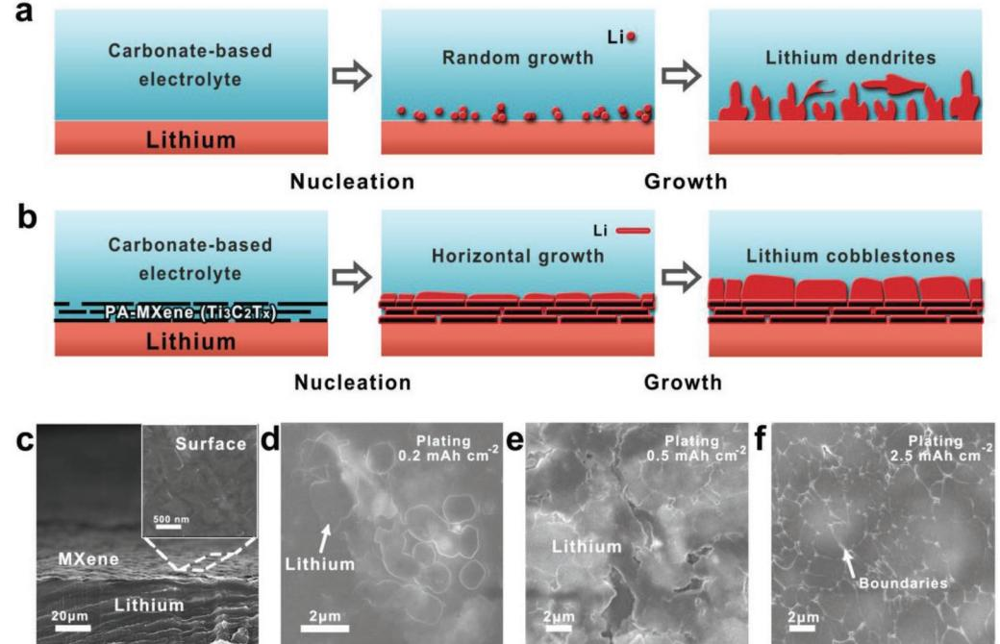
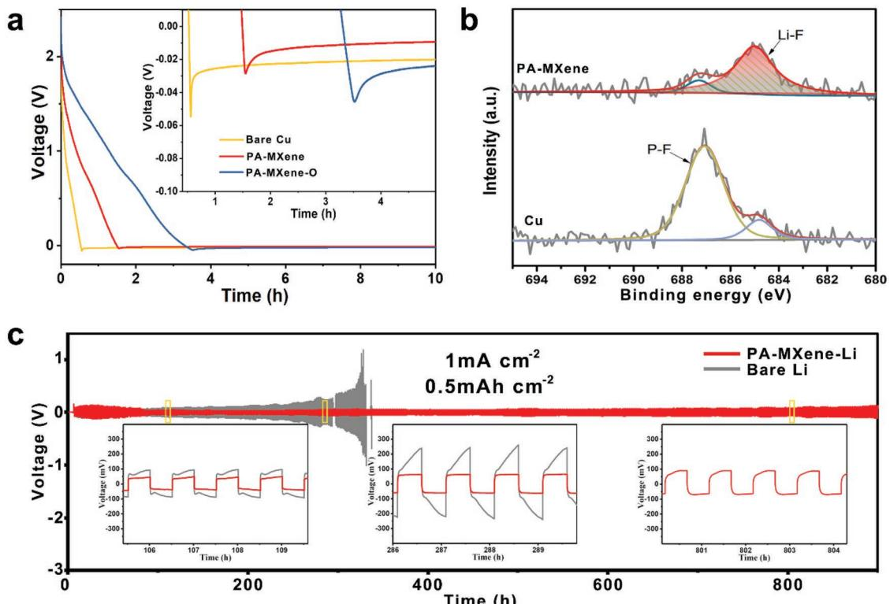
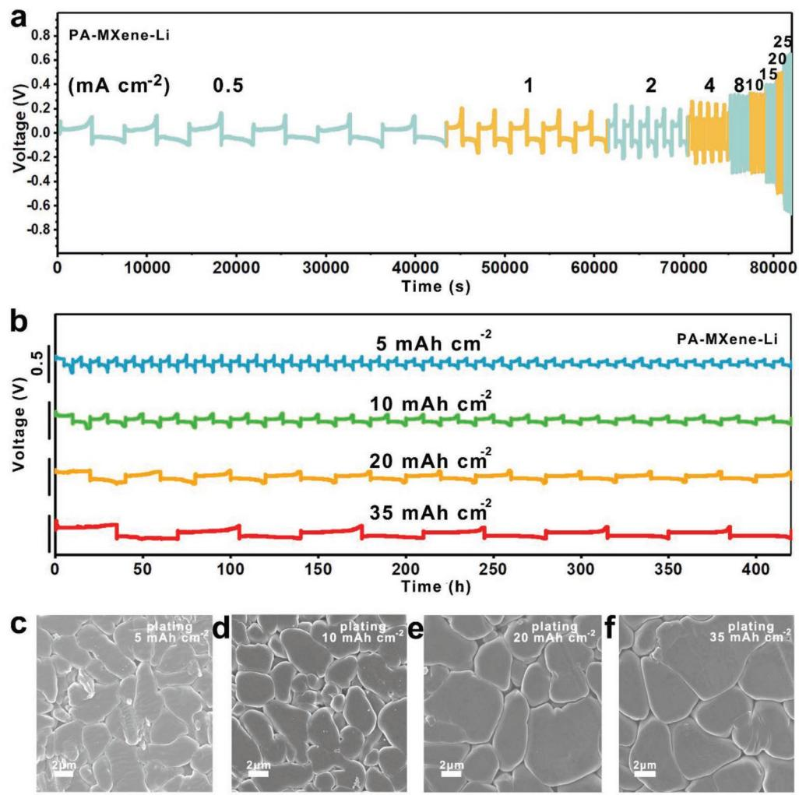
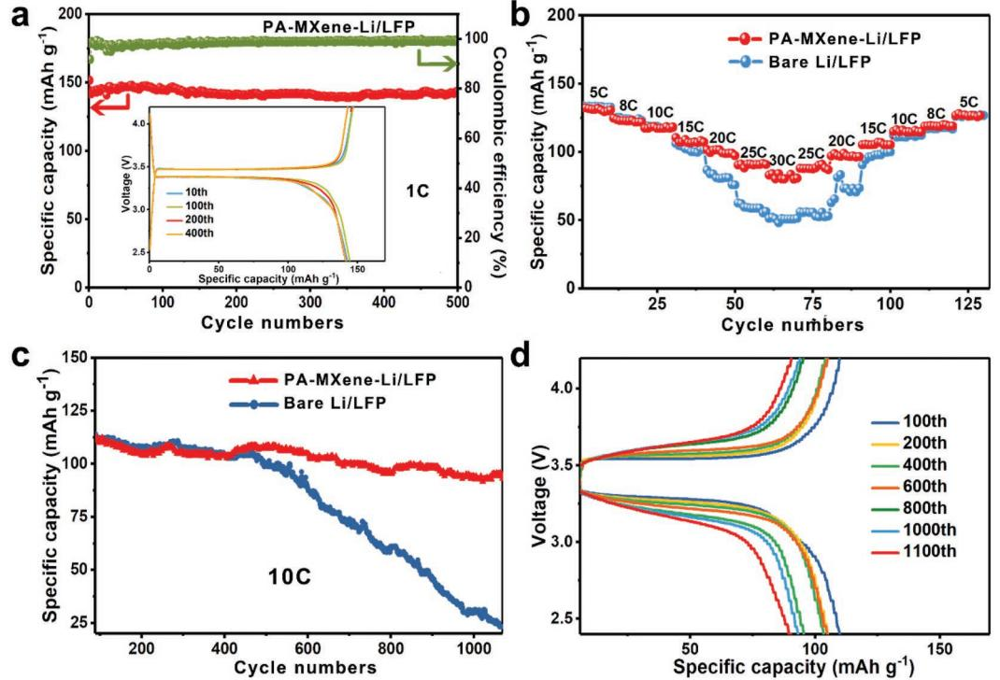
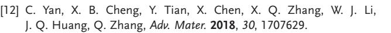

**Metallic Lithium Anodes**

# **Horizontal Growth of Lithium on Parallelly Aligned MXene Layers towards Dendrite-Free Metallic Lithium Anodes**

*Di Zhang, Shuai Wang, Bin Li, Yongji Gong, and Shubin Yang\**

**Although metallic lithium is an extremely promising anode for lithium-based batteries due to its high theoretical capacity, the uncontrollable growth of lithium dendrites, in particular under deep stripping and plating, have stagnated its application. It is demonstrated that parallelly aligned MXene (Ti3C2T***x***) layers enable the efficient guiding of lithium nucleation and growth on the surface of 2D MXene nanosheets, giving rise to horizontal-growth lithium anodes. Moreover, the inherent fluorine terminations in MXene afford a uniform and durable solid electrolyte interface with lithium fluoride at the anode/electrolyte interface, efficiently regulating electromigration of lithium ions. Thus, a dendrite-free lithium anode with a long cycle life up to 900 h and excellent deep stripping–plating capabilities up to 35 mAh cm−2 is achieved, which can further serve as an anode for a lithium metal battery, exhibiting high cycle stability up to 1000 cycles.**

Lithium metal is highly anticipated for Li-based batteries owing to its low potential (−3.04 V) and high theoretical capacity (3860 mAh g−1).[1] However, due to the extremely high chemical activity, lithium is prone to react with liquid electrolyte, commonly forming nonuniform, thick, and fragile solid electrolyte interface (SEI), accompanied with the abuse of both lithium and electrolyte, resulting in low Coulombic efficiencies and poor cycle stabilities.[2] The nonuniformity of SEI layers can further induce uneven Li-ion flux, aggravating the uncontrollable growth of dendrites.[3,4] This finally causes the failure of lithium anodes associated with severe safety issue.

To inhibit the lithium dendrites, three efficient strategies have been recently explored: 1) Forming stable SEI films via in situ and ex situ approaches, protecting lithium from the corrosion of electrolytes, and regulating Li+ flux at the anode/ electrolyte interfaces.[5] In situ approaches refer to modifying the components or structures of the SEI layers as lithium was contacted to electrolytes, such as with different solvents, highly concentrated Li salts (7 m lithium bis(fluorosulfonyl)imide), and/or adding functional additives (polysulfides, lithium nitrate, and fluoroethylene carbonate).[6–10] Ex situ approaches refer to precoating lithium surface with protective layers before

Dr. D. Zhang, Dr. S. Wang, Dr. B. Li, Prof. Y. J. Gong, Prof. S. B. Yang School of Materials Science & Engineering Beihang University Beijing 100191, China E-mail: yangshubin@buaa.edu.cn

The ORCID identification number(s) for the author(s) of this article can be found under https://doi.org/10.1002/adma.201901820.

**DOI: 10.1002/adma.201901820**

the contact between lithium and electrolytes, such as coating lithium with Al2O3, MoS2, graphene, and polymers.[11–13] Among these strategies, lithium fluoride (LiF), a chemically stable and electrolyte insoluble lithium salt, has proved to be effective and widely utilized to construct relatively uniform and stable SEI layers.[14,15] 2) Controlling lithium nucleation and growth to guide lithium plating, inhibiting the growth of lithium dendrites. In this regard, some efficient nucleation sites including metals (Au, Ag, and Zn) with Li solubility, carbons with enhanced electronegativity (N/P doped graphene and edge-rich graphene), and relatively high electroconductive sites have been explored.[16–19] With the existence of nucleation sites, lithium is prone to be depos-

ited in/on the well-designed structures, alleviating the lithium dendrites.[20,21] 3) Utilizing conductive, chemically stable 3D hosts with large surface areas to dramatically reduce local current density of the electrode and regulate the electric field.[22–24] To date, various 3D hosts including metal foams (Cu, Ni) and carbon nanostructures (carbon nanotube foams, graphene films, etc.) have been employed, enabling to further buffer the infinite volume change of lithium.[25–27] However, the precise nucleation and orientated growth of lithium especially under deep stripping and plating remain a big challenge.

Here, we demonstrate that parallelly aligned MXene (Ti3C2T*x*) layers not only enable to efficiently guide the uniform nucleation of lithium on the surface of large-aspect-ratio MXene nanosheets, but also facilitate the horizontal growth of lithium on the MXene layers. Furthermore, owing to the large presence of inherent fluorine terminations in MXene, a uniform, dense, and durable solid electrolyte interface with lithium fluoride was formed at the anode/electrolyte interface, efficiently uniformizing electromigration of lithium ions. Thus, the parallelly aligned MXene-lithium (denoted as PA-MXene-Li) hybrid anode delivers a long life up to 900 h and good deep stripping–plating capacities up to 35 mAh cm−2 .

Parallelly aligned MXene layers were produced via a simple self-assembly procedure at a water/air interface (Figure S1, Supporting Information). Initially, MXene-Ti3C2T*x* nanosheets with abundant fluorine terminations (10.7 at%, Figure S2 and Table S1, Supporting Information) were fabricated by etching Al layers from MAX-Ti3AlC2 in a LiF/HCl solution.[28–33] And then as-prepared MXene nanosheets were dispersed in ethanol solution, forming a homogeneous dispersion (2 mg mL−1 ). Once the dispersion was dripped into

deionized water, Ti3C2T*x* nanosheets spontaneously tend to align parallelly along the liquid/air interface due to the wellknown Langmuir–Blodgett (LB) and Marangoni effect.[19] The spontaneously formed Ti3C2T*x* thin film was then transferred to a solid–gas interface via slowly lifting copper foil from its bottom (Figure S1a, Supporting Information). After drying at 130 °C for 15 s and repeating the above procedures for several times, copper foil with parallelly aligned MXene was obtained, denoted as PA-MXene-Cu. The thickness of PA-MXene layers was tunable by repeating above procedures for scheduled times (thickness, ≈350 nm per time). Typical optical image (Figures S1b and S3, Supporting Information) revealed that the PA-MXene-Cu had homogeneous and flat surface with dark purple color. Owing to the physical approach, the level of fluorine terminations in MXene was well maintained at 10.4 at% (Figure S2 and Table S2, Supporting Information). Moreover, it was verified that Ti3C2T*x* nanosheets (1–5 µm in lateral sizes) were distributed uniformly and arranged parallelly along the copper surface (Figures S1c,d and S3, Supporting Information). The parallel MXene film was then transferred to lithium foil via a simple rolling process (**Figure 1**; Figure S4, Supporting Information), affording PA-MXene-lithium. Due to the presence of continuous and tightly adhered MXene layers, active lithium could be protected from the oxidation, even stable in air for 2 days (Figure S5, Supporting Information).[34–36]

To investigate the stripping and plating behaviors of the as-prepared PA-MXene-Li anode, scanning electron microscopy (SEM) measurement was performed. Upon initial stripping, lithium was gradually extracted through the PA-MXene layers (Figure S6, Supporting Information), which behave like an artificial SEI film. Upon the initial plating, lithium was prone to be first nucleated at the edges of individual Ti3C2T*x* nanosheets (Figure 1d; Figures S7 and S8, Supporting Information). Such nucleation function of MXenes on lithium is consistent with our in situ transmission electron microscopy (TEM) observation (Figure S9, Supporting Information) owing to the TiOLi bond.[37] With slightly increasing the plating levels to 0.5 mAh cm−2 (Figure 1e), lithium tends to horizontally grow along the nanosheets, even infusing the adjacent nucleation sites, forming bigger horizontal areas in the electrode. Finally, a smooth, dense lithium anode with visible grain boundaries (white arrow in Figure 1f) was achieved while the plated lithium increases to 2.5 mAh cm−2 . Even after stripping and plating for 100 cycles, such smooth surface of PA-MXene-Li is well maintained (Figure S10, Supporting Information). In contrast, bare lithium is always grown with substantial robust lithium dendrites under the same conditions (Figure S11, Supporting Information).

To gain insight into the nucleation behaviors of lithium on PA-MXene layers, we first measured its nucleation overpotential (µn) at 50 µA cm−2. In **Figure 2**a, the µn value of PA-MXene is only 20 mV (see the Experiment Section in the Supporting Information), close to those reported for carbons with active nucleation sites such as nitrogen/phosphorus doped graphene (19–22 mV), much lower than that of bare copper (35 mV, Table S3, Supporting Information).[16,19] This suggests a dramatically decreased deposition barrier of lithium on PA-MXene layers. According to the early reports, mass-transfer-controlled overpotential (µmt), defined as the latter voltage platform in Figure 2a, indicates a steady process

**Figure 1.** Schematic illustration of lithium plating on a) bare lithium and b) parallelly aligned MXene (PA-MXene) layers. c) Typical SEM images of PA-MXene layers on lithium. Inset in (c) is the top view of PA-MXene. SEM images of PA-MXene-lithium with different level lithium plating: d) 0.2 mAh cm−2, e) 0.5 mAh cm−2 , and f) 2.5 mAh cm−2 , showing gradual growth of lithium in horizontal orientation. Horizontal lithium infused together, forming a dense and smooth surface with abundant grain boundaries.

**Figure 2.** a) Voltage profiles of Li plating on PA-MXene-Cu, PA-MXene-O, and Cu foil. The nucleation voltage of PA-MXene layer is 20 mV, lower than that of Cu (35 mV) and PA-MXene-O (26 mV). b) High-resolution F1s XPS spectra of PA-MXene-Cu and bare Cu after initial lithium plating and stripping, showing a F–Li peak at 684.8 eV. c) Galvanostatic cycling of symmetric cell with PA-MXene-Li anodes at 1.0 and 0.5 mAh cm−2 , exhibiting a long life up to 900 h.

of lithium migration and plating after nucleation.[16] The µmt value of PA-MXene is only 8 mV, much lower than that of bare copper (20 mV). This should be originated to the uniformly distributed LiF in the SEI layers (Figure 2b; Figures S13 and S14, Supporting Information), derived from fluorine terminations of MXene layers, since lithium halide salts can effectively enhance the surface mobility of lithium.[38] The fluorine (LiF) content in SEI layer on PA-MXene is 1.1 at% (Figure 2b), two times higher than that from electrolyte as the only source of fluorine (0.33 at%). X-ray photoelectron spectroscopy (XPS) analysis with sputtering etching reveals that the SEI thickness on PA-MXene-Li is less than 10 nm (Figure S14, Supporting Information), similar to the previous report on the SEI thickness formed in an optimal electrolyte via cyro-TEM analysis.[39] In comparison, the SEI thickness on bare Li is ≈50 nm (Figures S15 and S16, Supporting Information), much thicker than that on our PA-MXene-Li anode. This can be further demonstrated by the fluoride-free MXene with a high µmt value of 20 mV (Figures S17–S20, Supporting Information), which was produced by immersing PA-MXene layers into argon-saturated 1 m NaOH aqueous solution for 3 h, denoted as PA-MXene-O. Based on the above results, PA-MXene layers not only enable to efficiently guide the lithium nucleation and subsequent orientated growth, but also afford a dense and uniform SEI layer owing to the presence of LiF. Due to the only usage of the surface of the MXene films as nucleation sites, there is little overpotential change for all the MXene films with different thicknesses ranging from 700 to 1700 nm (Figure S21, Supporting Information). Hence, the thickness of the PA-MXene film used in the text is ≈1 µm.

The electrochemical properties of PA-MXene-Li anode were measured via symmetric cells with a common carbonatebased electrolyte. As expected, a long life up to 900 cycles with stable and smooth voltage profiles is achieved at 1.0 mA cm−2 in the case of PA-MXene-Li (Figure 2c; Figures S22 and S23, Supporting Information), while bare lithium rapidly fails at the same testing conditions. This should be attributed to the unique MXene layers that induce the nucleation and horizontal growth of lithium on MXene, efficiently preventing the peeling off of lithium from current collector during repeated stripping and plating processes, which inevitably existed in the case of bare Li on Cu foil (Figure S24, Supporting Information). The effect of the parallel alignment on the cycle performance also can be demonstrated by the good cycle stabilities of MXene film fabricated by spray coating (SC-MXene, Figures S25 and S26, Supporting Information), which has similar parallel alignment with our PA-MXene film. If MXene film was directly fabricated by vacuum filtration (VF-MXene), a short life of less than 120 h is observed under the same testing conditions, owing to its numerous lifting edges (Figures S25 and S26, Supporting Information). Moreover, when enhancing the current densities from 1.0 to 25 mA cm−2, PA-MXene-Li still presents stable voltage profiles with low overpotentials (**Figure 3**a; Figure S27, Supporting Information), better than those reported for the

**Figure 3.** a) Stripping–plating profiles of PA-MXene-Li at current densities from 1 to 25 mA cm−2 . b) Voltage profiles of PA-MXene-Li under deep stripping and plating behavior from 5 to 35 mAh cm−2 at 1 mA cm−2 . SEM images of PA-MXene-Li after plating lithium with capacities of c) 5 mAh cm−2, d) 35 mAh cm−2 , e) 5 mAh cm−2 , and f) 35 mAh cm−2 , clearly showing the formation of cobblestone-like lithium rather than lithium dendrites.

lithium composites, whose tolerant current densities are commonly less than 10 mA cm−2 . [40] More importantly, in our PA-MXene-Li anode, the lithium content is very high, up to 97 wt%, corresponding to a very high gravimetric capacity of 3744 mAh g−1 (Figure S28, Supporting Information), which is nearly six times of Li–Cu foam (643 mAh g−1 , Supporting Information). The volumetric capacity of PA-MXene-Li is still as high as 1932 mAh cm−3, nearly two times of Li–3D metallic hosts (≈1000 mAh cm−3 , Supporting Information) and even three times of Li–carbon fiber networks (<600 mAh cm−3 ).[23,41,42]

To gain insight into the deep stripping–plating properties of PA-MXene-Li, various deep cycling measurements were carried out at 1.0 mA cm−2 . At a common deep level of 5 mAh cm−2 , our PA-MXene-Li delivers a good stability of more than 400 h (Figure 3b), much longer than those reported for Li–porous carbon composites (<350 h).[43,44] At the same conditions, bare Li has a short life of only 70 h (Figure S29, Supporting Information). Furthermore, with dramatically increasing the deep level up to 20 and 35 mAh cm−2 , the hybrid lithium can still work well for more than 400 h (Figure 3b). The typical SEM images (Figure 3c–f.) reveal that once the plating level is more than 5 mAh cm−2 , lithium is grown on the surface of individual Li-MXene grain, giving rise to cobblestone-like lithium. This should be originated from the nucleation function of separated MXene nanosheets, well consistent to the low plating level with numerous grain boundaries (Figure 1e,f). Even at the highest plating level of 35 mAh cm−2 , we still detect the lithium cobblestones with big sizes rather than the common lithium dendrites. Clearly, this is an efficient strategy to solve the issue of lithium dendrites under deep stripping and plating processes via the controllable nucleation of 2D nanosheets, endowing the PA-MXene-Li a great potential for lithium metal batteries.

Based on the excellent plating–striping behaviors of PA-MXene-Li anode, a full cell with LiFePO4 (LTP) cathode was constructed. The full cell has a good stability up to 500 cycles with a capacity of 140 mAh g−1 (based on cathode) at 1 C (1 C = 172 mAh g−1 ) (**Figure 4**a). Even at 30 C, a high capacity of 83.5 mAh g−1 is still presented (Figure 4b), much higher than that of bare Li/LiFePO4 cell (51 mAh g−1 ). Furthermore, an excellent cycle stability over 1100 cycles with a high capacity

**Figure 4.** a) Cycling performance and Coulombic efficiency of PA-MXene-Li/LFP full cell. Inset in (a) is the charging and discharging profiles of the cell from 10 to 400 cycles. b) Rate capability of PA-MXene-Li/LFP and Li/LFP cells at different rates from 5 to 30 C. c) Cycling stabilities of PA-MXene-Li/ LFP and Li/LFP cells at 10 C. d) Selected voltage profiles of PA-MXene-Li/LFP cell in (c) from 100 to 1100 cycles.

retention of 83% is performed in the usage of PA-MXene-Li anode, superior to bare Li/LFP cell (capacity retention, 21%) (Figure 4c,d; Figures S30 and S31, Supporting Information).

In conclusion, we demonstrated that parallelly aligned MXene layers enabled to efficiently guide the lithium nucleation and horizontally orientated growth on the surface of MXene layers, affording a dendrite-free lithium anode with a long cycle life up to 900 h and excellent deep stripping–plating capabilities up to 35 mAh cm−2 . We believe that our simple strategy by using 2D nanosheets as nucleation sites can efficiently control the growth orientation of active metals such as lithium and sodium, achieving a series of dendrite-free metal anodes for metal-based batteries.

### **Supporting Information**

Supporting Information is available from the Wiley Online Library or from the author.

# **Acknowledgements**

This work was financially supported by the National Key R&D Program of China (No. 2018YFB0104200).

### **Conflict of Interest**

The authors declare no conflict of interest.

# **Keywords**

lithium anodes, lithium dendrites, MXene

Received: March 22, 2019 Revised: May 23, 2019 Published online: June 24, 2019

- [1] D. Lin, Y. Liu, Y. Cui, *Nat. Nanotechnol.* **2017**, *12*, 194.
- [2] X. B. Cheng, R. Zhang, C. Z. Zhao, Q. Zhang, *Chem. Rev.* **2017**, *117*, 10403.
- [3] B. Li, Y. Wang, S. B. Yang, *Adv. Energy Mater.* **2018**, *8*, 1702296.
- [4] M. D. Tikekar, S. Choudhury, Z. Y. Tu, L. A. Archer, *Nat. Energy* **2016**, *1*, 1.
- [5] X. Q. Zhang, X. B. Cheng, Q. Zhang, *Adv. Mater. Interfaces* **2018**, *5*, 1701097.
- [6] J. M. Zheng, M. H. Engelhard, D. H. Mei, S. H. Jiao, B. J. Polzin, J. G. Zhang, W. Xu, *Nat. Energy* **2017**, *2*, 17012.
- [7] X. Q. Zhang, X. B. Cheng, X. Chen, C. Yan, Q. Zhang, *Adv. Funct. Mater.* **2017**, *27*, 1605989.
- [8] Q. Lu, Y. B. He, Q. Yu, B. Li, Y. V. Kaneti, Y. Yao, F. Kang, Q. H. Yang, *Adv. Mater.* **2017**, *29*, 1604460.
- [9] H. F. Li, C. P. Han, Y. Huang, Y. Huang, M. S. Zhu, Z. X. Pei, Q. Xue, Z. F. Wang, Z. X. Liu, Z. J. Tang, Y. K. Wang, F. Y. Kang, B. H. Li, C. Y. Zhi, *Energy Environ. Sci.* **2018**, *11*, 941.
- [10] L. T. Ma, S. M. Chen, D. H. Wang, Q. Yang, F. N. Mo, G. J. Liang, N. Li, H. Y. Zhang, J. A. Zapien, C. Y. Zhi, *Adv. Energy Mater.* **2019**, *9*, 1803046.
- [11] Y. Liu, D. Lin, P. Y. Yuen, K. Liu, J. Xie, R. H. Dauskardt, Y. Cui, *Adv. Mater.* **2017**, *29*, 1605531.

- [13] E. Cha, M. D. Patel, J. Park, J. Hwang, V. Prasad, K. Cho, W. Choi, *Nat. Nanotechnol.* **2018**, *13*, 337.
- [14] X. Shen, Y. Li, T. Qian, J. Liu, J. Zhou, C. Yan, J. B. Goodenough, *Nat. Commun.* **2019**, *10*, 900.
- [15] M. Q. Wang, Z. Peng, W. W. Luo, F. H. Ren, Z. D. Li, Q. Zhang, H. Y. He, C. Y. Ouyang, D. Y. Wang, *Adv. Energy Mater.* **2019**, *9*, 1802912.
- [16] R. Zhang, X. R. Chen, X. Chen, X. B. Cheng, X. Q. Zhang, C. Yan, Q. Zhang, *Angew. Chem., Int. Ed.* **2017**, *56*, 7764.
- [17] Q. Song, H. B. Yan, K. D. Liu, K. Y. Xie, W. Li, W. H. Gai, G. H. Chen, H. J. Li, C. Shen, Q. G. Fu, S. Y. Zhang, L. L. Zhang, B. Q. Wei, *Adv. Energy Mater.* **2018**, *8*, 1800564.
- [18] A. Pei, G. Zheng, F. Shi, Y. Li, Y. Cui, *Nano Lett.* **2017**, *17*, 1132.
- [19] M. S. Kim, J. H. Ryu, Deepika, Y. R. Lim, I. W. Nah, K. R. Lee, L. A. Archer, W. Il Cho, *Nat. Energy* **2018**, *3*, 889.
- [20] K. Yan, Z. D. Lu, H. W. Lee, F. Xiong, P. C. Hsu, Y. Z. Li, J. Zhao, S. Chu, Y. Cui, *Nat. Energy* **2016**, *1*, 16010.
- [21] T. T. Zuo, Y. X. Yin, S. H. Wang, P. F. Wang, X. Yang, J. Liu, C. P. Yang, Y. G. Guo, *Nano Lett.* **2018**, *18*, 297.
- [22] L. Liu, Y. X. Yin, J. Y. Li, S. H. Wang, Y. G. Guo, L. J. Wan, *Adv. Mater.* **2018**, *30*, 1706216.
- [23] H. Ye, S. Xin, Y. X. Yin, Y. G. Guo, *Adv. Energy Mater.* **2017**, *7*, 1700530.
- [24] S. Jin, Y. Jiang, H. Ji, Y. Yu, *Adv. Mater.* **2018**, *30*, 1802014.
- [25] Y. Zhang, C. W. Wang, G. Pastel, Y. D. Kuang, H. Xie, Y. J. Li, B. Y. Liu, W. Luo, C. J. Chen, L. B. Hu, *Adv. Energy Mater.* **2018**, *8*, 1800635.
- [26] S. H. Wang, Y. X. Yin, T. T. Zuo, W. Dong, J. Y. Li, J. L. Shi, C. H. Zhang, N. W. Li, C. J. Li, Y. G. Guo, *Adv. Mater.* **2017**, *29*, 1703729.
- [27] D. Lin, Y. Liu, Z. Liang, H. W. Lee, J. Sun, H. Wang, K. Yan, J. Xie, Y. Cui, *Nat. Nanotechnol.* **2016**, *11*, 626.
- [28] B. Anasori, M. R. Lukatskaya, Y. Gogotsi, *Nat. Rev. Mater.* **2017**, *2*, 16098.
- [29] M. Ghidiu, M. R. Lukatskaya, M. Q. Zhao, Y. Gogotsi, M. W. Barsoum, *Nature* **2014**, *516*, 78.
- [30] M. Naguib, M. Kurtoglu, V. Presser, J. Lu, J. Niu, M. Heon, L. Hultman, Y. Gogotsi, M. W. Barsoum, *Adv. Mater.* **2011**, *23*, 4248.
- [31] M. Alhabeb, K. Maleski, B. Anasori, P. Lelyukh, L. Clark, S. Sin, Y. Gogotsi, *Chem. Mater.* **2017**, *29*, 7633.
- [32] M. Alhabeb, K. Maleski, T. S. Mathis, A. Sarycheva, C. B. Hatter, S. Uzun, A. Levitt, Y. Gogotsi, *Angew. Chem., Int. Ed.* **2018**, *57*, 5444.
- [33] X. Xiao, H. Wang, P. Urbankowski, Y. Gogotsi, *Chem. Soc. Rev.* **2018**, *47*, 8744.
- [34] Q. Xue, H. Zhang, M. Zhu, Z. Pei, H. Li, Z. Wang, Y. Huang, Y. Huang, Q. Deng, J. Zhou, S. Du, Q. Huang, C. Y. Zhi, *Adv. Mater.* **2017**, *29*, 1604847.
- [35] Q. Yang, T. P. Jiao, M. Li, Y. B. Li, L. T. Ma, F. N. Mo, G. J. Liang, D. H. Wang, Z. F. Wang, Z. H. Ruan, W. J. Zhang, Q. Huang, C. Y. Zhi, *J. Mater. Chem. A* **2018**, *6*, 18525.
- [36] Q. Yang, Y. K. Wang, X. L. Li, H. F. Li, Z. F. Wang, Z. J. Tang, L. T. Ma, F. N. Mo, C. Y. Zhi, *Energy Environ. Mater.* **2018**, *1*, 183.
- [37] B. Li, D. Zhang, Y. Liu, Y. X. Yu, S. M. Li, S. B. Yang, *Nano Energy* **2017**, *39*, 654.
- [38] Y. Lu, Z. Tu, L. A. Archer, *Nat. Mater.* **2014**, *13*, 961.
- [39] Y. Liu, D. Lin, Y. Li, G. Chen, A. Pei, O. Nix, Y. Li, Y. Cui, *Nat. Commun.* **2018**, *9*, 3656.
- [40] S. Liu, L. Deng, W. Guo, C. Zhang, X. Liu, J. Luo, *Adv. Mater.* **2019**, *31*, 1807585.
- [41] R. Zhang, X. Chen, X. Shen, X.-Q. Zhang, X.-R. Chen, X.-B. Cheng, C. Yan, C.-Z. Zhao, Q. Zhang, *Joule* **2018**, *2*, 764.
- [42] S. F. Liu, X. H. Xia, Z. J. Yao, J. B. Wu, L. Y. Zhang, S. J. Deng, C. G. Zhou, S. H. Shen, X. L. Wang, J. P. Tu, *Small Methods* **2018**, *2*, 1800035.
- [43] Y. Liu, D. Lin, Z. Liang, J. Zhao, K. Yan, Y. Cui, *Nat. Commun.* **2016**, *7*, 10992.
- [44] L. Y. Wang, X. Y. Zhu, Y. P. Guan, J. L. Zhang, F. Ai, W. F. Zhang, Y. Xiang, S. Vijayan, G. D. Li, Y. Q. Huang, G. P. Cao, Y. S. Yang, H. Zhang, *Energy Storage Mater.* **2018**, *11*, 191.

