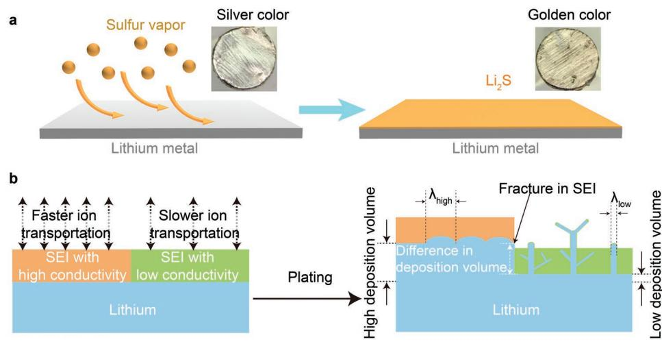
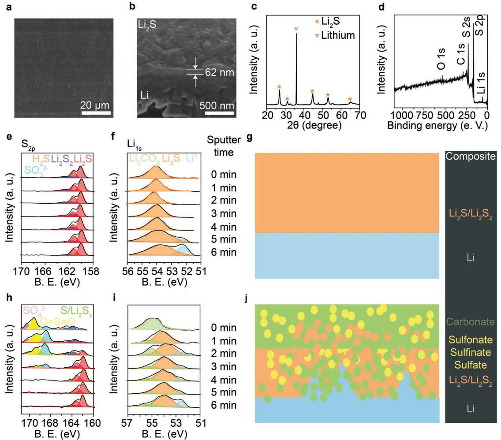
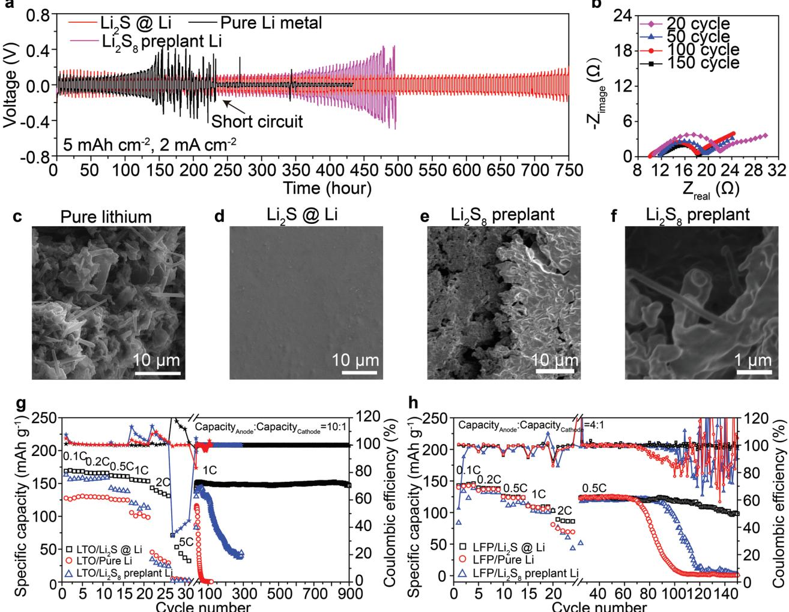
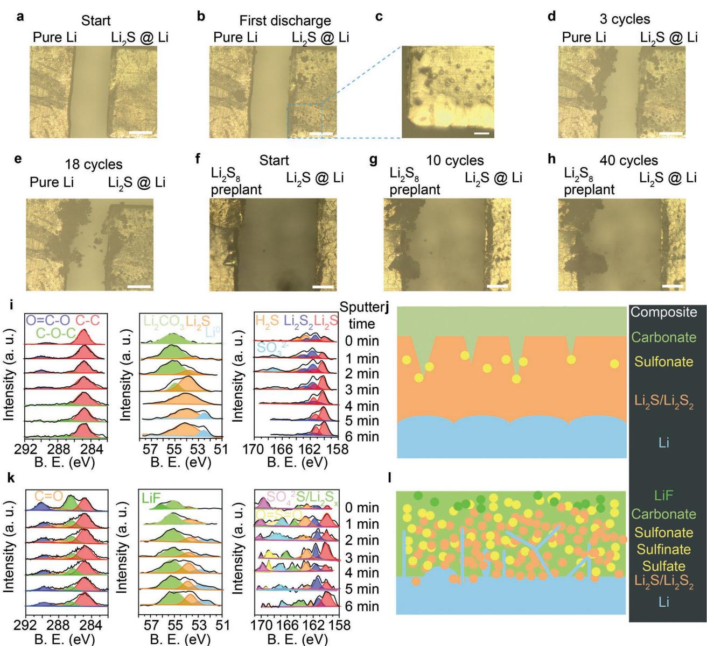
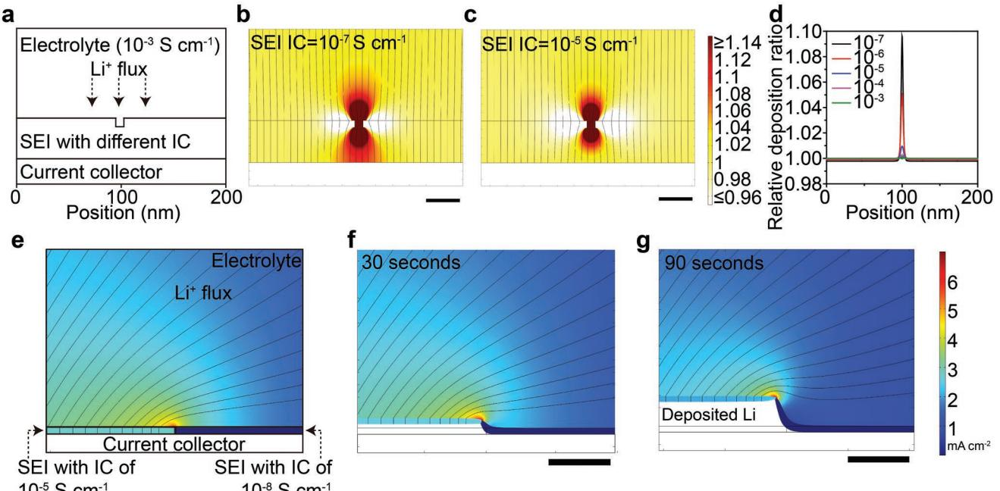

**Lithium Metal Anodes**

# **Uniform High Ionic Conducting Lithium Sulfide Protection Layer for Stable Lithium Metal Anode**

*Hao Chen, Allen Pei, Dingchang Lin, Jin Xie, Ankun Yang, Jinwei Xu, Kaixiang Lin, Jiangyan Wang, Hansen Wang, Feifei Shi, David Boyle, and Yi Cui\**

**Artificial solid-electrolyte interphase (SEI) is one of the key approaches in addressing the low reversibility and dendritic growth problems of lithium metal anode, yet its current effect is still insufficient due to insufficient stability. Here, a new principle of "simultaneous high ionic conductivity and homogeneity" is proposed for stabilizing SEI and lithium metal anodes. Fabricated by a facile, environmentally friendly, and low-cost lithium solidsulfur vapor reaction at elevated temperature, a designed lithium sulfide protective layer successfully maintains its protection function during cycling, which is confirmed by both simulations and experiments. Stable dendritefree cycling of lithium metal anode is realized even at a high areal capacity of 5 mAh cm−2 , and prototype Li–Li4Ti5O12 cell with limited lithium also achieves 900 stable cycles. These findings give new insight into the ideal SEI composition and structure and provide new design strategies for stable lithium metal batteries.**

Rapid developments of portable electronic devices and electric vehicles demand developing high-capacity electrode materials for higher energy density rechargeable lithium-based batteries.[1] Owing to its highest theoretical capacity (3860 mAh g−1 ) among all anode materials, lithium metal anode is the ultimate choice for next-generation high energy density Li-ion batteries.[2] However, the lithium metal anode faces the severe inherent problems of uneven dendrite growth and electrode/electrolyte loss during battery operation,[3] which significantly compromise the cycle stability, safety, and practical implementation of lithium metal batteries (LMB).[4]

To solve these problems, continuous efforts have been devoted to optimize lithium metal anodes, such as lithiophilic hosts for accommodating lithium to reduce volume change,[5] strong solid electrolytes or separators for suppressing

#### **DOI: 10.1002/aenm.201900858**

dendrites,[6] guided lithium plating,[7] and nanostructured electrode design.[8] Among all the methods, the focus on solidelectrolyte interphase (SEI) between anode materials and electrolyte is one of the most critical issues. During LMB operation, the SEI that primarily originated from electrolyte decomposition, is easily cracked. This will locally enhance ion flux and promote nonuniform lithium depositing/stripping,[9] resulting in Li dendrites that can trigger internal short circuit and compromise battery safety. Repeated breakdown and repair of SEI during cycling create a vicious cycle which alternates between "uneven stripping/plating and SEI fracture," brings about continuous loss of active materials and limited battery cycle life. Therefore, an ideal SEI should continuously passivate the anode and prevent

the parasitic reactions between reactive anode and electrolyte to address the aforementioned problems in principle.[3] Previous studies have demonstrated several effective artificial SEI to protect lithium metal anode such as polymer,[10] inorganic conductive compounds,[11,12] electrolyte additives,[13,14] and carbonbased materials.[7,15] However, the evolution of SEI during cycling and key mechanisms such as impact of SEI quality on its stability need to be further explored.[16]

Herein, we demonstrate a "simultaneous homogeneous and high ionic conductivity" strategy by developing a method of forming a uniform lithium sulfide (Li2S) protective layer for suppressing dendrite growth and stabilizing the lithium metal anode. Although Li2S interfacial layers through soluble electrolyte additives have been studied before,[14,17–20] the work here demonstrates that the elevated temperature (170 °C) and gas phase reaction are critical for the synthesis of a homogenous Li2S coating, which importantly can be used as SEI in carbonate electrolyte system. We reveal the evolution of thus formed Li2S artificial SEI component distribution during battery operation: the uniform and high ionic conductivity protective layer turns into a layered SEI that preserves protective function, rather than into a disordered, broken SEI mainly made up of parasitic reaction products. Simulation results also confirm the critical importance of compositional homogeneity and high ionic conductivity in stabilizing SEI. With this strategy, stable cycles in both high capacity symmetric cells and Li–LiFePO4 full cells were realized. We believe that this practical fabrication method, fundamental design strategy, and understanding on

Dr. H. Chen, Dr. A. Pei, Dr. D. Lin, Dr. J. Xie, Dr. A. Yang, J. Xu, Dr. K. Lin, Dr. J. Wang, H. Wang, Dr. F. Shi, D. Boyle, Prof. Y. Cui Department of Materials Science and Engineering Stanford University Stanford, CA 94305, USA E-mail: yicui@stanford.edu Prof. Y. Cui Stanford Institute for Materials and Energy Sciences SLAC National Accelerator Laboratory 2575 Sand Hill Road, Menlo Park, CA 94025, USA The ORCID identification number(s) for the author(s) of this article can be found under https://doi.org/10.1002/aenm.201900858.

**Figure 1.** Design strategy for Li2S@Li electrode. a) Illustration of fabrication of Li2S@Li electrode; silver-colored lithium metal was placed in sulfur atmosphere, where the surficial lithium gradually reacted to form a golden-colored thin lithium sulfide film via gas–solid reaction. b) Illustration of the difference in deposition structure of lithium metal anode with different SEI. The lithium metal coated with high ionic conductivity SEI achieves spherical lithium structure with more deposition volume and higher λ (dendrite nuclei size), meanwhile lithium metal coated with low ionic conductivity SEI achieves needle-like lithium fibrils with less deposition volume and lower λ which easily break the fragile SEI. The SEI can be broken at the interphase between different ionic conductivity components due to the large difference in lithium deposition volume.

SEI evolution can be not only used to guide the optimization of lithium metal anode, but also extended to other artificial SEI designs for various electrode materials.

A homogeneous lithium sulfide protective layer was fabricated by a direct and facile solid–gas reaction. As described in **Figure 1**a, sulfur powder was heated to 240 °C at the bottom of a sealed stainless-steel container to generate a sulfur vapor atmosphere within (Figure S1a, Supporting Information). Fresh silver-colored lithium metal was placed in the middle at 170 °C to react with sulfur vapor at the solid–gas interphase, forming a golden-colored, homogeneous, and single-component lithium sulfide surface protection layer (referred to as Li2S@Li electrode). The elevated temperature during synthesis facilitates the formation of homogenous and mechanically robust layer. Compared with other methods for artificial SEI, this solid-vapor reaction method toward Li2S protective layer has several distinguishing advantages: I) sulfur is a cheap, abundant raw material with facile and environment-friendly fabrication processes, favoring practical large-scale manufacturing (Figure S1b, Supporting Information); II) evenly filling sulfur vapor enables high homogeneity of the product and avoids chemical heterogeneity from side reactions, which is observed in the common electrolyte additive method. We also use Li2S8 additives to fabricate a lithium sulfide protective layer on lithium metal as Li2S8 preplanted Li control electrode (Figure S1c, Supporting Information);[14,19] III) the high ionic conductivity of Li2S (≈10−5 S cm−1) [21] should improve electrode kinetic over those of common low ionic conductivity salts, such as lithium carbonate (≈10−8 S cm−1, including both Li2CO3 and RCO2Li that derives from Li-electrolyte side reactions)[22,23] and LiF (3 × 10−9 S cm−1);[12] IV) good compatibility with multiple vapor-phase types of reactants for various protective layer. These merits of high homogeneity and high ionic conductivity should contribute to better stability of the anode than low ionic conductivity or multicomponent SEI alone (Figure 1b). When lithium metal was coated with low ionic conductivity SEI (such as lithium carbonate), growths of needle-like lithium particles with low nuclei size (λlow) are commonly observed[3] to grow in height into dendrites and easily pierce the original SEI, leading to the aforementioned vicious cycle and eventual battery failure.[2] In comparison, lithium metal coated with high ionic conductivity SEI favors uniform lithium deposition structures with higher nuclei size (λhigh), which are less likely to pierce the SEI.[4] Moreover, when the SEI is composed of multiple components with different ionic conductivities, the spatially varying ionic conductivity will cause large differences in lithium plating/ stripping volume at different sites and subsequential SEI breakage.[3] Accordingly, the high uniformity and high ionic conductivity of our artificial Li2S layer are supposed to significantly improve anode stability and performance.

The morphology of a Li2S@Li electrode is shown in a topview scanning electron microscopy (SEM) image (**Figure 2**a), demonstrating that the surficial layer was very uniform without pinholes or cracks. Magnified SEM images of an intentionally stretched Li2S@Li electrode show that the lithium sulfide layer was dense and continuously covering the underlying lithium with a thickness of around 62 nm (Figure 2b and Figure S2, Supporting Information).[12] X-ray diffraction (XRD) spectra in Figure 2c clearly shows characteristic peaks of lithium metal and lithium sulfide, and X-ray photoelectron spectroscopy (XPS) spectra in Figure 2d demonstrates that the major elemental components of the surficial layer were lithium and sulfur with only trace amounts of carbon and oxygen from XPS chamber. Composition of the surficial coating was further probed by taking the S2p and Li1s XPS spectra after sequentially argon sputtering the surface (Figure 2e). From the initial stage (original surface) to the fifth stage (after 4 min of sputtering), characteristic peaks of Li2S at 160.1 and 161.5 eV in S2p spectra (Figure 2e) and 54 eV in Li1s spectra (Figure 2f) were main

**Figure 2.** Characterization of protected lithium metal anode. a) Top-view SEM image of Li2S@Li electrode. b) Cross-sectional focused ion beam (FIB) SEM image of Li2S@Li metal. c) XRD and d) XPS spectra of Li2S@Li electrode. e) S2p and f) Li1s XPS depth profile of Li2S@Li electrode. B. E., binding energy. a. u., arbitrary units. g) Illustration of the distribution of lithium-conducting components in the SEI of Li2S@Li electrode. h) S2p and i) Li1s XPS depth profile of Li2S8 preplant Li electrode. j) Illustration of the distribution of lithium-conducting components in the SEI of Li2S8 preplant Li electrode.

peaks, suggesting that Li2S was dominant component with only small amount of Li2S2 (at 162 and 163.5 eV). In the Li1s spectra, the signal corresponding to lithium metal (Li0 ) at 52.4 eV emerged after 5 min of sputtering and gradually increases, indicating the interphase with underlying bulk lithium metal. Importantly, no impurities were observed throughout all sputtering stages, especially lithium oxide or carbonate. From these characterizations, the structure of the Li2S@Li electrode can be inferred (Figure 2g): a uniform and single-component lithium sulfide layer was evenly coated on lithium metal without other impurities. In comparison, the depth profile of the Li2S8 preplanted Li electrode through a room-temperature solution approach indicates a totally different structure. In the S2p spectra (Figure 2h), moderate amounts of lithium sulfide with large amounts of sulfonate, sulfinate, and sulfate salts (165–171 eV, derived from Li2S8 oxidation and residual lithium salt) were observed in several stages from the initial surface to after 3 min of sputtering. After 4 min of sputtering, only the characteristic peaks of Li2S and some Li2S2 remained. In the first stage of the Li1s spectra (Figure 2i), the major peak at 55 eV indicates that lithium carbonate made up the largest portion of lithium salts in the surficial layer. This peak remained even after 6 min of sputtering, revealing that lithium carbonate existed at all depths.[24] After 1 min of sputtering, the characteristic peak of Li2S at 54 eV became the dominant peak, while the signal of lithium metal (Li0) at 52.4 eV emerged after 2 min of sputtering, but it did not increase in intensity until 5 min of sputtering. This indicates that a small amount of metallic lithium was unevenly distributed in the middle layer while the lithium metal bulk remained at the innermost layer. These XPS spectra illustrate a disordered, multicomponent SEI of the Li2S8 preplanted lithium metal (Figure 2j): the outmost layer was mostly composed of lithium carbonate with some lithium sulfide, sulfonate, sulfinate, and sulfate salts; the middle layer was mostly composed of Li2S with lithium carbonate and other salts; meanwhile, lithium metal was unevenly distributed in both the middle layer and inner layer due to its heterogeneous reaction with additives and electrolyte.

In addition to its primary advantage of chemical homogeneity, the Li2S coating layer of Li2S@Li electrode has additional advantages of high ionic conductivity and stability. Through 3-electrode linear sweep voltammetry (LSV) and electrochemical impedance spectroscopy (EIS) measurements (Figures S3 and S4 and Note S1, Supporting Information), the ionic conductivity of the Li2S coating layer was measured to be around 10−5 S cm−1 , which is 3–4 orders of magnitude higher than that of common SEI components especially LiF (3 × 10−9 S cm−1 ) [12] and lithium carbonate (10−8 S cm−1 ).[23] Meanwhile Li2S has extremely low solubility in carbonate electrolyte (less than 0.5 ppm) that is even lower than the widely used LiF additive,[11] which greatly favors the SEI stability against electrolyte and prevents the formation of parasitic reaction product-dominant SEI. Therefore, the exchange current density of the Li2S@Li electrode (0.086 mA cm−2) was significantly higher than that of bare lithium electrode which was covered by low ionic conductivity parasitic reaction products (0.054 mA cm−2; Figure S3, Supporting Information), suggesting significantly improved kinetics and stability.

The efficacy of the uniform Li2S coating for improving electrochemical stability was first evaluated by EIS studies of fresh symmetric Li||Li cells after different rest times (Figure S5, Supporting Information). After 24 h, the impedance of bare Li metal increased from 78 to 152 Ω, and the impedance of the Li2S8 preplant Li electrode also increased from 58 to 106 Ω, revealing that the parasitic reactions cannot be fully suppressed by nonuniform Li2S layer.[12] In contrast, the Li2S@Li electrode exhibited a steady interfacial resistance of ≈70 Ω for over 100 h, proving that this uniform, low-solubility, and stable Li2S protective layer successfully resisted side reactions between Li metal and electrolyte.

Cycling stability tests of symmetric cells directly revealed the performance-enhancing effects of the uniform Li2S coating layer. Under a typical current density and plating/stripping capacity condition (1 mA cm−2 , 1 mAh cm−2 ), the Li2S@Li cell exhibited 600 stable cycles with only slightly increased overpotential (Figure S6, Supporting Information), achieving one of the best performances among many modification strategies,[5,25–28] specifically better than that of low ionic conductivity LiF coatings.[11,12] In comparison, the pure lithium cell exhibited large voltage fluctuations and subsequent cell shortcircuit after 250 cycles (Figure S6c, Supporting Information). These results suggest the advantages of this "simultaneous homogeneous and high ionic conductivity" strategy.

When plating/stripping capacity of symmetric cells was increased to 5 mAh cm−2 to meet practical needs,[29] the role of the uniform and high ionic conductivity became more crucial (**Figure 3**a). Pristine lithium metal electrodes showed greatly increased overpotential (from 60 to 250 mV) and short-circuits after only 30 cycles, whereas Li2S@Li metal electrodes exhibited small overpotential changes after 150 stable cycles (from 60 to 95 mV; Figure S6, Supporting Information). Moreover, Li2S8 preplanted Li electrodes exhibited large increases in overpotential (from 67 to 300 mV) before short-circuiting after 100 cycles. EIS spectra taken during cycling showed significantly increased interfacial resistance of pristine lithium and Li2S8 preplanted Li electrodes (from 18.3 to 56.4 Ω and 2 to ≈80 Ω, respectively; Figure S7, Supporting Information), demonstrating the accumulation of thick SEI resulting from its continuous breakage during repeated high capacity plating/stripping cycles. In comparison, the Li2S@ Li electrode showed stable interfacial resistance of ≈6 Ω even after 150 cycles suggesting its excellent stability (Figure 3b). SEM images of cycled pristine Li metal anodes exhibited an uneven surface full of wire-shaped dendrites after 50 cycles (diameter of ≈300 nm; Figure 3c and Figure S8, Supporting Information) due to repeated breakage of fragile and low ionic conducting SEI. Meanwhile the Li2S@Li electrode exhibited a very flat surface without any dendrites after 100 cycles, demonstrating that the uniform and high ionic conductivity SEI was stable enough to maintain its protective function during cycling (Figure 3d and Figure S8, Supporting Information). This ultraflat surface can be directly observed in multiple cycled Li2S@Li electrodes, demonstrating its excellent reproducibility (Figure S8, Supporting Information). In contrast, the Li2S8 preplanted Li electrode showed an uneven surface with both round-shaped lithium particles (diameters of 1 µm) and wire-shaped dendrites (diameter of ≈300 nm) simultaneously existed (Figure 3e,f and Figure S8e, Supporting Information). These SEM analyses of the Li2S8 preplanted Li electrode support the model in Figure 1b that a nonuniform yet high ionic conductivity SEI cannot fully protect the lithium anode and suppress dendrite growth.

The effects of the uniform and high ionic conducting Li2S coating were also confirmed by full cell testing. In testing using a typical Li||lithium titanium oxide (LTO) cell setup, the battery using the Li2S@Li anode exhibited much better rate capability and lower overpotential than those with Li2S8 preplanted Li or pure Li metal anode (Figure 3g and Figure S9, Supporting Information), due to the stable reduced interfacial resistance. Considering the 10% utilization of the 50 µm thick anode (10 mAh cm−2) in each cycle and 900 stable cycles, the average Coulombic efficiency of lithium stripping/plating on Li2S@ Li metal anode reaches as high as 98.9% . In comparison, the batteries using pure lithium metal and Li2S8 preplanted Li anodes exhibited fast decay at the 50th and 100th cycle, respectively. In prototype full cells with high loading lithium iron phosphate cathodes (LFP, active mass of 16.6 mg cm−2 ; 2.5 mAh cm−2 ) and a practically low anode/cathode capacity ratio of 4:1 (25% utilization of the anode in each cycle), this LFP/Li2S@Li cell still exhibited good rate capability (90 mAh g−1 at 2 C) and a long cycle life with 80% capacity retention after 150 cycles (Figure 3h). In contrast, cells using pristine lithium or Li2S8 preplanted lithium anodes only achieved 60–70 mAh g−1 at 2 C and failed quickly within 100 cycles. The overpotential of the Li2S@Li cell was clearly identified to be much lower than those of the other two cells at both 0.5 C and 2 C due to the reduced interfacial resistance of Li2S@Li electrode (Figure S11 a,b, Supporting Information). The voltage profiles of the LFP/Li2S@Li cell at different cycles show nearly no change in overpotential, whereas voltage profiles of the cells using pristine lithium or Li2S8 preplanted lithium anodes show clear increases in overpotential with cycling (Figure S11, Supporting Information). This reveals that the uniform and high ionic conducting Li2S layer can significantly improve anode Coulombic efficiency for practical LMB application, which is also supported by lithiumstainless steel cell data (Figure S10, Supporting Information)

**Figure 3.** Electrochemical behavior and morphology of protected lithium metal after cycling. a) Symmetric cell cycling of the Li2S@Li, pristine Li, and Li2S8 preplant Li electrodes with current density and plating/stripping capacity fixed at 2 mA cm−2 and 5 mAh cm−2. b) EIS spectra of Li2S@Li cell after different cycles with current density and plating/stripping capacity fixed at 2 mA cm−2 and 5 mAh cm−2 . c) SEM images of pristine Li electrode after 50 cycles. d) SEM images of Li2S@Li electrode after 100 cycles. e) and f) SEM images of Li2S8 preplant Li electrode after 100 cycles. g) Rate capability and cycling performance of LTO/Li2S@Li, LTO/pure lithium, and LTO/Li2S8 preplant Li cells. 1C = 150 mA g−1 . The anode capacity was controlled to be 10 mAh cm−2 . Cathode capacity was controlled to be around 1 mAh cm−2 , corresponding to 10% utilization of anode capacity in each cycle. h) Rate capability and cycling performance of LFP/Li2S@Li, LFP/pure lithium, and LFP/Li2S8 preplant Li cells. The anode capacity was controlled to be 10 mAh cm−2. Cathode capacity was controlled to be around 2.5 mAh cm−2 , corresponding to 25% utilization of anode capacity in each cycle.

and Li-lithium nickel manganese cobalt oxide (NMC532) full cell data (Figure S11, Supporting Information).

The lithium growth behavior under different SEI conditions can be directly visualized via in situ optical microscopy.[25,30] In the initial deposition process on the Li2S@Li electrode, roundshaped lithium particles of diameter 10–20 µm were observed instead of dendrites (**Figure 4**a–c). After 3 and 18 cycles of lithium stripping/plating on each electrode, large amounts of loose lithium dendrites were observed on the pristine lithium electrode, while very few dendrites were observed on Li2S@ Li electrode (Figure 4d,e and Figure S12, Supporting Information). In another in situ optical cell setup using a Li2S@Li electrode paired with a Li2S8 preplanted lithium electrode, the Li2S8 preplanted lithium electrode showed large, mushroom-like yet relatively compact dendrites after 10 and 40 cycles, while Li2S@Li electrode showed no dendrites at all (Figure 4f–h, and Figure S13, Supporting Information). These in situ optical images clearly demonstrate the critical importance of high ionic conductivity and homogeneity to achieve stable SEI for fully suppressing lithium dendrite growth.

To further study the effects of homogeneity, XPS depth profiling was utilized to detect the component distribution in the SEI after 100 cycles. In the C1s, Li1s, and S2p XPS spectra of a cycled Li2S@Li electrode (Figure 4i), characteristic peaks of lithium carbonate (290 eV in C1s spectra, OCO; 55 eV in Li1s spectra) prove that lithium carbonate was the major component in the outer layer of SEI (from initial to third stage), which originated from electrochemical reduction of electrolyte. After sputtering, these characteristic peaks of lithium carbonate gradually decreased and totally disappeared at the

**Figure 4.** Structure of protected lithium metal anode during and after cycling. a–e) In situ optical images of a cell with pristine lithium and Li2S@ Li electrode after different cycles. The initial cycle first deposited Li on Li2S@Li electrode, then deposited on the pure lithium electrode. The current density is fixed at 10 mA cm−2. f–h) In situ optical images of a cell with Li2S8 preplant and Li2S@Li electrodes after different cycles. The current density is fixed at 5 mA cm−2 . Scale bar for (a), (b), (d)–(h), 200 µm and (c) 50 µm. i) Depth-profile of C1s, Li1s, and S2p XPS spectra of the Li2S@Li electrode after 100 cycles. B.E., binding energy. a.u., arbitrary units. j) Illustration of the distribution of lithium-conducting components in SEI of the Li2S@Li electrode according to XPS depth profile. The carbonate species include both RCO2Li and Li2CO3. k) Depth-profile of C1s, Li1s, and S2p XPS spectra of the Li2S8 preplant Li electrode after 100 cycles. l) Illustration of the distribution of lithium-conducting components in SEI of the Li2S8 preplant Li electrode according to XPS depth profile.

fifth stage of 4 min of sputtering (middle layer). Meanwhile the characteristic peaks of lithium sulfide increased to be the only dominant peak (54.1, 160.1, and 161.5 eV), demonstrating that Li2S was the major component of the middle layer of the SEI with trace amounts of Li2S2. Further sputtering showed the appearance of lithium metal in the inner layer. Importantly no characteristic peak of lithium carbonate was detected in either middle or inner layer. These XPS depth profiles depict the layered SEI structure of the cycled Li2S@Li electrode (Figure 4j): the outer layer is mostly made up of lithium carbonate and some sulfonate salts as decomposition products of electrolyte and Li2S, respectively. Originating from the initial Li2S coating layer, the middle Li2S layer maintains full coverage to passivate the inner lithium layer and suppress SEI-piercing dendrite growth, as confirmed by absence of parasitic reaction products of lithium carbonate. This layered SEI structure is also supported by elemental distribution mapping on the cross-section of a cycled Li2S@Li electrode, showing that carbon is mostly distributed in the outer layer facing the electrolyte while sulfur exists throughout (Figure S14, Supporting Information). In

comparison, the Li2S8 preplanted lithium electrode shows a totally different SEI structure after cycling. In the Li1s spectra, characteristic peak of lithium carbonate at 55 eV was the dominant peak at all depths. The S2p spectrum reveals that the original lithium sulfide severely decomposed into multiple kinds of salts such as polysulfide, sulfonate, sulfinate, and sulfate.[31] These XPS depth profiles illustrate a broken SEI structure of the Li2S8 preplanted lithium electrode as depicted in Figure 4l: the parasitic reaction product lithium carbonate was the major component in the SEI, while other salts (such as Li2S, LiF, polysulfide, sulfonate, sulfinate, and sulfate salts) were unevenly distributed in the SEI. This disordered SEI structure is due to cracking of the initially inhomogeneous Li2S-dominant layer and subsequent parasitic reactions during cycling, and is consistent with the heterogeneous mosaic SEI structure observed in nonoptimized lithium metal anodes.[9,32,33] These analyses on the SEI compositions clearly demonstrate that only a homogeneous SEI can maintain its integrity and keep its original protection function during cycling.

To further reveal the key roles of high ionic conductivity and compositional homogeneity, we further simulated the lithium deposition behavior under different SEI conditions using COMSOL. As exhibited in **Figure 5**a, we created a simulation cell with a typical SEI coating (25 nm thick). Considering the SEI is very vulnerable to damage due to various conditions (such as battery fabrication, material inherent flaws,[34] and daily operation), a 5 nm thick notch is introduced into the SEI to represent an actual defect. Because of the much higher ionic conductivity of normal liquid electrolyte (10−2 S cm−1) [35] than SEI, Li+ flux (indicated by streamlines) is preferentially transported through the electrolyte at the defect area rather than the lower ionic conductivity SEI surrounding the defect, leading to significantly increased ionic flux in the defect zone and faster lithium deposition directly underneath (Figure S16, Supporting Information). When the ionic conductivity of SEI is very low (10−7 S cm−1), the peak current density in the defect zone is 10% higher than that of the uniform SEI area (Figure 5d). This means that when only 0.1 mAh cm−1 (500 nm thickness) of lithium is plated, an extra 50 nm of lithium will be deposited directly under the defect, which can easily tear and break the original 25 nm thick SEI. Considering the lower ionic conductivity of common SEI components (10−8 and 10−9 S cm−1 for lithium carbonate and LiF, respectively), more severe consequences should occur for more poorly ionic conductive SEI layers. When the ionic conductivity of SEI was increased to 10−5 S cm−1 (equal to that of Li2S protective layer, Figure 5c) or 10−3 S cm−1 (Figure S17, Supporting Information), only 0.9% and 0.06% higher current density occurred underneath the defect, respectively. This mitigation of defect-induced nonuniform lithium deposition by improving ionic conductivity can avoid small and sharp nuclei, favoring preservation of SEI integrity and protection function.

To demonstrate the importance of compositional homogeneity, we also created a simulation cell coated by two contiguous sections of SEI with different ionic conductivities (10−5 and 10−8 S cm−1 , respectively, Figure 5e). The plotted ion flux streamlines mostly converge toward the current collector beneath the high ionic conducting SEI. Hence after

**Figure 5.** Simulation of lithium deposition under different SEI conditions. a) Simulation cell geometry for normal anode protected by single-component SEI to illustrate how variation of ionic conductivity (IC) of the SEI affects lithium deposition. b–d) Simulations of lithium flux distribution and variation of lithium deposition rate on current collector under different SEI ionic conductivity conditions. The ionic current density within defect zone exceeds the range in the scale bar, detailed data is shown in Figure S16 (Supporting Information); the as-shown representation allows for visualization of the current variation at the electrode surface. Scale bar: 20 nm. e) Simulation cell geometry for anode protected by bi-component SEI with different ionic conductivity. f–g) Simulations of lithium flux distribution and lithium deposition rate on the current collector under different SEI coating. The current density through the entire cell was fixed at 1 mA cm−2 . Scale bar: 500 nm.

30 and 90 s of lithium deposition, 83 and 250 nm of lithium were deposited in the high ionic conductivity area, respectively, while no lithium was deposited in the low ionic conductivity area (Figure 5f,g). Such a large local volume change will tear the original SEI and damage the stability of the lithium metal anode, consistent with the mechanism depicted in Figure 1b.

In summary, we propose a general principle of "simultaneous compositional uniformity and high ionic conductivity" for stable artificial SEI of lithium metal anode. We discover that a high ionic conductivity SEI can mitigate nonuniform ion flux and lithium deposition structures, and a homogeneous SEI will transform into a stable layered SEI to maintain its protection function after cycling. Hence the protected lithium metal anode achieved significant improvements in reversibility, rate capability, and stability. We believe this "simultaneous homogeneity and high ionic conductivity" design will be the key factors for stabilization of SEI, and shed light on material and structure modification for lithium metal batteries.

### **Supporting Information**

Supporting Information is available from the Wiley Online Library or from the author.

### **Acknowledgements**

Part of this work was performed at the Stanford Nano Shared Facilities and Stanford Nanofabrication Facility. This work was partially supported by the Assistant Secretary for Energy Efficiency and Renewable Energy, Office of Vehicle Technologies of the U.S. Department of Energy under the Battery Materials Research program and the Battery500 Consortium program. A.P. acknowledges support by the Department of Defense through the National Defense Science & Engineering Graduate Fellowship Program and support by the Stanford Graduate Fellowship.

## **Conflict of Interest**

The authors declare no conflict of interest.

# **Keywords**

artificial SEI, compositional homogeneity, high ionic conductivity, lithium metal batteries

> Received: March 15, 2019 Revised: April 14, 2019 Published online: April 30, 2019

- [1] M. Armand, J. M. Tarascon, *Nature* **2008**, *451*, 652.
- [2] D. Lin, Y. Liu, Y. Cui, *Nat. Nanotechnol.* **2017**, *12*, 194.
- [3] M. D. Tikekar, S. Choudhury, Z. Tu, L. A. Archer, *Nat. Energy* **2016**, *1*, 16114.
- [4] X.-B. Cheng, R. Zhang, C.-Z. Zhao, Q. Zhang, *Chem. Rev.* **2017**, *117*, 10403.
- [5] D. Lin, Y. Liu, Z. Liang, H.-W. Lee, J. Sun, H. Wang, K. Yan, J. Xie, Y. Cui, *Nat. Nanotechnol.* **2016**, *11*, 626.
- [6] J. C. Bachman, S. Muy, A. Grimaud, H.-H. Chang, N. Pour, S. F. Lux, O. Paschos, F. Maglia, S. Lupart, P. Lamp, L. Giordano, Y. Shao-Horn, *Chem. Rev.* **2016**, *116*, 140.
- [7] K. Yan, Z. Lu, H.-W. Lee, F. Xiong, P.-C. Hsu, Y. Li, J. Zhao, S. Chu, Y. Cui, *Nat. Energy* **2016**, *1*, 16010.
- [8] G. Zheng, S. W. Lee, Z. Liang, H.-W. Lee, K. Yan, H. Yao, H. Wang, W. Li, S. Chu, Y. Cui, *Nat. Nanotechnol.* **2014**, *9*, 618.
- [9] Y. Li, W. Huang, Y. Li, A. Pei, D. T. Boyle, Y. Cui, *Joule* **2018**, *2*, 2167.
- [10] G. Zheng, C. Wang, A. Pei, J. Lopez, F. Shi, Z. Chen, A. D. Sendek, H.-W. Lee, Z. Lu, H. Schneider, M. M. Safont-Sempere, S. Chu, Z. Bao, Y. Cui, *ACS Energy Lett.* **2016**, *1*, 1247.
- [11] J. Zhao, L. Liao, F. Shi, T. Lei, G. Chen, A. Pei, J. Sun, K. Yan, G. Zhou, J. Xie, C. Liu, Y. Li, Z. Liang, Z. Bao, Y. Cui, *J. Am. Chem. Soc.* **2017**, *139*, 11550.
- [12] D. Lin, Y. Liu, W. Chen, G. Zhou, K. Liu, B. Dunn, Y. Cui, *Nano Lett.* **2017**, *17*, 3731.
- [13] Y. Lu, Z. Tu, L. A. Archer, *Nat. Mater.* **2014**, *13*, 961.
- [14] W. Li, H. Yao, K. Yan, G. Zheng, Z. Liang, Y.-M. Chiang, Y. Cui, *Nat. Commun.* **2015**, *6*, 7436.
- [15] Y. Liu, Y.-K. Tzeng, D. Lin, A. Pei, H. Lu, N. A. Melosh, Z.-X. Shen, S. Chu, Y. Cui, *Joule* **2018**, *2*, 1595.
- [16] C. Xin-Bing, Z. Rui, Z. Chen-Zi, W. Fei, Z. Ji-Guang, Z. Qiang, *Adv. Sci.* **2016**, *3*, 1500213.
- [17] X.-B. Cheng, C. Yan, H.-J. Peng, J.-Q. Huang, S.-T. Yang, Q. Zhang, *Energy Storage Mater.* **2018**, *10*, 199.
- [18] C. Yan, X.-B. Cheng, C.-Z. Zhao, J.-Q. Huang, S.-T. Yang, Q. Zhang, *J. Power Sources* **2016**, *327*, 212.
- [19] C.-Z. Zhao, X.-B. Cheng, R. Zhang, H.-J. Peng, J.-Q. Huang, R. Ran, Z.-H. Huang, F. Wei, Q. Zhang, *Energy Storage Mater.* **2016**, *3*, 77.
- [20] G. Li, Y. Gao, X. He, Q. Huang, S. Chen, S. H. Kim, D. Wang, *Nat. Commun.* **2017**, *8*, 850.
- [21] R. A. Huggins, *Electrochim. Acta* **1977**, *22*, 773.
- [22] W. Huang, D. T. Boyle, Y. Li, Y. Li, A. Pei, H. Chen, Y. Cui, *ACS Nano* **2019**, *13*, 737.
- [23] K. Xu, *Chem. Rev.* **2014**, *114*, 11503.
- [24] C. Yan, Y.-X. Yao, X. Chen, X.-B. Cheng, X.-Q. Zhang, J.-Q. Huang, Q. Zhang, *Angew. Chem., Int. Ed.* **2018**, *57*, 14055.
- [25] X. Liang, Q. Pang, I. R. Kochetkov, M. S. Sempere, H. Huang, X. Sun, L. F. Nazar, *Nat. Energy* **2017**, *2*, 17119.
- [26] H. Wang, D. Lin, Y. Liu, Y. Li, Y. Cui, *Sci. Adv.* **2017**, *3*, e1701301.
- [27] Y. Chunpeng, Y. Yonggang, H. Shuaiming, X. Hua, H. Emily, H. Liangbing, *Adv. Mater.* **2017**, *29*, 1702714.
- [28] Q. Shi, Y. Zhong, M. Wu, H. Wang, H. Wang, *Proc. Natl. Acad. Sci. USA* **2018**, *115*, 5676.
- [29] H. Chen, C. Chen, Y. Liu, X. Zhao, N. Ananth, B. Zheng, L. Peng, T. Huang, W. Gao, C. Gao, *Adv. Energy Mater.* **2017**, *7*, 1700051.
- [30] Z. Tu, S. Choudhury, M. J. Zachman, S. Wei, K. Zhang, L. F. Kourkoutis, L. A. Archer, *Nat. Energy* **2018**, *3*, 310.
- [31] F. Shi, A. Pei, A. Vailionis, J. Xie, B. Liu, J. Zhao, Y. Gong, Y. Cui, *Proc. Natl. Acad. Sci. USA* **2017**, *114*, 12138.
- [32] Y. Li, Y. Li, A. Pei, K. Yan, Y. Sun, C.-L. Wu, L.-M. Joubert, R. Chin, A. L. Koh, Y. Yu, J. Perrino, B. Butz, S. Chu, Y. Cui, *Science* **2017**, *358*, 506.
- [33] E. Peled, D. Golodnitsky, G. Ardel, *J. Electrochem. Soc.* **1997**, *144*, L208.
- [34] F. Shi, A. Pei, D. T. Boyle, J. Xie, X. Yu, X. Zhang, Y. Cui, *Proc. Natl. Acad. Sci. USA* **2018**, *115*, 8529.
- [35] L. O. Valøen, J. N. Reimers, *J. Electrochem. Soc.* **2005**, *152*, A882.