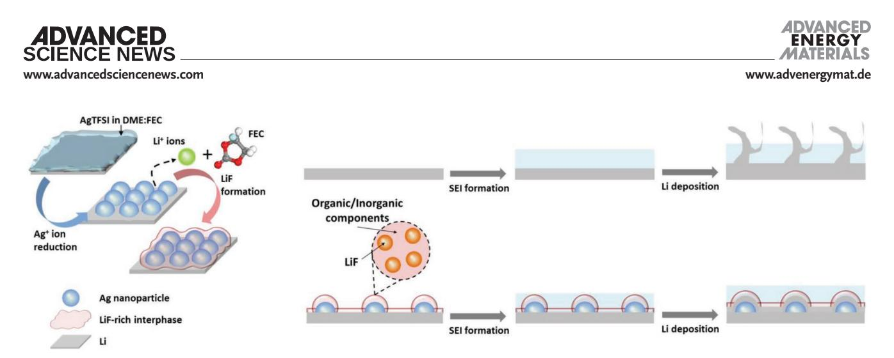
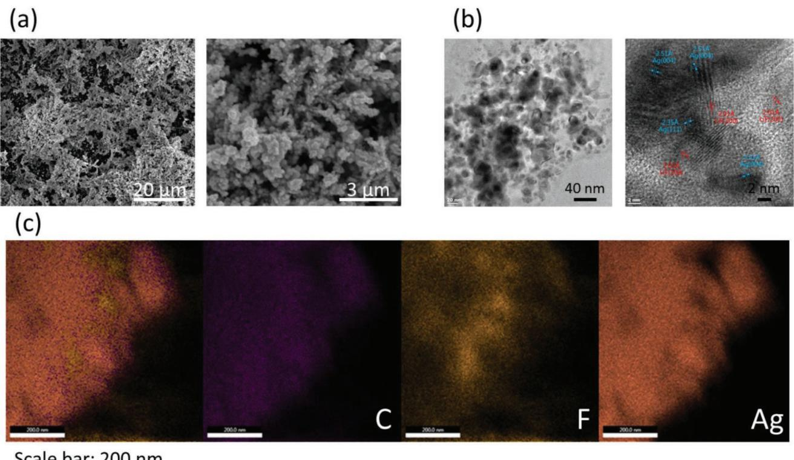
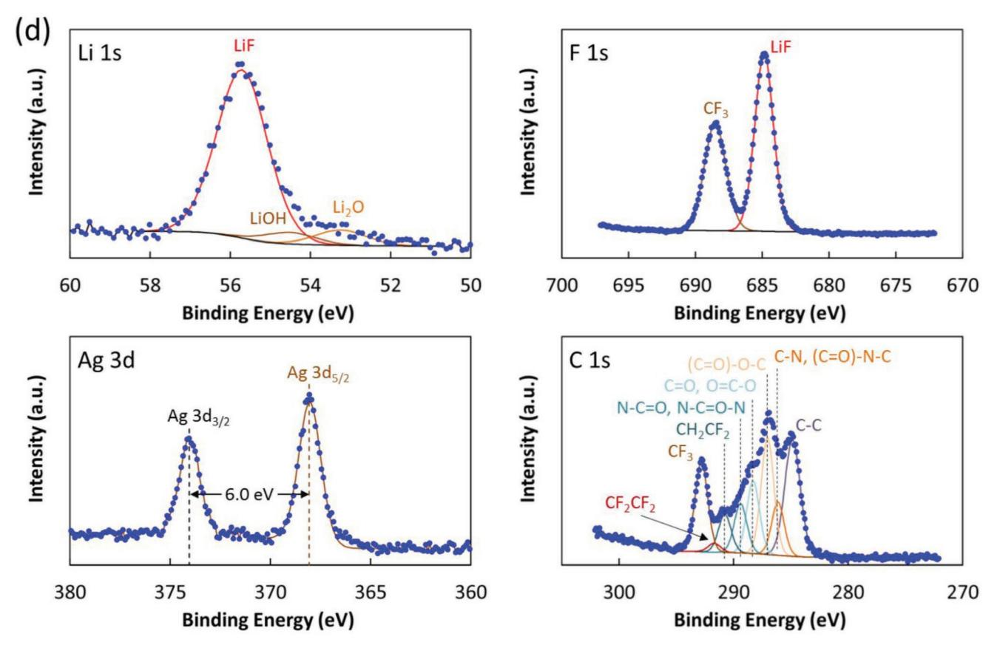
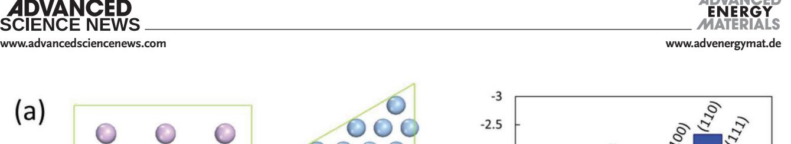
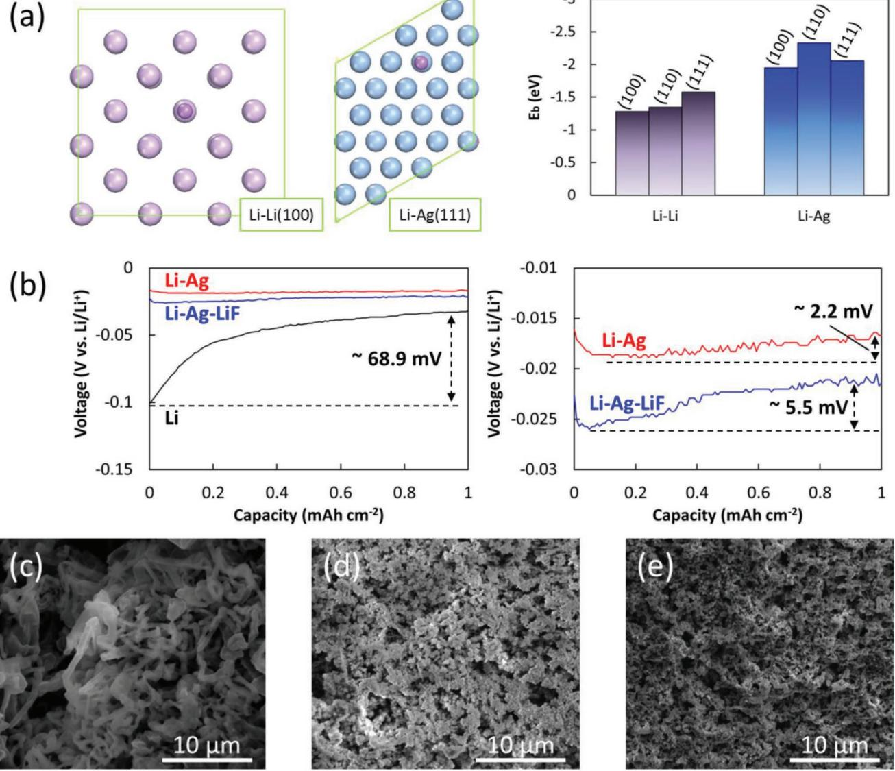
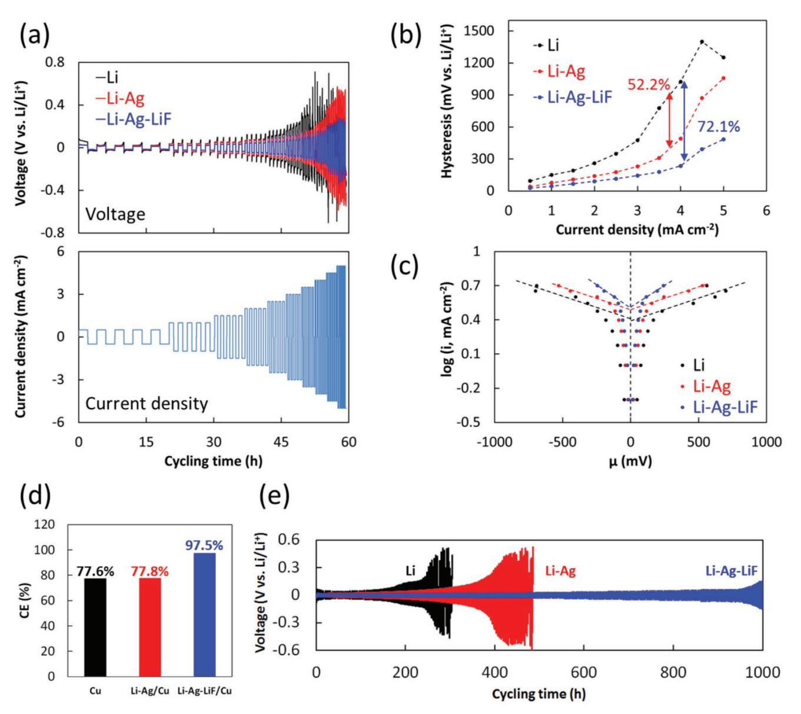
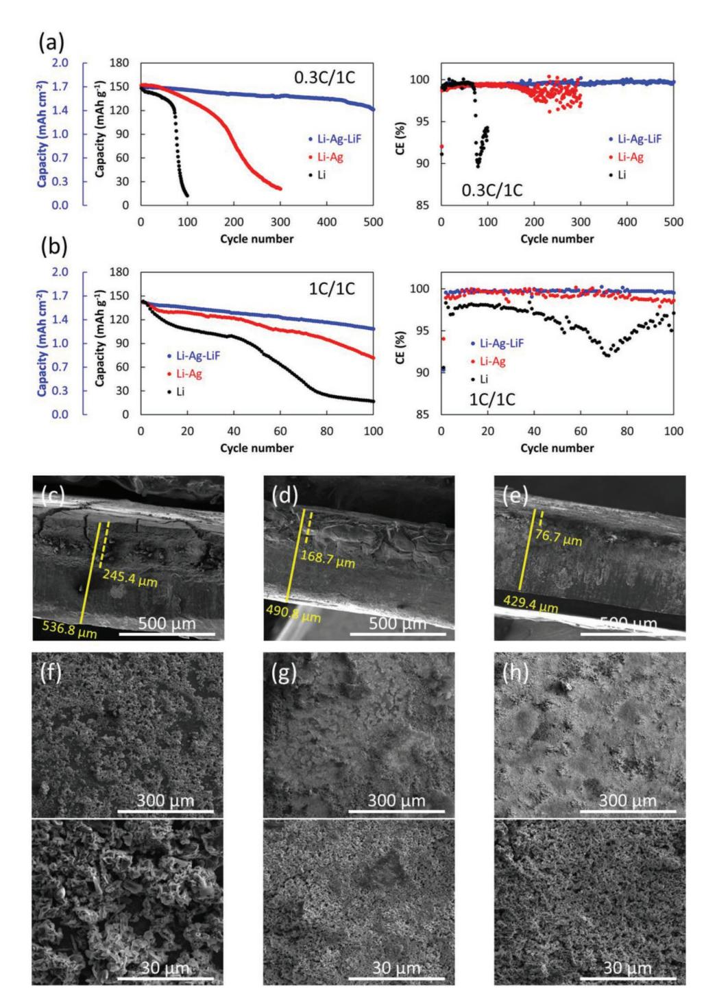

# **Enhanced Stability of Li Metal Anodes by Synergetic Control of Nucleation and the Solid Electrolyte Interphase**

*Zhe Peng, Junhua Song, Liyuan Huai, Haiping Jia, Biwei Xiao, Lianfeng Zou, Guomin Zhu, Abraham Martinez, Swadipta Roy, Vijayakumar Murugesan, Hongkyung Lee, Xiaodi Ren, Qiuyan Li, Bin Liu, Xiaolin Li, Deyu Wang,\* Wu Xu,\* and Ji-Guang Zhang\**

**Use of a protective coating on a lithium metal anode (LMA) is an effective approach to enhance its coulombic efficiency and cycling stability. Here, a facile approach to produce uniform silver nanoparticle-decorated LMA for high-performance Li metal batteries (LMBs) is reported. This effective treatment can lead to well-controlled nucleation and the formation of a stable solid electrolyte interphase (SEI). Ag nanoparticles embedded in the surface of Li anodes induce uniform Li plating/stripping morphologies with reduced overpotential. More importantly, cross-linked lithium fluoride-rich interphase formed during Ag+ reduction enables a highly stable SEI layer. Based on the Ag-LiF decorated anodes, LMBs with LiNi1/3Mn1/3Co1/3O2 cathode (≈1.8 mAh cm−2) can retain >80% capacity over 500 cycles. The similar approach can also be used to treat sodium metal anodes. Excellent stability (80% capacity retention in 10 000 cycles) is obtained for a Na||Na3V2(PO4)3 full cell using a Na-Ag-NaF/Na anode cycled in carbonate electrolyte. These results clearly indicate that synergetic control of the nucleation and SEI is an efficient approach to stabilize rechargeable metal batteries.**

Z. Peng, J. Song, H. Jia, B. Xiao, H. Lee, X. Ren, Q. Li, B. Liu, X. Li, W. Xu, J.-G. Zhang Energy and Environment Directorate Pacific Northwest National Laboratory Richland, WA 99354, USA E-mail: wu.xu@pnnl.gov; jiguang.zhang@pnnl.gov

L. Huai, D. Wang Ningbo Institute of Materials Technology and Engineering Chinese Academy of Sciences Ningbo 315201, China E-mail: wangdy@nimte.ac.cn

L. Zou, A. Martinez, S. Roy, V. Murugesan Environmental Molecular Sciences Laboratory Pacific Northwest National Laboratory Richland, WA 99354, USA

G. Zhu Physical and Computational Science Directorate Pacific Northwest National Laboratory Richland, WA 99354, USA

The ORCID identification number(s) for the author(s) of this article can be found under https://doi.org/10.1002/aenm.201901764.

#### **DOI: 10.1002/aenm.201901764**

## **1. Introduction**

Due to the limited energy density (250–300 Wh kg−1 ) of the state-of-the-art lithium (Li) ion batteries (LIBs), highenergy-density batteries are urgently required for consumer electronics, electric vehicles, and the smart grid.[1] Lithium metal battery (LMB), using Li metal as the anode and layered oxides (e.g., LiNi*x*Mn*y*CozO2) as the cathode, is one of the most promising candidates to achieve specific energy density up to 500 Wh kg−1 . [2] The conventional LiPF6/ carbonate electrolytes have been widely used in LIBs because they have wide electrochemical stability windows and can be stably charged to >4.5 V versus Li/Li+ if the cathode material itself is stable.[3] However, instability of these carbonate electrolytes with Li metal anodes still hinders the practical application of LMBs. It is well known that the plating and stripping of Li metal in electrolytes with car-

bonate solvents typically result in growth of dendritic/mossy Li deposits.[4] The reductive decomposition of these carbonate solvents produces a fragile solid electrolyte interphase (SEI) layer consisting mainly of Li alkyl carbonate (ROCO2Li) species.[5] As a result, the uncontrolled breakdown and reformation of these weak SEI layers leads to rapid growth of mossy layers that contain large amounts of inactive Li (so called "dead" Li) and high-impedance failure of LMBs. Therefore, protecting Li metal anodes in carbonate-based electrolytes will be a formidable challenge for achieving high energy density LMBs. In recent years, various approaches to stabilize Li metal anode (LMA) have been investigated, including artificial protective layers[6–11] and host structures.[12–18] However, the use of thick protective layers or host structures often significantly decreases the energy density of LMBs. Pretreatment of the Li anode is another efficient approach to protect it without relying on a thick external coating layer.[19–24] Recently, ionic exchange chemistry was investigated to form Li-alloy (Sn, Mo, In, etc.) surfaces, which proved to be useful to stabilize the Li plating/stripping processes.[25–27]

Herein, we report a facile approach to form a ternary surface that can effectively protect LMA. In this approach, a Li

**Figure 1.** Schematic representation of the formation of a Li-Ag-LiF surface and the synergetic control of nucleation and SEI for Li plating.

metal surface was treated with a silver-ion (Ag+) precursor solution consisting of silver bis(trifluoromethanesulfonyl) imide (AgTFSI) in 1,2-dimethoxyethane (DME)-fluoroethylene carbonate (FEC). Due to the strong oxidant nature of Ag+ ions, abundant Ag nanoparticles could be formed on the Li surfaces. Density functional theory (DFT) calculations showed that the binding energies of Li atom adsorption on different facets of an Ag surface are generally higher than those on a Li surface. Thus, Ag particles could act as nucleation sites for Li deposition with reduced overpotential, which would lead to high exchange current density and very uniform Li plating/stripping morphology. Meanwhile, the Li+ ions released during Ag+ reduction could efficiently react with F− ions cleaved from FEC to form a cross-linked LiF-rich interphase, leading to a LiF-rich SEI layer during initial cycling that would efficiently protect the LMA for long-term cycling (**Figure 1**). The Li anodes decorated with Li-Ag-LiF clusters (denoted as Li-Ag-LiF/Li in this work) can be plated/stripped with low overpotential, high coulombic efficiency (CE), and long cycling stability. Using a Li-Ag-LiF/Li anode, even with the conventional carbonate electrolytes (1 m LiPF6 in ethylene carbonate (EC)-dimethyl carbonate (DMC) (1:2 by vol)), LMBs with a LiNi1/3Mn1/3Co1/3O2 (NMC333) cathode (≈1.8 mAh cm−2), excess Li, and flooded electrolyte could be stably cycled at charge/discharge rates of 0.3C/1C for more than 500 cycles with >80% capacity retention. This method can also be used to treat sodium (Na) metal anode and enable stable operation of Na metal batteries (SMBs).

#### **2. Results and Discussion**

#### **2.1. Li-Ag-LiF Surface for Li Metal Protection**

A uniform black surface, shown in Figure S1a (Supporting Information), was quickly formed by dropping an Ag+ precursor solution (0.1 m AgTFSI in DME-FEC, 1:1 by vol) on the Li surface, leading to the formation of a Li-Ag-LiF/Li electrode. The reduction potentials of DME and FEC are mainly located at ≈0.6–0.7 and ≈1.1–1.2 V versus Li/Li+, respectively.[28] Meanwhile the redox potential of Ag/Ag+ is well known to be 0.80 V versus SHE, or ≈3.84 V versus Li/Li+ since the redox potential of Li/ Li+ is −3.04 V versus SHE. Based on this large difference of the reduction potentials, it is expected that the reduction sequence starts with Ag+ ion reduction, followed by DME and FEC reductions with the released Li+ ions to form an organic–inorganic mixed surface phase (with embedded LiF) surrounding the preformed Ag nanoparticles (Figure 1). As a comparison, a Li-Ag/ Li electrode could also be obtained by dropping an Ag+-ion solution of 0.1 m AgTFSI in DME without FEC on the Li surface (Figure S1b, Supporting Information). The native surface of bare Li is shown in Figure S2a (Supporting Information), and uniform microstructures observed on both Li-Ag and Li-Ag-LiF surfaces by scanning electron microscopy (SEM) are shown in Figure S2b (Supporting Information) and **Figure 2**a. These microstructures are about 7 µm thick (Figure S2c, Supporting Information). Larger agglomerates were formed on the Li-Ag surface (Figure S2b, Supporting Information), while the presence of the LiF-rich interphase led to formation of a more refined, coralloid shape on the Li-Ag-LiF surface (Figure 2a). The effect of the Ag+ concentration in the precursor solutions on the thickness of the formed Li-Ag-LiF interlayer was also investigated. As shown in Figure S3a (Supporting Information), the thickness increases with increasing the Ag+ concentration in the precursor solutions, and a very thick interlayer ≈30 µm was formed with the Ag+ precursor solution of 0.2 m AgTFSI in DME-FEC (1:1 by vol). The optimal thickness belongs to the Li-Ag-LiF interlayer (≈7 µm) formed in the Ag+ precursor solution of 0.1 m AgTFSI in DME-FEC (1:1 by vol), which exhibited the best compromise between the interfacial polarization and the stability (Figure S3b, Supporting Information).

Transmission electron microscopy (TEM) images of the Li-Ag-LiF surface are shown in Figure S4a (Supporting Information). After 5 min exposure to the electron beam, all the organic components arising from the reduced TFSI− anion, DME, and FEC were removed because these components have a much lower decomposition energy than those of inorganic components, leaving an agglomerated structure with cross-linked nanoparticles (Figure S4b, Supporting Information). To further clarify the structure of the Li-Ag-LiF surface, high-resolution TEM (HRTEM) was used to get more details on its structure and composition. As shown in Figure 2b, nanoparticles with a typical width of 10–20 nm are imbedded in an interlayer. Typical lattice spacing distances of Ag(004), Ag(104), and Ag(111) are observed on these nanoparticles (Figure 2b and Figure S4c, Supporting Information). Meanwhile, the lattice

**Figure 2.** a,b) SEM and HRTEM images of Li-Ag-LiF surface; c) EDS mapping of Li-Ag-LiF surface; d) Li 1s, F 1s, Ag 3d, and C 1s XPS spectra of Li-Ag-LiF surface.

spacing distances of LiF(111) and LiF(200) are observed in the surrounding region. These results indicate that the Li-Ag-LiF interlayer is mainly composed of Ag nanoparticles embedded in a LiF-rich interphase.

X-ray diffraction (XRD) of the Li-Ag-LiF/Li electrode clearly indicates the presence of Ag and LiF crystalline phases on the reacted Li foil (Figure S5a, Supporting Information). This is consistent with the energy-dispersive spectroscopy (EDS) mapping, which shows uniform distribution of Ag and LiF on the Li-Ag-LiF surface (Figure 2c, Figure S5b,c, Supporting Information). X-ray photoelectron spectroscopy (XPS) analysis identifies in detail the chemical components on the Ag-embedded surface (Figure 2d). Both Li 1s and F 1s spectra showed dominant signals of LiF, indicating the efficient reduction of FEC by the Li+ ions released during the Ag+ reduction process. It should be mentioned that there was no LiF signal on the F 1s spectra of the bare Li and Li-Ag surfaces (Figure S6a, Supporting Information), corroborating the origination of LiF from the reductive reaction of FEC on the Li-Ag-LiF surface. The Ag 3d XPS spectrum shows well-separated spin–orbit components with two peaks at 374.1 and 368.1 eV, corresponding to the binding energies of Ag 3d3/2 and Ag 3d5/2, respectively. The interpeak distance shows a typical ∆metal = 6.0 eV, proving the presence of metallic Ag. A very complex composition was obtained for the C 1s spectrum, including species containing CC/CH, CO, CO, CN, and CF*x* bonds. These C-containing species could be derived from the reductions of TFSI− anions, DME, and FEC,[29,30] resulting in the formation of organic components as observed in TEM (Figure S4a, Supporting Information).

The Li-Ag-LiF interlayer is a composite of mixed Ag and LiF, and it is porous rather than a compact layer. As shown by the schematic illustration in Figure 1, the Li deposition can only occur after Li+ ions penetrate LiF-rich SEI layer to reach Li metal or Ag nanoparticles bounded to Li metal where Li+ ions can receive electrons. To verify the structure change around SEI layer before and after Li deposition, we plated 0.25 mAh cm−2 Li on the Li-Ag-LiF surface and then performed an XRD test. As shown in Figure S5a (Supporting Information), the main peaks of Li and LiF phases can be observed after Li plating while the peaks of Ag phase are replaced with weak peaks of Li-Ag alloy, indicating that the LiF-rich interphase remains unchanged while the Ag nanoparticles act as Li nucleation sites for underneath Li-Ag alloying process. Furthermore, the Ag 3d XPS spectrum of Li-Ag-LiF surface after 20 cycles of Li plating/ stripping at 0.5 mA cm−2 and 1 mAh cm−2 was measured (Figure S6b, Supporting Information). Compared to the spectrum of the initial state (Ag 3d XPS spectrum in Figure 2d), two peaks at 374.2 and 368.2 eV are always observed, corresponding to the binding energies of Ag 3d3/2 and Ag 3d5/2, respectively. The interpeak distance of ∆metal = 6.0 eV demonstrates the existence of Ag nanoparticles after repeated cycles, providing Li nucleation sites for controlled Li deposition in long-term cycling. In addition, the peak of LiF was observed for the Li-Ag-LiF surface after 20 cycles of Li plating/stripping (Figure S6b, Supporting Information), indicating that this interlayer could be maintained after repeated cycles.

The dynamic of Li nucleation is an important issue that affects the stability of Li plating/stripping. As shown in **Figure 3**a, DFT modeling shows that the binding energies of Li atom adsorption on different facets of an Ag surface are generally higher than those on a Li surface. Hence, Ag particles could act as Li nucleation sites with significantly lower overpotentials. This hypothesis is clearly verified by the nucleation overpotentials of Li plating on Li, Li-Ag, or Li-Ag-LiF surfaces in a conventional electrolyte of 1 m LiPF6 in EC-DMC (1:2 by vol) (Figure 3b). A high nucleation overpotential, ≈68.9 mV, was obtained on a bare Li surface, whereas significantly lower overpotentials of ≈2.2 and 5.5 mV were obtained for Li-Ag and Li-Ag-LiF, respectively. The higher overpotential for the Li-Ag-LiF surface than that of the Li-Ag surface can be attributed to its less conductive components (LiF). Li plating morphologies improved by the reduced nucleation overpotentials are shown in Figure 3c–e. For Li plating at 2 mAh cm−2 , small, granular Li deposits were uniformly distributed on the Li-Ag (Figure 3d) and Li-Ag-LiF (Figure 3e) surfaces, demonstrating the prominent role of Ag nanoparticles in uniform Li deposition. In contrast, a typical dendritic morphology was observed for Li deposition on bare Li (Figure 3c).

Interfacial charge transfer and mass transport are critical in determining the cycling stability of LMA. A rate capability test using symmetric cells in an electrolyte of 1 m LiPF6 in EC-DMC (1:2 by vol) clearly illustrates the improved interfacial charge transfer kinetics with the presence of Ag nanoparticles (**Figure 4**a). With increasing current density from 0.5 to 5 mA cm−2, both Li-Ag/Li and Li-Ag-LiF/Li electrodes exhibit reduced voltage hysteresis; the reductions could be as much as ≈52.2 and 72.1% for the Li-Ag/Li and Li-Ag-LiF/Li electrodes, respectively, compared to the bare Li counterpart (Figure 4b). It is noteworthy that the Li-Ag-LiF/Li electrodes exhibited better rate capability than the Li-Ag/Li electrodes. To describe this superiority, Tafel equation was employed by plotting log(*i*) as a function of the overpotential µ (Figure 4c). According to the Tafel equation

$$\mu = A \times (\log(i) - \log(i_0)) \tag{1}$$

where *i*0 (mA cm−2 ) is the exchange current density, and *A* (mV) is the Tafel slope that represents a dynamic constant in the range of a diffusion-controlled surface dynamic. The faster the charge transfer at the electrode/electrolyte interfaces, the higher the value of *i*0. The values of *i*0 were obtained for the intersections at µ = 0 mV by extrapolating the linear parts of log(*i*) versus µ shown in Figure 4c, which are 2.51, 3.12, and 3.24 mA cm−2 for the bare Li, Li-Ag/Li, and Li-Ag-LiF/Li electrodes, respectively. Besides the larger *i*0 than that of bare Li, the similar values of the Li-Ag/Li and Li-Ag-LiF/Li samples indicate that the improved charge transfer on these surfaces arises mainly from the presence of Ag nanoparticles, with their high affinity to Li atoms. However, in the range of high current densities beyond *i*0 where kinetics of the diffusion process become dominant, the values of Tafel slope *A* are similar for the bare Li and the Li-Ag/Li electrodes, which are 2531.3 and 2606.9 mV, respectively. The cells based on Li-Ag-LiF/Li electrodes exhibited a much lower value of 1310.6 mV, indicating that the presence of a LiF-rich interphase has an additional effect of providing fast Li+ ion diffusion across the Li-Ag-LiF interlayer.

**Figure 3.** a) Top views of Li atom adsorption on Li(100) and Ag(111) surfaces, and binding energies of Li atom adsorption on different facets of Li and Ag surfaces; b) nucleation overpotentials of Li plating on Li, Li-Ag, and Li-Ag-LiF surfaces in a carbonate electrolyte of 1 m LiPF6 in EC-DMC (1:2 by vol); c–e) SEM images of Li deposited at 2 mAh cm−2 on bare Li, Li-Ag/Li, and Li-Ag-LiF/Li electrodes.

With the improved ion-transfer kinetics at the interphase of the Ag-embedded Li surface and the electrolyte, Li plating/ stripping efficiencies were also studied. To reveal protection of Li metal by the Ag-embedded surfaces, a modified Aurbach method was applied to determine the average CE of Li on the investigated surface structures (see the Experimental Section).[31,32] Bare Cu, Li-Ag/Cu, and Li-Ag-LiF/Cu electrodes were used as working electrodes of Li||Cu cells in such a protocol. To obtain the Li-Ag/Cu and Li-Ag-LiF/Cu electrodes, 10 mAh cm−2 Li were plated on Cu foils, and the Ag+ precursor solutions were dropped on the Li covered Cu foils to form Li-Ag and Li-Ag-LiF surfaces. By stripping all the residual Li, the Li-Ag/Cu and Li-Ag-LiF/Cu electrodes were then obtained. It should be mentioned that the Li bonded in the reacted surfaces was not affected by the stripping process, as shown by the Li 1s XPS spectra in Figure S7 (Supporting Information). A conventional carbonate electrolyte of 1 m LiPF6 in EC-DMC (1:2 by vol) was used as the control electrolyte. The voltage profiles of Li||Cu cells recorded during such a protocol for bare Cu, Li-Ag/ Cu, and Li-Ag-LiF/Cu electrodes are shown in Figure S8a (Supporting Information). Almost identical CEs were obtained on bare Cu (77.6%) and Li-Ag/Cu (77.8%) electrodes (Figure 4d), indicating that Ag nanoparticles acted only as uniform Li nucleation sites in the Li-Ag/Cu electrode, but could not provide significant Li metal protection. A greatly increased CE of 97.5% was obtained on the Li-Ag-LiF/Cu electrode, demonstrating the indispensable role of the LiF-rich interphase for Li metal protection. When an ether-based localized high concentration electrolyte, bis(fluorosulfonyl)imide (LiFSI) in a mixture of DME and 1,1,2,2-tetrafluoroethyl-2,2,3,3-tetrafluoropropyl

**www.advancedsciencenews.com www.advenergymat.de**

**Figure 4.** a,b) Voltage profiles and hysteresis of symmetric cells of Li||Li, Li-Ag/Li||Li-Ag/Li, and Li-Ag-LiF/Li||Li-Ag-LiF/Li in a carbonate electrolyte of 1 m LiPF6 in EC-DMC (1:2 by vol) for rate capability tests; c) plots of log(*i*) versus µ obtained from the rate capability tests for the investigated symmetric cells; d) average Li CEs obtained for bare Cu, Li-Ag/Cu, and Li-Ag-LiF/Cu electrodes; e) cycling stabilities of Li||Li, Li-Ag/Li||Li-Ag/Li, and Li-Ag-LiF/ Li||Li-Ag-LiF/Li symmetric cells, obtained at a current density of 0.5 mA cm−2 and an areal capacity of 1 mAh cm−2 .

ether (TTE) (in a molar ratio of 1:1.2:3) was used,[33] the CE of Li-Ag-LiF/Cu based cell can be further increased to ≈99.5% (Figure S8b, Supporting Information). In this work, we will focus on the use of carbonate-based electrolytes that usually have a broader electrochemical window than those of etherbased electrolytes.

Symmetric cells were used to assess the interfacial stability associated with the Ag-embedded surfaces. As shown in Figure S9 (Supporting Information), suppression of voltage spikes was clearly observed on the cycling profiles of symmetric cells using Li-Ag/Li and Li-Ag-LiF/Li electrodes. A voltage spike is a direct indicator of surface deterioration from uneven Li deposition,[34] similar to what was observed in the symmetric cell using bare Li. Therefore, these cycling performances indicate that Ag nanoparticles could effectively improve the uniformity of Li deposition, as observed by SEM (Figure 3d,e). Figure 4e shows the voltage profiles during longterm cycling obtained at a current density of 0.5 mA cm−2 and an areal capacity of 1 mAh cm−2 . With the control electrolyte (1 m LiPF6 in EC:DMC (1:2)), which is corrosive to Li metal, stable cycling was obtained using the Li-Ag-LiF/Li electrodes. The polarization was low at ≈50 mV over a 1000 h test. In sharp contrast, a large polarization of ≈500 mV was observed at 300 and 500 h with bare Li and Li-Ag/Li electrodes, respectively. Stable cycling of symmetric cells at higher current densities of 1 and 2 mA cm−2 with an areal capacity of 2 mAh cm−2 was also obtained using the Li-Ag-LiF/Li electrodes (Figure S10, Supporting Information). These results demonstrate the important role of the co-produced LiF-rich interphase (with other SEI components) on the Li-Ag-LiF surface for Li metal protection. With the synergetic effects of uniform Li nucleation on the Ag nanoparticles and additional protection by the LiF-rich interphase, the Li-Ag-LiF/Li electrode could enable very good cycling performance, outperforming not only the bare Li and Li-Ag/Li electrodes but also the Li metal covered by a LiF-enriched SEI layer. This superiority has been verified by comparing the symmetric cell using Li foils soaked in FEC for 24 h, and the F 1s XPS has proven the existence of LiF on these soaked Li foils (Figure S11a, Supporting Information). However, voltage spikes are clearly observed on the voltage profile of this symmetrical cell while they are not observed for the cell using Li-Ag-LiF/Li anodes (Figure S11b, Supporting Information). Furthermore, the cycling stability of this symmetrical cell is much worse than that of the cell using Li-Ag-LiF/Li anodes (Figure S11c, Supporting Information). Another comparison has also been made by comparing the symmetric cell using the Li-Ag-LiF/Li anodes with the control electrolyte to a symmetric cell using bare Li foils with an FEC-containing electrolyte (1 m LiPF6 in EC:DMC [1:2 by vol] + 10 vol% FEC), as shown in Figure S11d (Supporting Information). The significantly improved stability of the symmetric cell using the Li-Ag-LiF/Li anodes demonstrates the importance of controlling Li nucleation for improving the stability of Li anodes.

Ex situ Nyquist spectra of the symmetric cells were recorded at different cycling times. They showed clear consistence of the internal impedance evolutions (Figure S12a, Supporting Information). For the cell based on bare Li, a huge charge transfer impedance (the semicircle) of ≈300 Ω was observed in the initial state, indicating that the native surfaces of Li metal are highly resistive. A decrease of charge transfer impedance between 0 and 20 h indicates the eventual breakdown of the highly resistive native surface. Meanwhile, the bulk impedance of the electrolyte (the high-frequency intercept impedance) increased due to the consumption of electrolyte in side reactions. With cycling proceeding to 300 h, a very high charge transfer impedance of 150 Ω was obtained, consistent with the large polarization observed in Figure 4e for the bare Li based cell. A transition from an uneven surface to a seriously pulverized structure was clearly evident on the bare Li electrodes disassembled at 200 and 300 h (Figure S12b,c, Supporting Information), indicating that such a deteriorated interface was highly resistive to Li+ ion transfers. The cell using Li-Ag/Li electrodes showed reduced impedances, but two semicircles appeared progressively upon cycling, with increased overall impedances. In the digital photos of the disassembled Li-Ag/Li electrodes at 200 and 300 h, two types of electrode surfaces were observed, including an Li-Ag covered surface and an exposed Li surface (Figure S12b,c, Supporting Information), which probably led to the multiple semicircles on the Nyquist spectra. In addition, the exposed Li surface increased after longer cycling time (Figure S12c, Supporting Information), indicating that the Li-Ag surface cannot maintain a stable structure for longterm cycling. In contrast, small and stable charge transfer impedances below 5 Ω were maintained by the cell using Li-Ag-LiF/Li electrodes (Figure S12a, Supporting Information). Meanwhile, an intact structure was maintained over cycling for 300 h (Figure S12c, Supporting Information), proving fast charge transfer through such a highly stable interface.

In practice, LMA must be paired with high loading cathodes (e.g., NMC) to construct high-energy-density batteries. For an NMC cathode with capacity loading of 2 mAh cm−2 , cycling at 1C rate implies a current density of 2 mA cm−2 on the LMA. Therefore, the ability to cycle at such a high current density is critical for high-energy-density LMBs. After demonstrating the improved interfacial stability of the Ag-embedded surfaces, these advanced Li anodes were further examined in full cell systems using NMC333 cathodes with a modestly high capacity loading of ≈1.8 mAh cm−2 and an electrolyte of 1 m LiPF6 in EC:DMC (1:2 by vol). The cycling was first carried out with charge/discharge rates of 0.3C/1C. As shown in **Figure 5**a and Figure S13a (Supporting Information), a limited cycle life of <100 cycles with an average CE of only ≈97.4% was observed for the cell using a bare Li anode, indicating the difficulty of cycling LMBs at this areal capacity loading. Use of the Li-Ag/Li anode extended the cycle life to 300 cycles with an average CE of 98.9%. Additional Li protection provided by the LiF-rich interphase further extended the cycling life of the Li||NMC333 full cell to more than 500 cycles by using a Li-Ag-LiF/Li anode, with an average CE of 99.5%. The superiority of the Li-Ag-LiF surface over the conventional LiF-enriched SEI layer using an FEC-containing electrolyte has also been demonstrated in Li||NMC333 full cell systems (Figure S14, Supporting Information).

For a typical LMB reported in the literature, charge rate is usually below 1 mA cm−2 which is much less than those required for fast charge batteries.[35] In an earlier work reported by our group, the cycling stability of LMBs with high loading cathodes was more vulnerable when the charging rate exceeded 1 mA cm−2 due to rapid growth of the entangled SEI/Li interphase toward the bulk Li which dramatically increasing the overall cell impedance.[36] Therefore, cycling at high rates is a formidable challenge in practice with LMBs. In the present work, charge/discharge rates of 1C/1C (where 1C = 1.8 mA cm−2) were used to assess the ability of the Agembedded surfaces to withstand fast charge/discharge cycling with modestly high loading cathodes. As shown in Figure 5b, the cell using bare Li showed very poor cycling, with capacity retention of only 11.8% at the 100th cycle. With the Li-Ag/ Li anode, the capacity retention increased to 50.2%, while the Li-Ag-LiF/Li anode further improved capacity retention to 75.8%. The average CEs over 100 cycles were 96.1, 99.2, and 99.6% for the cells using bare Li, Li-Ag/Li, and Li-Ag-LiF/ Li anodes, respectively. The rapid capacity decay in the cell with bare Li was clearly caused by the seriously increased cell polarization. The cell using a Li-Ag-LiF/Li anode exhibited much more stable voltage profiles (Figure S13b, Supporting Information).

From the disassembled anodes, a very thick, porous layer of ≈245.4 µm was observed on the cycled Li anode, which is ≈45.7% of the total thickness (≈536.8 µm, Figure 5c). The formation of this thick, porous layer caused a large volume expansion compared to a pristine Li anode ≈414.1 µm thick (Figure S15a, Supporting Information), and large cracks were also observed on the brittle, "dead Li" layer (Figure S15b, Supporting Information). Therefore, cycling bare Li anodes at a

**Figure 5.** a,b) Cycling performance of Li||NMC333 full cells using bare Li, Li-Ag/Li, and Li-Ag-LiF/Li anodes and an electrolyte of 1 m LiPF6 in EC-DMC (1:2 by vol), for charge/discharge rates of 0.3C/1C and 1C/1C, where 1C = 1.8 mA cm−2 ; c–e) cross-sectional and f–h) top-view SEM images of the cycled (c, f) Li, (d, g) Li-Ag/Li, and (e, h) Li-Ag-LiF/Li anodes disassembled from the Li||NMC333 full cells after 100 cycles at 1C/1C rates.

high rate could result not only in large polarization but also very heterogeneous structure, causing eventual safety issues. The cycled Li-Ag/Li anode showed a thinner passivation layer (≈168.7 µm) (Figure 5d). In contrast, a very smooth surface was obtained for the Li-Ag-LiF/Li with a thin passivation layer (≈76.7 µm, Figure 5e). The top-view SEM images also showed clear differences between these anodes (Figure 5f–h). Massive dendrites were generated on the bare Li surface (Figure 5f), consistent with the thick porous layer observed in Figure 5c and the large cell polarization (Figure S13b, Supporting Information). In contrast, uniform granular morphologies were observed on both Li-Ag/Li (Figure 5g) and Li-Ag-LiF/Li (Figure 5h) anodes due to the presence of Ag nanoparticles as nucleation sites. The effective Li protection by the LiF-rich interphase contributed to further improved Li plating/stripping efficiency and cycling stability.

The significantly improved morphologies and cycling performances of the Li-Ag-LiF/Li anode demonstrate the advantages of the synergetic control of nucleation and interphase for highperformance LMA. As a proof of concept, a high-voltage LMB using the Li-Ag-LiF/Li anode and a LiNi0.5Mn1.5O4 (LNMO) cathode (0.35 mAh cm−2 ) was assembled and cycled between 3.2 and 4.9 V versus Li/Li+. As shown in Figure S16a (Supporting Information), the Li||LNMO cell using bare Li exhibits fast decay of discharge capacity, whereas the capacity retention dropped below 50% at the 120th cycle when cycled at 1C charge/discharge rates. Significantly polarized voltage profiles indicate high-impedance failure mainly arising from the Li anode side (Figure S16b, Supporting Information), since the LNMO is a relatively stable cathode material. In contrast, stable cycling of the Li-Ag-LiF/Li||LNMO cell can be realized with a capacity retention of 85% at the 150th cycle (Figure S16a, Supporting Information), with much stabilized voltage profiles upon cycling (Figure S16b, Supporting Information).

#### **2.2. Na-Ag-NaF Surface for Na Metal Protection**

SMBs also have great potential for large-scale energy storage applications due to the low cost and abundance of Na sources. Although some studies have demonstrated that sodium metal anode (SMA) can be cycled stably in ether-based electrolytes,[37,38] a more practical application of SMBs still needs to be realized in carbonate-based electrolytes, which provide a wider voltage window. However, the cycling stability of SMA in carbonate electrolytes is even poorer than that of LMA.[39] The results of the present work make it interesting to apply such a method to SMA.

Rapid, uniform conversion of the bulk Na into Na-Ag or Na-Ag-NaF surfaces was obtained using the similar Ag+ precursor solution (Figure S17a,b, Supporting Information). For the Na-Ag-NaF surface, both an XRD pattern (Figure S18a, Supporting Information) and EDS mapping (Figure S18b,c, Supporting Information) clearly show the presence of Ag and NaF on the Na-Ag-NaF/Na electrode. As with the LMA, DFT modeling also showed higher binding energy for Na atom adsorption on different facets of the Ag surface than those on the Na surface (Figure S19a, Supporting Information). Similarly, smaller nucleation overpotentials of 112.5 and 140.8 mV were obtained for Na plating on Na-Ag and Na-Ag-NaF surfaces, respectively, while a high overpotential of 337.8 mV was produced on bare Na (Figure S19b, Supporting Information). Fast charge transfer was observed on both Na-Ag and Na-Ag-NaF surfaces through the rate capability test using symmetric cells (Figure S20a, Supporting Information). With current density increased from 0.8 to 8 mA cm−2 , both Na-Ag/Na and Na-Ag-NaF/Na electrodes showed less voltage hysteresis, indicating the low overpotential of Na plating on Ag nanoparticles (Figure S20b, Supporting Information).

Na CEs of 71.4, 78.2, and 92.2% were obtained for Na plating/stripping on bare Cu, Na-Ag/Cu, and Na-Ag-NaF/Cu electrodes, respectively (Figure S21, Supporting Information). Consistent with the case of LMA, greatly improved cycling stability was obtained for the symmetrical cells using Na-Ag-NaF/Na electrodes, compared to those using bare Na or Na-Ag/ Na electrodes (Figure S22, Supporting Information). After cycling bare Na, Na-Ag/Na, and Na-Ag-NaF/Na electrodes in symmetric cells for 50 h at 0.8 mA cm−2 and 1.6 mAh cm−2 , a much smoother surface morphologies on the Ag-embedded surfaces were observed on the disassembled electrodes (Figure S23, Supporting Information) than those without Ag treatment. On bare Na, large cracks at tens of micrometers wide were observed (Figure S23a, Supporting Information), while smoother surfaces were obtained on Na-Ag/Na (Figure S23b, Supporting Information) and Na-Ag-NaF/Na (Figure S23c, Supporting Information) electrodes, proving the important role of Ag nanoparticles in uniform Na plating/stripping.

Results of long-term cycling of Na||LiNi1/3Mn1/3Co1/3O2 (NVP) full cells at charge/discharge rates of 1C/1C are shown in Figure S24a (Supporting Information). In sharp contrast to fast capacity fading and partial short-circuits in the cell using a bare Na anode, stable cycling over 1000 cycles with capacity retention above 80% and an average CE of 99.8% was achieved by the cell using a Na-Ag-NaF/Na anode (Figures S24a and S25a, Supporting Information), indicating considerably improved interfacial stability of the Na anode by the Na-Ag-NaF surface. When charge/discharge rates were increased to 10C/10C (implying a current density of 1.5 mA cm−2 ), capacity retention of the cell using a bare Na anode dramatically dropped below 80% after only 20 cycles, and a total loss of capacity (<10 mAh g−1 ) was reached at the 100th cycle (Figure S24b, Supporting Information). However, for the cell based on a Na-Ag-NaF/Na anode, stable cycling was still enabled even at such a high current density (Figures S24b and S25b, Supporting Information). Distinctly improved cycling stability with capacity retention of 80.5% was achieved at the 10 000th cycle (78.4 and 63.1 mAh g−1 at the first and 10 000th cycles). These results clearly demonstrate the outstanding capability of the Na-Ag-NaF surface layer on SMA protection.

#### **3. Conclusion**

Improving the cycling stability of LMA is critical for the development of LMBs. Unlike with thick artificial layers or host structures that may sacrifice the specific capacity of LMA, a thin, uniform Ag-embedded interlayer (≈7 µm) was preformed and demonstrated outstanding Li metal protection. Abundant Ag nanoparticles could be formed on the Li surfaces during the conversion process due to the highly oxidizing nature of Ag+ ions. The high binding energies between Ag and Li enabled uniform Li plating on the Ag nanoparticles with lower overpotentials and high exchange current densities. Moreover, a LiF-rich interphase was produced during the conversion process via the reactions between the released Li+ ions and the FEC solvent of the Ag+ precursor solution, leading to highly effective Li protection. Presence of a Li-Ag-LiF surface yielded high-performance LMBs. The Li||NMC333 cells (cathode loading ≈1.8 mAh cm−2 ) using the novel Li-Ag-LiF/Li anode demonstrated a cycling life of more than 500 cycles with capacity retention above 80%. Such a method was also applied to preparing a stable Na metal anode, and excellent stability (80% capacity retention in 10 000 cycles) was obtained for an Na||NVP full cell using a Na-Ag-NaF/Na anode cycled in carbonate electrolyte. These results clearly demonstrate that the synergetic control of the nucleation and SEI is a very promising approach for stabilizing Li/Na metal anodes in high-energy-density LMBs/SMBs.

## 4. Experimental Section

Material Preparations: AgTFSI (>97%), DME (>99%), and FEC (>99%) were purchased from Alfa Aesar and used as received. The Ag+ precursor solutions were obtained by adding 0.1 M AgTFSI in DME or DME:FEC (1:1 by vol). The  $Ag^+$  precursor solution of 0.1 M AgTFSI in DME was used to form Li-Ag and Na-Ag surfaces, while the Ag+ precursor solution of 0.1 M AgTFSI in DME:FEC (1:1 by vol) was used to form Li-Ag-LiF and Na-Ag-NaF surfaces. Typically, the Ag-embedded surfaces could be immediately formed by dropping the Ag+ precursor solutions on Li (450 µm thick, MTI) or homemade Na foils. All the pretreated Li/Na foils were rinsed with DME and dried in an Ar filled glove box before use.

The NMC333 and LNMO cathodes were prepared by slurry coating at the Advanced Battery Facility at Pacific Northwest National Laboratory (PNNL) and dried at 120 °C under vacuum before cell fabrication. The NVP was synthesized by mixing stoichiometric  $V_2O_3$  and  $NaH_2PO_4$ and an appropriate amount of sucrose ( $\approx$ 10% carbon) and sintering at 800 °C in an atmosphere of argon with 5% hydrogen. The NVP cathode was prepared by mixing 70 wt% NVP, 15 wt% Super P, and 15 wt% polyvinylidene difluoride dissolved in N-methyl-2-pyrrolidone to form a slurry, which was then pasted on an Al foil and dried at 120 °C under vacuum before cell fabrication.

Electrochemical Tests: Battery grade LiPF6, NaPF6, EC, and DMC were ordered from BASF Battery Materials, CR2032 coin cells were used for cell assembly, with a 20  $\mu$ m thick polyethylene film (Asahi Kasei) as the separator. 70  $\mu$ L of electrolyte was added to each cell. The control electrolyte used in this work for LMBs was 1 M LiPF6 in EC:DMC (1:2 by vol). An FEC-containing electrolyte of 1 M LiPF6 in EC:DMC (1:2 by vol) + 10 vol% FEC was also used for the formation of a LiF-enriched SEI layer, as mentioned in the main text. The control electrolyte used in this work for SMBs was 1 M NaPF6 in EC:DMC (1:2 by vol) + 2 vol% FEC. All the electrochemical cycling tests were carried out using Land BT2000 battery testers at 30 °C in environmental chambers. The electrochemical impedance spectra were recorded using a Biologic VMP3 multichannel potentiostat with a frequency range of  $1 \times 10^{-1}$  to  $1 \times 10^{5}$  Hz and a superimposed AC signal of 5 mV amplitude.

For Li||Cu cells, the average Li CEs were determined using a modified Aurbach method. Briefly, a Li layer of 1.4 mAh cm-2 was deposited at 0.2 mA cm-2 on a Cu working electrode after a pre-Li plating/stripping of 1.4 mAh cm-2, followed by ten cycles of Li stripping/plating of 0.35 mAh cm $-2$  and finally, stripping all the residual Li from the working electrode. The cutoff potential of Li stripping from the Cu electrode was fixed at 1 V versus Li/Li+. The CE was calculated as follows

$$CE = \frac{nQ_c + Q_S}{nQ_c + Q_P}$$
 (2)

where *n*,  $Q_c$ , and  $Q_p$  represent cycle number, repeated Li striping/plating amount (0.35 mAh cm-2), and initial Li plating amount (1.4 mAh cm-2).  $Q_s$  is the final stripped amount of the residual Li after ten cycles of Li stripping/plating. Similar procedure was also used to measure Na CE using a Na $||Cu$  cell.

For Li||NMC333 full cells, all the cells were precycled for three cycles at charge/discharge rates of  $0.1C/0.1C$  in a voltage window of 2.7–4.3 V versus Li/Li+, followed by cycling at  $0.3C/1C$  or  $1C/1C$ . 1C was equal to 160 mA  $g^{-1}$   $(\approx\!1.8$  mA  $cm^{-2})$  of active NMC333 materials. For Li||LNMO full cells, all the cells were precycled for three cycles at charge/discharge rates of 0.1C/0.1C in a voltage window of 3.2–4.9 V versus Li/Li+, followed by cycling at 1C/1C. 1C was equal to 140 mA  $g^{-1}$ ( $\approx$ 0.35 mA cm-2) of active LNMO materials. For Na||NVP full cells,

all the cells were precycled for three cycles at charge/discharge rates of 0.1C/0.1C in a voltage window of 2.7-3.7 V versus Na/Na+, followed by cycling at 1C/1C or 10C/10C. 1C was equal to 120 mA  $g^{-1}$ ( $\approx$ 0.15 mA cm-2) of active NVP materials.

Material Characterization: XRD of the Ag-embedded Li/Na surfaces was performed on a Rikagu MiniFlex II instrument with Cu K $\alpha$  radiation operated at 30 kV and 15 mA. Data were collected in the  $2\theta$  range of  $25^{\circ}$ -80° at 1° min-1. To perform the XRD measurements of the Li-Ag-LiF/Li or Na-Ag-NaF/Na electrodes, the samples were wrapped and sealed with Kapton tape on the holder inside an argon-filled glove box, then quickly transferred to XRD chamber for test. Morphology observations were performed on a Helios focused ion beam SEM (FEI, USA). To avoid inconsistent reactions of Li/Na metal anodes with air, all samples were prepared on the SEM holder in glove box, hermetically sealed inside an airtight polypropylene bottle, and quickly transferred to the SEM analysis chamber. For TEM measurements, 10 mAh cm-2 Li or Na metal was electrochemically plated on Cu foil in Li||Cu or Na||Cu coin cells at a current density of 0.5 mA cm-2. The  $Ag^+$  precursor solution (0.1 M AgTFSI in DME:FEC of 1:1 by vol) was then dropped on the Li or Na covered Cu foil to form Li-Ag-LiF or Na-Ag-NaF surface. By all the electrochemically strippable Li or Na has been removed, the residual Li-Ag-LiF or Na-Ag-NaF specimen was scrapped off from the Cu electrode, placed on the TEM holder, and then hermetically sealed inside an airtight polypropylene bottle in an argon-filled glove box. After the specimen was transported to the TEM equipment, the sample was quickly transferred into the TEM analysis chamber. TEM images were obtained with an FEI Tecnai G2 F20 TEM, and HRTEM images were obtained using an FEI Titan 80-300, which is equipped with an objective-lens aberration corrector and operated at 300 kV. XPS was performed using a Kratos Axis Ultra DLD spectrometer, which consists of a high-performance Al K $\alpha$  monochromatic x-ray source (1486.6 eV) at a constant power of 105 W and a high-resolution spherical mirror analyzer.

Modeling Implementation: DFT calculations were performed using the Vienna ab initio simulation package code.[40,41] The electron-ion interactions were calculated using the projected augmented-wave method,  $\rm{^{[42,43]}}$  and the exchange-correlation energies were derived using the generalized gradient approximation with the Perdew-Burke-Ernzerhof functional.[44] The Ag (111), Ag (110), Ag (100), Li (100), Li (111), Na (100), and Na (111) surfaces were built using  $3 \times 3$  unit cells with nine atoms per layer; Li (110) and Na(110) were built using  $2 \times 2$  unit cells with eight atoms per layer. All the surfaces possessed five periodic atom layers, and a vacuum thickness of 15 Å was used to remove any interactions between slabs. The bottom two layers were fixed, and the top three layers were fully relaxed. The cutoff energy was 520 eV, and the calculations were stopped when forces on all atoms were less than 0.01 eV  $\mathring{A}^{-1}$ . The Brillouin zone sampling was carried out using Monkhorst–Pack k-points of  $3 \times 4 \times 1$  for Ag(110),  $4 \times 3 \times 1$  for Li(110) and Na(110), and  $4 \times 4 \times 1$  for the rest surfaces.

The binding energy ( $E_b$ ) was calculated according to the following equation

$$E_b = E_{surf\text{-adsorbate}} - E_{surf} - E_{adsorbate}$$
 (3)

where  $E_{surf\text{-}adsorbate}$ ,  $E_{surf}$ , and  $E_{adsorbate}$  are the total energies of the adsorbed system, the clean surface, and the free adsorbate in gas phase, respectively.

# Supporting Information

Supporting Information is available from the Wiley Online Library or from the author

## Acknowledgements

This work was supported by the Assistant Secretary for Energy Efficiency and Renewable Energy, Office of Vehicle Technologies of the U.S.

#### **www.advancedsciencenews.com www.advenergymat.de**

Department of Energy (DOE) through the Battery500 Consortium under Contract No. DE-AC02-05CH11231, Subcontract No. 18769, under the Advanced Battery Materials Research (BMR) program. The SEM observations and XPS measurements were conducted in the William R. Wiley Environmental Molecular Sciences Laboratory (EMSL), a national scientific user facility sponsored by DOE's Office of Biological and Environmental Research and located at PNNL. PNNL is operated by Battelle for the DOE under Contract No. DE-AC05-76RL01830. Z.P., L.H., and D.W. acknowledge financial support by the Ningbo Natural Science Foundation (Grant No. 2018A610014), the Zhejiang Provincial Natural Science Foundation of China (Grant No. LQ17E020004), the Ningbo 2025 Project (Grant No. 2018B10060), and the National Key R&D Program of China (Grant No. 2018YFB0905400).

# **Conflict of Interest**

The authors declare no conflict of interest.

# **Keywords**

LiF, lithium metal anodes, lithium metal batteries, nucleation, SEI

- Received: June 3, 2019
- Revised: August 29, 2019
- Published online: September 30, 2019
- [1] J. B. Goodenough, *Energy Storage Mater.* **2015**, *1*, 158.
- [2] M. Armand, J. M. Tarascon, *Nature* **2008**, *451*, 652.
- [3] W. Xu, X. Chen, F. Ding, J. Xiao, D. Wang, A. Pan, J. Zheng, X. S. Li, A. B. Padmaperuma, J.-G. Zhang, *J. Power Sources* **2012**, *213*, 304.
- [4] F. Ding, W. Xu, X. Chen, J. Zhang, M. H. Engelhard, Y. Zhang, B. R. Johnson, J. V. Crum, T. A. Blake, X. Liu, J.-G. Zhang, *J. Electrochem. Soc.* **2013**, *160*, A1894.
- [5] W. Xu, J. Wang, F. Ding, X. Chen, E. Nasybulin, Y. Zhang, J.-G. Zhang, *Energy Environ. Sci.* **2014**, *7*, 513.
- [6] D. J. Lee, H. Lee, J. Song, M.-H. Ryou, Y. M. Lee, H.-T. Kima, J.-K. Park, *Electrochem. Commun.* **2014**, *40*, 45.
- [7] H. Lee, D. J. Lee, Y.-J. Kim, J.-K. Park, H.-T. Kim, *J. Power Sources* **2015**, *284*, 103.
- [8] D. J. Lee, H. Lee, Y.-J. Kim, J.-K. Park, H.-T. Kim, *Adv. Mater.* **2016**, *28*, 857.
- [9] W. Liu, D. Lin, A. Pei, Y. Cui, *J. Am. Chem. Soc.* **2016**, *138*, 15443.
- [10] S.-J. Zhang, Z.-G. Gao, W.-W. Wang, Y.-Q. Lu, Y.-P. Deng, J.-H. You, J.-T. Li, Y. Zhou, L. Huang, X.-D. Zhou, S.-G. Sun, *Small* **2018**, *14*, 1801054.
- [11] R. Xu, X.-Q. Zhang, X.-B. Cheng, H.-J. Peng, C.-Z. Zhao, C. Yan, J.-Q. Huang, *Adv. Funct. Mater.* **2018**, *28*, 1705838.
- [12] L.-L. Lu, J. Ge, J.-N. Yang, S.-M. Chen, H.-B. Yao, F. Zhou, S.-H. Yu, *Nano Lett.* **2016**, *16*, 4431.
- [13] H. Ye, S. Xin, Y.-X. Yin, J.-Y. Li, Y.-G. Guo, L.-J. Wan, *J. Am. Chem. Soc.* **2017**, *139*, 5916.
- [14] T.-T. Zuo, X.-W. Wu, C.-P. Yang, Y.-X. Yin, H. Ye, N.-W. Li, Y.-G. Guo, *Adv. Mater.* **2017**, *29*, 1700389.
- [15] C. Yang, Y. Yao, S. He, H. Xie, E. Hitz, L. Hu, *Adv. Mater.* **2017**, *29*, 1702714.

- [16] R. Zhang, X. Chen, X. Shen, X.-Q. Zhang, X.-R. Chen, X.-B. Cheng, C. Yan, C.-Z. Zhao, Q. Zhang, *Joule* **2018**, *2*, 1.
- [17] X. Wang, W. Zeng, L. Hong, W. Xu, H. Yang, F. Wang, H. Duan, M. Tang, H. Jiang, *Nat. Energy* **2018**, *3*, 227.
- [18] H. Ye, Z.-J. Zheng, H.-R. Yao, S.-C. Liu, T.-T. Zuo, X.-W. Wu, Y.-X. Yin, N.-W. Li, J.-J. Gu, F.-F. Cao, Y.-G. Guo, *Angew. Chem., Int. Ed.* **2019**, *58*, 1094.
- [19] N.-W. Li, Y.-X. Yin, C.-P. Yang, Y.-G. Guo, *Adv. Mater.* **2016**, *28*, 1853.
- [20] N.-W. Li, Y.-X. Yin, J.-Y. Li, C.-H. Zhang, Y.-G. Guo, *Adv. Sci.* **2017**, *4*, 1600400.
- [21] X.-B. Cheng, C. Yan, H.-J. Peng, J.-Q. Huang, S.-T. Yang, Q. Zhang, *Energy Storage Mater.* **2018**, *10*, 199.
- [22] Y. Lu, S. Gu, X. Hong, K. Rui, X. Huang, J. Jin, C. Chen, J. Yang, Z. Wen, *Energy Storage Mater.* **2018**, *11*, 16.
- [23] C. Yan, X.-B. Cheng, Y.-X. Yao, X. Shen, B.-Q. Li, W.-J. Li, R. Zhang, J.-Q. Huang, H. Li, Q. Zhang, *Adv. Mater.* **2018**, *30*, 1804461.
- [24] S.-J. Tan, J. Yue, X.-C. Hu, Z.-Z. Shen, W.-P. Wang, J.-Y. Li, T.-T. Zuo, H. Duan, Y. Xiao, Y.-X. Yin, R. Wen, Y.-G. Guo, *Angew. Chem., Int. Ed.* **2019**, *58*, 7802.
- [25] X. Liang, Q. Pang, I. R. Kochetkov, M. S. Sempere, H. Huang, X. Sun, L. F. Nazar, *Nat. Energy* **2017**, *2*, 17119.
- [26] E. Cha, M. D. Patel, J. Park, J. Hwang, V. Prasad, K. Cho, W. Choi, *Nat. Nanotechnol.* **2018**, *13*, 337.
- [27] Z. Tu, S. Choudhury, M. J. Zachman, S. Wei, K. Zhang, L. F. Kourkoutis, L. A. Archer, *Nat. Energy* **2018**, *3*, 310.
- [28] a) J. S. Kim, D. Byun, J. K. Lee, *Curr. Appl. Phys.* **2014**, *14*, 596; b) C. Zhang, Q. Lan, Y. Liu, J. Wu, H. Shao, H. Zhan, Y. Yang, *Electrochim. Acta* **2019**, *306*, 407.
- [29] X.-Q. Zhang, X.-B. Cheng, X. Chen, C. Yan, Q. Zhang, *Adv. Funct. Mater.* **2017**, *27*, 1605989.
- [30] M. Wang, L. Huai, G. Hu, S. Yang, F. Ren, S. Wang, Z. Zhang, Z. Chen, Z. Peng, C. Shen, D. Wang, *J. Phys. Chem. C* **2018**, *122*, 9825.
- [31] B. D. Adams, J. Zheng, X. Ren, W. Xu, J.-G. Zhang, *Adv. Energy Mater.* **2018**, *8*, 1702097.
- [32] X. Ren, Y. Zhang, M. H. Engelhard, Q. Li, J.-G. Zhang, W. Xu, *ACS Energy Lett.* **2018**, *3*, 14.
- [33] X. Ren, L. Zou, X. Cao, M. Engelhard, W. Liu, S. Burton, H. Lee, C. Niu, B. E. Matthews, Z. Zhu, C. Wang, B. W. Arey, J. Xiao, J. Liu, J.-G. Zhang, W. Xu, *Joule* **2019**, [https://doi.org/10.2139/](https://doi.org/10.2139/ssrn.3346987) [ssrn.3346987](https://doi.org/10.2139/ssrn.3346987).
- [34] G. Bieker, M. Winter, P. Bieker, *Phys. Chem. Chem. Phys.* **2015**, *17*, 8670.
- [35] J. Qian, W. Xu, P. Bhattacharya, M. Engelhard, W. A. Henderson, Y. Zhang, J.-G. Zhang, *Nano Energy* **2015**, *15*, 135.
- [36] S. Jiao, J. Zheng, Q. Li, X. Li, M. H. Engelhard, R. Cao, J.-G. Zhang, W. Xu, *Joule* **2018**, *2*, 110.
- [37] Z. W. She, J. Sun, Y. Sun, Y. Cui, *ACS Cent. Sci.* **2015**, *1*, 449.
- [38] J. Zheng, S. Chen, W. Zhao, J. Song, M. H. Engelhard, J.-G. Zhang, *ACS Energy Lett.* **2018**, *3*, 315.
- [39] J. Song, B. Xiao, Y. Lin, K. Xu, X. Li, *Adv. Energy Mater.* **2018**, *8*, 1703082.
- [40] G. Kresse, J. Hafner, *Phys. Rev. B* **1993**, *47*, 558.
- [41] G. Kresse, J. Furthmüller, *Phys. Rev. B* **1996**, *54*, 11169.
- [42] P. E. Blöchl, *Phys. Rev. B* **1994**, *50*, 17953.
- [43] G. Kresse, D. Joubert, *Phys. Rev. B* **1999**, *59*, 1758.
- [44] J. P. Perdew, K. Burke, M. Ernzerhof, *Phys. Rev. Lett.* **1996**, *77*, 3865.