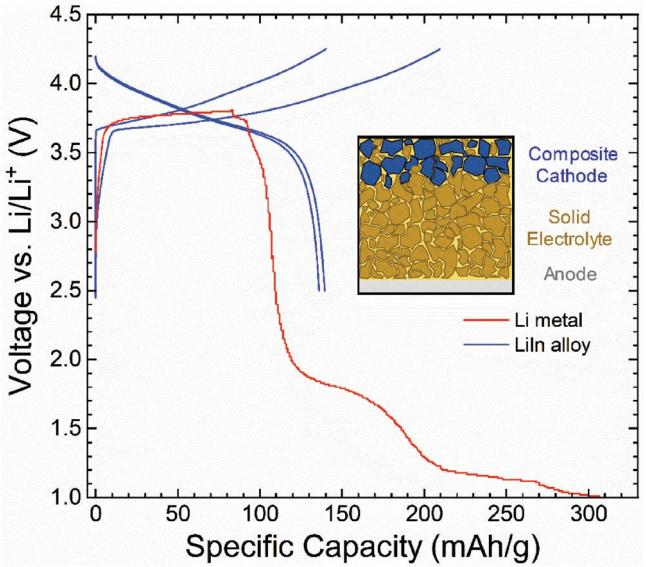
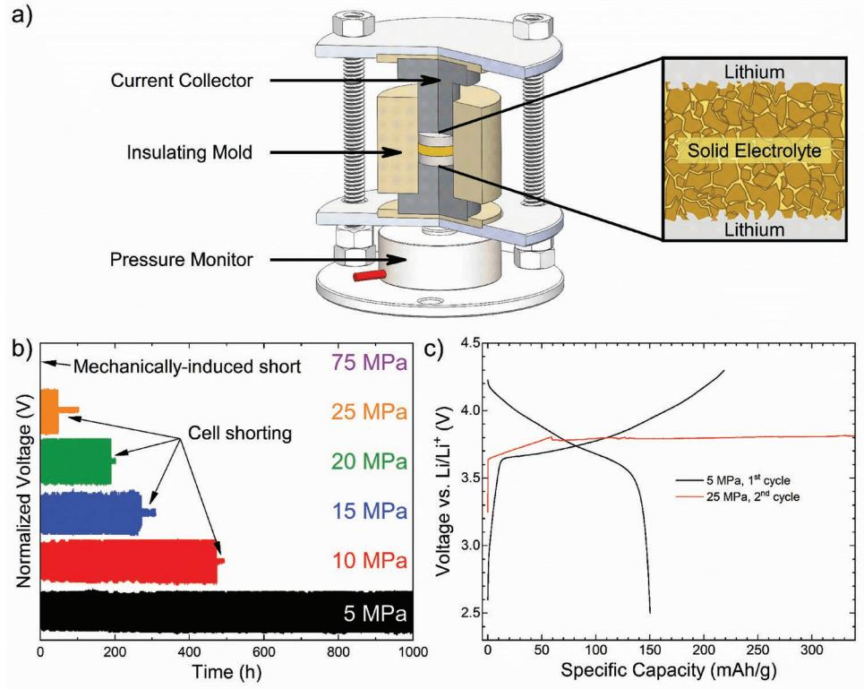
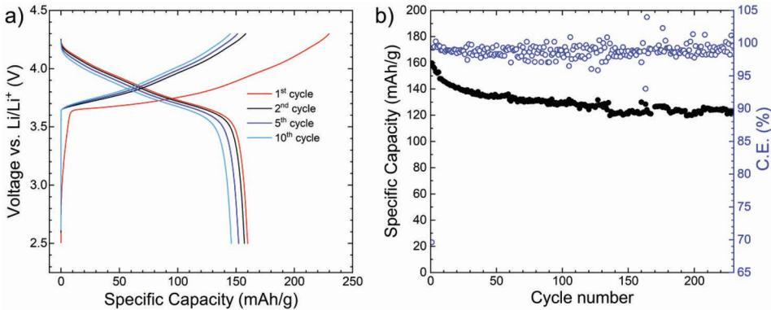
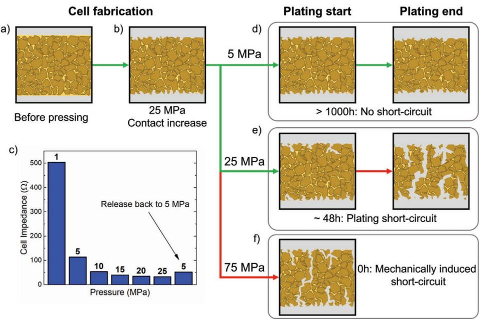
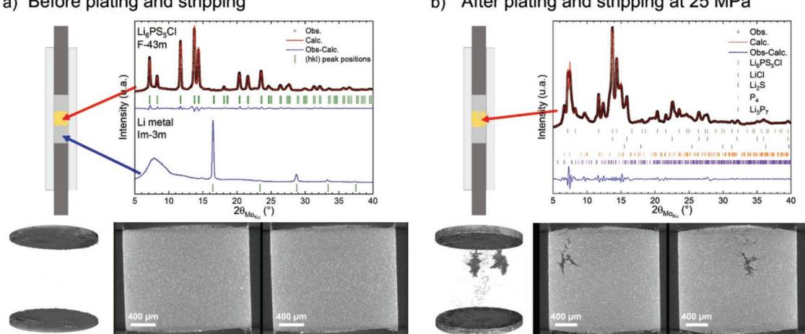

# **UC San Diego UC San Diego Previously Published Works**

## **Title**

Stack Pressure Considerations for Room‐Temperature All‐Solid‐State Lithium Metal Batteries

**Permalink** <https://escholarship.org/uc/item/6hp2m5bc>

**Journal** Advanced Energy Materials, 10(1)

**ISSN** 1614-6832

# **Authors**

Doux, Jean‐Marie Nguyen, Han Tan, Darren HS [et al.](https://escholarship.org/uc/item/6hp2m5bc#author)

**Publication Date** 2020

# **DOI**

10.1002/aenm.201903253

Peer reviewed

# **Stack Pressure Considerations for Room-Temperature All-Solid-State Lithium Metal Batteries**

*Jean-Marie Doux, Han Nguyen, Darren H. S. Tan, Abhik Banerjee, Xuefeng Wang, Erik A. Wu, Chiho Jo, Hedi Yang, and Ying Shirley Meng\**

**All-solid-state batteries are expected to enable batteries with high energy density with the use of lithium metal anodes. Although solid electrolytes are believed to be mechanically strong enough to prevent lithium dendrites from propagating, various reports today still show cell failure due to lithium dendrit growth at room temperature. While cell parameters such as current density, electrolyte porosity, and interfacial properties have been investigated, mechanical properties of lithium metal and the role of applied stack pressure on the shorting behavior are still poorly understood. Here, failure mechanisms of lithium metal are investigated in all-solid-state batteries as a function of stack pressure, and in situ characterization of the interfacial and morphological properties of the buried lithium is conducted in solid electrolytes. It is found that a low stack pressure of 5 MPa allows reliable plating and stripping in a lithium symmetric cell for more than 1000 h, and a Li | Li6PS5Cl | LiNi0.80Co0.15Al0.05O2 full cell, plating more than 4 µm of lithium per charge, is able to cycle over 200 cycles at room temperature. These results suggest the possibility of enabling the lithium metal anode in all-solidstate batteries at reasonable stack pressures.**

All-solid-state batteries (ASSBs) using nonflammable solid electrolytes are attracting increasing interest from their potential to enable the metallic lithium anode, which would dramatically increase energy densities compared to their liquid electrolyte counterparts. This arises from the belief that solid electrolytes serve as a suitable barrier that prevents lithium dendrite propagation.[1–3] The Monroe–Neumann criterion has postulated that a solid-state electrolyte (SSE) with a shear modulus twice that of lithium metal would be suitable to prevent such dendritic propagation.[4,5] However, internal shorting caused by lithium dendrite formation is still prevalent within SSEs that satisfy this

Dr. J.-M. Doux, Dr. H. Nguyen, D. H. S. Tan, Dr. A. Banerjee, Dr. X. Wang, E. A. Wu, C. Jo, H. Yang, Prof. Y. S. Meng Department of NanoEngineering University of California San Diego La Jolla, CA 92093, USA E-mail: shmeng@ucsd.edu, shirleymeng@ucsd.edu Prof. Y. S. Meng Sustainable Power & Energy Center (SPEC) University of California San Diego La Jolla, CA 92093, USA The ORCID identification number(s) for the author(s) of this article

can be found under https://doi.org/10.1002/aenm.201903253.

**DOI: 10.1002/aenm.201903253**

criterion. Under ambient conditions, dendrites formed during plating are found to penetrate even near perfectly dense single crystal oxide solid electrolytes (such as Li7La3Zr2O12),[6–8] shorting the battery after a few cycles as a result.[9] Others have attempted to enable lithium metal anodes in ASSBs by increasing electrolyte density,[10] by ensuring a good wetting at the lithium–electrolyte interface,[11] or by using protective coating layers.[12] As a result, most reported literatures have continued to use Li–In alloys in ASSBs.[13,14] To address this problem, recent studies have focused on the mechanical properties of lithium metal, seeking to understand the dendrite penetration mechanism within the electrolyte.[15–19] In this context, Masias et al. measured the Young's modulus, the shear modulus, and the Poisson's ratio of lithium metal at room temperature.[15] Their findings show that Li exhibits a yield strength of about

0.8 MPa, in accordance with a former work by Tariq et al.,[16] over which the metal starts creeping. This has been confirmed by LePage et al., who showed that at room temperature, the yield strength of Li metal is creep-dominated.[18] This yield strength needs to be correlated with the stack pressure applied on ASSBs during cycling to fully understand the mechanical behavior of a lithium metal anode. Furthermore, contrary to liquid electrolytes where optical techniques can be used to observe the morphology of the plated lithium,[20–23] observing dendrites buried inside a solid-state electrolyte requires the use of more advanced tools. Recently, Heon Kim et al. showed dendrites in Li6PS5Cl electrolyte using in situ Auger electron spectroscopy/microscopy and scanning electron microscopy.[24] However, this requires an open cell setup, utilizing the cross section of a cell mounted on the in situ sample holder, which allows lithium to protrude by creeping on the edge during cycling. Seitzman et al. also used synchrotron X-ray microscopy to observe the formation and evolution of voids and lithium dendrites in β-Li3PS4 during plating and stripping.[25] While pressure was applied, its mechanical effects on lithium and dendrite formation were not conclusive. There is still a lack of tools capable of high-resolution morphological imaging combined with chemical species identification within in situ buried interfaces to identify factors causing lithium dendrite formation with solid electrolytes.

In this work, we study the influence of the applied stack pressure on the lithium metal anode in ASSBs, employing the argyrodite Li6PS5Cl sulfide electrolyte in a closed cell setup. We first use lithium symmetric cells to determine the necessary conditions to cycle Li metal over extended durations. Then, we demonstrate stable Li metal full-cell cycling over 200 cycles at room temperature. High-resolution X-ray tomography and X-ray diffraction were used to observe the interfacial and morphological properties of dendrites formed during plating and stripping under higher stack pressures. Finally, we propose a mechanism for the dendrite growth in sulfide solid-state electrolytes based on the mechanical properties of Li metal.

To compare the features of typical Li metal batteries, a solid-state battery comprising Li6PS5Cl as the solid electrolyte, which has been shown to form a stable passivating layer with Li metal,[26,27] and LiNbO3 (LNO)-coated LiNi0.80Co0.15Al0.05O2 (NCA) as the cathode was used. LNO has been previously reported to prevent interfacial reaction between the electrolyte and high-voltage cathodes.[28,29] This cell was compared against a similar one with Li–In alloy as the anode. **Figure 1** shows the voltage profiles of both cells cycled at a rate of *C*/10 and with a stack pressure of 25 MPa. Unlike their liquid counterparts, the SSE cannot wet new surfaces that are formed during normal battery operation; thus, high pressures are thought to be necessary to ensure consistent interfacial contact between the electrolyte and the cathode.

The cell using Li–In alloy as the anode shows an expected cycling voltage behavior with a first cycle discharge capacity of ≈140 mAh g−1 and a Coulombic efficiency of 66.5%. The low first cycle Coulombic efficiency is attributed to initial electrolyte decomposition at the cathode.[30–32] Subsequent cycles present an average Coulombic efficiency over 99%, and the cell does not exhibit any shorting behavior. In contrast, the cell using Li

**Figure 1.** First two cycles of an all-solid-state battery using a Li–In alloy anode (blue) showing typical voltage profiles, and first charge cycle using a Li metal anode (red), showing characteristic shorting behavior. Both cells were prepared in the same conditions and cycled at a stack pressure of 25 MPa.

metal anode exhibits significant voltage drop during its first charge cycle. The voltage then continues to plummet, and ultimately the cell fails to charge. This is consistent with short-circuiting behavior previously observed in the literature.[24,33] The features observed can be attributed to fundamental differences between Li metal and Li–In alloys, including electrochemical potential, interfacial properties, and mechanical properties. Although several studies have characterized the interfacial products formed between sulfide solid electrolytes and Li or Li–In alloys,[34] the differences in their mechanical properties have not been studied yet. As such, we seek to investigate this by studying the effect of stack pressure on lithium metal ASSBs.

To investigate the effect of stack pressure on the shorting behavior of Li metal, a load cell has been added to the solid-state cell holder as shown in **Figure 2**a. The solid-state battery is then pressed between two stainless steel plates, with the bottom end in direct contact with the load cell. The stack pressure can be accurately tuned by tightening the nuts accordingly. Insulating spacers are placed between the titanium current collectors and stainless-steel plates to avoid external short-circuiting.

Next, plating and stripping of Li symmetric cells were conducted to determine stack pressure effects on dendrite formation and to determine an optimal operating pressure. Figure 2b shows cells' plating and stripping at 75 µA cm−2, with continuous 1 h plating/stripping durations until short-circuiting was observed. The cell that was initially pressed to a stack pressure of 75 MPa was observed to have shorted before the plating and stripping test began. This short circuit is therefore determined to occur mechanically and not due to any lithium plating and stripping. Since the relative density of the cold-pressed electrolyte pellets was ≈82% (Table S2, Supporting Information), it is reasonable to expect a connecting network of pores within the electrolyte. Due to the low yield strength of Li metal, creeping under such a high pressure allows lithium to flow within the pores, creating an electronic percolation pathway that shorts the cell internally. When the stack pressure is lowered to 25 MPa, the symmetric cell can be cycled for ≈48 h before short-circuiting occurs, as indicated by a sudden overpotential drop. It is noteworthy that the cell under 25 MPa only shorts during plating and stripping. The same cell does not short when no current is applied even over prolonged durations, indicating that Li creep-induced shorting does not occur at 25 MPa. Similar tests were conducted at stack pressures of 20, 15, and 10 MPa, and similar shorting behavior was observed after 190, 272, and 474 h, respectively. The overpotentials measured in all cells were constant throughout the entire process, which indicates that stable lithium–Li6PS5Cl interfaces are formed. All these results show that lithium metal shorting behavior is a mechanical as well as an electrochemical phenomenon; a trend can be observed between stack pressure and the time needed before short-circuiting occurs.

However, at a stack pressure of 5 MPa, no short circuit was observed within 1000 h of plating and stripping when the experiment was stopped. To confirm that this stack pressure could allow room-temperature cycling of a Li metal anode, a full cell was constructed and the first cycle at a stack pressure of 5 MPa is shown on Figure 2c. Contrary to the Li anode cell shown previously, this battery shows a typical voltage profile without any

**Figure 2.** a) Design of the solid-state Li symmetric cell used, allowing control and monitoring of pressure during cycling. b) Normalized voltage of Li symmetric cells as a function of time during plating and stripping at different stack pressures. At 75 MPa, the cell already mechanically shorts before cycling begins. At 5 MPa, no short was observed for over 1000 h. c) Voltage profile of a full cell using Li metal anode: the first cycle was done at a stack pressure of 5 MPa. The stack pressure was subsequently increased on the same cell to 25 MPa before the second cycle, during which the cell shorts.

short circuit. A specific capacity of 150 mAh g−1 and the first cycle Coulombic efficiency of 69% were attained, similar to the cell constructed with Li–In. In order to verify that a high stack pressure was the cause of the short circuit in Figure 1, the pressure was increased to 25 MPa before starting the second cycle. As seen in Figure 2c, a small voltage drop is observed during the charging cycle and the cell fails to charge normally. This behavior is typical of Li metal cycling and has been attributed to lithium dendrite formation during plating, generating short circuits.[24,33] These results show that the stack pressure is a crucial parameter to enable cycling of Li metal anodes in allsolid-state batteries.

**Figure 3**a presents the voltage profile of the first, second, fifth, and tenth cycle of a Li metal | Li6PS5Cl | LNO-coated NCA cell cycled at *C*/10 and with a stack pressure of 5 MPa, at room temperature. This cell shows stable cycling over 229 cycles (Figure 3b) and exhibits a capacity retention of 80.9% over 100 cycles. This demonstrates the feasibility of Li metal anodes

**Figure 3.** a) Voltage profile of the first, second, fifth, and tenth cycles and b) cycle life of a Li metal | Li6PS5Cl | LNO-coated NCA ASSB cycled at *C*/10 and at a stack pressure of 5 MPa. No shorting behavior was observed. Average Coulombic efficiency over 229 cycles is 98.86%, and the cell shows a capacity retention of 80.9% over 100 cycles. The active material loading is 3.55 mg cm−2 .

**Figure 4.** Schematic of the effect of the stack pressure on the shorting behavior of Li metal solid-state batteries. a) During cell fabrication, the contact between the electrolyte and Li metal is poor before pressing the Li metal on the electrolyte pellet. b) Pressing the Li metal at 25 MPa allows for proper wetting of the electrolyte and c) induces a large drop in the symmetric cell impedance, even when the pressure is later released to 5 MPa. d) Plating and stripping at a stack pressure of 5 MPa: no creeping of Li inside the SSE pellet is observed and therefore the cell cycles for more than 1000 h. e) At a stack pressure of 25 MPa, Li slowly creeps between the grains of the SSE and plating occurs on these dendrites, eventually shorting the cell after 48 h. f) When the stack pressure is too high, Li creeps through the electrolyte and forms dendrites that mechanically short the cell.

in all-solid-state batteries. There are only a few reports on full cell cycling Li metal at room temperature in the literature; a summary is reported in Table S1 (Supporting Information). Unfortunately, missing experimental details in the reported literature make the reproduction of these results difficult, and the reported cycles are limited.[24,35,36]

In order to understand the effect of the stack pressure on the plating and stripping of lithium in a Li symmetric cell, it is necessary to consider the creeping behavior of Li metal at each step of the cell fabrication and during cell cycling. This is detailed in **Figure 4**. First, when Li metal is added on both sides of the electrolyte pellet, interfacial contact between the two materials is poor (Figure 4a), and it is necessary to press the Li electrodes at 25 MPa to lower the initial cell impedance. This can be seen physically by the disappearance of voids at the interface between the Li metal and the electrolyte, when using a clear polycarbonate pellet dies (Figure S1, Supporting Information). As shown in Figure 4c, the impedance of a Li metal symmetric cell depends principally of the pressure applied to improve the contact between the electrolyte and the lithium. If a pressure of only 1 MPa is used, the cell impedance exceeds 500 Ω, and this value decreases to ≈110 Ω at 5 MPa, ≈50 Ω at 10 MPa, ≈40 Ω at 15 MPa, 35 Ω at 20 MPa, and 32 Ω at 25 MPa. Upon releasing the pressure to 5 MPa, this cell impedance only goes up to ≈50 Ω, which is less than half the initial impedance at the same pressure. This can be explained by the improved contact between lithium and the electrolyte; a relatively high initial pressure of 25 MPa allows lithium to creep and conforms to the relatively rough surface on the electrolyte pellet, filling the pores along the interface (Figure 4b). After the fabrication of the cell using a pressure of 25 MPa, three scenarios are encountered: plating and stripping at low stack pressure (5 MPa), at intermediate stack pressure (25 MPa), and at high stack pressure (75 MPa). For each case, we consider the start and end conditions of cell cycling.

For low-pressure plating and stripping (Figure 4d), stack pressure applied is high enough to allow a good contact of lithium with the electrolyte during the cycling, but not high enough to cause lithium creep through the electrolyte and induce cell shorting. This explains why the cell shown in Figure 2b, when cycling under 5 MPa, was able to plate and strip for more than 1000 h without any shorting behavior (Figure S5, Supporting Information).

For a stack pressure of 25 MPa, as shown on Figure 4e, lithium can slowly creep inside the pores of the electrolyte to form dendrites. As the distance between the two electrodes is reduced by these small protuberances of lithium, they become the preferred sites for plating lithium due to a slightly lower overpotential experienced. Therefore, after 48 h of plating and stripping, dendrites develop and the cell shorts, as shown previously in Figure 2b. Merely applying a stack pressure of 25 MPa (without any plating and stripping) did not induce any shorting, indicating that plating and stripping are necessary to form dendrites at this pressure.

Finally, when applying a stack pressure of 75 MPa (Figure 4f), mechanical shorting of the cell occurs even before any plating and stripping as shown in Figure S6 (Supporting Information). A porosity of 18% within the electrolyte provides connecting pathways across both electrodes, allowing lithium to creep that causes severe cracking of the electrolyte. It is noted that a

75 MPa stack pressure is much larger (around 100 times) than the yield strength of lithium metal.

The lowest stack pressure used (5 MPa) is still high compared to the yield strength of lithium metal (0.8 MPa), and lithium creeping could therefore be expected. Nevertheless, this yield strength value has been measured in tension, and when working in compression, the increase of the surface of contact causes the stress to gradually increase because of the friction forces.[15] A similar behavior can prevent the creeping of lithium in the ASSB at a stack pressure of 5 MPa.

For the three symmetric cell stack pressures of 5, 25, and 75 MPa, mechanical properties of the SSE pellet itself are not expected to have an influence on the shorting mechanism, as it has already been cold-pressed at 370 MPa. At 75 MPa, lithium creeps through the pellet via interconnecting pores to ultimately create an electronic pathway. At 25 MPa, some lithium initially creeps into the pores but is insufficient to cause electronic short. With plating and stripping, an additional force is exerted by the plated lithium deposited along the electrolyte grains, expanding the lithium filaments in the pellet until short circuit occurs. At 5 MPa, plating of lithium only takes place on the surface of the pellet as the pressure is not high enough to allow lithium to creep into the pores.

Using a combination of laboratory X-ray tomography and X-ray diffraction on the same solid-state Li symmetric cells in situ allowed us to obtain both morphological and chemical information of the buried dendrites. The cell was constructed with a diameter of 2 mm to allow a resolution of about 1 µm over the whole volume of the electrolyte with the X-ray tomography experiments. The use of Mo Kα radiation provided the X-ray diffraction patterns of the lithium metal and the electrolyte before and after plating and stripping. **Figure 5**a shows the X-ray tomography image of the cell before plating and stripping, and XRD patterns in the lithium metal region and in the electrolyte region. The lithium metal electrodes show good contact with the electrolyte pellet; the contact interface is flat and without any voids. As expected in this pristine state, only Li6PS5Cl is present in the electrolyte region, and the lithium metal diffraction peaks can be detected in the electrode region. After plating and stripping at 25 MPa, as shown on Figure 5b, the tomography images show large low-density structures within the electrolyte. These dendritic formations propagate between the grains of the electrolyte along the grain boundaries and then expand within the local sites. X-ray diffraction of the electrolyte shows the presence of numerous phases: LiCl, Li2S, and reduced phosphorous species which are harder to identify because of their low concentrations. Such species have been previously identified in the literature to be the solid electrolyte interphase (SEI) formed between Li metal and Li6PS5Cl.[34] It is important to note that lithium metal dendrites are not directly detected by X-ray diffraction due to the low amounts and low scattering efficiency of lithium metal in comparison to the electrolyte and SEI products formed. Both in situ tomography and diffraction experiments conducted on the same cell offer direct observation of lithium dendrite growth and its corresponding interface products within the solid electrolyte. This is consistent with the proposed mechanism of cell shorting seen with electrochemical measurements discussed earlier. Although there are recent reports of void formation during stripping metallic lithium in ASSB (at 3.5 and 7 MPa) due to limited lithium–SSE contact, this issue was mitigated by improving this contact by an initial higher-pressure (25 MPa) step followed by release at the working stack pressure (5 MPa). We believe that this initial high-pressure step allows a homogeneous plating and stripping without the formation of voids at the interface as no voids were observed by X-ray microscopy on our samples.[26]

In summary, the effect of stack pressure on the lithium metal anode in an all-solid-state battery was investigated. While stack pressure is needed to provide good initial contact between the electrolyte and the lithium by preventing the apparition of voids, a higher stack pressure can either short a cell immediately (75 MPa) or after a relatively short time of plating and

#### **Figure 5.** Schematic of the cell used for X-ray tomography and X-ray diffraction, profile matching of the X-ray diffraction patterns, and X-ray tomography of a Li | Li6PS5Cl | Li symmetric cell cycled under a stack pressure of 25 MPa a) before plating and stripping and b) after shorting. Before plating and stripping, only Li6PS5Cl is detected in the electrolyte, and Li metal is present on both sides. The tomography pictures confirm that no lithium is present in the electrolyte. After shorting, several additional phases are detected inside the electrolyte, mainly Li2S, LiCl, P4, and Li3P7, all being components of the SEI formed when Li is in contact with Li6PS5Cl. Tomography pictures show that a large quantity of low-density dendrites has been formed in the electrolyte.

stripping (25 MPa). We found that the ductility of lithium metal (due to its low stress yield) allows it to creep through the electrolyte's pores. To avoid this, a range of cycling stack pressures were studied, and an optimal pressure of 5 MPa was found to allow long-term cycling of lithium metal in an all-solid-state battery. This was demonstrated in a full cell of Li | Li6PS5Cl | NCA which cycled at room temperature for more than 200 cycles without cell failure from dendrite formation. This work paves the way toward room-temperature lithium metal ASSBs and helps shed light on the importance and role of stack pressure in preventing cell failure in ASSBs.

### **Supporting Information**

Supporting Information is available from the Wiley Online Library or from the author.

## **Acknowledgements**

J.-M.D. and H.N. contributed equally to this work. This study was financially supported by the LG Chem company through Battery Innovation Contest (BIC) program. The authors would like to acknowledge UCSD Crystallography Facility. This work was performed in part at the San Diego Nanotechnology Infrastructure (SDNI) of UCSD, a member of the National Nanotechnology Coordinated Infrastructure, which is supported by the National Science Foundation (Grant ECCS-1542148). The authors would also like to acknowledge the National Center for Microscopy and Imaging Research (NCMIR) technologies, and instrumentation was supported by grant P41GM103412 from the National Institute of General Medical Sciences.

### **Conflict of Interest**

The authors declare no conflict of interest.

## **Keywords**

dendrite, Li metal, solid-state batteries, stack pressure, X-ray tomography

Received: October 4, 2019 Revised: November 6, 2019

Published online: November 25, 2019

- [1] A. Ferrese, J. Newman, *J. Electrochem. Soc.* **2014**, *161*, A1350.
- [2] Y. Guo, H. Li, T. Zhai, *Adv. Mater.* **2017**, *29*, 1700007.
- [3] L. Fan, S. Wei, S. Li, Q. Li, Y. Lu, *Adv. Energy Mater.* **2018**, *8*, 1702657.
- [4] C. Monroe, J. Newman, *J. Electrochem. Soc.* **2003**, *150*, A1377.
- [5] C. Monroe, J. Newman, *J. Electrochem. Soc.* **2005**, *152*, A396.
- [6] L. Porz, T. Swamy, B. W. Sheldon, D. Rettenwander, T. Frömling, H. L. Thaman, S. Berendts, R. Uecker, W. C. Carter, Y.-M. Chiang, *Adv. Energy Mater.* **2017**, *7*, 1701003.
- [7] Y. Ren, Y. Shen, Y. Lin, C.-W. Nan, *Electrochem. Commun.* **2015**, *57*, 27.
- [8] T. Swamy, R. Park, B. W. Sheldon, D. Rettenwander, L. Porz, S. Berendts, R. Uecker, W. C. Carter, Y.-M. Chiang, *J. Electrochem. Soc.* **2018**, *165*, A3648.
- [9] F. Aguesse, W. Manalastas, L. Buannic, J. M. Lopez del Amo, G. Singh, A. Llordés, J. Kilner, *ACS Appl. Mater. Interfaces* **2017**, *9*, 3808.
- [10] Y. Kim, H. Jo, J. L. Allen, H. Choe, J. Wolfenstine, J. Sakamoto, *J. Am. Ceram. Soc.* **2016**, *99*, 1367.
- [11] A. Sharafi, E. Kazyak, A. L. Davis, S. Yu, T. Thompson, D. J. Siegel, N. P. Dasgupta, J. Sakamoto, *Chem. Mater.* **2017**, *29*, 7961.
- [12] K. Fu, Y. Gong, B. Liu, Y. Zhu, S. Xu, Y. Yao, W. Luo, C. Wang, S. D. Lacey, J. Dai, Y. Chen, Y. Mo, E. Wachsman, L. Hu, *Sci. Adv.* **2017**, *3*, e1601659.
- [13] A. L. Santhosha, L. Medenbach, J. R. Buchheim, P. Adelhelm, *Batteries Supercaps* **2019**, *2*, 524.
- [14] B. Wu, S. Wang, W. J. EvansIV, D. Z. Deng, J. Yang, J. Xiao, *J. Mater. Chem. A* **2016**, *4*, 15266.
- [15] A. Masias, N. Felten, R. Garcia-Mendez, J. Wolfenstine, J. Sakamoto, *J. Mater. Sci.* **2019**, *54*, 2585.
- [16] S. Tariq, K. Ammigan, P. Hurh, R. Schultz, P. Liu, J. Shang, in *Proc. of the 2003 Particle Accelerator Conf.* (Eds: J. Chew, P. Lucas, S. Webber), Vol. *3*, IEEE, Piscataway, NJ **2003**, pp. 1452–1454.
- [17] C. Campbell, Y. M. Lee, K. Y. Cho, Y.-G. Lee, B. Lee, C. Phatak, S. Hong, *Sci. Rep.* **2018**, *8*, 2514.
- [18] W. S. LePage, Y. Chen, E. Kazyak, K.-H. Chen, A. J. Sanchez, A. Poli, E. M. Arruda, M. D. Thouless, N. P. Dasgupta, *J. Electrochem. Soc.* **2019**, *166*, A89.
- [19] J. H. Cho, X. Xiao, K. Guo, Y. Liu, H. Gao, B. W. Sheldon, *Energy Storage Mater.* **2019**, [https://doi.org/10.1016/j.](https://doi.org/10.1016/j.ensm.2019.08.008) [ensm.2019.08.008.](https://doi.org/10.1016/j.ensm.2019.08.008)
- [20] J. Steiger, D. Kramer, R. Mönig, *Electrochim. Acta* **2014**, *136*, 529.
- [21] J. Steiger, D. Kramer, R. Mönig, *J. Power Sources* **2014**, *261*, 112.
- [22] J. Steiger, G. Richter, M. Wenk, D. Kramer, R. Mönig, *Electrochem. Commun.* **2015**, *50*, 11.
- [23] K. N. Wood, M. Noked, N. P. Dasgupta, *ACS Energy Lett.* **2017**, *2*, 664.
- [24] S. Heon Kim, K. Kim, H. Choi, D. Im, S. Heo, H. Soo Choi, *J. Mater. Chem. A* **2019**, *7*, 13650.
- [25] N. Seitzman, H. Guthrey, D. B. Sulas, H. A. S. Platt, M. Al-Jassim, S. Pylypenko, *J. Electrochem. Soc.* **2018**, *165*, A3732.
- [26] J. Kasemchainan, S. Zekoll, D. S. Jolly, Z. Ning, G. O. Hartley, J. Marrow, P. G. Bruce, *Nat. Mater.* **2019**, *18*, 1105.
- [27] Y. Zhu, X. He, Y. Mo, *ACS Appl. Mater. Interfaces* **2015**, *7*, 23685.
- [28] Y. He, C. Lu, S. Liu, W. Zheng, J. Luo, *Adv. Energy Mater.* **2019**, *9*, 1901810.
- [29] A. Banerjee, H. Tang, X. Wang, J. Cheng, H. Nguyen, M. Zhang, D. Tan, T. Wynn, E. Wu, J.-M. Doux, T. Wu, L. Ma, G. E. Sterbinsky, M. Dsouza, S. P. Ong, Y. S. Meng, *ACS Appl. Mater. Interfaces* **2019**, [https://doi.org/10.1021/acsami.9b13955.](https://doi.org/10.1021/acsami.9b13955)
- [30] J. Auvergniot, A. Cassel, D. Foix, V. Viallet, V. Seznec, R. Dedryvère, *Solid State Ionics* **2017**, *300*, 78.
- [31] J. Auvergniot, A. Cassel, J.-B. Ledeuil, V. Viallet, V. Seznec, R. Dedryvère, *Chem. Mater.* **2017**, *29*, 3883.
- [32] D. H. S. Tan, E. A. Wu, H. Nguyen, Z. Chen, M. A. T. Marple, J.-M. Doux, X. Wang, H. Yang, A. Banerjee, Y. S. Meng, *ACS Energy Lett.* **2019**, *4*, 2418.
- [33] Y. S. Jung, D. Y. Oh, Y. J. Nam, K. H. Park, *Isr. J. Chem.* **2015**, *55*, 472.
- [34] S. Wenzel, S. J. Sedlmaier, C. Dietrich, W. G. Zeier, J. Janek, *Solid State Ionics* **2018**, *318*, 102.
- [35] J. E. Trevey, J. R. Gilsdorf, S. W. Miller, S.-H. Lee, *Solid State Ionics* **2012**, *214*, 25.
- [36] R. Xu, J. Yue, S. Liu, J. Tu, F. Han, P. Liu, C. Wang, *ACS Energy Lett.* **2019**, *4*, 1073.