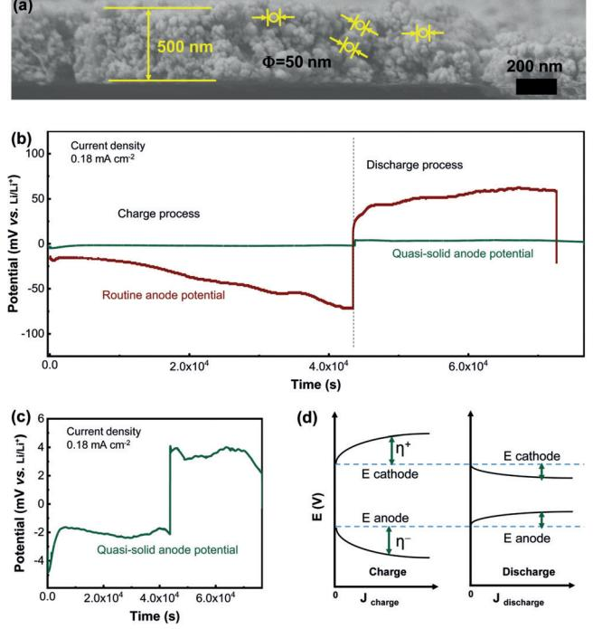
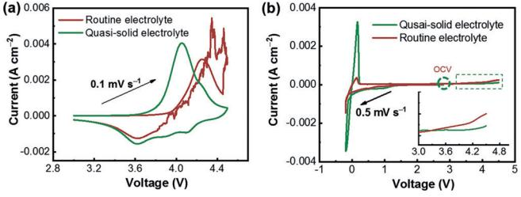
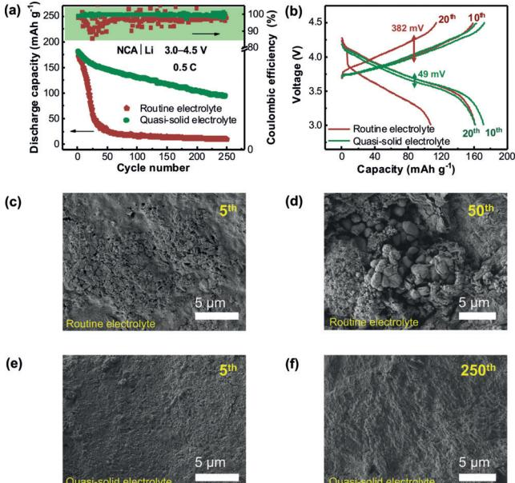
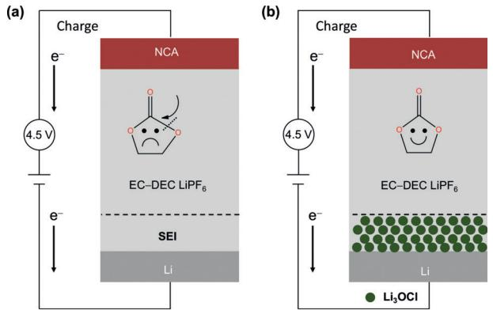

Hi Internationale Ausgabe: DOI: [10.1002/anie.201908874](http://dx.doi.org/10.1002/anie.201908874) gh-Voltage Batteries Very Important Paper Deutsche Ausgabe: DOI: [10.1002/ange.201908874](http://dx.doi.org/10.1002/ange.201908874)

## 4.5 V High-Voltage Rechargeable Batteries Enabled by the Reduction of Polarization on the Lithium Metal Anode

[Chong](http://orcid.org/0000-0001-9521-4981) Yan, Rui [Xu,](http://orcid.org/0000-0001-6439-8706) Jin-Lei Qin, Hong [Yuan,](http://orcid.org/0000-0001-7565-2204) Ye [Xiao,](http://orcid.org/0000-0001-9118-8931) Lei [Xu,](http://orcid.org/0000-0002-7349-5417) [and](http://orcid.org/0000-0002-7349-5417) Jia-Qi [Huang\\*](http://orcid.org/0000-0001-7394-9186)

Abstract: Lithium metal is used to achieve high-energy-density batteries due to its large theoretical capacity and low negative electrochemical potential. The introduction of quasi-solid electrolytes simultaneously overcomes the safety problems induced by the liquid electrolytes and the high interfacial resistance issues confronted by all solid-state electrolytes. Indepth investigations involving interfacial behaviors in quasisolid lithium metal batteries are inadequate. Herein an ultrathin Li3OCl quasi-solid-state electrolyte layer (500 nm thickness) is used to cover a lithium anode. The polarization of the anode is remarkably reduced by introducing the Li3OCl quasisolid-state electrolyte. In contrast to the decomposition of solvents in a standard electrolyte (EC-DEC,1.0m LiPF6), the established quasi-solid-state electrolyte interfaces can significantly inhibit the decomposition of solvents when the cut-off voltage is 4.5 V.

Since 1913 lithium metal has been considered as the "Holy Grail" of anodes in rechargeable batteries owing to its high theoretical capacity (3860 mAhg @1 ) and the lowest negative electrochemical potential (@3.04 V vs. standard hydrogen electrode).[1] However, the slow progress of research on lithium metal regarding safety issues in liquid electrolytes seriously hinders its practical application.[2] The investigations on lithium-metal batteries have stagnated due to the applications of graphite anodes. [3] Fortunately, the lithium anode has been revived as a result of the urgent demand for higherenergy-density energy storage systems. [4, 5] Research focusing on solid-state electrolytes simultaneously has been strongly considered[6–8] because: 1. The high melting point of solidstate electrolytes enable the battery to work normally, while it induces the combustion of the vaporized organic electrolyte in routine Li ion batteries. [9] 2. Most of the solid-state electrolytes exhibit a wide electrochemical window and are employed to match high-voltage (higher than 4.3 V) cathodes. [10] 3. The good environmental compatibility between Li electrodes and most solid-state electrolytes ensures the formation of stable interfaces, drastically reducing the continuous consumption of electrolytes. Actually, when matching with Li anode alone, there are notorious contact issues during cycling for either organic polymer electrolytes or inorganic ceramic electrolytes. [8, 11] Therefore, there is always a high interfacial resistance in all-solid-state-electrolyte batteries that hinders the demonstration of high-voltage rechargeable batteries.

Extensive efforts have been devoted to reduce the interfacial resistance. [5,12] The addition of a small amount of liquid electrolyte to solid-state electrolytes was proved as an effective method.[13] The intermediate state (mass fraction of liquid lower than 5 wt% in the composite electrolyte) between solid and liquid is denoted as the quasi-solid-state. However, the mechanism on the quasi-solid-state electrolyte interface has not been covered yet. How to distinguish the potential in two-electrode cells is an open question. A clear scenario is required to describe potential changes during charge and discharge in lithium metal systems with both routine electrolyte and quasi-solid-state electrolyte. Consequently, precisely monitoring the potential of the lithium electrode is urgently needed to probe the interfacial behavior and understand the energy chemistry at the working interfaces.

In this contribution, a 4.5 V high-voltage rechargeable battery is enabled by the reduction of polarization on a lithium metal anode. Herein a 500-nm-thick antiperovskite Li3OCl layer is coated on the surface of a lithium anode and the cathode is wetted with a lean electrolyte (0.8 mL per gram of cathode active materials) in a 4.5 V lithium metal battery. The interfacial behavior of the quasi-solid-state electrolyte is monitored by a three-electrode measurement. We propose that the quasi-solid-state electrolyte can stabilize the interfaces to achieve a high utilization rate of lithium and effectively reduce the polarization of lithium metal electrode (Figure 1). The quasi-solid-state interphase can render a high Gibbs free energy for electrochemical oxidation of electrolyte interphases and broaden the redox window of liquid electrolyte, [7] leading to a Li chemical potential of the cathode electrolyte interphase (CEI)/liquid electrolyte interface that is higher than the oxidation limit of liquid electrolyte. [14] Consequently, the decomposition of liquid electrolyte is remarkably inhibited, leading to high average Coulombic efficiency and high capacity retention rate in a 4.5 V highvoltage lithium metal battery.

The nonflammable, thickness-controllable, and lightweight features make Li3OCl[15] a potential alternative for the realization of safe and high-energy-density batteries. The synthesis and detailed related features are described in Figures S1 and S2. The spherical particles of Li3OCl are approximately 50 nm in diameter (Figure 1 a), ensuring dense stacking in the formation of a uniform protective layer. The

[\*] C. Yan, R. Xu, J.-L. Qin, Y. Xiao, L. Xu, Prof. J.-Q. Huang School of Materials Science and Engineering Beijing Institute of Technology, Beijing 100081 (P. R. China) E-mail: jqhuang@bit.edu.cn C. Yan, R. Xu, J.-L. Qin, Dr. H. Yuan, Y. Xiao, L. Xu, Prof. J.-Q. Huang

Advanced Research Institute of Multidisciplinary Science Beijing Institute of Technology, Beijing 100081 (P. R. China)

Supporting information and the ORCID identification number(s) for the author(s) of this article can be found under: [https://doi.org/10.1002/anie.201908874.](https://doi.org/10.1002/anie.201908874)

Figure 1. a) The morphology of the Li3OCl ultrathin solid-state electrolyte layer . b,c) Anode potential profiles in the quasi-solid and routine electrolyte, obtained in three-electrode configuration, the current density is 0.18 mAcm@2 . d) Correlation between presented potential and current density in the charge/discharge process.

orderly stacked Li3OCl nanoparticles effectively transport lithium ions and inhibit the growth of lithium dendrites due to the high ionic conductivity and high YoungQs modulus, respectively. Besides, the unoccupied space between spherical particles in the Li3OCl layer is filled with liquid electrolyte and lithium salts, allowing rapid diffusion of lithium ions. The transfer number of Li ions in the quasi-solid-state electrolyte is 0.67 (Figure S3), well above the value of 0.34 in routine electrolyte (volume ratio of ethylene carbonate (EC):diethyl carbonate (DEC) is 1:1, 1.0m LiPF6),[16] indicating the anions with large radius are significantly immobilized.

A three-electrode device was specially customized to precisely record the potential of the anode in a working cell. The schematic diagram of the three-electrode system is exhibited in Figure S4. The three electrodes consist of lithium foil (working electrode), lithium string (reference electrode), and a LiNi0.85Co0.1Al0.05O2 (NCA) plate (counter electrode). As a result, the overpotential was only 2 mV in quasi-solidstate electrolyte; in contrast the overpotential of the anode was 50 mV in routine electrolyte at a current density of 0.18 mAcm@2 (rate = 0.2 C), (Figure 1 b,c). The 50 mV overpotential was consistent with WinterQs report,[17] in which 50 mV is determined at 0.12 mAcm@2 . Note that when the electrochemical processes occur in a battery, the potentials of both the cathode and anode deviate away from the equilibrium potential. There is a positive correlation between the presented potential and the current density (Figure 1 d). The polarization of the anode induced by the quasi-solid-state electrolyte is sharply reduced, efficiently stabilizing the interphases and enhancing the ion transport in the solid electrolyte interphase (SEI) layer.

Cyclic voltammetry (CV) and linear sweep voltammetry (LSV) were applied to probe the details of the electrochemical behavior. The cells exhibit a typical oxidation peak when the positive scan was recorded at a scan rate of 0.1 mVs @1 . However, when the scanning voltage of the cells was above 4.46 V, the routine electrolyte started to decompose, resulting in erratic negative scan curves (Figure 2 a). The

Figure 2. Electrochemical behavior of the routine and quasi-solid state electrolytes. a) Redox behavior tested with cyclic voltammetry, the scan rate is 0.1 mVs @1 ; b) Potential window of electrolyte tested with linear sweep voltammetry, the scan rate is 0.5 mVs @1 .

quasi-solid-state electrolyte renders a stable redox reaction even when the voltage is above 4.5 V. The electrochemical behavior remains constant in successive CV scans (Figure S5). The following LSV results are also consistent with the CV profiles. The response current exhibits a sharp increase when the scanning voltage is over 4.5 V in routine electrolyte, while this does not happen in quasi-solid-state electrolyte (Figure 2 b).

It has been widely accepted that the practical potential of an electrode has contributions from the thermodynamic electrode potential, electrochemical polarization, concentration polarization, and ohmic polarization. Since the current density of the Li anode was the same in both cells, the thermodynamic electrode potential (0 V vs. Li/Li+ ) and electrochemical polarization contribute little, indicting the main factor is concentration polarization and ohmic polarization. There is a quasi-solid-state electrolyte that regulates the Li ion concentration covered on the lithium surface. This favors the rapid transport of Li ions, further reducing the concentration polarization and ohmic polarization. Therefore, the quasi-solid-state interphase with high ionic conductivity renders the high Gibbs free energy of the electrochemical oxidation of the electrolyte interphase and broadens the redox window of the liquid electrolyte. [7] As a result, the Li chemical potential of CEI/liquid electrolyte interface is higher than the oxidation limit of the liquid electrolyte, [14] and solvent molecules are in an integrated state in the quasi-solidstate electrolyte cell.Correspondingly, the solvent molecules decomposed in a routine electrolyte cell.

The quasi-solid-state electrolyte was applied in Li metal batteries to explore its electrochemical performance. When a pristine lithium anode was matched with an NCA cathode (Figure S6), improved battery performance was achieved with the employment of Li3OCl layer even at lean electrolyte conditions (0.8 mL per gram of cathode active materials). As

Figure 3. Electrochemical performance of NCAj Li batteries and morphology evolution of the lithium anode during cycles. a) The discharge capacity and Coulombic efficiency curves in routine and quasi-solid electrolytes, charge/discharge rate is 0.5 C and the voltage windows is 3.0–4.5 V. b) Polarization voltage for different cycles. c,d) Morphology of the lithium anode after the 5 th and 50th cycle in routine electrolyte, large amounts of inactive lithium is generated. e,f) Morphology of the lithium anode after the 5 th and 250th cycle in quasi-solid electrolyte, exhibiting smooth and integrated morphology.

shown in Figure 3 a, the capacity of the battery without the Li3OCl layer decreases rapidly, the Coulombic efficiency is seriously fluctuant, and the capacity even reduces to near 0 mAhg @1 after only 50 cycles at 0.5 C. In contrast, the discharge capacity of a lithium battery with 500-nm-thick Li3OCl layer (areal loading amount of 0.11 mgcm@2 ) stays at 100 mAhg @1 after 250 cycles and an average Coulombic efficiency of up to 99.7%, exhibiting a better capacity retention and higher Coulombic efficiency. The capacity– voltage profiles imply the constant overpotential during the evolution of cycling. There is only approximately 49 mV hysteresis voltage after 20 cycles, while the overpotential in routine electrolyte is up to 382 mV (Figure 3 b), indicating the quasi-solid-state electrolyte renders the rapid transport of Li ions during repeated cycles. According to SEM images of the Li anode after the fifth cycle and long-term cycling (Figure 3 c–f), the pristine Li exhibits cracks and mossy dendrites while the protected lithium exhibits a smooth morphology, indicating the highly reactive Li anode has been well protected in a working cell. In addition, electrochemical impedance spectroscopy profiles both before and after cycling exhibit reduced interfacial resistance and charge transfer resistance in the quasi-solid-state electrolyte than those with routine electrolytes (Figures S7 and S8). The products of decomposition and formation of inactive Li dendrites in routine electrolyte covered on electrodes obviously increase the interfacial resistance of the working battery. Therefore, the application of a Li3OCl layer results in long-term cycling and low resistance in the quasi-solid-state electrolyte NCA j Li battery. This corresponds to the conclusion that the quasisolid-state interphase renders the rapid transport of Li ions.

X-ray photoelectron spectroscopy (XPS) was further applied to detect the evolution of the chemical composition (Figure S9). In the Li 1s XPS spectrum, the main characteristic peaks related to Li-O (54.04 eV), Li-OH (54.42 eV), and Li-Cl (54.87 eV) always appeared and no additional peaks were observed during cycling. The bulk characteristic peaks of Li3OCl (197.39 eV for Cl 2p3/2, 199.19 eV for Cl 2p1/2) are still observed and LiCl (198.2 eV for Li-Cl 2p3/2, 198.8 eV for Li-Cl 2p1/2) is generated after the tenth cycle according to the Cl 2p XPS spectrum, indicating interfacial Li3OCl is transformed into LiCl to form a halogenated layer, which is consistent with LiangQs report.[18]

Generally, the cut-off voltage of the NCA jLi battery was 4.3 V in order to achieve stable and long-term cycling, and the structure of cathode materials and the solvents in electrolyte was kept stable. When the NCA j Li battery was cycled at a range of 3.0–4.5 V or higher and no other high-voltage additive was introduced to the electrolyte, the liquid electrolyte usually suffers from serious decomposition (Figure 4 a). In Li3OCl quasi-solid-state electrolyte, the polarization of lithium metal anode is significantly reduced, indicating rapid transport of Li ions through the SEI layer. The lower overpotential of anode renders a high Gibbs free energy of electrochemical oxidation of the electrolyte interphase, [7] leading to a large operating voltage window of the solvent molecules (Figure 4 b). Therefore, the employment of quasisolid-state ceramic interfaces benefits the long-term cycling in 4.5 V high-voltage lithium metal batteries.

In summary, high average Coulombic efficiency and a high capacity retention rate in a 4.5 V high-voltage lithium metal battery were achieved by introduction of lightweight antiperovskite solid-state electrolyte Li3OCl on lithium metal anode with a lean amount of liquid electrolyte. Compared to an allsolid-state electrolyte battery, the application of small amount of liquid electrolyte (mass fraction of liquid lower than 5 wt.%) has significantly improved interfacial contacts between electrolytes and electrodes simultaneously, resulting in an integrated buffer layer. The overpotential of lithium

Figure 4. Schematic of the influence of the reduced polarization on lithium metal anode. a) The solvent molecules in routine electrolyte decompose under 4.5 V high-voltage conditions. b) The Li3OCl quasisolid electrolyte layer that covers the lithium metal efficiently prohibits the decomposition of solvent molecules.

metal electrode was significantly reduced and the decomposition of solvent molecules was markedly inhibited. In addition, the quasi-solid-state ceramic interfaces also reduce the polarization of lithium metal anode and enhance the ion transport. The fresh understanding about quasi-solid-state interface can enrich the knowledge about interfacial chemistry, which affords valuable references to achieve a better quasi-solid-state interface and realize longer life-span lithium metal batteries.

## Acknowledgements

This work was supported by National Natural Science Foundation of China (21776019, and 21808124), National Key Research and Development Program (2016YFA0202500), Beijing Natural Science Foundation (L182021), and Beijing Key Research and Development Plan (Z181100004518001).

## Conflict of interest

The authors declare no conflict of interest.

Keywords: batteries · interfaces · lithium metal anode · quasi-solid-state electrolytes

How to cite: Angew. Chem. Int. Ed. 2019, 58, 15235– 15238 Angew. Chem. 2019, 131, 15379– 15382

- [1] G. N. Lewis, F. G. Keyes, J. Am. [Chem.](https://doi.org/10.1021/ja02193a004) Soc. 1913, 35, 340 344; X. B. Cheng, R. Zhang, C. Z. Zhao, Q. Zhang, [Chem.](https://doi.org/10.1021/acs.chemrev.7b00115) Rev. 2017, 117, 10403 [– 10473.](https://doi.org/10.1021/acs.chemrev.7b00115)
- [2] W. Xu, J. Wang, F. Ding, X. Chen, E. Nasybulin, Y. Zhang, J.-G. Zhang, Energy [Environ.](https://doi.org/10.1039/C3EE40795K) Sci. 2014, 7, 513 – 537.
- [3] M. Noel, R. Santhanam, J. [Power Sources](https://doi.org/10.1016/S0378-7753(97)02675-X) 1998, 72, 53 65.
- [4] D. C. Lin, Y. Y. Liu, Y. Cui, Nat. [Nanotechnol.](https://doi.org/10.1038/nnano.2017.16) 2017, 12, 194 [206](https://doi.org/10.1038/nnano.2017.16); C. Yan, H.-R. Li, X. Chen, X.-Q. Zhang, X.-B. Cheng, R. Xu, J.-Q. Huang, Q. Zhang, J. Am. [Chem.](https://doi.org/10.1021/jacs.9b05029) Soc. 2019, 141, 9422 – [9429.](https://doi.org/10.1021/jacs.9b05029)
- [5] C. Yang, K. Fu, Y. Zhang, E. Hitz, L. Hu, [Adv. Mater.](https://doi.org/10.1002/adma.201701169) 2017, 29, [1701169.](https://doi.org/10.1002/adma.201701169)
- [6] J. P. Yue, M. Yan, Y. X. Yin, Y. G. Guo, [Adv. Funct.](https://doi.org/10.1002/adfm.201707533) Mater. 2018, 28[, 1707533](https://doi.org/10.1002/adfm.201707533); J. C. Li, C. Ma, M. F. Chi, C. D. Liang, N. J. Dudney, [Adv. Energy](https://doi.org/10.1002/aenm.201401408) Mater. 2015, 5, 1401408; X. Lg, J. W. Howard, A. Chen, J. Zhu, S. Li, G. Wu, P. Dowden, H. Xu, Y. Zhao, Q. Jia, Adv. Sci. 2016, 3, 1500359; Z. Wei, S. Chen, J. Wang, Z. Wang, Z. Zhang, X. Yao, Y. Deng, X. Xu, J. [Power Sources](https://doi.org/10.1016/j.jpowsour.2018.05.044) 2018, 394, 57 – [66](https://doi.org/10.1016/j.jpowsour.2018.05.044); J. Shim, J. W. Lee, K. Y. Bae, H. J. Kim, W. Y. Yoon, J. C. Lee, [ChemSusChem](https://doi.org/10.1002/cssc.201700408) 2017, 10, 2274 – 2283; T. C. Liu, L. P. Lin, X. X. Bi, L. L. Tian, K. Yang, J. J. Liu, M. F. Li, Z. H. Chen, J. Lu, K. Amine, K. Xu, F. Pan, Nat. [Nanotechnol.](https://doi.org/10.1038/s41565-018-0284-y) 2019, 14, 50 – 57; C.-Z. Zhao, P.-Y. Chen, R. Zhang, X. Chen, B.-Q. Li, X.-Q. Zhang, X.- B. Cheng, Q. Zhang, Sci. Adv. 2018, 4, eaat344; X. Fan, X. Ji, F. Han, J. Yue, J. Chen, L. Chen, T. Deng, J. Jiang, C. Wang, [Sci.](https://doi.org/10.1126/sciadv.aau9245) Adv. 2018, 4[, eaau9245](https://doi.org/10.1126/sciadv.aau9245); L. Chen, L. Z. Fan, Energy [Storage](https://doi.org/10.1016/j.ensm.2018.03.015) [Mater.](https://doi.org/10.1016/j.ensm.2018.03.015) 2018, 15, 37 – 45; Y. Zhou, X. Wang, H. Zhu, M. Armand, M. Forsyth, G. W. Greene, J. M. Pringle, P. C. Howlett, [Energy](https://doi.org/10.1016/j.ensm.2018.07.017) [Storage](https://doi.org/10.1016/j.ensm.2018.07.017) Mater. 2018, 15, 407 – 414; Y. Li, H. Xu, P.-H. Chien, N. Wu, S. Xin, L. Xue, K. Park, Y.-Y. Hu, J. B. Goodenough, [Angew.](https://doi.org/10.1002/anie.201804114) [Chem.](https://doi.org/10.1002/anie.201804114) Int. Ed. 2018, 57, 8587 – 8591; [Angew. Chem.](https://doi.org/10.1002/ange.201804114) 2018, 130, 8723 [– 8727](https://doi.org/10.1002/ange.201804114).
- [7] S. Wang, H. Xu, W. Li, A. Dolocan, A. Manthiram, J. Am. [Chem.](https://doi.org/10.1021/jacs.7b09531) Soc. 2018, 140, 250 [– 257](https://doi.org/10.1021/jacs.7b09531).
- [8] Q. Zhao, X. T. Liu, S. Stalin, K. Khan, L. A. Archer, Nat. [Energy](https://doi.org/10.1038/s41560-019-0349-7) 2019, 4, 365 [– 373](https://doi.org/10.1038/s41560-019-0349-7).
- [9] J. Wang, Y. Yamada, K. Sodeyama, E. Watanabe, K. Takada, Y. Tateyama, A. Yamada, Nat. [Energy](https://doi.org/10.1038/s41560-017-0033-8) 2018, 3, 22 – 29.
- [10] K. Karthik, R. Murugan, J. Solid State [Electrochem.](https://doi.org/10.1007/s10008-018-4010-3) 2018, 22, 2989 [– 2998](https://doi.org/10.1007/s10008-018-4010-3); E. Y. Hu, X. Q. Yu, R. Q. Lin, X. X. Bi, J. Lu, S. M. Bak, K. W. Nam, H. L. L. Xin, C. Jaye, D. A. Fischer, K. Amine, X. Q. Yang, Nat. [Energy](https://doi.org/10.1038/s41560-018-0207-z) 2018, 3, 690 – 698.
- [11] M. Keller, A. Varzi, S. Passerini, J. Power [Sources](https://doi.org/10.1016/j.jpowsour.2018.04.099) 2018, 392, 206 [– 225.](https://doi.org/10.1016/j.jpowsour.2018.04.099)
- [12] L. Fan, S. Wei, S. Li, Q. Li, Y. Lu, [Adv. Energy](https://doi.org/10.1002/aenm.201702657) Mater. 2018, 8, [1702657](https://doi.org/10.1002/aenm.201702657); W. Luo, C.-F. Lin, O. Zhao, M. Noked, Y. Zhang, G. W. Rubloff, L. Hu, [Adv. Energy](https://doi.org/10.1002/aenm.201601526) Mater. 2017, 7, 1601526; H. Chen, A. Pei, D. Lin, J. Xie, A. Yang, J. Xu, K. Lin, J. Wang, H. Wang, F. Shi, D. Boyle, Y. Cui, [Adv. Energy](https://doi.org/10.1002/aenm.201900858) Mater. 2019, 9, 1900858; L. Suo, W. Xue, M. Gobet, S. G. Greenbaum, C. Wang, Y. Chen, W. Yang, Y. Li, J. Li, Proc. Natl. [Acad.](https://doi.org/10.1073/pnas.1712895115) Sci. USA 2018, 115, 1156; X. Fan, L. Chen, X. Ji, T. Deng, S. Hou, J. Chen, J. Zheng, F. Wang, J. Jiang, K. Xu, C. Wang, [Chem](https://doi.org/10.1016/j.chempr.2017.10.017) 2018, 4, 174 – 185; Q. Pang, X. Liang, I. R. Kochetkov, P. Hartmann, L. F. Nazar, [Angew. Chem.](https://doi.org/10.1002/anie.201805456) Int. Ed. 2018, 57, 9795 [– 9798](https://doi.org/10.1002/anie.201805456); [Angew. Chem.](https://doi.org/10.1002/ange.201805456) 2018, 130, 9943 – [9946](https://doi.org/10.1002/ange.201805456); K. Liao, S. Wu, X. Mu, Q. Lu, M. Han, P. He, Z. Shao, H. Zhou, [Adv. Mater.](https://doi.org/10.1002/adma.201705711) 2018, 30, 1705711; H. Ye, Z.-J. Zheng, H.-R. Yao, S.-C. Liu, T.-T. Zuo, X.-W. Wu, Y.-X. Yin, N.-W. Li, J.-J. Gu, F.-F. Cao, Y.-G. Guo, [Angew. Chem.](https://doi.org/10.1002/anie.201811955) Int. Ed. 2019, 58, 1094 – [1099](https://doi.org/10.1002/anie.201811955); [Angew. Chem.](https://doi.org/10.1002/ange.201811955) 2019, 131, 1106 – 1111.
- [13] X. Chen, W. He, L.-X. Ding, S. Wang, H. Wang, Energy [Environ.](https://doi.org/10.1039/C8EE02617C) Sci. 2019, 12, 938 [– 944](https://doi.org/10.1039/C8EE02617C); T.-T. Zuo, Y. Shi, X.-W. Wu, P.-F. Wang, S.-H. Wang, Y.-X. Yin, W.-P. Wang, Q. Ma, X.-X. Zeng, H. Ye, R. Wen, Y.-G. Guo, ACS Appl. [Mater. Interfaces](https://doi.org/10.1021/acsami.8b12986) 2018, 10, 30065 – [30070](https://doi.org/10.1021/acsami.8b12986); T. Xu, J. Sun, S. Yi, D. Wang, Y. Li, Q. Pei, D. Pan, H. Zhao, Y. Bai, Solid State [Ionics](https://doi.org/10.1016/j.ssi.2018.09.020) 2018, 326, 110 – 115; S. Venkatesan, I. P. Liu, J.-C. Lin, M.-H. Tsai, H. Teng, Y.-L. Lee, J. [Mater. Chem.](https://doi.org/10.1039/C8TA01729H) A 2018, 6, 10085 – 10094; P. Zhang, M. Li, B. Yang, Y. Fang, X. Jiang, G. M. Veith, X.-G. Sun, S. Dai, [Adv.](https://doi.org/10.1002/adma.201502855) [Mater.](https://doi.org/10.1002/adma.201502855) 2015, 27, 8088 – 8094; J. A. Lewis, F. J. Q. Cortes, M. G. Boebinger, J. Tippens, T. S. Marchese, N. Kondekar, X. Liu, M. Chi, M. T. McDowell, [ACS Energy](https://doi.org/10.1021/acsenergylett.9b00093) Lett. 2019, 4, 591 – 599; C. Yan, Y. X. Yao, X. Chen, X. B. Cheng, X. Q. Zhang, J. Q. Huang, Q. Zhang, [Angew. Chem.](https://doi.org/10.1002/anie.201807034) Int. Ed. 2018, 57, 14055 – 14059; [Angew. Chem.](https://doi.org/10.1002/ange.201807034) 2018, 130, 14251 – 14255; X.-Q. Zhang, X. Chen, X.-B. Cheng, B.-Q. Li, X. Shen, C. Yan, J.-Q. Huang, Q. Zhang, [Angew. Chem.](https://doi.org/10.1002/anie.201801513) Int. Ed. 2018, 57, 5301 – 5305; [Angew. Chem.](https://doi.org/10.1002/ange.201801513) 2018, 130, 5399 [– 5403](https://doi.org/10.1002/ange.201801513); F. Qiu, X. Li, H. Deng, D. Wang, X. Mu, P. He, H. Zhou, Adv. Energy Mater. 2018, 8, 1803372; S. Chen, J. Zheng, D. Mei, K. S. Han, M. H. Engelhard, W. Zhao, W. Xu, J. Liu, J.-G. Zhang, [Adv. Mater.](https://doi.org/10.1002/adma.201706102) 2018, 30, 1706102; H. Zhang, G. G. Eshetu, X. Judez, C. Li, L. M. Rodriguez-Mart&nez, M. Armand, [Angew. Chem.](https://doi.org/10.1002/anie.201712702) Int. Ed. 2018, 57, 15002 – 15027; [Angew. Chem.](https://doi.org/10.1002/ange.201712702) 2018, 130, 15220 [– 15246](https://doi.org/10.1002/ange.201712702).
- [14] T. Nakamura, K. Amezawa, J. Kulisch, W. G. Zeier, J. Janek, ACS Appl. [Mater. Interfaces](https://doi.org/10.1021/acsami.9b03053) 2019, 11, 19968 – 19976.
- [15] Y. Zhao, L. L. Daemen, J. Am. Chem. Soc. 2012, 134[, 15042](https://doi.org/10.1021/ja305709z) [15047](https://doi.org/10.1021/ja305709z).
- [16] K. M. Diederichsen, E. J. McShane, B. D. McCloskey, [ACS](https://doi.org/10.1021/acsenergylett.7b00792) [Energy](https://doi.org/10.1021/acsenergylett.7b00792) Lett. 2017, 2, 2563 – 2575.
- [17] J. Betz, J. P. Brinkmann, R. Nolle, C. Lurenbaum, M. Kolek, M. C. Stan, M. Winter, T. Placke, [Adv. Energy](https://doi.org/10.1002/aenm.201900574) Mater. 2019, 9, [1900574](https://doi.org/10.1002/aenm.201900574).
- [18] Z. D. Hood, H. Wang, A. S. Pandian, J. K. Keum, C. Liang, [J.](https://doi.org/10.1021/jacs.5b11851) Am. [Chem.](https://doi.org/10.1021/jacs.5b11851) Soc. 2016, 138, 1768 – 1771.

Manuscript received: July 16, 2019 Accepted manuscript online: August 5, 2019 Version of record online: August 27, 2019

15382 [www.angewandte.de](http://www.angewandte.de) T 2019 Wiley-VCH Verlag GmbH & Co. KGaA, Weinheim Angew. Chem. 2019, 131, 15379 –15382